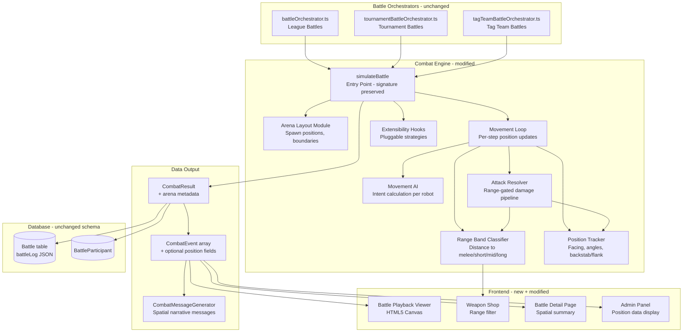
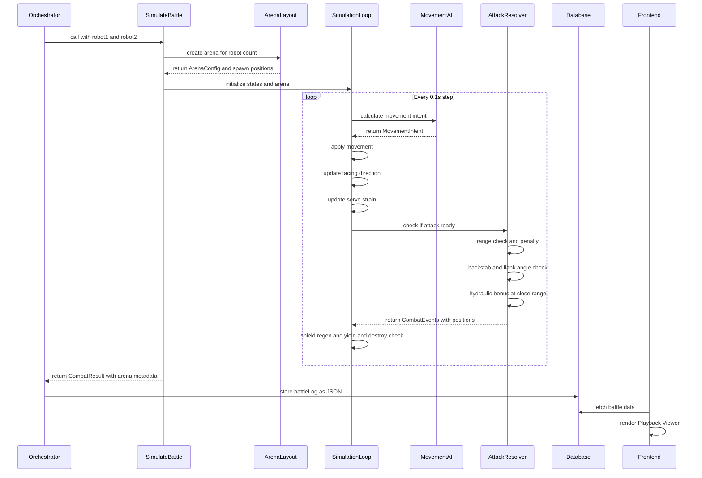
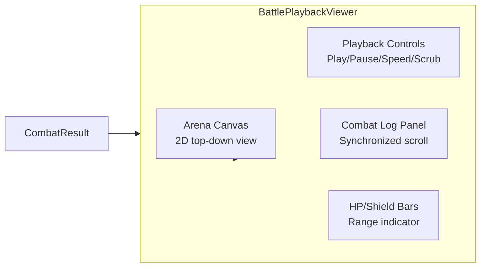

# Design Document: 2D Combat Arena

## Overview

The 2D Combat Arena transforms Armoured Souls' battle simulation from a stationary exchange-of-blows model into a spatially-aware combat system where robots occupy positions on a circular 2D arena, move continuously, and must respect weapon range constraints. This redesign activates 9 previously inert attributes (servoMotors, hydraulicSystems, combatAlgorithms, threatAnalysis, adaptiveAI, logicCores, syncProtocols, supportSystems, formationTactics) by giving them concrete mechanical roles in movement, positioning, target selection, and tactical adaptation.

The system preserves the existing `simulateBattle(robot1, robot2, isTournament?)` pure function signature and `CombatResult` interface contract, ensuring zero-change backward compatibility with the three orchestrators (league, tournament, tag team). Position data is added as optional fields on `CombatEvent`, so existing consumers degrade gracefully. The architecture is designed for extensibility to future game modes (battle royale, king of the hill) via pluggable strategies for targeting, movement, and win conditions.

The implementation targets the existing Scaleway DEV1-S VPS (2 vCPU, 2GB RAM), so performance is a first-class concern — the simulation loop must remain fast enough to process dozens of battles per cycle without blocking, and event volume from per-tick position tracking must be managed carefully.

---

## Architecture

### High-Level System Diagram



### Data Flow: Battle Lifecycle



### Module Decomposition

The 2D arena logic is organized into focused, testable modules within the combat engine:

| Module | Responsibility | Pure? |
|--------|---------------|-------|
| `arenaLayout.ts` | Arena creation, spawn positions, boundary math | Yes |
| `vector2d.ts` | 2D math utilities (distance, angle, normalize, clamp) | Yes |
| `rangeBands.ts` | Distance → range band classification, penalty lookup, weapon range mapping | Yes |
| `movementAI.ts` | Movement intent calculation per robot per tick | Yes |
| `positionTracker.ts` | Facing direction, turn speed, backstab/flank detection | Yes |
| `servoStrain.ts` | Strain accumulation, decay, speed reduction | Yes |
| `adaptationTracker.ts` | Adaptive AI bonus tracking | Yes |
| `pressureSystem.ts` | Logic cores composure under pressure | Yes |
| `combatSimulator.ts` | Main loop orchestration (modified, still pure) | Yes |
| `extensibility.ts` | Strategy interfaces for targeting, movement, win conditions | Types only |

All modules are pure functions with no module-level mutable state, preserving the existing guarantee that `simulateBattle()` is a pure function.

---

## Components and Interfaces

### Core Spatial Types

```typescript
/** 2D position in arena grid units */
interface Position {
  x: number;
  y: number;
}

/** 2D direction vector (normalized or raw) */
interface Vector2D {
  x: number;
  y: number;
}

/** Range band classification */
type RangeBand = 'melee' | 'short' | 'mid' | 'long';

/** Range band boundaries in grid units */
const RANGE_BAND_BOUNDARIES = {
  melee: { min: 0, max: 2 },
  short: { min: 3, max: 6 },
  mid:   { min: 7, max: 12 },
  long:  { min: 13, max: Infinity },
} as const;

/** Weapon optimal range mapping by weapon category */
interface WeaponRangeMapping {
  weaponType: string;       // 'melee' | 'energy' | 'ballistic' | 'shield'
  handsRequired: string;    // 'one' | 'two' | 'shield'
  weaponName: string;       // For special cases (sniper, railgun, ion beam)
  optimalRange: RangeBand;
}

/** Range penalty multipliers */
const RANGE_PENALTY = {
  optimal: 1.1,       // Within optimal range: +10% bonus
  oneAway: 0.75,      // One band away: -25%
  twoOrMore: 0.5,     // Two+ bands away: -50%
} as const;
```

### Arena Configuration

```typescript
/** Arena setup for a battle */
interface ArenaConfig {
  radius: number;           // Arena radius in grid units
  center: Position;         // Always {x: 0, y: 0} (origin-centered)
  spawnPositions: Position[]; // Starting positions per robot
  zones?: ArenaZone[];      // Optional zones for future game modes
}

/** Arena zone for future extensibility (Req 16) */
interface ArenaZone {
  id: string;
  center: Position;
  radius: number;
  effect: 'damage_amp' | 'healing' | 'control_point' | 'custom';
  multiplier?: number;      // e.g., 1.2 for 20% damage amp
}

/** Default arena radius scaling */
function calculateArenaRadius(totalRobots: number, overrideRadius?: number): number {
  if (overrideRadius !== undefined) return overrideRadius;
  if (totalRobots <= 2) return 16;       // 1v1: 32 unit diameter
  if (totalRobots <= 4) return 20;       // 2v2: 40 unit diameter
  return 16 + (totalRobots - 2) * 3;    // 5v5 = 40 unit radius
}
```

### Extended Robot Combat State

```typescript
/** Extended combat state with spatial tracking */
interface RobotCombatState {
  // === Existing fields (preserved) ===
  robot: RobotWithWeapons;
  currentHP: number;
  maxHP: number;
  currentShield: number;
  maxShield: number;
  lastAttackTime: number;
  lastOffhandAttackTime: number;
  attackCooldown: number;
  offhandCooldown: number;
  totalDamageDealt: number;
  totalDamageTaken: number;

  // === New spatial fields ===
  position: Position;                // Current (x, y) in arena
  facingDirection: number;           // Angle in degrees (0 = right, 90 = up)
  velocity: Vector2D;               // Current movement vector (units/s)
  movementSpeed: number;            // Base movement speed (units/s)
  effectiveMovementSpeed: number;   // After strain, stance, bonuses

  // === Servo strain (Req 2) ===
  servoStrain: number;              // 0-30%, reduces effective speed
  sustainedMovementTime: number;    // Seconds at >80% speed
  isUsingClosingBonus: boolean;     // Melee closing bonus active

  // === AI state ===
  movementIntent: MovementIntent;   // Current movement target
  currentTarget: number | null;     // Target robot index (for multi-robot)
  patienceTimer: number;            // Seconds since last attack
  combatAlgorithmScore: number;     // combatAlgorithms / 50 (0.0-1.0)

  // === Adaptation (Req 7) ===
  adaptationHitBonus: number;       // Accumulated hit chance bonus
  adaptationDamageBonus: number;    // Accumulated damage bonus
  hitsTaken: number;                // Count of hits received
  missCount: number;                // Count of missed attacks

  // === Pressure system (Req 8) ===
  pressureThreshold: number;        // HP% where pressure activates
  isUnderPressure: boolean;         // Currently below threshold

  // === Team (Req 12-13) ===
  teamIndex: number;                // 0 or 1 (which team)
  isAlive: boolean;                 // Still in the fight
}

/** Movement intent computed by AI each tick */
interface MovementIntent {
  targetPosition: Position;         // Where the robot wants to go
  strategy: 'random_bias' | 'direct_path' | 'calculated_path';
  preferredRange: RangeBand;        // Desired range band
  stanceSpeedModifier: number;      // -0.2 defensive, +0.1 offensive, 0 balanced
}

/** Threat score for target selection (Req 6) */
interface ThreatScore {
  robotIndex: number;
  score: number;
  factors: {
    combatPower: number;
    hpPercentage: number;
    weaponThreat: number;
    distance: number;
    proximityDecay: number;
    isTargetingMe: boolean;
  };
}
```

### Extended CombatEvent (Backward Compatible)

```typescript
/** Extended CombatEvent — all new fields are optional */
interface CombatEvent {
  // === Existing fields (all preserved) ===
  timestamp: number;
  type: 'attack' | 'miss' | 'critical' | 'counter' | 'shield_break'
      | 'shield_regen' | 'yield' | 'destroyed' | 'malfunction'
      // New event types:
      | 'movement' | 'range_transition' | 'out_of_range'
      | 'counter_out_of_range' | 'backstab' | 'flanking';
  attacker?: string;
  defender?: string;
  weapon?: string;
  hand?: 'main' | 'offhand';
  damage?: number;
  shieldDamage?: number;
  hpDamage?: number;
  hit?: boolean;
  critical?: boolean;
  counter?: boolean;
  malfunction?: boolean;
  robot1HP?: number;
  robot2HP?: number;
  robot1Shield?: number;
  robot2Shield?: number;
  message: string;
  formulaBreakdown?: FormulaBreakdown;

  // === New optional position fields (Req 14, 15) ===
  positions?: Record<string, Position>;  // robotName → {x, y}
  facingDirections?: Record<string, number>; // robotName → degrees
  distance?: number;                     // Distance between attacker/defender
  rangeBand?: RangeBand;                 // Current range band
  rangePenalty?: number;                 // Applied range multiplier
  backstab?: boolean;                    // Was this a backstab attack
  flanking?: boolean;                    // Was this a flanking attack
  attackAngle?: number;                  // Angle of attack relative to facing
}
```

### Extended CombatResult (Backward Compatible)

```typescript
interface CombatResult {
  // === Existing fields (all preserved) ===
  winnerId: number | null;
  robot1FinalHP: number;
  robot2FinalHP: number;
  robot1FinalShield: number;
  robot2FinalShield: number;
  robot1Damage: number;
  robot2Damage: number;
  robot1DamageDealt: number;
  robot2DamageDealt: number;
  durationSeconds: number;
  isDraw: boolean;
  events: CombatEvent[];

  // === New optional arena metadata (Req 15) ===
  arenaRadius?: number;
  startingPositions?: Record<string, Position>;
  endingPositions?: Record<string, Position>;
}
```


### Extensibility Interfaces (Req 16)

```typescript
/** Pluggable target priority strategy */
interface TargetPriorityStrategy {
  /**
   * Given a robot's state and all opponents, return sorted target indices.
   * Default: threatAnalysis-based scoring.
   * Zone control override: factors in zone proximity and contestation.
   */
  selectTargets(
    robot: RobotCombatState,
    opponents: RobotCombatState[],
    arena: ArenaConfig,
    gameState?: GameModeState
  ): number[];
}

/** Pluggable movement intent modifier */
interface MovementIntentModifier {
  /**
   * Modify the base movement intent for game-mode-specific behavior.
   * Default: no modification (pass-through).
   * Zone control: biases toward control zone when no combat threat.
   */
  modify(
    baseIntent: MovementIntent,
    robot: RobotCombatState,
    arena: ArenaConfig,
    gameState?: GameModeState
  ): MovementIntent;
}

/** Pluggable win condition evaluator */
interface WinConditionEvaluator {
  /**
   * Check if the battle should end and who won.
   * Default: last team standing.
   * Zone control: point accumulation threshold.
   */
  evaluate(
    teams: RobotCombatState[][],
    currentTime: number,
    gameState?: GameModeState
  ): { ended: boolean; winnerId: number | null; reason: string } | null;
}

/** Game mode state for extensibility */
interface GameModeState {
  mode: 'elimination' | 'zone_control' | 'battle_royale' | 'custom';
  zoneScores?: Record<number, number>;  // teamIndex → points
  customData?: Record<string, unknown>;
}

/** Complete game mode configuration */
interface GameModeConfig {
  targetPriority?: TargetPriorityStrategy;
  movementModifier?: MovementIntentModifier;
  winCondition?: WinConditionEvaluator;
  arenaZones?: ArenaZone[];
  maxDuration?: number;  // Override MAX_BATTLE_DURATION
}
```

---

## Data Models

### Weapon Range Classification

Weapons are classified into optimal range bands based on their category and specific identity. This mapping is deterministic and derived from the weapon's `weaponType`, `handsRequired`, and `name` fields already present in the `Weapon` model.

```typescript
function getWeaponOptimalRange(weapon: Weapon): RangeBand {
  // Melee weapons → melee band
  if (weapon.weaponType === 'melee') return 'melee';

  // Shield weapons → melee band (defensive, close-range)
  if (weapon.weaponType === 'shield') return 'melee';

  // Long-range specialists (by name)
  const longRangeWeapons = ['Sniper Rifle', 'Railgun', 'Ion Beam'];
  if (longRangeWeapons.includes(weapon.name)) return 'long';

  // Two-handed ranged → mid band
  if (weapon.handsRequired === 'two') return 'mid';

  // One-handed energy/ballistic → short band
  return 'short';
}
```

This produces the following mapping for all 26 weapons:

| Weapon | Type | Hands | Optimal Range |
|--------|------|-------|---------------|
| Practice Sword | melee | one | melee |
| Combat Knife | melee | one | melee |
| Energy Blade | melee | one | melee |
| Plasma Blade | melee | one | melee |
| Power Sword | melee | one | melee |
| Battle Axe | melee | two | melee |
| Heavy Hammer | melee | two | melee |
| Practice Blaster | ballistic | one | short |
| Laser Pistol | energy | one | short |
| Machine Pistol | ballistic | one | short |
| Machine Gun | ballistic | one | short |
| Burst Rifle | ballistic | one | short |
| Assault Rifle | ballistic | one | short |
| Laser Rifle | energy | one | short |
| Plasma Rifle | energy | one | short |
| Training Rifle | ballistic | two | mid |
| Shotgun | ballistic | two | mid |
| Grenade Launcher | ballistic | two | mid |
| Plasma Cannon | energy | two | mid |
| Training Beam | energy | two | long |
| Sniper Rifle | ballistic | two | long |
| Railgun | ballistic | two | long |
| Ion Beam | energy | two | long |
| Light Shield | shield | shield | melee |
| Combat Shield | shield | shield | melee |
| Reactive Shield | shield | shield | melee |

### Database Impact

No schema changes are required. The `Battle.battleLog` field is already a `Json` type that stores the complete event array. The new position fields on `CombatEvent` and arena metadata on `CombatResult` are stored within this existing JSON structure. The `BattleParticipant` table continues to track per-robot aggregate stats unchanged.

The `Weapon` model already contains `weaponType`, `handsRequired`, and `name` — all fields needed for range classification. No new columns are needed.

### Arena Spawn Position Calculation

```typescript
/** Calculate spawn positions for a battle */
function calculateSpawnPositions(
  teamSizes: number[],  // e.g., [1, 1] for 1v1, [2, 2] for 2v2
  radius: number
): Position[][] {
  const spawnOffset = radius - 2; // 2 units from edge
  const teams: Position[][] = [];

  for (let teamIdx = 0; teamIdx < teamSizes.length; teamIdx++) {
    const teamPositions: Position[] = [];
    const teamCount = teamSizes[teamIdx];
    // Team 0 on left (-x), Team 1 on right (+x)
    const xSign = teamIdx === 0 ? -1 : 1;

    if (teamCount === 1) {
      // Single robot: on horizontal axis
      teamPositions.push({ x: xSign * spawnOffset, y: 0 });
    } else {
      // Multiple robots: spread vertically, 4 units apart
      const totalSpread = (teamCount - 1) * 4;
      const startY = -totalSpread / 2;
      for (let i = 0; i < teamCount; i++) {
        teamPositions.push({
          x: xSign * spawnOffset,
          y: startY + i * 4,
        });
      }
    }
    teams.push(teamPositions);
  }
  return teams;
}
```

For 1v1: Robot 1 at (-14, 0), Robot 2 at (14, 0) — 28 units apart (long range).
For 2v2 (radius 20): Team 1 at (-18, -2) and (-18, 2), Team 2 at (18, -2) and (18, 2).

---

## Algorithm Design

### 1. Movement Speed Calculation (Req 2)

```
baseSpeed = 7.0 + servoMotors × 0.2
// Range: 7.2 (servoMotors=1) to 17.0 (servoMotors=50)

// Stance modifiers (Req 10)
if stance == 'defensive': speedModifier = 0.80  // -20%
if stance == 'offensive': speedModifier = 1.10  // +10%
if stance == 'balanced':  speedModifier = 1.00

// Servo strain reduction (Req 2 AC6)
strainReduction = 1.0 - (servoStrain / 100)  // servoStrain capped at 30

// Melee closing bonus (Req 2 AC5) — exempt from strain
if hasMeleeWeapon AND distance > 2 AND opponentHasRangedWeapon:
  speedGap = max(0, opponentSpeed - baseSpeed)
  closingBonus = 1.15 + speedGap * 0.01  // +15% base + 1% per speed diff
  effectiveSpeed = baseSpeed * speedModifier * closingBonus
  // Closing bonus does NOT accumulate strain
else:
  effectiveSpeed = baseSpeed * speedModifier * strainReduction

// Per tick movement
maxMovement = effectiveSpeed * SIMULATION_TICK  // × 0.1
```

### 2. Servo Strain System (Req 2 AC6)

```
// Each tick (0.1s):
currentSpeedRatio = actualMovementThisTick / (maxMovementSpeed * SIMULATION_TICK)

if currentSpeedRatio > 0.80 AND NOT isUsingClosingBonus:
  sustainedMovementTime += SIMULATION_TICK
  if sustainedMovementTime > 3.0:  // After 3 seconds of sustained movement
    servoStrain += 2.0 * SIMULATION_TICK  // +2% per second = +0.2% per tick
    servoStrain = min(servoStrain, 30)     // Cap at 30%
else:
  sustainedMovementTime = max(0, sustainedMovementTime - SIMULATION_TICK)

// Strain decay when slow or stationary
if currentSpeedRatio < 0.50:
  servoStrain -= 5.0 * SIMULATION_TICK  // -5% per second = -0.5% per tick
  servoStrain = max(servoStrain, 0)
```

### 3. Movement AI Decision Framework (Req 5, 10)

```
function calculateMovementIntent(state, opponents, arena):
  score = state.combatAlgorithmScore  // combatAlgorithms / 50

  // Step 1: Determine preferred range
  preferredRange = getPreferredRange(state)

  // Step 2: Select movement strategy based on score
  if score < 0.3:
    strategy = 'random_bias'
    // Semi-random: move toward opponent with ±30° deviation
    deviation = random(-30, 30)
    targetPos = rotateVector(directionToOpponent, deviation)

  else if score <= 0.6:
    strategy = 'direct_path'
    // Direct path to optimal range position
    // ±15° deviation for mid-range AI
    deviation = random(-15, 15)
    targetPos = calculateOptimalRangePosition(state, target, preferredRange)
    targetPos = rotateVector(targetPos, deviation)

  else:  // score > 0.6
    strategy = 'calculated_path'
    // No deviation, considers approach angles and boundary
    targetPos = calculateOptimalRangePosition(state, target, preferredRange)

    // Movement prediction (Req 5 AC3)
    if score >= 0.4:
      predictionWeight = (score - 0.4) / 0.6  // 0% at 0.4, 100% at 1.0
      predictedPos = target.position + target.velocity * lookAheadTime
      targetPos = lerp(targetPos, predictedPos, predictionWeight)

    // Threat-aware positioning (Req 6 AC3)
    if threatAnalysis > 15:
      avoidanceWeight = (threatAnalysis - 15) / 35  // 0% at 15, 100% at 50
      opponentOptimalRange = getWeaponOptimalRange(target.robot.mainWeapon)
      if opponentOptimalRange conflicts with preferredRange:
        targetPos = applyAvoidanceBias(targetPos, target, avoidanceWeight)

    // Flank/rear approach (Req 10 AC9)
    if threatAnalysis > 20 AND hasSpeedAdvantage:
      targetPos = biasTowardFlank(targetPos, target)

  // Step 3: Patience timer check (Req 5 AC7)
  patienceLimit = 15 - score * 5  // 15s at score=0, 10s at score=1
  if state.patienceTimer >= patienceLimit:
    // Force attack at current range
    strategy = 'force_attack'

  return { targetPosition: targetPos, strategy, preferredRange }
```

### 4. Preferred Range Calculation (Req 10)

```
function getPreferredRange(state):
  mainWeapon = state.robot.mainWeapon?.weapon
  offhandWeapon = state.robot.offhandWeapon?.weapon
  loadout = state.robot.loadoutType

  // Single weapon or weapon+shield: use main weapon's range
  if loadout == 'single' OR loadout == 'weapon_shield' OR loadout == 'two_handed':
    if mainWeapon:
      return getWeaponOptimalRange(mainWeapon)
    return 'short'  // Default for unarmed

  // Dual wield: check if mixed ranges
  if loadout == 'dual_wield' AND mainWeapon AND offhandWeapon:
    mainRange = getWeaponOptimalRange(mainWeapon)
    offhandRange = getWeaponOptimalRange(offhandWeapon)

    if mainRange == offhandRange:
      return mainRange  // Same range, no conflict

    // Mixed loadout: DPS-weighted compromise (Req 10 AC4)
    mainDPS = mainWeapon.baseDamage / mainWeapon.cooldown
    offhandDPS = offhandWeapon.baseDamage / offhandWeapon.cooldown
    totalDPS = mainDPS + offhandDPS
    mainWeight = mainDPS / totalDPS

    // Dynamic adjustment for high combat algorithm score (Req 10 AC5)
    if state.combatAlgorithmScore > 0.5:
      target = state.currentTarget
      if target AND target.currentShield <= 0:
        // Opponent shield depleted: bias toward melee for burst
        mainWeight = max(mainWeight, 0.7)
      else if target AND target.currentShield > target.maxShield * 0.5:
        // Opponent has strong shields: bias toward ranged for chip
        mainWeight = min(mainWeight, 0.3)

    // Return the range of the higher-weighted weapon
    if mainWeight >= 0.5:
      return mainRange
    return offhandRange

  return 'short'  // Fallback
```

### 5. Range Band Classification and Penalty (Req 3)

```
function classifyRangeBand(distance: number): RangeBand {
  if distance <= 2: return 'melee'
  if distance <= 6: return 'short'
  if distance <= 12: return 'mid'
  return 'long'
}

function getRangePenalty(weaponRange: RangeBand, currentRange: RangeBand): number {
  const bandOrder = ['melee', 'short', 'mid', 'long']
  const weaponIdx = bandOrder.indexOf(weaponRange)
  const currentIdx = bandOrder.indexOf(currentRange)
  const bandDiff = Math.abs(weaponIdx - currentIdx)

  if bandDiff == 0: return 1.1   // Optimal: +10% bonus
  if bandDiff == 1: return 0.75  // One band away: -25%
  return 0.5                      // Two+ bands away: -50%
}

// Special case: melee weapons cannot attack beyond melee range
function canAttack(weapon, distance):
  if weapon.weaponType == 'melee' AND distance > 2:
    return false  // Emit 'out_of_range' event
  return true
```

### 6. Facing Direction and Turn Speed (Req 9)

```
function calculateTurnSpeed(gyroStabilizers: number): number {
  return 180 + gyroStabilizers * 6  // degrees per second
  // Range: 186°/s (gyro=1) to 480°/s (gyro=50)
}

function updateFacing(state, targetPosition, deltaTime):
  desiredAngle = atan2(
    targetPosition.y - state.position.y,
    targetPosition.x - state.position.x
  ) * (180 / PI)

  angleDiff = normalizeAngle(desiredAngle - state.facingDirection)
  maxTurn = state.turnSpeed * deltaTime  // degrees this tick

  // Predictive turn bias (Req 9 AC6)
  if state.robot.threatAnalysis > 20:
    // Check if opponent is moving toward rear arc
    opponentMovingToRear = isMovingTowardRearArc(state, opponent)
    if opponentMovingToRear:
      biasStrength = 0.5 + (threatAnalysis - 20) * 0.015
      // Pre-rotate toward flanking attacker
      maxTurn *= (1 + biasStrength)

  if abs(angleDiff) <= maxTurn:
    state.facingDirection = desiredAngle
  else:
    state.facingDirection += sign(angleDiff) * maxTurn

  state.facingDirection = normalizeAngle(state.facingDirection)
```

### 7. Backstab Detection (Req 9 AC4-5)

```
function checkBackstab(attacker, defender):
  // Calculate angle between attacker position and defender facing
  attackVector = attacker.position - defender.position
  attackAngle = atan2(attackVector.y, attackVector.x) * (180 / PI)

  // Angle difference from defender's facing direction
  angleDiff = abs(normalizeAngle(attackAngle - defender.facingDirection))

  // Backstab: attacker is >120° from defender's facing (behind)
  if angleDiff > 120:
    baseBonusDamage = 0.10  // +10%
    // Reduce by defender's gyro (Req 9 AC5)
    gyroReduction = defender.robot.gyroStabilizers * 0.0025  // 0.25% per point
    // Reduce by defender's threat analysis (Req 9 AC9)
    taReduction = 0
    if defender.robot.threatAnalysis > 25:
      taReduction = (defender.robot.threatAnalysis - 25) * 0.01
    effectiveBonus = max(0, baseBonusDamage - gyroReduction - taReduction)
    return { isBackstab: true, bonus: effectiveBonus, angle: angleDiff }

  return { isBackstab: false, bonus: 0, angle: angleDiff }
```

### 8. Flanking Detection (Req 9 AC7-8, Multi-Robot Only)

```
function checkFlanking(attackers: RobotCombatState[], defender: RobotCombatState):
  if attackers.length < 2: return { isFlanking: false }

  // Calculate angles from each attacker to defender
  angles = attackers.map(a => {
    vec = a.position - defender.position
    return atan2(vec.y, vec.x) * (180 / PI)
  })

  // Check if any pair of attackers are >90° apart
  for i in range(angles.length):
    for j in range(i+1, angles.length):
      angleBetween = abs(normalizeAngle(angles[i] - angles[j]))
      if angleBetween > 90:
        baseBonusDamage = 0.20  // +20%
        // Reduce by defender's gyro (Req 9 AC8)
        gyroReduction = defender.robot.gyroStabilizers * 0.003  // 0.3% per point
        // Reduce by defender's threat analysis (Req 9 AC9)
        taReduction = 0
        if defender.robot.threatAnalysis > 25:
          taReduction = (defender.robot.threatAnalysis - 25) * 0.01
        effectiveBonus = max(0, baseBonusDamage - gyroReduction - taReduction)
        return { isFlanking: true, bonus: effectiveBonus, flankingAttackers: [i, j] }

  return { isFlanking: false }
```

### 9. Hydraulic Systems Proximity Bonus (Req 4)

```
function calculateHydraulicBonus(hydraulicSystems: number, rangeBand: RangeBand): number {
  if rangeBand == 'melee':
    return 1 + hydraulicSystems * 0.03
    // Range: 1.03 (hydro=1) to 2.5 (hydro=50)
  if rangeBand == 'short':
    return 1 + hydraulicSystems * 0.015
    // Range: 1.015 (hydro=1) to 1.75 (hydro=50)
  return 1.0  // No bonus at mid/long range
}
```

### 10. Adaptive AI Bonus Tracking (Req 7)

```
function updateAdaptation(state, event):
  ai = state.robot.adaptiveAI

  if event == 'damage_taken':
    state.adaptationHitBonus += ai * 0.02    // % hit chance per hit
    state.adaptationDamageBonus += ai * 0.01 // % damage per hit

  if event == 'miss':
    state.adaptationHitBonus += ai * 0.03    // % hit chance per miss

  // Cap (Req 7 AC4)
  maxHitBonus = ai * 0.5
  maxDamageBonus = ai * 0.25
  state.adaptationHitBonus = min(state.adaptationHitBonus, maxHitBonus)
  state.adaptationDamageBonus = min(state.adaptationDamageBonus, maxDamageBonus)

function getEffectiveAdaptation(state):
  hpPercent = state.currentHP / state.maxHP
  // Winning robots get reduced benefit (Req 7 AC5)
  effectiveness = hpPercent > 0.70 ? 0.5 : 1.0
  return {
    hitBonus: state.adaptationHitBonus * effectiveness,
    damageBonus: state.adaptationDamageBonus * effectiveness,
  }
```

### 11. Logic Cores Pressure System (Req 8)

```
function calculatePressureEffects(state):
  lc = state.robot.logicCores
  pressureThreshold = 15 + lc * 0.6  // % HP
  hpPercent = (state.currentHP / state.maxHP) * 100

  if hpPercent >= pressureThreshold:
    return { accuracyMod: 0, damageMod: 0 }  // Not under pressure

  // Base penalties (Req 8 AC1)
  accuracyPenalty = max(0, 15 - lc * 0.5)
  damagePenalty = max(0, 10 - lc * 0.33)

  // Death spiral cap for low logic cores (Req 8 AC4)
  if lc < 10:
    accuracyPenalty = min(accuracyPenalty, 10)
    damagePenalty = min(damagePenalty, 8)

  // Composure bonus for high logic cores (Req 8 AC2)
  composureBonus = 0
  if lc > 30:
    composureBonus = (lc - 30) * 0.5

  return {
    accuracyMod: -accuracyPenalty + composureBonus,
    damageMod: -damagePenalty + composureBonus,
  }
```

### 12. Threat Score Calculation (Req 6)

```
function calculateThreatScore(robot, opponent, distance, arenaRadius):
  ta = robot.threatAnalysis

  // Base threat from combat power
  combatPowerThreat = opponent.combatPower * 2

  // HP-based urgency (low HP = lower threat, high HP = higher threat)
  hpFactor = opponent.currentHP / opponent.maxHP

  // Weapon threat (melee at range = low threat, ranged at range = high threat)
  weaponRange = getWeaponOptimalRange(opponent.mainWeapon)
  currentBand = classifyRangeBand(distance)
  weaponThreat = (weaponRange == currentBand) ? 1.5 : 0.8

  // Distance factor — normalized to arena size so proximity scales
  // with battle scale. In a 16-radius arena, 16 units = full diameter away.
  // In a 100-radius arena, 16 units = relatively close.
  normalizedDistance = distance / (arenaRadius * 2)  // 0.0 = same spot, 1.0 = full diameter
  proximityDecay = 1.0 / (1.0 + normalizedDistance * 5)
  // At same spot: 1.0, at half arena: 0.29, at full diameter: 0.17

  // Is this opponent targeting me?
  targetingMe = opponent.currentTarget == robot.index ? 1.3 : 1.0

  score = (combatPowerThreat * hpFactor * weaponThreat * proximityDecay * targetingMe)
  // Scale by threat analysis (higher = more accurate assessment)
  score *= (0.5 + ta / 100)  // 0.51 at ta=1, 1.0 at ta=50

  return { score, factors: { combatPowerThreat, hpFactor, weaponThreat, proximityDecay, targetingMe } }
```

**Proximity-Aware Retargeting (Req 12 AC4):**

When a robot's current target is destroyed or yields, retargeting uses the same `calculateThreatScore` with arena-normalized distance. This ensures:

- In a 1v1/2v2 (radius 16-20): distance decay is mild — the arena is small enough that any opponent is reachable quickly.
- In a 5v5 (radius 28-40): nearby opponents are strongly preferred, but a high-threat distant target can still win out.
- In future massive battles (radius 100+): robots almost always engage the nearest threat. A robot won't cross a 200-unit arena to chase someone when three enemies are within 10 units.

**Tiebreaker rule:** When two opponents have threat scores within 10% of each other, the closer one is selected. This prevents oscillation between equidistant targets of similar threat level.

```
function selectTarget(robot, opponents, arenaRadius):
  scores = opponents
    .filter(o => o.isAlive)
    .map(o => calculateThreatScore(robot, o, euclideanDistance(robot.position, o.position), arenaRadius))
    .sort((a, b) => b.score - a.score)

  if scores.length < 2: return scores[0]

  // Tiebreaker: if top two are within 10%, pick the closer one
  if scores[0].score <= scores[1].score * 1.1:
    dist0 = euclideanDistance(robot.position, opponents[scores[0].robotIndex].position)
    dist1 = euclideanDistance(robot.position, opponents[scores[1].robotIndex].position)
    if dist1 < dist0: return scores[1]

  return scores[0]
```

### 13. Counter-Attack Range Checking (Req 19)

```
function resolveCounter(defender, attacker, distance):
  mainWeapon = defender.robot.mainWeapon?.weapon
  offhandWeapon = defender.robot.offhandWeapon?.weapon

  // Try main weapon first
  if mainWeapon:
    mainRange = getWeaponOptimalRange(mainWeapon)
    if mainWeapon.weaponType == 'melee' AND distance > 2:
      // Melee counter out of range
      if offhandWeapon AND defender.robot.loadoutType == 'dual_wield':
        // Fallback to offhand (Req 19 AC3)
        offhandRange = getWeaponOptimalRange(offhandWeapon)
        if canReachAtRange(offhandRange, distance):
          rangePenalty = getRangePenalty(offhandRange, classifyRangeBand(distance))
          counterDamage = calculateCounterDamage(offhandWeapon) * 0.5 * rangePenalty
          return { canCounter: true, weapon: offhandWeapon, damage: counterDamage }
      // No fallback available
      return { canCounter: false, reason: 'counter_out_of_range' }

    // Main weapon can reach
    rangeBand = classifyRangeBand(distance)
    rangePenalty = getRangePenalty(mainRange, rangeBand)
    counterDamage = calculateCounterDamage(mainWeapon) * rangePenalty

    // Hydraulic bonus on melee counters (Req 19 AC4)
    if rangeBand == 'melee':
      counterDamage *= calculateHydraulicBonus(defender.robot.hydraulicSystems, rangeBand)

    return { canCounter: true, weapon: mainWeapon, damage: counterDamage }

  return { canCounter: false, reason: 'no_weapon' }
```

### 14. Arena Boundary Clamping (Req 1 AC7)

```
function clampToArena(position: Position, arena: ArenaConfig): Position {
  dx = position.x - arena.center.x
  dy = position.y - arena.center.y
  distFromCenter = sqrt(dx * dx + dy * dy)

  if distFromCenter <= arena.radius:
    return position  // Inside arena

  // Clamp to boundary circle
  scale = arena.radius / distFromCenter
  return {
    x: arena.center.x + dx * scale,
    y: arena.center.y + dy * scale,
  }
}
```

### 15. Team Coordination Solo Bonuses (Req 13)

```
// 1v1 Solo bonuses:

// Sync Protocols: coordinated volley bonus (Req 13 AC1)
function checkSyncVolley(state):
  if state.robot.loadoutType != 'dual_wield': return 0
  timeSinceMain = currentTime - state.lastAttackTime
  timeSinceOffhand = currentTime - state.lastOffhandAttackTime
  // Both weapons fired within 1.0s window
  if abs(timeSinceMain - timeSinceOffhand) <= 1.0:
    return state.robot.syncProtocols * 0.002  // 0.2% per point
  return 0

// Support Systems: shield regen boost (Req 13 AC2)
function getSupportShieldBoost(state):
  return state.robot.supportSystems * 0.001  // 0.1% per tick

// Formation Tactics: wall-bracing bonus (Req 13 AC3)
function getFormationDefenseBonus(state, arena):
  distToEdge = arena.radius - distanceFromCenter(state.position, arena.center)
  if distToEdge <= 3:
    return state.robot.formationTactics * 0.003  // 0.3% damage reduction per point
  return 0
```


---

## Simulation Loop Redesign

### Current Loop (Before)

```
while (currentTime < MAX_BATTLE_DURATION && !battleEnded):
  currentTime += 0.1
  regenerateShields(state1)
  regenerateShields(state2)
  if robot1 cooldown ready: performAttack(state1 → state2)
  if robot1 offhand ready:  performAttack(state1 → state2, offhand)
  if robot2 cooldown ready: performAttack(state2 → state1)
  if robot2 offhand ready:  performAttack(state2 → state1, offhand)
  checkBattleEnd()
```

### New Loop (After) — Per-Tick Order of Operations

The redesigned loop adds movement, facing, range checking, and spatial mechanics while preserving the existing attack flow. The key principle: **movement happens first, then facing updates, then attacks are range-gated**.

```
function simulateBattle(robot1, robot2, isTournament = false, config?):
  // 1. Arena setup
  arena = createArena([1, 1], config?.arenaRadius)
  
  // 2. Initialize extended combat states
  state1 = initializeCombatState(robot1, arena.spawnPositions[0][0], teamIndex=0)
  state2 = initializeCombatState(robot2, arena.spawnPositions[1][0], teamIndex=1)
  states = [state1, state2]
  
  // 3. Emit battle start event (with positions)
  events.push(battleStartEvent(state1, state2, arena))
  
  // 4. Main simulation loop
  while (currentTime < MAX_BATTLE_DURATION && !battleEnded):
    currentTime += SIMULATION_TICK
    
    // === PHASE 1: MOVEMENT ===
    for each state in states:
      if state.isAlive:
        // Calculate movement intent (AI decision)
        opponent = getOpponent(state, states)
        intent = calculateMovementIntent(state, opponent, arena, config?.movementModifier)
        state.movementIntent = intent
        
        // Apply movement (clamped to arena boundary)
        applyMovement(state, intent, arena, SIMULATION_TICK)
        
        // Update servo strain
        updateServoStrain(state, SIMULATION_TICK)
    
    // === PHASE 2: FACING ===
    for each state in states:
      if state.isAlive:
        target = getTarget(state, states)
        updateFacing(state, target.position, SIMULATION_TICK)
    
    // === PHASE 3: ATTACKS (range-gated) ===
    for each state in states:
      if state.isAlive:
        opponent = getOpponent(state, states)
        distance = euclideanDistance(state.position, opponent.position)
        rangeBand = classifyRangeBand(distance)
        
        // Main weapon attack
        if cooldownReady(state, 'main'):
          weapon = state.robot.mainWeapon?.weapon
          if weapon:
            if canAttack(weapon, distance):
              // Calculate spatial bonuses
              rangePenalty = getRangePenalty(getWeaponOptimalRange(weapon), rangeBand)
              hydraulicBonus = calculateHydraulicBonus(state.robot.hydraulicSystems, rangeBand)
              backstab = checkBackstab(state, opponent)
              adaptation = getEffectiveAdaptation(state)
              pressure = calculatePressureEffects(state)
              
              // Perform attack with spatial modifiers
              performSpatialAttack(state, opponent, 'main', {
                rangePenalty, hydraulicBonus, backstab, adaptation, pressure,
                distance, rangeBand
              }, events)
              
              state.lastAttackTime = currentTime
              state.patienceTimer = 0  // Reset patience
            else:
              // Melee out of range
              emitOutOfRangeEvent(state, opponent, distance, events)
              state.patienceTimer += SIMULATION_TICK
          
        // Offhand weapon attack (dual wield only)
        if isDualWield(state) AND cooldownReady(state, 'offhand'):
          // Same range-gated logic for offhand
          ...
        
        // Patience timer update
        if NOT attacked this tick:
          state.patienceTimer += SIMULATION_TICK
    
    // === PHASE 4: COUNTERS (range-aware, Req 19) ===
    // Counter-attacks are resolved within performSpatialAttack
    // using resolveCounter() which checks range
    
    // === PHASE 5: SHIELD REGEN ===
    for each state in states:
      if state.isAlive:
        regenAmount = regenerateShields(state, SIMULATION_TICK)
        // Support systems boost (Req 13 AC2)
        regenAmount += getSupportShieldBoost(state) * state.maxShield
        // Emit regen event if significant
    
    // === PHASE 6: STATE CHECKS ===
    for each state in states:
      if state.currentHP <= 0:
        state.isAlive = false
        emitDestroyedEvent(state, events)
      else if shouldYield(state):
        state.isAlive = false
        emitYieldEvent(state, events)
    
    // Check win condition
    result = evaluateWinCondition(states, currentTime, config?.winCondition)
    if result:
      battleEnded = true
      winnerId = result.winnerId
    
    // === PHASE 7: EMIT POSITION SNAPSHOT ===
    // Only emit movement events when significant movement occurs (>1 unit)
    // to control event volume
    emitPositionEventsIfSignificant(states, events, currentTime)
  
  // 5. Handle time limit / tournament tiebreaker (unchanged logic)
  ...
  
  // 6. Return CombatResult with arena metadata
  return {
    ...existingResult,
    arenaRadius: arena.radius,
    startingPositions: { [robot1.name]: arena.spawnPositions[0][0], ... },
    endingPositions: { [robot1.name]: state1.position, ... },
  }
```

### How the Loop Remains a Pure Function

The redesigned `simulateBattle()` maintains purity:

1. **No module-level mutable state**: All state is local to the function call (arena, combat states, events array).
2. **No external I/O**: No database reads, no file access, no network calls.
3. **Deterministic per random seed**: Uses `Math.random()` (same as current). For deterministic testing, a seeded PRNG can be injected.
4. **Fresh arena per call**: Each invocation creates a new arena and fresh starting positions, satisfying the tag team orchestrator's requirement for independent sequential calls (Req 14 AC7, AC9).

### Multi-Robot Battle Loop Extension

For multi-robot battles (2v2+), the loop structure is identical but iterates over all robots:

```
// Multi-robot: each robot independently selects target and moves
for each state in allStates:
  if state.isAlive:
    // Target selection using proximity-aware threat score (Req 12 AC3)
    state.currentTarget = selectTarget(state, getOpponents(state, allStates), arena.radius).robotIndex
    
    // Movement with team-aware positioning (Req 12 AC6)
    intent = calculateMovementIntent(state, getTarget(state), arena)
    intent = enforceTeamSeparation(intent, state, getTeammates(state, allStates))
    
    // Flanking check (Req 9 AC7)
    sameTargetAttackers = allStates.filter(s =>
      s.teamIndex == state.teamIndex AND s.currentTarget == state.currentTarget
    )
    flankingResult = checkFlanking(sameTargetAttackers, getTarget(state))
```

---

## Backward Compatibility Strategy

### 1. Function Signature Preservation (Req 14 AC1)

The `simulateBattle` export signature is unchanged:

```typescript
export function simulateBattle(
  robot1: RobotWithWeapons,
  robot2: RobotWithWeapons,
  isTournament: boolean = false
): CombatResult
```

Internally, this calls the new spatial simulation. The optional `GameModeConfig` parameter is only used by future multi-robot entry points.

### 2. CombatResult Interface (Req 14 AC2)

All existing fields are preserved. New fields (`arenaRadius`, `startingPositions`, `endingPositions`) are added as optional properties. Existing consumers that destructure `CombatResult` will not break because they only access known fields.

### 3. CombatEvent Backward Compatibility (Req 14 AC3)

New position fields (`positions`, `facingDirections`, `distance`, `rangeBand`, etc.) are all optional. Existing event types (`attack`, `miss`, `critical`, `counter`, `shield_break`, `shield_regen`, `yield`, `destroyed`, `malfunction`) retain their exact structure. New event types (`movement`, `range_transition`, `out_of_range`, `counter_out_of_range`) are additions that existing consumers will simply ignore.

### 4. Tournament HP Tiebreaker (Req 14 AC6)

The tournament tiebreaker logic is unchanged — it compares `robot1FinalHP / maxHP` vs `robot2FinalHP / maxHP`. The spatial combat system doesn't affect this comparison. Robots still enter at full HP and full shield.

### 5. Tag Team Sequential Calls (Req 14 AC7-9)

Each `simulateBattle()` call creates a fresh arena with fresh spawn positions. No module-level state persists between calls. The tag team orchestrator's pattern of:
1. Call `simulateBattle(active1, active2)` → Phase 1
2. Strip terminal events, offset timestamps
3. Call `simulateBattle(reserve1, active2)` → Phase 2

...works identically because each call is independent. The tag team orchestrator doesn't need modification.

### 6. CombatMessageGenerator Integration (Req 14 AC4-5)

The `CombatMessageGenerator.convertSimulatorEvents()` method receives `CombatEvent[]`. When events contain position data, it incorporates spatial descriptions:

```typescript
// In convertSimulatorEvents():
if (event.backstab) {
  // Use backstab-specific message templates
  narrativeEvents.push({
    message: `🗡️ ${event.attacker} strikes from behind! Backstab bonus!`,
    ...
  });
}

if (event.rangeBand && event.type === 'range_transition') {
  narrativeEvents.push({
    message: `📏 ${event.attacker} closes to ${event.rangeBand} range!`,
    ...
  });
}

// Fallback: if no position data, use existing templates unchanged
if (!event.positions) {
  // Existing non-spatial message generation
}
```

---

## Frontend Components

### 1. Battle Playback Viewer (Req 17)

The Battle Playback Viewer is a new React component using HTML5 Canvas for 2D arena rendering.



**Component Structure:**

```
BattlePlaybackViewer/
  BattlePlaybackViewer.tsx    — Main container, state management
  ArenaCanvas.tsx             — Canvas rendering (arena, robots, effects)
  PlaybackControls.tsx        — Play/pause, speed, timeline scrubber
  CombatLogPanel.tsx          — Synchronized event log
  usePlaybackEngine.ts        — Custom hook: interpolation, timing
  canvasRenderer.ts           — Pure rendering functions
  types.ts                    — Playback-specific types
```

**Rendering Approach:**

- Canvas renders at 30fps using `requestAnimationFrame`
- Robot positions are interpolated between event snapshots for smooth movement
- Attack indicators: line from attacker to target (ranged) or arc (melee)
- Color coding: green (hit), gray (miss), orange (critical), red (malfunction)
- Range band visualization: concentric circles or shaded regions around focused robot
- Responsive: canvas scales to viewport width, minimum 300×300px

**Interpolation Strategy:**

```typescript
function interpolatePosition(
  prevEvent: CombatEvent,
  nextEvent: CombatEvent,
  currentTime: number,
  robotName: string
): Position {
  const prevPos = prevEvent.positions?.[robotName];
  const nextPos = nextEvent.positions?.[robotName];
  if (!prevPos || !nextPos) return prevPos || { x: 0, y: 0 };

  const t = (currentTime - prevEvent.timestamp) /
            (nextEvent.timestamp - prevEvent.timestamp);
  return {
    x: prevPos.x + (nextPos.x - prevPos.x) * clamp(t, 0, 1),
    y: prevPos.y + (nextPos.y - prevPos.y) * clamp(t, 0, 1),
  };
}
```

**Graceful Degradation (Req 17 AC12):**

For pre-2D arena battles (no position data in events), the viewer falls back to the existing text-based combat log display. Detection: check if `combatResult.arenaRadius` exists.

### 2. Weapon Shop Range Filter (Req 18)

Add to the existing `WeaponShopPage`:

- New filter row: `[All] [Melee] [Short] [Mid] [Long]` toggle buttons
- Each weapon card displays an "Optimal Range" badge (color-coded by band)
- Filter combines with existing category and "owned only" filters via AND logic
- Range classification uses the same `getWeaponOptimalRange()` function (shared between backend and frontend via a shared utility or duplicated constant map)

**Implementation:** Add a `rangeFilter` state to the existing filter logic, and a `getWeaponOptimalRange()` utility that maps weapon type/hands/name to range band. The weapon data already includes `weaponType`, `handsRequired`, and `name`.

### 3. Battle Results Spatial Summary (Req 15 AC6)

On the Battle Detail Page, when `arenaRadius` is present in the battle data:

- Display arena size (radius, diameter)
- Show starting and ending positions
- Display range band distribution (% time spent in each band)
- Show total distance moved per robot

### 4. Admin Panel Position Data (Req 15 AC5)

The admin panel's detailed combat event view already shows `formulaBreakdown`. Position data is included in each event's breakdown when available. No structural changes needed — the existing JSON viewer displays the new fields automatically.

---

## Performance Considerations

### Simulation Performance

The VPS has 2 vCPU and 2GB RAM. League cycles process dozens of battles sequentially.

**Current cost per battle:** ~1-5ms (simple loop, no spatial math)
**Estimated new cost per battle:** ~5-20ms (adds vector math, AI decisions per tick)

At 120s max duration with 0.1s ticks = 1,200 iterations. Each iteration adds:
- 2× movement intent calculation (trig functions, distance calc): ~0.002ms
- 2× position update + boundary clamp: ~0.001ms
- 2× facing update: ~0.001ms
- 2× servo strain update: ~0.0005ms
- Range band classification: ~0.0001ms

Total overhead per tick: ~0.01ms → 1,200 ticks × 0.01ms = ~12ms per battle.
This is well within acceptable limits. A cycle with 50 battles adds ~600ms total.

### Event Volume Management

**Problem:** Emitting position data every 0.1s tick would produce 1,200 position events per robot per battle, massively inflating `battleLog` JSON size.

**Solution:** Emit movement events only when significant:

```typescript
const MOVEMENT_EVENT_THRESHOLD = 1.0; // grid units
const MOVEMENT_EVENT_MIN_INTERVAL = 0.5; // seconds

function shouldEmitMovementEvent(state, lastEmitTime, lastEmitPosition):
  distance = euclideanDistance(state.position, lastEmitPosition)
  timeSince = currentTime - lastEmitTime
  return distance >= MOVEMENT_EVENT_THRESHOLD || timeSince >= MOVEMENT_EVENT_MIN_INTERVAL
```

This reduces movement events from ~1,200 to ~50-100 per robot per battle. Position snapshots are still included on every attack/counter/damage event for precise playback.

**Estimated event count per battle:**
- Current: ~50-200 events (attacks, misses, crits, counters, shield events)
- New: ~100-400 events (adds ~50-100 movement events + range transitions)
- JSON size increase: ~2-3× (positions add ~50 bytes per event)

For a typical battle stored in `battleLog`, this means ~20KB → ~50KB. Well within PostgreSQL JSON limits and acceptable for the VPS.

### Canvas Rendering Performance

The Battle Playback Viewer renders at 30fps on the client:

- Arena: single circle draw
- Robots: 2-10 sprites/icons
- Attack indicators: 0-2 lines per frame
- HP bars: 2-10 rectangles
- Range circles: 1-4 arcs

This is trivial for any modern browser's Canvas 2D context. No WebGL needed.

### Memory Usage

Position tracking adds ~200 bytes per robot to `RobotCombatState` (Position, Vector2D, facing, strain, etc.). For a 5v5 battle: 10 × 200 = 2KB. Negligible.

---

## Error Handling

### Arena Boundary Violations

If a movement calculation produces a position outside the arena, `clampToArena()` silently corrects it. No error is thrown — this is expected behavior when robots move toward the edge.

### Missing Weapon Data

If a robot has no weapon equipped (`mainWeapon` is null), the existing "Fists" fallback applies. Fists are classified as melee range. The robot will attempt to close to melee distance.

### Invalid Range Band Transitions

Range band classification is deterministic from distance. There are no invalid transitions — the function always returns a valid `RangeBand`.

### Multi-Robot Target Loss

When a robot's target is destroyed or yields, `currentTarget` is immediately reassigned to the next highest-threat opponent (Req 12 AC4). If no opponents remain, the battle ends.

### Patience Timer Overflow

If the patience timer expires, the robot is forced to attack at current range with applicable penalties. This prevents infinite kiting scenarios where neither robot attacks.

### Division by Zero Protection

- `euclideanDistance()` returns 0 for identical positions (robots on top of each other) — this maps to melee range, which is correct.
- `normalizeVector()` handles zero-length vectors by returning `{x: 0, y: 0}`.
- `calculateThreatScore()` uses `1.0 / (1.0 + normalizedDistance * 5)` where `normalizedDistance = distance / (arenaRadius * 2)` — never divides by zero since arenaRadius is always > 0.

### Backward Compatibility Errors

If an orchestrator passes robots without the expected fields, the existing validation in `simulateBattle()` still applies. New spatial fields are initialized from existing robot attributes (servoMotors, gyroStabilizers, etc.) which are always present in the schema with defaults.

---
