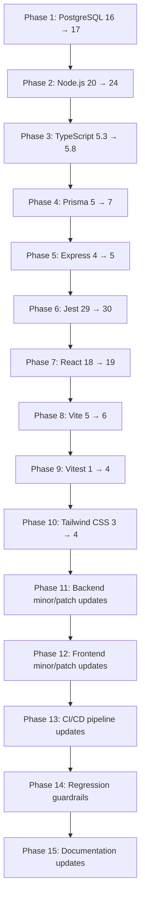

# Design Document: Dependency Upgrades

## Overview

This design covers the upgrade of all dependencies across the Armoured Souls project to their latest stable versions. The upgrade spans three layers: backend (`prototype/backend`), frontend (`prototype/frontend`), and infrastructure (PostgreSQL via Docker Compose). The work is organized into discrete, independently committable phases ordered by dependency graph depth — infrastructure and runtime first, then toolchain, then frameworks, then minor/patch updates, and finally guardrails and documentation.

The guiding principle is: upgrade one major dependency at a time, verify the full test suite passes, commit, then move to the next. This minimizes blast radius and makes rollback trivial via `git revert`.

### Key Research Findings

- **Prisma 5 → 7**: Prisma 7 replaces the Rust-based query engine with a TypeScript/WASM core. The generated client moves out of `node_modules/.prisma/client` to a project-local directory (default: `./generated/prisma`). The `generator` block in `schema.prisma` needs an `output` field. All imports change from `@prisma/client` to the local output path. The `prisma.seed` config in `package.json` is replaced by a `seed.ts` convention or explicit `prisma db seed` command. The `@prisma/client` npm package is no longer needed as a direct dependency — the generated client is self-contained.
- **Express 4 → 5**: Express 5 has native async error handling (rejected promises in route handlers are caught automatically). `req.param()` is removed, path-to-regexp is upgraded (stricter path patterns), and `app.del()` is removed. An official codemod exists: `npx @expressjs/codemod`.
- **React 18 → 19**: `forwardRef` is no longer needed (ref is a regular prop), `defaultProps` on function components is removed, new `use()` hook, `useActionState`, `useOptimistic`. `@types/react` and `@types/react-dom` are updated to match. `react-dom/test-utils` is removed — use `@testing-library/react` instead.
- **Tailwind CSS 3 → 4**: Configuration moves from `tailwind.config.js` to CSS-first using `@theme` directives in the main CSS file. The `@tailwind base/components/utilities` directives are replaced by a single `@import "tailwindcss"`. PostCSS plugin config changes. The JS config file is removed.
- **Vite 5 → 6**: Minimal breaking changes. Requires Node.js 18+. Some config options renamed. `@vitejs/plugin-react` needs a compatible version.
- **Vitest 1 → 4**: Major jump. Configuration API changes, some test runner behavior changes. `@vitest/coverage-v8` and `@vitest/ui` must match the Vitest major version.
- **Jest 29 → 30**: New major version with performance improvements. `ts-jest` must be updated to a compatible version. Some config options may change.
- **Node.js 20 → 24**: Node 24 is the current release line (LTS expected October 2025). Some APIs deprecated in 20 are removed. `--experimental-*` flags may change.
- **PostgreSQL 16 → 17**: Mostly transparent for Prisma-based apps. No SQL syntax changes affect the current schema. Docker image swap is straightforward.
- **TypeScript 5.3 → 5.8**: New `NoInfer` utility type, improved narrowing, `erasableSyntaxOnly` option. Generally backward-compatible but stricter checks may surface new errors.

## Architecture

The upgrade is structured as a linear pipeline of phases, each producing an independently committable and revertable unit of work.



### Phase Ordering Rationale

1. **PostgreSQL first** — infrastructure layer, no code changes, just Docker image swap
2. **Node.js second** — runtime underpins everything; must be stable before upgrading packages
3. **TypeScript third** — compiler must work before upgrading libraries that ship new types
4. **Prisma fourth** — ORM is the deepest backend dependency; import path changes affect all backend files
5. **Express fifth** — web framework sits on top of Prisma; codemod handles most changes
6. **Jest sixth** — test runner must work to verify subsequent upgrades
7. **React seventh** — UI framework is the deepest frontend dependency
8. **Vite eighth** — build tool must work with new React
9. **Vitest ninth** — test runner must work with new Vite
10. **Tailwind tenth** — styling layer, visual verification needed
11. **Minor/patch updates** — low-risk, batched by scope (backend then frontend)
12. **CI/CD** — pipeline must reflect all prior changes
13. **Guardrails** — prevent regression after all upgrades are in place
14. **Documentation** — final step, captures the new baseline

### Verification Gate

After each phase, the following gate must pass before proceeding:

1. `npm run build` succeeds (backend and/or frontend as applicable)
2. `npm run lint` passes
3. Full test suite passes (`npm run test:unit`, `npm run test:integration` for backend; `npx vitest --run` for frontend)
4. Application starts and serves requests in local dev environment (spot-check)

## Components and Interfaces

This upgrade does not introduce new application components. It modifies configuration and dependency versions across existing components. The key files touched per phase:

### Backend (`prototype/backend`)
- `package.json` — dependency versions, engines field, overrides
- `package-lock.json` — regenerated after each phase
- `tsconfig.json` — compiler options for TS 5.8
- `tsconfig.seed.json` — seed compilation config
- `prisma/schema.prisma` — generator output path for Prisma 7
- `jest.config.js`, `jest.config.unit.js`, `jest.config.integration.js`, `jest.config.heavy.js` — Jest 30 config
- `src/**/*.ts` — Prisma import path changes, Express 5 API changes
- `tests/**/*.ts` — Jest 30 API changes, updated Prisma imports
- `.npmrc` — engine-strict setting
- `eslint.config.mjs` — ESLint config updates if needed

### Frontend (`prototype/frontend`)
- `package.json` — dependency versions, engines field, overrides
- `package-lock.json` — regenerated
- `tsconfig.json`, `tsconfig.node.json` — TS 5.8 options
- `vite.config.ts` — Vite 6 config
- `vitest.config.ts` — Vitest 4 config
- `src/index.css` — Tailwind 4 CSS-first config (replaces `@tailwind` directives with `@import "tailwindcss"` and `@theme` block)
- `tailwind.config.js` — removed (migrated to CSS)
- `postcss.config.js` — updated for Tailwind 4
- `src/**/*.tsx` — React 19 API changes (forwardRef removal, defaultProps)
- `src/**/*.test.tsx` — Vitest 4 API changes
- `eslint.config.js` — ESLint config updates if needed

### Infrastructure
- `prototype/docker-compose.yml` — PostgreSQL 17 image
- `prototype/docker-compose.production.yml` — PostgreSQL 17 image

### CI/CD
- `.github/workflows/ci.yml` — Node.js 24, PostgreSQL 17 service image
- `.github/workflows/deploy.yml` — Node.js 24

### Steering & Hooks
- `.kiro/steering/project-overview.md` — updated version references
- `.kiro/steering/coding-standards.md` — updated framework references
- `.kiro/hooks/` — new `dependency-version-check.kiro.hook` for package.json edits

## Data Models

No data model changes. The Prisma schema (`prisma/schema.prisma`) retains the same models, fields, and relations. The only schema change is adding an `output` directive to the `generator client` block for Prisma 7:

```prisma
generator client {
  provider = "prisma-client-js"
  output   = "../generated/prisma"
}
```

All existing migrations remain unchanged and must apply cleanly against PostgreSQL 17.


## Correctness Properties

*A property is a characteristic or behavior that should hold true across all valid executions of a system — essentially, a formal statement about what the system should do. Properties serve as the bridge between human-readable specifications and machine-verifiable correctness guarantees.*

Most acceptance criteria in this spec are process-oriented ("apply the upgrade, run the tests, commit") or are verified by existing test suites passing after the upgrade. However, several criteria describe invariants over configuration files and source code that are well-suited to property-based testing. These properties act as regression guardrails — they verify the upgrade was applied consistently and completely.

### Property 1: Node.js version consistency across all configuration sources

*For any* file in the project that specifies a Node.js version (including `package.json` `engines` fields, `.nvmrc`, `.node-version`, and GitHub Actions workflow `node-version` fields), the specified version must resolve to Node.js 24.x LTS.

**Validates: Requirements 1.1, 1.4, 1.5, 14.1**

### Property 2: No legacy Prisma import paths in source code

*For any* TypeScript source file in `prototype/backend/src` or `prototype/backend/tests`, if the file imports from a Prisma client module, the import path must reference the project-local generated output directory (e.g., `../generated/prisma` or equivalent relative path) and must NOT import from `@prisma/client`.

**Validates: Requirements 3.6**

### Property 3: Express 5 async error propagation

*For any* Express route handler that returns a rejected promise (throws an async error), Express 5 must catch the rejection and forward it to the error-handling middleware, resulting in a proper HTTP error response rather than an unhandled promise rejection or process crash.

**Validates: Requirements 4.4**

### Property 4: All dependency versions are stable and properly pinned

*For any* dependency entry (both `dependencies` and `devDependencies`) in both `prototype/backend/package.json` and `prototype/frontend/package.json`, the version string must: (a) match a caret-pinned (`^X.Y.Z`) or exact (`X.Y.Z`) semver pattern, (b) not contain pre-release identifiers (alpha, beta, rc, canary, next, experimental), and (c) not use wildcard (`*`) or `latest` specifiers.

**Validates: Requirements 11.1, 11.2, 12.1, 12.2, 15.5**

### Property 5: Engines field enforces post-upgrade minimum versions

*For any* `package.json` file in the project (backend and frontend), the `engines` field must exist and specify a minimum Node.js version of `>=24.0.0`.

**Validates: Requirements 15.1**

### Property 6: Version reference table round-trip consistency

*For any* dependency listed in the post-upgrade version reference table in the documentation, the documented post-upgrade version must match the actual version range installed in the corresponding `package.json` file (backend or frontend, as indicated by the scope column).

**Validates: Requirements 16.4**

## Error Handling

Since this is a dependency upgrade spec (not a new feature), error handling focuses on the upgrade process itself rather than application error handling. The key error scenarios:

### Upgrade Failures
- **Compilation errors after upgrade**: Fix type errors introduced by stricter TypeScript or changed library types before committing. Never commit a broken build.
- **Test failures after upgrade**: Investigate whether the failure is a genuine regression or a test that needs updating for the new API. Fix before proceeding.
- **Runtime errors**: If the application crashes on startup after an upgrade, check for removed APIs, changed default behaviors, or missing peer dependencies.

### Rollback Procedure
Each upgrade phase is an independent git commit. To rollback any single phase:
```bash
git revert <commit-hash>
npm ci  # in both backend and frontend
npx prisma generate  # if Prisma-related
```

### PostgreSQL Data Migration (Production)
For the PostgreSQL 16 → 17 upgrade in production:
1. Stop the application
2. `pg_dump` the existing database
3. Stop the PostgreSQL 16 container
4. Update `docker-compose.production.yml` to `postgres:17-alpine`
5. Start the new container (fresh data directory)
6. `pg_restore` the dump into PostgreSQL 17
7. Run `prisma migrate deploy` to verify schema
8. Start the application and smoke-test
9. Keep the dump file as rollback insurance for 7 days

### CI/CD Pipeline Failures
If the CI pipeline fails after upgrades:
- Check that the `node-version` in workflow files matches `24`
- Check that the PostgreSQL service image is `postgres:17`
- Verify cache keys include the new `package-lock.json` hash
- Ensure `npm ci` runs cleanly (no stale lockfile)

## Testing Strategy

### Dual Testing Approach

This upgrade relies on two complementary testing strategies:

1. **Existing test suites as verification gates** — The project already has extensive unit tests (Jest on backend, Vitest on frontend), integration tests, property-based tests (fast-check), and e2e tests (Playwright). After each upgrade phase, the full existing test suite must pass. This is the primary correctness signal.

2. **New property-based tests for upgrade invariants** — The 6 correctness properties defined above are new tests that verify the upgrade was applied consistently. These are regression guardrails that run in CI to prevent version drift.

### Property-Based Testing Configuration

- **Library**: `fast-check` (already installed in both backend and frontend)
- **Minimum iterations**: 100 per property test
- **Location**: `prototype/backend/tests/dependency-upgrade-invariants.property.test.ts` (for properties 1-3, 5-6 which involve backend files) and `prototype/frontend/src/__tests__/dependency-upgrade-invariants.property.test.ts` (for frontend-specific checks)
- **Tag format**: Each test tagged with `Feature: dependency-upgrades, Property N: <title>`

### Property Test Implementation Notes

- **Property 1 (Node.js version consistency)**: Generate the list of config source files dynamically (glob for `package.json`, `.nvmrc`, `ci.yml`). For each file, parse the Node.js version reference and assert it matches `/^24\./` or `>=24`.
- **Property 2 (No legacy Prisma imports)**: Glob all `.ts` files in backend `src/` and `tests/`. For each file, scan import statements. Assert no import references `@prisma/client`. This is a property over all source files — fast-check generates random subsets to sample, but a deterministic full scan is also acceptable.
- **Property 3 (Express 5 async error propagation)**: Generate random async route handlers that throw various error types (Error, string, custom error classes). Mount them on a test Express app, send a request, and assert the response is a proper error (status >= 400) rather than a timeout or crash.
- **Property 4 (Stable pinned versions)**: Parse both `package.json` files, extract all dependency version strings. For each version string, assert it matches the semver pattern and contains no pre-release tags.
- **Property 5 (Engines field)**: Parse both `package.json` files, extract `engines.node`, assert it specifies `>=24.0.0`.
- **Property 6 (Version table round-trip)**: Parse the version reference table from the documentation. For each row, look up the dependency in the corresponding `package.json`. Assert the documented version matches.

### Unit Test Coverage

Unit tests are not the primary verification mechanism for this upgrade — the existing test suites serve that role. However, specific unit tests should be added for:
- Prisma client generation output path verification
- Express 5 async middleware error handling (specific error types)
- Tailwind CSS build output contains expected custom theme tokens

### Verification Checklist Per Phase

After each upgrade phase, run:
```bash
# Backend
cd prototype/backend
npm run build
npm run lint
npm run test:unit -- --silent
npm run test:integration -- --silent

# Frontend
cd prototype/frontend
npm run build
npm run lint
npx vitest --run
```

### Manual Verification Steps

Some criteria cannot be automated:
- **Tailwind CSS 4 visual regression** (Req 9.4): Visually inspect key pages (dashboard, robot detail, weapon shop, battle results) to confirm styling matches pre-upgrade appearance
- **Vite dev server HMR** (Req 7.5): Start `npm run dev` in frontend, make a component change, verify hot reload works
- **Prisma Studio** (Req 3): Run `npx prisma studio` and verify it opens and displays data correctly
- **Full application smoke test** (Req 13.4): Start both backend and frontend, log in, navigate key pages, trigger a battle cycle


## Version Reference Table

This table lists every dependency upgraded as part of this spec, with pre-upgrade and post-upgrade version ranges. The "Post-Upgrade" column reflects the actual version ranges in the corresponding `package.json` files.

| Dependency | Pre-Upgrade | Post-Upgrade | Scope |
|---|---|---|---|
| Node.js | 20 LTS | 24 LTS | Runtime |
| TypeScript | ~5.3 | ^5.8.0 | Backend + Frontend |
| Prisma | ^5.22 | ^7.0.0 | Backend |
| Express | ^4.18 | ^5.1.0 | Backend |
| Jest | ^29.7 | ^30.0.0 | Backend |
| React | ^18.2 | ^19.0.0 | Frontend |
| react-dom | ^18.2 | ^19.0.0 | Frontend |
| Vite | ^5.0 | ^6.0.0 | Frontend |
| Vitest | ^1.2 | ^4.1.0 | Frontend |
| Tailwind CSS | ^3.4 | ^4.0.0 | Frontend |
| PostgreSQL | 16 | 17 | Infrastructure |
| @vitejs/plugin-react | ^4.2 | ^4.7.0 | Frontend |
| @vitest/coverage-v8 | ^1.6 | ^4.1.0 | Frontend |
| @vitest/ui | ^1.2 | ^4.1.0 | Frontend |
| ts-jest | ^29.4 | ^29.4.6 | Backend |
| @types/react | ^18.2 | ^19.0.0 | Frontend |
| @types/react-dom | ^18.2 | ^19.0.0 | Frontend |
| @types/express | ^4.17 | ^5.0.0 | Backend |
