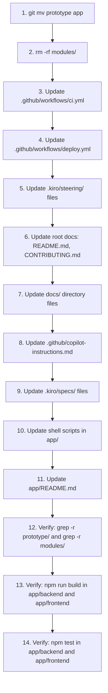

# Design Document: Prototype-to-App Rename

## Overview

This spec performs a structural rename of the `/prototype/` directory to `/app/`, removes the empty `/modules/` directory, and updates every reference across the codebase. The rename uses `git mv` to preserve file history. No application code logic changes — only paths, references, and documentation.

### Key Design Decisions

1. **`git mv` for history preservation**: Using `git mv prototype app` ensures `git log --follow` continues to work for all files. This is a single atomic operation at the top level.
2. **Two-phase execution**: Phase 1 performs the physical rename + modules deletion. Phase 2 performs the global find-and-replace across all reference files. This ordering prevents broken intermediate states where files exist at new paths but references still point to old paths.
3. **No script automation**: The blast radius is well-defined and finite. A manual, file-by-file approach with grep verification is more reliable than a sed script that could corrupt binary files or introduce unintended replacements (e.g., the word "prototype" in prose vs. path references).
4. **Post-spec-3 dependency**: This spec executes after spec 3 (backend-service-consolidation) to avoid conflicting structural changes. The design assumes spec 3's directory reorganization is already in place.

### Blast Radius Summary

The following file categories contain `prototype/` or `modules/` path references that must be updated:

| Category | Files Affected | Reference Type |
|---|---|---|
| GitHub Actions workflows | `ci.yml`, `deploy.yml` | `working-directory`, `cache-dependency-path`, `rsync` source paths, artifact paths |
| Kiro steering files | 9 files under `.kiro/steering/` | Code path references, `fileMatchPattern` |
| Root documentation | `README.md`, `CONTRIBUTING.md` | Structure diagrams, setup commands, path references |
| Docs directory | Multiple files under `docs/` | Path references in guides, setup instructions |
| Copilot instructions | `.github/copilot-instructions.md` | Structure diagrams, path references, code examples |
| In-progress specs | Files under `.kiro/specs/to-do/` (specs 3, 5, 8, 9) | Design docs, task files, requirements with path references |
| Shell scripts | `prototype/backend/scripts/fix-test-patterns.sh` | Comment referencing `prototype/backend` |
| Infrastructure | `prototype/ecosystem.config.js` (no path refs), `Caddyfile` (no path refs), docker-compose files (no path refs) |

### Files With No Path References (No Changes Needed)

These files inside `prototype/` were inspected and contain no self-referential `prototype/` paths:
- `prototype/docker-compose.yml` — uses container-internal paths only
- `prototype/docker-compose.production.yml` — uses container-internal paths only
- `prototype/Caddyfile` — uses `/opt/armouredsouls/` deployment paths, not repo paths
- `prototype/ecosystem.config.js` — uses `/opt/armouredsouls/` deployment paths, not repo paths

These files move to `app/` via `git mv` but require no content edits.

## Architecture

### Execution Order



### Rename Strategy

The rename is a single `git mv` command:

```bash
git mv prototype app
```

This recursively moves all contents and stages the rename in git's index. Git detects this as a rename operation, preserving blame and log history when using `--follow`.

### Modules Removal Strategy

The `modules/` directory contains only placeholder READMEs across 6 directories (`modules/`, `modules/api/`, `modules/auth/`, `modules/database/`, `modules/game-engine/`, `modules/ui/`). Removal is:

```bash
git rm -rf modules/
```

References to `modules/` in documentation are either removed entirely or replaced with a note that modular architecture is planned as a future refactor within `app/`.

## Components and Interfaces

This spec has no application code components. The "components" are the file categories that require updates.

### Component 1: CI/CD Pipeline Files

**Files**: `.github/workflows/ci.yml`, `.github/workflows/deploy.yml`

**Changes**: Global replacement of `prototype/backend` → `app/backend`, `prototype/frontend` → `app/frontend`, `prototype/shared` → `app/shared`, `prototype/ecosystem.config.js` → `app/ecosystem.config.js` in all `working-directory`, `cache-dependency-path`, `rsync`, and artifact path references.

**ci.yml specific references** (all `working-directory` and `cache-dependency-path`):
- `prototype/backend/package-lock.json` → `app/backend/package-lock.json`
- `./prototype/backend` → `./app/backend`
- `prototype/frontend/package-lock.json` → `app/frontend/package-lock.json`
- `./prototype/frontend` → `./app/frontend`

**deploy.yml specific references** (working-directory, rsync sources, artifact paths):
- `./prototype/backend` → `./app/backend`
- `./prototype/frontend` → `./app/frontend`
- `./prototype/shared/` → `./app/shared/`
- `./prototype/ecosystem.config.js` → `./app/ecosystem.config.js`
- `prototype/frontend/dist/` → `app/frontend/dist/`
- `prototype/frontend/playwright-report/` → `app/frontend/playwright-report/`

**Validates**: Requirements 3.1, 3.2, 3.3

### Component 2: Kiro Steering Files

**Files** (9 files with `prototype/` references):
- `.kiro/steering/project-overview.md` — Project Structure section paths + `/modules/` entry removal
- `.kiro/steering/common-tasks.md` — File location paths, setup commands
- `.kiro/steering/guide-content-maintenance.md` — `fileMatchPattern` value
- `.kiro/steering/environments-and-deployment.md` — Setup commands, directory structure diagram
- `.kiro/steering/coding-standards.md` — Prisma generated client path
- `.kiro/steering/testing-strategy.md` — Test file location paths, run commands
- `.kiro/steering/pre-deployment-checklist.md` — Test run commands
- `.kiro/steering/database-best-practices.md` — Migration command path
- `.kiro/steering/dependency-management.md` — Install command path

**Validates**: Requirements 4.1, 4.2, 4.3, 4.4, 4.5, 9.1, 9.2

### Component 3: Root Documentation

**Files**: `README.md`, `CONTRIBUTING.md`

**README.md changes**:
- Quick Start commands: `cd ArmouredSouls/prototype` → `cd ArmouredSouls/app`
- Troubleshooting paths: `cd prototype/backend` → `cd app/backend`, `git restore prototype/backend/...` → `git restore app/backend/...`
- Repository Structure diagram: `prototype/` → `app/`, remove `modules/` section
- Phase 2 description: replace `modules/` future codebase text with note about future refactor within `app/`

**CONTRIBUTING.md changes**:
- Project Structure diagram: replace `modules/` tree with `app/` structure
- Remove reference to `MODULE_STRUCTURE.md` link or update it

**Validates**: Requirements 5.1, 5.5, 10.1, 10.3

### Component 4: Docs Directory

**Files**: Multiple files under `docs/` that reference `prototype/` or `modules/` paths, including `docs/guides/MODULE_STRUCTURE.md`, `docs/guides/SETUP.md`, and others found via grep.

**Validates**: Requirements 5.3, 5.4

### Component 5: GitHub Copilot Instructions

**File**: `.github/copilot-instructions.md`

**Changes**: Update project structure diagram (replace `prototype/` with `app/`, remove `modules/`), update all path references in code examples and commands.

**Validates**: Requirements 5.4 (falls under "every file under docs/" broadly, plus it's a documentation file)

### Component 6: In-Progress Specs

**Files** under `.kiro/specs/to-do/`:
- `3-backend-service-consolidation/design.md` — references `prototype/backend`
- `5-modular-architecture-migration/design.md` — references `prototype/` and `modules/` extensively
- `8-battle-replay-admin/design.md`, `tasks.md`, `requirements.md` — references `prototype/backend` and `prototype/frontend` paths
- `9-web-push-notifications/design.md` — references `prototype/backend` and `prototype/frontend` paths

**Validates**: Requirements 7.1, 7.2

### Component 7: Shell Scripts

**File**: `app/backend/scripts/fix-test-patterns.sh` (after rename)

**Changes**: Update comment `# Run from prototype/backend directory` → `# Run from app/backend directory`

**Validates**: Requirement 6.4

### Component 8: app/README.md

**File**: `app/README.md` (formerly `prototype/README.md`)

**Changes**: Update any self-referential `prototype/` paths to `app/`.

**Validates**: Requirements 5.2, 10.2

## Data Models

No data model changes. This spec does not modify any database schema, Prisma models, application state, or runtime data structures. All changes are to file paths and text references in configuration, documentation, and CI/CD files.


## Correctness Properties

*A property is a characteristic or behavior that should hold true across all valid executions of a system — essentially, a formal statement about what the system should do. Properties serve as the bridge between human-readable specifications and machine-verifiable correctness guarantees.*

### Property 1: Zero prototype/ path references in tracked files

*For any* tracked file in the repository, the file shall contain zero occurrences of the string `prototype/` used as a path reference. This is verified by running `grep -r "prototype/" --include="*.md" --include="*.yml" --include="*.yaml" --include="*.ts" --include="*.tsx" --include="*.js" --include="*.json" --include="*.sh" --include="*.kiro"` from the repository root and asserting zero matches.

**Validates: Requirements 1.4, 4.5, 5.4, 7.1**

### Property 2: Zero modules/ path references in tracked files

*For any* tracked file in the repository (excluding this spec's own `requirements.md` and `design.md` which describe the historical removal), the file shall contain zero occurrences of the string `modules/` used as a directory path reference. This is verified by running `grep -r "modules/" --include="*.md" --include="*.yml" --include="*.yaml" --include="*.ts" --include="*.tsx" --include="*.js" --include="*.json" --include="*.sh" --include="*.kiro"` from the repository root, excluding `.kiro/specs/to-do/10-prototype-to-app-rename/`, and asserting zero matches (with the exception of `node_modules/` which is a different concept).

**Validates: Requirements 2.2, 5.4, 7.2, 9.1**

### Property 3: File tree preservation after rename

*For any* file that existed under `prototype/` before the rename, the same file (identical relative path and content) shall exist under `app/` after the rename. The set of files under `app/` shall be exactly the set of files that were under `prototype/`.

**Validates: Requirements 1.2, 1.3**

## Error Handling

This spec involves no runtime application code changes, so there are no new error handling paths to implement. The risks are:

### Risk 1: Incomplete reference replacement

**Symptom**: `grep -r "prototype/"` returns matches after all updates are applied.
**Mitigation**: The final verification task runs a comprehensive grep across all tracked files. Any remaining references are caught before the commit.

### Risk 2: CI pipeline failure after rename

**Symptom**: GitHub Actions jobs fail with "directory not found" or similar path errors.
**Mitigation**: The CI files (`ci.yml`, `deploy.yml`) are updated in the same commit as the rename. The verification task includes running `npm run build` and `npm test` locally from the new `app/backend` and `app/frontend` directories.

### Risk 3: Broken internal imports

**Symptom**: TypeScript compilation errors due to unresolved imports.
**Mitigation**: Internal imports within `backend/` and `frontend/` use relative paths (e.g., `../services/`, `./components/`). Since the rename is at the top level (`prototype/` → `app/`), internal relative imports are unaffected. The `tsconfig.json` path mappings (if any) are also relative to the project root within `backend/` or `frontend/`, not to the `prototype/` directory name. Build verification confirms this.

### Risk 4: Deployment pipeline references stale paths

**Symptom**: `rsync` in deploy.yml copies from wrong source directory, deployment fails.
**Mitigation**: All `rsync` source paths in `deploy.yml` are updated from `./prototype/` to `./app/`. The VPS destination paths (`/opt/armouredsouls/`) are unchanged since they never referenced `prototype/`.

## Testing Strategy

### Verification Approach

This spec is a structural refactor with no application logic changes. Testing focuses on verification rather than traditional unit/integration tests.

### Unit Tests

No new unit tests are needed. The existing backend and frontend test suites serve as regression tests — if they pass after the rename, the rename did not break any imports or path resolution.

### Property-Based Tests

The two grep-based properties (Property 1 and Property 2) are best implemented as shell-based verification commands rather than property-based test framework tests, because:
- The "input space" is the fixed set of files in the repository, not a generatable domain
- The verification is a single grep command with a pass/fail outcome
- There is no randomization benefit — we need to check every file, which grep already does

**Verification commands** (to be run as the final task):

```bash
# Property 1: Zero prototype/ path references
grep -rn "prototype/" --include="*.md" --include="*.yml" --include="*.yaml" --include="*.ts" --include="*.tsx" --include="*.js" --include="*.json" --include="*.sh" . | grep -v node_modules | grep -v ".git/" | grep -v "10-prototype-to-app-rename"
# Expected: zero output

# Property 2: Zero modules/ path references (excluding node_modules)
grep -rn "modules/" --include="*.md" --include="*.yml" --include="*.yaml" --include="*.ts" --include="*.tsx" --include="*.js" --include="*.json" --include="*.sh" . | grep -v node_modules | grep -v ".git/" | grep -v "10-prototype-to-app-rename"
# Expected: zero output (after filtering out node_modules references)

# Property 3: Directory existence
test -d app/backend && test -d app/frontend && test -f app/docker-compose.yml && test -f app/.gitignore && echo "PASS" || echo "FAIL"
test ! -d prototype && echo "PASS" || echo "FAIL"
test ! -d modules && echo "PASS" || echo "FAIL"
```

### Build and Test Verification

```bash
# Backend build verification (Requirement 8.1)
cd app/backend && npm run build

# Frontend build verification (Requirement 8.2)
cd app/frontend && npm run build

# Backend test suite (Requirement 8.3)
cd app/backend && npm test

# Frontend test suite (Requirement 8.4)
cd app/frontend && npx vitest --run
```

### Testing Library

No property-based testing library (fast-check) is needed for this spec. The properties are verified via grep commands and build/test runs. This is appropriate because the spec makes no application logic changes — it only moves files and updates text references.

### Documentation Impact

The following documentation and steering files are directly modified by this spec:

**Steering files** (`.kiro/steering/`):
- `project-overview.md` — Update paths, remove modules entry
- `common-tasks.md` — Update all path references
- `guide-content-maintenance.md` — Update `fileMatchPattern`
- `environments-and-deployment.md` — Update paths in commands and diagrams
- `coding-standards.md` — Update Prisma generated client path
- `testing-strategy.md` — Update test file location paths
- `pre-deployment-checklist.md` — Update test run commands
- `database-best-practices.md` — Update migration command path
- `dependency-management.md` — Update install command path

**Guide documents** (`docs/guides/`):
- `MODULE_STRUCTURE.md` — Update paths, revise modules/ sections

**Other documentation**:
- Root `README.md` — Structure diagram, setup commands, phase descriptions
- `CONTRIBUTING.md` — Project structure diagram, modules references
- `.github/copilot-instructions.md` — Structure diagram, path references, code examples
- `app/README.md` — Self-referential path updates
