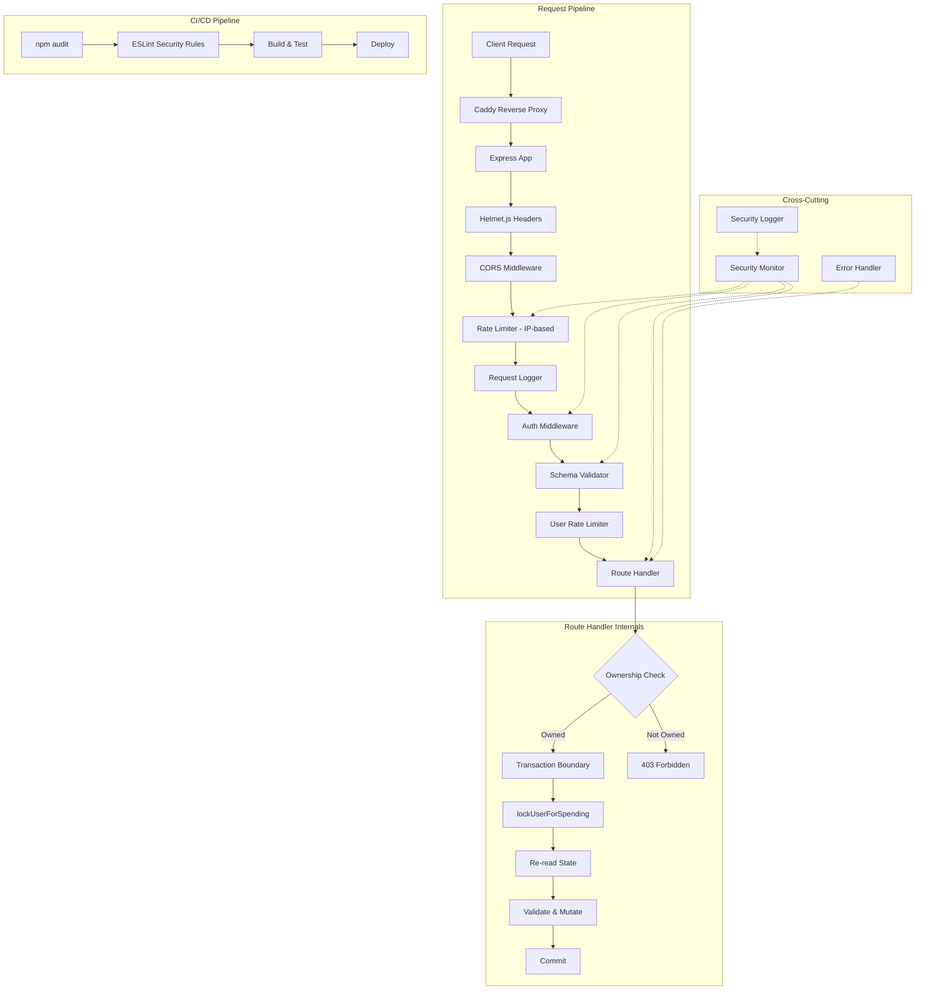

# Design Document: Security Audit Guardrails

## Overview

This design codifies the security lessons learned from Koen's Exploits and establishes systematic guardrails across the Armoured Souls backend. The approach is layered: centralized input validation catches bad data at the API boundary, transaction integrity patterns prevent race conditions on economic operations, authentication hardening resists brute-force and token theft, authorization checks prevent IDOR, monitoring detects anomalous behavior, and CI/CD scanning catches vulnerable dependencies before deployment.

The design builds on existing infrastructure — the `AppError` hierarchy, `creditGuard.ts`, `errorHandler.ts`, Helmet.js, `express-rate-limit`, and Winston logging — rather than replacing it. New components are introduced only where gaps exist.

### Design Decisions

1. **Zod for schema validation** — Zod is chosen over Joi because it provides native TypeScript type inference, is lighter weight, and aligns with the project's strict TypeScript approach. Each route gets a schema definition; a shared middleware validates against it.
2. **Winston child logger for security events** — Rather than a separate logging library, a dedicated Winston transport/child logger writes security events to a separate channel. This keeps the logging stack unified while providing the separation required by Requirement 7.6.
3. **Token version in database** — A `tokenVersion` column on the `User` table enables server-side token invalidation on password change without requiring a token blacklist or Redis.
4. **Per-user rate limiting via middleware** — Economic endpoint rate limiting uses the authenticated `userId` (not just IP) to prevent abuse from authenticated sessions, implemented as a thin wrapper around `express-rate-limit` with a custom key generator.
5. **In-memory sliding window for anomaly detection** — The security monitor uses in-memory sliding windows (Map-based) for rapid spending detection and conflict counting. This avoids database overhead for high-frequency checks and is acceptable for a single-server deployment.

## Architecture



The request pipeline is ordered so that cheap checks (headers, CORS, IP rate limiting) happen before expensive ones (auth, schema validation, database queries). The security monitor observes events at multiple points in the pipeline without blocking the request flow.

## Components and Interfaces

### 1. Schema Validation Middleware (`src/middleware/schemaValidator.ts`)

_Addresses: Requirements 1.1–1.6, 5.6, 9.2_

A generic Express middleware factory that validates `req.body`, `req.params`, and `req.query` against Zod schemas defined per-route.

```typescript
import { z, ZodSchema } from 'zod';
import { Request, Response, NextFunction } from 'express';
import { AppError } from '../errors';

interface ValidationSchemas {
  body?: ZodSchema;
  params?: ZodSchema;
  query?: ZodSchema;
}

export function validateRequest(schemas: ValidationSchemas) {
  return (req: Request, _res: Response, next: NextFunction): void => {
    if (schemas.params) {
      const result = schemas.params.safeParse(req.params);
      if (!result.success) {
        throw new AppError('VALIDATION_ERROR', 'Invalid URL parameters', 400, {
          fields: result.error.issues.map(i => ({ field: i.path.join('.'), message: i.message })),
        });
      }
      req.params = result.data;
    }
    if (schemas.query) {
      const result = schemas.query.safeParse(req.query);
      if (!result.success) {
        throw new AppError('VALIDATION_ERROR', 'Invalid query parameters', 400, {
          fields: result.error.issues.map(i => ({ field: i.path.join('.'), message: i.message })),
        });
      }
    }
    if (schemas.body) {
      const result = schemas.body.safeParse(req.body);
      if (!result.success) {
        throw new AppError('VALIDATION_ERROR', 'Invalid request body', 400, {
          fields: result.error.issues.map(i => ({ field: i.path.join('.'), message: i.message })),
        });
      }
      req.body = result.data; // Strips unknown fields (Req 1.6)
    }
    next();
  };
}
```

Zod's `.strip()` mode (default for `z.object()`) automatically removes fields not defined in the schema, satisfying Requirement 1.6 (mass-assignment prevention).

### 2. Reusable Validation Primitives (`src/utils/securityValidation.ts`)

_Addresses: Requirements 1.4, 5.1, 5.2, 5.3, 5.6, 9.2_

Centralized Zod refinements for common input types, imported by route schemas instead of inline regex.

```typescript
import { z } from 'zod';

/** Safe name: letters, numbers, spaces, hyphens, underscores, apostrophes, periods, exclamation marks */
export const safeName = z.string()
  .min(1).max(50)
  .regex(/^[a-zA-Z0-9 _\-'.!]+$/, 'Contains disallowed characters');

/** Safe slug: alphanumeric, hyphens, underscores only */
export const safeSlug = z.string()
  .min(1).max(100)
  .regex(/^[a-zA-Z0-9_-]+$/, 'Invalid slug format');

/** Positive integer ID */
export const positiveInt = z.coerce.number().int().positive();

/** Positive integer from string param */
export const positiveIntParam = z.string().regex(/^\d+$/).transform(Number).pipe(z.number().int().positive());

/** Safe image URL: only allowed protocol + domain + path */
export const safeImageUrl = z.string().regex(
  /^https:\/\/[a-zA-Z0-9.-]+\.[a-zA-Z]{2,}\/[a-zA-Z0-9/_.-]+$/,
  'Invalid image URL format'
).optional();

/** ORDER BY column allowlist factory */
export function orderByColumn<T extends readonly string[]>(allowed: T, defaultCol: T[number]) {
  return z.string().optional().transform(val => {
    if (!val || !allowed.includes(val as T[number])) return defaultCol;
    return val as T[number];
  });
}

/** Enum value validator factory */
export function safeEnum<T extends readonly string[]>(values: T) {
  return z.enum(values as unknown as [string, ...string[]]);
}

/** Stable name: letters, numbers, spaces, hyphens, underscores */
export const stableName = z.string()
  .min(3).max(30)
  .regex(/^[a-zA-Z0-9 _-]+$/, 'Contains disallowed characters');
```

### 3. Ownership Verification Helpers (`src/middleware/ownership.ts`)

_Addresses: Requirements 4.1–4.5_

Reusable functions for verifying resource ownership, designed to be called both outside and inside transactions.

```typescript
import { Prisma } from '../../generated/prisma';
import { AppError } from '../errors';

/**
 * Verify that a robot belongs to the authenticated user.
 * Can be called with either the main prisma client or a transaction client.
 */
export async function verifyRobotOwnership(
  tx: Prisma.TransactionClient,
  robotId: number,
  userId: number
): Promise<void> {
  const robot = await tx.robot.findUnique({
    where: { id: robotId },
    select: { userId: true },
  });
  if (!robot) {
    throw new AppError('FORBIDDEN', 'Access denied', 403);
  }
  if (robot.userId !== userId) {
    throw new AppError('FORBIDDEN', 'Access denied', 403);
  }
}

/**
 * Verify weapon inventory ownership.
 */
export async function verifyWeaponOwnership(
  tx: Prisma.TransactionClient,
  inventoryId: number,
  userId: number
): Promise<void> {
  const weapon = await tx.weaponInventory.findUnique({
    where: { id: inventoryId },
    select: { userId: true },
  });
  if (!weapon || weapon.userId !== userId) {
    throw new AppError('FORBIDDEN', 'Access denied', 403);
  }
}

/**
 * Verify facility ownership.
 */
export async function verifyFacilityOwnership(
  tx: Prisma.TransactionClient,
  facilityId: number,
  userId: number
): Promise<void> {
  const facility = await tx.facility.findUnique({
    where: { id: facilityId },
    select: { userId: true },
  });
  if (!facility || facility.userId !== userId) {
    throw new AppError('FORBIDDEN', 'Access denied', 403);
  }
}
```

The generic "Access denied" message (Req 4.2) does not reveal whether the resource exists.

### 4. Security Monitor (`src/services/security/securityMonitor.ts`)

_Addresses: Requirements 6.6, 7.1–7.6_

An in-memory sliding window monitor that tracks anomalous patterns and writes to a dedicated security logger.

```typescript
import { securityLogger, SecuritySeverity } from './securityLogger';

interface SlidingWindow {
  timestamps: number[];
  windowMs: number;
  threshold: number;
}

class SecurityMonitor {
  private spendingWindows = new Map<number, { total: number; timestamps: Array<{ amount: number; time: number }> }>();
  private conflictWindows = new Map<number, number[]>();
  private robotCreationWindows = new Map<number, number[]>();
  private rateLimitViolations = new Map<number, number[]>();

  /** Circular buffer of recent security events for admin API access */
  private recentEvents: SecurityEvent[] = [];
  private readonly maxRecentEvents = 500;

  /** Track a spending event for rapid-spending detection (Req 7.1) */
  trackSpending(userId: number, amount: number): void { /* ... */ }

  /** Track a 409 conflict response for race-condition exploit detection (Req 7.2) */
  trackConflict(userId: number): void { /* ... */ }

  /** Log a failed authorization attempt (Req 7.3) */
  logAuthorizationFailure(userId: number, resourceType: string, resourceId: number): void { /* ... */ }

  /** Log a validation failure (Req 7.4) */
  logValidationFailure(endpoint: string, violationType: string, sourceIp: string): void { /* ... */ }

  /** Track robot creation for automation detection (Req 7.5) */
  trackRobotCreation(userId: number): void { /* ... */ }

  /** Track rate limit violations per user (Req 6.6) */
  trackRateLimitViolation(userId: number, endpoint: string): void { /* ... */ }

  /**
   * Get recent security events for admin dashboard.
   * Supports filtering by severity, eventType, userId, and time range.
   * Returns newest events first.
   */
  getRecentEvents(filters?: {
    severity?: SecuritySeverity;
    eventType?: string;
    userId?: number;
    since?: Date;
    limit?: number;
  }): SecurityEvent[] { /* ... */ }

  /**
   * Get a summary of current security state for admin dashboard.
   * Returns counts of active alerts, flagged users, and event totals by severity.
   */
  getSummary(): {
    totalEvents: number;
    bySeverity: Record<SecuritySeverity, number>;
    activeAlerts: number;
    flaggedUserIds: number[];
  } { /* ... */ }
}

export const securityMonitor = new SecurityMonitor();
```

### 5. Security Logger (`src/services/security/securityLogger.ts`)

_Addresses: Requirement 7.6_

A dedicated Winston child logger that writes structured JSON security events to a separate transport.

```typescript
import winston from 'winston';

export enum SecuritySeverity {
  INFO = 'info',
  WARNING = 'warning',
  CRITICAL = 'critical',
}

export interface SecurityEvent {
  severity: SecuritySeverity;
  eventType: string;
  userId?: number;
  sourceIp?: string;
  endpoint?: string;
  details: Record<string, unknown>;
  timestamp: string;
}

const securityTransport = new winston.transports.File({
  filename: 'logs/security.log',
  format: winston.format.combine(
    winston.format.timestamp(),
    winston.format.json()
  ),
});

export const securityLogger = winston.createLogger({
  level: 'info',
  defaultMeta: { channel: 'security' },
  transports: [securityTransport],
});
```

### 6. User Rate Limiter (`src/middleware/userRateLimiter.ts`)

_Addresses: Requirements 6.4, 6.6_

Per-authenticated-user rate limiting for economic endpoints, separate from the IP-based general limiter.

```typescript
import rateLimit from 'express-rate-limit';
import { AuthRequest } from './auth';
import { securityMonitor } from '../services/security/securityMonitor';

export function createUserEconomicLimiter() {
  return rateLimit({
    windowMs: 60 * 1000, // 1 minute
    max: 60,
    standardHeaders: true,
    legacyHeaders: false,
    keyGenerator: (req) => {
      const authReq = req as AuthRequest;
      return authReq.user?.userId?.toString() || req.ip || 'unknown';
    },
    handler: (req, res) => {
      const authReq = req as AuthRequest;
      if (authReq.user?.userId) {
        securityMonitor.trackRateLimitViolation(authReq.user.userId, req.originalUrl);
      }
      res.status(429).json({
        error: 'Too many requests',
        code: 'RATE_LIMIT_EXCEEDED',
        retryAfter: 60,
      });
    },
  });
}
```

### 7. Auth Hardening Changes (`src/middleware/auth.ts`, `src/services/auth/`)

_Addresses: Requirements 3.1–3.6_

Key changes to the existing auth system:

- **JWT secret from EnvConfig** (Req 3.2): Replace the module-level `process.env.JWT_SECRET` read in `auth.ts` with `getConfig().jwtSecret`.
- **Token version** (Req 3.3, 3.4): Add `tokenVersion: number` column to `User` table. Include `tokenVersion` in JWT payload. On verification, compare JWT's `tokenVersion` against the database value. On password change, increment `tokenVersion`.
- **Login rate limiting** (Req 3.1): The existing `authLimiter` already applies to `/api/auth/login`. Tighten to 10 requests per 15 minutes (currently 30 per 60s). This is a config change in `index.ts`.
- **Production JWT_SECRET check** (Req 3.5): Already implemented in `loadEnvConfig()`. No change needed.
- **JWT expiration** (Req 3.6): Already configurable via `JWT_EXPIRATION` env var, defaulting to 24h. No change needed.

### 8. Database Changes

_Addresses: Requirements 2.4, 3.3, 3.4_

```sql
-- Token version for server-side JWT invalidation
ALTER TABLE "User" ADD COLUMN "tokenVersion" INTEGER NOT NULL DEFAULT 0;

-- Currency floor constraint to prevent negative balance exploits
ALTER TABLE "User" ADD CONSTRAINT "user_currency_floor"
  CHECK (currency >= -10000000);
```

### 9. CI/CD Security Scanning (`.github/workflows/ci.yml`)

_Addresses: Requirements 8.1–8.5_

Modifications to the existing `security-audit` job:

- Change `npm audit` to fail on `high` or `critical` (remove `|| true`)
- Add an `npm audit --json` step that produces a report artifact
- Add a vulnerability allowlist file (`.security-audit-allowlist.json`) for accepted vulnerabilities
- Add ESLint security rules via `eslint-plugin-security` to the existing ESLint config

### 10. Helmet.js / CORS / HSTS Configuration (`src/index.ts`)

_Addresses: Requirements 5.5, 10.1–10.6_

### 11. Admin Security Dashboard Endpoints (`src/routes/admin.ts`)

_Addresses: Requirement 7 (admin access to security monitoring data)_

Two new admin-only endpoints expose the in-memory security monitor data through the existing admin route (protected by `authenticateToken` + `requireAdmin`):

```typescript
/**
 * GET /api/admin/security/events
 * Query recent security events with optional filters.
 * Query params: severity, eventType, userId, since (ISO date), limit (default 50, max 200)
 */
router.get('/security/events', authenticateToken, requireAdmin, async (req, res) => {
  const events = securityMonitor.getRecentEvents({
    severity: req.query.severity as SecuritySeverity | undefined,
    eventType: req.query.eventType as string | undefined,
    userId: req.query.userId ? parseInt(req.query.userId as string) : undefined,
    since: req.query.since ? new Date(req.query.since as string) : undefined,
    limit: Math.min(parseInt(req.query.limit as string) || 50, 200),
  });
  res.json({ events, total: events.length });
});

/**
 * GET /api/admin/security/summary
 * Get a high-level overview: event counts by severity, active alerts, flagged users.
 */
router.get('/security/summary', authenticateToken, requireAdmin, async (req, res) => {
  const summary = securityMonitor.getSummary();
  res.json(summary);
});
```

The monitor keeps the last 500 events in a circular buffer in memory. This gives you a quick view from the admin panel without needing SSH access. For historical analysis beyond the buffer, the `logs/security.log` file on disk has the full record.

### 12. Helmet.js / CORS / HSTS Configuration (`src/index.ts`)

```typescript
app.use(helmet({
  contentSecurityPolicy: {
    directives: {
      defaultSrc: ["'self'"],
      scriptSrc: ["'self'"],
      styleSrc: ["'self'", "'unsafe-inline'"],
      imgSrc: ["'self'", "data:", "https:"],
    },
  },
  hsts: {
    maxAge: 31536000,
    includeSubDomains: true,
  },
  referrerPolicy: { policy: 'strict-origin-when-cross-origin' },
}));
```

CORS is already correctly configured — production uses an explicit allowlist, development uses `*`. No change needed for Req 10.1/10.2.

## Data Models

### User Table Changes

```prisma
model User {
  // ... existing fields ...
  tokenVersion  Int @default(0)  // Incremented on password change to invalidate JWTs
  // currency column gets a CHECK constraint via raw SQL migration
}
```

### Security Event Structure (in-memory + log file)

```typescript
interface SecurityEvent {
  timestamp: string;        // ISO 8601
  severity: 'info' | 'warning' | 'critical';
  eventType: string;        // e.g., 'rapid_spending', 'race_condition_attempt', 'auth_failure'
  userId?: number;
  sourceIp?: string;
  endpoint?: string;
  details: Record<string, unknown>;
}
```

Security events are not stored in the database — they are written to `logs/security.log` as structured JSON. This keeps the security monitoring path independent of database availability and avoids adding write load to the main database during potential attack scenarios.

### Vulnerability Allowlist Structure (`.security-audit-allowlist.json`)

```json
{
  "allowlist": [
    {
      "id": "GHSA-xxxx-xxxx-xxxx",
      "package": "example-package",
      "justification": "Only used in development, not exposed in production",
      "reviewDate": "2026-03-01",
      "nextReviewDate": "2026-06-01"
    }
  ]
}
```


## Correctness Properties

*A property is a characteristic or behavior that should hold true across all valid executions of a system — essentially, a formal statement about what the system should do. Properties serve as the bridge between human-readable specifications and machine-verifiable correctness guarantees.*

### Property 1: Schema validation rejects invalid fields with structured error

*For any* route with a defined Zod schema and *for any* request body/params/query containing a field that violates the schema (wrong type, missing required field, pattern mismatch), the middleware shall return HTTP 400 with a JSON response containing `code: 'VALIDATION_ERROR'` and a `details.fields` array where each entry includes the field name and violation message.

**Validates: Requirements 1.1, 1.2, 1.3**

### Property 2: Character allowlist enforcement

*For any* string input to a name field (robot name, stable name) that contains at least one character outside the defined allowlist pattern (`/^[a-zA-Z0-9 _\-'.!]+$/` for robot names, `/^[a-zA-Z0-9 _-]+$/` for stable names), the validation function shall reject the input. Conversely, *for any* string composed entirely of allowed characters within length bounds, the validation function shall accept it.

**Validates: Requirements 1.4, 5.1, 9.2**

### Property 3: Numeric parameter validation

*For any* request parameter or body field defined as a numeric type in the schema, if the provided value is a non-numeric string, zero, negative, or a floating-point number where an integer is expected, the validator shall reject the request with HTTP 400. This applies to all resource IDs in URL parameters.

**Validates: Requirements 1.5, 4.5**

### Property 4: Unknown field stripping (mass-assignment prevention)

*For any* request body containing fields not defined in the route's Zod schema, after validation the parsed body shall contain only the fields defined in the schema. The extra fields shall not be present in the validated output.

**Validates: Requirements 1.6**

### Property 5: Currency floor constraint

*For any* database update that would set a user's currency below -10,000,000, the database shall reject the operation with a constraint violation error.

**Validates: Requirements 2.4**

### Property 6: Token version invalidation round-trip

*For any* user, if a valid JWT is issued, then the user's password is changed (incrementing `tokenVersion`), then the original JWT is presented for authentication, the auth middleware shall reject the token with HTTP 401. A newly issued JWT after the password change shall be accepted.

**Validates: Requirements 3.3, 3.4**

### Property 7: JWT expiration bound

*For any* JWT generated by the `generateToken` function, the `exp` claim shall be at most 24 hours (86,400 seconds) after the `iat` claim.

**Validates: Requirements 3.6**

### Property 8: Ownership verification returns generic 403

*For any* resource (robot, weapon inventory, facility) and *for any* authenticated user who does not own that resource, a mutation request shall return HTTP 403 with a response body containing `error: 'Access denied'` and no information about whether the resource exists or who owns it.

**Validates: Requirements 4.1, 4.2**

### Property 9: Sensitive field stripping for non-owners

*For any* robot returned via the public robots endpoint (`/all/robots`) to a user who does not own that robot, the response object shall not contain any key from the `SENSITIVE_ROBOT_FIELDS` constant (23 attributes, battle config, combat state, equipment IDs).

**Validates: Requirements 4.4**

### Property 10: Image URL strict validation

*For any* string provided as an `imageUrl` that contains a `javascript:` URI, a `data:` URI, path traversal sequences (`../`), or does not match the strict HTTPS URL pattern, the validator shall reject it.

**Validates: Requirements 5.2**

### Property 11: ORDER BY allowlist mapping

*For any* user-supplied ORDER BY column value, if the value is not in the predefined allowlist, the system shall use the default safe column. *For any* value that is in the allowlist, the system shall use that value unchanged.

**Validates: Requirements 5.3**

### Property 12: Error message sanitization

*For any* error thrown during request processing where the error message contains user-supplied input (e.g., a robot name with HTML/script tags), the HTTP response body shall not contain the raw unsanitized input. The error handler shall return a generic message for unknown errors.

**Validates: Requirements 5.4**

### Property 13: Security headers present on all responses

*For any* HTTP response from the application, the response headers shall include `Content-Security-Policy`, `X-Content-Type-Options: nosniff`, `X-Frame-Options`, `Referrer-Policy`, and `Strict-Transport-Security` with `max-age` >= 31536000 and `includeSubDomains`.

**Validates: Requirements 5.5, 10.3, 10.5**

### Property 14: Rapid spending alert threshold

*For any* sequence of spending events for a single user where the cumulative amount exceeds 3,000,000 credits within a 5-minute sliding window, the security monitor shall emit a `critical` severity log event containing the user ID, total amount, and transaction timestamps.

**Validates: Requirements 7.1**

### Property 15: Race condition conflict detection

*For any* user who accumulates more than 10 HTTP 409 conflict responses within a 1-minute sliding window, the security monitor shall emit a `warning` severity log event flagging a potential race-condition exploit attempt.

**Validates: Requirements 7.2**

### Property 16: Security event logging completeness

*For any* failed authorization attempt (403 response), the security log entry shall contain the authenticated user ID, resource type, and resource ID. *For any* validation failure, the security log entry shall contain the endpoint path, violation type, and source IP.

**Validates: Requirements 7.3, 7.4**

### Property 17: Robot creation automation detection

*For any* user who creates more than 3 robots within a 10-minute sliding window, the security monitor shall emit a `warning` severity log event flagging potentially automated activity.

**Validates: Requirements 7.5**

### Property 18: Rate limit violation escalation

*For any* authenticated user who triggers rate limit responses on economic endpoints more than 5 times within a 1-hour window, the security monitor shall emit a `warning` severity log event with the user ID and endpoint details.

**Validates: Requirements 6.6**

### Property 19: Slug path traversal prevention

*For any* URL path parameter used as a slug that contains characters outside `/^[a-zA-Z0-9_-]+$/` (including `..`, `/`, `%2e`, or other traversal sequences), the validator shall reject the request with HTTP 400.

**Validates: Requirements 5.6**

## Error Handling

### Validation Errors

All schema validation failures produce a consistent error shape via the `validateRequest` middleware:

```json
{
  "error": "Invalid request body",
  "code": "VALIDATION_ERROR",
  "details": {
    "fields": [
      { "field": "name", "message": "Contains disallowed characters" },
      { "field": "weaponId", "message": "Expected number, received string" }
    ]
  }
}
```

The `details.fields` array lists all violations at once so the client can display them together.

### Authorization Errors

Ownership failures always return the same generic response regardless of whether the resource exists:

```json
{ "error": "Access denied", "code": "FORBIDDEN" }
```

This prevents resource enumeration attacks (Req 4.2).

### Rate Limit Errors

Rate limit responses include a `Retry-After` header (Req 6.3):

```json
{ "error": "Too many requests", "code": "RATE_LIMIT_EXCEEDED", "retryAfter": 60 }
```

### Error Handler Sanitization

The existing `errorHandler.ts` already returns generic messages for unknown errors. The design reinforces this by ensuring the `message` field in non-production environments also does not reflect user input — it returns a fixed string: `"An unexpected error occurred. Check server logs for details."` This is already implemented.

### Security Monitor Errors

The security monitor is fire-and-forget — if logging fails, it catches the error internally and logs to the application logger. It never blocks or fails the request pipeline.

## Testing Strategy

### Property-Based Testing

Property-based tests use `fast-check` (already in devDependencies) with a minimum of 100 iterations per property. Each test references its design property via a comment tag.

Tag format: `Feature: security-audit-guardrails, Property {N}: {title}`

Each correctness property maps to exactly one property-based test:

| Property | Test File | What It Generates |
|----------|-----------|-------------------|
| 1 | `schemaValidator.property.test.ts` | Random invalid request bodies/params against route schemas |
| 2 | `securityValidation.property.test.ts` | Random strings with/without allowed characters |
| 3 | `securityValidation.property.test.ts` | Random non-numeric strings, negatives, floats for ID fields |
| 4 | `schemaValidator.property.test.ts` | Random objects with extra fields beyond schema |
| 5 | `currencyConstraint.property.test.ts` | Random negative currency values below floor (integration) |
| 6 | `tokenVersion.property.test.ts` | Random users, issue token, change password, verify rejection |
| 7 | `jwtExpiration.property.test.ts` | Random token generation, verify exp - iat <= 86400 |
| 8 | `ownership.property.test.ts` | Random user/resource pairs with mismatched ownership |
| 9 | `robotSanitization.property.test.ts` | Random robot objects, verify field stripping |
| 10 | `securityValidation.property.test.ts` | Random URLs with injection patterns |
| 11 | `securityValidation.property.test.ts` | Random column names vs allowlist |
| 12 | `errorHandler.property.test.ts` | Random error messages with HTML/script content |
| 13 | `securityHeaders.property.test.ts` | Verify headers on random endpoint responses |
| 14–18 | `securityMonitor.property.test.ts` | Random event sequences against sliding windows |
| 19 | `securityValidation.property.test.ts` | Random strings with traversal patterns |

### Unit Tests

Unit tests cover specific examples and edge cases not suited to property testing:

- Login rate limiting blocks after exactly 10 failed attempts (Req 3.1)
- Production startup fails with default JWT secret (Req 3.5)
- CORS allows all origins in development, restricts in production (Req 10.1, 10.2)
- Rate limiter config values match requirements (Req 6.1, 6.2, 6.4)
- Security logger writes to separate file transport (Req 7.6)
- `Retry-After` header present on 429 responses (Req 6.3)
- Trust proxy setting correctly reads `X-Forwarded-For` (Req 6.5)

### Integration Tests

Integration tests verify end-to-end behavior that spans multiple components:

- Concurrent spending requests are serialized by `lockUserForSpending` (Req 2.3)
- Currency CHECK constraint rejects values below -10,000,000 (Req 2.4)
- Token version invalidation works across password change flow (Req 3.3)
- Full request pipeline applies validation → auth → ownership → transaction in correct order

### CI/CD Tests

- `npm audit --audit-level=high` fails the build on high/critical vulnerabilities (Req 8.1)
- ESLint security rules flag `eval()`, dynamic `require()`, hardcoded secrets (Req 8.5)

## Documentation Impact

The following existing documents and steering files will need updating:

- **`docs/guides/SECURITY.md`** — Add the security playbook section documenting all known exploit patterns (Req 9.4), the transaction integrity pattern (Req 9.1), and the input validation pattern (Req 9.2)
- **`docs/guides/SECURITY_ADVISORY.md`** — Update with the new vulnerability allowlist process and dependency scanning changes
- **`.kiro/steering/error-handling-logging.md`** — Add the security logger as a new logging channel, document the `SecurityEvent` format
- **`.kiro/steering/coding-standards.md`** — Add the Zod schema validation requirement for new routes, the ownership verification pattern, and the `lockUserForSpending` requirement for economic endpoints
- **`.kiro/steering/pre-deployment-checklist.md`** — Add security scanning verification steps
- **`docs/guides/ERROR_CODES.md`** — Add `VALIDATION_ERROR`, `FORBIDDEN`, `RATE_LIMIT_EXCEEDED` error codes if not already present
