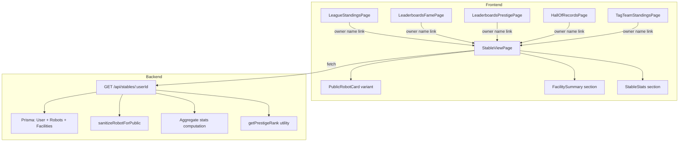

# Design Document: View Other Stables

## Overview

This feature adds a public stable viewing system to Armoured Souls, enabling players to scout opponents by viewing their robots, facilities, and aggregate statistics. The implementation spans a new backend API endpoint (`GET /api/stables/:userId`), a new frontend page (`StableViewPage` at `/stables/:userId`), a read-only robot card variant, and navigation links from 4+ existing pages.

The design reuses the existing `SENSITIVE_ROBOT_FIELDS` sanitization from `robots.ts` to ensure competitive data (23 core attributes, battle config, combat state, equipment) is never exposed. All stables are publicly viewable to any authenticated user — no privacy/visibility system is needed.

### Key Design Decisions

1. **Single API call**: The stable endpoint returns robots, facilities, and stats in one response to minimize round trips and keep the page fast.
2. **Reuse sanitization**: Import `sanitizeRobotForPublic` from `robots.ts` rather than duplicating field-stripping logic.
3. **Component variant via props**: The existing `RobotDashboardCard` is extended with a `variant` prop (`"owner"` | `"public"`) rather than creating a separate component, reducing duplication.
4. **Server-side aggregation**: Stable statistics (total battles, wins, highest ELO, etc.) are computed server-side from robot data, consistent with the existing pattern where these are not stored on the User model.
5. **Prestige rank computed server-side**: The `getPrestigeRank` function from `leaderboards.ts` is extracted to a shared utility so both the leaderboards and stables routes can use it.

## Architecture



### Request Flow

1. User clicks an owner name link on League Standings / Leaderboards / Hall of Records / Tag Team Standings
2. React Router navigates to `/stables/:userId`
3. `StableViewPage` mounts, calls `GET /api/stables/:userId` with auth token
4. Backend validates `userId` param (Zod `positiveIntParam`), queries User with robots and facilities
5. Backend sanitizes each robot via `sanitizeRobotForPublic`, computes aggregate stats, returns response
6. Frontend renders stable header (name, prestige, titles), robot cards, facility summary, and stats

## Components and Interfaces

### Backend

#### New Route: `prototype/backend/src/routes/stables.ts`

```typescript
// GET /api/stables/:userId
// Requires authentication (authenticateToken middleware)
// Validates userId with Zod positiveIntParam
// Returns: { user, robots, facilities, stats }

import { Router } from 'express';
import { z } from 'zod';
import { authenticateToken } from '../middleware/auth';
import { validateRequest } from '../middleware/schemaValidator';
import { positiveIntParam } from '../utils/securityValidation';
import { sanitizeRobotForPublic } from './robots';
import { getPrestigeRank } from '../utils/prestigeUtils';
import prisma from '../lib/prisma';

const router = Router();

const stableParamsSchema = z.object({
  userId: positiveIntParam,
});

router.get('/:userId', authenticateToken, validateRequest({ params: stableParamsSchema }), async (req, res) => {
  // ... implementation
});

export default router;
```

#### Response Shape

```typescript
interface StableResponse {
  user: {
    id: number;
    username: string;
    stableName: string | null;
    prestige: number;
    prestigeRank: string;        // "Novice" | "Established" | "Veteran" | "Elite" | "Champion" | "Legendary"
    championshipTitles: number;
  };
  robots: PublicRobot[];          // Sanitized, sorted by ELO desc
  facilities: FacilitySummary[];
  stats: {
    totalBattles: number;
    totalWins: number;
    totalLosses: number;
    totalDraws: number;
    winRate: number;              // Percentage, 1 decimal
    highestElo: number;
    activeRobots: number;
  };
}

interface PublicRobot {
  id: number;
  name: string;
  imageUrl: string | null;
  elo: number;
  currentLeague: string;
  leaguePoints: number;
  wins: number;
  losses: number;
  draws: number;
  totalBattles: number;
  fame: number;
  kills: number;
  damageDealtLifetime: number;
  damageTakenLifetime: number;
  // All SENSITIVE_ROBOT_FIELDS are stripped
}

interface FacilitySummary {
  type: string;
  name: string;
  level: number;
  maxLevel: number;
}
```

#### Shared Utility: `prototype/backend/src/utils/prestigeUtils.ts`

Extract `getPrestigeRank` and `getFameTier` from `leaderboards.ts` into a shared utility so both `leaderboards.ts` and `stables.ts` can import them without duplication.

```typescript
export function getPrestigeRank(prestige: number): string {
  if (prestige < 1000) return "Novice";
  if (prestige < 5000) return "Established";
  if (prestige < 10000) return "Veteran";
  if (prestige < 25000) return "Elite";
  if (prestige < 50000) return "Champion";
  return "Legendary";
}

export function getFameTier(fame: number): string {
  if (fame < 100) return "Unknown";
  if (fame < 500) return "Known";
  if (fame < 1000) return "Famous";
  if (fame < 2500) return "Renowned";
  if (fame < 5000) return "Legendary";
  return "Mythical";
}
```

#### Route Registration: `prototype/backend/src/index.ts`

Add `app.use('/api/stables', stablesRoutes);` alongside existing route registrations.

### Frontend

#### New Page: `StableViewPage`

Located at `prototype/frontend/src/pages/StableViewPage.tsx`. Registered in `App.tsx` at route `/stables/:userId`.

Sections:
1. **Stable Header**: Username/stable name, prestige with rank title, championship titles, "Back" button
2. **Stable Statistics**: Grid of stat cards (total battles, wins, losses, draws, win rate, highest ELO, active robots)
3. **Robots Section**: Grid of `RobotDashboardCard` components in `"public"` variant, sorted by ELO desc
4. **Facilities Section**: Grouped by category (Economy & Discounts, Capacity & Storage, Training Academies, Advanced Features), each showing name + "Level X/Y" progress

#### Modified Component: `RobotDashboardCard`

Add a `variant` prop:
- `"owner"` (default): Current behavior — shows HP bar, battle readiness badge, weapon info
- `"public"`: Hides HP bar, shield bar, battle readiness badge, weapon details. Shows additional public stats: fame, fame tier, total battles, kills, lifetime damage dealt/taken

```typescript
interface RobotDashboardCardProps {
  robot: { /* existing fields */ };
  variant?: 'owner' | 'public';
}
```

The `"public"` variant conditionally renders:
- Robot image, name, ELO, league, LP, W/D/L record, win rate (same as owner)
- Fame + fame tier badge
- Total battles, kills, lifetime damage dealt, lifetime damage taken
- Omits: HP bar, shield bar, `BattleReadinessBadge`, weapon details

#### Navigation Links: `OwnerNameLink` Component

A small reusable component that renders an owner/stable name as a `<Link>` to `/stables/:userId`:

```typescript
interface OwnerNameLinkProps {
  userId: number;
  displayName: string;
  className?: string;
}
```

This component is used in:
- `LeagueStandingsPage.tsx` — owner column in standings table
- `LeaderboardsFamePage.tsx` — stable name in fame leaderboard
- `LeaderboardsPrestigePage.tsx` — stable name in prestige leaderboard
- `LeaderboardsLossesPage.tsx` — stable name in losses leaderboard
- `HallOfRecordsPage.tsx` — owner names in record cards
- `TagTeamStandingsPage.tsx` — owner names in tag team standings

#### Facility Category Mapping

Reuse the same 4-category grouping from `FacilitiesPage.tsx`:

| Category | Facility Types |
|---|---|
| Economy & Discounts | repair_bay, training_facility, weapons_workshop, merchandising_hub, streaming_studio |
| Capacity & Storage | roster_expansion, storage_facility |
| Training Academies | combat_training_academy, defense_training_academy, mobility_training_academy, ai_training_academy |
| Advanced Features | research_lab, medical_bay, coaching_staff, booking_office |

## Data Models

### Database Queries

The stable endpoint performs a single Prisma query with includes:

```typescript
const user = await prisma.user.findUnique({
  where: { id: userId },
  select: {
    id: true,
    username: true,
    stableName: true,
    prestige: true,
    championshipTitles: true,
    robots: {
      where: { NOT: { name: 'Bye Robot' } },
      orderBy: { elo: 'desc' },
      include: {
        mainWeapon: { include: { weapon: true } },
        offhandWeapon: { include: { weapon: true } },
      },
    },
    facilities: {
      select: {
        facilityType: true,
        level: true,
        maxLevel: true,
      },
    },
  },
});
```

Robots are included with weapon relations so `sanitizeRobotForPublic` can strip them. The `Bye Robot` is excluded from the response.

### Aggregate Stats Computation

Stats are computed server-side from the robot array:

```typescript
const stats = {
  totalBattles: robots.reduce((sum, r) => sum + r.totalBattles, 0),
  totalWins: robots.reduce((sum, r) => sum + r.wins, 0),
  totalLosses: robots.reduce((sum, r) => sum + r.losses, 0),
  totalDraws: robots.reduce((sum, r) => sum + r.draws, 0),
  winRate: totalBattles > 0 ? Number((totalWins / totalBattles * 100).toFixed(1)) : 0,
  highestElo: robots.length > 0 ? Math.max(...robots.map(r => r.elo)) : 0,
  activeRobots: robots.length,
};
```

This matches the existing pattern in `leaderboards.ts` prestige endpoint where stable stats are aggregated at query time.

### Facility Name Resolution

The API returns `facilityType` (e.g., `"repair_bay"`). The frontend maps this to display names using the `FACILITY_TYPES` config or a local mapping. The `maxLevel` comes from the Facility model in the database.


## Correctness Properties

*A property is a characteristic or behavior that should hold true across all valid executions of a system — essentially, a formal statement about what the system should do. Properties serve as the bridge between human-readable specifications and machine-verifiable correctness guarantees.*

### Property 1: Sensitive field stripping on stable endpoint

*For any* robot returned by the `GET /api/stables/:userId` endpoint, the response object shall not contain any key from the `SENSITIVE_ROBOT_FIELDS` constant (23 core attributes, battle config fields `stance`/`yieldThreshold`/`loadoutType`, combat state fields `currentHP`/`currentShield`/`damageTaken`, and equipment IDs `mainWeaponId`/`offhandWeaponId`/`mainWeapon`/`offhandWeapon`).

**Validates: Requirements 2.1, 2.5**

### Property 2: Robot list sorted by ELO descending

*For any* stable response containing two or more robots, each robot's ELO rating shall be greater than or equal to the ELO rating of the next robot in the list.

**Validates: Requirements 2.6**

### Property 3: Stable statistics aggregation correctness

*For any* set of robots belonging to a user, the stable stats returned by the API shall satisfy: `totalBattles` equals the sum of all robots' `totalBattles`, `totalWins` equals the sum of all robots' `wins`, `totalLosses` equals the sum of all robots' `losses`, `totalDraws` equals the sum of all robots' `draws`, `highestElo` equals the maximum `elo` across all robots (or 0 if no robots), and `activeRobots` equals the count of robots.

**Validates: Requirements 4.1, 4.2, 4.3, 4.4**

### Property 4: Prestige rank mapping correctness

*For any* prestige value (non-negative integer), the `getPrestigeRank` function shall return "Novice" for prestige < 1000, "Established" for 1000 ≤ prestige < 5000, "Veteran" for 5000 ≤ prestige < 10000, "Elite" for 10000 ≤ prestige < 25000, "Champion" for 25000 ≤ prestige < 50000, and "Legendary" for prestige ≥ 50000.

**Validates: Requirements 4.5, 1.3**

### Property 5: userId parameter validation rejects invalid inputs

*For any* string that is not a representation of a positive integer (e.g., negative numbers, zero, floats, alphabetic strings, empty strings), the `GET /api/stables/:userId` endpoint shall return a 400 validation error.

**Validates: Requirements 5.4**

### Property 6: Owner and non-owner receive identical stable response

*For any* user viewing their own stable via `GET /api/stables/:userId` where `userId` matches the authenticated user's ID, the response shape and data shall be identical to what any other authenticated user would receive for the same `userId`.

**Validates: Requirements 1.4**

### Property 7: Facility category grouping completeness

*For any* facility type string from the set of 15 known facility types, the category grouping function shall assign it to exactly one of the four categories (Economy & Discounts, Capacity & Storage, Training Academies, Advanced Features), and no facility type shall be left ungrouped.

**Validates: Requirements 3.2**

## Security Compliance

This section explicitly maps the design to every applicable security standard from the project's coding standards.

### Authentication & Authorization

- **JWT authentication**: The `authenticateToken` middleware is applied to `GET /api/stables/:userId`, ensuring only authenticated users can access stable data. Unauthenticated requests receive 401.
- **No admin authorization required**: This is a player-facing read-only endpoint. No `requireAdmin` middleware is needed.
- **No ownership verification required**: This endpoint reads another user's public data — there is no user-owned resource being mutated. The `verifyRobotOwnership` / `verifyFacilityOwnership` helpers from `src/middleware/ownership.ts` do not apply.

### Input Validation (Zod)

- **Zod schema on params**: The `userId` parameter is validated using `positiveIntParam` from `src/utils/securityValidation.ts` via the `validateRequest` middleware. Invalid values (negative, zero, float, non-numeric) return 400.
- **No body or query params**: The endpoint accepts no request body or query parameters, so no additional schemas are needed. Zod's default `.strip()` mode prevents mass-assignment on any future additions.

### Rate Limiting

- **General API rate limiter**: The endpoint is covered by the existing general API rate limiter (300 req/min) applied at the app level. No dedicated per-user rate limiter is needed because this is a read-only, non-destructive endpoint.
- **No economic impact**: No credits are spent, no resources are created or modified — `lockUserForSpending` and `pg_advisory_xact_lock` do not apply.

### Sensitive Data Protection

- **Robot data sanitization**: All robots are passed through `sanitizeRobotForPublic` (imported from `robots.ts`), which strips the `SENSITIVE_ROBOT_FIELDS` array: 23 core attributes, `stance`, `yieldThreshold`, `loadoutType`, `mainWeaponId`, `offhandWeaponId`, `mainWeapon`, `offhandWeapon`, `currentHP`, `currentShield`, `damageTaken`.
- **No PII exposure**: The response includes only `username`, `stableName`, and game statistics. No email, password hash, or other PII is selected in the Prisma query.
- **Prisma `select` clause**: The query uses explicit `select` fields rather than selecting all columns, ensuring no accidental data leakage from new columns added to the User model in the future.

### SQL Injection Prevention

- **Prisma parameterized queries**: All database access uses Prisma's query builder, which parameterizes all inputs. No raw SQL is used.

### Error Handling Security

- **Generic error messages**: Error responses use generic messages ("User not found", "Failed to load stable data") that do not reveal internal implementation details, database structure, or whether a specific user ID exists in other contexts.
- **Express 5 error middleware**: Unhandled errors propagate to the centralized `errorHandler` middleware, which logs full details server-side but returns sanitized messages to clients.

### CORS & HTTPS

- **CORS**: Handled at the app level via the existing CORS middleware with whitelisted origins. No per-route CORS configuration needed.
- **HTTPS**: Enforced by Caddy in production. No per-route TLS configuration needed.

### ESLint Security Rules

- **`eslint-plugin-security`**: The existing ESLint config applies security rules to all backend TypeScript files. The new `stables.ts` route file is automatically covered. No `eval()`, dynamic `require()`, or unsafe patterns are used in this design.

## Error Handling

### Backend Errors

| Scenario | HTTP Status | Response Body | Implementation |
|---|---|---|---|
| User not found | 404 | `{ error: "User not found" }` | Check `prisma.user.findUnique` returns null |
| Invalid userId param | 400 | `{ error: "Invalid URL parameters", code: "VALIDATION_ERROR" }` | Zod `positiveIntParam` via `validateRequest` middleware |
| Unauthenticated request | 401 | `{ error: "Authentication required" }` | `authenticateToken` middleware |
| Database error | 500 | `{ error: "Failed to load stable data" }` | Caught by Express 5 error middleware |

### Frontend Error States

| State | Trigger | UI |
|---|---|---|
| Loading | API request in progress | Skeleton/spinner with "Loading stable..." |
| Not Found (404) | API returns 404 | "Stable not found" message + back link |
| Network Error | Fetch fails / 5xx | "Failed to load stable. Please try again." + retry button |
| Empty Robots | API returns `robots: []` | "This stable has no robots yet" in robots section |

Error handling follows the existing `AppError` hierarchy pattern. The route handler lets errors propagate to the centralized `errorHandler` middleware (Express 5 auto-forwards rejected promises).

## Testing Strategy

### Property-Based Testing (fast-check)

Each correctness property maps to a single property-based test with minimum 100 iterations. Tests use `fast-check` (already in the project for both backend and frontend).

**Backend property tests** (`prototype/backend/tests/stableSanitization.property.test.ts`):
- Property 1: Generate random robot objects with all fields, run `sanitizeRobotForPublic`, assert no sensitive fields remain
  - Tag: `Feature: view-other-stables, Property 1: Sensitive field stripping on stable endpoint`
- Property 2: Generate random arrays of robots with random ELO values, sort by ELO desc, verify ordering invariant
  - Tag: `Feature: view-other-stables, Property 2: Robot list sorted by ELO descending`
- Property 3: Generate random arrays of robot stat objects, compute aggregation, verify sums/max match
  - Tag: `Feature: view-other-stables, Property 3: Stable statistics aggregation correctness`
- Property 4: Generate random non-negative integers, verify `getPrestigeRank` returns correct rank per threshold table
  - Tag: `Feature: view-other-stables, Property 4: Prestige rank mapping correctness`
- Property 5: Generate random invalid userId strings (negatives, floats, alpha, empty), verify Zod schema rejects them
  - Tag: `Feature: view-other-stables, Property 5: userId parameter validation rejects invalid inputs`
- Property 7: Generate facility type strings from the known set, verify each maps to exactly one category
  - Tag: `Feature: view-other-stables, Property 7: Facility category grouping completeness`

**Property 6** (owner vs non-owner consistency) is best tested as an integration test since it requires two authenticated sessions hitting the same endpoint.

### Unit Tests

Unit tests cover specific examples, edge cases, and error conditions:

**Backend** (`prototype/backend/tests/stables.test.ts`):
- 404 for non-existent user
- 401 for unauthenticated request
- Correct response shape for a user with robots and facilities
- Empty robots array for user with no robots
- Bye Robot excluded from response
- Facility name resolution from type

**Frontend** (`prototype/frontend/src/pages/__tests__/StableViewPage.test.tsx`):
- Renders loading state
- Renders 404 error state with back link
- Renders network error state with retry button
- Renders empty robots message
- Renders stable header with prestige rank
- Robot cards navigate to `/robots/:id` on click
- Back button navigates to previous page

**Frontend** (`prototype/frontend/src/components/__tests__/RobotDashboardCard.test.tsx`):
- Public variant renders fame, kills, lifetime damage
- Public variant does not render HP bar, battle readiness badge, weapon info
- Owner variant (default) renders HP bar and battle readiness

### Testing Libraries

- Backend: Jest 30 + fast-check 4
- Frontend: Vitest 4 + @testing-library/react 16 + fast-check 4

### Documentation Impact

The following files will need creating or updating after implementation:
- `docs/prd_pages/PRD_STABLE_VIEW_PAGE.md` — **new file**, page-level PRD for the stable view page (consistent with existing PRD docs for every page in the game)
- `docs/prd_core/ARCHITECTURE.md` — add `/api/stables` to the API Routes table and `StableViewPage` to the Pages list
- `docs/guides/MODULE_STRUCTURE.md` — add the stables route to the route listing
- `.kiro/steering/` — no steering files reference stable viewing patterns, so no updates needed
