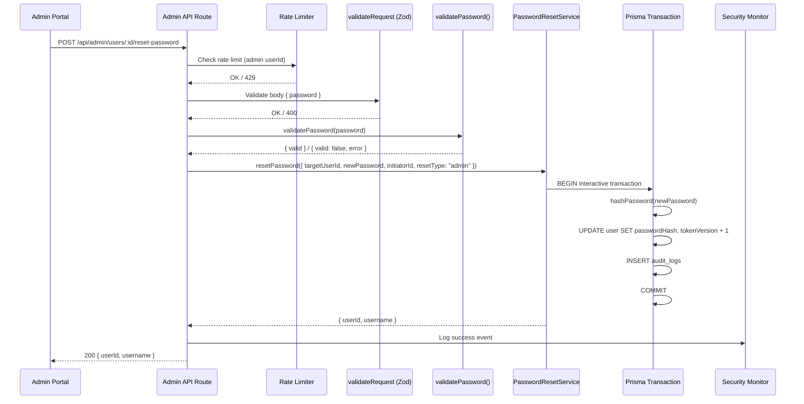

# Design Document: Admin Password Reset

## Overview

This design adds a secure, auditable admin password reset feature to Armoured Souls. The implementation follows a layered architecture: a reusable `PasswordResetService` encapsulates the transactional core (hash + invalidate + audit), an Express route handler exposes it as an admin endpoint, and a React tab component provides the UI.

The design prioritizes zero duplication — every existing module listed in the requirements is reused directly. The `PasswordResetService` is intentionally decoupled from the admin context so that future email-based self-service resets can call it without modification.



## Architecture

### Component Placement

All new backend code lives within the existing project structure:

| New Component | Location | Rationale |
|---|---|---|
| `PasswordResetService` | `app/backend/src/services/auth/passwordResetService.ts` | Sits alongside `passwordService.ts` and `userService.ts` in the auth domain |
| Password reset route handlers | `app/backend/src/routes/admin.ts` (appended) | All admin endpoints live in this single router file |
| Admin user search route handler | `app/backend/src/routes/admin.ts` (appended) | Same router, new `GET /users/search` endpoint |
| `PasswordResetTab` component | `app/frontend/src/components/admin/PasswordResetTab.tsx` | Follows the existing tab component pattern |

### Reuse Map

Every existing component from the requirements table is consumed directly — no wrappers, no re-implementations:

| Existing Component | Consumed By | How |
|---|---|---|
| `validatePassword()` | Route handler (backend), `PasswordResetTab` (frontend) | Direct import. Backend calls it in the route handler before delegating to the service. Frontend duplicates the same rules inline (as `RegistrationForm.tsx` already does — no shared validation module exists on the frontend). |
| `hashPassword()` | `PasswordResetService` | Direct import from `passwordService.ts` |
| `findUserByIdentifier()` | Admin user search route handler | Direct import from `userService.ts` for username/email lookup |
| `positiveIntParam` | Zod schema for `:id` route param | Direct import from `securityValidation.ts` |
| `validateRequest` | Route middleware chain | Direct import from `schemaValidator.ts` |
| `authenticateToken` + `requireAdmin` | Route middleware chain | Already imported in `admin.ts` |
| `securityMonitor` | Route handler + rate limiter | Already imported in `admin.ts` |
| `AppError` | Error responses | Already imported in `admin.ts` |
| `AdminPage.tsx` tab pattern | New tab registration | Add `PasswordResetTab` to the tab union type, `VALID_TABS`, `TAB_LABELS`, barrel export, and render switch |

## Components and Interfaces

### PasswordResetService

```typescript
// app/backend/src/services/auth/passwordResetService.ts

interface ResetInitiator {
  initiatorId: number;       // Who triggered the reset (admin userId, or future: system/token-based)
  resetType: string;         // "admin" | "self_service" | future types
}

interface ResetResult {
  userId: number;
  username: string;
}

/**
 * Resets a user's password within a single Prisma interactive transaction.
 * Atomically: hashes the new password, updates the user record,
 * increments tokenVersion (invalidating all sessions), and writes an audit log entry.
 *
 * Designed for reuse — the initiator context is generic, not admin-specific.
 *
 * @param targetUserId - The user whose password is being reset
 * @param newPassword - The new plaintext password (must already pass validatePassword())
 * @param initiator - Who/what triggered the reset and the reset type
 * @returns The target user's ID and username
 * @throws {AppError} USER_NOT_FOUND (404) if targetUserId doesn't exist
 * @throws {Error} If the transaction fails (auto-rollback)
 */
async function resetPassword(
  targetUserId: number,
  newPassword: string,
  initiator: ResetInitiator,
): Promise<ResetResult>;
```

The service uses `prisma.$transaction` (interactive mode) to:
1. Look up the target user (throw 404 if not found)
2. Call `hashPassword(newPassword)` from `passwordService.ts`
3. Update the user's `passwordHash` and increment `tokenVersion` by 1
4. Write an `AuditLog` entry with `eventType: "admin_password_reset"`, the initiator's ID, target user ID, resetType, and timestamp
5. Return `{ userId, username }`

The audit log payload shape:

```typescript
{
  adminId: number;          // initiator.initiatorId
  targetUserId: number;
  resetType: string;        // initiator.resetType
  // NO password or hash fields
}
```

### Admin Password Reset Route

Appended to `app/backend/src/routes/admin.ts`:

```
POST /api/admin/users/:id/reset-password
```

Middleware chain: `resetPasswordLimiter` → `authenticateToken` → `requireAdmin` → `validateRequest({ params, body })` → handler

Zod schemas:

```typescript
const resetPasswordParamsSchema = z.object({
  id: positiveIntParam,
});

const resetPasswordBodySchema = z.object({
  password: z.string(),
});
```

The handler:
1. Extracts `id` from validated params, `password` from validated body
2. Calls `validatePassword(password)` — returns 400 with the specific error if invalid
3. Calls `PasswordResetService.resetPassword(id, password, { initiatorId: req.user.userId, resetType: "admin" })`
4. Logs the attempt (success or failure) via `securityMonitor` with eventType `admin_password_reset`
5. Returns `200 { success: true, userId, username }`

### Admin User Search Route

Appended to `app/backend/src/routes/admin.ts`:

```
GET /api/admin/users/search?q=<query>
```

Middleware chain: `authenticateToken` → `requireAdmin` → `validateRequest({ query })` → handler

Zod schema:

```typescript
const userSearchQuerySchema = z.object({
  q: z.string().min(1).max(50),
});
```

The handler:
1. If `q` is a numeric string, search by exact user ID first
2. Search by username (partial, case-insensitive) using Prisma `contains` with `mode: 'insensitive'`
3. Search by email (partial, case-insensitive) using Prisma `contains` with `mode: 'insensitive'`
4. Deduplicate results (a user might match both username and email)
5. Limit to 10 results
6. Return only `{ id, username, email, stableName }` per user — use Prisma `select` to exclude sensitive fields

This also leverages `findUserByIdentifier()` for exact username/email matches, but adds partial matching via direct Prisma queries for the search use case.

### Rate Limiter

```typescript
const resetPasswordLimiter = rateLimit({
  windowMs: 15 * 60 * 1000,  // 15 minutes
  max: 10,
  standardHeaders: true,
  legacyHeaders: false,
  validate: false,
  keyGenerator: (req) => {
    const authReq = req as AuthRequest;
    return `admin-reset:${authReq.user?.userId?.toString() || req.ip || 'unknown'}`;
  },
  handler: (req, res) => {
    const authReq = req as AuthRequest;
    if (authReq.user?.userId) {
      securityMonitor.trackRateLimitViolation(authReq.user.userId, req.originalUrl);
    }
    res.status(429).json({
      error: 'Too many password reset attempts. Try again later.',
      code: 'RATE_LIMIT_EXCEEDED',
      retryAfter: 900,  // 15 minutes in seconds
    });
  },
});
```

This follows the exact same pattern as the `resetLimiter` in `onboarding.ts`.

### PasswordResetTab (Frontend)

New file: `app/frontend/src/components/admin/PasswordResetTab.tsx`

The component has two sections:
1. **User Search** — a text input with a search button. On submit, calls `GET /api/admin/users/search?q=...`. Displays results as a clickable list showing ID, username, email, and stable name.
2. **Password Reset Form** — appears after selecting a user. Shows the selected user's details (ID, username, stable name), a password field, a confirm password field, and a submit button. Client-side validation checks password rules (same as `RegistrationForm.tsx`) and confirm match before submitting.

State management: local `useState` only — this is a single-tab form, no cross-page state needed.

API calls use the existing `apiClient` (Axios instance with JWT interceptor).

Frontend password validation replicates the same rules as `RegistrationForm.tsx` (8+ chars, uppercase, lowercase, number). There is no shared frontend validation module — `RegistrationForm.tsx` and `ProfilePage.tsx` both define their own inline validators. The `PasswordResetTab` follows this existing pattern.

### AdminPage.tsx Changes

- Add `'password-reset'` to the `TabType` union and `VALID_TABS` array
- Add `'password-reset': '🔑 Password Reset'` to `TAB_LABELS`
- Import `PasswordResetTab` from the barrel export
- Add the tab panel render block

### Barrel Export Update

Add `export { PasswordResetTab } from './PasswordResetTab';` to `app/frontend/src/components/admin/index.ts`.

## Data Models

### Existing Models Used (No Changes)

**User model** — the `passwordHash` and `tokenVersion` fields are updated by the `PasswordResetService`. No schema changes needed.

**AuditLog model** — the existing `audit_logs` table is used to record password reset events. The flexible `payload` JSON field stores the reset-specific data. No schema changes needed.

Fields used:
- `cycleNumber`: Set to 0 (password resets are not cycle-bound)
- `eventType`: `"admin_password_reset"`
- `userId`: The admin who performed the reset (initiator)
- `payload`: `{ adminId, targetUserId, resetType }` — no password or hash

### API Response Shapes

**Password Reset Success (200):**
```json
{
  "success": true,
  "userId": 42,
  "username": "player1"
}
```

**User Search Results (200):**
```json
{
  "users": [
    { "id": 42, "username": "player1", "email": "player1@example.com", "stableName": "Iron Fist" }
  ]
}
```

**Validation Error (400):**
```json
{
  "error": "Password must be at least 8 characters",
  "code": "VALIDATION_ERROR"
}
```

**Rate Limit Exceeded (429):**
```json
{
  "error": "Too many password reset attempts. Try again later.",
  "code": "RATE_LIMIT_EXCEEDED",
  "retryAfter": 900
}
```

## Correctness Properties

*A property is a characteristic or behavior that should hold true across all valid executions of a system — essentially, a formal statement about what the system should do. Properties serve as the bridge between human-readable specifications and machine-verifiable correctness guarantees.*

### Property 1: Password validation delegation

*For any* string `s`, the admin password reset API SHALL accept `s` as a valid password if and only if `validatePassword(s)` returns `{ valid: true }`. When `validatePassword(s)` returns `{ valid: false, error }`, the API SHALL return a 400 response containing that error message.

**Validates: Requirements 2.4, 3.2, 3.5**

### Property 2: Invalid userId rejection

*For any* value that is not a positive integer (zero, negative numbers, floats, non-numeric strings, empty strings), the admin password reset API SHALL return a 400 validation error.

**Validates: Requirements 3.4**

### Property 3: No password leakage in logs or audit

*For any* password string used in a reset attempt (successful or failed), neither the plaintext password nor its bcrypt hash SHALL appear in any security monitor event details or audit log payload.

**Validates: Requirements 5.4, 6.3**

### Property 4: Token version increment

*For any* valid password and any target user, after a successful password reset, the target user's `tokenVersion` SHALL be exactly `previousTokenVersion + 1`.

**Validates: Requirements 7.1, 11.5**

### Property 5: Hash verification round-trip

*For any* valid password string (8–128 chars, containing uppercase, lowercase, and digit), the `PasswordResetService` SHALL produce a bcrypt hash that passes `bcrypt.compare(password, hash)`.

**Validates: Requirements 11.4**

### Property 6: Search result limit invariant

*For any* search query string (1–50 chars) against any user dataset, the admin user search API SHALL return at most 10 results.

**Validates: Requirements 10.2**

### Property 7: Search result field safety

*For any* search result returned by the admin user search API, the result object SHALL contain only the fields `id`, `username`, `email`, and `stableName` — no `passwordHash`, `tokenVersion`, or other sensitive fields.

**Validates: Requirements 10.3**

### Property 8: Search query validation

*For any* string that is empty or longer than 50 characters, the admin user search API SHALL return a 400 validation error.

**Validates: Requirements 10.4**

## Error Handling

All errors use the existing `AppError` hierarchy and are caught by the centralized error middleware. Express 5 auto-forwards rejected promises.

| Scenario | Error Code | HTTP Status | Source |
|---|---|---|---|
| Target user not found | `USER_NOT_FOUND` | 404 | `PasswordResetService` throws `AppError` |
| Invalid password (fails `validatePassword()`) | `VALIDATION_ERROR` | 400 | Route handler, before calling service |
| Invalid userId (Zod validation) | `VALIDATION_ERROR` | 400 | `validateRequest` middleware |
| Invalid search query (Zod validation) | `VALIDATION_ERROR` | 400 | `validateRequest` middleware |
| No JWT token | `Access token required` | 401 | `authenticateToken` middleware |
| Non-admin role | `Admin access required` | 403 | `requireAdmin` middleware |
| Rate limit exceeded | `RATE_LIMIT_EXCEEDED` | 429 | `resetPasswordLimiter` middleware |
| Transaction failure (DB error) | `INTERNAL_ERROR` | 500 | Prisma transaction rollback, caught by error middleware |

Password validation errors are returned with the specific failure reason from `validatePassword()` (e.g., "Password must contain at least one uppercase letter") so the admin sees exactly what rule was violated.

The `PasswordResetService` does NOT catch internal errors — if the Prisma transaction fails, the error propagates to the error middleware, which logs it and returns a generic 500. This ensures the transaction is fully rolled back (Prisma interactive transactions auto-rollback on throw).

## Testing Strategy

### Property-Based Tests (fast-check)

Each correctness property maps to a single `fast-check` property test with minimum 100 iterations. Tests are tagged with the property reference.

| Property | Test Description | Generator Strategy |
|---|---|---|
| Property 1 | Generate random strings (0–200 chars, mix of character classes), verify API accept/reject matches `validatePassword()` | `fc.string()` with length constraints |
| Property 2 | Generate invalid userId values (0, negatives, floats, strings), verify 400 response | `fc.oneof(fc.constant(0), fc.integer({max: -1}), fc.double(), fc.string())` |
| Property 3 | Generate valid passwords, perform reset, inspect all security events and audit log payloads for password/hash leakage | `fc.string()` filtered to valid passwords |
| Property 4 | Generate valid passwords, record tokenVersion before reset, verify it's +1 after | `fc.string()` filtered to valid passwords |
| Property 5 | Generate valid passwords (8–128 chars with required character classes), hash via service, verify `bcrypt.compare` | Custom generator: `fc.tuple(fc.string(), fc.string(), fc.string(), fc.string())` mapped to ensure uppercase + lowercase + digit + padding |
| Property 6 | Generate search queries, seed DB with 0–50 users, verify result count ≤ 10 | `fc.string({minLength: 1, maxLength: 50})` |
| Property 7 | Generate search queries, verify returned objects have only safe fields | `fc.string({minLength: 1, maxLength: 50})` |
| Property 8 | Generate strings of length 0 or 51–200, verify 400 response | `fc.oneof(fc.constant(''), fc.string({minLength: 51, maxLength: 200}))` |

### Unit Tests (Jest)

Unit tests cover specific examples, edge cases, and integration points:

**PasswordResetService:**
- Successful reset: hash updated, tokenVersion incremented, audit log created
- Non-existent user: throws 404
- Transaction rollback on failure: mock DB error mid-transaction, verify no partial writes
- Audit log contains correct fields (adminId, targetUserId, resetType, no password)

**Route Handler (password reset):**
- Successful reset returns 200 with userId and username
- Missing password field returns 400
- Short password returns 400 with specific message
- Non-existent user returns 404
- Unauthenticated request returns 401
- Non-admin request returns 403
- Rate limit exceeded returns 429 with retryAfter

**Route Handler (user search):**
- Search by username (partial match)
- Search by email (partial match)
- Search by numeric user ID (exact match)
- Empty results returns empty array
- Query too long returns 400
- Empty query returns 400

**Frontend (PasswordResetTab):**
- Renders search input and form
- Displays search results
- Shows "No users found" for empty results
- Validates password rules client-side
- Validates password confirmation match
- Disables submit button during request
- Shows success message on 200
- Shows error message on API error

### Test File Organization

```
app/backend/src/__tests__/
  services/auth/passwordResetService.test.ts    # Service unit + property tests
  routes/admin-password-reset.test.ts           # Route handler unit + property tests

app/frontend/src/components/admin/__tests__/
  PasswordResetTab.test.tsx                     # Component tests
```

All backend tests run via `npm test -- --testPathPattern="password-reset"`.

### Documentation Impact

The following existing files need updates:
- `docs/prd_core/PRD_SECURITY.md` — new rate limiter entry in Section 5 and new Security Playbook entry in Section 11 for admin password reset
- `.kiro/steering/coding-standards.md` — if the rate limiting section needs the new endpoint added as an example (currently lists account reset at 3 req/hr)
- `PasswordResetService` JSDoc — documents public interface, parameters, return values, and extension points for future reset flows
