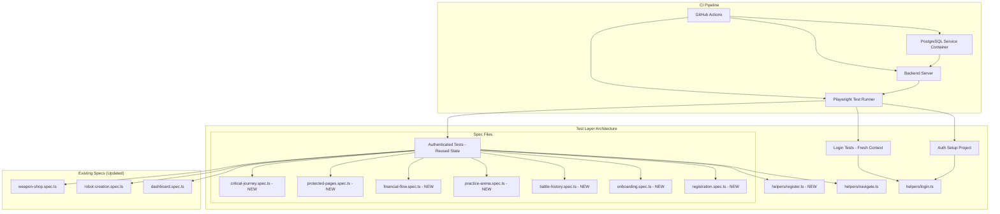

# Design Document: E2E Playwright Coverage

## Overview

This design establishes comprehensive E2E test coverage for the Armoured Souls application using Playwright. The existing infrastructure (config, auth setup, navigation helper) provides a solid foundation. This design extends it with 7 new spec files, 2 new helper modules, and a fully provisioned CI pipeline job — bringing the total from 4 spec files with shallow coverage to 11+ spec files covering all critical user flows.

The architecture follows a layered approach: reusable helpers at the bottom, individual flow specs in the middle, and a critical journey integration test at the top. The CI pipeline provisions a full backend environment (PostgreSQL + seeded database + running server) so E2E tests run against real infrastructure.

### Key Design Decisions

1. **Register via UI, not API seeding** — Fresh-user tests register through the Registration_Form to exercise the registration code path end-to-end. This catches regressions in the form, validation, and auth flow that API seeding would miss.
2. **Reuse existing auth state for seeded-user tests** — Tests operating on a seeded test user's pre-existing data (robots, weapons) reuse the `auth.setup.ts` storage state pattern. The auth setup must be updated to use `test_user_001` (password: `testpass123`) since the old `player1` account was removed in a previous seed overhaul. No need to re-login per test.
3. **Serial execution preserved** — The existing `fullyParallel: false` + `workers: 1` config prevents test interference. E2E tests mutate shared state (credits, robots, weapons), so parallelism would cause flakes.
4. **Unique data per run** — Registration and robot creation tests use timestamp-based unique identifiers to prevent collisions across CI runs and local development.

## Architecture



### Playwright Project Configuration

The existing 3-project setup remains unchanged:

| Project | Purpose | Auth State |
|---------|---------|------------|
| `setup` | Logs in as test_user_001, saves storage state | Creates `.auth/test_user_001.json` |
| `login-tests` | Tests that need unauthenticated context | Empty (no cookies/storage) |
| `chromium` | All other tests (reuses test_user_001 auth) | Loads `.auth/test_user_001.json` |

Tests requiring a fresh user (registration, onboarding, critical journey) register a new account within the test body using the `registerNewUser` helper, which operates within the `chromium` project but creates its own authenticated session.

## Components and Interfaces

### New Helper: `tests/e2e/helpers/register.ts`

Encapsulates user registration through the UI for tests that need a fresh account.

```typescript
interface RegisterOptions {
  username?: string;   // Auto-generated if omitted
  email?: string;      // Auto-generated if omitted
  password?: string;   // Defaults to 'TestPass123!'
  stableName?: string; // Auto-generated if omitted
}

interface RegisterResult {
  username: string;
  email: string;
  password: string;
  stableName: string;
}

/**
 * Registers a new user via the Registration_Form UI.
 * Generates unique identifiers using timestamp + random suffix.
 * Waits for redirect to /onboarding or /dashboard.
 * Returns the credentials used for subsequent assertions.
 */
async function registerNewUser(
  page: Page,
  options?: RegisterOptions
): Promise<RegisterResult>;

/**
 * Generates a unique identifier with format: `e2e_{timestamp}_{randomSuffix}`
 * Used for usernames, emails, and stable names to prevent collisions.
 */
function generateUniqueId(): string;
```

### Updated Helper: `tests/e2e/helpers/navigate.ts`

The existing `navigateToProtectedPage` function has good retry logic but its fallback calls `loginAndGoToDashboard(page, 'player1', 'password123')` — must be updated to use `test_user_001` / `testpass123`.

### Existing Helper: `tests/e2e/helpers/login.ts`

The existing `loginAndGoToDashboard` function handles onboarding skip. Must be updated to change the default credentials from `player1` / `password123` to `test_user_001` / `testpass123` to match the current seed data.

### Updated File: `tests/e2e/auth.setup.ts`

Must be updated to log in as `test_user_001` (password: `testpass123`) instead of the removed `player1` account. The storage state file path changes from `.auth/player1.json` to `.auth/test_user_001.json`.

### Updated File: `playwright.config.ts`

The `storageState` path in the `chromium` project must be updated from `.auth/player1.json` to `.auth/test_user_001.json`.

### New Spec Files

| File | Requirements | Auth Strategy | Description |
|------|-------------|---------------|-------------|
| `registration.spec.ts` | Req 1 | Fresh context per test (registers new users) | Registration form validation, success, and error flows |
| `onboarding.spec.ts` | Req 2 | Registers fresh user, then tests onboarding | 5-step progress, skip tutorial, budget tracker |
| `battle-history.spec.ts` | Req 4 | Reuses test_user_001 auth state | Battle list, filtering, sorting, search, detail navigation |
| `practice-arena.spec.ts` | Req 6 | Reuses test_user_001 auth state | Slot selection, simulation run, batch results, history |
| `financial-flow.spec.ts` | Req 7 | Reuses test_user_001 auth state | Facility upgrades, robot upgrades, income dashboard |
| `protected-pages.spec.ts` | Req 11 | Reuses test_user_001 auth + unauthenticated test | Smoke tests for 7 protected pages + redirect check |
| `critical-journey.spec.ts` | Req 8 | Registers fresh user, sequential flow | Registration → onboarding skip → robot → weapon → equip → practice battle → battle history |

### Existing Spec Files (Require Audit and Update)

All existing spec files depend on the broken `player1` auth setup and contain anti-patterns that violate Req 12 (flake prevention). Each file must be audited and updated:

| File | Issues Found | Action Required |
|------|-------------|-----------------|
| `login.spec.ts` | Uses `player1` / `password123` in valid-login test; manual screenshot paths (redundant with config) | Update credentials to `test_user_001` / `testpass123`; remove manual screenshot calls |
| `dashboard.spec.ts` | CSS class selectors (`.bg-surface.border.border-gray-700`); `waitForTimeout(1000)`; conditional logic that hides failures | Replace CSS selectors with role/text locators; replace `waitForTimeout` with explicit waits; remove conditional branches that swallow failures |
| `robot-creation.spec.ts` | `waitForTimeout(500)`; regex label locators | Replace `waitForTimeout` with explicit waits; simplify locators |
| `weapon-shop.spec.ts` | Heavy CSS selectors (`.bg-gray-800.p-6.rounded-lg`, `.bg-purple-900`, `.text-xl.font-semibold.cursor-pointer`, `.flex.gap-2`); many `waitForTimeout` calls; fragile locator chains | Major rewrite: replace all CSS selectors with role/text/label locators; replace all `waitForTimeout` with condition-based waits |

All four files also have manual `page.screenshot()` calls with hardcoded paths — these are redundant since `playwright.config.ts` already captures screenshots on failure. The manual calls should be removed to reduce noise.

### CI Pipeline Job: `e2e-tests`

New job added to `.github/workflows/ci.yml`:

```yaml
e2e-tests:
  name: E2E Tests
  runs-on: ubuntu-latest
  timeout-minutes: 15
  needs: [backend-unit-tests, frontend-tests]

  services:
    postgres:
      image: postgres:17
      env:
        POSTGRES_USER: postgres
        POSTGRES_PASSWORD: postgres
        POSTGRES_DB: armouredsouls_e2e
      options: >-
        --health-cmd pg_isready
        --health-interval 10s
        --health-timeout 5s
        --health-retries 5
        --shm-size=256mb
      ports:
        - 5432:5432

  steps:
    # 1. Checkout + Node.js setup
    # 2. Install backend deps + generate Prisma client
    # 3. Run migrations + seed database
    # 4. Start backend server (background)
    # 5. Install frontend deps + build frontend
    # 6. Install Playwright browsers
    # 7. Run Playwright tests with PLAYWRIGHT_BASE_URL pointing to local server
    # 8. Upload HTML report + failure artifacts (screenshots, videos, traces)
```

The job:
- Depends on `backend-unit-tests` and `frontend-tests` to fail fast on obvious issues
- Uses the same PostgreSQL service container pattern as `backend-integration-tests`
- Seeds the database with `npx prisma db seed` to populate test data
- Starts the backend with `node dist/server.js` in the background
- Builds and serves the frontend (or uses Vite preview)
- Sets `PLAYWRIGHT_BASE_URL` so Playwright doesn't start its own dev server
- Uploads Playwright HTML report and failure artifacts as GitHub Actions artifacts
- Has a 15-minute timeout to catch hung tests

## Data Models

### Test Data Strategy

No new database models are introduced. The E2E tests operate against the existing seeded database:

| Data Source | Used By | Notes |
|-------------|---------|-------|
| `test_user_001` (seeded) | Auth setup, dashboard, battle history, weapon shop, practice arena, financial flow, protected pages | Seeded test user with WimpBot robot, Practice Sword weapon, ₡100,000 starting credits |
| `admin` (seeded) | Not used in E2E tests | Admin flows are out of scope |
| WimpBot users (seeded) | Practice arena (as sparring opponents) | 200 seeded test users with robots |
| Fresh registered users | Registration, onboarding, critical journey | Created per test run via UI registration |

### Unique Data Generation

Fresh-user tests generate unique identifiers to prevent collisions:

```
Username:    e2e_1719849600123_a7b3
Email:       e2e_1719849600123_a7b3@test.armouredsouls.com
Stable Name: E2E Stable 1719849600123 a7b3
```

The timestamp component ensures uniqueness across CI runs. The random suffix handles parallel local runs (though tests run serially, developers may run subsets concurrently).

## Error Handling

### Test Failure Artifacts

When a test fails, Playwright captures:
- **Screenshot** — Full-page screenshot at the point of failure
- **Video** — Full test recording (retained on failure only)
- **Trace** — Playwright trace file on first retry (includes network requests, DOM snapshots, console logs)

These are uploaded as GitHub Actions artifacts for debugging.

### Auth Race Condition Handling

The existing `navigateToProtectedPage` helper handles the race condition where `ProtectedRoute` redirects to `/login` before `AuthProvider` finishes restoring the session from `storageState`. It retries up to 3 times with 1.5s delays, then falls back to a full login flow.

### Network Timeout Strategy

- `page.waitForLoadState('networkidle')` for page loads
- Explicit `waitForSelector` / `toBeVisible` with reasonable timeouts for dynamic content
- No fixed `waitForTimeout` delays (per Req 12.1) — all waits are condition-based
- Exception: existing tests that use `waitForTimeout` will be left as-is to avoid scope creep; new tests will not use it

### CI Timeout

The E2E job has a 15-minute `timeout-minutes` setting. If tests hang (e.g., backend crash, database connection pool exhaustion), the job is killed and reports a timeout failure.

## Testing Strategy

### Why Property-Based Testing Does Not Apply

This feature is entirely about E2E browser tests. PBT is not appropriate because:
- E2E tests exercise UI interactions through a real browser, not pure functions
- Each test verifies a specific user journey with concrete steps (click button, fill form, verify redirect)
- There is no meaningful "for all inputs X, property P(X) holds" statement for browser flow tests
- Running 100+ browser iterations per property would be prohibitively slow and provide no additional bug-finding value over well-chosen example scenarios

### Testing Approach

All testing is example-based E2E testing using Playwright:

- **Positive flows**: Verify that happy-path user journeys complete successfully (registration, onboarding, robot creation, weapon purchase, practice battle)
- **Negative flows**: Verify that validation errors display correctly (duplicate username, short password, insufficient credits, empty fields)
- **Smoke tests**: Verify that protected pages load and render their primary content without errors
- **Integration flow**: The critical journey test chains multiple flows into a single sequential test to verify the full new-player experience

### Locator Strategy (Req 12.2)

New tests use Playwright's recommended locator hierarchy:
1. `getByRole` — Buttons, headings, links, textboxes (preferred)
2. `getByLabel` — Form inputs with associated labels
3. `getByText` — Visible text content
4. `getByPlaceholder` — Input placeholders (fallback)
5. CSS selectors — Avoided entirely in new tests

### Test Execution Configuration (Req 12.3–12.5)

Unchanged from existing `playwright.config.ts`:
- Serial execution: `fullyParallel: false`, `workers: 1`
- Retries: 2 in CI, 0 locally
- Screenshots: on failure
- Video: retain on failure
- Trace: on first retry

### Test Count Targets

| Spec File | Estimated Test Count |
|-----------|---------------------|
| `registration.spec.ts` | 5–6 |
| `onboarding.spec.ts` | 4–5 |
| `battle-history.spec.ts` | 5–6 |
| `practice-arena.spec.ts` | 4–5 |
| `financial-flow.spec.ts` | 4–5 |
| `protected-pages.spec.ts` | 3–4 |
| `critical-journey.spec.ts` | 1 (sequential multi-step) |
| Existing specs (4 files, audited) | ~25 (updated, anti-patterns removed) |
| **Total** | **~55+ test cases** |

## Requirements Traceability

| Requirement | Design Component |
|-------------|-----------------|
| Req 1: Registration E2E Flow | `registration.spec.ts` + `helpers/register.ts`; updated `login.spec.ts` (valid-login test credentials fix) |
| Req 2: Onboarding E2E Flow | `onboarding.spec.ts` + `helpers/register.ts` |
| Req 3: Robot Creation E2E Flow | Updated `robot-creation.spec.ts` (anti-pattern fixes) |
| Req 4: Battle History E2E Flow | `battle-history.spec.ts` |
| Req 5: Weapon Shop and Equipping E2E Flow | Updated `weapon-shop.spec.ts` (CSS selector rewrite) + `critical-journey.spec.ts` (covers 5.3–5.4 via equip flow) |
| Req 6: Practice Arena E2E Flow | `practice-arena.spec.ts` |
| Req 7: Financial Flow E2E | `financial-flow.spec.ts` |
| Req 8: Critical User Journey | `critical-journey.spec.ts` |
| Req 9: CI Pipeline E2E Gate | CI job configuration in `.github/workflows/ci.yml` |
| Req 10: Test Infrastructure and Helpers | `helpers/register.ts` (10.1, 10.4, 10.5), updated `helpers/navigate.ts` (10.2 — player1→test_user_001), updated `auth.setup.ts` + `helpers/login.ts` + `playwright.config.ts` (10.3 — player1→test_user_001) |
| Req 11: Auth Security E2E | `protected-pages.spec.ts` (auth redirect tests) + `login.spec.ts` (generic error message) + `registration.spec.ts` (password validation) |
| Req 12: Protected Page Navigation | `protected-pages.spec.ts`; updated `dashboard.spec.ts` (anti-pattern fixes) |
| Req 13: Test Reliability and Flake Prevention | Applied across all new specs AND enforced in existing spec audit (CSS selectors → role locators, waitForTimeout → explicit waits, manual screenshots removed) |

## Documentation Impact

The following existing files will need updating after implementation:

### CI/CD and Infrastructure
- **`.github/workflows/ci.yml`** — Add the `e2e-tests` job (primary deliverable for Req 9)

### Existing E2E Test Files (Audit and Update)
- **`app/frontend/tests/e2e/auth.setup.ts`** — Update from `player1` / `password123` to `test_user_001` / `testpass123`; update storage state path from `.auth/player1.json` to `.auth/test_user_001.json`
- **`app/frontend/tests/e2e/helpers/login.ts`** — Update default credentials from `player1` / `password123` to `test_user_001` / `testpass123`
- **`app/frontend/tests/e2e/helpers/navigate.ts`** — Update fallback credentials from `player1` to `test_user_001`
- **`app/frontend/playwright.config.ts`** — Update `storageState` path in the `chromium` project from `.auth/player1.json` to `.auth/test_user_001.json`
- **`app/frontend/tests/e2e/login.spec.ts`** — Update valid-login test credentials; remove manual screenshot calls
- **`app/frontend/tests/e2e/dashboard.spec.ts`** — Replace CSS selectors with role/text locators; remove `waitForTimeout`; remove conditional failure-hiding logic
- **`app/frontend/tests/e2e/robot-creation.spec.ts`** — Replace `waitForTimeout` with explicit waits; simplify locators
- **`app/frontend/tests/e2e/weapon-shop.spec.ts`** — Major rewrite: replace all CSS selectors with role/text/label locators; replace all `waitForTimeout` with condition-based waits

### Steering Files
- **`.kiro/steering/testing-strategy.md`** — Update "E2E Tests (Future)" section to "E2E Tests (Implemented)"; add Playwright test conventions, file locations, and running instructions; update "Medium Term" roadmap to mark E2E as done
- **`.kiro/steering/pre-deployment-checklist.md`** — Update step 2 to reference the CI E2E gate instead of manual local E2E runs; clarify that CI now blocks on E2E failures
- **`.kiro/steering/environments-and-deployment.md`** — Update "E2E Stage" in the deployment pipeline section to reflect the actual CI job configuration

### Guide Documents
- **`docs/guides/operations/DEPLOYMENT.md`** — Update Stage 2 E2E description to reflect the actual CI job with PostgreSQL service container
- **`docs/guides/operations/LOCAL_SETUP.md`** — Update E2E section with current test user credentials and any new helper usage

### Architecture and PRD Documents
- **`docs/architecture/ARCHITECTURE.md`** — Update Playwright version reference if upgraded
- **`docs/prd_pages/PRD_WEAPON_SHOP.md`** — Update "E2E Tests" section status from "⏳ awaiting execution" to reflect actual test state after audit
- **`CONTRIBUTING.md`** — Update testing pyramid section to reflect E2E tests are now implemented and blocking in CI

### No Changes Needed
- **`project-overview.md`** — No changes; project structure and tech stack unchanged
- **`README.md`** — Already lists Playwright correctly
