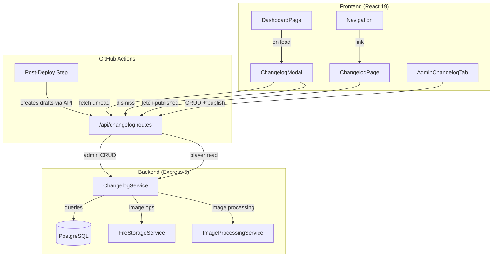

# Design Document: In-Game Changelog / "What's New"

## Overview

The In-Game Changelog adds a player-facing update feed to Armoured Souls. Changelog entries are stored in PostgreSQL via a new `ChangelogEntry` Prisma model with a draft/published status workflow. Players see unread entries in a modal on dashboard load (tracked via a `lastSeenChangelog` timestamp on the User model) and can browse all entries on a dedicated `/changelog` page. Admins manage entries through a new tab in the Admin Portal. A GitHub Actions post-deploy script auto-generates draft entries from completed specs and commits.

The feature reuses existing infrastructure: the `fileStorageService` pattern for image storage (adapted for `uploads/changelog/`), the `imageProcessingService` for sharp-based WebP conversion, the `validateRequest` middleware for Zod validation, and the `authenticateToken`/`requireAdmin` middleware for authorization. Caddy already serves `uploads/*` so no reverse proxy changes are needed.

## Architecture



The system follows the existing layered architecture:
- **Routes** (`src/routes/changelog.ts`): Thin handlers with Zod validation, auth middleware, delegation to service
- **Service** (`src/services/changelog/changelogService.ts`): Business logic for CRUD, pagination, unread detection, image cleanup
- **Model** (Prisma `ChangelogEntry`): Database schema with status enum, category enum, image URL, source tracking
- **Frontend components**: Modal overlay on dashboard, dedicated page, admin tab — all following existing patterns

### Key Design Decisions

1. **Per-user timestamp vs. per-entry read tracking**: Using a single `lastSeenChangelog` timestamp on the User model rather than a join table of read entries. This is simpler, uses no additional storage per entry, and matches the "dismiss all" UX pattern. The tradeoff is that dismissing the modal marks all current entries as seen — there's no per-entry read state.

2. **Image storage in `uploads/changelog/` (flat directory)**: Unlike robot images which use `uploads/user-robots/{userId}/`, changelog images use a flat `uploads/changelog/` directory since entries aren't user-scoped. UUID filenames prevent collisions and guessing.

3. **800px max width (not 512×512 crop)**: Robot images use a square 512×512 center-crop. Changelog images are content screenshots/previews that need to preserve aspect ratio, so we resize to max 800px width while maintaining proportions.

4. **Auto-generator as a standalone script (not a service)**: The deploy-time changelog generator runs as a Node.js script invoked by GitHub Actions, not as a running service. It calls the admin API with a deploy service token. This keeps it stateless and idempotent.

5. **Draft entries excluded at the query level**: The service layer filters by `status: 'published'` for all player-facing queries. Admin queries return all entries. This is enforced in the service, not the route, so it can't be bypassed by query parameters.

## Components and Interfaces

### Backend Components

#### 1. Prisma Model: `ChangelogEntry`

Added to `app/backend/prisma/schema.prisma`. Fields map directly to Requirement 1.

#### 2. Prisma Model Update: `User`

Add `lastSeenChangelog DateTime?` field to the existing User model (Requirement 2).

#### 3. Route File: `src/routes/changelog.ts`

Mounted at `/api/changelog` in `src/index.ts`.

Endpoints:

| Method | Path | Auth | Description | Req |
|--------|------|------|-------------|-----|
| GET | `/api/changelog` | Player | List published entries (paginated, filterable by category) | 5.2, 5.3, 5.5 |
| GET | `/api/changelog/unread` | Player | Get unread entries for current user (max 10) | 2.2, 2.3, 3.1, 3.8 |
| GET | `/api/changelog/unread/count` | Player | Get count of unread entries | 2.5 |
| POST | `/api/changelog/dismiss` | Player | Update lastSeenChangelog to now | 2.4, 3.4 |
| GET | `/api/changelog/admin` | Admin | List all entries (drafts + published) | 6.2, 9.5 |
| POST | `/api/changelog/admin` | Admin | Create new entry | 6.3, 9.1 |
| PUT | `/api/changelog/admin/:id` | Admin | Update entry | 6.4, 9.2 |
| DELETE | `/api/changelog/admin/:id` | Admin | Delete entry (+ image cleanup) | 6.6, 9.3 |
| POST | `/api/changelog/admin/:id/publish` | Admin | Set status=published, publishDate=now | 6.5, 9.4 |
| POST | `/api/changelog/admin/upload-image` | Admin | Upload and process changelog image | 7.1, 7.2, 7.3, 7.4 |

#### 4. Service: `src/services/changelog/changelogService.ts`

Core business logic:

```typescript
interface ChangelogService {
  // Player-facing
  listPublished(page: number, perPage: number, category?: string): Promise<PaginatedResult<ChangelogEntry>>;
  getUnread(userId: number, limit?: number): Promise<ChangelogEntry[]>;
  getUnreadCount(userId: number): Promise<number>;
  dismiss(userId: number): Promise<void>;

  // Admin
  listAll(page: number, perPage: number): Promise<PaginatedResult<ChangelogEntry>>;
  create(data: CreateChangelogInput): Promise<ChangelogEntry>;
  update(id: number, data: UpdateChangelogInput): Promise<ChangelogEntry>;
  delete(id: number): Promise<void>;
  publish(id: number): Promise<ChangelogEntry>;
}
```

#### 5. Image Handling: `src/services/changelog/changelogImageService.ts`

Adapts the existing `imageProcessingService` pattern for changelog-specific processing:

```typescript
interface ChangelogImageService {
  processAndStore(buffer: Buffer): Promise<string>; // Returns /uploads/changelog/{uuid}.webp
  deleteImage(imageUrl: string): Promise<void>;
}
```

Uses `sharp` to resize to max 800px width (maintaining aspect ratio) and convert to WebP. Stores in `uploads/changelog/` with UUID filenames.

#### 6. Auto-Generator Script: `app/backend/scripts/generate-changelog-drafts.ts`

Standalone Node.js script invoked by GitHub Actions post-deploy:

```typescript
// 1. Get last deploy tag from git
// 2. Scan commits since last tag
// 3. Scan .kiro/specs/done-* for new specs (git diff)
// 4. Create draft entries via admin API (with deploy service token)
// 5. Check sourceRef before creating to ensure idempotency
```

#### 7. Zod Schemas

Defined in `src/routes/changelog.ts` alongside the route handlers (following the existing pattern in `robots.ts`):

```typescript
const createEntrySchema = z.object({
  title: z.string().min(1).max(200),
  body: z.string().min(1).max(5000),
  category: z.enum(['balance', 'feature', 'bugfix', 'economy']),
  status: z.enum(['draft', 'published']).default('draft'),
  imageUrl: z.string().max(500).nullable().optional(),
  sourceType: z.enum(['spec', 'commit', 'manual']).optional(),
  sourceRef: z.string().max(200).optional(),
});

const updateEntrySchema = z.object({
  title: z.string().min(1).max(200).optional(),
  body: z.string().min(1).max(5000).optional(),
  category: z.enum(['balance', 'feature', 'bugfix', 'economy']).optional(),
  status: z.enum(['draft', 'published']).optional(),
  imageUrl: z.string().max(500).nullable().optional(),
});

const listQuerySchema = z.object({
  page: z.coerce.number().int().positive().default(1),
  perPage: z.coerce.number().int().positive().max(100).default(20),
  category: z.enum(['balance', 'feature', 'bugfix', 'economy']).optional(),
});

const entryIdParamsSchema = z.object({
  id: positiveIntParam,
});
```

### Frontend Components

#### 1. `ChangelogModal` (`src/components/ChangelogModal.tsx`)

- Fetches unread entries on mount via `GET /api/changelog/unread`
- Renders as overlay: centered max-width on desktop (md+), full-screen on mobile (<768px)
- Each entry rendered as a card: title, body, color-coded category badge, publish date, optional image
- Scrollable content area when entries exceed viewport
- Dismiss button calls `POST /api/changelog/dismiss`, closes modal
- "View all updates" link navigates to `/changelog`
- Max 10 entries displayed; shows overflow message when count > 10
- Does not render if unread count is 0

#### 2. `ChangelogPage` (`src/pages/ChangelogPage.tsx`)

- Route: `/changelog`
- Uses `Navigation` component, follows existing page layout (like `GuidePage`)
- Category filter buttons: All, Balance, Feature, Bugfix, Economy
- Paginated list of published entries in reverse chronological order
- Each entry as a card with title, body, category badge, publish date, optional image
- Responsive: stacked cards on mobile, filter buttons wrap on narrow viewports

#### 3. `AdminChangelogTab` (`src/components/admin/AdminChangelogTab.tsx`)

- New tab in AdminPage: `📋 Changelog`
- Lists all entries grouped by status (drafts first, then published)
- Create/edit form: title, body, category dropdown, image upload, status
- Publish action on drafts (sets status + publishDate)
- Delete with confirmation modal (reuses existing `ConfirmationModal`)
- Shows sourceType/sourceRef for auto-generated entries
- Visual distinction: draft entries have muted styling + "DRAFT" badge

#### 4. `changelogApi.ts` (`src/utils/changelogApi.ts`)

API client functions using the existing `apiClient` (Axios) pattern:

```typescript
// Player endpoints
fetchPublishedEntries(page, perPage, category?): Promise<PaginatedResult>
fetchUnreadEntries(): Promise<ChangelogEntry[]>
fetchUnreadCount(): Promise<number>
dismissChangelog(): Promise<void>

// Admin endpoints
fetchAllEntries(page, perPage): Promise<PaginatedResult>
createEntry(data): Promise<ChangelogEntry>
updateEntry(id, data): Promise<ChangelogEntry>
deleteEntry(id): Promise<void>
publishEntry(id): Promise<ChangelogEntry>
uploadChangelogImage(file): Promise<{ imageUrl: string }>
```

### Integration Points

- **DashboardPage**: Import and render `ChangelogModal` component. Fetch unread count on mount; show modal if count > 0.
- **Navigation**: Add "📰 What's New" link to the `social` category in `allPages` nav config, pointing to `/changelog`.
- **AdminPage**: Add `'changelog'` to `VALID_TABS`, `TAB_LABELS`, and render `AdminChangelogTab`.
- **App.tsx**: Add `/changelog` route with `ProtectedRoute` wrapper.
- **Backend index.ts**: Import and mount `changelogRoutes` at `/api/changelog`.
- **GitHub Actions deploy.yml**: Add post-deploy step after health check in both ACC and PRD jobs.

## Data Models

### ChangelogEntry (New Model)

```prisma
model ChangelogEntry {
  id          Int       @id @default(autoincrement())
  title       String    @db.VarChar(200)
  body        String    @db.Text
  category    String    @db.VarChar(20) // "balance", "feature", "bugfix", "economy"
  status      String    @default("draft") @db.VarChar(20) // "draft", "published"
  imageUrl    String?   @map("image_url") @db.VarChar(500)
  publishDate DateTime? @map("publish_date")
  sourceType  String?   @map("source_type") @db.VarChar(20) // "spec", "commit", "manual"
  sourceRef   String?   @map("source_ref") @db.VarChar(200)
  createdBy   Int?      @map("created_by") // Admin user ID, null for auto-generated
  createdAt   DateTime  @default(now()) @map("created_at")
  updatedAt   DateTime  @updatedAt @map("updated_at")

  @@index([status, publishDate])
  @@index([sourceRef])
  @@map("changelog_entries")
}
```

### User Model Update

```prisma
// Add to existing User model:
lastSeenChangelog DateTime  @default(now()) @map("last_seen_changelog")
```

### Key Indexes

- `[status, publishDate]`: Covers the primary player-facing query (published entries ordered by date)
- `[sourceRef]`: Supports idempotency checks in the auto-generator (lookup by spec name or commit SHA)


## Correctness Properties

*A property is a characteristic or behavior that should hold true across all valid executions of a system — essentially, a formal statement about what the system should do. Properties serve as the bridge between human-readable specifications and machine-verifiable correctness guarantees.*

### Property 1: Entry data round-trip

*For any* valid changelog entry data (title, body, category, status, imageUrl, sourceType, sourceRef), creating the entry via the service and then reading it back should return an entry with all fields matching the original input data.

**Validates: Requirements 1.1**

### Property 2: Player-facing query returns only published entries in publishDate descending order

*For any* set of changelog entries with mixed statuses (draft and published), querying via the player-facing list endpoint should return only entries with status "published", and the results should be sorted by publishDate in descending order (newest first).

**Validates: Requirements 1.4, 1.5**

### Property 3: Pagination returns correct slices

*For any* set of published changelog entries and any valid page/perPage combination (perPage between 1 and 100), the returned entries should be the correct slice of the full sorted result set, the total count should reflect all matching entries, and the default perPage should be 20 when not specified.

**Validates: Requirements 1.6**

### Property 4: Unread detection by timestamp

*For any* set of published changelog entries with varying publishDates and any player with a lastSeenChangelog timestamp, the unread entries should be exactly those published entries whose publishDate is strictly after the lastSeenChangelog. New users start with lastSeenChangelog set to their registration time, so they see no unread entries on first login. The unread count endpoint should return a number equal to the length of the unread entries list.

**Validates: Requirements 2.2, 2.3, 2.5**

### Property 5: Entry card renders all required fields

*For any* changelog entry with a title, body, category, and publishDate, the rendered card component should contain the title text, body text, a category badge, and the formatted publish date. When imageUrl is present, an image element should also be rendered.

**Validates: Requirements 3.2, 5.4**

### Property 6: Category filter returns only matching entries

*For any* set of published changelog entries with varying categories and any selected category filter, the displayed entries should all have a category matching the selected filter. When "All" is selected, all published entries should be displayed.

**Validates: Requirements 5.5**

### Property 7: Image processing produces valid WebP with correct dimensions

*For any* valid JPEG, PNG, or WebP image buffer, processing it through the changelog image service should produce a WebP-format output with a width of at most 800 pixels and an aspect ratio matching the original image (within rounding tolerance).

**Validates: Requirements 6.10, 7.3**

### Property 8: Image storage path matches expected pattern

*For any* image stored via the changelog image service, the returned path should match the pattern `/uploads/changelog/{uuid}.webp` where `{uuid}` is a valid UUID v4 string.

**Validates: Requirements 7.4**

### Property 9: Image cleanup on entry deletion

*For any* changelog entry that has an associated imageUrl pointing to a file on disk, deleting the entry via the service should also delete the image file from the filesystem.

**Validates: Requirements 7.5**

### Property 10: Auto-generator creates correct drafts from specs

*For any* set of completed spec directories, the auto-generator should create exactly one draft changelog entry per spec, with sourceType set to "spec" and sourceRef set to the spec directory name.

**Validates: Requirements 8.4, 8.7**

### Property 11: Auto-generator category heuristics

*For any* spec directory name, the auto-generator should assign category "bugfix" when the name contains "fix" or "bug", "balance" when the name contains "balance", and "feature" otherwise. Commit-based entries should default to "bugfix".

**Validates: Requirements 8.6**

### Property 12: Auto-generator idempotency

*For any* set of completed specs and commits, running the auto-generator twice with the same inputs should produce the same number of entries as running it once — no duplicate entries should be created (verified by sourceRef uniqueness).

**Validates: Requirements 8.10**

### Property 13: API input validation rejects invalid data with field-level errors

*For any* invalid input to a changelog API endpoint (empty title, title exceeding 200 chars, empty body, body exceeding 5000 chars, invalid category enum, invalid imageUrl format, non-positive-integer ID parameter), the endpoint should return a 400 status with a response body containing an array of field-level error details.

**Validates: Requirements 1.2, 1.3, 1.7, 10.1, 10.2, 10.3, 10.4, 10.5**

## Error Handling

### Backend Error Handling

All changelog service errors use the existing `AppError` hierarchy. Express 5 automatically forwards rejected promises to the `errorHandler` middleware.

| Scenario | Error | Status | Code |
|----------|-------|--------|------|
| Entry not found (update/delete/publish) | AppError | 404 | `CHANGELOG_NOT_FOUND` |
| Validation failure (Zod) | AppError | 400 | `VALIDATION_ERROR` |
| Unauthorized (no token) | Auth middleware | 401 | `ACCESS_TOKEN_REQUIRED` |
| Forbidden (non-admin on admin endpoint) | requireAdmin | 403 | `ADMIN_ACCESS_REQUIRED` |
| Image too large (>2MB) | Multer | 400 | `FILE_TOO_LARGE` |
| Invalid image format | fileValidationService | 400 | `INVALID_IMAGE` |
| Image processing failure (sharp) | AppError | 500 | `IMAGE_PROCESSING_ERROR` |
| Database error | Prisma | 500 | Logged, generic message to client |

A new error code enum `ChangelogErrorCode` will be added to `src/errors/` following the existing pattern (e.g., `RobotErrorCode`).

### Frontend Error Handling

- **ChangelogModal**: If the unread fetch fails, the modal silently does not appear (non-blocking — the dashboard still loads). Errors are logged to console.
- **ChangelogPage**: Shows an error state with retry button if the published entries fetch fails. Follows the same pattern as `GuidePage` error handling.
- **AdminChangelogTab**: Shows inline error messages for failed CRUD operations. Form validation errors are displayed next to the relevant fields.
- **Image upload failures**: Display a toast notification with the error message (reuses existing `Toast` component).

### Auto-Generator Error Handling

- If the API call to create a draft fails, the script logs the error and continues with remaining entries (partial success is acceptable).
- If git operations fail, the script exits with a non-zero code so the GitHub Actions step is marked as failed (but the deploy itself already succeeded, so this is non-blocking).
- Network errors are retried once with a 5-second delay.

## Testing Strategy

### Property-Based Tests (fast-check)

The feature is suitable for property-based testing. The backend service layer contains pure business logic (filtering, pagination, unread detection, validation, image processing) that varies meaningfully with input.

- **Library**: fast-check (already used in the project for both backend Jest and frontend Vitest)
- **Minimum iterations**: 100 per property test
- **Tag format**: `Feature: in-game-changelog, Property {N}: {title}`

Properties 1–4 and 13 target the backend service layer (Jest + fast-check). Properties 5–6 target frontend components (Vitest + fast-check). Properties 7–9 target the image service (Jest + fast-check). Properties 10–12 target the auto-generator script (Jest + fast-check).

### Unit Tests (Example-Based)

- **Authorization**: Verify all 5 admin endpoints return 403 for non-admin users, and all 3 player endpoints return 401 without auth (Requirements 9.1–9.9)
- **Dismiss**: Verify lastSeenChangelog is updated to current timestamp (Requirement 2.4)
- **Publish action**: Verify status changes to "published" and publishDate is set (Requirement 6.5)
- **Modal rendering**: Verify modal appears when unread > 0, does not appear when unread = 0 (Requirements 3.1, 3.7)
- **Modal overflow**: Verify max 10 entries displayed with overflow message (Requirement 3.8)
- **Admin tab integration**: Verify tab appears in AdminPage, form fields exist, draft/published visual distinction (Requirements 6.1, 6.3, 6.8, 6.9)

### Integration Tests

- **Auto-generator git scanning**: Test with mock git history and spec directories (Requirements 8.2, 8.3)
- **Auto-generator API integration**: Test with mock API server (Requirement 8.9)
- **Full CRUD flow**: Create → update → publish → list → delete with database (end-to-end service test)
- **Image upload flow**: Upload → process → store → delete with filesystem

### Documentation Impact

The following files will need updating:
- `.kiro/steering/project-overview.md`: Add changelog to Key Systems list
- `app/frontend/src/components/nav/types.ts`: Add `/changelog` to `implementedPages` and `allPages`
- No new steering files needed — the feature follows existing patterns (Express routes, Prisma models, React pages, admin tabs)
