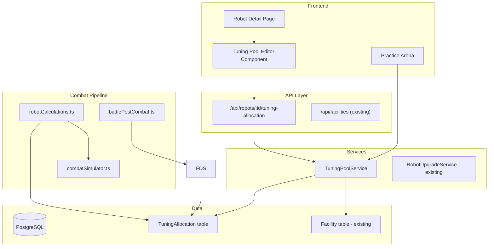
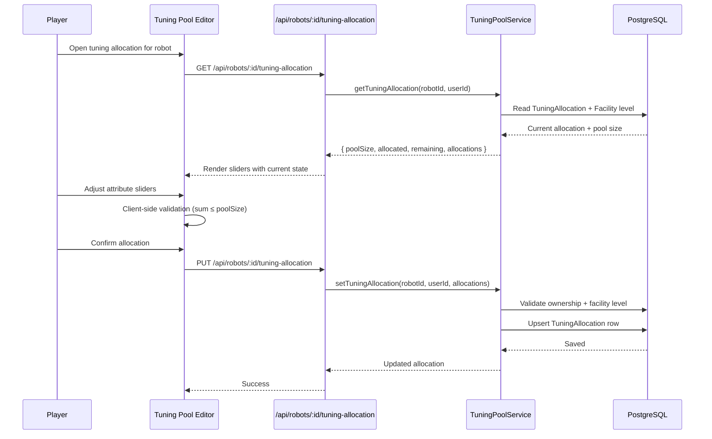
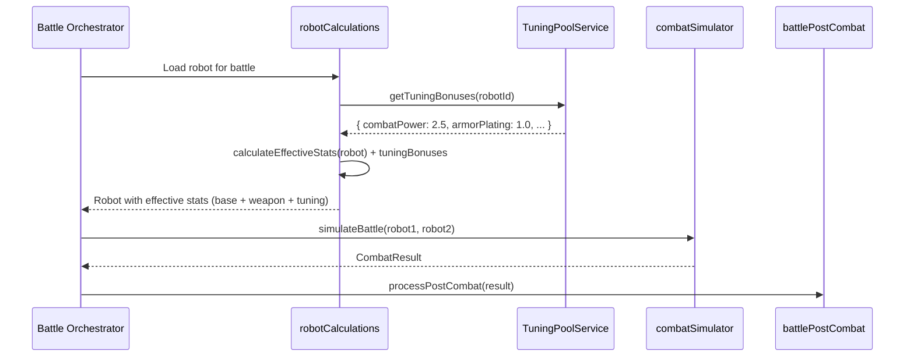

# Design Document: Tuning Pool (Tactical Tuning)

## Overview

The Tuning Pool system introduces a pool of bonus attribute points that players allocate across their robot's 23 attributes. Unlike permanent attribute upgrades, tuning points are tactical adjustments — inspired by F1 car setup — that reward players who study opponents and fine-tune their robots for specific matchups.

The system is gated behind a new facility ("Tuning Bay") whose level determines the pool size (how many bonus points are available). Tuning points stack on top of the robot's base attributes and can exceed academy caps by up to 5 points, representing the engineering team "overclocking" systems for a specific fight. This keeps the system relevant for endgame players with maxed academies while preserving academy investment as the permanent foundation.

Each robot has its own independent tuning allocation. Allocations persist until the player changes them — no decay, no forced re-engagement. You tune a robot, it stays tuned. The engagement driver is voluntary: your opponent changes every match, so players who adapt their tuning allocation per-matchup get an edge over those who set it once.

## Architecture



## Sequence Diagrams

### Allocating Tuning Points Before Battle



### Tuning Points in Combat Resolution



## Components and Interfaces

### Component 1: TuningPoolService

**Purpose**: Core service managing tuning point allocation, validation, and retrieval. Enforces pool size limits based on facility level and validates that allocations don't exceed the pool budget.

**Interface**:
```typescript
interface ITuningPoolService {
  /** Get current tuning allocation for a robot, including pool metadata */
  getTuningAllocation(robotId: number, userId: number): Promise<TuningAllocationState>;

  /** Set or update the tuning allocation for a robot */
  setTuningAllocation(robotId: number, userId: number, allocations: TuningAttributeMap): Promise<TuningAllocationState>;

  /** Get just the tuning bonuses for combat resolution (no auth check — internal use) */
  getTuningBonuses(robotId: number): Promise<TuningAttributeMap>;

  /** Clear all tuning allocations for a robot (used on robot reset) */
  clearTuningAllocation(robotId: number): Promise<void>;
}
```

**Responsibilities**:
- Validate that total allocated points ≤ pool size from facility level
- Validate that individual attribute allocations are non-negative
- Enforce per-attribute maximum (`academyCap + 5 - baseValue` — prevents stacking beyond overclock limit)
- Verify robot ownership before mutations
- Return pool metadata (total size, allocated, remaining) alongside allocations

### Component 2: TuningPoolConfig (in `tuningPoolConfig.ts`)

**Purpose**: Defines the Tuning Bay facility configuration and the formulas mapping facility level to pool size.

**Interface**:
```typescript
interface TuningPoolConfig {
  /** Get total tuning pool size for a given facility level */
  getPoolSize(level: number): number;

  /** Get per-attribute maximum tuning allocation */
  getPerAttributeMax(academyCap: number, baseValue: number): number;
}
```

**Responsibilities**:
- Provide deterministic, config-driven pool size
- Ensure level 0 returns pool size 0 (no facility = no tuning points)
- Cap per-attribute allocation at `academyCap + 5 - baseValue`

### Component 3: Combat Integration (modification to `robotCalculations.ts`)

**Purpose**: Extends `calculateEffectiveStats` to include tuning bonuses in the attribute pipeline. Tuning bonuses are added after base attributes and weapon bonuses, before loadout multipliers.

**Responsibilities**:
- Load tuning bonuses for the robot being prepared for combat
- Add tuning bonuses to the (base + weapon) sum before applying loadout multipliers
- Recalculate maxHP and maxShield when tuning bonuses affect hullIntegrity or shieldCapacity
- Ensure practice arena what-if overrides and tuning bonuses compose correctly

## Data Models

### TuningAllocation

```typescript
/** Database model — one row per robot */
interface TuningAllocation {
  id: number;
  robotId: number;          // FK → Robot.id (unique — one allocation per robot)
  
  // Tuning point allocations per attribute (Decimal(5,2), default 0.00)
  // Only non-zero values are meaningful; all 23 attributes stored for simplicity
  combatPower: number;
  targetingSystems: number;
  criticalSystems: number;
  penetration: number;
  weaponControl: number;
  attackSpeed: number;
  armorPlating: number;
  shieldCapacity: number;
  evasionThrusters: number;
  damageDampeners: number;
  counterProtocols: number;
  hullIntegrity: number;
  servoMotors: number;
  gyroStabilizers: number;
  hydraulicSystems: number;
  powerCore: number;
  combatAlgorithms: number;
  threatAnalysis: number;
  adaptiveAI: number;
  logicCores: number;
  syncProtocols: number;
  supportSystems: number;
  formationTactics: number;

  updatedAt: Date;
  createdAt: Date;
}
```

**Validation Rules**:
- Each attribute value ≥ 0.00
- Each attribute value ≤ getPerAttributeMax(academyCap, baseValue) (= academyCap + 5 - baseValue)
- Sum of all 23 attribute values ≤ getPoolSize(facilityLevel)
- robotId is unique (one allocation per robot)
- Values are Decimal(5,2) matching the Robot attribute precision

### TuningAttributeMap

```typescript
/** Sparse map of attribute → tuning bonus. Only non-zero attributes included. */
type TuningAttributeMap = Partial<Record<RobotAttribute, number>>;

/** The 23 robot attribute names */
type RobotAttribute =
  | 'combatPower' | 'targetingSystems' | 'criticalSystems' | 'penetration' | 'weaponControl' | 'attackSpeed'
  | 'armorPlating' | 'shieldCapacity' | 'evasionThrusters' | 'damageDampeners' | 'counterProtocols'
  | 'hullIntegrity' | 'servoMotors' | 'gyroStabilizers' | 'hydraulicSystems' | 'powerCore'
  | 'combatAlgorithms' | 'threatAnalysis' | 'adaptiveAI' | 'logicCores'
  | 'syncProtocols' | 'supportSystems' | 'formationTactics';
```

### TuningAllocationState

```typescript
/** Full state returned to the frontend */
interface TuningAllocationState {
  robotId: number;
  facilityLevel: number;
  poolSize: number;           // Total points available
  allocated: number;          // Sum of current allocations
  remaining: number;          // poolSize - allocated
  perAttributeMaxes: Record<RobotAttribute, number>;  // Max per attribute (academyCap + 5 - base)
  allocations: TuningAttributeMap;  // Current per-attribute allocations
}
```


## Tuning Bay — Facility Specification

The Tuning Bay is a new facility (type: `tuning_bay`) that gates access to the tuning pool system. This section defines the complete facility configuration that goes into `config/facilities.ts`.

### Upgrade Costs

Follows the standard facility cost formula: `L(n) = L1 × n`. Base price ₡200,000 — positioned in the medium tier. L1 doubles the free tuning pool (10 → 20 points per robot), making it a meaningful upgrade that scales with roster size.

| Level | Upgrade Cost | Cumulative | Pool Size |
|-------|-------------|------------|-----------|
| 1 | ₡200,000 | ₡200,000 | 20 |
| 2 | ₡400,000 | ₡600,000 | 30 |
| 3 | ₡600,000 | ₡1,200,000 | 40 |
| 4 | ₡800,000 | ₡2,000,000 | 50 |
| 5 | ₡1,000,000 | ₡3,000,000 | 60 |
| 6 | ₡1,200,000 | ₡4,200,000 | 70 |
| 7 | ₡1,400,000 | ₡5,600,000 | 80 |
| 8 | ₡1,600,000 | ₡7,200,000 | 90 |
| 9 | ₡1,800,000 | ₡9,000,000 | 100 |
| 10 | ₡2,000,000 | ₡11,000,000 | 110 |

**Total investment to max**: ₡11,000,000. For comparison: maxing one academy costs ₡5.5M, maxing Merchandising Hub costs ₡9.75M, maxing Streaming Studio costs ₡5.5M.

**Cost array**: `[200000, 400000, 600000, 800000, 1000000, 1200000, 1400000, 1600000, 1800000, 2000000]`

### Operating Costs

**Formula**: `level × 300`. At L1: ₡300/day, at L10: ₡3,000/day. For comparison: Streaming Studio L10 costs ₡1,000/day, Training Facility L9 costs ₡2,250/day.

| Level | Daily Operating Cost |
|-------|---------------------|
| 1 | ₡300 |
| 2 | ₡600 |
| 3 | ₡900 |
| 4 | ₡1,200 |
| 5 | ₡1,500 |
| 6 | ₡1,800 |
| 7 | ₡2,100 |
| 8 | ₡2,400 |
| 9 | ₡2,700 |
| 10 | ₡3,000 |

### Prestige Requirements

Follows the academy pattern with gates at L3, L5, L7, L9, L10:

| Level | Prestige Required |
|-------|------------------|
| 1–2 | 0 |
| 3 | 1,000 |
| 4 | 0 |
| 5 | 3,000 |
| 6 | 0 |
| 7 | 5,000 |
| 8 | 0 |
| 9 | 10,000 |
| 10 | 15,000 |

**Array**: `[0, 0, 1000, 0, 3000, 0, 5000, 0, 10000, 15000]`

### Benefits Descriptions

```typescript
benefits: [
  'Tuning pool: 20 bonus points per robot (₡300/day operating cost)',
  'Tuning pool: 30 bonus points per robot (₡600/day operating cost)',
  'Tuning pool: 40 bonus points per robot (₡900/day operating cost)',
  'Tuning pool: 50 bonus points per robot (₡1,200/day operating cost)',
  'Tuning pool: 60 bonus points per robot (₡1,500/day operating cost)',
  'Tuning pool: 70 bonus points per robot (₡1,800/day operating cost)',
  'Tuning pool: 80 bonus points per robot (₡2,100/day operating cost)',
  'Tuning pool: 90 bonus points per robot (₡2,400/day operating cost)',
  'Tuning pool: 100 bonus points per robot (₡2,700/day operating cost)',
  'Tuning pool: 110 bonus points per robot — maximum (₡3,000/day operating cost)',
]
```

### Complete FacilityConfig Entry

```typescript
{
  type: 'tuning_bay',
  name: 'Tuning Bay',
  description: 'Fine-tune your robots for specific matchups with bonus attribute points. Higher levels grant a larger tuning pool.',
  maxLevel: 10,
  costs: [200000, 400000, 600000, 800000, 1000000, 1200000, 1400000, 1600000, 1800000, 2000000],
  benefits: [
    'Tuning pool: 20 bonus points per robot (₡300/day operating cost)',
    'Tuning pool: 30 bonus points per robot (₡600/day operating cost)',
    'Tuning pool: 40 bonus points per robot (₡900/day operating cost)',
    'Tuning pool: 50 bonus points per robot (₡1,200/day operating cost)',
    'Tuning pool: 60 bonus points per robot (₡1,500/day operating cost)',
    'Tuning pool: 70 bonus points per robot (₡1,800/day operating cost)',
    'Tuning pool: 80 bonus points per robot (₡2,100/day operating cost)',
    'Tuning pool: 90 bonus points per robot (₡2,400/day operating cost)',
    'Tuning pool: 100 bonus points per robot (₡2,700/day operating cost)',
    'Tuning pool: 110 bonus points per robot — maximum (₡3,000/day operating cost)',
  ],
  implemented: true,
  prestigeRequirements: [0, 0, 1000, 0, 3000, 0, 5000, 0, 10000, 15000],
}
```

---

## Algorithmic Pseudocode

### Pool Size Formula

The pool size scales linearly with facility level. At the current game state (top attributes 5–15 range, 23 attributes), a pool of 10–110 points represents a meaningful but not overwhelming bonus.

**Pool Size Formula**: `poolSize = (facilityLevel + 1) × 10`

Every player starts with 10 free tuning points (no facility required). The Tuning Bay adds 10 more per level. This lets early game players experience the mechanic and creates a natural hook to invest in the facility for more.

| Level | Pool Size | Context |
|-------|-----------|---------|
| 0 (free) | 10 | Everyone gets this — enough to meaningfully boost 2–3 attributes |
| 1     | 20        | Double the free pool — first meaningful upgrade |
| 2     | 30        | Can shift a build's emphasis for a fight |
| 3     | 40        | Noticeable tactical edge |
| 4     | 50        | Significant tuning range |
| 5     | 60        | Mid-game sweet spot |
| 6     | 70        | Strong tactical range |
| 7     | 80        | Major per-battle customization |
| 8     | 90        | Near-maximum tuning |
| 9     | 100       | Full engineering team |
| 10    | 110       | Maximum — 110 bonus points per robot |

**Value comparison at ₡200K (L1):**

| Investment | 1 Robot | 2 Robots | 3 Robots | 4 Robots |
|-----------|---------|----------|----------|----------|
| Weapon (₡202K Plasma Blade) | 14 fixed bonus points + base damage | 14 (one robot only) | 14 (one robot only) | 14 (one robot only) |
| Permanent attributes (₡200K) | ~26 permanent levels (at early game costs) | 26 (one robot only) | 26 (one robot only) | 26 (one robot only) |
| Tuning Bay L1 (₡200K + operating) | 20 reallocatable points | 40 total | 60 total | 80 total |

With 1 robot, the Tuning Bay gives 20 reallocatable points vs 26 permanent — permanent wins on raw value but loses on flexibility and cap bypass. Reasonable trade-off. With 2+ robots, the Tuning Bay pulls ahead because every robot benefits. This makes the facility especially attractive for multi-robot stables.

**Balance safeguards**: Per-attribute cap (academyCap + 5 - base) prevents stacking all points into one stat. Operating costs create ongoing expense. Weapons provide base damage and cooldown which tuning points don't — they're complementary, not competing.

**Why these numbers**: In practice, players won't have a L10 facility and low attributes simultaneously — the facility costs ₡11M cumulative, which requires significant game progression. Realistic scenarios:
- **Early game** (attributes ~5, no facility): 10 free tuning points on ~115 total attribute points = ~9% boost. Free, no operating cost — a taste of the system.
- **Mid game** (attributes ~15, L3–5 facility): 40–60 tuning points on ~345 total attribute points = ~12–17% boost. Meaningful tactical edge worth the investment.
- **Late game** (attributes ~30+, L7–10 facility): 80–110 tuning points on ~690+ total attribute points = ~12–16% boost. The tuning pool stays relevant and scales with roster size.

**Per-Attribute Cap**: `base + tuningBonus ≤ academyCap + 5`

Instead of a flat per-attribute maximum, tuning allocations are capped per attribute based on the robot's academy cap for that attribute category. The effective value (base + tuning) cannot exceed the academy cap + 5. This means:

- The "+5" is the overclock window — the engineering team can push 5 points beyond rated specs
- If your attribute is at academy cap, you can tune +5 max
- If your attribute is below cap, you can tune more (up to cap + 5 - base)
- Higher academy investment = more room for tuning points in your key stats
- Forces spreading at high pool sizes — you can't dump 50 points into one stat

Examples:
- Academy cap 15, attribute at 15 → max tuning = 5 (overclock only)
- Academy cap 15, attribute at 10 → max tuning = 10 (5 to cap + 5 overclock)
- Academy cap 25, attribute at 20 → max tuning = 10 (5 to cap + 5 overclock)
- Academy cap 50, attribute at 50 → max tuning = 5 (overclock only)
- No academy (base cap 10), attribute at 5 → max tuning = 10 (5 to cap + 5 overclock)

### Main Allocation Algorithm

```typescript
/**
 * ALGORITHM: setTuningAllocation
 * 
 * Validates and persists a tuning point allocation for a robot.
 * Uses lockUserForSpending pattern for consistency (though no credits spent).
 */
function setTuningAllocation(
  robotId: number,
  userId: number,
  allocations: TuningAttributeMap
): TuningAllocationState {
  // PRECONDITIONS:
  // - robotId belongs to userId (ownership verified)
  // - userId has a Tuning Bay facility at level ≥ 1
  // - allocations contains only valid RobotAttribute keys
  // - Each allocation value ≥ 0.00

  // Step 1: Verify ownership
  verifyRobotOwnership(robotId, userId);

  // Step 2: Get facility level
  const facility = getFacility(userId, 'tuning_bay');
  if (!facility || facility.level === 0) {
    throw new AppError('FACILITY_REQUIRED', 'Tuning Bay required', 400);
  }

  const poolSize = getPoolSize(facility.level);
  const perAttrMax = getPerAttributeMax(poolSize);

  // Step 3: Validate allocations
  let totalAllocated = 0;
  for (const [attr, value] of Object.entries(allocations)) {
    // ASSERT: attr is a valid RobotAttribute
    // ASSERT: value >= 0
    if (value < 0) {
      throw new AppError('VALIDATION_ERROR', `${attr} cannot be negative`, 400);
    }
    if (value > perAttrMax) {
      throw new AppError('VALIDATION_ERROR', `${attr} exceeds per-attribute max of ${perAttrMax}`, 400);
    }
    totalAllocated += value;
  }

  if (totalAllocated > poolSize) {
    throw new AppError('VALIDATION_ERROR', `Total ${totalAllocated} exceeds pool size ${poolSize}`, 400);
  }

  // Step 4: Upsert allocation
  // LOOP INVARIANT: totalAllocated ≤ poolSize at all times
  const saved = upsertTuningAllocation(robotId, allocations);

  // POSTCONDITIONS:
  // - TuningAllocation row exists for robotId
  // - Sum of all stored values = totalAllocated ≤ poolSize
  // - Each stored value ≤ perAttrMax
  // - Robot's base attributes are NOT modified

  return buildTuningAllocationState(saved, facility.level);
}
```

### Effective Stats Integration Algorithm

```typescript
/**
 * ALGORITHM: calculateEffectiveStatsWithTuning
 * 
 * Extended version of calculateEffectiveStats that includes tuning bonuses.
 * Tuning bonuses are added to (base + weapon) BEFORE loadout multipliers.
 * This means loadout multipliers amplify tuning bonuses — intentional design
 * choice that makes loadout selection interact with tuning allocation.
 */
function calculateEffectiveStatsWithTuning(
  robot: RobotWithWeapons,
  tuningBonuses: TuningAttributeMap
): Record<string, number> {
  // PRECONDITIONS:
  // - robot has valid base attributes (Decimal fields)
  // - tuningBonuses values are all ≥ 0
  // - tuningBonuses sum ≤ poolSize (validated at allocation time)

  const loadoutType = robot.loadoutType;
  const loadoutBonuses = LOADOUT_BONUSES[loadoutType] || {};
  const effectiveStats: Record<string, number> = {};

  for (const attr of ROBOT_ATTRIBUTES) {
    const baseValue = toNumber(robot[attr]);
    const weaponBonus = getWeaponBonus(robot, attr);
    const tuningBonus = tuningBonuses[attr] ?? 0;
    const loadoutMultiplier = 1 + (loadoutBonuses[attr] ?? 0);

    // Formula: (base + weaponBonus + tuningBonus) × loadoutMultiplier
    // NOTE: No cap applied here — tuning points CAN exceed academy caps
    // This is the "overclocking" flavour
    effectiveStats[attr] = roundToTwo((baseValue + weaponBonus + tuningBonus) * loadoutMultiplier);
  }

  // POSTCONDITIONS:
  // - Each effective stat ≥ base stat (tuning bonuses are non-negative)
  // - Tuning bonuses are amplified by loadout multipliers
  // - No academy cap enforcement (intentional — overclocking)

  return effectiveStats;
}
```

## Key Functions with Formal Specifications

### getPoolSize()

```typescript
function getPoolSize(facilityLevel: number): number {
  return (Math.max(0, facilityLevel) + 1) * 10;
}
```

**Preconditions:**
- `facilityLevel` is an integer 0–10 (0 = no facility)

**Postconditions:**
- Returns 10 when facilityLevel = 0 (free base pool)
- Returns (facilityLevel + 1) × 10 for levels 0–10
- Result is always ≥ 10 (every player gets the base pool)
- Result is monotonically increasing with level

**Loop Invariants:** N/A

### getPerAttributeMax()

Uses existing infrastructure: `ATTRIBUTE_TO_ACADEMY` (maps attribute → academy type), `getCapForLevel()` (maps academy level → attribute cap from `ACADEMY_CAP_MAP`), and the robot's base attribute value from the Robot model.

```typescript
function getPerAttributeMax(academyCap: number, baseValue: number): number {
  return Math.max(0, academyCap + 5 - baseValue);
}

// In practice, called as:
// const academyType = ATTRIBUTE_TO_ACADEMY[attribute];
// const academyLevel = userFacilities[academyType]?.level ?? 0;
// const academyCap = getCapForLevel(academyLevel);
// const baseValue = Number(robot[attribute]);
// const maxTuning = getPerAttributeMax(academyCap, baseValue);
```

**Preconditions:**
- `academyCap` is the robot's academy cap for this attribute's category (10–50)
- `baseValue` is the robot's current base attribute level (1–50)

**Postconditions:**
- Returns the maximum tuning allocation for this specific attribute
- Result is always ≥ 0
- Ensures `baseValue + result ≤ academyCap + 5`
- Returns 0 if baseValue already exceeds academyCap + 5 (shouldn't happen normally)

### validateTuningAllocations()

```typescript
function validateTuningAllocations(
  allocations: TuningAttributeMap,
  poolSize: number,
  robot: { attributes: Record<RobotAttribute, number>; academyCaps: Record<string, number> }
): { valid: boolean; errors: string[] } {
  const errors: string[] = [];
  let total = 0;

  for (const [attr, value] of Object.entries(allocations)) {
    if (!ROBOT_ATTRIBUTES.includes(attr)) {
      errors.push(`Unknown attribute: ${attr}`);
      continue;
    }
    if (value < 0) {
      errors.push(`${attr}: negative value ${value}`);
    }
    const academyCap = getAcademyCapForAttribute(attr, robot.academyCaps);
    const baseValue = robot.attributes[attr];
    const perAttrMax = getPerAttributeMax(academyCap, baseValue);
    if (value > perAttrMax) {
      errors.push(`${attr}: ${value} exceeds per-attribute max ${perAttrMax} (cap ${academyCap} + 5 - base ${baseValue})`);
    }
    total += value;
  }

  if (total > poolSize) {
    errors.push(`Total allocated ${total} exceeds pool size ${poolSize}`);
  }

  return { valid: errors.length === 0, errors };
}
```

**Preconditions:**
- `allocations` is a record of string keys to number values
- `poolSize` ≥ 0
- `perAttrMax` ≥ 0

**Postconditions:**
- Returns `valid: true` if and only if all constraints are satisfied
- `errors` array contains human-readable descriptions of all violations
- Does not mutate input

**Loop Invariants:**
- `total` accumulates the sum of all valid allocation values seen so far

## Example Usage

```typescript
// Example 1: Player allocates tuning points before a league match
const state = await tuningPoolService.getTuningAllocation(robotId, userId);
// state = {
//   robotId: 42,
//   facilityLevel: 5,
//   poolSize: 12.5,
//   allocated: 0,
//   remaining: 12.5,
//   perAttributeMax: 6.25,
//   allocations: {}
// }

// Player decides to boost combat stats against a defensive opponent
await tuningPoolService.setTuningAllocation(robotId, userId, {
  combatPower: 4.0,
  penetration: 3.5,
  attackSpeed: 3.0,
  criticalSystems: 2.0,
  // Total: 12.5 = poolSize ✓
  // Max per attr: 4.0 ≤ 6.25 ✓
});

// Example 2: Combat resolution reads tuning bonuses
const robot = await loadRobotForBattle(robotId);
const tuningBonuses = await tuningPoolService.getTuningBonuses(robotId);
const effectiveStats = calculateEffectiveStatsWithTuning(robot, tuningBonuses);
// If robot has base combatPower=10, weapon bonus=5, tuning=4.0, two_handed loadout:
// effectiveStats.combatPower = (10 + 5 + 4.0) × 1.10 = 20.90

// Example 3: Tag Team — each robot has independent tuning allocation
const team = await loadTagTeam(tagTeamId);
const activeTuningBonuses = await tuningPoolService.getTuningBonuses(team.activeRobotId);
const reserveTuningBonuses = await tuningPoolService.getTuningBonuses(team.reserveRobotId);
// Both robots get their own tuning bonuses in combat

// Example 4: Validation error — exceeds pool
try {
  await tuningPoolService.setTuningAllocation(robotId, userId, {
    combatPower: 10.0,
    armorPlating: 10.0,
    // Total: 20.0 > poolSize 12.5 ✗
  });
} catch (e) {
  // AppError: "Total 20.0 exceeds pool size 12.5"
}
```

## Correctness Properties

1. **Pool budget invariant**: For any robot with a tuning allocation, the sum of all 23 attribute tuning values must be ≤ `getPoolSize(facilityLevel)` at all times. This holds after allocation and after facility downgrade.

2. **Non-negative allocations**: Every tuning allocation value is ≥ 0.00. The system never produces negative tuning bonuses.

3. **Allocation persistence**: Tuning allocations persist until the player changes them. No decay, no automatic reset. You tune a robot, it stays tuned.

4. **Base attribute preservation**: Setting or modifying tuning allocations never modifies the Robot model's base attribute values. Tuning bonuses are read-only overlays.

5. **Per-attribute cap**: No single attribute's effective value (base + tuning) exceeds `academyCap + 5` for that attribute's category. This is the "overclock limit" — the engineering team can push 5 points beyond rated specs.

6. **Base pool for all**: Every player has a base tuning pool of 10 points regardless of facility ownership. The Tuning Bay increases the pool but is not required to use the system.

7. **Ownership isolation**: Robot A's tuning allocation is independent of Robot B's. Allocating points for one robot does not affect any other robot's allocation or pool budget.

8. **Effective stat additivity**: `effectiveStat = (base + weaponBonus + tuningBonus) × loadoutMultiplier`. Tuning bonuses compose with existing weapon and loadout systems without special-casing.

10. **Academy cap bypass**: Tuning bonuses are not subject to academy caps. A robot at academy cap 15 with 5 tuning points in an attribute has effective base of 20 (before weapon/loadout), which is intentional "overclocking" behaviour.

## Error Handling

### Error Scenario 1: Pool Budget Exceeded

**Condition**: Sum of requested allocations exceeds the pool size for the player's facility level.
**Response**: Return HTTP 400 with error code `VALIDATION_ERROR`, including the total requested, pool size, and remaining budget.
**Recovery**: Player reduces allocations to fit within budget. Frontend prevents this with client-side validation.

### Error Scenario 3: Per-Attribute Maximum Exceeded

**Condition**: A single attribute's tuning allocation would cause `base + tuning > academyCap + 5`.
**Response**: Return HTTP 400 with error code `VALIDATION_ERROR`, specifying which attribute, the current base, the academy cap, and the maximum allowed flex.
**Recovery**: Player reduces allocation for that attribute. Frontend enforces slider maximums based on per-attribute caps.

### Error Scenario 4: Facility Downgrade After Allocation

**Condition**: Player's Tuning Bay level decreases (e.g., future prestige reset mechanic) while tuning points are allocated beyond the new pool size.
**Response**: On next `getTuningAllocation()` call, detect over-allocation and proportionally scale down all allocations to fit the new pool size. Log an audit event.
**Recovery**: Automatic — no player action needed. Allocations are scaled down, not zeroed.

### Error Scenario 5: Robot Deleted With Active Allocation

**Condition**: Robot is deleted while it has a tuning allocation row.
**Response**: TuningAllocation row is cascade-deleted via the FK relationship (ON DELETE CASCADE).
**Recovery**: Automatic — database handles cleanup.

### Error Scenario 6: Concurrent Allocation Updates

**Condition**: Two requests attempt to update the same robot's tuning allocation simultaneously.
**Response**: Use Prisma's `upsert` with the unique robotId constraint. Last write wins. Both requests validate against the same pool size, so both produce valid states.
**Recovery**: Frontend can re-fetch after save to show the final state.

## Testing Strategy

### Unit Testing Approach

- **TuningPoolConfig functions**: Test `getPoolSize`, `getPerAttributeMax` for all levels 0–10 and edge cases (negative levels, levels > 10).
- **validateTuningAllocations**: Test valid allocations, over-budget, per-attribute max exceeded, negative values, unknown attributes, empty allocations.
- **Effective stats integration**: Test that tuning bonuses are correctly added before loadout multipliers, verify interaction with weapon bonuses, verify academy cap + 5 enforcement.

### Property-Based Testing Approach

**Property Test Library**: fast-check

Key properties to test with fast-check:

1. **Budget invariant**: For any valid `TuningAttributeMap` that passes validation, the sum of values ≤ poolSize.
2. **Budget invariant**: For any valid `TuningAttributeMap` that passes validation, the sum of values ≤ poolSize.
3. **Round-trip consistency**: `getTuningAllocation` after `setTuningAllocation` returns the same allocations.
4. **Effective stat ordering**: For any robot, `effectiveStatWithTuning ≥ effectiveStatWithoutTuning` for all attributes (since tuning bonuses are non-negative).

### Integration Testing Approach

- **API endpoint tests**: Test the full request/response cycle for GET and PUT tuning allocation endpoints.
- **Combat pipeline integration**: Verify that tuning bonuses are correctly applied during a simulated battle via the existing battle orchestrator test infrastructure.
- **Practice Arena**: Verify that practice battles include tuning bonuses in robot stats.

## Performance Considerations

- **Single DB read per battle**: `getTuningBonuses()` is one indexed query (`WHERE robotId = ?`). For tag team (2 robots) and KotH (up to 6), this is 2–6 queries — acceptable given battles run on cron, not in real-time.
- **No additional writes during combat**: Tuning bonuses are read-only during combat. No writes to the tuning allocation table during battle execution.
- **Frontend caching**: The tuning allocation state is fetched once when the player opens the robot detail page. No polling needed — the state only changes on player action.
- **Index on robotId**: The TuningAllocation table has a unique index on robotId, making lookups O(1).

## Security Considerations

- **Ownership verification**: All tuning allocation mutations verify robot ownership via `verifyRobotOwnership()` before proceeding, consistent with existing patterns. Returns generic 403 — never reveals whether the robot exists.
- **Server-side validation only**: All constraint checks (pool budget, per-attribute max, attribute name validation, non-negative values) are enforced server-side. The frontend provides client-side validation for UX but is untrusted. A player modifying the frontend to bypass slider limits hits the same server-side checks.
- **Input validation**: Zod schema validation on the API endpoint ensures only valid `RobotAttribute` keys and numeric values ≥ 0 are accepted. Uses `validateRequest` middleware per project standards. Unknown attribute keys are rejected. Values are validated as numbers — no string injection.
- **Decimal precision**: Values are stored as `Decimal(5,2)`. The Zod schema should validate that input values have at most 2 decimal places and are within the range `0.00–50.00` (no attribute can exceed academy cap 50 + 5 = 55). Values outside this range are rejected.
- **Pool budget is server-authoritative**: The pool size is calculated from the player's actual facility level read from the database, not from any client-provided value. A player cannot claim a higher facility level.
- **No credit spending**: Tuning allocation doesn't spend credits, so `lockUserForSpending` is not required. The facility level check is a read-only lookup.
- **Race condition — allocation during battle**: If a player updates tuning while a battle is in progress, the battle uses the tuning that was loaded at battle start. The new allocation applies to subsequent battles. No exploit — just a timing edge case.
- **Rate limiting**: The PUT endpoint uses the standard per-user API rate limiter (60 req/min economic). No additional rate limiting needed since tuning allocation is a lightweight operation with no economic impact.
- **No sensitive data**: Tuning allocations contain only numeric game state — no PII or secrets.
- **Bot/NPC protection**: Ownership verification prevents players from allocating tuning points on system-created bots or other players' robots.

## Dependencies

### Existing Systems (Modified)

- **`robotCalculations.ts`**: Extended with optional tuning bonuses parameter in `calculateEffectiveStats()`.
- **`config/facilities.ts`**: New `tuning_bay` facility type added to `FACILITY_TYPES` array.
- **`economyCalculations.ts`**: New operating cost formula for Tuning Bay.
- **`practiceArenaService.ts`**: Modified `buildOwnedRobot()` to include tuning bonuses when building robot for practice battles.
- **Battle orchestrators**: Modified robot-loading paths to fetch and apply tuning bonuses.

### New Modules

- **`services/tuning-pool/tuningPoolService.ts`**: Core service for allocation management.
- **`services/tuning-pool/tuningPoolConfig.ts`**: Pool size and per-attribute max formulas.
- **`routes/tuningAllocation.ts`**: API endpoints for GET/PUT tuning allocation.
- **Prisma migration**: New `TuningAllocation` model and table.

### External Dependencies

- None — the feature uses only existing project dependencies (Prisma, Express, Zod).

## Design Decisions & Rationale

### Why bonus points, not redistribution?

Redistribution (taking points from one attribute to boost another) creates a "feel-bad" moment — your robot gets weaker somewhere. Bonus points are always positive. Casual players who don't engage with the system lose nothing. This was a confirmed product decision.

### Why facility-gated?

Tying tuning points to a facility creates a meaningful investment decision (credits + operating costs) and provides a natural progression curve. It also prevents day-1 players from having access to a complex system before they understand base attributes.

### Why per-robot allocation (not per-stable)?

Each robot has a different build, faces different opponents, and benefits from different tuning allocations. Per-stable allocation would force all robots into the same tactical adjustment, which defeats the purpose of per-matchup tuning.

**Multi-robot value**: The tuning pool is especially valuable for multi-robot stables. A player with 3 robots and a L3 Tuning Bay gets 20 tuning points *per robot* — 60 total tuning points of tactical customization across the stable. This makes the facility increasingly valuable as the roster grows, and creates an interesting investment decision: the Tuning Bay's value scales with roster size, while academies scale with per-robot attribute depth. Multi-robot players get more total value from the Tuning Bay; single-robot players get more value from academies.

### Why allocations persist (no decay)?

A robot is a machine — you tune it, it stays tuned until you change it. Decay makes sense for a fighter's conditioning or a player's form, not for a mechanical configuration. The engagement driver is voluntary: your opponent changes every match, so players who adapt their tuning allocation per-matchup get an edge. Forced decay would punish players for not logging in every 4 hours, which is bad game design for a game with ~10 daily active players who have jobs.

### Why tuning bonuses before loadout multipliers?

Placing tuning bonuses in the `(base + weapon + tuning) × loadout` formula means loadout choice interacts with tuning allocation. A player using two-handed loadout (+10% combatPower) gets more value from tuning points in combatPower than a dual-wield player. This creates interesting build synergies without adding complexity.

### Why tuning bonuses can exceed academy caps (by up to 5)

Academy caps represent the robot's permanent training ceiling. Tuning points represent temporary overclocking by the engineering team — pushing systems 5 points beyond rated specs for a specific fight. This keeps the system relevant for endgame players who've maxed their academies (they still get +5 overclock per attribute) while making academy investment more valuable — higher caps mean more room for tuning points below the cap.

### Per-attribute maximum (academyCap + 5)

Without a per-attribute cap, the optimal strategy would often be to dump the entire pool into one attribute (e.g., all into combatPower). The `academyCap + 5` cap ties the tuning ceiling to the player's actual progression — higher academy investment means more room for tuning in key stats. The "+5" overclock window ensures every player gets some tuning value even at cap, while preventing extreme single-stat stacking at high pool sizes.

### KotH interaction

In KotH, players don't know their specific opponents in advance (6-player free-for-all). Tuning allocation for KotH is necessarily more general — boost overall strengths rather than counter a specific opponent. This is intentional: KotH rewards well-rounded builds, while league matches reward targeted counter-play. The system works for both without special-casing.

### Launch behaviour — existing robots and bots

**Existing player robots**: On launch, no robot has a `TuningAllocation` row. `getTuningBonuses()` returns an empty map (all zeros). The combat formula becomes `(base + 0 + weapon) × loadout` — identical to pre-launch behaviour. No combat outcomes change until a player actively allocates tuning points. No data migration needed.

**System bots (WimpBot, AverageBot, ExpertBot)**: Bots don't have a player managing them and never get a `TuningAllocation` row. They fight with zero tuning bonuses. This is intentional — the tuning pool is a player engagement mechanic. Player robots with tuning have an edge over bots, which is the reward for engaging with the system.

**Unset tuning**: A robot with no tuning allocation (or all zeros) fights at exactly its current power level. The player loses nothing by not engaging — they just don't get the bonus. This is consistent with the "optional but rewarding" principle. The feature adds a new advantage for players who use it without penalizing those who don't.

### Practice Arena interaction

The Practice Arena already supports what-if attribute overrides. Tuning bonuses are applied automatically when loading an owned robot for practice. Players can test their tuning allocation against sparring partners before the real battle. What-if overrides replace base attributes (not tuning bonuses), so a player can test "what if my base combatPower was 20?" and still see their tuning bonus on top.

**Frontend enhancement**: The WhatIfPanel in the Practice Arena currently lets players override attributes, stance, yield, and simulated academy levels. It should also show the robot's current tuning allocation (read-only display) so the player can see what tuning is being applied in the practice battle. A "Tuning Overrides" section would let players experiment with different tuning allocations without leaving the Practice Arena — but this adds scope and can be deferred to a follow-up if needed. At minimum, the Practice Arena battle results should show the tuning contribution in the stat breakdown so players can see the impact.


## Frontend: Tuning Pool Editor

### Location

New tab on the Robot Detail Page: **"Tuning"** — sits between "Upgrades" and "Battle Config" in the tab navigation. This creates a natural left-to-right pipeline:

**Overview | Matches | Upgrades | Tuning | Battle Config | Stats | Analytics**

The progression reads as: build your robot (Upgrades) → tune it for the matchup (Tuning) → configure battle settings (Battle Config) → see the combined result (Stats). The Stats tab becomes the "output" view showing the full breakdown: base + tuning + weapon + loadout + stance = effective stat.

The tab is visible to all robot owners, even without the Tuning Bay facility (since everyone gets 10 free tuning points).

### Visual Identity

The Tuning Pool editor reuses the same **attribute category grouping** (Combat Systems, Defensive Systems, Chassis & Mobility, AI Processing, Team Coordination) and **category color scheme** (red/blue/green/yellow/purple) from the UpgradePlanner and EffectiveStatsDisplay — so it feels familiar.

What makes it visually distinct:

- **Sliders instead of +/- buttons**: Each attribute has a horizontal slider (0 to per-attribute max). Sliders communicate "dial it in" — the F1 tuning feel. The UpgradePlanner uses +/- buttons because upgrades are discrete level-ups. Tuning is continuous adjustment.
- **Budget bar at the top**: A prominent horizontal bar showing `allocated / poolSize` with the remaining points. Color-coded: green when budget available, amber when nearly full, red when at limit. This is the primary constraint the player manages — always visible, always updating as they drag sliders.
- **Teal/cyan accent color** (`#14b8a6` / tailwind `teal-500`): The UpgradePlanner uses the category colors. The EffectiveStatsDisplay uses neutral grays. The Tuning editor uses teal as its signature color — for the budget bar fill, slider tracks, and the tab icon. Teal reads as "technical/engineering" without clashing with the existing red/blue/green/yellow/purple category palette.
- **No cost display**: Unlike the UpgradePlanner which shows ₡ costs everywhere, the Tuning editor has no credit amounts. The only constraint is the point budget. This reinforces that tuning is free to adjust — you already paid for the facility.

### Layout

```
┌─────────────────────────────────────────────────────────┐
│ ⚙️ Tuning Pool                                          │
│                                                         │
│ ████████████████░░░░░░░░  32 / 40 allocated (8 left)   │
│                                                         │
│ [Reset All]                              [Save Tuning]  │
├─────────────────────────────────────────────────────────┤
│                                                         │
│ ⚔️ Combat Systems                                       │
│ ┌─────────────────────────────────────────────────────┐ │
│ │ 💥 Combat Power      [====|----]  +3.0  (base 8→11)│ │
│ │ 🎯 Targeting Systems [==|------]  +2.0  (base 6→8) │ │
│ │ 💢 Critical Systems  [|--------]  +0.0  (base 5)   │ │
│ │ ...                                                 │ │
│ └─────────────────────────────────────────────────────┘ │
│                                                         │
│ 🛡️ Defensive Systems                                    │
│ ┌─────────────────────────────────────────────────────┐ │
│ │ 🛡️ Armor Plating     [=======|-]  +5.0  (base 10→15)│ │
│ │ ...                                                 │ │
│ └─────────────────────────────────────────────────────┘ │
│                                                         │
│ (remaining categories...)                               │
│                                                         │
│ 💡 Tip: Tuning points persist until you change them.    │
│    Upgrade your Tuning Bay for a larger pool. [→]       │
└─────────────────────────────────────────────────────────┘
```

### Per-Attribute Row

Each attribute row shows:
- **Icon + name** (same as UpgradePlanner/EffectiveStats)
- **Slider**: 0 to `perAttributeMax` (academyCap + 5 - base). Filled portion in teal. Disabled/grayed if perAttributeMax is 0 (attribute already at cap + 5).
- **Allocation value**: "+3.0" in teal text (or blank/gray if 0)
- **Effective preview**: "(base 8 → 11)" showing what the attribute becomes with tuning applied. The arrow and target value in teal when tuning is active, gray when 0.

### Interaction

- **Drag slider**: Adjusts allocation for that attribute. Budget bar updates in real-time. If dragging would exceed the remaining budget, the slider snaps to the maximum affordable value.
- **Save Tuning**: Sends PUT to `/api/robots/:id/tuning-allocation`. Button is disabled when no changes have been made. Shows success toast on save.
- **Reset All**: Clears all allocations to 0. Requires confirmation if any allocations are non-zero.
- **Auto-save option**: Could auto-save on slider release (matching the stance/yield pattern) instead of requiring a Save button. Design decision for implementation — auto-save is simpler UX but means every slider drag is an API call.

### Upsell

At the bottom of the editor, if the player doesn't have a Tuning Bay or is below L10:
- "Upgrade your Tuning Bay for a larger pool → [View Facilities]"
- Shows current pool size and what the next level would give

### Mobile

On mobile, the category groups stack vertically (same as UpgradePlanner). Sliders work with touch drag. The budget bar stays sticky at the top of the section so it's always visible while scrolling through attributes.

### Relationship to Other Tabs

The tabs form a pipeline — each step builds on the previous:

| Tab | Role in pipeline | Controls | Color accent |
|-----|-----------------|----------|-------------|
| Upgrades | **Foundation** — permanent attribute levels | +/- buttons, cost display | Category colors |
| **Tuning** | **Preparation** — tactical adjustments per matchup | **Sliders, budget bar** | **Teal** |
| Battle Config | **Battle plan** — weapons, stance, yield | Dropdowns, slider | Blue (primary) |
| Stats | **Result** — combined effective stats from all layers | Read-only, expandable rows | Neutral gray |

### Stats Tab Update

The EffectiveStatsDisplay (Stats tab) currently shows: `base + weapon + loadout + stance = effective`. With tuning, it becomes: `base + tuning + weapon + loadout + stance = effective`. The tuning contribution should be shown in teal in the breakdown, consistent with the Tuning tab's accent color. When a player expands an attribute detail, they see each layer's contribution — making it clear how permanent upgrades, tuning, weapons, and stance all combine.


## Documentation Impact

### Steering Files
- **`.kiro/steering/project-overview.md`**: Update "Key Systems" section — currently lists 14 facility types, needs to reflect 15. Add Tuning Pool to the list of key systems if appropriate.
- **`.kiro/steering/coding-standards.md`**: No changes needed — the spec follows existing patterns (Prisma models, service organization, Zod validation, ownership verification).

### Game System Documentation
- **`docs/game-systems/PRD_PRESTIGE_AND_FAME.md`**: No changes — tuning pool is independent of prestige/fame.
- **`docs/game-systems/STABLE_SYSTEM.md`**: Add Tuning Bay to the facility list with operating costs and pool size table.
- **New file: `docs/game-systems/TUNING_BAY_SYSTEM.md`**: Full system documentation (created in Task 7.2).

### In-Game Guide Content (`app/backend/src/content/guide/`)
The in-game guide has 12 sections with ~50 articles served via the GuideService. The tuning pool feature requires:
- **New article: `facilities/combat-engineering-bay.md`** — Facility description, pool size per level table, operating costs, prestige requirements.
- **New article: `strategy/tactical-tuning.md`** — How to allocate tuning points, strategy tips (focus vs spread, adapting for KotH vs league), interaction with the Practice Arena for testing allocations.
- **Update: `combat/battle-flow.md`** — Mention that tuning bonuses are included in effective stats as a third additive term alongside base attributes and weapon bonuses.
- **Update: `robots/attributes-overview.md`** — Add tuning bonuses as a source of attribute points: "Attributes come from three sources: base level (permanent upgrades), weapon bonuses, and tuning pool allocation (tactical tuning via Tuning Bay)."
- **Update: `facilities/facility-overview.md`** — Add Tuning Bay to the facility list with a brief description.
- **Update: `strategy/build-archetypes.md`** — Mention tuning allocation as a tactical layer that lets players adapt their archetype per-matchup.

### Onboarding
Every player gets 10 free tuning points per robot without buying the facility. During onboarding, after the player has created their robot(s) and equipped weapons:

- **Auto-allocate tuning based on weapon bonuses**: The system distributes the 10 free tuning points into the same attributes the robot's equipped weapon boosts, reinforcing the player's build choices. For example, if the weapon gives +5 hydraulicSystems and +4 attackSpeed, the auto-allocation puts tuning points into those same attributes proportionally. This gives immediate value without requiring the player to understand 23 attribute sliders on day one.
- **Brief callout in onboarding**: "Your engineering team has tuned your robot to complement its weapon loadout. You can adjust your tuning before every battle on the Tuning tab." This teaches the mechanic exists and that it's changeable per battle, without adding an onboarding step.
- **Do NOT add Tuning Bay to the onboarding facility purchase options** in Step 2 — it's a mid-game investment. The free 10-point pool is the early game experience.

### Facility Category
The Tuning Bay belongs in the "Advanced Features" category, renamed to **"Tactical & Advanced"** to reflect the new tactical facility type. Two files define facility categories:
- **`app/frontend/src/components/facilities/constants.ts`**: Rename category `advanced` from "Advanced Features" to "Tactical & Advanced", add `tuning_bay` to its `facilityTypes` array.
- **`app/frontend/src/utils/facilityCategories.ts`**: Same rename and addition (this copy is used by StableViewPage and property tests).

### Analysis Documents
- **`docs/BACKLOG.md`**: Update item #9 to mark as implemented with spec reference.
- **`docs/analysis/GAME_LOOP_1_CORE_LOOP_EXPLORATION.md`**: Add note that flex-point system has been specced as spec #25.

### Backend Documentation
- **`app/backend/src/config/facilities.ts`**: Update inline comment "14 facilities" → "15 facilities".
