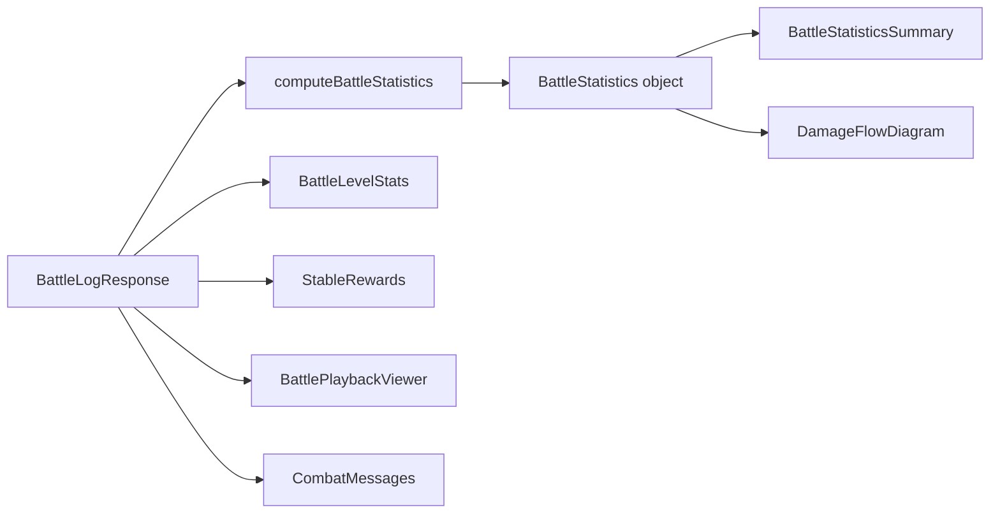

# Design Document: Battle Report Overhaul

## Overview

This design overhauls the Battle Report detail page (`/battle/:id`) and enhances the CompactBattleCard on the Battle History list page. The changes introduce a structured statistics summary, a Sankey-style damage flow diagram, responsive playback viewer, tabbed layout, design system alignment, and improved economic visibility.

The design is frontend-heavy. Battle statistics are computed client-side from the existing `battleLog.events` array — no new backend endpoints or schema changes are needed for the statistics, Sankey, responsive canvas, tabs, or design system work. The only backend change is extending the match history API response to include `prestigeAwarded`, `fameAwarded`, and `streamingRevenue` per battle for the CompactBattleCard enhancement.

### Key Design Decisions

1. **Recharts Sankey** — The project already depends on `recharts` (installed as `^3.8.0` in `app/frontend/package.json`; latest published is 3.2.1 on npm — the local version may be a pre-release or local build). Recharts includes a built-in `<Sankey>` component backed by `d3-sankey`. This avoids adding a new dependency and keeps bundle size stable. The Sankey component renders SVG, which integrates naturally with the dark industrial theme via fill/stroke overrides. **Note:** Verify the Sankey component exists in the installed version before implementation. If it's missing, fall back to a custom SVG implementation or `d3-sankey` directly.

2. **Client-side statistics computation** — All aggregate stats (hit rates, crit rates, malfunctions, shield absorbs, counters) are derived from the `battleLog.events` array already present in the `BattleLogResponse`. A pure utility function (`computeBattleStatistics`) processes the events array and returns a typed statistics object. This keeps the backend unchanged and makes the computation testable with property-based tests.

3. **Responsive canvas via CSS + devicePixelRatio** — The ArenaCanvas currently uses a hardcoded `CANVAS_SIZE = 500` constant for both CSS display size and pixel buffer. The new approach uses a `useContainerSize` hook that reads the container's width, clamps it to [300, 500], and sets the canvas pixel dimensions to `size * devicePixelRatio` for crisp rendering on HiDPI displays. The 1:1 aspect ratio is maintained by setting both width and height to the same clamped value.

4. **Tabs on desktop, stacked on mobile** — A `useMediaQuery` hook (or Tailwind's `lg:` breakpoint at 1024px) controls whether the page renders a `<TabLayout>` or a `<StackedLayout>`. Tab state is stored in component state with URL hash sync so refreshes preserve the active tab.

5. **No new backend endpoints for statistics** — The `BattleLogResponse` already contains all the data needed. The `events` array has `type`, `attacker`, `defender`, `weapon`, `damage`, `hit`, `critical`, `malfunction` fields on each event. The `computeBattleStatistics` function aggregates these into per-robot stat objects.

---

## Architecture

### Component Hierarchy

```
BattleDetailPage
├── BattleResultBanner (existing, redesigned)
├── TagTeamInfo (existing)
├── KothParticipants (existing)
│
├── [Desktop ≥1024px] TabLayout
│   ├── Tab: "Overview"
│   │   ├── BattleStatisticsSummary (NEW)
│   │   ├── BattleLevelStats (NEW — extracted from BattleSummary)
│   │   ├── StableRewards (NEW — extracted from BattleSummary)
│   │   ├── DamageFlowDiagram (NEW — Sankey)
│   │   └── ArenaSummary (existing)
│   ├── Tab: "Playback"
│   │   └── BattlePlaybackViewer (existing, responsive)
│   └── Tab: "Combat Log"
│       └── CombatMessages (existing)
│
├── [Mobile <1024px] StackedLayout
│   ├── BattleStatisticsSummary
│   ├── BattleLevelStats
│   ├── StableRewards
│   ├── DamageFlowDiagram
│   ├── ArenaSummary
│   ├── BattlePlaybackViewer (responsive)
│   └── CombatMessages
```

### Data Flow



The `computeBattleStatistics` function is called once when the battle data loads. Its output is passed as props to both the statistics summary and the Sankey diagram. No intermediate state management is needed — this is a pure derivation from the API response.

### File Structure

```
app/frontend/src/
├── components/battle-detail/
│   ├── BattleStatisticsSummary.tsx    (NEW)
│   ├── BattleLevelStats.tsx           (NEW)
│   ├── StableRewards.tsx              (NEW)
│   ├── DamageFlowDiagram.tsx          (NEW)
│   ├── TabLayout.tsx                  (NEW)
│   ├── AttributeTooltip.tsx           (NEW)
│   ├── BattleResultBanner.tsx         (existing, redesigned — new layout + design system)
│   ├── ArenaSummary.tsx               (existing, unchanged)
│   ├── CombatMessages.tsx             (existing, unchanged)
│   ├── KothParticipants.tsx           (existing, unchanged)
│   ├── TagTeamInfo.tsx                (existing, unchanged)
│   ├── useBattlePlaybackData.ts       (existing, unchanged)
│   ├── index.ts                       (updated — add new exports, remove BattleSummary)
│   └── types.ts                       (updated — add new component prop interfaces)
│   ├── __tests__/
│   │   ├── BattleStatisticsSummary.test.tsx  (NEW)
│   │   ├── DamageFlowDiagram.test.tsx        (NEW)
│   │   └── TabLayout.test.tsx                (NEW)
├── components/BattlePlaybackViewer/
│   ├── ArenaCanvas.tsx                (updated — responsive sizing)
│   ├── BattlePlaybackViewer.tsx       (updated — responsive container)
│   ├── __tests__/
│   │   └── BattlePlaybackViewer.test.tsx  (existing — update layout assertions)
│   └── ...
├── components/
│   ├── CompactBattleCard.tsx          (updated — new props, total credits)
│   └── __tests__/
│       └── KothMatchCards.test.tsx     (existing — update CompactBattleCard props)
├── utils/
│   ├── battleStatistics.ts            (NEW — pure computation)
│   └── __tests__/
│       ├── battleStatistics.test.ts           (NEW — unit tests)
│       └── battleStatistics.property.test.ts  (NEW — property-based tests)
├── hooks/
│   └── useContainerSize.ts            (NEW — responsive sizing)
└── pages/
    ├── BattleDetailPage.tsx           (updated — tab layout, new components)
    └── __tests__/
        └── BattleHistoryKoth.test.tsx (existing — no changes expected, fields optional)
```

### Removals

| File | Reason |
|---|---|
| `app/frontend/src/components/battle-detail/BattleSummary.tsx` | Replaced by `BattleLevelStats.tsx` + `StableRewards.tsx`. All functionality is split into the two new components with clearer separation. |

The `BattleSummary` export is removed from `index.ts` and all imports in `BattleDetailPage.tsx` are updated to use the new components.

### Existing Test Files Affected

| File | Impact |
|---|---|
| `app/frontend/src/components/__tests__/KothMatchCards.test.tsx` | `CompactBattleCard` gains new optional props (`prestige`, `fame`, `streamingRevenue`). Existing tests continue to pass (props are optional) but should add assertions for the new indicators. |
| `app/frontend/src/components/BattlePlaybackViewer/__tests__/BattlePlaybackViewer.test.tsx` | Container layout changes from hardcoded 500px to responsive CSS. Tests asserting on spatial layout structure may need minor updates. Component props interface is unchanged. |
| `app/frontend/src/pages/__tests__/BattleHistoryKoth.test.tsx` | Mocks `getMatchHistory` — response gains 3 optional fields. Existing tests won't break. No changes required. |
| `app/frontend/src/utils/__tests__/battleHistoryStats.test.ts` | Tests `computeBattleSummary` (history page stats). Unrelated to the new `computeBattleStatistics` function. No changes needed. |
| `app/frontend/src/pages/__tests__/PracticeArenaPage.test.tsx` | Mocks `BattlePlaybackViewer` — props interface unchanged. No changes needed. |

### New Test Files

| File | Purpose |
|---|---|
| `app/frontend/src/utils/__tests__/battleStatistics.test.ts` | Unit tests for `computeBattleStatistics` — empty events, single events, mixed types, tag_team grouping, koth with 6 robots |
| `app/frontend/src/utils/__tests__/battleStatistics.property.test.ts` | Property-based tests (fast-check) — 8 correctness properties |
| `app/frontend/src/components/battle-detail/__tests__/BattleStatisticsSummary.test.tsx` | Component rendering for 1v1, tag_team, koth, empty state, attribute tooltips |
| `app/frontend/src/components/battle-detail/__tests__/DamageFlowDiagram.test.tsx` | Sankey rendering for 1v1, empty state, tooltip format |
| `app/frontend/src/components/battle-detail/__tests__/TabLayout.test.tsx` | Tab bar rendering, hiding Playback tab, active tab content |
| `app/backend/src/services/match/__tests__/matchHistoryService.test.ts` | Integration test for prestige/fame/streaming fields in API response |

---

## Components and Interfaces

### 1. `computeBattleStatistics` (Pure Utility)

**File:** `app/frontend/src/utils/battleStatistics.ts`

This is the core computation engine. It takes the events array and returns aggregate statistics. Being a pure function with no side effects, it is the primary target for property-based testing.

```typescript
interface RobotCombatStats {
  robotName: string;
  // Main hand stats
  mainHand: {
    attacks: number;
    hits: number;
    misses: number;
    criticals: number;
    malfunctions: number;
  };
  // Offhand stats (null if robot has no offhand weapon)
  offhand: {
    attacks: number;
    hits: number;
    misses: number;
    criticals: number;
    malfunctions: number;
  } | null;
  // Aggregate attack stats (main + offhand combined)
  attacks: number;        // Total attack opportunities
  hits: number;           // Successful hits
  misses: number;         // Missed attacks
  criticals: number;      // Critical hits
  malfunctions: number;   // Weapon malfunctions
  // Counter-attack stats (this robot as counter-attacker)
  counters: {
    triggered: number;    // Total counter-attacks triggered
    hits: number;         // Counter-attacks that landed
    misses: number;       // Counter-attacks that missed
    damageDealt: number;  // Total damage from counters
  };
  // Counter-attacks received (this robot was countered)
  countersReceived: number;
  // Shield stats
  shieldDamageAbsorbed: number;  // Total shieldDamage from events where this robot is defender
  shieldRecharged: number;       // Total positive shield delta from robotShield tracking
  // Damage totals
  damageDealt: number;    // Total damage dealt (attacks + counters)
  damageReceived: number; // Total damage received
  // Rates
  hitRate: number;        // hits / attacks * 100 (0 if no attacks)
  critRate: number;       // criticals / hits * 100 (0 if no hits)
  malfunctionRate: number; // malfunctions / attacks * 100
  // Hit severity breakdown (no raw numbers shown to player)
  hitGrades: {
    glancing: number;     // < 5% of defender maxHP
    solid: number;        // 5–15% of defender maxHP
    heavy: number;        // 15–30% of defender maxHP
    devastating: number;  // > 30% of defender maxHP
  };
}

interface TeamCombatStats {
  teamName: string;
  robots: RobotCombatStats[];
  totalDamageDealt: number;
  totalDamageReceived: number;
  totalHits: number;
  totalMisses: number;
  totalCriticals: number;
}

interface DamageFlow {
  source: string;  // Attacker robot name
  target: string;  // Defender robot name
  value: number;   // Total damage dealt
}

interface BattleStatistics {
  perRobot: RobotCombatStats[];
  perTeam: TeamCombatStats[] | null;  // Non-null only for tag_team battles
  damageFlows: DamageFlow[];          // For Sankey diagram
  battleDuration: number;
  totalEvents: number;
  hasData: boolean;                   // false if zero attack events
}

function computeBattleStatistics(
  events: BattleLogEvent[],
  battleDuration: number,
  battleType?: string,
  tagTeamInfo?: { team1Robots: string[]; team2Robots: string[] },
  robotMaxHP?: Record<string, number>  // Robot name → maxHP, for hit severity grading
): BattleStatistics;
```

**Event type mapping:**
- `type === 'attack'` with `hit === true` → hit (check `hand` for main/offhand split)
- `type === 'attack'` with `hit === false` → miss (check `hand`)
- `type === 'miss'` → miss (check `hand`)
- `type === 'critical'` → critical (also counts as hit, check `hand`)
- `type === 'malfunction'` → malfunction (check `hand`)
- `type === 'counter'` with `hit === true` → counter hit (attacker/defender are SWAPPED — the defender is now the attacker)
- `type === 'counter'` with `hit === false` → counter miss (attacker/defender swapped)
- `type === 'shield_break'` → shield break event
- `type === 'shield_regen'` → shield regen event (no amount field; track via `robotShield` deltas)
- Damage is extracted from `event.damage` field when present
- Shield damage absorbed is extracted from `event.shieldDamage` field when present
- `event.hand` is `'main'` or `'offhand'` — used to split stats per hand

**Shield regen tracking:**
The `shield_regen` events don't carry an amount. To compute total shield recharged per robot, track the `robotShield[robotName]` value across consecutive events. Sum all positive deltas (shield increased between events). This gives the total shield regenerated during the battle.

**Counter-attack role reversal:**
On counter events, `attacker` = the robot performing the counter (original defender), `defender` = the robot being countered (original attacker). The `computeBattleStatistics` function must attribute counter stats to the correct robot: counter hits/misses go to the counter-attacker's `counters` stats, and counter damage received goes to the counter-defender's `damageReceived`.

**Hit severity grading:**
Each successful hit (attack with `hit === true`, critical, or counter with `hit !== false`) is classified by `event.damage / defenderMaxHP`:
- **Glancing**: < 5% of defender's maxHP
- **Solid**: 5–15% of defender's maxHP
- **Heavy**: 15–30% of defender's maxHP
- **Devastating**: > 30% of defender's maxHP

The `robotMaxHP` map is populated from `BattleLogResponse.robot1.maxHP`, `robot2.maxHP`, and for KotH from `kothParticipants`. If maxHP is unavailable for a defender, the hit is classified as "solid" (safe default).

**Validates:** Requirements 1.1, 1.2, 1.5, 1.6, 1.7, 1.8, 1.9, 1.10, 8.1, 8.2, 8.3, 8.4, 8.5

### 2. `BattleStatisticsSummary` Component

**File:** `app/frontend/src/components/battle-detail/BattleStatisticsSummary.tsx`

Renders the aggregate statistics as a grid of stat cards per robot. Each stat has an optional `AttributeTooltip` info icon.

```typescript
interface BattleStatisticsSummaryProps {
  statistics: BattleStatistics;
  battleType?: string;
}
```

**Layout:**
- Per-robot columns (2 columns for 1v1/tournament, 2×2 for tag_team, up to 6 for koth)
- Each column shows:
  - Main hand: attacks, hits, misses, criticals, malfunctions (with hit rate %)
  - Offhand (if dual-wield): same breakdown for offhand attacks
  - Counters: triggered, hits, misses
  - Hit severity: "3 hits: 1 glancing, 1 solid, 1 devastating"
  - Shield: damage absorbed, shield recharged
  - Totals: damage dealt, damage received
- Hit rate and crit rate displayed as percentage bars
- For tag_team: team aggregate row above individual robot rows
- For koth: scrollable grid for 3+ robots

**Validates:** Requirements 1.1, 1.2, 1.3, 1.4, 1.5, 1.6, 1.7, 1.8, 1.9, 1.10

### 3. `AttributeTooltip` Component

**File:** `app/frontend/src/components/battle-detail/AttributeTooltip.tsx`

A small info icon (ℹ️) that shows a tooltip on hover/tap mapping a combat stat to ALL attributes that influence it, grouped by attacker and defender role. Derived from `docs/architecture/COMBAT_FORMULAS.md`.

```typescript
interface AttributeTooltipProps {
  statName: string;  // e.g., "hitRate", "critRate", "malfunction"
}

interface AttributeEntry {
  attribute: string;
  label: string;
  category: 'combat' | 'defense' | 'chassis' | 'ai' | 'team';
  effect: 'increases' | 'decreases';
}

interface StatAttributeMapping {
  attackerAttributes: AttributeEntry[];
  defenderAttributes: AttributeEntry[];
}

const STAT_ATTRIBUTE_MAP: Record<string, StatAttributeMapping> = {
  hitRate: {
    attackerAttributes: [
      { attribute: 'targetingSystems', label: 'Targeting Systems', category: 'combat', effect: 'increases' },
      { attribute: 'combatAlgorithms', label: 'Combat Algorithms', category: 'ai', effect: 'increases' },
      { attribute: 'adaptiveAI', label: 'Adaptive AI', category: 'ai', effect: 'increases' },
      { attribute: 'logicCores', label: 'Logic Cores', category: 'ai', effect: 'increases' },
    ],
    defenderAttributes: [
      { attribute: 'evasionThrusters', label: 'Evasion Thrusters', category: 'defense', effect: 'decreases' },
      { attribute: 'gyroStabilizers', label: 'Gyro Stabilizers', category: 'chassis', effect: 'decreases' },
    ],
  },
  critRate: {
    attackerAttributes: [
      { attribute: 'criticalSystems', label: 'Critical Systems', category: 'combat', effect: 'increases' },
      { attribute: 'targetingSystems', label: 'Targeting Systems', category: 'combat', effect: 'increases' },
    ],
    defenderAttributes: [],
  },
  critDamage: {
    attackerAttributes: [],
    defenderAttributes: [
      { attribute: 'damageDampeners', label: 'Damage Dampeners', category: 'defense', effect: 'decreases' },
    ],
  },
  damage: {
    attackerAttributes: [
      { attribute: 'combatPower', label: 'Combat Power', category: 'combat', effect: 'increases' },
      { attribute: 'weaponControl', label: 'Weapon Control', category: 'combat', effect: 'increases' },
      { attribute: 'hydraulicSystems', label: 'Hydraulic Systems', category: 'chassis', effect: 'increases' },
      { attribute: 'adaptiveAI', label: 'Adaptive AI', category: 'ai', effect: 'increases' },
    ],
    defenderAttributes: [
      { attribute: 'armorPlating', label: 'Armor Plating', category: 'defense', effect: 'decreases' },
      { attribute: 'shieldCapacity', label: 'Shield Capacity', category: 'defense', effect: 'decreases' },
      { attribute: 'damageDampeners', label: 'Damage Dampeners', category: 'defense', effect: 'decreases' },
    ],
  },
  malfunction: {
    attackerAttributes: [
      { attribute: 'weaponControl', label: 'Weapon Control', category: 'combat', effect: 'decreases' },
    ],
    defenderAttributes: [],
  },
  counterChance: {
    attackerAttributes: [],
    defenderAttributes: [
      { attribute: 'counterProtocols', label: 'Counter Protocols', category: 'defense', effect: 'increases' },
    ],
  },
  attackSpeed: {
    attackerAttributes: [
      { attribute: 'attackSpeed', label: 'Attack Speed', category: 'combat', effect: 'increases' },
    ],
    defenderAttributes: [],
  },
  shieldRegen: {
    attackerAttributes: [],
    defenderAttributes: [
      { attribute: 'powerCore', label: 'Power Core', category: 'chassis', effect: 'increases' },
    ],
  },
  penetration: {
    attackerAttributes: [
      { attribute: 'penetration', label: 'Penetration', category: 'combat', effect: 'increases' },
    ],
    defenderAttributes: [
      { attribute: 'armorPlating', label: 'Armor Plating', category: 'defense', effect: 'decreases' },
    ],
  },
};
```

The tooltip renders two groups: "Attacker" and "Defender", each listing the relevant attributes with their category color and effect direction. No formula numbers are shown — only attribute names and whether they increase or decrease the stat.

**Validates:** Requirement 1.4

### 4. `BattleLevelStats` Component

**File:** `app/frontend/src/components/battle-detail/BattleLevelStats.tsx`

Extracted from the current `BattleSummary`. Displays combat-specific outcomes only: damage dealt, final HP (as percentage of maxHP), ELO change, battle duration, and battle outcome per robot (destroyed / yielded / survived).

```typescript
interface BattleLevelStatsProps {
  battleLog: BattleLogResponse;
}
```

**Per-robot outcome display:**
- Destroyed (finalHP = 0, destroyed = true): "💀 Destroyed" in error color
- Yielded (yielded = true): "🏳️ Yielded" in warning color
- Survived: "✅ Survived" in success color with HP percentage

**Backend change needed:** Add `yielded` and `destroyed` booleans to the robot1/robot2 objects in the `getBattleLog` response. These come from `BattleParticipant.yielded` and `BattleParticipant.destroyed` — already in the database, just not in the API response.

**Validates:** Requirements 2.1, 2.3, 2.6

### 5. `StableRewards` Component

**File:** `app/frontend/src/components/battle-detail/StableRewards.tsx`

Extracted from the current `BattleSummary`. Displays stable-level economic effects: credits earned (win/loss reward), prestige, fame, streaming revenue. Visually distinct from BattleLevelStats with a separate card and heading.

```typescript
interface StableRewardsProps {
  battleLog: BattleLogResponse;
}
```

**Credits display:** Shows the `reward` field (credits earned from the battle win/loss) plus `streamingRevenue` as separate line items, with a total. Credits are a stable-level effect — they go to the player's stable balance, not the robot.

For tag_team battles: shows per-team aggregates with expandable per-robot breakdown.
For koth battles: shows per-participant rewards in the KotH results table.

**Validates:** Requirements 2.2, 2.3, 2.4, 2.5

### 6. `DamageFlowDiagram` Component

**File:** `app/frontend/src/components/battle-detail/DamageFlowDiagram.tsx`

Renders a Sankey diagram using Recharts' `<Sankey>` component. The data is derived from `BattleStatistics.damageFlows`.

```typescript
interface DamageFlowDiagramProps {
  damageFlows: DamageFlow[];
  robotNames: string[];
  battleType?: string;
}
```

**Implementation details:**
- Uses `<Sankey>` from `recharts` (already installed as `recharts@^3.8.0`)
- Nodes = robot names, Links = damage flows with `value` = total damage
- Node colors assigned from design system category colors: `#f85149` (combat/red), `#58a6ff` (defense/blue), `#3fb950` (chassis/green), `#d29922` (AI/yellow), `#a371f7` (team/purple), `#e6edf3` (neutral)
- For 1v1: two nodes with bidirectional flows
- For tag_team: four nodes, flows between all pairs that dealt damage
- For koth: up to six nodes, flows between all pairs
- Tooltip on hover shows: "{source} → {target}: {damage} damage"
- SVG rendered with dark background matching `surface` color
- Minimum height: 200px for 1v1, 300px for multi-robot

**Validates:** Requirements 3.1, 3.2, 3.3, 3.4, 3.5, 3.6, 3.7

### 7. `TabLayout` Component

**File:** `app/frontend/src/components/battle-detail/TabLayout.tsx`

Desktop-only tabbed navigation for the battle report page.

```typescript
type TabId = 'overview' | 'playback' | 'combat-log';

interface TabLayoutProps {
  activeTab: TabId;
  onTabChange: (tab: TabId) => void;
  hasPlayback: boolean;  // false if no spatial data
  children: {
    overview: React.ReactNode;
    playback: React.ReactNode;
    combatLog: React.ReactNode;
  };
}
```

**Behavior:**
- Renders a horizontal tab bar with three tabs
- Active tab has `border-b-2 border-primary text-primary` styling
- Inactive tabs use `text-secondary` with hover transition
- Tab bar background: `bg-surface-elevated`
- When `hasPlayback` is false, the "Playback" tab is hidden and combat log content is included in the Overview tab
- Tab state defaults to "overview" on initial load
- Tab state persists across data refreshes (stored in component state)

**Validates:** Requirements 5.1, 5.2, 5.3, 5.4, 5.5, 5.6, 5.7, 5.8

### 8. Responsive ArenaCanvas Updates

**File:** `app/frontend/src/components/BattlePlaybackViewer/ArenaCanvas.tsx`

**Responsive changes:**
- Remove `const CANVAS_SIZE = 500` constant
- Add `useContainerSize` hook that observes the parent container width
- Clamp display size to `[300, 500]` range
- Set canvas pixel dimensions to `displaySize * window.devicePixelRatio` for HiDPI
- Set CSS display size to `displaySize × displaySize`
- Replace inline `style={{ width: 500, height: 500 }}` with responsive CSS

**Visual polish — top-down robot sprites:**
- Replace `renderRobot()` colored circles with top-down robot sprite images that vary by loadout type and weapon range band
- Sprite selection matrix: loadout type (single, weapon_shield, two_handed, dual_wield) × primary weapon range band (melee, short, mid, long) — approximately 8-12 distinct sprites covering valid combinations
- Sprites are small SVG or PNG assets (approximately 48×48px source, rendered at `ROBOT_RADIUS * 2` on canvas) depicting a robot viewed from above with visual cues for equipment:
  - Melee loadouts: visible blade/hammer arms
  - Ranged loadouts: visible gun barrels
  - Shield loadouts: visible shield on one side
  - Two-handed: large weapon silhouette
  - Dual-wield: two weapon arms
- Team color applied as a tint overlay or colored outline ring around the sprite
- Sprite rotates to match the robot's facing direction using canvas `ctx.rotate()`
- Fallback: if sprite not available for a loadout/range combination, render a styled geometric robot shape (hexagonal body with "head" bump) in team color
- The facing arrow, name label, HP bar, and shield bar remain unchanged — they overlay the sprite

**Visual polish — arena background:**
- Replace the plain `clearRect` with a subtle radial grid: concentric circles at 25%/50%/75% of arena radius using `#1a1f29` (surface color), plus a subtle radial gradient from `#0a0e14` center to `#0f1318` edge.
- Arena boundary dashed circle remains but uses design system color (`#4B5563` → `#57606a` text-tertiary).

**Sprite asset requirements:**
- Format: PNG with transparent background (canvas `drawImage` works best with pre-rendered bitmaps at known sizes)
- Size: 64×64px (rendered at `ROBOT_RADIUS * 2` = 24px on canvas, but 64px source gives clean scaling on HiDPI)
- Style: top-down view of a robot mech silhouette, dark metallic grayscale body, transparent background. Team color applied at render time via canvas tinting.
- Location: `app/frontend/public/assets/arena-sprites/`
- Fallback: if any sprite fails to load or is missing, fall back to the current colored circle rendering (existing `renderRobot` behavior preserved as-is)

**Complete sprite manifest (16 files):**

| # | Filename | Loadout | Range | Visual description |
|---|---|---|---|---|
| 1 | `robot-single-melee.png` | single | melee | Compact mech, one arm extended with a blade/sword |
| 2 | `robot-single-short.png` | single | short | Compact mech, one arm with a pistol/sidearm |
| 3 | `robot-single-mid.png` | single | mid | Compact mech, one arm with a rifle |
| 4 | `robot-single-long.png` | single | long | Compact mech, one arm with a long barrel/sniper |
| 5 | `robot-dual_wield-melee.png` | dual_wield | melee | Compact mech, two arms extended with blades |
| 6 | `robot-dual_wield-short.png` | dual_wield | short | Compact mech, two arms with pistols |
| 7 | `robot-dual_wield-mid.png` | dual_wield | mid | Compact mech, two arms with rifles |
| 8 | `robot-dual_wield-long.png` | dual_wield | long | Compact mech, two arms with long barrels |
| 9 | `robot-two_handed-melee.png` | two_handed | melee | Bulky mech, both arms gripping a large hammer/axe |
| 10 | `robot-two_handed-short.png` | two_handed | short | Bulky mech, both arms gripping a heavy shotgun |
| 11 | `robot-two_handed-mid.png` | two_handed | mid | Bulky mech, both arms gripping a heavy rifle/cannon |
| 12 | `robot-two_handed-long.png` | two_handed | long | Bulky mech, both arms gripping a long-range beam weapon |
| 13 | `robot-weapon_shield-melee.png` | weapon_shield | melee | Mech with shield on left arm, blade on right arm |
| 14 | `robot-weapon_shield-short.png` | weapon_shield | short | Mech with shield on left arm, pistol on right arm |
| 15 | `robot-weapon_shield-mid.png` | weapon_shield | mid | Mech with shield on left arm, rifle on right arm |
| 16 | `robot-weapon_shield-long.png` | weapon_shield | long | Mech with shield on left arm, long barrel on right arm |

**Image generation prompts (for AI image generation tools):**

Base prompt template (adapt per sprite):
```
Top-down view of a small combat robot mech, viewed directly from above.
Dark metallic grayscale body on a transparent background.
Industrial military style, no bright colors. Clean silhouette.
64x64 pixel icon size. The robot faces upward (12 o'clock direction).
No background, no shadow, no glow effects.
```

Per-sprite additions:
- **single-melee**: `One arm extended forward holding a short blade. Other arm at side. Compact body.`
- **single-short**: `One arm extended forward holding a small pistol. Other arm at side. Compact body.`
- **single-mid**: `One arm extended forward holding a rifle. Other arm at side. Compact body.`
- **single-long**: `One arm extended forward holding a long sniper barrel. Other arm at side. Compact body.`
- **dual_wield-melee**: `Both arms extended outward holding blades. Compact body. Aggressive stance.`
- **dual_wield-short**: `Both arms extended outward holding pistols. Compact body. Aggressive stance.`
- **dual_wield-mid**: `Both arms extended outward holding rifles. Compact body. Aggressive stance.`
- **dual_wield-long**: `Both arms extended outward holding long barrels. Compact body. Aggressive stance.`
- **two_handed-melee**: `Both arms gripping a large two-handed hammer or axe in front. Bulky heavy body.`
- **two_handed-short**: `Both arms gripping a heavy shotgun in front. Bulky heavy body.`
- **two_handed-mid**: `Both arms gripping a heavy cannon in front. Bulky heavy body.`
- **two_handed-long**: `Both arms gripping a long-range beam weapon in front. Bulky heavy body.`
- **weapon_shield-melee**: `Left arm holding a round shield. Right arm holding a blade. Defensive stance.`
- **weapon_shield-short**: `Left arm holding a round shield. Right arm holding a pistol. Defensive stance.`
- **weapon_shield-mid**: `Left arm holding a round shield. Right arm holding a rifle. Defensive stance.`
- **weapon_shield-long**: `Left arm holding a round shield. Right arm holding a long barrel. Defensive stance.`

**Sprite preloading and selection:**
```typescript
// In BattlePlaybackViewer.tsx
const spriteCache = useRef(new Map<string, HTMLImageElement>());

function getSpriteKey(loadoutType: string, rangeBand: string): string {
  // For dual_wield, the rangeBand comes from the main weapon
  // For weapon_shield, the rangeBand comes from the main weapon (not the shield)
  return `robot-${loadoutType}-${rangeBand}`;
}

useEffect(() => {
  const keys = new Set<string>();
  // Collect loadoutType + rangeBand from each robot in the battle
  for (const key of keys) {
    if (!spriteCache.current.has(key)) {
      const img = new Image();
      img.onload = () => spriteCache.current.set(key, img);
      img.onerror = () => { /* fallback to current colored circle */ };
      img.src = `/assets/arena-sprites/${key}.png`;
    }
  }
}, [battleLog]);
```

The `spriteCache` ref is passed to `ArenaCanvas` as a prop. The `renderRobot` function looks up the sprite by the robot's loadout+range key.

**Backend API change:** The `BattleLogResponse` robot objects need `loadoutType` and main weapon `rangeBand` fields added. Both already exist on the Robot and Weapon models — just need to be included in the response.

**File:** `app/frontend/src/components/BattlePlaybackViewer/BattlePlaybackViewer.tsx`

**Changes:**
- Remove `style={{ width: 500 }}` from the arena column div
- Use responsive CSS: `w-full max-w-[500px]` on the arena column
- Combat log panel height adapts to match arena height
- Add sprite preloading logic (see above), pass `spriteCache` to ArenaCanvas

**File:** `app/frontend/src/components/BattlePlaybackViewer/canvasRenderer.ts`

**Changes:**
- `renderRobot()` accepts optional `sprite: HTMLImageElement | undefined` parameter
- If sprite provided: `ctx.save()` → `ctx.translate()` → `ctx.rotate(facingRad)` → `ctx.drawImage()` → team color ring → `ctx.restore()`
- If no sprite: styled geometric robot shape (hexagonal body with head bump) in team color — upgrade from plain circle
- `clearCanvas()` replaced with `renderArenaBackground()` that draws the grid pattern
- Arena boundary uses design system tertiary color

**KotH zone rotation fix:**
Currently, when the zone rotates in a KotH match, `zone_moving` sets the state to `inactive` (faded at old position) and `zone_active` snaps the zone to the new position. The transition is invisible — the zone just disappears and reappears. Fix: during the `zone_moving` → `zone_active` transition, interpolate the zone center position or show a visual transition (fade out at old position, fade in at new position). The `useKothPlaybackState` hook needs to track both the old and new zone positions during transitions, and `renderKothZone` needs a transition animation state.

**File:** `app/frontend/src/hooks/useContainerSize.ts`

```typescript
function useContainerSize(
  ref: React.RefObject<HTMLElement>,
  options?: { minSize?: number; maxSize?: number }
): { width: number; height: number };
```

Uses `ResizeObserver` to track container dimensions. Returns clamped values.

**Validates:** Requirements 4.1, 4.2, 4.3, 4.4, 4.5, 4.6, 4.7, 4.8, 4.9

### 9. CompactBattleCard Economic Enhancement

**File:** `app/frontend/src/components/CompactBattleCard.tsx`

**Changes:**
- Accept new props: `prestige?: number`, `fame?: number`, `streamingRevenue?: number`
- Display `totalCredits = reward + (streamingRevenue ?? 0)` instead of just `reward`
- Show `⭐+{prestige}` in info color (`#a371f7`) when prestige > 0
- Show `🎖️+{fame}` in warning color (`#d29922`) when fame > 0
- Desktop layout: prestige and fame indicators between date column and ELO change column
- Mobile layout: prestige and fame in the stats row alongside ELO and credits
- Omit indicators when values are 0 or undefined

**Validates:** Requirements 7.1, 7.2, 7.3, 7.4, 7.6, 7.7, 7.8

### 10. Backend: Match History API Enhancement

**File:** `app/backend/src/services/match/matchHistoryService.ts`

**Changes to `formatBattleHistoryEntry`:**
- Look up the requesting user's robot in `battle.participants`
- Add `prestigeAwarded`, `fameAwarded`, `streamingRevenue` to the response object
- These fields come from the existing `BattleParticipant` model — no schema changes needed

**File:** `app/frontend/src/utils/matchmakingApi.ts`

**Changes to `BattleHistory` interface:**
- Add optional fields: `prestigeAwarded?: number`, `fameAwarded?: number`, `streamingRevenue?: number`

**Validates:** Requirements 7.3, 7.5

### 11. Robot Images in Battle Report

**Files affected:**
- `app/backend/src/services/match/matchHistoryService.ts` — include `imageUrl` in battle log response robot data
- `app/frontend/src/utils/matchmakingApi.ts` — add `imageUrl?: string | null` to robot objects in `BattleLogResponse`
- `app/frontend/src/components/battle-detail/BattleResultBanner.tsx` — render `RobotImage` next to robot names
- `app/frontend/src/components/battle-detail/BattleLevelStats.tsx` — render `RobotImage` (small) in per-robot stat rows
- `app/frontend/src/components/battle-detail/StableRewards.tsx` — render `RobotImage` (small) in per-robot reward rows
- `app/frontend/src/components/battle-detail/BattleStatisticsSummary.tsx` — render `RobotImage` (small) in per-robot stat columns

**Backend change:** The `getBattleLog` service already queries the Robot model for each participant. Add `imageUrl` to the select/include. No schema changes — `Robot.imageUrl` already exists.

**Layout by battle type:**

| Battle type | Result banner | Stats / Rewards |
|---|---|---|
| League / Tournament (1v1) | Two robot images (medium, 128px) flanking the result text, left vs right | Small images (64px) next to each robot's column header |
| Tag Team (2v2) | Two team groups, each showing 2 small images stacked with team name | Small images next to each robot name within team groupings |
| KotH (FFA, up to 6) | Winner's image (medium) centered, other participants as small images in placement order | Small images in the scrollable participant grid |

**Uses the existing `RobotImage` component** — no new image component needed. Falls back to 🤖 placeholder when `imageUrl` is null.

**Validates:** Requirements 9.1, 9.2, 9.3, 9.4, 9.5, 9.6

### 12. BattleResultBanner Redesign

**File:** `app/frontend/src/components/battle-detail/BattleResultBanner.tsx`

The current banner has several problems: uses raw Tailwind colors instead of design system tokens, shows "{ROBOT NAME} WINS" in all caps, doesn't explain how the battle ended, and the color coding (green/red/yellow/orange) is confusing — especially for spectators viewing a battle they didn't participate in.

**Two modes: participant vs spectator**

The banner checks whether `userId` matches any robot's `ownerId`. If yes → participant mode. If no → spectator mode.

**Participant mode:**
- Heading: "Victory" (success color), "Defeat" (error color), or "Draw" (warning color)
- Subheading: "by Destruction" / "by Yield" / "by Time Limit" / "by Zone Score"
- Layout: winner robot image (medium, full opacity) on left, loser robot image (medium, reduced opacity) on right, with "vs" between them
- Background: subtle tint using design system colors — `bg-success/10` for victory, `bg-error/10` for defeat, `bg-warning/10` for draw
- Border: 2px border using the same accent color

**Spectator mode:**
- Heading: "{Winner Name} Wins" or "Draw" in primary color (#58a6ff)
- Same subheading and layout, but both robot images at equal emphasis (no opacity difference)
- Background: `bg-primary/10` with `border-primary` — neutral blue tone

**Tag team:**
- Shows team stable names with 2 robot images per team, grouped
- Participant mode: "Victory" / "Defeat" based on which team the player's robot is on
- Spectator mode: "{Stable Name} Wins"

**KotH:**
- Participant mode: shows player's placement ("2nd of 6") with their robot image, plus winner info
- Spectator mode: shows top 3 placements with robot images
- Color: placement 1 = success, 2-3 = warning, 4+ = secondary

**Battle context line** (all modes): battle type icon + league tier or tournament round + duration, using `text-sm text-secondary`.

**Validates:** Requirements 10.1, 10.2, 10.3, 10.4, 10.5, 10.6, 10.7

---

## Data Models

### BattleStatistics (Frontend — Computed)

```typescript
// Input: BattleLogEvent[] from BattleLogResponse.battleLog.events
// Output: BattleStatistics

interface BattleStatistics {
  perRobot: RobotCombatStats[];       // One entry per robot in the battle
  perTeam: TeamCombatStats[] | null;  // Non-null for tag_team only
  damageFlows: DamageFlow[];          // Sankey diagram data
  battleDuration: number;             // From BattleLogResponse.duration
  totalEvents: number;                // Count of processed events
  hasData: boolean;                   // false when zero attack events
}
```

### DamageFlow (Frontend — Computed)

```typescript
interface DamageFlow {
  source: string;  // Attacker robot name
  target: string;  // Defender robot name
  value: number;   // Aggregate damage
}
```

These are derived from the `attacker`, `defender`, and `damage` fields on `BattleLogEvent` objects. The aggregation groups by `(attacker, defender)` pair and sums `damage`.

### BattleHistory API Extension (Backend)

The existing `BattleHistory` interface gains three optional fields:

```typescript
interface BattleHistory {
  // ... existing fields ...
  prestigeAwarded?: number;    // From BattleParticipant.prestigeAwarded
  fameAwarded?: number;        // From BattleParticipant.fameAwarded
  streamingRevenue?: number;   // From BattleParticipant.streamingRevenue
}
```

No database schema changes. The `BattleParticipant` model already stores these fields. The `formatBattleHistoryEntry` function in `matchHistoryService.ts` already queries `battle.participants` — it just needs to include these three fields in the response.

### Attribute-to-Stat Mapping (Static)

See the `STAT_ATTRIBUTE_MAP` in the `AttributeTooltip` component (Section 3) for the complete mapping. Each stat maps to attacker and defender attributes derived from `docs/architecture/COMBAT_FORMULAS.md`. This is a static lookup table — no computation needed.

---

## Requirements Traceability

| Requirement | Design Section |
|---|---|
| 1.1 Aggregate statistics from events | `computeBattleStatistics`, `BattleStatisticsSummary` |
| 1.2 Per-robot statistics | `RobotCombatStats`, `BattleStatisticsSummary` |
| 1.3 Display alongside combat messages | `TabLayout` (Overview tab), `StackedLayout` |
| 1.4 Attribute tooltips | `AttributeTooltip`, `STAT_ATTRIBUTE_MAP` |
| 1.5 Tag team team-level aggregation | `TeamCombatStats`, `computeBattleStatistics` |
| 1.6 KotH per-participant stats | `computeBattleStatistics`, `BattleStatisticsSummary` |
| 1.7 Hit severity grading | `RobotCombatStats.hitGrades`, `computeBattleStatistics`, `BattleStatisticsSummary` |
| 1.8 Main hand / offhand split | `RobotCombatStats.mainHand`, `RobotCombatStats.offhand`, `event.hand` field |
| 1.9 Counter-attack tracking | `RobotCombatStats.counters` (triggered/hits/misses/damage), counter role reversal in `computeBattleStatistics` |
| 1.10 Shield damage absorbed and recharged | `RobotCombatStats.shieldDamageAbsorbed`, `RobotCombatStats.shieldRecharged`, `robotShield` delta tracking |
| 2.1 Battle-level stats group | `BattleLevelStats` component (damage, HP, ELO, duration, destroyed/yielded/survived) |
| 2.2 Stable-level effects group | `StableRewards` component (credits, prestige, fame, streaming) |
| 2.3 Distinct visual boundaries | Separate cards with different headings |
| 2.4 Tag team stable effects per team | `StableRewards` tag_team variant |
| 2.5 KotH stable effects per participant | `StableRewards` koth variant |
| 2.6 yielded/destroyed in API response | Backend `getBattleLog` includes `BattleParticipant.yielded` and `BattleParticipant.destroyed` |
| 3.1 Sankey diagram with proportional flows | `DamageFlowDiagram` using Recharts `<Sankey>` |
| 3.2 1v1 bidirectional flows | `DamageFlowDiagram` 2-node layout |
| 3.3 Tag team 4-robot flows | `DamageFlowDiagram` 4-node layout |
| 3.4 KotH multi-robot flows | `DamageFlowDiagram` up to 6-node layout |
| 3.5 Derive from events array | `computeBattleStatistics.damageFlows` |
| 3.6 Design system colors | Node color assignment from palette |
| 3.7 Hover tooltip | Recharts `<Tooltip>` customization |
| 4.1 Responsive canvas [300, 500] | `useContainerSize` hook, ArenaCanvas updates |
| 4.2 Full width on mobile <768px | CSS responsive rules |
| 4.3 Fixed 500px on desktop ≥768px | CSS responsive rules |
| 4.4 1:1 aspect ratio | Canvas width === height |
| 4.5 Replace inline styles | Remove `style={{ width: 500 }}` |
| 4.6 Design system canvas colors | `#0a0e14` background |
| 4.7 Responsive container | Remove hardcoded arena column width |
| 4.8 Top-down robot sprites | `renderRobot()` with loadout/range-based sprite selection, sprite preloading cache, geometric fallback |
| 4.9 Arena background grid | `renderArenaBackground()` with radial grid pattern and design system colors |
| 4.10 KotH zone rotation visibility | `useKothPlaybackState` transition tracking, `renderKothZone` animation during zone_moving → zone_active |
| 5.1 Tabbed layout ≥1024px | `TabLayout` component |
| 5.2 Stacked layout <1024px | Conditional rendering in `BattleDetailPage` |
| 5.3 Overview tab content | Tab children mapping |
| 5.4 Playback tab content | Tab children mapping |
| 5.5 Combat Log tab content | Tab children mapping |
| 5.6 Preserve tab on refresh | Component state persistence |
| 5.7 Design system tab styling | Tab bar colors and typography |
| 5.8 Hide Playback tab when no spatial data | `hasPlayback` prop |
| 6.1 Background colors | All components use design tokens |
| 6.2 Typography scale | Consistent heading/body/label sizes |
| 6.3 Accent colors | Success/error/warning/info/primary usage |
| 6.4 Motion guidelines | 150ms hover, 2px lift, 200-300ms fade |
| 6.5 Reduced motion | `prefers-reduced-motion` media query |
| 6.6 Consistent spacing | p-3, mb-3, gap-3 pattern |
| 7.1 Prestige on CompactBattleCard | `⭐+{value}` display |
| 7.2 Fame on CompactBattleCard | `🎖️+{value}` display |
| 7.3 Total credits (base + streaming) | `reward + streamingRevenue` |
| 7.4 Omit zero values | Conditional rendering |
| 7.5 API includes economic fields | `matchHistoryService` update |
| 7.6 Color coding | Info for prestige, warning for fame |
| 7.7 Mobile layout | Stats row placement |
| 7.8 Desktop layout | Between date and ELO columns |
| 8.1 Event type counting | `computeBattleStatistics` implementation |
| 8.2 Hit rate computation | `hits / attacks * 100` |
| 8.3 Duration from response | `BattleLogResponse.duration` |
| 8.4 Zero events handling | `hasData: false` → "No combat data" |
| 8.5 Idempotent computation | Pure function, no side effects |
| 9.1 Robot images next to names | `RobotImage` in BattleResultBanner, BattleLevelStats, StableRewards, BattleStatisticsSummary |
| 9.2 Image sizes (small/medium) | `RobotImage` size prop: "small" in grids, "medium" in banner |
| 9.3 imageUrl in API response | Backend `getBattleLog` includes `Robot.imageUrl` |
| 9.4 Null image placeholder | Existing `RobotImage` fallback (🤖 icon) |
| 9.5 Tag team 4-robot images | Team-grouped layout in banner and stats |
| 9.6 KotH participant images | Images in KotH results table and stats grid |
| 10.1 Design system colors only | BattleResultBanner redesign — success/error/warning/primary tokens |
| 10.2 Participant vs spectator perspective | Participant: "Victory"/"Defeat". Spectator: "{Name} Wins" in primary color |
| 10.3 Battle end method | "by Destruction"/"by Yield"/"by Time Limit"/"by Zone Score" from yielded/destroyed fields |
| 10.4 Robot images in banner | Medium RobotImage for combatants, winner emphasized in participant mode |
| 10.5 Tag team banner | Team grouping with stable names and robot images |
| 10.6 KotH banner | Placement display, participant vs spectator variants |
| 10.7 Battle context metadata | Type icon + league/tournament + duration in design system typography |


---

## Correctness Properties

*A property is a characteristic or behavior that should hold true across all valid executions of a system — essentially, a formal statement about what the system should do. Properties serve as the bridge between human-readable specifications and machine-verifiable correctness guarantees.*

### Property 1: Event Counting Conservation

*For any* array of battle log events, the sum of `hits + misses + criticals + malfunctions` across all robots in the output of `computeBattleStatistics` SHALL equal the count of attack-type events (`attack`, `miss`, `critical`, `malfunction`) in the input array. Counter events are counted separately: the sum of `counters.hits + counters.misses` across all robots SHALL equal the count of `counter` events in the input. No events are lost or double-counted.

**Validates: Requirements 1.1, 1.9, 8.1**

### Property 1b: Main/Offhand Split Conservation

*For any* robot in the output, `mainHand.attacks + mainHand.hits + mainHand.misses + mainHand.criticals + mainHand.malfunctions` plus the equivalent offhand totals (if offhand is non-null) SHALL equal the robot's aggregate `attacks + hits + misses + criticals + malfunctions`. The per-hand breakdown sums to the aggregate.

**Validates: Requirement 1.8**

### Property 2: Per-Robot Stats Completeness

*For any* array of battle log events containing N distinct robot names (as attackers or defenders), `computeBattleStatistics` SHALL return exactly N entries in `perRobot`, one per unique robot name. Each robot's `damageDealt` SHALL equal the sum of `damage` values from events where that robot is the attacker.

**Validates: Requirements 1.2, 1.6**

### Property 3: Team Aggregation Invariant

*For any* tag_team battle with events for 4 robots split into 2 teams, each team's `totalDamageDealt` in the `perTeam` output SHALL equal the sum of `damageDealt` from its member robots in `perRobot`. Similarly for `totalHits`, `totalMisses`, and `totalCriticals`.

**Validates: Requirement 1.5**

### Property 4: Damage Flow Conservation

*For any* array of battle log events with damage values, the sum of all `value` fields in `damageFlows` SHALL equal the total damage dealt across all events. Each flow's `value` SHALL equal the sum of `damage` from events where `source` is the attacker and `target` is the defender.

**Validates: Requirements 3.1, 3.5**

### Property 5: Canvas Size Clamping and Aspect Ratio

*For any* container width value, the computed canvas display size SHALL be clamped to the range [300, 500] and the output width SHALL equal the output height (1:1 aspect ratio). Specifically: `displaySize = Math.min(Math.max(containerWidth, 300), 500)` and `displayWidth === displayHeight`.

**Validates: Requirements 4.1, 4.4**

### Property 6: Total Credits Computation

*For any* non-negative reward value and non-negative streamingRevenue value, the displayed total credits SHALL equal `reward + streamingRevenue`.

**Validates: Requirement 7.3**

### Property 7: Hit Rate Formula Correctness

*For any* robot with `attacks > 0`, the computed `hitRate` SHALL equal `(hits / attacks) * 100`. *For any* robot with `attacks === 0`, the computed `hitRate` SHALL be `0` (not NaN or Infinity).

**Validates: Requirement 8.2**

### Property 8: Computation Idempotence

*For any* valid battle log events array and duration, calling `computeBattleStatistics` twice with the same input SHALL produce deeply equal output objects.

**Validates: Requirement 8.5**

### Property 9: Hit Grade Conservation

*For any* robot in the output of `computeBattleStatistics`, the sum of `hitGrades.glancing + hitGrades.solid + hitGrades.heavy + hitGrades.devastating` SHALL equal the robot's `hits` count. Every successful hit is classified into exactly one grade.

**Validates: Requirement 1.7**

---

## Error Handling

### Empty or Missing Data

| Scenario | Handling |
|---|---|
| `battleLog.events` is empty or undefined | `computeBattleStatistics` returns `{ hasData: false, perRobot: [], ... }`. `BattleStatisticsSummary` displays "No combat data available." |
| `battleLog.events` contains no attack-type events | Same as above — `hasData: false` |
| `damageFlows` is empty (no damage dealt) | `DamageFlowDiagram` renders a "No damage data" message instead of an empty SVG |
| `BattleLogResponse.robot1` or `robot2` is null | `BattleLevelStats` and `StableRewards` gracefully skip missing robots |
| `kothParticipants` is empty for a koth battle | Statistics summary shows "No participant data" |
| `arenaRadius` is missing | Playback tab is hidden (existing behavior), combat log shown in Overview tab |

### Division by Zero

- `hitRate`: guarded by `attacks > 0` check, returns 0 otherwise
- `critRate`: guarded by `hits > 0` check, returns 0 otherwise
- `malfunctionRate`: guarded by `attacks > 0` check, returns 0 otherwise

### Responsive Canvas Edge Cases

| Scenario | Handling |
|---|---|
| Container width < 300px | Canvas renders at minimum 300px (may overflow container with horizontal scroll) |
| Container width > 500px | Canvas renders at maximum 500px |
| `devicePixelRatio` is undefined | Falls back to 1 |
| `ResizeObserver` not supported | Falls back to 500px fixed size (existing behavior) |

### API Response Missing Economic Fields

- `prestigeAwarded`, `fameAwarded`, `streamingRevenue` are optional on `BattleHistory`
- CompactBattleCard omits indicators when values are undefined or 0
- `totalCredits` falls back to `reward` when `streamingRevenue` is undefined

### Tab State

- Invalid tab ID in URL hash → defaults to "overview"
- Tab state is component-local — no persistence across page navigations (only within the same page load)

---

## Testing Strategy

### Property-Based Tests (fast-check)

The project uses `fast-check` (already installed in both frontend and backend). Property tests target the pure `computeBattleStatistics` function and the canvas sizing logic.

**Configuration:** Minimum 100 iterations per property test.

**Test file:** `app/frontend/src/utils/__tests__/battleStatistics.property.test.ts`

| Property | Test Description | Tag |
|---|---|---|
| Property 1 | Event counting conservation | `Feature: battle-report-overhaul, Property 1: Event counting conservation` |
| Property 1b | Main/offhand split conservation | `Feature: battle-report-overhaul, Property 1b: Main/offhand split conservation` |
| Property 2 | Per-robot stats completeness | `Feature: battle-report-overhaul, Property 2: Per-robot stats completeness` |
| Property 3 | Team aggregation invariant | `Feature: battle-report-overhaul, Property 3: Team aggregation invariant` |
| Property 4 | Damage flow conservation | `Feature: battle-report-overhaul, Property 4: Damage flow conservation` |
| Property 5 | Canvas size clamping and aspect ratio | `Feature: battle-report-overhaul, Property 5: Canvas size clamping and aspect ratio` |
| Property 6 | Total credits computation | `Feature: battle-report-overhaul, Property 6: Total credits computation` |
| Property 7 | Hit rate formula correctness | `Feature: battle-report-overhaul, Property 7: Hit rate formula correctness` |
| Property 8 | Computation idempotence | `Feature: battle-report-overhaul, Property 8: Computation idempotence` |
| Property 9 | Hit grade conservation | `Feature: battle-report-overhaul, Property 9: Hit grade conservation` |

**Generators needed:**
- `arbitraryBattleLogEvent()`: generates events with random `type` (from valid set), `attacker`, `defender`, `weapon`, `damage`, `hit`, `critical`, `malfunction` fields
- `arbitraryEventsArray(minRobots, maxRobots)`: generates arrays of 0-100 events with 2-6 distinct robot names
- `arbitraryContainerWidth()`: generates integers in range [100, 1000]

### Unit Tests (Vitest)

**New test files:**

**Test file:** `app/frontend/src/utils/__tests__/battleStatistics.test.ts` (NEW)

- Example: empty events array → `hasData: false`
- Example: single attack event → correct per-robot stats
- Example: mixed event types → correct counts
- Example: tag_team with 4 robots → correct team grouping
- Example: koth with 6 robots → all participants have stats

**Test file:** `app/frontend/src/components/battle-detail/__tests__/BattleStatisticsSummary.test.tsx` (NEW)

- Renders per-robot stats for 1v1 battle
- Renders team aggregates for tag_team battle
- Renders "No combat data" for empty events
- AttributeTooltip shows correct attribute name

**Test file:** `app/frontend/src/components/battle-detail/__tests__/DamageFlowDiagram.test.tsx` (NEW)

- Renders Sankey diagram with 2 nodes for 1v1
- Renders "No damage data" when damageFlows is empty
- Tooltip shows correct format

**Test file:** `app/frontend/src/components/battle-detail/__tests__/TabLayout.test.tsx` (NEW)

- Renders tab bar with 3 tabs
- Hides Playback tab when hasPlayback is false
- Active tab shows correct content

**Test file:** `app/frontend/src/components/__tests__/CompactBattleCard.test.tsx`

- Displays prestige when > 0
- Displays fame when > 0
- Displays total credits (base + streaming)
- Omits prestige/fame when 0 or undefined

**Existing test files requiring updates:**

**Test file:** `app/frontend/src/components/__tests__/KothMatchCards.test.tsx` (EXISTING — update props)

- Add new optional props (`prestige`, `fame`, `streamingRevenue`) to test fixtures
- Add test cases for prestige/fame indicator rendering
- Existing tests continue to pass (new props are optional)

**Test file:** `app/frontend/src/components/BattlePlaybackViewer/__tests__/BattlePlaybackViewer.test.tsx` (EXISTING — minor updates)

- Update layout assertions if they reference hardcoded 500px dimensions
- Component props interface is unchanged — most tests survive as-is

### Integration Tests

**Test file:** `app/backend/src/services/match/__tests__/matchHistoryService.test.ts` (NEW)

- Match history response includes `prestigeAwarded`, `fameAwarded`, `streamingRevenue` fields
- Fields are sourced from BattleParticipant records

### Playwright E2E Tests (Optional)

- Tab navigation works at desktop viewport
- Stacked layout at mobile viewport
- Canvas resizes responsively
- Sankey diagram renders for multi-robot battles

---

## Documentation Impact

The following existing documentation and steering files will need updating after this spec is implemented:

### Steering Files

1. **`.kiro/steering/frontend-standards.md`** — Add the `useContainerSize` hook pattern as a recommended approach for responsive canvas/container sizing. Document the tab layout pattern (desktop tabs / mobile stacked).

2. **`.kiro/steering/project-overview.md`** — No changes needed (tech stack unchanged, no new dependencies).

### Guide Documents

1. **`docs/design_ux/DESIGN_SYSTEM_QUICK_REFERENCE.md`** — Update the "Battle Result Format" section to reflect the new tabbed layout, statistics summary, and Sankey diagram. Add the tab component pattern to the "Component Patterns" section.

### PRD Documents

1. **`docs/prd_pages/`** — If a Battle Report PRD exists, update it to reflect the new page structure (tabs, statistics, Sankey, separated economic data). If none exists, no action needed.

### No New Documentation Required

The changes are extensions of existing patterns (Recharts for charts, Tailwind for responsive design, existing component structure). No new architectural patterns or conventions are introduced that would warrant standalone documentation.
