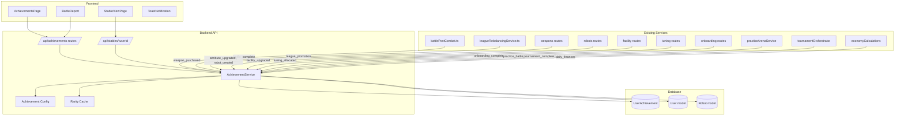
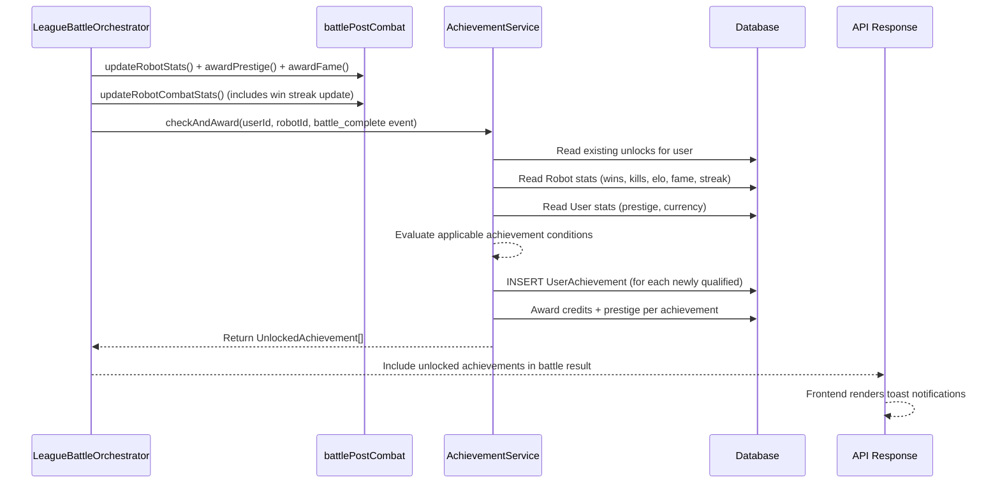
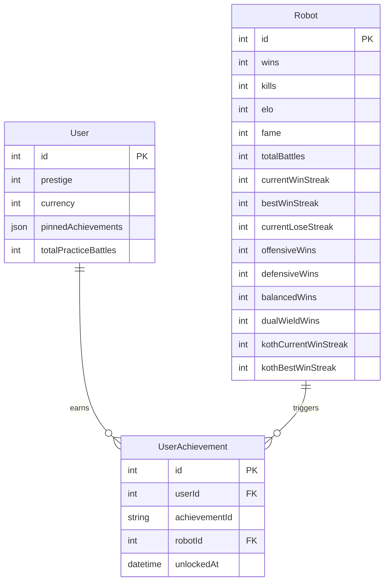

# Design Document: Achievement System

## Overview

The Achievement System adds a progression layer to Armoured Souls that transforms invisible prestige/fame accumulation into celebrated milestones. It addresses Loop 4 (Reputation Loop) from the Game Loop Audit — today prestige and fame are one-way accumulators with no celebration moments.

### Design Goals

1. **Event-driven evaluation**: Achievements are checked after game events (battles, purchases, upgrades) via a centralized `AchievementService` singleton — no polling, no cron jobs for evaluation.
2. **Config-driven definitions**: All achievement definitions live in a static TypeScript config file (`src/config/achievements.ts`), following the existing `facilities.ts` pattern. No database storage for definitions.
3. **Computed progress**: Progress values are calculated at read time from existing model fields (Robot.wins, User.prestige, etc.) — no redundant progress counters stored.
4. **Idempotent awards**: The `@@unique([userId, achievementId])` constraint ensures double-evaluation is safe. The service checks before inserting.
5. **Minimal schema additions**: One new table (`UserAchievement`), one new JSON field on User (`pinnedAchievements`), one new counter on User (`totalPracticeBattles`), and per-robot tracking fields for win/lose streaks and stance/loadout win counters. All other progress data is derived from existing fields.

### Key Design Decisions

| Decision | Choice | Rationale |
|---|---|---|
| Achievement definitions storage | Config file, not DB | Follows `facilities.ts` pattern. Definitions change with deploys, not at runtime. No admin UI needed. |
| Progress tracking | Computed at read time | Avoids storing redundant counters. Bounded query (one user's data). Only runs when player opens `/achievements`. |
| Win streak tracking | New Robot model fields | Consistent with existing `kothCurrentWinStreak`/`kothBestWinStreak` pattern. Avoids expensive battle history queries. |
| Rarity cache | In-memory singleton | The rarity query aggregates over a fixed number of achievement IDs regardless of player count — scales to 10K+ players without issue. Refreshed on startup and after each cycle settlement. A DB materialized view would only be needed if real-time rarity were required, which it isn't. |
| Reward awarding | Credits via direct increment (not `lockUserForSpending`) | Achievement rewards are server-initiated, not player-initiated. No race condition risk — only `AchievementService` awards, and it's called sequentially per user within a battle flow. |
| Categories | Internal metadata only | Categories exist in the config for filtering on the achievements page but are NOT shown as tabs or section headers in the UI. The page is a flat scrollable list with filter controls. |
| Toast delivery | `achievementUnlocks` field in API responses | Every API endpoint that triggers achievement evaluation (battle results, weapon purchase, facility upgrade, etc.) includes an `achievementUnlocks: UnlockedAchievement[]` field in its response. The frontend uses a shared `useAchievementToasts` hook that reads this field from any API response and renders toasts. No WebSocket or push notification needed. |

---

## Architecture

### System Context



### Event Flow (Battle Complete — Primary Path)



### Service Architecture

The `AchievementService` is a stateless singleton (no instance state beyond the rarity cache). It follows the existing service pattern used by `streamingRevenueService` and `eventLogger`:

- **Single entry point**: `checkAndAward(userId, robotId, event)` — all callers use the same method.
- **Event-typed dispatch**: The `event.type` field determines which subset of achievements to evaluate, avoiding unnecessary checks.
- **Batch-aware**: For battle events, the service evaluates all applicable achievements in a single pass, batching DB reads.

---

## Components and Interfaces

### 1. Achievement Config (`src/config/achievements.ts`)

Static TypeScript configuration following the `facilities.ts` pattern.

```typescript
// --- Types ---

export type AchievementTier = 'easy' | 'medium' | 'hard' | 'very_hard' | 'secret';
export type AchievementScope = 'user' | 'robot';
export type AchievementCategory = 'combat' | 'league' | 'economy' | 'prestige' | 'style';
export type AchievementProgressType = 'numeric' | 'boolean';

export type AchievementTriggerType =
  | 'wins' | 'losses' | 'battles' | 'kills' | 'elo'
  | 'prestige' | 'fame' | 'currency' | 'lifetime_earnings'
  | 'streaming_revenue' | 'facility_count' | 'robot_count'
  | 'weapon_count' | 'league_promotion' | 'tournament_wins'
  | 'win_streak' | 'koth_wins' | 'tag_team_wins'
  | 'practice_battles' | 'onboarding' | 'tuning_allocated'
  | 'tuning_full' | 'attribute_max' | 'attribute_upgraded'
  | 'weapon_type' | 'loadout_wins' | 'stance_wins'
  | 'perfect_victory' | 'low_hp_win' | 'elo_upset'
  | 'yield_forced' | 'yield_comeback' | 'zero_yield_win'
  | 'no_tuning_win' | 'glass_cannon' | 'overkill'
  | 'shield_only_win' | 'survival_streak' | 'bankrupt'
  | 'demotion_repromotion';

export interface AchievementDefinition {
  id: string;                       // "C1", "L5", "E3", etc.
  name: string;                     // Display name
  description: string;              // One-line description
  reference: string;                // Pop culture reference
  category: AchievementCategory;    // Internal metadata for filtering
  tier: AchievementTier;
  scope: AchievementScope;          // "user" or "robot"
  rewardCredits: number;
  rewardPrestige: number;
  hidden: boolean;                  // true for secret tier
  triggerType: AchievementTriggerType;
  triggerThreshold?: number;        // Numeric threshold (e.g., 50 for "50 wins")
  triggerMeta?: Record<string, unknown>; // Extra trigger data (e.g., { weaponType: 'energy' })
  progressType: AchievementProgressType;
  progressLabel?: string;           // "wins", "destroyed", "ELO", etc.
  badgeIconFile: string;            // "achievement-c1" (without extension)
}

// --- Reward constants ---
export const TIER_REWARDS: Record<AchievementTier, { credits: number; prestige: number }> = {
  easy:      { credits: 25_000,  prestige: 25 },
  medium:    { credits: 50_000,  prestige: 50 },
  hard:      { credits: 100_000, prestige: 100 },
  very_hard: { credits: 250_000, prestige: 250 },
  secret:    { credits: 50_000,  prestige: 50 },  // Default for secrets; individual entries can override
};

// --- Config array ---
export const ACHIEVEMENTS: AchievementDefinition[] = [
  // Combat achievements (C1–C17)
  {
    id: 'C1', name: "I'll Be Back", description: 'Win your first battle',
    reference: 'Terminator', category: 'combat', tier: 'easy', scope: 'robot',
    rewardCredits: 25_000, rewardPrestige: 25, hidden: false,
    triggerType: 'wins', triggerThreshold: 1,
    progressType: 'numeric', progressLabel: 'wins',
    badgeIconFile: 'achievement-c1',
  },
  // ... all achievements defined here
];

// --- Helpers ---
export function getAchievementById(id: string): AchievementDefinition | undefined {
  return ACHIEVEMENTS.find(a => a.id === id);
}

export function getAchievementsByTriggerType(type: AchievementTriggerType): AchievementDefinition[] {
  return ACHIEVEMENTS.filter(a => a.triggerType === type);
}
```

### 2. AchievementService (`src/services/achievement/achievementService.ts`)

Centralized singleton for evaluating and awarding achievements.

```typescript
// --- Event types ---
export interface AchievementEvent {
  type: AchievementEventType;
  data: Record<string, unknown>;
}

export type AchievementEventType =
  | 'battle_complete'
  | 'league_promotion'
  | 'weapon_purchased'
  | 'weapon_equipped'
  | 'attribute_upgraded'
  | 'facility_upgraded'
  | 'robot_created'
  | 'tuning_allocated'
  | 'stance_changed'
  | 'onboarding_complete'
  | 'practice_battle'
  | 'tournament_complete'
  | 'daily_finances';

export interface UnlockedAchievement {
  id: string;
  name: string;
  description: string;
  tier: AchievementTier;
  rewardCredits: number;
  rewardPrestige: number;
  badgeIconFile: string;
  robotId: number | null;
  robotName: string | null;
}

// --- Service interface ---
export interface IAchievementService {
  checkAndAward(
    userId: number,
    robotId: number | null,
    event: AchievementEvent,
  ): Promise<UnlockedAchievement[]>;

  getPlayerAchievements(userId: number): Promise<AchievementsResponse>;
  getRecentUnlocks(userId: number, limit?: number): Promise<UnlockedAchievement[]>;
  updatePinnedAchievements(userId: number, achievementIds: string[]): Promise<void>;
  getStableAchievements(userId: number): Promise<StableAchievementData>;
  refreshRarityCache(): Promise<void>;
}
```

**Key implementation details:**

- `checkAndAward()` maps `event.type` to a subset of achievements to evaluate, avoiding checking all achievements on every event.
- For `battle_complete`, the event data includes: `{ won, destroyed, finalHpPercent, eloDiff, opponentElo, yielded, previousBattleYielded, damageDealt, opponentDamageDealt, loadoutType, stance, yieldThreshold, hasTuning, hasMainWeapon, battleType }`.
- The method reads the user's existing unlocks once, then evaluates each candidate achievement against current stats.
- New unlocks are inserted in a single transaction that also awards credits and prestige.
- Returns the list of newly unlocked achievements for toast notification data.

### 3. Achievement Rarity Cache

In-memory cache refreshed on startup and after each cycle settlement.

```typescript
export interface AchievementRarityCache {
  counts: Map<string, number>;         // achievementId → earner count
  totalActivePlayers: number;          // Users with at least 1 battle
  refreshedAt: Date;
}
```

- Populated via `SELECT achievement_id, COUNT(*) FROM user_achievements GROUP BY achievement_id`.
- Total active players via `SELECT COUNT(DISTINCT user_id) FROM robots WHERE total_battles > 0 AND name != 'Bye Robot'`.
- Exposed via `achievementService.getRarityData()`.

### 4. Achievement API Routes (`src/routes/achievements.ts`)

Three new endpoints, all requiring authentication and Zod validation:

| Method | Path | Handler | Zod Schema |
|---|---|---|---|
| `GET` | `/api/achievements` | `getAchievements` | No params/body needed |
| `GET` | `/api/achievements/recent` | `getRecentAchievements` | Optional `limit` query param |
| `PUT` | `/api/achievements/pinned` | `updatePinnedAchievements` | Body: `{ achievementIds: string[] }` |

Route handlers are thin wrappers calling `AchievementService` methods.

### 5. Achievement Error Classes (`src/errors/achievementErrors.ts`)

Following the existing `AppError` hierarchy:

```typescript
export enum AchievementErrorCode {
  INVALID_ACHIEVEMENT_ID = 'ACHIEVEMENT_INVALID_ID',
  ACHIEVEMENT_NOT_UNLOCKED = 'ACHIEVEMENT_NOT_UNLOCKED',
  TOO_MANY_PINNED = 'ACHIEVEMENT_TOO_MANY_PINNED',
}

export class AchievementError extends AppError {
  constructor(code: AchievementErrorCode, message: string, statusCode = 400, details?: unknown) {
    super(code, message, statusCode, details);
  }
}
```

### 6. Stable Route Extension (`src/routes/stables.ts`)

The existing `GET /api/stables/:userId` endpoint is extended to include achievement data in its response:

```typescript
// Added to the existing response shape
achievements: {
  pinned: PinnedAchievement[];  // Up to 6, with id, name, tier, badgeIconFile, unlockedAt
  totalUnlocked: number;
  totalAvailable: number;       // Count of non-hidden achievements + earned hidden ones
}
```

The route handler calls `achievementService.getStableAchievements(userId)` to get this data.

### 7. Achievement Unlock Notification Delivery

Achievements can be triggered by many different API calls (battle results, weapon purchases, facility upgrades, tuning allocation, etc.). The frontend needs a consistent way to detect and display unlocks from *any* response.

**Backend pattern**: Every API endpoint that calls `achievementService.checkAndAward()` includes the result in its response:

```typescript
// In any route handler that triggers achievement evaluation:
const unlocked = await achievementService.checkAndAward(userId, robotId, event);

// Include in response alongside existing data:
return res.json({
  ...existingResponseData,
  achievementUnlocks: unlocked, // UnlockedAchievement[] — empty array if none
});
```

This applies to: battle result responses (via orchestrators), weapon purchase responses, attribute upgrade responses, facility upgrade responses, tuning allocation responses, onboarding completion responses, and practice arena battle responses.

**Frontend pattern**: A shared `useAchievementToasts` hook watches for `achievementUnlocks` in API responses:

```typescript
// Hook used in the app's root layout or a global provider
function useAchievementToasts() {
  // Intercept API responses via apiClient response interceptor
  // When response.data.achievementUnlocks is a non-empty array:
  //   → Queue each unlock as a toast notification
  //   → Toasts render via AchievementToast component
}
```

The hook is registered once at the app level (e.g., in `App.tsx` or a layout wrapper). It uses an Axios response interceptor on the shared `apiClient` to check every API response for the `achievementUnlocks` field. This means no individual page or component needs to handle achievement toasts — it's automatic.

**Retroactive awards edge case**: When a player first logs in after the retroactive migration, they may have many unlocked achievements but no toast data (the migration ran server-side, not via an API call). The `GET /api/achievements/recent` endpoint serves this purpose — the frontend can check for recent unlocks on login and show a summary notification ("You earned 12 achievements!") rather than 12 individual toasts.

### 8. Frontend Components

#### AchievementsPage (`src/pages/AchievementsPage.tsx`)

- Fetches `GET /api/achievements` on mount
- Renders a scrollable list of achievement cards (no category tabs — categories are internal metadata)
- Filter controls: tier dropdown, status dropdown (All/Locked/Unlocked)
- Sort controls: default, rarity, status, tier
- Summary section at top: total unlocked, per-tier breakdown
- Each card: badge, name, description, progress bar, reward, unlock date, rarity, pin toggle

#### StableViewPage Achievement Showcase

New section added between "Stable Statistics" and "Robots":

- 6 hexagonal badge slots in a row
- Own-stable view: edit controls (× to unpin, + to open picker modal)
- Visitor view: read-only badges with hover tooltips
- Summary line: "{unlocked}/{total} Achievements · View all →"

#### AchievementBadge Component (`src/components/AchievementBadge.tsx`)

Reusable badge component used across all pages:

- Props: `achievement`, `size` (64 or 128), `locked`, `secret`
- CSS classes for locked/unlocked states (grayscale filter, opacity)
- Secret placeholder: generic "???" hexagon with purple border

#### AchievementToast Component (`src/components/AchievementToast.tsx`)

- Slide-in from top-right
- Badge at 48×48, name, reward summary, rarity label
- Auto-dismiss after 5 seconds
- Stacks for multiple simultaneous unlocks
- Click navigates to `/achievements`
- 300ms scale-in animation, respects `prefers-reduced-motion`

#### AchievementPinnerModal Component

- Grid of all unlocked achievements
- Click to pin/unpin
- Shows current pin count (X/6)
- Closes on selection or backdrop click

### 9. Integration Points (Existing Code Modifications)

| File | Change |
|---|---|
| `battlePostCombat.ts` | Add `checkAndAwardAchievements()` helper that calls `achievementService.checkAndAward()` after prestige/fame awards. Update `updateRobotCombatStats()` to handle win streak, lose streak, and stance/loadout win counter fields. |
| `leagueBattleOrchestrator.ts` | Pass unlocked achievements through `processBattle()` return value for inclusion in API response. |
| `tournamentBattleOrchestrator.ts` | Call `achievementService.checkAndAward()` after tournament completion. |
| `tagTeamBattleOrchestrator.ts` | Call `achievementService.checkAndAward()` after tag team battle. |
| `kothBattleOrchestrator.ts` | Call `achievementService.checkAndAward()` after KotH battle. |
| `leagueRebalancingService.ts` | Call `achievementService.checkAndAward()` with `league_promotion` event after promoting a robot. |
| `routes/weapons.ts` | Call `achievementService.checkAndAward()` after weapon purchase AND weapon equip (for S1-S3 and E9 effective stat check). |
| `routes/robots.ts` | Call `achievementService.checkAndAward()` after attribute upgrade, robot creation, and stance change (for E9 effective stat check). |
| `routes/facility.ts` | Call `achievementService.checkAndAward()` after facility upgrade. |
| `routes/tuning.ts` | Call `achievementService.checkAndAward()` after tuning allocation. |
| `routes/onboarding.ts` | Call `achievementService.checkAndAward()` after onboarding completion. |
| `services/practiceArena/practiceArenaService.ts` | Call `achievementService.checkAndAward()` after practice battle. |
| `services/economy/dailySettlement.ts` (or equivalent) | Call `achievementService.checkAndAward()` with `daily_finances` event if balance goes negative. Also call `achievementService.refreshRarityCache()` after settlement. |
| `routes/stables.ts` | Extend response to include achievement showcase data. |

---

## Data Models

### New: UserAchievement Table

```prisma
model UserAchievement {
  id            Int      @id @default(autoincrement())
  userId        Int      @map("user_id")
  achievementId String   @map("achievement_id") @db.VarChar(10)
  robotId       Int?     @map("robot_id")
  unlockedAt    DateTime @default(now()) @map("unlocked_at")

  user  User   @relation(fields: [userId], references: [id], onDelete: Cascade)
  robot Robot? @relation(fields: [robotId], references: [id], onDelete: SetNull)

  @@unique([userId, achievementId])
  @@index([userId])
  @@index([robotId])
  @@index([achievementId])
  @@map("user_achievements")
}
```

### Modified: User Model

```prisma
// Add to User model
pinnedAchievements Json @default("[]") @map("pinned_achievements")

// Add relation
achievements UserAchievement[]
```

- `pinnedAchievements`: JSON array of up to 6 achievement ID strings. Validated at API layer.

### Modified: Robot Model

```prisma
// Add to Robot model — league win streak tracking
currentWinStreak Int @default(0) @map("current_win_streak")
bestWinStreak    Int @default(0) @map("best_win_streak")

// Add to Robot model — lose streak tracking (for S14 "Brain the Size of a Planet")
currentLoseStreak Int @default(0) @map("current_lose_streak")

// Add to Robot model — stance/loadout win counters (for S4-S7)
offensiveWins  Int @default(0) @map("offensive_wins")
defensiveWins  Int @default(0) @map("defensive_wins")
balancedWins   Int @default(0) @map("balanced_wins")
dualWieldWins  Int @default(0) @map("dual_wield_wins")

// Add relation
achievements UserAchievement[]
```

- Win/lose streak fields follow the existing `kothCurrentWinStreak`/`kothBestWinStreak` pattern.
- Stance/loadout win counters are incremented in `updateRobotCombatStats()` based on the robot's stance and loadout at battle time. This avoids scanning battle log JSON.
- All fields updated in `updateRobotCombatStats()` alongside other post-combat stat updates.

### Aggregate Tracking: Derived from Existing Data

Several achievements require aggregate values that are **not stored as dedicated fields** but can be computed from existing data:

| Achievement | Metric Needed | Derived From |
|---|---|---|
| E2 "Pocket Change" (₡100K from battles) | Lifetime battle credits | `SUM(BattleParticipant.credits) WHERE robot_id IN (user's robots)` |
| E4 "Scrooge McDuck" (₡25M lifetime) | Lifetime total earnings | Same as above (battle credits are the primary earning source; streaming/merchandising can be derived from cycle snapshots if needed) |
| P9 "Influencer" (₡100K streaming) | Lifetime streaming revenue | `SUM(BattleParticipant.streamingRevenue) WHERE robot_id IN (user's robots)` |
| P10 "Content Creator" (₡1M streaming) | Lifetime streaming revenue | Same as P9 |

These queries are bounded to one user's robots and only run when the player opens `/achievements` — not on every battle.

### Aggregate Tracking: Derived via BattleParticipant Queries

Several achievements require checking battle history that isn't stored as a counter:

| Achievement | Query |
|---|---|
| C15 "I Didn't Hear No Bell" (win after losing previous) | Check robot's most recent `BattleParticipant` — if it was a loss and current battle is a win, trigger. Evaluated at `battle_complete` time. |
| S13 "Dead or Alive" (force 10 yields) | `SELECT COUNT(*) FROM battle_participants bp JOIN battles b ON bp.battle_id = b.id WHERE bp.yielded = true AND b.winner_id != bp.robot_id AND b.winner_id IN (user's robot IDs)` — count opponents who yielded in battles the user's robots won. |
| S12 "Johnny 5 Is Alive!" (survive 50) | `Robot.totalBattles - COUNT(BattleParticipant WHERE destroyed = true AND robot_id = X)` ≥ 50 |

These are read-time queries, bounded to one user's data.

### Aggregate Tracking: Practice Battle Count

C16 ("Wax On, Wax Off" — 25 practice battles) requires per-user practice battle count. Currently tracked in `PracticeArenaDailyStats.playerIds` JSON but not per-user.

**Solution**: Add `totalPracticeBattles` to the User model:

```prisma
// Add to User model
totalPracticeBattles Int @default(0) @map("total_practice_battles")
```

Incremented in the practice arena service after each practice battle.

### Migration Summary

One Prisma migration covering:
1. Create `user_achievements` table with unique constraint and indexes
2. Add `pinned_achievements` JSON field to `users` (default `[]`)
3. Add `total_practice_battles` Int field to `users` (default 0)
4. Add `current_win_streak`, `best_win_streak`, and `current_lose_streak` Int fields to `robots` (default 0)
5. Add `offensive_wins`, `defensive_wins`, `balanced_wins`, `dual_wield_wins` Int fields to `robots` (default 0)

### Entity Relationship Diagram




---

## Correctness Properties

*A property is a characteristic or behavior that should hold true across all valid executions of a system — essentially, a formal statement about what the system should do. Properties serve as the bridge between human-readable specifications and machine-verifiable correctness guarantees.*

### Property 1: Achievement config consistency

*For any* achievement in the `ACHIEVEMENTS` config array: (a) its `id` is unique across all entries, (b) its `tier` is one of `easy | medium | hard | very_hard | secret`, (c) its `scope` is one of `user | robot`, (d) `hidden === (tier === 'secret')`, (e) for non-secret tiers, `rewardCredits` equals the tier's defined credit amount and `rewardPrestige` equals the tier's defined prestige amount, and (f) the only reward fields are `rewardCredits` and `rewardPrestige`.

**Validates: Requirements 1.1, 1.3, 1.4, 1.5, 1.6, 1.7, 15.1**

### Property 2: Achievement scope determines robotId

*For any* achievement award, if the achievement definition has `scope === 'robot'`, then the resulting `UserAchievement` record SHALL have a non-null `robotId` matching the triggering robot. If the achievement definition has `scope === 'user'`, then the resulting `UserAchievement` record SHALL have `robotId === null`.

**Validates: Requirements 2.3, 2.4**

### Property 3: Achievement award correctness

*For any* achievement definition with a numeric threshold and *for any* player whose relevant stat meets or exceeds that threshold and who does not already hold the achievement, calling `checkAndAward` SHALL: (a) create exactly one `UserAchievement` record with the correct `achievementId` and `userId`, (b) increment the player's credits by `rewardCredits` and prestige by `rewardPrestige`, and (c) include the achievement in the returned `UnlockedAchievement[]` array.

**Validates: Requirements 3.11, 3.13**

### Property 4: Achievement award idempotency

*For any* achievement that a player already holds, calling `checkAndAward` with the same user and any event SHALL return an empty array for that achievement and SHALL NOT create a duplicate `UserAchievement` record or award additional credits or prestige.

**Validates: Requirements 3.12**

### Property 5: Win streak state machine

*For any* robot and *for any* sequence of league battle outcomes (win/loss/draw), after a win the robot's `currentWinStreak` SHALL equal the previous `currentWinStreak + 1`, and after a loss or draw the robot's `currentWinStreak` SHALL equal 0.

**Validates: Requirements 4.2, 4.3**

### Property 6: Best win streak invariant

*For any* robot and *for any* sequence of league battle outcomes, the robot's `bestWinStreak` SHALL always equal the maximum value that `currentWinStreak` has ever reached. Equivalently, `bestWinStreak >= currentWinStreak` at all times, and `bestWinStreak` never decreases.

**Validates: Requirements 4.4**

### Property 7: Progress computation correctness

*For any* achievement with `progressType === 'numeric'` and *for any* player state, the computed progress value SHALL equal the current value of the relevant field from the User or Robot model (e.g., `Robot.wins` for win-count achievements, `User.prestige` for prestige achievements).

**Validates: Requirements 5.2**

### Property 8: Best robot progress selection

*For any* robot-level achievement with a numeric threshold and *for any* player with one or more robots, the reported progress SHALL equal the maximum value across all of the player's robots for the relevant metric, and the `bestRobotName` SHALL identify the robot with that maximum value.

**Validates: Requirements 5.3**

### Property 9: Pin validation rejects invalid or locked achievements

*For any* array of achievement IDs submitted to `PUT /api/achievements/pinned`, if the array contains more than 6 entries, or any entry that is not a valid achievement ID in the config, or any entry that the authenticated player has not unlocked, the endpoint SHALL return HTTP 400.

**Validates: Requirements 6.7, 6.8, 12.4, 16.5**

### Property 10: Rarity count correctness

*For any* set of `UserAchievement` records in the database, the rarity cache's count for each `achievementId` SHALL equal the number of distinct `userId` values that hold that achievement.

**Validates: Requirements 8.2**

### Property 11: Rarity label classification

*For any* percentage value (earner count / total active players × 100), the rarity label SHALL be: "Common" if > 75%, "Uncommon" if 25–75%, "Rare" if 10–25%, "Epic" if 1–10%, "Legendary" if < 1% or 0 earners.

**Validates: Requirements 8.3**

### Property 12: Achievement filter correctness

*For any* combination of tier filter and status filter applied to the achievement list, the resulting set SHALL contain exactly those achievements that match both the selected tier (or all tiers if unfiltered) and the selected status (locked/unlocked/all).

**Validates: Requirements 7.3**

### Property 13: Achievement sort correctness

*For any* sort option (rarity, status, tier) applied to the achievement list, the resulting list SHALL be totally ordered by the selected criterion, with ties broken by a stable secondary sort (default order).

**Validates: Requirements 7.4**

### Property 14: Achievement data isolation

*For any* two distinct users A and B, user A's `GET /api/achievements` response SHALL contain only user A's unlock status, progress, and pinned state — never user B's data. Similarly, `PUT /api/achievements/pinned` called by user A SHALL only modify user A's `pinnedAchievements` field.

**Validates: Requirements 16.2, 16.3**

---

## Error Handling

### Backend Error Scenarios

| Scenario | Error Class | Code | HTTP | Handling |
|---|---|---|---|---|
| Invalid achievement ID in pin request | `AchievementError` | `ACHIEVEMENT_INVALID_ID` | 400 | Zod validation catches unknown IDs; service double-checks against config |
| Pinning a locked achievement | `AchievementError` | `ACHIEVEMENT_NOT_UNLOCKED` | 400 | Service checks user's unlocks before updating pins |
| Pinning more than 6 achievements | `AchievementError` | `ACHIEVEMENT_TOO_MANY_PINNED` | 400 | Zod schema enforces `max(6)` on the array; service double-checks |
| Unauthenticated request | `AuthError` | `AUTH_TOKEN_MISSING` | 401 | `authenticateToken` middleware rejects |
| Database constraint violation (duplicate award) | Prisma unique constraint error | — | — | Caught silently by `checkAndAward` — idempotent by design |
| Achievement config references invalid trigger type | TypeScript compile error | — | — | Caught at build time via strict typing |
| Rarity cache stale | — | — | — | Returns last-known data; refreshed on next cycle settlement |

### Error Propagation

- Route handlers are thin wrappers — errors propagate to Express 5's error middleware automatically.
- `AchievementService.checkAndAward()` is called from within battle orchestrators. If it throws, the battle still completes (achievement evaluation should not block battle processing). The service wraps its logic in a try-catch and logs errors without re-throwing, returning an empty array on failure.
- The retroactive migration script logs errors per-user and continues processing remaining users.

### Graceful Degradation

- If `AchievementService` fails to initialize (e.g., config parse error), the service logs the error and all `checkAndAward()` calls return empty arrays. The game continues to function without achievements.
- If the rarity cache fails to refresh, the last-known cache is used. The cache is initialized with empty data on startup if the DB query fails.
- Frontend handles missing achievement data gracefully — if the API returns an error, the achievements page shows an error state with a retry button. The stable page showcase section is hidden if achievement data is unavailable.

---

## Testing Strategy

### Property-Based Testing (fast-check)

Property-based tests are the primary correctness verification for the achievement system's pure logic. Each property from the Correctness Properties section maps to one property-based test.

**Library**: fast-check (already used in the project)
**Minimum iterations**: 100 per property test
**Tag format**: `Feature: achievement-system, Property {number}: {property_text}`

**Backend property tests** (`app/backend/src/services/achievement/__tests__/achievementService.property.test.ts`):

| Property | Test Description | Generator Strategy |
|---|---|---|
| P1: Config consistency | Validate all config entries against constraints | Iterate over actual `ACHIEVEMENTS` array (exhaustive, not random — the config is finite) |
| P2: Scope determines robotId | Generate random (achievement, userId, robotId) tuples, award, verify robotId | Random achievement selection × random user/robot IDs |
| P3: Award correctness | Generate random player states meeting thresholds, verify record + rewards | Random stats above threshold × random achievement selection |
| P4: Award idempotency | Generate random already-awarded achievements, call checkAndAward again | Random existing unlocks × random events |
| P5: Win streak state machine | Generate random sequences of win/loss/draw outcomes, verify streak | Random outcome sequences of length 1–100 |
| P6: Best win streak invariant | Same as P5, additionally verify bestWinStreak monotonicity | Random outcome sequences |
| P7: Progress computation | Generate random player/robot states, verify progress matches field values | Random stat values × random achievement selection |
| P8: Best robot progress | Generate random multi-robot states, verify max selection | Random robot count (1–10) × random stat values |
| P9: Pin validation | Generate random pin arrays with invalid/locked entries, verify 400 | Random arrays with mix of valid, invalid, and locked IDs |
| P10: Rarity count | Generate random sets of UserAchievement records, verify counts | Random (userId, achievementId) pairs |
| P11: Rarity label | Generate random percentage values, verify label classification | Random floats 0–100 |
| P12: Filter correctness | Generate random filter combinations, verify result set | Random tier × status filter combinations |
| P13: Sort correctness | Generate random achievement lists, verify ordering | Random achievement arrays with random rarity/status/tier values |
| P14: Data isolation | Generate two random users with different unlocks, verify no cross-contamination | Random user pairs with random achievement sets |

**Frontend property tests** (`app/frontend/src/utils/__tests__/achievementUtils.property.test.ts`):

| Property | Test Description |
|---|---|
| P11: Rarity label | Pure function `getRarityLabel(percentage)` — same as backend |
| P12: Filter correctness | Pure function `filterAchievements(achievements, filters)` |
| P13: Sort correctness | Pure function `sortAchievements(achievements, sortOption)` |

### Unit Tests (Example-Based)

**Backend unit tests** (`app/backend/src/services/achievement/__tests__/achievementService.test.ts`):

- Achievement evaluation for each event type (battle_complete, league_promotion, weapon_purchased, etc.)
- Specific achievement trigger conditions (perfect victory, low HP win, ELO upset, etc.)
- Edge cases: secret achievements hidden until earned, boolean vs numeric progress, zero-threshold achievements
- Pin validation: exact boundary (6 pins OK, 7 pins rejected)
- Rarity cache refresh logic
- Retroactive award script logic

**Backend route tests** (`app/backend/src/routes/__tests__/achievements.test.ts`):

- `GET /api/achievements` returns correct response shape
- `GET /api/achievements/recent` returns last N unlocks
- `PUT /api/achievements/pinned` accepts valid input, rejects invalid
- All endpoints require authentication (401 without token)
- Zod validation rejects malformed input

**Frontend component tests**:

- `AchievementsPage` renders achievement cards with correct data
- `AchievementBadge` renders locked/unlocked/secret states correctly
- `AchievementToast` renders and auto-dismisses
- `StableViewPage` achievement showcase renders pinned badges
- `AchievementPinnerModal` allows selection and respects max 6

### Integration Tests

- Full battle flow: battle completes → achievements evaluated → unlocked achievements in response → toast data available
- Retroactive migration: seed test data → run script → verify correct awards
- Stable page: visit another player's stable → see their pinned achievements (not their full progress)

### E2E Tests (Playwright)

The project has Playwright set up (spec #23). Add E2E coverage for the key user flows:

| Test | Flow |
|---|---|
| Achievements page loads | Login → navigate to `/achievements` → verify achievement cards render with progress bars |
| Filter and sort | On `/achievements` → apply tier filter → verify filtered results → apply sort → verify order |
| Pin/unpin achievement | On `/achievements` → click pin on an unlocked achievement → navigate to own stable → verify badge appears in showcase |
| Stable showcase (visitor) | Login as user A → navigate to user B's stable → verify pinned badges visible, no edit controls |
| Achievement toast | Trigger an action that unlocks an achievement (e.g., first weapon purchase) → verify toast appears and auto-dismisses |
| Secret achievement hidden | On `/achievements` → verify secret achievements show "???" badge and no progress → earn one → verify it reveals |

### Test File Organization

```
app/backend/src/
  services/achievement/
    __tests__/
      achievementService.test.ts           # Unit tests
      achievementService.property.test.ts  # Property-based tests
      achievementConfig.test.ts            # Config validation tests
  routes/
    __tests__/
      achievements.test.ts                 # Route handler tests

app/frontend/src/
  pages/__tests__/
    AchievementsPage.test.tsx              # Page component tests
  components/__tests__/
    AchievementBadge.test.tsx              # Badge component tests
    AchievementToast.test.tsx              # Toast component tests
  utils/__tests__/
    achievementUtils.property.test.ts      # Frontend property tests
    achievementUtils.test.ts               # Frontend unit tests
```

### Documentation Impact

The following existing files need updating after implementation:

| File | Change |
|---|---|
| `docs/game-systems/PRD_ACHIEVEMENT_SYSTEM.md` | Update status from "Design" to "Implemented". Mark implemented sections. |
| `docs/BACKLOG.md` | Move #8 to "Recently Completed" table with link to spec #27. |
| `docs/game-systems/PRD_PRESTIGE_AND_FAME.md` | Update "What's Not Implemented" section to reference achievement system as implemented. |
| `docs/game-systems/PRD_ECONOMY_SYSTEM.md` | Update Section 6 with final reward amounts and link to achievement PRD. |
| `.kiro/steering/project-overview.md` | Add "Achievement System" to Key Systems list. |
| `docs/backend/docs/audit-logging-schema.md` | Add `achievement_unlock` event type and payload schema. |

### Achievement Audit Logging

Achievement credit and prestige rewards must be tracked in the audit log for full financial reconciliation. Without this, the cycle summary's `netProfit` calculation is missing achievement income, causing the numbers to not add up against actual balance changes.

**EventType addition**: Add `ACHIEVEMENT_UNLOCK = 'achievement_unlock'` to the `EventType` enum in `src/services/common/eventLogger.ts`.

**EventLogger helper**: Add `logAchievementUnlock()` method to `EventLogger`:

```typescript
async logAchievementUnlock(
  cycleNumber: number,
  userId: number,
  achievementId: string,
  rewardCredits: number,
  rewardPrestige: number,
  robotId?: number,
): Promise<void> {
  await this.logEvent(
    cycleNumber,
    EventType.ACHIEVEMENT_UNLOCK,
    { achievementId, rewardCredits, rewardPrestige },
    { userId, robotId },
  );
}
```

**AchievementService integration**: After awarding credits and prestige in `checkAndAward()`, call `eventLogger.logAchievementUnlock()` with the current cycle number. The cycle number is obtained via `getCurrentCycle()` from `cycleAnalyticsService.ts`.

**StableMetric extension**: Add `achievementRewards: number` to the `StableMetric` interface in `src/types/snapshotTypes.ts`. Default to 0.

**CycleSnapshotService integration**: In `aggregateStableMetrics()`, query `achievement_unlock` events for the cycle and sum `payload.rewardCredits` per user into the `achievementRewards` field. Include `achievementRewards` in the `netProfit` calculation.

**CycleEventPayload extension**: Add `achievementId?: string` and `rewardCredits?: number` and `rewardPrestige?: number` fields to the `CycleEventPayload` interface.
