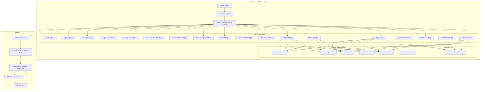
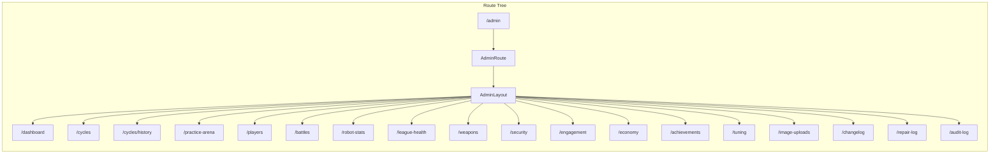
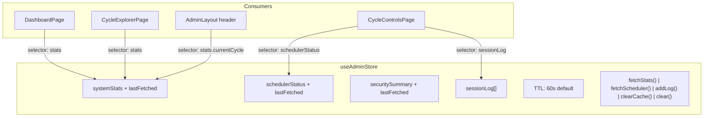

# Design Document: Admin Portal Redesign

## Overview

This design transforms the admin portal from a monolithic single-page component (`AdminPage.tsx` with 12 horizontal tabs and hash-fragment navigation) into a dedicated admin experience with sidebar navigation, route-based lazy-loaded pages, a Zustand-based shared state layer, and comprehensive security hardening.

The redesign addresses three structural problems:
1. **Navigation doesn't scale** — 12 horizontal tabs wrap on smaller screens and can't accommodate the 6 new analytics pages without becoming unusable.
2. **No shared state** — every tab switch re-fetches data because there's no caching layer; the session log is passed via props from the parent shell.
3. **Security gaps** — `ProtectedRoute` only checks authentication (not admin role), the JWT role claim is trusted without DB verification, and admin code ships in the main bundle to all users.

The new architecture introduces:
- An `AdminLayout` shell with a collapsible sidebar, replacing the player-facing `Navigation` component
- ~18 lazy-loaded page components under `/admin/*` nested routes, replacing hash fragments
- An `AdminRoute` guard that checks `user.role === 'admin'` before rendering
- A `useAdminStore` Zustand store with TTL-based caching for system stats, scheduler status, and session log
- A shared admin UI component library (`AdminStatCard`, `AdminDataTable`, `AdminFilterBar`, `AdminPageHeader`, `AdminSlideOver`, `AdminEmptyState`)
- Backend hardening: DB-verified role check, dedicated admin rate limiter (120 req/min), admin access logging
- Server-side admin audit trail (new `AdminAuditLog` DB table)
- 6 new analytics pages: Player Engagement, Economy Overview, League Health, Weapon Analytics, Achievement Analytics, Tuning Adoption

## Architecture

### High-Level Architecture



### Routing Architecture

The admin portal uses React Router nested routes under `/admin/*`. All admin routes are wrapped in `AdminRoute` which checks authentication and admin role before rendering `AdminLayout`.



### Sidebar Navigation Groups

| Section | Pages | Route |
|---------|-------|-------|
| **Overview** | Dashboard, Economy Overview | `/admin/dashboard`, `/admin/economy` |
| **Game Operations** | Cycle Controls, Cycle Explorer, Practice Arena | `/admin/cycles`, `/admin/cycles/history`, `/admin/practice-arena` |
| **Battle Data** | Battle Logs, Robot Stats, League Health, Weapon Analytics | `/admin/battles`, `/admin/robot-stats`, `/admin/league-health`, `/admin/weapons` |
| **Player Management** | Players, Player Engagement | `/admin/players`, `/admin/engagement` |
| **Security & Moderation** | Security | `/admin/security` |
| **Content** | Image Uploads, Changelog, Achievement Analytics, Tuning Adoption | `/admin/image-uploads`, `/admin/changelog`, `/admin/achievements`, `/admin/tuning` |
| **Maintenance** | Repair Log, Audit Log | `/admin/repair-log`, `/admin/audit-log` |

### State Management Architecture



## Components and Interfaces

### Frontend Components

#### AdminRoute (Route Guard)

```typescript
interface AdminRouteProps {
  children: React.ReactNode;
}
```

Wraps all `/admin/*` routes. Checks `useAuth()` for:
1. `loading` → render loading spinner
2. `!user` → redirect to `/login`
3. `user.role !== 'admin'` → redirect to `/dashboard`
4. Otherwise → render children

This replaces the current `ProtectedRoute` wrapper for admin routes, adding the role check that's currently missing.

#### AdminLayout

```typescript
interface AdminLayoutProps {
  children: React.ReactNode;
}
```

Renders:
- **Sidebar** (left): Grouped navigation links with icons. Collapses to icon-only below 768px viewport width. Highlights active route using `useLocation()`.
- **Header bar** (top of content area): Current page title (derived from route), "← Back to Game" link to `/dashboard`.
- **Content area** (right): Renders `children` (the active page component) wrapped in a `<Suspense>` boundary with a loading fallback.

Does NOT render the player-facing `Navigation` component.

#### Shared UI Components

All located in `app/frontend/src/components/admin/shared/`:

**AdminStatCard**
```typescript
interface AdminStatCardProps {
  label: string;
  value: string | number;
  trend?: 'up' | 'down' | 'neutral';
  trendValue?: string;
  color?: 'primary' | 'success' | 'warning' | 'error' | 'info';
  icon?: React.ReactNode;
}
```

**AdminDataTable**
```typescript
interface AdminDataTableProps<T> {
  columns: Array<{
    key: string;
    label: string;
    sortable?: boolean;
    render?: (row: T) => React.ReactNode;
    align?: 'left' | 'center' | 'right';
  }>;
  data: T[];
  loading?: boolean;
  emptyMessage?: string;
  onRowClick?: (row: T) => void;
  pagination?: {
    page: number;
    totalPages: number;
    onPageChange: (page: number) => void;
  };
  sortState?: { key: string; direction: 'asc' | 'desc' };
  onSort?: (key: string) => void;
}
```

**AdminFilterBar**
```typescript
interface FilterChip {
  key: string;
  label: string;
  active: boolean;
}

interface AdminFilterBarProps {
  filters: FilterChip[];
  onFilterToggle: (key: string) => void;
  onClearAll?: () => void;
  children?: React.ReactNode; // Additional controls (search, date pickers)
}
```

**AdminPageHeader**
```typescript
interface AdminPageHeaderProps {
  title: string;
  subtitle?: string;
  actions?: React.ReactNode; // Refresh button, export button, etc.
}
```

**AdminSlideOver**
```typescript
interface AdminSlideOverProps {
  open: boolean;
  onClose: () => void;
  title: string;
  children: React.ReactNode;
  width?: 'md' | 'lg' | 'xl'; // default: 'lg'
}
```

**AdminEmptyState**
```typescript
interface AdminEmptyStateProps {
  icon?: string; // Emoji or icon component
  title: string;
  description?: string;
  action?: { label: string; onClick: () => void };
}
```

#### useAdminStore (Zustand Store)

```typescript
interface AdminStoreState {
  // System stats with TTL caching
  systemStats: SystemStats | null;
  statsLastFetched: number | null;
  statsLoading: boolean;
  
  // Scheduler status with TTL caching
  schedulerStatus: SchedulerState | null;
  schedulerLastFetched: number | null;
  
  // Security summary with TTL caching
  securitySummary: SecuritySummary | null;
  securityLastFetched: number | null;
  
  // Session log (in-memory + localStorage fallback)
  sessionLog: SessionLogEntry[];
  
  // TTL configuration
  ttlMs: number; // default: 60_000 (60 seconds)
  
  // Actions
  fetchStats: (force?: boolean) => Promise<void>;
  fetchSchedulerStatus: (force?: boolean) => Promise<void>;
  fetchSecuritySummary: (force?: boolean) => Promise<void>;
  addSessionLog: (type: SessionLogEntry['type'], message: string, details?: unknown) => void;
  clearSessionLog: () => void;
  exportSessionLog: () => void;
  clearCache: () => void;
  clear: () => void; // Full reset for logout
}
```

TTL logic: `fetchStats(force)` checks `Date.now() - statsLastFetched < ttlMs`. If within TTL and `force` is false, returns cached data. Otherwise fetches from `GET /api/admin/stats` and updates cache.

### Backend Components

#### DB-Verified Role Check (authenticateToken enhancement)

The existing `authenticateToken` middleware already queries the database for `tokenVersion` verification. The enhancement adds `role` to the `select` clause and uses the DB-returned role instead of the JWT-decoded role:

```typescript
// Current: select: { tokenVersion: true, stableName: true }
// New:     select: { tokenVersion: true, stableName: true, role: true }

// Current: req.user.role = decoded.role (from JWT)
// New:     req.user.role = user.role (from DB)
```

This is a minimal change — one field added to the existing query, one assignment changed.

#### Admin Rate Limiter

A dedicated `express-rate-limit` instance for admin endpoints:

```typescript
const adminRateLimiter = rateLimit({
  windowMs: 60 * 1000, // 1 minute
  max: 120,
  keyGenerator: (req) => {
    const authReq = req as AuthRequest;
    return `admin:${authReq.user?.userId?.toString() || req.ip || 'unknown'}`;
  },
  handler: (req, res) => {
    const authReq = req as AuthRequest;
    if (authReq.user?.userId) {
      securityMonitor.trackRateLimitViolation(authReq.user.userId, req.originalUrl);
    }
    res.status(429).json({
      error: 'Admin rate limit exceeded. Try again later.',
      code: 'ADMIN_RATE_LIMIT_EXCEEDED',
      retryAfter: 60,
    });
  },
});
```

Applied inside `requireAdmin` middleware, after the role check passes.

#### Admin Access Logging

Added to `requireAdmin` after the role check passes (before `next()`):

```typescript
securityMonitor.recordEvent({
  severity: SecuritySeverity.INFO,
  eventType: 'admin_access',
  userId: req.user.userId,
  endpoint: req.originalUrl,
  sourceIp: req.ip,
  details: { method: req.method },
  timestamp: new Date().toISOString(),
});
```

#### AdminAuditLog Service

A new service that records admin-triggered operations to the database:

```typescript
interface AdminAuditLogEntry {
  adminUserId: number;
  operationType: string; // 'matchmaking_run', 'battles_run', 'bulk_cycles', etc.
  operationResult: 'success' | 'failure';
  resultSummary: Record<string, unknown>; // Operation-specific summary data
  timestamp: Date;
}

class AdminAuditLogService {
  async recordAction(entry: Omit<AdminAuditLogEntry, 'timestamp'>): Promise<void>;
  async getEntries(params: {
    page: number;
    limit: number;
    operationType?: string;
    startDate?: string;
    endDate?: string;
  }): Promise<{ entries: AdminAuditLogEntry[]; total: number }>;
}
```

#### New API Endpoints

| Method | Path | Purpose | Requirement |
|--------|------|---------|-------------|
| GET | `/api/admin/engagement/players` | Player engagement with login recency and churn risk | Req 13 |
| GET | `/api/admin/economy/overview` | Credit circulation, inflation rate, income vs costs | Req 14 |
| GET | `/api/admin/league-health` | Robots per tier, ELO distribution, promo/demo counts | Req 15 |
| GET | `/api/admin/weapons/analytics` | Weapon purchase/equip rates, outliers | Req 16 |
| GET | `/api/admin/achievements/analytics` | Unlock rates, difficulty flags, rarity accuracy | Req 17 |
| GET | `/api/admin/tuning/adoption` | Tuning adoption stats, per-player summary | Req 18 |
| GET | `/api/admin/audit-log` | Paginated admin action audit trail | Req 19 |
| POST | `/api/admin/audit-log` | Record admin action (called internally by route handlers) | Req 19 |
| GET | `/api/admin/users/search` | Extended search (add robot name search) | Req 9 |
| GET | `/api/admin/dashboard/kpis` | Dashboard KPI data with trend indicators | Req 5 |

#### Real/Auto-Generated User Filter

Multiple pages share a filter for real vs auto-generated users. The filter logic is centralized as a Prisma `where` clause builder:

```typescript
type UserFilterType = 'all' | 'real' | 'auto';

function buildUserFilter(filter: UserFilterType): Prisma.UserWhereInput {
  if (filter === 'real') {
    return {
      NOT: [
        { username: { startsWith: 'auto_wimpbot_' } },
        { username: { startsWith: 'auto_averagebot_' } },
        { username: { startsWith: 'auto_expertbot_' } },
        { username: { startsWith: 'test_user_' } },
        { username: { startsWith: 'archetype_' } },
        { username: { startsWith: 'attr_' } },
        { username: 'bye_robot_user' },
      ],
    };
  }
  if (filter === 'auto') {
    return {
      OR: [
        { username: { startsWith: 'auto_wimpbot_' } },
        { username: { startsWith: 'auto_averagebot_' } },
        { username: { startsWith: 'auto_expertbot_' } },
      ],
    };
  }
  return {}; // 'all' — no filter
}
```

This is used by dashboard KPIs, player engagement, weapon analytics, achievement analytics, and the players page.

## Data Models

### New Database Table: AdminAuditLog

```prisma
model AdminAuditLog {
  id             Int      @id @default(autoincrement())
  adminUserId    Int      @map("admin_user_id")
  operationType  String   @map("operation_type") @db.VarChar(100)
  operationResult String  @map("operation_result") @db.VarChar(20) // 'success' | 'failure'
  resultSummary  Json     @map("result_summary")
  createdAt      DateTime @default(now()) @map("created_at")

  @@index([adminUserId])
  @@index([operationType])
  @@index([createdAt])
  @@map("admin_audit_logs")
}
```

### New Column: User.lastLoginAt

```prisma
model User {
  // ... existing fields ...
  lastLoginAt DateTime? @map("last_login_at")
}
```

Updated in the login route handler after successful authentication:

```typescript
await prisma.user.update({
  where: { id: user.id },
  data: { lastLoginAt: new Date() },
});
```

### Existing Models Used (No Changes)

- **CycleSnapshot** — Used by Cycle Explorer and Economy Overview for historical metrics
- **AuditLog** — Used by Repair Log, Cycle Explorer (step durations, integrity checks)
- **Battle / BattleParticipant** — Used by Battle Logs with enhanced detail view
- **Robot** — Used by Robot Stats, League Health, Players page
- **User / Facility / WeaponInventory** — Used by Players page, Dashboard, Economy Overview
- **Tournament / ScheduledTournamentMatch** — Used by Cycle Controls (tournament management section)
- **TuningAllocation** — Used by Tuning Adoption page
- **UserAchievement** — Used by Achievement Analytics page
- **Weapon** — Used by Weapon Analytics page
- **TagTeam** — Used by League Health (tag team league data)

### Frontend Type Additions

```typescript
// Admin store types (app/frontend/src/stores/adminStore.ts)
interface SchedulerJobState {
  name: string;
  schedule: string;
  lastRunAt: string | null;
  lastRunDurationMs: number | null;
  lastRunStatus: 'success' | 'failed' | null;
  lastError: string | null;
  nextRunAt: string | null;
}

interface SchedulerState {
  active: boolean;
  runningJob: string | null;
  queue: string[];
  jobs: SchedulerJobState[];
}

// Player engagement types
interface PlayerEngagementEntry {
  userId: number;
  username: string;
  stableName: string | null;
  lastLoginAt: string | null;
  daysSinceLogin: number | null;
  churnRisk: 'low' | 'medium' | 'high' | 'critical';
  activityIndicators: {
    checkedMatches: boolean;
    investedFacilities: boolean;
    boughtWeapons: boolean;
    upgradedAttributes: boolean;
  };
}

// Economy overview types
interface EconomyOverview {
  totalCreditsInCirculation: number;
  inflationRate: number; // % change from previous cycle
  averagePlayerIncome: number;
  averagePlayerCosts: number;
  weaponPurchaseTrend: Array<{ cycle: number; purchases: number }>;
  creditTrend: Array<{ cycle: number; totalCredits: number }>;
}

// Admin audit log types
interface AdminAuditEntry {
  id: number;
  adminUserId: number;
  adminUsername: string;
  operationType: string;
  operationResult: 'success' | 'failure';
  resultSummary: Record<string, unknown>;
  createdAt: string;
}
```


## Correctness Properties

*A property is a characteristic or behavior that should hold true across all valid executions of a system — essentially, a formal statement about what the system should do. Properties serve as the bridge between human-readable specifications and machine-verifiable correctness guarantees.*

### Property 1: Admin guard rejects non-admin users

*For any* authenticated user whose role is not `'admin'`, and *for any* admin route path under `/admin/*`, the `AdminRoute` guard SHALL redirect to `/dashboard` without rendering the admin page content.

**Validates: Requirements 3.1, 3.2**

### Property 2: Admin guard rejects unauthenticated users

*For any* admin route path under `/admin/*`, when no authenticated user is present (user is null), the `AdminRoute` guard SHALL redirect to `/login` without rendering the admin page content.

**Validates: Requirements 3.3**

### Property 3: TTL cache correctness

*For any* TTL value `T > 0` and *for any* elapsed time `E` since the last fetch, calling `fetchStats()` SHALL return cached data without an API call if and only if `E < T`. When `E >= T`, a new API call SHALL be made and the cache SHALL be updated.

**Validates: Requirements 4.1, 4.2, 4.3**

### Property 4: Session log round-trip persistence

*For any* session log entry (with valid type, message, and optional details), after adding it to the admin store via `addSessionLog()`, the entry SHALL be retrievable from both the store's in-memory `sessionLog` array and from `localStorage`.

**Validates: Requirements 4.4**

### Property 5: Trend indicator correctness

*For any* pair of numeric values `(current, previous)`, the trend indicator function SHALL return `'up'` when `current > previous`, `'down'` when `current < previous`, and `'neutral'` when `current === previous`.

**Validates: Requirements 5.2**

### Property 6: User filter classification correctness

*For any* username string, the `buildUserFilter` function SHALL classify it correctly: usernames starting with `auto_wimpbot_`, `auto_averagebot_`, or `auto_expertbot_` are auto-generated; usernames starting with `test_user_`, `archetype_`, `attr_`, or equal to `bye_robot_user` are system/test accounts excluded from "real" filter; all other usernames are real players. The Prisma `where` clause produced by `buildUserFilter('real')` SHALL exclude all auto-generated and system usernames, and `buildUserFilter('auto')` SHALL include only auto-generated usernames.

**Validates: Requirements 5.3**

### Property 7: Invalid admin route fallback

*For any* string that is not a recognized admin sub-route, navigating to `/admin/{string}` SHALL redirect to `/admin/dashboard`.

**Validates: Requirements 2.6**

### Property 8: Deep link routing correctness

*For any* valid admin route path from the defined set (dashboard, cycles, cycles/history, practice-arena, players, battles, robot-stats, league-health, weapons, security, engagement, economy, achievements, tuning, image-uploads, changelog, repair-log, audit-log), navigating directly to `/admin/{path}` SHALL render the corresponding page component without requiring prior navigation from the dashboard.

**Validates: Requirements 2.4**

### Property 9: DB role takes precedence over JWT role

*For any* request where the JWT payload contains a role value that differs from the user's current role in the database, the `authenticateToken` middleware SHALL use the database role value for `req.user.role`, not the JWT-encoded role.

**Validates: Requirements 27.1**

### Property 10: Non-admin users have no admin routes registered

*For any* authenticated user whose role is not `'admin'`, the client-side router configuration SHALL not contain route definitions for `/admin/*` paths, ensuring admin route paths are not discoverable in the client bundle.

**Validates: Requirements 27.5**

## Error Handling

### Frontend Error Handling

| Scenario | Handling |
|----------|----------|
| Admin API returns 401 | `AdminRoute` redirects to `/login`. The `apiClient` interceptor handles token expiry. |
| Admin API returns 403 | `AdminRoute` redirects to `/dashboard`. This occurs when a user's role was changed to non-admin after login. |
| Admin API returns 429 | Display a toast notification: "Rate limit exceeded. Please wait before retrying." Disable action buttons for the `retryAfter` duration. |
| Admin API returns 500 | Display an inline error message with a "Retry" button on the affected page. Do not navigate away. |
| Lazy-loaded page fails to load | `Suspense` error boundary catches the chunk load failure. Display "Failed to load page. Please refresh." with a refresh button. |
| Admin store fetch fails | Set `error` state in the store. Pages display the error with a retry action. Stale cached data (if any) remains available. |
| WebSocket/network disconnect | Pages continue to display cached data. A banner at the top of the admin layout indicates "Connection lost. Data may be stale." |

### Backend Error Handling

| Scenario | Handling |
|----------|----------|
| DB role check fails (user not found) | Return 401 with `{ error: 'Invalid or expired token' }`. Same as current behavior for invalid tokenVersion. |
| Admin rate limit exceeded | Return 429 with `{ error: 'Admin rate limit exceeded', code: 'ADMIN_RATE_LIMIT_EXCEEDED', retryAfter: 60 }`. Track via `securityMonitor.trackRateLimitViolation()`. |
| Audit log write fails | Log the error but do not fail the admin operation. The audit trail is supplementary — the operation should still succeed. Use fire-and-forget pattern. |
| New analytics endpoint query fails | Return 500 with standard error shape `{ error: string, message: string }`. Log with context. |
| lastLoginAt update fails during login | Log the error but do not fail the login. Login tracking is supplementary. |
| CycleSnapshot not found for requested cycle | Return 404 with `{ error: 'Snapshot not found for cycle N' }`. The Cycle Explorer page displays an empty state. |

### Error Boundaries

The `AdminLayout` component wraps its content area in a React error boundary that catches rendering errors in any admin page. On error:
1. Display a fallback UI: "Something went wrong on this page."
2. Provide a "Go to Dashboard" button that navigates to `/admin/dashboard`.
3. Log the error to the console (and optionally to a future error reporting service).

Individual pages do NOT need their own error boundaries — the layout-level boundary catches all page-level rendering errors.

## Testing Strategy

### Dual Testing Approach

This feature uses both unit/example-based tests and property-based tests:

- **Property-based tests** (fast-check): Verify universal properties across generated inputs for pure logic functions (TTL caching, user filter classification, trend indicators, route guard behavior, DB role precedence).
- **Unit/example tests**: Verify specific UI rendering, component interactions, API integration, and edge cases.

### Property-Based Testing Configuration

- **Library**: fast-check (already installed in both frontend and backend)
- **Frontend runner**: Vitest 4
- **Backend runner**: Jest 30
- **Minimum iterations**: 100 per property test
- **Tag format**: `Feature: admin-portal-redesign, Property {number}: {property_text}`

### Property Test Plan

| Property | Test File | What's Generated | What's Verified |
|----------|-----------|-----------------|-----------------|
| P1: Admin guard rejects non-admin | `AdminRoute.property.test.tsx` | Random user objects with role ∈ {'user', 'player', 'moderator', ''} (never 'admin') | Redirect to /dashboard |
| P2: Admin guard rejects unauthenticated | `AdminRoute.property.test.tsx` | Random admin route paths | Redirect to /login when user is null |
| P3: TTL cache correctness | `adminStore.property.test.ts` | Random TTL values (1-300000ms), random elapsed times | Cached data returned iff elapsed < TTL |
| P4: Session log persistence | `adminStore.property.test.ts` | Random log entries (type, message, details) | Entry in both store state and localStorage |
| P5: Trend indicator | `trendIndicator.property.test.ts` | Random pairs of numbers | Correct 'up'/'down'/'neutral' |
| P6: User filter classification | `buildUserFilter.property.test.ts` | Random usernames (including auto_*, test_user_*, archetype_*, normal names) | Correct inclusion/exclusion per filter type |
| P7: Invalid route fallback | `AdminRoute.property.test.tsx` | Random strings not in valid route set | Redirect to /admin/dashboard |
| P8: Deep link routing | `AdminRoute.property.test.tsx` | Valid route paths from defined set | Correct page component renders |
| P9: DB role precedence | `authenticateToken.property.test.ts` | Random JWT role + different DB role combinations | req.user.role === DB role |
| P10: Non-admin route exclusion | `AdminRoutes.property.test.tsx` | Random non-admin user objects | No /admin/* routes in router config |

### Unit/Example Test Plan

| Area | Test File | Coverage |
|------|-----------|----------|
| AdminLayout rendering | `AdminLayout.test.tsx` | Sidebar sections, header, responsive collapse, active route highlight |
| AdminRoute guard | `AdminRoute.test.tsx` | Loading state, admin access, non-admin redirect, unauthenticated redirect |
| useAdminStore | `adminStore.test.ts` | fetchStats, clearCache, clear, sessionLog CRUD, TTL expiry |
| AdminStatCard | `AdminStatCard.test.tsx` | Rendering with all prop combinations, trend indicators, color accents |
| AdminDataTable | `AdminDataTable.test.tsx` | Sorting, pagination, empty state, row click, column rendering |
| AdminFilterBar | `AdminFilterBar.test.tsx` | Filter toggle, clear all, active/inactive states |
| AdminSlideOver | `AdminSlideOver.test.tsx` | Open/close, width variants, overlay click |
| AdminEmptyState | `AdminEmptyState.test.tsx` | Icon, title, description, action button |
| DashboardPage | `DashboardPage.test.tsx` | KPI cards, battle type breakdowns, facility breakdown, global filter |
| CycleExplorerPage | `CycleExplorerPage.test.tsx` | Cycle selector, summary banner, step durations, stable/robot metrics tables |
| CycleControlsPage | `CycleControlsPage.test.tsx` | Scheduler status, production jobs, confirmation dialogs, bulk runner, session log panel |
| PlayersPage | `PlayersPage.test.tsx` | Search, sub-views (All/At-Risk/New), detail panel, password reset |
| BattleLogsPage | `BattleLogsPage.test.tsx` | Filter chips, mini-stats, battle detail view, formula breakdowns |
| SecurityPage | `SecurityPage.test.tsx` | Summary cards, flagged user navigation, rate limit section |
| PlayerEngagementPage | `PlayerEngagementPage.test.tsx` | Login recency, activity indicators, churn risk classification |
| EconomyOverviewPage | `EconomyOverviewPage.test.tsx` | Credit circulation, inflation rate, trend display |
| LeagueHealthPage | `LeagueHealthPage.test.tsx` | Tier counts, ELO distribution, promo/demo eligibility |
| WeaponAnalyticsPage | `WeaponAnalyticsPage.test.tsx` | Purchase/equip rates, outlier highlighting, user filter |
| AchievementAnalyticsPage | `AchievementAnalyticsPage.test.tsx` | Unlock rates, difficulty flags, rarity accuracy |
| TuningAdoptionPage | `TuningAdoptionPage.test.tsx` | Adoption stats, per-player summary, filters |
| AuditLogPage | `AuditLogPage.test.tsx` | Pagination, filtering by type and date range |
| authenticateToken (DB role) | `auth.test.ts` | DB role used instead of JWT role, role change takes effect immediately |
| requireAdmin (rate limit + logging) | `auth.test.ts` | Rate limiter applied, access logged, violations tracked |
| AdminAuditLogService | `adminAuditLogService.test.ts` | Record action, query with filters, pagination |
| buildUserFilter | `buildUserFilter.test.ts` | All prefix patterns, edge cases (empty string, partial matches) |
| New analytics endpoints | `admin.integration.test.ts` | Engagement, economy, league health, weapons, achievements, tuning endpoints |

### Documentation Impact

The following documentation and steering files need updating as part of this spec:

| File | Change |
|------|--------|
| `docs/prd_pages/PRD_ADMIN_PAGE.md` | Full rewrite: sidebar layout, route-based navigation, admin route guard, Zustand store, all page descriptions, shared UI library |
| `docs/prd_pages/PRD_PRACTICE_ARENA.md` | Update admin reference from "Dashboard tab collapsible section" to standalone page at `/admin/practice-arena` |
| `.kiro/steering/project-overview.md` | Add Admin Portal as key system with new architecture description |
| `.kiro/steering/frontend-state-management.md` | Add `useAdminStore` to Existing Stores table |
| `.kiro/steering/coding-standards.md` | Document admin rate limiter pattern, DB-verified role check, admin access logging |
| `docs/BACKLOG.md` | Move #13 and #38 to Recently Completed with spec #28 reference |
| `README.md` | Update admin portal description |
