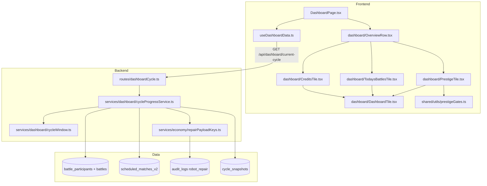
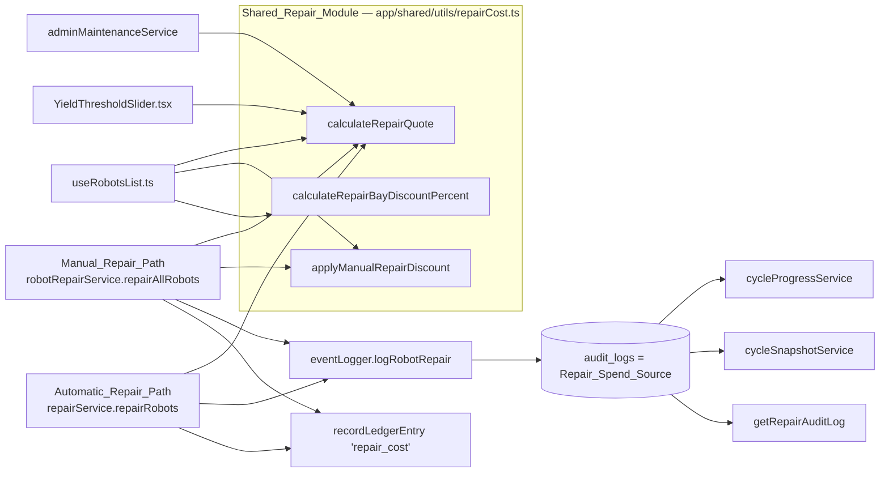

# Design Document

## Overview

This spec replaces the Dashboard's two-card Overview_Row with three tiles built from one shared
Dashboard_Tile component, adds one authenticated read (Cycle_Progress_Summary) that supplies every
changing figure on the row, and repairs the foundations those figures rest on: one repair cost
implementation, one repair spend source, correct manual repair audit figures, ledger coverage for
`repair_cost`, and self-describing names for the four Repair_Figure_Stores.

The design builds directly on the Dashboard refactor already landed in this session:

| File | State | This spec's relationship to it |
|---|---|---|
| `app/frontend/src/utils/dashboardNotifications.ts` | Pure builders returning `NotificationDescriptor` with `action: { label, to }`. 48 tests. | Untouched. Requirement 1 criterion 7 keeps repair action in the notification stack. |
| `app/frontend/src/hooks/useDashboardData.ts` | Owns the Dashboard's five reads and triggers the three shared Zustand stores. 19 tests. | **Extended** with the Cycle_Progress_Summary read. No new parallel hook. |
| `app/frontend/src/hooks/useAcknowledgedPrestigeLevel.ts` | Owns `prestige_gate_seen_{userId}`. | Untouched. |
| `app/frontend/src/pages/DashboardPage.tsx` | ~200 lines: two hooks, section layout, descriptor → `DashboardNotification`. | The two-column `StableStatistics` / `FinancialSummary` grid is replaced by `<OverviewRow />`. |
| `getTuningAllocationSummaries` + `GET /api/robots/tuning-allocations/summary` | Green, with `tests/unit/tuningAllocation.route.test.ts` pinning `/api/robots` route shadowing. | That test's express-app pattern is the template for the new endpoint's route test. |

That earlier work has not been verified against the full backend unit suite — the run was cancelled.
**`cd app/backend && pnpm run test:unit` should be green before spec 48 tasks begin.** This is a
prerequisite on the working tree, not a design element.

### Two findings that change the shape of the work

**1. `app/backend/src/shared/utils` is a symlink to `app/shared/utils`.**

```
app/backend/src/shared/utils -> ../../../shared/utils
```

`app/backend/src/shared/utils/repairCost.ts` and `app/shared/utils/repairCost.ts` are **the same
file seen through two paths**, not two byte-identical copies. Consequences:

- There are **two** declarations of the repair formula under `app/` that the requirements account
  for, not three: `app/shared/utils/repairCost.ts` and `calculateRepairCost` in
  `app/backend/src/utils/robotCalculations.ts`.
- The Backend already imports the Shared_Repair_Module: `robotRepairService.ts`'s
  `import { MANUAL_REPAIR_DISCOUNT } from '../../shared/utils/repairCost'` resolves through the
  symlink to `app/shared/utils/repairCost.ts`.
- An earlier draft of Requirement 15 criterion 2 required deleting
  `app/backend/src/shared/utils/repairCost.ts`, which would have deleted the module criteria 1, 6, 7
  and 8 require to survive. The requirement has since been reworded to drop exports rather than the
  file, the `ls`-based verification criterion that demanded the path be gone has been deleted, and
  Verification criteria 15 and 17 carry `--exclude-dir=shared`. See
  [Requirement Conflicts and Gaps](#requirement-conflicts-and-gaps) § 1.

**2. There is a third declaration of the arithmetic, and the requirements do not name it.**

`app/frontend/src/components/YieldThresholdSlider.tsx` declares a local `calculateRepairCost` that
recomputes the base cost, the Damage_Multiplier and the Repair_Bay_Discount inline. It is a
non-exported arrow function, so Verification criterion 15's grep for an exported name does not see
it. Requirement 15 criterion 8 now names the file, and Verification criterion 18 greps the Frontend
for a second `Math.min(… 90 …)` occurrence so the inline copy cannot come back unseen. This design
removes it.

### Research notes that inform the design

- **Passive income writes `streaming: 0`.** `cycleScheduler.ts` emits `passive_income` with
  `streaming: 0` and the merchandising figure separately, so `stableMetrics.streamingIncome` is
  purely per-battle streaming revenue. The Battle_Earnings Comparison_Figure can therefore be read
  from a `cycle_snapshots` row as `totalCreditsEarned + streamingIncome` without picking up passive
  facility income, satisfying Requirement 2 criterion 3 and Requirement 6 criterion 8 together.
- **`battle_participants` carries real columns for every Current_Cycle money and outcome figure**:
  `credits`, `streamingRevenue`, `prestigeAwarded`, `placement`. No JSON aggregation is needed for
  those, so Prisma `_sum` is available where it matters and is avoided only for the repair payload.
- **`PLACEMENT_MODE_BATTLE_TYPES` is module-private today** (`const`, not `export const`, in
  `userProfileService.ts`). Requirement 8 criterion 7 requires importing it, so the declaration
  gains `export`.
- **`adminCycleService.backfillCycleSnapshots` is create-only, and stays that way.** It skips any
  cycle that already has a snapshot, and `cycleSnapshotService.createSnapshot` calls
  `prisma.cycleSnapshot.create` against a `@unique` `cycleNumber`. An earlier draft of Requirement 9
  criteria 8 and 11 assumed a reprocess path that does not exist; those criteria now state the
  prohibition instead. No guard, no upsert and no skipped-cycle reporting field is added. See
  [Requirement Conflicts and Gaps](#requirement-conflicts-and-gaps) § 3.
- **`.kiro/steering/frontend-standards.md` exists.** Its "Responsive Design → Mobile-First Approach"
  pattern (`grid-cols-1 lg:grid-cols-3`) is the pattern the Overview_Row follows; its 1024px
  Responsive Tab Layout breakpoint is the same boundary Requirement 13 names, though the tab pattern
  itself does not apply because the Overview_Row has no tabs.

## Architecture





### Architectural decisions

| Decision | Rationale |
|---|---|
| The Cycle_Progress_Summary read joins `useDashboardData`, not a new hook. | That hook already owns every Dashboard read and every store trigger. A parallel hook would split ownership of "what the Dashboard fetches" across two files, which is the arrangement the earlier refactor removed. |
| The endpoint is mounted at `/api/dashboard`, a new router registered in `src/index.ts` after `/api/robots`. | Requirement 8 criterion 2. `/api/dashboard` is unused today, so no router in front of it can shadow a single-segment collection path the way `robots.ts`'s `GET /:id` shadows `/api/robots/tuning-allocations`. |
| The Current_Cycle credit balance and prestige total come from the auth context, not the endpoint — but the context is refreshed on Dashboard mount. | Requirement 6 criterion 10 requires the balance and the Income_Dashboard link to survive an endpoint failure, and Requirement 3 criterion 1 states the prestige total with no error clause. Both already live on the `user` object `DashboardPage` reads. **However** `AuthContext` calls `refreshUser` only once, when the application mounts, so without a refresh a player navigating the SPA across a Battle_Slot boundary would see a stale total beside a current Current_Cycle figure. Requirement 3 criterion 10 and Requirement 6 criterion 12 add one `refreshUser()` call on Dashboard mount, which keeps the failure-resilience property and fixes the navigation-bar balance at the same time. |
| Prestige_Gate progress is computed on the Frontend from `app/shared/utils/prestigeGates.ts`. | Requirement 3 criterion 7 names the two helpers; `DashboardPage` already imports them for `buildPrestigeUnlockNotification`. No backend round trip is warranted for a pure function of `user.prestige`. |
| Every changing figure and every Comparison_Figure comes from the one endpoint. | Requirement 8's user story, and Requirement 7 criterion 8, which forbids a `GET /api/user/stats` call for tile rendering. |
| Repair aggregation reads `audit_logs` payloads in application code; every other aggregate uses real columns. | Requirement 9 criterion 4 — Prisma cannot `_sum` a field inside a `Json` column. Verification criteria 11 and 12 pin this. |
| The repair path call sites are updated rather than `robotCalculations.ts` re-exporting under the old name. | See [Shared_Repair_Module consolidation](#3-shared_repair_module-consolidation). |

## Components and Interfaces

### 1. Frontend Overview_Row

New directory `app/frontend/src/components/dashboard/`:

```
app/frontend/src/components/dashboard/
├── DashboardTile.tsx          # Dashboard_Tile + DashboardTileStat + the three content primitives
├── OverviewRow.tsx            # the grid; renders the three tiles in fixed order
├── PrestigeTile.tsx
├── TodaysBattlesTile.tsx
├── CreditsTile.tsx
├── types.ts                   # OverviewRowData and the tile view-model types
└── index.ts                   # barrel
```

`app/frontend/src/components/StableStatistics.tsx` and `FinancialSummary.tsx` are deleted
(Requirement 7 criterion 3), together with every import, JSX usage and test reference to them
(criterion 5).

#### 1.1 Dashboard_Tile props

Requirement 12 criterion 4 fixes the member set; criterion 5 forbids any member through which an
instance could override container styling, container padding, heading typography or a stat-value
colour. The interface below has no `className`, no `style`, no `variant`, no colour and no size
member of any kind.

```typescript
// app/frontend/src/components/dashboard/DashboardTile.tsx

/**
 * Which direction of movement is good for a figure. The tile — not the caller —
 * turns this plus the sign of (current − comparison) into a colour, so no
 * instance ever names a class. Requirement 11 criteria 7 and 8, Requirement 12
 * criteria 4 and 5.
 */
export type SignMeaning = 'higher-is-better' | 'lower-is-better' | 'no-meaning';

/** The two period labels Requirement 2 criterion 5 permits. */
export type PeriodLabel = 'current-cycle' | 'last-completed-cycle';

export interface DashboardTileProps {
  /** Rendered by the tile as its H3 heading. Requirement 11 criterion 3. */
  title: string;
  /** Absent means no interactive click-through element at all. Requirement 14 criterion 5. */
  clickThrough?: { label: string; to: string };
  isLoading: boolean;
  /** Non-null puts the tile in its error state. Requirement 12 criterion 7. */
  error: string | null;
  /** Tile content, assembled from the primitives exported alongside this component. */
  content: React.ReactNode;
}

export interface DashboardTileStatProps {
  label: string;
  /** Already formatted for display. The tile applies colour, never formatting. */
  value: string;
  period: PeriodLabel;
  /**
   * Absent when no Comparison_Figure exists for this stat, which forces the
   * neutral treatment. Requirement 11 criterion 8, Requirement 2 criterion 9.
   */
  comparison?: { value: string; periodLabelSuffix: string };
  /** Numeric delta used only for colour selection, never rendered. */
  delta?: number;
  signMeaning: SignMeaning;
}
```

**How the sign-meaning flag selects a colour without exposing a class name.** `DashboardTile.tsx`
declares the only colour map in the module and keeps it module-private:

```typescript
const STAT_COLOUR = {
  neutral: 'text-white',       // Requirement 11 criterion 4
  favourable: 'text-success',
  unfavourable: 'text-error',
} as const;

function statColour(signMeaning: SignMeaning, delta: number | undefined): string {
  // No Comparison_Figure, no meaning, or an equal figure ⇒ neutral.
  // Requirement 11 criterion 8.
  if (delta === undefined || delta === 0 || signMeaning === 'no-meaning') {
    return STAT_COLOUR.neutral;
  }
  const favourable = signMeaning === 'higher-is-better' ? delta > 0 : delta < 0;
  return favourable ? STAT_COLOUR.favourable : STAT_COLOUR.unfavourable;
}
```

Callers pass `signMeaning: 'higher-is-better'` for prestige earned and Battle_Earnings, and
`'lower-is-better'` for Repair_Spend and Avoidable_Repair_Spend (Requirement 6 criterion 6,
Requirement 11 criterion 7), and `'no-meaning'` for the credit balance and every figure without a
Comparison_Figure. `STAT_COLOUR` is not exported, so `text-success` and `text-error` appear in
exactly one file, which is what Verification criterion 7 checks.

**Content primitives**, exported from `DashboardTile.tsx` so a tile never writes a layout or
typography class:

| Export | Purpose | Requirement |
|---|---|---|
| `DashboardTileStat` | One labelled figure with its period label, optional Comparison_Figure and sign meaning. | 2.5, 11.7, 11.8, 12.4 |
| `DashboardTileProgress` | Label + bar + the same value as adjacent text. | 3.4, 3.5 |
| `DashboardTileLines` | A wrapping list of short strings (the Battle_Slot times and the `+N more` indicator). | 4.3, 4.4, 13.6 |
| `DashboardTilePrompt` | Explanatory sentence plus one in-content router link. | 10.4, 10.7, 1.9 |
| `DashboardTileNote` | Plain explanatory sentence with no figure (comparison-unavailable, Preparation_Phase). | 2.9, 10.4 |

**Container, padding, heading and reserved height** are declared once, in `DashboardTile.tsx`:

```typescript
// Requirement 11 criteria 1, 2, 3 and 9. One geometry across all three states.
const TILE_CONTAINER = 'bg-surface-elevated border border-gray-700 rounded-lg p-4';
const TILE_HEADING = 'text-xl font-medium text-white mb-3';
const TILE_CONTENT = 'min-h-[11rem] flex flex-col gap-2';
```

`bg-surface-elevated` with `border border-gray-700` is the Card Component pattern from
`docs/design_ux/DESIGN_SYSTEM_QUICK_REFERENCE.md` § Component Patterns, and `text-xl font-medium` is
its H3 Subsection step. `TILE_CONTENT`'s `min-h` is applied in the loading, error and loaded
branches alike, so no tile reflows as data arrives (Requirement 11 criterion 9). The value is set
from the tallest loaded tile (Credits_Tile: four stat rows plus a link).

#### 1.2 Loading, error and empty states

| State | Dashboard_Tile renders | Requirement |
|---|---|---|
| Loading | Heading + one neutral placeholder block per expected stat row, inside `TILE_CONTENT`. No stat value, no zero. | 12.6, 11.9, 1.8 |
| Error | Heading + a single "figures unavailable" message. No partial stat value. | 12.7, 4.7, 1.8 |
| Loaded, all figures omitted | Heading + `DashboardTilePrompt` or `DashboardTileNote`. The tile is never dropped and the order never changes. | 1.9, 10.7, 10.4 |
| Loaded, some lines omitted | Omitted lines are absent from the DOM — no `0`, no dash, no empty value. | 10.9 |

The Credits_Tile error state is partial by design: the balance stat and the Income_Dashboard link
still render while the Battle_Earnings, Repair_Spend and Avoidable_Repair_Spend rows are replaced by
the error message (Requirement 6 criterion 10). This is expressed by passing `error: null` to
`DashboardTile` and rendering a `DashboardTileNote` inside the content, not by putting the tile into
the shared error state — Requirement 12 criterion 7 forbids a partial stat value in the *tile* error
state, and the balance is not a Cycle_Progress_Summary figure.

#### 1.3 The three tiles

```typescript
// app/frontend/src/components/dashboard/types.ts

/** Everything the Overview_Row needs, assembled by useDashboardData. */
export interface OverviewRowData {
  /** From the auth context, so it survives an endpoint failure. */
  prestigeTotal: number;
  creditBalance: number;
  robotCount: number;
  isPreparationPhase: boolean;
  /** The Cycle_Progress_Summary response, or null while loading / on failure. */
  cycleProgress: CycleProgressSummary | null;
  isLoading: boolean;
  error: string | null;
}
```

Each tile takes `OverviewRowData` (or the slice it needs) and returns a `<DashboardTile>`. None of
them declares a heading element, container class, padding class, typography class or colour class —
Requirement 12 criterion 3.

**Prestige_Tile** — rendered figures, and nothing else (Requirement 1 criterion 3):

| Line | Source | Requirement |
|---|---|---|
| Prestige total | `user.prestige` | 3.1 |
| Prestige earned, Current_Cycle | `cycleProgress.prestigeEarned`, rendered as `0` when zero | 3.2 |
| Comparison_Figure | `cycleProgress.comparison?.prestigeEarned`, omitted with its direction indicator when absent | 3.3, 10.5 |
| Gate progress | `getNextPrestigeThreshold(prestige)` and `PRESTIGE_GATES[getUnlockedFacilityLevel(prestige) - 1]` | 3.4, 3.5, 3.7 |
| Max-level line | `getUnlockedFacilityLevel(prestige)` when `getNextPrestigeThreshold` returns `null` | 3.6 |

Signed difference and decline indication (criteria 8 and 9) are `DashboardTileStat`'s job:
`signMeaning: 'higher-is-better'`, `delta = current − comparison`. Because prestige only ever
increases, a negative delta means a quieter day than yesterday and is rendered as a signed decline
rather than clamped (criterion 8). No click-through target.

**Todays_Battles_Tile** — rendered figures, and nothing else (Requirement 1 criterion 4):

| Line | Source | Requirement |
|---|---|---|
| `{fought} of {scheduled}` | `cycleProgress.battlesFought` / `matchesScheduled`, whole numbers 0–999, no abbreviation, `signMeaning: 'no-meaning'` | 4.1, 4.2, 4.8, 10.10 |
| Wins / losses / draws | `cycleProgress.winLossDraw`, omitted entirely when `battlesFought === 0` | 5.1, 5.2, 10.1, 10.2 |
| `best {ordinal} of {fieldSize}` | `cycleProgress.bestPlacement`, omitted when `null` | 5.3, 5.4, 10.2 |
| Earliest two Battle_Slot times + `+N more` | `cycleProgress.remainingSlotsUtc` | 4.3, 4.4, 4.6 |
| Time to next settlement | `cycleProgress.nextSettlementAt`, replacing the slot line when `remainingSlotsUtc` is empty and every scheduled match is fought | 10.3 |
| Preparation_Phase note | `isPreparationPhase && matchesScheduled === 0` | 10.4 |
| No-robots prompt | `robotCount === 0`, replacing all figure lines | 10.7, 10.11 |

Placement treatment (criteria 5, 6, 7) is a pure helper in the tile file:

```typescript
/** Requirement 5 criteria 6 and 7. Bands are the same for 'koth' and 'grand_melee'
 *  and for every field size. */
export function placementReward(position: number): 'prestige' | 'lp-and-fame' | 'none' {
  if (position <= 3) return 'prestige';
  if (position <= 10) return 'lp-and-fame';
  return 'none';
}
```

A Reward_Earning_Placement (`!== 'none'`) is rendered with a trophy glyph prefix that a non-earning
placement does not carry — a rendered attribute other than the placement text itself
(criterion 6) — and never with the loss or error colour, which is achieved by passing
`signMeaning: 'no-meaning'` and no `delta` (criterion 5). No LP figure appears anywhere, and
`GRAND_MELEE_LP_SCALE` is not imported (criterion 8). No click-through target.

**Credits_Tile** — rendered figures, and nothing else (Requirement 1 criterion 5):

| Line | Source | Sign meaning | Requirement |
|---|---|---|---|
| Balance | `user.currency`, whole credits, no Comparison_Figure | `no-meaning` → `text-white` | 6.1, 11.4 |
| Battle_Earnings | `cycleProgress.battleEarnings` + `comparison?.battleEarnings` | `higher-is-better` | 6.2 |
| Repair_Spend | `manual + automatic` from `cycleProgress.repairSpend` + comparison | `lower-is-better` | 6.3 |
| Avoidable_Repair_Spend | `round(repairSpend.automatic × MANUAL_REPAIR_DISCOUNT)` + comparison | `lower-is-better` | 6.4 |
| Income_Dashboard link | `clickThrough: { label: 'Full breakdown', to: '/income' }` | — | 6.7, 14.3 |

The Avoidable_Repair_Spend label names a robot's next scheduled match as the deadline for taking the
Manual_Repair_Discount and says nothing about settlement or midnight (Requirement 6 criterion 9).
Both repair lines are omitted together when Current_Cycle Repair_Spend is zero (Requirement 10
criterion 8). Passive facility income and operating costs never appear (criterion 8). No repair
control appears (Requirement 1 criterion 7).

`MANUAL_REPAIR_DISCOUNT` is imported from `app/shared/utils/repairCost.ts`. Requirement 15
criterion 9's ban on multiplying by the constant at a call site is a Backend constraint; on the
Frontend the multiplication here is a *derivation of a different quantity* (what a player would have
saved), not the application of the discount to a Repair_Quote, so it does not go through
`applyManualRepairDiscount`. This is called out because the two look alike at a glance.

#### 1.4 Mobile layout

`OverviewRow.tsx`:

```tsx
<div className="grid grid-cols-1 lg:grid-cols-3 gap-6 mb-8">
  <PrestigeTile … />
  <TodaysBattlesTile … />
  <CreditsTile … />
</div>
```

This is the mobile-first pattern from `.kiro/steering/frontend-standards.md` § Styling Best
Practices → Responsive Design. Tailwind's `lg` breakpoint is 1024px, which is exactly the boundary
Requirement 13 criteria 1, 2 and 7 name, so one utility pair covers stacking below 1024px, the
equal-width three-column grid at 1024px and above, and re-render on rotation without a reload. The
responsive tab layout pattern in the same steering file does not apply — the Overview_Row has no
tabs — and is referenced only for its shared breakpoint.

| Behaviour | Mechanism | Requirement |
|---|---|---|
| Full content width per tile when stacked | `grid-cols-1` + no fixed widths anywhere in the tile | 13.1 |
| No horizontal scrollbar 320–1920px | No `min-w`, no `whitespace-nowrap`, no fixed pixel width on any tile element; figures are the only long strings and they are short | 13.3 |
| Click-through region ≥ 44×44px | `min-h-11 min-w-11 inline-flex items-center` on the action element in `DashboardTile.tsx` | 13.4, 13.5 |
| Battle_Slot times wrap, never truncate | `DashboardTileLines` uses `flex flex-wrap gap-x-2` with no `truncate` and no `text-ellipsis` | 13.6 |
| Below 320px: stacked, page scrolls, nothing clipped | No `overflow-hidden` on the row or the tiles | 13.8 |

#### 1.5 Click-through navigation

`DashboardTile.tsx` calls `useNavigate()` and renders the click-through as a native
`<button type="button">`:

- Native button semantics give Enter and Space activation and a focus ring for free
  (Requirement 14 criterion 4); tab order follows DOM order, which is tile order.
- `navigate(to)` pushes exactly one history entry (criterion 6) and never unloads the document
  (criteria 1, 2, 3).
- When `clickThrough` is absent, no button element is rendered at all, so the tile is not in the
  focus order and does not navigate on activation (criterion 5).
- `window.location.href` appears nowhere under `app/frontend/src/components/dashboard/` or in
  `DashboardPage.tsx` (criterion 2, Verification criterion 1). The `DashboardTilePrompt` link is a
  react-router `<Link>`; it is tile *content*, not the tile-level click-through target, so
  criterion 5's focus-order rule does not reach it.

#### 1.6 `useDashboardData` extension

The hook gains one read and three fields, keeping its existing fail-silent posture for the five
optional reads and adding an explicit error for this one, because three tiles depend on it:

```typescript
export interface DashboardData {
  tierChanges: TierChange[];
  recentChampions: RecentTournamentWinner[];
  teams: TeamBattle[];
  tuningSummaries: TuningAllocationSummary[];
  onboardingState: TutorialState | null;
  // New — Spec #48
  cycleProgress: CycleProgressSummary | null;
  cycleProgressLoading: boolean;
  cycleProgressError: string | null;
}
```

The request is `api.get<CycleProgressSummary>('/api/dashboard/current-cycle')`, issued in the
existing `userId`-keyed effect alongside the other reads, guarded by the same `cancelled` flag. A
failure sets `cycleProgressError` and leaves `cycleProgress` null; `OverviewRow` maps that to the
Dashboard_Tile error state per tile (Requirement 1 criterion 8, Requirement 4 criterion 7,
Requirement 6 criterion 10). New API type and function live in `app/frontend/src/utils/dashboardApi.ts`.

**The same effect also calls `refreshUser()` exactly once** (Requirement 3 criterion 10,
Requirement 6 criterion 12). `refreshUser` comes from `AuthContext`, which invokes it on application
mount and never again unless asked, so the credit balance and prestige total a player sees would
otherwise date from whenever the tab was opened while the Cycle_Progress_Summary figures beside them
are current. One call covers both figures — criterion 12 forbids a second request for the balance
alone — and a rejection is swallowed: the tiles fall back to the values already in the context rather
than entering an error state, because a stale total is more useful than no tile (Requirement 3
criterion 11, Requirement 6 criterion 13). This differs from the Cycle_Progress_Summary read, whose
failure *is* surfaced, because three tiles depend on that one and none depends on the refresh.

### 2. Cycle_Progress_Summary endpoint and service

#### 2.1 Route

New file `app/backend/src/routes/dashboardCycle.ts`, registered in `src/index.ts` as
`app.use('/api/dashboard', dashboardCycleRoutes);`. The base path is not `/api/robots`, so no
router in front of it can capture the path as a robot id (Requirement 8 criterion 2).

```typescript
// app/backend/src/routes/dashboardCycle.ts
import express, { Response } from 'express';
import { z } from 'zod';
import { authenticateToken, AuthRequest } from '../middleware/auth';
import { validateRequest } from '../middleware/schemaValidator';
import { getCycleProgressSummary } from '../services/dashboard/cycleProgressService';

const router = express.Router();

/**
 * No path parameter, no body, no required query field. Zod's default .strip()
 * removes an unknown query field rather than rejecting the request.
 * Requirement 8 criterion 3.
 */
const currentCycleQuerySchema = z.object({});

router.get(
  '/current-cycle',
  authenticateToken,
  validateRequest({ query: currentCycleQuerySchema }),
  async (req: AuthRequest, res: Response) => {
    // Identity from the token only. Requirement 8 criterion 4.
    const summary = await getCycleProgressSummary(req.user!.userId);
    res.json(summary);
  },
);

export default router;
```

`authenticateToken` precedes `validateRequest` (criterion 1). The file imports no Prisma client and
contains no query (criterion 8). The handler is three lines with no try/catch — Express 5 forwards
rejections to `errorHandler`. An absent or invalid token is rejected inside `authenticateToken`,
before the service runs, so no figure is returned and nothing is persisted (criterion 9).

#### 2.2 Response shape

```typescript
// app/backend/src/types/dashboardTypes.ts (new), mirrored in
// app/frontend/src/utils/dashboardApi.ts

/** Repair_Spend split by `repairType`. Requirement 8 criterion 5. */
export interface RepairSpendByType {
  manual: number;
  automatic: number;
}

/**
 * Best_Placement and its field size. Absent as a whole rather than as zero —
 * Requirement 8 criterion 10 and Requirement 10 criterion 9 are satisfied
 * structurally: there is no field that could carry a misleading 0.
 */
export interface BestPlacement {
  position: number;   // ≥ 1
  fieldSize: number;  // count of battle_participants rows for that battle
}

/** The Current_Cycle window edges. Requirement 2 criterion 1, Requirement 8 criterion 5. */
export interface CycleWindow {
  /** Most recent midnight UTC settlement boundary, inclusive. ISO-8601. */
  start: string;
  /** The request timestamp, exclusive. ISO-8601. */
  end: string;
  /** The cycle number the window belongs to. */
  cycleNumber: number;
}

/** Last_Completed_Cycle totals. Requirement 2 criteria 2, 3, 4 and 8. */
export interface CycleComparison {
  /** The cycle actually covered, which may not be currentCycle − 1. Requirement 2 criterion 8. */
  cycleNumber: number;
  prestigeEarned: number;
  battleEarnings: number;
  /**
   * Null when Repair_Spend_Source rows for that window are absent, for example
   * after Season_Rollover purged `audit_logs`. Requirement 10 criterion 6 —
   * the repair comparisons are omitted independently of the other two.
   */
  repairSpend: RepairSpendByType | null;
}

export interface CycleProgressSummary {
  window: CycleWindow;

  // Todays_Battles_Tile
  battlesFought: number;
  matchesScheduled: number;
  winLossDraw: { wins: number; losses: number; draws: number };
  bestPlacement: BestPlacement | null;
  /** Distinct Battle_Slot times, ascending, with a match scheduled and not yet
   *  fought in the Current_Cycle. Length 0–7. Requirement 4 criteria 3 and 4. */
  remainingSlotsUtc: string[];
  /** Next midnight UTC settlement boundary. Requirement 10 criterion 3. */
  nextSettlementAt: string;

  // Prestige_Tile and Credits_Tile
  prestigeEarned: number;
  battleEarnings: number;
  repairSpend: RepairSpendByType;

  /** Null when no `cycle_snapshots` row exists at all, or when reading the
   *  Last_Completed_Cycle sources failed. Requirement 2 criterion 9,
   *  Requirement 10 criterion 5. */
  comparison: CycleComparison | null;
}
```

Two notes on scope. `prestigeEarned` and `comparison` are not in Requirement 8 criterion 5's list,
but Requirement 3 criterion 2, Requirement 2 criteria 2–4 and Requirement 7 criterion 8 together
require them from this endpoint — criterion 5 is read as a floor, not a ceiling. And the credit
balance and prestige total are deliberately *not* in the response, per
[decision table](#architectural-decisions).

#### 2.3 Window derivation

```typescript
// app/backend/src/services/dashboard/cycleWindow.ts

/**
 * Both window edges, captured once per request so every figure on the
 * Overview_Row covers the identical interval. Requirement 2 criterion 1.
 *
 * Never derived from the request timestamp minus a fixed duration
 * (criterion 6), and never from `lastLoginAt` (criterion 7).
 */
export function currentCycleWindow(now: Date): { start: Date; end: Date; nextBoundary: Date } {
  const start = new Date(Date.UTC(now.getUTCFullYear(), now.getUTCMonth(), now.getUTCDate()));
  const nextBoundary = new Date(start.getTime() + 24 * 60 * 60 * 1000);
  return { start, end: now, nextBoundary };
}
```

The service calls this once and threads `{ start, end }` through every query. The
Last_Completed_Cycle window comes from the `cycle_snapshots` row's own `startTime` and `endTime`
columns, which are the midnight boundaries that opened and closed that cycle (Requirement 2
criterion 4), so it is not recomputed from arithmetic on the current boundary. The snapshot selected
is the row with the highest `cycleNumber` strictly lower than the Current_Cycle's (criterion 3), and
when the immediately preceding cycle has no row because the Settlement_Job has not yet written it,
the most recent existing row is used and its own `cycleNumber` is returned in
`comparison.cycleNumber` so the Frontend labels it with the cycle it covers (criterion 8).

#### 2.4 Queries

`app/backend/src/services/dashboard/cycleProgressService.ts`. Seven reads, issued as two
`Promise.all` waves (the second wave needs the snapshot's window):

| # | Figure | Query | Index relied on |
|---|---|---|---|
| 1 | Robot ids and team ids for the stable | `robot.findMany({ where: { userId }, select: { id: true } })`, plus the user's team ids | `robots_user_id` |
| 2 | Battles fought, win/loss/draw, Best_Placement, field sizes | `battleParticipant.findMany({ where: { robotId: { in: robotIds }, battle: { createdAt: { gte: start, lt: end } } }, select: { battleId, robotId, team, placement, battle: { select: { battleType, createdAt, winnerId, winningSide } } } })` then a grouped count for field sizes. `team` and the two winner columns are what let outcomes be grouped by `(battleId, team)` per Requirement 5 criteria 1 and 11; `robotId` is needed for the `winnerId` fallback. | `battle_participants_robot_id_idx`, PK on `battles` |
| 3 | Battle_Earnings, prestige earned | `battleParticipant.aggregate({ _sum: { credits: true, streamingRevenue: true, prestigeAwarded: true }, where: <same> })` | same as #2 |
| 4 | Matches scheduled, remaining Battle_Slots | `scheduledMatchParticipant.findMany({ where: { OR: [{ participantType: 'robot', participantId: { in: robotIds } }, { participantType: 'team', participantId: { in: teamIds } }] }, select: { scheduledMatchId, scheduledMatch: { select: { scheduledFor, status } } } })`, filtered to `scheduledFor` inside the window | `scheduled_match_participants_participant_id_participant_type_idx` |
| 5 | Repair_Spend, Current_Cycle | `auditLog.findMany({ where: { userId, eventType: 'robot_repair', cycleNumber: window.cycleNumber, eventTimestamp: { gte: start, lt: end } }, select: { payload: true } })`, summed in JS | `audit_logs_cycle_number_user_id_idx` |
| 6 | Comparison_Figures | `cycleSnapshot.findFirst({ where: { cycleNumber: { lt: current } }, orderBy: { cycleNumber: 'desc' } })`, then the same repair query scoped to that snapshot's `startTime`/`endTime` and `cycleNumber` | `cycle_snapshots.cycle_number` unique index, then `audit_logs_cycle_number_user_id_idx` |

**Win/loss/draw** counts one result per `battle_participants` row belonging to the player's robots
(Requirement 5 criterion 1), so a battle containing two of the player's robots contributes two
results. The outcome per row is derived from the corresponding `battle_complete` audit payload's
`result` field, the same source `userProfileService.countCareerCycleResults` uses, because that field
already encodes the correct outcome for team modes where `battles.winnerId` does not. Rows whose
`battleType` is in `PLACEMENT_MODE_BATTLE_TYPES` are excluded (criterion 2, Requirement 8
criterion 5). The constant is imported from `userProfileService.ts` — which gains `export` — rather
than redeclared (Requirement 8 criterion 7, Verification criterion 9).

**Win, loss and draw** are counted once per distinct `(battleId, team)` pair the player holds a row
on, not once per participant row (Requirement 5 criterion 1). The grouping key is what makes a 3v3
victory read as one win against one battle fought rather than three wins against one — the two halves
of the tile would otherwise contradict each other on five of the nine modes. Outcome per pair comes
from `battles.winningSide` where it is set, else from whether the pair holds `battles.winnerId`, else
draw (criterion 11); the schema documents `winningSide` as null for both a draw and a 1v1, so the
fallback is load-bearing rather than defensive. Only these three columns are read, never `battle_log`,
which is NULLed after seven days (criterion 12).

A **Same_Stable_Pairing** is the one case where the outcome counts sum to more than the fought count:
the player holds robots on both sides, so one battle yields one win and one loss (criterion 13). It is
not special-cased and not excluded (criterion 14) — a battle that appeared in Recent Battles while
contributing nothing to the tile above it would be the worse inconsistency. The progress figure and
the outcome figures are separate lines in § 1.3 and no copy claims they reconcile.

A **Placement_Mode battle holding several of the player's robots** multiplies nothing at all
(criterion 15): one battle fought, one match scheduled, no win/loss/draw contribution because
criterion 2 excludes the mode, and one Best_Placement figure collapsing all of them. So three robots
in one Grand Melee field read as "1 of 1" plus "best 4th of 20", never as three results.

**Battles fought** is the count of distinct `battleId` values, matching the once-per-stable
granularity Requirement 4 criterion 2 sets for the scheduled count. **Matches scheduled** counts
each `scheduledMatchId` once however many of the player's robots take part (criterion 2). Both
counts are returned exactly as computed, with no clamping and no completion proportion, so a fought
count above the scheduled count renders as-is (criterion 8).

**Best_Placement** takes the numerically lowest non-null `placement` across the player's
Placement_Mode participant rows in the window, and where two or more battles tie on that placement,
the one with the largest field size, making the pair deterministic (Requirement 5 criterion 9). A
Placement_Mode battle recording no placement for any of the player's robots is excluded from the
derivation rather than treated as a placement (criterion 10, Requirement 8 criterion 10). Field size
is the count of `battle_participants` rows for that battle (criterion 3), obtained with one
`groupBy({ by: ['battleId'], _count: true })` over the candidate battle ids.

**Remaining Battle_Slots** are the distinct `scheduledFor` times, formatted as UTC times of day, of
the player's scheduled matches in the window whose `status` is still `'scheduled'`, ascending. The
service returns the whole list (at most nine, since Battle_Slot defines nine daily times) and the
tile renders the earliest two plus `+N more`, so N is bounded 1–7 by construction (Requirement 4
criterion 4).

**Both Match_Schedule_Sources are read.** `EVENT_SCHEDULE_SCOPES` declares six modes as
`source: 'unified'` (rows in `scheduled_matches_v2`) and the three tournament modes as
`source: 'tournament'` (rows in `scheduled_tournament_matches`, participants in two columns rather
than as rows). Reading only the first would omit the 10:00, 15:00 and 18:00 Battle_Slots from
`matchesScheduled` and `remainingSlotsUtc` while `battlesFought` continued to count their battles —
so on any ordinary day the tile would report more fought than scheduled, and would announce the day
finished while a tournament round was pending (Requirement 4 criteria 9 and 10, Requirement 8
criteria 12 to 14).

The second read mirrors the bracket filter `resolveOutstandingEventsForRobots` already uses, so the
two cannot disagree about what "queued" means:

```typescript
// Query 4b — the tournament Match_Schedule_Source.
// Filter matches services/scheduling/eventScheduleScope.ts exactly.
await prisma.scheduledTournamentMatch.findMany({
  where: {
    status: { in: ['pending', 'scheduled'] },
    tournament: { status: 'active' },
    winnerId: null,
    scheduledFor: { gte: start, lt: end },
    OR: bracketFilters,   // built from EVENT_SCHEDULE_SCOPES, robot ids and team ids
  },
  select: { participantType: true, participant1Id: true, participant2Id: true, scheduledFor: true },
});
```

`bracketFilters` is built by iterating `EVENT_SCHEDULE_SCOPES` and selecting the entries with
`source: 'tournament'`, exactly as `buildReverseLookups` does, so adding a tenth event mode fails to
compile in the scope map rather than silently vanishing from the tile. A team-participant bracket row
resolves to every member of that team and is counted **once per stable** (Requirement 8
criterion 13), matching the once-per-stable rule query 4 already applies to unified team matches.
Both reads use the same `{ start, end }` the service captured once (Requirement 8 criterion 14).

**Repair_Spend** fetches only `robot_repair` rows for the authenticated user inside the window and
sums the charged figure per `repairType` in application code (Requirement 9 criterion 4). No Prisma
`_sum` touches a JSON field (Verification criterion 11) and `preDiscountCost` is never read
(Verification criterion 12). Rows with no `repairType` or a non-numeric charged figure are skipped,
and the remaining aggregation completes rather than failing the request (Requirement 9
criterion 10). Neither `robots.repairCost` nor any `battle_complete` payload contributes
(criteria 1 and 5).

**Avoidable_Repair_Spend is not returned.** It is derived on the Frontend as
`round(automatic × MANUAL_REPAIR_DISCOUNT)` from the automatic total alone (Requirement 6
criteria 4 and 5, Requirement 9 criterion 6), so it stays correct across the Requirement 18 fix
without a second server-side figure to keep in step.

#### 2.5 The 1000 ms bound

Requirement 8 criterion 11 fixes the bound at up to 20 robots and up to 40 battles in the
Current_Cycle. The design meets it by construction:

- Seven reads in two waves, so wall time is roughly two round trips plus the slowest query in each,
  not seven sequential queries. The tournament bracket read (query 4b) joins the first wave alongside
  the unified schedule read, so adding the second Match_Schedule_Source costs no extra round trip.
- Every predicate is served by an existing index (table above). No new index is added: the sharpest
  filter available for the repair reads is `audit_logs_cycle_number_user_id_idx`, which is why the
  queries carry `cycleNumber` alongside the timestamp window even though the window alone would be
  correct.
- Result sets are bounded by the criterion's own limits: ≤ 20 robot ids, ≤ 40 battles, ≤ 40
  participant rows, ≤ 7 scheduled matches, and a single-digit number of `robot_repair` rows per
  cycle per stable.
- No `include` fans out beyond one level, and the only aggregate over a large table
  (`battleParticipant.aggregate`) reads real integer columns.
- The endpoint writes to no table and creates no audit entry, so two successive requests with no
  intervening battle, credit award or repair event return identical counts and totals (criterion 6).

A Jest test asserts the read count and shape rather than asserting wall-clock time, which is not
stable in CI; the criterion is treated as a budget the query plan honours, and the test that pins it
is the query-count test.

### 3. Shared_Repair_Module consolidation

This is the riskiest part of the spec: two live payment paths and one on-screen estimate converge on
one module.

#### 3.1 Final module surface

```typescript
// app/shared/utils/repairCost.ts — the Shared_Repair_Module

/** The 50% reduction for repairing before a robot's next scheduled match.
 *  Declared exactly once under app/. Requirement 15 criteria 1 and 2. */
export const MANUAL_REPAIR_DISCOUNT = 0.5;

/** Repair_Bay_Discount cap, as a percentage. Requirement 15 criterion 5. */
export const MAX_REPAIR_BAY_DISCOUNT_PERCENT = 90;

export interface RepairCostRobot {
  currentHP: number;
  maxHP: number;
  // plus the 23 attributes, read by name through ROBOT_ATTRIBUTES
}

/** Repair Bay level and active robot count, the two inputs to the Repair_Bay_Discount. */
export interface RepairBayContext {
  repairBayLevel: number;
  activeRobotCount: number;
}

/**
 * What is being priced. The robot form derives the damage percentage, the HP
 * percentage and the attribute total from the robot; the explicit form prices a
 * hypothetical, which is what the yield-threshold scenario table needs.
 */
export type RepairQuoteSubject =
  | { robot: RepairCostRobot }
  | { attributeTotal: number; damagePercent: number; hpPercent: number };

/**
 * The Repair_Quote: credits to repair one robot to full at its current damage,
 * after the Repair_Bay_Discount and before the Manual_Repair_Discount.
 *
 *   attributeTotal × 100 × (damagePercent / 100) × Damage_Multiplier
 *     × (1 − Repair_Bay_Discount)
 *
 * rounded to the nearest whole credit. Requirement 15 criteria 4 and 10.
 * Returns 0 for an undamaged robot (criterion 16).
 *
 * @throws RangeError if any input is negative or not finite (criterion 17).
 */
export function calculateRepairQuote(
  subject: RepairQuoteSubject,
  context: RepairBayContext,
): number;

/**
 * The Charged_Repair_Cost on the Manual_Repair_Path: the Repair_Quote reduced by
 * the Manual_Repair_Discount, rounded down. The only place under app/ that
 * applies the discount. Requirement 15 criteria 9 and 10.
 *
 * @throws RangeError if `quote` is negative or not finite.
 */
export function applyManualRepairDiscount(quote: number): number;

/**
 * The Repair_Bay_Discount as a whole percentage:
 *   min(90, repairBayLevel × (5 + activeRobotCount))
 * Requirement 15 criterion 5. Exported for display and for the value
 * `repairAllRobots` returns as `discount`; it neither produces a Repair_Quote
 * nor applies the Manual_Repair_Discount, so Requirement 15 criterion 1's
 * one-function-each rule is unaffected.
 */
export function calculateRepairBayDiscountPercent(context: RepairBayContext): number;

/** Attribute total, roundToTwo, matching the Backend's `calculateAttributeSum`. */
export function sumAttributes(robot: RepairCostRobot): number;
```

Removed from the module: `calculateRepairCost` (replaced by `calculateRepairQuote`),
`calculateRobotRepairCost` (folded into the robot form of `RepairQuoteSubject` — Requirement 17
criterion 6 forbids two names differing only by a qualifier), and `calculateRepairBayDiscount`
(renamed for the unit it returns).

The rounding split is deliberate and pins today's behaviour: `Math.round` on the quote,
`Math.floor` on the manual discount (Requirement 15 criterion 10).

#### 3.2 What happens to `app/backend/src/utils/robotCalculations.ts`

**Call sites are updated; nothing is re-exported.** Requirement 15 criterion 3 permits either, and
the call-site option is chosen because a re-export would keep the name `calculateRepairCost` and its
six-argument positional signature — including the dead `_medicalBayLevel` placeholder — alive in the
Backend, and that shape is what made the double-discount easy to write in the first place. A
re-export would also satisfy Verification criterion 15's grep while leaving the confusion in place,
and Verification criterion 16 exists precisely to forbid it.

| Site | Change |
|---|---|
| `app/backend/src/utils/robotCalculations.ts` | Delete the `calculateRepairCost` declaration. `calculateAttributeSum` stays — it computes an attribute total, it performs no arithmetic on one, so Requirement 15 criterion 3's constraint holds. |
| `app/backend/src/services/robot/robotRepairService.ts` | Import `calculateRepairQuote`, `applyManualRepairDiscount`, `calculateRepairBayDiscountPercent` from `../../shared/utils/repairCost`. |
| `app/backend/src/services/economy/repairService.ts` | Import `calculateRepairQuote` from the same path. |
| `app/backend/src/services/admin/adminMaintenanceService.ts` | Import `calculateRepairQuote`; drop the local `calculateAttributeSum` + `calculateRepairCost` pairing in favour of the robot form. |
| `app/backend/tests/stanceAndYield.test.ts` | Update the `calculateRepairCost` describe block to `calculateRepairQuote` with the explicit-numbers subject form. Expected values unchanged. |
| `app/backend/tests/manualRepairDiscount.property.test.ts` | Import from the Shared_Repair_Module; assert the property against `calculateRepairQuote`. |

#### 3.3 What happens to `app/backend/src/shared/utils/repairCost.ts`

It is the same file as `app/shared/utils/repairCost.ts`, reached through the
`app/backend/src/shared/utils -> ../../../shared/utils` directory symlink. Nothing is deleted at
that path, because deleting it would delete the Shared_Repair_Module. What Requirement 15
criterion 2 is actually asking for is achieved inside the one file:

- `MANUAL_REPAIR_DISCOUNT` already lives in the Shared_Repair_Module — no move is needed.
- `calculateRepairCost`, `calculateRobotRepairCost` and `calculateRepairBayDiscount` are dropped, as
  criterion 2 requires, in favour of the surface in § 3.1.
- `sumAttributes` is **kept**, contrary to criterion 2's list, because `calculateRepairQuote`'s
  robot form needs it and the Frontend estimate needs a Decimal-tolerant attribute sum.

The symlink stays. Replacing it with per-module re-export shims inside `src/` would add a second
resolution path for every shared formula, not just repair, to satisfy a criterion written on the
assumption that two files exist.

#### 3.4 The barrel

`app/backend/src/shared/utils/index.ts` is likewise the same file as `app/shared/utils/index.ts`.
One edit updates both views:

```typescript
export {
  calculateRepairQuote,
  applyManualRepairDiscount,
  calculateRepairBayDiscountPercent,
  sumAttributes,
  MANUAL_REPAIR_DISCOUNT,
  MAX_REPAIR_BAY_DISCOUNT_PERCENT,
  type RepairCostRobot,
  type RepairBayContext,
  type RepairQuoteSubject,
} from './repairCost';
```

No Backend or Frontend file imports the repair symbols through the barrel today — every caller uses
the direct module path — so the barrel edit is a consistency change with no call-site consequence.

#### 3.5 Frontend call sites

| Site | Change |
|---|---|
| `app/frontend/src/hooks/useRobotsList.ts` | `calculateRobotRepairCost` → `calculateRepairQuote({ robot }, ctx)`; `calculateRepairBayDiscount` → `calculateRepairBayDiscountPercent`; the batch-level `totalBaseCost × MANUAL_REPAIR_DISCOUNT` becomes a per-robot `applyManualRepairDiscount` then a sum. The import path stays `../../../shared/utils/repairCost` and resolves nowhere else (Verification criterion 20). |
| `app/frontend/src/components/YieldThresholdSlider.tsx` | Delete the local `calculateRepairCost` and the local attribute-sum loop; call `calculateRepairQuote({ attributeTotal, damagePercent, hpPercent }, { repairBayLevel, activeRobotCount })`. Requirement 15 criterion 8. |

The per-robot change in `useRobotsList` is required for correctness, not tidiness: Requirement 15
criteria 11 and 12 make the charged amount a per-robot-then-sum figure, so the batch-level estimate
the confirmation dialog shows today would sit up to N−1 credits above what the player is charged.

#### 3.6 Repair_Cost_Parity_Test

`app/backend/tests/unit/repairCostParity.test.ts`.

The problem the test exists to solve is that expected values must come from the pre-consolidation
implementation, and that implementation is deleted by the same change (Requirement 15 criterion 14
forbids deriving them from the new function). The approach:

1. **Capture before removal.** Before `calculateRepairCost` is deleted from `robotCalculations.ts`,
   run a one-off script that calls the *existing* function across the case matrix and prints the
   results.
2. **Transcribe as literals.** The printed numbers are written into the test file as literal
   expected values with a comment naming their provenance ("captured from
   `robotCalculations.calculateRepairCost` at commit `<sha>` before its removal"). The test then has
   no dependency on the removed code and can fail.
3. **Delete the capture script in the same task.** It is scaffolding, not a deliverable.

Case matrix (Requirement 15 criterion 13, Verification criterion 22):

| Case | HP | Repair Bay | Active robots | Damage_Multiplier boundary |
|---|---|---|---|---|
| 1 | 0% of max | 0 | 1 | 2.0 |
| 2 | 5% of max | 0 | 1 | 1.5 |
| 3 | 40% of max | 0 | 1 | 1.0 |
| 4 | 100% of max | 0 | 1 | quote is 0 (criterion 16) |
| 5 | 0% of max | 2 | 5 | 20% discount, below cap |
| 6 | 0% of max | 10 | 20 | product 250 → capped at 90% |
| 7 | mixed, 3 robots | 2 | 3 | per-robot sum equals the batch charge (criterion 15) |

Cases 1–6 assert `calculateRepairQuote` against the captured literal. Case 7 asserts that
`sum(applyManualRepairDiscount(quote_i))` equals what the Manual_Repair_Path deducts, which is the
criterion 11 and 12 behaviour rather than parity with the old batch rounding — the test states in a
comment that this case is deliberately *not* a parity assertion, because criterion 12 sanctions a
figure up to N−1 credits below today's.

### 4. The manual audit fix (Requirement 18)

#### 4.1 The corrected logging call

Today's loop in `app/backend/src/routes/robots.ts` applies the Repair_Bay_Discount a second time to a
quote that already carries it:

```typescript
// BEFORE — wrong. `calculatedRepairCost` is a Repair_Quote, already discounted.
for (const robot of result.robotsNeedingRepair) {
  const perRobotCostAfterRepairBay = Math.floor(robot.calculatedRepairCost * (1 - result.discount / 100));
  const perRobotFinalCost = Math.floor(perRobotCostAfterRepairBay * 0.5);
  const damageRepaired = robot.maxHP - robot.currentHP;
  await eventLogger.logRobotRepair(
    userId, robot.id, perRobotFinalCost, damageRepaired,
    result.discount, undefined, 'manual', 50, perRobotCostAfterRepairBay
  );
}
```

```typescript
// AFTER — the Repair_Bay_Discount is applied exactly once, by the
// Shared_Repair_Module when it produced the quote. Requirement 18 criteria 1–5.
for (const robot of result.robotsNeedingRepair) {
  const damageRepaired = robot.maxHP - robot.currentHP;
  await eventLogger.logRobotRepair(
    userId,
    robot.id,
    // charged: the credits deducted for this robot
    applyManualRepairDiscount(robot.calculatedRepairCost),
    damageRepaired,
    result.discount,
    undefined,
    'manual',
    50,
    // pre-discount: the Repair_Quote, unmodified
    robot.calculatedRepairCost,
  );
}
```

The expression `Math.floor(robot.calculatedRepairCost * (1 - result.discount / 100))` is gone, and
no line in the loop multiplies or divides a figure derived from `robot.calculatedRepairCost` by
`result.discount` (Verification criterion 25). `result.discount` is still passed as the
`discountPercent` payload field, which is a record of the Repair_Bay_Discount that applied, not an
input to either money figure (criterion 5 bans applying it, not reporting it).

#### 4.2 Where the charged figure comes from

`applyManualRepairDiscount(robot.calculatedRepairCost)` — the same function, given the same input,
that `robotRepairService` uses to compute the per-robot deduction and the Lifetime_Repair_Spend
increment. That is the whole point: after this change the four figures for one robot (credits
deducted, Lifetime_Repair_Spend increment, Repair_Spend_Source charged figure, Repair_Ledger_Entry
amount) are all the same expression evaluated on the same quote, so they agree to the credit
(Requirement 15 criterion 11, Requirement 18 criterion 11).

#### 4.3 Interaction with Requirement 15 criteria 11 and 12

Requirement 15 criterion 11 moves the authoritative charge from a batch figure to per-robot-then-sum.
`robotRepairService.repairAllRobots` changes accordingly:

```typescript
// BEFORE: one rounding on the batch total for the deduction, a different
// rounding per robot for the totalRepairsPaid increment. The two can disagree.
const finalCost = Math.floor(totalBaseCost * MANUAL_REPAIR_DISCOUNT);
// … per robot: Math.floor(robot.calculatedRepairCost * MANUAL_REPAIR_DISCOUNT)

// AFTER: one per-robot figure, summed. Requirement 15 criteria 11 and 12.
const chargedPerRobot = robotsNeedingRepair.map(r => ({
  robotId: r.id,
  charged: applyManualRepairDiscount(r.calculatedRepairCost),
}));
const finalCost = chargedPerRobot.reduce((sum, r) => sum + r.charged, 0);
```

The order of operations matters and is now fixed in one place: **quote each robot, discount each
robot, then sum.** The deduction can be up to N−1 credits lower than today's batch figure for a
batch of N robots; criterion 12 sanctions that explicitly, because the per-robot figure is the one
that reconciles with the per-robot audit, lifetime and ledger records. `RepairAllResult` gains
`chargedPerRobot` so the route can log and record the ledger without recomputing anything.

`preDiscountCost` on the result object stays equal to `totalBaseCost` (the sum of quotes), which is
the batch-level pre-discount figure the response already returns. It is a response field, not a
Repair_Spend_Source figure, and Requirement 6's Glossary note that `preDiscountCost` is never an
input to a spend total continues to hold.

Requirement 18 corrects only the two audit figures. The credits deducted and the
Lifetime_Repair_Spend increment already applied the Repair_Bay_Discount once and are changed only by
Requirement 15 criteria 11 and 12's rounding move, not by Requirement 18 (criterion 6).

#### 4.4 Repair_Audit_Parity_Test

`app/backend/tests/unit/repairAuditParity.test.ts`. Expected values are derived from the
Repair_Quote and the Manual_Repair_Discount alone — never from the logged payload or from the
handler under test — so the test fails against the pre-fix implementation (Requirement 18
criterion 8).

| Case | Assertion | Requirement |
|---|---|---|
| Repair Bay level 2, 5 active robots (20% discount) | logged charged figure equals credits deducted for that robot; logged pre-discount figure equals the Repair_Quote | 18.7 |
| Repair Bay level and active robot count giving exactly 90% | same two equalities hold at the cap, where the old code recorded a tenth | 18.9, V26 |
| Manual batch of 3 robots | sum of logged charged figures equals the credits deducted for the batch | 18.11, V26 |
| Automatic_Repair_Path repair | logged charged figure equals `event.repairCost`; no pre-discount figure is recorded | 18.10, V26 |

### 5. Ledger writes (Requirement 16)

#### 5.1 Granularity: per robot, on both paths

Requirement 16 criterion 3 requires one Repair_Ledger_Entry per Repair_Spend_Source row at the same
granularity. That granularity has been verified as **one audit row per robot on both paths**:

- Manual_Repair_Path: the loop over `result.robotsNeedingRepair` in `routes/robots.ts` calls
  `eventLogger.logRobotRepair` once per robot.
- Automatic_Repair_Path: the loop over `repairEvents` in `services/economy/repairService.ts` calls
  `eventLogger.logRobotRepair` once per robot.

So both paths write **one Repair_Ledger_Entry per robot**, with `robotId` set — `recordLedgerEntry`
already accepts an optional `robotId`.

#### 5.2 Manual_Repair_Path

In `routes/robots.ts`, after `repairAllRobots` has returned (its transaction has committed) and in
the same loop as the audit call, following the `robot_creation` pattern already in the file — called
without `await`, outside any transaction (Requirement 16 criterion 4):

```typescript
// After the repair transaction has committed. Not enrolled in it.
let runningBalance = result.newCurrency;
for (const entry of [...result.chargedPerRobot].reverse()) {
  recordLedgerEntry({
    userId,
    robotId: entry.robotId,
    transactionType: 'repair_cost',
    amount: -entry.charged,
    balanceAfter: runningBalance,
    description: `Manual repair of 1 robot (batch of ${result.repairedCount})`,
    metadata: { repairType: 'manual', robotCount: 1, batchSize: result.repairedCount },
  });
  runningBalance += entry.charged;
}
```

The balance walk backwards from the committed post-deduction balance is what makes a per-robot
`balanceAfter` meaningful when the deduction was a single decrement (criterion 1). Entries are
emitted last-robot-first so each `balanceAfter` is the balance immediately after that robot's share
was taken.

#### 5.3 Automatic_Repair_Path

In `services/economy/repairService.ts`, in the existing `repairEvents` loop that already runs after
the chunked transactions have committed:

```typescript
recordLedgerEntry({
  userId: event.userId,
  robotId: event.robotId,
  transactionType: 'repair_cost',
  amount: -event.repairCost,
  balanceAfter: /* running per-user balance, walked back as above */,
  description: `Automatic pre-battle repair of 1 robot`,
  metadata: { repairType: 'automatic', robotCount: 1, cycleNumber },
});
```

Two constraints specific to this path:

- **`deductCosts === false` writes no entry.** The path supports a dry-run mode in which no credits
  move, so a ledger entry would record a charge that did not happen. Criterion 2's `balanceAfter`
  has no meaning in that mode.
- The post-deduction balance per user is read once after the deduction transactions commit, then
  walked back across that user's `repairEvents`, for the same reason as § 5.2.

#### 5.4 Failure, flag and reconciliation

| Behaviour | Mechanism | Requirement |
|---|---|---|
| A failed ledger write leaves the repair committed and the response unchanged | `recordLedgerEntry` already catches and logs at debug; it is called without `await` and after commit | 16.5, V23 |
| Description names the path and the robot count | `description` strings above | 16.6 |
| No `financial_ledger` row while `financial_ledger_active` is `false` | `financialService.recordTransaction` returns `null` when the flag is off — no change at the call sites | 16.7 |
| `repair_cost` sum for a cycle equals −Repair_Spend for that cycle | Both derive from the same per-robot charged figure, computed once | 16.8 |
| No Overview_Row or Cycle_Progress_Summary figure reads `financial_ledger` | § 2.4 reads `audit_logs` only | 16.9 |
| Only `repair_cost` is added | No other `transactionType` gains a call site | 16.10 |

### 6. Renames and migrations (Requirement 17)

#### 6.1 One Prisma migration for both column renames

```sql
-- app/backend/prisma/migrations/<timestamp>_rename_repair_figure_columns/migration.sql
ALTER TABLE "robots" RENAME COLUMN "repair_cost" TO "repair_quote_credits";
ALTER TABLE "robots" RENAME COLUMN "total_repairs_paid" TO "lifetime_repair_credits_paid";
```

```prisma
// app/backend/prisma/schema.prisma — model Robot
repairQuoteCredits        Int @default(0) @map("repair_quote_credits")        // Cached_Repair_Quote
lifetimeRepairCreditsPaid Int @default(0) @map("lifetime_repair_credits_paid") // Lifetime_Repair_Spend
```

Renames, not add-and-keep (Requirement 17 criterion 7). Values carry across unchanged
(criterion 14). There is no compatibility window for the Cached_Repair_Quote because both repair
paths recompute the quote and ignore the column (criterion 1).

Call sites that change with the columns:

| Category | Sites |
|---|---|
| Repair writes | `robotRepairService.ts`, `repairService.ts` (both set the quote to 0 and increment the lifetime figure) |
| Robot creation defaults | `services/battle/byeRobot.ts`, `services/practice-arena/practiceArenaService.ts`, `services/team-battle/teamBattleMatchmakingService.ts` |
| API response and Frontend types | `app/frontend/src/types/robot.ts`, `app/frontend/src/utils/robotApi.ts`, `app/frontend/src/hooks/useRobotDetail.ts` |
| Frontend render | `app/frontend/src/pages/RobotDetailPage.tsx` ("Lifetime Repairs") |
| Test fixtures | ~30 backend and frontend fixture objects that spread a full `Robot` shape |

The rename changes the JSON field names the robot endpoints return, so the Frontend type and render
changes ship in the same change as the schema change. This is a larger surface than Requirement 17
criteria 1 and 2 describe ("every read and write site of the column") and is listed here so the
task breakdown can size it.

#### 6.2 JSON key transitions: one read-both/write-new helper

Two JSON key transitions have no migration, because the keys live inside `Json` columns
(criteria 3 and 4), so pre-rename rows keep the old keys until Season_Rollover purges them. The
fallback is implemented **once**, in a new module, rather than at each of the read sites:

```typescript
// app/backend/src/services/economy/repairPayloadKeys.ts

/**
 * Read-both / write-new resolvers for the two repair JSON key transitions
 * (Spec #48 Requirement 17 criteria 3, 4, 8, 10, 11, 16).
 *
 * REMOVABLE AT THE NEXT Season_Rollover. A rollover purges both
 * `cycle_snapshots` and `audit_logs` in full (Spec #45), so no row carrying an
 * old key survives it and every fallback below becomes dead code.
 */

/** Renamed keys. Written on every new row; read first on every row. */
export const CYCLE_REPAIR_SPEND_KEY = 'cycleRepairCreditsPaid' as const;
export const REPAIR_CHARGED_KEY = 'creditsCharged' as const;
export const REPAIR_PRE_DISCOUNT_KEY = 'creditsBeforeManualDiscount' as const;

/**
 * Cycle_Repair_Spend out of a `stableMetrics` entry. Renamed key first, then
 * `totalRepairCosts`. Never the sum of the two — a partially migrated row must
 * not double a repair total (criterion 16).
 */
export function readCycleRepairSpend(metric: Record<string, unknown>): number;

/** Repair_Spend_Source charged figure. `creditsCharged`, then `cost`. */
export function readRepairChargedCredits(payload: Record<string, unknown>): number | null;

/** Repair_Spend_Source pre-discount figure. `creditsBeforeManualDiscount`,
 *  then `preDiscountCost`. Null when neither is present, which is the normal
 *  case for an Automatic_Repair_Path row. */
export function readRepairPreDiscountCredits(payload: Record<string, unknown>): number | null;
```

`readRepairChargedCredits` returns `null` for a non-numeric value, which is how Requirement 9
criterion 10 is satisfied at every reader at once rather than per call site.

`repairType` and `manualRepairDiscount` are **not** renamed, so the `payload.repairType` JSON path
filter behind `GET /api/admin/audit-log/repairs` keeps matching pre- and post-rename rows
(criterion 5).

#### 6.3 Every read site that changes

| Site | Reads | Change |
|---|---|---|
| `services/admin/adminSystemStatsService.ts` → `getRepairAuditLog` | payload `cost`, `preDiscountCost` in two places: the per-event mapping and the summary loop | Both go through the resolvers. Response fields are renamed to `creditsCharged` / `creditsBeforeManualDiscount`. Criteria 10, 13 |
| `app/frontend/src/pages/admin/RepairLogPage.tsx` | response `cost`, `preDiscountCost` in three columns (Cost, Pre-Discount, Savings) | Column `key` values follow the renamed response fields; labels, order, filters and rendered values are unchanged, including for a pre-rename row. Criterion 13 |
| `services/cycle/cycleSnapshotService.ts` → `aggregateStableMetrics` | payload `cost` for the repair rollup; writes `totalRepairCosts` | Reads via `readRepairChargedCredits`; writes `cycleRepairCreditsPaid` only, never both. Criteria 9, 11 |
| `services/admin/adminCycleService.ts` → `backfillCycleSnapshots` | writes `stableMetrics` through `createSnapshot` | Same write rule; plus the skip guard in § 6.5. Criterion 9 |
| `services/dashboard/cycleProgressService.ts` (new) | payload charged figure per `repairType` | Reads via `readRepairChargedCredits`. Criterion 10 |
| `services/analytics/robotPerformanceService.ts` | payload `cost` on repair events (~line 352) | **Not named in the requirements.** It reads the same Repair_Spend_Source field and needs the same resolver, or a pre-rename row reports 0 there. |
| `services/analytics/stableAnalyticsService.ts`, `services/common/dataIntegrityService.ts`, `services/economy/unifiedFacilityROIService.ts`, `services/economy/facilityRecommendationService.ts` | `StableMetric.totalRepairCosts` | **Not named in the requirements.** Four further readers of the renamed `stableMetrics` key; each needs `readCycleRepairSpend`. `unifiedFacilityROIService` reads it twice. |
| `app/backend/src/types/snapshotTypes.ts` → `StableMetric` | field declaration | `totalRepairCosts` → `cycleRepairCreditsPaid`. The compiler then finds every reader above. |

The `StableMetric` field rename is what makes the extra readers safe to find: renaming the
TypeScript field turns each unconverted reader into a compile error rather than a silent zero.

#### 6.4 Shared_Repair_Module function names

`calculateRepairQuote` and `applyManualRepairDiscount`, as Requirement 17 criterion 6 recommends,
confirmed here. The third export is `calculateRepairBayDiscountPercent`. No two exports differ only
by a qualifier.

#### 6.5 `backfillCycleSnapshots` and `createSnapshot` are unchanged

Requirement 9 criteria 8 and 11 and Requirement 18 criterion 13 are **prohibitions**, and the design
element that satisfies them is the absence of a change:

| Operation | Change | Requirement |
|---|---|---|
| `adminCycleService.backfillCycleSnapshots` | None to its control flow. Keeps its skip-if-a-snapshot-exists guard. No reprocess path, no repair-source count check, no new result field. | 9.8, 9.11, 18.13 |
| `cycleSnapshotService.createSnapshot` | Stays `prisma.cycleSnapshot.create` against a `@unique` `cycleNumber`. No upsert. | 9.11 |
| `BackfillSnapshotsResult` | Unchanged. No `cyclesSkippedForMissingRepairSource` member. | 9.11 |

The only edit either operation receives is the one § 6.3 already lists: the `stableMetrics` payload
it writes carries the renamed Cycle_Repair_Spend key and never both keys (Requirement 17
criterion 9). That is a write-shape change, not a reprocess capability.

**Why the earlier design recommendation was dropped.** An earlier draft of this section gave
`backfillCycleSnapshots` a reprocess path guarded by an
`auditLog.count({ where: { cycleNumber, eventType: 'robot_repair' } })` check, so that a cycle whose
Repair_Spend_Source rows survived could be recomputed and a cycle whose rows had been purged could be
reported as skipped. That was rejected in favour of leaving the operation alone, for the reasons
recorded in requirements § Design Decisions → *`backfillCycleSnapshots` stays create-only*: players
have no visibility of the discrepancy, this is an ACC environment, and a one-off correction path is
code that exists to run once, is tested less than production code, and complicates the operation for
everyone who reads it afterwards. The verification criterion that would have pinned the skip
behaviour was deleted along with it.

The consequence a reader must expect, and which the documentation tasks make explicit, is a
**discontinuity in the manual repair series at the cycle this spec ships**: `cycle_snapshots` rows
written before it keep their understated Cycle_Repair_Spend totals, and nothing rewrites them.

### 7. CSV column removal (Requirement 9 criteria 12–16)

Three edits in `app/backend/src/services/cycle/cycleCsvExportService.ts`, taking the
Cycle_Battle_Export from twelve columns to eleven with the relative order of the survivors unchanged
(criterion 14):

```typescript
// 1. Row interface — drop one member.
interface BattleCSVRow {
  cycle: number;
  battle_id: number;
  robot_id: number;
  robot_name: string;
  opponent_id: number;
  opponent_name: string;
  result: string;
  winnings: number;
  streaming_revenue: number;
  // repair_cost: number;  ← removed
  prestige_awarded: number;
  fame_awarded: number;
}

// 2. Header string — eleven names.
const header = 'cycle,battle_id,robot_id,robot_name,opponent_id,opponent_name,' +
  'result,winnings,streaming_revenue,prestige_awarded,fame_awarded\n';

// 3. Row builder — drop `repair_cost: payload.repairCost || 0` from the pushed
//    object and `${row.repair_cost},` from the template literal.
```

The column is removed rather than repointed (criterion 13): a Cycle_Battle_Export row is one battle
participant, and a Repair_Spend_Source row carries no battle reference, so no repair figure can be
attributed to an identified battle. No surviving column is populated with a stable-level or
cycle-level repair total repeated across a stable's rows (criterion 15), and criterion 16's rule for
a future repair column — source it from Repair_Spend_Source and state the period in the column
name — is recorded as a comment above the header constant.

This edit also removes the second `payload.repairCost` read, so removing the field from
`CycleEventPayload` leaves no unresolved reference (criterion 12).

### 8. Dead read removal

| Target | Change | Requirement |
|---|---|---|
| `cycleSnapshotService.aggregateStableMetrics` | Delete `metric.totalRepairCosts += payload.repairCost \|\| 0` from the `battle_complete` loop. The `robot_repair` loop below it becomes the sole repair contributor, now reading through `readRepairChargedCredits` and writing `cycleRepairCreditsPaid`. | 9.2, 9.9 |
| `cycleCsvExportService.ts` | As § 7. | 9.12 |
| `app/backend/src/types/snapshotTypes.ts` → `CycleEventPayload` | Delete `repairCost?: number;` so reintroducing either read fails to compile. | 9.3 |

The order matters: the `CycleEventPayload` field must be deleted **last** of the three, because the
compiler is the mechanism that proves the other two are gone. Note that `CycleEventPayload` carries
an index signature (`[key: string]: unknown`), so removing the declared field makes
`payload.repairCost` type as `unknown` rather than erroring outright — a `+= unknown` is still a
compile error, and `repair_cost: unknown` in the CSV row object is too, so the guard holds for both
former call sites. `getRepairAuditLog`'s existing `payload.cost` read is unaffected: it casts to
`Record<string, unknown>`, not to `CycleEventPayload`.

## Data Models

### New backend types

`app/backend/src/types/dashboardTypes.ts` — `CycleProgressSummary` and its members, as § 2.2.

### Changed backend types

```typescript
// app/backend/src/types/snapshotTypes.ts
export interface StableMetric {
  // …
  cycleRepairCreditsPaid: number;  // was totalRepairCosts — Requirement 17 criterion 3
  // …
}

export interface CycleEventPayload {
  // …
  // repairCost?: number;          ← removed, Requirement 9 criterion 3
  // …
}
```

### Changed Prisma model

```prisma
model Robot {
  // …
  repairQuoteCredits        Int @default(0) @map("repair_quote_credits")
  lifetimeRepairCreditsPaid Int @default(0) @map("lifetime_repair_credits_paid")
  // …
}
```

### Repair_Spend_Source payload, before and after

| Key | Before | After | Migrated? |
|---|---|---|---|
| charged credits | `cost` | `creditsCharged` | No — read-both, write-new |
| pre-discount credits (manual only) | `preDiscountCost` | `creditsBeforeManualDiscount` | No — read-both, write-new |
| `repairType` | `repairType` | unchanged | — |
| `manualRepairDiscount` | `manualRepairDiscount` | unchanged | — |
| `discountPercent` | `discountPercent` | unchanged | — |

`eventLogger.logRobotRepair` builds the payload with the renamed keys only (Requirement 17
criterion 11). Its parameter names change to match; the parameter *order* does not, so the two call
sites need no positional rework beyond the argument changes in § 4.1.

### Season-scoped data constraint

Every historical read in this design is bounded by the current season. The Comparison_Figures come
from `cycle_snapshots` and `audit_logs`, both purged at Season_Rollover, and both have explicit
absent-rather-than-zero paths (Requirement 10 criteria 5 and 6). No element assumes a row older than
the current season, and no archived figure is re-derived.

## Correctness Properties

*A property is a characteristic or behavior that should hold true across all valid executions of a
system — essentially, a formal statement about what the system should do. Properties serve as the
bridge between human-readable specifications and machine-verifiable correctness guarantees.*

This feature is a good fit for property-based testing. The row's colour and omission rules, the
Cycle_Progress_Summary aggregations, the placement selection, the window arithmetic, the repair
pricing and the JSON key resolvers are all pure functions or thin wrappers over pure functions with
large input spaces. Repair pricing in particular is a formula with three multiplier bands, a capped
discount and two different roundings — the strongest candidate in the spec.

### Property 1: The Overview_Row's shape is invariant across every data state

*For any* combination of loading state, error state and omission conditions, the Overview_Row renders
exactly three tiles, in the order Prestige_Tile, Todays_Battles_Tile, Credits_Tile, each with its
heading and at least one non-heading child.

**Validates: Requirements 1.1, 1.8, 1.9**

### Property 2: No forbidden label ever renders in the Overview_Row

*For any* data state, the rendered Overview_Row contains none of the nine Lifetime_Stat labels
(`highestELO`, `highestLeague`, `highestTagTeamLeague`, `totalRobots`, `totalBattles`, lifetime wins,
lifetime losses, lifetime draws, lifetime win rate), no passive facility income label, no operating
cost label, no per-battle credit or prestige label on the Todays_Battles_Tile, no battle identifier
or opponent name outside the Best_Placement line, and no repair-initiating control.

**Validates: Requirements 1.3, 1.4, 1.5, 1.6, 1.7, 4.5, 4.6, 6.8, 7.1, 7.2, 7.9**

### Property 3: One window covers every figure on the row

*For any* request timestamp, the Current_Cycle window is the half-open interval from that day's
midnight UTC inclusive to the request timestamp exclusive, that identical pair is passed to every
aggregation the request performs, and the pair is returned in the response.

**Validates: Requirements 2.1, 8.5**

### Property 4: The Last_Completed_Cycle is the highest snapshot below the Current_Cycle

*For any* set of existing `cycle_snapshots` cycle numbers and any Current_Cycle number, the snapshot
selected for the Comparison_Figures is the one with the greatest cycle number strictly lower than the
Current_Cycle's, and `comparison.cycleNumber` reports that row's own cycle number rather than the
immediately preceding one.

**Validates: Requirements 2.3, 2.8**

### Property 5: Comparison windows are half-open at the closing boundary

*For any* Repair_Spend_Source row set and any Last_Completed_Cycle window, a row timestamped at the
opening boundary is included and a row timestamped at the closing boundary is excluded.

**Validates: Requirements 2.4**

### Property 6: Every rendered figure carries exactly one period label

*For any* data state, every rendered stat value carries a period label drawn from the two permitted
values, and at most one Comparison_Figure is attached to any Current_Cycle figure.

**Validates: Requirements 2.2, 2.5**

### Property 7: Sign meaning and delta determine the stat treatment exhaustively

*For any* sign meaning, Current_Cycle figure and Comparison_Figure — including an absent
Comparison_Figure and an equal one — the stat renders in the neutral treatment when the comparison
is absent or the figures are equal, in the success treatment when the movement is favourable for
that sign meaning, and in the error treatment when it is unfavourable; and the rendered delta equals
`current − comparison` with its sign preserved and never clamped.

**Validates: Requirements 3.8, 3.9, 6.6, 11.7, 11.8**

### Property 8: Prestige_Gate progress is a total function of the prestige total

*For any* prestige total, the remaining figure equals `getNextPrestigeThreshold(total).required −
total`, the progress percentage is an integer in `[0, 100]`, the percentage is monotonic
non-decreasing in the total within a gate band, the unlocked facility level from
`getUnlockedFacilityLevel` is an integer in `[3, 10]` and is monotonic non-decreasing, and both the
remaining figure and the percentage appear as text beside the bar.

**Validates: Requirements 3.4, 3.5, 3.7**

### Property 9: Whole-number figures render unabbreviated, and a known zero renders as zero

*For any* prestige total, prestige earned, credit balance, fought count and scheduled count, the
figure renders as an integer with no abbreviation and no thousands-suffix, a Current_Cycle total of
zero renders as `0` rather than being omitted, the fought count is rendered before the scheduled
count with no per-mode breakdown, and no completion proportion above 100 percent is rendered.

**Validates: Requirements 3.1, 3.2, 4.1, 4.8, 6.1, 10.10**

### Property 10: Battle and match counts are once-per-stable

*For any* set of scheduled matches and battles in which one to many of the player's robots take
part, the scheduled count equals the number of distinct scheduled matches and the fought count
equals the number of distinct battles, regardless of how many of the player's robots appear in each.

**Validates: Requirements 4.1, 4.2**

### Property 11: Remaining Battle_Slots are the earliest two distinct times plus a bounded remainder

*For any* multiset of scheduled match times drawn from the nine Battle_Slot times, across both
Match_Schedule_Sources, the tile renders
the earliest two distinct times in ascending order as UTC times of day, counting a slot once however
many matches fall inside it, and renders a `+N more` indicator exactly when more than two distinct
slots remain, with `N` equal to the distinct count minus two and lying in `[1, 5]`.

**Validates: Requirements 4.3, 4.4**

### Property 12: Win, loss and draw counts are once per battle side and exclude Placement_Mode

*For any* set of battles and any roster, the wins, losses and draws sum to the number of distinct
`(battleId, team)` pairs on which the player holds at least one `battle_participants` row in a
Win_Loss_Mode battle within the window — so a 3v3 battle with three of the player's robots on one
side contributes exactly one result, a Same_Stable_Pairing with robots on both sides contributes two,
and a Placement_Mode battle contributes none however many of the player's robots are in the field.
No battle whose mode is in `PLACEMENT_MODE_BATTLE_TYPES` contributes to any of the three counts, and
the sum equals the fought count in every case except a Same_Stable_Pairing, where it exceeds it by
exactly the number of extra sides held.

**Validates: Requirements 5.1, 5.2**

### Property 13: Best_Placement selection is deterministic and reward banding is total

*For any* set of Placement_Mode participant rows, including ties on the lowest placement, rows with
a null placement, and any input ordering, the reported pair is the numerically lowest placement
together with the largest field size among the battles achieving it; the placement renders in ordinal
form with that field size; the reward band is prestige-earning for positions 1–3, LP-and-fame-earning
for positions 1–10 and non-earning for 11 and above, identically for `'koth'` and `'grand_melee'` and
for every field size; a Reward_Earning_Placement differs from a non-earning one in a rendered
attribute other than the placement text; and no placement ever renders in the loss or error colour.

**Validates: Requirements 5.3, 5.4, 5.5, 5.6, 5.7, 5.9, 5.10, 8.10**

### Property 14: Omission is line-by-line against one omission table

*For any* combination of the Requirement 10 conditions — no battles fought, no Placement_Mode
battles, no Last_Completed_Cycle snapshot, purged Repair_Spend_Source rows, no robots, zero
Current_Cycle Repair_Spend, and the Preparation_Phase — the set of rendered lines equals the set an
independently specified omission table predicts, an omitted line is absent from the DOM rather than
rendered as `0`, an empty value or a dash, the no-robots prompt replaces all Todays_Battles_Tile
figure lines while every other omission applies independently, and the repair Comparison_Figures can
be omitted while the prestige and Battle_Earnings comparisons remain.

**Validates: Requirements 10.1, 10.2, 10.5, 10.6, 10.7, 10.8, 10.9, 10.11**

### Property 15: The settlement countdown is a correct remainder

*For any* request timestamp, the time rendered until the next midnight UTC settlement boundary equals
the whole hours and minutes remaining, is never negative and is never 24 hours or more.

**Validates: Requirements 10.3**

### Property 16: Container, heading and reserved height are identical across states

*For any* tile and any of its loading, error and loaded states, the container class string, the
heading class string and the reserved minimum content height are identical, the container uses
`bg-surface-elevated` with `border border-gray-700`, the heading uses `text-xl font-medium`, the
credit balance uses the neutral stat colour, and `text-primary` appears on no stat value.

**Validates: Requirements 11.1, 11.2, 11.3, 11.4, 11.5, 11.9**

### Property 17: No figure leaks in the loading or error state

*For any* Cycle_Progress_Summary, rendering a tile in its loading state or its error state produces
output containing none of that summary's numbers: the loading state renders the title and one
placeholder per stat value, and the error state renders the title and an unavailable message.

**Validates: Requirements 12.6, 12.7**

### Property 18: The row fits the viewport and never truncates a slot time

*For any* viewport width in `[320, 1920]` and any render state, the Overview_Row's rendered content
width does not exceed the viewport width; and *for any* multiset of Battle_Slot times rendered below
1024px, every character of every time and of the `+N more` indicator is present with no truncation
or ellipsis.

**Validates: Requirements 13.3, 13.6**

### Property 19: Click-through targets are keyboard-equivalent and order-preserving

*For any* subset of the three tiles carrying a click-through target, the targets are reachable by
sequential keyboard navigation in the same order as the tiles are rendered, Enter and Space each
perform exactly one navigation, and a tile with no target contributes no interactive element to the
focus order and performs no navigation on activation.

**Validates: Requirements 14.4, 14.5**

### Property 20: Repair figures come only from Repair_Spend_Source

*For any* `battle_complete` payload carrying an arbitrary repair-shaped extra field and *for any*
value of the Cached_Repair_Quote column, every repair figure returned by the Cycle_Progress_Summary,
rendered on the Overview_Row, or stored as Cycle_Repair_Spend is unchanged.

**Validates: Requirements 9.1, 9.5, 16.9**

### Property 21: Repair aggregation is a per-type sum that tolerates malformed rows

*For any* set of `robot_repair` payloads — mixing manual and automatic rows with rows carrying no
`repairType` or a non-numeric charged figure — Repair_Spend equals the sum of the well-formed charged
figures across both types, each type's total equals the sum of its own well-formed rows, a stable
with no row totals zero, Avoidable_Repair_Spend equals `round(automatic × MANUAL_REPAIR_DISCOUNT)`
and is unchanged by any change to the manual rows alone, and the aggregation completes rather than
failing.

**Validates: Requirements 6.3, 6.4, 6.5, 9.4, 9.6, 9.9, 9.10**

### Property 22: Battle_Earnings is battle credits plus streaming revenue and nothing else

*For any* set of the player's `battle_participants` rows in the window, and *for any*
`passive_income` or `operating_costs` activity in the same window, Battle_Earnings equals
`Σ credits + Σ streamingRevenue` over those rows and is unaffected by the passive and operating
activity.

**Validates: Requirements 6.2**

### Property 23: The Cycle_Progress_Summary read is idempotent and writes nothing

*For any* data state, two successive calls to the service return equal results apart from the window
end, and no write method on any table is invoked.

**Validates: Requirements 8.6**

### Property 24: The Cycle_Battle_Export header and every row agree on eleven fields

*For any* set of `battle_complete` events, the Cycle_Battle_Export header names exactly eleven
columns in the expected order, every data row carries exactly eleven comma-separated values, and no
column carries a repair figure.

**Validates: Requirements 9.13, 9.14**

### Property 25: The Repair_Quote formula is exact, bounded and monotonic

*For any* attribute total, damage percentage, HP percentage, Repair Bay level and active robot count,
the Repair_Quote equals `round(attributeTotal × 100 × (damagePercent / 100) × Damage_Multiplier ×
(1 − Repair_Bay_Discount))` where the Damage_Multiplier is 2.0 at 0% HP, 1.5 below 10% HP and 1.0
otherwise and the Repair_Bay_Discount is `min(90, level × (5 + activeRobotCount)) / 100`; the result
is a non-negative integer, is 0 for an undamaged robot, never increases as the discount increases,
and the discount never exceeds 90%.

**Validates: Requirements 15.4, 15.5, 15.10, 15.16**

### Property 26: A manual batch reconciles to the credit across all four records

*For any* batch of one or more damaged robots, the credits deducted equal
`Σ applyManualRepairDiscount(quote_i)`, equal the sum of the Lifetime_Repair_Spend increments, equal
the sum of the Repair_Spend_Source charged figures, and equal the sum of the Repair_Ledger_Entry
amounts negated; and that total is between zero and `N − 1` credits below the batch-level
`floor(Σ quote_i × MANUAL_REPAIR_DISCOUNT)` figure charged today.

**Validates: Requirements 15.6, 15.7, 15.11, 15.12, 18.6, 18.11**

### Property 27: Bad input to the Shared_Repair_Module signals an error

*For any* negative or non-finite value supplied as an attribute total, damage percentage, HP
percentage, Repair Bay level, active robot count or Repair_Quote, the Shared_Repair_Module throws
rather than returning a value, and no call ever returns a negative or non-finite number.

**Validates: Requirements 15.17**

### Property 28: The manual audit figures apply the Repair_Bay_Discount exactly once

*For any* Repair_Quote, Repair Bay level and active robot count, including combinations whose product
exceeds the 90% cap, the Repair_Spend_Source charged figure equals both
`applyManualRepairDiscount(quote)` and the credits deducted for that robot, and the
Repair_Spend_Source pre-discount figure equals the Repair_Quote unmodified.

**Validates: Requirements 18.1, 18.2, 18.3**

### Property 29: The fix never lowers a Repair_Spend figure

*For any* Repair_Quote and Repair_Bay_Discount, the post-fix charged figure is greater than or equal
to the pre-fix figure, with equality only when the Repair_Bay_Discount is zero; and the
Avoidable_Repair_Spend derived from the automatic total is identical under both implementations.

**Validates: Requirements 18.14**

### Property 30: Repair_Ledger_Entries reconcile one-to-one with Repair_Spend_Source

*For any* repair activity on either path, the number of Repair_Ledger_Entries equals the number of
Repair_Spend_Source rows, the two sets pair one-to-one by robot, each entry's amount is the negation
of that row's charged figure, each entry's description names the path and the robot count, and the
sum of `repair_cost` amounts for a cycle equals the negation of Repair_Spend for that cycle.

**Validates: Requirements 16.1, 16.2, 16.3, 16.6, 16.8**

### Property 31: The key resolvers prefer the renamed key and never sum

*For any* payload carrying the renamed key only, the old key only, both keys with different values,
or neither, the resolver returns the renamed key's value when present, falls back to the old key's
value when the renamed key is absent, never returns the sum of the two, and signals absence when
neither is present.

**Validates: Requirements 17.8, 17.10, 17.16**

### Property 32: New writes carry the renamed keys only

*For any* repair activity and any `stableMetrics` write, every written payload carries the renamed
Cycle_Repair_Spend key and the renamed Repair_Spend_Source keys, carries neither old key, and leaves
`repairType` and `manualRepairDiscount` spelled as they are today so the existing `payload.repairType`
filter matches rows of both generations.

**Validates: Requirements 17.3, 17.4, 17.5, 17.9, 17.11**

### Property 33: The renames preserve every value

*For any* Lifetime_Repair_Spend, Cycle_Repair_Spend or Repair_Spend_Source charged figure, the value
read after the rename equals the value read before it, and a pre-rename row renders in
`RepairLogPage.tsx` and reports through `getRepairAuditLog` exactly as it does today.

**Validates: Requirements 7.6, 7.7, 9.7, 17.13, 17.14, 17.15**

### Property 34: The Overview_Row never requests the stable statistics endpoint

*For any* data state, rendering the Overview_Row issues no request to `GET /api/user/stats`.

**Validates: Requirements 7.8**

## Error Handling

All backend errors use the `AppError` hierarchy and propagate to the `errorHandler` middleware.
Express 5 forwards rejections automatically, so no route handler in this design carries a try/catch.

| Condition | Handling | Requirement |
|---|---|---|
| No or invalid token on the Cycle_Progress_Summary | `authenticateToken` returns 401 before the service runs. No figure, no state change. | 8.9 |
| Unknown query field on the Cycle_Progress_Summary | Zod's default `.strip()` removes it; the request proceeds. | 8.3 |
| A `robot_repair` payload with no `repairType` or a non-numeric charged figure | `readRepairChargedCredits` returns `null`; the row is skipped; aggregation completes. No error. | 9.10 |
| No `cycle_snapshots` row exists at all | `comparison` is `null`. Not an error — a new stable and competitive cycle 1 are expected states. | 10.5 |
| Repair_Spend_Source rows purged for the Last_Completed_Cycle | `comparison.repairSpend` is `null` while the other two comparisons remain. | 10.6 |
| A Comparison_Figure read throws | Caught inside the service, logged, `comparison` set to `null`; the Current_Cycle figures still return. The Frontend renders an unavailable indication distinct from a zero. | 2.9 |
| Cycle_Progress_Summary request fails on the Frontend | `useDashboardData` sets `cycleProgressError`; the Prestige_Tile and Todays_Battles_Tile enter the Dashboard_Tile error state; the Credits_Tile keeps its balance and link and shows an inline note. | 1.8, 4.7, 6.10 |
| Negative or non-finite input to the Shared_Repair_Module | The module throws `RangeError`. Each repair path catches it and rethrows as `RobotError(RobotErrorCode.INVALID_ROBOT_ATTRIBUTES, …, 400)` so the response shape stays consistent; the Frontend treats a throw as "estimate unavailable" and disables the repair confirmation rather than showing a wrong number. A plain `RangeError` is used rather than an `AppError` subclass because the module is imported by the Frontend and must not depend on `src/errors/`. | 15.17 |
| No robots need repair on the Manual_Repair_Path | Existing `RobotError(INVALID_ROBOT_ATTRIBUTES, 'No robots need repair', 400)`. Unchanged. | — |
| A Repair_Ledger_Entry write fails | `recordLedgerEntry` catches, logs at debug and returns. The repair stays committed and the response is unchanged. | 16.5 |
| `backfillCycleSnapshots` reaches a cycle that already has a snapshot | Skipped by the existing create-only guard, whatever the state of its Repair_Spend_Source rows. The stored total is untouched and no correction is attempted. Not an error. See § 6.5. | 9.8, 9.11 |
| The Preparation_Phase with no scheduled matches | An explanatory note, not the error state, and no retry control. | 10.4 |

## Testing Strategy

Backend: Jest 30 with `ts-jest`, tests under `app/backend/tests/unit/`. Frontend: Vitest 4 with
`@testing-library/react`, tests in a `__tests__/` subdirectory beside the source. Both use
`fast-check` for property tests.

### Property test configuration

- Every property in the section above is implemented as **exactly one** property-based test.
- Minimum **100 iterations** per property test (`fc.assert(…, { numRuns: 100 })`); the repair pricing
  properties (25, 26, 27, 28, 29) run 500 because the input space has three multiplier bands, a cap
  and two roundings.
- Each test carries a tag comment naming the design property:
  `// Feature: 48-dashboard-overview-row, Property 25: The Repair_Quote formula is exact, bounded and monotonic`
- No property-based testing is implemented from scratch — `fast-check` is already a dependency on
  both sides.

### Test files

| File | Contents |
|---|---|
| `app/frontend/src/components/dashboard/__tests__/overviewRow.pbt.test.tsx` | Properties 1, 2, 14, 34 |
| `app/frontend/src/components/dashboard/__tests__/dashboardTile.pbt.test.tsx` | Properties 6, 7, 9, 16, 17, 19 |
| `app/frontend/src/components/dashboard/__tests__/dashboardTile.test.tsx` | Examples: 12.4/12.5 type surface, 13.1/13.2/13.4/13.5 class assertions, 14.1–14.3/14.6 navigation, and the forbidden-class source assertion covering 12.1–12.3 |
| `app/frontend/src/components/dashboard/__tests__/prestigeTile.test.tsx` | Property 8; examples 3.3, 3.6 |
| `app/frontend/src/components/dashboard/__tests__/todaysBattlesTile.pbt.test.tsx` | Properties 11, 13, 15, 18 |
| `app/frontend/src/components/dashboard/__tests__/todaysBattlesTile.test.tsx` | Examples 4.7, 10.4 |
| `app/frontend/src/components/dashboard/__tests__/creditsTile.test.tsx` | Examples 6.7, 6.9, 6.10 |
| `app/frontend/src/pages/__tests__/DashboardPage.overviewRow.test.tsx` | Example 1.2 (sibling position at zero and several notifications) |
| `app/frontend/src/hooks/__tests__/useDashboardData.test.ts` | Extended: the new read, its error path, and that the five existing reads still fail silently |
| `app/backend/tests/unit/cycleProgressService.pbt.test.ts` | Properties 3, 4, 5, 10, 12, 21, 22, 23 |
| `app/backend/tests/unit/cycleProgressService.test.ts` | Query-count and unpaginated-shape test for 8.11; the `PLACEMENT_MODE_BATTLE_TYPES` reference-equality assertion for 8.7 |
| `app/backend/tests/unit/dashboardCycle.route.test.ts` | Route resolution, middleware order, token-only identity, unknown-query stripping, 401 before service — built on the express-app pattern in `tests/unit/tuningAllocation.route.test.ts`, with a robots-router stand-in mounted first. Covers 8.1–8.4, 8.8, 8.9 |
| `app/backend/tests/unit/repairCostParity.test.ts` | Repair_Cost_Parity_Test: the seven-case matrix with literal expected values captured from the pre-consolidation implementation. Covers 15.13–15.15 |
| `app/backend/tests/unit/repairCost.pbt.test.ts` | Properties 25, 27 |
| `app/backend/tests/unit/repairAuditParity.test.ts` | Repair_Audit_Parity_Test: the four named cases. Covers 18.7, 18.9, 18.10, 18.11 |
| `app/backend/tests/unit/manualRepairCharge.pbt.test.ts` | Properties 26, 28, 29 |
| `app/backend/tests/unit/repairLedger.test.ts` | Property 30; examples 16.4, 16.5, 16.7 |
| `app/backend/tests/unit/repairPayloadKeys.pbt.test.ts` | Properties 31, 32, 33 |
| `app/backend/tests/unit/repairSpendSourcing.pbt.test.ts` | Property 20 |
| `app/backend/tests/unit/cycleCsvExport.pbt.test.ts` | Property 24 |
| `app/backend/tests/unit/backfillCycleSnapshots.test.ts` | Examples 9.8, 9.11, 17.9 — a cycle that already has a snapshot is skipped and its stored Cycle_Repair_Spend total is byte-identical afterwards; a newly created snapshot carries the renamed key only. Pins the prohibition so a reprocess path cannot be added without a failing test |

### Unit and integration test balance

Unit tests cover the specific branches the properties deliberately do not: the fixed failure
branches (2.9, 4.7, 6.10, 10.4, 16.5, 16.7), the route wiring (8.1–8.4), the two parity tests with
their literal expected values, and the source-content assertions. There is one integration-shaped
test (8.11's query count) and no wall-clock assertion, because CI timing is not a stable signal.

The parity tests are deliberately example-based. Requirement 15 criterion 14 and Requirement 18
criterion 8 both require expected values that do not come from the code under test, and a property
test that derives its expectation from a formula the implementation also uses cannot fail against a
wrong implementation of that formula. The properties check internal consistency; the parity tests
check agreement with what players were charged before the change.

### Regression tests the change must not break

`app/backend/tests/stanceAndYield.test.ts` and `app/backend/tests/manualRepairDiscount.property.test.ts`
both test `calculateRepairCost` from `robotCalculations.ts`. They are retargeted at
`calculateRepairQuote` with unchanged expected values, which is itself a parity signal.

## Documentation Impact

### Steering files

**`.kiro/steering/coding-standards.md`**

1. § Code Organization already mandates that a formula shared between frontend and backend lives in
   `app/shared/utils/`. Add repair cost as a **named worked example** beside upgrade costs, academy
   caps and discount calculations, and record why: the rule existed and was violated for as long as
   the duplicate stood, with a header comment in the duplicate asking for the migration that never
   happened. Naming the specific formula that broke the rule is what makes the rule stick.
2. Add a line to § Code Organization recording that **`app/backend/src/shared/utils` is a symlink to
   `app/shared/utils`**, so a file appearing under both paths is one file and a backend import of
   `../../shared/utils/x` is an import of the shared module. This is not documented anywhere today
   and it is the reason this spec's own requirements describe two copies where one exists.
3. Add to § Battle Data Architecture (or a new short § Repair Data Architecture beside it) a line
   naming **Repair_Spend_Source (`audit_logs` rows with `eventType: 'robot_repair'`) as the single
   source for every repair spend figure**, with the three non-sources called out: not a
   `battle_complete` payload, not the Cached_Repair_Quote column, not `financial_ledger`. The same
   paragraph should name the four Repair_Figure_Stores under their new names so a reader can tell a
   quote from a charge.
4. Add to § Season-Scoped Data a line noting that **the two repair JSON key fallbacks in
   `services/economy/repairPayloadKeys.ts` are removable at the next Season_Rollover**, because a
   rollover purges both `cycle_snapshots` and `audit_logs`. This is the general pattern — a JSON key
   rename inside a season-scoped table needs no migration and no permanent fallback — and it is worth
   stating once rather than rediscovering it at the next rename.

**`.kiro/steering/project-overview.md`**

1. § Key Systems item 3 (Economy) describes the two passive income facilities. Add a clause naming
   the Repair Bay discount formula's home as the Shared_Repair_Module and stating that repair spend is
   read from Repair_Spend_Source only.
2. No new Key System entry is warranted: the Overview_Row is a Dashboard module, not a system. But
   the Dashboard is currently unnamed in the Key Systems list even though it is the first page a
   player sees; if a line is added, it should name `DashboardPage.tsx`, `useDashboardData.ts`,
   `dashboardNotifications.ts` and the new `components/dashboard/` directory, and say that the
   Overview_Row states everything on the Current_Cycle basis with the Last_Completed_Cycle as its
   comparison.
3. § Technology Stack and § Project Structure are unchanged — no new dependency, no new top-level
   directory.

**`.kiro/steering/frontend-standards.md`**

Add `dashboard/` to § Existing Feature Directories, beside `practice-arena/`, `facilities/`,
`weapon-shop/`, `hall-of-records/`, `battle-detail/` and `nav/`, noting that it holds the
Overview_Row tiles plus the shared Dashboard_Tile. No pattern in the file changes: the Overview_Row
uses the existing mobile-first responsive grid, and the Responsive Tab Layout pattern does not apply.

### Documentation

**`docs/game-systems/PRD_ECONOMY_SYSTEM.md`** — note that the request named this file as
`docs/architecture/PRD_ECONOMY_SYSTEM.md`; it lives under `docs/game-systems/`.

1. § 5 "Repair Costs" → "Final Repair Cost Formula": add a line naming
   `app/shared/utils/repairCost.ts` as the sole implementation and `calculateRepairQuote` as the
   function, replacing the current implicit pointer to
   `app/backend/src/utils/robotCalculations.ts` in the Phase summary ("`robotCalculations.ts`
   (modified) — Repair cost calculations with multi-robot discount"), which will be wrong after this
   spec.
2. § "Manual Repair Discount (50%)" currently documents the stacking as
   `costAfterRepairBay = Math.floor(baseCost × (1 − repairBayDiscount / 100))` then
   `finalManualCost = Math.floor(costAfterRepairBay × 0.5)`. The arithmetic is right but `baseCost`
   is ambiguous — it means the pre-Repair_Bay figure, and reading it as "the cost we already have"
   is precisely the mistake `routes/robots.ts` made. Rewrite in the Glossary's terms: the
   Repair_Quote already carries the Repair_Bay_Discount, and the Manual_Repair_Discount is applied to
   the Repair_Quote, once, by `applyManualRepairDiscount`. Add that a batch is discounted per robot
   and then summed.
3. Add a short subsection recording that manual repair audit figures written before this spec are
   understated by the Repair_Bay_Discount factor, that no backfill is attempted, and that the manual
   repair series therefore has a discontinuity at the cycle this spec ships. Without this, the next
   person to compare two cycles will read the step as a balance change.
4. Add `repair_cost` to any list of written ledger transaction types, if one exists in this document.

**`docs/prd_pages/PRD_INCOME_DASHBOARD.md`**

1. The document states repair costs are calculated "from actual battles in last 7 days" and shows
   `const repairCost = isRobot1 ? battle.robot1RepairCost : battle.robot2RepairCost` — columns that
   do not exist on the current `Battle` model. Correct the source to Repair_Spend_Source and state
   the period explicitly (per cycle, from `robot_repair` audit rows), replacing the rolling-7-day
   framing.
2. Note that historical `repairCosts` figures on this page, and the Cycle_Repair_Spend totals they
   derive from, **understate manual repair spend** for every cycle before this spec, and that the
   figures are not corrected retroactively.
3. Add the Credits_Tile as the entry point: the Dashboard's Credits_Tile links here for the full
   breakdown, and it deliberately shows only balance, Battle_Earnings, Repair_Spend and
   Avoidable_Repair_Spend, leaving passive income and operating costs to this page.

**`docs/prd_pages/PRD_DASHBOARD_PAGE.md`** — the Dashboard PRD, and the document most affected.

1. § Current Dashboard Structure → Page Layout and § Component Hierarchy both show a "Top Row Grid"
   containing `StableStatistics` and `FinancialSummary`. Replace with the Overview_Row: three tiles
   in fixed order, one shared Dashboard_Tile, and the position invariant (immediately after the
   notification stack, immediately before Recent Battles).
2. § Related Files lists `StableStatistics.tsx` and `FinancialSummary.tsx` among the Dashboard
   components. Remove both; add `components/dashboard/DashboardTile.tsx`, `OverviewRow.tsx`,
   `PrestigeTile.tsx`, `TodaysBattlesTile.tsx`, `CreditsTile.tsx`, `hooks/useDashboardData.ts`,
   `hooks/useAcknowledgedPrestigeLevel.ts` and `utils/dashboardNotifications.ts` — the last three are
   from the earlier refactor and are not in this document yet.
3. § Related Files lists only `routes/user.ts` as the backend. Add
   `GET /api/dashboard/current-cycle` and `services/dashboard/cycleProgressService.ts`.
4. § Size Improvements quotes "Stable Overview height: −67%" and "Financial Overview height: −30%"
   for cards that no longer exist. Replace with the Overview_Row's own figures, or mark the section as
   historical to v2.0.
5. Add the decision record that the Dashboard shows Current_Cycle figures with the
   Last_Completed_Cycle as the comparison, and that nine Lifetime_Stats were removed because they
   cannot change within a day. The § Design Decisions section is where a future reader will look
   before proposing to put highest-ever ELO back.

**`docs/design_ux/DESIGN_SYSTEM_QUICK_REFERENCE.md`**

Add a **Dashboard_Tile** pattern to § Component Patterns, beside Card Component and the Compact
Battle Card. It earns a place because it is the first documented pattern that fixes behaviour across
states rather than only appearance: same container, same heading step and same reserved content
height in the loading, error and loaded states, so nothing reflows as data arrives. The entry should
state the container (`bg-surface-elevated border border-gray-700 rounded-lg p-4`), the H3 heading
step (`text-xl font-medium`), the three stat-value treatments (`text-white` neutral, `text-success`
favourable, `text-error` unfavourable) with the rule that a colour is applied only when a comparison
exists and the direction is meaningful, that `text-primary` is for links and actions only, the 44px
minimum activation region, and the `grid-cols-1 lg:grid-cols-3` row layout.

### Documents deliberately not changed

- `docs/architecture/PRD_SERVICE_DIRECTORY.md` § Cron Schedule — the nine Battle_Slot times are
  read from it, not changed by this spec. It is the source that corrected an earlier draft of this
  spec, which listed seven slots and omitted the 10:00 1v1 Tournament and 11:00 Tag Team.
- **The in-game guide** at `app/backend/src/content/guide/`, served by
  `services/common/guide-service.ts` from `sections.json` plus per-section markdown. Checked, and
  **no article needs editing**: `economy/repair-costs.md` and `combat/yielding-and-repair-costs.md`
  both already state that the Manual_Repair_Discount stacks on top of the Repair_Bay_Discount and
  that the deadline is a robot's next scheduled match — the second is the exact framing Requirement 6
  criterion 9 mandates, so the guide is *more* accurate than `PRD_ECONOMY_SYSTEM.md`, whose ambiguous
  `baseCost` wording is what produced the Requirement 18 bug. No article describes the Overview_Row,
  so removing nine Lifetime_Stats invalidates nothing, and `seasons/reading-your-archive.md` already
  tells players the stable page carries per-season win rate and best tier, which is the evidence
  behind Requirement 7 criterion 9. Verification criterion 31 pins that this was checked rather than
  assumed.
- `.kiro/steering/frontend-state-management.md` — no new Zustand store; the Cycle_Progress_Summary is
  a single-page read and stays in `useDashboardData`.
- `docs/guides/ERROR_CODES.md` — no new error code; `RobotErrorCode.INVALID_ROBOT_ATTRIBUTES` covers
  the one new failure mode.

## Requirements Traceability

Every acceptance criterion maps to a design element below. Criteria marked *source rule* are
satisfied by a source-level change plus a Verification Criteria grep rather than by a runtime
component, and are called out explicitly rather than left implicit.

| Requirement | Criteria | Design element |
|---|---|---|
| 1 Overview_Row composition | 1–9 | § 1 Frontend Overview_Row; `OverviewRow.tsx` order and `DashboardPage.tsx` placement; § 1.2 state table; Properties 1, 2 |
| 2 Current_Cycle basis | 1, 3, 4, 5, 8 | § 2.3 window derivation; § 2.2 `CycleWindow`, `CycleComparison`; Properties 3, 4, 5, 6 |
| | 2 | § 1.3 tile tables; Property 6 |
| | 6, 7 | *Source rule*: `cycleWindow.ts` computes from midnight UTC only; no `lastLoginAt` reference anywhere in the new modules |
| | 9 | § Error Handling, comparison-read failure row |
| 3 Prestige_Tile | 1–5, 7–9 | § 1.3 Prestige_Tile table; Properties 7, 8, 9 |
| | 6 | § 1.3 max-level line; example test |
| | 10, 11 | § 1.6 the single `refreshUser()` call and its swallowed rejection; Verification criterion 30 |
| 4 Todays_Battles_Tile | 1–4, 6, 8 | § 1.3 Todays_Battles_Tile table; § 2.4 counts and slots; Properties 9, 10, 11 |
| | 9, 10 | § 2.4 *Both Match_Schedule_Sources are read*; Property 11; Verification criteria 27–29 |
| | 5 | Property 2 forbidden-label list |
| | 7 | § 1.2 error state; example test |
| 5 Mode-appropriate outcome | 1, 2, 11, 12, 13, 14, 15 | § 2.4 win/loss/draw derivation, the `(battleId, team)` grouping key and the `winningSide` → `winnerId` → draw fallback; § 2.4 query 2 select; § 1.3 separate progress and outcome lines; Property 12 |
| | 3, 4, 6, 7, 9, 10 | § 2.4 Best_Placement; § 1.3 `placementReward`; Property 13 |
| | 5 | § 1.1 `signMeaning: 'no-meaning'`; Property 13 |
| | 8 | *Source rule*: no `GRAND_MELEE_LP_SCALE` import and no LP label in `components/dashboard/` |
| 6 Credits_Tile | 1–6 | § 1.3 Credits_Tile table; § 2.4 aggregations; Properties 7, 9, 21, 22 |
| | 7, 9 | § 1.3 link row and label copy; example tests |
| | 8 | Property 2 forbidden-label list |
| | 10 | § 1.2 partial error state; example test |
| | 11 | Ordering constraint; satisfied by § 4 shipping in the same spec |
| | 12, 13 | § 1.6 the single `refreshUser()` call, shared with Requirement 3 criterion 10; Verification criterion 30 |
| 7 Lifetime_Stat removal | 1, 2, 9 | § 1 tile content sets; Property 2 |
| | 3, 4, 5 | *Source rule*: file deletion and import removal; Verification criteria 4, 5 |
| | 6, 7 | `userProfileService.ts` is unchanged except for `export` on `PLACEMENT_MODE_BATTLE_TYPES`; Property 33 |
| | 8 | § 1.6 hook reads only the new endpoint; Property 34 |
| 8 Cycle_Progress_Summary | 1–4, 9 | § 2.1 route; `dashboardCycle.route.test.ts` |
| | 5, 10 | § 2.2 response shape; § 2.4 queries; Properties 3, 13 |
| | 6 | § 2.4 read-only service; Property 23 |
| | 7 | § 2.4; *source rule* plus a reference-equality assertion |
| | 8 | *Source rule*: § 2.1 route file has no Prisma import |
| | 11 | § 2.5 the 1000 ms bound; query-count test |
| | 12, 13, 14 | § 2.4 query 4b, `bracketFilters` built from `EVENT_SCHEDULE_SCOPES`, shared window; Property 11; Verification criteria 27–29 |
| 9 Repair single-sourcing | 1, 5, 6 | § 2.4 repair aggregation; Properties 20, 21 |
| | 2, 3, 12 | § 8 dead read removal *(source rule, compiler-enforced)* |
| | 4, 9, 10 | § 2.4; § 6.3 `cycleSnapshotService` change; Property 21 |
| | 7 | § 6.3 `getRepairAuditLog`; Property 33 |
| | 8, 11, 15, 16, 17 | *Prohibitions*: § 6.5 `backfillCycleSnapshots` and `createSnapshot` unchanged; § 7 no repair column repointed |
| | 13, 14 | § 7 CSV column removal; Property 24 |
| 10 Edge states | 1, 2, 5–11 | § 1.2 state table; § 1.3 tile tables; Property 14 |
| | 3 | § 2.2 `nextSettlementAt`; Property 15; § 2.4 query 4b, so the countdown cannot replace a pending tournament round |
| | 4 | § 1.3 Preparation_Phase note; example test |
| 11 Visual consistency | 1–5, 9 | § 1.1 `TILE_CONTAINER`, `TILE_HEADING`, `TILE_CONTENT`, `STAT_COLOUR`; Property 16 |
| | 6 | *Source rule*: the win rate no longer exists on the row; Verification criterion 4 |
| | 7, 8 | § 1.1 `statColour`; Property 7 |
| 12 Shared Dashboard_Tile | 1–5 | § 1.1 props interface and primitives; *source rule* for criterion 3, type-enforced for criteria 4 and 5; Verification criteria 7, 8 |
| | 6, 7 | § 1.2 state table; Property 17 |
| 13 Mobile responsiveness | 1, 2, 4, 5, 7, 8 | § 1.4 layout table; example tests |
| | 3, 6 | § 1.4; Property 18 |
| 14 Click-through | 1–3, 6 | § 1.5; example tests |
| | 4, 5 | § 1.5; Property 19 |
| 15 One repair implementation | 1–3 | § 3.1 module surface; § 3.2 `robotCalculations.ts`; § 3.3 and § 3.4 the symlink; Verification criteria 15, 16 |
| | 4, 5, 10, 16, 17 | § 3.1; Properties 25, 27 |
| | 6, 7, 11, 12 | § 4.3 per-robot charge; Property 26 |
| | 8, 9 | § 3.5 Frontend call sites; *source rule* plus Verification criteria 18, 19, 20 |
| | 13, 14, 15 | § 3.6 Repair_Cost_Parity_Test |
| 16 Ledger writes | 1–3, 6, 8 | § 5.1–5.3; Property 30 |
| | 4, 5, 7 | § 5.4 table; example tests |
| | 9, 10 | *Source rules*; Property 20 |
| 17 Explicit names | 1, 2, 7 | § 6.1 migration and schema |
| | 3, 4, 5, 9, 11 | § 6.2 resolvers; Property 32 |
| | 6 | § 6.4 function names *(source rule)* |
| | 8, 10, 16 | § 6.2 resolvers; Property 31 |
| | 12 | *Source rule*: § 6.2 header comment names Season_Rollover |
| | 13, 14, 15 | § 6.3 read sites; Property 33 |
| 18 Manual audit fix | 1–3 | § 4.1 corrected call; § 4.2; Property 28 |
| | 4, 5 | § 4.1 *(source rule)*; Verification criterion 25 |
| | 6, 11 | § 4.3; Property 26 |
| | 7–10 | § 4.4 Repair_Audit_Parity_Test |
| | 12, 13, 15 | *Prohibitions*: no backfill, no migration, no script; recorded in § Documentation Impact so the discontinuity is explained rather than corrected |
| | 14 | Property 29 |

### Documentation-only and prohibition-only criteria

These criteria create no runtime behaviour and are satisfied by an absence, a source-level change or
a documentation entry. They are listed so their omission from the component design is deliberate:

- **Ordering statements between requirements**: 6.11, 9.17.
- **Prohibitions on adding a mechanism**: 9.8, 9.11, 9.15, 9.16, 16.10, 18.12, 18.13.
- **Naming and reference statements**: 17.6, 17.15, 18.15.
- **Source-content rules with no runtime shadow**: 2.6, 2.7, 5.8, 7.3, 7.4, 7.5, 9.2, 9.3, 9.12,
  11.6, 12.1, 12.2, 12.3, 15.1, 15.2, 15.3, 16.9, 17.12, 18.4, 18.5, 18.8.

## Requirement Conflicts and Gaps

Five places where the requirements conflicted with each other or with the code as it stands. **Four
have been resolved and `requirements.md` amended; the fifth is a sizing note, not a conflict.** Each
is kept here with its resolution, because the reasoning is the part that will not be recoverable from
the amended requirements alone.

### 1. Requirement 15 criterion 2 versus the symlink — **resolved**

`app/backend/src/shared/utils` is a symlink to `app/shared/utils`, so
`app/backend/src/shared/utils/repairCost.ts` **is** `app/shared/utils/repairCost.ts`. The original
criterion 2 required deleting the first while criterion 1 required the second to survive as the sole
declaration, and an `ls`-based verification criterion required the path to be gone.

**Resolution applied to `requirements.md`.** Criterion 2 now reads: *the Shared_Repair_Module SHALL
drop its `calculateRepairCost`, `calculateRobotRepairCost` and `calculateRepairBayDiscount` exports,
SHALL retain `MANUAL_REPAIR_DISCOUNT` and `sumAttributes`, and `app/shared/utils/index.ts` SHALL be
updated to the resulting surface*, with an explicit statement that no file at the
`app/backend/src/shared/utils/` path is deleted. The `ls` criterion is deleted. Verification criteria
15 and 17 carry `--exclude-dir=shared` with the reason stated inline: BSD `grep -r` follows symlinks
and GNU `grep -r` does not, so an unqualified recursive search reports the same file twice on macOS
and once in CI, and an "exactly one match" check would fail locally while passing on the build
server.

The Introduction and Expected Contribution item 7 were restated at the same time: the picture is
**two tracked declarations plus one inline copy → one**, and the symlinked path is named as a symlink
rather than as a third copy.

### 2. The third declaration in `YieldThresholdSlider.tsx` — **resolved**

`app/frontend/src/components/YieldThresholdSlider.tsx` recomputes the base cost, the
Damage_Multiplier and the Repair_Bay_Discount inline for its scenario table. Requirement 15
criterion 8 forbade it in general terms but named no file, and a grep for an exported name cannot see
a non-exported arrow function.

**Resolution applied to `requirements.md`.** Criterion 8 now names the file alongside
`useRobotsList.ts`, and Verification criterion 18 greps `app/frontend/src` for a `Math.min` beside
`90` — the Repair_Bay_Discount cap — which does match the inline form. § 3.5 removes it.

### 3. Requirement 9 criteria 8 and 11 assumed a reprocess path — **resolved, Option B**

`backfillCycleSnapshots` skips any cycle that already has a snapshot, and
`cycleSnapshotService.createSnapshot` calls `prisma.cycleSnapshot.create` against a `@unique`
`cycleNumber`, so it would throw on a second run for the same cycle. The original criterion 8
promised that a wrong stored repair total "can be corrected by re-running" that operation, which was
never true of the code.

Two options were weighed. **Option A** was to give the operation a reprocess path guarded by an
`auditLog.count({ where: { cycleNumber, eventType: 'robot_repair' } })` check — recompute a cycle
whose Repair_Spend_Source rows survive, report one whose rows are purged as skipped — making the
promise real at the cost of an upsert path on `createSnapshot` and a new result field. **Option B**
was to withdraw the promise and leave both operations alone.

**Option B was chosen.** Players have no visibility of the discrepancy, so nothing is owed to them;
this is an ACC environment, where a corrected history has little value; and a one-off correction path
is code that exists to run once, is tested less than production code, and complicates the operation
for every later reader. Requirement 9 criteria 8 and 11 now state the prohibition, Requirement 18
criteria 12 and 13 do the same for the audit rows, the verification criterion that would have pinned
the skip behaviour is deleted, and § 6.5 records the unchanged operations as the design element that
satisfies the prohibition. The objective is narrower and firmer: **everything is correct from the
moment this spec lands on ACC**, and the manual repair series carries a documented discontinuity at
that cycle.

### 4. Requirement 8 criterion 5 omitted two figures the row cannot do without — **resolved**

Criterion 5's list omitted Current_Cycle prestige earned and the comparison block, yet Requirement 3
criterion 2 requires the first, Requirement 2 criteria 2–4 require the second, and Requirement 7
criterion 8 forbids getting either from `GET /api/user/stats`.

**Resolution applied to `requirements.md`.** Criterion 5 now names prestige earned and the comparison
block, and states that the list is "the whole contract and not a floor". § 2.2's response shape is
unchanged by the amendment — it already returned both.

### 5. Requirement 17 criteria 3 and 8 name five read sites; there are ten — **sizing note**

The request and the requirements name `getRepairAuditLog`, `RepairLogPage.tsx`,
`cycleSnapshotService`, `adminCycleService` and the new Cycle_Progress_Summary service. Five further
readers of the renamed figures exist and are listed in § 6.3:

- `services/analytics/robotPerformanceService.ts` reads the Repair_Spend_Source charged figure
  (`payload.cost`) directly and needs `readRepairChargedCredits`, or a pre-rename row reports zero
  there.
- `services/analytics/stableAnalyticsService.ts`, `services/common/dataIntegrityService.ts`,
  `services/economy/unifiedFacilityROIService.ts` (twice) and
  `services/economy/facilityRecommendationService.ts` all read
  `StableMetric.totalRepairCosts` and need `readCycleRepairSpend`.

None is a conflict — renaming the `StableMetric` TypeScript field turns each into a compile error —
but the rename's surface is twice what Requirement 17 describes, and the task breakdown should size
it accordingly. The frontend surface is larger too: the Prisma column renames in criteria 1 and 2
change the JSON field names the robot endpoints return, so `app/frontend/src/types/robot.ts`,
`utils/robotApi.ts`, `hooks/useRobotDetail.ts`, `pages/RobotDetailPage.tsx` and roughly thirty test
fixtures move in the same change.

### One further note, not a conflict

Requirement 16 criteria 1 and 2 require a per-robot `balanceAfter`, but both repair paths deduct once
per user rather than once per robot, so no per-robot balance is ever observed. § 5.2 and § 5.3 walk
the committed post-deduction balance backwards across the batch to produce one. This is a derivation,
not a reading, and it is recorded here so a future reader does not mistake the ledger's per-robot
`balanceAfter` for a value the database saw.
