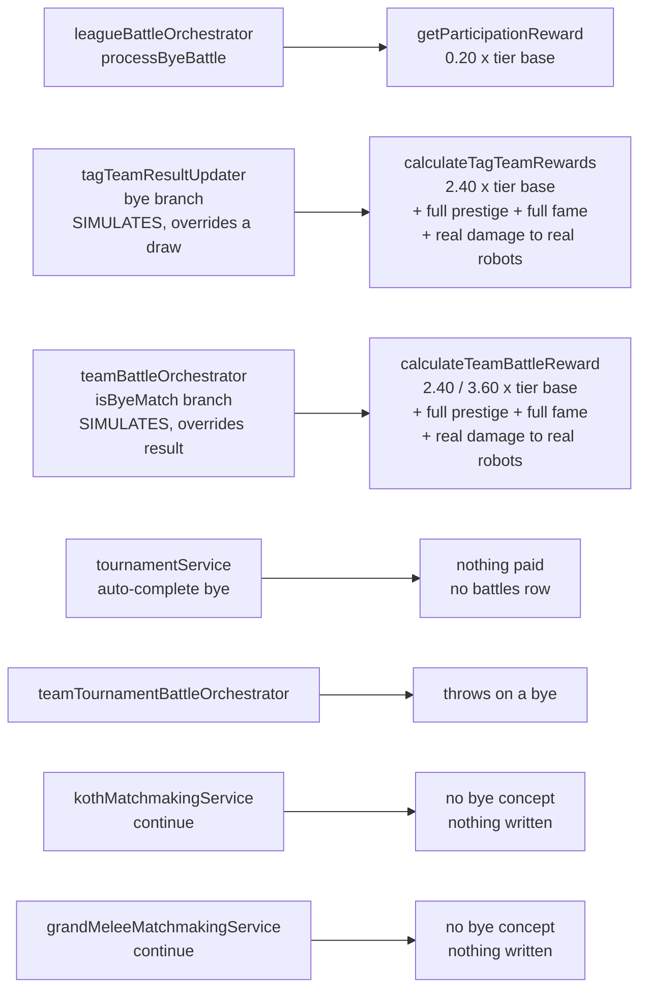
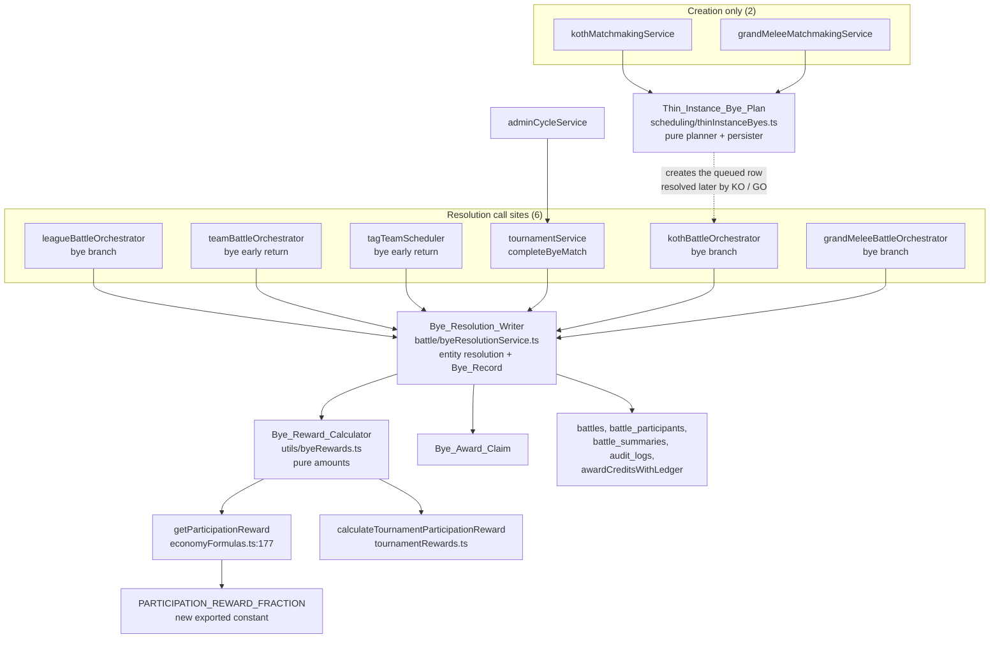

# Design Document

## Overview

This spec replaces five independent bye implementations with one declaration of what a Bye_Event pays and one writer that produces the Bye_Record. It also creates Bye_Events where none exist today — the three Tournament_Modes and the two Placement_Modes — and fixes two duplicate-declaration defects found in the audit.

The design splits the Bye_Reward_Module into two artefacts, because Requirement 1 and Requirement 5 ask for different things with different testability:

| Artefact | File | Responsibility | Requirement |
|---|---|---|---|
| Bye_Reward_Calculator | `app/backend/src/utils/byeRewards.ts` | Pure. Given a mode and its context, return the four reward amounts, the LP delta and the `teamSize`. No Prisma, no I/O. | Requirement 1, Requirement 2, Requirement 3, Requirement 4 criteria 1–3 and 5–7 |
| Bye_Resolution_Writer | `app/backend/src/services/battle/byeResolutionService.ts` | Impure. Given a calculated reward and a queued-match identity, claim the award, write the Bye_Record, pay the credits. Simulates nothing and creates the `battles` row for all nine modes. | Requirement 4 criteria 4 and 8, Requirement 5, Requirement 7 criterion 6, Requirement 12 criteria 8, 9 and 12 |

Together they are the Bye_Reward_Module. The split is the whole reason the correctness properties below are executable: a pure calculator can be quantified over nine modes and six tiers in 100 iterations with no fixture, while a writer needs a seeded Postgres and belongs in integration tests. Keeping them in one module would force every arithmetic assertion through a database.

Six call sites invoke the writer, one per orchestrator, and each supplies only the identity of the queued match — the module owns entity resolution, so no orchestrator holds bye logic and no adapter is duplicated between them (§ Components 11.1). Nothing else in the Backend declares a bye reward amount, and nothing else writes a Bye_Record. The one exception is not a Bye_Event at all: the both-slots-empty bracket row in `advanceWinnersToNextRound`, which is housekeeping with no participant to pay.

That uniformity is a consequence of Requirement 12. While team league and tag team byes still simulated combat, they had to write their records through the normal battle path, and the writer had to accept a battle row born elsewhere. Removing Bye_Combat_Simulation removes both compromises.

Two smaller surfaces sit alongside that core, both consequences of it rather than separate features. Creating a new event type obliges the Admin_Cycle_Surface to count it, or the spec's own new behaviour is invisible where operators watch cycles (§ Components 8). And changing what a bye pays obliges the Player_Guide to stop saying otherwise, in six places including one article whose whole argument is that byes pay nothing (§ Components 9).

### Verified against source

Every file path, line number, constant and control-flow claim below was read from the working tree rather than carried forward from `analysis.md`. Two of the audit's citations had drifted and are corrected here:

- The streaming-revenue bye early return is `if (isByeMatch) return null;` at **`battlePostCombat.ts:80`**, not 81.
- `GRAND_MELEE_LP_SCALE`'s declaration opens at **`grandMeleeRewards.ts:23`** (the JSDoc is on 22), not 22.

Everything else the audit reported was confirmed as written: `getParticipationReward` at `economyFormulas.ts:177` with the bare `* 0.2` at 178; the `processByeBattle` early return at `leagueBattleOrchestrator.ts:657`, with `computeBattleSummary` at 534 (inside `createBattleRecord`) and the two `logBattleAuditEvent` calls at 745 and 766, both after it; `teamTournamentBattleOrchestrator.ts:737-744` multiplying by `teamSize` twice on both arms; `GRAND_MELEE_POINT_SCALE` at `standingsService.ts:344`; `MIN_GROUP_SIZE = 5` / `IDEAL_GROUP_SIZE = 6` at `kothMatchmakingService.ts:42-43` and `MIN_GROUP_SIZE = 8` / `IDEAL_GROUP_SIZE = 20` at `grandMeleeMatchmakingService.ts:42-43`; and both `continue` statements at line 358 of their respective matchmakers, preceding `schedulingService.createMatch` at 381.

One additional bye call site the requirements do not name was found and is covered: `adminCycleService.ts:120` auto-completes bracket byes with the same three-column update `tournamentService` uses, making it a fourth site that must route through the new helper. See Requirements Traceability.

## Glossary Additions

These are new concepts the design introduces. They follow the same `Pascal_Snake` register as `requirements.md`, and no term from `requirements.md` is renamed.

- **Bye_Reward_Calculator**: The pure half of the Bye_Reward_Module. `resolveByeReward` in `app/backend/src/utils/byeRewards.ts`. Declares the amounts; writes nothing.
- **Bye_Resolution_Writer**: The impure half of the Bye_Reward_Module. `resolveByeEvent` in `app/backend/src/services/battle/byeResolutionService.ts`. Writes the Bye_Record; declares no amounts.
- **Bye_Mode_Table**: The exhaustive `Record<ByeMode, ByeModeSpec>` in the Bye_Reward_Calculator that maps each of the nine mode identifiers to its Participation_Floor kind, its `teamSize` and its LP delta. The construct that makes a tenth mode fail to compile.
- **Bye_Award_Claim**: The single conditional row transition a Bye_Event must win before any credits are paid. For the six modes queued in `scheduled_matches_v2` the claimed column is `status`; for the three Tournament_Modes it is `scheduled_tournament_matches.battleId`. The mechanism behind Requirement 7 criterion 6.
- **Thin_Instance_Bye_Plan**: The pure list of Bye_Events a Placement_Matchmaker will create for one Thin_Instance — one entry per eligible robot. Separating the plan from its persistence is what makes Requirement 6 criteria 1–4 property-testable without a database.

## Architecture

### Before

Five bye paths, no shared declaration, four different answers.



### After

One entry point, six call sites, no simulation on any of them. Callers supply the identity of the queued match and nothing else; the writer resolves the entity, asks the calculator for the amounts, and produces the Bye_Record.



Three things the diagram is deliberately showing, because earlier drafts of this design got each of them wrong:

- **`tagTeamScheduler`, not `tagTeamResultUpdater`.** Detection moves above the simulation, so the updater is never reached for a bye and its bye branch is deleted (§ Components 11.2).
- **`teamTournamentBattleOrchestrator` is absent.** It throws on a bye and filters byes out of its round query, so it never resolved one; team tournament byes resolve in `completeByeMatch`.
- **No caller reaches the calculator.** Callers call the writer only. Six arrows into `W`, one into `CALC`.

### Two arms of one principle

The Participation_Floor resolves through one of two arms, selected by the Bye_Mode_Table's `floor` field. Both arms carry exactly one `× teamSize` factor, which is why the same property shape holds on both sides:

| Arm | Modes | Floor source | Total paid |
|---|---|---|---|
| `tier_scaled` | `league_1v1`, `tag_team`, `league_2v2`, `league_3v3`, `koth`, `grand_melee` | `getParticipationReward(tier)` | Scaled_Participation_Reward = floor × `teamSize` |
| `tournament_round_loss` | `tournament_1v1`, `tournament_2v2`, `tournament_3v3` | `calculateTournamentParticipationReward(totalParticipants, currentRound, maxRounds)` | Tournament_Round_Loss_Reward × `teamSize` |

The tournament arm has no tier because tournament credits are not tier-scaled — `BASE_CREDIT_REWARD = 20000` × size multiplier × round progress, confirmed in `tournamentRewards.ts`. That is the one asymmetry, and it is in the requirements by decision, not by omission.

## Components and Interfaces

### 1. The Bye_Reward_Calculator

#### Where it lives, and why not `app/shared/utils/`

The coding-standards steering file requires formulas shared between Frontend and Backend to live in `app/shared/utils/`. Two options were weighed:

- **Option A — `app/shared/utils/byeRewards.ts`.** Follows the shared-formula rule literally. Cost: the calculator must call `getParticipationReward` (`app/backend/src/utils/economyFormulas.ts`) and `calculateTournamentParticipationReward` (`app/backend/src/utils/tournamentRewards.ts`), and Requirement 1 criterion 3 forbids restating either. So Option A drags both modules into `app/shared/utils/`. `economyFormulas.ts` is imported across the whole Backend; moving it is a large, unrelated change with real regression surface, and it is not what this spec is for.
- **Option B — `app/backend/src/utils/byeRewards.ts`, alongside `economyFormulas.ts` and `tournamentRewards.ts`.**

**Chosen: Option B.** The shared-formula rule exists to stop two implementations of one number drifting apart, and here there is no second implementation to keep in sync. Spec 50's own audit settles it: `getBattleReward` in `app/frontend/src/utils/matchmakingApi.ts` sums the persisted `participants[].credits` from the API — it does not recompute a reward formula, and Spec 50 explicitly records that no API change is needed. No Frontend code predicts a bye reward, so nothing outside the Backend needs the arithmetic.

The module header records the condition that would flip this decision, so the next reader does not have to re-derive it:

```ts
/**
 * Bye_Reward_Calculator — the single declaration of what a Bye_Event pays.
 *
 * Backend-only by decision (Spec #49). The shared-formula rule in
 * .kiro/steering/coding-standards.md applies to formulas the Frontend also
 * evaluates; the Frontend reads persisted `battle_participants.credits`
 * (Spec #50) and never computes a bye reward.
 *
 * MOVE THIS TO app/shared/utils/ if a Frontend surface ever needs to *predict*
 * a bye reward before the bye resolves. That move must also relocate
 * getParticipationReward and calculateTournamentParticipationReward, because
 * this module must never restate either formula (R1.3).
 */
```

#### Types and exhaustiveness

Requirement 1 criterion 6 demands that adding a tenth mode without a bye reward fails to compile. Two TypeScript constructs achieve that:

- **A discriminated `switch` with a `never` exhaustiveness check.** Works, but the failure is a type error inside a function body, and it only fires if every call path reaches the default arm.
- **An exhaustive `Record<ByeMode, ByeModeSpec>` object literal.** Adding a member to `ByeMode` immediately fails with `Property 'x' is missing in type ...`, at the declaration, with no execution required.

**Chosen: the exhaustive `Record`.** It is also the construct this codebase already uses for exactly this purpose — `EVENT_SCHEDULE_SCOPES: Record<SubscribableEventType, EventScheduleScope>` in `app/backend/src/services/scheduling/eventScheduleScope.ts`, whose header comment says "adding a tenth event mode fails to compile until its schedule source is declared". Reusing an established pattern beats introducing a second one.

```ts
// app/backend/src/utils/byeRewards.ts

import {
  getParticipationReward,
  PARTICIPATION_REWARD_FRACTION,
} from './economyFormulas';
import { calculateTournamentParticipationReward } from './tournamentRewards';

/** The six modes whose bye pays a fraction of a tier base. */
export type TierScaledByeMode =
  | 'league_1v1' | 'tag_team' | 'league_2v2' | 'league_3v3'
  | 'koth' | 'grand_melee';

/** The three modes whose bye pays a flat round loss reward. */
export type TournamentByeMode =
  | 'tournament_1v1' | 'tournament_2v2' | 'tournament_3v3';

/** All nine modes that can produce a Bye_Event. */
export type ByeMode = TierScaledByeMode | TournamentByeMode;

interface ByeModeSpec {
  /** Which Participation_Floor arm this mode reads. */
  floor: 'tier_scaled' | 'tournament_round_loss';
  /** Robots on the real side. The only multiplier applied to the floor. */
  teamSize: 1 | 2 | 3;
  /** LP delta a bye in this mode applies. Unchanged from today (R4.5-R4.7). */
  lpDelta: number;
}

/**
 * Bye_Mode_Table — exhaustive by construction. A tenth member of ByeMode
 * fails to compile here until its bye reward is declared (R1.6).
 */
export const BYE_MODE_SPECS: Record<ByeMode, ByeModeSpec> = {
  league_1v1:     { floor: 'tier_scaled',           teamSize: 1, lpDelta: 3 },
  tag_team:       { floor: 'tier_scaled',           teamSize: 2, lpDelta: 3 },
  league_2v2:     { floor: 'tier_scaled',           teamSize: 2, lpDelta: 3 },
  league_3v3:     { floor: 'tier_scaled',           teamSize: 3, lpDelta: 3 },
  koth:           { floor: 'tier_scaled',           teamSize: 1, lpDelta: 0 },
  grand_melee:    { floor: 'tier_scaled',           teamSize: 1, lpDelta: 0 },
  tournament_1v1: { floor: 'tournament_round_loss', teamSize: 1, lpDelta: 0 },
  tournament_2v2: { floor: 'tournament_round_loss', teamSize: 2, lpDelta: 0 },
  tournament_3v3: { floor: 'tournament_round_loss', teamSize: 3, lpDelta: 0 },
};

/** Every mode identifier, for iteration in tests and callers. */
export const BYE_MODES = Object.keys(BYE_MODE_SPECS) as ByeMode[];

/**
 * Input is a discriminated union so a Tournament_Mode bye cannot be
 * constructed without round context, and a Tier_Scaled_Mode bye cannot be
 * constructed without a tier.
 */
export type ByeRewardInput =
  | { mode: TierScaledByeMode; tier: string }
  | {
      mode: TournamentByeMode;
      totalParticipants: number;
      currentRound: number;
      maxRounds: number;
    };

export interface ByeReward {
  /** Total credits paid to the stable. Always > 0 (R2.4). */
  credits: number;
  /** Always 0 (R4.1). */
  prestige: 0;
  /** Always 0 (R4.2). */
  fame: 0;
  /** Always 0 (R4.3). */
  streamingRevenue: 0;
  /** LP delta to apply. 0 for Placement_Modes and Tournament_Modes. */
  lpDelta: number;
  /** Robots on the real side. The × factor already folded into `credits`. */
  teamSize: 1 | 2 | 3;
  /** Per-robot floor before the teamSize factor — for logs and assertions. */
  perRobotCredits: number;
}

export function resolveByeReward(input: ByeRewardInput): ByeReward;

/**
 * Per-robot split. Delegates to the existing distributeTeamCredits rule
 * (R3.6) so there is one remainder rule in the Backend, not two.
 */
export function distributeByeCredits(
  totalCredits: number,
  robotIds: number[],
): Array<{ robotId: number; credits: number }>;
```

`resolveByeReward` body, in one sentence: look up `BYE_MODE_SPECS[input.mode]`, compute `perRobotCredits` from the arm (`getParticipationReward(input.tier)` or `calculateTournamentParticipationReward(...)`), and return `credits: perRobotCredits * spec.teamSize` with the three zeros and the table's `lpDelta`. No arithmetic is restated: the two floors come from the two existing functions, satisfying Requirement 1 criterion 3 by construction.

#### `PARTICIPATION_REWARD_FRACTION`

Requirement 1 criterion 4. In `app/backend/src/utils/economyFormulas.ts`:

```ts
// Before, line 177-179
export function getParticipationReward(league: string): number {
  return Math.round(getLeagueWinReward(league) * 0.2);
}

// After
/** Participation_Reward_Fraction — the share of a tier win reward a participation reward pays. */
export const PARTICIPATION_REWARD_FRACTION = 0.2;

export function getParticipationReward(league: string): number {
  return Math.round(getLeagueWinReward(league) * PARTICIPATION_REWARD_FRACTION);
}
```

`economyCalculations.ts` re-exports `getParticipationReward` at line 26 for backward compatibility; `PARTICIPATION_REWARD_FRACTION` is added to that same re-export block so existing importers of `economyCalculations` can reach it without a second import path.

#### Reusing the remainder rule

`distributeTeamCredits` in `app/backend/src/services/team-battle/teamBattleRewardService.ts:99` already implements the exact rule Requirement 3 criterion 6 asks for — equal floor share, remainder handed out one credit at a time, sum exact. Its parameter is typed `TeamBattleParticipantResult[]`, but the body reads only `p.robotId` and `participants.length`. The signature is **widened** to `Array<{ robotId: number }>`, which breaks no existing call site and lets the Bye_Reward_Calculator call it directly rather than re-deriving the rule.

Its JSDoc currently describes destroyed-robot special cases ("Destroyed robots with damageDealt = 0 get 0 credits") that the implementation does not perform — it is a plain equal split. The comment is corrected in the same task, because leaving a stale contract next to a widened signature invites the next reader to trust the wrong one.

### 2. The Bye_Resolution_Writer

```ts
// app/backend/src/services/battle/byeResolutionService.ts

/** Bye_Award_Claim — the token a Bye_Event must win before credits are paid. */
export type ByeAwardClaim =
  | { source: 'scheduled_match'; scheduledMatchId: number }
  | { source: 'tournament_match'; tournamentMatchId: number };

export interface ByeResolutionInput {
  mode: ByeMode;
  reward: ByeReward;
  claim: ByeAwardClaim;
  /** Real participating robots. Never a placeholder from createByeRobot (R5.2). */
  robotIds: number[];
  /** The stable paid the credits. Owner of the robot or the team. */
  stableUserId: number;
  /** Columns for the battles row. leagueType is non-nullable in the schema. */
  battle: {
    battleType: string;
    leagueType: string;
    leagueInstanceId?: string | null;
    tournamentId?: number | null;
    tournamentRound?: number | null;
    winnerId: number | null;
    winningSide: number | null;
    /** Human-readable line for battleLog.events[0].message. */
    byeMessage: string;
  };
  /** Standing writes, when the mode has any. Absent for Placement and Tournament. */
  standing?: {
    entityType: 'robot' | 'team';
    entityId: number;
    mode: StandingsMode;
  };
  /** Robot name → maxHP, for computeBattleSummary. */
  robotMaxHP: Record<string, number>;
  robotNameToId: Record<string, number>;
  cycleNumber: number;
}

export interface ByeResolutionResult {
  battleId: number | null;
  creditsPaid: number;
  /** True when the Bye_Award_Claim was already taken — nothing was paid. */
  alreadyResolved: boolean;
}

export async function resolveByeEvent(
  input: ByeResolutionInput,
): Promise<ByeResolutionResult>;
```

There is no `existingBattleId` field, and that is the point of Requirement 12 criterion 12. An earlier version of this design gave the writer one so that `tagTeamResultUpdater` could hand it a row created upstream by `createTagTeamBattleRecord`. With Bye_Combat_Simulation removed, the tag team bye path no longer runs the battle-record path at all, so the row is born in the writer for all nine modes and the hatch has nothing left to accommodate.

Fixed duration for every bye, replacing `leagueBattleOrchestrator`'s local literal:

```ts
/** Bye battles have a nominal duration; there is no combat to time. */
export const BYE_BATTLE_DURATION_SECONDS = 15;
```

15 rather than 0 keeps `league_1v1` byes numerically identical to today (`BYE_BATTLE_DURATION = 15` at `leagueBattleOrchestrator.ts:59`) and avoids a zero denominator in any downstream per-second rate. `battle_summaries.battleDuration` carries the same value for all nine modes.

#### Ordered steps

1. Create the `battles` row.
2. **Claim** — the conditional transition described in section 5. If the claim is lost, delete the just-created `battles` row and return `{ alreadyResolved: true, creditsPaid: 0 }`.
3. Write one `battle_participants` row per real robot: credits from `distributeByeCredits`, `prestigeAwarded: 0`, `fameAwarded: 0`, `damageDealt: 0`, `yielded: false`, `destroyed: false`, and `finalHP` equal to the robot's existing `currentHP` (Requirement 12 criterion 8). `eloAfter` reflects the mode's `updatesElo` flag — for the four league modes ELO moves, so `eloBefore !== eloAfter`; for the three Tournament_Modes and both Placement_Modes `updatesElo` is `false` and `eloBefore === eloAfter` (Requirement 12 criteria 10 and 11). An earlier version of this step asserted `eloBefore === eloAfter` unconditionally, which contradicted league byes keeping their ELO gain.
4. Write the `battle_summaries` row via `computeBattleSummary`, wrapped in `.catch()` — a failure logs and continues (Requirement 5 criterion 8).
5. `standingsService.recordBattleResult` when the Bye_Mode_Table's `standingMode` is non-null, which it is for the four league modes only. `null` for Placement_Modes and Tournament_Modes, which is how Requirement 4 criteria 6 through 8 are satisfied: no call means no LP row, no `totalMatches` and no `bestPlacement`. `updateRobotCombatStats` is called only when `updatesElo` is true — the four league modes — and is passed the robot's existing `currentHP`, never a simulated `finalHP`, so ELO moves and HP does not (Requirement 12 criteria 3, 4, 10 and 11).
6. `awardCreditsWithLedger(stableUserId, reward.credits, 'battle_income', cycleNumber, ...)` (Requirement 5 criterion 5).
7. One `logBattleAuditEvent` per real robot with `isByeMatch: true` and that robot's credits, wrapped in try/catch per the existing convention.

`awardCreditsWithLedger` at `battlePostCombat.ts:389` uses the module-level `prisma` client and takes no transaction client, so steps 3–7 cannot be wrapped in a single `$transaction` without either rewriting that function or running a write on a second connection inside a transaction boundary. Neither is in scope. The claim-first ordering is what makes that acceptable: see the failure-mode analysis in section 5.

### 3. Call site changes, mode by mode

#### 3.1 `league_1v1` — `leagueBattleOrchestrator.processByeBattle`

The audit's diagnosis is confirmed. `processBattle` detects the bye at line 655 and returns `processByeBattle(scheduledMatch)` at 657. `computeBattleSummary` lives at line 534, inside `createBattleRecord`, which only the normal path calls. The two `logBattleAuditEvent` calls are at 745 and 766, after the early return. So a `league_1v1` bye writes a `battles` row and a `battle_participants` row and then stops — no `battle_summaries` row, no `audit_logs` row. That is exactly the gap Requirement 5 criteria 3 and 4 name.

The fix does not merge the bye path into the normal path. Merging would mean threading `isByeMatch` through `simulateBattleWrapper`, `createBattleRecord` and `updateRobotStats`, each of which already carries an `isByeMatch` parameter used only to zero things out — five more conditionals in the hot path to avoid one function. Instead `processByeBattle` **keeps its early return and delegates its body** to the Bye_Reward_Module, which is where the summary and audit writes now live for all nine modes. One writer, one place the Bye_Record is produced, and the normal path is untouched.

Lines 186–312 (`processByeBattle`) are replaced. Deleted: the `getParticipationReward` call at 209, the `prisma.battle.create` at 212, the `prisma.battleParticipant.create` at 238, the `standingsService.recordBattleResult` at 273, the `getCurrentCycleNumber` + `awardCreditsWithLedger` pair at 285–293, and the `prisma.scheduledMatch.update` at 296. The `getParticipationReward` import at line 10 is dropped if no other reference remains in the file — `createBattleRecord` at 349 still uses it for the fought path, so the import stays.

Retained: the real-robot resolution at 188, the `robot` lookup and its `BattleError`, and the ELO computation. **The ELO write stays** — `league_1v1` byes update `robots.elo` today via `updateRobotCombatStats`, and nothing in the requirements changes that. Requirement 4 criterion 8 freezes ELO for Placement_Modes only.

New body:

```ts
async function processByeBattle(scheduledMatch: ScheduledLeagueMatchData) {
  const realRobotId = scheduledMatch.robot1Id < 0 ? scheduledMatch.robot2Id : scheduledMatch.robot1Id;
  const robot = await prisma.robot.findUnique({ where: { id: realRobotId } });
  if (!robot) throw new BattleError(/* unchanged */);

  const eloChanges = calculateELOChange(robot.elo, 1000, false);
  const newElo = robot.elo + eloChanges.winnerChange;

  const reward = resolveByeReward({ mode: 'league_1v1', tier: scheduledMatch.leagueType });

  const resolution = await resolveByeEvent({
    mode: 'league_1v1',
    reward,
    claim: { source: 'scheduled_match', scheduledMatchId: scheduledMatch.id },
    robotIds: [robot.id],
    stableUserId: robot.userId,
    battle: {
      battleType: 'league_1v1',
      leagueType: scheduledMatch.leagueType,
      leagueInstanceId: scheduledMatch.leagueInstanceId,
      winnerId: robot.id,
      winningSide: null,
      byeMessage: `${robot.name} wins by walkover (bye)`,
    },
    standing: { entityType: 'robot', entityId: robot.id, mode: 'league_1v1' },
    robotMaxHP: { [robot.name]: robot.maxHP },
    robotNameToId: { [robot.name]: robot.id },
    cycleNumber: await getCurrentCycleNumber(),
  });

  if (!resolution.alreadyResolved) {
    await updateRobotCombatStats({ /* unchanged, newELO: newElo */ });
  }

  return { battleId: resolution.battleId ?? 0, /* unchanged shape */ };
}
```

Resulting control flow: `processBattle` → bye detected at 655 → `processByeBattle` → calculator → writer → all five Bye_Record artefacts. The summary and audit gaps close because the writer produces them, not because the early return moved.

#### 3.2 `tag_team` — `tagTeamScheduler`

**The bye is detected in the scheduler, and `tagTeamResultUpdater` stops being a bye path entirely.** An earlier version of this design rewrote the updater's bye branch, stripping `calculateTagTeamRewards`, `calculateTagTeamPrestige`, both `calculateTagTeamFame` calls, the `awardPrestigeToUser` call, the `Math.floor(realTeamRewards / 2)` credit split and the two `battleParticipant.updateMany` calls. Requirement 12 makes that rewrite unnecessary: the branch becomes unreachable and is deleted whole (§ Components 11.2).

`tagTeamScheduler` today builds a Bye_Placeholder team with `createByeTeamForBattle()` at line 106, calls `simulateTagTeamBattle`, corrects a drawn result to a win at line 175, writes the battle record via `createTagTeamBattleRecord` at line 191, and only then calls `updateTagTeamBattleResults`. Under Walkover_Resolution the detection moves to the top of that flow — `match.team2Id === null` calls `resolveByeEvent` and returns before line 106 is reached.

Consequences, all of them deletions rather than rewrites:

- `createByeTeamForBattle` is unreachable, so `tagTeamByeTeam.ts` is deleted in full.
- `simulateTagTeamBattle` is never called for a bye (Requirement 12 criterion 1).
- The draw override at line 175 is deleted rather than kept correct — with no simulation there is no draw to correct (Requirement 12 criterion 7).
- `createTagTeamBattleRecord` is not reached for a bye, so the `battles` row is born in the writer like every other mode (Requirement 12 criterion 12). It is retained for fought tag team battles.
- `updateTagTeamBattleResults` is not reached for a bye, so its bye branch goes.

Retained, and now computed inside the bye module rather than the updater: the ELO delta against the 2000 combined bye-team ELO and the `standingsService.recordBattleResult` LP +3, both unchanged from today (Requirement 12 criterion 10). HP is not written at all, so it cannot move (Requirement 12 criteria 3 and 4).

The audit rows Requirement 5 criterion 4 asks for come from the writer, which is what closes the `tag_team` gap — the existing audit block sat after the updater's bye branch `return;` and was never reachable from it.

#### 3.3 `league_2v2` and `league_3v3` — `teamBattleOrchestrator`

**This section replaced an earlier design that kept the team league path as an exception.** That earlier version let `executeSingleTeamBattle` run the whole normal path for a bye — simulating a real battle against Bye_Placeholders and overriding the result — on the grounds that it already wrote a nearly complete Bye_Record and only the amounts were wrong. That was wrong on the facts. The simulation deals real damage, so the path was not merely redundant, it was charging players for repairs on a battle nobody fought. Requirement 12 removes it, and this path becomes the same shape as every other.

#### What the current path does, and why it cannot stay

`executeSingleTeamBattle` fabricates `teamSize` Bye_Placeholders at line 232, runs `simulateTeamBattle` unconditionally at line 253, then overrides `winningSide: 1` and `isByeMatch: true` at line 257. The override exists because the simulation might otherwise have produced a loss or a draw for the real team.

The damage is not incidental. A Bye_Placeholder has `mainWeaponId: null`, so `getWeaponInfo` returns the Fists_Fallback at 10 base damage, and in `simulationLoop.ts` the guard `if (!weaponLike || canAttack(weaponLike, dist) || forceAttack)` is satisfied by `!weaponLike` — an unarmed attacker skips the range check entirely and swings every cooldown for the whole battle. Two placeholders for a 2v2, three for a 3v3. Line 497 then persists the outcome: `updateRobotCombatStats({ finalHP: Math.round(participant?.finalHP ?? robot.currentHP) })`. That HP is what the Repair_Quote reads.

Worth recording because it is the same lesson as Spec #48: `byeRobot.ts`'s own docstring states that the negative ids are "a sentinel that orchestrators use to detect bye matches and **skip full simulation / stat updates**". The factory documented the correct invariant, two of its consumers did the opposite, and nothing enforced it.

#### The new shape

`executeSingleTeamBattle` detects `match.team2Id === null` at the top and returns through the Bye_Reward_Module, before `loadTeamRobotsWithWeapons` for team 2, before `createByeRobot`, and before `simulateTeamBattle` (Requirement 12 criterion 2). Deleted: the placeholder fabrication at 232, the simulation at 253 for the bye case, the override block at 257, and the bye branch's use of `calculateTeamBattleReward`, `calculateTeamBattleFame` and `calculateTeamBattlePrestige`. Retained for the bye: the team 1 ELO computation against `getByeTeamELO(teamSize)` and the team 1 `standingsService.recordBattleResult`, both unchanged from today.

The conditional-reward sketch in the earlier version of this design — `const byeReward = isByeMatch ? resolveByeReward(...) : null` threaded through the normal path — is gone with it. Branching a shared path on `isByeMatch` at four separate points was the shape that let the damage survive unnoticed in the first place; an early return cannot.

`distributeTeamCredits` is still the per-robot split, now called by the writer rather than by this path, so Requirement 3 criteria 5 and 6 hold through the same function. The `battles` row moves from the normal path's `$transaction` into the writer, which is what makes Requirement 12 criterion 12's single birthplace true.

#### Consequences to accept deliberately

- **A team bye's `battle_summaries` row changes shape.** Today it carries real combat events and `hasData: true`; after, it carries none and `hasData: false`, like every other bye. The Playback tab stops working for team byes. That is correct — there was never combat to play back — and it is what makes Requirement 5's "every bye leaves the same trail" true rather than nearly true (Requirement 12 criterion 9).
- **Team bye repair spend drops to zero.** See § Migration and Balance-Change Consequences; this one is a defect fix, not a balance change.
- **`createByeRobot` and the team Bye_Placeholder factories lose their only combat consumer.** They remain needed as scheduling sentinels — see § Components 10.

Inside the `prisma.$transaction` block, replace:

```ts
// Before
const team1Reward = calculateTeamBattleReward(match.teamBattleLeague, teamSize, team1Won, isDraw);
// ...
const fame = calculateTeamBattleFame(match.teamBattleLeague);
const team1Prestige = calculateTeamBattlePrestige(match.teamBattleLeague, team1Won, isDraw);

// After
const byeReward = isByeMatch
  ? resolveByeReward({
      mode: teamSize === 2 ? 'league_2v2' : 'league_3v3',
      tier: match.teamBattleLeague,
    })
  : null;
const team1Reward = byeReward
  ? byeReward.credits
  : calculateTeamBattleReward(match.teamBattleLeague, teamSize, team1Won, isDraw);
const fame = byeReward ? 0 : calculateTeamBattleFame(match.teamBattleLeague);
const team1Prestige = byeReward
  ? 0
  : calculateTeamBattlePrestige(match.teamBattleLeague, team1Won, isDraw);
```

The normal path's `team2Reward` and `team2Prestige` awards, already guarded by `if (!isByeMatch && match.team2)`, become dead for the bye case because the bye never reaches them. Those guards can stay — they still document that team 2 may be absent — but nothing in the bye flow depends on them any more.

The `Bye_Award_Claim` replaces the unconditional `tx.scheduledMatch.update({ where: { id: match.id }, data: { status: 'completed' } })` for the bye case, as it does for every other unified mode.

**This path now calls both halves of the Bye_Reward_Module, like the other six.** The earlier design had it call the calculator only, which was the last remaining asymmetry in the resolution shape; removing the simulation removes the reason for it.

#### 3.4 `tournament_1v1` — `tournamentService`

Bracket byes are auto-completed in three places, all performing the same `status: 'completed'` + `winnerId` + `isByeMatch: true` update:

| Site | Case |
|---|---|
| `tournamentService.ts` ~289-300, inside `createSingleEliminationTournament` | Round-1 byes |
| `tournamentService.ts` ~838-870, inside `advanceWinnersToNextRound` | Later-round byes, reverse byes, and both-slots-empty |
| `adminCycleService.ts` ~118-124 | The admin bulk-cycle path's own copy |

All three are replaced by calls to one new exported helper in `tournamentService`:

```ts
/**
 * Complete a bracket bye: advance the participant and pay the
 * Tournament_Round_Loss_Reward through the Bye_Reward_Module (R2.5, R5.6).
 *
 * Bracket advancement is unchanged — the same status, winnerId and
 * completedAt writes happen in the same order they always did.
 */
export async function completeByeMatch(
  match: ScheduledTournamentMatch,
  tournament: Tournament,
  advancingParticipantId: number | null,
): Promise<void>;
```

`completeByeMatch` does the existing update first, then resolves the Bye_Event. When `advancingParticipantId` is `null` — the both-slots-empty case at ~860 — it performs the existing update and **pays nothing**, because there is no participant to pay. That case is a bracket housekeeping row, not a Bye_Event, and it has no Subscription behind it.

#### 3.5 `tournament_2v2` and `tournament_3v3` — `teamTournamentBattleOrchestrator`

`processTeamTournamentBattle` throws `INVALID_MATCH_STATE` on a bye at line ~136-143, and `executeTeamTournamentRound` filters byes out of its query with `isByeMatch: false` at line ~504. Both stay exactly as they are: a bye is still not a battle to be fought.

Team tournament bye resolution happens in `completeByeMatch`, the same helper as `tournament_1v1`. It branches on `tournament.participantType` to pick the mode identifier (`team_2v2` → `tournament_2v2`, `team_3v3` → `tournament_3v3`) and to expand the advancing team id into its member robot ids for the `battle_participants` rows.

### 4. Tournament bye rows — the largest new surface

Today a tournament bye creates no `battles` row at all, which is why no tournament bye is visible anywhere. Requirement 5 criterion 6 requires the same rows with the same columns populated as a Tier_Scaled_Mode bye.

#### The `battles` row

| Column | Value | Reason |
|---|---|---|
| `battleType` | `'tournament_1v1'`, `'tournament_2v2'`, `'tournament_3v3'` | Matches the fought-battle convention, verified at `tournamentBattleOrchestrator.ts:457` and `teamTournamentBattleOrchestrator.ts` (`battleType` derived from `participantType`) |
| `leagueType` | `'tournament'` | Non-nullable column; the literal both tournament orchestrators already use |
| `leagueInstanceId` | `null` | Tournaments have no league instance |
| `tournamentId`, `tournamentRound` | The bracket's values | Same as a fought tournament battle |
| `durationSeconds` | `BYE_BATTLE_DURATION_SECONDS` (15) | One constant for all nine modes |
| `winnerReward` | `reward.credits` | The owner total |
| `loserReward` | `0` | There is no losing side |
| `winnerId` | The advancing participant id — robot id for 1v1, team id for 2v2/3v3 | See below |
| `winningSide` | `1` for the two team modes, `null` for 1v1 | Matches each mode's fought-row convention (`teamTournamentBattleOrchestrator` sets `winningSide`; the 1v1 orchestrator leaves it null) |

**`winnerId` is set, and that is deliberate.** A bracket bye is the one bye where the participant genuinely does gain something real — advancement — and `scheduled_tournament_matches.winnerId` is already set to the advancing participant today. Setting `battles.winnerId` to the same id keeps `@@index([winnerId])` queries and bracket joins consistent between bye and fought rows. It costs nothing in reward terms because Requirement 4 criterion 6 keeps tournament byes out of Standing entirely, so there is no win counter, streak or LP for a `winnerId` to inflate. The alternative — `null`, mirroring a draw — would make a bye indistinguishable from a tournament draw, which tournaments do not have.

#### `battleLog`

```ts
{
  events: [{ timestamp: 0, type: 'bye_match', message: input.battle.byeMessage }],
  isByeMatch: true,                 // R5.1, and what Spec 50's card reads
  detailedCombatEvents: [],
  isTournament: true,
  round: tournament.currentRound,
  maxRounds: tournament.maxRounds,
  isFinals: tournament.currentRound === tournament.maxRounds,
}
```

The four tournament keys mirror `buildTeamTournamentBattleLog`'s return shape so a consumer reading a bye row and a fought row finds the same keys in the same places. Nothing reads `battleLog` for permanent data — the Battle Data Architecture rule holds, `battle_log` is NULLed after seven days, and the permanent record is `battle_summaries` plus the proper columns.

#### The opponent side

There is none. A bracket bye has an *empty slot*, not a placeholder — unlike the odd-entity walkover, where `createByeRobot` fabricates a negative-id robot. So:

- `battle_participants`: exactly `teamSize` rows, all `team: 1`. One row for the single robot in `tournament_1v1`; two or three rows for the team's members in `tournament_2v2`/`tournament_3v3`. No row for an opponent, and no negative `robotId` — which the `robot Robot @relation` foreign key on `battle_participants` would reject anyway.
- `eloBefore === eloAfter` on every row. There is no opponent to rate against, and tournament byes do not touch ELO today.
- `credits` from `distributeByeCredits(reward.credits, robotIds)`. For `tournament_3v3` that is `calculateTournamentParticipationReward(...) × 3` split three ways, so each row carries the un-multiplied round loss reward and the three sum exactly to the owner award (Requirement 3 criterion 5).

#### `computeBattleSummary` with no combat

Verified by reading `computeBattleSummary` (`battleSummaryComputer.ts`) and `computeBattleStatistics` (`app/shared/utils/battleStatistics.ts:474`). With `events: []`:

- `perRobot: []`, `perTeam: []` or `null`, `damageFlows: []`
- `totalEvents: 0` — it is `events.length`
- `hasData: false` — it is `hasAttackEvents`, and there are no attack events
- `participants: []` — derived by mapping `statistics.perRobot`
- `battleDuration: 15`

The function never throws; it returns `null` only on an internal exception. So a bye gets a real `battle_summaries` row whose `hasData: false` is a truthful, queryable marker that no combat occurred. That flag is more useful to Spec 50 than a missing row would be, and it is the same shape a `league_1v1` bye will now produce.

`participants: []` is a known consequence: the survival summary is derived from combat events, and a bye has none. The per-robot record of who took part is `battle_participants`, which is populated. This is stated rather than papered over.

#### Reconciling Requirement 5 criterion 6 with "a bracket bye has no tier"

Criterion 6 requires the same rows with the same **columns populated**, not the same values. A tournament bye writes one `battles` row, `teamSize` `battle_participants` rows, one `battle_summaries` row and `teamSize` `audit_logs` rows — identical row counts and identical column coverage to a Tier_Scaled_Mode bye. Three columns differ in which are non-null, all three for reasons that predate this spec and apply equally to fought rows:

| Column | Tier_Scaled_Mode bye | Tournament_Mode bye |
|---|---|---|
| `leagueType` | The tier (`'bronze'` … `'champion'`), except `koth` — see section 5 | `'tournament'` |
| `leagueInstanceId` | The instance | `null` |
| `tournamentId`, `tournamentRound` | `null` | Set |

The tier is absent because tournament credits are not tier-scaled at all. That is the same fact that makes the Participation_Floor resolve through the `tournament_round_loss` arm, so it is one property of Tournament_Modes surfacing in two places, not two separate compromises.

#### Bracket advancement is untouched

`completeByeMatch` performs the existing `status`/`winnerId`/`completedAt` update first, unchanged, and only then resolves the Bye_Event. The recursion in `advanceWinnersToNextRound` that handles a whole round of byes (`pendingNextRound === 0 && completedNextRound.length > 0` → advance again) is unaffected, because the row states it inspects are written in the same order with the same values. An integration test asserts the bracket state after a bye-heavy round is byte-identical to today's.

### 5. Placement_Mode bye creation and resolution

#### Confirmed current behaviour

Both Placement_Matchmakers are structurally identical, verified line by line:

| | `kothMatchmakingService.ts` | `grandMeleeMatchmakingService.ts` |
|---|---|---|
| `MIN_GROUP_SIZE` | `5` (line 42) | `8` (line 42) |
| `IDEAL_GROUP_SIZE` | `6` (line 43) | `20` (line 43) |
| Thin_Instance test | line 356 | line 356 |
| `logger.info` + `continue` | lines 357-358 | lines 357-358 |
| `groupByLPBanding` call | line 377 | line 377 |
| `schedulingService.createMatch` | line 381 | line 381 |

The audit's correction about leftovers holds. `groupByLPBanding` returns `[]` when `robots.length < MIN_GROUP_SIZE`, otherwise sets `groupCount = ceil(n / IDEAL_GROUP_SIZE)` and shrinks it in a `while` loop until `floor(n / groupCount) >= MIN_GROUP_SIZE`, then distributes `baseSize + (gi < remainder ? 1 : 0)` across the whole sorted array. Seven KotH-eligible robots become one group of seven. The only drop case is the whole instance, and the `continue` at 358 precedes `createMatch` at 381, so nothing at all is written.

Requirement 6 criterion 2's four eligibility gates are all applied inside `getEligibleRobots` *before* the Thin_Instance test — Standing in the instance, `checkSchedulingReadiness`, `subscriptions` with `status: 'active'`, and `schedulingService.getAlreadyScheduledIds`. The new branch consumes that same filtered list, so criterion 2 is satisfied with no new gate code.

#### The new branch

The `continue` is not removed; a call is inserted before it. Identical in both files apart from the `MatchType` and the constant:

```ts
// kothMatchmakingService.ts, replacing lines 356-359
if (eligible.length < MIN_GROUP_SIZE) {
  const byesCreated = await createThinInstanceByes({
    matchType: MatchType.koth,
    tier,
    leagueInstanceId: instanceId,
    robots: eligible,
    scheduledFor: matchTime,
  });
  logger.info(
    `${LOG_PREFIX} ${instanceId}: Thin instance — ` +
    `${eligible.length}/${MIN_GROUP_SIZE} eligible robots, ${byesCreated} bye events created`,
  );
  totalMatches += byesCreated;
  continue;
}
```

The log line carries the instance identifier, the eligible count, the Minimum_Field_Size and the number of Bye_Events created — Requirement 6 criterion 6, all four values.

#### `createThinInstanceByes`

New shared module `app/backend/src/services/scheduling/thinInstanceByes.ts`, so the two Placement_Matchmakers cannot drift:

```ts
export interface ThinInstanceByeInput {
  matchType: MatchType.koth | MatchType.grand_melee;
  tier: string;
  leagueInstanceId: string;
  robots: Array<{ id: number }>;
  scheduledFor: Date;
}

/**
 * Thin_Instance_Bye_Plan — pure. One entry per eligible robot, so an
 * empty pool plans nothing (R6.3). Exported for property testing.
 */
export function planThinInstanceByes(
  input: ThinInstanceByeInput,
): CreateScheduledMatchInput[];

/** Persists the plan. Returns the number of Bye_Events created. */
export async function createThinInstanceByes(
  input: ThinInstanceByeInput,
): Promise<number>;
```

`planThinInstanceByes` returns one `CreateScheduledMatchInput` per robot:

```ts
{
  matchType: input.matchType,
  scheduledFor: input.scheduledFor,
  leagueType: input.tier,
  leagueInstanceId: input.leagueInstanceId,
  isByeMatch: true,
  participants: [{ participantType: 'robot', participantId: robot.id, slot: 1 }],
}
```

`createThinInstanceByes` passes each to the existing `schedulingService.createMatch` — no sibling call and no new persistence code. `CreateScheduledMatchInput` already accepts `isByeMatch?: boolean` (`schedulingService.ts:34`), and `createMatch` already writes `isByeMatch: isByeMatch ?? null` (line 81), so nothing in the scheduling layer changes.

**One row per byed robot, not one row for the instance.** Requirement 6 criterion 5 says one `scheduled_matches_v2` row with one `scheduled_match_participants` row, and the per-robot shape is what makes Slot_Accounting, the Bye_Award_Claim and resolution all work per robot. It also matches the shape the team modes already use for a bye: `unifiedTeamMatchmaking.ts` pushes only `team1` into `participants` when `isByeMatch`, so a bye row carries one participant there too. `league_1v1` is the odd one out, persisting a second participant row with `participantId: -1` — a pre-existing wart, out of scope, and harmless because every consumer filters on real robot ids.

Splitting the plan from the persistence is what lets Requirement 6 criteria 1, 3 and 4 be property-tested over generated pool sizes with no database.

#### Resolution — who pays a Placement_Mode bye

`executeScheduledKothBattles` (`kothBattleOrchestrator.ts:601`) and `executeScheduledGrandMeleeBattles` (`grandMeleeBattleOrchestrator.ts:607`) both pull one `scheduled_matches_v2` row at a time with `findFirst({ where: { matchType, status: 'scheduled' } })`, map it to a local `match` object, then call the mode's battle processor. The mapping currently drops `isByeMatch`, so it is added — **at both mapping sites in each orchestrator**, since the super-batch cooldown block re-fetches and re-maps (KotH lines ~631-647 and ~661-682; the Grand Melee equivalents).

The bye branch goes immediately before the processor call:

```ts
if (unifiedMatch.isByeMatch === true) {
  // One entry point, identity only — no per-orchestrator adapter (§ 11.1).
  await resolveByeEvent({
    mode: 'koth',
    claim: { source: 'scheduled_match', scheduledMatchId: unifiedMatch.id },
    context: { mode: 'koth', tier: unifiedMatch.leagueType! },
    battle: {
      battleType: 'koth',
      leagueType: 'koth',
      leagueInstanceId: unifiedMatch.leagueInstanceId,
    },
  });
  summary.byeMatches++;                 // R10.2 — not successfulMatches (R10.3)
  summary.totalRobotsInvolved += participantCount;  // R10.4
  summary.matchResults.push({ matchId, winnerId: null, placements: [] });
  processed++;
  continue;
}

const result = await processKothBattle(match);
```

`winnerId: null` and `placements: []` record honestly that no placement happened.

**A bye increments `byeMatches`, not `successfulMatches`** — see section 8. An earlier draft of this design incremented `successfulMatches`, which would have made a Thin_Instance bye indistinguishable from a fought match in the one figure an operator reads. `matchResults.length` therefore no longer equals `successfulMatches`; it equals `successfulMatches + byeMatches`. Any consumer asserting the old equality must be updated, and the integration test in section 8 pins the new relationship.

The branch calls `resolveByeEvent` directly, with no per-orchestrator adapter. An earlier draft of this design introduced a `resolvePlacementModeBye` helper described as "a thin adapter in each orchestrator" — the same adapter written twice, in the spec whose purpose is removing duplicated bye logic. § Components 11.1 folds entity resolution into the Bye_Mode_Table instead, so both Placement_Mode orchestrators pass identity and nothing else.

Requirement 4 criteria 7 and 8 are satisfied by the table rather than by the call site: `standingMode` is `null` and `updatesElo` is `false` for both Placement_Modes, so `standingsService.awardGrandMeleePoints` and `updateRobotCombatStats` are never invoked — `leaguePoints`, `totalMatches`, `bestPlacement` and `robots.elo` are all untouched. Not calling is a stronger guarantee than calling with zeros, and it is why the assertions for those two criteria are integration tests rather than arithmetic properties.

The `battles` row for a Placement_Mode bye:

| Column | `koth` bye | `grand_melee` bye |
|---|---|---|
| `battleType` | `'koth'` | `'grand_melee'` |
| `leagueType` | `'koth'` | the instance tier |
| `leagueInstanceId` | the instance | the instance |
| `winnerId` | `null` | `null` |
| `winningSide` | `null` | `null` |

`leagueType` follows **each mode's existing fought-row convention rather than being made uniform**. `kothBattleOrchestrator.ts:289` writes `leagueType: 'koth'`; `grandMeleeBattleOrchestrator.ts:319` writes the winner's tier. Two options were considered: write the tier for both, which makes bye rows internally consistent but splits `battles WHERE battle_type = 'koth'` into two `leagueType` populations; or follow each mode. **Following each mode is chosen**, because a bye row that answers existing queries the same way a fought row does is worth more than a cosmetic consistency between two bye rows, and the KotH `leagueType` oddity is pre-existing and out of scope. The tier is always recoverable from `scheduled_matches_v2.leagueType` and from the robot's `standings` row, and the reward that was actually paid is on the `battle_participants` row.

`winnerId` is `null` for both, unlike the tournament bye. A Placement_Mode bye produces no placement (Requirement 4 criterion 7) and no advancement, so there is nothing a winner id could truthfully mean.

### 6. The double-reward guard — Requirement 7 criterion 6

"At most one Bye_Event credit award per robot per Battle_Slot per cycle." Three mechanisms were considered.

- **A uniqueness constraint.** There is no table whose natural key is `(robot, event type, cycle)`. `audit_logs` is keyed `(cycleNumber, sequenceNumber)` and its discriminating data lives in a JSON payload, so enforcing this would need a partial expression index over `payload->>'isByeMatch'` and `payload->>'battleType'` plus a migration. Heavy, and it would make a duplicate award fail as a database error rather than as a clean no-op.
- **An idempotency read against `audit_logs`.** Query for an existing `battle_complete` row with the same `robotId`, `cycleNumber` and a `payload.isByeMatch` of true before paying. Read-then-write, so it is racy in principle, and it makes the guard depend on a table the design already treats as best-effort (audit failures are caught and logged, never fatal). A guard that can be defeated by its own logging failing is not a guard.
- **The queued-match row's own identity, claimed conditionally.**

**Chosen: the Bye_Award_Claim.** Every Bye_Event in every mode has exactly one queued-match row, and that row already carries a column whose transition marks "this has been dealt with". The award claims that transition, and the claim is atomic because it is a single conditional `UPDATE ... WHERE`:

| Modes | Table | Claimed column | Claim |
|---|---|---|---|
| `league_1v1`, `tag_team`, `league_2v2`, `league_3v3`, `koth`, `grand_melee` | `scheduled_matches_v2` | `status` | `updateMany({ where: { id, status: 'scheduled' }, data: { status: 'completed', battleId } })` |
| `tournament_1v1`, `tournament_2v2`, `tournament_3v3` | `scheduled_tournament_matches` | `battleId` | `updateMany({ where: { id, battleId: null }, data: { battleId } })` |

In both cases the writer requires `count === 1` before paying. `count === 0` means another run already resolved this Bye_Event: the writer deletes the `battles` row it just created and returns `{ alreadyResolved: true, creditsPaid: 0 }`.

Tournaments need the second token because their `status` is already flipped to `'completed'` by bracket advancement in the same helper — the status token is spent before the reward is due. `scheduled_tournament_matches.battleId` is declared `Int? @unique` (`schema.prisma:561`), so even a concurrent duplicate that somehow passed the `WHERE battleId IS NULL` test would be rejected by the database. `scheduled_matches_v2.battleId` carries no unique constraint, which is why the unified arm claims `status` instead of `battleId`.

The claim also satisfies Requirement 5 criterion 7 as a by-product: the unified arm's claim *is* the `status: 'completed'` + `battleId` write.

#### Failure mode, stated plainly

The order is **claim, then pay**. If the process dies between the claim and `awardCreditsWithLedger`, the Bye_Event is marked resolved and the player is not paid. The reward is lost, not duplicated.

That is the correct direction for an anti-exploit, and it is chosen knowingly:

- The opposite order (pay, then claim) turns every crash and every retry into a double payment. Both Placement_Mode orchestrators actively reset `status: 'error'` rows back to `'scheduled'` at the end of a run (`kothBattleOrchestrator.ts:724-727`), so a partially-completed pay-then-claim bye would be re-paid on the next cycle. That is a live duplication path, not a hypothetical one.
- A lost reward is detectable and repairable: a `scheduled_matches_v2` row with `status: 'completed'`, a non-null `battleId`, and a `battles` row with no `battle_participants` rows is an unambiguous signature an operator can query for.
- The window is narrow — one `battles` insert and one conditional update apart — and the resolution paths run inside a single-threaded cron slot, not concurrently.

What the claim does **not** defend against: an operator manually resetting a resolved row's `status` back to `'scheduled'`, or a Season_Rollover purging `audit_logs` and `battles` while leaving a `scheduled_matches_v2` row behind. Neither is reachable from player input, which is the threat this criterion is about.

The unsubscribe-and-resubscribe exploit the requirements name is closed twice over, and the claim is the second line rather than the first. The first is existing behaviour, verified by reading `eventScheduleScope.ts`: `resolveOutstandingEventsForRobots` counts any `scheduled_matches_v2` row with `status: 'scheduled'` toward the robot's occupied slots, with **no `isByeMatch` predicate on the unified arm**, so a bye holds its slot from the moment matchmaking creates it. And `getEligibleRobots` excludes robots returned by `getAlreadyScheduledIds`, so a robot cannot acquire a second queued row for the same `matchType` in one cycle even if the slot accounting were bypassed.

(The one `isByeMatch: false` filter in that module is at line 105, on the **tournament** arm of `resolveTournamentParticipants` — the repair-scoping direction. It excludes tournament bye rounds from Pre_Battle_Repair_Scoping, which is correct: a bracket bye fights nothing and takes no damage. It does not touch Slot_Accounting, whose tournament arm filters on `winnerId: null` instead. Both are unchanged.)

### 7. The two defects

#### 7.1 `teamSize` applied twice — Requirement 8

`teamTournamentBattleOrchestrator.ts`, inside `distributeTeamTournamentRewards`. The variables named `...PerRobot` already carry a `× teamSize`, and then the owner award multiplies again, so the owner receives `base × teamSize²`. Both arms are affected — the audit's first report caught only the winner.

Before, lines 736-744:

```ts
  // ─── Credits ───────────────────────────────────────────────────────
  // Winner per robot: calculateTournamentWinReward × teamSize
  const winnerCreditPerRobot = calculateTournamentWinReward(totalParticipants, currentRound, maxRounds) * teamSize;
  // Loser per robot: 30% of winner (calculateTournamentParticipationReward × teamSize)
  const loserCreditPerRobot = calculateTournamentParticipationReward(totalParticipants, currentRound, maxRounds) * teamSize;

  // Award credits to owners (each robot earns the full amount)
  const cycleNumber = await getCurrentCycleNumber();
  await awardCreditsWithLedger(winnerOwnerId, winnerCreditPerRobot * teamSize, 'battle_income', cycleNumber, 'Team tournament reward');
  await awardCreditsWithLedger(loserOwnerId, loserCreditPerRobot * teamSize, 'battle_income', cycleNumber, 'Team tournament reward');
```

After:

```ts
  // ─── Credits ───────────────────────────────────────────────────────
  // The teamSize factor is applied exactly once, here, on each arm (R8.1, R8.2, R8.5).
  // Owner totals; the per-robot split follows below.
  const winnerOwnerTotal =
    calculateTournamentWinReward(totalParticipants, currentRound, maxRounds) * teamSize;
  const loserOwnerTotal =
    calculateTournamentParticipationReward(totalParticipants, currentRound, maxRounds) * teamSize;

  // Award credits to owners
  const cycleNumber = await getCurrentCycleNumber();
  await awardCreditsWithLedger(winnerOwnerId, winnerOwnerTotal, 'battle_income', cycleNumber, 'Team tournament reward');
  await awardCreditsWithLedger(loserOwnerId, loserOwnerTotal, 'battle_income', cycleNumber, 'Team tournament reward');

  // Per-robot shares, remainder distributed one credit at a time (R8.3)
  const winnerShares = distributeTeamCredits(winnerOwnerTotal, winnerRobots);
  const loserShares = distributeTeamCredits(loserOwnerTotal, loserRobots);
```

The prestige line below is left alone. `awardPrestigeToUser(winnerOwnerId, winnerPrestige * teamSize)` applies its factor exactly once — `calculateTeamTournamentPrestige` returns an unmultiplied figure — so it is not an instance of this defect and Requirement 8 does not touch it.

The two `battleParticipant.update` loops change from writing `winnerCreditPerRobot` / `loserCreditPerRobot` to writing the matching entry from `winnerShares` / `loserShares`, so the per-robot values sum exactly to what the owner received (Requirement 8 criterion 3). `distributeTeamCredits` takes `Array<{ robotId: number }>` after the widening described in section 1, and `RobotWithWeapons[]` satisfies that directly.

The `battle.update` at the end changes from `winnerReward: winnerCreditPerRobot` to `winnerReward: winnerOwnerTotal`, and likewise for the loser (Requirement 8 criterion 4). **The stored number does not change** — today's `winnerCreditPerRobot` is `base × teamSize`, which is the new owner total — but its meaning does, from "per robot" to "per owner". Worth knowing when reading historical rows: `battles.winnerReward` on a team tournament row has always held `base × teamSize`; before this spec the owner was paid `teamSize ×` that amount, and after it the owner is paid exactly that amount.

Verified figures for Verification Criterion 4's worked example, a round-1 win in a 16-team 3v3 tournament: size multiplier `1 + log10(1.6) × 0.5 = 1.10206`, round progress `1/4`, so `calculateTournamentWinReward = round(20000 × 1.10206 × 0.25) = 5510`. Winner owner total after the fix is `5510 × 3 = 16,530`, against `5510 × 9 = 49,590` today. Loser: `round(5510 × 0.30) = 1653`, so `4,959` after against `14,877` today. Both match the requirements.

The grep in Verification Criterion 4 (`rg -n "CreditPerRobot \* teamSize"`) returns no lines after this change, because both identifiers are gone.

#### 7.2 The Grand Melee point scale — Requirement 9

Two declarations of the same ten numbers:

- `GRAND_MELEE_LP_SCALE` at `grandMeleeRewards.ts:23`, `readonly number[]`, feeding `calculateGrandMeleeRewards`'s `lpDelta` (line ~87).
- `GRAND_MELEE_POINT_SCALE` at `standingsService.ts:344`, a mutable `number[]`, feeding the value actually written to `standings.leaguePoints` (line ~360).

**Single declaration site: `GRAND_MELEE_LP_SCALE` in `grandMeleeRewards.ts`.** Requirement 9 criterion 1 names it, and it is the one that is already `readonly ... as const` and already lives in the module that owns Grand Melee reward semantics.

**Import direction: `standingsService.ts` → `grandMeleeRewards.ts`.** `GRAND_MELEE_POINT_SCALE` and its export are deleted; `awardGrandMeleePoints` reads the imported scale.

**Cycle check, performed rather than asserted.** Both import lists were read:

- `standingsService.ts` imports exactly three modules: `../../lib/prisma`, `../../config/logger`, `../../../generated/prisma`.
- `grandMeleeRewards.ts` imports exactly one: `../../utils/economyFormulas`.
- `economyFormulas.ts` imports nothing at all — it opens with its header comment and its first declaration, and its own docstring states it has no database access.

So the new edge produces the chain `standingsService → grandMeleeRewards → economyFormulas → ∅`. There is no path back to `standingsService`, and therefore no cycle. `grandMeleeBattleOrchestrator` imports both `standingsService` and `grandMeleeRewards`, which is a diamond, not a cycle.

The reverse direction (`grandMeleeRewards` importing from `standingsService`) would also be acyclic, but it would drag the Prisma client into a module that is currently pure and unit-testable without mocks — losing exactly the property that makes the Requirement 9 correctness property cheap to run. Rejected for that reason.

Requirement 9 criterion 4 needs no code change: both sites already implement `placement <= scale.length ? scale[placement - 1] : 0`. After the merge there is one such expression, and the property below asserts it across the boundary.

### 8. Admin Portal — making a bye traceable

Creating a new event type without counting it would make this spec's own new behaviour invisible in the one place operators watch cycles from. Three changes, all small.

#### 8.1 The two Placement_Mode summaries gain `byeMatches`

`LeagueBattleExecutionSummary` (`leagueBattleOrchestrator.ts:84-88`) already carries `byeBattles`, incremented at line 938. The two Placement_Mode summaries carry no equivalent:

```ts
// kothBattleOrchestrator.ts:67-73 and grandMeleeBattleOrchestrator.ts:55-61
export interface KothBattleExecutionSummary {
  totalMatches: number;
  successfulMatches: number;
  byeMatches: number;        // NEW — R10.1
  failedMatches: number;
  totalRobotsInvolved: number;
  matchResults: Array<{ /* unchanged */ }>;
}
```

Initialised to `0` alongside the other counters at `kothBattleOrchestrator.ts:609` and `grandMeleeBattleOrchestrator.ts:617`.

**`byeMatches` is a sibling of `successfulMatches`, not a subset of it.** The three counters partition `totalMatches`: a row is fought and succeeded, or fought and failed, or was a bye. That is the reading Requirement 10 criterion 3 fixes, and it means `successfulMatches` keeps meaning "combat was simulated" — which is what an operator diagnosing a cycle actually wants from it. The alternative, incrementing both, would have made `successfulMatches + failedMatches + byeMatches > totalMatches` and left no figure meaning "matches that ran".

Naming: `byeMatches` rather than reusing `byeBattles`. The two Placement_Mode summaries count *matches* in every other field (`totalMatches`, `successfulMatches`, `failedMatches`), while the league summary counts *battles* (`totalBattles`, `successfulBattles`, `byeBattles`). Following each summary's own existing noun beats forcing a single name across two different vocabularies, and the Admin_Cycle_Surface reads both fields explicitly anyway.

The completion log line at `kothBattleOrchestrator.ts:730` and its Grand Melee equivalent gains the count (Requirement 10 criterion 6):

```ts
logger.info(
  `[KotH Orchestrator] Execution complete: ${summary.successfulMatches} successful, ` +
  `${summary.byeMatches} byes, ${summary.failedMatches} failed (mem: ...)`,
);
```

#### 8.2 The tournament run reports bracket byes

Bracket byes pay for the first time after this spec, so the count matters. `completeByeMatch` (section 3.4) returns whether it paid — it does not for the both-slots-empty housekeeping case — and the caller accumulates. The figure is added to the tournament execution result the Admin_Cycle_Surface already renders, alongside its existing `roundsExecuted` and `matchesExecuted` fields (Requirement 10 criterion 5).

#### 8.3 The Admin_Cycle_Surface

`app/frontend/src/pages/admin/CycleControlsPage.tsx:31` types the summary payload inline. The placement and tournament entries gain the new optional fields:

```ts
kothBattles?: { successfulMatches: number; byeMatches?: number; failedMatches: number; totalMatches: number };
grandMeleeBattles?: { successfulMatches: number; byeMatches?: number; failedMatches: number; totalMatches: number };
tournaments?: { /* existing fields */; byeMatchesResolved?: number };
```

**Every new field is optional, and that is deliberate.** The panel renders whatever a cycle run reports, and a run triggered against an older backend, or a partial summary from a failed step, must still render the rest (Requirement 10 criterion 8). The existing code already treats each summary block as optional; the new fields follow that convention rather than introducing a required field that could blank the panel.

Mobile behaviour (Requirement 10 criteria 11 and 12): the bye counts go into the existing summary block layout as additional label/value pairs. No new breakpoint, no new component, no table. The responsive obligation here is not to break what is already there — the existing blocks stack vertically below `lg`, so an added line inherits that. The frontend test asserts no horizontal overflow at 320px with all four bye counts populated, which is the width where an added label is most likely to force a scroll region.

#### 8.4 The Admin_Bracket_View

`app/frontend/src/pages/admin/TournamentsPage.tsx` types a bracket match with `battleId: number | null` (line ~29) and already renders an `isByeMatch` badge (lines 264-266). Today a bracket bye's `battleId` is always null, so any battle link is unreachable for byes. After this spec it is populated.

**The link is offered for a bye, the same as for a fought match** (Requirement 10 criterion 10). A bye battle row is a real row with real credits on its `battle_participants`, and an operator investigating "why was this stable paid" needs to reach it. The row it lands on has `hasData: false` and no detailed events, which `BattleLogsPage` already handles — see 8.5. The alternative, suppressing the link for byes, would hide the only record of a payment.

#### 8.5 `BattleLogsPage` copy

`BattleLogsPage.tsx:589-593` explains an absent detailed-event log with "This battle was fought using the old system or is a bye-match." Still true, and no logic changes. But bye rows go from 4 modes to 9 and become an ordinary, intentional occurrence rather than an edge case, so the copy leads with the bye case and states that a bye has no combat to log by design. Copy only; no behavioural change, and no requirement depends on it beyond not misleading the operator.

### 10. What happens to the Bye_Placeholder factories

With no mode simulating a bye, the placeholders lose their only combat consumer. They do not disappear, because they still serve two purposes that have nothing to do with fighting:

1. **A scheduling sentinel.** `league_1v1` persists `robot2Id: -1` on the `scheduled_matches_v2` row, and `processBattle` detects the bye at line 655 from the negative sign. That mechanism is unchanged.
2. **A shape for the in-memory match object during matchmaking.** `unifiedTeamMatchmaking` and the two per-mode team matchmakers build a `byeTeam` so the match object has a `team2` before persistence, where `createMatch` then writes only team 1 as a participant.

What changes is the *contract*. After Requirement 12 criterion 13, nothing may rely on a Bye_Placeholder's combat attributes, weapons, HP or shields, because nothing reads them. `createByeRobot` currently populates all 23 attributes at 10, `currentHP: 100`, `currentShield: 20`, and a full set of counters — every one of which existed to feed a simulator. Two options:

- **Option A — strip the factory to the fields still read.** Smaller and honest, but it must satisfy the `RobotWithWeapons` type to slot into the existing match-object shapes, so stripping means either loosening those types or casting. The existing `as unknown as Robot` casts at three of the call sites are already a smell; more of them is not an improvement.
- **Option B — leave the factory intact and document the narrowed contract in its docstring.**

**Chosen: Option B, with the docstring corrected.** The current docstring is actively wrong in a way that matters — it claims the sentinel is used to "skip full simulation / stat updates", which is precisely what two consumers did not do. Under this spec that sentence becomes true for the first time, so it is worth stating as an enforced invariant rather than an aspiration, alongside a note that the attribute values are inert and must not be given meaning. Stripping the object is a separate refactor with type churn and no behavioural gain.

**The sixth fabrication is folded in.** `teamBattleMatchmakingService.ts:398` builds a `byeRobotBase: Robot` inline instead of calling `createByeRobot`, so it is a second declaration of the same placeholder. It is replaced with a `createByeRobot` call — the same one-declaration argument this spec applies to rewards, applied to the placeholder. `createByeTeam` in `teamMatchmakingUtils.ts` stays as the shared generic wrapper the three team matchmakers already funnel through.

Out of scope, recorded: `league_1v1` persists a second `scheduled_match_participants` row with `participantId: -1`, where the team modes persist only the real side. Harmless because every consumer filters on real robot ids, and changing it touches matchmaking for no behavioural gain — but it is now the only remaining structural difference between how a 1v1 bye and a team bye are queued, so it is worth a line in the steering entry rather than silence.

### 9. Player_Guide content

The Player_Guide is markdown under `app/backend/src/content/guide/`, scanned by `GuideService` with a `sections.json` manifest, `lastUpdated` frontmatter and internal `/guide/section/article` cross-links. It is a player-facing surface, so its accuracy is Requirement 11 rather than a documentation footnote.

`app/backend/src/__tests__/guide/guide-service.test.ts` already contains content-existence and link-integrity checks. Those are the safety net for every rewrite below: an article that drops a cross-linked heading or renames a slug fails that suite (Requirement 11 criterion 14).

#### 9.1 One article needs rewriting, not editing

`tournaments/bye-matches.md` is built on the claim this spec falsifies. Its structure today:

| Section | Content | Fate |
|---|---|---|
| Overview, How Byes Are Assigned | Bracket mechanics, the `next power of 2 − participants` formula, seed order | Unchanged — still accurate |
| What Happens During a Bye, item 4 (line 46) | "No rewards earned — You receive zero credits, prestige, and fame" | Rewritten: pays the Tournament_Round_Loss_Reward, still no prestige and no fame |
| `callout-warning` (line 51) | Restates the no-rewards rule and reasons from it | Rewritten |
| The Bye Trade-Off → Disadvantages (line 66) | "No rewards for the bye round — You miss out on the base (1.0×) rewards" | Deleted as a disadvantage; the cost no longer exists |
| The Bye Trade-Off → Advantages | No elimination risk, no damage, rest cycle | Unchanged — all still true |

The article's argument changes shape: a bye was a trade (advancement paid for with forgone rewards) and becomes close to a pure advantage, with the residual cost being the forgone *win* reward rather than everything. The rewrite must say that plainly rather than deleting the trade-off section, because a player who reads only the Advantages list would over-value a bye. The frontmatter `description` also asserts "the no-rewards rule for bye rounds" and must change.

#### 9.2 The remaining articles

| File | Change |
|---|---|
| `tournaments/rewards.md:118` | `callout-warning` "you advance but earn nothing for that round" → pays the round's loss reward. The neighbouring line 146 already correctly states losses pay 30% of the winner's round reward, so the bye can be stated as "the same as a loss" and stay consistent |
| `king-of-the-hill/entry-requirements.md:34` | "If fewer than 5 robots are eligible, no matches are created" → a Bye_Event per eligible robot, paying the participation floor |
| `grand-melee/entry-requirements.md:24` | "If fewer than 8 eligible robots... no match is created for that tier instance that day" → same. Note line 26's "When 8–19 robots are available, the match runs with fewer than 20 participants" stays correct and should sit directly beside the new bye case, since together they are the whole below-20 story |
| `leagues/matchmaking.md:111` | "provides an easy win with full rewards" → the actual figure. **Wrong today**, not just after |
| `team-battles/overview.md:129` | "automatic win with reduced rewards" → the participation floor at team scale, with the figure. **Wrong today in the opposite direction** — team byes currently pay full |
| `team-battles/tag-team.md:61` | Byes are mentioned with no reward stated → state it |
| `economy/battle-rewards.md` | No bye content → a bye section, consistent with the win/loss framing already there |
| `facilities/booking-office.md` | No bye mention → a Subscription always returns something, and a bye holds its slot until it resolves |

#### 9.3 The 20% correction

`economy/battle-rewards.md:22` and `:42`, and `leagues/league-tiers.md:73`, state the participation reward as "30% of the tier minimum" while the table beneath each shows ₡1,500 against a ₡7,500 Bronze base. The prose and the table contradict each other on the same page; the table is right. Corrected to 20% (Requirement 11 criterion 11).

This is the same error the design records in `docs/game-systems/PRD_ECONOMY_SYSTEM.md`. Both halves are fixed in this spec because `PARTICIPATION_REWARD_FRACTION = 0.2` becomes the single named declaration, and shipping that while two player-facing pages assert 30% would leave the spec's central premise contradicted in front of players.

The likely origin, worth noting so it is not reintroduced: 30% is the *tournament* participation percentage (`PARTICIPATION_PERCENTAGE` in `tournamentRewards.ts`). The two figures are genuinely different — 20% of a tier base for league, 30% of a round's win reward for tournaments — and the guide has been stating the tournament one in league articles.

#### 9.4 Resolving the Participation_Floor collision

`grand-melee/rewards.md:42-44` has a section headed "Participation Floor" describing the Placement_Credit_Floor — what a *last-place finisher* is paid, 0.50 × tier base. This spec's Glossary uses Participation_Floor for what a *bye* pays, 0.20 per robot. Same phrase, two numbers, one of them in front of players.

Two options:

- **Rename the guide section.** The Grand Melee article keeps the concept and loses the phrase, becoming "Placement Floor" or "Last-Place Floor".
- **Rename the spec concept.** Rejected: Participation_Floor is used throughout `requirements.md` and this design, and it derives from `getParticipationReward`, which is the real function name.

**Chosen: rename the guide section** to name the placement floor explicitly, and add a sentence distinguishing it from what a Grand Melee *bye* pays, with a cross-link. The two figures differ by 2.5× at every tier, so a player conflating them would badly misjudge a Grand Melee subscription. `grand-melee/rewards.md:16` also says "Even robots that finish in the bottom half receive a participation floor" and needs the same treatment.

### 11. One entry point, and the code the simplification kills

#### 11.1 The adapters move into the module

An earlier version of this design left a thin per-mode adapter in each orchestrator: `processByeBattle` in `leagueBattleOrchestrator`, `resolveTeamLeagueBye` in `teamBattleOrchestrator`, a bye branch in `tagTeamScheduler`, `completeByeMatch` in `tournamentService`, and `resolvePlacementModeBye` **written twice**, once in each Placement_Mode orchestrator. That last one is the tell: the same adapter duplicated across two files is the defect class this spec exists to remove, and it would have shipped inside the spec that removes it.

The adapters all do the same three things in the same order — resolve the real entity from the queued match, gather the names, `maxHP` and `elo` the writer needs, then call the calculator and the writer. The only per-mode part is *how* the entity is resolved: a robot id for `league_1v1`, `koth` and `grand_melee`; team membership for `tag_team`, `league_2v2` and `league_3v3`; a bracket participant for the three Tournament_Modes.

That variation belongs in the Bye_Mode_Table, which already exists to hold per-mode facts:

```ts
interface ByeModeSpec {
  floor: 'tier_scaled' | 'tournament_round_loss';
  teamSize: 1 | 2 | 3;
  lpDelta: number;
  /** How the real side is resolved from the queued match. */
  entitySource: 'robot' | 'team' | 'tournament_participant';
  /** Standing writes for this mode, or null for none (R4.6, R4.7). */
  standingMode: StandingsMode | null;
  /** Whether robots.elo moves (R12.10, R12.11). */
  updatesElo: boolean;
}
```

with one exported entry point, so an orchestrator's bye branch is a single call and holds no bye logic:

```ts
// app/backend/src/services/battle/byeResolutionService.ts

export async function resolveByeEvent(input: {
  mode: ByeMode;
  claim: ByeAwardClaim;
  /** Tier for a Tier_Scaled_Mode; round context for a Tournament_Mode. */
  context: ByeRewardInput;
  /** Battle-row columns that only the caller knows. */
  battle: { battleType: string; leagueType: string; leagueInstanceId?: string | null;
            tournamentId?: number | null; tournamentRound?: number | null };
}): Promise<ByeResolutionResult>;
```

The module now owns entity resolution, reward calculation, the Bye_Award_Claim, all five Bye_Record artefacts and the credit award. Callers supply identity and nothing else.

**What this costs.** The writer takes on mode-specific data loading, so it is no longer a pure record-writer. That is the deliberate trade: a single implementation of the resolution shape is worth more than a writer with a narrower job and five adapters around it. The reward *arithmetic* stays in the pure calculator, so the property tests are unaffected — that split is load-bearing and this change does not touch it.

**Resulting call sites: six, not nine.** The design previously said nine, which was counting modes rather than sites.

| Call site | Modes it resolves |
|---|---|
| `leagueBattleOrchestrator.processBattle` bye branch | `league_1v1` |
| `teamBattleOrchestrator.executeSingleTeamBattle` bye early return | `league_2v2`, `league_3v3` |
| `tagTeamScheduler` bye early return | `tag_team` |
| `tournamentService.completeByeMatch` | three Tournament_Modes, plus `adminCycleService` routed through it |
| `kothBattleOrchestrator` bye branch | `koth` |
| `grandMeleeBattleOrchestrator` bye branch | `grand_melee` |

`resolvePlacementModeBye` disappears: both Placement_Mode orchestrators call `resolveByeEvent` directly, and there is no per-orchestrator adapter left to duplicate.

#### 11.2 Code that becomes unreachable

Removing Bye_Combat_Simulation kills three things outright. Each is deleted rather than left dead, because dead bye code is how the current five-way split accumulated.

**`tagTeamResultUpdater`'s bye branch — deleted, and the updater stops being a bye call site.** The branch runs from `isByeMatch` at line 66 to its own `return;`. With detection moved to the top of `tagTeamScheduler`, `updateTagTeamBattleResults` is never invoked for a bye, so the branch is unreachable. An earlier version of this design rewrote that branch; it is now removed instead. Everything it did — reward, prestige, fame, participant credits, the `Math.floor(realTeamRewards / 2)` split that could lose a credit — is the writer's job.

**`tagTeamByeTeam.ts` — deleted in full.** `createByeTeamForBattle` has exactly one consumer, `tagTeamScheduler.ts:106`, and bye detection now sits above it. The module's only purpose was to build a combat-ready opponent for a simulation that no longer runs.

**`teamTournamentBattleOrchestrator` is not a bye call site and the diagram should stop implying it.** `processTeamTournamentBattle` throws `INVALID_MATCH_STATE` on a bye at line ~136 and `executeTeamTournamentRound` filters `isByeMatch: false` at line ~504, so it never processed one. Team tournament byes resolve in `completeByeMatch`. The throw stays as a defensive guard on an unreachable path.

Two things that look dead and are not:

- **`getByeTeamELO`** (`teamBattleRewardService.ts:202`) survives. Its only consumer is the `isByeMatch ? getByeTeamELO(teamSize) : ...` ternary at `teamBattleOrchestrator.ts:275`, which goes — but the ELO delta for a team league bye is still computed against the bye team's notional ELO (Requirement 12 criterion 10), now inside the bye module.
- **`createTagTeamBattleRecord`** survives for fought tag team battles at `tagTeamScheduler.ts:191`, and is exercised by `battle-participants.property.test.ts`. It is simply no longer reached for a bye.

#### 11.3 Auto-repair applies to a bye in every mode

`resolveRobotIdsForEvent` has two arms and they disagree today. The unified arm has no bye predicate, so a `league_1v1`, team, `koth` or `grand_melee` bye is already repaired like any scheduled match. `resolveTournamentParticipants` filters `isByeMatch: false` at `eventScheduleScope.ts:105`, so the three Tournament_Modes exempt bye rounds.

**The filter is removed** (Requirement 7 criterion 8). A Bye_Event is a scheduled match that resolves differently, not a match that does not exist, so the robot is repaired on the same rule as everyone else in that Battle_Slot. Keeping the exemption would mean auto-repair depended on which mode the bye happened in — a per-mode special case inside the spec that removes per-mode special cases.

Two consequences, stated rather than discovered later:

- **Tournament bye holders begin incurring pre-battle repair spend.** This is a real cost increase for them, coherent with a tournament bye now paying the round's loss reward. It appears in the Repair_Spend_Source series as a step up at this cycle for tournament participants, in the opposite direction from the team bye row.
- **The blast radius is repair scoping only.** `resolveTournamentParticipants` feeds `resolveRobotIdsForEvent`. Slot_Accounting's tournament arm filters on `winnerId: null` instead and is untouched, so Requirement 7 criteria 1 through 6 are unaffected.

The repaired robot then takes no damage from the bye itself (Requirement 12 criteria 3 and 4), so the sequence is: repair to full on the same rule as a fought match, then resolve a walkover that changes nothing. That is the intended shape, not a redundancy.

## Data Models

No schema change. No Prisma migration. No backfill. Each requirement that looks like it needs one was checked against `schema.prisma`:

| Apparent need | Reality |
|---|---|
| `scheduled_matches_v2.isByeMatch` for Placement_Mode byes | Already exists: `isByeMatch Boolean? @map("is_bye_match")` (line 821) |
| `matchType` values `'koth'` and `'grand_melee'` | Already in `enum MatchType` (lines 795-806), both present |
| A `battles` row for a tournament bye | `battles.tournamentId` and `tournamentRound` already exist and are already nullable; `winnerId`, `winningSide`, `leagueInstanceId`, `battleLog` all nullable |
| A `battle_summaries` row with no combat | Every combat-derived column is `Json` or nullable; `hasData Boolean @default(true)` accepts `false` |
| The Bye_Award_Claim | `scheduled_matches_v2.status` and `scheduled_tournament_matches.battleId` both already exist; the latter is already `@unique` |
| Per-robot bye credits | `battle_participants.credits Int` already required and written on every path |

`battles.leagueType` is the one non-nullable column that constrains the design, and every bye kind has a defensible value for it, listed in sections 4 and 5.

### The Bye_Record, per mode

Row counts after this spec. `N` is the mode's `teamSize`.

| Mode | `battles` | `battle_participants` | `battle_summaries` | `audit_logs` `battle_complete` | Credit awards | Queued row updated |
|---|---|---|---|---|---|---|
| `league_1v1` | 1 | 1 | 1 (new) | 1 (new) | 1 | `scheduled_matches_v2` |
| `tag_team` | 1 | 2 | 1 | 2 (new) | 1 | `scheduled_matches_v2` |
| `league_2v2` | 1 | 2 | 1 | 2 | 1 | `scheduled_matches_v2` |
| `league_3v3` | 1 | 3 | 1 | 3 | 1 | `scheduled_matches_v2` |
| `koth` | 1 (new) | 1 (new) | 1 (new) | 1 (new) | 1 (new) | `scheduled_matches_v2` (new row) |
| `grand_melee` | 1 (new) | 1 (new) | 1 (new) | 1 (new) | 1 (new) | `scheduled_matches_v2` (new row) |
| `tournament_1v1` | 1 (new) | 1 (new) | 1 (new) | 1 (new) | 1 (new) | `scheduled_tournament_matches` |
| `tournament_2v2` | 1 (new) | 2 (new) | 1 (new) | 2 (new) | 1 (new) | `scheduled_tournament_matches` |
| `tournament_3v3` | 1 (new) | 3 (new) | 1 (new) | 3 (new) | 1 (new) | `scheduled_tournament_matches` |

### Column values common to every bye

| Table.column | Value | Requirement |
|---|---|---|
| `battles.battleLog.isByeMatch` | `true` | 5.1 |
| `battles.durationSeconds` | `15` (`BYE_BATTLE_DURATION_SECONDS`) | — |
| `battles.winnerReward` | `reward.credits` | — |
| `battles.loserReward` | `0` | — |
| `battle_participants.prestigeAwarded` | `0` | 4.4 |
| `battle_participants.fameAwarded` | `0` | 4.4 |
| `battle_participants.streamingRevenue` | `0` | 4.3 |
| `battle_participants.credits` | share from `distributeByeCredits`, summing exactly to `reward.credits` | 3.5, 3.6 |
| `battle_participants.damageDealt` | `0` | — |
| `battle_participants.robotId` | always `> 0`; no placeholder row | 5.2 |
| `battle_summaries.hasData` | `false` | 5.3 |
| `battle_summaries.totalEvents` | `0` | 5.3 |
| `audit_logs.payload.isByeMatch` | `true` | 5.4 |
| `audit_logs.payload.credits` | that robot's participant credits | 5.4 |
| `financial_ledger` transaction type | `battle_income` | 5.5 |

## Correctness Properties

*A property is a characteristic or behavior that should hold true across all valid executions of a system — essentially, a formal statement about what the system should do. Properties serve as the bridge between human-readable specifications and machine-verifiable correctness guarantees.*

This feature is a good fit for property-based testing, because the Bye_Reward_Calculator, `distributeTeamCredits`, `planThinInstanceByes` and `groupByLPBanding` are pure functions over an input space (nine modes × six tiers × arbitrary tournament triples × arbitrary pool sizes) far larger than any example set could cover, and because the defects this spec fixes — a squared factor, two copies of a ten-number scale, a `floor`-only credit split — are exactly the kind that hide in a specific corner of that space.

All ninety-eight acceptance criteria were analysed and reduced to the seven properties below. The reductions were:

- The four "zero except credits" criteria (4.1, 4.2, the module half of 4.3, and 2.4) share one generator and one returned object, so they collapse into the credits-only property, which also subsumes the runtime half of 1.6.
- Criteria 3.1 through 3.3 are instances of 2.1 with `teamSize` pinned and carry no independent value, so they fold into the tier-scaled floor property alongside 2.2 and 3.4.
- Criteria 2.5, 2.6 and 2.7 are one identity stated three ways, so they become the single tournament-bye property.
- Criteria 3.5, 3.6 and 8.3 are one conservation law over one split function, so they become the single credit-split property.
- Criteria 8.1, 8.2 and 8.5 are one division identity over two arms, so they become the single team-size property.
- Criterion 9.4 is 9.3 with the generated placement on the far side of the scale boundary, so one generator range covers both.
- Criterion 1.3's "does not restate the formula" needs no property of its own — the equality assertions in the tier-scaled and tournament properties fail the moment a diverging copy is inlined.

Everything else stayed an integration test: the Bye_Record either has five artefacts or it does not, and a hundred seeded-Postgres iterations would find nothing a single one does not. Three further candidates were rejected as properties outright — see the end of this section.

### Property 1: A bye pays credits and nothing else, in every mode

*For any* of the nine Bye_Modes and *for any* valid context for that mode — any tier for the six Tier_Scaled_Modes, any `(totalParticipants, currentRound, maxRounds)` triple for the three Tournament_Modes — the Bye_Reward_Calculator returns `credits > 0`, `prestige === 0`, `fame === 0` and `streamingRevenue === 0`, with all four fields defined.

**Validates: Requirements 1.2, 1.6, 2.4, 4.1, 4.2, 4.3**

### Property 2: The Tier_Scaled_Mode floor is one number times team size

*For any* tier, and *for any* of the six Tier_Scaled_Modes, the credits returned equal `getParticipationReward(tier) × BYE_MODE_SPECS[mode].teamSize` exactly; dividing those credits by that mode's `teamSize` yields the identical Participation_Reward_Per_Robot for all six modes at that tier; and the `league_3v3` figure is exactly 1.5 times the `league_2v2` figure.

**Validates: Requirements 2.1, 2.2, 3.1, 3.2, 3.3, 3.4**

### Property 3: A tournament bye equals a tournament loss for the same round

*For any* `(totalParticipants, currentRound, maxRounds)` triple and *for any* of the three Tournament_Modes, the credits returned equal `calculateTournamentParticipationReward(totalParticipants, currentRound, maxRounds) × BYE_MODE_SPECS[mode].teamSize`, which is the same total the Team_Tournament_Reward_Distributor pays a losing owner for that round.

**Validates: Requirements 2.5, 2.6, 2.7, 8.2**

### Property 4: Per-robot credits sum exactly to the amount awarded

*For any* non-negative total and *for any* list of one to three robot ids, the per-robot credit shares sum exactly to that total, and no two shares differ by more than one credit.

**Validates: Requirements 3.5, 3.6, 8.3**

### Property 5: The Grand Melee LP shown equals the LP given

*For any* placement from 1 to a value well beyond the length of `GRAND_MELEE_LP_SCALE`, and *for any* tier, the `lpDelta` returned by `calculateGrandMeleeRewards` equals the LP delta the Standings_Service applies to `standings.leaguePoints` for that placement — including 0 for every placement past the end of the scale.

**Validates: Requirements 9.1, 9.2, 9.3, 9.4**

### Property 6: Team tournament team size is applied exactly once, on both arms

*For any* `(totalParticipants, currentRound, maxRounds)` triple and *for any* `teamSize` of 2 or 3, the total the Team_Tournament_Reward_Distributor awards a winning owner divided by `teamSize` equals `calculateTournamentWinReward(totalParticipants, currentRound, maxRounds)` exactly, and the total it awards a losing owner divided by `teamSize` equals `calculateTournamentParticipationReward(totalParticipants, currentRound, maxRounds)` exactly.

**Validates: Requirements 8.1, 8.2, 8.5**

### Property 7: A thin instance byes everyone, a viable instance byes no one

*For any* eligible-robot pool below the mode's Minimum_Field_Size, the Thin_Instance_Bye_Plan contains exactly one entry per eligible robot, each carrying that mode's `matchType`, `isByeMatch` true, the instance's tier and instance id, and a single participant — so an empty pool plans nothing. *For any* pool at or above the Minimum_Field_Size, `groupByLPBanding` returns groups whose members are exactly the input pool with no duplicates and no omissions, every group is at least Minimum_Field_Size, and the plan is empty.

**Validates: Requirements 6.1, 6.2, 6.3, 6.4, 6.5**

### Three candidates rejected as properties

An earlier version of this design listed ten properties. Three were not properties, and saying why matters, because the same mistake is easy to repeat:

- **"A bye pays less per robot than finishing last."** Generated over six tiers with the placement pinned to last. Six fixed cases is `it.each`, not an input space. Folded into the Bye_Mode_Table unit table below.
- **"League bye LP is unchanged and non-league byes write none."** Asserted the contents of a nine-entry constant table. Running fast-check 100 times over nine constants tests the generator, not the code. Folded into the same unit table.
- **"Resolving the same Bye_Event twice pays once."** Needed a seeded Postgres fixture, so it was an integration test under a second name — it is IT-Idempotency below. The generated dimension was a repetition count from 1 to 5, which is five cases.

A property earns its place when the input space is larger than an example set can cover. Seven do.

## Error Handling

| Failure | Behaviour | Requirement |
|---|---|---|
| `computeBattleSummary` returns `null`, or the `battle_summaries` insert rejects | `.catch()` logs a warning with the battle id; the Bye_Event completes and the credits are paid. Never rethrown. | 5.8 |
| `logBattleAuditEvent` rejects for one robot | Caught per robot, logged at `error`, remaining robots still processed. Matches the existing convention in `leagueBattleOrchestrator` (lines 744-780) and `tagTeamResultUpdater`. | — |
| `financialService.recordTransaction` rejects | Already swallowed and logged inside `awardCreditsWithLedger`; the credit increment has already landed. Unchanged. | 5.5 |
| The Bye_Award_Claim is lost (`count === 0`) | The orphan `battles` row is deleted; `{ alreadyResolved: true, creditsPaid: 0 }` returned; logged at `warn` with the queued-match id. Not an error. | 7.6 |
| The real robot or team cannot be loaded | Throws the mode's existing domain error (`BattleError.ROBOT_NOT_ELIGIBLE`, `TagTeamError.INVALID_TEAM_COMPOSITION`). Unchanged. | — |
| A `resolveByeEvent` call throws inside a Placement_Mode orchestrator | Caught by the existing per-match `try/catch`, the row is set to `status: 'error'` and reset to `'scheduled'` at the end of the run for retry next cycle. The claim makes that retry safe. | 7.6 |
| A `completeByeMatch` call throws after the bracket update | The bracket has advanced and the reward is lost, not duplicated — the `battleId` claim is either taken or still null, and a null claim means the retry pays. | 7.6 |
| `createThinInstanceByes` throws for one instance | Caught by the existing per-instance `try/catch` (`kothMatchmakingService.ts:399-402`), logged, other instances continue. | 6.1 |
| An unknown tier string reaches `getParticipationReward` | Falls back to bronze via the existing `|| rewards.bronze`. Credits stay positive, so Property 1 holds. | 2.4 |

## Testing Strategy

### Property-based tests

fast-check `^4.6.0` is already a backend dev dependency; Jest 30 with `jest.config.unit.js` is the runner. Each property above is implemented as **exactly one** property test, configured with at least 100 runs, and tagged with a comment referencing this document:

```ts
// Feature: bye-system-unification, Property 2: The Tier_Scaled_Mode floor is one number times team size
it('should pay getParticipationReward(tier) x teamSize for every tier-scaled mode', () => {
  fc.assert(
    fc.property(fc.constantFrom(...TIERS), fc.constantFrom(...TIER_SCALED_MODES), (tier, mode) => {
      const reward = resolveByeReward({ mode, tier });
      const teamSize = BYE_MODE_SPECS[mode].teamSize;
      expect(reward.credits).toBe(getParticipationReward(tier) * teamSize);
      expect(reward.credits / teamSize).toBe(getParticipationReward(tier));
    }),
    { numRuns: 100 },
  );
});
```

Property-specific generator notes:

- **Property 1** generates over `BYE_MODES` and branches the context by arm, so every run exercises a real mode identifier rather than a string literal that could drift from the type.
- **Property 2** includes unknown tier strings (`fc.string()`) alongside the six real tiers, to exercise the bronze fallback.
- **Property 3** generates `totalParticipants` from 1 to 200,000 and `currentRound ≤ maxRounds` from 1 to 20, so `calculateTournamentSizeMultiplier`'s `log10` is exercised where it goes negative (fewer than 10 participants) as well as where it is large.
- **Property 4** generates totals biased toward values not divisible by the robot count, plus the forced case of 4,501 across three robots, so the remainder branch is guaranteed to be hit rather than merely likely.
- **Property 5** generates placements from 1 to 40 so the 10/11 boundary and everything past it are covered.
- **Property 6** asserts exact integer division, which is what "exactly once" means numerically; a squared factor makes the quotient `teamSize ×` too large and fails on the first run.
- **Property 7** runs against both Placement_Modes with their real `MIN_GROUP_SIZE` and `IDEAL_GROUP_SIZE` constants, generating pool sizes from 0 to 60 so both sides of both boundaries (5 and 8) are covered. `groupByLPBanding` is already exported from both matchmakers for testing.

**No property carries a database fixture.** Every one of the seven runs against a pure function, so the whole property tier is a unit-tier suite with no Postgres and no `beforeEach` seeding. That is the reason the rejected "resolve twice pays once" candidate belongs in IT-E instead: a property that needs a fixture is an integration test wearing a generator.

### Unit tests (examples and edge cases)

Deliberately few — the properties cover the input space, and these cover the things a property cannot see:

- `PARTICIPATION_REWARD_FRACTION === 0.2`, and `getParticipationReward('bronze') === 1500`.
- **The balance decision, pinned.** The Expected Contribution table asserted as literals: `tag_team` and `league_2v2` byes pay 3,000 at bronze and 90,000 at champion; `league_3v3` pays 4,500 and 135,000. This test exists so a future balance change has to change a test that names the decision, rather than sliding through a formula the properties would still accept.
- `awardStreamingRevenueForParticipant(robotId, userId, battleId, true)` returns `null` and writes no participant row — a regression test for the guard at `battlePostCombat.ts:80`.
- `resolveByeEvent` with a rejecting `battleSummary.create`: credits still awarded, claim still taken, warning logged, no throw (Requirement 5.8).
- `resolveByeEvent` calls `awardCreditsWithLedger` with `'battle_income'` and the supplied cycle number (Requirement 5.5), mock-based.
- `planThinInstanceByes` with an empty pool returns `[]` (Requirement 6.3), named rather than left to the generator.
- Both Placement_Matchmakers log one line per Thin_Instance containing the instance id, the eligible count, the Minimum_Field_Size and the bye count (Requirement 6.6), logger spy.
- `GRAND_MELEE_LP_SCALE` at placements 10, 11 and 21 → 1, 0, 0 (Requirement 9.4).
- A negative type test — `@ts-expect-error` on a `BYE_MODE_SPECS` literal missing a mode — documenting Requirement 1.6's compile-time guarantee. `pnpm run typecheck:tests` is the gate that enforces it.

### Integration tests

Against real Postgres, `jest.config.integration.js`.

**The structure mirrors the design, and that is the point.** An earlier version of this design listed sixteen integration tests, most of them per-mode: one for `league_1v1`, one for `tag_team`, one for team league, one for tournaments, then three more generalising the same assertions across all nine modes. That shape contradicts the spec's own thesis. If all nine modes resolve through one writer and differ only in facts the Bye_Mode_Table declares, the tests should be one loop over nine modes plus one table of the declared differences. Sixteen tests became six, and the six assert strictly more than the sixteen did, because the loop cannot skip a mode the way a hand-written list can.

#### IT-A — The Bye_Invariant, across all nine modes

One parameterised test, `it.each(BYE_MODES)`. For each mode: seed the queued Bye_Event, snapshot every robot on the real side, resolve, then assert the invariants that hold **identically in all nine modes**.

| Invariant | Assertion | Requirements |
|---|---|---|
| Bye_Record is complete | one `battles` row with `battleLog.isByeMatch` true; one `battle_participants` row per real robot and none with a negative `robotId`; one `battle_summaries` row; one `audit_logs` `battle_complete` row per real robot with `payload.isByeMatch` true; one credit award | 5.1–5.5 |
| No combat happened | `battle_summaries.hasData === false`, `totalEvents === 0` | 5.3, 12.9 |
| No robot was touched | `currentHP`, `currentShield`, `damageTaken`, `battleReadiness`, `repairQuoteCredits` and `lifetimeRepairCreditsPaid` byte-identical to the snapshot | 12.3, 12.4, 12.5 |
| Participant rows are inert | `damageDealt` 0, `destroyed` false, `yielded` false, `finalHP` equal to the snapshot's `currentHP` | 12.8 |
| Credits only | `prestigeAwarded` 0, `fameAwarded` 0, `streamingRevenue` 0 on every row | 4.1–4.4 |
| Credits reconcile | per-robot `credits` sum exactly to the `users.currency` increase | 3.5, 3.6 |
| No simulator ran | spies on `simulateBattleWrapper`, `simulateTeamBattle`, `simulateTagTeamBattle` and `simulateBattleMulti` all record zero calls | 12.1, 12.2 |
| The real side won | winner is the real entity, `isDraw` false | 12.6, 12.7 |
| The queued row is closed | claimed column transitioned, `battleId` set | 5.7 |

This single test replaces seven from the earlier version of this design — the per-mode Bye_Record tests for `league_1v1`, `tag_team` and team league, plus three separate generalisations across all nine modes for damage, simulator calls and drawn outcomes, plus the per-robot half of the Thin_Instance test. **It is also the test that would have caught the damage defect**, because it asserts the HP invariant for all nine modes rather than only the two that simulate today — a future mode reintroducing simulation fails it without anyone remembering to add a case.

#### IT-B — The per-mode differences table

The complement of IT-A: one `it.each` over a table of exactly what the Bye_Mode_Table declares differs, so a wrong entry fails here rather than silently.

| Mode | Credits | LP delta | `robots.elo` | Standing writes | `battles.leagueType` |
|---|---|---|---|---|---|
| `league_1v1` | `P(tier) × 1` | +3 | moves | `league_1v1` | tier |
| `tag_team` | `P(tier) × 2` | +3 | moves | `tag_team` | tier |
| `league_2v2` | `P(tier) × 2` | +3 | moves | `league_2v2` | tier |
| `league_3v3` | `P(tier) × 3` | +3 | moves | `league_3v3` | tier |
| `koth` | `P(tier) × 1` | none | unchanged | none | `'koth'` |
| `grand_melee` | `P(tier) × 1` | none | unchanged | none | tier |
| `tournament_1v1` | `L(round) × 1` | none | unchanged | none | `'tournament'` |
| `tournament_2v2` | `L(round) × 2` | none | unchanged | none | `'tournament'` |
| `tournament_3v3` | `L(round) × 3` | none | unchanged | none | `'tournament'` |

`P` is `getParticipationReward`, `L` is `calculateTournamentParticipationReward`. For the Placement_Modes and Tournament_Modes the test also asserts `standings.leaguePoints`, `totalMatches` and `bestPlacement` are byte-identical to before (Requirements 4.5–4.8, 12.10, 12.11, 2.1, 2.5, 3.1–3.4).

This absorbs the two rejected properties: the "bye pays less per robot than last place" comparison becomes one row-level assertion against `calculateKothRewards` and `calculateGrandMeleeRewards` (Requirement 2.3), and the LP table is this table's LP column.

#### IT-C — Shape equality across the three bye kinds

Resolve a `league_1v1`, a `league_3v3` and a `tournament_1v1` bye. Compare the *set of non-null column names* on the three `battles` rows and the row counts on the other three tables, asserting equality apart from the declared exceptions (`leagueInstanceId`, `tournamentId`, `tournamentRound`, and `winningSide` for the team mode). Extends to `battle_summaries.hasData` and `totalEvents` (Requirement 5.6).

**The team mode is in this test deliberately.** An earlier version compared only `league_1v1` against `tournament_1v1`, which would have sailed past the real inconsistency: a team bye ran a simulation, so its summary carried real combat events and `hasData: true` while every other bye carried none. Two byes agreeing tells you less than three, and the third was the one that differed. Comparing column *sets* rather than a hand-written list means a nullable column added later cannot silently drift the shapes apart.

#### IT-D — Thin_Instance creation and gating

Seed a `koth` instance with 4 eligible robots and a `grand_melee` instance with 7, plus — in the same thin `koth` instance — one unsubscribed robot, one with no main weapon, and one already holding a scheduled `koth` match. Run both matchmakers. Assert `SELECT count(*) FROM scheduled_matches_v2 WHERE match_type IN ('koth','grand_melee') AND is_bye_match = true` equals 11, one `scheduled_match_participants` row each, and that none of the three ineligible robots received a bye (Requirements 6.1–6.5, Verification Criterion 8). Resolution of those rows is IT-A's job, not this test's.

#### IT-E — Idempotency, Slot_Accounting and auto-repair

Three assertions on one fixture, because all three concern a queued bye row that has not yet resolved:

- **Resolve twice, pay once.** Resolve a `koth` bye, call the path again on the same row; assert one credit award, one `battles` row, `alreadyResolved` on the second call. Repeat for a tournament bye, where the claimed column is `battleId` not `status` (Requirement 7.6 — this is the former Property 10).
- **Slot_Accounting.** `resolveOutstandingEventsForRobots` reports `koth`; the occupied-slot count includes it; a subscribe past Max_Events_Per_Robot is refused; unsubscribing leaves the slot occupied (Requirements 7.1–7.5).
- **Auto-repair exempts no mode.** With a damaged robot holding an unresolved Bye_Event in each of the nine modes, `resolveRobotIdsForEvent` returns it for all nine event types, tournaments included; the repair pass repairs it; and the bye that follows leaves HP at the post-repair value — repair moves HP, the bye does not (Requirements 7.7, 7.8).

#### IT-F — Tournament bracket advancement and the admin path

- Bracket state after a bye — `scheduled_tournament_matches.status`, `winnerId`, `completedAt` and the generated next round — is identical to a control run with the reward call stubbed out. That is how "advancement stays untouched" is verified rather than asserted (Requirement 5.6, and the recursion in `advanceWinnersToNextRound`).
- The same bye resolved through `adminCycleService` credits the owner identically to the cron path (Requirement 10.9).
- Team tournament credits: a round-1 win in a 16-team 3v3 pays the winning owner 16,530 and the losing owner 4,959; `battles.winnerReward === 16530`, `loserReward === 4959`; each side's three participant `credits` sum to its owner total (Requirements 8.1–8.4).

#### IT-G — Cycle summary counts byes as byes

Run a cycle with one thin `koth` instance (4 robots) and one viable one (6 robots). Assert `byeMatches === 4`, `successfulMatches === 1`, `failedMatches === 0`, `totalMatches === 5`, `totalRobotsInvolved === 10`, and `successfulMatches + byeMatches + failedMatches === totalMatches` — the partition Requirement 10.3 establishes. Repeat for `grand_melee`, and assert the completion log line carries the bye count (Requirements 10.1–10.4, 10.6).

### Existing tests that must change

This section exists because the previous version of this design listed only *new* tests. Six existing suites encode behaviour this spec reverses, and two of them assert the exact opposite of Requirement 12. Without this inventory an implementer meets them as unexplained CI failures partway through.

| File | What it asserts | Action |
|---|---|---|
| `tests/services/team-battle/teamBattleOrchestrator.test.ts` | `'should handle bye matches without team2 robots'` ends with `expect(mockSimulateTeamBattle).toHaveBeenCalledTimes(1)` and the comment `// Simulation should still be called` | **Invert to `toHaveBeenCalledTimes(0)`** and rewrite the comment. This is the most direct collision with Requirement 12.1 in the codebase |
| `tests/services/economy/repairScope.test.ts` | The tournament where clause contains `isByeMatch: false` | **Remove `isByeMatch: false` from the expected clause** and add a case asserting a bye row *is* returned (Requirement 7.8) |
| `tests/services/team-battle/teamBattleRewardService.test.ts` | Block `bye-team reward calculation (R7.9)`, first test commented `// Bye-team matches still award full winner reward to the real team` | **Delete that test.** The behaviour is genuinely gone, which is the stated exception in the coding-standards steering rule; record the reason in the commit. Its two sibling ELO tests stay — bye-team ELO is unchanged |
| `tests/integration/tagTeamByeHandling.test.ts` | Queries `participants: { some: { robotId: -1 } }` and expects rows | **Retarget to the real robots.** Requirement 5.2 writes no participant row for a Bye_Placeholder. Also drop its damage-dependent assertions. See the note below — this suite may not currently run |
| `tests/services/tournament/tournamentService.property.test.ts` | Bye block asserts `expect(completedMatch.battleId).toBeNull()` | **Delete or make real.** It builds `completedMatch` as a local literal and asserts the literal has the fields it was just given — it never calls the service, so it will keep passing while encoding the wrong expectation once a tournament bye gains a `battleId` |
| `tests/tagTeamBattleOrchestrator.property.test.ts` | Holds **local copies** of `calculateTagTeamRewards` and `calculateTagTeamPrestige`, commented "Mirrors the orchestrator's reward arithmetic" | **Import the real functions.** A test asserting a copy of a formula against another copy cannot catch a change to the real one — the same defect class this spec exists to remove, in the test tier. If the import genuinely pulls in the battle pipeline, extract the formulas rather than duplicating them |

Two things to verify before relying on either:

- **`tagTeamByeHandling.test.ts` may already be failing or excluded.** `battle_participants.robotId` carries `robot Robot @relation(fields: [robotId], references: [id])`, a real foreign key, so a row with `robotId: -1` cannot exist unless a Robot with id `-1` was seeded — and a sibling comment in `terminalLogStreamingRevenue.property.test.ts` records that the "insert a real Bye Robot row" practice was abandoned when detection moved to `id < 0`. Run the integration tier and establish which it is before editing. If it is excluded, that exclusion needs the reason-and-expiry comment the coding-standards steering file requires.
- **§ Components 4 claims the foreign key would reject a negative `robotId`.** That claim and this test's assertion cannot both be true. The schema supports the design's claim; resolve it by running the suite, not by reasoning.

### Frontend tests

`app/frontend`, Vitest 4 with `@testing-library/react`.

**FE1 — the Admin_Cycle_Surface renders every bye count.** Render `CycleControlsPage` with a summary payload carrying the league `byeBattles`, `koth` and `grand_melee` `byeMatches`, and the tournament `byeMatchesResolved`. Assert all four are visible (Requirement 10 criterion 7).

**FE2 — a partial payload does not break the panel.** Render with `byeMatches` and `byeMatchesResolved` absent from every block. Assert the rest of each summary still renders and nothing throws (Requirement 10 criterion 8). This is the assertion that justifies making the new fields optional.

**FE3 — no horizontal overflow at 320px.** Render with all four bye counts populated at a 320px viewport and assert `scrollWidth <= clientWidth` on the panel container (Requirement 10 criteria 11, 12).

**FE4 — the bracket bye battle link.** Render `TournamentsPage` with a bye match carrying a populated `battleId`. Assert the battle link is present and its touch target is at least 44px (Requirement 10 criteria 10, 13).

### Player_Guide content checks

The existing suite `app/backend/src/__tests__/guide/guide-service.test.ts` carries content-existence and link-integrity checks, which every rewritten article must keep passing (Requirement 11 criterion 14). No new test framework is needed; the accuracy criteria are discharged by Verification Criteria 12 through 18, which are greps over `app/backend/src/content/guide/` plus a `git diff` check on `lastUpdated`. A grep is the right instrument here because the requirement is the *absence* of a false claim, which no runtime test can observe.

### What is not tested, and why

- Requirement 7 criterion 4 (unsubscribing is free, immediate and always allowed) is pre-existing behaviour with existing coverage in the subscription suite. It is stated in the requirements so it is not re-litigated, and this design changes nothing about it. No new test.
- Requirements 1.1 and 9.1–9.2's "only declaration" halves are repository-structural and are discharged by Verification Criteria 1, 2 and 3's greps, which the final verification task runs. A runtime test cannot observe the absence of a second declaration.
- Requirement 1.6's compile-time half is discharged by `pnpm run typecheck:tests`, with the negative type test as documentation.

## Migration and Balance-Change Consequences

### No migration

Checked against `schema.prisma` rather than assumed. `scheduled_matches_v2.isByeMatch` exists (line 821). `MatchType` already contains `koth` and `grand_melee` (lines 795-806). `scheduled_tournament_matches.battleId` is already `Int? @unique` (line 561), which the tournament Bye_Award_Claim depends on. Every `battles`, `battle_participants` and `battle_summaries` column a bye needs either exists and is nullable, or exists and has a default that accepts the bye value. **No Prisma migration is required, and none should be created.**

### No backfill

Three candidates were considered and all three rejected:

- **Retroactively paying byes that paid nothing** (tournament byes, and the Placement_Mode byes that were never created). Rejected: nobody was charged and nobody expected the credits, and creating `battles` rows for events that never had them would fabricate history.
- **Retroactively clawing back the overpaid team byes and team tournament credits.** Rejected for the same reason Spec #48 did not correct historical manual repair figures: an archive row is the record of what happened under the balance rules of its own season, and recomputing it under current rules rewrites history. The coding-standards steering file already states this as a rule.
- **Backfilling `battle_summaries` for historical `league_1v1` byes.** Rejected: `battle_log` is NULLed after seven days, so for any bye older than a week there is no source data to compute a summary from, and `hasData: false` rows would be indistinguishable from the ones this spec writes going forward.

### Historical discontinuity — state this before someone reads a step as a bug

**Team bye payouts drop by a factor of six at the cycle this spec ships, and Grand Melee LP does not change at all.** Anyone looking at a series of team bye credits across that boundary is looking at a signed-off balance change, not a defect and not a data error.

The three affected series, with the exact discontinuity:

| Series | Before | After | Factor |
|---|---|---|---|
| `tag_team` bye credits | `getParticipationReward(tier) × 12` | `getParticipationReward(tier) × 2` | ÷6 |
| `league_2v2` bye credits | `getParticipationReward(tier) × 12` | `getParticipationReward(tier) × 2` | ÷6 |
| `league_3v3` bye credits | `getParticipationReward(tier) × 18` | `getParticipationReward(tier) × 3` | ÷6 |
| Team bye prestige | Full `PRESTIGE_BY_LEAGUE`, or `× 1.6` for `tag_team` | 0 | to zero |
| Team bye fame, per robot | Full `FAME_BY_LEAGUE` | 0 | to zero |
| Team tournament owner credits, both arms | `base × teamSize²` | `base × teamSize` | ÷`teamSize` |
| Tournament bye credits | 0 | round loss reward × `teamSize` | from zero |
| `koth` / `grand_melee` Thin_Instance | Nothing written | Full Bye_Record | from nothing |
| **Team and tag team bye repair spend** | Non-zero — simulated Fists damage, persisted | 0 | **defect fix, not a balance change** |
| Team bye `battle_summaries.hasData` | `true`, with real combat events | `false`, no events | shape change |

The factor is 6 in all three team modes because the cut is exactly the drop from `teamSize × (win reward + participation reward)` to `teamSize × participation reward`, and at every tier `win reward = 5 × participation reward`, so `teamSize` cancels: `(5 + 1) / 1 = 6` regardless of team size. The team-size shape of the game is unchanged — a 3v3 bye still pays 1.5 times a 2v2 bye, which Property 2 asserts.

**The repair row is the one to read differently from the rest of the table.** Team bye repair spend going to zero is a defect ending, not a balance decision: a walkover was billing players to repair damage dealt by fabricated opponents punching with the Fists_Fallback. It lands in the Repair_Spend_Source series (`audit_logs` rows with `eventType: 'robot_repair'`) as a step down at the same cycle as the credit nerf, so the two changes are visible together and must be read together — team byes lose 5/6 of their credits and simultaneously stop costing repair. Reading either in isolation gives the wrong picture of what happened to team byes.

This entry follows the precedent set by Spec #48's note in the coding-standards steering file — "Manual repair audit figures written before Spec #48 are understated and are not corrected retroactively, so the manual repair series has a discontinuity at the cycle that spec shipped. Do not read a step there as a balance change." Here the reading is the opposite for most of the table and needs saying just as plainly: **do read those steps as a balance change, and do not go looking for the bug.**

Two rows are the exception and *are* bug fixes, so a reader should go looking for neither a balance decision nor a data error:

- **Team tournament owner credits**, dropping from `base × teamSize²` to `base × teamSize`. An overpayment ending.
- **Team and tag team bye repair spend**, dropping to zero. A walkover billing players for damage dealt by fabricated opponents, ending.

Both land at the same cycle as the credit nerf, which means the team bye series moves twice in opposite directions at once: credits down 6×, repair cost to zero. Read them together or the nerf looks harsher than it is.

The corresponding note goes into `.kiro/steering/coding-standards.md` (see Documentation Impact) so it is read as authoritative rather than sitting only in a completed spec directory.

## Documentation Impact

### Steering files

**`.kiro/steering/coding-standards.md`** — a new "Bye Reward Architecture (Spec #49)" subsection, in the same shape as the existing "Repair Data Architecture (Spec #48)" and "Battle Data Architecture (Spec #39)" sections, because this spec creates a single-declaration rule that future code must not violate. Content:

- Every bye reward *amount* comes from the Bye_Reward_Calculator in `app/backend/src/utils/byeRewards.ts` and nowhere else. Never call `calculateTagTeamRewards`, `calculateTeamBattleReward`, `calculateTagTeamPrestige`, `calculateTeamBattlePrestige`, `calculateTeamBattleFame` or `calculateTagTeamFame` from a bye path — those are win-reward functions and a bye is not a win.
- Every bye *record* comes from the Bye_Resolution_Writer, except `league_2v2` and `league_3v3`, which already write the full Bye_Record through the normal team-battle path and take only the amounts. Say why, so the asymmetry is not "fixed" into a duplication.
- The Bye_Mode_Table is exhaustive by construction. A tenth battle mode must declare its bye reward or the build fails — the same guarantee `EVENT_SCHEDULE_SCOPES` gives for schedule sources.
- One participation fraction: `PARTICIPATION_REWARD_FRACTION` in `economyFormulas.ts`. Never a bare `0.2`.
- One Grand Melee placement scale: `GRAND_MELEE_LP_SCALE` in `grandMeleeRewards.ts`, imported by the Standings_Service. Never a second copy; the previous duplicate meant the LP shown and the LP given came from different declarations.
- A bye pays credits only. Zero prestige, zero fame, zero streaming revenue, in all nine modes.
- The Bye_Award_Claim: the queued-match row's own column is the idempotency token, claimed before payment. Never pay before claiming, and never add a bye-specific branch to `eventScheduleScope`'s unified arm.
- **A bye never simulates combat, in any mode.** Detect the bye and return before an opponent is loaded or fabricated. A bye must not move `currentHP`, `currentShield`, `damageTaken` or `battleReadiness`, and must therefore never produce a repair charge. If you find yourself writing a block that overrides a simulated result to make a bye come out right, the simulation is the bug — delete it rather than correcting it. Before Spec #49, `teamBattleOrchestrator` and `tagTeamScheduler` both simulated a bye against weaponless Bye_Placeholders that dealt real damage through the Fists_Fallback, because `getWeaponInfo` returns `{ name: 'Fists', baseDamage: 10 }` with no weapon and `simulationLoop`'s `!weaponLike` branch skips the range check for an unarmed attacker. Players were billed to repair battles nobody fought.
- **`byeRobot.ts`'s docstring is now an enforced invariant, not an aspiration.** It always said the negative ids let orchestrators "skip full simulation / stat updates"; two of its consumers did the opposite for as long as it said so. A Bye_Placeholder's attributes, weapons, HP and shields are inert — nothing reads them, and nothing may start.
- **A bye is counted as a bye, never as a fought match.** In every Cycle_Execution_Summary the counters partition `totalMatches`: fought and succeeded, fought and failed, or bye. Never increment `successfulMatches` for a Bye_Event — that figure means combat was simulated, and it is what an operator reads when diagnosing a cycle.
- **The Player_Guide is part of the change, not documentation of it.** `app/backend/src/content/guide/` is player-facing product content. A balance change that leaves a guide article contradicting the behaviour is not finished. Spec #49 fixed six wrong bye claims there, two of which had been wrong in opposite directions simultaneously — one promising full rewards for a bye that paid 0.20, one promising reduced rewards for a bye that paid full.
- The team bye discontinuity note described above.

**`.kiro/steering/project-overview.md`** — the Booking Office entry, number 13, is amended rather than a new numbered system added. The bye system is not a system alongside the Booking Office; it is what a Subscription produces on a quiet day, and entry 13 already carries the "one rule for all nine events" statement this spec extends. Added to it: a Bye_Event exists in all nine modes, pays the Participation_Floor of its mode and nothing else, is declared once in `app/backend/src/utils/byeRewards.ts`, and holds its slot through the same `services/scheduling/eventScheduleScope` question with no bye-specific branch (Spec #49). The Key Systems list gains no new number.

### Architecture documents

**`docs/architecture/PRD_BATTLE_DATA_ARCHITECTURE.md`** — the Bye_Record table from the Data Models section above, added as a "Bye Battle Records" section. This is the document that already states "Always write a `BattleSummary` at battle creation", and a `league_1v1` bye has been violating that rule for as long as the early return has existed; the fix and the nine-mode row/column matrix belong here.

**`docs/architecture/PRD_SERVICE_DIRECTORY.md`** — three new entries (`utils/byeRewards.ts`, `services/battle/byeResolutionService.ts`, `services/scheduling/thinInstanceByes.ts`) and one amendment noting that the two Placement_Matchmakers now create Bye_Events for a Thin_Instance instead of skipping it. The § Cron Schedule section is unchanged — no slot moves.

**`docs/architecture/BATTLE_SIMULATION_ARCHITECTURE.md`** — **line 225 is wrong after this spec.** It reads "Bye handling | Tournament byes are auto-completed at creation — no battle, no rewards, no combat". After: a `battles` row, a Bye_Record, and the Tournament_Round_Loss_Reward. Still no combat.

### Game-systems documents stating bye reward figures that become wrong

Searched for and enumerated, because "those are now wrong" is only actionable as a list:

| File | Line(s) | Current claim | Why it is wrong after |
|---|---|---|---|
| `docs/game-systems/PRD_MATCHMAKING.md` | 59 | "Bye-Robot System: Handles odd numbers (ELO 1000, full rewards)" | A bye pays the participation floor, not full rewards |
| `docs/game-systems/PRD_MATCHMAKING.md` | 185-187 | "D4: Odd Robot Handling — Decision: Bye-robot (ELO 1000, full rewards)" | Same |
| `docs/game-systems/PRD_MATCHMAKING.md` | 450 | "Odd-numbered robots matched with bye-robot (ELO 1000, full rewards)" | Same |
| `docs/game-systems/PRD_MATCHMAKING.md` | 1394 | "Full battle rewards awarded (compensates for low ELO gain)" | Same |
| `docs/game-systems/PRD_MATCHMAKING.md` | 1499-1501 | "D6: Odd Robot Handling — Rewards: Full rewards to compensate for low ELO gain" | Same |
| `docs/game-systems/PRD_MATCHMAKING.md` | 2746 | "Bye-robot matches (full rewards compensation)" | Same |
| `docs/game-systems/PRD_MATCHMAKING.md` | 2835-2838 | "Fewer than 5 eligible robots: Skip matchmaking … no matches created" | A Thin_Instance now creates one Bye_Event per eligible robot. Line 2838's "Odd remainder < 5: Distributed into existing groups" is correct and stays |
| `docs/game-systems/PRD_TOURNAMENT_SYSTEM.md` | 292-293 | "Bye matches (TOURNAMENT ONLY): NO battle record created (different from league byes)" | A tournament bye now writes a full Bye_Record |
| `docs/game-systems/PRD_TOURNAMENT_SYSTEM.md` | 2911 | "The matched team receives full rewards as if it won against a real opponent at the bye rating" | The team bye is the ÷6 nerf; this sentence describes the behaviour being removed |
| `docs/game-systems/PRD_LEAGUE_SYSTEM.md` | 106-108 | § Bye Robot describes the mechanic but states no reward | Add the Participation_Floor rule and the fact that byes now exist in all nine modes, not only the odd-robot case |
| `docs/game-systems/PRD_PRESTIGE_AND_FAME.md` | 31, 106 | "No prestige for draws, losses, or bye matches" / same for fame | Currently *false* for team byes, which award full prestige and fame. It becomes true after this spec — amend to say it holds for all nine modes, and note that it was aspirational before Spec #49 |
| `docs/architecture/COMBAT_FORMULAS.md` | 1337-1344 | § Team Battle reward formula, `(win + participation) × teamSize` | Correct for a fought battle; add the bye case, `participation × teamSize`, so the two are not conflated |
| `docs/analysis/BATTLE_EXECUTION_AUDIT.md` | 239, 486 | "Bye matches are auto-completed at creation (no battle, no rewards)"; comparison table row "Bye handling … Sit out (< 5 robots)" | Both are current-state references that become stale. Amended with a dated "changed by Spec #49" note rather than rewritten, since the document is an audit snapshot |

Two documents were checked and need **no** change: `docs/game-systems/PRD_ECONOMY_SYSTEM.md` line 1591 ("No revenue for byes: Bye matches do not award streaming revenue") and `docs/game-systems/STABLE_SYSTEM.md` lines 347 and 463 (same claim) stay true — the `isByeMatch` guard at `battlePostCombat.ts:80` is preserved by Requirement 4 criterion 3.

### In-game Player_Guide content (player-facing, Requirement 11)

Distinct from everything above: these are files players read, not developer documentation, which is why they carry acceptance criteria. Full change detail is in § Components 9. Summary of the file list:

| File | Nature of change |
|---|---|
| `tournaments/bye-matches.md` | Rewrite — the article's thesis and its `description` frontmatter both assert byes pay nothing |
| `tournaments/rewards.md` | Line 118 `callout-warning` |
| `king-of-the-hill/entry-requirements.md` | Line 34 — thin instance now byes |
| `grand-melee/entry-requirements.md` | Line 24 — thin instance now byes |
| `leagues/matchmaking.md` | Line 111 — "full rewards", wrong today |
| `team-battles/overview.md` | Line 129 — "reduced rewards", wrong today in the other direction |
| `team-battles/tag-team.md` | Line 61 — bye reward unstated |
| `economy/battle-rewards.md` | New bye section, plus the 30% → 20% correction at lines 22 and 42 |
| `leagues/league-tiers.md` | The 30% → 20% correction at line 73 |
| `facilities/booking-office.md` | New content — a Subscription always returns something; a bye holds its slot |
| `grand-melee/rewards.md` | Lines 16 and 42-44 — rename the "Participation Floor" section to name the Placement_Credit_Floor and distinguish it from a bye |

Every one of these needs its `lastUpdated` frontmatter bumped (Requirement 11 criterion 13), and `sections.json` needs no change because no article is added or removed.

`docs/prd_pages/PRD_HALL_OF_RECORDS.md` line 163 was also checked. Its "bye-win caveat" — that `processByeBattle` records a `'win'` outcome so a `league_1v1` streak can be extended by a walkover — remains accurate, because league bye LP and outcome are explicitly unchanged (Requirement 4 criterion 5). No change.

`docs/game-systems/PRD_ECONOMY_SYSTEM.md` lines 52, 92, 648, 1341 and 1363 state the participation reward as **30% of league base**, which does not match `getParticipationReward`'s 20%. That predates this spec and is not caused by it, but the spec names `PARTICIPATION_REWARD_FRACTION = 0.2` as the single declaration, so leaving a document asserting 0.3 next to it would be actively misleading. Corrected to 20% as part of the documentation task, with the figures recomputed (bronze ₡1,500 from a ₡7,500 base, not ₡1,500 from a ₡5,000 base).

## Requirements Traceability

Every acceptance criterion of all nine requirements, mapped to the design element that satisfies it. Gaps are flagged rather than omitted.

### Requirement 1 — One declaration of what a bye pays

| # | Design element |
|---|---|
| 1.1 | Bye_Reward_Calculator, § Components 1. Verified by Verification Criterion 2's grep |
| 1.2 | `resolveByeReward` returns all four amounts for every `ByeMode`. Property 1 |
| 1.3 | `resolveByeReward` calls `getParticipationReward` and `calculateTournamentParticipationReward`; neither formula restated. Properties 2 and 4 assert the equality that fails if a copy is inlined |
| 1.4 | `PARTICIPATION_REWARD_FRACTION` added to `economyFormulas.ts`, read by `getParticipationReward`; re-exported through `economyCalculations.ts` |
| 1.5 | § Components 11.1 — the six resolution call sites, each calling `resolveByeEvent` with identity only and holding no bye logic. Creation for the two Placement_Modes is separate, via `createThinInstanceByes` (§ Components 5). `adminCycleService.ts:120` routes through `tournamentService.completeByeMatch` rather than being a seventh site — see the note below |
| 1.6 | Bye_Mode_Table as `Record<ByeMode, ByeModeSpec>`; negative type test plus `typecheck:tests` |

**Flagged.** Requirement 1 criterion 5 enumerates six bye paths. The audit found a seventh: `adminCycleService.ts` lines ~118-124 carries its own copy of the bracket-bye completion update. It pays nothing today, so it does not violate criterion 1 as written, but leaving it un-migrated would mean a bye completed through the admin bulk-cycle path pays nothing while the same bye through the cron path pays. The design routes it through `completeByeMatch` and this is noted here rather than absorbed silently.

### Requirement 2 — A bye pays the participation floor of its mode

| # | Design element |
|---|---|
| 2.1 | `floor: 'tier_scaled'` arm; `credits = getParticipationReward(tier) × teamSize`. Property 2 |
| 2.2 | Bye_Mode_Table's `teamSize` is the only multiplier; one `getParticipationReward` call for all six. Property 2's second conjunct |
| 2.3 | IT-B's per-robot comparison against `calculateKothRewards` and `calculateGrandMeleeRewards`. Was a property; six pinned cases is a table, not an input space |
| 2.4 | Both arms return a positive floor at every tier and round; unknown tiers fall back to bronze. Property 1 |
| 2.5 | `floor: 'tournament_round_loss'` arm. Property 3 |
| 2.6 | The arm calls `calculateTournamentParticipationReward` with the caller's `(totalParticipants, currentRound, maxRounds)` and applies `teamSize` once. Property 3 |
| 2.7 | Property 3's second clause, asserted against the Requirement 8 loser arm |

### Requirement 3 — Team byes reduced to the participation floor at team scale

| # | Design element |
|---|---|
| 3.1 | § Components 3.2 — `calculateTagTeamRewards` deleted from the bye branch. Property 2, plus the balance-figures unit test |
| 3.2 | § Components 3.3 — `calculateTeamBattleReward` bypassed for `isByeMatch`. Property 2 |
| 3.3 | § Components 3.3, `teamSize: 3`. Property 2 |
| 3.4 | Bye_Mode_Table applies `teamSize` once. Property 2's 1.5× conjunct |
| 3.5 | `distributeByeCredits` delegating to `distributeTeamCredits`. Property 4, and IT-A's credit reconciliation row |
| 3.6 | The same function's remainder rule; § Components 1 widens its signature rather than copying the rule. Property 4's ≤1 conjunct |

### Requirement 4 — A bye pays credits and nothing else

| # | Design element |
|---|---|
| 4.1 | `ByeReward.prestige: 0` typed as the literal `0`; `awardPrestigeToUser` receives 0 on every bye path. Property 1 |
| 4.2 | `ByeReward.fame: 0`; `fameIncrement: 0` on every `updateRobotCombatStats` bye call. Property 1 |
| 4.3 | `ByeReward.streamingRevenue: 0`; the `isByeMatch` guard at `battlePostCombat.ts:80` preserved. Property 1 plus the guard regression unit test |
| 4.4 | Bye_Resolution_Writer step 3 writes both columns as 0. IT-A's "credits only" row, all nine modes |
| 4.5 | Bye_Mode_Table `lpDelta: 3` for the four league modes; § Components 3.1–3.3 retain the existing `recordBattleResult` calls. IT-B's LP column |
| 4.6 | `standingMode: null` for Tournament_Modes, so `recordBattleResult` is never called. IT-B's Standing column |
| 4.7 | `standingMode: null` for Placement_Modes, so `awardGrandMeleePoints` and `awardKothPoints` are never called — no LP, no `totalMatches`, no `bestPlacement`. IT-B's Standing column plus its byte-identical Standing assertion |
| 4.8 | `updatesElo: false` for both Placement_Modes, so `updateRobotCombatStats` is never called; participant rows carry `eloBefore === eloAfter`. IT-B's ELO column |

### Requirement 5 — Every bye leaves the same trail

| # | Design element |
|---|---|
| 5.1 | Bye_Resolution_Writer step 1; `battleLog.isByeMatch: true` for all nine modes. IT-A's Bye_Record row |
| 5.2 | Step 3 writes one row per entry in `robotIds`, which contains only real robots. IT-A asserts no participant row carries a negative `robotId`. **Note:** the design's claim that the `robot Robot @relation` FK would reject one anyway is contradicted by an assertion in `tagTeamByeHandling.test.ts` — see § Testing Strategy, "Existing tests that must change" |
| 5.3 | Step 4 calls `computeBattleSummary` unconditionally, including for `league_1v1` — the specific gap. IT-A's "no combat happened" row |
| 5.4 | Step 7, one `logBattleAuditEvent` per real robot with `isByeMatch: true` and that robot's credits, closing the `league_1v1` and `tag_team` gaps. IT-A's Bye_Record row |
| 5.5 | Step 6, `awardCreditsWithLedger(..., 'battle_income', cycleNumber, ...)`. Mock-based unit test |
| 5.6 | § Components 4, with the declared column exceptions and their reasons. IT-C compares non-null column *sets* across three bye kinds rather than a hand-written list |
| 5.7 | The unified arm of the Bye_Award_Claim is exactly this write. IT-A's "queued row is closed" row, IT-E's idempotency assertion |
| 5.8 | § Error Handling row 1; the `.catch()` on `battleSummary.create`. Dedicated unit test |

### Requirement 6 — KotH and Grand Melee byes for a thin instance

| # | Design element |
|---|---|
| 6.1 | § Components 5, the branch replacing lines 356-359 in both matchmakers; `createThinInstanceByes`. Property 7, IT-D |
| 6.2 | Satisfied structurally — `getEligibleRobots` applies all four gates before the Thin_Instance test, and the branch consumes its output unchanged. Property 7, IT-D's three ineligible robots |
| 6.3 | `planThinInstanceByes` over an empty pool returns `[]`. Property 7, plus a named unit test |
| 6.4 | Control flow above the minimum is untouched; `groupByLPBanding` consumes the whole pool. Property 7's second clause |
| 6.5 | The `CreateScheduledMatchInput` shape in § Components 5 — `matchType`, `isByeMatch: true`, `leagueType: tier`, `leagueInstanceId`, one participant. IT-D asserts the 11 rows |
| 6.6 | The `logger.info` in the new branch, carrying all four values. Logger-spy unit test |

### Requirement 7 — Subscription slot behaviour is unchanged

| # | Design element |
|---|---|
| 7.1 | Verified by reading `eventScheduleScope.ts`: the unified arm of `resolveOutstandingEventsForRobots` filters `status: 'scheduled'` with no `isByeMatch` predicate, so a Placement_Mode bye row holds its slot the moment Requirement 6 creates it. No code change. IT-E, plus a structural grep assertion |
| 7.2 | Same mechanism — `occupiedSlots(desired, held)` in `subscriptionService.applySubscriptionChange` consumes `resolveOutstandingEventsForRobot`. No code change. IT-E |
| 7.3 | Existing `applySubscriptionChange` cap check, unchanged. IT-E |
| 7.4 | Existing behaviour, unchanged, no new test — stated in § Testing Strategy |
| 7.5 | Existing behaviour: the freed slot stays occupied because the `scheduled_matches_v2` row survives unsubscribing. IT-E |
| 7.6 | § Components 6, the Bye_Award_Claim, with its failure mode stated. IT-E's idempotency assertion — this was a property until it was noticed that it needs a database fixture |
| 7.7 | `resolveRobotIdsForEvent`'s unified arm has no `isByeMatch` predicate, so a `koth` bye row is included in Pre_Battle_Repair_Scoping automatically. No code change on that arm. IT-E |
| 7.8 | § Components 11 — the `isByeMatch: false` filter is removed from `resolveTournamentParticipants` at `eventScheduleScope.ts:105`. **This reverses an earlier version of this design**, which preserved the exclusion on the grounds that a bracket bye takes no damage. The product decision is that a Bye_Event is a scheduled match resolved differently, not an absent match, so auto-repair applies uniformly — and an exemption in one arm is exactly the kind of per-mode special case this spec exists to remove. IT-E's auto-repair assertion, plus the `repairScope.test.ts` update in § Testing Strategy, "Existing tests that must change" |

### Requirement 8 — Team tournament credits multiplied once

| # | Design element |
|---|---|
| 8.1 | § Components 7.1, `winnerOwnerTotal`. Property 6 |
| 8.2 | § Components 7.1, `loserOwnerTotal` — the arm the audit's first report missed. Properties 3 and 6 |
| 8.3 | `distributeTeamCredits(winnerOwnerTotal, winnerRobots)` and the loser equivalent. Property 4, IT-F |
| 8.4 | The `battle.update` writes the owner totals. IT-F, and the meaning change documented in § Components 7.1 |
| 8.5 | One `× teamSize` per arm, at one site each. Property 6's exact-division assertion, plus Verification Criterion 4's grep |

### Requirement 9 — One Grand Melee placement point scale

| # | Design element |
|---|---|
| 9.1 | `GRAND_MELEE_LP_SCALE` in `grandMeleeRewards.ts` is the single declaration; § Components 7.2. Verification Criterion 3's grep |
| 9.2 | `standingsService.ts` imports it and its own `GRAND_MELEE_POINT_SCALE` at line 344 is deleted. Cycle-freedom verified by reading all three import lists |
| 9.3 | One scale, one lookup expression. Property 7 |
| 9.4 | The existing `placement <= scale.length ? scale[placement - 1] : 0`, now written once. Property 7's generator spans the boundary; unit test at placements 10, 11, 21 |

### Requirement 10 — The admin cycle summary distinguishes a bye from a fought match

| # | Design element |
|---|---|
| 10.1 | § Components 8.1 — `byeMatches` added to both Placement_Mode summary interfaces, with the naming rationale |
| 10.2 | § Components 5, the bye branch increments `byeMatches`. IT-G |
| 10.3 | § Components 8.1 — the three counters partition `totalMatches`; `successfulMatches` keeps meaning "combat was simulated". **This reverses an earlier draft of this design**, which incremented `successfulMatches`; the reversal is noted at the branch itself in § Components 5. IT-G asserts the partition |
| 10.4 | § Components 5, `totalRobotsInvolved += participantCount` on the bye branch. IT-G |
| 10.5 | § Components 8.2 — `completeByeMatch` reports whether it paid; the caller accumulates into the tournament result |
| 10.6 | § Components 8.1, the amended completion log line. IT-G |
| 10.7 | § Components 8.3, the four rendered counts. FE1 |
| 10.8 | § Components 8.3 — every new field optional, following the existing optional-block convention. FE2 |
| 10.9 | § Components 3.4 — `adminCycleService.ts:120` routes through the same `completeByeMatch` helper as the cron path. IT-F |
| 10.10 | § Components 8.4 — the link is offered for a bye, with the reasoning for not suppressing it. FE4 |
| 10.11 | § Components 8.3, mobile paragraph. FE3 |
| 10.12 | § Components 8.3 — added label/value pairs inherit the existing sub-`lg` stacking; no new breakpoint. FE3 |
| 10.13 | § Components 8.4. FE4 |

### Requirement 11 — Player-facing guide content states what a bye actually pays

| # | Design element |
|---|---|
| 11.1 | § Components 9.1 and 9.2. Verification Criterion 12's grep |
| 11.2 | § Components 9.2 — `leagues/matchmaking.md`. Verification Criterion 13's grep |
| 11.3 | § Components 9.1, the rewritten line 46 and `callout-warning` |
| 11.4 | § Components 9.1 — the Bye Trade-Off section is restructured rather than deleted, with the reason |
| 11.5 | § Components 9.2 — `tournaments/rewards.md:118`, stated as "the same as a loss" to stay consistent with line 146 |
| 11.6 | § Components 9.2 — both entry-requirement articles. Verification Criterion 15's grep |
| 11.7 | § Components 9.2 — `leagues/matchmaking.md:111` |
| 11.8 | § Components 9.2 — `team-battles/overview.md:129` and `tag-team.md:61` |
| 11.9 | § Components 9.2 — new bye section in `economy/battle-rewards.md` |
| 11.10 | § Components 9.2 — new content in `facilities/booking-office.md` |
| 11.11 | § Components 9.3, with the likely origin of the 30% figure recorded. Verification Criterion 14 |
| 11.12 | § Components 9.4 — the guide section is renamed, not the spec concept, with the reason. Verification Criterion 16 |
| 11.13 | § Documentation Impact, in-game Player_Guide table. Verification Criterion 17's `git diff` check |
| 11.14 | § Components 9 — the existing `guide-service.test.ts` link-integrity checks are the safety net. Verification Criterion 18 |

### Requirement 12 — A bye is resolved without simulating combat, in every mode

| # | Design element |
|---|---|
| 12.1 | § Components 3.2, 3.3 — the simulation calls are removed from the bye paths; § Components 5 for the Placement_Modes, which never had one. IT-A's "no simulator ran" row, all nine modes. Plus the inverted assertion in `teamBattleOrchestrator.test.ts` — see § Testing Strategy, "Existing tests that must change" |
| 12.2 | § Components 3.3 — detection moves to the top of `executeSingleTeamBattle`, before team 2 is loaded or fabricated; § Components 3.2 — detection moves into `tagTeamScheduler` before `createByeTeamForBattle`. Mirrors `leagueBattleOrchestrator.processBattle:655`. IT-A's "no simulator ran" row |
| 12.3 | § Components 3.2, 3.3 — `updateRobotCombatStats` receives the existing `currentHP`, not a simulated `finalHP`. IT-A's "no robot was touched" row |
| 12.4 | Nothing writes shield, damage or readiness on a bye path once the simulation is gone. IT-A's "no robot was touched" row |
| 12.5 | Follows from 12.3 — the Repair_Quote reads HP, and HP does not move. IT-A's "no robot was touched" row, which includes `repairQuoteCredits` and `lifetimeRepairCreditsPaid` |
| 12.6 | § Components 3.3 — the real side is the winner by construction, with no simulated result to contradict it. IT-A's "the real side won" row |
| 12.7 | § Components 3.2 — the `tagTeamScheduler.ts:175` draw override is deleted; § Components 3.3 — the `teamBattleOrchestrator.ts:257` override block is deleted. Verification Criterion 21 |
| 12.8 | § Components 2, writer step 3 — `damageDealt: 0`, and `finalHP` from the robot's existing `currentHP`. IT-A's "participant rows are inert" row |
| 12.9 | § Components 2, writer step 4 — `computeBattleSummary` over an empty event list yields `hasData: false` and `totalEvents: 0` for every mode, team byes included. IT-A's "no combat happened" row, and IT-C which extends the shape comparison to `hasData` |
| 12.10 | § Components 3.1, 3.2, 3.3 — the ELO computations are retained unchanged for the four league modes. IT-B's ELO column |
| 12.11 | § Components 11.1 — `updatesElo: false` in the Bye_Mode_Table for the three Tournament_Modes and both Placement_Modes, so `updateRobotCombatStats` is never reached; participant rows carry `eloBefore === eloAfter`. IT-B's ELO column |
| 12.12 | § Components 2 — no `existingBattleId` field; the writer creates the row for all nine modes. Verification Criterion 22 |
| 12.13 | § Components 10 — the narrowed contract, the corrected docstring, and the sixth fabrication folded into `createByeRobot` |

### Coverage

Every one of the ninety-eight acceptance criteria across the twelve requirements maps to at least one design element. **No criterion is uncovered.**

Requirement 12 also retires two things earlier versions of this design carried: the `existingBattleId` escape hatch on the writer, and the conditional-reward threading through `teamBattleOrchestrator`'s normal path. Both existed only to accommodate Bye_Combat_Simulation, and both are recorded at their former locations so a reader of an earlier draft is not left wondering where they went. Two are satisfied by existing behaviour with no code change (7.1, 7.7) and one by existing behaviour with no new test (7.4); all three are called out above rather than presented as new work, and all three are still asserted in IT-E so a future change cannot break them silently.

## Scope Boundary

### Spec 50 owns player-facing display; this spec owns the Admin Portal

The two do not overlap. Spec 50's surfaces are Dashboard, Robot Detail matches tab and Battle History. This spec's only rendered surfaces are `CycleControlsPage.tsx` and `TournamentsPage.tsx`, both under `app/frontend/src/pages/admin/`, which appear in neither Spec 50's scope nor its file list.

`.kiro/specs/to-do/50-battle-card-reward-display/` owns all three player-facing UI surfaces — Dashboard, Robot Detail matches tab, Battle History — plus `UpcomingMatches`, the four `match-cards/` components, `ByeMatchCard`, `CompactBattleCard` and `getBattleReward`. Spec 50's analysis was read to confirm this design does not encroach: nothing here touches `app/frontend/`, and nothing here changes an API response shape.

The interface Spec 50 depends on, and which this design provides:

1. **Bye rows exist in `koth` and `grand_melee`.** `scheduled_matches_v2` rows with `matchType` `'koth'`/`'grand_melee'` and `isByeMatch: true` for the scheduled side (Requirement 6 criterion 5), and `battles` rows with `battleType` `'koth'`/`'grand_melee'` for the resolved side.
2. **The Bye_Record is complete for all nine modes.** In particular a `battles` row exists for a tournament bye, which is what lets a tournament bye appear in Recent Battles at all — Spec 50's audit records that as blocked today because "bracket advancement creates no `battles` row".
3. **`battle_participants` rows carry real per-robot credits summing exactly to the stable award.** This is what makes Spec 50's stable-total fix — summing `participants[].credits` — correct on a bye as well as on a fought battle. Requirement 3 criterion 5 guarantees the sum is exact.
4. **`battles.battleLog.isByeMatch` is `true` on every bye row in every mode** (Requirement 5 criterion 1), which is the flag `CompactBattleCard` needs to label a `league_1v1` walkover — Spec 50's audit records that only team battles set it today.
5. **Bye prestige is 0 on every participant row.** This retires one of Spec 50's open questions: its audit flags that prestige "does not sum cleanly" because team orchestrators store `floor(p / teamSize)` per participant, so summing a tag-team bye gives up to one less than was credited. After Requirement 4, a bye's prestige is 0 on every row and the sum is exact by construction. The rounding question remains open for *fought* team battles, which is Spec 50's to settle.

Spec 50's independent half — the stable-total fix, the `isByeMatch` history flag, the `ByeMatchCard` mislabelling, the match/battle terminology alignment — is not blocked by this spec and should not be sequenced behind it.

### Mobile responsiveness applies, narrowly

An earlier version of this design claimed the spec had zero UI components and that the Mobile Responsiveness Requirement did not apply. Requirement 10 makes that false: `CycleControlsPage.tsx` gains fields and `TournamentsPage.tsx` gains a link for bye rows. Both are Admin Portal surfaces.

The obligation is proportionate to the change, and it is stated in § Components 8.3 and 8.4 rather than here: no new page, no new component and no new breakpoint. Bye counts join the existing summary blocks as additional label/value pairs, inheriting the vertical stacking those blocks already use below `lg`. The design's assertions are that nothing overflows horizontally from 320px upward with all four bye counts populated, and that the added bracket battle link meets a 44px touch target. Patterns follow `.kiro/steering/frontend-standards.md`.

**No player-facing React component is touched.** All player-facing bye display, on every viewport, remains Spec 50's.

### Also out of scope

- The duplicate `PRESTIGE_BY_LEAGUE` and `FAME_BY_LEAGUE` tables inside `tagTeamRewards.ts` and `leagueBattleOrchestrator.ts`. Same defect class, but they feed win rewards, and bye prestige and fame become 0 regardless of which copy is read.
- `leagueBattleOrchestrator`'s `league_1v1` bye persisting a second `scheduled_match_participants` row with `participantId: -1`. Harmless — every consumer filters on real robot ids — and changing it touches matchmaking for no behavioural gain.
- KotH writing `'koth'` into `battles.leagueType` where Grand Melee writes the tier. Pre-existing inconsistency; § Components 5 follows each mode's convention rather than picking a side.
- The `''` versus `'&&'` chaining in the backend `package.json` `test` script. The coding-standards steering file claims it is chained with `&&`; it is not. Unrelated to byes; flagged for a future spec rather than fixed here.
