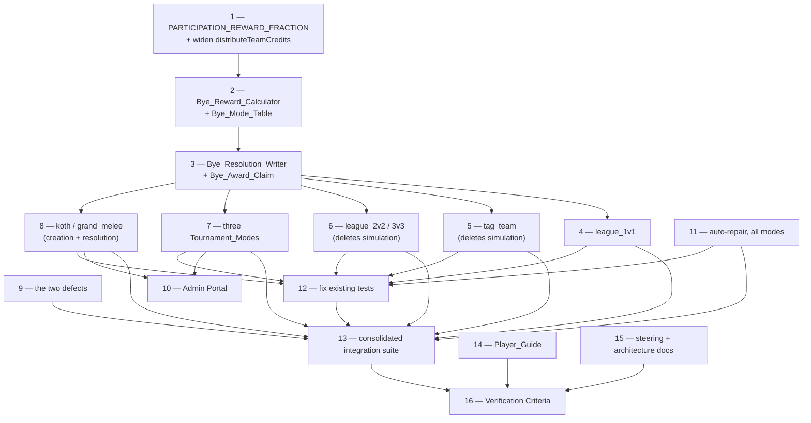

# Implementation Plan

## Overview

Sixteen task groups delivering the twelve requirements. Task order follows the dependency chain in the design: the pure calculator first, then the writer, then the six call sites, then creation for the two new modes, then the two defects, then the admin surface, then the Player_Guide, then documentation, then verification.

The shape worth knowing before starting: **tasks 4 through 8 mostly delete code**. Migrating a mode to Walkover_Resolution removes its simulation, its result override, its placeholder fabrication and — in the team league case — eight now-dead conditionals from the fought path. If a migration task is making a file longer, something has been misread.

Two rules apply throughout, because both are things this spec exists to prevent:

- **Never make a suite green by exclusion.** No task may add a `testPathIgnorePatterns` entry. Where an existing test asserts behaviour this spec reverses, the task names the file and the new assertion (task 12).
- **Delete rather than orphan.** Bye code made unreachable by Walkover_Resolution is removed in the same task that makes it unreachable. Dead bye code is how the current five-way split accumulated.

## Task Dependency Graph



```json
{
  "waves": [
    {
      "wave": 1,
      "tasks": ["1", "9", "11"],
      "description": "Foundations and the two independent fixes. Task 1 names PARTICIPATION_REWARD_FRACTION and widens distributeTeamCredits so the calculator can reuse the remainder rule. Tasks 9 and 11 touch neither the calculator nor the writer, so they need nothing from the bye work and can run alongside it.",
      "parallel": true
    },
    {
      "wave": 2,
      "tasks": ["2"],
      "description": "The Bye_Reward_Calculator and the exhaustive Bye_Mode_Table. Needs task 1's constant and widened signature.",
      "parallel": false
    },
    {
      "wave": 3,
      "tasks": ["3"],
      "description": "The Bye_Resolution_Writer, the single entry point, and the Bye_Award_Claim. The bottleneck: every migration task calls resolveByeEvent, so nothing in wave 4 can start until this exists.",
      "parallel": false
    },
    {
      "wave": 4,
      "tasks": ["4", "5", "6", "7", "8"],
      "description": "Migrate all nine modes to Walkover_Resolution and create byes for the two Placement_Modes. Mutually independent — each touches its own orchestrator — so they can be done in any order or in parallel. Mostly deletions.",
      "parallel": true
    },
    {
      "wave": 5,
      "tasks": ["10", "12"],
      "description": "The Admin Portal surface, which needs the bye counts from tasks 7 and 8 to exist; and the existing-test corrections, which need the migrations and task 11 in place so the new expectations are the right ones. Task 12 runs before wave 6 so a red run there is unambiguously the new tests.",
      "parallel": true
    },
    {
      "wave": 6,
      "tasks": ["13", "14", "15"],
      "description": "The consolidated integration suite, the Player_Guide corrections and the steering and architecture documentation. All three describe finished behaviour, so they come after the code settles.",
      "parallel": true
    },
    {
      "wave": 7,
      "tasks": ["16"],
      "description": "Run all 29 Verification Criteria and every test tier. The did-we-actually-deliver gate.",
      "parallel": false
    }
  ]
}
```

Notes on the edges:

- **Task 3 is the bottleneck.** All five migration tasks call `resolveByeEvent`, so the writer must exist first. Tasks 4 through 8 are independent of each other and can be done in any order or in parallel.
- **Task 12 before task 13.** Fix the existing suites before writing the new ones, so a red run during task 13 is unambiguously the new tests failing rather than the old ones.
- **Task 9 is independent of the bye work.** The `teamSize²` bug and the duplicate Grand Melee scale touch neither the calculator nor the writer, so task 9 can start at any point.
- **Tasks 14 and 15 are independent of all code tasks** and only gate task 16.

## Tasks

- [x] 1. Name the participation fraction and prepare the shared arithmetic
- [x] 1.1 Extract `PARTICIPATION_REWARD_FRACTION` in `economyFormulas.ts`
  - Declare `export const PARTICIPATION_REWARD_FRACTION = 0.2` and have `getParticipationReward` read it in place of the bare `0.2` literal at line 178
  - Add the constant to the existing re-export block in `economyCalculations.ts` alongside `getParticipationReward`, so importers of that module reach it without a second path
  - Unit test: `PARTICIPATION_REWARD_FRACTION === 0.2` and `getParticipationReward('bronze') === 1500`
  - _Requirements: 1.4_

- [x] 1.2 Widen `distributeTeamCredits` so the bye path can reuse the remainder rule
  - Change the parameter type in `teamBattleRewardService.ts` from `TeamBattleParticipantResult[]` to `Array<{ robotId: number }>`; the body already reads only `p.robotId` and `participants.length`, so no call site breaks
  - Correct its JSDoc, which currently describes destroyed-robot special cases ("Destroyed robots with damageDealt = 0 get 0 credits") that the implementation does not perform — it is a plain equal split with a one-credit remainder walk
  - Property test (Property 4): for any non-negative total and any one to three robot ids, shares sum exactly to the total and no two differ by more than one credit. Generate totals biased toward values not divisible by the robot count, plus the forced case of 4,501 across three robots
  - _Requirements: 3.5, 3.6, 8.3_

- [x] 2. Build the Bye_Reward_Calculator
- [x] 2.1 Create `app/backend/src/utils/byeRewards.ts` with the Bye_Mode_Table
  - Declare `TierScaledByeMode`, `TournamentByeMode`, `ByeMode`, `ByeModeSpec`, `ByeRewardInput` (a discriminated union so a Tournament_Mode bye cannot be built without round context and a Tier_Scaled_Mode bye cannot be built without a tier), and `ByeReward` with `prestige`, `fame` and `streamingRevenue` typed as the literal `0`
  - Declare `BYE_MODE_SPECS: Record<ByeMode, ByeModeSpec>` covering all nine modes, each carrying `floor`, `teamSize`, `lpDelta`, `entitySource`, `standingMode` and `updatesElo`. Export `BYE_MODES` for iteration
  - Implement `resolveByeReward`: look up the spec, compute `perRobotCredits` from the arm by calling `getParticipationReward` or `calculateTournamentParticipationReward`, return `credits: perRobotCredits × spec.teamSize` with the three zeros and the table's `lpDelta`. Restate neither formula
  - Implement `distributeByeCredits` by delegating to the widened `distributeTeamCredits`
  - Add the module header recording that this is Backend-only by decision, and the condition that would move it to `app/shared/utils/` (a Frontend surface needing to *predict* a bye reward), including that such a move must relocate both source formulas
  - _Requirements: 1.1, 1.2, 1.3, 1.6, 2.1, 2.2, 2.4, 2.5, 2.6, 3.1, 3.2, 3.3, 3.4_

- [x] 2.2 Test the calculator
  - Property 1: for all nine modes and any valid context, `credits > 0`, `prestige === 0`, `fame === 0`, `streamingRevenue === 0`, all four defined
  - Property 2: for any tier and any of the six Tier_Scaled_Modes, credits equal `getParticipationReward(tier) × teamSize` exactly; credits divided by `teamSize` give the identical per-robot figure across all six; `league_3v3` is exactly 1.5× `league_2v2`. Include unknown tier strings to exercise the bronze fallback
  - Property 3: for any `(totalParticipants, currentRound, maxRounds)` triple and any Tournament_Mode, credits equal `calculateTournamentParticipationReward(...) × teamSize`. Generate `totalParticipants` from 1 to 200,000 and `currentRound ≤ maxRounds` from 1 to 20 so `log10` is exercised where it goes negative
  - Unit test pinning the balance decision as literals: `tag_team` and `league_2v2` byes pay 3,000 bronze and 90,000 champion; `league_3v3` pays 4,500 and 135,000. This exists so a future balance change must edit a test that names the decision
  - Negative type test: `@ts-expect-error` on a `BYE_MODE_SPECS` literal missing a mode, documenting the compile-time guarantee. `pnpm run typecheck:tests` is the gate
  - _Requirements: 1.2, 1.6, 2.1, 2.2, 2.3, 2.4, 2.5, 2.6, 3.1, 3.2, 3.3, 3.4_

- [x] 3. Build the Bye_Resolution_Writer as the single entry point
- [x] 3.1 Create `app/backend/src/services/battle/byeResolutionService.ts`
  - Export `resolveByeEvent(input)` taking `mode`, `claim`, `context` and the `battle` columns only the caller knows. It owns entity resolution via the table's `entitySource`, so callers pass identity and nothing else. No `existingBattleId` field
  - Export `BYE_BATTLE_DURATION_SECONDS = 15`, replacing `leagueBattleOrchestrator`'s local literal, so all nine modes share one duration
  - Implement the ordered steps: create the `battles` row; claim; write `battle_participants` rows; write the `battle_summaries` row; write Standing when `standingMode` is non-null; award credits; write audit rows
  - Participant rows carry `prestigeAwarded: 0`, `fameAwarded: 0`, `streamingRevenue: 0`, `damageDealt: 0`, `destroyed: false`, `yielded: false`, `finalHP` equal to the robot's existing `currentHP`, and `eloAfter` reflecting the mode's `updatesElo`
  - Call `updateRobotCombatStats` only when `updatesElo` is true, and pass the existing `currentHP` — never a simulated `finalHP`
  - Write no participant row for a Bye_Placeholder; `robotIds` contains only real robots
  - _Requirements: 4.4, 5.1, 5.2, 5.3, 5.5, 5.7, 12.3, 12.4, 12.5, 12.8, 12.9, 12.10, 12.11, 12.12_

- [x] 3.2 Implement the Bye_Award_Claim
  - Claim before paying, always. For the six unified modes a conditional `updateMany` on `scheduled_matches_v2` where `status: 'scheduled'`, setting `status: 'completed'` and `battleId`. For the three Tournament_Modes a conditional `updateMany` on `scheduled_tournament_matches` where `battleId: null`
  - Require `count === 1` before paying. On `count === 0`, delete the just-created `battles` row, log at `warn` with the queued-match id, and return `{ alreadyResolved: true, creditsPaid: 0 }`
  - Add the comment recording why the order is claim-then-pay: the opposite order turns every crash and retry into a double payment, and both Placement_Mode orchestrators reset `error` rows back to `scheduled`, so that is a live duplication path rather than a hypothetical one
  - _Requirements: 5.7, 7.6_

- [x] 3.3 Implement error handling
  - Wrap `computeBattleSummary` and the `battle_summaries` insert in `.catch()`: log a warning with the battle id, complete the Bye_Event, pay the credits, never rethrow
  - Wrap `logBattleAuditEvent` per robot in try/catch, logging at `error` and continuing with the remaining robots, matching the existing convention
  - Unit tests: a rejecting `battleSummary.create` still awards credits, still takes the claim, logs a warning and does not throw; `resolveByeEvent` calls `awardCreditsWithLedger` with `'battle_income'` and the supplied cycle number
  - _Requirements: 5.5, 5.8_

- [x] 4. Migrate `league_1v1` to the single entry point
  - Replace the body of `processByeBattle` in `leagueBattleOrchestrator.ts` (lines 186–312) with a `resolveByeEvent` call. Keep the early return at line 657 where it is
  - Delete the `getParticipationReward` call at 209, the `prisma.battle.create` at 212, the `battleParticipant.create` at 238, the `standingsService.recordBattleResult` at 273, the `getCurrentCycleNumber` + `awardCreditsWithLedger` pair at 285–293, and the `scheduledMatch.update` at 296
  - Keep the `getParticipationReward` import — `createBattleRecord` still uses it for the fought path
  - Keep the ELO write: `league_1v1` byes move ELO today and continue to
  - This closes the `battle_summaries` and `audit_logs` gaps, because the writer produces them
  - _Requirements: 1.5, 4.5, 5.3, 5.4, 12.1, 12.2, 12.10_

- [x] 5. Migrate `tag_team` and delete its simulation
- [x] 5.1 Move bye detection to the top of `tagTeamScheduler`
  - Detect `match.team2Id === null` and call `resolveByeEvent` before line 106, so `createByeTeamForBattle`, `simulateTagTeamBattle` and `createTagTeamBattleRecord` are never reached for a bye
  - Delete the draw override at `tagTeamScheduler.ts:175` — with no simulation there is no draw to correct. Do not keep it as a guard
  - Compute the ELO delta against the 2000 combined bye-team ELO and apply LP +3, both unchanged, now through the writer
  - _Requirements: 1.5, 4.5, 12.1, 12.2, 12.6, 12.7, 12.10_

- [x] 5.2 Delete the now-unreachable tag team bye code
  - Delete the bye branch in `tagTeamResultUpdater.ts` from `isByeMatch` at line 66 to its `return;`. The updater stops being a bye call site
  - Delete `app/backend/src/services/tag-team/tagTeamByeTeam.ts` in full — `createByeTeamForBattle` has one consumer and detection now sits above it
  - Keep `createTagTeamBattleRecord`; it is still used for fought tag team battles
  - _Requirements: 12.1, 12.13_

- [x] 6. Migrate `league_2v2` and `league_3v3` and delete their simulation
  - Add a bye early return at the top of `executeSingleTeamBattle`, before team 2 is loaded or fabricated, calling `resolveByeEvent`
  - Delete the `createByeRobot` fabrication at line 232 and its import at line 19; the `isByeMatch` result-override block at 256–265; the `isByeMatch ? getByeTeamELO(teamSize) : ...` ternary at 274; and the `isByeMatch ? [] : team2Robots` expressions at 240, 443 and 463
  - Delete the eight now-dead `if (!isByeMatch && match.team2)` guards at lines 344, 355, 375, 404, 514, 544, 619 and 692 — with the bye gone from this function, `match.team2` is non-null throughout
  - Do not call `prepareRobotForCombat` or `loadTeamRobotsWithWeapons` on the bye path; weapons and tuning cannot affect an unsimulated outcome
  - Keep `getByeTeamELO` — the team league bye still computes an ELO delta against the bye team's notional rating, now inside the bye module
  - _Requirements: 1.5, 3.2, 3.3, 4.5, 12.1, 12.2, 12.6, 12.7, 12.10, 12.13_

- [x] 7. Migrate the three Tournament_Modes
- [x] 7.1 Add `completeByeMatch` to `tournamentService`
  - Export `completeByeMatch(match, tournament, advancingParticipantId)`. Perform the existing bracket update first — same `status`, `winnerId` and `completedAt` writes, same order — then resolve the Bye_Event
  - When `advancingParticipantId` is `null` (the both-slots-empty case at ~860), perform the update and pay nothing: that row is bracket housekeeping with no Subscription behind it, not a Bye_Event
  - Branch on `tournament.participantType` to pick the mode identifier and expand a team id into member robot ids
  - Return whether it paid, so the caller can accumulate the count for task 10
  - _Requirements: 1.5, 2.5, 2.6, 2.7, 5.6, 10.5_

- [x] 7.2 Route all four bracket-bye sites through the helper
  - Replace the auto-completion blocks at `tournamentService.ts` ~289–300 (round-1 byes) and ~838–870 (later-round, reverse and both-slots-empty byes)
  - Replace the fourth copy at `adminCycleService.ts` ~118–124, so the admin bulk-cycle path pays a bracket bye identically to the cron path
  - Leave `teamTournamentBattleOrchestrator` alone: its `INVALID_MATCH_STATE` throw at ~136 and its `isByeMatch: false` round filter at ~504 stay as-is. It is not a bye call site
  - _Requirements: 1.5, 10.9_

- [x] 7.3 Write the tournament bye battle row
  - `battleType` per mode, `leagueType: 'tournament'`, `leagueInstanceId: null`, `tournamentId` and `tournamentRound` set, `durationSeconds` from the shared constant, `winnerReward` the owner total, `loserReward` 0
  - Set `winnerId` to the advancing participant — the bracket already records it and Requirement 4.6 keeps Standing untouched, so no counter, streak or LP can be inflated. `winningSide` 1 for the two team modes, `null` for 1v1, matching each mode's fought-row convention
  - `battleLog` carries `isByeMatch: true` plus the four tournament keys `buildTeamTournamentBattleLog` uses, so a consumer finds the same keys in bye and fought rows
  - `teamSize` participant rows, all `team: 1`, credits from `distributeByeCredits`, `eloBefore === eloAfter`
  - _Requirements: 4.6, 5.1, 5.2, 5.6, 12.11_

- [x] 8. Create Placement_Mode byes for a Thin_Instance
- [x] 8.1 Add `app/backend/src/services/scheduling/thinInstanceByes.ts`
  - Export the pure `planThinInstanceByes(input)` returning one `CreateScheduledMatchInput` per eligible robot — `matchType`, `scheduledFor`, `leagueType: tier`, `leagueInstanceId`, `isByeMatch: true`, one participant
  - Export `createThinInstanceByes(input)` persisting the plan through the existing `schedulingService.createMatch` and returning the count. No new persistence code: `CreateScheduledMatchInput` already accepts `isByeMatch` and `createMatch` already writes it
  - One row per byed robot, not one per instance
  - _Requirements: 6.1, 6.3, 6.5_

- [x] 8.2 Wire both Placement_Matchmakers
  - In `kothMatchmakingService.ts` and `grandMeleeMatchmakingService.ts`, insert a `createThinInstanceByes` call before the existing `continue` at line 358. Do not remove the `continue`
  - Replace the `logger.info` with one carrying the instance identifier, the eligible count, the Minimum_Field_Size and the number of Bye_Events created
  - Add the count to `totalMatches`
  - The branch consumes `getEligibleRobots`' already-filtered output, so the four eligibility gates need no new code
  - _Requirements: 6.1, 6.2, 6.3, 6.6_

- [x] 8.3 Resolve Placement_Mode byes in both battle orchestrators
  - Add `isByeMatch` to the match mapping in `kothBattleOrchestrator` and `grandMeleeBattleOrchestrator` — at **both** mapping sites in each, since the super-batch cooldown block re-fetches and re-maps
  - Add a bye branch before the processor call that calls `resolveByeEvent` directly. No per-orchestrator adapter: `resolvePlacementModeBye` must not exist in either file
  - `battleType` per mode; `leagueType` follows each mode's existing fought-row convention (`'koth'` for KotH, the instance tier for Grand Melee); `winnerId` and `winningSide` null
  - `standingMode: null` and `updatesElo: false` mean no LP, no placement, no `totalMatches`, no `bestPlacement` and no ELO write — by not calling, not by calling with zeros
  - _Requirements: 1.5, 4.7, 4.8, 12.11_

- [x] 8.4 Property-test the plan and the grouping
  - Property 7: for any pool below Minimum_Field_Size, the plan holds exactly one entry per eligible robot with the right `matchType`, `isByeMatch`, tier, instance id and single participant — so an empty pool plans nothing. For any pool at or above it, `groupByLPBanding` returns groups whose members are exactly the input with no duplicates or omissions, every group at least Minimum_Field_Size, and the plan empty
  - Run against both modes with their real constants, generating pool sizes 0 to 60 so both sides of both boundaries (5 and 8) are covered
  - Named unit tests: an empty pool returns `[]`; each matchmaker logs one line per Thin_Instance carrying all four values
  - _Requirements: 6.1, 6.2, 6.3, 6.4, 6.6_

- [x] 9. Fix the two duplicate-declaration defects
- [x] 9.1 Apply `teamSize` once in team tournament credits
  - In `teamTournamentBattleOrchestrator.ts` lines 736–744, rename `winnerCreditPerRobot`/`loserCreditPerRobot` to `winnerOwnerTotal`/`loserOwnerTotal`, each carrying exactly one `× teamSize`, and pass those to `awardCreditsWithLedger` without a second multiplication. Both arms, not just the winner
  - Derive per-robot shares with `distributeTeamCredits` and write those to `battle_participants.credits`, so they sum to what the owner received
  - Write `battles.winnerReward` and `loserReward` as the owner totals. Note in the commit that the stored number is unchanged but its meaning shifts from per-robot to per-owner
  - Leave the prestige line alone: `awardPrestigeToUser(winnerOwnerId, winnerPrestige * teamSize)` applies its factor once and is not an instance of this defect
  - Property 6: for any triple and any `teamSize` of 2 or 3, the winner total divided by `teamSize` equals `calculateTournamentWinReward(...)` exactly, and likewise for the loser arm
  - _Requirements: 8.1, 8.2, 8.3, 8.4, 8.5_

- [x] 9.2 Collapse the Grand Melee placement point scale to one declaration
  - Delete `GRAND_MELEE_POINT_SCALE` and its export from `standingsService.ts:344`; have `awardGrandMeleePoints` import `GRAND_MELEE_LP_SCALE` from `grandMeleeRewards.ts`
  - Direction is `standingsService → grandMeleeRewards`, verified cycle-free: that module imports only `economyFormulas`, which imports nothing. Do not reverse it — that would drag Prisma into a currently pure, mock-free module
  - Property 5: for any placement from 1 to 40 and any tier, the `lpDelta` from `calculateGrandMeleeRewards` equals the LP the Standings_Service persists, including 0 past the end of the scale
  - Unit test: placements 10, 11 and 21 give 1, 0, 0
  - _Requirements: 9.1, 9.2, 9.3, 9.4_

- [x] 10. Make a bye visible to an operator
- [x] 10.1 Add bye counts to the Cycle_Execution_Summary objects
  - Add `byeMatches: number` to `KothBattleExecutionSummary` and `GrandMeleeBattleExecutionSummary`, initialised to 0 alongside the other counters
  - Increment `byeMatches` on the bye branch and **not** `successfulMatches`: the three counters partition `totalMatches`, so `successfulMatches` keeps meaning "combat was simulated". Increment `totalRobotsInvolved` for the byed robot
  - Note at the branch that `matchResults.length` now equals `successfulMatches + byeMatches`, and update any consumer asserting the old equality
  - Add the bye count to each orchestrator's completion log line
  - Accumulate the bracket-bye count from `completeByeMatch` into the tournament execution result
  - _Requirements: 10.1, 10.2, 10.3, 10.4, 10.5, 10.6_

- [x] 10.2 Render the counts on the Admin_Cycle_Surface
  - In `CycleControlsPage.tsx`, add `byeMatches?: number` to the `kothBattles` and `grandMeleeBattles` payload types and `byeMatchesResolved?: number` to `tournaments`. Every new field optional, following the existing optional-block convention
  - Display the league `byeBattles`, both `byeMatches` figures and the tournament bracket-bye count as additional label/value pairs in the existing summary blocks. No new page, component or breakpoint
  - _Requirements: 10.7, 10.8, 10.11, 10.12_

- [x] 10.3 Offer the battle link for a bracket bye
  - In `TournamentsPage.tsx`, give a bye row with a populated `battleId` the same battle link a fought match gets, with a touch target of at least 44px. An operator investigating a payment needs to reach the record
  - _Requirements: 10.10, 10.13_

- [x] 10.4 Update the `BattleLogsPage` copy
  - Reword the "No Detailed Combat Events" explanation at lines 589–593 to lead with the bye case and state that a bye has no combat to log by design. Copy only, no logic change — bye rows go from 4 modes to 9 and become ordinary rather than an edge case
  - _Requirements: 10.7_

- [x] 10.5 Frontend tests
  - FE1: the panel renders all four bye counts for a payload carrying them
  - FE2: a payload with every bye count absent still renders the rest of each summary and does not throw — the assertion that justifies making the fields optional
  - FE3: no horizontal overflow at a 320px viewport with all four counts populated (`scrollWidth <= clientWidth`)
  - FE4: a bye row with a populated `battleId` shows the battle link, with a touch target of at least 44px
  - _Requirements: 10.7, 10.8, 10.10, 10.11, 10.12, 10.13_

- [x] 11. Make auto-repair exempt no mode
  - Remove the `isByeMatch: false` filter from `resolveTournamentParticipants` in `eventScheduleScope.ts:105`, so a bracket bye is scoped for pre-battle repair like every other booked match
  - Change nothing on the unified arm — it already has no bye predicate — and change nothing in Slot_Accounting, whose tournament arm filters on `winnerId: null` and is untouched
  - Update `tests/services/economy/repairScope.test.ts`: drop `isByeMatch: false` from the expected where clause and add a case asserting a bye row **is** returned. Without this the code change alone leaves a red suite
  - _Requirements: 7.7, 7.8_

- [x] 12. Update the existing tests that assert reversed behaviour
  - `tests/services/team-battle/teamBattleOrchestrator.test.ts`: invert `expect(mockSimulateTeamBattle).toHaveBeenCalledTimes(1)` to `(0)` in "should handle bye matches without team2 robots" and rewrite the `// Simulation should still be called` comment. This is the most direct collision with Requirement 12.1 in the codebase
  - `tests/services/team-battle/teamBattleRewardService.test.ts`: delete the test in `bye-team reward calculation (R7.9)` commented `// Bye-team matches still award full winner reward to the real team`, recording in the commit that the behaviour is genuinely gone. Keep its two sibling ELO tests — bye-team ELO is unchanged
  - `tests/integration/tagTeamByeHandling.test.ts`: retarget the `participants: { some: { robotId: -1 } }` query to the real robots, and drop the damage-dependent assertions. **First run the integration tier to establish whether this suite currently passes** — `battle_participants.robotId` carries a Robot foreign key, so a row with id `-1` should be impossible, which means the suite is either failing or excluded today. Resolve that before editing, and if it is excluded give the exclusion the reason-and-expiry comment the coding-standards steering file requires
  - `tests/services/tournament/tournamentService.property.test.ts`: delete or make real the bye block asserting `expect(completedMatch.battleId).toBeNull()`. It builds `completedMatch` as a local literal and asserts the literal has the fields it was just given, so it never calls the service and will keep passing while encoding the wrong expectation
  - `tests/tagTeamBattleOrchestrator.property.test.ts`: replace the local copies of `calculateTagTeamRewards` and `calculateTagTeamPrestige` with imports of the real functions. If the import genuinely pulls in the battle pipeline, extract the formulas into a module both can import rather than duplicating them
  - Add no `testPathIgnorePatterns` entry in this task or any other
  - _Requirements: 3.1, 7.8, 12.1_

- [x] 13. Write the consolidated integration suite
- [x] 13.1 IT-A — the Bye_Invariant across all nine modes
  - One `it.each(BYE_MODES)`. Seed the queued Bye_Event, snapshot every robot on the real side, resolve, then assert the nine invariants from the design: Bye_Record complete; `hasData === false` and `totalEvents === 0`; `currentHP`, `currentShield`, `damageTaken`, `battleReadiness`, `repairQuoteCredits` and `lifetimeRepairCreditsPaid` byte-identical; participant rows inert; prestige, fame and streaming zero; per-robot credits summing to the currency increase; spies on all four simulators recording zero calls; real side recorded as winner with `isDraw` false; queued row claimed with `battleId` set
  - This is the test that would have caught the damage defect. Write it as a loop, not a list, so a future mode cannot be omitted
  - _Requirements: 3.5, 3.6, 4.1, 4.2, 4.3, 4.4, 5.1, 5.2, 5.3, 5.4, 5.5, 5.7, 12.1, 12.2, 12.3, 12.4, 12.5, 12.6, 12.7, 12.8, 12.9_

- [x] 13.2 IT-B — the per-mode differences table
  - One `it.each` over the design's table: credits, LP delta, whether `robots.elo` moves, Standing writes, and `battles.leagueType`, for each of the nine modes
  - For Placement_Modes and Tournament_Modes also assert `standings.leaguePoints`, `totalMatches` and `bestPlacement` are byte-identical to before
  - Include the per-robot comparison against `calculateKothRewards` and `calculateGrandMeleeRewards` last-place figures, which absorbs a rejected property
  - _Requirements: 2.1, 2.3, 2.5, 3.1, 3.2, 3.3, 3.4, 4.5, 4.6, 4.7, 4.8, 12.10, 12.11_

- [x] 13.3 IT-C — shape equality across the three bye kinds
  - Resolve a `league_1v1`, a `league_3v3` and a `tournament_1v1` bye. Compare the set of non-null column names on the three `battles` rows and the row counts on the other three tables, allowing only the declared exceptions. Extend to `battle_summaries.hasData` and `totalEvents`
  - The team mode is included deliberately: comparing only 1v1 against tournament would have sailed past the real inconsistency, since the team bye was the one carrying real combat data
  - _Requirements: 5.6, 12.9_

- [x] 13.4 IT-D — Thin_Instance creation and gating
  - Seed a `koth` instance with 4 eligible robots and a `grand_melee` instance with 7, plus one unsubscribed robot, one with no main weapon and one already holding a scheduled `koth` match in the same thin instance
  - Assert 11 bye rows with one participant row each, and that none of the three ineligible robots received a bye. Resolution is IT-A's job
  - _Requirements: 6.1, 6.2, 6.3, 6.4, 6.5_

- [x] 13.5 IT-E — idempotency, Slot_Accounting and auto-repair
  - Resolve a `koth` bye then call the path again: one credit award, one `battles` row, `alreadyResolved` on the second call. Repeat for a tournament bye, where the claimed column is `battleId` not `status`
  - With an unresolved `koth` bye: `resolveOutstandingEventsForRobots` reports `koth`; the occupied-slot count includes it; a subscribe past Max_Events_Per_Robot is refused; the unsubscribe request itself **succeeds** — free, immediate, never refused, even with a bye outstanding — and the slot nonetheless stays occupied until the bye resolves. Those last two are one assertion pair and must be written together, because "the slot stays held" is only meaningful if the unsubscribe was allowed. Add a structural assertion that the unified arm carries no `isByeMatch` predicate
  - With a damaged robot holding an unresolved bye in each of the nine modes: `resolveRobotIdsForEvent` returns it for all nine event types, tournaments included; the repair pass repairs it; the bye that follows leaves HP at the post-repair value
  - _Requirements: 7.1, 7.2, 7.3, 7.4, 7.5, 7.6, 7.7, 7.8_

- [x] 13.6 IT-F — bracket advancement, the admin path and team tournament credits
  - Bracket state after a bye — `status`, `winnerId`, `completedAt` and the generated next round — identical to a control run with the reward call stubbed. That verifies "advancement stays untouched" rather than asserting it, and covers the whole-round recursion in `advanceWinnersToNextRound`
  - The same bye through `adminCycleService` credits the owner identically to the cron path
  - A round-1 win in a 16-team 3v3 pays the winning owner 16,530 and the losing owner 4,959; `battles.winnerReward === 16530`, `loserReward === 4959`; each side's three participant credits sum to its owner total
  - _Requirements: 5.6, 8.1, 8.2, 8.3, 8.4, 10.9_

- [x] 13.7 IT-G — the cycle summary counts byes as byes
  - Run a cycle with one thin `koth` instance (4 robots) and one viable one (6). Assert `byeMatches === 4`, `successfulMatches === 1`, `failedMatches === 0`, `totalMatches === 5`, `totalRobotsInvolved === 10`, and that the three counters partition `totalMatches`. Repeat for `grand_melee`. Assert the log line carries the bye count
  - _Requirements: 10.1, 10.2, 10.3, 10.4, 10.6_

- [x] 14. Correct the Player_Guide
- [x] 14.1 Rewrite `tournaments/bye-matches.md`
  - Rewrite line 46 ("No rewards earned — zero credits, prestige, and fame"), the `callout-warning` at 51, and the `description` frontmatter, which asserts "the no-rewards rule for bye rounds"
  - State that a bracket bye pays the same credits a loss pays for that round, and no prestige and no fame
  - Restructure "The Bye Trade-Off": remove forgone rewards from Disadvantages, and say plainly that the residual cost is the forgone *win* reward rather than everything — a reader seeing only the Advantages list would over-value a bye. Overview, How Byes Are Assigned and the Advantages list are accurate and stay
  - _Requirements: 11.1, 11.3, 11.4, 11.13, 11.14_

- [x] 14.2 Correct the remaining bye claims
  - `tournaments/rewards.md:118`: the callout stating a bye recipient earns nothing. Phrase it as "the same as a loss" so it stays consistent with line 146
  - `king-of-the-hill/entry-requirements.md:34` and `grand-melee/entry-requirements.md:24`: replace "no match is created" with a Bye_Event per eligible robot. Keep Grand Melee's line 26 about 8–19 robots and place it beside the new bye case
  - `leagues/matchmaking.md:111`: replace "full rewards" with the actual figure. Wrong today, not just after
  - `team-battles/overview.md:129` and `team-battles/tag-team.md:61`: state the team bye reward as the participation floor at team scale, with the figure. "Reduced rewards" is wrong today in the opposite direction
  - `economy/battle-rewards.md`: add a bye section, consistent with the win/loss framing already there
  - `facilities/booking-office.md`: state that a Subscription always returns something when the schedule produces no fought match, and that a bye holds its slot until it resolves
  - _Requirements: 11.1, 11.2, 11.5, 11.6, 11.7, 11.8, 11.9, 11.10, 11.13, 11.14_

- [x] 14.3 Fix the 20% contradiction and the Participation_Floor collision
  - Correct "30% of the tier minimum" to 20% at `economy/battle-rewards.md:22` and `:42` and `leagues/league-tiers.md:73`. The prose contradicts the table on its own page; the table is right. Record that 30% is the *tournament* percentage and does not apply to league participation, so it is not reintroduced
  - Rename the "Participation Floor" section at `grand-melee/rewards.md:42-44` to name the Placement_Credit_Floor, and amend line 16. Add a sentence distinguishing it from what a Grand Melee bye pays, with a cross-link — the two differ by 2.5× at every tier
  - _Requirements: 11.11, 11.12, 11.13_

- [x] 14.4 Verify guide integrity
  - Bump `lastUpdated` on every article touched by 14.1 through 14.3
  - Run `pnpm run test:unit -- guide` so the existing content-existence and link-integrity checks confirm no rewritten article broke an internal `/guide/...` cross-link. `sections.json` needs no change — no article is added or removed
  - _Requirements: 11.13, 11.14_

- [x] 15. Update steering files and architecture documentation
- [x] 15.1 Add a "Bye Reward Architecture (Spec #49)" section to `.kiro/steering/coding-standards.md`
  - Shape it like the existing Repair Data Architecture and Battle Data Architecture sections. Content: every bye amount comes from `utils/byeRewards.ts` and nowhere else, and no bye path may call the win-reward functions; every bye record comes from the writer, which owns entity resolution, so no orchestrator holds bye logic; the Bye_Mode_Table is exhaustive by construction; one participation fraction, never a bare `0.2`; one Grand Melee placement scale; a bye pays credits only; the Bye_Award_Claim is claimed before payment and never after; a bye simulates nothing and can never damage a robot or draw; a bye is counted as a bye and never as a successful match; the Player_Guide is part of the change, not documentation of it
  - Include the team bye discontinuity note and the fact that a walkover once billed players for repairs through the Fists_Fallback
  - _Requirements: 1.1, 4.1, 9.1, 12.1_

- [x] 15.2 Amend `.kiro/steering/project-overview.md`
  - Extend entry 13 (Booking Office) rather than adding a numbered system: a Bye_Event exists in all nine modes, pays the Participation_Floor of its mode and nothing else, simulates no combat, is declared once in `utils/byeRewards.ts`, and holds its slot through the same `eventScheduleScope` question with no bye-specific branch
  - _Requirements: 1.1, 12.1_

- [x] 15.3 Update the architecture documents
  - `docs/architecture/PRD_BATTLE_DATA_ARCHITECTURE.md`: add a "Bye Battle Records" section with the nine-mode row and column matrix. This is the document already requiring a `BattleSummary` at battle creation, which the `league_1v1` bye has been violating
  - `docs/architecture/PRD_SERVICE_DIRECTORY.md`: add `utils/byeRewards.ts`, `services/battle/byeResolutionService.ts` and `services/scheduling/thinInstanceByes.ts`; note that the Placement_Matchmakers now create byes for a Thin_Instance. The Cron Schedule section is unchanged
  - `docs/architecture/BATTLE_SIMULATION_ARCHITECTURE.md` line 225: "Tournament byes are auto-completed at creation — no battle, no rewards, no combat" is wrong after this spec on two of three counts
  - `docs/architecture/COMBAT_FORMULAS.md` lines 1337–1344: add the team bye case (`participation × teamSize`) beside the fought-battle formula so the two are not conflated
  - _Requirements: 5.1, 5.3, 6.1_

- [x] 15.4 Update the game-systems documents that state bye figures
  - `docs/game-systems/PRD_MATCHMAKING.md` lines 59, 185-187, 450, 1394, 1499-1501, 2746 ("full rewards"), and 2835-2838 (thin instance produces no matches; line 2838's remainder note is correct and stays)
  - `docs/game-systems/PRD_TOURNAMENT_SYSTEM.md` lines 292-293 (no battle record for a tournament bye) and 2911 (the matched team receives full rewards)
  - `docs/game-systems/PRD_LEAGUE_SYSTEM.md` lines 106-108: add the Participation_Floor rule and that byes now exist in all nine modes
  - `docs/game-systems/PRD_PRESTIGE_AND_FAME.md` lines 31 and 106: currently *false* for team byes; becomes true. Note it was aspirational before this spec
  - `docs/game-systems/PRD_ECONOMY_SYSTEM.md` lines 52, 92, 648, 1341, 1363: correct the participation reward from 30% to 20% and recompute the figures
  - `docs/analysis/BATTLE_EXECUTION_AUDIT.md` lines 239 and 486: add a dated "changed by Spec #49" note rather than rewriting — the document is an audit snapshot
  - Leave unchanged and confirm still true: `PRD_ECONOMY_SYSTEM.md:1591` and `STABLE_SYSTEM.md:347,463` (no streaming revenue for byes) and `PRD_HALL_OF_RECORDS.md:163` (the bye-win streak caveat)
  - _Requirements: 2.1, 3.1, 4.1, 6.1, 11.11_

- [x] 16. Run the Verification Criteria and confirm the spec delivered
  - Work through all 29 Verification Criteria in `requirements.md` in order, recording the result of each
  - Greps: one `PARTICIPATION_REWARD_FRACTION` and no bare `* 0.2`; one bye reward declaration with six call sites; no `GRAND_MELEE_POINT_SCALE`; no `CreditPerRobot * teamSize`; no simulator reachable from a bye; no bye-specific draw correction; no `existingBattleId`; no `resolvePlacementModeBye` or `resolveTeamLeagueBye`; `tagTeamByeTeam.ts` gone and no `createByeTeamForBattle`; no `isByeMatch` in `tagTeamResultUpdater.ts`; no bye filter in `eventScheduleScope.ts` or `repairScope.test.ts`; the six Player_Guide greps; and the two anti-regression greps for "Simulation should still be called" and "Mirrors the orchestrator's reward arithmetic"
  - Confirm no `testPathIgnorePatterns` entry was added and that `git diff --stat app/backend/tests` lists exactly the files task 12 names plus the new suites
  - Confirm `git diff app/backend/src/content/guide | rg "^\+lastUpdated"` shows one bumped line per article named in task 14
  - Run all tiers: `cd app/backend && pnpm run lint && pnpm run build && pnpm run typecheck:tests && pnpm run test:unit && pnpm run test:integration && pnpm run test:heavy`, then `cd app/frontend && pnpm run lint && pnpm run build && pnpm run test:ci`
  - If any criterion fails, fix the code or the test — do not make the check advisory and do not delete a test to make a build pass unless the behaviour it covers is genuinely gone, in which case say so explicitly
  - _Requirements: 1.1, 1.4, 4.1, 7.8, 8.5, 9.1, 11.1, 11.11, 11.13, 12.1, 12.12, 12.13_

## Notes

### Things to establish before you start

- **Run the integration tier first and record the baseline.** Task 12 depends on knowing whether `tagTeamByeHandling.test.ts` currently passes. `battle_participants.robotId` carries a Robot foreign key, so its assertion that a participant row with `robotId: -1` exists should be impossible — which means the suite is either already failing or excluded. Establish which before editing it, and do not assume a red run mid-implementation is your fault.
- **The design's § Components 4 and that test disagree on a fact.** The design claims the foreign key would reject a negative `robotId`; the test asserts such a row exists. The schema supports the design. Resolve it by running the suite, not by reasoning.

### Balance changes that ship together, and must be read together

Three figures move at the cycle this deploys, and two of them are in opposite directions for the same player:

- Team bye credits drop 6× (signed off, a balance change).
- Team and tag team bye repair spend drops to zero (a defect fix — a walkover was billing players for damage from fabricated opponents punching with the Fists_Fallback).
- Tournament bye holders start incurring pre-battle repair spend they do not today (a consequence of task 11, coherent with a tournament bye now paying the round's loss reward).

Anyone reading the Repair_Spend_Source or bye credit series across that boundary needs all three, or the nerf looks harsher than it is. Task 15.1 puts this in the steering file so it is read as authoritative rather than living only here.

### Scope boundaries to hold

- **Spec 50 owns player-facing battle display.** Nothing in these tasks touches Dashboard, Robot Detail or Battle History. The only rendered surfaces are `CycleControlsPage.tsx`, `TournamentsPage.tsx` and `BattleLogsPage.tsx`, all under `pages/admin/`.
- **No Prisma migration and no backfill.** Every column needed already exists, `MatchType` already has both Placement_Mode values, and `scheduled_tournament_matches.battleId` is already `@unique`, which the tournament Bye_Award_Claim depends on. If a task seems to need a migration, re-read § Data Models before writing one.
- **Out of scope, deliberately:** the duplicate `PRESTIGE_BY_LEAGUE` and `FAME_BY_LEAGUE` tables in `tagTeamRewards.ts`; the `league_1v1` bye's second `scheduled_match_participants` row with `participantId: -1`; KotH writing `'koth'` into `battles.leagueType` where Grand Melee writes the tier; and `team-battles/overview.md:194` saying "With 6 total events available" when there are nine.

### Requirements coverage

All 98 acceptance criteria across the twelve requirements appear in at least one task's `_Requirements:_` trace. Criterion 7.4 (unsubscribing is always allowed) is covered in task 13.5 as the paired assertion to 7.5 — "the slot stays held" only means something if the unsubscribe was permitted, so the two are asserted together rather than 7.4 being waved through as pre-existing behaviour.
