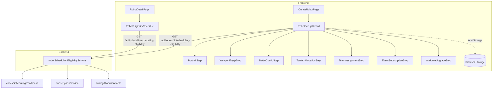
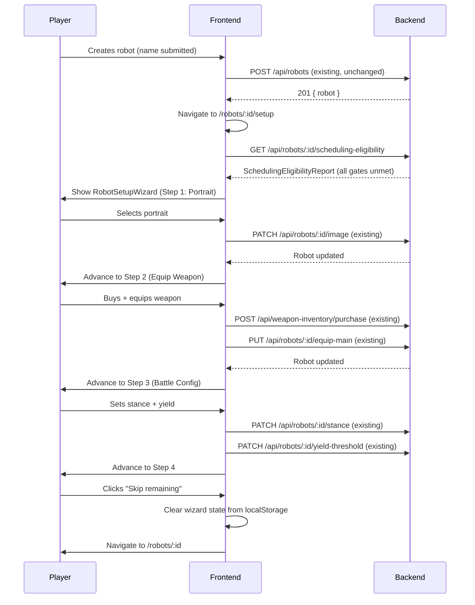
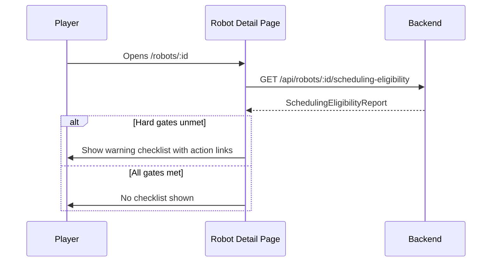

# Design Document: Guided New Robot Setup Workflow

## Overview

This design describes a guided setup flow that activates after robot creation and walks the player through the steps required to make a robot battle-ready: equipping weapons for the chosen loadout, selecting a stance, setting the yield threshold, allocating tuning points, and subscribing to battle events. The system also provides a persistent Eligibility_Checklist that surfaces on the robot detail page whenever a robot is missing any hard-gate requirement (weapon equipped, event subscription active), with soft-gate items shown as recommendations.

The wizard is a purely client-side flow — no new database tables. Progress lives in localStorage so it survives a page refresh, but there is no server-side tracking. The value is in guiding the player and reducing clicks, not in persisting wizard state. The eligibility computation is a lightweight server endpoint that derives everything from existing data (weapon loadout, subscription records, tuning allocation).

Generated stables (`is_generated: true`) are created fully battle-ready via direct Prisma inserts and never see the wizard or the checklist.

## Reuse vs Build New

### Existing code we reuse directly (no changes needed)

| Need | Existing artefact | Location |
|------|-------------------|----------|
| Weapon readiness check | `checkSchedulingReadiness()` / `checkBattleReadiness()` | `src/services/analytics/matchmakingService.ts` |
| Subscription status query | `getSubscriptionsForRobot()` | `src/services/subscription/subscriptionService.ts` |
| Subscription cap | `getSubscriptionCap()` | `src/config/subscriptions.ts` |
| Tuning allocation query | `prisma.tuningAllocation.findUnique()` | `src/services/tuning-pool/tuningPoolService.ts` |
| Equip weapon endpoints | `PUT /api/robots/:id/equip-main-weapon`, `equip-offhand-weapon` | `src/routes/robots.ts` |
| Stance update | `PATCH /api/robots/:id/stance` | `src/routes/robots.ts` |
| Yield threshold update | `PATCH /api/robots/:id/yield-threshold` | `src/routes/robots.ts` |
| Subscription toggle | `PUT /api/subscriptions/robot/:robotId` | `src/routes/subscriptions.ts` |
| Ownership verification | `verifyRobotOwnership()` | `src/middleware/ownership.ts` |
| Auth + validation middleware | `authenticateToken`, `validateRequest` | `src/middleware/` |
| Frontend stance selector | `StanceSelector` component | `src/components/StanceSelector.tsx` |
| Frontend yield slider | `YieldThresholdSlider` component | `src/components/YieldThresholdSlider.tsx` |
| Frontend weapon modal | `WeaponSelectionModal` in BattleConfigTab | `src/components/BattleConfigTab.tsx` |
| Frontend subscription store | `useSubscriptionStore` (Zustand) | `src/stores/subscriptionStore.ts` |
| Frontend robot store | `useRobotStore` (Zustand) | `src/stores/robotStore.ts` |
| Frontend robot image selector | `RobotImageSelector` (presets + upload with moderation) | `src/components/RobotImageSelector.tsx` |
| Frontend team registration | `RegisterTeamModal`, `registerTeamBattle()` API helper | `src/components/team-battles/TeamBattleManagementContent.tsx`, `src/utils/teamBattleApi.ts` |
| Team data query | `getMyTeamBattles()` | `src/utils/teamBattleApi.ts` |
| Weapon purchase endpoint | `POST /api/weapon-inventory/purchase` | `src/routes/weaponInventory.ts` |
| Storage capacity check | `calculateStorageCapacity()`, `getStorageStatus()` | `src/utils/storageCalculations.ts` |
| Onboarding UX patterns | `ProgressIndicator`, lazy-loading steps, skip confirmation | `src/components/onboarding/` |
| Ineligibility warning pattern | `TeamBattleReadinessWarning` component | `src/components/TeamBattleReadinessWarning.tsx` |
| Per-robot readiness badge | `BattleReadinessBadge` (ready / needs-repair / no-weapon) | `src/components/BattleReadinessBadge.tsx` |
| Dashboard notifications | `generateNotifications()` in DashboardPage | `src/pages/DashboardPage.tsx` |

### Existing code that needs minor additions

| Artefact | Change needed |
|----------|--------------|
| `CreateRobotPage.tsx` (normal path) | After successful creation when `isOnboarding === false`, navigate to `/robots/:id/setup` with `{ replace: true }` (so browser-back from the wizard goes to the robots list, not back to the create form). The onboarding path (`?onboarding=true`) is unchanged — it navigates back to `/onboarding`. |
| `RobotDetailPage.tsx` | Add `RobotEligibilityChecklist` component above tab navigation (owner-only) |
| `DashboardPage.tsx` | Extend `generateNotifications()` to also flag robots with no subscriptions |

**Note on the two robot creation paths:**

There are two frontend paths that call `createRobot()` (same `POST /api/robots` endpoint):

1. **`CreateRobotPage`** (normal flow, `isOnboarding === false`) — currently navigates to `/robots/:id`. This is the path we change to navigate to the setup wizard.
2. **Onboarding flow** — two entry points:
   - `CreateRobotPage` with `?onboarding=true` — navigates back to `/onboarding`
   - `Step1_Welcome` inline creation — creates 1–3 robots, then advances onboarding steps

The onboarding flow already has its own guided setup (Step 3 covers loadout, stance, weapons, portrait). The setup wizard does NOT trigger during onboarding — only for robots created after onboarding is complete or skipped. Both paths call the same backend endpoint and the same `createRobot()` API helper — there is no divergence in business logic.

### New code to build

| Artefact | Purpose | Size estimate |
|----------|---------|---------------|
| `robotSchedulingEligibilityService.ts` | Aggregates existing checks into one `SchedulingEligibilityReport` | ~50 lines |
| `GET /api/robots/:id/scheduling-eligibility` route | Exposes eligibility report | ~15 lines (thin handler) |
| `RobotSetupWizard.tsx` | Shell — step navigation, progress bar, skip logic, localStorage resume | ~150 lines |
| `RobotEligibilityChecklist.tsx` | Persistent banner on Robot Detail Page | ~80 lines |
| `PortraitStep.tsx` | Thin wrapper around existing RobotImageSelector | ~40 lines |
| `WeaponEquipStep.tsx` | Weapon purchase + equip with storage/credits awareness | ~80 lines |
| `BattleConfigStep.tsx` | Combined stance + yield threshold on one screen | ~60 lines |
| `TuningAllocationStep.tsx` | Simplified view linking to TuningPoolEditor | ~50 lines |
| `TeamAssignmentStep.tsx` | Assign to existing team or form a new one | ~90 lines |
| `EventSubscriptionStep.tsx` | Event checklist using subscription store | ~70 lines |
| `AttributeUpgradeStep.tsx` | Optional offer — simplified UpgradePlanner | ~60 lines |
| `useRobotSetupWizard.ts` | Hook for wizard state (localStorage + step resolution) | ~60 lines |

No new Prisma models. No new database tables. No migrations.

## Architecture



### Key Architectural Decisions

1. **No server-side wizard state** — The wizard is ephemeral. Progress lives in localStorage keyed by `robot-setup-${robotId}`. If the player clears storage or switches devices, the wizard restarts — acceptable because completing it takes under 2 minutes and the steps are idempotent.

2. **Eligibility computed server-side from existing data** — A single `computeSchedulingEligibility()` function queries weapon loadout, subscription count, and tuning allocation. No new table needed. The two hard gates (weapon + subscription) are objectively derivable; the soft gates (tuning allocated) are queryable from the existing `tuningAllocation` table.

3. **Stance and yield are recommendations, not gates** — "Balanced" is both the default and a valid choice. We can't distinguish "player chose balanced" from "player never touched it." So these are shown as recommendations ("consider setting a stance") rather than tracked as completion state.

4. **Step components are standalone** — Each step is a self-contained component reusable in the future #37 Prepare workspace. They accept a `robotId` prop and call existing mutation endpoints.

5. **Dedicated page, not a modal** — The wizard renders as a dedicated page/route (`/robots/:id/setup`) navigated to after creation. Mobile-first layout following the project's card-based responsive pattern.

6. **Mobile-first, fully functional on mobile** — Most users are on mobile. The wizard is designed mobile-first:
   - Single-column vertical layout at all viewports — one step visible at a time
   - Each step renders inside a full-width card (`bg-surface-elevated border border-gray-700 rounded-lg p-4`)
   - All touch targets ≥ 44px (buttons, selectors, checkboxes, slider thumb)
   - Bottom-anchored sticky action bar with "Next" / "Skip" / "Back" buttons — always reachable with thumbs
   - Top progress indicator: compact horizontal stepper (numbered dots, active highlighted with `border-primary text-primary`, completed with `bg-primary`)
   - No horizontal scrolling at any viewport ≥ 320px
   - Weapon grid: `grid-cols-1` on mobile, `grid-cols-2` on `md:`
   - Portrait grid: `grid-cols-3` on mobile (64px thumbnails), `grid-cols-4` on `md:`
   - Event subscription list: full-width stacked checkboxes with `py-3` touch-friendly padding
   - Team list: full-width cards, one per row
   - Step transitions use `animate-fade-in` (200ms ease-out), skipped under `prefers-reduced-motion`
   - Follows project color system: `bg-surface-elevated`, `border-gray-700`, `text-primary`, `text-secondary`

7. **Generated robots excluded** — The eligibility endpoint returns early for robots owned by `is_generated` users (they're always fully configured). The wizard never triggers for them because they don't go through `CreateRobotPage`.

## Sequence Diagrams

### Robot Creation → Guided Setup Flow



### Eligibility Checklist (Robot Detail Page)



## Components and Interfaces

### Component 1: RobotSchedulingEligibilityService (NEW — backend)

**Purpose**: Derives scheduling eligibility from existing data. No new tables.

**Location**: `app/backend/src/services/robot/robotSchedulingEligibilityService.ts`

**Interface**:
```typescript
interface SchedulingEligibilityGate {
  id: 'weapon_equipped' | 'event_subscribed' | 'tuning_allocated';
  label: string;
  severity: 'hard' | 'soft';
  met: boolean;
  detail: string | null;
}

interface SchedulingEligibilityReport {
  robotId: number;
  isEligible: boolean;       // true only when ALL hard gates are met
  isFullyConfigured: boolean;   // true when all gates are met
  gates: SchedulingEligibilityGate[];
}

export async function computeSchedulingEligibility(robotId: number): Promise<SchedulingEligibilityReport>;
```

**Gate definitions**:

| Gate ID | Severity | Condition for `met: true` | Source |
|---------|----------|---------------------------|--------|
| `weapon_equipped` | hard | `checkSchedulingReadiness(robot).weaponCheck === true` | Existing function |
| `event_subscribed` | hard | At least one active subscription exists | Existing `subscription` table |
| `tuning_allocated` | soft | `tuningAllocation` record exists for this robot | Existing `tuning_allocations` table |

Stance and yield threshold are not gates — they are always valid at their defaults. The wizard offers them as steps, but the checklist doesn't flag them as missing.

### Component 2: RobotSetupWizard (NEW — frontend shell)

**Purpose**: Orchestrates the step-by-step guided flow after robot creation.

**Location**: `app/frontend/src/components/robot-setup/RobotSetupWizard.tsx`

**Interface**:
```typescript
interface RobotSetupWizardProps {
  robotId: number;
  robotName: string;
  loadoutType: 'single' | 'weapon_shield' | 'two_handed' | 'dual_wield';
  onComplete: () => void;
  onSkip: () => void;
}
```

**Behaviour**:
- Fetches eligibility report on mount to determine which steps are already satisfied
- Reads localStorage for saved position (resumes if found)
- Renders step indicator (numbered stepper / progress bar)
- Provides "Next", "Skip Step", and "Skip All & Go to Robot" navigation
- After each mutation, re-fetches eligibility to update gate status
- On complete/skip, clears localStorage and navigates to robot detail

**Mobile layout** (viewport < 1024px — the default, most users):
- Full-screen page with vertical stacking
- Top: compact progress dots (step numbers 1–7, current step highlighted)
- Middle: active step card (scrollable content area)
- Bottom: sticky action bar (`fixed bottom-0`) with primary "Next"/"Complete" button and secondary "Skip" button
- All buttons: `min-h-[44px]` for touch friendliness
- Step transitions: `animate-fade-in` (200ms), no horizontal swiping

**Desktop layout** (viewport ≥ 1024px):
- Same vertical card layout (no sidebar), centered with `max-w-2xl mx-auto`
- Progress stepper is slightly larger with step labels visible
- Action buttons are wider but same sticky-bottom pattern

### Component 3: useRobotSetupWizard Hook (NEW — frontend)

**Purpose**: Encapsulates wizard state management with localStorage persistence.

**Location**: `app/frontend/src/components/robot-setup/useRobotSetupWizard.ts`

**Interface**:
```typescript
interface WizardState {
  currentStep: number;       // 1-7
  completedSteps: number[];  // e.g. [1, 2, 3]
  skippedSteps: number[];
}

interface UseRobotSetupWizardReturn {
  state: WizardState;
  currentStep: number;
  totalSteps: number;
  advance: () => void;
  skipStep: () => void;
  skipAll: () => void;
  isComplete: boolean;
  reset: () => void;
}

export function useRobotSetupWizard(robotId: number): UseRobotSetupWizardReturn;
```

**localStorage key**: `robot-setup-${robotId}`

### Component 4: RobotEligibilityChecklist (NEW — frontend)

**Purpose**: Persistent banner on the Robot Detail Page showing unmet eligibility gates.

**Location**: `app/frontend/src/components/robot-setup/RobotEligibilityChecklist.tsx`

**Interface**:
```typescript
interface RobotEligibilityChecklistProps {
  robotId: number;
  showRecommendations?: boolean;  // show soft gates too
}
```

**Behaviour**:
- Fetches `GET /api/robots/:id/scheduling-eligibility`
- Renders nothing if `isEligible` is true (and `showRecommendations` is false)
- Shows warning banner with checklist items for unmet hard gates
- Each item has an action link (e.g., "Equip weapon" → navigates to battle-config tab, "Subscribe to events" → navigates to booking office)
- Includes a "Complete Setup" button that navigates to `/robots/:id/setup`
- Follows the same visual pattern as `TeamBattleReadinessWarning` (`bg-warning/10 border-l-4 border-warning`)

**Mobile layout**:
- Full-width card, stacked vertically above the tab navigation
- Each gate item is a row with icon + label + action button
- Action buttons: `min-h-[44px]`, full-width on mobile (`w-full sm:w-auto`)
- No horizontal overflow

### Component 5: Step Components (NEW — thin wrappers)

**Location**: `app/frontend/src/components/robot-setup/steps/`

Each wraps an existing component with wizard-specific framing:

| Step | # | Wraps | What it adds |
|------|---|-------|--------------|
| `PortraitStep` | 1 | `RobotImageSelector` | "Choose a look for your robot" — presets grid, optional custom upload. Logically follows naming. |
| `WeaponEquipStep` | 2 | `WeaponSelectionModal` + purchase flow | Three sub-states: (a) player owns compatible weapons → show equip picker, (b) player has storage + credits → show filtered shop inline with buy-and-equip, (c) storage full → show upgrade suggestion + link to facilities. |
| `BattleConfigStep` | 3 | `StanceSelector` + `YieldThresholdSlider` | Combined on one screen. Top half: stance picker with combat explanations. Bottom half: yield slider with repair cost context. Both are quick choices that belong together. |
| `TuningAllocationStep` | 4 | Link to `TuningPoolEditor` tab | Pool size summary, quick-allocate option or "do this later" skip |
| `TeamAssignmentStep` | 5 | `RegisterTeamModal` logic + `getMyTeamBattles()` | Shows existing teams with open slots this robot could join. Offers "Create new team" inline. Skippable — solo events don't require a team. Must come before subscriptions so the player knows which team events are relevant. |
| `EventSubscriptionStep` | 6 | `useSubscriptionStore` data | Event checklist with cap indicator. If robot is on a team, pre-checks the relevant team event (league_2v2, league_3v3, tag_team). Hard gate — at least one subscription needed. |
| `AttributeUpgradeStep` | 7 | Simplified `UpgradePlanner` view | Optional. Shows affordable upgrades with current credits. Can be skipped entirely. |

**Shared props**:
```typescript
interface StepProps {
  robotId: number;
  loadoutType: string;
  onComplete: () => void;
  onSkip?: () => void;
}
```

## Data Models

No new database tables or Prisma models are introduced by this spec.

**Existing models consumed (read-only):**

| Model | Used for |
|-------|----------|
| `Robot` (with `mainWeapon`, `offhandWeapon` includes) | Weapon loadout check via `checkSchedulingReadiness()` |
| `Subscription` | Counting active subscriptions per robot |
| `TuningAllocation` | Checking whether tuning points have been allocated |

**Client-side state (localStorage):**

```typescript
// Key: `robot-setup-${robotId}`
interface WizardState {
  currentStep: number;       // 1-7
  completedSteps: number[];  // steps the player finished
  skippedSteps: number[];    // steps the player explicitly skipped
}
```

Step mapping:
1. Portrait
2. Weapon Equip (buy + equip if needed)
3. Battle Config (stance + yield combined)
4. Tuning Allocation
5. Team Assignment
6. Event Subscriptions
7. Attribute Upgrades (optional)

This state is ephemeral — cleared on wizard completion/skip, lost if browser storage is cleared. No game mechanic depends on it.

## Algorithmic Pseudocode

### computeSchedulingEligibility

```typescript
export async function computeSchedulingEligibility(robotId: number): Promise<SchedulingEligibilityReport> {
  const robot = await prisma.robot.findUniqueOrThrow({
    where: { id: robotId },
    include: { mainWeapon: true, offhandWeapon: true },
  });

  const gates: SchedulingEligibilityGate[] = [];

  // HARD GATE 1: Weapon equipped per loadout type
  const weaponReadiness = checkSchedulingReadiness(robot);
  gates.push({
    id: 'weapon_equipped',
    label: 'Weapon equipped',
    severity: 'hard',
    met: weaponReadiness.weaponCheck,
    detail: weaponReadiness.reasons.length > 0 ? weaponReadiness.reasons.join('; ') : null,
  });

  // HARD GATE 2: At least one event subscription active
  const subscriptionCount = await prisma.subscription.count({
    where: { robotId, status: 'active' },
  });
  gates.push({
    id: 'event_subscribed',
    label: 'Subscribed to at least one battle event',
    severity: 'hard',
    met: subscriptionCount > 0,
    detail: subscriptionCount === 0
      ? 'No event subscriptions — robot will never be scheduled for battles'
      : null,
  });

  // SOFT GATE 3: Tuning points allocated
  const tuningAllocation = await prisma.tuningAllocation.findUnique({ where: { robotId } });
  gates.push({
    id: 'tuning_allocated',
    label: 'Tuning points allocated',
    severity: 'soft',
    met: tuningAllocation !== null,
    detail: tuningAllocation === null ? 'Free stat bonuses available via Tuning Bay' : null,
  });

  const hardGates = gates.filter((g) => g.severity === 'hard');
  return {
    robotId,
    isEligible: hardGates.every((g) => g.met),
    isFullyConfigured: gates.every((g) => g.met),
    gates,
  };
}
```

### useRobotSetupWizard (client-side)

```typescript
const STORAGE_KEY = (robotId: number) => `robot-setup-${robotId}`;
const TOTAL_STEPS = 7;

export function useRobotSetupWizard(robotId: number): UseRobotSetupWizardReturn {
  const [state, setState] = useState<WizardState>(() => {
    const saved = localStorage.getItem(STORAGE_KEY(robotId));
    if (saved) return JSON.parse(saved);
    return { currentStep: 1, completedSteps: [], skippedSteps: [] };
  });

  useEffect(() => {
    localStorage.setItem(STORAGE_KEY(robotId), JSON.stringify(state));
  }, [state, robotId]);

  const advance = () => {
    setState(prev => ({
      ...prev,
      completedSteps: [...prev.completedSteps, prev.currentStep],
      currentStep: prev.currentStep + 1,
    }));
  };

  const skipStep = () => {
    setState(prev => ({
      ...prev,
      skippedSteps: [...prev.skippedSteps, prev.currentStep],
      currentStep: prev.currentStep + 1,
    }));
  };

  const skipAll = () => {
    localStorage.removeItem(STORAGE_KEY(robotId));
    // parent handles navigation
  };

  const reset = () => {
    localStorage.removeItem(STORAGE_KEY(robotId));
    setState({ currentStep: 1, completedSteps: [], skippedSteps: [] });
  };

  return {
    state,
    currentStep: state.currentStep,
    totalSteps: TOTAL_STEPS,
    advance,
    skipStep,
    skipAll,
    isComplete: state.currentStep > TOTAL_STEPS,
    reset,
  };
}
```

## Key Functions with Formal Specifications

### computeSchedulingEligibility()

**Preconditions:** `robotId` references an existing robot; ownership verified by route middleware.
**Postconditions:** Returns exactly 3 gates; `isEligible === hard gates all met`; no database writes (pure read).

### Eligibility route handler

```typescript
// GET /api/robots/:id/scheduling-eligibility
router.get('/:id/scheduling-eligibility', authenticateToken, validateRequest({ params: robotIdParamsSchema }), async (req: AuthRequest, res: Response) => {
  const robotId = parseInt(req.params.id);
  await verifyRobotOwnership(prisma, robotId, req.user!.userId);
  const report = await computeSchedulingEligibility(robotId);
  res.json(report);
});
```

## Correctness Properties

*A property is a characteristic or behavior that should hold true across all valid executions of a system — essentially, a formal statement about what the system should do. Properties serve as the bridge between human-readable specifications and machine-verifiable correctness guarantees.*

### Property 1: Eligibility Consistency

*For any* robot state (any combination of weapon loadout, active subscription count, and tuning allocation presence), `isEligible` SHALL equal `true` if and only if `weapon_equipped.met === true` AND `event_subscribed.met === true`; and `isFullyConfigured` SHALL equal `true` if and only if all three gates have `met === true`.

**Validates: Requirements 1.2, 1.3, 1.5**

### Property 2: Gate Completeness

*For any* call to `computeSchedulingEligibility(robotId)` with a valid robot, the returned `gates` array SHALL contain exactly 3 elements with IDs `['weapon_equipped', 'event_subscribed', 'tuning_allocated']` in that order.

**Validates: Requirements 1.1**

### Property 3: No Side Effects

*For any* robot state, calling `computeSchedulingEligibility()` SHALL perform only read operations — no Prisma `.create()`, `.update()`, `.delete()`, `.upsert()`, or `.deleteMany()` calls occur.

**Validates: Requirements 1.7**

### Property 4: Wizard State Round-Trip

*For any* valid Wizard_State object (currentStep 1–7, completedSteps and skippedSteps as subsets of [1..7]), persisting to localStorage and reading back SHALL produce an equivalent object. Mounting the wizard hook with a pre-existing localStorage entry SHALL resume at the saved `currentStep`.

**Validates: Requirements 4.1, 4.2**

### Property 5: Wizard State Machine Transitions

*For any* Wizard_State where `currentStep ≤ 7`, calling `advance()` SHALL produce a new state where `currentStep` is incremented by 1 and the previous step is appended to `completedSteps`. Calling `skipStep()` SHALL produce a new state where `currentStep` is incremented by 1 and the previous step is appended to `skippedSteps`. Neither operation SHALL modify the other array.

**Validates: Requirements 4.3, 4.4**

### Property 6: Idempotent Steps

*For any* wizard step and any valid configuration value, applying the step's mutation twice with the same value SHALL produce the same server-side robot state and SHALL NOT return an error on the second application.

**Validates: Requirements 6.3**

## Error Handling

| Scenario | Response | Recovery |
|----------|----------|----------|
| Robot not found | 404 `ROBOT_NOT_FOUND` | Client shows error state |
| Not robot owner | 403 `FORBIDDEN` | Client redirects to own robots |
| No weapons in inventory + has storage + has credits | Step shows filtered weapon shop inline (buy-and-equip flow) | Player buys a weapon without leaving wizard |
| No weapons in inventory + storage full | Step shows storage capacity warning + link to upgrade Storage Facility | Player can skip step or navigate to facilities |
| No weapons in inventory + insufficient credits | Step shows credit balance + link to finances/facilities for passive income | Player can skip step |
| Subscription cap reached | Step shows cap + facility upgrade suggestion | Player upgrades or selects fewer events |
| No teams with open slots | Team step offers "Create new team" inline or skip | Player forms a team or skips |
| Not enough robots for team formation | Team step shows requirement + skip option | Player can come back later after creating more robots |
| localStorage unavailable | Wizard works without persistence (no resume) | Graceful degradation |

## Testing Strategy

### Unit Tests
- `robotSchedulingEligibilityService.test.ts` — Each gate independently and in combination, mocked Prisma
- `RobotEligibilityChecklist.test.tsx` — Render conditions for hard/soft gates, empty state, action links
- `RobotSetupWizard.test.tsx` — Step navigation, skip, resume from localStorage, mobile layout
- `useRobotSetupWizard.test.ts` — State transitions, localStorage read/write, edge cases

### Property-Based Tests (fast-check)
1. **Eligibility consistency** — Generate random robot states (loadoutType × weapon presence × subscription count), assert `isEligible` matches the hard-gate formula
2. **Gate completeness** — For any robot state, result always has exactly 3 gates with correct IDs
3. **No side effects** — Mock prisma, assert no `.create`/`.update`/`.delete` calls during `computeSchedulingEligibility()`

### Integration Tests
- Eligibility endpoint returns correct report for robot with/without weapon and subscription
- Eligibility endpoint returns 403 for non-owner
- Eligibility endpoint returns 404 for non-existent robot

## Performance Considerations

- Eligibility: 3 simple queries on indexed/unique columns (robot lookup, subscription count, tuning allocation). Lightweight.
- No new tables, no new indexes, no new cron jobs.
- Wizard steps call existing endpoints — no new heavy operations.
- localStorage access is synchronous and negligible.

## Security Considerations

- Eligibility endpoint uses `verifyRobotOwnership` — a player cannot query another robot's eligibility.
- No new spending paths. Weapon equipping and attributes use existing guarded endpoints with `lockUserForSpending`.
- Route uses Zod schema via `validateRequest` for param validation.
- Falls under existing per-user economic rate limiter (robot configuration bucket).

## Dependencies

**Existing services (no changes):** `checkSchedulingReadiness`, `subscriptionService`, `tuningPoolService`, `robotWeaponService`

**Existing middleware (no changes):** `verifyRobotOwnership`, `authenticateToken`, `validateRequest`

**Existing frontend components (reused as-is):** `StanceSelector`, `YieldThresholdSlider`, `WeaponSelectionModal`, `RobotImageSelector`, `RegisterTeamModal` logic, `useSubscriptionStore`, `useRobotStore`, `BattleReadinessBadge`

**New:** `robotSchedulingEligibilityService.ts`, one route handler, `RobotSetupWizard`, `RobotEligibilityChecklist`, `useRobotSetupWizard` hook, 7 step components (thin wrappers with contextual framing)

## Documentation Impact

- **`.kiro/steering/project-overview.md`** — Add "Guided Robot Setup" to Key Systems list
- **`docs/prd_pages/`** — Update robot creation page PRD to reference the wizard flow
- **`docs/game-systems/`** — New document describing the readiness gate system
