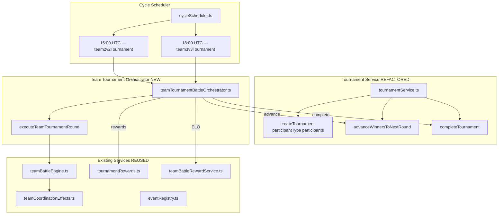

# Design Document

## Spec: Team Battle Tournaments (2v2 and 3v3)

## Overview

This design generalises the existing robot-keyed tournament system into an entity-agnostic infrastructure that serves 1v1 robot tournaments, 2v2 team tournaments, and 3v3 team tournaments through a single codebase. The core change is a schema migration replacing `robot1Id`/`robot2Id`/`winnerId` foreign keys with `participant1Id`/`participant2Id`/`winnerId` integers paired with a `participantType` discriminator column.

Team tournaments reuse the Team Battle Engine (`simulateTeamBattle`) from Spec 37 for combat execution, the same `generateStandardSeedOrder` algorithm for bracket generation, and the existing `calculateTournamentWinReward` formula (multiplied by team size N) for rewards. They run in the reserved cron slots at 15:00 UTC (2v2) and 18:00 UTC (3v3), advancing one round per daily cycle.

### Key Design Decisions

1. **Entity-agnostic schema with discriminator** — `participantType` column (`'robot'` | `'team_2v2'` | `'team_3v3'`) on both `Tournament` and `ScheduledTournamentMatch`. No FK constraints on participant columns (resolved at query time via conditional joins).

2. **Multi-step migration** — Add new columns → copy data → verify counts → drop old columns. Reversible via down migration that copies back.

3. **Unified tournament service** — A single `createTournament(participantType, participants)` function replaces the robot-specific `createSingleEliminationTournament`. The existing 1v1 flow calls it with `participantType = 'robot'`.

4. **Team tournament orchestrator** — New `teamTournamentBattleOrchestrator.ts` dispatches to `simulateTeamBattle` instead of `simulateBattle`, handles draw tiebreaking (HP sum → seed position), and distributes N× rewards.

5. **Per-type championship counters** — `championshipTitles1v1`, `championshipTitles2v2`, `championshipTitles3v3` on User model. Existing `championshipTitles` migrated to `championshipTitles1v1`; backward-compatible total computed as sum.

6. **Subscription gating** — `tournament_2v2` and `tournament_3v3` registered in Event Registry. All member robots must hold the subscription. Locking predicate checks for pending/scheduled matches in active tournaments.

7. **One round per cycle** — Same cadence as 1v1 tournaments. Multi-day tournament arcs preserved.

---

## Architecture

### High-Level System Flow



### Before/After Module Layout

**Before (current state):**
```
app/backend/src/services/tournament/
├── tournamentService.ts           # Robot-keyed bracket generation, seeding, advancement
├── tournamentBattleOrchestrator.ts # 1v1 battle execution with Robot FKs
```

**After (this spec):**
```
app/backend/src/services/tournament/
├── tournamentService.ts                    # REFACTORED: entity-agnostic bracket generation
├── tournamentBattleOrchestrator.ts         # MODIFIED: uses participant1Id/participant2Id
├── teamTournamentBattleOrchestrator.ts     # NEW: team tournament match execution
├── teamTournamentService.ts                # NEW: team eligibility, creation, seeding
├── tournamentParticipantResolver.ts         # NEW: resolves participant details by type
```

### Component Map

| Component | Status | Description |
|-----------|--------|-------------|
| `tournamentService.ts` | **REFACTORED** | Entity-agnostic bracket generation, seeding, advancement |
| `teamTournamentBattleOrchestrator.ts` | **NEW** | Team match execution, draw tiebreaking, N× rewards |
| `teamTournamentService.ts` | **NEW** | Team eligibility, tournament creation, combined-ELO seeding |
| `tournamentParticipantResolver.ts` | **NEW** | Resolves participant ID → display name, ELO, league |
| `tournamentBattleOrchestrator.ts` | **MODIFIED** | Uses `participant1Id`/`participant2Id` column names |
| `eventRegistry.ts` | **MODIFIED** | Type union extended with `tournament_2v2`, `tournament_3v3` |
| `cycleScheduler.ts` | **MODIFIED** | Reserved stubs replaced with real handlers |
| `lockingPredicates.ts` | **MODIFIED** | +2 new predicates for tournament locking |
| `rosterEligibilityFilter.ts` | **MODIFIED** | +2 new rules for tournament roster minimums |
| `notification-service.ts` | **MODIFIED** | +2 new Discord webhook message builders |
| Prisma schema | **MIGRATED** | Entity-agnostic tournament models + User championship counters |
| User model | **EXTENDED** | +3 per-type championship counter fields |

---

## Components and Interfaces

### 1. Schema Migration (R1.1–R1.10, R11.1–R11.7)

Multi-step Prisma migration with embedded SQL:

**Columns being dropped from `tournament_matches` (ScheduledTournamentMatch):**
- `robot1_id` (Int?, FK → Robot) → replaced by `participant1_id` (Int?, no FK)
- `robot2_id` (Int?, FK → Robot) → replaced by `participant2_id` (Int?, no FK)
- The `winner_id` column stays but loses its FK constraint to Robot (becomes generic participant ID)

**Columns NOT being dropped (different table):**
- `Battle.robot1Id` / `Battle.robot2Id` — these are on the `battles` table and are used by league, tag team, KotH, financial reports, etc. They are NOT touched by this migration.

**Application code that must be updated to use `participant1Id`/`participant2Id`:**

| File | Current usage | Change |
|------|--------------|--------|
| `tournamentService.ts` | `robot1Id`/`robot2Id` in bracket generation, `advanceWinnersToNextRound` | Rename to `participant1Id`/`participant2Id` |
| `tournamentBattleOrchestrator.ts` | `tournamentMatch.robot1Id`/`robot2Id` to load robots | Use `participant1Id`/`participant2Id` + resolve via `participantType` |
| `lockingPredicates.ts` | `{ OR: [{ robot1Id: robotId }, { robot2Id: robotId }] }` | Change to `{ OR: [{ participant1Id: ... }, { participant2Id: ... }] }` with team membership lookup for team tournaments |
| `resetService.ts` | Cleanup queries on `scheduledTournamentMatch` | Rename column references |
| `robotQueryService.ts` | Upcoming tournament matches query | Rename + add `participantType = 'robot'` filter for 1v1 queries |
| `matchHistoryService.ts` | Bye match detection | Rename column references |
| Frontend `MatchCard.tsx` | `match.robot1Id`/`match.robot2Id` for highlighting | Rename to `participant1Id`/`participant2Id` |
| Frontend `BracketView.tsx` | User robot detection in bracket | Rename + adapt for team participant IDs |
| Frontend `DesktopBracket.tsx` | User-related match detection | Rename to `participant1Id`/`participant2Id` |
| Frontend `MobileBracket.tsx` | User-related match filtering | Rename to `participant1Id`/`participant2Id` |
| Frontend `tournament-bracket-seeding.property.test.ts` | Test mock data | Update field names |

**Prisma relations being removed from Robot model:**
- `tournamentsWon Tournament[] @relation("TournamentWinner")` — no longer valid (winnerId is generic)
- `tournamentMatchesAsRobot1 ScheduledTournamentMatch[] @relation("TournamentRobot1")` — column gone
- `tournamentMatchesAsRobot2 ScheduledTournamentMatch[] @relation("TournamentRobot2")` — column gone
- `tournamentMatchesWon ScheduledTournamentMatch[] @relation("TournamentMatchWinner")` — winnerId is generic

These relations are NOT used anywhere in application code (confirmed via grep — zero matches for `tournamentMatchesAsRobot`, `tournamentsWon`, `tournamentMatchWins`). They only exist in the Prisma schema for type generation.

**Step 1 — Add new columns:** `participant1_id`, `participant2_id`, `participant_type` on `tournament_matches`; `participant_type` on `tournaments`; `championship_titles_1v1/2v2/3v3` on `users`.

**Step 2 — Copy data:** `UPDATE tournament_matches SET participant1_id = robot1_id, participant2_id = robot2_id, participant_type = 'robot'`; `UPDATE tournaments SET participant_type = 'robot'`; `UPDATE users SET championship_titles_1v1 = championship_titles`.

**Step 3 — Verify:** Assert `COUNT(participant1_id IS NOT NULL) = COUNT(robot1_id IS NOT NULL)` and same for participant2. If mismatch → `RAISE EXCEPTION` → rollback.

**Step 4 — Drop old columns:** Remove `robot1_id`, `robot2_id` from `tournament_matches`. Remove FK constraints on `winner_id` (both tables).

**Down migration:** Add `robot1_id`/`robot2_id` back, copy from `participant1_id`/`participant2_id` where `participant_type = 'robot'`, drop new columns.

### 2. Updated Prisma Models (R1.1–R1.7, R6.2–R6.4)

```prisma
model Tournament {
  id              Int    @id @default(autoincrement())
  name            String @db.VarChar(100)
  tournamentType  String @map("tournament_type") @db.VarChar(50)
  participantType String @default("robot") @map("participant_type") @db.VarChar(20)
  status          String @default("pending") @db.VarChar(20)
  currentRound      Int @default(1) @map("current_round")
  maxRounds         Int @map("max_rounds")
  totalParticipants Int @map("total_participants")
  winnerId Int? @map("winner_id") // Generic ID, no FK constraint
  createdAt   DateTime  @default(now()) @map("created_at")
  startedAt   DateTime? @map("started_at")
  completedAt DateTime? @map("completed_at")
  matches ScheduledTournamentMatch[]
  battles Battle[] @relation("TournamentBattles")
  @@index([status])
  @@index([participantType, status])
  @@map("tournaments")
}

model ScheduledTournamentMatch {
  id           Int @id @default(autoincrement())
  tournamentId Int @map("tournament_id")
  round        Int
  matchNumber  Int @map("match_number")
  participantType String @default("robot") @map("participant_type") @db.VarChar(20)
  participant1Id  Int?   @map("participant1_id")
  participant2Id  Int?   @map("participant2_id")
  winnerId   Int?    @map("winner_id")
  battleId   Int?    @unique @map("battle_id")
  status     String  @default("pending") @db.VarChar(20)
  isByeMatch Boolean @default(false) @map("is_bye_match")
  createdAt   DateTime  @default(now()) @map("created_at")
  completedAt DateTime? @map("completed_at")
  tournament Tournament @relation(fields: [tournamentId], references: [id], onDelete: Cascade)
  battle     Battle?    @relation(fields: [battleId], references: [id])
  @@index([tournamentId, round])
  @@index([status])
  @@index([participant1Id])
  @@index([participant2Id])
  @@map("tournament_matches")
}
```

**User model additions:** `championshipTitles1v1`, `championshipTitles2v2`, `championshipTitles3v3` (Int, default 0). Existing `championshipTitles` kept as backward-compatible total.

**Robot model:** Remove `tournamentMatchesAsRobot1`, `tournamentMatchesAsRobot2`, `tournamentMatchWins`, `tournamentsWon` relations.

### 3. Participant Resolver (R1.8, R1.9, R1.10)

```typescript
// services/tournament/tournamentParticipantResolver.ts
export type ParticipantType = 'robot' | 'team_2v2' | 'team_3v3';
const VALID_TYPES: ParticipantType[] = ['robot', 'team_2v2', 'team_3v3'];

export interface ResolvedParticipant {
  id: number;
  displayName: string;
  leagueTier: string;
  elo: number;
  ownerId: number;
  members?: { robotId: number; robotName: string; elo: number }[];
}

export function validateParticipantType(type: string): asserts type is ParticipantType {
  if (!VALID_TYPES.includes(type as ParticipantType)) {
    throw new TournamentError(TournamentErrorCode.INVALID_PARTICIPANT_TYPE, `Unrecognized: ${type}`, 400);
  }
}

export async function resolveParticipant(id: number, type: ParticipantType): Promise<ResolvedParticipant> {
  if (type === 'robot') {
    const robot = await prisma.robot.findUnique({ where: { id }, include: { user: true } });
    return { id: robot.id, displayName: robot.name, leagueTier: robot.currentLeague, elo: robot.elo, ownerId: robot.userId };
  }
  const team = await prisma.teamBattle.findUnique({ where: { id }, include: { members: { include: { robot: true } }, stable: true } });
  const members = team.members.map(m => ({ robotId: m.robot.id, robotName: m.robot.name, elo: m.robot.elo }));
  return { id: team.id, displayName: team.teamName, leagueTier: team.teamLeague, elo: members.reduce((s, m) => s + m.elo, 0), ownerId: team.stableId, members };
}

export async function resolveParticipantsBatch(ids: number[], type: ParticipantType): Promise<Map<number, ResolvedParticipant>> { /* batch query */ }
```

### 4. Refactored Tournament Service (R2.1–R2.8, R5.1–R5.6)

Key changes to `tournamentService.ts`:

- **`seedParticipantsByELO(participants)`** — Sorts by ELO descending, tie-break by `createdAt` ascending.
- **`generateBracketPairsGeneric(seeded, maxRounds, participantType)`** — Same algorithm as current `generateBracketPairs` but uses `participant1Id`/`participant2Id`. Max bracket size capped at 64.
- **`createTournament(options: { participantType, participants, namePrefix })`** — Entity-agnostic creation. Sequential naming per type (`"2v2 Tournament #N"`).
- **`advanceWinnersToNextRound(tournamentId)`** — Updated column names only. Logic unchanged.
- **`completeTournament(tournamentId, winnerId, participantType)`** — Awards championship title to correct per-type counter based on `participantType`.

The existing `createSingleEliminationTournament` becomes a thin wrapper calling `createTournament` with `participantType = 'robot'`.

### 5. Team Tournament Service (R2.1–R2.8, R3.1–R3.7)

```typescript
// services/tournament/teamTournamentService.ts
export async function getEligibleTeamsForTournament(teamSize: 2 | 3): Promise<SeedableParticipant[]> {
  const eventType = teamSize === 2 ? 'tournament_2v2' : 'tournament_3v3';
  const teams = await prisma.teamBattle.findMany({ where: { teamSize, eligibility: 'ELIGIBLE' }, include: { members: { include: { robot: true } } } });
  // Batch-activate pending subscriptions, filter by all-members-subscribed + scheduling-ready
  // Return as SeedableParticipant[] with elo = sum of member robot ELOs
}

export async function createTeamTournament(teamSize: 2 | 3): Promise<TournamentCreationResult> {
  const eligible = await getEligibleTeamsForTournament(teamSize);
  if (eligible.length < 4) throw new TournamentError(INSUFFICIENT_PARTICIPANTS, ...);
  return createTournament({ participantType: teamSize === 2 ? 'team_2v2' : 'team_3v3', participants: eligible });
}
```

**Locking predicate:**
```typescript
export async function tournament2v2LockingPredicate(robotId: number): Promise<boolean> {
  const memberships = await prisma.teamBattleMember.findMany({ where: { robotId }, select: { teamId: true } });
  if (memberships.length === 0) return false;
  const count = await prisma.scheduledTournamentMatch.count({
    where: { participantType: 'team_2v2', status: { in: ['pending', 'scheduled'] },
      OR: [{ participant1Id: { in: memberships.map(m => m.teamId) } }, { participant2Id: { in: memberships.map(m => m.teamId) } }],
      tournament: { status: 'active' } },
  });
  return count > 0;
}
// tournament3v3LockingPredicate: same pattern with 'team_3v3'
```

### 6. Team Tournament Battle Orchestrator (R4.1–R4.7, R6.5–R6.10)

**Reward Formula:**

Team tournament rewards use the existing `calculateTournamentWinReward` formula (progression-based, NOT league-tier-based) multiplied by team size N. Each robot on the winning team receives the full N× amount (not split).

Formula: `BASE_CREDIT_REWARD (₡20,000) × sizeMultiplier × roundProgressMultiplier × teamSize`

- `sizeMultiplier = 1 + log10(totalParticipants / 10) × 0.5`
- `roundProgressMultiplier = currentRound / maxRounds`
- Loser gets 30% of winner reward
- Finals add +500 prestige championship bonus

**Example reward table (8-team tournament, 3 rounds):**

| Round | Progress | Size Mult | 1v1 Winner | 2v2 Winner (per robot) | 3v3 Winner (per robot) | Loser (per robot) |
|-------|----------|-----------|------------|------------------------|------------------------|-------------------|
| R1 (Quarterfinals) | 0.33 | 0.95 | ₡6,333 | ₡12,667 | ₡19,000 | 30% of winner |
| R2 (Semifinals) | 0.67 | 0.95 | ₡12,667 | ₡25,333 | ₡38,000 | 30% of winner |
| R3 (Finals) | 1.00 | 0.95 | ₡19,000 | ₡38,000 | ₡57,000 | 30% of winner |

**Example reward table (16-team tournament, 4 rounds):**

| Round | Progress | Size Mult | 1v1 Winner | 2v2 Winner (per robot) | 3v3 Winner (per robot) | Loser (per robot) |
|-------|----------|-----------|------------|------------------------|------------------------|-------------------|
| R1 (Round of 16) | 0.25 | 1.10 | ₡5,500 | ₡11,000 | ₡16,500 | 30% of winner |
| R2 (Quarterfinals) | 0.50 | 1.10 | ₡11,000 | ₡22,000 | ₡33,000 | 30% of winner |
| R3 (Semifinals) | 0.75 | 1.10 | ₡16,500 | ₡33,000 | ₡49,500 | 30% of winner |
| R4 (Finals) | 1.00 | 1.10 | ₡22,000 | ₡44,000 | ₡66,000 | 30% of winner |

**Additional rewards per robot:**
- **Prestige (match winner, every round):** Stepped curve: R1=20, R2=30, R3=40, R4=50, R5+=60 (capped at 60 for rounds 5+). Championship bonus: +150 for winning the final round. Teams accumulate prestige across rounds (sum of all rounds won). Losers earn zero.
- **Prestige (match loser):** Zero. Losers do not earn prestige. Prestige is earned by winning.
- **Fame:** `BASE_FAME (10) × exclusivityMultiplier × performanceBonus` (HP-based: perfect=2×, dominating=1.5×, comeback=1.25×) — match winner only
- **Streaming revenue:** `awardStreamingRevenueForParticipant` with `teamSize` param (same as team league)
- **ELO:** `calculateTeamBattleELOChanges(team1SumELO, team2SumELO, team1Won, isDraw)` — same delta applied to each member robot
- **Bye matches:** Zero rewards (no combat, no credits, no prestige, no fame, no ELO change)

**Prestige per round (stepped curve, capped at 60):**

| Round | Prestige (winner) | Prestige (loser) |
|-------|-------------------|------------------|
| R1 | 20 | 0 |
| R2 | 30 | 0 |
| R3 | 40 | 0 |
| R4 | 50 | 0 |
| R5 | 60 (cap) | 0 |
| R6+ | 60 (cap) | 0 |

**Cumulative prestige for tournament champions:**

| Tournament size | Rounds | Champion total (wins + 150 bonus) | Comparison |
|----------------|--------|-----------------------------------|------------|
| 8 teams | 3 | 20+30+40 + 150 = 240 | 3 diamond league wins = 225 |
| 16 teams | 4 | 20+30+40+50 + 150 = 290 | 4 diamond league wins = 300 |
| 32 teams | 5 | 20+30+40+50+60 + 150 = 350 | 5 diamond league wins = 375 |
| 64 teams | 6 | 20+30+40+50+60+60 + 150 = 410 | 3 champion league wins = 450 |
| 1024 teams | 10 | 20+30+40+50+60×6 + 150 = 650 | ~8 cycles normal play = 664 |

**Cumulative prestige by tournament outcome (16-team, 4-round):**

| Outcome | Rounds won | Total prestige |
|---------|-----------|----------------|
| Champion | R1+R2+R3+R4 | 20+30+40+50 + 150 = 290 |
| Finalist (lost R4) | R1+R2+R3 | 20+30+40 = 90 |
| Semifinalist (lost R3) | R1+R2 | 20+30 = 50 |
| Quarterfinalist (lost R2) | R1 | 20 |
| First-round exit | — | 0 |

**Design rationale — stepped curve with cap:** The polynomial curve (`15 × round^1.5`) produced 2,300 prestige for a 10-round champion — nearly half of what top stables earned in 60 cycles. That's game-breaking. The stepped curve (20→60, capped) keeps a 10-round champion at 650 prestige over 10 cycles (~78% of normal play income in the same period). Later rounds feel more important than early rounds, but the cap prevents explosion. The +150 championship bonus makes winning the whole thing significantly more valuable than just reaching the finals (290 vs 90 for a 4-round tournament). Losers earn zero — prestige is the reward for winning.

```typescript
// services/tournament/teamTournamentBattleOrchestrator.ts
export async function processTeamTournamentBattle(match: ScheduledTournamentMatch, tournament: Tournament): Promise<TeamTournamentBattleResult> {
  const teamSize = match.participantType === 'team_2v2' ? 2 : 3;
  const battleType = match.participantType === 'team_2v2' ? 'tournament_2v2' : 'tournament_3v3';

  // 1. Load teams with robot weapons
  // 2. prepareRobotForCombat for all 2N robots (full HP, shield, tuning)
  // 3. simulateTeamBattle(team1Robots, team2Robots, teamSize)
  // 4. Resolve draws: total HP comparison → seed position tiebreak
  // 5. Create Battle record (battleType = 'tournament_2v2'/'tournament_3v3')
  // 6. Create BattleParticipant records for all 2N robots
  // 7. Distribute rewards: calculateTournamentWinReward × teamSize per robot
  // 8. Calculate ELO via calculateTeamBattleELOChanges, apply to each member
  // 9. Award streaming revenue per robot
  // 10. Update match: winnerId, battleId, status='completed', completedAt
  // 11. Check achievements (battle_complete per robot, tournament_complete for winner)
}

export async function executeTeamTournamentRound(tournamentId: number, teamSize: 2 | 3): Promise<RoundResult> {
  const tournament = await prisma.tournament.findUnique({ where: { id: tournamentId } });
  const pendingMatches = await prisma.scheduledTournamentMatch.findMany({
    where: { tournamentId, round: tournament.currentRound, status: { in: ['pending', 'scheduled'] } },
  });
  let executed = 0, failed = 0;
  for (const match of pendingMatches) {
    // Check forfeit conditions first (R5.5, R5.6)
    const forfeit = await checkForfeitConditions(match);
    if (forfeit.shouldForfeit) { await handleForfeit(match, forfeit); executed++; continue; }
    try { await processTeamTournamentBattle(match, tournament); executed++; }
    catch (e) { logger.error(`Match ${match.id} failed: ${e}`); failed++; }
  }
  return { matchesExecuted: executed, matchesFailed: failed };
}
```

**Draw tiebreaking logic (R4.4):**
- If `simulateTeamBattle` returns `winningSide === null` (draw):
  1. Sum `finalHP` for team 1 participants vs team 2 participants
  2. Higher total HP wins
  3. If equal: `participant1Id` wins (higher seed = lower bracket position)

**Forfeit handling (R5.5, R5.6):**
```typescript
async function checkForfeitConditions(match: ScheduledTournamentMatch): Promise<ForfeitResult> {
  const team1Eligible = match.participant1Id ? await isTeamEligible(match.participant1Id) : false;
  const team2Eligible = match.participant2Id ? await isTeamEligible(match.participant2Id) : false;
  if (!team1Eligible && !team2Eligible) return { shouldForfeit: true, winnerId: null };
  if (!team1Eligible) return { shouldForfeit: true, winnerId: match.participant2Id };
  if (!team2Eligible) return { shouldForfeit: true, winnerId: match.participant1Id };
  return { shouldForfeit: false };
}
```

### 7. Cron Handler Implementation (R7.1–R7.8)

Replaces `createReservedSlotHandler('team2v2Tournament')` and `createReservedSlotHandler('team3v3Tournament')`:

```typescript
async function executeTeam2v2TournamentCycle(): Promise<JobContext> {
  await repairAllRobots(true);
  const active = await prisma.tournament.findFirst({ where: { participantType: 'team_2v2', status: 'active' } });
  if (active) {
    const result = await executeTeamTournamentRound(active.id, 2);
    await advanceWinnersToNextRound(active.id);
    return { jobName: 'team2v2Tournament', matchesCompleted: result.matchesExecuted, tournamentName: active.name, tournamentRound: active.currentRound, tournamentMaxRounds: active.maxRounds };
  }
  // No active tournament — try to create
  try { const t = await createTeamTournament(2); return { jobName: 'team2v2Tournament', tournamentName: t.tournament.name, tournamentScheduled: true }; }
  catch (e) { if (e instanceof TournamentError && e.code === 'INSUFFICIENT_PARTICIPANTS') { logger.info(`Skipped: ${e.message}`); return { jobName: 'team2v2Tournament' }; } throw e; }
}
// executeTeam3v3TournamentCycle: same pattern with teamSize=3, participantType='team_3v3'
```

### 8. Event Registry & Subscription (R3.1–R3.6)

```typescript
// Extended type union
export type SubscribableEventType = 'league_1v1' | 'tournament_1v1' | 'tag_team' | 'koth' | 'league_2v2' | 'league_3v3' | 'tournament_2v2' | 'tournament_3v3';

// Registration at startup (src/index.ts)
registerSubscribableEvent({ type: 'tournament_2v2', label: '2v2 Tournament', lockingPredicate: tournament2v2LockingPredicate });
registerSubscribableEvent({ type: 'tournament_3v3', label: '3v3 Tournament', lockingPredicate: tournament3v3LockingPredicate });

// Roster eligibility filter additions
{ eventType: 'tournament_2v2', minRobots: 2, reason: '2v2 Tournament requires 2 or more robots in your Stable' },
{ eventType: 'tournament_3v3', minRobots: 3, reason: '3v3 Tournament requires 3 or more robots in your Stable' },
```

### 9. Frontend Changes (R9.1–R9.25)

| Page | Changes |
|------|---------|
| **TournamentsPage** | Type filter row (`All`, `1v1`, `2v2`, `3v3`). Type badge on cards. Per-type stats. |
| **TournamentDetailPage** | BracketView resolves names via `participantType`. Team nodes show team name + expandable members. Highlight user's teams. Champion banner shows team + stable. |
| **BattleHistoryPage** | Add `tournament_2v2`, `tournament_3v3` filter options. Team name display. |
| **BattleDetailPage** | Group participants by team for team tournament battles. |
| **RobotDetailPage** | Matches tab includes team tournament battles. Per-type championship wins. Active tournament status. Subscription section shows new event types. |
| **DashboardPage** | Tournament status card when user's team is in active tournament. |
| **HallOfRecordsPage** | Team tournament champions section grouped by type. |
| **BookingOfficePage** | Subscription matrix includes `tournament_2v2`/`tournament_3v3` columns. |
| **StableViewPage** | Per-type championship counts with distinct trophy icons. |

**BracketView component:** Updated props include `participantType` and `userParticipantIds` (Set of team IDs or robot IDs). Resolves display names based on type.

**Mobile responsiveness:** Bracket uses vertical stacked layout on viewports < 1024px, horizontal tree on ≥ 1024px. All interactive elements have touch targets ≥ 44px.

### 10. Achievement Integration (R10.1–R10.7)

4 new achievements:

| ID | Name | Trigger | Threshold | Tier |
|----|------|---------|-----------|------|
| C79 | "R2-D2 & C-3PO" | `tournament_2v2_wins` | 1 | Easy |
| C80 | "Jaeger Pilots" | `tournament_2v2_wins` | 3 | Hard |
| C81 | "Triforce" | `tournament_3v3_wins` | 1 | Easy |
| C82 | "Devastator" | `tournament_3v3_wins` | 3 | Hard |

C18 "Autobots, Roll Out!" evaluates `championshipTitles1v1 + championshipTitles2v2 + championshipTitles3v3 >= 1`.

Tournament battles fire `battle_complete` per robot with `battleType = 'tournament_2v2'/'tournament_3v3'`. They do NOT increment `totalLeague2v2Wins`/`totalLeague3v3Wins`.

### 11. Admin Portal (R8.1–R8.8)

- Type filter on tournament management page (`1v1`, `2v2`, `3v3`, `All`)
- Team bracket rendering with member robot names
- Manual-trigger endpoints: `POST /api/admin/team-2v2-tournament/trigger`, `POST /api/admin/team-3v3-tournament/trigger`
- Response: `{ matchesExecuted, matchesFailed, tournamentComplete, championTeamId }`
- Active "Run" buttons for team tournament cron slots (replacing "Reserved" badges)
- Audit trail on manual trigger (`recordAuditAction`)

### 12. Discord Notifications (R12.1–R12.4)

```typescript
case 'team2v2Tournament':
  return matchesCompleted > 0
    ? `⚔️ 2v2 Tournament: Round ${tournamentRound}/${tournamentMaxRounds} — ${matchesCompleted} matches. [View](${appUrl}/tournaments)`
    : null;
// Tournament completion: separate notification from completeTournament
```

### 13. Hall of Records (R15.1–R15.4)

`/api/records` response extended with `tournamentChampions2v2` and `tournamentChampions3v3` arrays (10 most recent per type). Cached in `recordsCache` (5-min TTL). Omit section if no completed tournaments of that type.

### 14. Seeded User Generation (R14.1–R14.7)

Seed script creates: 4+ eligible teams per size with tournament subscriptions, 1 completed tournament per size (full bracket history), 1 active tournament per size (partial progress). Upsert semantics. Only in `acceptance`/`development` modes.

**Subscription Assignment Rules (after this spec — 8 event types total):**

Available events: `league_1v1`, `tournament_1v1`, `tag_team`, `koth`, `league_2v2`, `league_3v3`, `tournament_2v2`, `tournament_3v3`

| Stable Size | Booking Office Level | Cap | Subscription Assignment |
|-------------|---------------------|-----|------------------------|
| 1 robot | L0 | 3 | `league_1v1` + `tournament_1v1` + `koth` |
| 2 robots | L1 | 4 | Pick 2 from {`league_2v2`, `tag_team`, `tournament_2v2`} + pick 2 from {`league_1v1`, `tournament_1v1`, `koth`} |
| 3 robots | L1 | 4 | Pick 1–2 from {`league_3v3`, `tournament_3v3`} + pick 1 from {`league_2v2`, `tag_team`, `tournament_2v2`} + fill remaining from {`league_1v1`, `tournament_1v1`, `koth`} |
| 4+ robots | L2 | 5 | `league_3v3` + `tournament_3v3` + pick 1 from {`league_2v2`, `tournament_2v2`, `tag_team`} + pick 2 from {`league_1v1`, `tournament_1v1`, `koth`} |
| 6+ robots | L3+ | 6+ | Can subscribe to all team modes + fill individual modes with remaining slots |

**Key constraints enforced:**
- 1-robot stables NEVER get `league_2v2`, `league_3v3`, `tournament_2v2`, or `tournament_3v3` (roster eligibility filter blocks them)
- 2-robot stables NEVER get `league_3v3` or `tournament_3v3` (need 3+ robots)
- At least 4 stables with 2+ robots must receive `tournament_2v2` to populate a bracket
- At least 4 stables with 3+ robots must receive `tournament_3v3` to populate a bracket
- Subscriptions are distributed with variety — not all 2-robot stables get the same set

**For real (non-seeded) players:**

Players manage their own subscriptions via the Booking Office UI. The system enforces:
- Roster eligibility filter prevents subscribing to events the stable can't participate in
- Booking Office level caps total concurrent subscriptions per robot
- No automatic subscription assignment — players choose which modes to enter

The onboarding flow (existing) suggests initial subscriptions when a player first visits the Booking Office. After this spec, the onboarding suggestions follow the same roster-aware logic as the seed script (only suggest events the stable is eligible for).

### 15. In-Game Guides (R13.1–R13.4)

- New: `src/content/guide/tournaments/team-tournaments.md`
- Updated: `src/content/guide/facilities/booking-office.md` (8 event types)
- Updated: Existing tournament guide (three formats: 1v1, 2v2, 3v3)

---

## Data Models

### Tournament (migrated)

| Field | Type | Notes |
|-------|------|-------|
| id | Int (PK) | Auto-increment |
| name | String(100) | Sequential per type: "2v2 Tournament #N" |
| tournamentType | String(50) | Always "single_elimination" |
| **participantType** | **String(20)** | **NEW: 'robot' \| 'team_2v2' \| 'team_3v3'** |
| status | String(20) | pending → active → completed |
| currentRound | Int | 1-based |
| maxRounds | Int | ceil(log2(participants)) |
| totalParticipants | Int | Count at creation |
| winnerId | Int? | **CHANGED: no FK constraint, generic participant ID** |
| createdAt | DateTime | |
| startedAt | DateTime? | |
| completedAt | DateTime? | |

### ScheduledTournamentMatch (migrated)

| Field | Type | Notes |
|-------|------|-------|
| id | Int (PK) | Auto-increment |
| tournamentId | Int (FK) | → Tournament |
| round | Int | 1-based round number |
| matchNumber | Int | Position in round |
| **participantType** | **String(20)** | **NEW: inherited from parent Tournament** |
| **participant1Id** | **Int?** | **REPLACES robot1Id** |
| **participant2Id** | **Int?** | **REPLACES robot2Id** |
| winnerId | Int? | **CHANGED: no FK constraint** |
| battleId | Int? (unique) | → Battle |
| status | String(20) | pending, scheduled, completed, bye, forfeit |
| isByeMatch | Boolean | |
| createdAt | DateTime | |
| completedAt | DateTime? | |

### User (extended)

| Field | Type | Notes |
|-------|------|-------|
| championshipTitles | Int | Backward-compatible total (sum of per-type) |
| **championshipTitles1v1** | **Int** | **NEW: backfilled from existing championshipTitles** |
| **championshipTitles2v2** | **Int** | **NEW: default 0** |
| **championshipTitles3v3** | **Int** | **NEW: default 0** |

### Battle (extended battleType values)

New allowed values: `'tournament_2v2'`, `'tournament_3v3'`.

### Achievement (new rows)

4 new seed rows (C79–C82) with trigger types `tournament_2v2_wins` and `tournament_3v3_wins`.

---

## Correctness Properties

*A property is a characteristic or behavior that should hold true across all valid executions of a system — essentially, a formal statement about what the system should do. Properties serve as the bridge between human-readable specifications and machine-verifiable correctness guarantees.*

### Property 1: Participant type consistency invariant

*For any* tournament and all its associated `ScheduledTournamentMatch` rows, the `participantType` value on every match row SHALL equal the `participantType` value on the parent `Tournament` record.

**Validates: Requirements 1.10**

### Property 2: Invalid participant type rejection

*For any* string that is not one of `'robot'`, `'team_2v2'`, or `'team_3v3'`, attempting to create a tournament or match with that `participantType` value SHALL produce a validation error.

**Validates: Requirements 1.9**

### Property 3: Participant resolver correctness

*For any* valid `(participantId, participantType)` pair where the referenced entity exists, the participant resolver SHALL return an object containing at minimum the participant's ID, a non-empty display name, and a league tier string. When `participantType` is `'robot'`, the display name SHALL be the robot's name. When `participantType` is `'team_2v2'` or `'team_3v3'`, the display name SHALL be the team's `teamName`.

**Validates: Requirements 1.8**

### Property 4: Seeding order correctness

*For any* set of tournament participants, the seeding function SHALL produce an ordering where participants are sorted by ELO descending, and for any two participants with equal ELO, the one with the earlier `createdAt` timestamp appears first (lower seed number).

**Validates: Requirements 2.2**

### Property 5: Bracket size and bye count

*For any* participant count N where 4 ≤ N ≤ 64, the generated bracket SHALL have size equal to the smallest power of 2 ≥ N, the number of bye matches SHALL equal (bracketSize − N), and the total number of first-round match slots SHALL equal bracketSize / 2.

**Validates: Requirements 2.3**

### Property 6: Bye match auto-completion

*For any* bye match in any round (a match where exactly one participant is present and the other slot is null), the tournament system SHALL set `winnerId` to the present participant's ID, `status` to `'completed'` or `'bye'`, and `battleId` to null — without executing combat or awarding rewards.

**Validates: Requirements 2.6, 5.4, 6.10**

### Property 7: Tournament creation threshold

*For any* team size (2 or 3) and set of eligible teams of that size, a tournament SHALL be created if and only if the eligible count is ≥ 4. When the count is < 4, no tournament is created and no error is raised.

**Validates: Requirements 2.1, 2.8**

### Property 8: Sequential tournament naming

*For any* sequence of tournament creations of the same `participantType`, the N-th tournament of that type SHALL be named `"{prefix} #{N}"` where prefix is `"Tournament"` for robot, `"2v2 Tournament"` for team_2v2, and `"3v3 Tournament"` for team_3v3, and N equals the total count of tournaments of that type at creation time plus one.

**Validates: Requirements 2.5**

### Property 9: Team eligibility requires full subscription and eligible status

*For any* team, the team is eligible for tournament entry if and only if: (a) the team's `eligibility` field equals `'ELIGIBLE'`, AND (b) every member robot holds an active subscription to the corresponding event type, AND (c) every member robot passes scheduling readiness checks.

**Validates: Requirements 3.2, 3.3, 3.7**

### Property 10: Tournament locking predicate

*For any* robot that is a member of a team with at least one pending or scheduled match in an active tournament of the corresponding type, the locking predicate SHALL return `true`. For any robot not in such a team, the predicate SHALL return `false`.

**Validates: Requirements 3.5**

### Property 11: Draw tiebreaking determinism

*For any* team tournament match where the Team Battle Engine returns a draw, the winner SHALL be determined by: (1) the team with higher total remaining HP summed across all members wins, or (2) if total HP is equal, the higher-seeded team (participant1, lower bracket position) wins. The result is never a draw in tournament context.

**Validates: Requirements 4.4**

### Property 12: Winner advancement correctness

*For any* completed round in a tournament, winners SHALL be placed into the next round such that the winner of match K feeds into position `ceil(K/2)` of the next round, alternating between `participant1Id` (odd K) and `participant2Id` (even K). No winner is lost or duplicated during advancement.

**Validates: Requirements 5.1**

### Property 13: Tournament completion detection

*For any* tournament where the final round produces exactly one winner, the tournament SHALL be marked with `status = 'completed'`, `winnerId` set to the final winner's participant ID, and `completedAt` set to the current timestamp.

**Validates: Requirements 5.2**

### Property 14: Forfeit on ineligibility

*For any* pending match where one team's `eligibility` field is not `'ELIGIBLE'` at round execution time, that match SHALL be resolved as a forfeit with the eligible opponent advancing as winner. If both teams are ineligible, the match SHALL be forfeited with `winnerId = null` and a bye propagated to the next round.

**Validates: Requirements 5.5, 5.6**

### Property 15: Championship counter isolation

*For any* tournament win, exactly one per-type counter SHALL be incremented (the one matching the tournament's `participantType`), the unified `championshipTitles` counter SHALL be incremented by 1, and all other per-type counters SHALL remain unchanged.

**Validates: Requirements 6.1, 6.3**

### Property 16: Team tournament reward formula (N× multiplier)

*For any* team tournament match with team size N, the per-robot reward for the winning team SHALL equal `calculateTournamentWinReward(totalParticipants, currentRound, maxRounds) × N`, and each member robot on the winning team SHALL receive this full amount (not split).

**Validates: Requirements 6.5, 6.6**

### Property 17: C18 achievement evaluation

*For any* user with per-type championship counters `(titles1v1, titles2v2, titles3v3)`, the C18 "Autobots, Roll Out!" achievement SHALL evaluate to unlocked if and only if `titles1v1 + titles2v2 + titles3v3 >= 1`.

**Validates: Requirements 10.3**

### Property 18: Tournament battles do not affect league counters

*For any* team tournament battle completion (battleType = `'tournament_2v2'` or `'tournament_3v3'`), the `totalLeague2v2Wins` and `totalLeague3v3Wins` counters on participating robots SHALL remain unchanged.

**Validates: Requirements 10.4**

---

## Error Handling

| Error Code | Condition | HTTP | Recovery |
|-----------|-----------|------|----------|
| `INSUFFICIENT_PARTICIPANTS` | < 4 eligible teams at creation | 400 | Log and skip; cron continues |
| `TOURNAMENT_NOT_FOUND` | Tournament ID doesn't exist | 404 | Abort operation |
| `MATCH_MISSING_PARTICIPANTS` | Non-bye match has null participant IDs | 400 | Skip match, continue round |
| `INVALID_PARTICIPANT_TYPE` | participantType not in allowed set | 400 | Reject with validation error |
| `PARTICIPANT_TYPE_MISMATCH` | Match type differs from parent tournament | 500 | Log critical error |
| `TEAM_NOT_FOUND` | Team referenced by participant ID doesn't exist | 404 | Forfeit match |
| `BATTLE_EXECUTION_FAILED` | simulateTeamBattle throws | 500 | Skip match, continue round (R7.6) |
| `ROUND_NOT_READY` | Advancing when current round incomplete | 400 | No-op; wait for next cycle |

**Cron handler strategy:** Continue-on-failure. Each match wrapped in try/catch. Failed matches logged and skipped. Remaining matches continue. Job context reports partial failure.

**Migration strategy:** Verify-or-rollback. Row count assertions after data copy. If verification fails → exception → Prisma rolls back entire migration.

**Frontend:** Loading skeletons, error states with retry buttons (R9.25), 401 → login redirect, 404 → "not found" with back link.

---

## Testing Strategy

### Property-Based Testing (fast-check)

**Library:** fast-check (already used in project for both backend Jest and frontend Vitest)

**Configuration:** Minimum 100 iterations per property test.

**Tag format:** `Feature: team-battle-tournaments, Property {N}: {title}`

| Property | Test File | Key Generators |
|----------|-----------|----------------|
| P1: Type consistency | `tournamentService.property.test.ts` | `fc.constantFrom('robot', 'team_2v2', 'team_3v3')`, `fc.integer({min:4, max:64})` |
| P2: Invalid type rejection | `tournamentService.property.test.ts` | `fc.string().filter(s => !validTypes.includes(s))` |
| P3: Resolver correctness | `tournamentParticipantResolver.property.test.ts` | `fc.record({id: fc.nat(), type: fc.constantFrom(...)})` |
| P4: Seeding order | `tournamentService.property.test.ts` | `fc.array(fc.record({elo: fc.integer(), createdAt: fc.date()}), {minLength:4, maxLength:64})` |
| P5: Bracket size/byes | `tournamentService.property.test.ts` | `fc.integer({min:4, max:64})` |
| P6: Bye auto-completion | `tournamentService.property.test.ts` | `fc.integer({min:4, max:64}).filter(n => !isPowerOf2(n))` |
| P7: Creation threshold | `teamTournamentService.property.test.ts` | `fc.integer({min:0, max:100})` |
| P8: Sequential naming | `tournamentService.property.test.ts` | `fc.integer({min:1, max:20})`, `fc.constantFrom(...)` |
| P9: Team eligibility | `teamTournamentService.property.test.ts` | `fc.record({eligible: fc.boolean(), subscriptions: fc.array(fc.boolean())})` |
| P10: Locking predicate | `teamTournamentService.property.test.ts` | `fc.boolean()` (has pending matches) |
| P11: Draw tiebreaking | `teamTournamentBattleOrchestrator.property.test.ts` | `fc.record({team1HP: fc.nat(), team2HP: fc.nat()})` |
| P12: Winner advancement | `tournamentService.property.test.ts` | `fc.array(fc.nat(), {minLength:2, maxLength:32})` |
| P13: Completion detection | `tournamentService.property.test.ts` | `fc.integer({min:1, max:6})` |
| P14: Forfeit handling | `teamTournamentBattleOrchestrator.property.test.ts` | `fc.record({t1Eligible: fc.boolean(), t2Eligible: fc.boolean()})` |
| P15: Championship isolation | `tournamentService.property.test.ts` | `fc.constantFrom('robot', 'team_2v2', 'team_3v3')` |
| P16: N× reward formula | `teamTournamentBattleOrchestrator.property.test.ts` | `fc.record({participants: fc.integer({min:4,max:64}), round: fc.integer({min:1,max:6}), teamSize: fc.constantFrom(2,3)})` |
| P17: C18 evaluation | `achievementService.property.test.ts` | `fc.record({t1v1: fc.nat({max:10}), t2v2: fc.nat({max:10}), t3v3: fc.nat({max:10})})` |
| P18: League counter isolation | `teamTournamentBattleOrchestrator.property.test.ts` | `fc.constantFrom('tournament_2v2', 'tournament_3v3')` |

### Unit Tests (example-based)

- Tournament creation with exactly 4 teams (minimum bracket)
- Tournament creation with 64 teams (maximum bracket)
- Admin trigger with no active tournament (error response)
- Admin trigger with active tournament (success)
- Participant resolver with non-existent ID (returns null)
- Discord notification format for round completion and tournament completion
- Frontend type filter rendering

### Integration Tests

- Full tournament lifecycle: create → execute rounds → complete → award championship
- Migration verification: row counts before/after
- Cron handler with active tournament: executes round and advances
- Cron handler with no tournament + sufficient teams: creates tournament
- Cron handler with insufficient teams: skips gracefully
- Subscription locking: cannot unsubscribe while in active tournament
- Achievement C18 fires on first team tournament win

---

## Documentation Impact

### Steering Files to Update

| File | Change |
|------|--------|
| `.kiro/steering/project-overview.md` | Add "Team Battle Tournaments (2v2 and 3v3)" to Key Systems list; update Booking Office description to mention 8 event types; update Daily Cron Schedule to show team tournament slots as active |
| `.kiro/steering/coding-standards.md` | No changes needed |

### Guide Documents to Update

| File | Change |
|------|--------|
| `docs/architecture/PRD_SERVICE_DIRECTORY.md` | Update Cron Schedule section: team2v2Tournament and team3v3Tournament marked as active |
| `docs/game-systems/` | Add team tournament game design documentation |

### New Documentation

| File | Purpose |
|------|---------|
| `src/content/guide/tournaments/team-tournaments.md` | In-game guide article for team tournament participation |
| Updated `src/content/guide/facilities/booking-office.md` | Lists all 8 event types |
| Updated existing tournament guide | Mentions three formats (1v1, 2v2, 3v3) |
