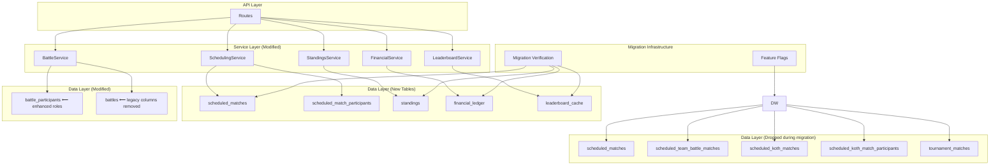
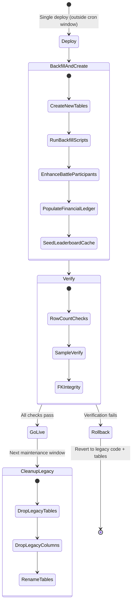

# Design Document: Database Unification

## Overview

This design describes a major structural overhaul of the ArmouredSouls database. The goal is to eliminate redundancy, consolidate scattered competitive data into purpose-built tables, remove legacy denormalized columns, and introduce pre-computed caches for financial and leaderboard queries.

The overhaul touches 5 major domains:
1. **Scheduling** — 5 tables → 2 (unified polymorphic scheduling)
2. **Standings** — scattered league columns → 1 unified standings table
3. **Battles** — 20 legacy columns removed, participant roles enhanced
4. **Finances** — new append-only ledger table
5. **Leaderboards** — materialized cache table

All changes deploy in a single release. Scheduling data is short-lived (created and completed within the same cycle), so it can be migrated atomically. Standings and battle data are migrated via backfill scripts run during the deploy. Feature flags remain for rollback safety on the read-path, but dual-write is eliminated — the cutover is immediate.

## Architecture

### High-Level System Diagram



### Migration Phase Diagram



### Design Decisions

| Decision | Rationale |
|----------|-----------|
| Single polymorphic `scheduled_matches` table (not separate tables per type) | All scheduling queries fan out to 4+ tables today. A single table with a `matchType` discriminator eliminates this entirely. Nullable metadata fields per type are acceptable given the bounded number of types (8). Named `scheduled_matches` (not "unified") because once legacy tables are dropped, this *is* the canonical scheduling table. |
| Separate `scheduled_match_participants` child table (not JSON array or fixed columns) | Match participant counts are variable and unbounded: 1v1 has 2, KotH has 5-6, and future modes (e.g. 32-robot grand melee) could have arbitrarily many. A child table supports proper indexing, FK constraints, slot uniqueness enforcement, and scales to any N without schema changes. Adding a new match type only requires a new enum value — no column additions. |
| Unified `standings` table with `mode` discriminator (not separate tables per mode) | The promotion/demotion algorithm is identical across modes — only the entity type differs. A single table eliminates 3 duplicate implementations and enables a single `LeagueAdapter` implementation. |
| KotH uses F1-style points in `leaguePoints` field (not separate column) | Reusing the LP field means KotH can leverage the same tier promotion logic. The point scale simply replaces the LP delta calculation. |
| Append-only `financial_ledger` (not mutable balance table) | Append-only design prevents lost updates, enables full audit trail, and supports point-in-time balance reconstruction. `balanceAfter` field provides O(1) current balance lookups. |
| `leaderboard_cache` with swap semantics via generation column (not table rename) | Generation column approach is simpler than table rename, works within Prisma, and supports atomic reads during refresh without requiring DDL-level locking. |
| Single-deploy migration with pre-deploy verification (not phased dual-write) | Scheduling data is ephemeral (created and completed within same cycle). Standings and battle data can be backfilled atomically. Deploy outside cron window guarantees no in-flight matches. Feature flags retained only for runtime fallback safety, not for phased rollout. Eliminates weeks of dual-write complexity for a migration that takes minutes. |
| `role` enum expansion on `battle_participants` (not new table) | Adding `solo`, `team_member`, `koth_participant` to the existing `role` column is backward-compatible and avoids an additional join. |

## Components and Interfaces

### 1. SchedulingService (Refactored)

**Location:** `src/services/scheduling/schedulingService.ts` (new unified service replacing current multi-table approach)

```typescript
interface CreateScheduledMatchInput {
  matchType: MatchType;
  scheduledFor: Date;
  participants: ParticipantInput[];
  // Optional metadata by type
  tournamentId?: number;
  round?: number;
  matchNumber?: number;
  isByeMatch?: boolean;
  leagueType?: string;
  leagueInstanceId?: string;
  rotatingZone?: boolean;
  scoreThreshold?: number;
  timeLimit?: number;
  zoneRadius?: number;
}

interface ParticipantInput {
  participantType: 'robot' | 'team';
  participantId: number;
  slot: number;
}

interface SchedulingService {
  createMatch(input: CreateScheduledMatchInput): Promise<ScheduledMatch>;
  getUpcomingForRobot(robotId: number, matchTypes?: MatchType[]): Promise<ScheduledMatch[]>;
  getUpcomingForTeam(teamId: number): Promise<ScheduledMatch[]>;
  completeMatch(matchId: number, battleId: number): Promise<void>;
  cancelMatch(matchId: number, reason: string): Promise<void>;
}
```

### 2. StandingsService (New)

**Location:** `src/services/standings/standingsService.ts`

Replaces the scattered league logic currently in `leagueEngine.ts` (1v1), `teamBattleLeagueService` (2v2/3v3), and `tagTeamLeagueService` (tag team). The existing `LeagueAdapter` pattern is preserved but unified — one adapter implementation operates on the `standings` table for all modes.

```typescript
interface StandingsService {
  // LP updates after battle
  recordBattleResult(params: {
    entityType: 'robot' | 'team';
    entityId: number;
    mode: StandingsMode;
    outcome: 'win' | 'loss' | 'draw';
    lpDelta: number;
  }): Promise<Standing>;

  // KotH point award
  awardKothPoints(params: {
    robotId: number;
    placement: number;
    totalParticipants: number;
    kills: number;
    zoneScore: number;
    zoneTime: number;
  }): Promise<Standing>;

  // Promotion/demotion check (runs after LP update)
  checkAndApplyTierChange(standing: Standing): Promise<TierChangeResult | null>;

  // Query
  getStandings(mode: StandingsMode, leagueInstanceId?: string): Promise<Standing[]>;
  getEntityStandings(entityType: 'robot' | 'team', entityId: number): Promise<Standing[]>;

  // Rebalancing (end of cycle)
  rebalanceAllTiers(mode: StandingsMode): Promise<RebalancingResult>;
}

interface TierChangeResult {
  direction: 'promotion' | 'demotion';
  fromTier: string;
  toTier: string;
  fromLeagueId: string;
  toLeagueId: string;
  leagueHistoryId: number;
}
```

### 3. BattleService (Modified)

**Location:** `src/services/battle/` (existing, modified to stop writing legacy columns)

The existing `BattleParticipant` creation logic is enhanced to always populate `role` and optionally `tagOutTimeMs`. Legacy column writes are removed entirely in the new code.

```typescript
interface BattleParticipantCreateInput {
  battleId: number;
  robotId: number;
  team: 1 | 2;
  role: 'solo' | 'active' | 'reserve' | 'team_member' | 'koth_participant';
  placement?: number;        // KotH only
  tagOutTimeMs?: bigint;     // Tag team only
  credits: number;
  streamingRevenue: number;
  eloBefore: number;
  eloAfter: number;
  prestigeAwarded: number;
  fameAwarded: number;
  damageDealt: number;
  finalHP: number;
  yielded: boolean;
  destroyed: boolean;
}
```

### 4. FinancialService (New)

**Location:** `src/services/financial/financialService.ts`

```typescript
type TransactionType =
  | 'battle_income' | 'streaming_revenue' | 'repair_cost'
  | 'facility_upgrade' | 'weapon_purchase' | 'weapon_sale'
  | 'weapon_refinement' | 'robot_creation' | 'subscription_cost'
  | 'prestige_award' | 'attribute_upgrade' | 'settlement_adjustment';

interface FinancialService {
  recordTransaction(params: {
    cycleNumber: number;
    userId: number;
    robotId?: number;
    transactionType: TransactionType;
    amount: number;         // Positive = credit, negative = debit
    description: string;
    metadata?: Record<string, unknown>;
  }): Promise<FinancialLedger>;

  getReport(userId: number, params: {
    fromCycle?: number;
    toCycle?: number;
  }): Promise<FinancialReport>;

  getAggregatedTotals(userId: number, cycleNumber: number): Promise<TransactionSummary[]>;
}
```

### 5. LeaderboardService (New)

**Location:** `src/services/leaderboard/leaderboardService.ts`

```typescript
type LeaderboardCategory =
  | 'fame' | 'prestige' | 'losses' | 'koth_wins'
  | 'koth_zone_score' | 'career_wins' | 'team_wins';

interface LeaderboardService {
  refreshAll(): Promise<void>;
  getLeaderboard(category: LeaderboardCategory, params: {
    page: number;
    limit: number;
  }): Promise<LeaderboardResult>;
}

interface LeaderboardResult {
  entries: LeaderboardEntry[];
  pagination: { page: number; pageSize: number; total: number; totalPages: number };
  updatedAt: Date;
}

interface LeaderboardEntry {
  rank: number;
  entityType: 'robot' | 'user';
  entityId: number;
  entityName: string;
  ownerName?: string;
  score: number;
}
```

### 6. MigrationVerificationService (New)

**Location:** `src/services/migration/migrationVerificationService.ts`

```typescript
interface MigrationVerificationService {
  verifyRowCounts(domain: 'scheduling' | 'standings' | 'battles' | 'financial'): Promise<VerificationReport>;
  sampleVerify(domain: string, samplePercent: number): Promise<SampleVerificationReport>;
  verifyReferentialIntegrity(): Promise<IntegrityReport>;
  generateFullReport(): Promise<FullMigrationReport>;
}

interface VerificationReport {
  domain: string;
  sourceCount: number;
  destinationCount: number;
  matches: boolean;
  discrepancies: string[];
}
```

### 7. Feature Flag System

**Location:** `src/lib/featureFlags.ts`

```typescript
interface FeatureFlags {
  financial_ledger_active: boolean; // Write new transactions to ledger (default: true after deploy)
  leaderboard_cache_active: boolean; // Serve from cache (default: true after deploy)
  legacy_tables_dropped: boolean;   // Set after cleanup — prevents any fallback to legacy paths
}
```

Feature flags are stored in `cycle_metadata` as a JSON column. Used primarily for rollback safety: if a problem surfaces post-deploy, the flag can be flipped to fall back to legacy query paths while the new tables are still populated alongside legacy data (during the window before legacy cleanup).

### 8. Migration Deploy Strategy

**Approach:** Single deploy, atomic cutover. No dual-write phase.

**Preconditions:**
- Deploy outside the cron window (after all daily battles have completed, before next day's matchmaking)
- All `scheduled_matches`, `scheduled_team_battle_matches`, `scheduled_koth_matches` should have `status != 'scheduled'` (verify before deploy)

**Deploy sequence:**
1. Stop PM2 processes (no cron jobs can fire during migration)
2. Run Prisma migration (creates new tables with `_v2` suffix)
3. Run backfill scripts (scheduling → standings → battle participants → financial ledger)
4. Run verification (row counts, sample checks, FK integrity)
5. Drop legacy tables and columns, rename `_v2` tables to final names
6. Start PM2 processes with new code

**Rollback:** If verification fails at step 4, the deploy is aborted. Legacy tables are untouched (they only get dropped at step 5). Revert the code deployment and the new tables are simply unused.

## Data Models

### New Prisma Schema Models

#### ScheduledMatch

```prisma
enum MatchType {
  league_1v1
  league_2v2
  league_3v3
  tag_team
  koth
  tournament_1v1
  tournament_2v2
  tournament_3v3
}

model ScheduledMatch {
  id           Int       @id @default(autoincrement())
  matchType    MatchType @map("match_type")
  status       String    @default("scheduled") @db.VarChar(20) // scheduled, completed, cancelled, failed
  scheduledFor DateTime  @map("scheduled_for")
  battleId     Int?      @map("battle_id")
  createdAt    DateTime  @default(now()) @map("created_at")

  // Tournament-specific (nullable)
  tournamentId Int?     @map("tournament_id")
  round        Int?
  matchNumber  Int?     @map("match_number")
  isByeMatch   Boolean? @map("is_bye_match")

  // League-specific (nullable)
  leagueType       String? @map("league_type") @db.VarChar(20)
  leagueInstanceId String? @map("league_instance_id") @db.VarChar(30)

  // KotH-specific (nullable)
  rotatingZone   Boolean? @map("rotating_zone")
  scoreThreshold Int?     @map("score_threshold")
  timeLimit      Int?     @map("time_limit")
  zoneRadius     Int?     @map("zone_radius")

  // Cancellation
  cancelReason String? @map("cancel_reason") @db.Text

  // Relations
  participants ScheduledMatchParticipant[]
  battle       Battle?    @relation(fields: [battleId], references: [id])
  tournament   Tournament? @relation(fields: [tournamentId], references: [id])

  @@index([status, scheduledFor])
  @@index([matchType, status])
  @@index([tournamentId, round])
  @@index([battleId])
  @@map("scheduled_matches")
}
```

#### ScheduledMatchParticipant

```prisma
model ScheduledMatchParticipant {
  id               Int      @id @default(autoincrement())
  scheduledMatchId Int      @map("scheduled_match_id")
  participantType  String   @map("participant_type") @db.VarChar(10) // "robot" or "team"
  participantId    Int      @map("participant_id")
  slot             Int      // Position (1-based): 1v1 uses 1,2; KotH uses 1..N
  createdAt        DateTime @default(now()) @map("created_at")

  // Relations
  scheduledMatch ScheduledMatch @relation(fields: [scheduledMatchId], references: [id], onDelete: Cascade)

  @@unique([scheduledMatchId, slot])
  @@index([participantId, participantType])
  @@index([scheduledMatchId])
  @@map("scheduled_match_participants")
}
```

#### Standing

```prisma
enum StandingsMode {
  league_1v1
  league_2v2
  league_3v3
  tag_team
  koth
  tournament_1v1
  tournament_2v2
  tournament_3v3
}

model Standing {
  id               Int           @id @default(autoincrement())
  entityType       String        @map("entity_type") @db.VarChar(10) // "robot" or "team"
  entityId         Int           @map("entity_id")
  mode             StandingsMode
  tier             String        @default("bronze") @db.VarChar(20) // bronze/silver/gold/platinum/diamond/champion
  leagueInstanceId String        @default("bronze_1") @map("league_instance_id") @db.VarChar(30)
  leaguePoints     Int           @default(0) @map("league_points")
  cyclesInTier     Int           @default(0) @map("cycles_in_tier")

  // Win/loss tracking
  wins   Int @default(0)
  losses Int @default(0)
  draws  Int @default(0)

  // Streak tracking
  currentWinStreak  Int @default(0) @map("current_win_streak")
  bestWinStreak     Int @default(0) @map("best_win_streak")
  currentLoseStreak Int @default(0) @map("current_lose_streak")

  // KotH-specific (nullable, only populated when mode = koth)
  totalMatches   Int?   @map("total_matches")
  totalKills     Int?   @map("total_kills")
  totalZoneScore Float? @map("total_zone_score")
  totalZoneTime  Float? @map("total_zone_time")
  bestPlacement  Int?   @map("best_placement")

  // Timestamps
  createdAt DateTime @default(now()) @map("created_at")
  updatedAt DateTime @updatedAt @map("updated_at")

  @@unique([entityType, entityId, mode])
  @@index([mode, tier, leagueInstanceId])
  @@index([mode, leaguePoints(sort: Desc)])
  @@index([entityType, entityId])
  @@map("standings")
}
```

#### FinancialLedger

```prisma
model FinancialLedger {
  id              Int      @id @default(autoincrement())
  cycleNumber     Int      @map("cycle_number")
  userId          Int      @map("user_id")
  robotId         Int?     @map("robot_id")
  transactionType String   @map("transaction_type") @db.VarChar(30)
  amount          Int      // Signed: positive = credit, negative = debit
  balanceAfter    Int      @map("balance_after")
  description     String   @db.VarChar(255)
  metadata        Json?    // Optional structured data per transaction type
  createdAt       DateTime @default(now()) @map("created_at")

  @@index([userId, cycleNumber])
  @@index([transactionType, cycleNumber])
  @@index([robotId])
  @@index([cycleNumber])
  @@map("financial_ledger")
}
```

#### LeaderboardCache

```prisma
model LeaderboardCache {
  id         Int      @id @default(autoincrement())
  category   String   @db.VarChar(30) // fame, prestige, losses, koth_wins, koth_zone_score, career_wins, team_wins
  rank       Int
  entityType String   @map("entity_type") @db.VarChar(10) // "robot" or "user"
  entityId   Int      @map("entity_id")
  score      Float    // The numeric value being ranked
  generation Int      @default(0) // Swap semantics: readers use current gen, writers use next gen
  updatedAt  DateTime @updatedAt @map("updated_at")

  @@index([category, generation, rank])
  @@index([entityType, entityId])
  @@map("leaderboard_cache")
}
```

### Modified Existing Models

#### BattleParticipant (Enhanced)

Add `tagOutTimeMs` column. Expand `role` values to the full set:

```prisma
model BattleParticipant {
  // ... existing fields unchanged ...
  role        String?  @db.VarChar(20) // "solo" | "active" | "reserve" | "team_member" | "koth_participant"
  tagOutTimeMs BigInt? @map("tag_out_time_ms") // Tag-team: millisecond timestamp of tag-out event
  // ... rest unchanged ...
}
```

#### Battle (Columns Removed During Migration)

The following 20 columns are dropped after verification:

| Column | Replacement |
|--------|-------------|
| `robot1Id`, `robot2Id` | `battle_participants` rows with `team` = 1 or 2 |
| `robot1ELOBefore`, `robot2ELOBefore`, `robot1ELOAfter`, `robot2ELOAfter`, `eloChange` | `battle_participants.eloBefore` / `eloAfter` |
| `team1ActiveRobotId`, `team1ReserveRobotId`, `team2ActiveRobotId`, `team2ReserveRobotId` | `battle_participants` with `role` = active/reserve and `team` = 1/2 |
| `team1TagOutTime`, `team2TagOutTime` | `battle_participants.tagOutTimeMs` |
| `team1ActiveDamageDealt`, `team1ReserveDamageDealt`, `team2ActiveDamageDealt`, `team2ReserveDamageDealt` | `battle_participants.damageDealt` |
| `team1ActiveFameAwarded`, `team1ReserveFameAwarded`, `team2ActiveFameAwarded`, `team2ReserveFameAwarded` | `battle_participants.fameAwarded` |

The `winnerId`, `battleType`, `leagueType`, `leagueInstanceId`, `tournamentId`, `tournamentRound`, `battleLog`, `durationSeconds`, `winnerReward`, `loserReward` columns are **retained**.

#### Robot (Columns Removed During Migration)

League/KotH columns removed after standings migration:

- `currentLeague`, `leagueId`, `leaguePoints`, `cyclesInCurrentLeague` → `standings` (mode=league_1v1)
- `kothWins`, `kothMatches`, `kothTotalZoneScore`, `kothTotalZoneTime`, `kothKills`, `kothBestPlacement`, `kothCurrentWinStreak`, `kothBestWinStreak` → `standings` (mode=koth)
- `currentWinStreak`, `bestWinStreak`, `currentLoseStreak` → `standings` (mode=league_1v1)
- `totalLeague1v1Wins`, `totalLeague1v1Losses`, `totalLeague1v1Draws` → `standings` (mode=league_1v1, wins/losses/draws)
- `totalLeague2v2Wins`, `totalLeague3v3Wins` → `standings` (mode=league_2v2/league_3v3, wins)
- `totalTagTeamBattles`, `totalTagTeamWins`, `totalTagTeamLosses`, `totalTagTeamDraws` → `standings` (mode=tag_team, wins/losses/draws)
- `timesTaggedIn`, `timesTaggedOut` → derivable from `battle_participants` (role=reserve + tagOutTimeMs)

**Retained on Robot:** `elo`, `totalBattles`, `wins`, `draws`, `losses`, `fame`, `kills`, `damageDealtLifetime`, `damageTakenLifetime`, `titles`, stance win counters (`offensiveWins`, `defensiveWins`, `balancedWins`, `dualWieldWins`), economic state (`repairCost`, `battleReadiness`, `totalRepairsPaid`), configuration fields, equipment, appearance, timestamps.

**Rationale for keeping `wins`/`losses`/`draws`/`totalBattles`:** These are cross-mode aggregates used by 10+ pages (Hall of Records, robot cards, stable view, achievements). They're incremented on every battle regardless of mode. Replacing them with `SUM(standings.wins)` would add a JOIN + aggregation to every robot card render. Not worth it.

#### TeamBattle (Columns Removed During Migration)

- `teamLp`, `teamLeague`, `teamLeagueId`, `cyclesInLeague` → `standings` (mode=league_2v2 or league_3v3)
- `totalLeagueWins`, `totalLeagueLosses`, `totalLeagueDraws` → `standings.wins/losses/draws`
- `tagTeamLp`, `tagTeamLeague`, `tagTeamLeagueId`, `cyclesInTagTeamLeague` → `standings` (mode=tag_team)
- `totalTagTeamWins`, `totalTagTeamLosses`, `totalTagTeamDraws` → `standings.wins/losses/draws`

### KotH Point Scale

F1-style descending point scale based on placement:

| Placement | Points |
|-----------|--------|
| 1st | 25 |
| 2nd | 18 |
| 3rd | 15 |
| 4th | 12 |
| 5th | 10 |
| 6th | 8 |

Points accumulate in `standings.leaguePoints` for KotH mode. They are **never reset** — they represent lifetime KotH performance within the current tier context.

### KotH Promotion/Demotion Logic

KotH uses the **same relative rebalancing algorithm** as all league modes. There are no absolute LP thresholds. Promotion is determined by position, not by a magic number.

**End-of-cycle rebalancing (runs daily for KotH):**

1. For each KotH league instance (e.g., `koth_bronze_1`):
   - Sort all robots in the instance by `standings.leaguePoints` DESC
   - Identify the **top 10%** (promotion zone) — these robots must also have `cyclesInTier ≥ 5`
   - Identify the **bottom 10%** (demotion zone) — these robots must also have `cyclesInTier ≥ 5`
   - Robots in the promotion zone move to the next tier (Bronze → Silver → Gold → etc.)
   - Robots in the demotion zone move to the previous tier (except Bronze, which has no demotion)
   - A minimum of 6 eligible robots in the instance is required for rebalancing to occur

2. On tier change:
   - `tier` updates to new tier
   - `leagueInstanceId` is reassigned (placed into an instance in the new tier)
   - `cyclesInTier` resets to 0
   - `leaguePoints` are **preserved** (not reset) — they represent cumulative skill
   - A `LeagueHistory` entry is created

**Why cumulative points work without absolute thresholds:**

A robot earning 25 points from a single 1st-place finish does NOT automatically promote. It promotes when:
- It has been in its current tier for ≥5 cycles (minimum maturation)
- Its cumulative point total puts it in the top 10% of its instance
- The instance has ≥6 eligible robots

In practice, a Bronze robot needs 5+ cycles of consistent top placements to outrank 90% of its instance peers. A single 25-point win in a field of robots with 100+ cumulative points changes nothing.

**Example progression:**
- Cycle 1: Robot A places 1st → 25 points (rank 4/8 in instance — middle of pack, others have more history)
- Cycle 2: Robot A places 2nd → 43 points total
- Cycle 3: Robot A places 1st → 68 points total (climbs to rank 2/8)
- Cycle 4: Robot A places 3rd → 83 points total
- Cycle 5: Robot A places 1st → 108 points total (now rank 1/8, in top 10%, eligible — promoted!)

### KotH Migration: Tier Seeding by Performance

On migration, robots are NOT all placed in Bronze. Existing KotH performance data is used to seed tiers:

1. Calculate retroactive points: `(kothWins × 25) + ((kothMatches - kothWins) × 12)`
2. Sort all KotH robots by retroactive points descending
3. Assign tiers by percentile:

| Percentile (by retroactive points) | Assigned Tier |
|-------------------------------------|---------------|
| Top 5% | Diamond |
| Top 5-9% | Platinum |
| Top 9-18% | Gold |
| Top 18-38% | Silver |
| Bottom 62% | Bronze |

This distribution mirrors the organic tier distribution observed in the live 1v1 league (~57% Bronze, ~20% Silver, ~9% Gold, ~4% Platinum, ~5% Diamond, 0% Champion).

4. No Champion tier on initial seeding — earned through first post-migration promotion cycle
5. Within each tier, distribute robots across instances (max 8 per instance, filled evenly)
6. `cyclesInTier` starts at 0 for all migrated robots (fresh eligibility clock)

### KotH Tier-Scaled Rewards

KotH rewards now scale by tier, aligned with the 1v1 league reward progression. This ensures higher tiers are more rewarding (compensating for tougher competition and higher repair costs from 4-5 robots taking heavy damage per match).

**Credit Rewards = tierBaseReward × placementMultiplier:**

| Tier | 1st (×1.0) | 2nd (×0.7) | 3rd (×0.5) | 4th (×0.35) | 5th (×0.25) | 6th (×0.2) |
|------|-----------|-----------|-----------|------------|------------|------------|
| Bronze | ₡7,500 | ₡5,250 | ₡3,750 | ₡2,625 | ₡1,875 | ₡1,500 |
| Silver | ₡15,000 | ₡10,500 | ₡7,500 | ₡5,250 | ₡3,750 | ₡3,000 |
| Gold | ₡30,000 | ₡21,000 | ₡15,000 | ₡10,500 | ₡7,500 | ₡6,000 |
| Platinum | ₡60,000 | ₡42,000 | ₡30,000 | ₡21,000 | ₡15,000 | ₡12,000 |
| Diamond | ₡115,000 | ₡80,500 | ₡57,500 | ₡40,250 | ₡28,750 | ₡23,000 |
| Champion | ₡225,000 | ₡157,500 | ₡112,500 | ₡78,750 | ₡56,250 | ₡45,000 |

**Rationale for placement multipliers:**
- 1st place (1.0×) = equivalent to a 1v1 league win in the same tier
- 4th-6th place (0.2-0.35×) = enough to cover average repair costs, preventing net-loss participation
- The progression from 6th→1st is steep enough to reward skill but shallow enough to keep lower placements viable

**Fame Rewards = baseFame × tierFactor:**

| Tier | Factor | 1st | 2nd | 3rd | 4th-6th |
|------|--------|-----|-----|-----|---------|
| Bronze | 1.0 | 8 | 5 | 3 | 1 |
| Silver | 1.5 | 12 | 7 | 4 | 1 |
| Gold | 2.0 | 16 | 10 | 6 | 2 |
| Platinum | 3.0 | 24 | 15 | 9 | 3 |
| Diamond | 4.5 | 36 | 22 | 13 | 4 |
| Champion | 7.0 | 56 | 35 | 21 | 7 |

**Prestige Rewards = basePrestige × tierFactor:**

| Tier | Factor | 1st | 2nd | 3rd | 4th-6th |
|------|--------|-----|-----|-----|---------|
| Bronze | 1.0 | 15 | 8 | 3 | 0 |
| Silver | 1.5 | 22 | 12 | 4 | 0 |
| Gold | 2.0 | 30 | 16 | 6 | 0 |
| Platinum | 3.0 | 45 | 24 | 9 | 0 |
| Diamond | 4.5 | 67 | 36 | 13 | 0 |
| Champion | 7.0 | 105 | 56 | 21 | 0 |

**Zone dominance bonus:** +25% to all rewards (credits, fame, prestige) when winner achieves >75% uncontested zone control. Applied after tier scaling.

**Comparison to current (flat) KotH rewards:**
- Current 1st place (₡25,000) ≈ new Gold tier 1st place (₡30,000) — existing players in the middle range see similar rewards
- Current 4th-6th place (₡5,000) ≈ new Gold tier 4th place (₡10,500) — actually an improvement for most players
- Bronze players see lower absolute rewards but they're fighting weaker opponents (lower repair costs)
- Diamond+ players see significantly higher rewards, justified by much tougher competition and higher repair bills

### KotH Page Structure (Post-Migration)

**Route:** `/league-standings?mode=koth` (KotH becomes a 5th mode tab on the League Standings page)

**Removed:** `/koth-standings` is replaced with a redirect to `/league-standings?mode=koth` for backward compatibility.

**Before:** Separate `/koth-standings` page with a flat leaderboard of all KotH-subscribed robots sorted by `kothWins`.

**After:** KotH appears as the 5th tab on `/league-standings` alongside 1v1, 2v2, 3v3, and Tag Team. Same page structure, same tier tabs, same instance selector. The mode tabs become:

```
[1v1 League] [2v2 League] [3v3 League] [Tag Team] [King of the Hill]
```

When the KotH tab is active, the standings table shows KotH-specific columns:

```
┌─────────────────────────────────────────────────────────────┐
│  King of the Hill Standings                                  │
├─────────────────────────────────────────────────────────────┤
│  [Bronze] [Silver] [Gold] [Platinum] [Diamond] [Champion]   │  ← Tier tabs
├─────────────────────────────────────────────────────────────┤
│  League Instances:  [Bronze 1 (6/8)] [Bronze 2 (5/8)]       │  ← Instance selector
├─────────────────────────────────────────────────────────────┤
│  ● Promotion zone (top 10%, ≥5 cycles)                      │
│  ● Demotion zone (bottom 10%, ≥5 cycles)                    │
├─────────────────────────────────────────────────────────────┤
│  #  Robot      Owner     KotH Pts  Matches  Wins  Best  K/D │
│  ─────────────────────────────────────────────────────────── │
│  1  Destroyer  Player1   142       12       8     1st   3.2 │  ← promotion zone
│  2  Crusher    Player2   118       10       6     1st   2.1 │
│  3  Titan      Player3    95        9       5     2nd   1.8 │
│  4  Basher     Player4    87        8       4     2nd   1.5 │
│  5  Roller     Player5    62        7       3     3rd   1.2 │
│  6  Sparky     Player6    38        6       2     4th   0.9 │  ← demotion zone
└─────────────────────────────────────────────────────────────┘
```

**Columns displayed:**
- Rank (within instance)
- Robot name (clickable → robot detail)
- Owner (clickable → stable view)
- KotH Points (cumulative, from `standings.leaguePoints`)
- Matches (from `standings.totalMatches`)
- Wins (1st place finishes, from `standings.wins`)
- Best Placement (from `standings.bestPlacement`)
- Kill ratio or total kills (from `standings.totalKills`)

**Zone indicators:**
- Green left border = promotion zone
- Red left border = demotion zone
- Faded opacity = not yet eligible (< 5 cycles)
- "INACTIVE" badge for robots not subscribed to KotH

**What stays the same:**
- KotH subscription model via Booking Office unchanged
- KotH battle mechanics unchanged (zone control, placements)
- Daily cadence at 13:00 UTC unchanged

**What changes for the player:**
- `/koth-standings` redirects to `/league-standings?mode=koth`
- KotH is now a tab on the League Standings page (not a separate page)
- KotH now has tiers — you can be promoted to Silver, Gold, etc.
- You compete against robots in your tier/instance, not the entire playerbase
- Your cumulative points determine your rank within your league group
- Tier changes appear in Dashboard notifications (same as league tier changes)
- Navigation: the sidebar/nav link for "KotH Standings" can be removed or redirected

### Leaderboard Cache Refresh Strategy

The `generation` column enables atomic swap semantics:

1. Current active generation = `G` (readers filter by `generation = G`)
2. Writer computes new rankings and inserts with `generation = G + 1`
3. Writer updates active generation pointer (stored in `cycle_metadata` or a singleton config row)
4. Old generation rows (`generation < G`) are deleted in background

This ensures readers never see partial data during refresh.

### Migration Scripts Structure

```
app/backend/prisma/migrations/
├── YYYYMMDDHHMMSS_create_unified_scheduling/
│   └── migration.sql          # Creates scheduled_matches_v2 + scheduled_match_participants (temp name avoids conflict with legacy scheduled_matches)
├── YYYYMMDDHHMMSS_create_standings/
│   └── migration.sql          # Creates standings table
├── YYYYMMDDHHMMSS_create_financial_ledger/
│   └── migration.sql          # Creates financial_ledger table
├── YYYYMMDDHHMMSS_create_leaderboard_cache/
│   └── migration.sql          # Creates leaderboard_cache table
├── YYYYMMDDHHMMSS_enhance_battle_participants/
│   └── migration.sql          # Adds tagOutTimeMs, updates role values
├── YYYYMMDDHHMMSS_drop_legacy_scheduling/
│   └── migration.sql          # Drops legacy scheduling tables (scheduled_matches [old], scheduled_team_battle_matches, scheduled_koth_matches, scheduled_koth_match_participants, tournament_matches), then renames scheduled_matches_v2 → scheduled_matches
├── YYYYMMDDHHMMSS_drop_legacy_battle_columns/
│   └── migration.sql          # Drops Battle legacy columns
├── YYYYMMDDHHMMSS_drop_legacy_standings_columns/
│   └── migration.sql          # Drops Robot/TeamBattle league columns

app/backend/src/services/migration/
├── backfill/
│   ├── schedulingBackfill.ts  # Migrates legacy scheduling data
│   ├── standingsBackfill.ts   # Migrates Robot/TeamBattle league data
│   ├── battleBackfill.ts      # Populates participant roles + tagOutTimeMs
│   └── financialBackfill.ts   # Creates ledger entries from audit_logs
├── migrationVerificationService.ts
└── featureFlags.ts            # Runtime flag management (rollback safety)
```

### Service Dependency Map

The following existing services are refactored to use new data sources (all switch in a single deploy):

| Service | Current Data Source | New Data Source |
|---------|-------------------|-----------------|
| `leagueBattleOrchestrator` | Writes to `robots.leaguePoints` | Writes to `standings` |
| `leagueRebalancingService` | Reads `robots` by `currentLeague` | Reads `standings` by mode |
| `kothBattleOrchestrator` | Writes to `robots.kothWins/kothMatches` | Writes to `standings` (mode=koth) |
| `kothStandingsService` | Reads `robots` for KotH stats | Reads `standings` (mode=koth) |
| `teamBattleLeague*` | Writes to `team_battles.teamLp/teamLeague` | Writes to `standings` |
| `matchHistoryService` | Reads `Battle.robot1Id/robot2Id` | Reads `battle_participants` |
| `financialReportService` | Recomputes from `audit_logs` + formulas | Reads `financial_ledger` aggregates |
| All leaderboard routes | Sorts `robots` table | Reads `leaderboard_cache` |
| Dashboard upcoming matches | 4 queries to 4 tables | 1 query to `scheduled_matches` |
| Robot Detail upcoming | Same 4-query fan-out | 1 query with participant join |

## Correctness Properties

*A property is a characteristic or behavior that should hold true across all valid executions of a system — essentially, a formal statement about what the system should do. Properties serve as the bridge between human-readable specifications and machine-verifiable correctness guarantees.*

### Property 1: Single Row Insertion Per Match

*For any* match creation request of any MatchType, the SchedulingService SHALL insert exactly one row into `scheduled_matches` — never zero, never more than one.

**Validates: Requirements 1.7**

### Property 2: Entity Query Completeness

*For any* entity (robot or team) with N scheduled matches across M different match types, querying upcoming matches for that entity SHALL return exactly N results regardless of the match type distribution.

**Validates: Requirements 1.8, 1.9**

### Property 3: KotH Sequential Slot Assignment

*For any* KotH match creation with P participants (where P ≥ 2), the SchedulingService SHALL create exactly P `ScheduledMatchParticipant` rows with slot values forming a sequential sequence from 1 to P with no gaps or duplicates.

**Validates: Requirements 2.3**

### Property 4: Unified Promotion/Demotion Algorithm

*For any* standings row regardless of mode, the promotion/demotion algorithm SHALL produce identical tier transition results given the same LP value, cycles-in-tier count, and threshold configuration — the mode discriminator does not affect the algorithm's behavior.

**Validates: Requirements 4.3, 5.4**

### Property 5: Battle Completion Updates Standings

*For any* battle result (win, loss, or draw) applied to a standings row, the service SHALL correctly increment the appropriate counter (wins/losses/draws by exactly 1), update LP by the specified delta, and maintain streak consistency (win streak resets on loss, lose streak resets on win).

**Validates: Requirements 4.4**

### Property 6: Threshold-Triggered Tier Transitions

*For any* standings row where LP crosses a promotion threshold (LP ≥ promotion limit AND cyclesInTier ≥ minimum), the service SHALL update the tier to the next tier up, assign a new leagueInstanceId, reset LP, and create exactly one LeagueHistory entry with correct source/destination tiers.

**Validates: Requirements 4.5**

### Property 7: KotH Point Award by Placement

*For any* KotH battle result with N participants (2 ≤ N ≤ 6), each participant's KotH point award SHALL equal the value defined in the point scale for their placement position, and the sum of all awarded points SHALL equal the sum of the first N values in the point scale.

**Validates: Requirements 5.2**

### Property 8: KotH Standings Ordering

*For any* set of KotH standings data within the same league instance, querying standings SHALL return results ordered by `leaguePoints` descending, such that for any consecutive pair (rank K, rank K+1), the LP of rank K is greater than or equal to the LP of rank K+1.

**Validates: Requirements 5.5**

### Property 9: Tag-Team Participant Creation

*For any* tag-team battle recording, the BattleService SHALL create exactly 4 BattleParticipant rows: 2 with `role = 'active'` (one per team) and 2 with `role = 'reserve'` (one per team), each with a valid `team` value (1 or 2) and non-negative `damageDealt` and `fameAwarded` values.

**Validates: Requirements 8.3**

### Property 10: Financial Ledger Per Credit Event

*For any* credit-changing event occurring during a game cycle, the FinancialService SHALL create exactly one `financial_ledger` entry with the correct `transactionType`, signed `amount`, and the user's actual balance reflected in `balanceAfter`.

**Validates: Requirements 9.2, 9.3**

### Property 11: Running Balance Invariant

*For any* sequence of financial ledger entries for a given user ordered by `createdAt`, each entry's `balanceAfter` SHALL equal the previous entry's `balanceAfter` plus the current entry's `amount`. For the first entry, `balanceAfter` SHALL equal the user's starting balance plus `amount`.

**Validates: Requirements 9.4**

### Property 12: Leaderboard Cache Bounded Size

*For any* leaderboard category after a cache refresh, the number of entries with the active generation SHALL be at most 200. The entries SHALL be ranked 1 through N (where N ≤ 200) with no gaps.

**Validates: Requirements 10.5**

## Error Handling

### Migration Errors

| Scenario | Handling |
|----------|----------|
| Backfill encounters unmappable legacy data | Log discrepancy with full context (table, row ID, field, expected vs actual). Continue processing. Produce summary report at end. |
| Row count mismatch after backfill | Halt deploy. Generate detailed diff report. Require manual investigation before retry. |
| FK integrity violation in new tables | Halt backfill for that domain. Log the broken reference chain. Do not proceed until resolved. |

### Runtime Errors

| Scenario | Handling |
|----------|----------|
| Feature flag read fails | Default to legacy behavior (fail-safe). Log the failure. |
| Standings row not found for entity | Create a default standings entry (tier=bronze, LP=0) and log. This handles robots created before migration. |
| Financial ledger write fails | Log error but do not block the credit operation. The audit_log still serves as backup source of truth. |
| Leaderboard cache is empty or stale | Fall back to direct query against `robots`/`users` tables (current behavior). Log cache miss. |
| KotH point scale doesn't cover participant count | Use 0 points for placements beyond the defined scale. Log warning. |

### Rollback Procedures

| Scenario | Rollback Action |
|----------|----------------|
| Backfill verification fails during deploy | Abort deploy. Legacy tables are untouched. Revert code. New tables are unused artifacts — drop them or leave for next attempt. |
| Bug discovered post-deploy (before legacy cleanup) | Revert code to previous version. Legacy tables still exist (cleanup hasn't run yet). System operates on legacy data while fix is prepared. |
| Bug discovered after legacy cleanup | Cannot fall back to legacy tables — they're gone. Fix forward. This is why cleanup runs as a separate step after a confidence period, not during the deploy itself. |

## Testing Strategy

### Property-Based Tests (fast-check)

Property-based testing is well-suited for this feature because:
- The standings service operates on structured data with clear invariants (LP math, streak logic, tier boundaries)
- The scheduling service has universal properties (one row per creation, sequential slots)
- The financial ledger has a strong mathematical invariant (running balance)
- Input spaces are large (any combination of match types, LP values, placement counts)

**Library:** fast-check (already configured in project)
**Minimum iterations:** 100 per property test
**Tag format:** `Feature: database-unification, Property {N}: {description}`

Each correctness property (1–12) maps to a single property-based test file:

| Property | Test File |
|----------|-----------|
| 1–3 | `src/services/scheduling/__tests__/scheduling.property.test.ts` |
| 4–6 | `src/services/standings/__tests__/standings.property.test.ts` |
| 7–8 | `src/services/standings/__tests__/koth-standings.property.test.ts` |
| 9 | `src/services/battle/__tests__/battle-participants.property.test.ts` |
| 10–11 | `src/services/financial/__tests__/financial-ledger.property.test.ts` |
| 12 | `src/services/leaderboard/__tests__/leaderboard-cache.property.test.ts` |

### Unit Tests (Jest)

Example-based tests for specific behaviors:

- Scheduling: bye match handling, constraint violation on duplicate slots, cancellation flow
- Standings: specific tier boundary examples, KotH point table correctness, first-entry creation
- Battle: legacy column removal verification, role enum value acceptance
- Financial: backfill gap handling, report aggregation with mixed transaction types
- Leaderboard: generation swap semantics, empty cache fallback
- Migration: row count verification, sample verification logic, FK integrity check

### Integration Tests

End-to-end tests with real database (test container):

- Full migration pipeline: create legacy data → run backfill → verify → deploy new code
- Service integration: write via new service → verify correct tables updated
- Feature flag toggling: flip flag → verify read source changes
- Cycle processing: run a full game cycle with unified services → verify all tables updated correctly
- Performance regression: measure query times for dashboard/leaderboard with new schema

### Test Coverage Targets

| Domain | Minimum Coverage |
|--------|-----------------|
| StandingsService (promotion/demotion/LP) | 95% |
| SchedulingService (unified CRUD) | 90% |
| FinancialService (ledger writes) | 90% |
| LeaderboardService (cache refresh) | 85% |
| Migration backfill scripts | 85% |

### Existing Test Impact Analysis

This spec breaks ~60 existing test files across 6 categories. All must be updated as part of the spec — not as follow-up work.

#### Impact Summary

| Category | Backend | Frontend | Total | Root Cause |
|----------|---------|----------|-------|------------|
| Legacy scheduling tables | 33 | 0 | 33 | Tests create/query `scheduledLeagueMatch`, `scheduledTeamBattleMatch`, `scheduledKothMatch` directly |
| Legacy battle columns | 11 | 9 | 20 | Tests assert on `robot1Id`/`robot2Id`, ELO columns, tag team robot IDs on Battle model |
| Robot standings columns | 25 | 8 | 33 | Tests mock or assert `currentLeague`, `leaguePoints`, `kothWins`, streaks on Robot model |
| TeamBattle standings columns | 12 | 3 | 15 | Tests reference `teamLp`, `tagTeamLp`, `tagTeamLeague` on TeamBattle model |
| KotH standings page | 0 | 2 | 2 | Frontend tests for standalone `/koth-standings` page (merged into league standings) |
| Leaderboard direct queries | 4 | 0 | 4 | Tests verify leaderboard sorts against robots table directly |

**Note:** Many files appear in multiple categories. Unique file count is ~60.

#### Affected Test Files (Full List)

**Backend Integration Tests (require full rewrite — they run complete cycles):**
- `tests/integration.test.ts`
- `tests/integration/adminCycleGeneration.test.ts`
- `tests/integration/teamBattleCompleteCycle.test.ts`
- `tests/integration/tagTeamCompleteCycle.test.ts`
- `tests/integration/tagTeamMultiMatchCycle.test.ts`
- `tests/integration/tagTeamByeHandling.test.ts`
- `tests/integration/tagTeamAutoRepair.test.ts`
- `tests/integration/teamBattleRaceCondition.test.ts`
- `tests/integration/tagTeamLeagueRebalancing.test.ts`

**Backend Service Tests (mock updates + assertion changes):**
- `tests/leagueRebalancingService.test.ts`
- `tests/battleOrchestrator.test.ts`
- `tests/battlePostCombat.test.ts`
- `tests/kothOrchestrator.test.ts`
- `tests/robotPerformanceService.test.ts`
- `tests/adminServices.test.ts`
- `tests/resetService.test.ts`
- `tests/userGeneration.test.ts`
- `tests/finances.test.ts`
- `tests/leaderboards.test.ts`
- `tests/robotStatsView.test.ts`
- `tests/stables.test.ts`
- `tests/robotCalculations.test.ts`
- `tests/kothDatabaseSchema.test.ts`
- `tests/routes/admin.test.ts`
- `src/services/match/__tests__/matchHistoryService.test.ts`
- `src/services/achievement/__tests__/achievementTeamBattle.test.ts`
- `src/services/achievement/__tests__/achievementService.property.test.ts`
- `tests/services/koth/kothMatchmaking.test.ts`
- `tests/services/team-battle/teamBattleMatchmakingService.test.ts`
- `tests/services/team-battle/teamBattleOrchestrator.test.ts`
- `tests/services/team-battle/teamBattleEngine.test.ts`
- `tests/services/team-battle/teamBattleRewardService.test.ts`
- `tests/services/subscription/matchmakerIntegration.test.ts`
- `tests/services/subscription/lockingPredicates.test.ts`
- `tests/services/tournament/teamTournamentService.property.test.ts`
- `tests/services/tournament/teamTournamentBattleOrchestrator.property.test.ts`
- `tests/services/tournament/tournamentService.property.test.ts`
- `tests/services/tag-team/__tests__/tagTeamMigration.property.test.ts`
- `tests/services/tag-team/__tests__/tagTeamEligibility.property.test.ts`
- `tests/services/tag-team/__tests__/tagTeamStandings.property.test.ts`
- `tests/services/tag-team/__tests__/tagTeamLeagueHealth.property.test.ts`

**Backend Property-Based Tests (generator + assertion updates):**
- `tests/multiMatchScheduling.property.test.ts`
- `tests/teamBattleMatchmaking.property.test.ts`
- `tests/teamBattle.property.test.ts`
- `tests/kothOrchestrator.property.test.ts`
- `tests/kothStandings.property.test.ts`
- `tests/byeTeamBattles.property.test.ts`
- `tests/matchListInclusion.property.test.ts`
- `tests/eloProgression.property.test.ts`
- `tests/hpTracking.pbt.test.ts`
- `tests/tagTeamPhaseBugs.pbt.test.ts`
- `tests/tagTeamBattleLogCompleteness.property.test.ts`
- `tests/tagTeamBattleOrchestrator.property.test.ts`
- `tests/statsUpdatedBeforeStreamingRevenue.property.test.ts`
- `tests/terminalLogStreamingRevenue.property.test.ts`
- `tests/cycleSummaryStreamingRevenue.property.test.ts`
- `tests/battleLogStreamingRevenue.property.test.ts`
- `tests/streamingRevenueFormula.property.test.ts`
- `tests/facilityAdvisorStreamingStudioROI.property.test.ts`
- `tests/cycleSnapshot.property.test.ts`
- `tests/cycleCsvStreamingRevenue.property.test.ts`
- `tests/stanceAndYield.test.ts`
- `tests/combatSimulator.spatial.test.ts`
- `tests/combatSimulator.refinement.test.ts`
- `tests/robotNameUniqueness.test.ts`

**Frontend Component/Page Tests:**
- `src/pages/__tests__/KothStandingsPage.test.tsx`
- `src/pages/__tests__/HallOfRecordsKoth.test.tsx`
- `src/pages/__tests__/BattleHistoryKoth.test.tsx`
- `src/pages/__tests__/LeagueStandingsPage.infrastructure.test.ts`
- `src/pages/__tests__/StableViewPage.test.tsx`
- `src/pages/__tests__/RobotsPage.test.tsx`
- `src/pages/__tests__/RobotsPage.onboarding.test.tsx`
- `src/pages/__tests__/RobotDetailLeagueHistory.test.tsx`
- `src/pages/admin/__tests__/BattleLogsPage.test.tsx`
- `src/pages/admin/__tests__/LeagueHealthPage.test.tsx`
- `src/utils/__tests__/battleHistoryStats.test.ts`
- `src/stores/__tests__/robotStore.test.ts`
- `src/stores/__tests__/stableStore.test.ts`
- `src/hooks/__tests__/useBattleReadiness.test.ts`
- `src/components/__tests__/RobotDashboardCard.test.tsx`
- `src/components/__tests__/KothMatchCards.test.tsx`
- `src/components/__tests__/BattleDetailsModal.test.tsx`
- `src/components/__tests__/CompactBattleCard.test.tsx`
- `src/components/__tests__/RobotPerformanceAnalytics.test.tsx`
- `src/components/__tests__/PerformanceByContext.pbt.test.tsx`
- `src/components/__tests__/RecentBattles.pbt.test.tsx`
- `src/components/__tests__/KothRobotAnalytics.test.tsx`
- `src/components/__tests__/TeamBattleRegistration.test.tsx`
- `src/components/__tests__/TeamBattleStandings.test.tsx`
- `src/components/admin/__tests__/BattleDetailsModal.test.tsx`

#### Update Strategy

Tests are updated in waves aligned with the service they exercise:

1. **Robot/TeamBattle mock factories first** — Create shared test helpers that produce valid `Standing` objects and `ScheduledMatch` objects. Every test that mocks a robot or team battle uses these factories. Updating factories propagates to all consumers.

2. **Backend service tests** — Update alongside the service refactoring. When `leagueRebalancingService` is rewritten to use `standings`, its test file is rewritten in the same task.

3. **Backend integration tests** — Rewritten last, after all services are working. These verify the full cycle against the new schema.

4. **Frontend tests** — Updated alongside their component/page changes. Response shape changes (e.g., `robot.currentLeague` → fetched from standings) propagate to component props and test assertions.

5. **Property-based tests** — Generator functions (fast-check arbitraries) for `Robot`, `TeamBattle`, `Battle` are centralized and updated once. All PBT files that import these generators automatically get the new shapes.

#### Tests to Delete (No Longer Applicable)

- `tests/kothDatabaseSchema.test.ts` — validates legacy KotH columns exist on robots table (columns are removed)
- `tests/services/tag-team/__tests__/tagTeamMigration.property.test.ts` — tests a previous migration (no longer relevant)
- `src/pages/__tests__/KothStandingsPage.test.tsx` — standalone KotH page no longer exists (merged into league standings)

## Documentation Impact

The following existing documentation and steering files will need updating after this spec is implemented:

| File | Change Needed |
|------|---------------|
| `.kiro/steering/project-overview.md` | Update "Key Systems" to reflect unified standings, scheduling, financial ledger. Update table count (27 → 28 net: +5 new, -4 dropped). |
| `.kiro/steering/coding-standards.md` | Add guidance for `Standing` model typed queries; update examples that reference `robots.currentLeague`. |
| `docs/architecture/PRD_SERVICE_DIRECTORY.md` | Add new services (StandingsService, FinancialService, LeaderboardService, SchedulingService). Remove references to legacy multi-table scheduling. |
| `docs/analysis/page-database-audit.md` | Full rewrite of table listings for Dashboard, Robot Detail, League Standings, KotH Standings, Leaderboards, Financial Report pages. |
| `docs/game-systems/PRD_ECONOMY_SYSTEM.md` | § "King of the Hill Rewards": replace flat credit table with tier-scaled tables (credits = `getLeagueWinReward(tier) × placementMultiplier`). |
| `docs/game-systems/PRD_PRESTIGE_AND_FAME.md` | § "King of the Hill" (prestige + fame sections): replace "flat (not league-dependent)" with tier-scaled formulas and tables. |
| `docs/game-systems/PRD_LEAGUE_SYSTEM.md` | Note KotH now shares the tier/promotion system. Reference `standings` table. |
| `docs/game-systems/` (league docs) | Update league/KotH documentation to reference `standings` table instead of `robots` columns. |
| `docs/guides/` (deployment guide) | Add migration documentation: deploy sequence, rollback procedures, verification steps. |
| `app/backend/src/content/guide/king-of-the-hill/` | Rewrite 7 in-game guide articles for tier structure, F1 points, tier-scaled rewards. |
| `app/backend/src/content/guide/leagues/` | Note KotH as a shared-tier-system mode. |

