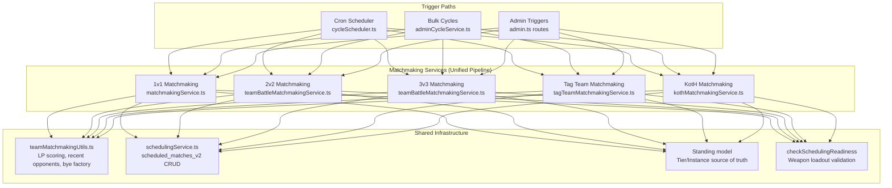

# Design Document: Unified Match Scheduling

## Overview

This design unifies the match scheduling pipeline across all 5 battle modes (1v1 League, 2v2 League, 3v3 League, Tag Team, KotH) so they share identical business rules, code paths, and data infrastructure. The primary change is a full rewrite of KotH matchmaking to use the same LP-banding, tier/instance scoping, readiness checks, and recent-opponent tracking as all other modes. Secondary changes include removing the broken zone rotation mechanism, switching 1v1 to in-memory bye robots, unifying recent-opponent queries to use `scheduled_matches_v2`, adding R4.7 fallback to 1v1/Tag Team, internalizing `scheduledFor` defaults, migrating all remaining legacy table reads, and dropping the legacy tables.

This is a backend-only spec. The only frontend change is removing `kothRotatingZone` from type definitions and display logic.

## Architecture

### System Context



### Unified Matchmaking Pipeline (Target State)

Every mode follows this pipeline identically after this spec:

```
1. Source entities from Standing (mode → tier → instance → entityIds)
2. Load entities from DB (robots or teams with members)
3. Check scheduling readiness (checkSchedulingReadiness — weapon check per loadout type)
4. Activate pending subscriptions (batchActivatePendingSubscriptions)
5. Filter by active subscription for the mode's event type
6. Exclude already-scheduled entities (schedulingService.getUpcomingForRobot/Team)
7. Pair/group using LP-primary scoring (calculateMatchScore from teamMatchmakingUtils)
   - R4.7 fallback: if ALL opponents are recent, select closest-ELO
   - Tie-breaking: createdAt (deterministic)
8. Persist via schedulingService.createMatch() with leagueType + leagueInstanceId
9. Default scheduledFor: 24h + rounded to hour (handled in service, not caller)
```

## Components and Interfaces

### Component 1: KotH Matchmaking Service (Full Rewrite)

**File:** `src/services/koth/kothMatchmakingService.ts`

The entire service is rewritten. The snake-draft algorithm, global robot pool, simple weapon check, zone rotation, and `cycleNumber` parameter are all removed. The new implementation follows the same structure as `teamBattleMatchmakingService.ts`.

#### New Public Interface

```typescript
/** Run KotH matchmaking for all tiers/instances. */
export async function runKothMatchmaking(scheduledFor?: Date): Promise<number>;

/** Get eligible robots for a specific KotH tier instance. (exported for testing) */
export async function getEligibleRobots(tier: string, leagueInstanceId: string): Promise<EligibleRobot[]>;

/** Group robots into LP-banded groups of 5-6. (exported for testing, PURE) */
export function groupByLPBanding(
  robots: EligibleRobot[],
  standingsLPMap: Map<number, number>,
  recentOpponentsMap: Map<number, number[]>,
): KothMatchGroup[];
```

#### LP-Banding Algorithm

```
Input: sorted robots by LP descending (from standings)
Output: groups of 5-6 robots

1. Calculate groupCount = ceil(eligibleCount / 6)
2. Divide into groupCount contiguous bands (some get 6, at most one gets 5)
3. For each band, scan for same-stable conflicts:
   - If two robots share a userId, swap the lower-LP one with the highest-LP
     robot from the adjacent band (next band preferred, prev band fallback)
   - Only swap if it doesn't create a new conflict in the target band
4. For each band, scan for recent-opponent conflicts:
   - If two robots in the same band were recently grouped together (from
     getRecentOpponentsBatch), swap the lower-LP one with a non-conflicting
     robot from an adjacent band
   - Evaluate swap quality using calculateMatchScore; reject if it degrades
     the overall group LP-variance beyond a threshold
5. Return final groups
```

#### Tier/Instance Iteration Pattern

```typescript
for (const tier of KOTH_LEAGUE_TIERS) {
  const instances = await prisma.standing.findMany({
    where: { mode: 'koth', tier },
    select: { leagueInstanceId: true },
    distinct: ['leagueInstanceId'],
  });
  for (const { leagueInstanceId } of instances) {
    const eligible = await getEligibleRobots(tier, leagueInstanceId);
    if (eligible.length < 5) continue; // Skip — no byes in KotH
    const groups = groupByLPBanding(eligible, standingsLPMap, recentOpponentsMap);
    for (const group of groups) {
      await schedulingService.createMatch({
        matchType: MatchType.koth,
        scheduledFor: defaultScheduledFor(),
        leagueType: tier,
        leagueInstanceId,
        participants: group.robots.map((r, i) => ({
          participantType: 'robot', participantId: r.id, slot: i + 1,
        })),
      });
    }
  }
}
```

### Component 2: Zone Rotation Removal

**Scope of changes:**

| File | Change |
|------|--------|
| `kothMatchmakingService.ts` | Remove `rotatingZone`, `cycleNumber` references |
| `schedulingService.ts` | Remove `rotatingZone` from `CreateScheduledMatchInput` |
| `kothBattleOrchestrator.ts` | Remove conditional config branching on `rotatingZone` — always use standard `scoreThreshold`/`timeLimit` |
| `kothConfig.ts` | Remove `rotatingZoneScoreThreshold`, `rotatingZoneTimeLimit`, `rotatingZoneInterval` from `KOTH_MATCH_DEFAULTS` |
| `kothConfig.ts` | Remove `rotatingZone` from `KothMatchConfig` interface |
| `kothEngine.ts` (kothGameMode, kothZone, kothStrategies) | Remove rotating-zone conditional branches |
| `cycleScheduler.ts` | Remove `cycleNumber` parameter passing to `runKothMatchmaking` |
| `adminCycleService.ts` | Remove `cycleNumber` parameter passing to `runKothMatchmaking` |
| `matchHistoryService.ts` | Remove `kothRotatingZone` from response objects |
| `matchmakingApi.ts` (frontend) | Remove `kothRotatingZone` from type interfaces |
| `CompactBattleCard.tsx`, `KothMatchCard.tsx` | Remove rotating zone display logic |
| DB migration | Leave `rotating_zone` column nullable, stop writing it (or drop if safe) |

**Retained:** `zoneRadius` remains as a valid per-match config field for KotH arena sizing.

### Component 3: 1v1 Bye Robot — In-Memory Fabrication

**File:** `src/services/analytics/matchmakingService.ts`

Replace the DB lookup pattern:
```typescript
// BEFORE
const byeRobot = await prisma.robot.findFirst({ where: { name: BYE_ROBOT_NAME } });

// AFTER
const byeRobot = createByeRobot(); // Returns in-memory robot with id=-1, elo=1000
```

The `createByeRobot()` factory follows the same pattern as `createByeTeam()` in `teamBattleMatchmakingService.ts` — constructs a full `Robot` object in memory with `id: -1`, neutral stats, and `loadoutType: 'single'`.

**Bye-match detection change in `leagueBattleOrchestrator.ts`:**
```typescript
// BEFORE
const isBye = robot2.name === 'Bye Robot';

// AFTER
const isBye = match.isByeMatch === true; // from scheduledMatch record
```

### Component 4: Unified Recent-Opponent Tracking

**File:** `src/services/matchmaking/teamMatchmakingUtils.ts`

The shared `getRecentOpponentsBatch` function already accepts an injected query function. The change is in what query functions each service injects.

#### New Query Functions (per service)

All services inject a query function that reads from `scheduled_matches_v2` (via Prisma `scheduledMatch`) filtered by their own MatchType:

```typescript
// Shared query factory for all modes
export function createRecentOpponentQueryFn(matchType: MatchType, participantType: 'robot' | 'team') {
  return async (entityIds: number[], limit: number): Promise<Map<number, number[]>> => {
    const completedMatches = await prisma.scheduledMatch.findMany({
      where: {
        matchType,
        status: 'completed',
        participants: { some: { participantType, participantId: { in: entityIds } } },
      },
      include: { participants: { select: { participantId: true } } },
      orderBy: { scheduledFor: 'desc' },
      take: entityIds.length * limit,
    });

    const map = new Map<number, number[]>();
    for (const entityId of entityIds) {
      const opponents: number[] = [];
      for (const match of completedMatches) {
        if (opponents.length >= limit) break;
        const pIds = match.participants.map(p => p.participantId);
        if (pIds.includes(entityId)) {
          // All other participants in this match are "recent opponents"
          for (const opId of pIds) {
            if (opId !== entityId && !opponents.includes(opId)) {
              opponents.push(opId);
            }
          }
        }
      }
      map.set(entityId, opponents);
    }
    return map;
  };
}
```

**Per-mode usage:**
- 1v1: `createRecentOpponentQueryFn(MatchType.league_1v1, 'robot')` — replaces `Battle` table query
- 2v2: `createRecentOpponentQueryFn(MatchType.league_2v2, 'team')` — replaces `ScheduledTeamBattleMatch` query
- 3v3: `createRecentOpponentQueryFn(MatchType.league_3v3, 'team')` — replaces `ScheduledTeamBattleMatch` query
- Tag Team: `createRecentOpponentQueryFn(MatchType.tag_team, 'team')` — replaces `ScheduledTeamBattleMatch` query
- KotH: `createRecentOpponentQueryFn(MatchType.koth, 'robot')` — new (robots in same group = recent opponents of each other)

### Component 5: R4.7 Fallback Addition

**Files:** `matchmakingService.ts`, `tagTeamMatchmakingService.ts`

Both services get the same pattern already implemented in `teamBattleMatchmakingService.ts`:

```typescript
// After scoring all opponents, if the best match is a recent opponent:
if (bestIsRecentOpponent) {
  const nonRecentOpponent = scoredOpponents.find(so => {
    const oppRecent = recentOpponentsMap.get(so.opponent.id) || [];
    return !entityRecentOpponents.includes(so.opponent.id) && !oppRecent.includes(entity.id);
  });
  if (nonRecentOpponent) {
    return bestMatch.opponent; // Normal scoring handles it
  }
  // R4.7: ALL opponents are recent — fall back to closest-ELO
  const closestELO = [...scoredOpponents].sort((a, b) => {
    const diffA = Math.abs(getELO(a.opponent) - entityELO);
    const diffB = Math.abs(getELO(b.opponent) - entityELO);
    if (diffA !== diffB) return diffA - diffB;
    return a.opponent.createdAt.getTime() - b.opponent.createdAt.getTime();
  });
  return closestELO[0].opponent;
}
```

### Component 6: Deterministic Tie-Breaking

**Files:** `matchmakingService.ts`, `tagTeamMatchmakingService.ts`

Add `createdAt` tie-breaking to the sort comparator in both services:

```typescript
// BEFORE (1v1 and Tag Team)
scoredOpponents.sort((a, b) => a.score - b.score);

// AFTER
scoredOpponents.sort((a, b) => {
  if (a.score !== b.score) return a.score - b.score;
  return a.opponent.createdAt.getTime() - b.opponent.createdAt.getTime();
});
```

### Component 7: scheduledFor Default Internalization

**All matchmaking services** already compute a default internally when `scheduledFor` is not provided. The change is:
1. Add rounding logic (`setMinutes(0, 0, 0)`) inside each service's default computation
2. Remove `scheduledFor` computation from callers in `cycleScheduler.ts` and `adminCycleService.ts`
3. Callers pass `undefined` (or omit the param) — the service handles it

```typescript
// Inside each matchmaking service
function defaultScheduledFor(): Date {
  const d = new Date(Date.now() + 24 * 60 * 60 * 1000);
  d.setMinutes(0, 0, 0);
  return d;
}

export async function runMatchmaking(scheduledFor?: Date): Promise<number> {
  const matchTime = scheduledFor ?? defaultScheduledFor();
  // ...
}
```

### Component 8: Already-Scheduled Check Migration

**Affected services and their changes:**

| Service | Before | After |
|---------|--------|-------|
| `teamBattleMatchmakingService.ts` | `prisma.scheduledTeamBattleMatch.findMany(...)` | `schedulingService.getUpcomingForTeam(teamId, [matchType])` |
| `tagTeamMatchmakingService.ts` | `prisma.scheduledTeamBattleMatch.findMany(...)` | `schedulingService.getUpcomingForTeam(teamId, [MatchType.tag_team])` |
| `kothMatchmakingService.ts` | `prisma.scheduledKothMatchParticipant.findMany(...)` | `schedulingService.getUpcomingForRobot(robotId, [MatchType.koth])` |

**Required interface change to `schedulingService.getUpcomingForTeam()`:**

```typescript
// BEFORE — hardcoded TEAM_MATCH_TYPES filter
async function getUpcomingForTeam(teamId: number) { ... }

// AFTER — accepts optional matchTypes filter (like getUpcomingForRobot)
async function getUpcomingForTeam(teamId: number, matchTypes?: MatchType[]) {
  const participants = await prisma.scheduledMatchParticipant.findMany({
    where: {
      participantType: 'team',
      participantId: teamId,
      scheduledMatch: {
        status: 'scheduled',
        ...(matchTypes && matchTypes.length > 0
          ? { matchType: { in: matchTypes } }
          : { matchType: { in: TEAM_MATCH_TYPES } }),
      },
    },
    // ...
  });
}
```

### Component 9: Legacy Table Read Migrations

Each legacy table consumer is migrated to query `scheduled_matches_v2` instead:

| Consumer | Legacy Table | New Query |
|----------|-------------|-----------|
| `lockingPredicates.ts` — `tagTeamLockingPredicate` | `ScheduledTeamBattleMatch` | Find robot's team via `TeamBattleMember`, then `schedulingService.getUpcomingForTeam(teamId, [MatchType.tag_team])` |
| `lockingPredicates.ts` — `league2v2LockingPredicate` | `ScheduledTeamBattleMatch` | Find robot's team via `TeamBattleMember`, then `schedulingService.getUpcomingForTeam(teamId, [MatchType.league_2v2, MatchType.tournament_2v2])` |
| `lockingPredicates.ts` — `league3v3LockingPredicate` | `ScheduledTeamBattleMatch` | Find robot's team via `TeamBattleMember`, then `schedulingService.getUpcomingForTeam(teamId, [MatchType.league_3v3, MatchType.tournament_3v3])` |
| `teamBattleService.ts` — `isTeamLockedForBattle()` | `ScheduledTeamBattleMatch` | `schedulingService.getUpcomingForTeam(teamId, matchTypesForTeamSize)` |
| `matchHistoryService.ts` | `ScheduledTeamBattleMatch`, `ScheduledKothMatch` | Query `prisma.scheduledMatch` with appropriate `matchType` filters |
| `adminStatsService.ts` | `ScheduledTeamBattleMatch`, `ScheduledKothMatch` | Query `prisma.scheduledMatch` grouped by `matchType` and `status` |
| `deployOrchestrator.ts` | All 3 legacy tables | Single query: `prisma.scheduledMatch.count({ where: { status: 'in_progress' } })` |
| `kothStandingsService.ts` | `ScheduledKothMatch` | Query `prisma.scheduledMatch` where `matchType = 'koth'`, `status = 'completed'` |

### Component 10: Cron/Admin Drift Fixes

| Fix | File | Change |
|-----|------|--------|
| Add repair to bulk Slot 2 | `adminCycleService.ts` | Insert `await repairAllRobots(true, currentCycleNumber)` before execute step in Slot 2 block |
| Add repair to bulk Slot 6 | `adminCycleService.ts` | Insert `await repairAllRobots(true, currentCycleNumber)` before execute step in Slot 6 block |
| Add rebalance to bulk Slot 5 | `adminCycleService.ts` | Insert `await rebalanceKothLeagues()` between execute and matchmaking in Slot 5 block |
| Deprecate `/koth/trigger` | `admin.ts` | Add deprecation warning to response, delegate to unified matchmaking function |
| Remove `scheduledFor` from callers | `cycleScheduler.ts`, `adminCycleService.ts` | Remove `scheduledFor` variable computation; pass `undefined` to matchmaking services |
| Remove `cycleNumber` from callers | `cycleScheduler.ts`, `adminCycleService.ts` | Remove `cycleNumber` parameter from `runKothMatchmaking` calls |

### Component 11: Persistent Bye Robot Removal

**Migration steps (after in-memory switch is deployed):**

1. **Remove `BYE_ROBOT_NAME` constant** from `matchmakingService.ts`
2. **Remove all `NOT: { name: 'Bye Robot' }` filters** from:
   - `leaderboardService.ts`
   - `stableViewService.ts`
   - `standingsBackfill.ts`
   - `migrationVerificationService.ts`
   - `cycleScheduler.ts` (settlement `robot.updateMany`)
3. **Remove bye robot from seed script** (`prisma/seed.ts`)
4. **Create Prisma migration** to delete the Bye Robot record and its associated user:
   ```sql
   DELETE FROM "robots" WHERE "name" = 'Bye Robot';
   DELETE FROM "users" WHERE "username" = 'bye_robot_user';
   ```

### Component 12: Legacy Table Drop Migration

**Final migration (after all reads are confirmed migrated):**

```sql
BEGIN;
DROP TABLE IF EXISTS "ScheduledKothMatchParticipant";
DROP TABLE IF EXISTS "ScheduledKothMatch";
DROP TABLE IF EXISTS "ScheduledTeamBattleMatch";
DROP TABLE IF EXISTS "ScheduledLeagueMatch";
ALTER TABLE "scheduled_matches_v2" DROP COLUMN IF EXISTS "rotating_zone";
COMMIT;
```

Corresponding Prisma schema changes: remove the 4 model definitions (`ScheduledLeagueMatch`, `ScheduledTeamBattleMatch`, `ScheduledKothMatch`, `ScheduledKothMatchParticipant`) and remove the `rotatingZone` field from the `ScheduledMatch` model.

### Component 13: Unified Team Matchmaking Service

**New file:** `src/services/matchmaking/unifiedTeamMatchmaking.ts`

Extracts the shared pattern from `teamBattleMatchmakingService.ts` and `tagTeamMatchmakingService.ts` into a single parameterized function:

```typescript
export interface TeamMatchmakingConfig {
  teamSize: 2 | 3;
  matchType: MatchType;
  standingsMode: string; // 'league_2v2' | 'league_3v3' | 'tag_team'
  subscriptionEvent: string; // 'league_2v2' | 'league_3v3' | 'tag_team'
  eligibilityFilter?: (team: TeamBattleWithMembers) => boolean;
}

export async function runTeamMatchmaking(config: TeamMatchmakingConfig, scheduledFor?: Date): Promise<number>;
```

The existing `teamBattleMatchmakingService.ts` and `tagTeamMatchmakingService.ts` become thin wrappers:

```typescript
// teamBattleMatchmakingService.ts
export async function runTeamBattleMatchmaking(teamSize: 2 | 3, scheduledFor?: Date): Promise<number> {
  return runTeamMatchmaking({
    teamSize,
    matchType: teamSize === 2 ? MatchType.league_2v2 : MatchType.league_3v3,
    standingsMode: teamSize === 2 ? 'league_2v2' : 'league_3v3',
    subscriptionEvent: teamSize === 2 ? 'league_2v2' : 'league_3v3',
    eligibilityFilter: (team) => team.eligibility === 'ELIGIBLE',
  }, scheduledFor);
}
```

### Component 14: Shared League Cycle Orchestrator

**New file:** `src/services/cycle/leagueCycleOrchestrator.ts`

Eliminates ~200 lines of duplicated orchestration code between `cycleScheduler.ts` and `adminCycleService.ts`:

```typescript
export interface LeagueCycleConfig {
  mode: string;
  repairFn: () => Promise<RepairSummary>;
  executeFn: (cutoff?: Date) => Promise<BattleSummary>;
  rebalanceFn: () => Promise<RebalanceSummary>;
  matchmakingFn: (scheduledFor?: Date) => Promise<number>;
}

export async function executeLeagueCycleSteps(config: LeagueCycleConfig): Promise<{
  repair: RepairSummary;
  battles: BattleSummary;
  rebalance: RebalanceSummary;
  matchesCreated: number;
}>;
```

Both `cycleScheduler.ts` and `adminCycleService.ts` delegate to this function for their league cycle steps.

### Component 15: Unified Instance Discovery

**Pattern:** All matchmaking services use `Standing.distinct('leagueInstanceId')` for instance discovery.

The 1v1 service currently uses `getInstancesForTier(tier)` from `leagueInstanceService.ts`. This is migrated to the same pattern used by 2v2/3v3/Tag Team/KotH:

```typescript
// Standard pattern for ALL modes (replaces getInstancesForTier in matchmaking)
const instances = await prisma.standing.findMany({
  where: { mode: standingsMode, tier },
  select: { leagueInstanceId: true },
  distinct: ['leagueInstanceId'],
});
```

The `getInstancesForTier` function in `leagueInstanceService.ts` is retained for other consumers (league placement, rebalancing) but no longer used by matchmaking.

### Component 16: Admin Endpoint Deprecation

**File:** `src/routes/admin.ts`

Piecemeal endpoints get a deprecation warning in response bodies:

```typescript
res.json({
  success: true,
  deprecated: true,
  deprecationWarning: 'Use POST /api/admin/scheduler/trigger/league instead. This endpoint will be removed in a future release.',
  // ... existing response fields
});
```

Affected endpoints:
- `POST /matchmaking/run` → suggest `scheduler/trigger/league`
- `POST /battles/run` → suggest `scheduler/trigger/league`
- `POST /leagues/rebalance` → suggest `scheduler/trigger/league`
- `POST /tag-teams/matchmaking` → suggest `scheduler/trigger/tagTeam`
- `POST /tag-teams/battles` → suggest `scheduler/trigger/tagTeam`
- `POST /tag-teams/rebalance` → suggest `scheduler/trigger/tagTeam`
- `POST /team-battles/matchmaking` → suggest `scheduler/trigger/team2v2League` or `team3v3League`
- `POST /team-battles/battles` → suggest `scheduler/trigger/team2v2League` or `team3v3League`

## Data Models

### Changes to `CreateScheduledMatchInput` (schedulingService.ts)

```typescript
export interface CreateScheduledMatchInput {
  matchType: MatchType;
  scheduledFor: Date;
  participants: ParticipantInput[];
  // Tournament-specific
  tournamentId?: number;
  round?: number;
  matchNumber?: number;
  isByeMatch?: boolean;
  // League-specific (now used by ALL modes including KotH)
  leagueType?: string;
  leagueInstanceId?: string;
  // KotH-specific — REMOVED:
  // rotatingZone?: boolean;  ← DELETED
  scoreThreshold?: number;
  timeLimit?: number;
  zoneRadius?: number;
}
```

### Changes to `getUpcomingForTeam` Signature

```typescript
// Add optional matchTypes filter parameter
async function getUpcomingForTeam(teamId: number, matchTypes?: MatchType[]): Promise<ScheduledMatch[]>;
```

### KotH Matchmaking Types (New)

```typescript
export interface EligibleRobot {
  id: number;
  userId: number;
  elo: number;
  name: string;
  createdAt: Date;
}

export interface KothMatchGroup {
  robots: EligibleRobot[];
}
```

### Standing Model Usage (Existing — No Changes)

KotH already has Standing records with `mode = 'koth'`. The rewritten matchmaking service queries these the same way other modes do:

```typescript
prisma.standing.findMany({
  where: { mode: 'koth', tier },
  select: { leagueInstanceId: true },
  distinct: ['leagueInstanceId'],
});
```

## Correctness Properties

*A property is a characteristic or behavior that should hold true across all valid executions of a system — essentially, a formal statement about what the system should do. Properties serve as the bridge between human-readable specifications and machine-verifiable correctness guarantees.*

### Property 1: LP-Banding Produces Valid Group Sizes

*For any* set of eligible robots with count ≥ 5, the `groupByLPBanding` function SHALL produce groups where every group has exactly 5 or 6 robots, and the total number of robots across all groups equals the input count.

**Validates: Requirements 3.2, 3.3**

### Property 2: Same-Stable Resolution

*For any* set of robots with varying `userId` values, after LP-banding with same-stable swap resolution, no group SHALL contain two robots with the same `userId` — unless the user has more robots than there are groups (in which case conflicts are minimized).

**Validates: Requirements 3.4**

### Property 3: Recent-Opponent Reduction

*For any* set of robots with a known recent-opponent map, the LP-banding algorithm with recent-opponent swaps SHALL produce groups with equal or fewer recent-opponent co-placements compared to naive contiguous banding without swaps.

**Validates: Requirements 3.5, 23.3**

### Property 4: Mode-Specific Recent-Opponent Isolation

*For any* robot with completed matches across multiple MatchTypes (e.g., league_1v1 and koth), calling `createRecentOpponentQueryFn(MatchType.X)` SHALL only return opponents from completed matches of type X — never opponents from other match types.

**Validates: Requirements 8.1, 8.2, 8.3, 8.4, 23.1**

### Property 5: KotH Multi-Participant Recent Opponents

*For any* completed KotH match with N participants (5 or 6), the recent-opponent query SHALL return all other N-1 participants as recent opponents for each participant in that match.

**Validates: Requirements 8.4, 23.1**

### Property 6: R4.7 Fallback Selects Closest-ELO

*For any* eligible entity pool where ALL candidate opponents have been identified as recent opponents, the R4.7 fallback SHALL select the opponent with the smallest absolute ELO difference from the entity being paired, tie-broken by `createdAt`.

**Validates: Requirements 9.1, 9.2**

### Property 7: Deterministic Tie-Breaking via createdAt

*For any* two entities with identical match scores (same LP diff, same ELO diff, same recent-opponent status, same stable status), the pairing algorithm SHALL always select the entity with the earlier `createdAt` timestamp, regardless of the initial ordering of the input array.

**Validates: Requirements 10.1, 10.2, 10.3**

### Property 8: scheduledFor Default Computation

*For any* invocation of a matchmaking service without an explicit `scheduledFor` parameter, the defaulted value SHALL be exactly `Date.now() + 24h` with minutes, seconds, and milliseconds set to zero. When an explicit `scheduledFor` IS provided, it SHALL be used without modification.

**Validates: Requirements 11.1, 11.4**

### Property 9: Bye Robot Fabrication for Odd Counts

*For any* 1v1 tier instance with an odd number of eligible robots (≥ 1), the matchmaking service SHALL produce exactly one match pair where one participant has `id < 0` and `elo = 1000` (the fabricated bye robot), and the `isByeMatch` flag is set to `true`.

**Validates: Requirements 6.1**

### Property 10: Eligibility Filtering Completeness

*For any* robot, if its loadout type is `dual_wield` or `weapon_shield` and it is missing `offhandWeaponId`, it SHALL be excluded from the eligible pool by `checkSchedulingReadiness()`. Conversely, if it has all required weapons for its loadout type AND an active subscription for the target mode, it SHALL be included (assuming no other disqualifying conditions).

**Validates: Requirements 2.1, 2.2**

### Property 11: Match Persistence Includes Tier/Instance Metadata

*For any* match created by any matchmaking service (including KotH), the persisted `ScheduledMatch` record SHALL have non-null `leagueType` equal to the tier and non-null `leagueInstanceId` equal to the instance being processed.

**Validates: Requirements 4.1, 4.2**

## Error Handling

### Matchmaking Errors (Per-Instance Isolation)

Following the pattern established in `teamBattleMatchmakingService.ts` (R4.6):
- Errors in one tier instance are logged and do not prevent processing of other instances
- Each instance is wrapped in its own try-catch; the outer loop continues on failure
- Error details are logged with instance ID for debugging

### Already-Scheduled Edge Case

If `schedulingService.getUpcomingForRobot/Team()` fails (e.g., DB connection issue), the robot/team is treated as NOT already-scheduled (fail-open). This matches current behavior — a DB failure during eligibility doesn't silently skip entities.

### LP-Banding Edge Cases

- **Fewer than 5 eligible:** Skip instance, log info-level message (not an error)
- **Exactly 5:** Single group of 5, no banding needed
- **Same-stable swap impossible:** Log warning, leave conflict (best-effort resolution)
- **Recent-opponent swap degrades quality beyond threshold:** Skip the swap, log info

### Legacy Table Migration Safety

- All legacy table reads are migrated before the drop migration runs
- The drop migration uses a single transaction — if any DROP fails, all are rolled back
- The Bye Robot deletion migration is a separate migration from the table drops (different timing)

### Deployment Safety

The deploy orchestrator migration to `scheduled_matches_v2` ensures that in-flight match detection still works during the transition. The new query covers all match types in a single check.

## Testing Strategy

### Unit Tests (Example-Based)

- **Zone rotation removal:** Verify `rotatingZone` field is absent from `CreateScheduledMatchInput` TypeScript compilation
- **Bye robot detection:** Verify `isByeMatch` flag detection in league battle orchestrator
- **scheduledFor default:** Verify rounding behavior for edge cases (e.g., 23:59 input)
- **Locking predicates:** Verify each predicate returns correct results against unified table
- **Admin deprecation:** Verify `/koth/trigger` returns deprecation warning

### Property-Based Tests (fast-check)

Each property test runs a minimum of 100 iterations.

- **Property 1:** Generate random eligible counts (5–100), run `groupByLPBanding`, assert all groups have size 5 or 6 and total equals input
  - Tag: `Feature: unified-match-scheduling, Property 1: LP-Banding Produces Valid Group Sizes`
- **Property 2:** Generate robots with random userIds (some overlapping), run banding + same-stable resolution, assert no same-user pairs within groups
  - Tag: `Feature: unified-match-scheduling, Property 2: Same-Stable Resolution`
- **Property 3:** Generate robots with recent-opponent maps, compare post-swap co-placement count vs naive banding
  - Tag: `Feature: unified-match-scheduling, Property 3: Recent-Opponent Reduction`
- **Property 4:** Generate completed matches across multiple MatchTypes, assert query function only returns mode-specific opponents
  - Tag: `Feature: unified-match-scheduling, Property 4: Mode-Specific Recent-Opponent Isolation`
- **Property 5:** Generate completed KotH matches with 5-6 participants, verify all N-1 others appear as recent opponents
  - Tag: `Feature: unified-match-scheduling, Property 5: KotH Multi-Participant Recent Opponents`
- **Property 6:** Generate entity pools where all opponents are recent, verify closest-ELO is selected
  - Tag: `Feature: unified-match-scheduling, Property 6: R4.7 Fallback Selects Closest-ELO`
- **Property 7:** Generate entities with tied scores, shuffle input array multiple times, verify same result each time
  - Tag: `Feature: unified-match-scheduling, Property 7: Deterministic Tie-Breaking via createdAt`
- **Property 8:** Generate random timestamps via `fc.date()`, verify default scheduledFor is 24h ahead and rounded
  - Tag: `Feature: unified-match-scheduling, Property 8: scheduledFor Default Computation`
- **Property 9:** Generate odd-count robot pools, verify exactly one bye match with id < 0
  - Tag: `Feature: unified-match-scheduling, Property 9: Bye Robot Fabrication for Odd Counts`
- **Property 10:** Generate robots with various loadout types and weapon configurations, verify eligibility filtering
  - Tag: `Feature: unified-match-scheduling, Property 10: Eligibility Filtering Completeness`
- **Property 11:** Run matchmaking for various modes, verify all persisted matches have non-null leagueType and leagueInstanceId
  - Tag: `Feature: unified-match-scheduling, Property 11: Match Persistence Includes Tier/Instance Metadata`

### Integration Tests

- End-to-end KotH matchmaking cycle with mocked Prisma (Standing → eligibility → banding → persistence)
- Locking predicate migration verification (create match in unified table, verify lock triggers)
- Deploy orchestrator in-flight detection from unified table
- Bulk cycle slot ordering (verify repair→execute→rebalance→matchmaking for each slot)
- Admin endpoint deprecation (verify warning response and delegation)

### Testing Library

- **Property-based testing:** `fast-check` (already installed per project standards)
- **Unit tests:** Jest 30 with ts-jest
- **Mocking:** Jest mocks for Prisma client and schedulingService

### Documentation Impact

The following documentation files need updating after this spec:

| File | Change |
|------|--------|
| `docs/analysis/match-scheduling-audit.md` | Mark all P0/P1/P2/P3 actions as COMPLETED |
| `docs/architecture/PRD_SERVICE_DIRECTORY.md` | Update KotH matchmaking description (LP-banding, no zone rotation), document shared orchestrator and unified team matchmaking |
| `.kiro/steering/project-overview.md` | Update Key System #14 (Daily Cron Schedule) to reflect shared orchestrator pattern, mention unified matchmaking infrastructure |

