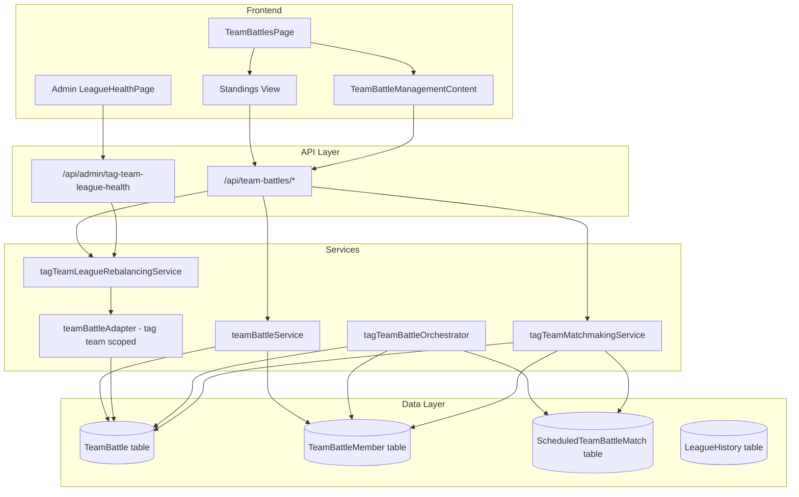
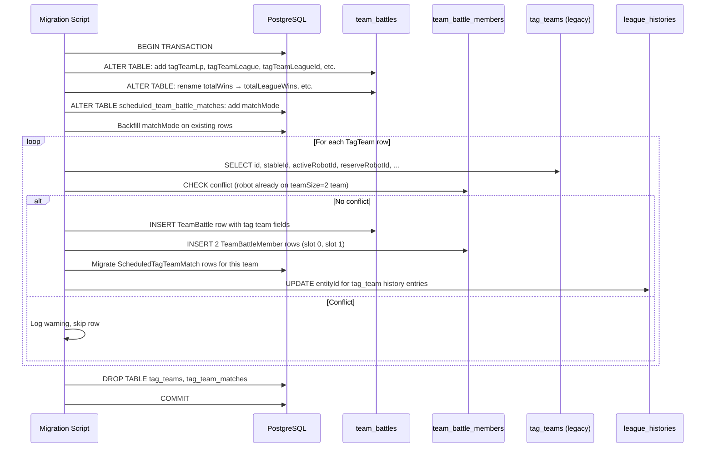

# Design Document: Tag Team System Unification

## Overview

This design consolidates the `TagTeam` Prisma model into the existing `TeamBattle` model (teamSize=2). The result is a single source of truth for all 2-robot teams, eliminating ~1200 lines of duplicate service code, ~400 lines of duplicate frontend components, and 6 redundant API endpoints.

The migration proceeds in three phases:
1. **Schema extension** — Add tag team tracking fields to `TeamBattle` and `matchMode` to `ScheduledTeamBattleMatch`.
2. **Data migration** — Move `TagTeam` rows → `TeamBattle` rows, update `LeagueHistory` references, and migrate `ScheduledTagTeamMatch` → `ScheduledTeamBattleMatch`.
3. **Service rewiring + legacy cleanup** — Redirect all tag team services to read/write `TeamBattle`, remove the tag-team tab from the frontend, add tag team stats to 2v2 team cards, and drop the legacy tables.

### Design Decisions

| Decision | Rationale |
|----------|-----------|
| Tag team fields added directly to `TeamBattle` (not a separate join table) | Tag team LP and stats are per-team, 1:1 with the team row. No normalization benefit from a separate table. Keeps queries simple. |
| `matchMode` discriminator on `ScheduledTeamBattleMatch` rather than a new table | Reuses existing scheduling infrastructure (indexes, status queries, lock-for-battle checks). Discriminator keeps different combat modes distinct. |
| `totalWins` → `totalLeagueWins` rename | Explicit column naming prevents confusion between 2v2 League wins and tag team wins on the same row. Column rename is safe because no external consumers exist. |
| Tag team adapter reuses `createTeamBattleAdapter` factory with LP/league field remapping | The existing `LeagueAdapter<TeamBattle>` pattern already handles per-teamSize scoping. A tag-team adapter uses the same factory pattern but reads `tagTeamLp` instead of `teamLp`. |
| `tag_team` subscription preserved as independent event | Players should control which combat modes their team participates in. Mode eligibility is per-subscription, not per-team-type. |
| Single transaction for data migration with conflict skip | Idempotency + atomic rollback. Production dataset is small (~200 tag teams max), so a single transaction is safe. |

## Architecture

### System Diagram



### Migration Flow



## Components and Interfaces

### 1. Schema Extension (Prisma)

**Modified Model: `TeamBattle`**

New columns:
- `tagTeamLp` (Int, default 0) — Tag team league points
- `tagTeamLeague` (String VarChar(20), default 'bronze') — Tag team league tier
- `tagTeamLeagueId` (String VarChar(30), default 'bronze_1') — Tag team league instance
- `cyclesInTagTeamLeague` (Int, default 0) — Cycles in current tag team league
- `totalTagTeamWins` (Int, default 0)
- `totalTagTeamLosses` (Int, default 0)
- `totalTagTeamDraws` (Int, default 0)

Renamed columns:
- `totalWins` → `totalLeagueWins`
- `totalLosses` → `totalLeagueLosses`
- `totalDraws` → `totalLeagueDraws`

New index:
- `@@index([teamSize, tagTeamLeague, tagTeamLeagueId])` — Supports tag team matchmaking tier/instance queries

**Modified Model: `ScheduledTeamBattleMatch`**

New column:
- `matchMode` (String VarChar(20), not null) — Discriminator: `'league_2v2'`, `'league_3v3'`, `'tag_team'`, `'tournament_2v2'`, `'tournament_3v3'`

### 2. Tag Team League Adapter (`tagTeamLeagueAdapter`)

A new adapter created via the same factory pattern as `createTeamBattleAdapter`, but remapping league fields:

```typescript
// Conceptual interface — same LeagueAdapter<TeamBattle> shape
const tagTeamLeagueAdapter: LeagueAdapter<TeamBattle> = {
  entityType: 'tag_team', // Preserves history entity type

  // Queries filter by teamSize = 2 AND use tagTeamLeague/tagTeamLeagueId
  getEntitiesWithMinPoints(instanceId, minLP, minCycles, excludeIds) { ... },
  
  // Uses tagTeamLp for league points
  getEntityLeaguePoints(entity) { return entity.tagTeamLp; },
  
  // Uses tagTeamLeague for tier
  getEntityCurrentTier(entity) { return entity.tagTeamLeague; },
  
  // Uses tagTeamLeagueId for instance
  getEntityLeagueId(entity) { return entity.tagTeamLeagueId; },
  
  // Updates tagTeamLeague, tagTeamLeagueId, cyclesInTagTeamLeague
  updateEntityLeague(entityId, newTier, newLeagueId) { ... },
  
  // Rebalances by tagTeamLp within tagTeamLeagueId
  rebalanceInstances(tier) { ... },
};
```

This adapter is created in `teamBattleAdapter.ts` alongside the existing `teamBattle2v2Adapter` and `teamBattle3v3Adapter`.

### 3. Tag Team Matchmaking Service (Rewired)

**File:** `app/backend/src/services/tag-team/tagTeamMatchmakingService.ts`

Changes:
- `getEligibleTeams()` queries `TeamBattle` where `teamSize = 2` + `tagTeamLeague = tier` + `tagTeamLeagueId = instanceId`
- Loads `TeamBattleMember` with robots (slot 0 = active, slot 1 = reserve)
- Checks `tag_team` subscription for both members
- Checks `ScheduledTeamBattleMatch` where `matchMode = 'tag_team'` for already-scheduled teams
- `scheduleMatches()` creates `ScheduledTeamBattleMatch` rows with `matchMode = 'tag_team'`, `teamSize = 2`
- `calculateMatchScore` uses `tagTeamLp` as LP input (not `teamLp`)
- Recent opponents fetched from `ScheduledTeamBattleMatch` where `matchMode = 'tag_team'`

### 4. Tag Team Battle Orchestrator (Rewired)

**File:** `app/backend/src/services/tag-team/tagTeamBattleOrchestrator.ts`

Changes:
- Loads teams via `TeamBattle` with `members` include (replaces `TagTeam` with `activeRobot`/`reserveRobot`)
- Maps slot 0 → Active, slot 1 → Reserve
- Post-battle updates:
  - `totalTagTeamWins`/`totalTagTeamLosses`/`totalTagTeamDraws` on `TeamBattle`
  - `tagTeamLp` adjustment on `TeamBattle`
- Uses `team.teamName` for battle narrative
- Picks up matches from `ScheduledTeamBattleMatch` where `matchMode = 'tag_team'` and `status = 'scheduled'`
- All combat logic (sequential 1v1, tag-out, rewards, ELO) unchanged

### 5. Tag Team League Rebalancing Service (Rewired)

**File:** `app/backend/src/services/tag-team/tagTeamLeagueRebalancingService.ts`

Changes:
- Replace `tagTeamAdapter` (queries `TagTeam`) with the new `tagTeamLeagueAdapter` (queries `TeamBattle` with tag team field mappings)
- All config preserved: 10% promote, 10% demote, min 5 cycles, min 10 teams, 50 max per instance
- `rebalanceTagTeamLeagues()` delegates to `rebalanceAllTiers(TAG_TEAM_LEAGUE_CONFIG, tagTeamLeagueAdapter)`

### 6. API Endpoints

**New endpoints on `/api/team-battles`:**

| Method | Path | Description |
|--------|------|-------------|
| GET | `/api/team-battles/leagues/2/:tier/tag-team-standings` | Tag team standings for a tier |
| GET | `/api/team-battles/leagues/2/:tier/tag-team-instances` | Tag team league instances for a tier |
| GET | `/api/team-battles/:id/tag-team-league-history` | Tag team league history for a team |

**New admin endpoint:**

| Method | Path | Description |
|--------|------|-------------|
| GET | `/api/admin/tag-team-league-health` | Per-tier tag team league health metrics |

**Deleted endpoints (entire route file):**
- `POST /api/tag-teams`
- `GET /api/tag-teams`
- `GET /api/tag-teams/:id`
- `DELETE /api/tag-teams/:id`
- `GET /api/tag-teams/leagues/:tier/standings`
- `GET /api/tag-teams/:id/league-history`

### 7. Frontend Components

**Modified: `TeamBattlesPage.tsx`**
- Remove `tag-team` tab, remove `TagTeamManagementContent` import
- Default tab becomes `2v2`
- Tab bar: only "2v2 Teams" and "3v3 Teams"

**Modified: `TeamBattleManagementContent.tsx` (teamSize=2)**
- Each 2v2 team card displays:
  - Tag team stats section (tagTeamLp, tagTeamLeague, wins/losses/draws)
  - Per-mode eligibility badges: `league_2v2`, `tag_team`, `tournament_2v2`
  - Slot role labels: "Active (Tag Team)" for slot 0, "Reserve (Tag Team)" for slot 1
- Mobile layout: tag team stats stacked below 2v2 stats (below 1024px)

**New: Standings mode selector in standings view**
- Toggle between "2v2 League" and "Tag Team" standings
- Tag Team standings sorted by `tagTeamLp` desc
- Instance selector shown when tier has multiple tag team instances

**Modified: `LeagueHealthPage.tsx`**
- New "Tag Team League Tiers" section below 3v3 section
- Same table format (tier, teams, instances, distribution, rebalancing status)
- Yellow ⚠️ indicator when `needsRebalancing: true`

**Deleted: `TagTeamManagementContent.tsx`**

### 8. Event Registry Update

The `tag_team` locking predicate is updated to query `ScheduledTeamBattleMatch`:

```typescript
registerSubscribableEvent({
  type: 'tag_team',
  label: 'Tag Team',
  lockingPredicate: async (robotId: number) => {
    // Check if robot is member of a team with a scheduled tag_team match
    const member = await prisma.teamBattleMember.findFirst({
      where: { robotId, team: { teamSize: 2 } },
    });
    if (!member) return false;
    const count = await prisma.scheduledTeamBattleMatch.count({
      where: {
        matchMode: 'tag_team',
        status: 'scheduled',
        OR: [{ team1Id: member.teamId }, { team2Id: member.teamId }],
      },
    });
    return count > 0;
  },
});
```

## Data Models

### TeamBattle (After Migration)

```prisma
model TeamBattle {
  id             Int    @id @default(autoincrement())
  stableId       Int    @map("stable_id")
  teamSize       Int    @map("team_size") // 2 or 3
  teamName       String @map("team_name") @db.VarChar(32)

  // 2v2/3v3 League tracking
  teamLp         Int    @default(0) @map("team_lp")
  teamLeague     String @default("bronze") @map("team_league") @db.VarChar(20)
  teamLeagueId   String @default("bronze_1") @map("team_league_id") @db.VarChar(30)
  cyclesInLeague Int    @default(0) @map("cycles_in_league")

  // League performance (2v2 League or 3v3 League results)
  totalLeagueWins   Int @default(0) @map("total_league_wins")
  totalLeagueLosses Int @default(0) @map("total_league_losses")
  totalLeagueDraws  Int @default(0) @map("total_league_draws")

  // Tag Team league tracking (only used when teamSize = 2)
  tagTeamLp              Int    @default(0) @map("tag_team_lp")
  tagTeamLeague          String @default("bronze") @map("tag_team_league") @db.VarChar(20)
  tagTeamLeagueId        String @default("bronze_1") @map("tag_team_league_id") @db.VarChar(30)
  cyclesInTagTeamLeague  Int    @default(0) @map("cycles_in_tag_team_league")

  // Tag Team performance (only used when teamSize = 2)
  totalTagTeamWins   Int @default(0) @map("total_tag_team_wins")
  totalTagTeamLosses Int @default(0) @map("total_tag_team_losses")
  totalTagTeamDraws  Int @default(0) @map("total_tag_team_draws")

  // Eligibility
  eligibility String @default("ELIGIBLE") @db.VarChar(20)

  // Timestamps
  createdAt DateTime @default(now()) @map("created_at")
  updatedAt DateTime @updatedAt @map("updated_at")

  // Relations
  stable         User                       @relation(fields: [stableId], references: [id], onDelete: Cascade)
  members        TeamBattleMember[]
  matchesAsTeam1 ScheduledTeamBattleMatch[] @relation("TeamBattleTeam1")
  matchesAsTeam2 ScheduledTeamBattleMatch[] @relation("TeamBattleTeam2")

  @@index([stableId])
  @@index([teamLeagueId])
  @@index([teamSize, teamLeague])
  @@index([teamSize, tagTeamLeague, tagTeamLeagueId])
  @@map("team_battles")
}
```

### ScheduledTeamBattleMatch (After Migration)

```prisma
model ScheduledTeamBattleMatch {
  id                  Int      @id @default(autoincrement())
  team1Id             Int      @map("team1_id")
  team2Id             Int?     @map("team2_id")
  teamSize            Int      @map("team_size")
  matchMode           String   @map("match_mode") @db.VarChar(20) // league_2v2, league_3v3, tag_team, tournament_2v2, tournament_3v3
  teamBattleLeague    String   @map("team_battle_league") @db.VarChar(20)
  teamBattleLeagueId  String   @map("team_battle_league_id") @db.VarChar(30)
  scheduledFor        DateTime @map("scheduled_for")
  status              String   @default("scheduled") @db.VarChar(20)
  cancelReason        String?  @map("cancel_reason") @db.Text
  createdAt           DateTime @default(now()) @map("created_at")

  // Relations
  team1 TeamBattle  @relation("TeamBattleTeam1", fields: [team1Id], references: [id])
  team2 TeamBattle? @relation("TeamBattleTeam2", fields: [team2Id], references: [id])

  @@index([status, teamSize])
  @@index([status, matchMode])
  @@index([team1Id])
  @@index([team2Id])
  @@map("scheduled_team_battle_matches")
}
```

### Migration ID Mapping

During migration, an in-memory `Map<oldTagTeamId, newTeamBattleId>` tracks the mapping. This is used to:
1. Remap `ScheduledTagTeamMatch.team1Id`/`team2Id` → new `TeamBattle.id`
2. Remap `LeagueHistory.entityId` where `entityType = 'tag_team'`

### Data Migration SQL (Conceptual)

```sql
-- 1. Schema changes
ALTER TABLE team_battles
  ADD COLUMN tag_team_lp INTEGER NOT NULL DEFAULT 0,
  ADD COLUMN tag_team_league VARCHAR(20) NOT NULL DEFAULT 'bronze',
  ADD COLUMN tag_team_league_id VARCHAR(30) NOT NULL DEFAULT 'bronze_1',
  ADD COLUMN cycles_in_tag_team_league INTEGER NOT NULL DEFAULT 0,
  ADD COLUMN total_tag_team_wins INTEGER NOT NULL DEFAULT 0,
  ADD COLUMN total_tag_team_losses INTEGER NOT NULL DEFAULT 0,
  ADD COLUMN total_tag_team_draws INTEGER NOT NULL DEFAULT 0;

ALTER TABLE team_battles RENAME COLUMN total_wins TO total_league_wins;
ALTER TABLE team_battles RENAME COLUMN total_losses TO total_league_losses;
ALTER TABLE team_battles RENAME COLUMN total_draws TO total_league_draws;

ALTER TABLE scheduled_team_battle_matches
  ADD COLUMN match_mode VARCHAR(20);

-- Backfill matchMode for existing rows
UPDATE scheduled_team_battle_matches SET match_mode = 'league_2v2' WHERE team_size = 2;
UPDATE scheduled_team_battle_matches SET match_mode = 'league_3v3' WHERE team_size = 3;
ALTER TABLE scheduled_team_battle_matches ALTER COLUMN match_mode SET NOT NULL;

-- 2. Index
CREATE INDEX idx_team_battles_tag_team_league ON team_battles(team_size, tag_team_league, tag_team_league_id);
CREATE INDEX idx_stbm_status_match_mode ON scheduled_team_battle_matches(status, match_mode);

-- 3. Data migration (pseudocode - actual implementation in TypeScript)
-- For each TagTeam row: INSERT into team_battles + team_battle_members
-- Remap ScheduledTagTeamMatch → ScheduledTeamBattleMatch
-- Update LeagueHistory.entityId for entityType = 'tag_team'

-- 4. Cleanup (after verification)
DROP TABLE tag_team_matches;
DROP TABLE tag_teams;
```

## Correctness Properties

*A property is a characteristic or behavior that should hold true across all valid executions of a system — essentially, a formal statement about what the system should do. Properties serve as the bridge between human-readable specifications and machine-verifiable correctness guarantees.*

### Property 1: Migration Data Preservation

*For any* valid `TagTeam` row with arbitrary `stableId`, `activeRobotId`, `reserveRobotId`, `tagTeamLeaguePoints`, `tagTeamLeague`, `tagTeamLeagueId`, `cyclesInTagTeamLeague`, `totalTagTeamWins`, `totalTagTeamLosses`, and `totalTagTeamDraws` values, after running the data migration, a `TeamBattle` row SHALL exist with: `teamSize = 2`, `stableId` matching, `teamName` matching the pattern `"{ActiveRobotName} & {ReserveRobotName}"` (truncated to 32 chars), `tagTeamLp` equal to the original `tagTeamLeaguePoints`, `tagTeamLeague`/`tagTeamLeagueId`/`cyclesInTagTeamLeague` matching original values, `totalTagTeamWins`/`Losses`/`Draws` matching originals, `teamLp = 0`, `teamLeague = 'bronze'`, `totalLeagueWins = 0`, AND two `TeamBattleMember` rows where slot 0 = `activeRobotId` and slot 1 = `reserveRobotId`.

**Validates: Requirements 1.6, 2.1, 2.2, 2.3, 2.4, 2.5**

### Property 2: Migration Conflict Handling

*For any* set of `TagTeam` rows where some reference robot IDs that are already members of an existing `TeamBattle` with `teamSize = 2`, the migration SHALL skip those conflicting rows AND successfully migrate all non-conflicting rows, producing the correct number of `TeamBattle` rows equal to (total `TagTeam` rows minus conflicting rows).

**Validates: Requirements 2.6**

### Property 3: Migration Idempotency

*For any* database state containing `TagTeam` rows, running the migration function twice SHALL produce the same `TeamBattle` row set as running it once — no duplicate rows created, no field values changed on the second run.

**Validates: Requirements 2.8**

### Property 4: Tag Team LP Isolation

*For any* `TeamBattle` row with `teamSize = 2` and arbitrary `tagTeamLp` and `teamLp` values, when a tag team LP operation occurs (matchmaking score calculation, post-battle LP award, promotion threshold check), the operation SHALL read from and write to `tagTeamLp` exclusively, leaving `teamLp` unchanged. Conversely, 2v2 League LP operations SHALL only affect `teamLp`.

**Validates: Requirements 3.3, 4.4, 5.6**

### Property 5: Tag Team Win Counter Isolation

*For any* tag team battle result (win, loss, or draw), the post-battle update SHALL increment exactly one of `totalTagTeamWins`, `totalTagTeamLosses`, or `totalTagTeamDraws` by 1, and SHALL leave `totalLeagueWins`, `totalLeagueLosses`, and `totalLeagueDraws` unchanged.

**Validates: Requirements 4.3**

### Property 6: Tag Team Eligibility Independence

*For any* 2v2 `TeamBattle` team and any combination of per-robot subscriptions (`tag_team`, `league_2v2`, `tournament_2v2`), the eligibility determination for each mode SHALL depend only on whether both member robots hold the corresponding subscription for that mode. A team can be eligible for tag team but ineligible for 2v2 League (or vice versa), and incomplete rosters (<2 members) SHALL make the team ineligible for all tag team matchmaking.

**Validates: Requirements 3.2, 3.6, 6.2, 6.4**

### Property 7: Tag Team League Promotion/Demotion Field Isolation

*For any* `TeamBattle` row with `teamSize = 2`, when the tag team league adapter promotes or demotes the team, it SHALL update `tagTeamLeague`, `tagTeamLeagueId`, and reset `cyclesInTagTeamLeague` to 0, while leaving `teamLeague`, `teamLeagueId`, and `cyclesInLeague` unchanged.

**Validates: Requirements 5.2, 5.3, 5.4**

### Property 8: Match Mode Discrimination

*For any* newly scheduled tag team match, the resulting `ScheduledTeamBattleMatch` row SHALL have `matchMode = 'tag_team'` and `teamSize = 2`. For any lock-for-battle or match pickup query related to tag team combat, only rows with `matchMode = 'tag_team'` SHALL be considered. The `tag_team` subscription locking predicate SHALL return true if and only if the robot's team has a scheduled match with `matchMode = 'tag_team'`.

**Validates: Requirements 7.3, 7.4, 12.6**

### Property 9: Scheduled Match Migration Correctness

*For any* existing `ScheduledTagTeamMatch` row with valid `team1Id` and `team2Id` referencing migrated teams, after migration a `ScheduledTeamBattleMatch` row SHALL exist with: `matchMode = 'tag_team'`, `teamSize = 2`, `team1Id` and `team2Id` mapping to the new `TeamBattle.id` values, and `scheduledFor`/`status` preserved. Additionally, all pre-existing `ScheduledTeamBattleMatch` rows SHALL have `matchMode` backfilled based on `teamSize` (2 → `'league_2v2'`, 3 → `'league_3v3'`).

**Validates: Requirements 7.2, 7.6**

### Property 10: Tag Team Standings Sort and Filter Invariant

*For any* set of `TeamBattle` rows with `teamSize = 2` in a given `tagTeamLeague` tier, the tag team standings endpoint SHALL return teams sorted by `tagTeamLp` descending. When an `instance` filter is provided, only teams with matching `tagTeamLeagueId` SHALL appear. Pagination SHALL return the correct slice and total count.

**Validates: Requirements 10.1, 10.2, 10.4, 11.1, 11.2**

### Property 11: League History EntityId Integrity

*For any* `LeagueHistory` row with `entityType = 'tag_team'` that referenced an old `TagTeam.id`, after migration its `entityId` SHALL reference the corresponding new `TeamBattle.id`. For any new tag team promotion/demotion event recorded after migration, the history entry SHALL have `entityType = 'tag_team'` and `entityId` equal to the `TeamBattle.id`.

**Validates: Requirements 13.1, 13.2**

### Property 12: Tag Team League Health Computation

*For any* set of `TeamBattle` rows with `teamSize = 2`, the `getTagTeamLeagueHealth` function SHALL return per-tier metrics where `totalTeams` equals the count of rows with matching `tagTeamLeague`, `instances` equals the count of distinct `tagTeamLeagueId` values, and `needsRebalancing` is true when any instance exceeds the max threshold or the team count is below the minimum for that tier.

**Validates: Requirements 14.1, 14.5**

## Error Handling

### Migration Errors

| Error Scenario | Handling |
|----------------|----------|
| Robot referenced by TagTeam no longer exists | Skip row, log warning, continue. Do not fail entire migration. |
| Robot already on a teamSize=2 TeamBattle | Skip row, log conflict, continue. Increment skipped counter. |
| Team name generation produces >32 chars | Truncate to 29 chars + `"..."` suffix (32 total). |
| Robot name is NULL/empty | Substitute literal `"Robot"` before applying name pattern. |
| Transaction failure (any step) | Full rollback. No partial state. Operator reruns after fixing root cause. |
| ScheduledTagTeamMatch references team1/team2 that failed migration | Skip that scheduled match row, log warning. Match will be orphaned and require manual cleanup. |
| LeagueHistory references TagTeam that was skipped | Leave entityId unchanged (it will be an orphan reference). Log for manual review. |

### Runtime Errors (Post-Migration)

| Error Scenario | Handling |
|----------------|----------|
| Team has <2 members during tag team matchmaking | Exclude from matchmaking, log info. |
| Tag team match scheduled but team disbanded before execution | Cancel match (set status='cancelled', cancelReason), no battle executed. |
| Tag team LP update fails mid-battle settlement | Retry within existing transaction. If retries exhausted, log error and continue with next match. |
| League adapter encounters unknown tier | Throw `LeagueError(PROMOTION_BLOCKED)` / `LeagueError(RELEGATION_BLOCKED)`. |
| Tag team standings query for non-existent tier | Return empty standings (400 if tier invalid per Zod validation). |
| Admin health endpoint when no teamSize=2 teams exist | Return empty `leagues` array with `totalTeams: 0`. |

### Backward Compatibility

During the transition period (after schema extension, before legacy table drop):
- The old `/api/tag-teams` routes remain functional until explicitly removed.
- Both `ScheduledTagTeamMatch` and `ScheduledTeamBattleMatch` (matchMode='tag_team') can coexist temporarily.
- The migration script handles this coexistence by checking both tables for scheduling conflicts.

## Testing Strategy

### Property-Based Testing (fast-check)

This feature is suitable for property-based testing because:
- The data migration transforms structured input (TagTeam rows) into structured output (TeamBattle rows) — classic round-trip/preservation testing.
- LP isolation and counter isolation are universal invariants across all inputs.
- Eligibility logic varies meaningfully across subscription/member combinations.
- Standings sorting/pagination are universal properties across all team sets.

**Configuration:**
- Library: `fast-check` (already in project)
- Minimum iterations: 100 per property test
- Tag format: `Feature: tag-team-system-unification, Property {N}: {title}`

**Property tests to implement:**
1. Migration data preservation (Property 1) — Generate random TagTeam inputs, verify output.
2. Migration conflict handling (Property 2) — Generate inputs with conflicts, verify correct skip behavior.
3. Migration idempotency (Property 3) — Run migration twice, verify no change.
4. LP isolation (Property 4) — Random LP operations, verify field isolation.
5. Counter isolation (Property 5) — Random battle outcomes, verify counter targeting.
6. Eligibility independence (Property 6) — Random subscription combos, verify per-mode eligibility.
7. League field isolation (Property 7) — Random promotion/demotion, verify field targeting.
8. Match mode discrimination (Property 8) — Random scheduling, verify matchMode.
9. Scheduled match migration (Property 9) — Random match data, verify mapping.
10. Standings sort invariant (Property 10) — Random team data, verify sort order.
11. League history integrity (Property 11) — Random history entries, verify entityId mapping.
12. Health computation (Property 12) — Random team distribution, verify metrics.

### Unit Testing (Jest/Vitest)

- **Migration name generation**: Specific examples for name truncation, null robot names, unicode names.
- **Migration logging**: Verify summary log includes correct counts.
- **API response shapes**: Specific examples for each new endpoint.
- **Frontend component rendering**: Tag team stats display, eligibility badges, mode selector.
- **Edge cases**: Empty tiers, single-instance tiers, teams with 0/1/2 members.

### Integration Testing

- **End-to-end migration**: Run full migration on test database with realistic data, verify all tables.
- **Tag team battle execution**: After rewiring, execute a full tag team battle and verify combat flow unchanged.
- **Matchmaking cycle**: Run tag team matchmaking with rewired services, verify matches created correctly.
- **League rebalancing**: Run rebalancing cycle with rewired adapter, verify promotions/demotions.

### Documentation Impact

The following files will need updating after this spec is implemented:

- `.kiro/steering/project-overview.md` — Update "Tag Team" references in Key Systems section to note unification with TeamBattle. Remove the separate "Tag Team" line item from Key Systems; merge description into the Team Battle Mode entry.
- `docs/architecture/PRD_SERVICE_DIRECTORY.md` — Update tag team service descriptions to note they now operate on TeamBattle. Update cron schedule section if tag team slot references change.
- `docs/guides/` — Any deployment/migration guides that reference the `tag_teams` table.
- `app/backend/src/content/guide/facilities/booking-office.md` — Reword tag team description: no longer a separate team entity, explain that 2v2 teams participate in tag team mode via `tag_team` subscription. Remove references to "creating a tag team" as a distinct action.
- `app/backend/src/content/guide/strategy/tactical-tuning.md` — Update "Tag Team" section to reference 2v2 teams with Active/Reserve slot assignments instead of a separate tag team entity.
- `docs/BACKLOG.md` — Mark backlog item #55 (Tag Team System Unification) as completed with spec reference.

### Cron Scheduler Impact

The cycle scheduler (`cycleScheduler.ts`) and admin cycle service (`adminCycleService.ts`) import and invoke:
- `executeScheduledTagTeamBattles` from `tagTeamBattleOrchestrator`
- `rebalanceTagTeamLeagues` from `tagTeamLeagueRebalancingService`
- `runTagTeamMatchmaking` from `tagTeamMatchmakingService`

These functions keep their existing names and export signatures — they are rewired internally to read from `TeamBattle` instead of `TagTeam`. The cron scheduler **does not need code changes** — it calls the same function names at the same cron slots. However, after the legacy table is dropped, the import paths remain valid since the service files stay in `services/tag-team/`.

Verification: confirm that `cycleScheduler.ts` and `adminCycleService.ts` still compile and the tag team cron slots (matchmaking at the existing time, battles at 08:00 UTC per the daily schedule) execute correctly post-migration.

### Achievement System Impact

The achievement service (`achievementService.ts`) references tag team data in three places:
1. `tag_team_wins` trigger — reads `robot.totalTagTeamWins` from the **Robot** model
2. `tag_in_win` trigger — reads `data.taggedIn` from the battle context
3. `all_modes_win` (C18) — reads `robot.totalTagTeamWins > 0` from the Robot model

**No rewiring needed.** All achievement checks read from Robot-level stats (`totalTagTeamWins`, `timesTaggedIn`), not from the `TagTeam` model. The rewired orchestrator continues to increment these Robot-level fields identically to the current implementation. The `battleType: 'tag_team'` value passed to `checkAndAwardAchievements` is preserved.

### Hall of Records Impact

**No changes needed.** The records routes (`records.ts`, `records-queries.ts`) do not reference the `TagTeam` model. They query robot-level stats and battle participant data which are unaffected by this migration.

### Test Cleanup Strategy

After migration, the following test categories require action:

**Tests to rewrite (change data source, keep assertions):**
- `tests/integration/tagTeamMultiMatchCycle.test.ts` — Replace `createTeam()` with `registerTeam()` from `teamBattleService`
- `tests/integration/tagTeamAutoRepair.test.ts` — Same data source change
- `tests/integration/tagTeamCompleteCycle.test.ts` — Same data source change
- `tests/integration/tagTeamByeHandling.test.ts` — Same data source change
- `tests/tagTeamBattleLogCompleteness.property.test.ts` — Update team creation setup
- `tests/tagTeamPhaseBugs.pbt.test.ts` — Update imports and team loading

**Tests to delete (test removed infrastructure):**
- `tests/services/tag-team/tagTeamService.test.ts` (if it tests CRUD on the old model)
- All mocks of the deleted `/api/tag-teams` route in integration tests
- Frontend tests for `TagTeamManagementContent` component

**Tests to update (mock path changes):**
- ~15 test files that mock `tagTeamBattleOrchestrator` — imports stay valid (file not deleted), but any tests that create `TagTeam` fixtures need to create `TeamBattle` fixtures instead
- Frontend test for `TeamBattlesPage` — remove tag-team tab assertions, add tag team stats assertions on 2v2 cards

**Net effect:** Fewer total test files (frontend component tests removed), more focused integration tests (one creation path instead of two), property tests cover the migration transformation itself.

