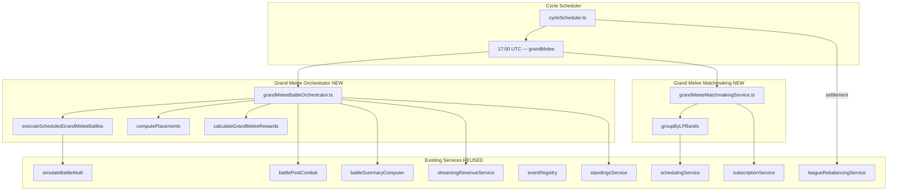

# Design Document

## Spec: Grand Melee — Free-for-All Battle Mode

## Overview

Grand Melee is a 20-robot free-for-all elimination mode that reuses the existing `simulateBattleMulti` infrastructure with `allowDraws: false` (same as tournaments). No custom game mode config, no win condition hooks, no shrinking arena — pure last-standing elimination using the standard 120-second `MAX_BATTLE_DURATION` with HP% tiebreaker.

The mode plugs into every existing system identically to KotH: same matchmaking pipeline, same standings adapter factory, same orchestration pattern, same event registry, same cron slot structure. The only new infrastructure is algorithmic optimizations (spatial partitioning + variable tick rate) applied globally to `simulateBattleMulti` benefiting all modes.

### Key Design Decisions

1. **Reuse over invention** — Grand Melee uses the same code paths as KotH and tournaments wherever possible. No custom win conditions, no game mode hooks, no special arena mechanics. The existing `allowDraws: false` + HP tiebreaker (already used by tournaments) handles the "must have a winner" requirement.

2. **Standard 120s MAX_BATTLE_DURATION** — Same constant as all other modes. With 20 robots in a radius-70 arena, nearest-neighbour distance is ~21 units (sub-second engagement). Battles resolve naturally within 60-90s. HP tiebreaker handles edge cases.

3. **Global algorithmic optimizations** — Spatial partitioning and variable tick rate are added to the shared `simulateBattleMulti` function, not a Grand Melee fork. All modes benefit. Variable tick rate only activates for N≥10 robots (no impact on KotH/1v1).

4. **KotH-pattern orchestrator** — Sequential match processing with batch/super-batch memory pauses. Same `updateRobotCombatStats`, `computeBattleSummary`, `calculateStreamingRevenueBatch`, `checkAndAwardAchievements` pipeline.

5. **Standard league infrastructure** — `createStandingsAdapter('grand_melee', { overrideMinLP: 0, maxPerInstance: 100, entityType: 'robot' })`. Same promotion/demotion thresholds, instance splitting at 101, settlement rebalancing.

6. **F1 point scale for LP** — 25/18/15/12/10/8/6/4/2/1 for top 10. Positions 11-20 earn 0 LP but still receive participation credits (floor 0.2 × TIER_CREDIT_BASE × 2.5, same curve as KotH last-place but 2.5× base to reflect harder competition).

7. **Placement from elimination order** — No custom tracking needed. The simulator already emits `robot_eliminated` events with timestamps. Post-simulation: sort by elimination time (later = better), survivors by HP%.

---

## Architecture

### High-Level System Flow



### Module Layout

**New files:**
```
app/backend/src/services/grand-melee/
├── grandMeleeBattleOrchestrator.ts    # Battle execution, placement, rewards
├── grandMeleeMatchmakingService.ts    # LP-banded grouping (KotH pattern)
├── grandMeleeRewards.ts               # Reward calculation (extracted for testability)

app/backend/src/services/battle/combat-simulator/
├── spatialGrid.ts                     # Grid-based spatial index (NEW)

app/backend/src/content/guide/grand-melee/
├── basics.md                          # Mode overview
├── entry-requirements.md              # Subscription, weapon readiness
├── scoring-and-placement.md           # F1 points, elimination order
├── rewards.md                         # Tier-scaled rewards table
├── strategy.md                        # FFA build archetypes
```

**Modified files:**

| File | Change |
|------|--------|
| `simulationLoop.ts` | Integrate spatial grid for threat queries; variable tick rate for distant robots |
| `threatScoring.ts` | Accept pre-filtered candidate list from spatial grid |
| `baseOrchestrator.ts` | Add `'grand_melee'` to `ALL_BATTLE_TYPES` |
| `eventRegistry.ts` | Extend `SubscribableEventType` union with `'grand_melee'` |
| `cycleScheduler.ts` | Replace reserved stub with real Grand Melee handler |
| `adminCycleService.ts` | Replace no-op stub with real Grand Melee execution |
| `admin.ts` (routes) | Replace no-op trigger endpoint with real handler |
| `leagueRebalancingService.ts` | Add Grand Melee adapter + `rebalanceGrandMeleeLeagues` export |
| `standingsService.ts` | Add `awardGrandMeleePoints` (same pattern as `awardKothPoints`) |
| `records-queries.ts` | Add `fetchGrandMeleeRecords()` |
| `records.ts` | Include Grand Melee records in response |
| `sections.json` | Add `grand-melee` guide section |
| Prisma schema | Add `grand_melee` to `StandingsMode` and `MatchType` enums |

---

## Components and Interfaces

### 1. Spatial Grid (R1.1, R1.2, R1.5)

A lightweight grid-based spatial index that replaces brute-force O(n²) threat scanning with O(n×k) lookups.

```typescript
// services/battle/combat-simulator/spatialGrid.ts

export class SpatialGrid {
  private cellSize: number;
  private cells: Map<string, number[]>; // cell key → array of robot indices
  private robotCells: Map<number, string>; // robot index → current cell key

  constructor(arenaRadius: number, maxWeaponRange: number) {
    // Cell size = max weapon range + safety margin (10 units)
    // Ensures any robot within attack range is in the same or adjacent cell
    this.cellSize = maxWeaponRange + 10;
  }

  /** Rebuild grid from current robot positions. Called once per tick. */
  update(states: SpatialRobotCombatState[]): void;

  /** Get indices of all robots in the same cell or 8-neighbourhood. */
  getNearby(robotIndex: number): number[];

  /** Get cell key for a position */
  private getCellKey(pos: Position): string;
}
```

**Integration point:** In `simulationLoop.ts`, before the threat evaluation phase:
- Create `SpatialGrid` once after arena setup (arena radius + max weapon range across all robots)
- Call `grid.update(states)` at the start of each tick
- Pass `grid.getNearby(i)` as candidate filter to `selectTarget()` instead of all alive states

**Safety guarantee (R1.5):** The cell size is `maxWeaponRange + 10`, so any robot that could possibly be attacked is within the 8-neighbourhood. The grid is conservative — it may include robots slightly out of range (handled by existing distance checks in attack resolution), but never excludes a valid target.

**Outcome neutrality (R1.4):** For ≤6 robots, the grid's 8-neighbourhood typically returns ALL robots (arena radius ~28, cell size ~25 means 1-2 cells total). Threat evaluation sees the same candidate set → same target selection → same events.

### 2. Variable Tick Rate (R1.3, R1.4, R1.7)

Robots with no opponent within 50 units skip AI re-evaluation on most ticks but continue moving at constant velocity.

**Implementation in `simulationLoop.ts`:**

```typescript
// Per-robot slow-tick tracking
const lastAITick: number[] = states.map(() => 0);
const SLOW_TICK_INTERVAL = 0.5; // seconds
const VARIABLE_TICK_DISTANCE = 50; // units
const VARIABLE_TICK_MIN_ROBOTS = 10; // only activate for large battles

// Inside the main loop, before PHASE 1 (MOVEMENT):
for (const state of aliveStates) {
  if (n < VARIABLE_TICK_MIN_ROBOTS) break; // skip entirely for small battles

  const nearestDist = findNearestOpponentDistance(state, states);
  if (nearestDist > VARIABLE_TICK_DISTANCE) {
    // Robot is far from all opponents — check if AI tick is due
    if (currentTime - lastAITick[state.teamIndex] < SLOW_TICK_INTERVAL) {
      // NOT due for AI re-evaluation. Apply movement only (constant velocity).
      applyMovement(state, SIMULATION_TICK, arena);
      continue; // Skip threat evaluation, target selection, attack phases
    }
  }
  lastAITick[state.teamIndex] = currentTime;
  // Proceed with normal full-evaluation tick
}
```

**Key property (R1.7):** Slow-ticked robots keep moving at their last computed velocity every 0.1s tick. Only AI decisions (target selection, movement intent recalculation) are deferred. No position discontinuities.

**Activation threshold:** Only activates for battles with N≥10 robots. For KotH (5-6) and 1v1, this code path is never entered.

### 3. Grand Melee Battle Orchestrator (R2, R3, R14)

```typescript
// services/grand-melee/grandMeleeBattleOrchestrator.ts

export interface GrandMeleeBattleExecutionSummary {
  totalMatches: number;
  successfulMatches: number;
  failedMatches: number;
  totalRobotsInvolved: number;
  matchResults: Array<{
    matchId: number;
    winnerId: number | null;
    placements: Array<{ robotId: number; placement: number; kills: number }>;
  }>;
  errors: string[];
}

/**
 * Execute all scheduled Grand Melee matches.
 * Same sequential processing + batch pause pattern as KotH.
 */
export async function executeScheduledGrandMeleeBattles(): Promise<GrandMeleeBattleExecutionSummary>;

/**
 * Process a single Grand Melee match.
 * 1. Load robots with weapons + refinements
 * 2. prepareRobotForCombat with tuning bonuses (batch query)
 * 3. simulateBattleMulti(robots, { allowDraws: false })
 * 4. computePlacements from elimination events + final state
 * 5. Persist: Battle + BattleParticipants + BattleSummary
 * 6. Rewards: credits + fame + prestige (tier-scaled)
 * 7. Standings: awardGrandMeleePoints per robot
 * 8. Post-combat: updateRobotCombatStats, streaming revenue, achievements, audit
 */
async function processGrandMeleeBattle(match: ScheduledMatch): Promise<MatchResult>;
```

**Battle config passed to `simulateBattleMulti`:**
```typescript
const config: BattleConfig = {
  allowDraws: false, // Same as tournaments — HP tiebreaker at time limit
  arenaRadius: 16 + (robots.length - 2) * 3, // Standard formula
  // No gameModeConfig — pure elimination, no custom win condition
  // No maxDuration override — uses standard MAX_BATTLE_DURATION (120s)
};
```

### 4. Placement Computation (R14.1–R14.6)

Placement is derived entirely from existing simulator output — no new tracking needed.

```typescript
/**
 * Compute placements from simulation result.
 * Uses: events (robot_eliminated timestamps), final state (alive robots, HP%).
 *
 * Rules (same tiebreaker logic as tournament HP%):
 * 1. Survivors ranked by HP% descending (highest = 1st)
 * 2. Eliminated robots ranked by elimination time descending (later = higher)
 * 3. Same-tick eliminations: total damage dealt descending
 * 4. Same HP% survivors: total damage dealt descending
 */
function computePlacements(
  result: SpatialCombatResult,
  states: SpatialRobotCombatState[],
  events: SpatialCombatEvent[],
): Array<{ robotId: number; placement: number; kills: number; damageDealt: number;
           survivalTime: number; finalHP: number; destroyed: boolean }> {

  // 1. Extract elimination timestamps from 'robot_eliminated' events
  const eliminations = events
    .filter(e => e.type === 'robot_eliminated' || e.type === 'destroyed')
    .map(e => ({ robotName: e.defender!, timestamp: e.timestamp }));

  // 2. Split into survivors and eliminated
  const survivors = states.filter(s => s.isAlive)
    .sort((a, b) => {
      const hpPctDiff = (b.currentHP / b.maxHP) - (a.currentHP / a.maxHP);
      if (Math.abs(hpPctDiff) > 0.001) return hpPctDiff;
      return b.totalDamageDealt - a.totalDamageDealt; // tiebreaker
    });

  const eliminated = states.filter(s => !s.isAlive)
    .sort((a, b) => {
      const aTime = eliminations.find(e => e.robotName === a.robot.name)?.timestamp ?? 0;
      const bTime = eliminations.find(e => e.robotName === b.robot.name)?.timestamp ?? 0;
      if (Math.abs(bTime - aTime) > 0.001) return bTime - aTime; // later = higher rank
      return b.totalDamageDealt - a.totalDamageDealt; // same tick tiebreaker
    });

  // 3. Assign placements: survivors first (1..S), then eliminated (S+1..N)
  const ordered = [...survivors, ...eliminated];
  return ordered.map((s, i) => ({
    robotId: s.robot.id,
    placement: i + 1,
    kills: /* count from events */,
    damageDealt: s.totalDamageDealt,
    survivalTime: /* from elimination timestamp or full duration */,
    finalHP: s.currentHP,
    destroyed: !s.isAlive,
  }));
}
```

### 5. Reward Distribution (R3.1–R3.6)

```typescript
// services/grand-melee/grandMeleeRewards.ts

/** F1 point scale — LP awarded per placement */
export const GRAND_MELEE_LP_SCALE: number[] = [
  25, 18, 15, 12, 10, 8, 6, 4, 2, 1,  // positions 1-10
  0, 0, 0, 0, 0, 0, 0, 0, 0, 0,        // positions 11-20
];

/** Credit placement multipliers (1st=1.0, last=0.2 floor, same curve as KotH) */
export const GRAND_MELEE_CREDIT_MULTIPLIER: Record<number, number> = {
  1: 1.0, 2: 0.8, 3: 0.65, 4: 0.55, 5: 0.45,
  6: 0.38, 7: 0.32, 8: 0.28, 9: 0.24, 10: 0.22,
  // 11-20: participation floor (same as KotH last place)
};
const PARTICIPATION_FLOOR = 0.2;

/** 2.5× base multiplier vs KotH — reflects 20 opponents vs 5 */
const GRAND_MELEE_BASE_MULTIPLIER = 2.5;

/** Same TIER_CREDIT_BASE as KotH */
const TIER_CREDIT_BASE: Record<string, number> = {
  bronze: 7500, silver: 15000, gold: 30000,
  platinum: 60000, diamond: 115000, champion: 225000,
};

/** Fame by placement (tier-scaled) */
const BASE_FAME: Record<number, number> = {
  1: 12, 2: 8, 3: 6, 4: 4, 5: 3,
  6: 2, 7: 2, 8: 2, 9: 1, 10: 1,
};

/** Prestige for top 3 only (tier-scaled) */
const BASE_PRESTIGE: Record<number, number> = {
  1: 20, 2: 10, 3: 5,
};

export function calculateGrandMeleeRewards(
  placement: number,
  tier: string,
  totalParticipants: number,
  winnerHPPercent?: number,
): { credits: number; fame: number; prestige: number; lpDelta: number } {
  const tierFactor = TIER_FACTOR[tier.toLowerCase()] ?? 1.0;
  const creditBase = TIER_CREDIT_BASE[tier.toLowerCase()] ?? TIER_CREDIT_BASE.bronze;

  // LP: F1 scale, 0 for 11+
  const lpDelta = placement <= GRAND_MELEE_LP_SCALE.length
    ? GRAND_MELEE_LP_SCALE[placement - 1] : 0;

  // Credits: tier base × grand melee multiplier × placement multiplier (floor 0.2)
  const creditMultiplier = GRAND_MELEE_CREDIT_MULTIPLIER[placement] ?? PARTICIPATION_FLOOR;
  const credits = Math.floor(creditBase * GRAND_MELEE_BASE_MULTIPLIER * creditMultiplier);

  // Fame: tier-scaled, 0 for 11+
  let fame = Math.floor((BASE_FAME[placement] ?? 0) * tierFactor);

  // Prestige: top 3 only, tier-scaled, +50% for winner with >50% HP
  let prestige = Math.floor((BASE_PRESTIGE[placement] ?? 0) * tierFactor);
  if (placement === 1 && winnerHPPercent !== undefined && winnerHPPercent > 50) {
    prestige = Math.floor(prestige * 1.5);
  }

  return { credits, fame, prestige, lpDelta };
}
```

### 6. Standings Integration (R4.1–R4.7)

```typescript
// In leagueRebalancingService.ts — add alongside existing KotH adapter

export const grandMeleeAdapter: LeagueAdapter<any> = createStandingsAdapter('grand_melee', {
  overrideMinLP: 0,
  maxPerInstance: MAX_ROBOTS_PER_INSTANCE, // 100, same as all leagues
  entityType: 'robot',
});

export async function rebalanceGrandMeleeLeagues(): Promise<RebalancingResult> {
  const grandMeleeConfig: LeagueEngineConfig = {
    ...ROBOT_LEAGUE_CONFIG,
    minCyclesForRebalancing: 10, // Same as KotH (placement-based modes need more data)
    logPrefix: 'Grand Melee Rebalancing',
  };
  return rebalanceAllTiers(grandMeleeConfig, grandMeleeAdapter);
}
```

**In `standingsService.ts` — add `awardGrandMeleePoints`:**

Same pattern as `awardKothPoints` — takes `{ robotId, placement, kills, damageDealt, survivalTime }`, looks up the standing with `mode = 'grand_melee'`, increments LP by the F1 point value, updates cumulative stats (totalMatches, totalKills, bestPlacement). Streak tracking follows the same rule as KotH: 1st place increments `currentWinStreak` and `wins`, resets `currentLoseStreak`; any other placement resets `currentWinStreak` (non-1st does NOT increment losses — same as KotH where only 1st is a "win" for streak purposes).

**Settlement integration:** `rebalanceGrandMeleeLeagues()` called during the settlement cron (00:00 UTC), same position as `rebalanceKothLeagues()`.

### 7. Matchmaking Service (R5.1–R5.9)

```typescript
// services/grand-melee/grandMeleeMatchmakingService.ts

const MIN_MATCH_SIZE = 8;
const IDEAL_MATCH_SIZE = 20;
const LOG_PREFIX = '[Grand Melee Matchmaking]';

/**
 * Run Grand Melee matchmaking for all tier/instance combinations.
 * Same pipeline as KotH matchmaking:
 * 1. Iterate tier/instance from Standing records
 * 2. Load eligible robots per instance
 * 3. Group into LP-banded matches of 8-20
 * 4. Apply same-stable swaps
 * 5. Apply recent-opponent swaps (penalty, not blocker)
 * 6. Persist via schedulingService
 */
export async function runGrandMeleeMatchmaking(): Promise<{ matchesCreated: number }>;
```

**Grouping algorithm** — identical to KotH `formGroups()`:
- Sort eligible robots by LP descending
- Compute group count: `Math.ceil(eligibleCount / IDEAL_MATCH_SIZE)`
- Ensure no group < MIN_MATCH_SIZE (reduce group count if needed)
- Distribute into contiguous bands (same `baseSize + remainder` logic)
- Same-stable swaps, recent-opponent swaps (penalty weight, not blocker)

**Edge cases:**
- Instance has 8-20 eligible: single group with all robots
- Instance has 21-40 eligible: two groups (e.g., 11+10 or 20+20)
- Instance has < 8 eligible: skip, log reason
- Instance has 100 eligible: 5 groups of 20

### 8. Event Registry & Subscription (R6.1–R6.6)

```typescript
// Extended type union
export type SubscribableEventType = 'league_1v1' | 'tournament_1v1' | 'tag_team'
  | 'koth' | 'league_2v2' | 'league_3v3' | 'tournament_2v2' | 'tournament_3v3'
  | 'grand_melee';

// Registration at startup (src/index.ts)
registerSubscribableEvent({
  type: 'grand_melee',
  label: 'Grand Melee',
  lockingPredicate: grandMeleeLockingPredicate,
});

// Locking predicate — same pattern as KotH
async function grandMeleeLockingPredicate(robotId: number): Promise<boolean> {
  const count = await prisma.scheduledMatchV2.count({
    where: {
      matchType: 'grand_melee',
      status: { in: ['pending', 'scheduled'] },
      participants: { some: { robotId } },
    },
  });
  return count > 0;
}

// Roster eligibility filter addition
{ eventType: 'grand_melee', minRobots: 1, reason: 'Grand Melee requires at least 1 robot' }
```

**Standing creation on subscribe (R6.5):** When `subscriptionService.subscribe(robotId, 'grand_melee')` is called, check if a Standing exists for `(robot, robotId, grand_melee)`. If not, create one in bronze tier via `getOrCreateStanding('robot', robotId, 'grand_melee')`.

### 9. Cron Handler (R7.1–R7.6)

Replaces `createReservedSlotHandler('grandMelee')` in `cycleScheduler.ts`:

```typescript
async function executeGrandMeleeCycle(): Promise<JobContext> {
  // Step 1: Repair all robots (same as all other battle modes)
  logger.info('Grand Melee Cycle: Step 1 — Repairing all robots');
  await repairAllRobots(true);

  // Step 2: Execute all scheduled Grand Melee battles
  logger.info('Grand Melee Cycle: Step 2 — Executing scheduled Grand Melee battles');
  const execResult = await executeScheduledGrandMeleeBattles();
  logger.info(`Grand Melee Cycle: ${execResult.successfulMatches} matches executed (${execResult.failedMatches} failed)`);

  // Step 3: Rebalance Grand Melee leagues (promotion/demotion)
  logger.info('Grand Melee Cycle: Step 3 — Rebalancing Grand Melee leagues');
  const { rebalanceGrandMeleeLeagues } = await import('../league/leagueRebalancingService');
  const rebalanceSummary = await rebalanceGrandMeleeLeagues();
  logger.info(`Grand Melee Cycle: Rebalanced — ${rebalanceSummary.totalPromoted} promoted, ${rebalanceSummary.totalDemoted} demoted`);

  // Step 4: Run matchmaking for next cycle
  logger.info('Grand Melee Cycle: Step 4 — Scheduling Grand Melee matchmaking');
  const mmResult = await runGrandMeleeMatchmaking();
  logger.info(`Grand Melee Cycle: ${mmResult.matchesCreated} matches scheduled`);

  return {
    jobName: 'grandMelee',
    matchesCompleted: execResult.successfulMatches,
    matchesFailed: execResult.failedMatches,
    totalRobotsInvolved: execResult.totalRobotsInvolved,
    matchesCreated: mmResult.matchesCreated,
  };
}
```

**Unified trigger:** The existing `POST /api/admin/scheduler/trigger/:jobName` endpoint calls `triggerJob('grandMelee')` which runs through `runJob()` — same mutex lock, state tracking, Discord notifications, error handling. No separate trigger endpoint needed. The deprecated `/grand-melee/trigger` endpoint is updated to delegate to `triggerJob('grandMelee')` (same pattern as the deprecated `/koth/trigger`).

**Admin bulk cycle service:** Replace `grandMeleeBlock: { skipped: true, message: 'reserved slot...' }` with real execution of `executeGrandMeleeCycle()` at the 17:00 position in the slot map.

**Discord notifications:** Handled automatically by the scheduler's `runJob()` wrapper — it calls `buildSuccessMessage(jobContext, appBaseUrl)` → `dispatchNotification()` after every successful job. The `JobContext` returned by `executeGrandMeleeCycle()` provides all the data needed for the embed.

### 10. Schema Changes (R4.1, R6.2, R13.1–R13.3)

**Prisma schema additions:**

```prisma
enum StandingsMode {
  league_1v1
  league_2v2
  league_3v3
  tag_team
  koth
  tournament_1v1
  tournament_2v2
  tournament_3v3
  grand_melee        // NEW
}

enum MatchType {
  // ... existing values ...
  grand_melee        // NEW
}
```

**Robot model additions (R11.3):**

```prisma
model Robot {
  // ... existing fields ...
  grandMeleeWins   Int @default(0) @map("grand_melee_wins")
  grandMeleeTop3   Int @default(0) @map("grand_melee_top3")
}
```

These counters are incremented by `updateRobotCombatStats` when `battleType = 'grand_melee'` and placement is 1 (wins) or 1-3 (top3).

### 11. Frontend Battle Playback (R8.1–R8.8)

**Design approach:** Extend the existing `BattlePlayback` component rather than creating a new one. The component already handles KotH (5-6 robots) — scaling to 20 requires:

| Aspect | Current (KotH) | Grand Melee (20 robots) |
|--------|----------------|------------------------|
| Health bars | Full-size for all 6 | Full-size for top 8, reduced for 9-20 |
| Robot labels | Full name | Abbreviated (first 8 chars) on mobile |
| Arena canvas | Fixed viewport | Same, robots are smaller (proportional to radius) |
| Elimination | Not tracked visually | Fade + elimination feed |
| Sidebar | Zone scores | Live placement tracker |

**New sub-components:**
- `EliminationFeed` — scrollable list showing robots as they die (killer + victim + timestamp)
- `PlacementTracker` — live ranking: alive robots by HP%, dead robots by elimination time

**Mobile layout (< 1024px):**
- Arena canvas takes full width
- Elimination feed + placement tracker collapse into tabs below the canvas
- Robot labels hidden, replaced with colour-coded dots
- Tap a robot to highlight and show its stats

**Performance:** Canvas-based rendering with requestAnimationFrame. 20 sprites is trivial for modern browsers/mobile GPUs. The bottleneck is event processing, not rendering.

### 12. Frontend Dashboard & Standings Integration (R9.1–R9.12)

All frontend changes follow the existing pattern for KotH/league modes — Grand Melee is added as another mode in each surface.

**Dashboard:**
- Upcoming matches: add `grand_melee` to the match card renderer. Show "Grand Melee" badge, participant count, scheduled time, robot's current LP/tier.
- Recent results: show placement ("3rd of 18"), LP gained, credits earned.
- Same card component used by KotH upcoming/recent — just a new `battleType` case.

**Standings page (`/standings`):**
- Mode selector gains `Grand Melee` option.
- Leaderboard columns: rank, robot name, stable, tier, LP, wins (1st places), total matches.
- Tier filter dropdown (bronze→champion).
- Reuses the existing `StandingsTable` component with a mode prop.

**Robot detail page:**
- "Overview" tab: Grand Melee tier/LP badge (same as other modes).
- "Matches" tab: Grand Melee battles listed with placement badge ("2nd of 20") + LP change.
- "League History" tab: Grand Melee tier changes in the timeline (same visualization).

**Battle history page:**
- Type filter: add `grand_melee` option with label "Grand Melee".
- Battle list item: show participant count + user's robot placement (not win/loss).

**Booking Office page:**
- Subscription matrix: 9th column "Grand Melee".

**Mobile (< 1024px):**
- Standings as vertically scrollable card list.
- All touch targets ≥ 44px.
- No horizontal overflow.

### 13. Admin Portal (R10.1–R10.6)

Minimal changes — Grand Melee slots into existing admin infrastructure:

- **Trigger endpoint:** Already exists as no-op. Replace response with real execution result.
- **Scheduler dashboard:** Grand Melee job state already tracked (job name `'grandMelee'` exists). Just shows real data once the handler runs.
- **Cycle controls:** Replace "Reserved" badge with active "Run" button for 17:00 slot.
- **Battle history:** Grand Melee battles appear in admin battle list with per-robot placement table.
- **Active modes display:** Add Grand Melee row with participant count, schedule, last execution status.

### 14. Achievement Integration (R11.1–R11.5)

5 new achievement rows:

| ID | Name | Description | Trigger | Threshold | Tier | Reference |
|----|------|-------------|---------|-----------|------|-----------|
| C83 | "Real Steel" | Win a Grand Melee | `grandMeleeWins` | 1 | Easy | Real Steel movie |
| C84 | "The Hunger Bots" | Win 5 Grand Melee matches | `grandMeleeWins` | 5 | Medium | Hunger Games parody |
| C85 | "Omega Supreme" | Win 20 Grand Melee matches | `grandMeleeWins` | 20 | Hard | Transformers (Autobot guardian) |
| C86 | "Cockroach Protocol" | Finish top 3 in 10 Grand Melee matches | `grandMeleeTop3` | 10 | Medium | Survival AI concept |
| C87 | "Untouchable" | Win Grand Melee with >75% HP | `grandMeleeWinHighHP` | 1 | Hard | Dominance/invincibility |

**C87 "Untouchable":** Checked in `checkAndAwardAchievements` when `battleType = 'grand_melee'` and `placement === 1` and `finalHPPercent > 75`. Uses a one-shot boolean check (not a counter).

**Counter increments in `updateRobotCombatStats`:**
- `grandMeleeWins += 1` when `battleType === 'grand_melee' && placement === 1`
- `grandMeleeTop3 += 1` when `battleType === 'grand_melee' && placement <= 3`

### 15. Discord Notifications (R12.1–R12.4)

Same pattern as all other cron job notifications. The `buildSuccessMessage` / `buildErrorMessage` utilities already handle `JobContext` → Discord embed formatting.

Grand Melee context fields: `matchesCompleted`, `matchesFailed`, `totalRobotsInvolved`, `matchesCreated`.

Example Discord message: `⚔️ Grand Melee: 5 matches, 97 robots. 12 new matches scheduled. [View](/battles?type=grand_melee)`

### 15b. Battle Summary Extension (R15.1–R15.5)

The existing `computeBattleSummary` function already accepts `kothPlacements` data. Grand Melee passes placement data in the same shape:

```typescript
// In processGrandMeleeBattle, after computing placements:
const summaryInput: BattleSummaryInput = {
  events: result.events,
  duration: result.durationSeconds,
  battleType: 'grand_melee',
  robotMaxHP, robotNameToId, robotNameToTeam,
  // Grand Melee placements (same shape as KotH placements)
  kothPlacements: placements.map(p => ({
    robotId: p.robotId,
    robotName: robotIdToName[p.robotId],
    placement: p.placement,
    zoneScore: 0, // Not used for Grand Melee
    zoneTime: 0,
    kills: p.kills,
    destroyed: p.destroyed,
  })),
  arenaRadius: config.arenaRadius,
  startingPositions: result.startingPositions,
  endingPositions: result.endingPositions,
};
```

The `BattleSummary.kothPlacements` JSON field stores placement arrays for both KotH and Grand Melee — the frontend distinguishes by `battleType`.

**Frontend BattleDetailPage (R15.4-R15.5):** When `battleType === 'grand_melee'`, render the results as a placement table sorted by rank: position, robot name, kills, damage dealt, damage received, survival time, HP remaining. On mobile (< 1024px), render as stacked cards with expandable details.

### 16. Hall of Records (R16.1–R16.4)

```typescript
// routes/records-queries.ts

export async function fetchGrandMeleeRecords(): Promise<Record<string, unknown> | undefined> {
  const filter = { mode: 'grand_melee' as const, totalMatches: { gt: 0 } };

  // Most wins (1st place finishes) — from Robot.grandMeleeWins
  const mostWins = await prisma.robot.findMany({
    where: { grandMeleeWins: { gt: 0 } },
    orderBy: { grandMeleeWins: 'desc' },
    take: 10,
    select: { id: true, name: true, grandMeleeWins: true, user: { select: { username: true } } },
  });

  // Highest LP — from Standing
  const highestLP = await prisma.standing.findMany({
    where: filter,
    orderBy: { leaguePoints: 'desc' },
    take: 10,
    include: { /* robot via entityId */ },
  });

  // Most kills career — from Standing.totalKills
  const mostKills = await prisma.standing.findMany({
    where: { ...filter, totalKills: { gt: 0 } },
    orderBy: { totalKills: 'desc' },
    take: 10,
  });

  // Best placement (most 1st places tracked via Robot.grandMeleeWins)
  // Longest top-3 streak — from Standing or a derived counter

  return { mostWins, highestLP, mostKills };
}
```

Frontend: New "Grand Melee" section in HallOfRecordsPage, same card layout as KotH section.

### 17. In-Game Guide Content (R17.1–R17.4)

New guide section at `app/backend/src/content/guide/grand-melee/` with articles:

| Article | Content |
|---------|---------|
| `basics.md` | What Grand Melee is, 20-robot FFA, elimination, daily at 17:00 UTC |
| `entry-requirements.md` | Booking Office subscription, weapon readiness, minimum 8 per tier |
| `scoring-and-placement.md` | F1 point scale, elimination order, HP% tiebreaker, LP/tier system |
| `rewards.md` | Tier-scaled credits/fame/prestige tables, participation floor |
| `strategy.md` | Build archetypes (vulture, tank, brawler), attribute value shifts for FFA |

`sections.json` updated with:
```json
{ "slug": "grand-melee", "title": "Grand Melee", "description": "Free-for-all elimination battles", "order": 9 }
```

---

## Data Models

### Standing (extended mode)

No new columns — just a new `StandingsMode` enum value `grand_melee`. Existing fields (LP, tier, wins, losses, totalMatches, totalKills, bestPlacement, etc.) all apply naturally to Grand Melee.

The `totalKills` and `bestPlacement` fields on Standing are already used by KotH and carry directly to Grand Melee.

### Robot (extended counters)

| Field | Type | Notes |
|-------|------|-------|
| `grandMeleeWins` | Int (default 0) | Incremented on 1st-place finish |
| `grandMeleeTop3` | Int (default 0) | Incremented on top-3 finish |

### Battle (extended battleType)

New allowed value: `'grand_melee'`. Uses existing `participantCount` field (already present) to store the actual number of robots. `winningSide` column stores the winner's robot ID (reuses existing field semantics for single-entity winners).

### ScheduledMatchV2 (extended MatchType)

New `MatchType` enum value: `grand_melee`. Matches are scheduled with N participants (8-20) via the existing `schedulingService.createMatch()` which handles multi-participant scheduling.

### Achievement (new seed rows)

5 new seed rows (C83–C87) as detailed in section 14.

---

## Correctness Properties

### Property 1: Spatial grid safety — no valid target excluded

*For any* robot R and any other alive robot T where the distance between R and T is ≤ maxWeaponRange + 10 units, T SHALL appear in the result of `spatialGrid.getNearby(R)`.

**Validates: R1.2, R1.5**

### Property 2: Variable tick rate — movement continuity

*For any* robot on the slow (0.5s) tick rate, its position at time T SHALL equal its position at the previous tick plus `velocity × SIMULATION_TICK`. No robot's position changes by more than `effectiveMovementSpeed × SIMULATION_TICK` in any single tick.

**Validates: R1.7**

### Property 3: Outcome neutrality for small battles

*For any* battle with N ≤ 6 robots and identical initial conditions (positions, attributes, weapons), the simulation SHALL produce the same winner and same total damage dealt per robot regardless of whether spatial partitioning is active.

**Validates: R1.4**

### Property 4: Placement completeness — no gaps or duplicates

*For any* Grand Melee match with N participants, the placement function SHALL produce exactly N placement values forming the set {1, 2, ..., N} with no gaps and no duplicates.

**Validates: R14.6**

### Property 5: Placement monotonicity — later elimination = better rank

*For any* two eliminated robots A and B where A's elimination timestamp is strictly greater than B's, A's placement value SHALL be strictly less than (better than) B's placement value.

**Validates: R14.3**

### Property 6: F1 LP scale correctness

*For any* placement P in range [1, 20], the LP delta SHALL equal `GRAND_MELEE_LP_SCALE[P-1]` where the scale is [25,18,15,12,10,8,6,4,2,1,0,0,0,0,0,0,0,0,0,0].

**Validates: R3.1**

### Property 7: Credit floor — all participants earn something

*For any* Grand Melee participant regardless of placement, the credit reward SHALL be ≥ `Math.floor(TIER_CREDIT_BASE[tier] × GRAND_MELEE_BASE_MULTIPLIER × 0.2)` (the participation floor).

**Validates: R3.2**

### Property 8: Match size bounds

*For any* Grand Melee match group produced by matchmaking, the group size SHALL be ≥ MIN_MATCH_SIZE (8) and ≤ IDEAL_MATCH_SIZE (20).

**Validates: R5.3, R5.8, R5.9**

### Property 9: Same-stable exclusion

*For any* Grand Melee match group, no two robots in the group SHALL belong to the same user (same `userId`).

**Validates: R5.5**

### Property 10: Winner always determined

*For any* Grand Melee match (using `allowDraws: false`), the result SHALL have a non-null `winnerId`. Either one robot survives (natural end) or the HP% tiebreaker selects one at time limit.

**Validates: R14.1, R14.2**

---

## Error Handling

| Error Code | Condition | HTTP | Recovery |
|-----------|-----------|------|----------|
| `INSUFFICIENT_PARTICIPANTS` | Match has < 8 robots at execution time | 400 | Skip match, continue processing |
| `BATTLE_SIMULATION_FAILED` | `simulateBattleMulti` throws | 500 | Log error, skip match, continue |
| `MATCH_NOT_FOUND` | Scheduled match ID doesn't exist | 404 | Log, skip |
| `ROBOT_NOT_FOUND` | Participant robot deleted since scheduling | 404 | Remove from match, proceed if ≥ 8 remain |
| `PLACEMENT_COMPUTATION_FAILED` | Cannot derive placements from events | 500 | Log, skip match |
| `STANDINGS_UPDATE_FAILED` | Standing record update throws | 500 | Log, continue (battle already persisted) |

**Orchestrator strategy:** Continue-on-failure per match (same as KotH). Each match wrapped in try/catch. Execution summary reports failures. Cron job always completes.

**Matchmaking strategy:** Skip instances that fail eligibility queries. Log and continue. Never block the full matchmaking run.

---

## Testing Strategy

### Property-Based Testing (fast-check)

| Property | Test File | Key Generators |
|----------|-----------|----------------|
| P1: Spatial grid safety | `spatialGrid.property.test.ts` | `fc.record({pos: fc.record({x: fc.float(), y: fc.float()}), radius: fc.float({min:20, max:100})})` |
| P2: Movement continuity | `variableTickRate.property.test.ts` | `fc.record({speed: fc.float({min:1, max:10}), tick: fc.float({min:0.1, max:0.5})})` |
| P3: Outcome neutrality | `spatialGrid.property.test.ts` | Seeded 6-robot battles with/without grid |
| P4: Placement completeness | `grandMeleePlacements.property.test.ts` | `fc.integer({min:8, max:20})` participants |
| P5: Placement monotonicity | `grandMeleePlacements.property.test.ts` | `fc.array(fc.float({min:0, max:120}))` elimination times |
| P6: LP scale | `grandMeleeRewards.property.test.ts` | `fc.integer({min:1, max:20})` |
| P7: Credit floor | `grandMeleeRewards.property.test.ts` | `fc.integer({min:1, max:20})`, `fc.constantFrom(...tiers)` |
| P8: Match size bounds | `grandMeleeMatchmaking.property.test.ts` | `fc.integer({min:8, max:200})` eligible count |
| P9: Same-stable exclusion | `grandMeleeMatchmaking.property.test.ts` | `fc.array(fc.record({robotId: fc.nat(), userId: fc.nat()}))` |
| P10: Winner determined | `grandMeleeBattle.property.test.ts` | 10-robot seeded battle configs |

### Unit Tests

- `calculateGrandMeleeRewards`: all placement positions, all tiers, HP bonus edge cases
- `computePlacements`: survivors + eliminated ordering, same-tick tiebreaker, all-dead scenario
- `SpatialGrid`: update with known positions, verify getNearby correctness
- `formGroups`: boundary cases (8, 20, 21, 100 robots), remainder distribution
- Admin trigger endpoint: auth, audit trail, response shape

### Integration Tests

- Full match lifecycle: schedule → execute → placements → rewards → standings → achievements
- Cron handler: no scheduled matches → matchmaking only
- Cron handler: matches exist → execute then matchmake
- Subscription → Standing creation on first subscribe
- Achievement unlock on 1st place finish

---

## Documentation Impact

### Steering Files to Update

| File | Change |
|------|--------|
| `.kiro/steering/project-overview.md` | Add "Grand Melee" to Key Systems (#18 position); update Daily Cron Schedule to show 17:00 Grand Melee as live; update Booking Office description to 9 event types |
| `.kiro/steering/coding-standards.md` | No changes needed |

### Architecture Documents to Update

| File | Change |
|------|--------|
| `docs/architecture/PRD_SERVICE_DIRECTORY.md` | Cron Schedule section: Grand Melee slot active at 17:00 UTC |
| `docs/analysis/FREE_FOR_ALL_BATTLE_ROYALE_MODE.md` | Update status from "FUTURE RELEASE" to "Phase 1 shipped (Spec #44, 20 robots)" |

### Backlog Update

| File | Change |
|------|--------|
| `docs/BACKLOG.md` | Move item #30 to "Recently Completed" table with ref to Spec #44 |

### New Documentation

| File | Purpose |
|------|---------|
| `app/backend/src/content/guide/grand-melee/basics.md` | In-game guide: mode overview |
| `app/backend/src/content/guide/grand-melee/entry-requirements.md` | In-game guide: how to enter |
| `app/backend/src/content/guide/grand-melee/scoring-and-placement.md` | In-game guide: F1 points, elimination order |
| `app/backend/src/content/guide/grand-melee/rewards.md` | In-game guide: tier-scaled reward tables |
| `app/backend/src/content/guide/grand-melee/strategy.md` | In-game guide: FFA build archetypes |

### Existing Guide Updates

| File | Change |
|------|--------|
| `app/backend/src/content/guide/facilities/booking-office.md` | Update to mention 9 event types (add Grand Melee) |
| `app/backend/src/content/guide/sections.json` | Add `grand-melee` section entry |
