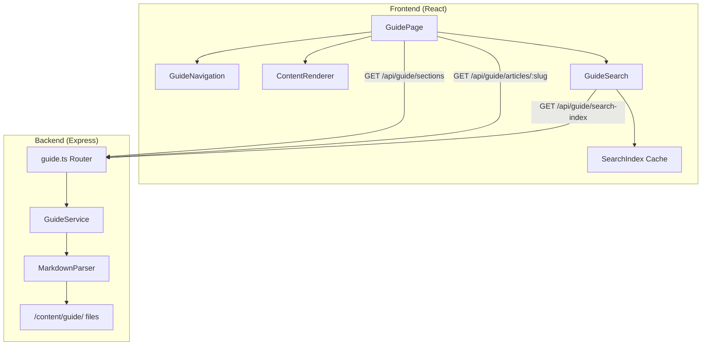

# In-Game Guide — Technical Design Document

## Overview

The in-game guide is a read-only encyclopedia feature that provides Armoured Souls players with structured documentation about all game systems. Content is authored as Markdown files stored in the backend, served via a REST API, and rendered in a React-based frontend with support for Mermaid diagrams, images, tables, and callout blocks.

The guide is a content-delivery feature — not a CRUD application. There is no user-generated content, no database tables, and no write operations. The backend reads static Markdown files from disk, parses frontmatter metadata, and serves structured JSON responses. The frontend renders this content with rich formatting and provides client-side full-text search.

### Key Design Decisions

1. **File-based content, not database-stored**: Guide articles are Markdown files with YAML frontmatter, stored in `prototype/backend/src/content/guide/`. This avoids database migrations for content changes and allows content updates via simple file edits or git commits.

2. **Server-side content parsing, client-side search**: The backend parses Markdown files and serves structured JSON. Search is implemented client-side against a pre-fetched content index to meet the <300ms requirement without adding search infrastructure.

3. **Mermaid rendered client-side**: Mermaid diagram syntax is passed through as-is from the backend; the frontend uses the `mermaid` library to render diagrams in the browser.

4. **No caching layer initially**: Given the small content corpus (~50-100 articles) and read-only nature, in-memory caching on the backend with a file-watcher invalidation strategy is sufficient. No Redis or external cache needed.

## Architecture

### System Architecture Diagram



### Request Flow

1. Player clicks "Guide" in main navigation
2. Frontend fetches `/api/guide/sections` → returns section list with article summaries
3. Player selects an article → frontend fetches `/api/guide/articles/:sectionSlug/:articleSlug`
4. Backend reads the Markdown file, parses frontmatter + body, returns structured JSON
5. Frontend `ContentRenderer` renders Markdown to React components with Mermaid, images, tables, callouts
6. Search: on first search interaction, frontend fetches `/api/guide/search-index` (title + section + body snippets for all articles), caches it, and filters client-side

### Route Integration

**Backend** — new route file `prototype/backend/src/routes/guide.ts`, registered in `index.ts`:
```typescript
app.use('/api/guide', guideRoutes);
```

**Frontend** — new routes in `App.tsx`:
```
/guide                          → GuidePage (landing)
/guide/:sectionSlug             → GuidePage (section view)
/guide/:sectionSlug/:articleSlug → GuidePage (article view)
```

All guide routes are wrapped in `<ProtectedRoute>` consistent with existing patterns.

## Components and Interfaces

### Backend Components

#### GuideService (`prototype/backend/src/services/guide-service.ts`)

Responsible for reading, parsing, and caching guide content from the filesystem.

```typescript
interface GuideSection {
  slug: string;
  title: string;
  order: number;
  articles: GuideArticleSummary[];
}

interface GuideArticleSummary {
  slug: string;
  title: string;
  description: string;
  sectionSlug: string;
  lastUpdated: string; // ISO 8601
}

interface GuideArticle {
  slug: string;
  title: string;
  description: string;
  sectionSlug: string;
  sectionTitle: string;
  body: string; // raw Markdown body
  lastUpdated: string;
  relatedArticles: RelatedArticleLink[];
  previousArticle: GuideArticleLink | null;
  nextArticle: GuideArticleLink | null;
  headings: ArticleHeading[];
}

interface GuideArticleLink {
  slug: string;
  title: string;
  sectionSlug: string;
}

interface RelatedArticleLink extends GuideArticleLink {
  sectionTitle: string;
}

interface ArticleHeading {
  level: number; // 2 or 3
  text: string;
  id: string; // slugified anchor
}

interface SearchIndexEntry {
  slug: string;
  title: string;
  sectionSlug: string;
  sectionTitle: string;
  description: string;
  bodyText: string; // plain text, stripped of Markdown syntax
}
```

**Key methods:**

```typescript
class GuideService {
  // Loads all sections and their article summaries. Cached in memory.
  getSections(): GuideSection[]

  // Loads a single article by section + article slug. Cached in memory.
  getArticle(sectionSlug: string, articleSlug: string): GuideArticle | null

  // Returns the search index (all articles with plain-text body). Cached in memory.
  getSearchIndex(): SearchIndexEntry[]

  // Invalidates the in-memory cache. Called on file changes (dev) or deploy.
  invalidateCache(): void
}
```

The service reads from a content directory structured as:
```
prototype/backend/src/content/guide/
├── sections.json              # Section ordering and metadata
├── getting-started/
│   ├── core-game-loop.md
│   ├── daily-cycle.md
│   ├── starting-budget.md
│   └── roster-strategy.md
├── combat/
│   ├── battle-flow.md
│   ├── malfunctions.md
│   ├── stances.md
│   ├── yield-threshold.md
│   └── counter-attacks.md
├── robots/
│   └── ...
└── ...
```

Each Markdown file uses YAML frontmatter:
```yaml
---
title: "Battle Flow"
description: "How a single attack resolves from malfunction check to HP damage"
order: 1
lastUpdated: "2026-02-01"
relatedArticles:
  - combat/stances
  - weapons/loadout-types
  - robots/attributes
---

## Overview

When a robot attacks, the game processes several steps in order...
```

#### Guide Router (`prototype/backend/src/routes/guide.ts`)

Three endpoints, all behind `authenticateToken`:

| Method | Path | Response | Description |
|--------|------|----------|-------------|
| GET | `/api/guide/sections` | `GuideSection[]` | All sections with article summaries |
| GET | `/api/guide/articles/:sectionSlug/:articleSlug` | `GuideArticle` | Single article with full content |
| GET | `/api/guide/search-index` | `SearchIndexEntry[]` | Flat list for client-side search |

#### MarkdownParser (`prototype/backend/src/services/markdown-parser.ts`)

Utility that:
- Parses YAML frontmatter using `gray-matter`
- Extracts headings (h2, h3) with slugified IDs for table of contents
- Strips Markdown syntax to produce plain text for search indexing
- Validates frontmatter fields against expected schema

### Frontend Components

#### Page Component

**GuidePage** (`prototype/frontend/src/pages/GuidePage.tsx`)
- Top-level page component, renders inside `Navigation` layout
- Uses `useParams()` to determine current section/article from URL
- Manages guide state: sections list, current article, search state
- Responsive: sidebar on desktop, toggleable drawer on mobile (<768px)

#### Guide-Specific Components (`prototype/frontend/src/components/guide/`)

| Component | Responsibility |
|-----------|---------------|
| `GuideNavigation` | Sidebar with collapsible section list, highlights current article |
| `GuideBreadcrumb` | Breadcrumb trail: Guide > Section > Article |
| `GuideArticleView` | Article layout: breadcrumb + ToC + rendered content + related articles |
| `GuideTableOfContents` | Sticky ToC sidebar generated from article headings (shown when >3 headings) |
| `GuideSearch` | Search input with debounced filtering against cached search index |
| `GuideSearchResults` | Displays ranked search results with title, section, and snippet |
| `GuideLandingPage` | Landing view showing all sections as cards with descriptions |
| `GuideRelatedArticles` | "Related Articles" block at bottom of each article |
| `ContentRenderer` | Converts Markdown string to React elements |
| `MermaidDiagram` | Renders a Mermaid code block into an SVG diagram |
| `CalloutBlock` | Renders tip/warning/info callout boxes |

#### ContentRenderer Detail

The `ContentRenderer` component uses `react-markdown` with custom renderers:

- **Headings**: Rendered with anchor IDs matching `GuideTableOfContents` links
- **Code blocks with `mermaid` language**: Delegated to `MermaidDiagram` component
- **Code blocks with `callout-tip`, `callout-warning`, `callout-info`**: Delegated to `CalloutBlock`
- **Images**: Rendered with `loading="lazy"`, alt text fallback on error (Req 3.6)
- **Tables**: Wrapped in a horizontally scrollable container (Req 16.3)
- **Links**: Internal guide links (starting with `/guide/`) use React Router `<Link>`, external links open in new tab
- **Cross-links**: Markdown links like `[Battle Flow](/guide/combat/battle-flow)` resolve to internal navigation

#### GuideSearch Detail

- Search input with 200ms debounce
- Minimum 2 character query (Req 14.2)
- On first interaction, fetches `/api/guide/search-index` and caches in component state
- Filters entries by matching query against `title`, `sectionTitle`, and `bodyText`
- Ranks results: title matches first, then section matches, then body matches
- Highlights matched terms in results (Req 14.5)
- Shows "No results found" with section suggestions when empty (Req 14.4)

### API Client Extension

New file `prototype/frontend/src/utils/guideApi.ts`:

```typescript
import apiClient from './apiClient';

interface GuideSection { /* matches backend type */ }
interface GuideArticle { /* matches backend type */ }
interface SearchIndexEntry { /* matches backend type */ }

export async function fetchGuideSections(): Promise<GuideSection[]> {
  const { data } = await apiClient.get('/api/guide/sections');
  return data;
}

export async function fetchGuideArticle(
  sectionSlug: string,
  articleSlug: string
): Promise<GuideArticle> {
  const { data } = await apiClient.get(`/api/guide/articles/${sectionSlug}/${articleSlug}`);
  return data;
}

export async function fetchSearchIndex(): Promise<SearchIndexEntry[]> {
  const { data } = await apiClient.get('/api/guide/search-index');
  return data;
}
```

## Data Models

This feature does not introduce any database tables. All data is file-based.

### Content File Schema

**`sections.json`** — defines section ordering and metadata:
```json
[
  {
    "slug": "getting-started",
    "title": "Getting Started",
    "description": "Learn the basics of Armoured Souls",
    "order": 1
  },
  {
    "slug": "robots",
    "title": "Robots",
    "description": "Robot attributes, upgrades, and frame types",
    "order": 2
  },
  {
    "slug": "combat",
    "title": "Combat",
    "description": "Battle mechanics, damage, and strategy",
    "order": 3
  },
  {
    "slug": "weapons",
    "title": "Weapons & Loadouts",
    "description": "Weapon types, loadout configurations, and bonuses",
    "order": 4
  },
  {
    "slug": "leagues",
    "title": "Leagues & Matchmaking",
    "description": "Competitive tiers, LP, ELO, and matchmaking",
    "order": 5
  },
  {
    "slug": "tournaments",
    "title": "Tournaments",
    "description": "Tournament format, eligibility, and rewards",
    "order": 6
  },
  {
    "slug": "economy",
    "title": "Economy & Finances",
    "description": "Credits, income, expenses, and financial management",
    "order": 7
  },
  {
    "slug": "facilities",
    "title": "Stable & Facilities",
    "description": "Facility types, upgrades, and investment strategy",
    "order": 8
  },
  {
    "slug": "prestige-fame",
    "title": "Prestige & Fame",
    "description": "Reputation systems and progression rewards",
    "order": 9
  },
  {
    "slug": "strategy",
    "title": "Strategy Guides",
    "description": "Build archetypes, budget allocation, and advanced tactics",
    "order": 10
  },
  {
    "slug": "integrations",
    "title": "Integrations & API",
    "description": "Webhooks, notifications, and community integrations",
    "order": 11
  }
]
```

### Article Frontmatter Schema

| Field | Type | Required | Description |
|-------|------|----------|-------------|
| `title` | string | yes | Article display title |
| `description` | string | yes | Brief summary shown in section listings |
| `order` | number | yes | Sort order within section |
| `lastUpdated` | string (ISO date) | yes | Last content verification date |
| `relatedArticles` | string[] | no | Array of `sectionSlug/articleSlug` paths |

### In-Memory Cache Structure

The `GuideService` maintains three cached objects, populated on first request and invalidated on file change (dev mode via `fs.watch`) or server restart:

```typescript
interface GuideCache {
  sections: GuideSection[] | null;
  articles: Map<string, GuideArticle>; // key: "sectionSlug/articleSlug"
  searchIndex: SearchIndexEntry[] | null;
}
```

### Content Directory Convention

- Each section is a subdirectory under `prototype/backend/src/content/guide/`
- Directory name must match the section `slug` in `sections.json`
- Each article is a `.md` file within its section directory
- Article slug is derived from the filename (minus `.md` extension)
- Articles are ordered by the `order` frontmatter field
- New articles/sections can be added without any code changes (Req 15.3)


## Image & Visual Asset Specification

Guide articles reference static images stored in `prototype/frontend/public/images/guide/`. Each image is referenced in Markdown via relative path: ``.

### Image Storage Structure

```
prototype/frontend/public/images/guide/
├── getting-started/
│   ├── core-game-loop-diagram.webp        # Visual flowchart: Build → Configure → Battle → Results → Iterate
│   └── roster-strategy-comparison.webp    # Side-by-side comparison of 1/2/3 robot approaches
├── robots/
│   ├── attribute-categories-overview.webp # Visual map of 5 attribute categories with all 23 attributes
│   ├── attribute-combat-influence.webp    # Diagram showing which attributes affect which combat outcomes
│   └── training-academy-progression.webp  # Visual showing academy levels → attribute cap unlocks
├── combat/
│   ├── attack-order-of-operations.webp    # Step-by-step: malfunction → hit → crit → damage → shield → armor → HP
│   ├── stance-comparison-chart.webp       # Visual comparison of offensive/defensive/balanced stance modifiers
│   └── yield-threshold-tradeoff.webp      # Diagram showing yield % vs repair cost vs survival
├── weapons/
│   ├── loadout-types-comparison.webp      # 4 loadout types side-by-side with bonuses/penalties
│   ├── weapon-categories-overview.webp    # Energy, Ballistic, Melee, Shield with characteristics
│   └── dual-wield-mechanics.webp          # Visual explaining per-hand bonuses and offhand rules
├── leagues/
│   ├── league-tier-progression.webp       # Bronze → Silver → Gold → Platinum → Diamond → Champion path
│   ├── matchmaking-flow.webp             # LP-primary matching diagram with fallback ranges
│   └── promotion-demotion-rules.webp     # Visual showing top 10%/bottom 10% thresholds and requirements
├── tournaments/
│   ├── bracket-generation-example.webp   # Example single-elimination bracket with seeding
│   └── tournament-rewards-by-round.webp  # Visual showing reward multipliers per round
├── economy/
│   ├── daily-financial-cycle.webp        # Revenue streams in → operating costs out → net income
│   ├── income-sources-overview.webp      # Visual breakdown: battle winnings, merchandising, streaming
│   └── league-tier-reward-scaling.webp   # Chart showing reward ranges from Bronze through Champion
├── facilities/
│   ├── facility-overview-grid.webp       # All 15 facilities with icons, purpose, and cost ranges
│   ├── training-academy-system.webp      # 4 academies → attribute category caps diagram
│   ├── coaching-staff-system.webp        # Coach types, bonuses, and switching visual
│   └── investment-priority-roadmap.webp  # Early/mid/late game recommended facility order
├── prestige-fame/
│   ├── prestige-rank-progression.webp    # Novice → Established → Veteran → Elite → Champion → Legendary
│   ├── fame-tier-progression.webp        # Unknown → Known → Famous → Renowned → Legendary → Mythical
│   └── prestige-income-impact.webp       # Visual showing how prestige scales battle winnings and merchandising
├── strategy/
│   ├── tank-archetype.webp               # Tank build: recommended attributes, weapons, stance
│   ├── glass-cannon-archetype.webp       # Glass Cannon build overview
│   ├── speed-demon-archetype.webp        # Speed Demon build overview
│   ├── counter-striker-archetype.webp    # Counter Striker build overview
│   ├── sniper-archetype.webp             # Sniper build overview
│   └── budget-allocation-strategies.webp # 1/2/3 robot budget split comparison
└── integrations/
    └── notification-flow-diagram.webp    # Cron job → NotificationService → Integrations (Discord, etc.)
```

### Image Specifications

| Property | Specification |
|----------|--------------|
| Format | WebP for all images. WebP provides 25-35% smaller file sizes than PNG with equivalent quality, and has full browser support (Chrome, Firefox, Safari 14+, Edge). Use lossless compression for diagrams/charts to preserve sharp lines and text. |
| Max width | 1200px (rendered at max 100% container width). See per-image dimensions in the checklist below. |
| Color scheme | Must follow Design System dark theme palette — dark backgrounds (#1a1a2e or similar), accent colors from brand palette |
| Typography in images | Use the project's brand typeface or a clean sans-serif that matches the UI |
| Style | Clean, schematic, engineering-aesthetic consistent with Direction B (Precision). No cartoon/anime style. Flat or minimal 3D. |
| Accessibility | All images must have descriptive alt text in the Markdown. Diagrams should not rely solely on color to convey information. |
| Naming | kebab-case, descriptive: `{subject}-{type}.webp` (e.g., `league-tier-progression.webp`) |

### Image Creation Checklist

Each image needs to be created manually (or via design tool). The following details are provided per image to guide creation:

| # | Full Path | Dimensions (px) | Section | Content Description | Key Elements to Include |
|---|-----------|-----------------|---------|--------------------|-----------------------|
| 1 | `prototype/frontend/public/images/guide/getting-started/core-game-loop-diagram.webp` | 1200 × 600 | Getting Started | Circular flow showing the daily game loop | 5 steps: Build Robots → Configure Strategy → Enlist in Battles → View Results → Iterate. Arrows connecting each step. |
| 2 | `prototype/frontend/public/images/guide/getting-started/roster-strategy-comparison.webp` | 1200 × 500 | Getting Started | Side-by-side comparison of roster approaches | 3 columns: "1 Mighty Robot" (high stats, single point of failure), "2 Average Robots" (balanced), "3 Flimsy Robots" (quantity, low individual power). Pros/cons for each. |
| 3 | `prototype/frontend/public/images/guide/robots/attribute-categories-overview.webp` | 1200 × 800 | Robots | Map of all 23 attributes in their 5 categories | 5 grouped boxes: Combat Systems, Defensive Systems, Chassis & Mobility, AI Processing, Team Coordination. Each box lists its attributes. |
| 4 | `prototype/frontend/public/images/guide/robots/attribute-combat-influence.webp` | 1200 × 700 | Robots | How attributes feed into combat outcomes | Arrows from attribute groups to combat results: damage output, hit chance, critical rate, defense, evasion, etc. |
| 5 | `prototype/frontend/public/images/guide/robots/training-academy-progression.webp` | 1000 × 600 | Robots | Academy levels unlocking attribute caps | 4 academy types, each showing level 1-10 → attribute cap from 10 to 50. |
| 6 | `prototype/frontend/public/images/guide/combat/attack-order-of-operations.webp` | 1200 × 400 | Combat | Sequential attack resolution steps | Linear flow: Malfunction Check → Hit Calculation → Critical Hit Check → Damage Calculation → Shield Absorption → Armor Reduction → HP Damage. Each step with brief label. |
| 7 | `prototype/frontend/public/images/guide/combat/stance-comparison-chart.webp` | 900 × 500 | Combat | 3 stances with their attribute modifiers | Table/chart: Offensive (+ attack, - defense), Defensive (+ defense, - attack), Balanced (neutral). Visual indicators for each modifier. |
| 8 | `prototype/frontend/public/images/guide/combat/yield-threshold-tradeoff.webp` | 1000 × 600 | Combat | Yield % vs repair cost vs survival | Graph or diagram showing: low yield = more damage taken but fights longer, high yield = less damage but surrenders earlier. Repair cost implications. |
| 9 | `prototype/frontend/public/images/guide/weapons/loadout-types-comparison.webp` | 1200 × 500 | Weapons | 4 loadout types with bonuses/penalties | 4 cards: Single, Weapon+Shield, Two-Handed, Dual-Wield. Each showing bonus %, penalty %, and recommended use case. |
| 10 | `prototype/frontend/public/images/guide/weapons/weapon-categories-overview.webp` | 1000 × 500 | Weapons | 4 weapon categories with characteristics | Energy, Ballistic, Melee, Shield — each with icon, general damage range, and key trait. |
| 11 | `prototype/frontend/public/images/guide/weapons/dual-wield-mechanics.webp` | 1000 × 600 | Weapons | Per-hand bonus application and offhand rules | Diagram showing main hand (full bonuses, normal hit chance) vs offhand (per-hand bonuses, 50% hit chance, 40% cooldown penalty). |
| 12 | `prototype/frontend/public/images/guide/leagues/league-tier-progression.webp` | 1200 × 400 | Leagues | 6 tiers from Bronze to Champion | Vertical or horizontal progression: Bronze → Silver → Gold → Platinum → Diamond → Champion. Each tier with color and instance info (max 100 robots). |
| 13 | `prototype/frontend/public/images/guide/leagues/matchmaking-flow.webp` | 1000 × 600 | Leagues | LP-primary matching with ELO secondary | Flowchart: Find opponents ±10 LP → if none, expand to ±20 LP → ELO quality check → match confirmed. |
| 14 | `prototype/frontend/public/images/guide/leagues/promotion-demotion-rules.webp` | 1000 × 500 | Leagues | Promotion/demotion thresholds | Visual: Top 10% + ≥25 LP + ≥5 cycles = PROMOTE. Bottom 10% + ≥5 cycles = DEMOTE. 5-cycle protection for newly promoted. |
| 15 | `prototype/frontend/public/images/guide/tournaments/bracket-generation-example.webp` | 1200 × 700 | Tournaments | Example 8 or 16 robot bracket | Single elimination bracket with seeded positions. Show bye slots for non-power-of-2 counts. |
| 16 | `prototype/frontend/public/images/guide/tournaments/tournament-rewards-by-round.webp` | 900 × 500 | Tournaments | Reward scaling per round | Chart showing how credits scale with round progression (currentRound/maxRounds) and tournament size multiplier. Base ₡20,000 × size × progression. |
| 17 | `prototype/frontend/public/images/guide/economy/daily-financial-cycle.webp` | 1200 × 600 | Economy | Revenue in, costs out, net income | Flow diagram: Left side = income sources (battle winnings, merchandising, streaming). Right side = expenses (facility costs, repairs). Center = net income. |
| 18 | `prototype/frontend/public/images/guide/economy/income-sources-overview.webp` | 1200 × 600 | Economy | Breakdown of all income types | 3 sections: Battle Winnings (by league tier), Merchandising (prestige-scaled), Streaming (fame + battles + studio). Impact descriptions, no formulas. |
| 19 | `prototype/frontend/public/images/guide/economy/league-tier-reward-scaling.webp` | 900 × 500 | Economy | Base win rewards per league tier | Bar chart or table: Bronze ₡7,500, Silver ₡15,000, Gold ₡30,000, Platinum ₡60,000, Diamond ₡115,000, Champion ₡225,000. |
| 20 | `prototype/frontend/public/images/guide/facilities/facility-overview-grid.webp` | 1200 × 900 | Facilities | All 15 facilities at a glance | Grid of 15 facility cards with icon, name, purpose, cost range, daily operating cost. Grouped by category (Economic, Progression, Combat). |
| 21 | `prototype/frontend/public/images/guide/facilities/training-academy-system.webp` | 1000 × 600 | Facilities | 4 academies controlling attribute caps | Diagram: Combat Academy → Combat Systems attributes cap. Defense Academy → Defensive Systems cap. Mobility Academy → Chassis & Mobility cap. AI Academy → AI Processing cap. Level 1-10 scale. |
| 22 | `prototype/frontend/public/images/guide/facilities/coaching-staff-system.webp` | 900 × 500 | Facilities | Coach types and switching mechanics | Visual: Available coach types with bonuses. One-active-coach rule. Switching cost indicator. |
| 23 | `prototype/frontend/public/images/guide/facilities/investment-priority-roadmap.webp` | 1200 × 500 | Facilities | Recommended facility order by game stage | Timeline: Early game (Repair Bay, Training Facility, Storage) → Mid game (Academies, Workshop, Coaching) → Late game (Streaming Studio, Booking Office, Research Lab). |
| 24 | `prototype/frontend/public/images/guide/prestige-fame/prestige-rank-progression.webp` | 1200 × 350 | Prestige & Fame | 6 prestige ranks with thresholds | Progression bar: Novice → Established → Veteran → Elite → Champion → Legendary. Each with threshold value. |
| 25 | `prototype/frontend/public/images/guide/prestige-fame/fame-tier-progression.webp` | 1200 × 350 | Prestige & Fame | 6 fame tiers with thresholds | Progression bar: Unknown → Known → Famous → Renowned → Legendary → Mythical. Each with threshold value. |
| 26 | `prototype/frontend/public/images/guide/prestige-fame/prestige-income-impact.webp` | 1000 × 600 | Prestige & Fame | How prestige scales income | Visual showing: higher prestige → bigger battle winnings bonus + higher merchandising income. Impact arrows, no formulas. |
| 27 | `prototype/frontend/public/images/guide/strategy/tank-archetype.webp` | 800 × 600 | Strategy | Tank build recommendation | Robot silhouette with: key attributes highlighted (hull integrity, armor, defense), recommended weapons, stance (defensive), loadout (weapon+shield). |
| 28 | `prototype/frontend/public/images/guide/strategy/glass-cannon-archetype.webp` | 800 × 600 | Strategy | Glass Cannon build recommendation | Robot silhouette with: key attributes (firepower, targeting, critical systems), recommended weapons, stance (offensive), loadout (two-handed). |
| 29 | `prototype/frontend/public/images/guide/strategy/speed-demon-archetype.webp` | 800 × 600 | Strategy | Speed Demon build recommendation | Robot silhouette with: key attributes (speed, evasion, initiative), recommended weapons, stance (balanced), loadout (dual-wield). |
| 30 | `prototype/frontend/public/images/guide/strategy/counter-striker-archetype.webp` | 800 × 600 | Strategy | Counter Striker build recommendation | Robot silhouette with: key attributes (counter-attack, reflexes, defense), recommended weapons, stance (defensive), loadout (weapon+shield). |
| 31 | `prototype/frontend/public/images/guide/strategy/sniper-archetype.webp` | 800 × 600 | Strategy | Sniper build recommendation | Robot silhouette with: key attributes (targeting, critical, range), recommended weapons, stance (offensive), loadout (single). |
| 32 | `prototype/frontend/public/images/guide/strategy/budget-allocation-strategies.webp` | 1200 × 500 | Strategy | Budget split for 1/2/3 robot approaches | 3 pie charts or bar charts showing ₡3M allocation: robots, weapons, facilities, reserves for each approach. |
| 33 | `prototype/frontend/public/images/guide/integrations/notification-flow-diagram.webp` | 1200 × 500 | Integrations | Notification dispatch flow | Flow: Cron Job (league/tournament/tag team/settlement) → NotificationService → buildMessage → dispatch → Discord Integration (webhook POST). Future: Slack, email. |

### Total Images Required: 33

All images should be created before or during the content authoring task. Placeholder images (solid color with text label) can be used during development and replaced with final assets later.

## Correctness Properties

*A property is a characteristic or behavior that should hold true across all valid executions of a system — essentially, a formal statement about what the system should do. Properties serve as the bridge between human-readable specifications and machine-verifiable correctness guarantees.*

### Property 1: Authenticated access without progression gating

*For any* authenticated user, regardless of their stable's prestige level, robot count, league tier, or account age, requesting any guide API endpoint (`/api/guide/sections`, `/api/guide/articles/:s/:a`, `/api/guide/search-index`) should return a successful response (HTTP 200) and never a 403 Forbidden.

**Validates: Requirements 1.3**

### Property 2: Section and article listing completeness

*For any* list of guide sections returned by `getSections()`, every section defined in `sections.json` must appear in the response, and *for any* section in that list, every `.md` file in the corresponding content directory must appear as an article summary with a non-empty `title` and non-empty `description`.

**Validates: Requirements 1.4, 2.2**

### Property 3: Breadcrumb path correctness

*For any* guide article with a known `sectionSlug`, `sectionTitle`, and `title`, the generated breadcrumb should produce exactly three segments: ["Guide", sectionTitle, articleTitle], where each segment's link resolves to the correct route (`/guide`, `/guide/:sectionSlug`, `/guide/:sectionSlug/:articleSlug`).

**Validates: Requirements 2.4**

### Property 4: Table of Contents conditional rendering

*For any* guide article, if the article's `headings` array has more than 3 entries, the Table of Contents component should be rendered; if it has 3 or fewer entries, the Table of Contents component should not be rendered.

**Validates: Requirements 2.5**

### Property 5: Content rendering fidelity

*For any* valid Markdown string, the `ContentRenderer` output should contain: an HTML heading element for each Markdown heading, a `<table>` for each Markdown table, an `` for each Markdown image, a Mermaid diagram container for each ` ```mermaid ` code block, and a callout block for each ` ```callout-* ` code block. The count of each rendered element type must equal the count of the corresponding Markdown construct in the input.

**Validates: Requirements 3.1, 3.2, 3.3, 3.4, 3.5**

### Property 6: Search completeness and ranking

*For any* search index and any query string of 2+ characters, the search function must return all entries where the query appears as a case-insensitive substring of `title`, `sectionTitle`, or `bodyText`. Furthermore, results where the query matches in `title` must appear before results matching only in `sectionTitle`, which must appear before results matching only in `bodyText`.

**Validates: Requirements 14.1, 14.3**

### Property 7: Article API response completeness

*For any* valid article slug pair (`sectionSlug`, `articleSlug`) that corresponds to an existing Markdown file, the `getArticle()` response must include all required fields: non-empty `title`, non-empty `body`, non-empty `sectionSlug`, non-empty `sectionTitle`, a valid ISO 8601 `lastUpdated` string, a `headings` array, a `relatedArticles` array, and `previousArticle`/`nextArticle` links (which may be null only for the first/last article in a section).

**Validates: Requirements 15.2**

### Property 8: Related articles display bounds

*For any* guide article that specifies `relatedArticles` in its frontmatter, the resolved related articles list must contain between 0 and 5 entries (inclusive), and each entry must reference an article that actually exists in the content directory. Articles referencing non-existent related articles should have those entries silently filtered out rather than causing an error.

**Validates: Requirements 17.3**

## Error Handling

### Backend Error Handling

| Scenario | Behavior | HTTP Status |
|----------|----------|-------------|
| Article slug not found | Return `{ error: "Article not found" }` | 404 |
| Section slug not found | Return `{ error: "Section not found" }` | 404 |
| Malformed frontmatter in `.md` file | Log warning, skip article in listings, return 404 if directly requested | 404 / skip |
| Content directory missing | Log error at startup, return empty sections list | 200 (empty) |
| File read error (permissions) | Log error, return `{ error: "Internal server error" }` | 500 |
| Invalid `relatedArticles` reference | Silently filter out non-existent references, log warning | N/A (filtered) |

All errors are logged via the existing `logger` from `prototype/backend/src/config/logger.ts`. Error responses follow the existing pattern: `{ error: string }`.

### Frontend Error Handling

| Scenario | Behavior |
|----------|----------|
| API returns 404 for article | Display "Article not found" message with link back to guide landing |
| API returns 500 | Display "Something went wrong" message with a "Try Again" button that re-fetches |
| API unreachable (network error) | Display cached navigation (if available from previous successful fetch) with an "Offline" indicator badge. Article area shows "Unable to load content. Check your connection." |
| Cross-link to non-existent article | Navigate to the article route; the 404 handling above catches it gracefully |
| Image fails to load | `onError` handler on `` replaces the image with its `alt` text in a styled placeholder div |
| Mermaid diagram fails to render | Display the raw Mermaid source in a code block with a "Diagram could not be rendered" caption |
| Search index fetch fails | Display "Search unavailable" message; search input remains visible but disabled |

### Offline/Cache Strategy

The frontend caches the sections list and search index in React state after first successful fetch. If the API becomes unreachable during a session, the cached sections list powers the navigation sidebar with an "Offline" badge. Article content is not cached (too large, and stale content is worse than no content for a guide).

## Testing Strategy

### Testing Approach

This feature uses a dual testing approach:
- **Unit tests** for specific examples, edge cases, and error conditions
- **Property-based tests** (using `fast-check`) for universal properties across generated inputs

Both are complementary. Unit tests catch concrete bugs and verify specific content requirements. Property tests verify that general rules hold across all valid inputs.

### Property-Based Testing Configuration

- **Library**: `fast-check` (already in project dependencies per project overview)
- **Minimum iterations**: 100 per property test
- **Tag format**: Each test is tagged with a comment: `// Feature: in-game-guide, Property {N}: {title}`

Each correctness property from the design is implemented as a single `fast-check` property test.

### Backend Tests

**Location**: `prototype/backend/src/__tests__/guide/`

#### Property Tests

| Test | Property | Description |
|------|----------|-------------|
| `guide-service.property.test.ts` | Property 1 | Generate random user objects, verify guide service does not check progression fields |
| `guide-service.property.test.ts` | Property 2 | Generate random `sections.json` + article files, verify `getSections()` returns all |
| `guide-service.property.test.ts` | Property 7 | Generate random valid article files, verify `getArticle()` response has all required fields |
| `guide-service.property.test.ts` | Property 8 | Generate articles with random `relatedArticles` (some valid, some invalid), verify filtering and bounds |

#### Unit Tests

| Test | Description |
|------|-------------|
| `guide-service.test.ts` | Specific content existence: verify all 11 sections exist (Req 2.1) |
| `guide-service.test.ts` | Verify specific articles exist for each section (Req 4-13, 20) |
| `guide-routes.test.ts` | API endpoint tests: 200 for valid slugs, 404 for invalid, 401 for unauthenticated |
| `markdown-parser.test.ts` | Frontmatter parsing: valid YAML, missing fields, malformed YAML |
| `markdown-parser.test.ts` | Heading extraction: correct levels, slugified IDs |
| `markdown-parser.test.ts` | Plain text stripping for search index |

### Frontend Tests

**Location**: `prototype/frontend/src/__tests__/guide/`

#### Property Tests

| Test | Property | Description |
|------|----------|-------------|
| `guide-search.property.test.ts` | Property 6 | Generate random search indices and queries, verify completeness and ranking |
| `content-renderer.property.test.ts` | Property 5 | Generate random Markdown with headings/tables/images/mermaid/callouts, verify element counts |
| `guide-breadcrumb.property.test.ts` | Property 3 | Generate random section/article names, verify breadcrumb segments |
| `guide-toc.property.test.ts` | Property 4 | Generate articles with random heading counts, verify ToC presence/absence |

#### Unit Tests

| Test | Description |
|------|-------------|
| `GuidePage.test.tsx` | Renders landing page with all sections |
| `GuideNavigation.test.tsx` | Sidebar renders sections, highlights current, collapses on mobile |
| `GuideSearch.test.tsx` | Debounce behavior, minimum 2 chars, no-results message |
| `ContentRenderer.test.tsx` | Image error fallback, cross-link rendering, table scroll wrapper |
| `GuideArticleView.test.tsx` | Related articles section, previous/next navigation |
| `error-handling.test.tsx` | API error states: 404 message, 500 retry button, offline indicator |

### Content Validation Tests

A separate test suite validates that the actual guide content files meet requirements:

| Test | Description |
|------|-------------|
| `content-validation.test.ts` | All 11 required sections exist in `sections.json` |
| `content-validation.test.ts` | Each section directory contains at least one `.md` file |
| `content-validation.test.ts` | All `.md` files have valid frontmatter (title, description, order, lastUpdated) |
| `content-validation.test.ts` | All `relatedArticles` references point to existing files |
| `content-validation.test.ts` | Specific articles exist per Req 4-13 and Req 20 (e.g., `getting-started/core-game-loop.md`) |
| `content-validation.test.ts` | Articles requiring diagrams contain at least one ` ```mermaid ` block (Req 5.2, 6.2, 8.6, 10.6, 20.5) |
