# Design Document: King of the Hill

## Overview

King of the Hill (KotH) is a zone-control battle mode for Armoured Souls where 5–6 robots compete in a free-for-all to accumulate points by occupying a central control zone. It plugs into the existing 2D Combat Arena extensibility architecture — implementing `TargetPriorityStrategy`, `MovementIntentModifier`, `WinConditionEvaluator`, and `ArenaZone` — without modifying the core combat engine.

The system spans five major areas:

1. **KotH Engine** — Zone scoring, zone-aware AI strategies, anti-passive mechanics, and win condition evaluation, all implemented as pluggable strategy objects consumed by the existing `combatSimulator.ts`.
2. **Battle Orchestrator Extension** — `battleOrchestrator.ts` gains a `executeScheduledKothBattles()` path that reuses the shared pipeline (robot loading, battle record creation, stats updates, streaming revenue, audit logging) with KotH-specific branching for N-participant rewards, zero ELO change, and placement-based progression.
3. **KotH Matchmaking Service** — `kothMatchmakingService.ts` distributes all eligible robots into ELO-balanced groups of 6 (remainder of 5) using snake-draft ordering, enforcing one-robot-per-stable and weapon readiness prerequisites.
4. **Cycle Scheduler Integration** — A fifth cron job (`koth`, `0 16 * * 1,3,5`) slots into `cycleScheduler.ts` alongside the existing league/tournament/tagTeam/settlement jobs, executing repair → KotH battles → KotH matchmaking.
5. **Frontend Integration** — KotH standings page, Hall of Records category, dashboard match cards, robot analytics KotH section, battle history filter, admin panel filter, and battle playback zone visualization.

### Design Decisions

- **Extend battleOrchestrator.ts, not a separate file.** The shared pipeline (robot loading, BattleParticipant creation, streaming revenue, audit logging) is substantial. Branching on `battleType` inside the existing orchestrator avoids duplicating ~400 lines of plumbing. The tag team orchestrator is separate because its tag-out mechanics fundamentally alter the simulation loop; KotH does not — it uses the standard `simulateBattle()` call with a `GameModeConfig`.
- **New `ScheduledKothMatch` table instead of reusing `ScheduledMatch`.** The existing `ScheduledMatch` has `robot1Id`/`robot2Id` columns hardcoded for 1v1. KotH needs a participant list of 5–6 robots. A join table (`ScheduledKothMatchParticipant`) or a JSON array column would work, but a dedicated table with a relation to a participants array is cleaner and queryable.
- **`Battle.robot1Id`/`robot2Id` backward compatibility.** For KotH battles, `robot1Id` = 1st place, `robot2Id` = 2nd place. All real participant data lives in `BattleParticipant` (already supports N participants). This avoids schema changes to the Battle table.
- **No ELO impact.** Multi-robot FFA doesn't map to pairwise ELO. KotH uses ELO only for matchmaking group balancing. `BattleParticipant.eloBefore === eloAfter` for all KotH records.
- **Snake-draft matchmaking.** Sort all eligible robots by ELO descending, then distribute in snake order (1→2→3→...→N→N→...→3→2→1→1→...) across groups. This minimizes total ELO variance between groups with O(n log n) complexity.
- **Zone variant by day of week.** Monday/Friday = fixed center zone, Wednesday = rotating zone. Stored in the scheduled match record so the orchestrator builds the correct `GameModeConfig` at execution time.

## Architecture

### System Context Diagram

```mermaid
graph TB
    subgraph "Cycle Scheduler (cycleScheduler.ts)"
        CRON_KOTH["KotH Cron Job<br/>0 16 * * 1,3,5<br/>(Mon/Wed/Fri 4PM UTC)"]
    end

    subgraph "KotH Engine (arena/kothEngine.ts)"
        KOTH_CONFIG["buildKothGameModeConfig()"]
        KOTH_TARGET["KothTargetPriorityStrategy"]
        KOTH_MOVE["KothMovementIntentModifier"]
        KOTH_WIN["KothWinConditionEvaluator"]
        KOTH_ZONE["KothZoneManager"]
        KOTH_PASSIVE["KothPassivePenaltyTracker"]
    end

    subgraph "Battle Pipeline"
        ORCH["battleOrchestrator.ts<br/>executeScheduledKothBattles()"]
        SIM["combatSimulator.ts<br/>simulateBattle()"]
        MSG["combatMessageGenerator.ts"]
    end

    subgraph "Matchmaking"
        MM["kothMatchmakingService.ts<br/>runKothMatchmaking()"]
    end

    subgraph "Database"
        SKM["ScheduledKothMatch"]
        SKMP["ScheduledKothMatchParticipant"]
        BATTLE["Battle (battleType='koth')"]
        BP["BattleParticipant (5-6 per match)"]
        ROBOT["Robot (koth* cumulative stats)"]
    end

    subgraph "Notifications"
        DISCORD["Discord Webhook<br/>'koth' job context"]
    end

    CRON_KOTH -->|"1. repairAllRobots()"| ORCH
    CRON_KOTH -->|"2. executeScheduledKothBattles()"| ORCH
    CRON_KOTH -->|"3. runKothMatchmaking()"| MM
    CRON_KOTH -->|"4. dispatchNotification()"| DISCORD

    ORCH -->|"build config"| KOTH_CONFIG
    KOTH_CONFIG --> KOTH_TARGET
    KOTH_CONFIG --> KOTH_MOVE
    KOTH_CONFIG --> KOTH_WIN
    KOTH_CONFIG --> KOTH_ZONE
    KOTH_CONFIG --> KOTH_PASSIVE

    ORCH -->|"simulateBattle(robots, gameModeConfig)"| SIM
    SIM -->|"CombatResult"| ORCH
    ORCH -->|"narrative"| MSG
    ORCH -->|"write"| BATTLE
    ORCH -->|"write"| BP
    ORCH -->|"update koth stats"| ROBOT

    MM -->|"query eligible"| ROBOT
    MM -->|"create"| SKM
    MM -->|"create"| SKMP

    ORCH -->|"query scheduled"| SKM
```



### Daily Timeline with KotH

```
UTC   Job
08:00 Tournament Cycle
12:00 Tag Team Cycle (battles on odd cycles only)
16:00 KotH Cycle (Mon/Wed/Fri only) ← NEW
20:00 League Cycle
23:00 Settlement
```

The 4-hour gaps between adjacent jobs provide ample separation. The KotH job acquires the same in-memory mutex lock as all other jobs, preventing overlap.

## Components and Interfaces

### 1. KotH Engine (`app/backend/src/services/arena/kothEngine.ts`)

The KotH engine is a collection of pure functions and strategy implementations that produce a `GameModeConfig` for the combat simulator.

```typescript
// --- Public API ---

interface KothMatchConfig {
  scoreThreshold?: number;    // default 30, range [15, 90]
  timeLimit?: number;         // default 150s, range [60, 300]
  zoneRadius?: number;        // default 5, range [3, 8]
  rotatingZone?: boolean;     // default false
  participantCount: number;   // 5 or 6
  matchId: number;            // for deterministic zone rotation seed
}

function buildKothGameModeConfig(config: KothMatchConfig): GameModeConfig;
function buildKothInitialState(config: KothMatchConfig, robotIds: number[]): GameModeState;
function validateKothConfig(config: KothMatchConfig): { valid: boolean; errors: string[] };

// --- Zone Management ---

interface KothZoneState {
  center: Position;
  radius: number;
  isActive: boolean;           // false during transition period
  transitionTarget?: Position; // next zone position (rotating variant)
  transitionCountdown?: number;
  rotationCount: number;
}

function createControlZone(config: KothMatchConfig): ArenaZone;
function calculateSpawnPositions(participantCount: number, arenaRadius: number): Position[];
function generateNextZonePosition(
  matchId: number,
  rotationCount: number,
  currentCenter: Position,
  arenaRadius: number,
  zoneRadius: number,
): Position;

// --- Scoring ---

interface KothScoreState {
  zoneScores: Record<number, number>;        // robotId → cumulative score
  zoneOccupants: Set<number>;                // robotIds currently in zone
  zoneOccupationTime: Record<number, number>;// robotId → total seconds in zone
  uncontestedTime: Record<number, number>;   // robotId → seconds of uncontested control
  passiveTimers: Record<number, number>;     // robotId → consecutive seconds outside zone
  eliminatedRobots: Set<number>;             // robotIds permanently eliminated
  eliminationScores: Record<number, number>; // robotId → score at elimination time
  killCounts: Record<number, number>;        // robotId → kills in this match
  lastStandingPhase: boolean;
  lastStandingTimer: number;
  lastStandingRobotId: number | null;
}

function evaluateZoneOccupation(
  robots: RobotCombatState[],
  zone: KothZoneState,
): { occupants: number[]; state: 'uncontested' | 'contested' | 'empty' };

function tickScoring(
  scoreState: KothScoreState,
  zoneState: KothZoneState,
  occupationResult: { occupants: number[]; state: string },
  deltaTime: number,
): CombatEvent[];

function awardKillBonus(
  scoreState: KothScoreState,
  killerRobotId: number,
  victimRobotId: number,
): CombatEvent;
```

### 2. KotH Strategy Implementations

```typescript
// --- Target Priority (Req 5) ---

class KothTargetPriorityStrategy implements TargetPriorityStrategy {
  selectTargets(
    robot: RobotCombatState,
    opponents: RobotCombatState[],
    arena: ArenaConfig,
    gameState?: GameModeState,
  ): number[];
}

// Priority weights:
//   Zone contesters:  3.0× base
//   Zone approachers: 2.0× base (moving toward zone)
//   Outside, not approaching: 1.0× base
//   When robot is inside zone uncontested: prioritize approachers
//   When robot is inside zone contested: prioritize lowest HP contester
//   When robot is outside zone: 1.5× for approaching opponents
//
// threatAnalysis scaling:
//   ta < 10:  weights at 50% effectiveness
//   ta 10-30: linear interpolation 50% → 100%
//   ta > 30:  full 100% effectiveness

// --- Movement Intent (Req 6) ---

class KothMovementIntentModifier implements MovementIntentModifier {
  modify(
    baseIntent: MovementIntent,
    robot: RobotCombatState,
    arena: ArenaConfig,
    gameState?: GameModeState,
  ): MovementIntent;
}

// Rules:
//   No opponent within 6 units → move toward zone center
//     bias strength: 30% at ta=1, 100% at ta=50 (linear)
//   Inside zone uncontested, no opponent within 8 units → hold position
//   combatAlgorithms > 25 + zone contested by 2 others → wait-and-enter
//     hold 2 units outside zone edge until contester eliminated or < 30% HP
//   Opponent within 4 units and attacking → preserve base combat AI movement

// --- Win Condition (Req 4) ---

class KothWinConditionEvaluator implements WinConditionEvaluator {
  evaluate(
    teams: RobotCombatState[][],
    currentTime: number,
    gameState?: GameModeState,
  ): { ended: boolean; winnerId: number | null; reason: string } | null;
}

// Checks (in order):
//   1. Any robot reached scoreThreshold → winner, reason: 'score_threshold'
//   2. All but one eliminated → enter lastStandingPhase (10s window)
//   3. lastStandingPhase timer expired → highest score wins, reason: 'last_standing'
//   4. timeLimit reached → highest score wins, reason: 'time_limit'
//   5. Tiebreaker: zone occupation time → damage dealt
```

### 3. Anti-Passive Mechanics (`kothEngine.ts`)

```typescript
function tickPassivePenalties(
  scoreState: KothScoreState,
  robots: RobotCombatState[],
  zone: KothZoneState,
  deltaTime: number,
): CombatEvent[];

// For each alive, non-eliminated robot:
//   If outside zone: increment passiveTimers[robotId] by deltaTime
//   If inside zone: decay penalty over 3 seconds (linear), reset timer to 0
//
// Penalty thresholds:
//   20s outside → emit 'passive_warning' event
//   30s outside → activate damage reduction: 3% per 5s, capped at 30%
//     Applied as a multiplier on the robot's outgoing damage
//   60s outside → additional 15% accuracy penalty on all attacks
//
// Penalty formula:
//   secondsOverThreshold = passiveTimer - 30
//   damageReduction = min(0.30, floor(secondsOverThreshold / 5) * 0.03)
//   accuracyPenalty = passiveTimer >= 60 ? 0.15 : 0
```

### 4. KotH Matchmaking Service (`app/backend/src/services/kothMatchmakingService.ts`)

```typescript
interface KothMatchGroup {
  robotIds: number[];
  totalElo: number;
  rotatingZone: boolean;
}

async function runKothMatchmaking(scheduledFor: Date): Promise<number>;
// Returns: number of matches created
//
// Algorithm:
//   1. Query eligible robots (weapon readiness, not already scheduled for KotH)
//   2. Filter: one robot per stable (highest ELO robot per user)
//   3. Sort by ELO descending
//   4. Determine group count: Math.floor(eligible.length / 6)
//     remainder = eligible.length % 6
//     If remainder >= 5: extra group of 5
//     If remainder < 5: distribute remainder into existing groups (some get 5)
//     If total < 5: skip, log "insufficient eligible robots"
//   5. Snake-draft distribution:
//     Round 1: robot[0]→group[0], robot[1]→group[1], ..., robot[N-1]→group[N-1]
//     Round 2: robot[N]→group[N-1], robot[N+1]→group[N-2], ..., robot[2N-1]→group[0]
//     Repeat until all robots assigned
//   6. Determine zone variant by day of week:
//     Monday (1), Friday (5) → rotatingZone: false
//     Wednesday (3) → rotatingZone: true
//   7. Create ScheduledKothMatch + ScheduledKothMatchParticipant records

function getEligibleRobots(): Promise<Robot[]>;
function distributeIntoGroups(robots: Robot[], groupCount: number): KothMatchGroup[];
```

### 5. Battle Orchestrator Extension (`app/backend/src/services/battleOrchestrator.ts`)

```typescript
// New exports added to existing file:

interface KothBattleExecutionSummary {
  totalMatches: number;
  successfulMatches: number;
  failedMatches: number;
  totalRobotsInvolved: number;
  matchResults: Array<{
    matchId: number;
    winnerId: number | null;
    placements: Array<{ robotId: number; placement: number; zoneScore: number }>;
  }>;
  errors: string[];
}

async function executeScheduledKothBattles(scheduledFor?: Date): Promise<KothBattleExecutionSummary>;
// Steps per match:
//   1. Load ScheduledKothMatch + participants with weapons
//   2. Reset all robots to full HP/shield
//   3. Build KothMatchConfig from match record (zone variant, overrides)
//   4. Call buildKothGameModeConfig() → GameModeConfig
//   5. Call simulateBattle() with all robots + GameModeConfig
//   6. Determine placements from CombatResult (zoneScores, tiebreakers)
//   7. Create Battle record (robot1Id=1st, robot2Id=2nd, battleType='koth')
//   8. Create BattleParticipant records for all 5-6 robots
//   9. Calculate placement-based rewards (Req 14)
//  10. Award credits, fame, prestige to users
//  11. Award streaming revenue to all participants
//  12. Update robot cumulative KotH stats (Req 22)
//  13. Log audit events (one per robot)
//  14. Update ScheduledKothMatch status to 'completed'

async function processKothBattle(
  match: ScheduledKothMatchWithParticipants,
): Promise<KothBattleResult>;

// Placement-based rewards (Req 14):
function calculateKothRewards(placement: number, zoneScore: number, totalUncontestedScore: number): {
  credits: number;
  fame: number;
  prestige: number;
  zoneDominanceBonus: boolean; // >75% from uncontested → +25% all rewards
};
```

### 6. Cycle Scheduler Extension (`app/backend/src/services/cycleScheduler.ts`)

```typescript
// Extended SchedulerConfig:
interface SchedulerConfig {
  enabled: boolean;
  leagueSchedule: string;
  tournamentSchedule: string;
  tagTeamSchedule: string;
  settlementSchedule: string;
  kothSchedule: string;  // NEW: default '0 16 * * 1,3,5'
}

// Extended JobState name union:
type JobName = 'league' | 'tournament' | 'tagTeam' | 'settlement' | 'koth';

// New cycle handler:
async function executeKothCycle(): Promise<JobContext>;
// Steps:
//   1. repairAllRobots(true) — ensure full HP before KotH
//   2. executeScheduledKothBattles(new Date()) — run all scheduled matches
//   3. runKothMatchmaking(scheduledFor) — schedule next KotH event
//      scheduledFor = next Mon/Wed/Fri at 16:00 UTC
//   4. Return JobContext with jobName: 'koth', matchesCompleted: N
```

### 7. Notification Service Extension

```typescript
// Extended JobContext (notification-service.ts → integration.ts):
interface JobContext {
  jobName: 'league' | 'tournament' | 'tag-team' | 'settlement' | 'koth';
  // ... existing fields ...
  matchesCompleted?: number; // KotH: number of matches executed
}

// buildSuccessMessage addition:
case 'koth':
  if (!context.matchesCompleted || context.matchesCompleted === 0) return null;
  return `King of the Hill: ${context.matchesCompleted} matches completed! 👑 Click here to see the results! ${link}`;
```

### 8. Frontend Components

#### KotH Standings Page (`/koth-standings`)
- Route: `/koth-standings`
- API: `GET /api/koth/standings?view=all_time|last_10&page=1&limit=50`
- Follows `LeagueStandingsPage.tsx` pattern
- Columns: Rank, Robot Name, Owner, KotH Wins, Matches, Win Rate, Total Zone Score, Avg Zone Score, Kills, Best Streak
- Medal colors for top 3, blue highlight for current user's robots
- Summary header: total events, unique participants, #1 robot

#### Hall of Records KotH Tab
- New "King of the Hill" tab with 👑 icon
- 7 records: Most Wins, Highest Single-Match Score, Most Kills (Career), Longest Win Streak, Most Zone Time (Single Match), Fastest Threshold Victory, Zone Dominator
- API: `GET /api/records` extended with `koth` category
- Only shown after 5+ KotH events completed

#### Dashboard KotH Match Cards
- Orange left border (#F97316), 👑 icon
- Upcoming: "King of the Hill" label, robot name, opponent list, participant count, scheduled time
- Recent: placement ("1st of 6"), Zone_Score, credits earned, "View Battle" link
- Adapts CompactBattleCard from head-to-head to event-based layout

#### Robot Analytics KotH Section
- Rendered below existing league performance when `kothMatches > 0`
- Orange (#F97316) accent color
- Metrics: KotH Matches, 1st Place Finishes, Podium Rate, Avg Zone Score, Total Zone Time, KotH Kills, Best Placement, Current Win Streak
- API: `GET /api/analytics/robot/{robotId}/koth-performance`

#### Battle History KotH Filter
- New "KotH" option in battle type filter
- KotH summary stats: total matches, placement breakdown, avg zone score, total credits, total kills
- CompactBattleCard: 👑 icon, orange border, placement badge, zone variant label

#### Battle Playback Zone Visualization
- Translucent circular zone overlay (gold/amber base)
- Uncontested: tinted with controlling robot's color
- Contested: pulsing red tint
- Scoreboard panel with real-time Zone_Scores
- 6-color robot palette: blue (#3B82F6), red (#EF4444), green (#22C55E), orange (#F97316), purple (#A855F7), cyan (#06B6D4)
- Zone occupation indicators on robot icons
- Rotating zone: fade-out/fade-in animation on transition

#### Admin Panel KotH Integration
- "koth" filter option in battle type dropdown
- KotH battle list: match ID, date, zone variant, participant count, winner, duration, end reason
- KotH battle detail: all participants with placement, Zone_Score, zone time, kills, elimination status, rewards
- Manual KotH cycle trigger button


## Data Models

### New Database Tables

#### ScheduledKothMatch

```prisma
model ScheduledKothMatch {
  id            Int      @id @default(autoincrement())
  scheduledFor  DateTime @map("scheduled_for")
  status        String   @default("scheduled") @db.VarChar(20) // "scheduled", "completed", "failed", "cancelled"
  battleId      Int?     @map("battle_id")       // Links to Battle after completion
  rotatingZone  Boolean  @default(false) @map("rotating_zone")

  // Optional config overrides (null = use defaults)
  scoreThreshold Int?    @map("score_threshold")
  timeLimit      Int?    @map("time_limit")
  zoneRadius     Int?    @map("zone_radius")

  createdAt DateTime @default(now()) @map("created_at")

  // Relations
  battle       Battle?                        @relation(fields: [battleId], references: [id])
  participants ScheduledKothMatchParticipant[]

  @@index([scheduledFor, status])
  @@index([status])
  @@map("scheduled_koth_matches")
}
```

#### ScheduledKothMatchParticipant

```prisma
model ScheduledKothMatchParticipant {
  id      Int @id @default(autoincrement())
  matchId Int @map("match_id")
  robotId Int @map("robot_id")

  // Relations
  match ScheduledKothMatch @relation(fields: [matchId], references: [id], onDelete: Cascade)
  robot Robot              @relation(fields: [robotId], references: [id])

  @@unique([matchId, robotId])
  @@index([matchId])
  @@index([robotId])
  @@map("scheduled_koth_match_participants")
}
```

### Extended Robot Model (New KotH Fields)

```prisma
// Added to existing Robot model:

// ===== KOTH CUMULATIVE STATISTICS =====
kothWins              Int     @default(0) @map("koth_wins")
kothMatches           Int     @default(0) @map("koth_matches")
kothTotalZoneScore    Float   @default(0) @map("koth_total_zone_score")
kothTotalZoneTime     Float   @default(0) @map("koth_total_zone_time")     // seconds
kothKills             Int     @default(0) @map("koth_kills")
kothBestPlacement     Int?    @map("koth_best_placement")                  // 1 = best
kothCurrentWinStreak  Int     @default(0) @map("koth_current_win_streak")
kothBestWinStreak     Int     @default(0) @map("koth_best_win_streak")     // for Hall of Records

// New relation
kothMatchParticipations ScheduledKothMatchParticipant[]
```

### Extended Battle Table Usage

KotH battles use the existing `Battle` table with:
- `battleType: 'koth'`
- `robot1Id`: 1st place robot (backward compat)
- `robot2Id`: 2nd place robot (backward compat)
- `winnerId`: 1st place robot
- `leagueType`: `'koth'` (not league-specific)
- `robot1ELOBefore/After`: 1st place robot's ELO (unchanged)
- `robot2ELOBefore/After`: 2nd place robot's ELO (unchanged)
- `eloChange`: 0 (no ELO impact)
- `battleLog`: Contains KotH-specific events (zone_enter, score_tick, etc.) plus narrative
- `durationSeconds`: Actual match duration

All 5–6 participants are stored in `BattleParticipant` with:
- `team`: Placement number (1–6) — repurposed from team concept since KotH is FFA
- `role`: `null` (no active/reserve distinction in FFA)
- `eloBefore/eloAfter`: Same value (no ELO change)
- `credits`: Placement-based reward
- `prestigeAwarded`: Placement-based prestige
- `fameAwarded`: Placement-based fame
- `damageDealt`: Total damage dealt during match
- `finalHP`: HP at match end (0 if destroyed)
- `yielded`: Whether robot yielded
- `destroyed`: Whether robot was destroyed (HP=0)

### New Relation on Battle Model

```prisma
// Added to existing Battle model:
scheduledKothMatch ScheduledKothMatch[] // KotH match that produced this battle
```

### API Endpoints (New)

| Method | Path | Description |
|--------|------|-------------|
| GET | `/api/koth/standings` | KotH standings with pagination and time filter |
| GET | `/api/analytics/robot/:id/koth-performance` | Robot's cumulative KotH stats |
| GET | `/api/admin/koth/trigger` | Manual KotH cycle trigger (admin) |
| POST | `/api/admin/koth/trigger` | Execute KotH cycle manually (admin) |

### API Endpoints (Extended)

| Method | Path | Change |
|--------|------|--------|
| GET | `/api/records` | Add `koth` category to response |
| GET | `/api/matches/upcoming` | Include scheduled KotH matches |
| GET | `/api/matches/history` | Include completed KotH battles with `battleType: 'koth'` |
| GET | `/api/admin/battles` | Support `battleType=koth` filter |

### KotH Reward Constants

```typescript
const KOTH_REWARDS = {
  credits: {
    1: 25_000,   // 1st place
    2: 17_500,   // 2nd place
    3: 10_000,   // 3rd place
    default: 5_000, // 4th-6th participation
  },
  fame: {
    1: 8,   // 1st place base fame
    2: 5,   // 2nd place base fame
    3: 3,   // 3rd place base fame
  },
  prestige: {
    1: 15,  // 1st place flat prestige
    2: 8,   // 2nd place flat prestige
    3: 3,   // 3rd place flat prestige
  },
  zoneDominanceBonusThreshold: 0.75, // >75% uncontested → +25% all rewards
  zoneDominanceBonusMultiplier: 1.25,
} as const;

const KOTH_MATCH_DEFAULTS = {
  scoreThreshold: 30,
  timeLimit: 150,           // seconds
  zoneRadius: 5,            // grid units
  arenaRadius: 24,          // grid units
  killBonus: 5,             // points
  rotatingZoneScoreThreshold: 45,
  rotatingZoneTimeLimit: 210,
  rotatingZoneInterval: 30, // seconds between rotations
  zoneTransitionDuration: 3,// seconds
  zoneWarningTime: 5,       // seconds before transition
  lastStandingDuration: 10, // seconds
} as const;

const KOTH_PASSIVE_PENALTIES = {
  warningThreshold: 20,     // seconds outside zone → warning event
  penaltyThreshold: 30,     // seconds outside zone → damage reduction starts
  damageReductionPerInterval: 0.03, // 3% per 5 seconds
  damageReductionInterval: 5,       // seconds
  damageReductionCap: 0.30,         // 30% max
  accuracyPenaltyThreshold: 60,     // seconds outside zone → accuracy penalty
  accuracyPenalty: 0.15,            // 15% accuracy reduction
  penaltyDecayTime: 3,              // seconds to fully remove penalty on zone entry
} as const;

const KOTH_ROBOT_COLORS = [
  { name: 'blue',   hex: '#3B82F6' },
  { name: 'red',    hex: '#EF4444' },
  { name: 'green',  hex: '#22C55E' },
  { name: 'orange', hex: '#F97316' },
  { name: 'purple', hex: '#A855F7' },
  { name: 'cyan',   hex: '#06B6D4' },
] as const;
```

### KotH Event Types

New event types added to the `CombatEvent.type` union:

```typescript
type KothEventType =
  | 'zone_defined'       // Match start: zone center, radius, arena dimensions
  | 'zone_enter'         // Robot enters control zone
  | 'zone_exit'          // Robot exits control zone
  | 'score_tick'         // Periodic scoring (every 1s game time)
  | 'kill_bonus'         // Kill bonus awarded
  | 'zone_moving'        // Warning: zone about to move (rotating variant)
  | 'zone_active'        // Zone activated at new position
  | 'robot_eliminated'   // Robot destroyed or yielded
  | 'passive_warning'    // 20s outside zone warning
  | 'passive_penalty'    // 30s/60s penalty activated
  | 'last_standing'      // Only one robot remains
  | 'match_end';         // Match concluded with final results
```


## Correctness Properties

*A property is a characteristic or behavior that should hold true across all valid executions of a system — essentially, a formal statement about what the system should do. Properties serve as the bridge between human-readable specifications and machine-verifiable correctness guarantees.*

### Property 1: Zone occupation is determined by Euclidean distance

*For any* robot position and control zone (center, radius), the robot is classified as occupying the zone if and only if the Euclidean distance from the robot's position to the zone center is less than or equal to the zone radius. The set of zone occupants in `GameModeState.customData.zoneOccupants` must exactly match the set of robots satisfying this distance condition.

**Validates: Requirements 2.1, 2.2, 2.5**

### Property 2: Zone transitions emit correct events

*For any* robot that transitions from outside the zone to inside (or vice versa) between two consecutive simulation steps, the engine must emit exactly one `zone_enter` (or `zone_exit`) event with the correct robot identity and timestamp. No event is emitted if the robot's zone occupation status does not change between steps.

**Validates: Requirements 2.3, 2.4**

### Property 3: Uncontested zone scoring accumulates at 1 point per second

*For any* duration of uncontested zone occupation (exactly one robot inside the zone) lasting T seconds, the occupying robot's Zone_Score must increase by exactly T points (accumulated in 0.1-point increments per simulation tick). No other robot's score changes during this period (excluding kill bonuses).

**Validates: Requirements 3.1, 3.5**

### Property 4: No points awarded when zone is contested or empty

*For any* simulation tick where the zone is in Contested_State (2+ robots inside) or empty (0 robots inside), no robot's Zone_Score increases from zone occupation. The only way to gain points during these ticks is via Kill_Bonus.

**Validates: Requirements 3.2, 3.3**

### Property 5: Kill bonus awards exactly 5 points and emits event

*For any* robot destruction event (HP reaches 0), the destroying robot's Zone_Score must increase by exactly 5 points, and a `kill_bonus` event must be emitted containing the killer's identity, the victim's identity, and the bonus amount (5).

**Validates: Requirements 3.4, 3.7**

### Property 6: Score threshold triggers immediate match end

*For any* game state where a robot's Zone_Score reaches or exceeds the Score_Threshold, the `WinConditionEvaluator` must return `ended: true` with that robot as the winner and reason `'score_threshold'` on the same simulation tick.

**Validates: Requirements 4.2**

### Property 7: Final placement is ordered by Zone_Score with correct tiebreakers

*For any* set of final robot states (surviving and eliminated), the placement order must be: (a) Zone_Score descending, then (b) total zone occupation time descending, then (c) total damage dealt descending. The robot at placement 1 is the winner when the match ends by time limit or last standing.

**Validates: Requirements 4.4, 4.5, 4.12**

### Property 8: Last standing phase gives exactly 10 seconds then ends

*For any* game state where all robots except one are eliminated, the match must enter a last-standing phase. After exactly 10 seconds (or when Time_Limit is reached, whichever comes first), the match ends and the robot with the highest Zone_Score wins — regardless of whether the surviving robot entered the zone.

**Validates: Requirements 4.8, 4.9**

### Property 9: Zone-aware target priority weights scale correctly

*For any* robot selecting targets in a KotH match, zone contesters (inside the zone) must receive 3.0× base weight, zone approachers (moving toward zone) must receive 2.0× weight, and non-approaching robots outside the zone must receive 1.0× weight. When the robot is outside the zone, approaching opponents receive 1.5× weight. All zone-aware weights are scaled by threatAnalysis: at ta < 10, weights are at 50% effectiveness; at ta 10–30, linear interpolation from 50% to 100%; at ta > 30, full 100%.

**Validates: Requirements 5.2, 5.3, 5.5, 5.6**

### Property 10: Contested zone prioritizes lowest HP contester

*For any* robot inside the Control_Zone in Contested_State, the target priority strategy must rank the contester with the lowest current HP as the highest priority target among all zone contesters.

**Validates: Requirements 5.4**

### Property 11: Zone movement bias scales with threatAnalysis

*For any* robot with no opponent within 6 grid units, the movement intent must target the zone center with directional bias strength linearly interpolated from 30% at threatAnalysis=1 to 100% at threatAnalysis=50. When inside the zone uncontested with no opponent within 8 units, movement intent must be hold-position.

**Validates: Requirements 6.2, 6.3**

### Property 12: Wait-and-enter tactic activates for high combatAlgorithms

*For any* robot with combatAlgorithms > 25 when the zone is contested by two or more other robots, the movement modifier must set the robot's position target to within 2 grid units of the zone edge (not inside the zone) until a contester is eliminated or drops below 30% HP.

**Validates: Requirements 6.4**

### Property 13: Active combat preserves base movement AI

*For any* robot with an opponent within 4 grid units that is actively attacking, the KotH movement modifier must not override the base Movement_Intent — the original combat AI movement logic is preserved.

**Validates: Requirements 6.5**

### Property 14: Yield does not award kill bonus; destruction does

*For any* robot that yields during a KotH match, no Kill_Bonus is awarded to any opponent. *For any* robot that is destroyed (HP=0), the destroying robot receives exactly 5 Kill_Bonus points. Both yield and destruction permanently remove the robot from the match.

**Validates: Requirements 7.2, 7.3, 7.4**

### Property 15: Elimination inside zone immediately updates occupant set

*For any* robot that is eliminated (destroyed or yielded) while inside the Control_Zone, the zone occupant set must exclude that robot on the same simulation tick as the elimination. If this changes the zone from Contested_State to Uncontested_State, the remaining occupant begins scoring immediately.

**Validates: Requirements 7.5**

### Property 16: Eliminated robot's score is preserved for placement

*For any* robot eliminated during a KotH match, its Zone_Score at the time of elimination must be recorded and used in the final placement calculation. The eliminated robot competes for placement against all other robots (surviving and eliminated) based on this preserved score.

**Validates: Requirements 7.6**

### Property 17: Rotating zone positions satisfy distance constraints

*For any* generated zone position in the rotating variant, the position must be at least 6 grid units from the arena boundary and at least 8 grid units from the previous zone position. Both constraints must hold for every transition in the match.

**Validates: Requirements 8.5**

### Property 18: Zone position generation is deterministic

*For any* match ID and rotation count, calling `generateNextZonePosition` with the same inputs must produce the same output position. This ensures replay consistency.

**Validates: Requirements 8.6**

### Property 19: Rotating zone adjusts default thresholds

*For any* KothMatchConfig with `rotatingZone: true` and no explicit overrides, the effective Score_Threshold must be 45 and the effective Time_Limit must be 210 seconds. With `rotatingZone: false`, defaults are 30 and 150 respectively.

**Validates: Requirements 8.7**

### Property 20: Passive penalties scale correctly with time outside zone

*For any* robot that has been outside the Control_Zone for T consecutive seconds: if T < 30, no penalty applies; if 30 ≤ T < 60, damage reduction = min(30%, floor((T-30)/5) × 3%); if T ≥ 60, the same damage reduction applies plus a 15% accuracy penalty. The penalty must decay linearly over 3 seconds when the robot enters the zone, and the passive timer must reset to 0 on zone entry.

**Validates: Requirements 10.4, 10.5, 10.7, 10.8**

### Property 21: Config validation accepts valid ranges and rejects invalid

*For any* KothMatchConfig, validation must accept: participantCount in [5, 6], scoreThreshold in [15, 90], timeLimit in [60, 300], zoneRadius in [3, 8]. For any value outside these ranges, validation must return `valid: false` with a descriptive error listing all invalid fields.

**Validates: Requirements 1.5, 4.7, 11.4, 11.5**

### Property 22: buildKothGameModeConfig produces complete valid config

*For any* valid KothMatchConfig, the resulting `GameModeConfig` must contain: a non-null `targetPriority` (KothTargetPriorityStrategy), a non-null `movementModifier` (KothMovementIntentModifier), a non-null `winCondition` (KothWinConditionEvaluator), an `arenaZones` array containing exactly one zone with `effect: 'control_point'`, and `maxDuration` equal to the KotH time limit. The initial `GameModeState` must have `mode: 'zone_control'` and `zoneScores` initialized to 0 for each participant.

**Validates: Requirements 1.4, 11.1, 11.2, 11.6**

### Property 23: Spawn positions are equidistant and equally spaced

*For any* participant count (5 or 6) and arena radius (24), the calculated spawn positions must all be at distance (arenaRadius - 2) from the center, and the angular spacing between adjacent positions must be equal (72° for 5, 60° for 6) within floating-point tolerance.

**Validates: Requirements 1.3**

### Property 24: Placement-based rewards follow tiered structure

*For any* KotH match result with placements 1–6, credit rewards must be: 1st=₡25,000, 2nd=₡17,500, 3rd=₡10,000, 4th–6th=₡5,000. Fame must be: 1st=8 base, 2nd=5 base, 3rd=3 base (with performance multiplier applied to 1st only). Prestige must be: 1st=+15, 2nd=+8, 3rd=+3, 4th–6th=0. When the winner's uncontested score percentage exceeds 75%, all rewards are multiplied by 1.25.

**Validates: Requirements 14.1, 14.2, 14.3, 14.4**

### Property 25: KotH battles do not modify ELO

*For any* KotH battle, every participating robot's ELO after the battle must equal their ELO before the battle. The `BattleParticipant.eloBefore` must equal `BattleParticipant.eloAfter` for all participants, and `Battle.eloChange` must be 0.

**Validates: Requirements 14.5**

### Property 26: Matchmaking produces ELO-balanced groups with one robot per stable

*For any* set of eligible robots, the snake-draft distribution must produce groups of size 6 (or 5 for the remainder group) where: (a) no two robots in the same group belong to the same user/stable, and (b) the total ELO variance across groups is minimized (the difference between the highest and lowest group total ELO is at most the ELO of one robot).

**Validates: Requirements 16.3, 16.5**

### Property 27: Only eligible robots are selected for matchmaking

*For any* robot in the eligible pool, it must have all required weapons equipped for its loadout type and must not already be scheduled for a KotH match in the current cycle. Robots from all league tiers are eligible (no league restriction).

**Validates: Requirements 16.4, 16.6, 17.1, 17.2**

### Property 28: Cumulative KotH stats are correctly updated after each match

*For any* completed KotH match, each participating robot's cumulative stats must be updated: `kothMatches` incremented by 1, `kothTotalZoneScore` increased by the robot's final Zone_Score, `kothTotalZoneTime` increased by the robot's zone occupation time, `kothKills` increased by the robot's kill count, `kothBestPlacement` updated if current placement is better (lower). For the winner: `kothWins` incremented by 1 and `kothCurrentWinStreak` incremented by 1. For non-winners: `kothCurrentWinStreak` reset to 0.

**Validates: Requirements 22.2, 22.3**

### Property 29: KotH notification dispatched only when matches were executed

*For any* KotH cycle execution, a Discord notification is dispatched if and only if at least one KotH match was executed. The notification message must contain the match count and the crown emoji (👑).

**Validates: Requirements 28.3, 28.4**

### Property 30: KotH standings sorted by wins then zone score

*For any* set of robots with KotH stats, the standings endpoint must return them sorted by `kothWins` descending (primary), then `kothTotalZoneScore` descending (secondary tiebreaker).

**Validates: Requirements 21.2**

## Error Handling

### KotH Engine Errors

| Error Scenario | Handling |
|---|---|
| Invalid KothMatchConfig (out-of-range values) | `validateKothConfig()` returns `{ valid: false, errors: [...] }` listing all invalid fields. Orchestrator logs error and marks match as `failed`. |
| Fewer than 5 eligible robots for matchmaking | `runKothMatchmaking()` logs "insufficient eligible robots", returns 0 matches created. No error thrown. |
| Robot not found during match execution | `processKothBattle()` throws, caught by `executeScheduledKothBattles()` which logs the error, marks the match as `failed`, and continues processing remaining matches. |
| Zone position generation fails constraints after 100 attempts | Falls back to arena center `{x: 0, y: 0}` with a warning log. This is a safety valve — the constraint space (6 units from boundary, 8 from previous) in a radius-24 arena is large enough that this should never trigger. |
| Combat simulator throws during KotH battle | Caught by orchestrator, match marked as `failed`, error logged with match ID and participant robot IDs. Remaining matches continue. |
| Database transaction failure during stats update | Prisma transaction rolls back all changes for that match. Match is marked as `failed`. Robot stats remain consistent (no partial updates). |
| Duplicate robot in matchmaking group (race condition) | `ScheduledKothMatchParticipant` has `@@unique([matchId, robotId])` constraint. Prisma throws on duplicate, caught and logged. |

### Cycle Scheduler Errors

| Error Scenario | Handling |
|---|---|
| KotH job overlaps with another job | In-memory mutex (`acquireLock`) queues the KotH job until the running job completes. No overlap possible. |
| KotH job fails entirely | `runJob()` catches the error, updates `JobState.lastRunStatus` to `'failed'`, logs the error, dispatches an error notification via Discord, and releases the lock. |
| Notification dispatch fails | Caught and logged separately — notification failure does not affect battle execution or matchmaking. |

### Frontend Error Handling

| Error Scenario | Handling |
|---|---|
| KotH standings API returns error | Display error message in the standings page, same pattern as League Standings error state. |
| KotH analytics API returns 404 (robot has no KotH matches) | The component checks `kothMatches > 0` before rendering. If the API returns empty data, the KotH section is simply not rendered. |
| Battle playback with missing zone data | Fall back to standard playback without zone overlay. Log a console warning in dev mode. |

## Testing Strategy

### Property-Based Testing (fast-check)

The project uses **Jest** with **fast-check** for property-based testing, as established in the project's testing stack. Each correctness property from the design document maps to a single property-based test with a minimum of 100 iterations.

**Test tag format:** `Feature: king-of-the-hill, Property {number}: {property_text}`

#### KotH Engine Properties (Pure Functions)

These test the core engine logic in isolation — no database, no network.

| Property | Test File | What It Generates |
|---|---|---|
| P1: Zone occupation by distance | `kothEngine.test.ts` | Random positions, zone centers, radii |
| P2: Zone transition events | `kothEngine.test.ts` | Sequences of robot positions crossing zone boundary |
| P3: Uncontested scoring | `kothEngine.test.ts` | Random tick counts with single occupant |
| P4: No scoring when contested/empty | `kothEngine.test.ts` | Random tick counts with 0 or 2+ occupants |
| P5: Kill bonus | `kothEngine.test.ts` | Random kill events |
| P6: Score threshold win | `kothEngine.test.ts` | Random score states near threshold |
| P7: Placement ordering | `kothEngine.test.ts` | Random sets of robot scores/times/damage |
| P8: Last standing phase | `kothEngine.test.ts` | Random elimination sequences leaving 1 robot |
| P9: Target priority weights | `kothEngine.test.ts` | Random robot positions, threatAnalysis values |
| P10: Contested zone lowest HP priority | `kothEngine.test.ts` | Random HP values for zone contesters |
| P11: Movement bias scaling | `kothEngine.test.ts` | Random threatAnalysis values, opponent distances |
| P12: Wait-and-enter tactic | `kothEngine.test.ts` | Random combatAlgorithms values, zone states |
| P13: Active combat preserves movement | `kothEngine.test.ts` | Random opponent distances, attack states |
| P14: Yield vs destruction kill bonus | `kothEngine.test.ts` | Random elimination events (yield/destroy) |
| P15: Elimination updates zone occupants | `kothEngine.test.ts` | Random eliminations inside zone |
| P16: Eliminated score preserved | `kothEngine.test.ts` | Random elimination sequences with scores |
| P17: Rotating zone distance constraints | `kothEngine.test.ts` | Random match IDs, rotation counts |
| P18: Zone position determinism | `kothEngine.test.ts` | Random match IDs called twice |
| P19: Rotating zone default thresholds | `kothEngine.test.ts` | Random configs with rotatingZone flag |
| P20: Passive penalty scaling | `kothEngine.test.ts` | Random time-outside-zone values |
| P21: Config validation | `kothEngine.test.ts` | Random config values (valid and invalid) |
| P22: GameModeConfig completeness | `kothEngine.test.ts` | Random valid configs |
| P23: Spawn position geometry | `kothEngine.test.ts` | Participant counts 5 and 6 |

#### Matchmaking Properties

| Property | Test File | What It Generates |
|---|---|---|
| P26: ELO-balanced groups, one per stable | `kothMatchmakingService.test.ts` | Random robot lists with ELOs and userIds |
| P27: Eligibility filtering | `kothMatchmakingService.test.ts` | Random robots with various weapon/schedule states |

#### Orchestrator Properties

| Property | Test File | What It Generates |
|---|---|---|
| P24: Placement-based rewards | `battleOrchestrator.koth.test.ts` | Random placements, zone scores, uncontested percentages |
| P25: ELO unchanged | `battleOrchestrator.koth.test.ts` | Random ELO values before/after KotH |
| P28: Cumulative stats update | `battleOrchestrator.koth.test.ts` | Random match results with scores, kills, placements |
| P30: Standings sorting | `kothStandings.test.ts` | Random robot KotH stats |

#### Notification Properties

| Property | Test File | What It Generates |
|---|---|---|
| P29: Notification dispatch logic | `notification-service.test.ts` | Random match counts (0 and positive) |

### Unit Tests (Specific Examples and Edge Cases)

Unit tests complement property tests by covering specific scenarios, integration points, and edge cases.

#### KotH Engine Unit Tests (`kothEngine.test.ts`)

- Zone at exact boundary (distance === radius) → occupied
- Zone with radius 3 (minimum) and radius 8 (maximum)
- Score_Threshold reached on exact tick (30.0 points, not 29.9)
- Time_Limit reached with all scores at 0 → winner by damage dealt tiebreaker
- All robots eliminated simultaneously → placement by score
- Last standing robot outside zone for full 10 seconds → earlier leader wins
- Rotating zone: transition period blocks scoring for exactly 3 seconds
- Rotating zone: warning event emitted exactly 5 seconds before transition
- Passive penalty at exactly 30 seconds (first penalty tick)
- Passive penalty at exactly 60 seconds (accuracy penalty activates)
- Passive penalty decay: robot enters zone with 30% reduction, verify linear decay over 3s
- Kill bonus during contested state (killer scores 5 points, zone remains contested)
- Robot yields at exactly yield threshold HP
- 5-robot match (minimum) — all mechanics work identically to 6-robot

#### Matchmaking Unit Tests (`kothMatchmakingService.test.ts`)

- Exactly 5 eligible robots → one group of 5
- Exactly 6 eligible robots → one group of 6
- 11 eligible robots → one group of 6 + one group of 5
- 12 eligible robots → two groups of 6
- 4 eligible robots → no matches created, log message
- User with 3 robots → only highest ELO robot selected
- All robots from same stable → only 1 eligible, no match
- Monday → fixed zone, Wednesday → rotating zone, Friday → fixed zone
- Robot already scheduled for KotH → excluded

#### Orchestrator Unit Tests (`battleOrchestrator.koth.test.ts`)

- KotH battle creates 6 BattleParticipant records (not 2)
- Battle.robot1Id = 1st place, Battle.robot2Id = 2nd place
- Battle.eloChange = 0 for all KotH battles
- Battle.battleType = 'koth'
- Zone dominance bonus: winner with 76% uncontested → 1.25× rewards
- Zone dominance bonus: winner with 74% uncontested → no bonus
- Streaming revenue awarded to all 6 participants
- Failed match marked as 'failed', remaining matches continue
- Cumulative stats: kothBestPlacement updates from null to 3, then from 3 to 1, but not from 1 to 3
- Cumulative stats: kothCurrentWinStreak increments on consecutive wins, resets on non-win
- Cumulative stats: kothBestWinStreak tracks the all-time best streak

#### Frontend Unit Tests

- CompactBattleCard renders 👑 icon and orange border for KotH battles
- CompactBattleCard shows placement badge ("1st of 6") instead of WIN/LOSS
- KotH standings page sorts correctly with medal colors for top 3
- Battle history filter includes "KotH" option
- Robot analytics hides KotH section when kothMatches === 0
- Admin battle filter includes "koth" option

### Test Configuration

```typescript
// jest.config.ts additions
{
  testMatch: [
    // Existing patterns...
    '**/kothEngine.test.ts',
    '**/kothMatchmakingService.test.ts',
    '**/battleOrchestrator.koth.test.ts',
    '**/kothStandings.test.ts',
  ],
}

// fast-check configuration per property test
fc.assert(
  fc.property(/* arbitraries */, (/* generated values */) => {
    // Property assertion
  }),
  { numRuns: 100 } // Minimum 100 iterations per property
);
```

