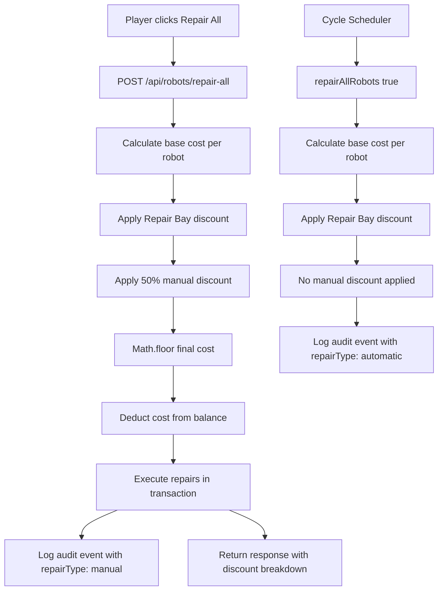

# Design Document: Manual Repair Cost Reduction

## Overview

This feature introduces a 50% discount on manual robot repairs (triggered via the "Repair All" button on the robots page) while keeping automatic pre-battle repairs at full price. The goal is to incentivize active player engagement between cycles.

The change touches four layers:
1. **Backend cost calculation** — Apply `Math.floor(cost * 0.5)` after all existing discounts in the `POST /api/robots/repair-all` endpoint
2. **Frontend display** — Show the manual discount as a separate line item in the repair confirmation modal and on the button label
3. **Audit logging** — Distinguish manual vs automatic repairs with a `repairType` field and log the manual discount metadata
4. **Admin frontend** — New "Repair Log" tab in the Admin Portal to view, filter, and summarize manual vs automatic repair activity

The discount is applied as a final multiplier after Repair Bay and Medical Bay discounts, ensuring it stacks cleanly with the existing discount pipeline.

## Architecture

The feature modifies the existing repair cost pipeline without introducing new services or database tables.



### Key Design Decision: Where to Apply the Discount

The manual repair endpoint (`POST /api/robots/repair-all` in `robots.ts`) uses a simpler `REPAIR_COST_PER_HP = 50` formula, while the automatic repair path (`repairAllRobots()` in `repairService.ts`) uses the full `calculateRepairCost()` formula with attribute sums, damage multipliers, and Medical Bay reductions.

The 50% manual discount is applied in the endpoint handler (`robots.ts`) after the existing Repair Bay discount calculation, not inside `calculateRepairCost()`. This keeps the shared utility function unchanged and avoids any risk to the automatic repair path.

### Key Design Decision: Discount Stacking Order

The discount order is: Base Cost → Repair Bay discount → 50% manual discount → `Math.floor`. This means the manual discount is multiplicative on top of the Repair Bay discount, not additive. A player with 90% Repair Bay discount pays `Math.floor(baseCost * 0.10 * 0.50)` = 5% of base cost for manual repairs.

## Components and Interfaces

### Backend Changes

#### 1. `POST /api/robots/repair-all` endpoint (`prototype/backend/src/routes/robots.ts`)

Current flow calculates `finalCost = Math.floor(totalBaseCost * (1 - discount / 100))`. The change adds:

```typescript
const MANUAL_REPAIR_DISCOUNT = 0.5;
const costAfterRepairBay = Math.floor(totalBaseCost * (1 - discount / 100));
const finalCost = Math.floor(costAfterRepairBay * MANUAL_REPAIR_DISCOUNT);
```

Updated response payload:

```typescript
interface RepairAllResponse {
  success: boolean;
  repairedCount: number;
  totalBaseCost: number;          // Before any discounts
  discount: number;               // Repair Bay discount percentage
  manualRepairDiscount: number;   // 50 (percentage)
  preDiscountCost: number;        // Cost after Repair Bay but before manual discount
  finalCost: number;              // After all discounts, Math.floor'd
  newCurrency: number;
  message: string;
}
```

#### 2. `EventLogger.logRobotRepair()` (`prototype/backend/src/services/eventLogger.ts`)

Add optional parameters for repair type metadata:

```typescript
async logRobotRepair(
  userId: number,
  robotId: number,
  cost: number,
  damageRepaired: number,
  discountPercent: number,
  cycleNumber?: number,
  repairType?: 'manual' | 'automatic',
  manualRepairDiscount?: number,
  preDiscountCost?: number
): Promise<void>
```

The audit log payload becomes:

```typescript
{
  cost: number;
  damageRepaired: number;
  discountPercent: number;
  repairType: 'manual' | 'automatic';       // NEW
  manualRepairDiscount?: number;             // NEW — only for manual
  preDiscountCost?: number;                  // NEW — only for manual
}
```

#### 3. `repairAllRobots()` (`prototype/backend/src/services/repairService.ts`)

Pass `repairType: 'automatic'` to `eventLogger.logRobotRepair()`. No cost calculation changes.

#### 4. Admin audit log filtering (`prototype/backend/src/routes/admin.ts`)

Add a new endpoint or query parameter to filter `robot_repair` events by `repairType`:

```typescript
// GET /api/admin/audit-log/repairs?repairType=manual&startDate=...&endDate=...
interface RepairAuditQuery {
  repairType?: 'manual' | 'automatic';
  startDate?: string;   // ISO date
  endDate?: string;     // ISO date
  page?: number;
  limit?: number;
}
```

Response includes: `userId`, `stableName`, `robotId`, `robotName`, `repairType`, `cost`, `preDiscountCost`, `manualRepairDiscount`, `eventTimestamp`.

### Frontend Changes

#### 5. `RobotsPage.tsx` (`prototype/frontend/src/pages/RobotsPage.tsx`)

Update `calculateTotalRepairCost()` to apply the 50% manual discount:

```typescript
const MANUAL_REPAIR_DISCOUNT = 0.5;
const costAfterRepairBay = Math.floor(totalBaseCost * (1 - discount / 100));
const discountedCost = Math.floor(costAfterRepairBay * MANUAL_REPAIR_DISCOUNT);
```

Update the button label to show the discounted cost (already does, just needs the new calculation).

Update the confirmation modal to show a discount breakdown:
- Repair Bay Discount: X% off
- Manual Repair Discount: 50% off
- Final Cost: ₡Y

#### 6. `RepairLogTab.tsx` (`prototype/frontend/src/components/admin/RepairLogTab.tsx`)

New admin tab component that gives admins visibility into manual vs automatic repair activity. Follows the same patterns as `BankruptcyMonitorTab` and `RecentUsersTab` (fetch on mount, loading/error states, summary cards + data table).

**Data source:** `GET /api/admin/audit-log/repairs` (backend component #4 above).

**Summary stats bar** (top of tab, grid of cards matching `BankruptcyMonitorTab` style):

| Stat | Description |
|---|---|
| Total Manual Repairs | Count of events where `repairType === 'manual'` in the current query |
| Total Automatic Repairs | Count of events where `repairType === 'automatic'` in the current query |
| Total Savings | Sum of `(preDiscountCost - cost)` across all manual repair events in the current query |

**Filters** (row below summary, above table):

| Filter | Control | Default |
|---|---|---|
| Repair Type | `<select>` with options: All, Manual, Automatic | All |
| Start Date | `<input type="date">` | 7 days ago |
| End Date | `<input type="date">` | today |

Changing any filter triggers a re-fetch from the API with the corresponding query parameters (`repairType`, `startDate`, `endDate`).

**Data table columns:**

| Column | Source field | Notes |
|---|---|---|
| Player | `stableName` | Displayed as primary text |
| Robot | `robotName` | — |
| Repair Type | `repairType` | Badge-styled: green for manual, gray for automatic |
| Cost | `cost` | Formatted as `₡X` |
| Pre-Discount Cost | `preDiscountCost` | Formatted as `₡X`, shown as `—` for automatic repairs |
| Savings | `preDiscountCost - cost` | Formatted as `₡X`, shown as `—` for automatic repairs |
| Timestamp | `eventTimestamp` | Formatted with `toLocaleString()` |

**Pagination:** Uses `page` and `limit` query params (default limit 25), with Previous/Next buttons matching existing admin table patterns.

**Component structure:**

```typescript
interface RepairLogEvent {
  userId: number;
  stableName: string;
  robotId: number;
  robotName: string;
  repairType: 'manual' | 'automatic';
  cost: number;
  preDiscountCost: number | null;
  manualRepairDiscount: number | null;
  eventTimestamp: string;
}

interface RepairLogResponse {
  events: RepairLogEvent[];
  summary: {
    totalManualRepairs: number;
    totalAutomaticRepairs: number;
    totalSavings: number;
  };
  pagination: {
    page: number;
    limit: number;
    totalEvents: number;
    totalPages: number;
    hasMore: boolean;
  };
}
```

**State management:** Local state via `useState` for filters, data, loading, and error — same pattern as other admin tabs. No global context needed.

#### 7. `AdminPage.tsx` (`prototype/frontend/src/pages/AdminPage.tsx`)

Register the new tab in the admin page shell:

- Add `'repair-log'` to the `TabType` union and `VALID_TABS` array
- Add `'repair-log': '🔧 Repair Log'` to `TAB_LABELS`
- Import `RepairLogTab` from `../components/admin`
- Add the tab panel rendering block for `activeTab === 'repair-log'`

```typescript
// Updated type
type TabType = 'dashboard' | 'cycles' | 'tournaments' | 'battles' | 'stats'
  | 'bankruptcy-monitor' | 'recent-users' | 'repair-log';

// Updated VALID_TABS (repair-log added at end)
const VALID_TABS: TabType[] = [
  'dashboard', 'cycles', 'tournaments', 'battles', 'stats',
  'bankruptcy-monitor', 'recent-users', 'repair-log',
];

// Updated TAB_LABELS
const TAB_LABELS: Record<TabType, string> = {
  // ...existing entries...
  'repair-log': '🔧 Repair Log',
};
```

#### 8. Admin barrel export (`prototype/frontend/src/components/admin/index.ts`)

Add `export { RepairLogTab } from './RepairLogTab';` to the barrel file.

#### 9. Admin types (`prototype/frontend/src/components/admin/types.ts`)

Add `RepairLogEvent` and `RepairLogResponse` interfaces (shown in component #6 above) to the shared types file so they are co-located with other admin type definitions.

## Data Models

### No Schema Changes Required

The feature does not require database migrations. The `auditLog` table already stores a flexible JSON `payload` field, which will carry the new `repairType`, `manualRepairDiscount`, and `preDiscountCost` fields.

### Audit Log Payload Structure (Updated)

For manual repairs:
```json
{
  "cost": 2500,
  "damageRepaired": 150,
  "discountPercent": 14,
  "repairType": "manual",
  "manualRepairDiscount": 50,
  "preDiscountCost": 5000
}
```

For automatic repairs:
```json
{
  "cost": 5000,
  "damageRepaired": 150,
  "discountPercent": 14,
  "repairType": "automatic"
}
```

### Constants

```typescript
// New constant in robots.ts endpoint
const MANUAL_REPAIR_DISCOUNT = 0.5;  // 50% reduction

// Existing constant (unchanged)
const REPAIR_COST_PER_HP = 50;
```


## Correctness Properties

*A property is a characteristic or behavior that should hold true across all valid executions of a system — essentially, a formal statement about what the system should do. Properties serve as the bridge between human-readable specifications and machine-verifiable correctness guarantees.*

The following properties were derived from the acceptance criteria prework analysis. Redundant criteria were consolidated (e.g., 1.2 is subsumed by 1.1; 2.2/2.3 are subsumed by 2.1; 4.2 is subsumed by 4.1). Requirement 6 criteria are meta-requirements about test coverage and do not produce properties themselves — they are satisfied by implementing the properties below.

### Property 1: Manual discount formula

*For any* valid base repair cost (non-negative integer) and any Repair Bay discount percentage (0–90), the manual repair final cost shall equal `Math.floor(Math.floor(baseCost * (1 - repairBayDiscount / 100)) * 0.5)`.

**Validates: Requirements 1.1, 1.2, 1.3, 3.1**

### Property 2: Automatic repair cost unchanged

*For any* valid attribute sum (positive), damage percentage (0–100), HP percentage (0–100), Repair Bay level (0–10), Medical Bay level (0–10), and active robot count (1–20), the automatic repair cost shall equal the result of `calculateRepairCost(sumOfAllAttributes, damagePercent, hpPercent, repairBayLevel, medicalBayLevel, activeRobotCount)` with no additional multiplier applied.

**Validates: Requirements 2.1, 2.2, 2.3**

### Property 3: Manual repairs always allowed (no currency gate)

*For any* player currency value (including negative) and any manual repair cost, the repair shall always be allowed. The player's balance after repair equals currency minus the discounted final cost, and may be negative. Manual repairs are the only transaction permitted with negative credits.

**Validates: Requirements 4.1, 4.2, 4.3**

### Property 4: Manual cost is at most automatic cost

*For any* valid repair inputs, the manual repair cost shall be less than or equal to the automatic repair cost computed from the same inputs.

**Validates: Requirements 1.1, 6.5**

### Property 5: Manual cost is non-negative

*For any* valid repair inputs (non-negative base cost, valid discount percentages), the manual repair cost shall be greater than or equal to zero.

**Validates: Requirements 1.1, 6.6**

### Property 6: Repair type correctly tagged in audit log

*For any* repair event, if the repair was triggered via the `POST /api/robots/repair-all` endpoint then the audit log payload's `repairType` field shall be `"manual"`, and if the repair was triggered via `repairAllRobots()` during cycle processing then the `repairType` field shall be `"automatic"`.

**Validates: Requirements 7.1, 7.2**

## Error Handling

### Backend

| Scenario | HTTP Status | Error Response |
|---|---|---|
| No robots need repair | 400 | `{ error: "No robots need repair" }` |
| User not found | 404 | `{ error: "User not found" }` |
| Audit log write failure | N/A (non-blocking) | Log error, continue with repair — repair should not fail because logging failed |
| Invalid repairType filter on admin endpoint | 400 | `{ error: "Invalid repairType. Must be 'manual' or 'automatic'" }` |

The manual repair endpoint has no currency gate — repairs are always allowed and the balance can go negative. This is the only transaction in the game that permits spending into negative credits, incentivizing active play during financial hardship.

### Frontend

- If the API call fails, show a generic error alert (existing behavior, unchanged)
- If the response contains `manualRepairDiscount`, display it in the modal; if absent (backward compatibility), omit the line item
- The `calculateTotalRepairCost()` function applies the 50% discount locally so the button label is always accurate without an API call

## Testing Strategy

### Property-Based Tests (fast-check)

Each correctness property maps to a single property-based test with minimum 100 iterations. Tests go in `prototype/backend/tests/manualRepairDiscount.property.test.ts`.

| Test | Property | Generator Strategy |
|---|---|---|
| Manual discount formula | Property 1 | `fc.nat(1_000_000)` for baseCost, `fc.integer({min:0, max:90})` for repairBayDiscount |
| Automatic cost unchanged | Property 2 | `fc.integer({min:1, max:500})` for attributeSum, `fc.float({min:0, max:100})` for damagePercent/hpPercent, `fc.integer({min:0, max:10})` for levels, `fc.integer({min:1, max:20})` for robotCount |
| Currency validation threshold | Property 3 | `fc.integer({min:-5_000_000, max:10_000_000})` for currency (includes negative), `fc.nat(1_000_000)` for repairCost |
| Manual <= automatic | Property 4 | Same generators as Property 1 |
| Manual cost non-negative | Property 5 | Same generators as Property 1 |
| Repair type tagging | Property 6 | `fc.constantFrom('manual', 'automatic')` for repairType, verify payload field matches |

Each test must be tagged with a comment:
```typescript
// Feature: manual-repair-cost-reduction, Property 1: Manual discount formula
```

### Unit Tests

Unit tests go in `prototype/backend/tests/manualRepairDiscount.test.ts`. Focus on specific examples and edge cases:

- 50% discount applied to a known cost (e.g., base 10000, no Repair Bay → final 5000)
- Odd cost rounds down (e.g., base 10001, no Repair Bay → `Math.floor(10001 * 0.5)` = 5000)
- Repair Bay 90% + manual 50% stacking (e.g., base 100000 → after 90% = 10000 → after 50% = 5000)
- Repair Bay 0% + manual 50% (edge case from Req 1.3)
- Zero damage → zero cost (no discount needed)
- Repair allowed with negative balance (balance can go further negative)
- API response contains `manualRepairDiscount` field
- API response contains `preDiscountCost` field

### Regression Tests

- Verify `calculateRepairCost()` output is unchanged for a set of known input/output pairs (snapshot test)
- Verify `repairAllRobots(true)` does not apply any manual discount (mock eventLogger, check no `manualRepairDiscount` in payload)

### Frontend Tests

- `calculateTotalRepairCost()` returns the correct discounted value
- Confirmation modal shows both Repair Bay and manual discount line items
- Button label shows discounted cost
- Button disabled when no repairs needed (unchanged behavior)

### Admin Frontend Tests (`RepairLogTab`)

- Renders summary stats (total manual, total automatic, total savings) from API response
- Renders table rows with correct columns (Player, Robot, Repair Type, Cost, Pre-Discount Cost, Savings, Timestamp)
- Repair type filter triggers re-fetch with correct `repairType` query param
- Date range filter triggers re-fetch with correct `startDate`/`endDate` query params
- Shows `—` for Pre-Discount Cost and Savings columns on automatic repair rows
- Pagination controls advance page and re-fetch
- Loading state shown while fetching
- Error state shown with retry button on API failure
