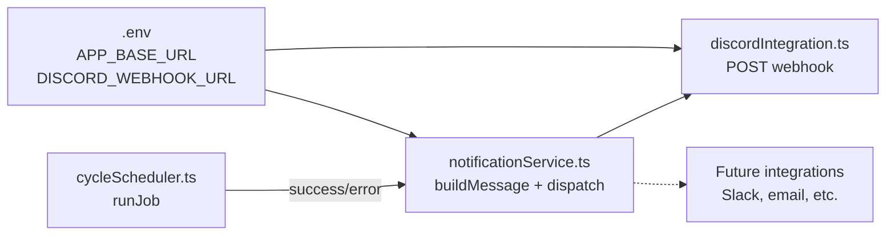

# Design Document: Match Notifications

## Overview

This feature adds post-job teaser notifications to the existing cycle scheduler. After each of the four cron jobs (league, tournament, tag team, settlement) completes successfully, a short one-liner message with an emoji and a dashboard link is dispatched to Discord via webhook. Error notifications are sent when jobs fail. The architecture uses a minimal pluggable integration interface so future channels (Slack, email) can be added without modifying existing code.

The design is intentionally simple: no database tables, no queues, no retry logic, no in-app UI. Just a service that builds a message string and fires it through registered integrations.

## Architecture

The notification system sits between the cycle scheduler and external delivery channels. It hooks into the existing `runJob()` function in `cycleScheduler.ts`.



The integration point is inside `runJob()`. After the handler completes (success or failure), `runJob()` calls the notification service. Notification failures are caught and logged — they never interrupt the job flow.

### Design Decisions

1. **Hook into `runJob()` rather than each job function** — Single integration point, all jobs get notifications automatically. The alternative (calling notify from each `execute*` function) would scatter notification logic across four places and require passing job-specific context upward.

2. **Job-specific message builders instead of a generic template** — Each job has a unique message format (tournament includes name/round, tag team skips even cycles). A map of job name → message builder keeps this clean without a complex templating system.

3. **No retry logic** — The requirements explicitly state no retries. If Discord is down, we log and move on. This keeps the system simple and prevents notification failures from delaying job completion.

4. **Environment-variable-based integration activation** — If `DISCORD_WEBHOOK_URL` is not set, Discord is skipped with a warning log. This makes it safe to run in dev/test without a webhook configured.

## Components and Interfaces

### Integration Interface

```typescript
// app/backend/src/services/notifications/integration.ts

export interface NotificationResult {
  success: boolean;
  integrationName: string;
  error?: string;
}

export interface Integration {
  readonly name: string;
  send(message: string): Promise<NotificationResult>;
}
```

### Discord Integration

```typescript
// app/backend/src/services/notifications/discord-integration.ts

import logger from '../../config/logger';
import { Integration, NotificationResult } from './integration';

const DISCORD_TIMEOUT_MS = 5000;

export class DiscordIntegration implements Integration {
  readonly name = 'discord';
  private webhookUrl: string;

  constructor(webhookUrl: string) {
    this.webhookUrl = webhookUrl;
  }

  async send(message: string): Promise<NotificationResult> {
    try {
      const controller = new AbortController();
      const timeout = setTimeout(() => controller.abort(), DISCORD_TIMEOUT_MS);

      const response = await fetch(this.webhookUrl, {
        method: 'POST',
        headers: { 'Content-Type': 'application/json' },
        body: JSON.stringify({ content: message }),
        signal: controller.signal,
      });

      clearTimeout(timeout);

      if (!response.ok) {
        const errorText = await response.text().catch(() => 'unknown');
        logger.error(`Discord webhook failed: ${response.status} — ${errorText}`);
        return { success: false, integrationName: this.name, error: `HTTP ${response.status}` };
      }

      return { success: true, integrationName: this.name };
    } catch (error) {
      const errorMessage = error instanceof Error ? error.message : String(error);
      logger.error(`Discord webhook error: ${errorMessage}`);
      return { success: false, integrationName: this.name, error: errorMessage };
    }
  }
}
```

### Notification Service

```typescript
// app/backend/src/services/notifications/notification-service.ts

import logger from '../../config/logger';
import { Integration, NotificationResult } from './integration';
import { DiscordIntegration } from './discord-integration';

export type JobName = 'league' | 'tournament' | 'tag-team' | 'settlement';

export interface JobContext {
  jobName: JobName;
  tournamentName?: string;
  tournamentRound?: number;
  tournamentMaxRounds?: number;
  isEvenCycle?: boolean;
}

export function buildSuccessMessage(context: JobContext, appBaseUrl: string): string | null {
  const link = appBaseUrl;

  switch (context.jobName) {
    case 'league':
      return `League battles have been completed! 🏆 Click here to see the results! ${link}`;
    case 'tournament':
      return `${context.tournamentName} Round ${context.tournamentRound}/${context.tournamentMaxRounds} has been completed! ⚔️ Click here to see the results! ${link}`;
    case 'tag-team':
      if (context.isEvenCycle) return null; // Skip on even cycles
      return `Tag Team battles have been completed! 🤝 Click here to see the results! ${link}`;
    case 'settlement':
      return `Daily settlement complete! 💰 Check your income and expenses! ${link}`;
  }
}

export function buildErrorMessage(jobName: string, appBaseUrl: string): string {
  return `⚠️ ${jobName} encountered an error. Check the admin panel. ${appBaseUrl}`;
}

export function getActiveIntegrations(): Integration[] {
  const integrations: Integration[] = [];
  const discordUrl = process.env.DISCORD_WEBHOOK_URL;

  if (discordUrl) {
    integrations.push(new DiscordIntegration(discordUrl));
  } else {
    logger.warn('DISCORD_WEBHOOK_URL not set — Discord notifications disabled');
  }

  return integrations;
}

export async function dispatchNotification(
  message: string,
  integrations: Integration[]
): Promise<NotificationResult[]> {
  const results: NotificationResult[] = [];

  for (const integration of integrations) {
    try {
      const result = await integration.send(message);
      results.push(result);
    } catch (error) {
      const errorMessage = error instanceof Error ? error.message : String(error);
      logger.error(`Integration "${integration.name}" failed: ${errorMessage}`);
      results.push({ success: false, integrationName: integration.name, error: errorMessage });
    }
  }

  return results;
}
```

### Integration into cycleScheduler.ts

The `runJob()` function is modified to call the notification service after job completion:

```typescript
// Inside runJob(), after the handler completes:
try {
  const message = status === 'success'
    ? buildSuccessMessage(jobContext, appBaseUrl)
    : buildErrorMessage(jobName, appBaseUrl);

  if (message) {
    const integrations = getActiveIntegrations();
    await dispatchNotification(message, integrations);
  }
} catch (notifyError) {
  logger.error(`Notification dispatch failed: ${notifyError}`);
  // Never interrupt the job flow
}
```

The job-specific context (tournament name/round, tag team cycle parity) is passed from each `execute*` function back to `runJob()` via a return value or by modifying `runJob()` to accept a context builder callback.

## Data Models

No new database tables are required. The feature uses:

- **Environment variables** (new):
  - `APP_BASE_URL` — Base URL for dashboard links (e.g., `https://acc.armouredsouls.com`)
  - `DISCORD_WEBHOOK_URL` — Discord webhook endpoint for posting messages

- **Existing Prisma models** (read-only):
  - `Tournament` — `name`, `currentRound`, `maxRounds` fields used to build tournament notification messages
  - `CycleMetadata` — `totalCycles` field used to determine odd/even cycle for tag team notifications

- **In-memory types** (new):
  - `JobContext` — Carries job-specific data needed for message building
  - `NotificationResult` — Return type from integration `send()` calls
  - `Integration` — Interface for pluggable delivery channels


## Correctness Properties

*A property is a characteristic or behavior that should hold true across all valid executions of a system — essentially, a formal statement about what the system should do. Properties serve as the bridge between human-readable specifications and machine-verifiable correctness guarantees.*

### Property 1: Success message contains job-specific emoji and base URL

*For any* job type in {league, tournament, tag-team (odd cycle), settlement} and *for any* non-empty base URL string, `buildSuccessMessage` should return a non-null string that contains both the job's designated emoji (🏆, ⚔️, 🤝, or 💰 respectively) and the base URL.

**Validates: Requirements 1.1, 1.3, 1.5, 1.6**

### Property 2: Tournament message contains name and round info

*For any* tournament name string, *for any* round number (1 ≤ round ≤ maxRounds), and *for any* non-empty base URL, `buildSuccessMessage` with a tournament job context should return a string containing the tournament name, the round number, the max rounds number, and the ⚔️ emoji.

**Validates: Requirements 1.2**

### Property 3: Tag team even cycle produces no message

*For any* job context where `jobName` is `tag-team` and `isEvenCycle` is `true`, and *for any* base URL, `buildSuccessMessage` should return `null`.

**Validates: Requirements 1.4**

### Property 4: Error message contains job name and base URL

*For any* job name string and *for any* non-empty base URL, `buildErrorMessage` should return a string containing the job name, the ⚠️ emoji, and the base URL.

**Validates: Requirements 2.1**

### Property 5: Notification dispatch is failure-isolated

*For any* message string and *for any* list of integrations (where zero or more may throw errors), `dispatchNotification` should never throw and should return a `NotificationResult` array with length equal to the number of integrations.

**Validates: Requirements 2.2, 4.3**

### Property 6: Dispatch calls every registered integration

*For any* message string and *for any* list of N integrations (where some may fail), `dispatchNotification` should invoke `send()` on all N integrations and return exactly N results, regardless of individual failures.

**Validates: Requirements 4.2, 4.3**

## Error Handling

| Scenario | Behavior |
|---|---|
| `DISCORD_WEBHOOK_URL` not set | `getActiveIntegrations()` returns empty array, logs warning. No error thrown. |
| `APP_BASE_URL` not set | Messages are built with an empty string as the link. The notification still sends. |
| Discord webhook returns non-2xx | `DiscordIntegration.send()` returns `{ success: false }` with HTTP status. Logged as error. |
| Discord webhook times out (>5s) | `AbortController` aborts the request. `send()` catches the error, returns failure result. |
| `send()` throws unexpected error | `dispatchNotification` catches it, logs it, continues to next integration. |
| Entire notification dispatch fails | `runJob()` wraps the notification call in try/catch. Job completion is never affected. |

Key principle: notification failures are always swallowed. The cron job's success/failure status is determined solely by the job handler, never by notification delivery.

## Testing Strategy

### Property-Based Tests (fast-check)

Each correctness property maps to a single property-based test with a minimum of 100 iterations. Tests use `fast-check` arbitraries to generate random job contexts, base URLs, tournament names, round numbers, and integration lists.

Test file: `app/backend/tests/notifications.property.test.ts`

| Test | Property | Generators |
|---|---|---|
| Success message format | Property 1 | Random job type (excluding tag-team even), random base URL string |
| Tournament message content | Property 2 | Random tournament name, random round (1–maxRounds), random maxRounds (1–20), random base URL |
| Tag team even cycle skip | Property 3 | Random even cycle number, random base URL |
| Error message format | Property 4 | Random job name string, random base URL |
| Dispatch failure isolation | Property 5 | Random message, random list of mock integrations (some throwing) |
| Dispatch calls all integrations | Property 6 | Random message, random list of N mock integrations with random failure positions |

Each test is tagged with: `Feature: match-notifications, Property {N}: {title}`

### Unit Tests

Test file: `app/backend/tests/notifications.test.ts`

Unit tests cover specific examples and integration points:

- **Discord integration**: Mock `fetch` to verify correct request shape (POST, JSON body with `content` field, correct URL)
- **Discord failure handling**: Mock `fetch` to return 500, verify `NotificationResult` has `success: false`
- **Discord timeout**: Mock `fetch` to hang, verify abort after 5s
- **No webhook URL**: Verify `getActiveIntegrations()` returns empty array and logs warning
- **Specific message snapshots**: Verify exact message strings for each job type match the requirements

### Testing Configuration

- **Library**: Jest + fast-check
- **Property test iterations**: 100 minimum per property
- **Mocking**: `fetch` is mocked globally for Discord tests; integration interface is mocked for dispatch tests
- **No real HTTP calls**: All tests run offline with mocked dependencies
