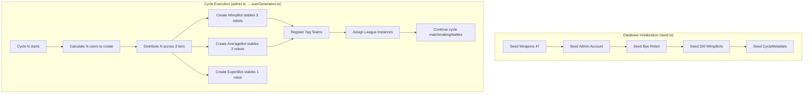
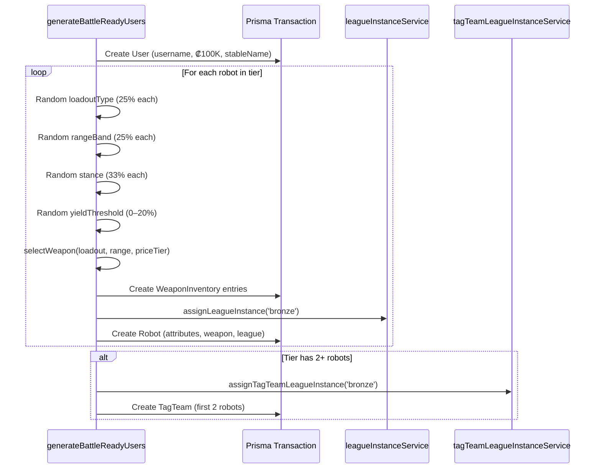

# Design Document: Seeding and Auto-User Creation

## Overview

This design overhauls two interconnected systems in Armoured Souls:

1. **Seed System** — Simplifies database initialization by removing archetype users and player1–5 accounts, reducing the admin account to realistic resources, and restructuring the WimpBot population to 200 robots distributed across 4 practice weapons.

2. **Auto-Generation System** — Replaces the archetype-cycling generation with a tiered stable system that creates WimpBot (3 robots), AverageBot (2 robots), and ExpertBot (1 robot) stables during each cycle, with randomized loadouts, weapons, stances, and yield thresholds.

The changes affect `seed.ts`, `userGeneration.ts`, documentation files, and the admin cycle execution flow. No database schema changes are required — the existing User, Robot, WeaponInventory, TagTeam, and CycleMetadata models support all new behavior.

## Architecture

The system is split into two execution contexts:



### Key Architectural Decisions

1. **No schema migration needed** — The existing `stableName` field on User, the TagTeam model, and the weapon/robot/inventory models already support all required functionality.

2. **Weapon selection uses a fallback chain** — Loadout + Range + Tier → Loadout + Tier → Any weapon in Tier. This prevents robot creation failures when the weapon catalog has gaps for certain combinations.

3. **Tier distribution uses integer division with ordered remainder** — `Math.floor(N/3)` per tier, remainder allocated WimpBot-first, then AverageBot, then ExpertBot.

4. **Stable naming uses an enterprise-themed word-pair generator** — Adjective + Noun combinations from corporate/F1-team-style word lists (e.g., "Crimson Dynamics", "Obsidian Armaments") to produce names that feel like robot combat enterprises. 40 × 40 = 1,600 unique combinations before numeric suffixes kick in.

## Components and Interfaces

### 1. Seed System (`app/backend/prisma/seed.ts`)

Simplified to 5 steps:

```typescript
async function main() {
  const weapons = await seedWeapons();           // 47 weapons (unchanged)
  await seedAdminAccount();                       // admin / admin123 / ₡3M / prestige 0
  await seedByeRobot(practiceSword);             // bye_robot_user (unchanged)
  await seedWimpBotUsers(weapons);               // 200 test_user_001–200
  await seedCycleMetadata();                     // CycleMetadata id=1
}
```

**Removed:**
- `seedCoreTestUsers` (player1–5 creation)
- `seedArchetypeUsers` / `ARCHETYPE_SPECS` array
- `seedAttributeTestUsers`

**Modified:**
- `seedAdminAccount` — currency reduced from ₡10M to ₡3M, prestige set to 0, stableName assigned
- `seedWimpBotUsers` — 200 users (up from 100), distributed across 4 practice weapons (50 each), robots named using the `{Tier} {LoadoutTitle} {WeaponCodename} {Number}` format (e.g., "WimpBot Lone Rusty 1" for Practice Sword/Single), loadoutType set to "single" for one-handed weapons and "two_handed" for two-handed weapons, stableName assigned to each user

### 2. Auto-Generation System (`app/backend/src/utils/userGeneration.ts`)

Complete rewrite of `generateBattleReadyUsers()`:

```typescript
interface TieredGenerationResult {
  usersCreated: number;
  robotsCreated: number;
  tagTeamsCreated: number;
  usernames: string[];
  tierBreakdown: {
    wimpBot: number;
    averageBot: number;
    expertBot: number;
  };
}

async function generateBattleReadyUsers(
  cycleNumber: number
): Promise<TieredGenerationResult>
```

### 3. Tier Configuration

```typescript
interface TierConfig {
  name: 'WimpBot' | 'AverageBot' | 'ExpertBot';
  robotCount: number;
  attributeLevel: number;
  priceTier: { min: number; max: number };
  createTagTeam: boolean;
}

const TIER_CONFIGS: TierConfig[] = [
  {
    name: 'WimpBot',
    robotCount: 3,
    attributeLevel: 1.0,
    priceTier: { min: 0, max: 99999 },       // Budget: < ₡100K
    createTagTeam: true,
  },
  {
    name: 'AverageBot',
    robotCount: 2,
    attributeLevel: 5.0,
    priceTier: { min: 100000, max: 250000 },  // Mid: ₡100K–₡250K
    createTagTeam: true,
  },
  {
    name: 'ExpertBot',
    robotCount: 1,
    attributeLevel: 10.0,
    priceTier: { min: 250000, max: 400000 },  // Premium: ₡250K–₡400K
    createTagTeam: false,                       // Only 1 robot, can't form a team
  },
];
```

### 4. Weapon Selection Service

```typescript
interface WeaponSelectionParams {
  loadoutType: 'single' | 'weapon_shield' | 'dual_wield' | 'two_handed';
  rangeBand: 'melee' | 'short' | 'mid' | 'long';
  priceTier: { min: number; max: number };
}

function selectWeapon(
  weapons: Weapon[],
  params: WeaponSelectionParams
): Weapon

function selectShield(
  weapons: Weapon[],
  priceTier: { min: number; max: number }
): Weapon
```

The selection follows a fallback chain:
1. Match loadout + range + price tier
2. Match loadout + price tier (any range)
3. Match price tier only (log warning)

### 5. Stable Name Generator

```typescript
function generateStableName(existingNames: Set<string>): string
```

Combines an adjective and a noun from predefined enterprise-themed word lists (think F1 teams / robot combat corporations). Appends a numeric suffix if collision occurs.

**Word Lists (enterprise-themed, 40 × 40 = 1,600 unique combinations):**

```typescript
const STABLE_ADJECTIVES = [
  'Iron', 'Steel', 'Shadow', 'Crimson', 'Thunder',
  'Obsidian', 'Phantom', 'Cobalt', 'Titan', 'Ember',
  'Frost', 'Onyx', 'Venom', 'Storm', 'Apex',
  'Rogue', 'Neon', 'Blaze', 'Void', 'Chrome',
  'Granite', 'Copper', 'Midnight', 'Scarlet', 'Tungsten',
  'Orbital', 'Zenith', 'Polar', 'Molten', 'Carbon',
  'Quantum', 'Plasma', 'Cipher', 'Vertex', 'Primal',
  'Astral', 'Boreal', 'Ferric', 'Argent', 'Pyro',
] as const;

const STABLE_NOUNS = [
  'Industries', 'Dynamics', 'Robotics', 'Engineering', 'Systems',
  'Mechanics', 'Corp', 'Enterprises', 'Labs', 'Foundry',
  'Works', 'Motors', 'Armaments', 'Solutions', 'Technologies',
  'Syndicate', 'Collective', 'Group', 'Alliance', 'Forge',
  'Unlimited', 'Ventures', 'Holdings', 'Fabrication', 'Machina',
  'Kinetics', 'Logistics', 'Designs', 'Innovations', 'Automata',
  'Constructs', 'Division', 'Ordinance', 'Propulsion', 'Aeronautics',
  'Precision', 'Manufacturing', 'Tactical', 'Operations', 'Consortium',
] as const;
```

This yields 40 × 40 = 1,600 unique combinations — enough for ~56 cycles before numeric suffixes are needed. Examples: "Crimson Dynamics", "Obsidian Armaments", "Apex Robotics", "Phantom Engineering", "Void Industries".

### 6. Tier Distribution Function

```typescript
function distributeTiers(n: number): { wimpBot: number; averageBot: number; expertBot: number }
```

Divides N users into thirds. Remainder goes WimpBot → AverageBot → ExpertBot in order.

Examples:
- N=1: { wimpBot: 1, averageBot: 0, expertBot: 0 }
- N=3: { wimpBot: 1, averageBot: 1, expertBot: 1 }
- N=5: { wimpBot: 2, averageBot: 2, expertBot: 1 }
- N=10: { wimpBot: 4, averageBot: 3, expertBot: 3 }


### 7. Robot Creation Flow

For each stable created during auto-generation:



### 8. Loadout-to-Weapon Compatibility

The weapon selection must respect these rules from the existing weapon system:

| Loadout Type | Main Weapon | Offhand Weapon | Weapon handsRequired |
|---|---|---|---|
| single | 1 one-handed (non-shield) | none | `one` |
| weapon_shield | 1 one-handed (non-shield) | 1 shield | `one` + `shield` |
| two_handed | 1 two-handed | none | `two` |
| dual_wield | 1 one-handed (non-shield) | 1 copy of same weapon | `one` |

For weapon selection filtering:
- `single`: `handsRequired = 'one'` AND `weaponType != 'shield'`
- `weapon_shield`: main = `handsRequired = 'one'` AND `weaponType != 'shield'`; offhand = `handsRequired = 'shield'`
- `two_handed`: `handsRequired = 'two'`
- `dual_wield`: `handsRequired = 'one'` AND `weaponType != 'shield'`

### 9. HP and Shield Calculation

Robot stats are derived from attributes using existing formulas:

```typescript
// For a given attributeLevel:
const maxHP = 50 + Math.floor(attributeLevel * 5);
const maxShield = Math.floor(attributeLevel * 4);

// WimpBot (1.0):  HP = 55,  Shield = 4
// AverageBot (5.0): HP = 75, Shield = 20
// ExpertBot (10.0): HP = 100, Shield = 40
```

These formulas match the current seed.ts implementation (× 4 for shield, as updated in v1.4).

## Data Models

No new database models are required. The existing schema supports all functionality:

### Existing Models Used

| Model | Role in This Feature |
|---|---|
| `User` | Stores generated stables with `stableName`, `currency`, `username` |
| `Robot` | Stores generated robots with tier-appropriate attributes, weapons, loadout |
| `Weapon` | Read-only catalog for weapon selection |
| `WeaponInventory` | Links weapons to users; robots reference inventory entries |
| `TagTeam` | Pairs of robots from same stable for tag team leagues |
| `CycleMetadata` | Tracks `totalCycles` for progressive generation count |
| `Facility` | Not used by auto-generation (generated stables have no facilities) |

### Weapon Price Tier Mapping

Based on the 47-weapon catalog in `WEAPON_DEFINITIONS`:

| Tier | Cost Range | Non-Shield Weapons | Shields |
|---|---|---|---|
| Budget | < ₡100K | Practice Sword, Practice Blaster, Machine Pistol, Laser Pistol, Combat Knife, Machine Gun, War Club, Scatter Cannon, Bolt Carbine, Beam Pistol | Light Shield, Combat Shield, Reactive Shield |
| Mid | ₡100K–₡250K | Burst Rifle, Energy Blade, Laser Rifle, Plasma Blade, Shock Maul, Flux Repeater, Photon Marksman, Mortar System, Siege Cannon | Barrier Shield |
| Premium | ₡250K–₡400K | Plasma Rifle, Assault Rifle, Power Sword, Shotgun, Grenade Launcher, Sniper Rifle, Thermal Lance, Pulse Accelerator, Disruptor Cannon, Gauss Pistol | Fortress Shield |
| Luxury | > ₡400K | (not used by auto-generation) | Aegis Bulwark |

### Username Format

- Seed WimpBots: `test_user_001` through `test_user_200`
- Auto-generated: `auto_<tier>_<sequential_number>` (e.g., `auto_wimpbot_0001`, `auto_averagebot_0042`, `auto_expertbot_0007`)

### Robot Name Format

Robot names encode the loadout using the format: `{Tier} {LoadoutTitle} {WeaponCodename} {Number}`

**Components:**
- **Tier**: `WimpBot`, `AverageBot`, or `ExpertBot`
- **LoadoutTitle**: Maps from loadout type:

```typescript
const LOADOUT_TITLES: Record<string, string> = {
  single: 'Lone',
  weapon_shield: 'Guardian',
  dual_wield: 'Twin',
  two_handed: 'Heavy',
};
```

- **WeaponCodename**: Each of the 47 weapons has a unique thematic codename (see `WEAPON_CODENAMES` constant below)
- **Number**: Sequential suffix for uniqueness, global per tier

**Examples:**
- `WimpBot Guardian Radiant 42` → Beam Pistol + Shield, WimpBot tier
- `ExpertBot Heavy Nova 7` → Plasma Rifle, Two-Handed, ExpertBot tier
- `AverageBot Twin Fang 3` → Combat Knife, Dual-Wield, AverageBot tier
- `WimpBot Lone Rusty 12` → Practice Sword, Single, WimpBot tier

**Seed WimpBots** use the same format: e.g., `WimpBot Lone Rusty 1` through `WimpBot Heavy Drill 200` (depending on assigned weapon and loadout).

**Weapon Codenames:**

```typescript
const WEAPON_CODENAMES: Record<string, string> = {
  // Budget Melee
  'Practice Sword': 'Rusty',
  'Combat Knife': 'Fang',
  'War Club': 'Brute',
  // Budget Ballistic
  'Practice Blaster': 'Spark',
  'Machine Pistol': 'Rattler',
  'Bolt Carbine': 'Striker',
  'Scatter Cannon': 'Shrapnel',
  // Budget Energy
  'Laser Pistol': 'Glint',
  'Beam Pistol': 'Radiant',
  'Training Beam': 'Drill',
  'Training Rifle': 'Cadet',
  // Budget Shields
  'Light Shield': 'Buckler',
  'Combat Shield': 'Rampart',
  'Reactive Shield': 'Reflex',
  // Mid Melee
  'Energy Blade': 'Arc',
  'Plasma Blade': 'Sear',
  'Shock Maul': 'Jolt',
  // Mid Ballistic
  'Machine Gun': 'Hailstorm',
  'Burst Rifle': 'Salvo',
  'Mortar System': 'Barrage',
  'Siege Cannon': 'Ramrod',
  // Mid Energy
  'Flux Repeater': 'Pulse',
  'Photon Marksman': 'Glimmer',
  'Pulse Accelerator': 'Surge',
  // Mid Shield
  'Barrier Shield': 'Bastion',
  // Premium Melee
  'Power Sword': 'Sovereign',
  'Thermal Lance': 'Inferno',
  // Premium Ballistic
  'Assault Rifle': 'Viper',
  'Shotgun': 'Thunder',
  'Grenade Launcher': 'Havoc',
  'Sniper Rifle': 'Hawkeye',
  'Gauss Pistol': 'Comet',
  // Premium Energy
  'Plasma Rifle': 'Nova',
  'Laser Rifle': 'Prism',
  'Disruptor Cannon': 'Rift',
  // Premium Shield
  'Fortress Shield': 'Citadel',
  // Luxury Melee
  'Battle Axe': 'Cleaver',
  'Heavy Hammer': 'Anvil',
  'Vibro Mace': 'Tremor',
  // Luxury Ballistic
  'Railgun': 'Meteor',
  // Luxury Energy
  'Plasma Cannon': 'Supernova',
  'Ion Beam': 'Torrent',
  'Volt Sabre': 'Tempest',
  'Arc Projector': 'Tesla',
  'Nova Caster': 'Flare',
  'Particle Lance': 'Spectre',
  // Luxury Shield
  'Aegis Bulwark': 'Monolith',
};
```

Sequential numbers are global per tier, determined by counting existing robots with that tier prefix.


## Correctness Properties

*A property is a characteristic or behavior that should hold true across all valid executions of a system — essentially, a formal statement about what the system should do. Properties serve as the bridge between human-readable specifications and machine-verifiable correctness guarantees.*

### Property 1: Tier distribution is correct and exhaustive

*For any* positive integer N, `distributeTiers(N)` should return counts where `wimpBot + averageBot + expertBot === N`, where each count is either `Math.floor(N/3)` or `Math.ceil(N/3)`, and where `wimpBot >= averageBot >= expertBot`.

**Validates: Requirements 8.2, 8.3**

### Property 2: Generated robots have tier-appropriate attributes

*For any* tier configuration (WimpBot/AverageBot/ExpertBot) and any generated robot in that tier, all 23 attributes should equal the tier's attribute level (1.00 for WimpBot, 5.00 for AverageBot, 10.00 for ExpertBot), and the robot count per stable should match the tier's robot count (3, 2, or 1 respectively).

**Validates: Requirements 9.1, 10.1, 11.1**

### Property 3: Weapon selection respects loadout and price tier constraints

*For any* generated robot, the equipped main weapon must satisfy: (a) its cost falls within the robot's tier price range, (b) its `handsRequired` is compatible with the robot's `loadoutType`, and (c) if `loadoutType` is `weapon_shield`, the offhand weapon must be a shield within the same price tier; if `dual_wield`, the offhand must be a second copy of the same weapon; if `single` or `two_handed`, offhand must be null.

**Validates: Requirements 9.4, 9.5, 9.6, 10.4, 10.5, 10.6, 11.4, 11.5, 11.6**

### Property 4: Weapon selection fallback always produces a valid weapon

*For any* combination of loadout type, range band, and price tier — including combinations where no exact match exists in the weapon catalog — `selectWeapon` should return a weapon from the correct price tier. If no weapon matches the exact loadout + range + tier, it should fall back to loadout + tier, then to any weapon in the tier.

**Validates: Requirements 14.1, 14.2**

### Property 5: All generated robots start in Bronze league with ELO 1200

*For any* generated robot (regardless of tier), its `elo` should be 1200, its `currentLeague` should be "bronze", and its `leagueId` should match the pattern `bronze_N` where N is a positive integer.

**Validates: Requirements 5.7, 9.7, 10.7, 11.7, 15.1**

### Property 6: All generated users start with ₡100,000 and a stable name

*For any* generated user (both seeded test users and cycle-generated users), `currency` should equal 100000 and `stableName` should be a non-null, non-empty string.

**Validates: Requirements 5.2, 5.3, 8.4, 8.5, 16.1, 16.2**

### Property 7: Robot names encode loadout and are unique

*For any* set of generated robots, all robot names should be unique, each name should contain the tier identifier ("WimpBot", "AverageBot", or "ExpertBot"), a valid loadout title ("Lone", "Guardian", "Twin", or "Heavy"), and a valid weapon codename from the `WEAPON_CODENAMES` mapping that matches the robot's equipped weapon.

**Validates: Requirements 13.1, 13.2, 13.3, 13.4, 13.6**

### Property 8: Stable names are unique and use only neutral words

*For any* set of generated users, all stable names should be unique, each stable name should be composed of an adjective from `STABLE_ADJECTIVES` and a noun from `STABLE_NOUNS`, and no stable name should contain the strings "Wimp", "Average", "Expert", or "Bot".

**Validates: Requirements 13.5, 13.6**

### Property 9: Tag teams are created for multi-robot stables

*For any* generated stable with 2 or more robots (WimpBot and AverageBot tiers), exactly one TagTeam record should exist linking two robots from that stable. For ExpertBot stables (1 robot), no TagTeam should exist.

**Validates: Requirements 9.8, 10.8**

### Property 10: Generated robots have valid stance and yield threshold

*For any* generated robot, its `stance` should be one of "balanced", "offensive", or "defensive", and its `yieldThreshold` should be an integer in the range [0, 20].

**Validates: Requirements 12.1, 12.2**

### Property 11: Generated robots have valid loadout type and range band selection

*For any* generated robot, its `loadoutType` should be one of "single", "weapon_shield", "two_handed", or "dual_wield", and the equipped weapon's `rangeBand` should be one of "melee", "short", "mid", or "long".

**Validates: Requirements 9.2, 9.3, 10.2, 10.3, 11.2, 11.3**

### Property 12: HP and shield are correctly derived from attributes

*For any* generated robot with attribute level A, `maxHP` should equal `50 + floor(A * 5)` and `maxShield` should equal `floor(A * 4)`, and `currentHP` should equal `maxHP` and `currentShield` should equal `maxShield`.

**Validates: Requirements 5.4, 9.1, 10.1, 11.1**

### Property 13: Seed loadout type matches weapon hand requirement

*For any* seeded WimpBot robot, if its equipped weapon has `handsRequired = 'one'` then `loadoutType` should be "single", and if `handsRequired = 'two'` then `loadoutType` should be "two_handed".

**Validates: Requirements 5.6**

## Error Handling

### Seed System Errors

| Error Condition | Handling |
|---|---|
| Weapon not found during robot creation | Throw with descriptive message — seed cannot proceed without weapons |
| Duplicate username on re-seed | Upsert pattern (existing `upsertUser`) handles idempotent re-runs |
| Database connection failure | Prisma throws, seed script exits with non-zero code |

### Auto-Generation Errors

| Error Condition | Handling |
|---|---|
| No weapon matches loadout + range + tier | Fallback chain: try loadout + tier, then any weapon in tier. Log warning at each fallback level |
| No weapon matches tier at all | Log error, skip this robot, continue with remaining robots in the stable |
| Stable name collision after max retries | Append incrementing numeric suffix (e.g., "Iron Forge 2", "Iron Forge 3") |
| Robot name collision | Use global sequential counter per tier + loadout title + weapon codename to guarantee uniqueness |
| Database transaction failure | Fail the entire stable creation (atomic), log error, continue to next stable |
| League instance assignment failure | Fall back to `bronze_1` as default, log warning |
| Cycle number is 0 or negative | Return early with zero counts, log warning |
| Currency goes below ₡0 during cycle | Log bankruptcy event with username and cycle number (Requirement 16.3) |

### Transaction Boundaries

Each stable (user + robots + weapons + tag team) is created within a single Prisma `$transaction`. If any step fails, the entire stable creation rolls back. The cycle continues creating remaining stables.

```typescript
for (const stableConfig of stablesToCreate) {
  try {
    await prisma.$transaction(async (tx) => {
      // Create user, robots, weapon inventory, tag team
    });
  } catch (error) {
    logger.error(`[UserGeneration] Failed to create stable: ${error.message}`);
    // Continue to next stable
  }
}
```

## Testing Strategy

### Testing Framework

- **Unit tests**: Jest 30 with ts-jest
- **Property-based tests**: fast-check (via `@fast-check/jest` or direct import)
- **Minimum iterations**: 100 per property test
- **Test location**: `app/backend/tests/`

### Existing Tests to Rewrite

These existing test files are archetype-dependent and must be rewritten for the new tiered system:

| File | Current State | Action |
|---|---|---|
| `tests/userGeneration.test.ts` | All tests reference `archetype_` usernames, `cleanupArchetypeUsers()` helper, and the old round-robin archetype cycling logic | **Complete rewrite** — replace with tiered generation tests (WimpBot/AverageBot/ExpertBot stables, bot type distribution, weapon tier validation) |
| `tests/twoRobotTagTeamGeneration.test.ts` | Entirely built around "Two-Robot Specialist" archetype at position 9 in the archetype cycle. Tests `archetype_two_robot_*` usernames and hardcoded "Specialist Alpha"/"Specialist Beta" robot names | **Complete rewrite** — replace with tag team tests for WimpBot (3 robots) and AverageBot (2 robots) stables, verify ExpertBot (1 robot) has no tag team |
| `tests/seed.property.test.ts` | Has `simulateSeed()` that validates old seed structure (likely player1–5, archetypes) | **Rewrite** — update to validate new seed: admin with ₡3M, 200 WimpBots across 4 practice weapons, no archetypes, no player1–5 |
| `tests/integration/adminCycleGeneration.test.ts` | References archetype generation in the cycle flow | **Rewrite** — update to validate tiered stable creation during cycle execution |

### Existing Tests That Are Unaffected

These test files test infrastructure that doesn't change and should continue passing:

- `tests/tagTeamService.test.ts`, `tests/tagTeamLeagueInstanceService.test.ts`, `tests/tagTeamLeagueRebalancing.test.ts` — test tag team infrastructure, not generation
- `tests/leagueInstanceService.test.ts` — tests league instance assignment logic
- `tests/robotNameUniqueness.test.ts` — tests general name uniqueness (may need minor updates if it references archetype names)
- `tests/weaponInventory.test.ts`, `tests/weapons.test.ts` — test weapon systems independent of generation

### Unit Tests

Unit tests cover specific examples and edge cases:

1. **Seed system** — Verify admin account has correct fields, 200 WimpBots exist, no archetype users, no player1–5, bye robot unchanged, 47 weapons seeded
2. **Bot type distribution** — Verify `distributeTiers(1)`, `distributeTiers(3)`, `distributeTiers(0)`, `distributeTiers(100)`
3. **Weapon selection** — Verify exact match, first fallback, second fallback, shield selection for weapon_shield
4. **Stable name generation** — Verify uniqueness with collision handling, no tier keywords in names
5. **HP/Shield calculation** — Verify for each tier's attribute level
6. **Bankruptcy logging** — Verify log output when currency < 0

### Property-Based Tests

Each property test uses fast-check to generate random inputs and verify the property holds across 100+ iterations. Every test references its design property.

```typescript
import fc from 'fast-check';

// Feature: seeding-and-auto-user-creation, Property 1: Bot type distribution is correct and exhaustive
test('bot type distribution sums to N and follows ordering', () => {
  fc.assert(
    fc.property(fc.integer({ min: 1, max: 500 }), (n) => {
      const result = distributeTiers(n);
      expect(result.wimpBot + result.averageBot + result.expertBot).toBe(n);
      expect(result.wimpBot).toBeGreaterThanOrEqual(result.averageBot);
      expect(result.averageBot).toBeGreaterThanOrEqual(result.expertBot);
    }),
    { numRuns: 100 }
  );
});
```

Each correctness property (1–13) maps to exactly one property-based test. Tests are tagged with:
`Feature: seeding-and-auto-user-creation, Property {number}: {title}`

### Test Organization

```
app/backend/tests/
├── seed.property.test.ts                 # REWRITE: Property tests for new seed structure
├── userGeneration.test.ts                # REWRITE: Unit + property tests for tiered auto-generation
├── twoRobotTagTeamGeneration.test.ts     # REWRITE: Tag team tests for multi-robot stables
├── integration/
│   └── adminCycleGeneration.test.ts      # REWRITE: Cycle flow with tiered generation
├── utils/                                # NEW: Extracted utility tests
│   ├── distributeTiers.test.ts           # Property tests for bot type distribution
│   ├── weaponSelection.test.ts           # Property tests for weapon selection + fallback
│   └── stableNameGenerator.test.ts       # Property tests for name generation
```

### Integration Tests

Integration tests verify the full cycle flow (rewrite `adminCycleGeneration.test.ts`):

1. Run `generateBattleReadyUsers(5)` and verify 5 users created with correct bot type breakdown
2. Run two consecutive cycles and verify sequential naming continues correctly
3. Verify generated robots appear in matchmaking queries
4. Verify tag teams are created for WimpBot and AverageBot stables, not for ExpertBot
