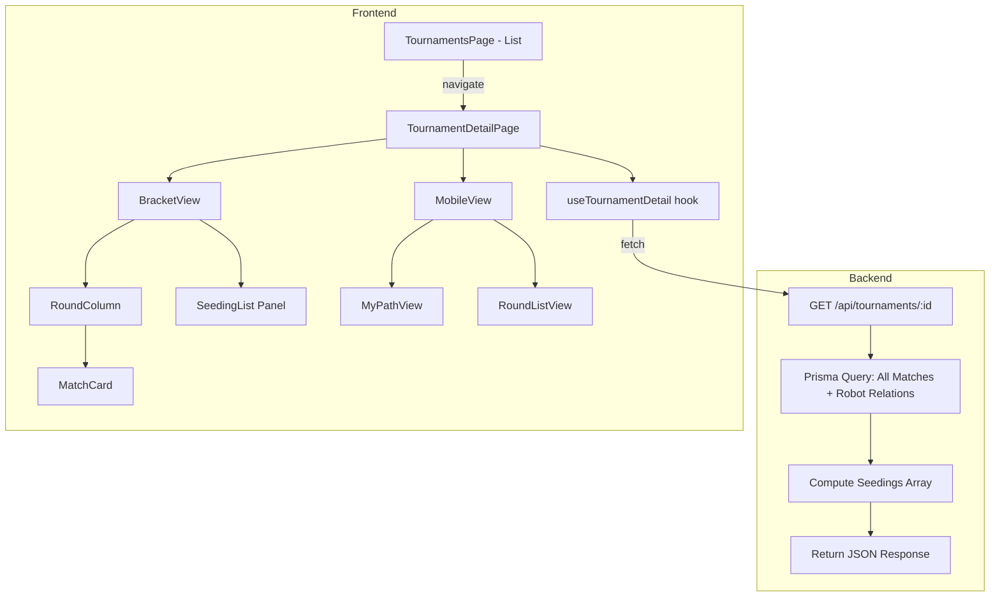

# Design Document: Tournament Bracket Seeding

## Overview

This feature transforms the tournament viewing experience from a flat, modal-based current-round list into a full bracket visualization on a dedicated detail page. The backend already generates all `TournamentMatch` records upfront (including future-round placeholders) and seeds robots by ELO using `generateStandardSeedOrder()`. The work involves:

1. **Backend**: Modify `GET /api/tournaments/:id` to return all matches across all rounds (not just current round) with robot relations, and compute a `seedings` array from round-1 match data and bracket positions.
2. **Frontend**: Add a `/tournaments/:id` route with a `TournamentDetailPage`, replace the modal in `TournamentsPage`, and build a `BracketView` component that renders the single-elimination tree with match cards, seed labels, round columns, user highlighting, and mobile-responsive alternative views.

No database schema changes are required — all data already exists in the `Tournament` and `TournamentMatch` tables.

## Architecture



### Key Design Decisions

1. **Seedings computed server-side**: The seedings array is derived on the backend by reading round-1 matches and reversing the `generateStandardSeedOrder()` mapping. This avoids duplicating the seeding algorithm on the frontend and keeps the API as the single source of truth.

2. **No schema changes**: The existing `TournamentMatch` table already stores all rounds with `robot1Id`, `robot2Id`, `round`, and `matchNumber`. We just need to remove the `where: { round: { lte: currentRound } }` filter and include robot relations.

3. **CSS-based bracket layout**: The bracket tree uses CSS Grid for round columns and flexbox for vertical match positioning. Connector lines between rounds use CSS pseudo-elements. This avoids heavy canvas/SVG libraries and keeps the bundle small.

4. **Responsive strategy**: Below 768px, the bracket switches to a list-based view (round-by-round or "My Path"). On desktop with large brackets (>64 round-1 matches), CSS `transform: scale()` with wheel/pinch handlers enables zoom and pan.

## Components and Interfaces

### Backend Components

#### Modified: `GET /api/tournaments/:id` (tournaments.ts)

Current behavior returns matches only up to `currentRound`. The modified endpoint returns all matches across all rounds with robot details, plus a computed `seedings` array.

```typescript
// Response shape
interface TournamentDetailResponse {
  success: boolean;
  tournament: {
    id: number;
    name: string;
    tournamentType: string;
    status: 'pending' | 'active' | 'completed';
    currentRound: number;
    maxRounds: number;
    totalParticipants: number;
    winnerId: number | null;
    createdAt: string;
    startedAt: string | null;
    completedAt: string | null;
    winner: { id: number; name: string; elo: number } | null;
    matches: TournamentMatchWithRobots[];
  };
  seedings: SeedEntry[];
  timestamp: string;
}

interface TournamentMatchWithRobots {
  id: number;
  tournamentId: number;
  round: number;
  matchNumber: number;
  robot1Id: number | null;
  robot2Id: number | null;
  winnerId: number | null;
  battleId: number | null;
  status: 'pending' | 'scheduled' | 'completed';
  isByeMatch: boolean;
  completedAt: string | null;
  robot1: { id: number; name: string; elo: number } | null;
  robot2: { id: number; name: string; elo: number } | null;
  winner: { id: number; name: string } | null;
}

interface SeedEntry {
  seed: number;       // 1-based seed number
  robotId: number;
  robotName: string;
  elo: number;
  eliminated: boolean; // true if robot has lost a match
}
```

#### New: `computeSeedings()` (tournamentService.ts)

A pure function that takes round-1 matches, the bracket size, and the `generateStandardSeedOrder()` output to produce the seedings array. The algorithm:

1. Get all round-1 matches ordered by `matchNumber`.
2. For each match at position `i` (0-based), the two bracket slots are `2*i` and `2*i+1`.
3. Use the inverse of `generateStandardSeedOrder(bracketSize)` to map bracket slot → seed number.
4. Collect `{ seed, robotId, robotName, elo }` for every non-null robot.
5. Sort by seed ascending.
6. Mark `eliminated: true` for any robot that appears as a loser in any completed match.

This function is exported for testing.

### Frontend Components

#### New: `TournamentDetailPage` (pages/TournamentDetailPage.tsx)

- Route: `/tournaments/:id`
- Fetches tournament data via `tournamentApi.getTournamentDetails()`
- Renders header info (name, status, round, participants, champion)
- Contains `BracketView` as primary content
- Back link to `/tournaments`
- Error state with retry button
- Loading skeleton

#### Modified: `TournamentsPage` (pages/TournamentsPage.tsx)

- Replace `fetchTournamentDetails()` + modal with `navigate(`/tournaments/${id}`)`
- Remove the modal JSX entirely
- Remove `selectedTournament`, `detailsLoading`, `matchesPage`, `matchesPerPage`, `showOnlyUserRobots` state

#### New: `BracketView` (components/tournament/BracketView.tsx)

Top-level bracket container. Manages:
- Desktop vs mobile detection via `window.innerWidth` / media query hook
- Zoom/pan state for large brackets (desktop)
- Delegates to `DesktopBracket` or `MobileBracket`

#### New: `DesktopBracket` (components/tournament/DesktopBracket.tsx)

- CSS Grid layout: one column per round
- Each `RoundColumn` contains vertically-spaced `MatchCard` components
- Connector lines (CSS pseudo-elements) link match pairs to their next-round match
- Horizontal scroll via `overflow-x: auto`
- Pinch-to-zoom when round-1 matches > 64: uses CSS `transform: scale()` with wheel and touch event handlers

#### New: `RoundColumn` (components/tournament/RoundColumn.tsx)

- Renders round label ("Round 1", "Quarter-finals", "Semi-finals", "Finals")
- Contains match cards for that round
- Highlights current round with accent border

#### New: `MatchCard` (components/tournament/MatchCard.tsx)

- Displays two robot slots
- States: completed (winner green, loser dimmed), pending (neutral + "Pending"), placeholder (TBD), bye ("Bye" label)
- Seed number prefix for seeds 1-32: `#1 RobotName`
- Highlight border when match contains user's robot
- Subtle future-path indicator for user's potential matches

#### New: `SeedingList` (components/tournament/SeedingList.tsx)

- Collapsible side panel
- Lists all participants by seed
- Shows seed number (for top 32), robot name, ELO
- Strikethrough/dimmed for eliminated robots
- Highlight for user's own robots

#### New: `MobileBracket` (components/tournament/MobileBracket.tsx)

- Two view modes: "My Path" and "Round List"
- Toggle between modes
- **My Path**: Shows only matches involving user's robot(s) in a vertical timeline
- **Round List**: Shows one round at a time with prev/next navigation, collapsible rounds

#### Modified: `tournamentApi.ts` (utils/tournamentApi.ts)

- Update `TournamentDetails` interface to include `seedings` array
- Update `getTournamentDetails()` to pass through the `seedings` field from the response

#### New: `useMediaQuery` hook (hooks/useMediaQuery.ts)

Simple hook wrapping `window.matchMedia` for responsive breakpoint detection.

### Utility Functions

#### `getRoundLabel(round: number, maxRounds: number): string`

Already exists as `getRoundName()` in `TournamentsPage.tsx`. Extract to a shared utility:
- `maxRounds - round === 0` → "Finals"
- `maxRounds - round === 1` → "Semi-finals"
- `maxRounds - round === 2` → "Quarter-finals"
- Otherwise → `"Round ${round}"`

#### `buildBracketTree(matches: TournamentMatchWithRobots[], maxRounds: number)`

Organizes flat match array into a `Map<number, TournamentMatchWithRobots[]>` keyed by round number, for efficient rendering.

## Data Models

### Existing Models (No Changes)

**Tournament** (Prisma)
- `id`, `name`, `tournamentType`, `status`, `currentRound`, `maxRounds`, `totalParticipants`, `winnerId`, `createdAt`, `startedAt`, `completedAt`

**TournamentMatch** (Prisma)
- `id`, `tournamentId`, `round`, `matchNumber`, `robot1Id`, `robot2Id`, `winnerId`, `battleId`, `status`, `isByeMatch`, `createdAt`, `completedAt`

### New Frontend Types

```typescript
// Seed entry returned by API
interface SeedEntry {
  seed: number;
  robotId: number;
  robotName: string;
  elo: number;
  eliminated: boolean;
}

// Bracket organized by round for rendering
type BracketRounds = Map<number, TournamentMatchWithRobots[]>;

// Zoom/pan state for desktop bracket
interface BracketViewState {
  scale: number;
  translateX: number;
  translateY: number;
}
```

### Seedings Computation

The seedings array is computed from round-1 matches using the inverse of the bracket position algorithm:

```
bracketSize = 2^maxRounds
seedOrder = generateStandardSeedOrder(bracketSize)  // e.g., [1, 16, 8, 9, 5, 12, ...]

For each round-1 match at index i (0-based, ordered by matchNumber):
  slot0 = 2 * i       → robot1 has seed = seedOrder[slot0]
  slot1 = 2 * i + 1   → robot2 has seed = seedOrder[slot1]
```

This means `computeSeedings()` only needs the round-1 matches and the bracket size. It does not need to re-sort by ELO — the seed numbers are positional.


## Correctness Properties

*A property is a characteristic or behavior that should hold true across all valid executions of a system — essentially, a formal statement about what the system should do. Properties serve as the bridge between human-readable specifications and machine-verifiable correctness guarantees.*

### Property 1: API returns all matches across all rounds in correct order

*For any* tournament with `maxRounds` rounds, the `GET /api/tournaments/:id` response SHALL contain every `TournamentMatch` record for that tournament, and the matches array SHALL be sorted by `(round ASC, matchNumber ASC)` — i.e., for any two adjacent matches in the array, the first has a round ≤ the second, and within the same round, a matchNumber ≤ the next.

**Validates: Requirements 1.1, 1.4**

### Property 2: Match robot relations are correctly populated

*For any* `TournamentMatch` in the API response, if `robot1Id` is non-null then `robot1` SHALL be an object with `id`, `name`, and `elo` fields where `robot1.id === robot1Id`; if `robot1Id` is null then `robot1` SHALL be null. The same holds for `robot2` and `winner`.

**Validates: Requirements 1.2, 1.3**

### Property 3: Seedings round-trip — ELO ordering is preserved through bracket placement

*For any* set of robots with distinct ELO ratings placed into a tournament bracket via `seedRobotsByELO()` and `generateStandardSeedOrder()`, the `computeSeedings()` function extracting seed numbers from round-1 match positions SHALL produce a seedings array where seed 1 has the highest ELO, seed 2 has the second-highest ELO, and so on — i.e., the seedings array sorted by seed ascending has strictly descending ELO values.

**Validates: Requirements 2.1, 2.2, 2.3**

### Property 4: Bracket renders correct structure per round

*For any* tournament with `maxRounds` rounds, the bracket component SHALL render exactly `maxRounds` round columns, and for each round `r`, the number of match cards in that column SHALL equal the number of `TournamentMatch` records with `round === r`.

**Validates: Requirements 3.1, 3.2**

### Property 5: Completed match card highlights winner and dims loser

*For any* completed `TournamentMatch` (status === 'completed', winnerId non-null), the rendered `MatchCard` SHALL apply the winner highlight class to the robot whose id matches `winnerId` and the dimmed/loser class to the other robot.

**Validates: Requirements 3.3**

### Property 6: Seed display threshold — top 32 seeds show number, others don't

*For any* robot entry with a seed number, if `seed <= 32` then the rendered output (in both `MatchCard` and `SeedingList`) SHALL contain the seed prefix (e.g., "#N"), and if `seed > 32` then the rendered output SHALL NOT contain a seed prefix.

**Validates: Requirements 4.1, 4.2, 5.3, 5.4**

### Property 7: Seeding list contains all participants with correct data

*For any* tournament with `totalParticipants` participants, the `SeedingList` SHALL render exactly `totalParticipants` entries, each displaying the robot name and ELO, ordered by seed number ascending from 1 to `totalParticipants`.

**Validates: Requirements 5.1, 5.2**

### Property 8: User robot matches are highlighted in bracket

*For any* tournament and any set of user-owned robot IDs, every `MatchCard` where `robot1Id` or `robot2Id` is in the user's robot set SHALL have the user-highlight CSS class applied, and every `MatchCard` where neither robot belongs to the user SHALL NOT have that class.

**Validates: Requirements 6.1, 6.2, 6.4**

### Property 9: Future path prediction identifies correct match slots

*For any* active tournament and any user robot that has not been eliminated, the set of future-round match slots highlighted SHALL be exactly the matches the robot would play in if it wins every remaining match — computed by following the bracket tree from the robot's current match position upward through each subsequent round.

**Validates: Requirements 6.3**

### Property 10: Round labels follow naming convention

*For any* round number `r` and `maxRounds` value, `getRoundLabel(r, maxRounds)` SHALL return "Finals" when `r === maxRounds`, "Semi-finals" when `r === maxRounds - 1`, "Quarter-finals" when `r === maxRounds - 2`, and `"Round ${r}"` for all other values of `r`.

**Validates: Requirements 7.1**

### Property 11: My Path view contains exactly the user's matches

*For any* tournament and user robot, the "My Path" mobile view SHALL display exactly the set of matches where `robot1Id` or `robot2Id` equals the user's robot ID, plus the connected future-path matches, and no other matches.

**Validates: Requirements 9.2**

### Property 12: Eliminated robots are visually indicated in seeding list

*For any* robot that has lost a match in the tournament (appears as the non-winner in a completed match), the corresponding `SeedingList` entry SHALL have the eliminated visual indicator class applied.

**Validates: Requirements 5.5**

## Error Handling

### Backend Errors

| Error Condition | HTTP Status | Response | Handling |
|---|---|---|---|
| Invalid tournament ID (non-numeric) | 400 | `{ error: "Invalid tournament ID" }` | Existing behavior, unchanged |
| Tournament not found | 404 | `{ error: "Tournament not found" }` | Existing behavior, unchanged |
| Database query failure | 500 | `{ error: "Failed to fetch tournament details" }` | Log error, return generic message |
| Seedings computation failure (corrupt data) | 500 | `{ error: "Failed to compute seedings" }` | Log error with tournament ID, return tournament data without seedings as fallback |

### Frontend Errors

| Error Condition | UI Behavior |
|---|---|
| API request fails (network/500) | Show error message with "Retry" button on `TournamentDetailPage` |
| Tournament not found (404) | Show "Tournament not found" message with link back to list |
| Empty matches array | Show bracket skeleton with "No matches available" message |
| Missing seedings data | Render bracket without seed numbers (graceful degradation) |
| User has no robots (for highlighting) | Render bracket without any highlights, no "My Path" option in mobile |

### Edge Cases

- **Tournament with 1 round** (2-4 participants): Bracket renders a single Finals column
- **All bye matches in round 1**: Bracket shows round 1 with all byes, round 2 populated
- **Tournament in "pending" status**: Bracket shows round 1 matches, all in pending state
- **Very large tournaments (128+ participants)**: Desktop zoom/pan enabled, mobile defaults to round list view

## Testing Strategy

### Property-Based Testing

Use **fast-check** (already in the project's test dependencies) for property-based tests. Each property test runs a minimum of 100 iterations.

**Backend property tests** (`prototype/backend/src/__tests__/tournament-bracket-seeding.property.test.ts`):

1. **Property 3 test**: Generate random arrays of 4-128 robots with random ELO values. Run `seedRobotsByELO()` → `generateStandardSeedOrder()` → `computeSeedings()`. Assert seedings are in descending ELO order.
   - Tag: `Feature: tournament-bracket-seeding, Property 3: Seedings round-trip`

2. **Property 10 test**: Generate random `(round, maxRounds)` pairs where `1 <= round <= maxRounds` and `maxRounds >= 1`. Assert `getRoundLabel()` returns the correct string per the naming rules.
   - Tag: `Feature: tournament-bracket-seeding, Property 10: Round labels follow naming convention`

3. **Property 1 test**: Generate random tournament match arrays with varying rounds and match numbers. Pass through the ordering logic and assert the output is sorted by `(round, matchNumber)`.
   - Tag: `Feature: tournament-bracket-seeding, Property 1: API returns all matches in correct order`

4. **Property 6 test**: Generate random seed numbers (1-500) and robot names. Assert the seed display function shows prefix for seeds ≤ 32 and omits it for seeds > 32.
   - Tag: `Feature: tournament-bracket-seeding, Property 6: Seed display threshold`

**Frontend property tests** (`prototype/frontend/src/__tests__/tournament-bracket-seeding.property.test.ts`):

5. **Property 4 test**: Generate random tournament data with 1-7 rounds. Render `BracketView` and assert correct number of round columns and match cards per round.
   - Tag: `Feature: tournament-bracket-seeding, Property 4: Bracket renders correct structure`

6. **Property 8 test**: Generate random match data and random user robot ID sets. Assert highlight class is applied if and only if the match contains a user robot.
   - Tag: `Feature: tournament-bracket-seeding, Property 8: User robot match highlighting`

### Unit Tests (Examples and Edge Cases)

**Backend unit tests**:
- `computeSeedings()` with a known 8-robot tournament: verify exact seed assignments
- `computeSeedings()` with bye matches (e.g., 5 robots in 8-slot bracket): verify all 5 robots appear
- API response shape for a completed tournament with winner
- API response for a tournament with all placeholder matches (round 2+)

**Frontend unit tests**:
- `MatchCard` renders "TBD" for placeholder matches (Req 3.5)
- `MatchCard` renders "Bye" label for bye matches (Req 3.6)
- `MatchCard` renders "Pending" for pending matches with two robots (Req 3.4)
- `TournamentDetailPage` shows error + retry on API failure (Req 8.5)
- `TournamentDetailPage` shows champion info when winner exists (Req 8.6)
- `TournamentsPage` navigates to `/tournaments/:id` on click (Req 8.1)
- Mobile view defaults to round list when user has no robot (Req 9.3)
- Current round column has active styling (Req 7.2)

### Test Configuration

- Property-based tests: minimum 100 iterations per property via `fc.assert(fc.property(...), { numRuns: 100 })`
- Each property test tagged with comment: `// Feature: tournament-bracket-seeding, Property N: <title>`
- Frontend tests use React Testing Library + jsdom
- Backend tests use Jest with Prisma mocking
