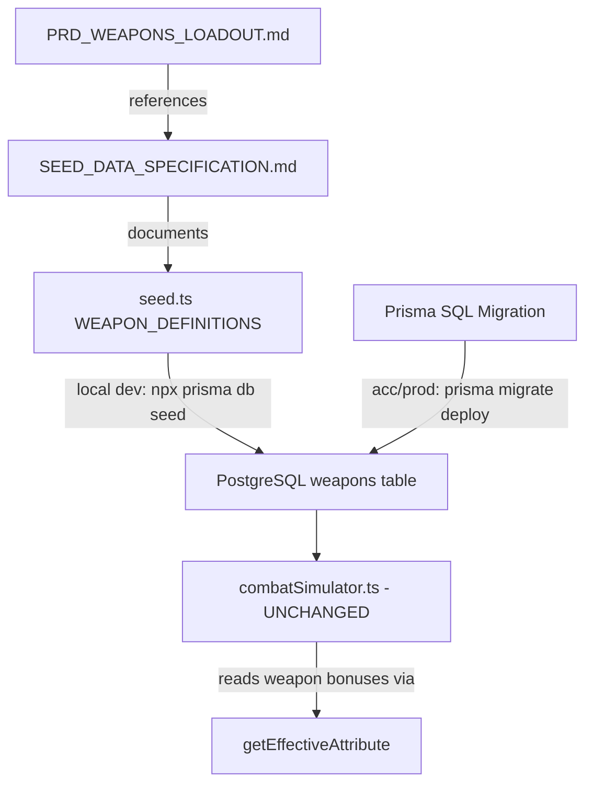

# Design Document: Weapon Bonus Rebalance

## Overview

This is a DATA-ONLY rebalance that swaps dead/mismatched attribute bonuses on 7 weapons to live combat attributes. No combat formulas, database schema, or weapon roster changes are involved. The change touches 4 files plus a new Prisma SQL migration.

### Problem

Eight weapons reference attributes with zero combat formula implementation (`hydraulicSystems`, `servoMotors`) or have flavour mismatches (`shieldCapacity` on an offensive weapon). Every bonus point spent on these attributes is wasted — it costs the player credits but provides no gameplay value.

### Solution

Swap each dead/mismatched bonus 1:1 to a live attribute at the exact same magnitude. Because `Attribute Cost = Σ(500 × bonus²)` and magnitudes are preserved, weapon prices remain unchanged.

### Live Attributes (used in `combatSimulator.ts`)

| Attribute | Formula Usage |
|-----------|--------------|
| combatPower | Damage multiplier (`calculateBaseDamage`) |
| targetingSystems | Hit chance, crit chance (`calculateHitChance`, `calculateCritChance`) |
| criticalSystems | Crit chance (`calculateCritChance`) |
| penetration | Armor penetration (`applyDamage`) |
| weaponControl | Malfunction chance, damage multiplier (`calculateMalfunctionChance`, `calculateBaseDamage`) |
| attackSpeed | Cooldown reduction (`calculateCooldown`) |
| armorPlating | Damage reduction (defender, `applyDamage`) |
| shieldCapacity | Energy shield HP (defender) |
| evasionThrusters | Dodge chance (defender, `calculateHitChance`) |
| damageDampeners | Crit reduction + pre-shield mitigation (defender, `applyDamage`) |
| counterProtocols | Counter-attack chance (defender, `calculateCounterChance`) |
| hullIntegrity | Max HP |
| gyroStabilizers | Dodge chance (defender, `calculateHitChance`) |
| powerCore | Shield regeneration (`regenerateShields`) |

### Dead Attributes (no formula references)

`hydraulicSystems`, `servoMotors`, `combatAlgorithms`, `threatAnalysis`, `adaptiveAI`, `logicCores`, `syncProtocols`, `supportSystems`, `formationTactics`

### Scope

- 7 weapons modified (of 23 total)
- 16 weapons untouched
- 0 new weapons, 0 removed weapons
- 0 combat formula changes
- 0 schema changes

---

## Architecture

This rebalance is entirely a data layer change. No new services, APIs, or components are introduced.



### Change Flow

1. **Local development**: Developer runs `npx prisma db seed`. The `seedWeapons()` function iterates `WEAPON_DEFINITIONS` and calls `upsertWeapon()` (findFirst by name + update) for each weapon. Updated bonus fields overwrite old values.

2. **Acceptance / Production**: The CI/CD pipeline runs `prisma migrate deploy` which executes the new SQL migration. The migration uses `UPDATE ... WHERE name = '...'` statements to patch the 7 weapons in-place.

3. **Documentation**: `SEED_DATA_SPECIFICATION.md` and `PRD_WEAPONS_LOADOUT.md` are updated to reflect the new bonus values.

---

## Components and Interfaces

### Files Modified

| File | Change Type |
|------|-------------|
| `prototype/backend/prisma/seed.ts` | Update `WEAPON_DEFINITIONS` array — swap bonus fields on 7 weapons |
| `docs/prd_core/SEED_DATA_SPECIFICATION.md` | Update weapon bonus descriptions for 7 weapons |
| `docs/prd_core/PRD_WEAPONS_LOADOUT.md` | Update weapon bonus descriptions where individual bonuses are listed |
| `prototype/backend/prisma/migrations/<timestamp>_weapon_bonus_rebalance/migration.sql` | New SQL migration with 7 UPDATE statements |

### Files NOT Modified

- `prototype/backend/src/services/combatSimulator.ts` — no formula changes
- `prototype/backend/prisma/schema.prisma` — no schema changes
- All frontend files — no UI changes
- All other backend source files

### Interfaces

No interface changes. The `Weapon` model already has all bonus columns (both live and dead) with `Int @default(0)`. The `getEffectiveAttribute()` function in `combatSimulator.ts` reads whichever bonus field is passed to it — swapping which fields have non-zero values requires no code changes.

---

## Data Models

### Before/After Bonus Tables

#### Energy Blade (₡238,000)

| Bonus Field | Before | After |
|-------------|--------|-------|
| attackSpeedBonus | +5 | +5 (unchanged) |
| hydraulicSystemsBonus | +4 | 0 (removed) |
| weaponControlBonus | +3 | +3 (unchanged) |
| combatPowerBonus | 0 | +4 (added) |

#### Plasma Blade (₡269,000)

| Bonus Field | Before | After |
|-------------|--------|-------|
| hydraulicSystemsBonus | +5 | 0 (removed) |
| attackSpeedBonus | +4 | +4 (unchanged) |
| criticalSystemsBonus | +3 | +3 (unchanged) |
| gyroStabilizersBonus | +2 | +2 (unchanged) |
| combatPowerBonus | 0 | +5 (added) |

#### Power Sword (₡350,000)

| Bonus Field | Before | After |
|-------------|--------|-------|
| hydraulicSystemsBonus | +7 | 0 (removed) |
| counterProtocolsBonus | +5 | 0 (removed) |
| gyroStabilizersBonus | +4 | 0 (removed) |
| combatPowerBonus | +3 | +3 (unchanged) |
| penetrationBonus | 0 | +7 (added) |
| criticalSystemsBonus | 0 | +5 (added) |
| weaponControlBonus | 0 | +4 (added) |

#### Battle Axe (₡388,000)

| Bonus Field | Before | After |
|-------------|--------|-------|
| hydraulicSystemsBonus | +6 | 0 (removed) |
| combatPowerBonus | +4 | +4 (unchanged) |
| criticalSystemsBonus | +3 | +3 (unchanged) |
| servoMotorsBonus | -2 | 0 (removed) |
| penetrationBonus | 0 | +6 (added) |
| attackSpeedBonus | 0 | -2 (added) |

#### Heavy Hammer (₡450,000)

| Bonus Field | Before | After |
|-------------|--------|-------|
| hydraulicSystemsBonus | +8 | 0 (removed) |
| combatPowerBonus | +7 | +7 (unchanged) |
| criticalSystemsBonus | +4 | +4 (unchanged) |
| servoMotorsBonus | -3 | 0 (removed) |
| penetrationBonus | 0 | +8 (added) |
| attackSpeedBonus | 0 | -3 (added) |

#### Reactive Shield (₡113,000)

| Bonus Field | Before | After |
|-------------|--------|-------|
| shieldCapacityBonus | +7 | +7 (unchanged) |
| counterProtocolsBonus | +6 | +6 (unchanged) |
| powerCoreBonus | +4 | +4 (unchanged) |
| servoMotorsBonus | -2 | 0 (removed) |
| evasionThrustersBonus | 0 | -2 (added) |

#### Ion Beam (₡538,000)

| Bonus Field | Before | After |
|-------------|--------|-------|
| penetrationBonus | +10 | +10 (unchanged) |
| shieldCapacityBonus | +8 | 0 (removed) |
| attackSpeedBonus | +5 | +5 (unchanged) |
| targetingSystemsBonus | +4 | +4 (unchanged) |
| combatPowerBonus | 0 | +8 (added) |

### Price Verification

For each weapon, `Attribute Cost = Σ(500 × bonus²)`. Since every swap preserves the magnitude, the sum of squares is identical before and after:

| Weapon | Σ(bonus²) Before | Σ(bonus²) After | Attribute Cost |
|--------|-------------------|-----------------|----------------|
| Energy Blade | 5²+4²+3² = 50 | 5²+4²+3² = 50 | ₡25,000 |
| Plasma Blade | 5²+4²+3²+2² = 54 | 5²+4²+3²+2² = 54 | ₡27,000 |
| Power Sword | 7²+5²+4²+3² = 99 | 7²+5²+4²+3² = 99 | ₡49,500 |
| Battle Axe | 6²+4²+3²+(-2)² = 65 | 6²+4²+3²+(-2)² = 65 | ₡32,500 |
| Heavy Hammer | 8²+7²+4²+(-3)² = 138 | 8²+7²+4²+(-3)² = 138 | ₡69,000 |
| Reactive Shield | 7²+6²+4²+(-2)² = 105 | 7²+6²+4²+(-2)² = 105 | ₡52,500 |
| Ion Beam | 10²+8²+5²+4² = 205 | 10²+8²+5²+4² = 205 | ₡102,500 |

### Prisma Migration SQL

Migration file: `prototype/backend/prisma/migrations/<timestamp>_weapon_bonus_rebalance/migration.sql`

```sql
-- Weapon Bonus Rebalance: swap dead/mismatched bonuses to live attributes
-- 7 weapons modified, magnitudes preserved, prices unchanged

-- Energy Blade: hydraulicSystems +4 → combatPower +4
UPDATE "Weapon"
SET "hydraulic_systems_bonus" = 0,
    "combat_power_bonus" = 4
WHERE "name" = 'Energy Blade';

-- Plasma Blade: hydraulicSystems +5 → combatPower +5
UPDATE "Weapon"
SET "hydraulic_systems_bonus" = 0,
    "combat_power_bonus" = 5
WHERE "name" = 'Plasma Blade';

-- Power Sword: hydraulicSystems +7 → penetration +7, counterProtocols +5 → criticalSystems +5, gyroStabilizers +4 → weaponControl +4
UPDATE "Weapon"
SET "hydraulic_systems_bonus" = 0,
    "counter_protocols_bonus" = 0,
    "gyro_stabilizers_bonus" = 0,
    "penetration_bonus" = 7,
    "critical_systems_bonus" = 5,
    "weapon_control_bonus" = 4
WHERE "name" = 'Power Sword';

-- Battle Axe: hydraulicSystems +6 → penetration +6, servoMotors -2 → attackSpeed -2
UPDATE "Weapon"
SET "hydraulic_systems_bonus" = 0,
    "servo_motors_bonus" = 0,
    "penetration_bonus" = 6,
    "attack_speed_bonus" = -2
WHERE "name" = 'Battle Axe';

-- Heavy Hammer: hydraulicSystems +8 → penetration +8, servoMotors -3 → attackSpeed -3
UPDATE "Weapon"
SET "hydraulic_systems_bonus" = 0,
    "servo_motors_bonus" = 0,
    "penetration_bonus" = 8,
    "attack_speed_bonus" = -3
WHERE "name" = 'Heavy Hammer';

-- Reactive Shield: servoMotors -2 → evasionThrusters -2
UPDATE "Weapon"
SET "servo_motors_bonus" = 0,
    "evasion_thrusters_bonus" = -2
WHERE "name" = 'Reactive Shield';

-- Ion Beam: shieldCapacity +8 → combatPower +8
UPDATE "Weapon"
SET "shield_capacity_bonus" = 0,
    "combat_power_bonus" = 8
WHERE "name" = 'Ion Beam';
```

The migration is idempotent: running it on a database that already has the new values produces no errors (UPDATE sets the same values again).


---

## Correctness Properties

*A property is a characteristic or behavior that should hold true across all valid executions of a system — essentially, a formal statement about what the system should do. Properties serve as the bridge between human-readable specifications and machine-verifiable correctness guarantees.*

### Property 1: No Dead Attribute Bonuses

*For any* weapon in the `WEAPON_DEFINITIONS` array, all dead attribute bonus fields (`hydraulicSystemsBonus`, `servoMotorsBonus`, `combatAlgorithmsBonus`, `threatAnalysisBonus`, `adaptiveAIBonus`, `logicCoresBonus`, `syncProtocolsBonus`, `supportSystemsBonus`, `formationTacticsBonus`) must be zero or undefined.

**Validates: Requirements 9.1, 9.2**

### Property 2: Bonus Magnitudes Preserved and Prices Unchanged

*For any* weapon in the `WEAPON_DEFINITIONS` array, the sum of squares of all bonus magnitudes (`Σ(bonus²)`) must equal the known pre-rebalance sum of squares for that weapon, AND the `cost` field must equal the known pre-rebalance cost.

This is an invariant property: since every swap is 1:1 at the same magnitude, the multiset of absolute bonus values is preserved, therefore `Σ(bonus²)` is unchanged, therefore the Attribute Cost component of the pricing formula is unchanged.

**Validates: Requirements 8.1, 8.2, 8.3**

### Property 3: Non-Bonus Fields Unchanged

*For any* weapon in the `WEAPON_DEFINITIONS` array, the fields `name`, `baseDamage`, `cooldown`, `weaponType`, `handsRequired`, `damageType`, `loadoutType`, `cost`, `specialProperty`, and `description` must be identical to their pre-rebalance values.

**Validates: Requirements 10.2, 13.2**

### Property 4: Unmodified Weapons Fully Unchanged

*For any* weapon in the `WEAPON_DEFINITIONS` array that is NOT one of the 7 modified weapons (Energy Blade, Plasma Blade, Power Sword, Battle Axe, Heavy Hammer, Reactive Shield, Ion Beam), ALL fields including all bonus fields must be identical to their pre-rebalance values.

**Validates: Requirements 13.3**

---

## Error Handling

This is a data-only change with minimal error surface:

| Scenario | Handling |
|----------|----------|
| Migration runs on database where weapon names don't exist | `UPDATE ... WHERE name = '...'` silently affects 0 rows — no error, no harm |
| Migration runs twice (idempotent) | Sets same values again — no error, no change |
| Seed runs on fresh database | `upsertWeapon` creates weapons with new bonus values — correct by construction |
| Seed runs on existing database | `upsertWeapon` finds weapon by name and updates — overwrites old bonuses with new values |
| Weapon name has a typo in migration SQL | UPDATE affects 0 rows — weapon keeps old bonuses. Caught by property tests (Property 1 would fail if dead bonuses remain) |

No new error handling code is needed. The existing `upsertWeapon` pattern and Prisma migration infrastructure handle all cases.

---

## Testing Strategy

### Dual Testing Approach

This rebalance uses both unit tests (specific examples) and property-based tests (universal properties) for comprehensive coverage.

### Property-Based Tests (fast-check)

The project uses Jest with `fast-check` for property-based testing. Each property test imports the `WEAPON_DEFINITIONS` array directly from `seed.ts` and validates invariants across all 23 weapons.

Since `WEAPON_DEFINITIONS` is a static array (not randomly generated), the property tests iterate over all weapons deterministically. The `fast-check` library is used to express the properties formally and get structured test output, even though the input space is finite.

Each test must run a minimum of 100 iterations and be tagged with the design property it validates.

**Property Test Configuration:**
- Library: `fast-check`
- Runner: Jest
- Minimum iterations: 100 (though the weapon array is finite, fast-check's `fc.constantFrom()` or `fc.integer()` can sample weapons randomly)
- Tag format: `Feature: weapon-bonus-rebalance, Property N: <title>`

**Tests to implement:**

1. **Feature: weapon-bonus-rebalance, Property 1: No Dead Attribute Bonuses**
   - For each weapon in `WEAPON_DEFINITIONS`, assert all 9 dead bonus fields are zero or undefined.
   - Use `fc.constantFrom(...WEAPON_DEFINITIONS)` to sample weapons.

2. **Feature: weapon-bonus-rebalance, Property 2: Bonus Magnitudes Preserved and Prices Unchanged**
   - Maintain a lookup of pre-rebalance `Σ(bonus²)` and `cost` for each weapon.
   - For each weapon, compute current `Σ(bonus²)` from all bonus fields and assert it equals the expected value.
   - Assert `cost` matches expected value.

3. **Feature: weapon-bonus-rebalance, Property 3: Non-Bonus Fields Unchanged**
   - Maintain a lookup of pre-rebalance non-bonus field values for each weapon.
   - For each weapon, assert all non-bonus fields match.

4. **Feature: weapon-bonus-rebalance, Property 4: Unmodified Weapons Fully Unchanged**
   - For each of the 16 unmodified weapons, assert ALL fields (including bonuses) match pre-rebalance snapshot.

### Unit Tests (Jest)

Unit tests verify the specific before/after values for each of the 7 modified weapons:

- **Energy Blade**: `combatPowerBonus === 4`, `hydraulicSystemsBonus === 0`, `attackSpeedBonus === 5`, `weaponControlBonus === 3`
- **Plasma Blade**: `combatPowerBonus === 5`, `hydraulicSystemsBonus === 0`, `attackSpeedBonus === 4`, `criticalSystemsBonus === 3`, `gyroStabilizersBonus === 2`
- **Power Sword**: `penetrationBonus === 7`, `criticalSystemsBonus === 5`, `weaponControlBonus === 4`, `combatPowerBonus === 3`, `hydraulicSystemsBonus === 0`, `counterProtocolsBonus === 0`, `gyroStabilizersBonus === 0`
- **Battle Axe**: `penetrationBonus === 6`, `attackSpeedBonus === -2`, `combatPowerBonus === 4`, `criticalSystemsBonus === 3`, `hydraulicSystemsBonus === 0`, `servoMotorsBonus === 0`
- **Heavy Hammer**: `penetrationBonus === 8`, `attackSpeedBonus === -3`, `combatPowerBonus === 7`, `criticalSystemsBonus === 4`, `hydraulicSystemsBonus === 0`, `servoMotorsBonus === 0`
- **Reactive Shield**: `evasionThrustersBonus === -2`, `shieldCapacityBonus === 7`, `counterProtocolsBonus === 6`, `powerCoreBonus === 4`, `servoMotorsBonus === 0`
- **Ion Beam**: `combatPowerBonus === 8`, `shieldCapacityBonus === 0`, `penetrationBonus === 10`, `attackSpeedBonus === 5`, `targetingSystemsBonus === 4`
- **Weapon count**: `WEAPON_DEFINITIONS.length === 23`

### Test File Location

`prototype/backend/src/__tests__/weapon-bonus-rebalance.test.ts`

Tests import `WEAPON_DEFINITIONS` directly from `../../../prisma/seed.ts` (the array is exported as a named constant).
