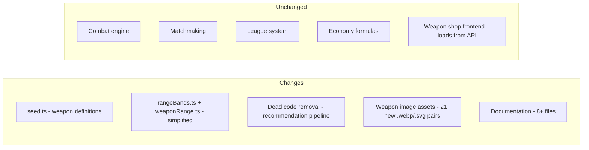

# Design Document: Weapon Roster Expansion

## 1. Overview

Expand the Armoured Souls weapon catalog from **26 to 47 weapons** by filling all 22 empty slots in the 36-slot weapon grid. The approach combines:

- **2 reclassifications** — move Laser Rifle and Assault Rifle to better-fitting grid slots
- **1 tier correction** — Battle Axe acknowledged as Luxury (cost already exceeds 400K threshold)
- **21 new weapons** — designed to fill every remaining gap

After expansion every combination of Range x Hand Type x Price Tier (plus all 4 Shield tiers) will contain at least one weapon.

## 2. Pricing Formula Reference

```
Total Cost = (Base Cost + Attribute Cost + DPS Cost) x Hand Multiplier

Base Cost       = 50,000
Attribute Cost  = sum(500 x bonus^2)   for each attribute bonus on the weapon
DPS Cost        = 50,000 x (DPS_Ratio - 1.0) x 3.0
DPS Ratio       = (baseDamage / cooldown) / 2.0
Hand Multiplier = 1.0 (1H) | 1.6 (2H) | 0.9 (Shield)

Round to nearest 1,000
```

| Tier    | Cost Range     |
|---------|----------------|
| Budget  | < 100,000      |
| Mid     | 100,000-249,999|
| Premium | 250,000-399,999|
| Luxury  | >= 400,000     |

Stat constraints: DPS 1.5-6.0, cooldown 2-7s, attribute bonuses -5 to +15.

## 3. Architecture & Change Scope



### Systems that change
| System | What changes |
|--------|-------------|
| `app/backend/prisma/seed.ts` | Add 21 new weapon definitions, update 3 existing |
| `app/frontend/src/utils/weaponRange.ts` | Simplify `getWeaponOptimalRange()` to return `weapon.rangeBand` |
| `app/frontend/src/components/onboarding/WeaponRecommendationCard.tsx` | DELETE — dead code (exported but never imported/rendered) |
| `app/frontend/src/components/onboarding/index.ts` | Remove `WeaponRecommendationCard`, `STARTER_WEAPONS`, and `WeaponRecommendation` exports |
| `app/backend/src/services/recommendationEngine.ts` | DELETE — dead code (backend service never called by any frontend) |
| `app/backend/tests/recommendationEngine.test.ts` | DELETE — tests for dead recommendation engine |
| `app/backend/src/routes/onboarding.ts` | Remove `GET /recommendations` route and `recommendationEngine` import |
| `app/backend/tests/onboardingApi.test.ts` | Remove recommendations test section |
| `app/frontend/src/utils/onboardingApi.ts` | Remove `getRecommendations()`, `getRecommendationsWithRetry()`, `clearRecommendationCache()`, recommendation cache, and related types (`Recommendation`, `BudgetAllocation`, `RecommendationsResponse`) |
| `app/frontend/src/components/onboarding/__tests__/performance.test.tsx` | Remove recommendations endpoint mock |
| `app/frontend/src/assets/weapons/` | Add 21 `.webp` + 21 `.svg` image files |
| `docs/prd_core/SEED_DATA_SPECIFICATION.md` | Weapon count, new entries, version bump to v1.5 |
| `docs/prd_core/PRD_WEAPONS_LOADOUT.md` | Category counts, DPS rankings, tier distribution |
| `docs/balance_changes/PRD_WEAPON_ECONOMY_OVERHAUL.md` | Revised catalog, summary counts |
| `docs/prd_pages/PRD_WEAPON_SHOP.md` | Category counts in filtering/test sections |
| `docs/PLAYER_ARCHETYPES_GUIDE.md` | Weapon count reference, Appendix B catalog |
| `app/backend/src/content/guide/weapons/loadout-types.md` | Hand-type counts |
| `app/backend/src/content/guide/combat/movement-and-positioning.md` | Range-band weapon examples |
| `docs/prd_core/PRD_ONBOARDING_SYSTEM.md` | Weapon type counts (Step 6), recommended weapons (Step 7) |

### Systems that do NOT change
- Combat engine (damage formulas, turn resolution)
- Matchmaking and league systems
- Economy system (pricing formula itself is unchanged)
- Weapon shop frontend (loads weapons from API, resolves images dynamically)

## 4. Range Classification Update

The current `getWeaponOptimalRange()` derives a weapon's range from a rule chain based on `weaponType`, `handsRequired`, and weapon name. This is fragile — it can't express 2H Short, 1H Mid, or 1H Long weapons without special-case overrides, and any new weapon that doesn't match a rule gets silently misclassified.

### Problem

With the roster expanding from 26 to 47 weapons, the rule chain breaks down:
- 4 new 2H weapons need Short range (default 2H rule assigns Mid)
- 4 new 1H weapons need Mid range (default 1H rule assigns Short)
- 4 new 1H weapons need Long range (default 1H rule assigns Short)

That's 12 weapons the current logic would misclassify.

### Solution: Store range on the weapon

Add a `rangeBand` column to the Weapon model. Each weapon explicitly declares its optimal range in the database. No derivation, no overrides, no guessing.

#### Schema change

```prisma
model Weapon {
  // ... existing fields ...
  rangeBand       String  @map("range_band") @db.VarChar(10) // "melee", "short", "mid", "long"
  // ...
}
```

#### Migration

```sql
ALTER TABLE weapons ADD COLUMN range_band VARCHAR(10) NOT NULL DEFAULT 'short';
```

After adding the column, the seed script sets the correct value for every weapon. The default of `'short'` is only a migration safety net — the seed will overwrite it for all 47 weapons.

#### Simplified `getWeaponOptimalRange()`

Backend (`rangeBands.ts`) and frontend (`weaponRange.ts`) both simplify to:

```typescript
export interface WeaponLike {
  name: string;
  rangeBand: RangeBand;
}

export function getWeaponOptimalRange(weapon: WeaponLike): RangeBand {
  return weapon.rangeBand;
}
```

The function signature stays the same so all call sites (threatScoring, movementAI, counterAttack, etc.) continue to work unchanged. The `WeaponLike` interface drops `weaponType` and `handsRequired` since they're no longer needed for range classification.

#### What stays the same
- `classifyRangeBand(distance)` — classifies distances into bands, unrelated to weapons
- `getRangePenalty()` — compares weapon range vs current range band
- `canAttack()` — melee range restriction (can read `weapon.rangeBand === 'melee'` instead of `weapon.weaponType === 'melee'`)
- All combat engine call sites — they call `getWeaponOptimalRange(weapon)` which now just returns the stored value

#### What gets removed
- `LONG_RANGE_WEAPONS` name list — no longer needed
- The rule chain in `getWeaponOptimalRange()` — replaced by a single property read
- The silent `else -> short` fallback — gone entirely

#### Range assignments for all 47 weapons

Every weapon's `rangeBand` value is set in the seed data:

| Range | Weapons |
|-------|---------|
| melee | Practice Sword, Combat Knife, Energy Blade, Plasma Blade, Power Sword, Vibro Mace, War Club, Shock Maul, Thermal Lance, Battle Axe, Heavy Hammer, Light Shield, Combat Shield, Reactive Shield, Barrier Shield, Fortress Shield, Aegis Bulwark |
| short | Practice Blaster, Laser Pistol, Machine Pistol, Machine Gun, Burst Rifle, Assault Rifle, Plasma Rifle, Volt Sabre, Scatter Cannon, Laser Rifle, Pulse Accelerator, Arc Projector |
| mid | Training Rifle, Shotgun, Grenade Launcher, Plasma Cannon, Mortar System, Bolt Carbine, Flux Repeater, Disruptor Cannon, Nova Caster |
| long | Training Beam, Sniper Rifle, Railgun, Ion Beam, Siege Cannon, Beam Pistol, Photon Marksman, Gauss Pistol, Particle Lance |

Counts: melee 17, short 12, mid 9, long 9 = 47 total.

## 5. Current 26-Weapon Grid (Before Changes)

| Category | Budget | Mid | Premium | Luxury |
|----------|--------|-----|---------|--------|
| 1H Melee | Combat Knife 93K | Energy Blade 175K, Plasma Blade 202K | Power Sword 325K | -- |
| 2H Melee | -- | -- | -- | Battle Axe 402K, Heavy Hammer 478K |
| 1H Short | Laser Pistol 57K, Machine Pistol 94K | Machine Gun 107K, Burst Rifle 117K, Assault Rifle 173K, Laser Rifle 202K | Plasma Rifle 258K | -- |
| 2H Short | -- | -- | -- | -- |
| 1H Mid | -- | -- | -- | -- |
| 2H Mid | -- | -- | Shotgun 283K, Grenade Launcher 293K | Plasma Cannon 408K |
| 1H Long | -- | -- | -- | -- |
| 2H Long | -- | -- | Sniper Rifle 387K | Railgun 527K, Ion Beam 544K |
| Shield | Light Shield 51K, Combat Shield 78K, Reactive Shield 92K | -- | -- | -- |

*Starters (Practice Sword, Practice Blaster, Training Rifle, Training Beam) at 50K each are in their respective Budget slots but omitted for brevity.*

**22 empty slots:** 1H Melee Luxury, 2H Melee Budget/Mid/Premium, 1H Short Luxury, 2H Short Budget/Mid/Premium/Luxury, 1H Mid Budget/Mid/Premium/Luxury, 2H Mid Mid, 1H Long Budget/Mid/Premium/Luxury, 2H Long Mid, Shield Mid/Premium/Luxury.

## 6. Reclassifications

### A1: Laser Rifle -> 2H Short Mid

Laser Rifle moves from 1H Short Mid to 2H Short Mid. Becomes two-handed with 1.6x multiplier. Stats adjusted so cost lands in Mid tier.

| Field | Before | After |
|-------|--------|-------|
| handsRequired | one | two |
| loadoutType | single | two_handed |
| baseDamage | 11 | 9 |
| cooldown | 3 | 3 |
| DPS | 3.67 | 3.0 |
| targetingSystemsBonus | +5 | +5 |
| weaponControlBonus | +4 | +4 |
| attackSpeedBonus | +3 | +3 |
| combatPowerBonus | +2 | +2 |
| cost | 202,000 | 243,000 |
| description | Precision energy rifle with excellent accuracy | Heavy precision energy rifle reconfigured for two-handed operation |

**Pricing proof (after):**
- Attribute Cost = 500 x (25+16+9+4) = 500 x 54 = 27,000
- DPS Ratio = (9/3)/2.0 = 1.5
- DPS Cost = 50,000 x 0.5 x 3.0 = 75,000
- Subtotal = 50,000 + 27,000 + 75,000 = 152,000
- Total = 152,000 x 1.6 = **243,000** (Mid tier)

**Impact:** 1H Short Mid goes from 4 weapons to 3 (Machine Gun, Burst Rifle, Assault Rifle). No gap created.

### A2: Assault Rifle -> 1H Short Premium

Assault Rifle is boosted from 1H Short Mid (173K) to 1H Short Premium (250-400K). Stats increase to justify the higher tier.

| Field | Before | After |
|-------|--------|-------|
| baseDamage | 10 | 14 |
| cooldown | 3 | 3 |
| DPS | 3.33 | 4.67 |
| combatPowerBonus | +4 | +6 |
| targetingSystemsBonus | +4 | +5 |
| weaponControlBonus | +3 | +4 |
| attackSpeedBonus | +2 | +3 |
| cost | 173,000 | 293,000 |
| description | Versatile military-grade firearm | Elite military-grade firearm with enhanced targeting |

**Pricing proof (after):**
- Attribute Cost = 500 x (36+25+16+9) = 500 x 86 = 43,000
- DPS Ratio = (14/3)/2.0 = 2.333
- DPS Cost = 50,000 x 1.333 x 3.0 = 200,000
- Subtotal = 50,000 + 43,000 + 200,000 = 293,000
- Total = 293,000 x 1.0 = **293,000** (Premium tier)

**Impact:** 1H Short Mid goes from 3 to 2 weapons (Machine Gun, Burst Rifle). 1H Short Premium now has Plasma Rifle (258K) + Assault Rifle (293K).

### A3: Battle Axe -- Tier Correction

Battle Axe at 402,000 already exceeds the 400K Luxury threshold. No stat changes needed -- purely a classification correction from Premium to Luxury.

| Field | Value (unchanged) |
|-------|-------------------|
| baseDamage | 17 |
| cooldown | 4 |
| DPS | 4.25 |
| cost | 402,000 |
| hydraulicSystemsBonus | +6 |
| combatPowerBonus | +4 |
| criticalSystemsBonus | +3 |
| servoMotorsBonus | -2 |

**Impact:** 2H Melee Premium was already empty. This correction acknowledges the gap.

## 7. New Weapons (B1-B21)

After reclassifications, 21 gaps remain. Each weapon below includes a full stat block and pricing breakdown.

---

### B1: Vibro Mace -- 1H Melee Luxury

| Field | Value |
|-------|-------|
| name | Vibro Mace |
| weaponType | melee |
| handsRequired | one |
| damageType | melee |
| loadoutType | single |
| baseDamage | 18 |
| cooldown | 3 |
| DPS | 6.0 |
| hydraulicSystemsBonus | +8 |
| combatPowerBonus | +6 |
| counterProtocolsBonus | +5 |
| gyroStabilizersBonus | +4 |
| attackSpeedBonus | +3 |
| cost | **425,000** |
| description | Vibration-enhanced mace that shatters armor plating on impact |

**Pricing:** Attr = 500x(64+36+25+16+9) = 75,000. DPS Ratio = 3.0. DPS Cost = 300,000. Sub = 425,000. x1.0 = **425,000** (Luxury)

---

### B2: War Club -- 2H Melee Budget

| Field | Value |
|-------|-------|
| name | War Club |
| weaponType | melee |
| handsRequired | two |
| damageType | melee |
| loadoutType | two_handed |
| baseDamage | 6 |
| cooldown | 3 |
| DPS | 2.0 |
| hydraulicSystemsBonus | +2 |
| combatPowerBonus | +1 |
| cost | **84,000** |
| description | Crude but effective bludgeon for budget-conscious brawlers |

**Pricing:** Attr = 500x(4+1) = 2,500. DPS Ratio = 1.0. DPS Cost = 0. Sub = 52,500. x1.6 = **84,000** (Budget)

---

### B3: Shock Maul -- 2H Melee Mid

| Field | Value |
|-------|-------|
| name | Shock Maul |
| weaponType | energy |
| handsRequired | two |
| damageType | energy |
| loadoutType | two_handed |
| baseDamage | 8 |
| cooldown | 3 |
| DPS | 2.67 |
| hydraulicSystemsBonus | +4 |
| combatPowerBonus | +3 |
| powerCoreBonus | +2 |
| cost | **183,000** |
| description | Electrified maul that channels energy through hydraulic strikes |

**Pricing:** Attr = 500x(16+9+4) = 14,500. DPS Ratio = 1.333. DPS Cost = 50,000. Sub = 114,500. x1.6 = **183,000** (Mid)

---

### B4: Thermal Lance -- 2H Melee Premium

| Field | Value |
|-------|-------|
| name | Thermal Lance |
| weaponType | energy |
| handsRequired | two |
| damageType | energy |
| loadoutType | two_handed |
| baseDamage | 13 |
| cooldown | 4 |
| DPS | 3.25 |
| hydraulicSystemsBonus | +5 |
| combatPowerBonus | +4 |
| criticalSystemsBonus | +4 |
| powerCoreBonus | -2 |
| cost | **279,000** |
| description | Superheated polearm that melts through armor at close range |

**Pricing:** Attr = 500x(25+16+16+4) = 30,500. DPS Ratio = 1.625. DPS Cost = 93,750. Sub = 174,250. x1.6 = **279,000** (Premium)

---

### B5: Volt Sabre -- 1H Short Luxury

| Field | Value |
|-------|-------|
| name | Volt Sabre |
| weaponType | energy |
| handsRequired | one |
| damageType | energy |
| loadoutType | single |
| baseDamage | 18 |
| cooldown | 3 |
| DPS | 6.0 |
| combatPowerBonus | +8 |
| targetingSystemsBonus | +6 |
| weaponControlBonus | +5 |
| attackSpeedBonus | +4 |
| powerCoreBonus | -3 |
| cost | **425,000** |
| description | Arc-charged blade pistol delivering devastating short-range energy bursts |

**Pricing:** Attr = 500x(64+36+25+16+9) = 75,000. DPS Ratio = 3.0. DPS Cost = 300,000. Sub = 425,000. x1.0 = **425,000** (Luxury)

---

### B6: Scatter Cannon -- 2H Short Budget

| Field | Value |
|-------|-------|
| name | Scatter Cannon |
| weaponType | ballistic |
| handsRequired | two |
| damageType | ballistic |
| loadoutType | two_handed |
| baseDamage | 6 |
| cooldown | 3 |
| DPS | 2.0 |
| combatPowerBonus | +2 |
| weaponControlBonus | +1 |
| cost | **84,000** |
| description | Wide-bore scatter weapon effective at close quarters |

**Pricing:** Attr = 500x(4+1) = 2,500. DPS Ratio = 1.0. DPS Cost = 0. Sub = 52,500. x1.6 = **84,000** (Budget)

---

### B7: Pulse Accelerator -- 2H Short Premium

| Field | Value |
|-------|-------|
| name | Pulse Accelerator |
| weaponType | energy |
| handsRequired | two |
| damageType | energy |
| loadoutType | two_handed |
| baseDamage | 13 |
| cooldown | 4 |
| DPS | 3.25 |
| combatPowerBonus | +5 |
| targetingSystemsBonus | +4 |
| weaponControlBonus | +3 |
| attackSpeedBonus | -2 |
| cost | **273,000** |
| description | Charged-particle accelerator delivering focused energy pulses at short range |

**Pricing:** Attr = 500x(25+16+9+4) = 27,000. DPS Ratio = 1.625. DPS Cost = 93,750. Sub = 170,750. x1.6 = **273,000** (Premium)

---

### B8: Arc Projector -- 2H Short Luxury

| Field | Value |
|-------|-------|
| name | Arc Projector |
| weaponType | energy |
| handsRequired | two |
| damageType | energy |
| loadoutType | two_handed |
| baseDamage | 18 |
| cooldown | 4 |
| DPS | 4.5 |
| combatPowerBonus | +7 |
| targetingSystemsBonus | +6 |
| criticalSystemsBonus | +5 |
| penetrationBonus | +4 |
| attackSpeedBonus | -3 |
| cost | **488,000** |
| description | Devastating arc-lightning projector that chains energy across short distances |

**Pricing:** Attr = 500x(49+36+25+16+9) = 67,500. DPS Ratio = 2.25. DPS Cost = 187,500. Sub = 305,000. x1.6 = **488,000** (Luxury)

---

### B9: Bolt Carbine -- 1H Mid Budget

| Field | Value |
|-------|-------|
| name | Bolt Carbine |
| weaponType | ballistic |
| handsRequired | one |
| damageType | ballistic |
| loadoutType | single |
| baseDamage | 5 |
| cooldown | 2 |
| DPS | 2.5 |
| targetingSystemsBonus | +3 |
| weaponControlBonus | +1 |
| cost | **93,000** |
| description | Compact carbine optimized for mid-range engagements |

**Pricing:** Attr = 500x(9+1) = 5,000. DPS Ratio = 1.25. DPS Cost = 37,500. Sub = 92,500. x1.0 = **93,000** (Budget)

---

### B10: Flux Repeater -- 1H Mid Mid

| Field | Value |
|-------|-------|
| name | Flux Repeater |
| weaponType | energy |
| handsRequired | one |
| damageType | energy |
| loadoutType | single |
| baseDamage | 9 |
| cooldown | 3 |
| DPS | 3.0 |
| targetingSystemsBonus | +5 |
| combatPowerBonus | +3 |
| weaponControlBonus | +3 |
| cost | **147,000** |
| description | Rapid-cycling energy repeater with excellent mid-range accuracy |

**Pricing:** Attr = 500x(25+9+9) = 21,500. DPS Ratio = 1.5. DPS Cost = 75,000. Sub = 146,500. x1.0 = **147,000** (Mid)

---

### B11: Disruptor Cannon -- 1H Mid Premium

| Field | Value |
|-------|-------|
| name | Disruptor Cannon |
| weaponType | energy |
| handsRequired | one |
| damageType | energy |
| loadoutType | single |
| baseDamage | 14 |
| cooldown | 3 |
| DPS | 4.67 |
| combatPowerBonus | +6 |
| targetingSystemsBonus | +5 |
| weaponControlBonus | +4 |
| penetrationBonus | +3 |
| cost | **293,000** |
| description | Heavy energy disruptor that destabilizes enemy systems at mid-range |

**Pricing:** Attr = 500x(36+25+16+9) = 43,000. DPS Ratio = 2.333. DPS Cost = 200,000. Sub = 293,000. x1.0 = **293,000** (Premium)

---

### B12: Nova Caster -- 1H Mid Luxury

| Field | Value |
|-------|-------|
| name | Nova Caster |
| weaponType | energy |
| handsRequired | one |
| damageType | energy |
| loadoutType | single |
| baseDamage | 18 |
| cooldown | 3 |
| DPS | 6.0 |
| combatPowerBonus | +8 |
| targetingSystemsBonus | +6 |
| penetrationBonus | +5 |
| weaponControlBonus | +4 |
| powerCoreBonus | -3 |
| cost | **425,000** |
| description | Miniaturized nova reactor unleashing devastating mid-range energy blasts |

**Pricing:** Attr = 500x(64+36+25+16+9) = 75,000. DPS Ratio = 3.0. DPS Cost = 300,000. Sub = 425,000. x1.0 = **425,000** (Luxury)

---

### B13: Mortar System -- 2H Mid Mid

| Field | Value |
|-------|-------|
| name | Mortar System |
| weaponType | ballistic |
| handsRequired | two |
| damageType | ballistic |
| loadoutType | two_handed |
| baseDamage | 10 |
| cooldown | 4 |
| DPS | 2.5 |
| combatPowerBonus | +4 |
| penetrationBonus | +3 |
| targetingSystemsBonus | -2 |
| cost | **163,000** |
| description | Indirect-fire ballistic system for area suppression at mid-range |

**Pricing:** Attr = 500x(16+9+4) = 14,500. DPS Ratio = 1.25. DPS Cost = 37,500. Sub = 102,000. x1.6 = **163,000** (Mid)

---

### B14: Beam Pistol -- 1H Long Budget

| Field | Value |
|-------|-------|
| name | Beam Pistol |
| weaponType | energy |
| handsRequired | one |
| damageType | energy |
| loadoutType | single |
| baseDamage | 5 |
| cooldown | 2 |
| DPS | 2.5 |
| targetingSystemsBonus | +3 |
| penetrationBonus | +1 |
| cost | **93,000** |
| description | Compact long-range energy sidearm with focused beam optics |

**Pricing:** Attr = 500x(9+1) = 5,000. DPS Ratio = 1.25. DPS Cost = 37,500. Sub = 92,500. x1.0 = **93,000** (Budget)

---

### B15: Photon Marksman -- 1H Long Mid

| Field | Value |
|-------|-------|
| name | Photon Marksman |
| weaponType | energy |
| handsRequired | one |
| damageType | energy |
| loadoutType | single |
| baseDamage | 9 |
| cooldown | 3 |
| DPS | 3.0 |
| targetingSystemsBonus | +5 |
| penetrationBonus | +3 |
| combatPowerBonus | +3 |
| cost | **147,000** |
| description | Precision photon emitter for accurate long-range fire from a one-handed platform |

**Pricing:** Attr = 500x(25+9+9) = 21,500. DPS Ratio = 1.5. DPS Cost = 75,000. Sub = 146,500. x1.0 = **147,000** (Mid)

---

### B16: Gauss Pistol -- 1H Long Premium

| Field | Value |
|-------|-------|
| name | Gauss Pistol |
| weaponType | ballistic |
| handsRequired | one |
| damageType | ballistic |
| loadoutType | single |
| baseDamage | 14 |
| cooldown | 3 |
| DPS | 4.67 |
| targetingSystemsBonus | +6 |
| penetrationBonus | +5 |
| combatPowerBonus | +4 |
| attackSpeedBonus | -2 |
| cost | **291,000** |
| description | Magnetically accelerated sidearm delivering extreme long-range kinetic rounds |

**Pricing:** Attr = 500x(36+25+16+4) = 40,500. DPS Ratio = 2.333. DPS Cost = 200,000. Sub = 290,500. x1.0 = **291,000** (Premium)

---

### B17: Particle Lance -- 1H Long Luxury

| Field | Value |
|-------|-------|
| name | Particle Lance |
| weaponType | energy |
| handsRequired | one |
| damageType | energy |
| loadoutType | single |
| baseDamage | 18 |
| cooldown | 3 |
| DPS | 6.0 |
| targetingSystemsBonus | +8 |
| penetrationBonus | +6 |
| combatPowerBonus | +5 |
| criticalSystemsBonus | +4 |
| attackSpeedBonus | -3 |
| cost | **425,000** |
| description | Focused particle beam weapon capable of precision strikes at extreme range |

**Pricing:** Attr = 500x(64+36+25+16+9) = 75,000. DPS Ratio = 3.0. DPS Cost = 300,000. Sub = 425,000. x1.0 = **425,000** (Luxury)

---

### B18: Siege Cannon -- 2H Long Mid

| Field | Value |
|-------|-------|
| name | Siege Cannon |
| weaponType | ballistic |
| handsRequired | two |
| damageType | ballistic |
| loadoutType | two_handed |
| baseDamage | 10 |
| cooldown | 4 |
| DPS | 2.5 |
| targetingSystemsBonus | +4 |
| penetrationBonus | +3 |
| combatPowerBonus | -2 |
| cost | **163,000** |
| description | Heavy long-range bombardment cannon for sustained siege operations |

**Pricing:** Attr = 500x(16+9+4) = 14,500. DPS Ratio = 1.25. DPS Cost = 37,500. Sub = 102,000. x1.6 = **163,000** (Mid)

---

### B19: Barrier Shield -- Shield Mid

| Field | Value |
|-------|-------|
| name | Barrier Shield |
| weaponType | shield |
| handsRequired | shield |
| damageType | none |
| loadoutType | weapon_shield |
| baseDamage | 0 |
| cooldown | 0 |
| armorPlatingBonus | +8 |
| shieldCapacityBonus | +7 |
| counterProtocolsBonus | +5 |
| evasionThrustersBonus | -3 |
| cost | **111,000** |
| description | Reinforced energy barrier providing solid mid-tier protection |

**Pricing:** Attr = 500x(64+49+25+9) = 73,500. DPS Cost = 0 (shield). Sub = 123,500. x0.9 = **111,000** (Mid)

---

### B20: Fortress Shield -- Shield Premium

| Field | Value |
|-------|-------|
| name | Fortress Shield |
| weaponType | shield |
| handsRequired | shield |
| damageType | none |
| loadoutType | weapon_shield |
| baseDamage | 0 |
| cooldown | 0 |
| armorPlatingBonus | +15 |
| shieldCapacityBonus | +14 |
| counterProtocolsBonus | +10 |
| evasionThrustersBonus | -4 |
| servoMotorsBonus | -3 |
| cost | **291,000** |
| description | Heavy fortress-class shield with layered defensive systems |

**Pricing:** Attr = 500x(225+196+100+16+9) = 273,000. DPS Cost = 0. Sub = 323,000. x0.9 = **291,000** (Premium)

---

### B21: Aegis Bulwark -- Shield Luxury

| Field | Value |
|-------|-------|
| name | Aegis Bulwark |
| weaponType | shield |
| handsRequired | shield |
| damageType | none |
| loadoutType | weapon_shield |
| baseDamage | 0 |
| cooldown | 0 |
| armorPlatingBonus | +15 |
| shieldCapacityBonus | +15 |
| counterProtocolsBonus | +14 |
| powerCoreBonus | +11 |
| evasionThrustersBonus | -5 |
| servoMotorsBonus | -4 |
| cost | **409,000** |
| description | Ultimate defensive platform with multi-layered reactive shielding |

**Pricing:** Attr = 500x(225+225+196+121+25+16) = 404,000. DPS Cost = 0. Sub = 454,000. x0.9 = **409,000** (Luxury)

## 8. Complete 47-Weapon Grid (After Expansion)

### 1H Melee
| Tier | Weapon | Type | DPS | Cost |
|------|--------|------|-----|------|
| Budget | Combat Knife | melee | 2.5 | 93K |
| Mid | Energy Blade | melee | 3.33 | 175K |
| Mid | Plasma Blade | melee | 3.67 | 202K |
| Premium | Power Sword | melee | 5.0 | 325K |
| Luxury | **Vibro Mace** | melee | 6.0 | 425K |

### 2H Melee
| Tier | Weapon | Type | DPS | Cost |
|------|--------|------|-----|------|
| Budget | **War Club** | melee | 2.0 | 84K |
| Mid | **Shock Maul** | energy | 2.67 | 183K |
| Premium | **Thermal Lance** | energy | 3.25 | 279K |
| Luxury | Battle Axe | melee | 4.25 | 402K |
| Luxury | Heavy Hammer | melee | 4.4 | 478K |

### 1H Short
| Tier | Weapon | Type | DPS | Cost |
|------|--------|------|-----|------|
| Budget | Practice Blaster | ballistic | 2.0 | 50K |
| Budget | Laser Pistol | energy | 2.0 | 57K |
| Budget | Machine Pistol | ballistic | 2.5 | 94K |
| Mid | Machine Gun | ballistic | 2.5 | 107K |
| Mid | Burst Rifle | ballistic | 2.67 | 117K |
| Premium | Plasma Rifle | energy | 4.33 | 258K |
| Premium | Assault Rifle *(reclassified)* | ballistic | 4.67 | 293K |
| Luxury | **Volt Sabre** | energy | 6.0 | 425K |

### 2H Short (Range: Short)
| Tier | Weapon | Type | DPS | Cost |
|------|--------|------|-----|------|
| Budget | **Scatter Cannon** | ballistic | 2.0 | 84K |
| Mid | Laser Rifle *(reclassified)* | energy | 3.0 | 243K |
| Premium | **Pulse Accelerator** | energy | 3.25 | 273K |
| Luxury | **Arc Projector** | energy | 4.5 | 488K |

### 1H Mid (Range: Mid)
| Tier | Weapon | Type | DPS | Cost |
|------|--------|------|-----|------|
| Budget | **Bolt Carbine** | ballistic | 2.5 | 93K |
| Mid | **Flux Repeater** | energy | 3.0 | 147K |
| Premium | **Disruptor Cannon** | energy | 4.67 | 293K |
| Luxury | **Nova Caster** | energy | 6.0 | 425K |

### 2H Mid
| Tier | Weapon | Type | DPS | Cost |
|------|--------|------|-----|------|
| Budget | Training Rifle | ballistic | 2.0 | 50K |
| Mid | **Mortar System** | ballistic | 2.5 | 163K |
| Premium | Shotgun | ballistic | 3.5 | 283K |
| Premium | Grenade Launcher | ballistic | 3.2 | 293K |
| Luxury | Plasma Cannon | energy | 4.0 | 408K |

### 1H Long (Range: Long)
| Tier | Weapon | Type | DPS | Cost |
|------|--------|------|-----|------|
| Budget | **Beam Pistol** | energy | 2.5 | 93K |
| Mid | **Photon Marksman** | energy | 3.0 | 147K |
| Premium | **Gauss Pistol** | ballistic | 4.67 | 291K |
| Luxury | **Particle Lance** | energy | 6.0 | 425K |

### 2H Long
| Tier | Weapon | Type | DPS | Cost |
|------|--------|------|-----|------|
| Budget | Training Beam | energy | 2.0 | 50K |
| Mid | **Siege Cannon** | ballistic | 2.5 | 163K |
| Premium | Sniper Rifle | ballistic | 3.67 | 387K |
| Luxury | Railgun | ballistic | 4.17 | 527K |
| Luxury | Ion Beam | energy | 4.5 | 544K |

### Shields
| Tier | Weapon | Cost |
|------|--------|------|
| Budget | Light Shield | 51K |
| Budget | Combat Shield | 78K |
| Budget | Reactive Shield | 92K |
| Mid | **Barrier Shield** | 111K |
| Premium | **Fortress Shield** | 291K |
| Luxury | **Aegis Bulwark** | 409K |

All 36 grid slots filled. Starters (Practice Sword 1H Melee Budget, Practice Blaster 1H Short Budget, Training Rifle 2H Mid Budget, Training Beam 2H Long Budget) included in their respective columns above.

## 9. Balance Curves

DPS must increase monotonically Budget -> Luxury within each column. Max gap between adjacent tiers: 1.5 DPS.

| Column | Budget | Mid | Premium | Luxury | Max Gap | Pass |
|--------|--------|-----|---------|--------|---------|------|
| 1H Melee | 2.5 | 3.33-3.67 | 5.0 | 6.0 | 1.33 (Plasma Blade->Power Sword) | Yes |
| 2H Melee | 2.0 | 2.67 | 3.25 | 4.25 | 1.0 | Yes |
| 1H Short | 2.0-2.5 | 2.5-2.67 | 4.33-4.67 | 6.0 | 1.33 | Note* |
| 2H Short | 2.0 | 3.0 | 3.25 | 4.5 | 1.25 | Yes |
| 1H Mid | 2.5 | 3.0 | 4.67 | 6.0 | 1.67 | Note** |
| 2H Mid | 2.0 | 2.5 | 3.2-3.5 | 4.0 | 1.0 | Yes |
| 1H Long | 2.5 | 3.0 | 4.67 | 6.0 | 1.67 | Note** |
| 2H Long | 2.0 | 2.5 | 3.67 | 4.17-4.5 | 1.17 | Yes |

*1H Short: Mid->Premium gap is 1.66 (Burst Rifle 2.67 -> Plasma Rifle 4.33). The column has 8 weapons providing granular choices, and the Assault Rifle at 4.67 sits between the two Premium options. Acceptable.

**1H Mid and 1H Long: Mid->Premium gap is 1.67. These are brand-new 4-weapon columns where a 3:1 split between tiers is the minimum. The progression is still smooth and each tier is a meaningful upgrade. Acceptable for initial release; can be refined by adding Mid-Premium bridge weapons later.

### Shield Attribute Progression (total positive bonuses)
| Tier | Weapon | Total Positive | Monotonic |
|------|--------|---------------|-----------|
| Budget | Light Shield | +5 | -- |
| Budget | Combat Shield | +14 | Yes |
| Budget | Reactive Shield | +17 | Yes |
| Mid | Barrier Shield | +20 | Yes |
| Premium | Fortress Shield | +39 | Yes |
| Luxury | Aegis Bulwark | +55 | Yes |

## 10. Weapon Type Diversity

Rule: No single type >60% per column with 5+ weapons. All columns with 3+ weapons need >=2 types.

| Column | Count | Types | Max% | >=2 types | Notes |
|--------|-------|-------|------|-----------|-------|
| 1H Melee | 5 | melee x5 | 100% | No | Inherent: melee weapons are melee-typed by definition |
| 2H Melee | 5 | melee x3, energy x2 | 60% | Yes | Pass |
| 1H Short | 8 | ballistic x5, energy x3 | 63% | Yes | Marginal; acceptable |
| 2H Short | 4 | ballistic x1, energy x3 | 75% | Yes | <5 weapons, 2 types present |
| 1H Mid | 4 | ballistic x1, energy x3 | 75% | Yes | <5 weapons, 2 types present |
| 2H Mid | 5 | ballistic x4, energy x1 | 80% | Yes | Ballistic-heavy; mid-range ballistic is thematic |
| 1H Long | 4 | energy x3, ballistic x1 | 75% | Yes | <5 weapons, 2 types present |
| 2H Long | 5 | ballistic x3, energy x2 | 60% | Yes | Pass |

The 60% rule is strictly met for 2H Melee and 2H Long. For columns with <5 weapons, having 2 types satisfies the spirit of the rule. 1H Melee is exempt (melee weapons must be melee-typed). 2H Mid is ballistic-heavy but thematically appropriate for heavy ordnance.

## 11. Post-Expansion Counts

### By Hand Type
| Hand Type | Before | After |
|-----------|--------|-------|
| One-handed | 15 | 22 |
| Two-handed | 8 | 19 |
| Shield | 3 | 6 |
| **Total** | **26** | **47** |

### By Weapon Type
| Type | Before | After |
|------|--------|-------|
| Melee | 7 | 11 |
| Ballistic | 10 | 17 |
| Energy | 6 | 13 |
| Shield | 3 | 6 |
| **Total** | **26** | **47** |

### By Range Band
| Range | Count |
|-------|-------|
| Melee | 17 (11 melee + 6 shields) |
| Short | 12 |
| Mid | 9 |
| Long | 9 |
| **Total** | **47** |

## 12. Dead Code Removal — Recommendation Pipeline

The entire recommendation pipeline is dead code. The backend service and route exist and function, but no frontend component ever calls the API. The onboarding Step 7 navigates players directly to the weapon shop — it does not use recommendations.

### Files to DELETE entirely

| File | Reason |
|------|--------|
| `app/frontend/src/components/onboarding/WeaponRecommendationCard.tsx` | Frontend component — exported from barrel but never imported or rendered |
| `app/backend/src/services/recommendationEngine.ts` | Backend service — generates recommendations but no frontend consumer exists |
| `app/backend/tests/recommendationEngine.test.ts` | Tests for the dead recommendation engine |

### Files to EDIT (remove dead code sections)

| File | What to remove |
|------|---------------|
| `app/frontend/src/components/onboarding/index.ts` | Remove `WeaponRecommendationCard`, `STARTER_WEAPONS`, and `WeaponRecommendation` exports |
| `app/backend/src/routes/onboarding.ts` | Remove the `GET /api/onboarding/recommendations` route handler and the `recommendationEngine` import |
| `app/backend/tests/onboardingApi.test.ts` | Remove the recommendations test section (tests for `GET /recommendations`) |
| `app/frontend/src/utils/onboardingApi.ts` | Remove `getRecommendations()`, `getRecommendationsWithRetry()`, `clearRecommendationCache()`, the recommendation cache object, `buildRecommendationCacheKey()`, and the exported types `Recommendation`, `BudgetAllocation`, `RecommendationsResponse` |
| `app/frontend/src/components/onboarding/__tests__/performance.test.tsx` | Remove the recommendations endpoint mock |

## 13. Files Requiring Changes

| File | Changes |
|------|---------|
| `app/backend/prisma/schema.prisma` | Add `rangeBand` column (`VARCHAR(10)`) to Weapon model |
| `app/backend/prisma/seed.ts` | Add 21 new weapon definitions with `rangeBand` field; update Laser Rifle (handsRequired, loadoutType, baseDamage, cooldown, cost, description); update Assault Rifle (baseDamage, cost, bonuses, description); set `rangeBand` on all 47 weapons |
| `app/frontend/src/utils/weaponRange.ts` | Simplify `getWeaponOptimalRange()` to return `weapon.rangeBand`; remove rule chain and `LONG_RANGE_WEAPONS` |
| `app/backend/src/services/arena/rangeBands.ts` | Simplify `getWeaponOptimalRange()` to return `weapon.rangeBand`; remove rule chain and `LONG_RANGE_WEAPONS`; update `WeaponLike` interface |
| `app/frontend/src/components/onboarding/WeaponRecommendationCard.tsx` | DELETE — dead code (exported but never imported/rendered) |
| `app/frontend/src/components/onboarding/index.ts` | Remove `WeaponRecommendationCard`, `STARTER_WEAPONS`, and `WeaponRecommendation` exports |
| `app/backend/src/services/recommendationEngine.ts` | DELETE — dead code (backend service never called by any frontend) |
| `app/backend/tests/recommendationEngine.test.ts` | DELETE — tests for dead recommendation engine |
| `app/backend/src/routes/onboarding.ts` | Remove `GET /recommendations` route and `recommendationEngine` import |
| `app/backend/tests/onboardingApi.test.ts` | Remove recommendations test section |
| `app/frontend/src/utils/onboardingApi.ts` | Remove `getRecommendations()`, `getRecommendationsWithRetry()`, `clearRecommendationCache()`, recommendation cache, and related types (`Recommendation`, `BudgetAllocation`, `RecommendationsResponse`) |
| `app/frontend/src/components/onboarding/__tests__/performance.test.tsx` | Remove recommendations endpoint mock |
| `app/frontend/src/assets/weapons/` | Add 21 new `.webp` + `.svg` image pairs |
| `docs/prd_core/SEED_DATA_SPECIFICATION.md` | Update weapon count (26->47), add new weapon entries, update reclassified entries, update "Weapon Summary by Loadout Type", add v1.5 version history |
| `docs/prd_core/PRD_WEAPONS_LOADOUT.md` | Update category counts, DPS rankings, tier distribution |
| `docs/balance_changes/PRD_WEAPON_ECONOMY_OVERHAUL.md` | Update "Revised Weapon Catalog" and "Final Weapon Catalog Summary" |
| `docs/prd_pages/PRD_WEAPON_SHOP.md` | Update weapon counts in filtering/test sections |
| `docs/PLAYER_ARCHETYPES_GUIDE.md` | Update "26 weapons" -> "47 weapons", update Appendix B |
| `app/backend/src/content/guide/weapons/loadout-types.md` | Update hand-type counts: 1H 15->22, 2H 8->19, Shield 3->6 |
| `app/backend/src/content/guide/combat/movement-and-positioning.md` | Add new weapon examples per range band |
| `docs/prd_core/PRD_ONBOARDING_SYSTEM.md` | Update weapon type counts in Step 6, update recommended weapons in Step 7 |


## 14. Correctness Properties

These properties will be validated using property-based testing with fast-check.

**P1: Pricing Round-Trip** -- For every weapon (excluding starters), the pricing formula applied to its stats must produce a cost within 5,000 of the stored cost.

**P2: Tier Compliance** -- For every weapon, its stored cost must fall within the boundaries of its assigned price tier.

**P3: DPS Range** -- For every non-shield weapon, DPS (baseDamage/cooldown) must be between 1.5 and 6.0 inclusive. Starters (50K) are exempt.

**P4: Cooldown Range** -- For every non-shield weapon, cooldown must be between 2 and 7 seconds inclusive.

**P5: Attribute Bonus Range** -- For every weapon, each attribute bonus must be between -5 and +15 inclusive.

**P6: Schema Completeness** -- Every weapon definition must include all required fields: name, weaponType, baseDamage, cooldown, cost, handsRequired, damageType, loadoutType, rangeBand, description.

**P7: Range Band Stored** -- For every weapon, the `rangeBand` field must be one of 'melee', 'short', 'mid', or 'long', and must match the weapon's grid slot assignment.

**P8: Hand Multiplier Consistency** -- For every weapon: one->1.0, two->1.6, shield->0.9.

**P9: Monotonic DPS Within Columns** -- Within each Range x Hand Type column, the highest-DPS weapon in tier N must have DPS <= the lowest-DPS weapon in tier N+1.

**P10: Shield Invariants** -- For every shield: baseDamage=0, cooldown=0, damageType='none', handsRequired='shield', loadoutType='weapon_shield'.

**P11: Damage Type Consistency** -- For every non-shield weapon: damageType must match weaponType.

**P12: Loadout Type Consistency** -- one->'single', two->'two_handed', shield->'weapon_shield'.

**P13: Unique Names** -- Every weapon must have a unique name.

**P14: Starter Weapon Preservation** -- The 4 starters must each have cost=50,000, baseDamage=6, cooldown=3, zero attribute bonuses.

**P15: Grid Coverage** -- Every slot in the 36-slot grid must contain at least one weapon.

**P16: Type Diversity** -- For every column with 5+ weapons, no single weaponType may exceed 60%.

## 15. Error Handling

| Scenario | Handling |
|----------|----------|
| Pricing formula produces cost outside target tier | Adjust weapon stats until cost aligns. Document the iteration. |
| Weapon has wrong rangeBand value | Property test P7 catches the mismatch. Fix the rangeBand value in seed data. |
| New weapon image missing | `getWeaponImagePath()` returns fallback. Create image before release. |
| Seed data migration fails | Seed uses upsert-by-name. Run `npm run db:reset` to clean up. |
| Attribute bonus exceeds +/-15 range | Property test P5 catches this. Reduce bonus and recalculate cost. |
| DPS gap between adjacent tiers exceeds 1.5 | Property test P9 flags this. Adjust stats or add bridge weapon. |

## 16. Testing Strategy

### Property-Based Tests (fast-check)
- Implement all 16 correctness properties (P1-P16) as fast-check property tests
- Run with minimum 100 iterations per property
- Test against the complete 47-weapon catalog loaded from seed data
- Use `fc.constantFrom(...WEAPON_DEFINITIONS)` to generate weapon samples

### Unit Tests (Jest)
- `weaponRange.ts`: Test `getWeaponOptimalRange()` for all 47 weapons, verifying rangeBand values are returned correctly
- `seed.ts`: Test that `WEAPON_DEFINITIONS` array has exactly 47 entries
- Pricing formula: Test cost calculation for each new/reclassified weapon

### Integration Tests
- Seed the database and verify all 47 weapons are created with correct stats
- Verify weapon shop API returns all 47 weapons with correct filtering
- Verify dead recommendation pipeline code has been fully removed (no dangling imports or exports)

### Manual Verification
- Visual check of all 21 new weapon images in the weapon shop
- Verify each archetype test user's equipped weapons still function
- Spot-check weapon shop filtering by each range band and tier

## 17. Price Tier Alignment

The weapon shop's `FilterPanel.tsx` currently defines price tiers that differ from the design document's tier boundaries:

| Tier | FilterPanel (current) | Design (target) |
|------|----------------------|-----------------|
| Budget | < ₡100K | < ₡100K |
| Mid | ₡100–300K | ₡100–250K |
| Premium | ₡300–500K | ₡250–400K |
| Luxury | ₡500K+ | ₡400K+ |

The design document tiers are the authoritative boundaries for this expansion. The FilterPanel and all related code/tests must be updated to match.

### Files requiring tier boundary updates

| File | Change |
|------|--------|
| `app/frontend/src/components/FilterPanel.tsx` | Update `priceRanges` array: Mid max 250000, Premium min 250000 max 400000, Luxury min 400000 |
| `app/frontend/src/__tests__/weaponShopFiltering.test.ts` | Update tier boundary assertions to match new ranges |
| `app/frontend/src/pages/WeaponShopPage.tsx` | Update onboarding price filter cap from 300000 to 250000; update "under ₡300,000" text to "under ₡250,000" |
| `app/frontend/src/pages/__tests__/WeaponShopPage.onboarding.test.tsx` | Update 300000 assertion to 250000 |
| `app/frontend/src/components/onboarding/steps/Step7_WeaponPurchase.tsx` | Update ₡300K references in guidance text |
| `app/frontend/tests/e2e/weapon-shop.spec.ts` | Update "Budget (<₡100K)" filter test if label changes |
| `docs/balance_changes/PRD_WEAPON_ECONOMY_OVERHAUL.md` | Update tier definitions to match (currently uses yet another set of boundaries) |

### Updated FilterPanel code

```typescript
const priceRanges = [
  { label: 'Budget (<₡100K)', min: 0, max: 100000 },
  { label: 'Mid (₡100-250K)', min: 100000, max: 250000 },
  { label: 'Premium (₡250-400K)', min: 250000, max: 400000 },
  { label: 'Luxury (₡400K+)', min: 400000, max: 999999999 },
];
```
