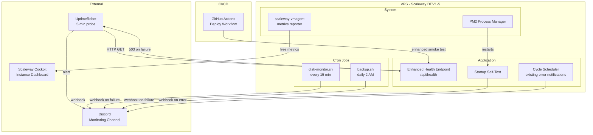
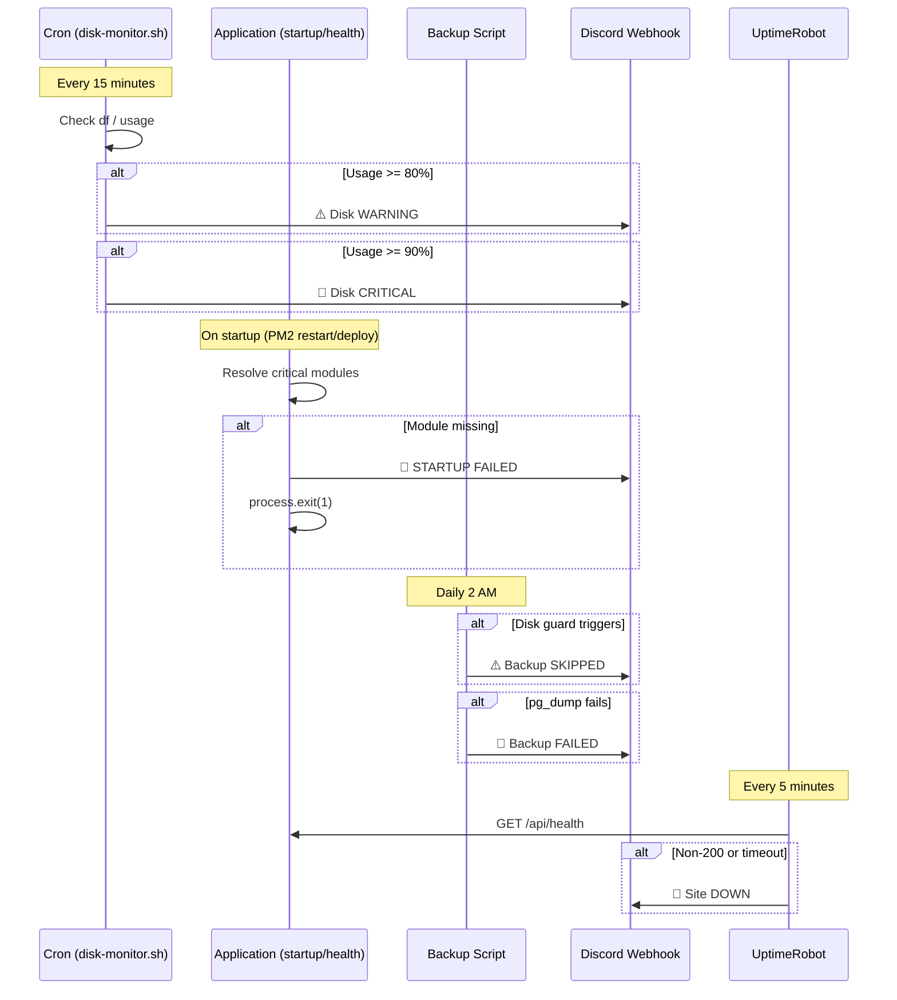

# Design Document: Monitoring and Alerting

## Overview

This spec adds a lightweight, self-hosted monitoring layer to Armoured Souls that detects infrastructure failures and resource exhaustion within minutes. The design prioritizes simplicity and zero ongoing cost — leveraging cron scripts, Discord webhooks, Scaleway's free Cockpit metrics, and a free-tier external uptime service.

### Design Goals

1. **Zero additional infrastructure**: No Prometheus, no Grafana self-hosted, no paid SaaS. Everything runs on the existing VPS or uses free external services.
2. **Fail-loud**: When something breaks, an alert fires immediately. The current system fails silently.
3. **Minimal resource footprint**: The DEV1-S has 2GB RAM and 20GB disk. Monitoring must not measurably impact application performance.
4. **Separation of concerns**: Monitoring alerts go to a dedicated Discord channel, not mixed with player-facing game notifications.
5. **Additive changes only**: Existing functionality (backup script, health endpoint, deploy pipeline) is extended, not rewritten.

### Key Design Decisions

| Decision | Choice | Rationale |
|---|---|---|
| Disk monitoring approach | Cron + bash script | Simpler than a Node.js service, runs independently of the application, survives app crashes. 15-minute interval is sufficient for disk growth patterns. |
| Alert delivery | Discord webhooks | Already proven in the codebase (DiscordIntegration class). Free, reliable, instant delivery. Team already monitors Discord. |
| External uptime | UptimeRobot free tier | 50 monitors, 5-minute intervals, Discord/email alerts. No code to write — just configuration. |
| Scaleway metrics | scaleway-vmagent | Free for Instance data. Provides memory/disk history in Cockpit with 31-day retention. Zero config beyond `apt install`. |
| Startup validation | Synchronous module resolution check | Catches the exact failure mode from Incident 1 (missing compiled modules). Fast (<1s), no external dependencies. |
| Health endpoint enhancement | Extend existing `/api/health` | Single probe target for UptimeRobot, deploy pipeline, and manual checks. No new routes needed. |
| Webhook separation | `MONITORING_DISCORD_WEBHOOK` env var | Keeps ops alerts out of the player notification channel. Falls back to game webhook if not configured. |

---

## Architecture

### System Context



### Alert Flow



---

## Components and Interfaces

### 1. Enhanced Health Endpoint (`app/backend/src/index.ts`)

Extends the existing `GET /api/health` handler with disk, memory, and module checks.

```typescript
interface HealthResponse {
  status: 'ok' | 'error';
  database: 'connected' | 'disconnected';
  disk: {
    usagePercent: number;    // 0–100
    availableMB: number;
    status: 'ok' | 'warning' | 'critical';
  };
  memory: {
    usedMB: number;
    totalMB: number;
    usagePercent: number;    // 0–100
  };
  modules: {
    status: 'ok' | 'degraded';
    missing: string[];       // empty when all OK
  };
  timestamp: string;         // ISO 8601
  environment: string;
}
```

**Implementation details:**

- Disk usage: Read via Node.js `child_process.execSync('df / --output=pcent,avail | tail -1')` — fast, no dependencies. On macOS (dev), use `df -k /` with different parsing.
- Memory: Read via `os.totalmem()` and `os.freemem()` from Node.js `os` module — zero cost.
- Module check: Attempt `require.resolve()` for each critical path. This only checks file existence, doesn't execute modules. Sub-millisecond.
- HTTP status: 200 if DB connected AND disk not critical. 503 otherwise.
- **Active alerting on disk threshold breach:** The endpoint maintains an in-memory cooldown tracker (`Map<severity, lastAlertTimestamp>`). When disk status is "warning" or "critical" and the cooldown for that severity has expired (15-minute window), it fires a Discord alert via `sendMonitoringAlert()` asynchronously (non-blocking — doesn't delay the response). This means UptimeRobot's 5-minute probes or any other caller will trigger an alert within at most 5 minutes of disk crossing a threshold, without spamming on every request.

**Critical modules list:**

```typescript
const CRITICAL_MODULES = [
  '../../utils/economyCalculations',
  '../services/cycle/cycleScheduler',
  '../services/notifications/notification-service',
  '../services/league/leagueBattleOrchestrator',
  '../services/economy/repairService',
  '../services/analytics/matchmakingService',
];
```

### 2. Startup Self-Test (`app/backend/src/utils/startupSelfTest.ts`)

A synchronous validation function called during application bootstrap.

```typescript
export interface SelfTestResult {
  passed: boolean;
  resolvedModules: string[];
  failedModules: { path: string; error: string }[];
}

/**
 * Validates that all critical compiled modules exist on disk.
 * Called before server.listen() — blocks startup if modules are missing.
 */
export async function runStartupSelfTest(): Promise<SelfTestResult>;
```

**Implementation details:**

- Uses `require.resolve()` with paths relative to the compiled `dist/` output.
- On failure: logs via Winston at CRITICAL level, sends Discord alert via direct `fetch()` call (not via the notification service, which might itself be the missing module), then calls `process.exit(1)`.
- On success: logs at INFO level, returns result for optional inspection.
- The function uses a direct `fetch()` to the webhook URL rather than importing the notification service — this avoids a circular dependency where the self-test needs to import the very modules it's testing.

**Integration point:** Called in `src/index.ts` after Express app creation, before `app.listen()`:

```typescript
import { runStartupSelfTest } from './utils/startupSelfTest';

// ... Express app setup ...

const selfTest = await runStartupSelfTest();
if (!selfTest.passed) {
  // Self-test handles logging and alerting internally, then exits
  process.exit(1);
}

// ... app.listen() ...
```

### 3. Disk Monitor Script (`app/scripts/disk-monitor.sh`)

Standalone bash script, scheduled via cron.

```bash
#!/usr/bin/env bash
# Checks root filesystem usage and alerts via Discord webhook.
# Cron: */15 * * * * /opt/armouredsouls/scripts/disk-monitor.sh

# Environment: MONITORING_DISCORD_WEBHOOK (required for alerts)
# Falls back to DISCORD_WEBHOOK_URL if monitoring webhook not set.
# Exits silently if disk usage < 80%.
```

**Alert format:**

- WARNING (80–89%): `⚠️ Disk usage WARNING: 83% used (3.2GB free) on as-acc-01`
- CRITICAL (90%+): `🚨 Disk usage CRITICAL: 92% used (1.6GB free) on as-acc-01`

**Design choice — no deduplication:** The script is stateless. If disk stays at 85% for hours, it sends a warning every 15 minutes. This is intentional — repeated alerts create urgency. The alternative (state file tracking "already alerted") adds complexity and failure modes for minimal benefit on a system where disk issues should be resolved quickly.

### 4. Backup Script Enhancement (`app/scripts/backup.sh`)

Adds Discord alerting to the existing backup script. Changes are additive — existing logic untouched.

```bash
# New function added to backup.sh:
send_alert() {
  local message="$1"
  local webhook="${MONITORING_DISCORD_WEBHOOK:-${DISCORD_WEBHOOK_URL:-}}"
  if [ -n "$webhook" ]; then
    curl -s -H "Content-Type: application/json" \
      -d "{\"content\": \"$message\"}" \
      "$webhook" > /dev/null 2>&1 || true
  fi
  log "$message"
}
```

**Integration points:**
- After disk guard skip: `send_alert "⚠️ Backup SKIPPED: Disk usage ${DISK_USAGE}% exceeds ${DISK_THRESHOLD}% threshold on $(hostname)"`
- After pg_dump failure: `send_alert "🚨 Backup FAILED: pg_dump returned error on $(hostname). Check backup logs."`

### 5. Monitoring Webhook Helper (`app/backend/src/utils/monitoringWebhook.ts`)

A minimal utility for sending monitoring alerts from within the Node.js application. Used by the startup self-test and potentially future monitoring code.

```typescript
/**
 * Sends a monitoring alert to the dedicated monitoring Discord webhook.
 * Falls back to DISCORD_WEBHOOK_URL if MONITORING_DISCORD_WEBHOOK is not set.
 * Never throws — monitoring failures must not crash the application.
 */
export async function sendMonitoringAlert(message: string): Promise<boolean>;
```

**Implementation:** Direct `fetch()` call with 5-second timeout. Returns `true` on success, `false` on failure. Logs failures but never throws.

### 6. Deploy Pipeline Enhancement (`.github/workflows/deploy.yml`)

The existing health check step is enhanced to validate the new health response fields, and new notification steps are added for deploy success/failure:

```yaml
- name: Enhanced health check (30s timeout)
  uses: appleboy/ssh-action@v1
  with:
    script: |
      TIMEOUT=30
      ELAPSED=0
      until curl -sf http://localhost:3001/api/health > /dev/null 2>&1; do
        if [ $ELAPSED -ge $TIMEOUT ]; then
          echo "Health check failed after ${TIMEOUT}s"
          exit 1
        fi
        sleep 2
        ELAPSED=$((ELAPSED + 2))
      done
      # Validate enhanced health response
      HEALTH=$(curl -s http://localhost:3001/api/health)
      DISK_STATUS=$(echo "$HEALTH" | jq -r '.disk.status')
      MODULE_STATUS=$(echo "$HEALTH" | jq -r '.modules.status')
      if [ "$DISK_STATUS" = "critical" ]; then
        echo "DEPLOY BLOCKED: Disk status is critical"
        exit 1
      fi
      if [ "$MODULE_STATUS" != "ok" ]; then
        echo "DEPLOY BLOCKED: Module check failed — $(echo "$HEALTH" | jq -r '.modules.missing')"
        exit 1
      fi
      echo "Enhanced health check passed (disk: $DISK_STATUS, modules: $MODULE_STATUS)"

- name: Notify deploy success
  if: success()
  run: |
    curl -s -H "Content-Type: application/json" \
      -d "{\"content\": \"✅ Deploy to ACC complete. Health check passed (disk: ok, modules: ok). Run: ${{ github.server_url }}/${{ github.repository }}/actions/runs/${{ github.run_id }}\"}" \
      "${{ secrets.MONITORING_DISCORD_WEBHOOK }}" || true

- name: Notify deploy failure
  if: failure()
  run: |
    curl -s -H "Content-Type: application/json" \
      -d "{\"content\": \"🚨 Deploy to ACC FAILED. Run: ${{ github.server_url }}/${{ github.repository }}/actions/runs/${{ github.run_id }}\"}" \
      "${{ secrets.MONITORING_DISCORD_WEBHOOK }}" || true
```

**Design notes:**
- The failure notification uses `if: failure()` which triggers when any preceding step in the job has failed.
- The success notification uses `if: success()` which only triggers when all preceding steps passed.
- Both use `|| true` to prevent the notification step itself from failing the workflow.
- The `MONITORING_DISCORD_WEBHOOK` is stored as a GitHub Actions environment secret (configured per environment: acceptance, production).
- The message includes the GitHub Actions run URL for one-click investigation.

### 7. Environment Configuration

New environment variables:

| Variable | Used By | Required | Default |
|---|---|---|---|
| `MONITORING_DISCORD_WEBHOOK` | disk-monitor.sh, backup.sh, startupSelfTest, monitoringWebhook, dailyHealthReport | No | Falls back to `DISCORD_WEBHOOK_URL` |
| `DAILY_REPORT_SCHEDULE` | dailyHealthReport cron | No | `0 8 * * *` (08:00 UTC daily) |

No new npm dependencies required. All implementations use Node.js built-ins (`os`, `child_process`, `fetch`), the existing `node-cron` package, and standard bash utilities (`df`, `curl`, `jq`).

### 8. Daily Health Report (`app/backend/src/services/monitoring/dailyHealthReport.ts`)

A scheduled job that posts a system health summary to the monitoring Discord channel once per day.

```typescript
/**
 * Initializes the daily health report cron job.
 * Called during application bootstrap (after scheduler init).
 */
export function initDailyHealthReport(): void;
```

**Implementation details:**

- Uses `node-cron` (already a dependency via the cycle scheduler) to schedule a daily job.
- Schedule defaults to `0 8 * * *` (08:00 UTC), configurable via `DAILY_REPORT_SCHEDULE` env var.
- On trigger, calls `getDiskUsage()`, `getMemoryUsage()`, `checkCriticalModules()` from `systemHealth.ts`, tests DB connectivity via `prisma.$queryRaw`, and reads the latest cycle metadata.
- Computes uptime from `process.uptime()`.
- Formats a Discord message with all metrics and sends via `sendMonitoringAlert()`.
- Runs independently of the cycle scheduler — no lock acquisition, no queue interaction. It's a lightweight read-only check.
- **Logging health check:** Calls `fs.statSync()` on the PM2 output log (`/var/log/armouredsouls/backend-out.log`) to get `mtime`. If `mtime` is older than 24 hours, reports logging as STALE. Also writes a test entry via `logger.info('[health-report] logging verification')` and confirms the write doesn't throw. In development (no PM2 log file), checks the Winston console transport is functional instead.
- If the webhook is not configured, logs the report at INFO level.

**Message format (healthy):**
```
✅ Daily Health Report — All systems operational

📊 System Status (08:00 UTC)
• Uptime: 3d 14h 22m
• Disk: 62% used (7.6 GB free) — OK
• Memory: 71% (1.42 GB / 2.00 GB) — OK
• Database: Connected
• Modules: All verified
• Logging: Active (last write 2m ago)
• Last cycle: settlement at 2026-05-03 23:00 UTC (cycle #164)
```

**Message format (degraded):**
```
⚠️ Daily Health Report — Degraded

📊 System Status (08:00 UTC)
• Uptime: 0d 2h 15m
• Disk: 84% used (3.2 GB free) — ⚠️ WARNING
• Memory: 71% (1.42 GB / 2.00 GB) — OK
• Database: Connected
• Modules: All verified
• Logging: ⚠️ STALE (last write 26h ago)
• Last cycle: league at 2026-05-03 20:00 UTC (cycle #164)
```

---

## Requirements Traceability

| Requirement | Design Component |
|---|---|
| R1 (Enhanced Health Endpoint) | Component 1 — Enhanced Health Endpoint |
| R2 (Startup Self-Test) | Component 2 — Startup Self-Test |
| R3 (Disk Usage Monitor) | Component 3 — Disk Monitor Script |
| R4 (Backup Failure Alerting) | Component 4 — Backup Script Enhancement |
| R5 (External Uptime Monitoring) | Component 6 (deploy pipeline) + documentation (UptimeRobot is config-only, no code) |
| R6 (Scaleway Cockpit Integration) | Documentation only — vmagent install is a one-time ops task |
| R7 (Post-Deploy Health Validation) | Component 6 — Deploy Pipeline Enhancement |
| R8 (Deploy Failure Discord Notification) | Component 6 — Deploy Pipeline Enhancement (success/failure notification steps) |
| R9 (Monitoring Webhook Config) | Component 5 — Monitoring Webhook Helper + Component 3 + Component 4 + Component 6 |
| R10 (Daily Health Report) | Component 8 — Daily Health Report |
| R11 (Monitoring Operations Guide) | Documentation task |

---

## Documentation Impact

### New Documentation

- `docs/guides/operations/MONITORING.md` — comprehensive monitoring operations guide (Requirement 9)

### Updated Documentation

- `docs/guides/operations/MAINTENANCE.md` — add reference to monitoring guide, update disk monitoring section
- `docs/guides/operations/DEPLOYMENT.md` — document enhanced health check in deploy pipeline
- `.kiro/steering/project-overview.md` — add Monitoring to Key Systems list
- `app/backend/.env.example` — add `MONITORING_DISCORD_WEBHOOK` variable
- `app/backend/.env.acc.example` — add `MONITORING_DISCORD_WEBHOOK` variable

### No Changes Needed

- `docs/guides/operations/VPS_SETUP.md` — vmagent installation is documented in the new MONITORING.md guide instead (VPS_SETUP covers initial provisioning, monitoring is ongoing operations)
- `.kiro/steering/coding-standards.md` — no new patterns introduced that need steering
