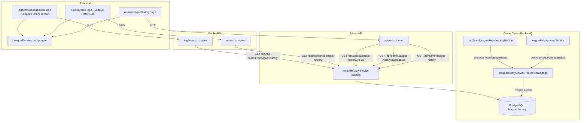

# Design Document: League History Tracking

## Overview

This feature adds persistent tracking of all league tier changes (promotions and demotions) for both robots and tag teams. The system records every tier change event during the rebalancing phase with full metadata, then exposes this data through admin and player-facing APIs and visualizations.

The design follows a single-table approach with an `entityType` discriminator column to store both robot and tag team history in one `LeagueHistory` model. Recording is non-blocking — failures are logged but never prevent the promotion/demotion from completing.

### Key Design Decisions

1. **Single table with discriminator** over separate `RobotLeagueHistory` / `TagTeamLeagueHistory` tables — simplifies queries that span both entity types (admin dashboard, yo-yo detection) and reduces schema surface area.
2. **Non-blocking recording** — the `recordTierChange` function wraps the Prisma create in try/catch, logs errors, and never re-throws. The rebalancing phase must never fail due to history tracking.
3. **Cycle number passed as parameter** — rather than querying `CycleMetadata` inside the recording function (which adds a DB round-trip per event), the caller passes the current cycle number since it's already available in the rebalancing context.
4. **Recharts for step charts** — already a dependency (`recharts@^3.8.0`), so no new library needed. The `StepChart` uses `type="stepAfter"` on a `LineChart` to show discrete tier transitions.
5. **Shared timeline component** — a single `LeagueTimeline` React component is used in both admin and player-facing contexts, with a `variant` prop controlling admin-specific features (entity selection).

## Architecture



## Components and Interfaces

### Backend Service: `leagueHistoryService.ts`

**Location:** `app/backend/src/services/league/leagueHistoryService.ts`

```typescript
// --- Types ---

export type EntityType = 'robot' | 'tag_team';
export type ChangeType = 'promotion' | 'demotion';

export interface RecordTierChangeParams {
  entityType: EntityType;
  entityId: number;
  userId: number;
  changeType: ChangeType;
  sourceTier: string;
  destinationTier: string;
  sourceLeagueId: string;
  destinationLeagueId: string;
  leaguePoints: number;
  cycleNumber: number;
}

export interface LeagueHistoryRecord {
  id: number;
  entityType: EntityType;
  entityId: number;
  userId: number;
  changeType: ChangeType;
  sourceTier: string;
  destinationTier: string;
  sourceLeagueId: string;
  destinationLeagueId: string;
  leaguePoints: number;
  cycleNumber: number;
  createdAt: Date;
}

export interface LeagueHistoryQueryParams {
  startCycle: number;
  endCycle: number;
  entityType?: EntityType;
  page?: number;
  perPage?: number;
}

export interface AggregateResult {
  tier: string;
  promotions: number;
  demotions: number;
}

export interface YoYoCandidate {
  entityType: EntityType;
  entityId: number;
  entityName: string;
  changeCount: number;
  tiersInvolved: string[];
}

export interface CtrlZResult {
  found: boolean;
  demotionCycle?: number;
  promotionCycle?: number;
}

// --- Service Functions ---

/** Record a tier change event. Non-blocking — logs errors, never throws. */
export async function recordTierChange(params: RecordTierChangeParams): Promise<void>;

/** Query tier changes within a cycle range, with pagination. */
export async function getHistoryByCycleRange(params: LeagueHistoryQueryParams): Promise<{
  data: LeagueHistoryRecord[];
  pagination: { page: number; perPage: number; total: number; totalPages: number };
}>;

/** Get complete history for a specific entity, ordered by cycle ascending. */
export async function getEntityHistory(entityType: EntityType, entityId: number): Promise<LeagueHistoryRecord[]>;

/** Get aggregate promotion/demotion counts grouped by tier for a cycle range. */
export async function getAggregates(startCycle: number, endCycle: number, entityType?: EntityType): Promise<AggregateResult[]>;

/** Identify yo-yo candidates: entities with 3+ tier changes within a cycle window. */
export async function detectYoYoCandidates(cycleWindow: number, minChanges?: number): Promise<YoYoCandidate[]>;

/** Check if a robot experienced a Ctrl+Z pattern (demoted then re-promoted to same tier within window). */
export async function checkCtrlZ(robotId: number, tierName: string, maxCycleWindow: number): Promise<CtrlZResult>;
```

### Integration Points in Rebalancing Services

**`leagueRebalancingService.ts` — `promoteRobot` function:**

After the `prisma.robot.update` call and before the achievement check, insert:

```typescript
try {
  await recordTierChange({
    entityType: 'robot',
    entityId: robot.id,
    userId: robot.userId,
    changeType: 'promotion',
    sourceTier: robot.currentLeague,
    destinationTier: nextTier,
    sourceLeagueId: robot.leagueId,
    destinationLeagueId: newLeagueId,
    leaguePoints: robot.leaguePoints,
    cycleNumber: await getCurrentCycleNumber(),
  });
} catch (error) {
  logger.error(`[Rebalancing] Failed to record promotion history for robot ${robot.id}: ${error}`);
}
```

**`leagueRebalancingService.ts` — `demoteRobot` function:**

After the `prisma.robot.update` call, insert the same pattern with `changeType: 'demotion'` and `destinationTier: previousTier`.

**`tagTeamLeagueRebalancingService.ts` — `promoteTeam` and `demoteTeam` functions:**

Same pattern, using `entityType: 'tag_team'`, `entityId: team.id`, `userId: team.stableId`, and the tag team's league fields.

**Cycle number retrieval:**

A helper `getCurrentCycleNumber()` reads from `CycleMetadata`:

```typescript
async function getCurrentCycleNumber(): Promise<number> {
  const meta = await prisma.cycleMetadata.findUnique({ where: { id: 1 } });
  return meta?.totalCycles ?? 0;
}
```

This is acceptable because it's a single-row lookup on a primary key (effectively free). The alternative of threading cycle number through function signatures would require changing the `promoteRobot`/`demoteRobot` signatures, which has a large blast radius.

### API Endpoints

#### Admin Endpoints (in `app/backend/src/routes/admin.ts`)

| Method | Path | Description | Auth |
|--------|------|-------------|------|
| GET | `/api/admin/league-history` | Paginated tier changes by cycle range | Admin |
| GET | `/api/admin/league-history/aggregates` | Promotion/demotion counts by tier | Admin |
| GET | `/api/admin/league-history/entity/:entityType/:entityId` | Full history for one entity | Admin |
| GET | `/api/admin/league-history/yo-yo` | Yo-yo detection candidates | Admin |

**Query parameters for `/api/admin/league-history`:**
- `startCycle` (required, positive int)
- `endCycle` (required, positive int, ≥ startCycle)
- `entityType` (optional: `robot` | `tag_team`)
- `page` (optional, default 1)
- `perPage` (optional, default 50, max 100)

**Query parameters for `/api/admin/league-history/aggregates`:**
- `startCycle` (required)
- `endCycle` (required)
- `entityType` (optional)

**Query parameters for `/api/admin/league-history/yo-yo`:**
- `cycleWindow` (optional, default 20)
- `minChanges` (optional, default 3)

#### Public Endpoints

| Method | Path | Description | Auth |
|--------|------|-------------|------|
| GET | `/api/robots/:id/league-history` | Robot's tier change history | Authenticated |
| GET | `/api/tag-teams/:id/league-history` | Tag team's tier change history | Authenticated |

Both return `{ data: LeagueHistoryRecord[] }` ordered by `cycleNumber` ascending.

### Frontend Components

#### `LeagueTimeline.tsx`

**Location:** `app/frontend/src/components/LeagueTimeline.tsx`

A shared step-chart component using Recharts `LineChart` with `type="stepAfter"`.

```typescript
interface LeagueTimelineProps {
  history: LeagueHistoryEntry[];
  currentTier: string;
  emptyMessage?: string;
}

interface LeagueHistoryEntry {
  cycleNumber: number;
  destinationTier: string;
  changeType: 'promotion' | 'demotion';
  leaguePoints: number;
}
```

**Rendering logic:**
- Y-axis: fixed domain of 6 tiers (bronze=1, silver=2, gold=3, platinum=4, diamond=5, champion=6) with custom tick formatter showing tier names
- X-axis: cycle numbers from history data
- Line: `type="stepAfter"` to show discrete tier transitions
- Data points: colored green (promotion) or red (demotion) using custom dot renderer
- Tooltip: shows tier name, LP, cycle number, and change type
- Empty state: renders a centered message when `history` is empty

#### `AdminLeagueHistoryPage.tsx`

**Location:** `app/frontend/src/pages/admin/LeagueHistoryPage.tsx`

Uses shared admin components (`AdminPageHeader`, `AdminStatCard`, `AdminDataTable`, `AdminFilterBar`).

**Sections:**
1. **Summary cards** — total promotions, total demotions for most recent cycle
2. **Filter bar** — cycle range inputs, entity type dropdown
3. **Per-tier breakdown** — grid of cards showing promotion/demotion counts per tier
4. **Events table** — paginated `AdminDataTable` with columns: Entity Name, Type, Change, From → To, LP, Cycle
5. **Timeline panel** — `AdminSlideOver` that opens when a row is clicked, showing `LeagueTimeline` for that entity
6. **Yo-yo candidates** — section at bottom showing entities with frequent oscillation

**Route registration:**
- Lazy import in `App.tsx`: `const AdminLeagueHistoryPage = React.lazy(() => import('./pages/admin/LeagueHistoryPage'));`
- Route: `<Route path="league-history" element={<AdminLeagueHistoryPage />} />`
- Nav entry in `AdminLayout.tsx` NAV_GROUPS under "Battle Data": `{ label: 'League History', path: '/admin/league-history', icon: '📈' }`
- PAGE_TITLES entry: `'/admin/league-history': 'League History'`

#### Robot Detail Page Integration

Add a new tab `league-history` to the existing tab navigation in `RobotDetailPage.tsx`. The tab content fetches from `GET /api/robots/:id/league-history` and renders the `LeagueTimeline` component.

#### Tag Team Page Integration

Add a "League History" expandable section to the tag team card in `TagTeamManagementPage.tsx`. When expanded, fetches from `GET /api/tag-teams/:id/league-history` and renders `LeagueTimeline`.

## Data Models

### Prisma Schema Addition

```prisma
model LeagueHistory {
  id                  Int      @id @default(autoincrement())
  entityType          String   @map("entity_type") @db.VarChar(20)    // "robot" or "tag_team"
  entityId            Int      @map("entity_id")                       // Robot ID or TagTeam ID
  userId              Int      @map("user_id")                         // Owner (user.id for robots, stableId for tag teams)
  changeType          String   @map("change_type") @db.VarChar(20)    // "promotion" or "demotion"
  sourceTier          String   @map("source_tier") @db.VarChar(20)    // e.g. "bronze"
  destinationTier     String   @map("destination_tier") @db.VarChar(20) // e.g. "silver"
  sourceLeagueId      String   @map("source_league_id") @db.VarChar(30) // e.g. "bronze_1"
  destinationLeagueId String   @map("destination_league_id") @db.VarChar(30) // e.g. "silver_2"
  leaguePoints        Int      @map("league_points")                   // LP at moment of change
  cycleNumber         Int      @map("cycle_number")                    // Game cycle when change occurred
  createdAt           DateTime @default(now()) @map("created_at")

  // Relations
  user User @relation(fields: [userId], references: [id], onDelete: Cascade)

  @@index([entityType, entityId])    // Per-entity queries
  @@index([cycleNumber])             // Cycle-range queries
  @@index([userId])                  // User's history queries
  @@map("league_history")
}
```

**Placement:** After the `AdminAuditLog` model in `schema.prisma`.

**User model update:** Add `leagueHistory LeagueHistory[]` to the User model's relations.

### Migration

A new Prisma migration creates the `league_history` table with the three indexes. No data migration needed — the table starts empty and populates as cycles run.

## Correctness Properties

*A property is a characteristic or behavior that should hold true across all valid executions of a system — essentially, a formal statement about what the system should do. Properties serve as the bridge between human-readable specifications and machine-verifiable correctness guarantees.*

### Property 1: Robot promotion recording completeness

*For any* robot in any non-champion tier with any league points value, when `promoteRobot` is called, the resulting `LeagueHistory` record SHALL have `entityType="robot"`, `changeType="promotion"`, `sourceTier` equal to the robot's tier before promotion, `destinationTier` equal to the next tier up, `leaguePoints` equal to the robot's LP at promotion time, and `cycleNumber` equal to the current cycle.

**Validates: Requirements 1.1, 1.2, 1.3, 2.1, 2.2, 2.3**

### Property 2: Robot demotion recording completeness

*For any* robot in any non-bronze tier with any league points value, when `demoteRobot` is called, the resulting `LeagueHistory` record SHALL have `entityType="robot"`, `changeType="demotion"`, `sourceTier` equal to the robot's tier before demotion, `destinationTier` equal to the next tier down, `leaguePoints` equal to the robot's LP at demotion time, and `cycleNumber` equal to the current cycle.

**Validates: Requirements 1.1, 1.2, 1.3, 3.1, 3.2, 3.3**

### Property 3: Tag team tier change recording completeness

*For any* tag team tier change (promotion or demotion), the resulting `LeagueHistory` record SHALL have `entityType="tag_team"`, the correct `changeType`, correct source/destination tiers, `leaguePoints` equal to the team's LP at change time, and `userId` equal to the tag team's `stableId`.

**Validates: Requirements 4.1, 4.2, 4.3, 4.4**

### Property 4: Non-blocking recording on failure

*For any* tier change (robot or tag team) where the `recordTierChange` function throws an error, the tier change operation SHALL still complete successfully — the entity's tier, leagueId, and cyclesInCurrentLeague are updated correctly despite the recording failure.

**Validates: Requirements 2.4, 3.4**

### Property 5: Cycle range query filtering

*For any* valid cycle range [startCycle, endCycle] and optional entity type filter, all records returned by `getHistoryByCycleRange` SHALL have `cycleNumber` within the inclusive range [startCycle, endCycle], and if an entity type filter is specified, all records SHALL match that entity type.

**Validates: Requirements 5.1**

### Property 6: Query result ordering

*For any* entity (robot or tag team) with multiple history records, `getEntityHistory` SHALL return records sorted by `cycleNumber` in strictly non-decreasing order.

**Validates: Requirements 5.2, 5.3, 8.5, 9.5**

### Property 7: Cycle range validation

*For any* pair of integers (startCycle, endCycle), the cycle range validation SHALL reject the request with a 400 error if and only if startCycle > endCycle.

**Validates: Requirements 5.5, 5.6**

### Property 8: Aggregate count correctness

*For any* set of league history records within a cycle range, the aggregate counts returned by `getAggregates` SHALL equal the actual count of records matching each (tier, changeType) combination in that range.

**Validates: Requirements 5.4**

### Property 9: Yo-yo detection correctness

*For any* set of league history records and configurable cycle window, `detectYoYoCandidates` SHALL return exactly those entities that have `minChanges` or more tier changes within any sliding window of `cycleWindow` cycles, and SHALL NOT include entities with fewer changes.

**Validates: Requirements 10.1**

### Property 10: Ctrl+Z detection correctness

*For any* robot's league history, `checkCtrlZ` SHALL return `{ found: true }` if and only if there exists a demotion from the specified tier followed by a promotion back to that same tier, where the cycle difference between the two events is less than or equal to `maxCycleWindow`.

**Validates: Requirements 11.1, 11.2, 11.3**

## Error Handling

| Scenario | Handling | User Impact |
|----------|----------|-------------|
| `recordTierChange` DB write fails | try/catch logs error via `logger.error`, does not re-throw | None — promotion/demotion completes normally |
| Admin query with invalid cycle range (start > end) | Zod validation rejects, returns 400 with message | Admin sees validation error in UI |
| Admin query with non-integer params | Zod `positiveIntParam` rejects, returns 400 | Admin sees validation error |
| Entity not found for history query | Returns empty array `{ data: [] }` | UI shows empty state message |
| Public endpoint for non-existent robot/tag team | Robot/tag team existence check first, returns 404 if not found | Player sees "not found" |
| Database connection failure during query | Express 5 auto-forwards to error middleware, returns 500 | Admin/player sees generic error |
| Yo-yo detection with very large cycle window | Query uses indexed `cycleNumber` column, bounded by pagination | Acceptable performance |

## Testing Strategy

### Property-Based Tests (fast-check)

The following properties are suitable for property-based testing and will use `fast-check` with minimum 100 iterations per property:

- **Properties 1–3** (recording completeness): Generate random robots/tag teams with random tiers and LP values, call the recording function, verify the created record matches expectations. Mock Prisma to capture the `create` call arguments.
- **Property 4** (non-blocking): Generate random tier changes, mock Prisma `create` to throw, verify the outer function still completes.
- **Properties 5–6** (filtering and ordering): Generate random sets of history records, insert them, query with random valid ranges, verify filtering and ordering invariants.
- **Property 7** (validation): Generate random integer pairs, verify validation accepts iff start ≤ end.
- **Property 8** (aggregates): Generate random history records, compute expected aggregates manually, compare with service output.
- **Property 9** (yo-yo detection): Generate random history sequences with known yo-yo patterns, verify detection finds exactly the right entities.
- **Property 10** (Ctrl+Z): Generate random history sequences with and without Ctrl+Z patterns, verify detection correctness.

**Configuration:**
- Library: `fast-check` (already in devDependencies for both backend and frontend)
- Minimum iterations: 100 per property
- Tag format: `Feature: league-history-tracking, Property {N}: {title}`

### Unit Tests (Jest)

- Service function behavior with specific examples (happy path, edge cases)
- Zod schema validation for all endpoint query/param schemas
- Empty state handling (no records for entity)
- Pagination boundary conditions (page beyond total, perPage=0)

### Integration Tests

- Full cycle: run a bulk cycle with promotions/demotions, verify `league_history` table has new rows
- Admin endpoint authorization (non-admin gets 403)
- Public endpoint accessibility (any authenticated user can query any robot's history)

### Frontend Tests (Vitest)

- `LeagueTimeline` renders correctly with mock data
- `LeagueTimeline` shows empty state when history is empty
- `AdminLeagueHistoryPage` renders all sections with mock API responses
- Filter interactions trigger correct API calls
- Pagination controls work correctly

## Documentation Impact

The following files need updating after implementation:

- **`.kiro/steering/project-overview.md`** — Add "League History Tracking" to the Key Systems list (under League System or as sub-item)
- **`docs/BACKLOG.md`** — Mark item #22 as "specced" with reference to spec #32
- **`app/backend/docs/audit-logging-schema.md`** — Add `league_history` table to the schema documentation
