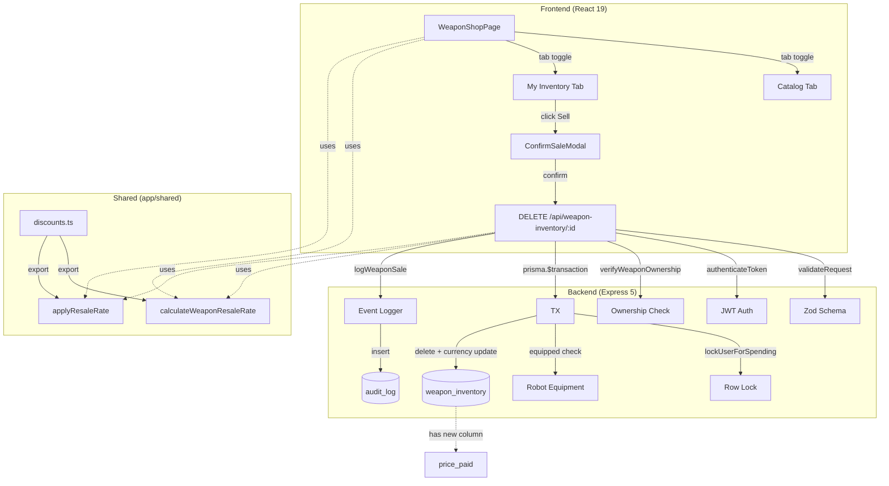

# Design Document: Weapon Resale

## Overview

This feature adds a server-authoritative weapon resale flow to Armoured Souls. Players can sell any owned weapon back to the system for a Workshop-level-dependent percentage of the credits they originally paid. The resale rate scales linearly at 10% per Workshop level — `level × 10`, capped at 100% at L10 — mirroring the existing Workshop purchase discount slope. This gives the Workshop facility a unified dual purpose: every level rewards the player 10% on both buying and selling.

Workshop L0 yields a 0% resale rate, meaning resale is gated behind purchasing Workshop L1 (₡75K). This makes L1 a meaningful unlock instead of a marginal upgrade, and gives new players a real strategic choice between their first weapon and their first Workshop level.

The implementation reuses the project's existing economic transaction infrastructure: `lockUserForSpending` for row-level locking, `verifyWeaponOwnership` for authorization, `eventLogger.logWeaponSale` (currently a stub), and the shared discount formula module in `app/shared/utils/discounts.ts`. The only schema change is a new `WeaponInventory.pricePaid` column, which is required to prevent a free-weapon arbitrage exploit at high Workshop levels.

The frontend gains a "My Inventory" tab on the existing `WeaponShopPage` with per-row Sell buttons and a confirmation modal. No new pages, routes, or navigation entries are introduced.

## Architecture



The system follows the existing layered architecture:

- **Routes** (`src/routes/weaponInventory.ts`): Adds a new `DELETE /:id` handler that mirrors the patterns in the existing `POST /purchase` handler — Zod validation, ownership verification, locked transaction, structured logging.
- **Shared formulas** (`app/shared/utils/discounts.ts`): The resale rate formula lives next to `calculateWeaponWorkshopDiscount` so the frontend can preview the sale price client-side before the user clicks Sell.
- **Event logging** (`src/services/common/eventLogger.ts`): The `logWeaponSale` method is already defined — we just call it.
- **Frontend** (`src/pages/WeaponShopPage.tsx` + `src/components/weapon-shop/`): A new tab and modal are added to the existing shop page; no new routes.

### Key Design Decisions

1. **`pricePaid` column instead of computed-from-catalog**: A `WeaponInventory.price_paid` Int column stores the actual credits the player paid at purchase time. Using this as the resale base prevents the Workshop L10 arbitrage loop (buy free → sell for 100% of catalog → infinite money). Existing rows are backfilled with the weapon's current catalog price during the migration as a best-effort approximation. New rows always store the discounted final cost. Starter weapons granted by `userGeneration.ts` store `pricePaid = 0`.

2. **DELETE method for the resale endpoint**: REST semantics align — the user is removing a resource from their inventory. The fact that they receive credits in the response body is a secondary effect. Using `DELETE /api/weapon-inventory/:id` keeps the route surface clean (no `/sell` action verb) and matches how the existing route file is organized.

3. **Resale formula in shared utils, not backend-only**: The frontend needs to preview the sale price before the player commits, including in the confirmation modal. Putting `calculateWeaponResaleRate` in `app/shared/utils/discounts.ts` next to `calculateWeaponWorkshopDiscount` ensures both sides use the exact same formula and matches the project standard ("Game formulas shared between frontend and backend must live in `app/shared/utils/`"). Both formulas use the same 10%/level slope so the codebase has one consistent shape for Workshop scaling.

4. **Equipped check inside the transaction**: Even though FK constraints prevent deletion of an equipped weapon (the Robot relation would block it), explicit checking lets us return a clean 409 with a useful message instead of a generic constraint violation. The check happens after the row lock is acquired to avoid a TOCTOU race where the weapon gets equipped between the check and the delete.

5. **No bulk resale**: Selling weapons one at a time is sufficient for the experimentation use case. Bulk operations introduce additional UX complexity (multi-select state, batch confirm modal, partial failure semantics) without solving a real problem players have right now.

6. **No undo / no resale receipt**: Once sold, the `WeaponInventory` row is deleted. There's no audit-log-based "undo within 5 minutes" feature. The confirmation modal makes the action explicit; reversibility complexity isn't worth the implementation cost. The `audit_log` row from `logWeaponSale` provides a forensic trail for support inquiries.

## Components and Interfaces

### Backend Components

#### 1. Prisma Schema Update: `WeaponInventory`

```prisma
model WeaponInventory {
  id         Int @id @default(autoincrement())
  userId     Int @map("user_id")
  weaponId   Int @map("weapon_id")
  customName String? @map("custom_name") @db.VarChar(100)
  pricePaid  Int @map("price_paid") // NEW — credits paid at purchase, used to compute resale value

  purchasedAt DateTime @default(now()) @map("purchased_at")

  user          User    @relation(fields: [userId], references: [id], onDelete: Cascade)
  weapon        Weapon  @relation(fields: [weaponId], references: [id])
  robotsMain    Robot[] @relation("MainWeapon")
  robotsOffhand Robot[] @relation("OffhandWeapon")

  @@index([userId])
  @@index([weaponId])
  @@map("weapon_inventory")
}
```

The migration is three-phase:
1. Add `price_paid INTEGER NULL` column.
2. `UPDATE weapon_inventory wi SET price_paid = w.cost FROM weapons w WHERE wi.weapon_id = w.id` (backfill with current catalog price).
3. `ALTER COLUMN price_paid SET NOT NULL`.

This avoids any window where the column constraint is violated.

#### 2. Shared Formula: `calculateWeaponResaleRate`

```typescript
// app/shared/utils/discounts.ts (additions)

/**
 * Calculate weapon resale rate based on Weapon Workshop level.
 * Formula: level × 10, clamped to [0, 100].
 *
 * Mirrors the Workshop purchase discount slope (10% per level).
 * "Workshop level rewards you 10% on both ends of every transaction."
 *
 * Level 0:  0% (resale gated behind Workshop L1)
 * Level 1:  10%
 * Level 3:  30% (top of new-player accessible range — first prestige gate is at L4)
 * Level 5:  50%
 * Level 10: 100% (full credit recovery; exploit-safe via pricePaid anchor)
 */
export function calculateWeaponResaleRate(level: number): number {
  const clampedLevel = Math.max(0, Math.min(10, level));
  return clampedLevel * 10;
}

/**
 * Apply resale rate to a price.
 * Floor-rounded to keep values integer-cents-equivalent.
 */
export function applyResaleRate(pricePaid: number, ratePercent: number): number {
  return Math.floor(pricePaid * ratePercent / 100);
}
```

Both functions are pure, exported from `app/shared/utils/index.ts`, and consumed by the backend route and frontend components.

#### 3. Route Handler: `DELETE /api/weapon-inventory/:id`

```typescript
// src/routes/weaponInventory.ts (additions)

// Per-user rate limiter — destructive endpoint, see security playbook
const resaleRateLimiter = rateLimit({
  windowMs: 5 * 60 * 1000,
  max: 30,
  keyGenerator: (req: AuthRequest) => `resale:${req.user!.userId}`,
  handler: (req, res) => {
    securityMonitor.trackRateLimitViolation(
      (req as AuthRequest).user!.userId,
      'weapon_resale',
      { sourceIp: req.ip || undefined, endpoint: req.originalUrl }
    );
    res.status(429).json({ error: 'Too many resale attempts. Please try again later.' });
  },
});

router.delete(
  '/:id',
  authenticateToken,
  resaleRateLimiter, // After authenticateToken so req.user is populated
  validateRequest({ params: inventoryIdParamsSchema }),
  async (req: AuthRequest, res: Response) => {
    const userId = req.user!.userId;
    const inventoryId = parseInt(String(req.params.id));

    await verifyWeaponOwnership(prisma, inventoryId, userId);

    const result = await prisma.$transaction(async (tx) => {
      // 1. Lock user row first (consistent with all credit-affecting endpoints)
      const lockedUser = await lockUserForSpending(tx, userId);

      // 2. Lock the WeaponInventory row second.
      //    Serializes resale-vs-resale and resale-vs-equip on the same weapon.
      //    Equip handler acquires the same lock (see Task 6.5 below).
      const lockedRows = await tx.$queryRaw<{
        id: number;
        userId: number;
        weaponId: number;
        pricePaid: number;
      }[]>`
        SELECT id, user_id as "userId", weapon_id as "weaponId", price_paid as "pricePaid"
        FROM weapon_inventory WHERE id = ${inventoryId} FOR UPDATE
      `;
      if (lockedRows.length === 0) {
        throw new EconomyError(EconomyErrorCode.WEAPON_NOT_FOUND, 'Weapon not found', 404);
      }
      const weaponInv = lockedRows[0];

      // 3. Re-verify ownership inside the transaction (TOCTOU)
      if (weaponInv.userId !== userId) {
        securityMonitor.logAuthorizationFailure(userId, 'weapon', inventoryId);
        throw new AppError('FORBIDDEN', 'Access denied', 403);
      }

      // 4. Defensive bounds check
      if (weaponInv.pricePaid < 0) {
        logger.error(`[Weapon] Invariant violation: negative pricePaid on inventory ${inventoryId}`);
        throw new EconomyError(EconomyErrorCode.INVALID_TRANSACTION, 'Invalid weapon state', 500);
      }

      // 5. Equipped check under both locks
      const equippedOn = await tx.robot.findFirst({
        where: {
          userId,
          OR: [{ mainWeaponId: inventoryId }, { offhandWeaponId: inventoryId }],
        },
        select: { id: true, name: true },
      });
      if (equippedOn) {
        throw new EconomyError(
          EconomyErrorCode.WEAPON_EQUIPPED,
          `Weapon is equipped on ${equippedOn.name}. Unequip before selling.`,
          409,
          { robotId: equippedOn.id, robotName: equippedOn.name }
        );
      }

      // 6. Workshop level + weapon details for response
      const [workshop, weaponMeta] = await Promise.all([
        tx.facility.findUnique({
          where: { userId_facilityType: { userId, facilityType: 'weapons_workshop' } },
          select: { level: true },
        }),
        tx.weapon.findUnique({
          where: { id: weaponInv.weaponId },
          select: { id: true, name: true },
        }),
      ]);
      const workshopLevel = workshop?.level || 0;

      const resaleRate = calculateWeaponResaleRate(workshopLevel);
      const salePrice = applyResaleRate(weaponInv.pricePaid, resaleRate);

      const updatedUser = await tx.user.update({
        where: { id: userId },
        data: { currency: { increment: salePrice } },
      });

      await tx.weaponInventory.delete({ where: { id: inventoryId } });

      return {
        user: updatedUser,
        weaponName: weaponMeta?.name ?? 'Weapon',
        weaponId: weaponInv.weaponId,
        salePrice,
        workshopLevel,
        resaleRate,
        previousBalance: lockedUser.currency,
        pricePaid: weaponInv.pricePaid, // for the achievement event payload
      };
    });

    // Non-blocking audit log + structured log (does NOT call securityMonitor.trackSpending —
    // resale is income, not spending; audit_log is the tracking surface).
    try {
      const cycleMetadata = await prisma.cycleMetadata.findUnique({ where: { id: 1 } });
      const currentCycle = (cycleMetadata?.totalCycles || 0) + 1;
      await eventLogger.logWeaponSale(currentCycle, userId, result.weaponId, result.salePrice);

      logger.info(
        `[Weapon] User ${userId} | Sold: ${result.weaponName} | ` +
        `Price: ₡${result.salePrice.toLocaleString()} | ` +
        `Workshop L${result.workshopLevel} (${result.resaleRate}% rate) | ` +
        `Balance: ₡${result.previousBalance.toLocaleString()} → ₡${result.user.currency.toLocaleString()}`
      );
    } catch (logError) {
      logger.error('Failed to log weapon sale event:', logError);
    }

    // Achievement check (see Achievements section for full details).
    const achievementUnlocks = await (async (): Promise<UnlockedAchievement[]> => {
      try {
        return await achievementService.checkAndAward(userId, null, {
          type: 'weapon_sold',
          data: {
            weaponId: result.weaponId,
            salePrice: result.salePrice,
            pricePaid: result.pricePaid,
            workshopLevel: result.workshopLevel,
          },
        });
      } catch { return []; }
    })();

    res.json({
      salePrice: result.salePrice,
      currency: result.user.currency,
      weaponName: result.weaponName,
      message: `Sold ${result.weaponName} for ₡${result.salePrice.toLocaleString()}`,
      achievementUnlocks,
    });
  }
);
```

The handler structure mirrors the existing `POST /purchase` handler — same patterns, same imports, same logging conventions — with three key additions: a per-user rate limiter, an explicit `SELECT ... FOR UPDATE` lock on the `weapon_inventory` row, and a post-commit achievement check.

#### 4. Error Code Addition

`EconomyErrorCode.WEAPON_EQUIPPED` is added to the existing economy error enum (likely `app/backend/src/errors/economy.ts` — exact path resolved during implementation). The error code returns HTTP 409 (conflict — the resource is in a state that conflicts with the requested operation).

#### 5. Update to Existing Purchase Handler

The existing `POST /api/weapon-inventory/purchase` handler is updated to write `pricePaid: finalCost` into the new `WeaponInventory` row:

```typescript
const weaponInventory = await tx.weaponInventory.create({
  data: { userId, weaponId: weaponIdNum, pricePaid: finalCost }, // NEW: pricePaid
  include: { weapon: true },
});
```

#### 6. Update to userGeneration.ts

Starter weapons granted to new users in `app/backend/src/utils/userGeneration.ts` get `pricePaid: 0`:

```typescript
const mainInv = await tx.weaponInventory.create({
  data: { userId: user.id, weaponId: mainWeaponRecord.id, pricePaid: 0 },
});
```

### Frontend Components

#### 1. `WeaponShopPage` Tab Container

`app/frontend/src/pages/WeaponShopPage.tsx` is updated to render a tab bar above its existing content. The catalog view is the default tab. The "My Inventory" tab is the new view. Tab state is bound to a URL query param (`?tab=inventory`).

```tsx
const [searchParams, setSearchParams] = useSearchParams();
const activeTab = searchParams.get('tab') === 'inventory' ? 'inventory' : 'catalog';

// In render
<TabBar value={activeTab} onChange={(t) => setSearchParams({ tab: t })}>
  <Tab id="catalog">Catalog</Tab>
  <Tab id="inventory">My Inventory ({inventoryCount})</Tab>
</TabBar>

{activeTab === 'catalog' ? <ExistingCatalogView ... /> : <InventoryTab ... />}
```

The catalog view is unchanged — wrap it in a tab panel without modifying its internals.

#### 2. New Component: `InventoryTab`

`app/frontend/src/components/weapon-shop/InventoryTab.tsx`:

```tsx
interface InventoryTabProps {
  inventory: WeaponInventoryItem[];
  workshopLevel: number;
  onSellComplete: () => void; // refresh callback
}

export function InventoryTab({ inventory, workshopLevel, onSellComplete }: InventoryTabProps) {
  const [pendingSale, setPendingSale] = useState<WeaponInventoryItem | null>(null);
  const resaleRate = calculateWeaponResaleRate(workshopLevel);

  // Partition inventory: equipped vs available
  const { available, equipped } = useMemo(() => partitionInventory(inventory), [inventory]);

  // Summary bar values
  const totalResaleValue = available.reduce(
    (sum, item) => sum + applyResaleRate(item.pricePaid, resaleRate),
    0
  );

  return (
    <>
      <InventorySummaryBar
        totalCount={inventory.length}
        availableCount={available.length}
        totalResaleValue={totalResaleValue}
        workshopLevel={workshopLevel}
        resaleRate={resaleRate}
      />

      <section>
        <h3>Available to Sell ({available.length})</h3>
        {available.length === 0 ? (
          <EmptyState>
            No unequipped weapons. Visit a robot to unequip a weapon before selling.
          </EmptyState>
        ) : (
          <div className="grid gap-4">
            {available.map(item => (
              <InventoryRow
                key={item.id}
                item={item}
                resaleRate={resaleRate}
                variant="available"
                onClickSell={() => setPendingSale(item)}
              />
            ))}
          </div>
        )}
      </section>

      {equipped.length > 0 && (
        <section className="mt-8 opacity-75">
          <h3>Equipped ({equipped.length})</h3>
          <div className="grid gap-4">
            {equipped.map(item => (
              <InventoryRow
                key={item.id}
                item={item}
                resaleRate={resaleRate}
                variant="equipped"
                onClickSell={() => {/* disabled */}}
              />
            ))}
          </div>
        </section>
      )}

      {pendingSale && (
        <ConfirmSaleModal
          item={pendingSale}
          workshopLevel={workshopLevel}
          resaleRate={resaleRate}
          onCancel={() => setPendingSale(null)}
          onConfirmed={() => {
            setPendingSale(null);
            onSellComplete();
          }}
        />
      )}
    </>
  );
}

// Helper to split inventory into equipped vs available based on robotsMain/robotsOffhand
function partitionInventory(inventory: WeaponInventoryItem[]) {
  const available: WeaponInventoryItem[] = [];
  const equipped: WeaponInventoryItem[] = [];
  for (const item of inventory) {
    const isEquipped = (item.robotsMain?.length ?? 0) > 0 || (item.robotsOffhand?.length ?? 0) > 0;
    (isEquipped ? equipped : available).push(item);
  }
  return { available, equipped };
}
```

The `GET /api/weapon-inventory` endpoint already returns `robotsMain` and `robotsOffhand` arrays with `{ id, name }` selections, so all data needed for the equipped-status display is already available — no API change required.

#### 3. New Component: `InventoryRow`

`app/frontend/src/components/weapon-shop/InventoryRow.tsx`:

```tsx
interface InventoryRowProps {
  item: WeaponInventoryItem;
  resaleRate: number;
  variant: 'available' | 'equipped';
  onClickSell: () => void;
}
```

Two visual variants driven by the `variant` prop.

**`variant="available"`**: Renders weapon name, type badge, original cost (`weapon.cost`), price paid (`pricePaid`), computed sale price (live-calculated from `applyResaleRate(pricePaid, resaleRate)`), and an enabled Sell button.

**`variant="equipped"`**: Renders weapon name, type badge, an "Equipped" badge with the robot name(s) and slot ("Main" / "Offhand"), and a disabled Sell button. The disabled button shows a tooltip listing every robot the player must unequip from. The robot name is rendered as a link to the robot detail page (`/robots/:id`) so the player can navigate directly to unequip. Visual de-emphasis (e.g., reduced opacity, lock icon) makes the section visually distinct from the actionable Available section.

Equipped detection logic: an item is equipped if `(item.robotsMain?.length ?? 0) > 0 || (item.robotsOffhand?.length ?? 0) > 0`. Robot names come from the existing API response (`robotsMain: [{ id, name }]`, `robotsOffhand: [{ id, name }]`).

#### 4. New Component: `InventorySummaryBar`

`app/frontend/src/components/weapon-shop/InventorySummaryBar.tsx`:

```tsx
interface InventorySummaryBarProps {
  totalCount: number;
  availableCount: number;
  totalResaleValue: number;
  workshopLevel: number;
  resaleRate: number;
}
```

Renders a horizontal bar at the top of the My Inventory tab showing three quick-glance stats: total inventory count, sellable count, and total credit value if everything available were sold at the current Workshop rate. Also includes a small explainer pill: "Workshop L{level} — {rate}% resale". Updates live (via prop changes from parent) when the underlying inventory or Workshop level changes.

#### 5. New Component: `ConfirmSaleModal`

`app/frontend/src/components/weapon-shop/ConfirmSaleModal.tsx`:

```tsx
interface ConfirmSaleModalProps {
  item: WeaponInventoryItem;
  workshopLevel: number;
  resaleRate: number;
  onCancel: () => void;
  onConfirmed: () => void;
}
```

Shows weapon name, attribute summary, sale price, the formula breakdown (`pricePaid × resaleRate`), Workshop level + rate, and a clear warning that the action is permanent. Two buttons: Cancel (closes) and Confirm Sale (calls `apiClient.delete('/api/weapon-inventory/:id')`, then `onConfirmed()`).

On API error, the modal displays the error message and stays open so the player can retry or cancel — particularly relevant for the 409 "weapon equipped" case (which shouldn't happen since the button is disabled, but covers the race-condition edge where the player equips it in another tab).

#### 6. Update to `useWeaponShop` Hook

The existing `useWeaponShop` hook (or its underlying state) needs to expose:
- The weapon inventory list (with `pricePaid` field)
- A refresh function for use after a successful sale
- The current Workshop level (already needed for purchase discount calculation)

Most of these are already there — this is mostly type updates plus a refresh callback exposure.

## Data Models

### `WeaponInventory` (Updated)

| Column | Type | Nullable | Notes |
|--------|------|----------|-------|
| id | SERIAL | No | PK |
| user_id | INT | No | FK → users.id, ON DELETE CASCADE |
| weapon_id | INT | No | FK → weapons.id |
| custom_name | VARCHAR(100) | Yes | Unchanged |
| **price_paid** | INT | No | **NEW** — credits paid at purchase time |
| purchased_at | TIMESTAMP | No | Default now() |

Migration name: `20260518_add_weapon_inventory_price_paid` (date-prefixed to match Prisma convention).

### `audit_log` (No Schema Change)

The `logWeaponSale` method writes a row with:
- `event_type = 'weapon_sale'`
- `payload = { weaponId, salePrice }`
- `user_id` set to the seller

The schema is unchanged — `eventLogger.logWeaponSale` is already a stub method on the existing service.

## Error Handling

### New Error: `EconomyErrorCode.WEAPON_EQUIPPED`

Thrown when the player attempts to sell a weapon currently equipped on one of their robots.

- HTTP status: 409
- Message: `Weapon is equipped on {robotName}. Unequip before selling.`
- Details: `{ robotId, robotName }`
- Frontend handling: The Sell button is normally disabled for equipped weapons, but in case of a race (player equips in another tab between page load and click), the modal displays the error and stays open.

### Reused Errors

- `EconomyErrorCode.WEAPON_NOT_FOUND` (404) — inventory ID does not exist or has been deleted in a concurrent sale.
- `AppError.FORBIDDEN` (403) — `verifyWeaponOwnership` throws when the inventory item belongs to a different user.
- `AuthError.USER_NOT_FOUND` (404) — should not happen given the auth middleware, but kept as a defensive guard via `lockUserForSpending`.

## Testing Strategy

### Unit Tests (`app/shared/utils/__tests__/discounts.test.ts`)

- `calculateWeaponResaleRate` at boundary levels (0, 5, 10) and out-of-range inputs (-1, 11, 100)
- `applyResaleRate` with integer and floating-point rate inputs
- Property-based test: for any non-negative integer `pricePaid` and any rate in [40, 75], `applyResaleRate(pricePaid, rate)` is between 0 and `pricePaid`

### Backend Integration Tests (`app/backend/tests/weaponInventory.test.ts`)

The existing test file is extended with a `DELETE /api/weapon-inventory/:id` describe block. Test cases listed in R4.1.

A separate test verifies the migration backfill: insert weapon inventory rows with `pricePaid = NULL` (simulating pre-migration state) — this is implicitly covered by the migration script itself, but a smoke test confirming `SELECT COUNT(*) FROM weapon_inventory WHERE price_paid IS NULL` returns 0 after migration is added to the verification step.

### Frontend Tests (`app/frontend/src/pages/__tests__/`)

- `WeaponShopPage.inventory.test.tsx` (new file): tab rendering, tab persistence in URL, inventory list rendering
- `WeaponShopPage.sell.test.tsx` (new file): Sell button enabled/disabled states, modal open/close, confirm calls API, success refreshes inventory, error keeps modal open

### Manual Verification

1. Log in as a test user with a non-zero Workshop level and at least one unequipped weapon
2. Navigate to `/weapons?tab=inventory`
3. Click Sell on a weapon — confirm modal shows correct price
4. Confirm sale — verify currency increase matches formula, weapon is gone from inventory, audit log row exists

## Documentation Impact

### Files to Update

| File | Update |
|------|--------|
| `docs/game-systems/PRD_WEAPON_ECONOMY.md` | Add "Weapon Resale" section |
| `docs/architecture/PRD_FACILITIES_PAGE.md` | Note Workshop dual purpose (purchase discount + resale rate) |
| `app/backend/docs/audit-logging-schema.md` | Document `weapon_sale` event payload |
| `docs/BACKLOG.md` | Move "Weapon resale" from #5 future direction to Recently Completed table |

### New Documentation

A changelog entry is created via the admin changelog system (Spec #24). The entry uses category "Feature" and contains:

- **Title**: "Sell weapons back to the workshop"
- **Body**: Plain-language formula explanation, three example resale values at L0/L5/L10, equipped-weapon caveat, link to the My Inventory tab
- **Image**: Optional screenshot of the My Inventory tab (created during manual verification)

### Steering File Impact

No steering files need updates. The existing `coding-standards.md` already covers the patterns used (lockUserForSpending, ownership middleware, Zod validation, shared formula location). The `project-overview.md` already lists the Cycle/Audit Logging system, so no new key system entry is needed.

## Performance Considerations

The resale endpoint adds at most 3 new database operations per call (one row lock, one weapon inventory lookup, one robot equipped-check, one user update, one delete) inside a transaction. The throughput of this endpoint is naturally bounded by individual player decision-making — no batch or scheduled load. No caching needed.

The migration backfills `price_paid` for existing rows in a single SQL statement (`UPDATE ... FROM`). On a production database with thousands of weapon inventory rows, this completes in milliseconds. No staged rollout required.

The frontend inventory tab fetches the existing `/api/weapon-inventory` endpoint (no change). The new tab renders the same data — only adds the Sell button and modal logic.

## Security Considerations

This is a credit-affecting endpoint. The following protections must all be in place before merging.

### Authentication and Authorization

- **JWT auth**: `authenticateToken` runs before any handler logic. No anonymous access.
- **Ownership**: `verifyWeaponOwnership(prisma, inventoryId, userId)` runs before the transaction. On failure, `securityMonitor.logAuthorizationFailure` is called and the request returns a generic `403 Access denied` with no information about whether the resource exists.
- **Generic errors**: 404 ("Weapon not found") is returned for both "doesn't exist" and "deleted between ownership check and transaction." This prevents enumeration of inventory IDs across users.

### Input Validation

- **Zod**: The `:id` URL parameter is validated by the existing `inventoryIdParamsSchema` using `positiveIntParam` from `src/utils/securityValidation.ts`. Rejects non-numeric, zero, negative, and overflow values.
- **No body**: The DELETE endpoint takes no request body, eliminating mass-assignment and JSON-injection surfaces.
- **Defensive `pricePaid` guard inside the transaction**: After fetching the weapon inventory row, the handler asserts `weaponInv.pricePaid >= 0` and throws an internal error if not. This guards against malformed migration backfills, manual SQL tampering, or future code paths that could write a negative value. The schema NOT NULL constraint plus this runtime guard are the two layers.

### Race Conditions and Transaction Integrity

The resale flow has three concurrent actors that must be serialized correctly:

1. **Resale ↔ Resale (same weapon)**: Two simultaneous DELETE requests on the same inventory ID.
2. **Resale ↔ Equip (same weapon)**: A resale request and an equip request on the same weapon.
3. **Resale ↔ Purchase / Repair / Other spending (same user)**: Currency-affecting concurrency on the user's balance.

The protection strategy uses two row locks acquired in a deterministic order to prevent deadlocks:

```typescript
await prisma.$transaction(async (tx) => {
  // 1. Lock the user row first (consistent with all other credit-affecting endpoints)
  const lockedUser = await lockUserForSpending(tx, userId);

  // 2. Lock the WeaponInventory row second.
  //    SELECT ... FOR UPDATE on weapon_inventory by id.
  //    This serializes against any other transaction trying to read this row
  //    with the same lock, including the equip handler (see below for that change).
  const lockedInventoryRows = await tx.$queryRaw<{ id: number; userId: number; weaponId: number; pricePaid: number }[]>`
    SELECT id, user_id as "userId", weapon_id as "weaponId", price_paid as "pricePaid"
    FROM weapon_inventory WHERE id = ${inventoryId} FOR UPDATE
  `;
  if (lockedInventoryRows.length === 0) {
    throw new EconomyError(EconomyErrorCode.WEAPON_NOT_FOUND, 'Weapon not found', 404);
  }
  const weaponInv = lockedInventoryRows[0];

  // 3. Re-verify ownership inside the transaction (TOCTOU)
  if (weaponInv.userId !== userId) {
    throw new AppError('FORBIDDEN', 'Access denied', 403);
  }

  // 4. Defensive bounds check on pricePaid
  if (weaponInv.pricePaid < 0) {
    logger.error(`[Weapon] Invariant violation: negative pricePaid on inventory ${inventoryId}`);
    throw new EconomyError(EconomyErrorCode.INVALID_TRANSACTION, 'Invalid weapon state', 500);
  }

  // 5. Equipped check — under both locks held
  const equippedOn = await tx.robot.findFirst({
    where: {
      userId,
      OR: [{ mainWeaponId: inventoryId }, { offhandWeaponId: inventoryId }],
    },
    select: { id: true, name: true },
  });
  if (equippedOn) {
    throw new EconomyError(EconomyErrorCode.WEAPON_EQUIPPED, ..., 409, ...);
  }

  // 6. Compute and apply (Workshop level lookup, currency increment, row delete)
  ...
});
```

**Required change to the equip handler (`src/services/robot/robotWeaponService.ts`)**: The existing `equipMainWeapon` and `equipOffhandWeapon` functions in `robotWeaponService.ts` open a `prisma.$transaction` but do NOT acquire `lockUserForSpending` or any lock on the `WeaponInventory` row. To prevent the resale-vs-equip race, both equip functions MUST be updated to acquire a `SELECT ... FOR UPDATE` lock on the target `weapon_inventory` row before reading or updating the robot. Lock acquisition order: user row first (if needed), then weapon_inventory row, matching the resale handler's order to prevent deadlocks. This change is in scope for this spec since the equipped-check correctness depends on it.

**Why both locks are needed:**
- The user lock alone is not enough — equip mutates `Robot`, not `User`, so equip would not block on the user lock.
- The `WeaponInventory` lock alone is not enough — multiple resales of the same user's different weapons could double-spend currency without the user lock (the existing project standard for all credit-affecting endpoints).

**FK constraint is NOT a defense-in-depth backup**: `Robot.main_weapon_id` and `offhand_weapon_id` use `ON DELETE SET NULL`, not `RESTRICT`. If the equipped-check fails to detect a concurrently-equipped weapon and the resale proceeds, the robot's weapon slot is silently nulled and no error is raised. This makes the equipped-check the sole authoritative guard, which is why the locking strategy above is mandatory.

### Rate Limiting

Per `coding-standards.md`, destructive endpoints require dedicated per-user rate limiters beyond the general API limiter. Resale meets this criterion (it deletes a resource and emits credits).

- **Per-user resale limiter**: 30 requests per 5 minutes per user, keyed by `req.user.userId`. This permits realistic experimentation (e.g., trying out 5–10 different weapons in a session) while preventing abuse loops (e.g., a script reselling 1000 times to flood audit logs).
- **Middleware order**: `authenticateToken` first (so `req.user` is populated), then the limiter, then the handler. Same pattern used by account reset (3/hr) and admin password reset (10/15min).
- **Violation tracking**: The limiter calls `securityMonitor.trackRateLimitViolation()` so attempts appear in the admin Security dashboard.
- **Why not the global 300/min limit alone**: A determined attacker could still issue 300 resales/min, bloating audit_log and stressing the DB. The per-user limit caps this.

### Audit Logging

- Every successful resale writes one row to `audit_log` via `eventLogger.logWeaponSale(currentCycle, userId, weaponId, salePrice)` (the existing stub method).
- Failed resales (any non-200 response) do NOT write audit rows. The `try { ... } catch { logger.error(...) }` block around the audit write only catches downstream logging failures, not transaction failures.
- The `audit_log` row is the forensic record: `event_type = 'weapon_sale'`, `user_id`, `payload.weaponId`, `payload.salePrice`. Anomalies (e.g., sudden spike in resales for a user, salePrice exceeding expected range) are detectable via existing admin analytics queries.
- A structured `logger.info` line is emitted with the same data plus Workshop level and balance delta. This goes to the application log, not the database.

### Spending / Earning Tracking

- The purchase handler calls `securityMonitor.trackSpending(userId, finalCost, ...)` because purchase is a debit. Resale is a credit, so it must NOT call `trackSpending` — that would skew the spending-anomaly detection. The audit_log entry is the resale's tracking surface.
- If unusual resale patterns need tracking in the future (e.g., "earned >₡10M from resale in 5 minutes"), a new `securityMonitor.trackEarning` method can be added. Out of scope for this spec.

### Frontend Defense-in-Depth

- The "Equipped" section in the My Inventory tab disables the Sell button at render time using the API response's `robotsMain` / `robotsOffhand` arrays. This is UX guidance, NOT security — the backend's equipped-check is the only authoritative control.
- The confirmation modal handles the 409 `WEAPON_EQUIPPED` error gracefully (displays the message, keeps modal open) for the case where the player equipped the weapon in another tab between page load and Sell click.
- The frontend never trusts user-provided `pricePaid` or `salePrice` values — the modal displays the locally-computed preview, but the backend computes the canonical values during the transaction and returns them in the response.

### Threat Model Summary

| Threat | Mitigation |
|--------|-----------|
| Sell another user's weapon | `verifyWeaponOwnership` + intra-transaction re-check |
| Resource enumeration via 403/404 differentiation | Generic "Access denied" / "Weapon not found" |
| Concurrent resale of same weapon (double-credit) | `WeaponInventory` row lock + user row lock |
| Resale-during-equip race (silent FK SET NULL) | Equip handler updated to acquire same lock |
| Concurrent currency mutations | `lockUserForSpending` (existing standard) |
| Free-weapon arbitrage at Workshop L10 | `pricePaid` anchor — buy-free yields ₡0 resale |
| Negative `pricePaid` from migration tampering | NOT NULL schema constraint + intra-transaction `>= 0` assert |
| Resale spam / audit log flooding | Per-user 30/5min rate limiter + global 300/min |
| Unauthorized API access | `authenticateToken` JWT validation |
| Stale equipped status causing 409 surprise | Modal handles 409 gracefully, keeps open with error |
| SQL injection via `:id` param | Zod `positiveIntParam` validation + Prisma parameterized queries |

## Achievements

Four new achievements (E18–E21) are added to the existing achievement catalog (Spec #27). They reward the resale behaviors this spec is designed to encourage and give the changelog a "play with the new feature, earn badges" hook.

### Achievement Definitions

| ID | Name | Tier | Trigger | Threshold | Reference |
|----|------|------|---------|-----------|-----------|
| E18 | Pawn Star | easy | `weapons_sold_count` | 1 | Pawn Stars TV show |
| E19 | Shrewd Negotiator | medium | `weapons_sold_credits` | 500_000 | business trope |
| E20 | Arms Dealer | hard | `weapons_sold_count` | 10 | arms dealer trope |
| E21 | Buy High, Sell Higher | hard | `weapon_sold_at_max_workshop` | n/a (boolean) | trader meme |

All four use `category: 'economy'` and `scope: 'user'`, matching the existing weapon-purchase achievements (E5, E6).

### Event Type and Trigger Wiring

A new `weapon_sold` event type is added to `AchievementEventType`. The event payload includes:

```typescript
{
  type: 'weapon_sold',
  data: {
    weaponId: number;
    salePrice: number;
    pricePaid: number;
    workshopLevel: number;
  }
}
```

The `EVENT_TRIGGER_MAP` in `achievementService.ts` is updated:

```typescript
weapon_sold: ['weapons_sold_count', 'weapons_sold_credits', 'weapon_sold_at_max_workshop'],
```

Three new trigger types are added to `AchievementTriggerType`:

```typescript
type AchievementTriggerType =
  | ... existing types ...
  | 'weapons_sold_count'
  | 'weapons_sold_credits'
  | 'weapon_sold_at_max_workshop';
```

### Trigger Implementation Strategy

The `checkCriterionMet` switch statement in `achievementService.ts` gains three new cases:

1. **`weapons_sold_count`** — Cumulative count from the audit log:
   ```typescript
   case 'weapons_sold_count':
     return await this.checkWeaponsSoldCount(userId, triggerThreshold);
   
   private async checkWeaponsSoldCount(userId: number, threshold: number): Promise<boolean> {
     const count = await prisma.auditLog.count({
       where: { userId, eventType: 'weapon_sale' },
     });
     return count >= threshold;
   }
   ```

2. **`weapons_sold_credits`** — Sum of `salePrice` from the audit log JSON payload:
   ```typescript
   case 'weapons_sold_credits':
     return await this.checkWeaponsSoldCredits(userId, triggerThreshold);
   
   private async checkWeaponsSoldCredits(userId: number, threshold: number): Promise<boolean> {
     const result = await prisma.$queryRaw<{ total: bigint }[]>`
       SELECT COALESCE(SUM((payload->>'salePrice')::int), 0) as total
       FROM audit_logs
       WHERE user_id = ${userId} AND event_type = 'weapon_sale'
     `;
     return Number(result[0]?.total ?? 0) >= threshold;
   }
   ```

3. **`weapon_sold_at_max_workshop`** — Read directly from the event payload (no DB query):
   ```typescript
   case 'weapon_sold_at_max_workshop':
     return event.data.workshopLevel === 10;
   ```

The progress-display logic in `getProgress` also gets cases for the two numeric triggers (`weapons_sold_count`, `weapons_sold_credits`) so the achievement page shows real progress (e.g., "12 / 25 weapons sold") before unlock.

### Resale Handler Integration

After the resale transaction commits and the audit log is written:

```typescript
const achievementUnlocks = await (async (): Promise<UnlockedAchievement[]> => {
  try {
    return await achievementService.checkAndAward(userId, null, {
      type: 'weapon_sold',
      data: {
        weaponId: result.weaponId,
        salePrice: result.salePrice,
        pricePaid: result.pricePaid,
        workshopLevel: result.workshopLevel,
      },
    });
  } catch { return []; }
})();
```

The result is included in the response body as `achievementUnlocks`, matching the purchase handler shape:

```typescript
res.json({
  salePrice: result.salePrice,
  currency: result.user.currency,
  weaponName: result.weaponName,
  message: `Sold ${result.weaponName} for ₡${result.salePrice.toLocaleString()}`,
  achievementUnlocks,
});
```

The frontend `ConfirmSaleModal`'s success handler reads `achievementUnlocks` from the response and forwards it to the existing achievement toast system (the same one the purchase flow uses).

### Why the Audit Log Is the Source of Truth (Not a Counter on User)

Two alternatives were considered for tracking lifetime weapons-sold count and credits-earned:

1. **Add `weaponsSoldCount: Int @default(0)` and `weaponsSoldCredits: Int @default(0)` columns to `User`**. Pros: O(1) read. Cons: schema change, adds two more columns to the User model that's already 30+ fields, requires backfill from audit log.

2. **Query the audit log on each achievement check**. Pros: no schema change, audit log is already the source of truth for resale events, the data is naturally consistent because both come from `eventLogger.logWeaponSale`. Cons: slightly slower (a COUNT or SUM query per check).

The audit log approach is chosen because (a) achievement checks happen at most once per resale (already an interactive user action, not a hot path), (b) the audit_log table is indexed on `user_id` and `event_type`, making the COUNT/SUM cheap, (c) it eliminates a denormalization that could drift from the audit log, (d) it requires zero migration risk.

1. Deploy the migration adding `price_paid` (nullable) and backfilling.
2. Deploy the backend with the updated purchase handler (writes `pricePaid` on new purchases) and the new sell handler.
3. Deploy the frontend with the inventory tab.
4. Run the alter-to-NOT-NULL migration step (Prisma handles this in a single migration file with two SQL statements, but if needed, can be split for safety).
5. Publish the changelog entry to inform players.

The feature is fully backward-compatible: pre-existing inventory rows have their `pricePaid` set to the current catalog price, so resale works on day-one inventory at the catalog-price-based rate. New purchases store the actual discounted cost.

## Correctness Properties

These invariants must hold under all execution paths. Test cases verify each.

### Property 1: No infinite money loop

**Validates: Requirements 2.2, 3.4**

For all `(workshopLevel, pricePaid)` pairs where `pricePaid >= 0`, the resale price is bounded by `pricePaid`. This is guaranteed because `applyResaleRate(pricePaid, rate)` returns `Math.floor(pricePaid * rate / 100)` and `rate <= 100`. The 100% maximum is exploit-safe because `pricePaid` reflects actual credits the player spent: a Workshop L10 player who acquired a weapon for free (`pricePaid = 0`) recovers ₡0 on resale regardless of the 100% rate. Resale value is always `<= pricePaid`, so a buy-then-sell cycle is at best break-even (at L10) and never net-positive.

### Property 2: Deterministic resale rate

**Validates: Requirements 2.1, 2.2**

For a fixed Workshop level, `calculateWeaponResaleRate(level)` always returns the same value. There is no random component, no time-based modifier, and no per-weapon variation.

### Property 3: Currency conservation across purchase plus resale

**Validates: Requirements 1.4, 3.4**

For any sequence "purchase X, then immediately resell X" at Workshop level L, the player's net credit change is `-pricePaid + applyResaleRate(pricePaid, calculateWeaponResaleRate(L))`. This is always `<= 0` (the player loses credits to resale friction), which is the intended sink.

### Property 4: Equipped weapons cannot be deleted via the API

**Validates: Requirements 3.4, 3.8, 3.9**

For any `WeaponInventory` row referenced by `Robot.mainWeaponId` or `Robot.offhandWeaponId`, calling `DELETE /api/weapon-inventory/:id` returns 409 and does not modify any row. This is guaranteed by the explicit equipped-check inside the resale transaction, executed AFTER both the `users` row lock and the `weapon_inventory` row lock are held. The equip handler in `robotWeaponService.ts` is updated to acquire the same `weapon_inventory` row lock, so equip-vs-resale on the same weapon is fully serialized. The FK constraint on `Robot.main_weapon_id` is `ON DELETE SET NULL` (NOT `RESTRICT`), so the FK is NOT a defense-in-depth backup — the locked equipped-check is the sole authoritative guard, which is why the locking strategy is mandatory.

### Property 5: Atomicity under concurrency

**Validates: Requirements 3.4**

For any two simultaneous mutation requests touching the same weapon — including resale-vs-resale, resale-vs-equip-main, resale-vs-equip-offhand, and resale-vs-purchase — exactly one operation succeeds and the other either blocks until the first commits (then sees the up-to-date state and behaves correctly) or returns the appropriate error code. This is guaranteed by the two-tier locking strategy: `lockUserForSpending` on the `users` row (existing convention for currency mutations) plus `SELECT ... FOR UPDATE` on the `weapon_inventory` row. Lock acquisition order is fixed (user first, weapon_inventory second) in both the resale handler and the equip handler, preventing deadlocks.

### Property 6: Audit trail completeness

**Validates: Requirements 3.5, 3.6**

For every successful resale (HTTP 200 response), exactly one row is added to `audit_log` with `event_type = 'weapon_sale'`, `user_id = sellerId`, `payload.weaponId = soldWeaponId`, `payload.salePrice = creditsReceived`. Failed resales (any non-200 response) do not write audit rows.

### Property 7: Ownership boundary

**Validates: Requirements 3.3**

For any `(userA, inventoryIdOwnedByUserB)` request, the response is 403 and no mutation occurs. Verified by `verifyWeaponOwnership` at the start of the handler, before any transaction.

### Property 8: pricePaid non-negative invariant

**Validates: Requirements 1.1, 1.2, 1.4, 1.5, 3.4**

The schema declares `price_paid INT NOT NULL`. The purchase handler only writes `finalCost` (which is `>= 0` after `applyDiscount`). The starter-weapon path writes `0`. There is no code path that writes a negative `pricePaid`. As defense-in-depth against migration tampering or future bugs, the resale transaction asserts `weaponInv.pricePaid >= 0` after the locked read and throws `INVALID_TRANSACTION` (500) if violated, with an error log for forensic review.

### Property 9: Rate-limit enforcement

**Validates: Requirements 3.10**

A single user cannot exceed 30 resale requests in any rolling 5-minute window. The 31st request returns HTTP 429, no transaction is started, and `securityMonitor.trackRateLimitViolation` is called. The general 300-req/min API limiter remains in place as a second layer.

