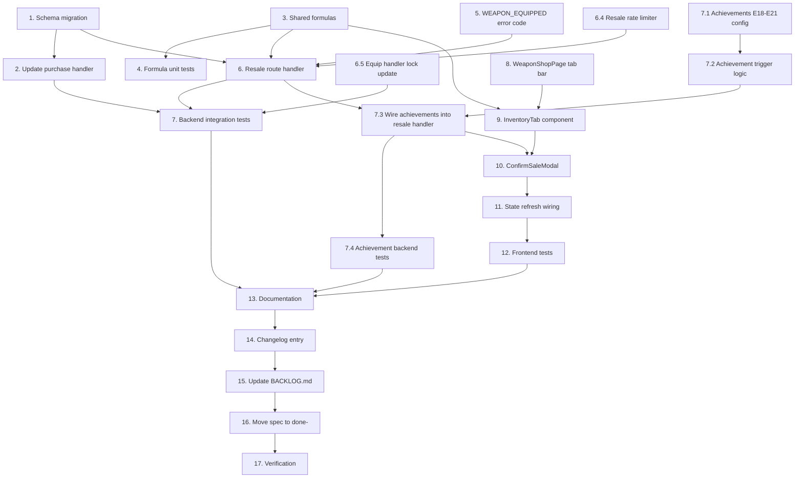

# Implementation Plan: Weapon Resale

## Overview

This implementation plan delivers the weapon resale feature in 17 tasks grouped into four phases:

- **Phase 1 — Schema & Shared Formulas (Tasks 1–4)**: Add the `pricePaid` column with backfill, update purchase paths to record it, add the resale rate formula to shared utils, unit-test the formula.
- **Phase 2 — Backend Endpoint (Tasks 5–7)**: Add the `WEAPON_EQUIPPED` error code, implement the `DELETE /api/weapon-inventory/:id` route, add integration tests covering all error and success paths.
- **Phase 3 — Frontend (Tasks 8–12)**: Add the My Inventory tab to `WeaponShopPage`, implement `InventoryTab` / `InventoryRow` / `ConfirmSaleModal` components, wire up state refresh, add frontend tests.
- **Phase 4 — Documentation, Rollout, Verification (Tasks 13–17)**: Update PRDs and audit log docs, publish a player-facing changelog entry, update BACKLOG.md, move the spec to done, run all verification criteria.

## Task Dependency Graph

```json
{
  "waves": [
    {
      "name": "Wave 1 — Foundations (parallel)",
      "tasks": [1, 3, 5, 8],
      "description": "Schema migration, shared formulas, error code, frontend tab scaffolding. No inbound dependencies; can be started in any order."
    },
    {
      "name": "Wave 2 — Build on foundations",
      "tasks": [2, 4, 9],
      "description": "Update purchase handler (depends on 1), formula unit tests (depends on 3), InventoryTab + InventoryRow components (depends on 3 and 8)."
    },
    {
      "name": "Wave 3 — Integration",
      "tasks": [6, "6.4", "6.5", 10],
      "description": "Resale route handler (depends on 1, 3, 5). Per-user rate limiter (parallel with 6, both feed into 7). Equip handler lock update (parallel, prerequisite for race tests in 7). ConfirmSaleModal (depends on 9)."
    },
    {
      "name": "Wave 4 — Tests & wiring",
      "tasks": [7, "7.1", "7.2", "7.3", "7.4", 11],
      "description": "Backend integration tests for resale (depends on 2, 6, 6.4, 6.5). Achievement config additions (7.1) — independent, parallel. Achievement service trigger logic (7.2) depends on 7.1. Wire achievements into resale handler (7.3) depends on 6 and 7.2. Achievement-specific backend tests (7.4) depend on 7.3. Frontend state refresh (11) depends on 10."
    },
    {
      "name": "Wave 5 — Frontend tests",
      "tasks": [12],
      "description": "Frontend tests (depends on 11)."
    },
    {
      "name": "Wave 6 — Documentation & rollout",
      "tasks": [13, 14, 15, 16],
      "description": "Sequential: PRD updates → changelog entry → BACKLOG update → spec move."
    },
    {
      "name": "Wave 7 — Verification gate",
      "tasks": [17],
      "description": "Final verification — runs all checks from requirements.md Verification Criteria."
    }
  ]
}
```



Tasks 1, 3, 5, and 8 have no inbound dependencies and can be parallelized at the start. Verification (Task 17) is the final gate — all preceding tasks must be complete before it runs.

## Tasks

## Notes

- All tasks are mandatory. There are no optional or skip-if-time tasks.
- The `_Requirements:` line on each task traces to acceptance criteria in `requirements.md`.
- Phase 4 tasks (13–17) are sequential — each depends on the previous being complete.
- Run `npx prisma generate` after Task 1 to refresh the project-local client at `app/backend/generated/prisma/`. Forgetting this will cause Task 2 and Task 6 to fail with type errors on the new `pricePaid` field.

- [x] 1. Add `pricePaid` column to `WeaponInventory`
  - Add `pricePaid Int @map("price_paid")` field to the `WeaponInventory` model in `app/backend/prisma/schema.prisma`. Initially declare as nullable for migration safety, then tighten to NOT NULL after backfill.
  - Generate the Prisma migration via `npx prisma migrate dev --name add_weapon_inventory_price_paid`. Inspect the generated SQL and add the backfill statement (`UPDATE weapon_inventory wi SET price_paid = w.cost FROM weapons w WHERE wi.weapon_id = w.id`) between the ADD COLUMN and SET NOT NULL steps.
  - Run `npx prisma generate` to refresh the project-local client at `app/backend/generated/prisma/`.
  - Verify the migration is applied cleanly: `npx prisma migrate status` reports no drift.
  - _Requirements: R1.1, R1.2, R1.3_

- [x] 2. Update existing weapon purchase handler to write `pricePaid`
  - In `app/backend/src/routes/weaponInventory.ts`, the `POST /purchase` handler creates a `weaponInventory` row inside the transaction. Update the `data` object to include `pricePaid: finalCost` so the actual credits paid (after Workshop discount) are persisted.
  - Update `app/backend/src/utils/userGeneration.ts` so all three `tx.weaponInventory.create` calls (main weapon, shield, dual-wield second weapon) include `pricePaid: 0` since starter weapons are granted free.
  - Verify by registering a new test user and confirming all granted weapon inventory rows have `price_paid = 0`.
  - _Requirements: R1.4, R1.5_

- [x] 3. Add resale rate formulas to shared utils
  - In `app/shared/utils/discounts.ts`, add `calculateWeaponResaleRate(level: number): number` returning `clampedLevel * 10` where `clampedLevel = Math.max(0, Math.min(10, level))`.
  - Add `applyResaleRate(pricePaid: number, ratePercent: number): number` returning `Math.floor(pricePaid * ratePercent / 100)`.
  - Add JSDoc comments matching the style of `calculateWeaponWorkshopDiscount` in the same file (level breakdown table for resale rate, formula description for applyResaleRate, note that the slope mirrors the purchase discount).
  - Re-export both functions from `app/shared/utils/index.ts` alongside the existing `calculateWeaponWorkshopDiscount` and `applyDiscount` exports.
  - _Requirements: R2.1, R2.2, R2.3, R2.4_

- [x] 4. Add unit tests for resale formulas
  - Create or extend `app/shared/utils/__tests__/discounts.test.ts` with test cases for `calculateWeaponResaleRate` at levels 0, 1, 3, 5, 10 (expecting 0, 10, 30, 50, 100) and clamping cases at -1 (→ 0) and 11 (→ 100).
  - Add tests for `applyResaleRate` with inputs (1000, 0)→0, (1000, 30)→300, (1000, 100)→1000, (0, 50)→0.
  - Add a property-based test using fast-check: for any `pricePaid >= 0` and any rate in [0, 100], the result is between 0 and `pricePaid` inclusive.
  - Run `cd app/backend && npm test -- discounts` to confirm tests pass.
  - _Requirements: R4.2_

- [x] 5. Add `WEAPON_EQUIPPED` error code
  - Locate the economy error code enum (search for `EconomyErrorCode` declaration in `app/backend/src/errors/`). Add `WEAPON_EQUIPPED = 'weapon_equipped'` to the enum.
  - Update the error code reference doc at `docs/guides/ERROR_CODES.md` if it lists economy codes — add `WEAPON_EQUIPPED` with a short description.
  - _Requirements: R3.8_

- [x] 6. Implement the resale route handler
  - In `app/backend/src/routes/weaponInventory.ts`, add a new `router.delete('/:id', ...)` handler following the pattern documented in design.md §3 (Components and Interfaces → Backend Components → Route Handler).
  - Reuse the existing `inventoryIdParamsSchema` for Zod validation.
  - Apply middleware in this order: `authenticateToken`, the new per-user resale rate limiter (Task 6.4), `validateRequest({ params: inventoryIdParamsSchema })`.
  - Call `verifyWeaponOwnership(prisma, inventoryId, userId)` before the transaction.
  - Inside `prisma.$transaction`:
    1. Call `lockUserForSpending(tx, userId)` to acquire the user row lock.
    2. Acquire `SELECT id, user_id, weapon_id, price_paid FROM weapon_inventory WHERE id = $1 FOR UPDATE` using `tx.$queryRaw`. Throw 404 if no row.
    3. Re-verify ownership inside the transaction (compare locked row's `user_id`). On mismatch, log `securityMonitor.logAuthorizationFailure` and throw 403.
    4. Defensively assert `pricePaid >= 0`. On violation, log via `logger.error` and throw `EconomyError(INVALID_TRANSACTION, ..., 500)`.
    5. Equipped check (mainWeaponId/offhandWeaponId) — throw `WEAPON_EQUIPPED` 409 with `{ robotId, robotName }` if found.
    6. Look up Workshop level. Compute sale price via the shared formulas. Increment currency, delete inventory row.
  - After the transaction, call `eventLogger.logWeaponSale(currentCycle, userId, weaponId, salePrice)` and write a structured `logger.info` line.
  - Do NOT call `securityMonitor.trackSpending` — resale is a credit gain, not spending.
  - Return JSON `{ salePrice, currency, weaponName, message }`.
  - Import the shared formulas: `import { calculateWeaponResaleRate, applyResaleRate } from '../shared/utils/discounts'` (or via the index barrel).
  - _Requirements: R3.1, R3.2, R3.3, R3.4, R3.5, R3.6, R3.7, R3.11_

- [x] 6.4 Add per-user resale rate limiter
  - Define a new `express-rate-limit` instance applied to the resale route. Configuration: `windowMs: 5 * 60 * 1000`, `max: 30`, `keyGenerator: (req) => 'resale:' + (req as AuthRequest).user!.userId`.
  - In the rate limiter `handler` callback (or via `onLimitReached`), call `securityMonitor.trackRateLimitViolation(userId, 'weapon_resale', { sourceIp: req.ip, endpoint: req.originalUrl })` before responding 429.
  - Apply the limiter to the resale route AFTER `authenticateToken` so `req.user` is populated when `keyGenerator` runs.
  - The limiter must be defined OUTSIDE the route handler (module-scope) so a single instance is shared across requests, otherwise each request gets its own counter and the limit is never reached.
  - _Requirements: R3.10_

- [x] 6.5 Update equip handlers to acquire the same weapon_inventory row lock
  - In `app/backend/src/services/robot/robotWeaponService.ts`, update `equipMainWeapon` and `equipOffhandWeapon` to acquire `SELECT ... FOR UPDATE` on the target `weapon_inventory` row at the start of their `prisma.$transaction` blocks. Use the same SQL shape as the resale handler (`SELECT id FROM weapon_inventory WHERE id = $1 FOR UPDATE`) so both handlers contend for the same lock.
  - Lock acquisition order is fixed across the codebase: any future code that takes both the user row lock and the weapon_inventory row lock MUST acquire user first, then weapon_inventory. Document this in a code comment in `creditGuard.ts` or in a new section in `coding-standards.md`.
  - This change is required because `Robot.main_weapon_id` uses `ON DELETE SET NULL`, which means the FK constraint silently nullifies the robot's reference instead of blocking the resale — the FK is NOT a defense-in-depth backup. The shared lock is the only correct serialization point between resale and equip.
  - The equip handler does not need to acquire `lockUserForSpending` (no currency change), so this addition is just one extra `tx.$queryRaw` call at the top of each function.
  - Verify with the new race-condition test added in Task 7.
  - _Requirements: R3.9_

- [x] 7. Add backend integration tests for the resale route
  - In `app/backend/tests/weaponInventory.test.ts`, add a new `describe('DELETE /api/weapon-inventory/:id')` block.
  - Standard cases: 401 without auth, 403 when selling another user's weapon, 404 with non-existent ID, 409 when weapon is equipped as main, 409 when equipped as offhand, successful sale at Workshop L0 (0% — currency unchanged, row deleted) / L1 (10%) / L5 (50%) / L10 (100%) with currency assertions, sale of starter weapon (`pricePaid=0`) returns ₡0, audit log row is created.
  - Concurrency cases:
    - Concurrent resale of the same weapon: fire two DELETE requests in parallel via `Promise.all`. Assert exactly one returns 200 and one returns 404 (or 409 if equipped). Assert currency increased by exactly one sale price, not two.
    - Concurrent resale-vs-equip: fire DELETE resale and PUT equip-main-weapon on the same weapon in parallel. Assert one of two valid outcomes: (a) resale 200 + equip 404, (b) equip 200 + resale 409. Assert that after both settle, the robot's `mainWeaponId` is consistent with whether the inventory row still exists.
  - Defensive guard:
    - Force a negative `price_paid` on a test inventory row via direct `prisma.$executeRaw`. Assert the resale request returns 500, no audit row is created, no currency change.
  - Rate limit:
    - Issue 30 successful resale requests in quick succession (use distinct test weapons so no 409 occurs). Assert the 31st returns 429. Assert `securityMonitor.trackRateLimitViolation` is called (mock the singleton).
  - Spending tracker:
    - Mock `securityMonitor.trackSpending` and assert it is NOT called by the resale handler.
  - For Workshop level setup, create test facilities via `prisma.facility.create` in the test setup.
  - Run `cd app/backend && npm test -- weaponInventory` to confirm all tests pass.
  - _Requirements: R4.1_

- [x] 7.1 Add resale-themed achievements (E18–E21) and trigger types
  - In `app/backend/src/config/achievements.ts`, add three new values to `AchievementTriggerType`: `'weapons_sold_count'`, `'weapons_sold_credits'`, `'weapon_sold_at_max_workshop'`.
  - Add four new achievement definitions to the `ACHIEVEMENTS` array (E18 Pawn Star, E19 Shrewd Negotiator, E20 Arms Dealer, E21 Buy High Sell Higher). Use the exact field shapes documented in design.md → Achievements section. All four use `category: 'economy'` and `scope: 'user'`. None are hidden.
  - Use `TIER_REWARDS.easy.credits` / `.prestige` for E18, `TIER_REWARDS.medium.*` for E19, `TIER_REWARDS.hard.*` for E20 and E21.
  - For badge icon files, use the existing naming convention: `'achievement-e18'` through `'achievement-e21'`. Verify whether badge image assets exist for the new IDs — if not, log a follow-up note in the changelog task to commission them, but the achievements themselves can ship without custom artwork (the system has a fallback icon path).
  - _Requirements: R7.1, R7.2, R7.3, R7.4, R7.5, R7.6_

- [x] 7.2 Add `weapon_sold` event type and trigger logic to AchievementService
  - In `app/backend/src/services/achievement/achievementService.ts`, add `'weapon_sold'` to the `AchievementEventType` union.
  - Add an entry to `EVENT_TRIGGER_MAP`: `weapon_sold: ['weapons_sold_count', 'weapons_sold_credits', 'weapon_sold_at_max_workshop']`.
  - Extend the `checkCriterionMet` switch statement with three new cases following the implementation in design.md → Achievements → Trigger Implementation Strategy:
    - `weapons_sold_count`: COUNT query against `audit_logs` where `event_type = 'weapon_sale'`.
    - `weapons_sold_credits`: SUM aggregation via `prisma.$queryRaw` over the JSON `payload->>'salePrice'` field.
    - `weapon_sold_at_max_workshop`: read `event.data.workshopLevel === 10` directly from the event payload.
  - Extend the `getProgress` method with cases for `weapons_sold_count` (current count from audit log, target = threshold, label "weapons sold") and `weapons_sold_credits` (current sum, target = threshold, label "credits earned from resales").
  - _Requirements: R7.7, R7.8, R7.9_

- [x] 7.3 Wire achievement check into the resale handler
  - In the resale route handler (`src/routes/weaponInventory.ts`), AFTER the transaction commits and AFTER `eventLogger.logWeaponSale` is called, call `achievementService.checkAndAward(userId, null, { type: 'weapon_sold', data: { weaponId, salePrice, pricePaid, workshopLevel } })`. The `pricePaid` value comes from the locked SELECT in Task 6 step 2, threaded through the transaction's return value.
  - Wrap the call in a try-catch (matches the pattern in the purchase handler).
  - Include the resulting `UnlockedAchievement[]` array in the response body as the `achievementUnlocks` field.
  - Update the route handler's TypeScript response type to include `achievementUnlocks: UnlockedAchievement[]`.
  - _Requirements: R7.10, R7.11_

- [x] 7.4 Add achievement-specific backend tests
  - Extend `app/backend/tests/weaponInventory.test.ts` with cases:
    - First sale unlocks E18 "Pawn Star": create a fresh test user, sell one weapon, assert response `achievementUnlocks` contains an entry with `id: 'E18'`.
    - 10th sale unlocks E20 "Arms Dealer": pre-seed 9 weapon sales for the user via `prisma.auditLog.create`, then sell one more, assert E20 in unlocks.
    - Sale at Workshop L10 unlocks E21 "Buy High Sell Higher": set test user's Workshop level to 10, sell a weapon, assert E21 in unlocks.
    - Cumulative credits unlocks E19 "Shrewd Negotiator": pre-seed audit log rows summing to ₡499,000, sell one weapon at ₡5,000, assert E19 unlocks.
  - Use the existing achievement-test patterns from `achievementService.test.ts`.
  - _Requirements: R4.1 (extension)_

- [x] 8. Add inventory tab to WeaponShopPage
  - In `app/frontend/src/pages/WeaponShopPage.tsx`, wrap the existing catalog content in a tab panel and add a tab bar above it.
  - Use `useSearchParams` from react-router to bind active tab state to `?tab=inventory` query param. Default to `catalog`.
  - The catalog tab keeps all existing behavior — wrap, don't modify.
  - Tab labels: "Catalog" and "My Inventory ({count})" where `count` is the inventory length.
  - _Requirements: R5.1_

- [x] 9. Implement InventoryTab, InventoryRow, and InventorySummaryBar components
  - Create `app/frontend/src/components/weapon-shop/InventoryTab.tsx` that partitions the inventory into "Available to Sell" and "Equipped" sections (using the existing `robotsMain` / `robotsOffhand` arrays returned by `GET /api/weapon-inventory`), renders each section with a count in the heading, hides the Equipped section when empty, and shows an empty-state message when no weapons are available to sell. The tab also embeds the `InventorySummaryBar` and the `ConfirmSaleModal`.
  - Create `app/frontend/src/components/weapon-shop/InventoryRow.tsx` accepting a `variant: 'available' | 'equipped'` prop. The available variant shows weapon name, type badge, original cost, price paid, computed sale price (using `calculateWeaponResaleRate` and `applyResaleRate` from `app/shared/utils/discounts`), and an enabled Sell button. The equipped variant shows weapon name, type badge, an "Equipped on: {robotName}" label with the equip slot ("Main" / "Offhand") linked to the robot detail page, a disabled Sell button with a tooltip listing every robot the weapon is equipped on, and visual de-emphasis (reduced opacity).
  - Handle the corner case where a weapon is equipped on multiple robots: list every robot name in the equipped row and in the disabled-button tooltip.
  - Create `app/frontend/src/components/weapon-shop/InventorySummaryBar.tsx` showing total inventory count, sellable count, and aggregate resale value (sum over the Available section). Include a small "Workshop L{level} — {rate}% resale" explainer pill.
  - _Requirements: R5.2, R5.3, R5.4, R5.5, R5.8_

- [x] 10. Implement ConfirmSaleModal
  - Create `app/frontend/src/components/weapon-shop/ConfirmSaleModal.tsx` displaying weapon name, attribute summary, original price paid, sale price, Workshop level + rate, and a clear "this cannot be undone" warning. When the resale rate is 0% (Workshop L0), display the ₡0 sale price prominently and warn the player that selling at L0 yields no credits.
  - Cancel button closes the modal. Confirm button calls `apiClient.delete('/api/weapon-inventory/:id')`.
  - On success, call the parent's `onConfirmed` callback with the response body. The response includes `achievementUnlocks: UnlockedAchievement[]` — forward these to the existing achievement toast system (look at how `WeaponShopPage` or the purchase flow handles `achievementUnlocks` from the purchase response and reuse the same component).
  - On error (401/403/404/409/429), display the error message inside the modal and keep it open. Disable the Confirm button while the request is in flight.
  - _Requirements: R2.5, R5.6, R5.7, R7.12_

- [x] 11. Wire up state refresh and success message
  - In `WeaponShopPage` (or its `useWeaponShop` hook), expose a refresh function that re-fetches the weapon inventory and user currency.
  - Pass the refresh function as `onSellComplete` to `InventoryTab`. After a successful sale, call refresh and show a success banner/toast: `Sold {weapon} for ₡{price}`. The sold weapon must disappear from the Available section and the summary bar must update without a page refresh.
  - The catalog tab's "Already Own (n)" badge should automatically reflect the updated inventory after refresh — verify no additional code changes are needed.
  - _Requirements: R5.7, R5.8, R5.9_

- [x] 12. Add frontend tests for the inventory tab and sale flow
  - Create `app/frontend/src/pages/__tests__/WeaponShopPage.inventory.test.tsx` covering: tab renders the Available and Equipped sections in correct order with correct counts, equipped weapons appear only in the Equipped section with robot name + slot visible, Equipped section is hidden when no weapons are equipped, empty-state message renders when all weapons are equipped, multi-robot equipped corner case lists all robot names, summary bar shows correct totals, Sell button is enabled in Available and disabled in Equipped (with tooltip naming the robot), tab state persists in URL.
  - Create `app/frontend/src/pages/__tests__/WeaponShopPage.sell.test.tsx` covering: clicking Sell on an Available row opens modal, Cancel closes without API call, Confirm calls DELETE with correct ID, success removes the weapon from the Available section and updates the summary bar without a page refresh, error keeps modal open, achievement unlock toasts render when the API response includes `achievementUnlocks` (use a mock response with one E18 unlock).
  - Mock `apiClient` per the existing pattern in `WeaponShopPage.onboarding.test.tsx`.
  - Run `cd app/frontend && npm test -- WeaponShopPage` to confirm all tests pass.
  - _Requirements: R6.1, R7.12_

- [x] 13. Update documentation
  - Add a "Weapon Resale" section to `docs/game-systems/PRD_WEAPON_ECONOMY.md` describing: the formula `resaleRate = level × 10` (capped at 100%), the `pricePaid` anti-exploit mechanism, and the equipped-weapon restriction.
  - Update the Workshop facility entry in `docs/architecture/PRD_FACILITIES_PAGE.md` (or wherever Workshop is described — confirm exact path during implementation) to note the dual purpose: purchase discount + resale rate.
  - Update `app/backend/docs/audit-logging-schema.md` to document the `weapon_sale` event type with payload schema `{ weaponId: number, salePrice: number }`.
  - Update the achievement system documentation (e.g., `docs/game-systems/PRD_ACHIEVEMENTS.md` if it exists, otherwise the achievement section of another design doc) with the 4 new economy achievements (E18–E21).
  - _Requirements: R8.1, R8.2, R8.3, R8.6_

- [x] 14. Create and publish changelog entry
  - Use the admin changelog system (Spec #24) to create a new changelog entry.
  - Title: "Sell weapons back to the workshop"
  - Category: "Feature"
  - Body: Plain-language explanation of the formula, three example resale values (e.g., "L0 Workshop: ₡0 — build Workshop L1 to enable resale. L3 Workshop: a ₡100K weapon sells for ₡30K. L10 Workshop: full ₡100K credit recovery."), a clear note that equipped weapons must be unequipped first, and a mention of the 4 new achievements players can unlock by selling weapons.
  - Optional: attach a screenshot of the My Inventory tab.
  - Publish the entry so it appears in the player-facing changelog modal on next dashboard load.
  - _Requirements: R8.4_

- [x] 15. Update BACKLOG.md
  - Move "Weapon resale" from the "Future Direction" subsection of #5 in `docs/BACKLOG.md` to the "Recently Completed" table at the top of the WSJF section.
  - Set the spec link to `done-{month}{year}/33-weapon-resale/` (use the actual completion month).
  - _Requirements: R8.5_

- [ ] 16. Move spec to done- directory
  - When all preceding tasks are complete and verified, move `.kiro/specs/to-do/33-weapon-resale/` to `.kiro/specs/done-{month}{year}/33-weapon-resale/` (using the month of completion).
  - **NOTE**: This task is intentionally left unchecked until the migration has been applied in a running environment and the DB-dependent integration tests in Task 7 / 7.4 have actually executed. All code is in place and static verification passes; the runtime verification (migration apply, integration test execution, manual sale via UI) is the user's gate before moving the spec.
  - _Requirements: R8.5 (spec link target)_

- [x] 17. Verification
  - Run all checks from the requirements document's "Verification Criteria" section:
    1. `npx prisma migrate status` — no drift
    2. SQL: `SELECT COUNT(*) FROM weapon_inventory WHERE price_paid IS NULL` returns 0
    3. `grep -rn "calculateWeaponResaleRate" app/shared/utils/discounts.ts` finds the function
    4. `grep -n "router.delete" app/backend/src/routes/weaponInventory.ts` finds the new route
    5. `cd app/backend && npm test -- weaponInventory` passes — including concurrency, rate-limit, and defensive-guard tests
    6. Manual integration: equip a weapon, attempt sale (expect 409), unequip, sell (expect currency increment matching the formula)
    7. `cd app/frontend && npm test -- WeaponShop` passes
    8. SQL: `SELECT event_type, COUNT(*) FROM audit_log WHERE event_type='weapon_sale'` shows ≥ 1 row
    9. Visual: inventory tab + sell modal render correctly
    10. Changelog entry exists and is published
    11. `grep -rn "FOR UPDATE.*weapon_inventory" app/backend/src/` shows both resale and equip handlers acquire the lock
    12. `grep -rn "trackSpending" app/backend/src/routes/weaponInventory.ts` shows it is called in purchase but NOT in delete
    13. Race-condition stress test (Jest) passes: 50 parallel buy-sell-equip cycles, no orphans, currency consistent
    14. `grep -n "id: 'E1[89]'\\|id: 'E2[01]'" app/backend/src/config/achievements.ts` finds the four new achievements (E18–E21)
    15. `grep -n "weapon_sold" app/backend/src/services/achievement/achievementService.ts` confirms the new event type is wired into `EVENT_TRIGGER_MAP`
    16. Manual integration: complete a sale via the UI, confirm any unlocked achievements show up as toasts. Specifically test the "Pawn Star" easy achievement on first sale.
  - Run `gitnexus_impact` on `purchase` route handler, `equipMainWeapon`, `equipOffhandWeapon`, and `lockUserForSpending` to confirm no unexpected blast radius. Report any HIGH or CRITICAL risks before merging.
  - Run full backend test suite: `cd app/backend && npm test -- --silent`.
  - Run full frontend test suite: `cd app/frontend && npm test -- --run`.
  - Run linter: `cd app/backend && npm run lint` and `cd app/frontend && npm run lint`.
  - _Requirements: R9.1, R9.2, R9.3, R9.4, R9.5_
