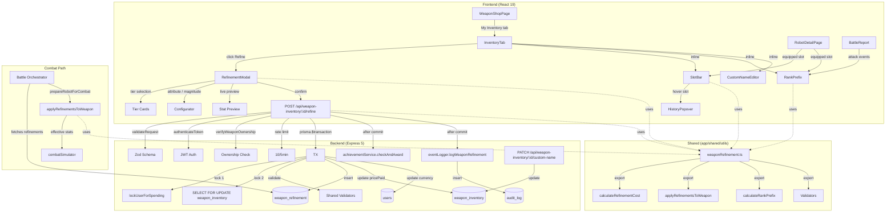

# Design Document: Weapon Refinement

## Overview

This feature adds a server-authoritative per-instance weapon refinement system to Armoured Souls. Players spend credits at the Weapons Workshop to permanently improve individual `WeaponInventory` rows across four tiers (Hone, Augment, Sharpen, Forge), with a hard cap of 5 refinements per weapon. Tier availability is gated by Workshop level alone — the Workshop facility's existing prestige requirements (L4 = 1,500, L7 = 5,000, L9 = 10,000) supply the prestige gating implicitly. Refinement is final, non-transferable, and per-weapon-instance.

The implementation extends three pieces of existing infrastructure:

- **`WeaponInventory.pricePaid`** (Spec #33, May 22) — every successful refinement increments this column by the refinement cost, so refinement spend is partially or fully recoverable on resale at the player's current Workshop rate.
- **The shared `weapon_inventory` row lock convention** (Spec #33) — refinement, equip, and resale all serialize on the same row lock with the same acquisition order (user row → weapon_inventory row), preventing all three-way races.
- **`prepareRobotForCombat`** (existing, in `app/backend/src/utils/robotCalculations.ts`) — the function called by every battle orchestrator gains a refinement-folding step that computes effective `baseDamage`, `cooldown`, and attribute bonuses before the simulator reads them.

The schema change is a single new table (`weapon_refinement`) with a foreign key + cascade to `weapon_inventory`. No existing column is modified. The frontend gains one new component family under `app/frontend/src/components/weapon-refinement/` plus updates to existing inventory and equipped-weapon displays.

A new in-game guide article and a public changelog entry are part of the comprehensive scope. The user emphasized "let's do this right" — every player-visible surface and every documentation surface is included.

## Architecture



The flow follows the established layered architecture from Spec #33:

- **Routes** (`src/routes/weaponInventory.ts`): The new `POST /:id/refine` handler mirrors the resale handler's structure — Zod validation, ownership verification, transaction with two-tier row locking, post-commit audit log + achievement check.
- **Shared formulas** (`app/shared/utils/weaponRefinement.ts`): All cost, validation, and effective-stat math lives in one pure-functional module so the frontend and the combat path use identical formulas.
- **Combat integration** (`prepareRobotForCombat`): A single insertion point folds refinements into the weapon's effective stats. The simulator continues to read `weapon.baseDamage` and `weapon.cooldown` — the orchestrator has already overwritten those fields with effective values.
- **Frontend** (`src/components/weapon-refinement/` + updates to `src/components/weapon-shop/`): New component family for refinement-specific UI (`SlotBar`, `RankPrefix`, `RefinementModal`, `RefinementHistoryPopover`, `CustomNameEditor`), with `InventoryRow` and `WeaponCard` updated to embed them.

### Key Design Decisions

1. **Refinements are stored as separate rows, not denormalized JSON**. A `weapon_refinement` table with one row per slot keeps queries simple, lets the schema enforce per-slot integrity (unique on `(weapon_inventory_id, slot_index)`, FK + cascade), and gives a natural place for forensic queries ("when was this slot filled, for how much"). Denormalized JSON would have been faster for reads but would push validation entirely into application code and make the audit story muddier.

2. **`pricePaid` accumulates refinement spend**. This is the single most important interaction with Spec #33. Every refinement increments `weapon_inventory.price_paid` by the refinement cost. When the weapon is later sold, the resale formula `pricePaid × resaleRate(workshopLevel)` naturally recovers a fraction of refinement spend. At Workshop L10 (the cap, also gated to 10,000 prestige), recovery is full. This means refinement spend is *not* a complete sunk cost — it's an investment that's partially or fully recoverable on resale.

3. **Workshop level is the only gate**. The Weapons Workshop facility already has prestige gates at L4, L7, L9. Refinement tiers gate at L1, L3, L5, L8 — every tier-unlock past L1 implicitly inherits the Workshop's own prestige requirements. Adding parallel prestige gates on the refinement system would be redundant and would couple the refinement spec to a subsystem it doesn't need to know about.

4. **Refinement is allowed on equipped weapons**. The combat simulator reads refinements at battle prep time (via `prepareRobotForCombat`), so refining an equipped weapon takes effect on the next battle without unequipping. The shared `weapon_inventory` row lock (matching Spec #33's lock convention) serializes refinement-vs-equip atomically. Forcing unequip would be friction for the most common case (refining the weapon you actually use).

5. **Refinement is per-instance and travels with the weapon**. Refinements live on `WeaponInventory.id`, not on `Weapon.id`. Swap the weapon to another robot in your stable — refinements come along. Sell the weapon — refinements die with the row (cascade delete). If a future Player Marketplace (Backlog #44) opens trading, the listing carries the full refinement state to the buyer. The schema is forward-compatible without modification.

6. **DPS-tier cap of 2 slots each protects the rebalance**. The DPS Rebalance (Spec #31) compressed the 1H base-damage spread from 3.0× to 2.0× to keep all four loadout types within 15% of each other on combat power. A 5-slot Sharpen on a 3s weapon (3.0s → 1.75s, +71% DPS) or a 5-slot Forge on Practice Sword (6 → 11, +83% DPS) would re-create the original dominance problem. The 2-slot cap holds: max Sharpen yields ≤ +30% DPS, max Forge yields ≤ +33% DPS, combined max DPS lift ≈ +40% — significant for endgame whales, not catastrophic to balance.

7. **No cooldown floor**. The combat simulator already calculates effective cooldown as `baseCooldown × offhandPenalty / (1 + attackSpeed/50)`. Sharpen reduces `baseCooldown`. The 2-slot Sharpen cap is the only constraint needed; the engine's `SIMULATION_TICK = 0.1s` is the implicit floor. Adding a hard floor would silently truncate future fast 1H weapon designs without providing meaningful safety.

8. **No transferability between weapons**. Refinements bond to the specific `WeaponInventory` row. There's no "rip refinements from this Volt Sabre, attach to that Vibro Mace" flow. The user's stated principle: "if you don't want it, you sell." Transferability would require new endpoints, new error cases (target weapon's range/hand/loadout incompatibility, target weapon's existing refinements colliding), new UX, and would dilute the identity payoff. Out of scope.

9. **Custom name is editable, rate-limited**. `WeaponInventory.customName` already exists in the schema (introduced earlier, never used). This spec surfaces it. It's editable rather than one-time-set so players who change their mind aren't locked in, but rate-limited (30 changes per 10 minutes per user) to prevent abuse. Empty string clears the name (server normalizes to `null`).

10. **POST verb for refinement, DELETE for resale**. The resale handler used `DELETE /api/weapon-inventory/:id` because the operation removes a resource. Refinement creates new state on an existing resource — `POST /api/weapon-inventory/:id/refine` is the natural REST verb. The `/refine` action verb is acceptable here because it's a sub-resource action, not a standalone resource.

## Components and Interfaces

### Backend Components

#### 1. Prisma Schema: `WeaponRefinement` (new) and `WeaponInventory` (back-reference only)

```prisma
model WeaponRefinement {
  id                Int      @id @default(autoincrement())
  weaponInventoryId Int      @map("weapon_inventory_id")
  tier              String   @db.VarChar(16)  // 'hone' | 'augment' | 'sharpen' | 'forge'
  magnitude         Int                       // 1-5 for hone/augment, always 1 for sharpen/forge
  targetAttribute   String?  @map("target_attribute") @db.VarChar(64)  // attribute name for hone/augment, NULL for sharpen/forge
  costPaid          Int      @map("cost_paid")
  slotIndex         Int      @map("slot_index")  // 1..5, stable per weapon
  createdAt         DateTime @default(now()) @map("created_at")

  weaponInventory   WeaponInventory @relation(fields: [weaponInventoryId], references: [id], onDelete: Cascade)

  @@unique([weaponInventoryId, slotIndex], map: "weapon_refinement_inv_slot_unique")
  @@index([weaponInventoryId])
  @@map("weapon_refinement")
}

// WeaponInventory gains a back-reference (no other change)
model WeaponInventory {
  // ... existing fields unchanged ...
  refinements WeaponRefinement[]
}
```

The migration is purely additive: a new table with FK + cascade + unique constraint + index. Existing `WeaponInventory` rows have zero refinements at start; no backfill is required.

Migration name: `20260524000000_add_weapon_refinement` (date-prefixed per Prisma convention).

#### 2. Shared Formula Module: `app/shared/utils/weaponRefinement.ts`

A single pure-functional module containing all refinement math. Both the backend route handler AND the frontend (modal, slot bar, rank prefix) consume the same formulas.

```typescript
// Type definitions
export type RefinementTier = 'hone' | 'augment' | 'sharpen' | 'forge';
export type RankPrefix = 'Refined' | 'Crafted' | 'Mastercrafted' | 'Legendary' | null;

export interface RefinementRow {
  tier: RefinementTier;
  magnitude: number;
  targetAttribute: string | null;
}

export interface EffectiveWeaponStats {
  effectiveBaseDamage: number;
  effectiveCooldown: number;
  effectiveAttributeBonuses: Record<string, number>;
}

// === Cost ===

/**
 * Cost for one refinement action.
 * Hone: 10_000 × magnitude²
 * Augment: 20_000 × magnitude²
 * Sharpen: 300_000 × 3^existingInstancesOfTier (1st: 300K, 2nd: 900K)
 * Forge: 400_000 × 3^existingInstancesOfTier (1st: 400K, 2nd: 1.2M)
 */
export function calculateRefinementCost(
  tier: RefinementTier,
  magnitude: number,
  existingInstancesOfTier: number,
): number {
  switch (tier) {
    case 'hone':    return 10_000 * magnitude * magnitude;
    case 'augment': return 20_000 * magnitude * magnitude;
    case 'sharpen': return 300_000 * Math.pow(3, existingInstancesOfTier);
    case 'forge':   return 400_000 * Math.pow(3, existingInstancesOfTier);
  }
}

// === Validators (return discriminated unions; no exceptions thrown here) ===

export function validateRefinementSlotAvailable(
  refinements: readonly RefinementRow[],
  tier: RefinementTier,
): { ok: true } | { ok: false; code: 'SLOT_CAP_EXCEEDED' | 'TIER_CAP_EXCEEDED'; details?: object };

export function validateAttributeStackCap(
  weaponCatalogBonus: number,         // weapon[<attr>Bonus] from catalog
  refinements: readonly RefinementRow[],
  targetAttribute: string,
  addedMagnitude: number,
): { ok: true; newTotal: number } | { ok: false; code: 'ATTRIBUTE_STACK_CAP_EXCEEDED'; currentTotal: number };

export function validateAttributeOnWeapon(
  weaponCatalogBonus: number,
  refinements: readonly RefinementRow[],
  targetAttribute: string,
  tier: 'hone' | 'augment',
): { ok: true } | { ok: false; code: 'ATTRIBUTE_NOT_ON_WEAPON' | 'ATTRIBUTE_ALREADY_ON_WEAPON' };

export function validateShieldCompatibility(
  weaponType: string,
  tier: RefinementTier,
): { ok: true } | { ok: false; code: 'SHIELD_CANNOT_TAKE_DPS_TIER' };

// === Effective stats ===

/**
 * Compute the weapon's effective stats after applying all refinements.
 * Pure function — does not mutate inputs.
 */
export function applyRefinementsToWeapon(
  weapon: WeaponLike,
  refinements: readonly RefinementRow[],
): EffectiveWeaponStats {
  let effectiveBaseDamage = weapon.baseDamage;
  let effectiveCooldown = weapon.cooldown;
  const effectiveAttributeBonuses: Record<string, number> = { ...weaponCatalogBonusesAsRecord(weapon) };

  for (const r of refinements) {
    if (r.tier === 'forge')   effectiveBaseDamage += 1.0;
    if (r.tier === 'sharpen') effectiveCooldown -= 0.25;
    if ((r.tier === 'hone' || r.tier === 'augment') && r.targetAttribute) {
      const key = `${r.targetAttribute}Bonus`;
      effectiveAttributeBonuses[key] = (effectiveAttributeBonuses[key] ?? 0) + r.magnitude;
    }
  }

  return { effectiveBaseDamage, effectiveCooldown, effectiveAttributeBonuses };
}

// === Identity ===

export function calculateRankPrefix(refinementCount: number): RankPrefix {
  if (refinementCount <= 0) return null;
  if (refinementCount <= 2) return 'Refined';
  if (refinementCount === 3) return 'Crafted';
  if (refinementCount === 4) return 'Mastercrafted';
  return 'Legendary';  // 5+
}

export function formatWeaponDisplayName(
  weaponName: string,
  refinementCount: number,
  /* customName is appended by the UI, not by this function */
): string {
  const prefix = calculateRankPrefix(refinementCount);
  return prefix ? `${prefix} ${weaponName}` : weaponName;
}
```

Both functions are exported from `app/shared/utils/index.ts`. The validators return discriminated unions (no exceptions) so the route handler can map to its preferred error type.

#### 3. Route Handler: `POST /api/weapon-inventory/:id/refine`

Mirrors the resale handler's structure (`DELETE /:id` from Spec #33) — same patterns, same imports, same logging conventions — with the inversion that refinement spends instead of refunds, and its event emits a different audit log type.

```typescript
// src/routes/weaponInventory.ts (additions)

const refineRateLimiter = rateLimit({
  windowMs: 5 * 60 * 1000,
  max: 10,  // lower than resale's 30 — refinement is a deliberate action
  keyGenerator: (req: AuthRequest) => `refine:${req.user!.userId}`,
  handler: (req, res) => {
    securityMonitor.trackRateLimitViolation(
      (req as AuthRequest).user!.userId,
      'weapon_refinement',
      { sourceIp: req.ip || undefined, endpoint: req.originalUrl }
    );
    res.status(429).json({ error: 'Too many refinement attempts. Please try again later.' });
  },
});

const refineBodySchema = z.object({
  tier: z.enum(['hone', 'augment', 'sharpen', 'forge']),
  magnitude: z.number().int().min(1).max(5),
  targetAttribute: z.enum(VALID_ATTRIBUTES).optional(),
}).refine(
  (b) => (b.tier === 'sharpen' || b.tier === 'forge')
    ? (b.magnitude === 1 && b.targetAttribute === undefined)
    : (b.targetAttribute !== undefined),
  { message: 'targetAttribute required for hone/augment; magnitude must be 1 for sharpen/forge' }
);

router.post(
  '/:id/refine',
  authenticateToken,
  refineRateLimiter,
  validateRequest({ params: inventoryIdParamsSchema, body: refineBodySchema }),
  async (req: AuthRequest, res: Response) => {
    const userId = req.user!.userId;
    const inventoryId = parseInt(String(req.params.id));
    const { tier, magnitude, targetAttribute } = req.body as z.infer<typeof refineBodySchema>;

    await verifyWeaponOwnership(prisma, inventoryId, userId);

    const result = await prisma.$transaction(async (tx) => {
      // 1. Lock user row (consistent with all other credit-affecting endpoints)
      const lockedUser = await lockUserForSpending(tx, userId);

      // 2. Lock the WeaponInventory row (matches Spec #33 lock acquisition order)
      const lockedRows = await tx.$queryRaw<{
        id: number; userId: number; weaponId: number; pricePaid: number;
      }[]>`
        SELECT id, user_id as "userId", weapon_id as "weaponId", price_paid as "pricePaid"
        FROM weapon_inventory WHERE id = ${inventoryId} FOR UPDATE
      `;
      if (lockedRows.length === 0) {
        throw new EconomyError(EconomyErrorCode.WEAPON_NOT_FOUND, 'Weapon not found', 404);
      }
      const weaponInv = lockedRows[0];

      // 3. Re-verify ownership inside the transaction (TOCTOU)
      if (weaponInv.userId !== userId) {
        securityMonitor.logAuthorizationFailure(userId, 'weapon', inventoryId);
        throw new AppError('FORBIDDEN', 'Access denied', 403);
      }

      // 4. Defensive bounds check
      if (weaponInv.pricePaid < 0) {
        logger.error(`[Refine] Invariant violation: negative pricePaid on inventory ${inventoryId}`);
        throw new EconomyError(EconomyErrorCode.INVALID_TRANSACTION, 'Invalid weapon state', 500);
      }

      // 5. Fetch dependencies inside the transaction
      const [weapon, refinements, workshop] = await Promise.all([
        tx.weapon.findUniqueOrThrow({ where: { id: weaponInv.weaponId } }),
        tx.weaponRefinement.findMany({ where: { weaponInventoryId: inventoryId } }),
        tx.facility.findUnique({
          where: { userId_facilityType: { userId, facilityType: 'weapons_workshop' } },
          select: { level: true },
        }),
      ]);
      const workshopLevel = workshop?.level ?? 0;

      // 6. Tier gating (Workshop-only, no separate prestige gates)
      const requiredLevels = { hone: 1, augment: 3, sharpen: 5, forge: 8 } as const;
      if (workshopLevel < requiredLevels[tier]) {
        throw new EconomyError(
          EconomyErrorCode.WEAPON_REFINEMENT_TIER_LOCKED,
          `Weapons Workshop level ${requiredLevels[tier]} required to ${tier}.`,
          403,
          { requiredWorkshopLevel: requiredLevels[tier], currentWorkshopLevel: workshopLevel }
        );
      }

      // 7. Validation chain (each throws on failure)
      const slotCheck = validateRefinementSlotAvailable(refinements, tier);
      if (!slotCheck.ok) throw economyErrorFor(slotCheck.code, slotCheck.details);

      const shieldCheck = validateShieldCompatibility(weapon.weaponType, tier);
      if (!shieldCheck.ok) throw economyErrorFor(shieldCheck.code);

      if (tier === 'hone' || tier === 'augment') {
        const attrCheck = validateAttributeOnWeapon(
          getCatalogBonus(weapon, targetAttribute!),
          refinements,
          targetAttribute!,
          tier,
        );
        if (!attrCheck.ok) throw economyErrorFor(attrCheck.code);

        const stackCheck = validateAttributeStackCap(
          getCatalogBonus(weapon, targetAttribute!),
          refinements,
          targetAttribute!,
          magnitude,
        );
        if (!stackCheck.ok) {
          throw economyErrorFor(stackCheck.code, {
            attribute: targetAttribute,
            currentTotal: stackCheck.currentTotal,
            requestedAddition: magnitude,
          });
        }
      }

      // 8. Cost calculation
      const existingInstancesOfTier = refinements.filter(r => r.tier === tier).length;
      const cost = calculateRefinementCost(tier, magnitude, existingInstancesOfTier);

      if (lockedUser.currency < cost) {
        throw new EconomyError(
          EconomyErrorCode.INSUFFICIENT_CURRENCY,
          'Insufficient credits for refinement.',
          402,
          { requiredCurrency: cost, availableCurrency: lockedUser.currency }
        );
      }

      // 9. slotIndex is 1-indexed and stable (next available)
      const usedSlots = new Set(refinements.map(r => r.slotIndex));
      let slotIndex = 1;
      while (usedSlots.has(slotIndex)) slotIndex++;
      // slotIndex is in [1..5] because we passed slotCheck

      // 10. Mutations: deduct currency, increment pricePaid, insert refinement row
      const updatedUser = await tx.user.update({
        where: { id: userId },
        data: { currency: { decrement: cost } },
      });

      await tx.weaponInventory.update({
        where: { id: inventoryId },
        data: { pricePaid: { increment: cost } },
      });

      const newRefinement = await tx.weaponRefinement.create({
        data: {
          weaponInventoryId: inventoryId,
          tier,
          magnitude,
          targetAttribute: targetAttribute ?? null,
          costPaid: cost,
          slotIndex,
        },
      });

      // 11. Re-fetch updated inventory with refinements for response
      const updatedInventory = await tx.weaponInventory.findUniqueOrThrow({
        where: { id: inventoryId },
        include: {
          weapon: true,
          refinements: { orderBy: { slotIndex: 'asc' } },
        },
      });

      return {
        user: updatedUser,
        weapon,
        weaponInventory: updatedInventory,
        newRefinement,
        cost,
        workshopLevel,
        previousBalance: lockedUser.currency,
      };
    });

    // === Post-commit ===

    // Track spending — refinement IS spending, unlike resale
    securityMonitor.trackSpending(userId, result.cost, 'weapon_refinement');

    // Audit log + structured log
    try {
      const cycleMetadata = await prisma.cycleMetadata.findUnique({ where: { id: 1 } });
      const currentCycle = (cycleMetadata?.totalCycles || 0) + 1;
      await eventLogger.logWeaponRefinement(currentCycle, userId, {
        weaponInventoryId: result.weaponInventory.id,
        weaponId: result.weapon.id,
        tier,
        magnitude,
        targetAttribute: targetAttribute ?? null,
        costPaid: result.cost,
        workshopLevel: result.workshopLevel,
      });

      logger.info(
        `[Refine] User ${userId} | Weapon: ${result.weapon.name} (inv ${result.weaponInventory.id}) | ` +
        `Tier: ${tier}${targetAttribute ? ` (${targetAttribute} +${magnitude})` : ''} | ` +
        `Cost: ₡${result.cost.toLocaleString()} | ` +
        `Workshop L${result.workshopLevel} | ` +
        `Slot: ${result.newRefinement.slotIndex}/5 | ` +
        `Balance: ₡${result.previousBalance.toLocaleString()} → ₡${result.user.currency.toLocaleString()}`
      );
    } catch (logError) {
      logger.error('Failed to log weapon refinement event:', logError);
    }

    // Achievement check
    const achievementUnlocks = await (async () => {
      try {
        return await achievementService.checkAndAward(userId, null, {
          type: 'weapon_refined',
          data: {
            weaponInventoryId: result.weaponInventory.id,
            weaponId: result.weapon.id,
            tier,
            magnitude,
            targetAttribute,
            costPaid: result.cost,
            workshopLevel: result.workshopLevel,
          },
        });
      } catch { return []; }
    })();

    res.json({
      weaponInventory: result.weaponInventory,
      currency: result.user.currency,
      cost: result.cost,
      message: `Refined ${result.weapon.name}: ${tier}${targetAttribute ? ` ${targetAttribute} +${magnitude}` : ''}`,
      achievementUnlocks,
    });
  }
);
```

The handler structure mirrors the resale handler from Spec #33 with three additions: a different rate limit (10/5min vs 30/5min), the validation chain for the refinement-specific rules, and a `securityMonitor.trackSpending` call (resale skipped this; refinement uses it because it's spending).

#### 4. Custom Name Endpoint: `PATCH /api/weapon-inventory/:id/custom-name`

```typescript
const customNameRateLimiter = rateLimit({
  windowMs: 10 * 60 * 1000,
  max: 30,
  keyGenerator: (req: AuthRequest) => `customName:${req.user!.userId}`,
});

const customNameBodySchema = z.object({
  customName: z.union([z.null(), safeName.max(60)]).transform(v => {
    if (v === null || v === '') return null;
    return v;
  }),
});

router.patch(
  '/:id/custom-name',
  authenticateToken,
  customNameRateLimiter,
  validateRequest({ params: inventoryIdParamsSchema, body: customNameBodySchema }),
  async (req: AuthRequest, res: Response) => {
    const userId = req.user!.userId;
    const inventoryId = parseInt(String(req.params.id));
    const { customName } = req.body as z.infer<typeof customNameBodySchema>;

    await verifyWeaponOwnership(prisma, inventoryId, userId);

    const updated = await prisma.weaponInventory.update({
      where: { id: inventoryId },
      data: { customName },
      include: { weapon: true, refinements: { orderBy: { slotIndex: 'asc' } } },
    });

    res.json({ weaponInventory: updated });
  }
);
```

Lightweight — no row lock needed, since `customName` is non-economic and contention is naturally bounded by per-user rate limit. `safeName` is the existing primitive from `src/utils/securityValidation.ts`.

#### 5. Error Codes

The following codes are added to `EconomyErrorCode` in `app/backend/src/errors/economyErrors.ts`:

| Code | HTTP | Trigger |
|------|------|---------|
| `WEAPON_REFINEMENT_TIER_LOCKED` | 403 | Workshop level below tier requirement |
| `WEAPON_REFINEMENT_SLOT_CAP_EXCEEDED` | 409 | Weapon already has 5 refinements |
| `WEAPON_REFINEMENT_TIER_CAP_EXCEEDED` | 409 | Sharpen or Forge already at 2 instances |
| `WEAPON_REFINEMENT_ATTRIBUTE_STACK_CAP_EXCEEDED` | 409 | Combined attribute total would exceed +10 |
| `WEAPON_REFINEMENT_MAGNITUDE_OUT_OF_RANGE` | 400 | Magnitude not in [1,5] for T1/T2, or not 1 for T3/T4 (caught by Zod) |
| `WEAPON_REFINEMENT_ATTRIBUTE_NOT_ON_WEAPON` | 400 | Hone target attribute not present on weapon |
| `WEAPON_REFINEMENT_ATTRIBUTE_ALREADY_ON_WEAPON` | 400 | Augment target attribute already present |
| `WEAPON_REFINEMENT_SHIELD_CANNOT_TAKE_DPS_TIER` | 400 | Sharpen/Forge attempted on shield |

All errors include a `details` object where useful (required Workshop level, current tier instance count, attribute names, current totals) so the frontend can render specific messages without parsing strings.

#### 6. Update to `eventLogger`

`logWeaponRefinement` is added to `EventLogger` in `app/backend/src/services/common/eventLogger.ts`, mirroring the existing `logWeaponPurchase` and `logWeaponSale` methods:

```typescript
async logWeaponRefinement(
  cycleNumber: number,
  userId: number,
  payload: {
    weaponInventoryId: number;
    weaponId: number;
    tier: RefinementTier;
    magnitude: number;
    targetAttribute: string | null;
    costPaid: number;
    workshopLevel: number;
  },
): Promise<void> {
  await this.logEvent({
    cycleNumber,
    userId,
    eventType: 'weapon_refinement',
    payload,
  });
}
```

The `event_type` value `'weapon_refinement'` is documented in `app/backend/docs/audit-logging-schema.md` alongside `weapon_purchase` and `weapon_sale`.

#### 7. Combat Simulator Integration

The integration point is `prepareRobotForCombat` in `app/backend/src/utils/robotCalculations.ts`. This function is called by every battle orchestrator (league, tournament, tag-team, KotH, practice arena) to fold weapon and tuning bonuses into a robot's effective attribute totals before the simulator reads them.

The data flow change:

1. **Every Prisma query that loads a robot for combat MUST now include `mainWeapon.refinements` and `offhandWeapon.refinements`**. This affects: `leagueBattleOrchestrator.ts`, `tournamentBattleOrchestrator.ts`, `tagTeamBattleOrchestrator.ts`, `kothBattleOrchestrator.ts`, `practiceArenaService.ts`. The change is a one-line update to each `include`/`select` block.

2. **`prepareRobotForCombat` gains a refinement-folding step**. Before computing effective stats, for each equipped weapon, call `applyRefinementsToWeapon(weapon, refinements)` and overwrite the weapon's `baseDamage`, `cooldown`, and attribute bonus fields with the effective values. The simulator continues to read `weapon.baseDamage` and `weapon.cooldown` — it never knows about refinements directly.

3. **Battle log events use the refined display name**. The simulator's per-attack event emission (around line 313 of `combatSimulator.ts`) currently reads `weaponName` from the weapon record. This is updated to use `formatWeaponDisplayName(weapon.name, refinementCount)` and to include the `customName` (when set) in the event payload, so the frontend can render `Mastercrafted Volt Sabre 'Old Faithful' lands a critical strike`. The persisted `BattleParticipant.mainWeaponName` and `offhandWeaponName` columns SHALL continue to store the catalog name (no rank prefix) — that's a deliberate decision so historical battle records remain stable when the same weapon is refined further in the future. The rank prefix lives in the live event stream and at render time on robot/inventory/matchmaking pages, never in the persisted participant snapshot.

4. **The deprecated `_bonusField` path stays untouched**. Comments already say attributes are pre-computed by `prepareRobotForCombat`. The new flow is consistent with that contract.

The orchestrators cache their robot fetches; the additional `refinements` include is small (at most 5 rows per weapon, so 10 rows per robot, 20 rows per duel) and well-indexed.

### Frontend Components

#### 1. New Component Family: `app/frontend/src/components/weapon-refinement/`

Five new components plus a shared visuals constant file.

**`SlotBar.tsx`** — Reusable 5-slot indicator. Used everywhere a weapon is displayed: My Inventory tab, equipped slot on robot detail page, weapon detail in robot loadout slot, refinement modal header, battle report header.

```tsx
interface SlotBarProps {
  refinements: WeaponRefinementItem[];
  workshopLevel: number;
  compact?: boolean;
  onSlotClick?: (slotIndex: number) => void;
}
```

Renders 5 boxes. Filled slots show a tier glyph (small icon) and tier color (cyan/green/amber/red-orange). Empty slots show: a gate icon when the next-tier requirement is not met (with hover tooltip explaining the unlock), or a soft empty box when slots are simply unused. Hover/click on a filled slot opens the `RefinementHistoryPopover` for that slot.

**`RankPrefix.tsx`** — Tiny label component, derives prefix from refinement count.

```tsx
interface RankPrefixProps {
  refinementCount: number;
  variant?: 'default' | 'subtle' | 'badge';
}
```

Returns `null` for 0 refinements. Otherwise renders the rank prefix (`Refined`, `Crafted`, `Mastercrafted`, `Legendary`) with a styling variant for context (subtle for inline use, badge for emphasis).

**`RefinementHistoryPopover.tsx`** — Lists all filled slots with tier, magnitude, target attribute (when relevant), cost paid, and date. Includes a total spend summary. Anchored to the slot bar (or to the Refine button as a "last refinement" peek).

**`CustomNameEditor.tsx`** — Inline editable text field. Validates via `safeName` shape (max 60 chars, allowed character set). On save, calls `PATCH /api/weapon-inventory/:id/custom-name`. Disabled state during save. Empty value clears the custom name.

**`RefinementModal.tsx`** — The main interaction surface. Props:

```tsx
interface RefinementModalProps {
  inventoryItem: WeaponInventoryItem;
  workshopLevel: number;
  userCurrency: number;
  onCancel: () => void;
  onConfirmed: (
    updatedInventoryItem: WeaponInventoryItem,
    newCurrency: number,
    achievementUnlocks: UnlockedAchievement[],
  ) => void;
}
```

Layout:
- **Header**: weapon display name (with rank prefix), customName below, slot bar.
- **Tier picker** (2×2 grid): four `TierCard` components. Each shows tier name, brief effect description, unlock condition (Workshop L1/L3/L5/L8). Locked cards are dimmed with required-level visible. Cards reflect per-tier-cap state (e.g., "Sharpen: 2/2 used — max reached").
- **Configurator** (tier-specific):
  - Hone: dropdown of attributes the weapon currently grants (catalog + prior Augments) + magnitude picker (1–5).
  - Augment: dropdown of all 23 attributes minus those already granted + magnitude picker (1–5).
  - Sharpen: no configuration (magnitude fixed at 1, target is cooldown).
  - Forge: no configuration (magnitude fixed at 1, target is baseDamage).
- **Stat preview**: current → projected effective stats inline, computed via `applyRefinementsToWeapon` with the candidate refinement appended.
- **Cost preview**: cost, current balance, balance after, with a small note "Refinement spend folds into resale value at your Workshop level (currently <rate>%)".
- **Confirm bar**: large Confirm button, disabled until selection is valid and affordable. Permanence warning: "Refinement is permanent. Confirm to spend ₡<amount>."

On Confirm: calls `apiClient.post('/api/weapon-inventory/<id>/refine', payload)`. On 200, closes modal + triggers `onConfirmed`. On 4xx, renders the server error message in a banner and stays open.

**`tierVisuals.ts`** — Source-of-truth constant file mapping tier → icon + color. Imported by SlotBar, RefinementHistoryPopover, RefinementModal, TierCard, and the inventory row display. No inline color literals anywhere else.

```typescript
export const TIER_VISUALS: Record<RefinementTier, TierVisual> = {
  hone:    { icon: 'spark',  color: 'cyan',       hex: '#06b6d4', label: 'Hone' },
  augment: { icon: 'plus',   color: 'green',      hex: '#10b981', label: 'Augment' },
  sharpen: { icon: 'arrow',  color: 'amber',      hex: '#f59e0b', label: 'Sharpen' },
  forge:   { icon: 'hammer', color: 'red-orange', hex: '#ef4444', label: 'Forge' },
};
```

#### 2. Updates to Existing `app/frontend/src/components/weapon-shop/`

**`InventoryRow.tsx`**: Adds a `SlotBar` (compact variant) and `RankPrefix` next to the weapon name. The custom name (if set) renders below the name in italic with a small inline `CustomNameEditor` for editing. A new "Refine" button sits next to the existing "Sell" button. Refine is disabled when 5 slots are filled. Refine is enabled whether the weapon is equipped or not (refinement is allowed on equipped weapons, see Key Decision #4).

**`WeaponCard.tsx` (Catalog tab)**: The "Already Own (n)" indicator updates to show a per-rank breakdown when refinements exist among owned copies — e.g., `Already Own 3 (1 Mastercrafted, 1 Refined, 1 stock)`.

**`useWeaponShop.ts` (or the underlying inventory hook)**: Updates the inventory query to fetch each `WeaponInventory` row's `refinements` relation. Type updates in `types.ts` add `refinements: WeaponRefinementItem[]` to `WeaponInventoryItem`.

#### 3. Updates to Robot Detail Page (`app/frontend/src/pages/RobotDetailPage.tsx` or its weapon-slot child component)

The equipped weapon display gains: rank prefix on the weapon name, custom name below, slot bar (compact variant) inline. Tooltip on the slot bar opens the refinement history popover. No Refine button on this surface — refinement happens in the Weapon Shop's My Inventory tab. (We could expose a Refine action from the robot detail page in a follow-up, but it's out of scope for this spec to keep the surface narrow.)

#### 4. Updates to Battle Report Display

Battle report headers and battle-log event rendering (in the existing battle-report components) display the refined weapon name via `formatWeaponDisplayName` and surface the customName when set. The simulator passes both fields through the event payload (R4.4 in requirements).

## Data Models

### `WeaponRefinement` (new)

| Column | Type | Nullable | Notes |
|--------|------|----------|-------|
| id | SERIAL | No | PK |
| weapon_inventory_id | INT | No | FK → weapon_inventory.id, ON DELETE CASCADE |
| tier | VARCHAR(16) | No | One of `'hone' \| 'augment' \| 'sharpen' \| 'forge'`. Application-level enum, not a DB enum, to keep migrations cheap. |
| magnitude | INT | No | 1–5 for hone/augment, exactly 1 for sharpen/forge |
| target_attribute | VARCHAR(64) | Yes | Attribute name for hone/augment, NULL for sharpen/forge |
| cost_paid | INT | No | Credits spent on this slot |
| slot_index | INT | No | 1–5, stable per weapon (unique per `(weapon_inventory_id, slot_index)`) |
| created_at | TIMESTAMP | No | Default `now()` |

Indexes: `(weapon_inventory_id)` for the most common lookup. Unique constraint on `(weapon_inventory_id, slot_index)` enforces no slot duplication.

Migration: `20260524000000_add_weapon_refinement` — purely additive.

### `WeaponInventory` (back-reference only)

The Prisma model gains `refinements WeaponRefinement[]`. No DB-level change beyond the FK relationship being established.

### `audit_log` (no schema change)

`logWeaponRefinement` writes a row with:
- `event_type = 'weapon_refinement'`
- `payload = { weaponInventoryId, weaponId, tier, magnitude, targetAttribute, costPaid, workshopLevel }`
- `user_id` set to the refining user

The `audit_log` schema is unchanged — only the new `event_type` value is added to the documented enum.

## Error Handling

### Server-side error mapping

Each validation failure throws an `EconomyError` with the appropriate code from R5 (R5 in requirements). The response shape matches the project's standard `{ error: string, code: string, details?: unknown }` (per coding standards).

### Frontend error rendering

- The Refinement Modal catches the error from the API call and renders the server-provided `error` message in a banner.
- For specific codes (e.g., `WEAPON_REFINEMENT_ATTRIBUTE_STACK_CAP_EXCEEDED`), the frontend uses `details` to render a richer message: "Combat Power is already at +9 (catalog +5, refinements +4). Adding +3 would push to +12, but the cap is +10."
- For locked-tier errors, the frontend shows the required Workshop level alongside the player's current level.
- The modal stays open on error so the player can adjust their selection. Cancel still closes.

### Race-condition fall-through cases

These are handled identically to Spec #33's resale handler:

- Concurrent refinement-vs-refinement on the same weapon → first wins, second fails with `WEAPON_REFINEMENT_SLOT_CAP_EXCEEDED` or `WEAPON_REFINEMENT_TIER_CAP_EXCEEDED` depending on timing.
- Concurrent refinement-vs-resale on the same weapon → either order succeeds, but never both. If resale wins first, refinement gets `WEAPON_NOT_FOUND` (404). If refinement wins first, resale recovers the higher `pricePaid`.
- Concurrent refinement-vs-equip on the same weapon → both succeed because equip and refinement don't conflict (refinement is allowed while equipped). The shared row lock just serializes the writes — neither blocks the other.

## Correctness Properties

These are the formal invariants the system must uphold under any sequence of valid operations. They are validated by the property-based test suite (see `app/shared/utils/__tests__/weaponRefinement.property.test.ts` and `app/backend/tests/weaponInventory.refine.property.test.ts`) using `fast-check`.

### Property 1: Slot cap is absolute

**Validates: Requirements 2.3, 3.5**

**Statement**: At any point in time, no `WeaponInventory` row has more than 5 associated `WeaponRefinement` rows.

**Why it matters**: The 5-slot cap is the central design constraint. Breaking it would invalidate the entire balance and identity story.

**Enforced by**: The unique constraint on `(weapon_inventory_id, slot_index)` combined with `slotIndex ∈ [1, 5]` combined with the route-level slot validator. The property test fires N parallel refinement requests against the same weapon and asserts the final count never exceeds 5, regardless of concurrency outcomes.

### Property 2: Per-tier caps for Sharpen and Forge

**Validates: Requirements 2.3, 3.5**

**Statement**: For any `WeaponInventory` row, `count(refinements where tier = 'sharpen') ≤ 2` AND `count(refinements where tier = 'forge') ≤ 2`.

**Why it matters**: These caps preserve the DPS Rebalance (Spec #31). A 3rd Sharpen or Forge would re-create the dominance problem the rebalance fixed.

**Enforced by**: The route-level tier-cap validator running inside the locked transaction. Property test: random-tier sequences applied to the same weapon never produce a 3rd Sharpen or 3rd Forge slot.

### Property 3: Per-attribute stack cap

**Validates: Requirements 2.4, 3.5**

**Statement**: For any attribute `A` on any `WeaponInventory` row, `weapon[A]_catalog_bonus + Σ(refinement.magnitude where targetAttribute = A) ≤ 10`.

**Why it matters**: Concentrated attribute investment must stay within the catalog's existing range to avoid runaway specialization.

**Enforced by**: The `validateAttributeStackCap` validator. Property test: any sequence of valid Hone/Augment refinements (under the validators) produces final attribute stacks all ≤ 10.

### Property 4: Currency conservation

**Validates: Requirements 3.5, 3.11**

**Statement**: For every successful refinement transaction, `userCurrency_after = userCurrency_before − cost` AND `weaponInventory.pricePaid_after = weaponInventory.pricePaid_before + cost`. Failed transactions leave both unchanged.

**Why it matters**: Credit conservation is the foundational economic invariant. Refinement spend is anchored to `pricePaid` so resale recovery is honest.

**Enforced by**: The locked transaction (lock user → lock weapon_inventory → atomic update of both). Property test: parallel refinement+purchase+resale operations on the same user yield the same final currency as the sum of their individual deltas.

### Property 5: Effective-stat formula determinism

**Validates: Requirements 2.7, 2.11, 4.2**

**Statement**: For any weapon `W` and any set of refinements `R`, `applyRefinementsToWeapon(W, R)` is deterministic and order-independent — for any permutation `R'` of `R`, the function returns identical effective stats.

**Why it matters**: The frontend stat preview, the backend cost calculator, and the combat simulator all consume this function. They must agree exactly.

**Enforced by**: The pure-functional implementation in `app/shared/utils/weaponRefinement.ts`. Property test: random permutations of any refinement set produce identical effective stats.

### Property 6: Cost monotonicity

**Validates: Requirements 2.2**

**Statement**: For T1/T2, `calculateRefinementCost(tier, magnitude+1, n) > calculateRefinementCost(tier, magnitude, n)`. For T3/T4, `calculateRefinementCost(tier, 1, instanceIndex+1) > calculateRefinementCost(tier, 1, instanceIndex)`.

**Why it matters**: Higher magnitudes and repeat instances must always cost strictly more. Otherwise the cost ladder breaks and players gain access to "free" higher-tier purchases.

**Enforced by**: The `magnitude²` formula for T1/T2 and the `3^instance` formula for T3/T4. Property test confirms strict monotonicity over the full input range.

### Property 7: Foreign key integrity under cascade

**Validates: Requirements 1.1, 1.3**

**Statement**: For every `WeaponRefinement` row, `weapon_inventory_id` references a live `weapon_inventory.id`. After a `WeaponInventory` row is deleted (resale), no orphan `WeaponRefinement` rows exist.

**Why it matters**: Resale must atomically remove all refinements with the weapon. Orphans would leak data and confuse future queries.

**Enforced by**: The `ON DELETE CASCADE` clause on the `weapon_refinement.weapon_inventory_id` foreign key. Integration test: refine a weapon to 5 slots, sell it, verify the `weapon_refinement` rows are gone.

### Property 8: Refinement-vs-equip independence

**Validates: Requirements 3.12, 4.1, 4.2**

**Statement**: A successful refinement on a weapon currently equipped on a robot does not break the robot's equipment state. Specifically, the robot's `mainWeaponId` or `offhandWeaponId` continues to reference the same `WeaponInventory.id` after the refinement, and the next battle uses the refined effective stats.

**Why it matters**: Refinement is allowed on equipped weapons (a deliberate UX decision). The system must hold this invariant under concurrency.

**Enforced by**: The shared `weapon_inventory` row lock. The refinement transaction does not touch `Robot.mainWeaponId` or `Robot.offhandWeaponId`. Property test: random sequences of refinement + equip + unequip operations preserve robot equipment-state consistency.

## Testing Strategy

### Shared Module Unit Tests (`app/shared/utils/__tests__/weaponRefinement.test.ts`)

- `calculateRefinementCost`: all four tiers, magnitudes 1–5 (and out-of-range for the validators that wrap), instance indices 0/1.
- `validateRefinementSlotAvailable`: 0/1/2/.../5 existing refinements; existing-Sharpen 0/1/2; existing-Forge 0/1/2.
- `validateAttributeStackCap`: under-cap, exactly-at-cap (+10), over-cap; mixed catalog/Hone/Augment contributions.
- `validateAttributeOnWeapon`: Hone on catalog attribute, Hone on previously-Augmented attribute (allowed), Hone on absent attribute (rejected), Augment on absent attribute (allowed), Augment on catalog attribute (rejected), Augment on previously-Augmented attribute (rejected).
- `validateShieldCompatibility`: shield + each tier; non-shield + each tier.
- `applyRefinementsToWeapon`: every tier independently and in combinations; effective stats match formula; no input mutation; deterministic across input ordering.
- `calculateRankPrefix`: 0/1/2/3/4/5/6 (overflow); negative input clamped to null.
- `formatWeaponDisplayName`: with and without rank prefix.

### Property-Based Tests (`app/shared/utils/__tests__/weaponRefinement.property.test.ts`)

Using `fast-check`:

- **Stat correctness**: For any random sequence of valid refinements, `applyRefinementsToWeapon` produces effective stats matching independent calculation.
- **Cost monotonicity**: For T1/T2, cost increases with magnitude (`cost(m+1) > cost(m)`). For T3/T4, cost increases with instance index (`cost(i+1) > cost(i)`).
- **Order independence**: `applyRefinementsToWeapon([a, b])` and `applyRefinementsToWeapon([b, a])` produce identical effective stats — refinements are commutative for output.
- **Stack cap invariant**: Any sequence the validators accept never produces an attribute stack exceeding +10.

### Backend Integration Tests (`app/backend/tests/weaponInventory.refine.test.ts`)

A new `describe('POST /api/weapon-inventory/:id/refine')` block covering:

- Successful refinement at Workshop L1 (Hone), L3 (Augment), L5 (Sharpen), L8 (Forge).
- Each error code path explicitly: tier-locked, slot-cap, tier-cap, attribute-stack-cap, magnitude-out-of-range, attribute-not-on-weapon, attribute-already-on-weapon, shield-cannot-take-DPS-tier.
- Insufficient currency (402).
- 401 without auth.
- 403 attempting to refine another user's weapon.
- 404 on nonexistent inventory ID.
- Currency decrements by exactly the cost.
- `pricePaid` increments by exactly the cost.
- A `weapon_refinement` row is inserted with all fields populated and `slotIndex` correct.
- `eventLogger.logWeaponRefinement` is called and an `audit_log` row is written.
- `securityMonitor.trackSpending` IS called (verified via spy).
- Rate limit: 11th request in 5 min returns 429.
- Concurrent refinement on the same weapon: two parallel POSTs — exactly one wins.
- Concurrent refinement-vs-resale: never both succeed.
- Concurrent refinement-vs-equip: both succeed; row lock serializes.
- Achievement unlocks: First Refinement on first call; Master Craftsman after ≥₡1M cumulative; Legendary Smith on 5th refinement of a single weapon; Identity Forged on 5th refinement of a starter weapon; Forge Master after assembling 2 Sharpen + 2 Forge on a single weapon.

### Combat Simulator Integration Test (`app/backend/src/services/battle/__tests__/combatSimulator.refinement.test.ts`)

Creates two robots with identical attributes; equips one with a stock weapon, the other with the same weapon refined (e.g., +1 Forge, +2 Hone Combat Power); simulates a deterministic battle (seeded RNG); asserts:

- The refined-weapon robot wins by the expected margin.
- Per-attack damage events show the expected effective values.
- The battle log header / event payloads include the rank prefix and customName.

### Custom-Name Endpoint Test (`app/backend/tests/weaponInventory.customName.test.ts`)

- Set, edit, clear (null), 401, 403, rate limit (31st request 429), validation rejection (too long, invalid chars).

### Frontend Component Tests (`app/frontend/src/components/weapon-refinement/__tests__/`)

- `SlotBar.test.tsx`: 0–5 filled slots; locked tooltips when Workshop level too low; click-through opens history popover.
- `RankPrefix.test.tsx`: 0/1/2/3/4/5/overflow.
- `RefinementHistoryPopover.test.tsx`: lists all refinements; total spend summary.
- `CustomNameEditor.test.tsx`: input validation, save flow, clear flow, rate-limit error message.
- `RefinementModal.test.tsx`: tier card lock states; tier selection updates configurator; magnitude picker; stat preview matches `applyRefinementsToWeapon`; cost preview matches `calculateRefinementCost`; Confirm disabled in invalid states; on Confirm calls API; success closes modal; error keeps modal open with banner; cost-preview note about resale recovery is rendered.

### Frontend Page Tests (`app/frontend/src/pages/__tests__/WeaponShopPage.refine.test.tsx`)

- My Inventory tab: SlotBar, RankPrefix, Refine button rendered on every owned weapon.
- Click Refine opens the modal with the correct inventory item.
- Successful refinement updates the inventory tab (rank prefix changes, slot bar updates, currency in header updates) without page refresh.
- Catalog tab "Already Own" badge reflects rank breakdown after refinement.
- Achievement unlock toast renders when `achievementUnlocks` is in the response.

### Manual Verification

1. Log in as a test user with Workshop L8, ≥₡5M, an unrefined weapon.
2. Refine the weapon 5 times across all four tiers (1× Hone, 1× Augment, 2× Sharpen, 1× Forge or similar).
3. Confirm: each refinement deducts the correct cost from the user balance, increments `pricePaid` by exactly the refinement cost, inserts a `weapon_refinement` row with the right `slotIndex`.
4. Confirm: the slot bar updates after each refinement, the rank prefix progresses Refined → Crafted → Mastercrafted → Legendary, the audit log row is written, achievement toasts appear at "First Refinement", "Legendary Smith".
5. Equip the refined weapon on a robot; run a battle in Practice Arena; confirm the battle log shows the rank prefix in attack events and the damage matches the effective stats.
6. Sell the refined weapon at the current Workshop rate; confirm the recovered credits include `refinementSpend × resaleRate`.

## Documentation Impact

### Files to Update

| File | Update |
|------|--------|
| `docs/game-systems/PRD_WEAPON_ECONOMY.md` | Bump to v1.6; add new "Version 1.6 Updates — Weapon Refinement" section documenting tiers, gating, costs, resale interaction, schema change, and Files Modified list |
| `docs/game-systems/PRD_WEAPONS_LOADOUT.md` | Add Refinement to weapon lifecycle: "Purchase → Equip → **Refine** → Configure → Battle → Unequip / Sell" |
| `app/backend/docs/audit-logging-schema.md` | Document `weapon_refinement` event payload schema |
| `docs/BACKLOG.md` | Update Backlog #5 to mark Refinement complete; add Recently Completed table row referencing this spec |

### New Documentation

#### In-Game Guide Article — `app/backend/src/content/guide/weapons/refinement.md`

The guide system is filesystem-driven (markdown files under `app/backend/src/content/guide/<section>/<slug>.md`, served by `GuideService`). The new article lives in the `weapons` section alongside `loadout-types.md`, `dual-wield-mechanics.md`, and `buying-and-selling.md`.

Frontmatter:
```yaml
---
title: "Weapon Refinement"
description: "Make a weapon yours. Permanent per-instance upgrades across four tiers, gated by Workshop level."
order: 4
lastUpdated: "<refinement-spec-merge-date>"
relatedArticles:
  - weapons/buying-and-selling
  - weapons/loadout-types
  - facilities/facility-overview
---
```

Article body covers:
- What refinement is and why it matters (identity, ongoing progression, big credit sink).
- The four tiers (Hone / Augment / Sharpen / Forge) with their effects, magnitude options, per-tier caps.
- The 5-slot system and how rank prefixes are derived.
- Workshop tier gating; how it stacks with the Workshop's other benefits (purchase discount + resale rate).
- The per-attribute stack cap (+10) with a worked example.
- Resale interaction — refinement spend folds into `pricePaid`, recoverable on resale at Workshop rate.
- The custom name feature.
- Two example builds: an "identity Practice Sword" build (Hone-heavy) and a "DPS Volt Sabre" build (Sharpen + Forge).
- A clear permanence warning: "Refinement is final. Plan your spend."

#### Public Changelog Entry

A `CHANGELOG_DRAFT.md` file is saved in the spec directory containing the body text. The entry is then created via the admin changelog endpoint (Spec #24, `POST /api/changelog/admin`). Title: "Refine your weapons — make them yours". Category: `feature`. Body: ~250 words explaining the four tiers with example builds, resale interaction, custom name, identity payoff, and a closing line: "The weapon you keep can be yours, fully."

### Steering File Impact

No steering file updates needed. `coding-standards.md` already covers all patterns used: Zod validation, `lockUserForSpending`, `verifyWeaponOwnership`, shared formula location (`app/shared/utils/`), error hierarchy, structured response shape. `project-overview.md`'s "Key Systems" list could optionally gain a "Weapon Refinement" entry, but the spec doesn't *require* it — refinement is a sub-feature of the existing Economy system, not a top-level domain.

## Performance Considerations

- **Refinement endpoint**: at most 5 DB operations per call inside a transaction (lock user, lock weapon_inventory, fetch deps, write user/inventory/refinement, re-fetch). Throughput is bounded by individual player decision-making — no batch load. No caching needed.
- **Combat path**: each robot fetch now includes `mainWeapon.refinements` and `offhandWeapon.refinements`. Maximum 10 refinement rows per robot, well-indexed via `(weapon_inventory_id)`. The orchestrators already cache robot fetches; the additional rows fit within the same Prisma include.
- **`applyRefinementsToWeapon`**: O(n) over the refinement count (max 5). Negligible.
- **Frontend stat preview**: same O(5) computation, run client-side on every modal interaction. Imperceptible.
- **Migration**: purely additive. No data backfill, no row rewrites. Completes in milliseconds.
- **Inventory list query**: existing `GET /api/weapon-inventory` returns each row's `robotsMain` and `robotsOffhand`. Adding `refinements` is one extra query (or one extra include). Maximum 5 × inventory_count rows. For a max-stable player (55 weapons × 5 refinements = 275 rows), this is well within Prisma's normal performance envelope.

## Security Considerations

This is a credit-affecting endpoint. All R3 protections from Spec #33 (Weapon Resale) apply, with these deltas:

### Authentication and Authorization

- **JWT auth**: `authenticateToken` runs before any handler logic.
- **Ownership**: `verifyWeaponOwnership(prisma, inventoryId, userId)` runs before the transaction; failures emit `securityMonitor.logAuthorizationFailure` and return generic `403 Access denied`.
- **Generic errors**: 404 for "doesn't exist" and "deleted between check and transaction" — prevents enumeration of inventory IDs across users.

### Input Validation

- **Zod**: `:id` validated by reused `inventoryIdParamsSchema` using `positiveIntParam`. Body validated by `refineBodySchema` with full discriminated-union refinement (target attribute required for hone/augment, magnitude must be 1 for sharpen/forge).
- **Attribute name allowlist**: `targetAttribute` validated against `VALID_ATTRIBUTES` (the existing 23-attribute constant). No inline regex, no string parsing.
- **Defensive `pricePaid` guard**: After fetching the weapon inventory row inside the transaction, the handler asserts `pricePaid >= 0` (matches Spec #33). The schema NOT NULL constraint plus this runtime guard are the two layers.

### Race Conditions and Transaction Integrity

- **Lock acquisition order**: user row first via `lockUserForSpending`, weapon_inventory row second via `SELECT ... FOR UPDATE`. Identical to Spec #33's resale handler and the equip handlers in `robotWeaponService.ts`. This prevents deadlocks across resale, equip, and now refinement.
- **TOCTOU re-verification**: ownership re-checked inside the transaction against the locked row.
- **Slot/tier-cap concurrency**: validated against rows-as-locked (refinements fetched after the lock is held). Concurrent refinements on the same weapon either succeed or fail with the appropriate cap error — never produce a 6th slot or a 3rd Sharpen.

### Rate Limiting

- **Per-user rate limiter**: 10 requests / 5 min, keyed by `req.user.userId`. Lower than resale's 30/5min — refinement is a more deliberate action; 10 is generous for normal play and clearly anomalous if exceeded.
- **Middleware order**: rate limiter runs AFTER `authenticateToken` so `req.user` is populated.
- **Violation tracking**: `securityMonitor.trackRateLimitViolation(userId, 'weapon_refinement', { sourceIp, endpoint })` for admin Security dashboard visibility.
- **Spending tracking**: `securityMonitor.trackSpending(userId, cost, 'weapon_refinement')` is called (refinement is spending, unlike resale which is income).

### Custom Name Endpoint

- Same auth + ownership pattern.
- `safeName` Zod primitive enforces character allowlist + length cap (60).
- Lower rate limit (30/10min per user) — non-economic, well-bounded by normal use.
- Empty/null treated identically (clears the name); server-side normalization.
