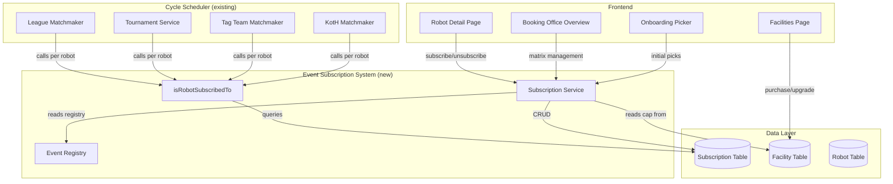

# Design Document

## Spec: Booking Office Facility — Event Subscription System

## Overview

This design implements the dormant Booking Office facility with event-subscription semantics. The system introduces a per-robot subscription model that gates participation in all battle events (1v1 League, 1v1 Tournament, Tag Team, KotH) through a single, extensible Event Registry. The Booking Office facility level determines how many concurrent event subscriptions each robot may hold (3 at L0, +1 per level up to 13 at L10).

**Key design decisions:**

1. **New `Subscription` Prisma model** — a join table between Robot and event type, with a unique constraint on `(robot_id, event_type)`.
2. **Event Registry as a runtime singleton** — initialised at app startup before the cycle scheduler, populated with v1 events, extensible via `registerSubscribableEvent`.
3. **Single eligibility helper** — `isRobotSubscribedTo(robotId, eventType)` is a simple DB existence check, called by every matchmaker.
4. **Per-robot locking predicates** — each registered event provides a `lockingPredicate` function that checks for queued battles per robot.
5. **Migration as a standalone script** — invoked once via `npm run migrate:booking-office`, not registered with the scheduler.
6. **Frontend surfaces** — Robot Detail subscription section, Booking Office overview matrix page, onboarding picker step.

## Architecture

### System Context




### Module Layout

```
app/backend/src/
├── config/
│   ├── facilities.ts                    # Updated: booking_office implemented: true, new costs/prestige
│   └── subscriptions.ts                 # NEW: BOOKING_OFFICE_MAX_EVENTS_PER_ROBOT constant
├── errors/
│   └── subscriptionErrors.ts            # NEW: SubscriptionError class + error codes
├── services/
│   └── subscription/
│       ├── eventRegistry.ts             # NEW: SubscribableEventType, registerSubscribableEvent, registry singleton
│       ├── subscriptionService.ts       # NEW: subscribe, unsubscribe, getSubscriptions, isRobotSubscribedTo
│       ├── lockingPredicates.ts         # NEW: per-event locking predicate implementations
│       └── rosterEligibilityFilter.ts   # NEW: Roster_Eligibility_Filter logic
├── routes/
│   └── subscriptions.ts                 # NEW: /api/subscriptions/* endpoints
├── scripts/
│   └── migrate-booking-office.ts        # NEW: one-off migration script
└── utils/
    └── userGeneration.ts                # Updated: seeded robots get 3 random subscriptions

app/frontend/src/
├── pages/
│   ├── BookingOfficePage.tsx             # NEW: overview matrix page
│   └── OnboardingPage.tsx               # Updated: subscription picker step
├── components/
│   ├── subscriptions/
│   │   ├── SubscriptionManager.tsx      # NEW: Robot Detail subscription section
│   │   ├── SubscriptionMatrix.tsx       # NEW: Booking Office overview matrix
│   │   ├── SubscriptionPicker.tsx       # NEW: Onboarding picker component
│   │   ├── EventBadge.tsx              # NEW: compact event badge for robot cards
│   │   └── SubscriptionLockIndicator.tsx # NEW: lock icon + tooltip
│   └── facilities/
│       └── FacilityCard.tsx             # Updated: Booking Office card links to overview
└── hooks/
    └── useSubscriptions.ts              # NEW: data fetching hook for subscription state
```


## Components and Interfaces

### 1. Configuration: `app/backend/src/config/subscriptions.ts`

_Addresses: R2.1, R2.2, R2.3, R2.4, R2.5_

```typescript
/**
 * Booking Office slot cap curve.
 * Index = Booking Office facility level (0..10).
 * Value = maximum concurrent subscriptions per robot.
 */
export const BOOKING_OFFICE_MAX_EVENTS_PER_ROBOT: readonly number[] = [
  3, 4, 5, 6, 7, 8, 9, 10, 11, 12, 13,
] as const;

/**
 * Get the subscription cap for a robot given its owning Stable's Booking Office level.
 * Treats missing facility as level 0.
 */
export function getSubscriptionCap(bookingOfficeLevel: number): number {
  const clampedLevel = Math.max(0, Math.min(10, bookingOfficeLevel));
  return BOOKING_OFFICE_MAX_EVENTS_PER_ROBOT[clampedLevel];
}
```

### 2. Facility Config Update: `app/backend/src/config/facilities.ts`

_Addresses: R1.1, R1.2, R1.3, R1.6_

The existing `booking_office` entry is updated in-place:

```typescript
{
  type: 'booking_office',
  name: 'Booking Office',
  description: 'Event Subscription System — each level grants +1 concurrent event subscription per robot (3 base + level). Controls which battle events each robot participates in.',
  maxLevel: 10,
  costs: [75000, 150000, 225000, 300000, 375000, 450000, 525000, 600000, 675000, 750000],
  benefits: [
    '4 event subscriptions per robot',
    '5 event subscriptions per robot',
    '6 event subscriptions per robot',
    '7 event subscriptions per robot',
    '8 event subscriptions per robot',
    '9 event subscriptions per robot',
    '10 event subscriptions per robot',
    '11 event subscriptions per robot',
    '12 event subscriptions per robot',
    '13 event subscriptions per robot (maximum)',
  ],
  implemented: true,
  prestigeRequirements: [0, 0, 0, 1000, 0, 0, 5000, 0, 10000, 0],
}
```


### 3. Event Registry: `app/backend/src/services/subscription/eventRegistry.ts`

_Addresses: R5.1, R5.2, R5.3, R5.4, R5.6_

```typescript
/** Stable string identifiers for all subscribable events. */
export type SubscribableEventType = 'league' | 'tournament' | 'tag_team' | 'koth';

export interface SubscribableEventDefinition {
  type: SubscribableEventType;
  label: string;
  /** Returns true if the given robot has an active obligation preventing unsubscribe. */
  lockingPredicate: (robotId: number) => Promise<boolean>;
}

/** Runtime registry — populated at app startup. */
const registry = new Map<SubscribableEventType, SubscribableEventDefinition>();

/**
 * Register a subscribable event. Called once per event type at startup.
 * Throws if the event type is already registered (developer error).
 */
export function registerSubscribableEvent(def: SubscribableEventDefinition): void {
  if (registry.has(def.type)) {
    throw new Error(`[EventRegistry] Duplicate registration for event type: ${def.type}`);
  }
  registry.set(def.type, def);
}

/** Get all registered events (for UI rendering). */
export function getRegisteredEvents(): SubscribableEventDefinition[] {
  return Array.from(registry.values());
}

/** Get a single event definition. Returns undefined if not registered. */
export function getEventDefinition(type: string): SubscribableEventDefinition | undefined {
  return registry.get(type as SubscribableEventType);
}

/** Check if a type is a valid registered event. */
export function isRegisteredEvent(type: string): type is SubscribableEventType {
  return registry.has(type as SubscribableEventType);
}

/** Get the locking predicate for an event type. */
export function getLockingPredicate(type: SubscribableEventType): (robotId: number) => Promise<boolean> {
  const def = registry.get(type);
  if (!def) throw new Error(`[EventRegistry] Unknown event type: ${type}`);
  return def.lockingPredicate;
}
```


### 4. Locking Predicates: `app/backend/src/services/subscription/lockingPredicates.ts`

_Addresses: R5.7, R4.3, R4.7, R4.9_

```typescript
import prisma from '../../lib/prisma';

/** League: robot has a scheduled league match (as robot1 or robot2). */
export async function leagueLockingPredicate(robotId: number): Promise<boolean> {
  const count = await prisma.scheduledLeagueMatch.count({
    where: {
      status: 'scheduled',
      OR: [{ robot1Id: robotId }, { robot2Id: robotId }],
    },
  });
  return count > 0;
}

/** Tournament: robot is alive in an active bracket (not eliminated, tournament not completed). */
export async function tournamentLockingPredicate(robotId: number): Promise<boolean> {
  const count = await prisma.scheduledTournamentMatch.count({
    where: {
      status: { in: ['pending', 'scheduled'] },
      tournament: { status: 'active' },
      OR: [{ robot1Id: robotId }, { robot2Id: robotId }],
      winnerId: null, // not yet decided
    },
  });
  return count > 0;
}

/** Tag Team: robot is on a TagTeam with a scheduled match. */
export async function tagTeamLockingPredicate(robotId: number): Promise<boolean> {
  const count = await prisma.scheduledTagTeamMatch.count({
    where: {
      status: 'scheduled',
      OR: [
        { team1: { OR: [{ activeRobotId: robotId }, { reserveRobotId: robotId }] } },
        { team2: { OR: [{ activeRobotId: robotId }, { reserveRobotId: robotId }] } },
      ],
    },
  });
  return count > 0;
}

/** KotH: robot is a participant in a scheduled KotH match. */
export async function kothLockingPredicate(robotId: number): Promise<boolean> {
  const count = await prisma.scheduledKothMatchParticipant.count({
    where: {
      robotId,
      match: { status: 'scheduled' },
    },
  });
  return count > 0;
}
```


### 5. Subscription Service: `app/backend/src/services/subscription/subscriptionService.ts`

_Addresses: R3.1–R3.8, R4.1–R4.6, R5.5, R10.2, R10.4, R11.1_

```typescript
import prisma from '../../lib/prisma';
import { getSubscriptionCap } from '../../config/subscriptions';
import { isRegisteredEvent, getLockingPredicate, SubscribableEventType } from './eventRegistry';
import { SubscriptionError, SubscriptionErrorCode } from '../../errors/subscriptionErrors';
import logger from '../../config/logger';

/**
 * Check if a robot is subscribed to a specific event type.
 * Single DB existence check — the core eligibility helper used by all matchmakers.
 */
export async function isRobotSubscribedTo(robotId: number, eventType: string): Promise<boolean> {
  const count = await prisma.subscription.count({
    where: { robotId, eventType },
  });
  return count > 0;
}

/**
 * Subscribe a robot to an event type.
 * Runs inside a Prisma interactive transaction with row-level locking.
 */
export async function subscribeRobot(
  robotId: number,
  eventType: string,
  requestingUserId: number,
): Promise<void> {
  await prisma.$transaction(async (tx) => {
    // 1. Verify ownership
    const robot = await tx.robot.findUnique({ where: { id: robotId } });
    if (!robot || robot.userId !== requestingUserId) {
      throw new SubscriptionError(SubscriptionErrorCode.ACCESS_DENIED, 'Access denied', 403);
    }

    // 2. Validate event type
    if (!isRegisteredEvent(eventType)) {
      throw new SubscriptionError(
        SubscriptionErrorCode.SUBSCRIPTION_UNKNOWN_EVENT,
        `Unknown event type: ${eventType}`,
      );
    }

    // 3. Check for duplicate
    const existing = await tx.subscription.findUnique({
      where: { robotId_eventType: { robotId, eventType } },
    });
    if (existing) {
      throw new SubscriptionError(
        SubscriptionErrorCode.SUBSCRIPTION_DUPLICATE,
        `Robot is already subscribed to ${eventType}`,
      );
    }

    // 4. Check cap (lock subscription rows for this robot)
    const currentCount = await tx.subscription.count({ where: { robotId } });
    const facility = await tx.facility.findUnique({
      where: { userId_facilityType: { userId: robot.userId, facilityType: 'booking_office' } },
    });
    const level = facility?.level ?? 0;
    const cap = getSubscriptionCap(level);

    if (currentCount >= cap) {
      throw new SubscriptionError(
        SubscriptionErrorCode.SUBSCRIPTION_CAP_EXCEEDED,
        `Robot has ${currentCount}/${cap} subscriptions. Upgrade Booking Office for more.`,
        400,
        { currentCount, cap, level },
      );
    }

    // 5. Create subscription
    await tx.subscription.create({ data: { robotId, eventType } });

    // 6. Audit log
    await tx.auditLog.create({
      data: {
        cycleNumber: 0, // filled by caller or default
        eventType: 'subscription_create',
        sequenceNumber: Date.now(),
        userId: requestingUserId,
        robotId,
        payload: { eventType, newCount: currentCount + 1, bookingOfficeLevel: level },
      },
    });

    // 7. Structured log
    logger.info('[Subscription] Created', {
      robotId, userId: requestingUserId, eventType, level, newCount: currentCount + 1,
    });
  });
}
```

The `unsubscribeRobot` function follows the same transactional pattern: verify ownership → check locking predicate → delete row → audit log.


### 6. Roster Eligibility Filter: `app/backend/src/services/subscription/rosterEligibilityFilter.ts`

_Addresses: R8.1, R8.2, R8.3, R9.8_

```typescript
import { SubscribableEventType, getRegisteredEvents } from './eventRegistry';

interface EligibilityRule {
  eventType: SubscribableEventType;
  /** Minimum robots the Stable must own for this event to be eligible. */
  minRobots: number;
  /** Human-readable reason when filtered out. */
  reason: string;
}

const ELIGIBILITY_RULES: EligibilityRule[] = [
  { eventType: 'league', minRobots: 1, reason: '' },
  { eventType: 'tournament', minRobots: 1, reason: '' },
  { eventType: 'koth', minRobots: 1, reason: '' },
  { eventType: 'tag_team', minRobots: 2, reason: 'Tag Team requires 2 or more robots in your Stable' },
];

export interface EligibleEvent {
  type: SubscribableEventType;
  label: string;
  eligible: boolean;
  reason?: string;
}

/**
 * Filter the Event Registry by the Stable's robot count.
 * Returns all events with eligibility status.
 */
export function getEligibleEvents(robotCount: number): EligibleEvent[] {
  const registered = getRegisteredEvents();
  return registered.map((event) => {
    const rule = ELIGIBILITY_RULES.find((r) => r.eventType === event.type);
    const eligible = !rule || robotCount >= rule.minRobots;
    return {
      type: event.type,
      label: event.label,
      eligible,
      reason: eligible ? undefined : rule?.reason,
    };
  });
}
```

### 7. Error Codes: `app/backend/src/errors/subscriptionErrors.ts`

_Addresses: R3.2, R3.3, R3.4, R4.3, R10.3_

```typescript
import { AppError } from './AppError';

export const SubscriptionErrorCode = {
  SUBSCRIPTION_CAP_EXCEEDED: 'SUBSCRIPTION_CAP_EXCEEDED',
  SUBSCRIPTION_DUPLICATE: 'SUBSCRIPTION_DUPLICATE',
  SUBSCRIPTION_UNKNOWN_EVENT: 'SUBSCRIPTION_UNKNOWN_EVENT',
  EVENT_SUBSCRIPTION_LOCKED: 'EVENT_SUBSCRIPTION_LOCKED',
  SUBSCRIPTION_NOT_FOUND: 'SUBSCRIPTION_NOT_FOUND',
  ACCESS_DENIED: 'ACCESS_DENIED',
} as const;

export type SubscriptionErrorCodeType = typeof SubscriptionErrorCode[keyof typeof SubscriptionErrorCode];

export class SubscriptionError extends AppError {
  constructor(code: SubscriptionErrorCodeType, message: string, statusCode = 400, details?: unknown) {
    super(code, message, statusCode, details);
    this.name = 'SubscriptionError';
  }
}
```


### 8. API Routes: `app/backend/src/routes/subscriptions.ts`

_Addresses: R10.1, R10.2, R10.3, R10.6, R9.2, R9.10_

| Method | Path | Description | Zod Schema |
|--------|------|-------------|------------|
| GET | `/api/subscriptions/robot/:robotId` | Get all subscriptions for a robot + cap info | `params: { robotId: positiveIntParam }` |
| POST | `/api/subscriptions/robot/:robotId/subscribe` | Subscribe robot to an event | `params: { robotId }, body: { eventType: z.string() }` |
| POST | `/api/subscriptions/robot/:robotId/unsubscribe` | Unsubscribe robot from an event | `params: { robotId }, body: { eventType: z.string() }` |
| GET | `/api/subscriptions/overview` | Stable-level matrix (all robots × all events) | None (uses auth userId) |
| GET | `/api/subscriptions/registry` | List all registered events with eligibility | None (uses auth userId) |
| GET | `/api/subscriptions/admin/analytics` | Admin: per-event subscriber counts + trends | `query: { days?: z.number() }` |

**Route handler pattern** (thin wrapper, follows existing conventions):

```typescript
router.post(
  '/robot/:robotId/subscribe',
  authenticateToken,
  validateRequest({ params: robotIdParamSchema, body: subscribeBodySchema }),
  async (req: AuthRequest, res: Response) => {
    const robotId = Number(req.params.robotId);
    const { eventType } = req.body;
    await subscribeRobot(robotId, eventType, req.user!.userId);
    res.json({ success: true, message: `Subscribed to ${eventType}. Takes effect next cycle.` });
  },
);
```

### 9. Matchmaking Integration Points

_Addresses: R7.1–R7.5, R14.1–R14.4_

Each matchmaker is modified to call `isRobotSubscribedTo` in its candidate-filtering step. The integration is minimal — a single filter added to the existing robot-readiness pipeline.

| Matchmaker | File | Integration Point |
|-----------|------|-------------------|
| 1v1 League | `src/services/analytics/matchmakingService.ts` → `runMatchmaking()` | After `readyRobots` filter, add: `readyRobots.filter(r => await isRobotSubscribedTo(r.id, 'league'))` |
| 1v1 Tournament | `src/services/tournament/tournamentService.ts` → `getEligibleRobotsForTournament()` | After weapon-readiness filter, add subscription check |
| Tag Team | `src/services/tag-team/tagTeamMatchmakingService.ts` → `runTagTeamMatchmaking()` | After `checkTeamSchedulingReadiness`, filter teams where BOTH robots are subscribed |
| KotH | `src/services/koth/kothMatchmakingService.ts` → `getEligibleRobots()` | After weapon-readiness filter, add subscription check |

**Implementation pattern** (batch query for efficiency):

```typescript
// In runMatchmaking(), after readyRobots filter:
const subscribedRobotIds = await prisma.subscription.findMany({
  where: { eventType: 'league', robotId: { in: readyRobots.map(r => r.id) } },
  select: { robotId: true },
});
const subscribedSet = new Set(subscribedRobotIds.map(s => s.robotId));
const eligibleRobots = readyRobots.filter(r => subscribedSet.has(r.id));

// Log exclusions
const excluded = readyRobots.length - eligibleRobots.length;
if (excluded > 0) {
  logger.info(`[Matchmaking] Excluded ${excluded} robots without league subscription`, { leagueId });
}
```

This batch approach avoids N+1 queries — a single `findMany` with an `IN` clause replaces per-robot calls. The `isRobotSubscribedTo` helper remains available for single-robot checks (used by the subscription service and locking predicates).


### 10. Migration Script: `app/backend/src/scripts/migrate-booking-office.ts`

_Addresses: R6.1–R6.7, R6.11, R6.12_

**Invocation:** `npm run migrate:booking-office` (added to `package.json` scripts)

**Strategy:**
- Standalone script with its own Prisma adapter instance (per coding standards for standalone scripts)
- Processes Stables in batches of 50 to avoid memory pressure
- Each Stable processed in its own transaction (facility upsert + robot subscription inserts)
- On per-Stable error: log, continue, include in summary
- Idempotent: uses `upsert` for facility, `createMany` with `skipDuplicates: true` for subscriptions

```typescript
// Pseudocode structure:
async function main(): Promise<void> {
  const summary = { stablesProcessed: 0, facilitiesGranted: 0, subscriptionsCreated: 0, errors: [] };

  const stables = await prisma.user.findMany({ select: { id: true } });

  for (const batch of chunk(stables, 50)) {
    await Promise.all(batch.map(async (stable) => {
      try {
        await prisma.$transaction(async (tx) => {
          // Upsert booking_office facility to at least L1
          await tx.facility.upsert({
            where: { userId_facilityType: { userId: stable.id, facilityType: 'booking_office' } },
            create: { userId: stable.id, facilityType: 'booking_office', level: 1, maxLevel: 10 },
            update: { level: { set: prisma.raw('GREATEST(level, 1)') } }, // never lower
          });

          // Get all robots for this Stable
          const robots = await tx.robot.findMany({ where: { userId: stable.id }, select: { id: true } });

          // Insert 4 subscriptions per robot (skip duplicates)
          for (const robot of robots) {
            await tx.subscription.createMany({
              data: ['league', 'tournament', 'tag_team', 'koth'].map(eventType => ({
                robotId: robot.id,
                eventType,
              })),
              skipDuplicates: true,
            });
          }

          // Audit log
          await tx.auditLog.create({ data: { /* ... */ } });
        });
        summary.stablesProcessed++;
      } catch (err) {
        summary.errors.push({ stableId: stable.id, error: String(err) });
      }
    }));
  }

  // Emit structured summary (R6.3)
  console.log(JSON.stringify(summary, null, 2));
}
```

### 11. Seeded User Generation Update: `app/backend/src/utils/userGeneration.ts`

_Addresses: R6.8, R6.9, R6.10_

After robot creation in the seeded user generator:

1. Determine eligible events via `getEligibleEvents(robotCount)`
2. If the seeded tier has `createTagTeam: true` and the robot is on the TagTeam, force `tag_team` subscription
3. Pick remaining subscriptions randomly from eligible set (up to 3 total, or fewer if eligible < 3)
4. Create subscription rows via `createMany`


### 12. Frontend Components

_Addresses: R9.1–R9.11, R8.1–R8.8_

#### Robot Detail Subscription Section (`SubscriptionManager.tsx`)

- Fetches `GET /api/subscriptions/robot/:robotId` on mount
- Displays current subscriptions as toggleable badges
- Shows cap indicator: "3/4 subscriptions used"
- Disables subscribe when at cap (with upgrade prompt)
- Shows lock indicator on locked subscriptions (with tooltip: "Locked — queued battle in cycle N")
- Filters available events by Roster_Eligibility_Filter
- Shows "no longer eligible" indicator for events where robot count dropped below threshold
- Empty state when zero subscriptions

#### Booking Office Overview Matrix (`BookingOfficePage.tsx` + `SubscriptionMatrix.tsx`)

- Fetches `GET /api/subscriptions/overview` on mount
- Renders a table: rows = robots, columns = registered events
- Each cell is a subscribe/unsubscribe toggle (respects cap and lock state)
- Column headers show per-event totals ("3 of 5 robots subscribed")
- Row headers show per-robot cap usage
- Reachable from Facilities page Booking Office card and main navigation

#### Onboarding Subscription Picker (`SubscriptionPicker.tsx`)

- Rendered as a new step in `OnboardingPage.tsx` (after robot creation, before completion)
- Fetches registry filtered by Roster_Eligibility_Filter
- Pre-selects `league`, `tournament`, `koth` for 1-robot Stables
- Allows toggling up to cap (3 at L0)
- Inline "Buy Booking Office L1" affordance: hidden for 1-robot Stables (R8.3), disabled if insufficient credits/prestige (R8.6, R8.7)
- On complete: calls `POST /api/subscriptions/robot/:robotId/subscribe` for each selected event

#### Facilities Page Updates

- Filter out `implemented: false` facilities at API boundary (R9.1.1, R9.1.2)
- Booking Office card includes link to `/booking-office` overview page (R9.1)

#### Robot Cards Event Badges

- `RobotsPage.tsx` renders `EventBadge` components per subscription on each robot card (R9.6)

### 13. App Startup & Registry Initialisation

_Addresses: R14.2, R5.3_

In `app/backend/src/index.ts`, before the cycle scheduler initialises:

```typescript
import { registerSubscribableEvent } from './services/subscription/eventRegistry';
import {
  leagueLockingPredicate,
  tournamentLockingPredicate,
  tagTeamLockingPredicate,
  kothLockingPredicate,
} from './services/subscription/lockingPredicates';

// Register v1 subscribable events (must happen before cycleScheduler.init())
registerSubscribableEvent({ type: 'league', label: '1v1 League', lockingPredicate: leagueLockingPredicate });
registerSubscribableEvent({ type: 'tournament', label: '1v1 Tournament', lockingPredicate: tournamentLockingPredicate });
registerSubscribableEvent({ type: 'tag_team', label: 'Tag Team', lockingPredicate: tagTeamLockingPredicate });
registerSubscribableEvent({ type: 'koth', label: 'King of the Hill', lockingPredicate: kothLockingPredicate });
```


### 14. Admin Analytics

_Addresses: R11.3, R11.4, R11.5_

**Query strategy for subscription popularity:**

```sql
-- Per-event subscriber counts (used by admin analytics endpoint)
SELECT event_type, COUNT(*) as subscriber_count
FROM subscriptions
GROUP BY event_type;

-- Trend over last 30 cycles (uses audit_logs)
SELECT
  al.cycle_number,
  al.payload->>'eventType' as event_type,
  COUNT(*) FILTER (WHERE al.event_type = 'subscription_create') as subscribes,
  COUNT(*) FILTER (WHERE al.event_type = 'subscription_remove') as unsubscribes
FROM audit_logs al
WHERE al.event_type IN ('subscription_create', 'subscription_remove')
  AND al.cycle_number >= (SELECT total_cycles FROM cycle_metadata WHERE id = 1) - 30
GROUP BY al.cycle_number, al.payload->>'eventType'
ORDER BY al.cycle_number;

-- Per-Stable breakdown
SELECT
  u.id as stable_id,
  u.stable_name,
  s.event_type,
  COUNT(*) as robot_count
FROM subscriptions s
JOIN robots r ON r.id = s.robot_id
JOIN users u ON u.id = r.user_id
GROUP BY u.id, u.stable_name, s.event_type
ORDER BY robot_count DESC;
```

These queries are implemented as service methods in `subscriptionService.ts` and exposed via the admin analytics endpoint at `GET /api/subscriptions/admin/analytics`.

## Data Models

### Prisma Schema Addition

_Addresses: R3.1_

```prisma
model Subscription {
  id        Int      @id @default(autoincrement())
  robotId   Int      @map("robot_id")
  eventType String   @map("event_type") @db.VarChar(30)
  createdAt DateTime @default(now()) @map("created_at")

  // Relations
  robot Robot @relation(fields: [robotId], references: [id], onDelete: Cascade)

  @@unique([robotId, eventType], name: "subscription_robot_event")
  @@index([robotId])
  @@index([eventType])
  @@map("subscriptions")
}
```

**Robot model update** — add relation:

```prisma
model Robot {
  // ... existing fields ...
  subscriptions Subscription[]
  // ... existing relations ...
}
```

### Database Indexes

- `@@unique([robotId, eventType])` — enforces R3.6 (no duplicate subscriptions) at the DB level
- `@@index([robotId])` — fast lookup for "all subscriptions for this robot" (used by cap check, overview)
- `@@index([eventType])` — fast lookup for "all robots subscribed to this event" (used by matchmakers, admin analytics)

### Migration SQL (generated by Prisma Migrate)

```sql
CREATE TABLE "subscriptions" (
  "id" SERIAL PRIMARY KEY,
  "robot_id" INTEGER NOT NULL REFERENCES "robots"("id") ON DELETE CASCADE,
  "event_type" VARCHAR(30) NOT NULL,
  "created_at" TIMESTAMP(3) NOT NULL DEFAULT CURRENT_TIMESTAMP
);

CREATE UNIQUE INDEX "subscription_robot_event" ON "subscriptions"("robot_id", "event_type");
CREATE INDEX "subscriptions_robot_id_idx" ON "subscriptions"("robot_id");
CREATE INDEX "subscriptions_event_type_idx" ON "subscriptions"("event_type");
```


## Correctness Properties

*A property is a characteristic or behavior that should hold true across all valid executions of a system — essentially, a formal statement about what the system should do. Properties serve as the bridge between human-readable specifications and machine-verifiable correctness guarantees.*

### Property 1: Cap curve is monotonically non-decreasing with floor ≥ 3

*For any* pair of consecutive Booking Office levels `L` and `L+1` in [0..9], `BOOKING_OFFICE_MAX_EVENTS_PER_ROBOT[L+1] >= BOOKING_OFFICE_MAX_EVENTS_PER_ROBOT[L]`, AND `BOOKING_OFFICE_MAX_EVENTS_PER_ROBOT[0] >= 3`.

**Validates: Requirements 2.3, 2.4, 13.5**

### Property 2: Subscription cap is never violated by any operation sequence

*For any* robot owned by a Stable with a randomly chosen Booking Office level in [0..10], and *for any* sequence of subscribe and unsubscribe operations drawn from the v1 event registry, the robot's subscription count SHALL never exceed `BOOKING_OFFICE_MAX_EVENTS_PER_ROBOT[level]` at any point in the sequence.

**Validates: Requirements 3.2, 3.5, 3.8, 13.1**

### Property 3: Duplicate subscription prevention

*For any* robot and *for any* event type the robot is already subscribed to, attempting to subscribe again SHALL be rejected with `SUBSCRIPTION_DUPLICATE`, and the subscription set SHALL remain unchanged.

**Validates: Requirements 3.3, 3.6**

### Property 4: Unknown event type rejection

*For any* string that is not a member of the `SubscribableEventType` union, attempting to subscribe a robot to that string SHALL be rejected with `SUBSCRIPTION_UNKNOWN_EVENT`.

**Validates: Requirements 3.4**

### Property 5: Facility level change preserves subscription set

*For any* robot with an existing set of subscriptions, when the owning Stable's Booking Office facility level changes (up or down), the robot's subscription set SHALL remain identical (same event types, same count).

**Validates: Requirements 3.7**

### Property 6: Subscribe/unsubscribe does not charge credits

*For any* subscribe or unsubscribe operation on any robot, the owning Stable's credit balance SHALL be identical before and after the operation.

**Validates: Requirements 4.2**

### Property 7: Unsubscribe blocked iff robot has active obligation

*For any* robot and *for any* event type, unsubscribing SHALL be rejected with `EVENT_SUBSCRIPTION_LOCKED` if and only if the event's `lockingPredicate(robotId)` returns `true` (i.e. the robot has a queued/active battle for that event). When the predicate returns `false`, unsubscribe SHALL succeed.

**Validates: Requirements 4.3, 4.4, 4.7, 4.9, 5.7**

### Property 8: Duplicate registry registration rejected

*For any* `SubscribableEventType` that is already registered, calling `registerSubscribableEvent` with the same type SHALL throw an error at registration time.

**Validates: Requirements 5.4, 13.4**

### Property 9: isRobotSubscribedTo reflects database state

*For any* robot and *for any* event type, `isRobotSubscribedTo(robotId, eventType)` SHALL return `true` if and only if a `Subscription` row exists with that `(robotId, eventType)` pair, regardless of the Stable's Booking Office level.

**Validates: Requirements 5.5, 13.3**

### Property 10: Migration idempotency

*For any* starting state of Users, Robots, Facilities, and Subscriptions, applying the migration script twice SHALL produce the same final state as applying it once. Specifically: no facility level is lowered, no subscription rows are duplicated, and the total row counts are identical after the first and second run.

**Validates: Requirements 6.2, 13.2**

### Property 11: Seeded robot subscription correctness

*For any* seeded robot in a Stable with `robotCount` robots, the robot SHALL receive exactly `min(3, eligibleEventCount)` subscriptions, where `eligibleEventCount` is the number of events passing the Roster_Eligibility_Filter for that `robotCount`. For 1-robot Stables, `tag_team` SHALL NOT appear in the subscription set.

**Validates: Requirements 6.8, 6.9, 6.10**


## Error Handling

### Error Codes and HTTP Responses

| Error Code | HTTP Status | Trigger | User-Facing Message |
|-----------|-------------|---------|---------------------|
| `SUBSCRIPTION_CAP_EXCEEDED` | 400 | Subscribe when at cap | "Robot has reached its subscription limit. Upgrade Booking Office for more." |
| `SUBSCRIPTION_DUPLICATE` | 400 | Subscribe to already-subscribed event | "Robot is already subscribed to this event." |
| `SUBSCRIPTION_UNKNOWN_EVENT` | 400 | Subscribe to unregistered event type | "Unknown event type." |
| `EVENT_SUBSCRIPTION_LOCKED` | 409 | Unsubscribe while robot has queued battle | "Cannot unsubscribe — robot has a queued battle for this event." |
| `SUBSCRIPTION_NOT_FOUND` | 404 | Unsubscribe from event robot isn't subscribed to | "Robot is not subscribed to this event." |
| `ACCESS_DENIED` | 403 | Requester doesn't own the robot | "Access denied" |

### Error Propagation

- All `SubscriptionError` instances extend `AppError` and propagate to the centralized `errorHandler` middleware
- No try-catch in route handlers (Express 5 auto-forwards rejected promises)
- Ownership failures return byte-identical 403 responses regardless of cause (R10.3)
- Locking errors use HTTP 409 (Conflict) to distinguish from validation errors

### Transaction Failure Handling

- Subscribe/unsubscribe operations run in Prisma interactive transactions
- On transaction failure (deadlock, serialization error): the error propagates as a 500, the client retries
- The unique constraint on `(robot_id, event_type)` provides a DB-level safety net against race conditions

### Migration Error Handling

- Per-Stable transaction: if one Stable fails, others continue (R6.7)
- Failed Stables are logged with their ID and error message
- The summary report includes a `errors` array with all failures
- Exit code 1 if any Stable failed (for CI/CD pipeline detection)


## Testing Strategy

### Dual Testing Approach

This feature uses both unit/integration tests and property-based tests for comprehensive coverage.

**Property-based tests** (fast-check, minimum 100 iterations each):
- Backend: Jest 30 + fast-check
- Frontend: Vitest 4 + fast-check
- Each property test references its design document property via tag comment
- Tag format: `// Feature: 35-booking-office-facility, Property N: <property text>`

**Unit/integration tests:**
- Subscription service: cap enforcement, duplicate prevention, lock checking, ownership verification
- Event registry: registration, lookup, duplicate rejection
- Locking predicates: each predicate tested with mocked scheduled matches
- Matchmaker integration: verify `isRobotSubscribedTo` is called and exclusions are logged
- Migration script: idempotency, per-Stable error handling, summary output
- API routes: Zod validation, auth, error responses
- Frontend components: subscription manager, matrix, picker, badge rendering

### Property Test Configuration

```typescript
// Example property test structure (Jest 30 + fast-check)
import fc from 'fast-check';

describe('Subscription cap enforcement', () => {
  it('Property 2: cap never violated by any operation sequence', () => {
    // Feature: 35-booking-office-facility, Property 2: Subscription cap is never violated
    fc.assert(
      fc.property(
        fc.integer({ min: 0, max: 10 }), // Booking Office level
        fc.array(fc.record({
          action: fc.constantFrom('subscribe', 'unsubscribe'),
          eventType: fc.constantFrom('league', 'tournament', 'tag_team', 'koth'),
        }), { minLength: 1, maxLength: 20 }),
        async (level, operations) => {
          // Setup: create robot with given level
          // Execute: apply operations in sequence
          // Assert: subscription count never exceeds cap at any point
        },
      ),
      { numRuns: 100 },
    );
  });
});
```

### Test File Locations

| Test | Location | Framework |
|------|----------|-----------|
| Subscription service unit tests | `app/backend/tests/services/subscription/subscriptionService.test.ts` | Jest 30 |
| Event registry unit tests | `app/backend/tests/services/subscription/eventRegistry.test.ts` | Jest 30 |
| Locking predicates unit tests | `app/backend/tests/services/subscription/lockingPredicates.test.ts` | Jest 30 |
| Cap enforcement property tests | `app/backend/tests/services/subscription/subscriptionProperties.test.ts` | Jest 30 + fast-check |
| Migration property tests | `app/backend/tests/scripts/bookingOfficeMigration.test.ts` | Jest 30 + fast-check |
| isRobotSubscribedTo property tests | `app/backend/tests/services/subscription/eligibilityProperties.test.ts` | Jest 30 + fast-check |
| API route tests | `app/backend/tests/routes/subscriptions.test.ts` | Jest 30 |
| Matchmaker integration tests | `app/backend/tests/services/subscription/matchmakerIntegration.test.ts` | Jest 30 |
| Frontend subscription components | `app/frontend/src/components/subscriptions/__tests__/` | Vitest 4 |
| Frontend onboarding picker | `app/frontend/src/pages/__tests__/OnboardingSubscriptionPicker.test.tsx` | Vitest 4 |
| Frontend Booking Office page | `app/frontend/src/pages/__tests__/BookingOfficePage.test.tsx` | Vitest 4 |

### Coverage Targets

- Subscription service: 90% (critical functionality — economy + matchmaking gating)
- Event registry: 90% (critical — single source of truth)
- Locking predicates: 80% (DB queries, mocked in tests)
- API routes: 80%
- Frontend components: 80%
- Migration script: 80%


## Documentation Impact

The following existing documents and steering files need updating as part of this spec:

### Steering Files

| File | Change |
|------|--------|
| `.kiro/steering/project-overview.md` | Add "Booking Office / Event Subscription System" to Key Systems list (R12.3) |
| `.kiro/steering/game-mechanics-reference.md` | Add Event Subscription System as gating mechanism for all battle events, document Max_Events_Per_Robot (R12.4) |

### Guide Documents

| File | Change |
|------|--------|
| `docs/game-systems/PRD_FACILITIES_PAGE.md` | Add `## Booking Office` section describing event-subscription semantics, cap curve, switching, locking (R12.1) |
| `docs/architecture/PRD_SERVICE_DIRECTORY.md` | Add Event_Subscription_System entry with `registerSubscribableEvent` and `isRobotSubscribedTo` documentation (R12.2) |
| `docs/guides/ERROR_CODES.md` | Add `SUBSCRIPTION_CAP_EXCEEDED`, `SUBSCRIPTION_DUPLICATE`, `SUBSCRIPTION_UNKNOWN_EVENT`, `EVENT_SUBSCRIPTION_LOCKED`, `SUBSCRIPTION_NOT_FOUND` error codes |
| `docs/BACKLOG.md` | Mark Backlog #55 completed, update Backlog #7 to remove Booking Office from unimplemented list (R12.5) |

### New Documentation

| File | Content |
|------|---------|
| In-game guide article (via guide system) | Booking Office facility explanation, subscribable events, switching, locking (R12.6) |
| In-game changelog entry (via changelog system) | New facility announcement, migration behaviour for existing players, implications for new players (R12.7) |

## Requirements Traceability Matrix

| Requirement | Design Section |
|-------------|---------------|
| R1.1–R1.6 | §2 Facility Config Update |
| R2.1–R2.5 | §1 Configuration |
| R3.1–R3.8 | §5 Subscription Service, Data Models |
| R4.1–R4.9 | §5 Subscription Service, §4 Locking Predicates |
| R5.1–R5.7 | §3 Event Registry, §4 Locking Predicates |
| R6.1–R6.12 | §10 Migration Script, §11 Seeded User Generation |
| R7.1–R7.5 | §9 Matchmaking Integration Points |
| R8.1–R8.8 | §12 Frontend Components (Onboarding Picker) |
| R9.1–R9.11 | §12 Frontend Components, §8 API Routes |
| R10.1–R10.6 | §8 API Routes, §5 Subscription Service |
| R11.1–R11.5 | §5 Subscription Service (logging), §14 Admin Analytics |
| R12.1–R12.8 | Documentation Impact section |
| R13.1–R13.6 | Correctness Properties, Testing Strategy |
| R14.1–R14.4 | §13 App Startup, §9 Matchmaking Integration |
