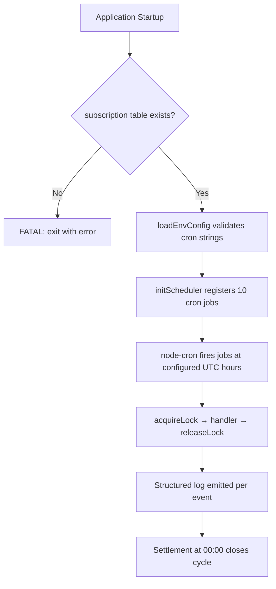

# Design Document

## Spec: Cron Schedule Restructure — Daily-Everything Slot Map

## Overview

This design restructures the `cycleScheduler.ts` cron layout from an ad-hoc, incrementally-grown schedule into a deterministic daily slot map with heavy-mode spacing, reserved slots for future battle events, and midnight settlement. The changes are configuration-driven (env vars with sensible defaults), preserving full rollback capability via `.env` overrides.

### Key Design Decisions

1. **Flat daily cron expressions** — Every battle event uses a simple `0 H * * *` pattern. No weekday arrays, no parity checks. The Booking Office subscription system (Spec 35) gates participation; cadence no longer needs to.

2. **Settlement as cycle boundary at 00:00 UTC** — Settlement closes the previous cycle. All battle events fire between 08:00 and 18:00, giving a clean 6-hour gap before settlement and an 8-hour overnight window for ops.

3. **Reserved slots as no-op stubs** — Future battle modes (Team Battle 2v2/3v3, Grand Melee) get cron entries and handler stubs today. Subsequent specs only register real handlers — no env.ts or slot map changes needed.

4. **Expanded `JobState` union type** — The `name` field on `JobState` grows from 5 to 10 members. The `SchedulerConfig` interface gains 5 new schedule fields. Both are backward-compatible additions.

5. **Admin bulk-cycle tool mirrors slot order** — `executeBulkCycles` executes events in the documented slot order (R1.1) deterministically, removing the odd-cycle and weekday-only skips for tag team and KotH.

### Dependency: Spec 35 (Booking Office)

This spec depends on Spec 35 being deployed. A startup assertion in `src/index.ts` verifies the `subscription` table exists before the scheduler initialises. Without subscriptions, moving Tag Team and KotH to daily would double per-Stable volume overnight.

---

## Architecture

### High-Level Flow



### Slot Map (Canonical)

| UTC  | Event                              | Env Var                          | Handler Status |
|------|------------------------------------|----------------------------------|----------------|
| 08:00 | 1v1 League                        | `LEAGUE_SCHEDULE`                | Live           |
| 09:00 | Team Battle 2v2 League (reserved) | `TEAM_2V2_LEAGUE_SCHEDULE`       | Stub           |
| 10:00 | 1v1 Tournament                    | `TOURNAMENT_SCHEDULE`            | Live           |
| 11:00 | Tag Team                          | `TAGTEAM_SCHEDULE`               | Live           |
| 13:00 | KotH                              | `KOTH_SCHEDULE`                  | Live           |
| 14:00 | Team Battle 3v3 League (reserved) | `TEAM_3V3_LEAGUE_SCHEDULE`       | Stub           |
| 15:00 | Team Battle 2v2 Tournament (reserved) | `TEAM_2V2_TOURNAMENT_SCHEDULE` | Stub       |
| 17:00 | Grand Melee (reserved)            | `GRAND_MELEE_SCHEDULE`           | Stub           |
| 18:00 | Team Battle 3v3 Tournament (reserved) | `TEAM_3V3_TOURNAMENT_SCHEDULE` | Stub       |
| 00:00 | Settlement                        | `SETTLEMENT_SCHEDULE`            | Live           |

**Spacing rationale**: Heavy modes (1v1 League at 08:00, KotH at 13:00) are 5 hours apart. Light/reserved modes interleave. Gaps at 12:00, 16:00, 19:00–23:00 provide ops intervention windows.

### Concurrency Model

The existing in-memory mutex (`acquireLock` / `releaseLock`) serialises job execution. Settlement at 00:00 acquires the lock like any other job. If a battle handler overruns into the 00:00 window, settlement queues behind it (per existing behavior). The `node-cron` library fires each job independently; the lock ensures no two handlers run concurrently.

Per R5.4, if a battle handler is still running at 00:00, settlement begins once the lock is released. The cycle close (`totalCycles` increment) still occurs exactly once because it's inside `executeSettlement`.

---

## Components and Interfaces

### 1. `app/backend/src/config/env.ts` — Environment Schema

**Changes:**
- Update `LEAGUE_SCHEDULE` default from `'0 20 * * *'` to `'0 8 * * *'`
- Update `TOURNAMENT_SCHEDULE` default from `'0 8 * * *'` to `'0 10 * * *'`
- Update `TAGTEAM_SCHEDULE` default from `'0 12 * * *'` to `'0 11 * * *'`
- Update `KOTH_SCHEDULE` default from `'0 16 * * 1,3,5'` to `'0 13 * * *'`
- Update `SETTLEMENT_SCHEDULE` default from `'0 23 * * *'` to `'0 0 * * *'`
- Update `DAILY_REPORT_SCHEDULE` default from `'0 8 * * *'` to `'30 0 * * *'`
- Add 5 new env vars:
  - `TEAM_2V2_LEAGUE_SCHEDULE` (default `'0 9 * * *'`)
  - `TEAM_3V3_LEAGUE_SCHEDULE` (default `'0 14 * * *'`)
  - `TEAM_2V2_TOURNAMENT_SCHEDULE` (default `'0 15 * * *'`)
  - `TEAM_3V3_TOURNAMENT_SCHEDULE` (default `'0 18 * * *'`)
  - `GRAND_MELEE_SCHEDULE` (default `'0 17 * * *'`)

**EnvConfig interface additions:**
```typescript
team2v2LeagueSchedule: string;
team3v3LeagueSchedule: string;
team2v2TournamentSchedule: string;
team3v3TournamentSchedule: string;
grandMeleeSchedule: string;
```

**Validates: R1.1, R1.3, R1.4, R1.5, R5.5**

### 2. `app/backend/src/services/cycle/cycleScheduler.ts` — Scheduler Core

**Interface changes:**

```typescript
export interface SchedulerConfig {
  enabled: boolean;
  leagueSchedule: string;
  tournamentSchedule: string;
  tagTeamSchedule: string;
  settlementSchedule: string;
  kothSchedule: string;
  // New reserved slots
  team2v2LeagueSchedule: string;
  team3v3LeagueSchedule: string;
  team2v2TournamentSchedule: string;
  team3v3TournamentSchedule: string;
  grandMeleeSchedule: string;
}

export interface JobState {
  name:
    | 'league'
    | 'tournament'
    | 'tagTeam'
    | 'settlement'
    | 'koth'
    | 'team2v2League'
    | 'team3v3League'
    | 'team2v2Tournament'
    | 'team3v3Tournament'
    | 'grandMelee';
  schedule: string;
  lastRunAt: Date | null;
  lastRunDurationMs: number | null;
  lastRunStatus: 'success' | 'failed' | null;
  lastError: string | null;
  nextRunAt: Date | null;
}
```

**New reserved-slot stub handler:**

```typescript
function createReservedSlotHandler(eventName: string): () => Promise<JobContext> {
  return async () => {
    const cycleMetadata = await prisma.cycleMetadata.findUnique({ where: { id: 1 } });
    const cycleNumber = cycleMetadata?.totalCycles ?? 0;
    logger.info(
      `Scheduler: reserved slot "${eventName}" fired (cycle ${cycleNumber}) — reserved slot, no handler implemented yet`
    );
    return { jobName: eventName as JobContext['jobName'] };
  };
}
```

**`initScheduler` changes:**
- Register 10 jobs (5 existing + 5 reserved stubs) instead of 5
- All jobs use the same `runJob` wrapper with lock, logging, and error handling
- Log message updated: "all 10 jobs registered and active"

**`executeTagTeamCycle` changes:**
- Remove the cycle parity check (`isOddCycle` branch) — always execute
- Always execute tag team battles, rebalancing, and matchmaking
- Change matchmaking lead time from 48h to 24h (daily cadence means next execution is tomorrow)

**`executeKothCycle` changes:**
- Remove `getNextKothScheduledDate` usage
- Schedule matchmaking for next day at configured hour (24h offset)

**Structured logging enhancement (R7.1):**
After each handler completes (in `runJob`), emit a structured log entry:
```typescript
logger.info({
  event: 'battle_event_complete',
  eventName: jobName,
  startTimestamp: startTime.toISOString(),
  durationMs,
  matchesProcessed: jobContext?.matchesCompleted ?? 0,
  failures: state?.lastRunStatus === 'failed' ? 1 : 0,
});
```

**Validates: R1.1, R1.2, R2.1, R2.3, R2.5, R4.1, R4.2, R4.3, R4.4, R4.5, R5.1, R5.3, R5.4, R7.1, R7.4**

### 3. `app/backend/src/services/tag-team/tagTeamMatchmakingService.ts` — Tag Team Cadence

**Changes:**
- Delete `shouldRunTagTeamMatchmaking()` function entirely (lines 23–38)
- Remove the export from `app/backend/src/services/tag-team/index.ts`
- No changes to `runTagTeamMatchmaking`, `getEligibleTeams`, `pairTeams`, or `scheduleMatches` — subscription filtering is already in place from Spec 35

**Impact of removal (LOW risk):**
- No production code calls `shouldRunTagTeamMatchmaking` — the admin bulk cycle tool uses its own inline `currentCycleNumber % 2 === 1` check
- `tests/tagTeamValidation.property.test.ts` — 5 property-based tests that assert odd/even cycle behavior become obsolete and are deleted
- `app/backend/src/services/tag-team/index.ts` — remove the export line

**Validates: R2.1, R2.2, R3.1**

### 4. `app/backend/src/services/koth/kothMatchmakingService.ts` — KotH Cadence

**Changes:**
- Remove `getNextKothScheduledDate()` function (lines 526–543 in `cycleScheduler.ts`) — replace with a simple 24h-from-now calculation
- In `executeKothCycle`: replace `getNextKothScheduledDate()` call with `new Date(Date.now() + 24 * 60 * 60 * 1000)` rounded to the hour
- Remove the `rotatingZone` day-of-week logic (Wednesday variant) — with daily cadence, zone rotation can use cycle number modulo instead (preserving the 1-in-3 ratio)
- No changes to subscription filtering — already in place from Spec 35

**Impact of removal (LOW risk):**
- `getNextKothScheduledDate` is only called by `executeKothCycle` in the same file — no external consumers
- The `kothDays` weekday array is local to that function — no other references

**Validates: R2.3, R2.4, R3.2**

### 5. `app/backend/src/services/admin/adminCycleService.ts` — Bulk Cycle Tool

**Changes:**
- Remove `shouldRunTagTeam` parity check (`currentCycleNumber % 2 === 1`) — tag team executes every cycle
- Remove `isKothDay` weekday simulation (`simulatedDayOfWeek === 1 || 3 || 5`) — KotH executes every cycle
- Restructure to match production cron handlers: each event runs as a self-contained block (repair → execute → rebalance → matchmaking) in slot map order

**New step ordering (mirrors production cron job internals):**

| Step | Event | Substeps |
|------|-------|----------|
| 1 | 1v1 League | repair → execute battles → rebalance leagues → matchmaking (24h lead) |
| 2 | Team 2v2 League (stub) | no-op log |
| 3 | 1v1 Tournament | repair → execute/advance rounds → auto-create next |
| 4 | Tag Team | repair → execute battles → rebalance tag team leagues → matchmaking (24h lead) |
| 5 | KotH | repair → execute battles → matchmaking (24h lead) |
| 6 | Team 3v3 League (stub) | no-op log |
| 7 | Team 2v2 Tournament (stub) | no-op log |
| 8 | Grand Melee (stub) | no-op log |
| 9 | Team 3v3 Tournament (stub) | no-op log |
| 10 | Settlement | user gen → finances → cycle counters → snapshots → orphan cleanup |

**Rationale:** Each production cron job (`executeLeagueCycle`, `executeTagTeamCycle`, `executeKothCycle`, `executeTournamentCycle`) is self-contained: it repairs, executes, rebalances (if applicable), and runs matchmaking for the next cycle — all within a single handler. The bulk cycle tool must mirror this so ACC (running bulk cycles) behaves identically to production (running individual crons at their scheduled times).

**Tag Team matchmaking lead time:** Changes from 48h to 24h (daily cadence means next execution is always tomorrow, not 2 days out).

**Validates: R6.1, R6.2**

### 6. `app/backend/src/routes/admin.ts` — Admin Endpoints

**Changes:**
- Add 5 new POST endpoints for reserved slots:
  - `POST /api/admin/team-2v2-league/trigger`
  - `POST /api/admin/team-3v3-league/trigger`
  - `POST /api/admin/team-2v2-tournament/trigger`
  - `POST /api/admin/team-3v3-tournament/trigger`
  - `POST /api/admin/grand-melee/trigger`
- Each returns HTTP 200 with body: `{ message: "reserved slot, no handler implemented", event: "<name>" }`
- Each emits an `adminAuditLog` row recording the no-op outcome
- All guarded by `authenticateToken` + `requireAdmin`

**Validates: R6.3, R8.2, R8.3**

### 7. `app/backend/src/index.ts` — Startup Assertion

**Addition:**
```typescript
// Verify Spec 35 (Booking Office) prerequisite
const subscriptionTableExists = await prisma.$queryRaw<Array<{ exists: boolean }>>`
  SELECT EXISTS (
    SELECT FROM information_schema.tables
    WHERE table_name = 'subscription'
  )`;
if (!subscriptionTableExists[0]?.exists) {
  logger.error('FATAL: subscription table does not exist. Spec 35 (Booking Office) must be deployed first.');
  process.exit(1);
}
```

**Validates: R3.5, R12.1**

### 8. `app/backend/src/config/env.ts` — Cron Validation at Startup

**Addition** (in `loadEnvConfig` or a post-parse hook):
```typescript
import cron from 'node-cron';

function validateCronExpressions(config: EnvConfig): void {
  const cronFields: Array<[string, string]> = [
    ['LEAGUE_SCHEDULE', config.leagueSchedule],
    ['TOURNAMENT_SCHEDULE', config.tournamentSchedule],
    ['TAGTEAM_SCHEDULE', config.tagTeamSchedule],
    ['KOTH_SCHEDULE', config.kothSchedule],
    ['SETTLEMENT_SCHEDULE', config.settlementSchedule],
    ['TEAM_2V2_LEAGUE_SCHEDULE', config.team2v2LeagueSchedule],
    ['TEAM_3V3_LEAGUE_SCHEDULE', config.team3v3LeagueSchedule],
    ['TEAM_2V2_TOURNAMENT_SCHEDULE', config.team2v2TournamentSchedule],
    ['TEAM_3V3_TOURNAMENT_SCHEDULE', config.team3v3TournamentSchedule],
    ['GRAND_MELEE_SCHEDULE', config.grandMeleeSchedule],
    ['DAILY_REPORT_SCHEDULE', config.dailyReportSchedule],
  ];

  for (const [envVar, expression] of cronFields) {
    if (!cron.validate(expression)) {
      process.stderr.write(`\nFATAL: Invalid cron expression for ${envVar}: "${expression}"\n`);
      process.exit(1);
    }
  }
}
```

**Validates: R8.1**

### 9. Frontend: Admin Cycle Controls Page

**Changes:**
- Render the full 10-slot map with per-event last-run timestamp
- Reserved slots display a "Reserved" badge (muted styling, no "Run" button)
- Existing live events retain their current "Run" button behavior

**Validates: R6.4**

### 10. Subscription Integration (Reaffirmed — No Code Changes)

The subscription checks are already implemented in Spec 35:
- `kothMatchmakingService.ts` → `getEligibleRobots()` filters by `subscription` table with `eventType: 'koth'`
- `tagTeamMatchmakingService.ts` → `getEligibleTeams()` filters by `subscription` table with `eventType: 'tag_team'`
- `matchmakingService.ts` → filters by `subscription` table with `eventType: 'league'`
- `tournamentService.ts` → filters by `subscription` table with `eventType: 'tournament'`

**Note:** The requirements reference `isStableSubscribedTo(stableId, eventType)` but the actual implementation uses per-robot subscription checks (`isRobotSubscribedTo` and batch queries against the `subscription` table). This is correct — the Booking Office operates at robot granularity, not stable granularity. No changes needed here.

**Validates: R3.1, R3.2, R3.3, R3.4**

---

## Data Models

### No Schema Migrations Required

This spec does not add or modify database tables. All changes are:
- Environment configuration (env.ts)
- Application code (scheduler, matchmaking services, admin routes)
- Documentation

The `subscription` table (from Spec 35) is a read-only dependency — this spec queries it but does not modify its schema.

### In-Memory State Changes

The `jobStates` Map in `cycleScheduler.ts` grows from 5 entries to 10 entries. The `JobState['name']` union type expands accordingly. This is a runtime-only change with no persistence implications.

---

## Correctness Properties

*A property is a characteristic or behavior that should hold true across all valid executions of a system — essentially, a formal statement about what the system should do. Properties serve as the bridge between human-readable specifications and machine-verifiable correctness guarantees.*

### Property 1: Slot Uniqueness

*For any* valid slot map configuration (the set of 10 cron expressions from env vars), no two events SHALL resolve to the same UTC hour within a 24-hour window.

**Validates: Requirements 1.1, 11.1**

### Property 2: Settlement Boundary Ordering

*For any* valid slot map configuration, the settlement job's UTC hour (0) SHALL be strictly less than the smallest battle-event UTC hour within the same cycle — i.e., settlement closes the previous cycle before any battle event of the next cycle starts.

**Validates: Requirements 2.6, 5.1, 5.3, 11.2**

### Property 3: Execution Logging Completeness

*For any* cycle number and any subset of battle event handlers that execute during that cycle, each handler SHALL be logged exactly once with a non-null duration in milliseconds.

**Validates: Requirements 7.1, 11.3**

---

## Error Handling

### Startup Failures

| Condition | Behavior |
|-----------|----------|
| `subscription` table missing | `process.exit(1)` with message: "Spec 35 (Booking Office) must be deployed first" |
| Invalid cron expression in any schedule env var | `process.exit(1)` with message pointing at the offending env var |
| Missing required env vars (production only) | Existing Zod validation fails with formatted issue list |

### Runtime Failures

| Condition | Behavior |
|-----------|----------|
| Battle event handler throws | `runJob` catches, logs error with event name, sets `lastRunStatus: 'failed'`, dispatches error notification, releases lock. Subsequent events and settlement still fire. (R7.4) |
| Reserved slot stub fires | Logs info message, returns success. Not counted as failure. (R4.4) |
| Settlement handler throws | Same as battle event — logged, notification dispatched. `totalCycles` may not increment if the throw occurs before that step. Ops must investigate. |
| Lock contention (handler overrun into next slot) | Next job queues behind the lock. Settlement fires once lock is released. (R5.4) |

### Rollback Procedure (R10.1–R10.3)

If a critical defect is discovered post-deploy:
1. Set env vars to previous values in `.env`:
   - `LEAGUE_SCHEDULE='0 20 * * *'`
   - `TAGTEAM_SCHEDULE='0 12 * * *'`
   - `KOTH_SCHEDULE='0 16 * * 1,3,5'`
   - `SETTLEMENT_SCHEDULE='0 23 * * *'`
2. Restore `shouldRunTagTeamMatchmaking` from git history (one function, one export)
3. Restore `getNextKothScheduledDate`'s `kothDays` array (one constant)
4. Restart the application — scheduler picks up new env values

This procedure is documented in `docs/guides/DEPLOYMENT.md`.

---

## Testing Strategy

### Property-Based Tests (fast-check, Jest 30)

| Property | Test File | Iterations | Tag |
|----------|-----------|------------|-----|
| Property 1: Slot Uniqueness | `tests/cronSchedule.property.test.ts` | 100+ | `Feature: 36-cron-schedule-restructure, Property 1: For any valid slot map, no two events fire in the same hour` |
| Property 2: Settlement Boundary | `tests/cronSchedule.property.test.ts` | 100+ | `Feature: 36-cron-schedule-restructure, Property 2: For any valid slot map, settlement hour < minimum battle event hour` |
| Property 3: Logging Completeness | `tests/cronSchedule.property.test.ts` | 100+ | `Feature: 36-cron-schedule-restructure, Property 3: For any cycle, every executed handler is logged exactly once with non-null duration` |

**Library:** `fast-check` (already in project dependencies)
**Configuration:** Each test uses `fc.assert` with `{ numRuns: 100 }` minimum. On failure, fast-check reports the seed and shrunk counter-example. CI fails on any property violation.

### Unit Tests

| Area | Test File | Coverage |
|------|-----------|----------|
| Env defaults match slot map | `tests/config/env.test.ts` | R1.3, R1.4 |
| Reserved slot stubs log and return | `tests/services/cycle/reservedSlots.test.ts` | R4.2, R4.4 |
| Tag team runs without parity check | `tests/services/tag-team/tagTeamMatchmaking.test.ts` | R2.1, R2.2 |
| KotH runs without weekday check | `tests/services/koth/kothMatchmaking.test.ts` | R2.3, R2.4 |
| Startup assertion for subscription table | `tests/startup.test.ts` | R3.5, R12.1 |
| Cron validation rejects invalid expressions | `tests/config/cronValidation.test.ts` | R8.1 |
| Admin reserved-slot endpoints return 200 | `tests/routes/admin.test.ts` | R6.3, R8.3 |
| executeBulkCycles exercises new order | `tests/services/admin/adminCycleService.test.ts` | R6.1, R6.2 |

### Integration Tests

| Area | Verification |
|------|-------------|
| Full cycle with all 10 slots | Deploy to dev DB, observe one cycle, assert all events fire or short-circuit |
| Subscription gating | Stable without tag_team subscription excluded from Tag Team daily |
| Settlement at midnight | Verify `cycleMetadata.totalCycles` increments exactly once per UTC day |

### Existing Tests to Update

- `tests/tagTeamValidation.property.test.ts` — Remove/update tests for `shouldRunTagTeamMatchmaking` (the odd-cycle property tests become obsolete)
- `tests/services/admin/adminCycleService.test.ts` — Update to reflect new slot order and removal of parity/weekday skips

---

## Documentation Impact

| File | Change | Requirement |
|------|--------|-------------|
| `docs/architecture/PRD_SERVICE_DIRECTORY.md` | Add `## Cron Schedule` section with full slot map table | R9.1 |
| `.kiro/steering/project-overview.md` | Add "Daily Cron Schedule" entry referencing canonical slot map | R9.2 |
| `.kiro/steering/game-mechanics-reference.md` | Document that all battle events run daily; subscriptions gate participation | R9.3 |
| `.kiro/steering/environments-and-deployment.md` | Update cron schedule table: new times, remove "Mon/Wed/Fri" for KotH, add reserved slots | R9.1 |
| `docs/game-systems/PRD_CYCLE_SYSTEM.md` | Remove "odd cycles only" / "Mon/Wed/Fri only" references; update schedule table to new slot map; update bulk cycle step table to match new self-contained ordering | R2.1, R2.3, R6.1 |
| `docs/game-systems/PRD_MATCHMAKING.md` | KotH schedule section: "Mon/Wed/Fri at 16:00 UTC" → "daily at 13:00 UTC" | R2.3 |
| `docs/game-systems/GAME_DESIGN.md` | Battle modes table: Tag Team "48h cadence" → "daily (11:00 UTC)"; KotH "Mon/Wed/Fri (16:00 UTC)" → "daily (13:00 UTC)" | R2.1, R2.3 |
| `src/content/guide/getting-started/daily-cycle.md` | Remove odd/even cycle distinction for tag team; update schedule table; change 48h lead to 24h | R2.1 |
| `src/content/guide/facilities/booking-office.md` | Tag Team row: remove "on odd cycles" | R2.1 |
| `src/content/guide/king-of-the-hill/entry-requirements.md` | Schedule section: "Mon/Wed/Fri at 4:00 PM UTC" → "daily at 1:00 PM UTC" | R2.3 |
| `docs/BACKLOG.md` | Add/update entry for Spec 36 referencing `.kiro/specs/to-do/36-cron-schedule-restructure/` | R9.4 |
| In-game changelog (via changelog system) | Entry explaining: Tag Team/KotH now daily, settlement at midnight, subscriptions gate events | R9.5 |
| `docs/guides/DEPLOYMENT.md` | Add rollback procedure for slot map reversion; list Spec 35 as hard prerequisite | R10.3, R12.1 |
| `.env.example` / `.env.production.example` / `.env.acc.example` | Add 5 new env vars with defaults; update existing schedule defaults | R1.3 |

---

## Requirements Traceability Matrix

| Requirement | Design Section |
|-------------|---------------|
| R1.1–R1.5 | Components §1 (env.ts), §2 (cycleScheduler.ts), Architecture §Slot Map |
| R2.1–R2.2 | Components §3 (tagTeamMatchmakingService.ts) |
| R2.3–R2.4 | Components §4 (kothMatchmakingService.ts) |
| R2.5 | Components §2 (executeTagTeamCycle, executeKothCycle — semantics preserved) |
| R2.6 | Components §2 (executeSettlement unchanged), Architecture §Slot Map |
| R3.1–R3.4 | Components §10 (Subscription Integration — no changes needed) |
| R3.5 | Components §7 (startup assertion) |
| R4.1–R4.5 | Components §2 (reserved slot stubs) |
| R5.1–R5.4 | Components §2 (settlement), Architecture §Concurrency Model |
| R5.5 | Components §1 (DAILY_REPORT_SCHEDULE default change) |
| R6.1–R6.2 | Components §5 (adminCycleService.ts) |
| R6.3 | Components §6 (admin routes) |
| R6.4 | Components §9 (frontend admin page) |
| R7.1 | Components §2 (structured logging in runJob) |
| R7.2 | Components §2 (executeSettlement logging — already exists, enhanced) |
| R7.3 | Components §1 (DAILY_REPORT_SCHEDULE moved to post-settlement) |
| R7.4 | Components §2 (runJob error handling — already exists) |
| R8.1 | Components §8 (cron validation) |
| R8.2–R8.3 | Components §6 (admin routes with auth + audit) |
| R9.1–R9.6 | Documentation Impact table (documentation-only requirements) |
| R10.1–R10.3 | Error Handling §Rollback Procedure |
| R11.1–R11.4 | Correctness Properties, Testing Strategy §Property-Based Tests |
| R12.1 | Components §7 (startup assertion) |
| R12.2 | Components §2 (reserved slot pattern enables future handler registration) |
