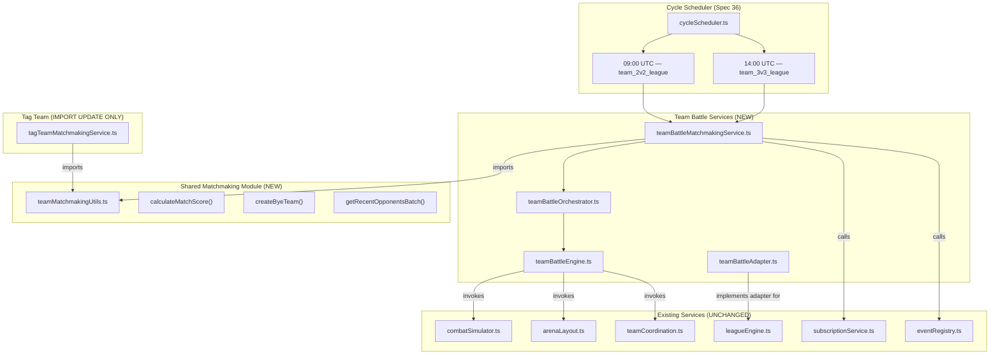

# Design Document

## Spec: Team Battles (2v2 and 3v3)

## Overview

This design introduces two new simultaneous-combat battle modes — 2v2 League and 3v3 League — where all robots on both sides are active in the arena at the same time. The system builds on `combatSimulator.ts` (extended for N-vs-N rosters), reuses the existing `leagueEngine.ts` with a new `teamBattleAdapter`, and extracts shared matchmaking utilities into `teamMatchmakingUtils.ts` consumed by all three league matchmakers (1v1, 2v2, 3v3) and tag team.

### Key Design Decisions

1. **Shared LP-primary matchmaking formula** — A single `calculateMatchScore` in `teamMatchmakingUtils.ts` replaces the existing 1v1 and tag team scoring. All leagues use identical pairing logic: LP-primary, ELO-secondary (no hard reject), +400 recent-opponent penalty, +10000 same-stable penalty, guarantee no bye when real opponents exist.

2. **No separate Team ELO field** — Team ELO is computed at matchmaking time as the sum of member robots' individual ELOs (same pattern as tag team). ELO changes from team battles update individual robot ELO fields equally across all members.

3. **Event naming standardisation** — `league` → `league_1v1`, `tournament` → `tournament_1v1`, new `league_2v2` and `league_3v3`. Migration covers both `subscriptions` and `battle` tables.

4. **Multiple teams per size per stable** — A stable can own multiple 2v2 teams (e.g. 4 robots → 2 teams of 2). Same pattern as tag team.

5. **Incomplete rosters allowed** — A team can temporarily have fewer than N members (INELIGIBLE until filled). Team identity (LP, tier, history) persists across member changes. Team = F1 team, robots = drivers.

6. **Existing leagueEngine.ts with teamBattleAdapter** — No new league instance service extraction. Same promotion/demotion config as 1v1 (10% promote, 10% demote, 5 min cycles). Instance size: 50 teams.

7. **Team Coordination formulas scaled against 50** — Realistic mid-game bonuses (~13% focus fire, 0.44 shield/sec, 11% reduction at attribute=15).

8. **N× reward multiplier** — 2v2 winner gets 2× what a single robot earns in 1v1; 3v3 winner gets 3×. Each robot on the team earns the full multiplied amount.

---

## Architecture

### High-Level System Flow



### Before/After Module Layout

**Before (current state):**
```
app/backend/src/services/
├── analytics/
│   └── matchmakingService.ts          # 1v1 matchmaking with inline calculateMatchScore
├── tag-team/
│   └── tagTeamMatchmakingService.ts   # Tag team matchmaking with inline bye-team, scoring, recent-opponent
├── league/
│   ├── leagueEngine.ts                # Generic promotion/demotion (robotAdapter, tagTeamAdapter)
│   └── leagueInstanceService.ts       # 1v1 league instance management
├── cycle/
│   └── cycleScheduler.ts              # 10-slot map with team_2v2_league and team_3v3_league as STUBS
└── subscription/
    ├── eventRegistry.ts               # Events: 'league', 'tournament', 'tag_team', 'koth'
    └── subscriptionService.ts         # isRobotSubscribedTo helper
```

**After (this spec):**
```
app/backend/src/services/
├── analytics/
│   └── matchmakingService.ts          # 1v1 matchmaking — calculateMatchScore REPLACED with import from shared
├── matchmaking/                       # NEW shared module
│   └── teamMatchmakingUtils.ts        # calculateMatchScore, createByeTeam, getRecentOpponentsBatch
├── tag-team/
│   └── tagTeamMatchmakingService.ts   # IMPORT UPDATE: bye-team + scoring from teamMatchmakingUtils
├── team-battle/                       # NEW
│   ├── teamBattleMatchmakingService.ts
│   ├── teamBattleOrchestrator.ts
│   ├── teamBattleEngine.ts
│   ├── teamBattleService.ts           # Team CRUD (register, swap, rename, disband)
│   ├── teamBattleRewardService.ts
│   ├── teamBattleAdapter.ts           # LeagueAdapter<TeamBattle> for leagueEngine.ts
│   └── teamCoordinationEffects.ts     # Ally-targeted effects (focus fire, shield, formation)
├── league/
│   ├── leagueEngine.ts                # UNCHANGED — gains teamBattleAdapter consumer
│   └── leagueInstanceService.ts       # UNCHANGED
├── cycle/
│   └── cycleScheduler.ts              # Stubs REPLACED with real handlers
└── subscription/
    ├── eventRegistry.ts               # Events: 'league_1v1', 'tournament_1v1', 'tag_team', 'koth', 'league_2v2', 'league_3v3'
    ├── subscriptionService.ts         # UNCHANGED
    ├── lockingPredicates.ts           # GAINS league2v2LockingPredicate, league3v3LockingPredicate
    └── rosterEligibilityFilter.ts     # GAINS league_2v2 (minRobots:2), league_3v3 (minRobots:3)
```

### Component Map

| Component | Status | Description |
|-----------|--------|-------------|
| `services/matchmaking/teamMatchmakingUtils.ts` | **EXTRACTED** | Shared scoring formula, bye-team factory, recent-opponent batch query |
| `services/team-battle/teamBattleMatchmakingService.ts` | **NEW** | 2v2/3v3 matchmaking orchestration per league instance |
| `services/team-battle/teamBattleOrchestrator.ts` | **NEW** | Battle execution: fetch scheduled matches, invoke engine, persist results |
| `services/team-battle/teamBattleEngine.ts` | **NEW** | N-vs-N simulation wrapper around combatSimulator |
| `services/team-battle/teamBattleService.ts` | **NEW** | Team CRUD: register, swap member, rename, disband |
| `services/team-battle/teamBattleRewardService.ts` | **NEW** | Reward calculation and distribution (N× multiplier) |
| `services/team-battle/teamBattleAdapter.ts` | **NEW** | `LeagueAdapter<TeamBattle>` for leagueEngine.ts |
| `services/team-battle/teamCoordinationEffects.ts` | **NEW** | Ally-targeted formulas for syncProtocols, supportSystems, formationTactics |
| `services/analytics/matchmakingService.ts` | **MODIFIED** | `calculateMatchScore` replaced with import from shared module |
| `services/tag-team/tagTeamMatchmakingService.ts` | **MODIFIED** | Inline utilities replaced with imports from shared module |
| `services/subscription/eventRegistry.ts` | **MODIFIED** | Type union extended; `league`→`league_1v1`, `tournament`→`tournament_1v1` |
| `services/subscription/lockingPredicates.ts` | **MODIFIED** | +2 new predicates |
| `services/subscription/rosterEligibilityFilter.ts` | **MODIFIED** | +2 new rules |
| `services/cycle/cycleScheduler.ts` | **MODIFIED** | Stubs replaced with real handlers |
| `services/league/leagueEngine.ts` | **UNCHANGED** | Consumed by new teamBattleAdapter |
| `services/battle/combatSimulator.ts` | **EXTENDED** | Accepts N-vs-N team rosters |
| `services/arena/arenaLayout.ts` | **UNCHANGED** | `createArena(teamSizes)` already supports variable sizes |
| `services/arena/teamCoordination.ts` | **UNCHANGED** | 1v1 self-bonuses remain as-is |

---

## Components and Interfaces

### 1. Shared Matchmaking Module: `services/matchmaking/teamMatchmakingUtils.ts`

_Addresses: R4.1, R4.1a, R4.3, R4.5, R14.6_

Extracted from `tagTeamMatchmakingService.ts`. Both tag team and team battle import from here. The 1v1 `matchmakingService.ts` also imports `calculateMatchScore` to replace its inline version.

```typescript
// LP-primary scoring formula (shared across all 3 leagues + tag team)
export const LP_MATCH_IDEAL = 10;
export const LP_MATCH_FALLBACK = 20;
export const ELO_MATCH_IDEAL = 150;
export const ELO_MATCH_FALLBACK = 300;
export const RECENT_OPPONENT_PENALTY = 400;
export const SAME_STABLE_PENALTY = 10000;
export const RECENT_OPPONENT_LIMIT = 5;

export interface MatchScoreInput {
  entity1LP: number;
  entity2LP: number;
  entity1ELO: number;
  entity2ELO: number;
  recentOpponents1: number[];
  recentOpponents2: number[];
  entity1Id: number;
  entity2Id: number;
  entity1StableId: number;
  entity2StableId: number;
}

/**
 * Calculate match quality score (lower is better).
 * LP difference is PRIMARY. ELO is SECONDARY (soft, no hard reject).
 * Recent-opponent penalty (+400) is heavier than ELO to force variety.
 * Same-stable penalty (+10000) effectively blocks unless no other option.
 */
export function calculateMatchScore(input: MatchScoreInput): number {
  let score = 0;

  // LP difference (PRIMARY)
  const lpDiff = Math.abs(input.entity1LP - input.entity2LP);
  if (lpDiff <= LP_MATCH_IDEAL) {
    score += lpDiff * 1;
  } else if (lpDiff <= LP_MATCH_FALLBACK) {
    score += lpDiff * 5;
  } else {
    score += lpDiff * 20;
  }

  // ELO difference (SECONDARY — no hard reject)
  const eloDiff = Math.abs(input.entity1ELO - input.entity2ELO);
  if (eloDiff <= ELO_MATCH_IDEAL) {
    score += eloDiff * 0.1;
  } else if (eloDiff <= ELO_MATCH_FALLBACK) {
    score += eloDiff * 0.5;
  } else {
    score += eloDiff * 1.0;
  }

  // Recent opponent penalty (+400 per direction)
  if (input.recentOpponents1.includes(input.entity2Id)) {
    score += RECENT_OPPONENT_PENALTY;
  }
  if (input.recentOpponents2.includes(input.entity1Id)) {
    score += RECENT_OPPONENT_PENALTY;
  }

  // Same stable penalty
  if (input.entity1StableId === input.entity2StableId) {
    score += SAME_STABLE_PENALTY;
  }

  return score;
}

/** Batch-fetch recent opponents for a set of entity IDs. */
export async function getRecentOpponentsBatch(
  entityIds: number[],
  queryFn: (ids: number[], limit: number) => Promise<Map<number, number[]>>,
  limit: number = RECENT_OPPONENT_LIMIT
): Promise<Map<number, number[]>> { /* delegates to queryFn */ }

/** Create a bye entity with neutral stats for odd-count pairing. */
export function createByeTeam<T>(factory: (league: string, leagueId: string) => T, league: string, leagueId: string): T {
  return factory(league, leagueId);
}
```

### 2. Team Battle Matchmaking: `services/team-battle/teamBattleMatchmakingService.ts`

_Addresses: R3.1, R3.3, R3.4, R4.1–R4.7_

```typescript
export async function runTeamBattleMatchmaking(teamSize: 2 | 3, scheduledFor?: Date): Promise<number> {
  const eventType = teamSize === 2 ? 'league_2v2' : 'league_3v3';
  const matchTime = scheduledFor || new Date(Date.now() + 24 * 60 * 60 * 1000);
  let totalMatches = 0;

  // For each tier → for each instance:
  //   1. Get eligible teams (all members subscribed + robot-ready + not already scheduled)
  //   2. Compute team ELO as sum of member robot ELOs
  //   3. Batch-fetch recent opponents
  //   4. Pair using calculateMatchScore from teamMatchmakingUtils
  //   5. Guarantee: never assign bye when real opponents exist
  //   6. Persist ScheduledTeamBattleMatch records

  return totalMatches;
}
```

**Team ELO computation** (no persisted field):
```typescript
function computeTeamELO(members: Robot[]): number {
  return members.reduce((sum, r) => sum + r.elo, 0);
}
```

### 3. Team Battle Engine: `services/team-battle/teamBattleEngine.ts`

_Addresses: R1.1, R1.3, R1.5, R5.1–R5.8_

Wraps `combatSimulator.ts` for N-vs-N. All 2N robots placed at tick 0, each acts independently per tick.

```typescript
export interface TeamBattleResult {
  winningSide: 1 | 2 | null; // null = draw
  winnerRobotId: number | null;
  isDraw: boolean;
  isByeMatch: boolean;
  durationSeconds: number;
  participants: TeamBattleParticipantResult[];
  battleLog: TeamBattleCombatEvent[];
  focusFireEvents: FocusFireEvent[];
}

export interface TeamBattleParticipantResult {
  robotId: number;
  team: 1 | 2;
  damageDealt: number;
  damageTaken: number;
  finalHP: number;
  survivalSeconds: number;
}

export async function simulateTeamBattle(
  team1Robots: RobotWithWeapons[],
  team2Robots: RobotWithWeapons[],
  teamSize: 2 | 3,
): Promise<TeamBattleResult> {
  // Validate: exactly 2 teams, each with exactly teamSize robots
  if (team1Robots.length !== teamSize || team2Robots.length !== teamSize) {
    throw new TeamBattleError(TeamBattleErrorCode.TEAM_INVALID_SIZE, ...);
  }

  // Create arena via arenaLayout.createArena([teamSize, teamSize])
  // Place all 2N robots at tick 0
  // Run combat loop with team coordination effects applied per tick
  // Detect focus fire events (2+ robots targeting same enemy in same tick)
  // Victory: one side has 0 robots with hp > 0
  // Draw: 300 seconds elapsed without victory
  // Return structured result
}
```

### 4. Team Coordination Effects: `services/team-battle/teamCoordinationEffects.ts`

_Addresses: R6.1–R6.5 (from requirements context), R13.3, R13.4_

See the **Team Coordination Discussion** section below for full formula derivation.

```typescript
const FORMATION_RANGE = 8; // grid units

/** Focus fire damage bonus from syncProtocols (max 25%) */
export function calculateFocusFireBonus(
  avgSyncProtocols: number,
  contributorCount: number,
  teamSize: number,
): number {
  return 0.25 * Math.sqrt(avgSyncProtocols / 50) * (contributorCount / teamSize);
}

/** Ally shield regen per second from supportSystems (max 0.80 shield/sec per ally) */
export function calculateAllyShieldRegen(
  supportSystemsValue: number,
  dt: number,
): number {
  return 0.8 * Math.sqrt(supportSystemsValue / 50) * dt;
}

/** Formation damage reduction from formationTactics (max 20%) */
export function calculateFormationDefense(
  avgFormationTactics: number,
  alliesInRange: number,
  teamSize: number,
): number {
  return 0.20 * Math.sqrt(avgFormationTactics / 50) * (alliesInRange / (teamSize - 1));
}
```

### 5. Team Battle Orchestrator: `services/team-battle/teamBattleOrchestrator.ts`

_Addresses: R5.5, R5.6, R5.7, R5.8, R10.4, R10.5, R11.1_

Fetches scheduled matches, loads robot data, invokes engine, persists Battle + BattleParticipant rows, distributes rewards, updates ELO/LP, emits audit logs and structured telemetry.

```typescript
export async function executeScheduledTeamBattles(teamSize: 2 | 3): Promise<TeamBattleExecutionResult> {
  const scheduledMatches = await getScheduledTeamBattleMatches(teamSize);
  const results: SingleMatchResult[] = [];

  for (const match of scheduledMatches) {
    try {
      const result = await executeSingleTeamBattle(match, teamSize);
      results.push(result);
    } catch (error) {
      // R10.5: mark match as cancelled, continue with remaining
      await markMatchCancelled(match.id, error);
      results.push({ matchId: match.id, status: 'cancelled', error: String(error) });
    }
  }

  return { matchesCompleted: results.filter(r => r.status === 'completed').length, results };
}
```

### 6. Team Battle Service (CRUD): `services/team-battle/teamBattleService.ts`

_Addresses: R2.1–R2.11, R10.2, R10.3, R10.6_

```typescript
export async function registerTeam(
  stableId: number, robotIds: number[], teamName: string, teamSize: 2 | 3, userId: number
): Promise<TeamBattle> { /* transactional with SELECT FOR UPDATE */ }

export async function swapTeamMember(
  teamId: number, oldRobotId: number, newRobotId: number, userId: number
): Promise<void> { /* rejects if team locked for battle */ }

export async function renameTeam(
  teamId: number, newName: string, userId: number
): Promise<void> { /* validates against safeName */ }

export async function disbandTeam(
  teamId: number, userId: number
): Promise<void> { /* rejects if team locked for battle */ }
```

### 7. Team Battle Adapter: `services/team-battle/teamBattleAdapter.ts`

_Addresses: R14.6 (leagueEngine reuse)_

Implements `LeagueAdapter<TeamBattle>` for the existing `leagueEngine.ts`. Same config as 1v1:
- `promotionPercentage: 0.10`
- `demotionPercentage: 0.10`
- `minCyclesForRebalancing: 5`
- `minEntitiesForRebalancing: 4`
- `minCohortForNewTier: 3`
- `entityType: 'team_battle'`
- Instance size target: 50 teams

### 8. Team Battle Reward Service: `services/team-battle/teamBattleRewardService.ts`

_Addresses: R7.1–R7.5, R13.6_

**Reward formula: N× what a single robot earns in 1v1 at same tier.**

| Tier | 1v1 Win + Participation | 2v2 Winner (per robot) | 3v3 Winner (per robot) | Loser/Draw (per robot) |
|------|------------------------|------------------------|------------------------|------------------------|
| Bronze | 7,500 + 1,500 = 9,000 | 18,000 | 27,000 | 20% of winner |
| Silver | 15,000 + 3,000 = 18,000 | 36,000 | 54,000 | 20% of winner |
| Gold | 30,000 + 6,000 = 36,000 | 72,000 | 108,000 | 20% of winner |
| Platinum | 60,000 + 12,000 = 72,000 | 144,000 | 216,000 | 20% of winner |
| Diamond | 115,000 + 23,000 = 138,000 | 276,000 | 414,000 | 20% of winner |
| Champion | 225,000 + 45,000 = 270,000 | 540,000 | 810,000 | 20% of winner |

**Fame:** Each robot earns full `FAME_BY_LEAGUE[tier]` (no splitting).
**Prestige:** Each robot earns full `PRESTIGE_BY_LEAGUE[tier]` for wins.
**Streaming:** `awardStreamingRevenueForParticipant` per robot with `teamSize` param.
**ELO:** Sum-based calculation. `calculateELOChange(team1SumELO, team2SumELO, isDraw)` → each member robot gets the same ELO delta applied to their individual `robot.elo`.

```typescript
export function calculateTeamBattleReward(
  league: string, teamSize: 2 | 3, isWinner: boolean, isDraw: boolean
): number {
  const baseWin = getLeagueWinReward(league);
  const participation = getParticipationReward(league);
  const fullWinnerReward = (baseWin + participation) * teamSize;

  if (isDraw || !isWinner) {
    return Math.round(fullWinnerReward * 0.20);
  }
  return fullWinnerReward;
}
```

### 9. Event Registry & Subscription Updates

_Addresses: R3.5, R3.6, R3.7, R3.8, R3.11, R3.12_

**Startup registration** (in `src/index.ts`):
```typescript
// Renamed entries
registerSubscribableEvent({ type: 'league_1v1', label: '1v1 League', lockingPredicate: leagueLockingPredicate });
registerSubscribableEvent({ type: 'tournament_1v1', label: '1v1 Tournament', lockingPredicate: tournamentLockingPredicate });
// Existing (unchanged)
registerSubscribableEvent({ type: 'tag_team', label: 'Tag Team', lockingPredicate: tagTeamLockingPredicate });
registerSubscribableEvent({ type: 'koth', label: 'King of the Hill', lockingPredicate: kothLockingPredicate });
// New
registerSubscribableEvent({ type: 'league_2v2', label: '2v2 League', lockingPredicate: league2v2LockingPredicate });
registerSubscribableEvent({ type: 'league_3v3', label: '3v3 League', lockingPredicate: league3v3LockingPredicate });
```

**New locking predicates:**
```typescript
export async function league2v2LockingPredicate(robotId: number): Promise<boolean> {
  const count = await prisma.scheduledTeamBattleMatch.count({
    where: {
      status: 'scheduled',
      teamSize: 2,
      OR: [
        { team1: { members: { some: { robotId } } } },
        { team2: { members: { some: { robotId } } } },
      ],
    },
  });
  return count > 0;
}
// league3v3LockingPredicate: same pattern with teamSize: 3
```

**Roster eligibility filter additions:**
```typescript
{ eventType: 'league_2v2', minRobots: 2, reason: '2v2 League requires 2+ robots in your Stable' },
{ eventType: 'league_3v3', minRobots: 3, reason: '3v3 League requires 3+ robots in your Stable' },
```

**Migration** (idempotent):
```sql
UPDATE subscriptions SET event_type = 'league_1v1' WHERE event_type = 'league';
UPDATE subscriptions SET event_type = 'tournament_1v1' WHERE event_type = 'tournament';
UPDATE battles SET battle_type = 'league_1v1' WHERE battle_type = 'league';
UPDATE battles SET battle_type = 'tournament_1v1' WHERE battle_type = 'tournament';
```

### 10. Cycle Scheduler Integration

_Addresses: R3.1, R3.2, R14.1, R14.2, R14.8_

The reserved-slot stubs for `team_2v2_league` (09:00 UTC) and `team_3v3_league` (14:00 UTC) are replaced with real handlers:

```typescript
// In cycleScheduler.ts — replace createReservedSlotHandler('team2v2League') with:
async function executeTeam2v2LeagueCycle(): Promise<JobContext> {
  // 1. Execute scheduled 2v2 battles
  const execResult = await executeScheduledTeamBattles(2);
  // 2. Rebalance 2v2 league tiers
  await rebalanceAllTiers(teamBattle2v2Config, teamBattle2v2Adapter);
  // 3. Run 2v2 matchmaking for next cycle
  await runTeamBattleMatchmaking(2);
  return { jobName: 'team2v2League', matchesCompleted: execResult.matchesCompleted };
}
// Same pattern for team_3v3_league with teamSize=3
```

**Admin bulk cycle** (`adminCycleService.ts`): Steps 2 and 6 in the slot map order become real Team Battle execution + rebalance + matchmaking (replacing no-op stubs).

### 11. Discord Webhook Integration

_Addresses: R11.1a_

In `notification-service.ts`, `buildSuccessMessage` gains two new cases:

```typescript
case 'team2v2League':
  return matchesCompleted > 0
    ? `⚔️ 2v2 League: ${matchesCompleted} team battles completed. [View results](${appUrl}/team-battles)`
    : null;
case 'team3v3League':
  return matchesCompleted > 0
    ? `⚔️ 3v3 League: ${matchesCompleted} team battles completed. [View results](${appUrl}/team-battles)`
    : null;
```

### 12. Admin Portal Extensions

_Addresses: R11.2–R11.9, R14.3–R14.5_

| Page | Change |
|------|--------|
| `/admin/battles` | Add `league_2v2` and `league_3v3` to battleType filter dropdown; render team battle logs with N robots grouped by team |
| `/admin/league-health` | Add 2v2 League and 3v3 League sections (per-tier team counts, instance counts, avg ELO) |
| `/admin/league-history` | Add `team_battle` entity type filter; show team promotions/demotions |
| `/admin/cycle-controls` | Replace "Reserved" badges with active "Run" buttons for team_2v2_league and team_3v3_league; show last-run timestamp and match count |
| Admin routes (`admin.ts`) | Replace no-op endpoints with real manual-trigger endpoints; Zod schemas; `authenticateToken` + `requireAdmin`; `recordAuditAction` |

### 13. Frontend UI Surfaces

_Addresses: R9.1–R9.24_

| Surface | Route | Key Behaviour |
|---------|-------|---------------|
| Team Battles page | `/team-battles` | Unified tabs: Tag Team, 2v2 League, 3v3 League. Team management (view/swap/rename/disband). |
| Tag Teams redirect | `/tag-teams` → `/team-battles?tab=tag-team` | Preserves existing links |
| League Standings | `/league-standings` | Mode selector: 1v1, 2v2, 3v3. Team standings table. |
| Battle page | `/battles` | Recent Matches + Upcoming Matches sections for 2v2/3v3 |
| Battle Detail | `/battles/:id` | N-robot grouped display, team metrics |
| Robot Detail | `/robots/:id` | League history graph per team league; battle performance stats |
| Robots page | `/robots` | 2v2/3v3 win rate stats on robot cards |
| Nav bar | — | "Team Battles" entry replacing/renaming "Tag Teams" |
| Dashboard | `/dashboard` | Readiness warning for ineligible team members |
| Onboarding | — | `league_2v2`/`league_3v3` shown when roster threshold met |
| Cycle Summary | `/cycle-summary` | Team battle credits in battleCredits breakdown |
| Stable View | `/stable` | Team battle statistics in Stable Statistics section |

### 14. Achievement System Integration

_Addresses: R16.1–R16.8_

- `AchievementTriggerType` gains `league_2v2_wins` and `league_3v3_wins`
- Robot model gains `totalLeague2v2Wins` and `totalLeague3v3Wins` (default 0)
- Four new achievement rows:
  - "Daft Punk" — 2v2 first win (threshold: 1, easy tier)
  - "Twins!" — 2v2 mastery (threshold: 25, hard tier)
  - "Three Laws Safe" — 3v3 first win (threshold: 1, easy tier)
  - "Voltron" — 3v3 mastery (threshold: 25, hard tier)
- C18 "Autobots, Roll Out!" updated: 4 categories (any league + tag team + any tournament + KotH)
- Existing C18 holders retain achievement

### 15. Seeded User Generation

_Addresses: R15.1–R15.8_

`TierConfig` gains `createLeague2v2: boolean` and `createLeague3v3: boolean`.

**Subscription assignment rules:**
- **1-robot stables (L0, cap 3):** `league_1v1` + `tournament_1v1` + `koth`
- **2-robot stables (grant L1, cap 4):** Pick 2 from {`league_2v2`, `tag_team`} + pick 2 from {`koth`, `league_1v1`, `tournament_1v1`}
- **3-robot stables (grant L1, cap 4):** `league_3v3` (slot 1–2 if flag set) + pick 1 from {`league_2v2`, `tag_team`} + pick 1 from {`league_1v1`, `koth`, `tournament_1v1`}

Teams registered from subscribed pool using same validation path as player-initiated registration.

### 16. In-Game Guides

_Addresses: R12.6, R12.9, R12.10_

- **New guide article:** `src/content/guide/team-battles/overview.md` — explains 2v2/3v3 League, Team Coordination effects, daily cadence, subscription requirement, team registration flow, eligibility rules.
- **Updated:** `src/content/guide/facilities/booking-office.md` — lists `league_2v2` and `league_3v3` alongside renamed `league_1v1`, `tournament_1v1`, `tag_team`, `koth`.
- **Updated:** All guides referencing old event names `league` or `tournament` → `league_1v1` and `tournament_1v1`.

---

## Team Coordination Discussion

### Existing 1v1 Effects (UNCHANGED by this spec)

The three Team Coordination Attributes currently provide minor solo combat bonuses in 1v1 via `app/backend/src/services/arena/teamCoordination.ts`:

| Attribute | 1v1 Effect | Formula | Condition |
|-----------|-----------|---------|-----------|
| `syncProtocols` | Dual-wield sync volley bonus | `syncProtocols × 0.002` (0.2% per point) | Both weapons fired within 1.0s window |
| `supportSystems` | Self shield regen boost | `supportSystems × 0.001` (0.1% per point) | Always active |
| `formationTactics` | Wall-bracing damage reduction | `formationTactics × 0.003` (0.3% per point) | Within 3 grid units of arena edge |

These effects are intentionally small — the inline comment in `teamCoordination.ts` calls them "placeholders until full team coordination bonuses (2v2+) are handled in the main simulation loop." This spec delivers those full bonuses.

### Proposed Team Battle Ally Effects

**Design goals:**
1. Effects should be meaningful but not dominant — team composition (robot builds) should still matter more than raw attribute investment.
2. Effects scale with √(attribute/50) to provide diminishing returns and prevent linear stacking from being overpowered.
3. Maximum bonuses are capped at realistic levels: 25% focus fire, 0.80 shield/sec, 20% damage reduction.
4. At realistic mid-game attribute values (~15), bonuses are moderate: ~13% focus fire, 0.44 shield/sec, ~11% reduction.

### Formula Derivation

**Why scale against 50 (not 100)?**

The attribute cap in the game is 50 (Prisma Decimal, max value enforced by upgrade logic). Previous drafts scaled against 100, which made mid-game values feel underwhelming (attribute=15 → √(15/100) = 0.387 → only 9.7% focus fire). Scaling against 50 means attribute=50 gives √(1.0) = 1.0 (full bonus), and attribute=15 gives √(0.3) = 0.548 (meaningful mid-game impact).

### syncProtocols → Focus Fire Damage Bonus

**Formula:** `0.25 × √(avgSyncProtocols / 50) × (contributors / N)`

- `avgSyncProtocols`: average syncProtocols across all contributing robots
- `contributors`: number of robots targeting the same enemy this tick (≥ 2)
- `N`: team size (2 or 3)
- **Max bonus:** 25% (when all N robots focus-fire with syncProtocols=50)
- **Mechanic:** When 2+ allied robots target the same enemy in the same tick, each contributor's damage is multiplied by `(1 + bonus)`.

| Attribute | 2v2 (2/2 focus) | 3v3 (2/3 focus) | 3v3 (3/3 focus) |
|-----------|----------------|----------------|----------------|
| 5 | 7.9% | 5.3% | 7.9% |
| 15 | 13.7% | 9.1% | 13.7% |
| 25 | 17.7% | 11.8% | 17.7% |
| 50 | 25.0% | 16.7% | 25.0% |

### supportSystems → Ally Shield Regeneration

**Formula:** `0.8 × √(supportSystems / 50) × dt`

- `supportSystems`: the supporting robot's supportSystems value
- `dt`: time delta in seconds (combat tick interval)
- **Max bonus:** 0.80 shield/sec per ally (when supportSystems=50)
- **Mechanic:** Each robot passively regenerates shields on all allies within line-of-sight. The regen is per-supporter, so a 3v3 team with 3 high-support robots each regenerates shields on 2 allies.

| Attribute | Shield/sec per ally |
|-----------|-------------------|
| 5 | 0.25 |
| 15 | 0.44 |
| 25 | 0.57 |
| 50 | 0.80 |

### formationTactics → Formation Damage Reduction

**Formula:** `0.20 × √(avgFormationTactics / 50) × (alliesInRange / (N-1))`

- `avgFormationTactics`: average formationTactics of all allies within range
- `alliesInRange`: count of allies within 8 grid units
- `N`: team size (2 or 3)
- **Range:** 8 grid units (larger than the 1v1 edge-distance of 3, reflecting team positioning)
- **Max bonus:** 20% damage reduction (when all allies are in range with formationTactics=50)
- **Mechanic:** When allies are within 8 grid units, the robot receives a damage reduction based on the average formationTactics of those nearby allies.

| Attribute | 2v2 (1/1 ally in range) | 3v3 (1/2 allies) | 3v3 (2/2 allies) |
|-----------|------------------------|------------------|------------------|
| 5 | 6.3% | 3.2% | 6.3% |
| 15 | 11.0% | 5.5% | 11.0% |
| 25 | 14.1% | 7.1% | 14.1% |
| 50 | 20.0% | 10.0% | 20.0% |

### Balance Rationale

1. **Focus fire (syncProtocols)** rewards coordinated targeting. The bonus requires multiple robots to independently choose the same target — the AI targeting logic makes this probabilistic, not guaranteed. At mid-game (attr=15, 2v2 full focus), 13.7% extra damage is impactful but not game-breaking.

2. **Ally shield regen (supportSystems)** provides sustained survivability. At 0.44 shield/sec per ally (attr=15), a 3v3 team with 2 supporters regenerates 0.88 shield/sec on each ally — meaningful over a 60-second fight but not enough to out-heal focused damage.

3. **Formation defence (formationTactics)** rewards positioning. The 8-unit range means robots must stay relatively close (arena radius is typically 20–30 units). At 11% reduction (attr=15, full allies in range), it's a solid defensive bonus that rewards tight formations but doesn't make teams invincible.

4. **Interaction between effects:** A team can't max all three simultaneously because attribute points are a finite resource. A "focus fire" team (high syncProtocols) sacrifices survivability. A "tank" team (high supportSystems + formationTactics) sacrifices burst damage. This creates meaningful build diversity.

---

## Data Models

### Prisma Schema Additions

```prisma
model TeamBattle {
  id              Int      @id @default(autoincrement())
  stableId        Int      @map("stable_id")
  teamSize        Int      @map("team_size")  // 2 or 3
  teamName        String   @map("team_name") @db.VarChar(50)
  teamLp          Int      @default(0) @map("team_lp")
  teamLeague      String   @default("bronze") @map("team_league") @db.VarChar(20)
  teamLeagueId    String   @default("bronze_1") @map("team_league_id") @db.VarChar(50)
  cyclesInLeague  Int      @default(0) @map("cycles_in_league")
  totalWins       Int      @default(0) @map("total_wins")
  totalLosses     Int      @default(0) @map("total_losses")
  totalDraws      Int      @default(0) @map("total_draws")
  eligibility     String   @default("eligible") @map("eligibility") @db.VarChar(20) // 'eligible' | 'ineligible'
  createdAt       DateTime @default(now()) @map("created_at")
  updatedAt       DateTime @updatedAt @map("updated_at")

  // Relations
  stable          User     @relation(fields: [stableId], references: [id], onDelete: Cascade)
  members         TeamBattleMember[]
  matchesAsTeam1  ScheduledTeamBattleMatch[] @relation("team1")
  matchesAsTeam2  ScheduledTeamBattleMatch[] @relation("team2")

  @@index([stableId])
  @@index([teamLeagueId])
  @@index([teamSize, teamLeague])
  @@map("team_battle")
}

model TeamBattleMember {
  id        Int   @id @default(autoincrement())
  teamId    Int   @map("team_id")
  robotId   Int   @map("robot_id")
  slotIndex Int   @map("slot_index")  // 0-based position in team

  // Relations
  team      TeamBattle @relation(fields: [teamId], references: [id], onDelete: Cascade)
  robot     Robot      @relation(fields: [robotId], references: [id], onDelete: Cascade)

  @@unique([teamId, slotIndex])
  @@unique([teamId, robotId])
  @@index([robotId])
  @@map("team_battle_member")
}

model ScheduledTeamBattleMatch {
  id              Int       @id @default(autoincrement())
  team1Id         Int       @map("team1_id")
  team2Id         Int?      @map("team2_id")  // null = bye match
  teamSize        Int       @map("team_size")
  teamBattleLeague    String @map("team_battle_league") @db.VarChar(20)
  teamBattleLeagueId  String @map("team_battle_league_id") @db.VarChar(50)
  scheduledFor    DateTime  @map("scheduled_for")
  status          String    @default("scheduled") @map("status") @db.VarChar(20)
  cancelReason    String?   @map("cancel_reason")
  createdAt       DateTime  @default(now()) @map("created_at")

  // Relations
  team1           TeamBattle @relation("team1", fields: [team1Id], references: [id])
  team2           TeamBattle? @relation("team2", fields: [team2Id], references: [id])

  @@index([status, teamSize])
  @@index([team1Id])
  @@index([team2Id])
  @@map("scheduled_team_battle_match")
}
```

**Note:** No `teamElo` column on `TeamBattle`. ELO is derived at matchmaking time as `sum(member.robot.elo)`.

### Robot Model Additions

```prisma
model Robot {
  // ... existing fields ...
  totalLeague2v2Wins  Int @default(0) @map("total_league_2v2_wins")
  totalLeague3v3Wins  Int @default(0) @map("total_league_3v3_wins")

  // New relation
  teamBattleMembers   TeamBattleMember[]
}
```

### SubscribableEventType Update

```typescript
export type SubscribableEventType =
  | 'league_1v1'      // renamed from 'league'
  | 'tournament_1v1'  // renamed from 'tournament'
  | 'tag_team'
  | 'koth'
  | 'league_2v2'      // NEW
  | 'league_3v3';     // NEW
```

### Battle.battleType Values (after migration)

```typescript
type BattleType =
  | 'league_1v1'      // renamed from 'league'
  | 'tournament_1v1'  // renamed from 'tournament'
  | 'tag_team'
  | 'koth'
  | 'league_2v2'      // NEW
  | 'league_3v3';     // NEW
```

### LeagueHistory entityType Extension

```typescript
entityType: 'robot' | 'tag_team' | 'team_battle';
```

---

## Correctness Properties

*A property is a characteristic or behavior that should hold true across all valid executions of a system — essentially, a formal statement about what the system should do. Properties serve as the bridge between human-readable specifications and machine-verifiable correctness guarantees.*

### Property 1: Combat Conservation Invariant

*For any* Team Battle with `team_size` ∈ {2, 3} and randomly generated valid Teams with Team Coordination Attribute values in [0, 50], the absolute difference between total damage dealt across all participants and total damage taken across all opposing participants SHALL be at most 0.01 HP.

**Validates: Requirements R13.1, R5.8**

### Property 2: Subscription Eligibility

*For any* Team with `team_size` ∈ {2, 3} and randomly generated subscription states (some robots subscribed, some not), the Team SHALL be excluded from matchmaking if and only if at least one member robot lacks the corresponding subscription (`league_2v2` or `league_3v3`), and a Team with all members subscribed SHALL be included in the candidate pool.

**Validates: Requirements R13.2, R3.3, R3.4**

### Property 3: syncProtocols Monotonicity

*For any* two `syncProtocols` values A and B in [0, 50] with A ≤ B, and all other inputs held identical, the focus-fire damage bonus at A SHALL be less than or equal to the focus-fire damage bonus at B (pairwise monotonically non-decreasing).

**Validates: Requirements R13.3**

### Property 4: supportSystems and formationTactics Monotonicity

*For any* two `supportSystems` values A and B in [0, 50] with A ≤ B (and separately `formationTactics` values A and B), the ally shield regen bonus at A SHALL be ≤ ally shield regen bonus at B, AND the formation defence at A SHALL be ≤ formation defence at B.

**Validates: Requirements R13.4**

### Property 5: Winner Survival Invariant

*For any* Team Battle with `team_size` ∈ {2, 3} that terminates with exactly one Team flagged as winner (a non-draw simulation), the winning Team SHALL have at least one member with `finalHP` strictly greater than zero.

**Validates: Requirements R13.5, R5.5**

### Property 6: Reward Distribution Conservation

*For any* Team Battle with `team_size` ∈ {2, 3} and any league tier, the absolute difference between the sum of credits distributed across the N member robots and the documented Team-level credit reward SHALL be at most 1 credit (rounding tolerance), AND no member robot SHALL receive a negative credit reward.

**Validates: Requirements R13.6, R7.1–R7.5**

### Property 7: Team Composition Validation

*For any* team registration attempt with `team_size` N ∈ {2, 3}, the registration SHALL succeed if and only if: exactly N distinct robot IDs are provided, all robots are owned by the registering stable, all robots hold the corresponding subscription, and no robot is already on another team of the same size. Otherwise, the registration SHALL be rejected with the appropriate error code.

**Validates: Requirements R2.4, R2.5, R2.6, R1.9**

### Property 8: Team Eligibility State Machine

*For any* Team with `team_size` N, the Team's eligibility SHALL be `INELIGIBLE` if and only if the Team has fewer than N members OR any member robot lacks the required subscription OR any member robot is destroyed. When all conditions are satisfied (N members, all subscribed, all alive), eligibility SHALL be `ELIGIBLE`.

**Validates: Requirements R2.1, R2.9, R3.10**

### Property 9: Participant Structure Invariant

*For any* completed Team Battle with `team_size` N ∈ {2, 3}, exactly 2N `BattleParticipant` rows SHALL exist, with exactly N rows having `team = 1` and exactly N rows having `team = 2`, and every participant's `robotId` SHALL correspond to a member of the respective Team at the time the match was scheduled.

**Validates: Requirements R1.5**

### Property 10: Matchmaking Guarantee (No Unnecessary Byes)

*For any* league instance with K ≥ 2 eligible Teams, the matchmaking algorithm SHALL produce ⌊K/2⌋ real matches (non-bye) and at most 1 bye match (only when K is odd). No Team SHALL be assigned a bye when a real opponent exists in the instance.

**Validates: Requirements R4.1, R4.3**

---

## Error Handling

### Registration Errors

| Condition | Error Code | HTTP Status |
|-----------|-----------|-------------|
| Team size not 2 or 3 | `TEAM_INVALID_SIZE` | 400 |
| Robot count ≠ team_size | `TEAM_INVALID_COMPOSITION` | 400 |
| Duplicate robot IDs | `TEAM_INVALID_COMPOSITION` | 400 |
| Robot not owned by stable | `TEAM_OWNERSHIP_VIOLATION` | 403 |
| Robot already on same-size team | `TEAM_MEMBER_CONFLICT` | 409 |
| Robot lacks subscription | `TEAM_INVALID_COMPOSITION` | 400 |
| Stable has < N robots | `TEAM_INSUFFICIENT_ROBOTS` | 400 |
| Team name fails safeName | `TEAM_NAME_INVALID` | 400 |
| Team locked for battle (swap/disband) | `TEAM_LOCKED_FOR_BATTLE` | 409 |
| Requester doesn't own team | Generic 403 "Access denied" | 403 |

### Battle Execution Errors

| Condition | Behaviour |
|-----------|-----------|
| Single match fails | Mark as `cancelled`, log error, continue remaining matches (R10.5) |
| Tag Team Orchestrator receives league_2v2/league_3v3 | Reject without DB writes (R1.8) |
| Roster mismatch at execution time | Cancel match, log, continue |
| Robot destroyed between scheduling and execution | Cancel match for that team |

### Matchmaking Errors

| Condition | Behaviour |
|-----------|-----------|
| Team ineligible (member not subscribed/ready) | Exclude from pool, log, continue |
| Pairing fails for single team | Log, leave unpaired, continue |
| All opponents excluded by recent-opponent rule | Pair with closest-ELO from excluded set (R4.7) |
| Zero eligible teams in instance | Skip instance, log |

---

## Testing Strategy

### Property-Based Tests (fast-check, Jest 30)

| Property | Test File | Iterations | Tag |
|----------|-----------|------------|-----|
| Property 1: Combat Conservation | `tests/teamBattle.property.test.ts` | 100+ | `Feature: team-battles-2v2-3v3, Property 1: For any team battle, total damage dealt equals total damage taken within 0.01 HP` |
| Property 2: Subscription Eligibility | `tests/teamBattle.property.test.ts` | 100+ | `Feature: team-battles-2v2-3v3, Property 2: Team excluded iff any member lacks subscription` |
| Property 3: syncProtocols Monotonicity | `tests/teamCoordination.property.test.ts` | 100+ | `Feature: team-battles-2v2-3v3, Property 3: Focus fire bonus monotonically non-decreasing in syncProtocols` |
| Property 4: supportSystems/formationTactics Monotonicity | `tests/teamCoordination.property.test.ts` | 100+ | `Feature: team-battles-2v2-3v3, Property 4: Ally shield regen and formation defence monotonically non-decreasing` |
| Property 5: Winner Survival | `tests/teamBattle.property.test.ts` | 100+ | `Feature: team-battles-2v2-3v3, Property 5: Winning team has at least one member with finalHP > 0` |
| Property 6: Reward Conservation | `tests/teamBattle.property.test.ts` | 100+ | `Feature: team-battles-2v2-3v3, Property 6: Total credits distributed equals documented team reward within 1 credit` |
| Property 7: Composition Validation | `tests/teamBattle.property.test.ts` | 100+ | `Feature: team-battles-2v2-3v3, Property 7: Registration succeeds iff all composition rules satisfied` |
| Property 8: Eligibility State | `tests/teamBattle.property.test.ts` | 100+ | `Feature: team-battles-2v2-3v3, Property 8: Team ineligible iff members < N or subscription missing or robot destroyed` |
| Property 9: Participant Structure | `tests/teamBattle.property.test.ts` | 100+ | `Feature: team-battles-2v2-3v3, Property 9: Exactly 2N participants with correct team assignment` |
| Property 10: No Unnecessary Byes | `tests/teamBattleMatchmaking.property.test.ts` | 100+ | `Feature: team-battles-2v2-3v3, Property 10: Never assign bye when real opponents exist` |

**Library:** `fast-check` (already in project dependencies)
**Configuration:** Each test uses `fc.assert` with `{ numRuns: 100 }` minimum. On failure, fast-check reports the seed and shrunk counter-example. CI fails on any property violation.

### Unit Tests

| Area | Test File | Coverage |
|------|-----------|----------|
| Team registration validation | `tests/services/team-battle/teamBattleService.test.ts` | R2.1–R2.11 |
| Matchmaking scoring formula | `tests/services/matchmaking/teamMatchmakingUtils.test.ts` | R4.1, R4.1a |
| Bye-team creation | `tests/services/matchmaking/teamMatchmakingUtils.test.ts` | R4.3 |
| Team coordination formulas | `tests/services/team-battle/teamCoordinationEffects.test.ts` | R6.1–R6.5 |
| Reward calculation | `tests/services/team-battle/teamBattleRewardService.test.ts` | R7.1–R7.5 |
| Locking predicates | `tests/services/subscription/lockingPredicates.test.ts` | R3.8, R3.9 |
| Event registry rename | `tests/services/subscription/eventRegistry.test.ts` | R3.6, R3.11 |
| Achievement triggers | `tests/services/achievement/achievementService.test.ts` | R16.1–R16.8 |
| Admin endpoints | `tests/routes/admin.test.ts` | R14.3–R14.5 |
| Discord webhook messages | `tests/services/notifications/notification-service.test.ts` | R11.1a |

### Integration Tests

| Area | Verification |
|------|-------------|
| Full cycle with team battles | Run bulk cycle, verify Battle records with `league_2v2`/`league_3v3` |
| Subscription migration | Verify no rows with old event_type values remain |
| Seeded user generation | Verify teams and subscriptions match rules per stable size |
| Race condition stress test | 50 parallel cycles, verify no data integrity violations (R13.7) |
| Tag team unchanged | Verify zero functional diffs in tag team battle execution |

### Frontend Tests

| Area | Test File | Coverage |
|------|-----------|----------|
| Team registration form | `tests/components/TeamBattleRegistration.test.tsx` | R9.1–R9.4 |
| Team standings page | `tests/pages/TeamBattleStandings.test.tsx` | R9.19 |
| Battle detail N-robot rendering | `tests/pages/BattleDetail.test.tsx` | R9.20 |
| Robot card team chips | `tests/components/RobotCard.test.tsx` | R9.5 |
| Tag teams redirect | `tests/routing/redirects.test.tsx` | R9.12 |
| Mobile responsiveness | All component tests include viewport assertions | All R9.* |

---

## Documentation Impact

| File | Change | Requirement |
|------|--------|-------------|
| `docs/game-systems/PRD_MATCHMAKING.md` | Add "## Team Battle Matchmaking" section | R12.1 |
| `docs/architecture/COMBAT_FORMULAS.md` | Add "## Team Battle Engine" section with coordination formulas | R12.2 |
| `.kiro/steering/game-mechanics-reference.md` | Add "2v2 League" and "3v3 League" to battle modes list | R12.3 |
| `.kiro/steering/project-overview.md` | Add "Team Battle Mode" to Key Systems list | R12.4 |
| `docs/BACKLOG.md` | Mark item #31 complete, reference this spec | R12.5 |
| `src/content/guide/team-battles/overview.md` | NEW: in-game guide for 2v2/3v3 League | R12.6 |
| Changelog system | NEW entry: new modes, coordination changes, event renames | R12.7 |
| `docs/architecture/PRD_SERVICE_DIRECTORY.md` | Add `services/team-battle/` directory listing | R12.8 |
| `src/content/guide/facilities/booking-office.md` | Update event list with new names | R12.9 |
| `src/content/guide/getting-started/daily-cycle.md` | Rename `league`→`league_1v1`, `tournament`→`tournament_1v1` | R12.10 |
| All guides referencing old event names | Rename to new identifiers | R12.10 |
| `docs/guides/DEPLOYMENT.md` | Add deploy order: Spec 35 → 36 → 37 | R17.3 |

---

## Requirements Traceability Matrix

| Requirement | Design Section |
|-------------|---------------|
| R1.1–R1.9 | Components §3 (Team Battle Engine), §2 (Matchmaking) |
| R2.1–R2.11 | Components §6 (Team Battle Service), Data Models |
| R3.1–R3.4 | Components §2 (Matchmaking), §10 (Cycle Scheduler) |
| R3.5–R3.9 | Components §9 (Event Registry & Subscription) |
| R3.10 | Components §6 (eligibility state), §9 (subscription loss) |
| R3.11–R3.12 | Components §9 (Migration SQL) |
| R4.1–R4.7 | Components §1 (Shared Matchmaking), §2 (Team Battle Matchmaking) |
| R5.1–R5.8 | Components §3 (Team Battle Engine) |
| R6.1–R6.5 | Components §4 (Team Coordination Effects), Team Coordination Discussion |
| R7.1–R7.5 | Components §8 (Reward Service) |
| R9.1–R9.24 | Components §13 (Frontend UI Surfaces) |
| R10.1–R10.6 | Error Handling, Components §6 (transactional CRUD) |
| R11.1–R11.1a | Components §5 (Orchestrator telemetry), §11 (Discord) |
| R11.2–R11.9 | Components §12 (Admin Portal) |
| R12.1–R12.11 | Documentation Impact table |
| R13.1–R13.7 | Correctness Properties, Testing Strategy §Property-Based Tests |
| R14.1–R14.8 | Components §10 (Cycle Scheduler), §12 (Admin) |
| R15.1–R15.8 | Components §15 (Seeded User Generation) |
| R16.1–R16.8 | Components §14 (Achievement System) |
| R17.1–R17.4 | Documentation Impact (DEPLOYMENT.md), Components §9 (imports) |
