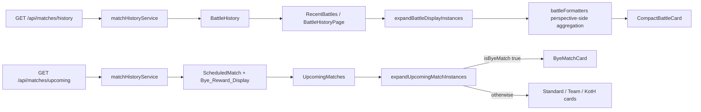
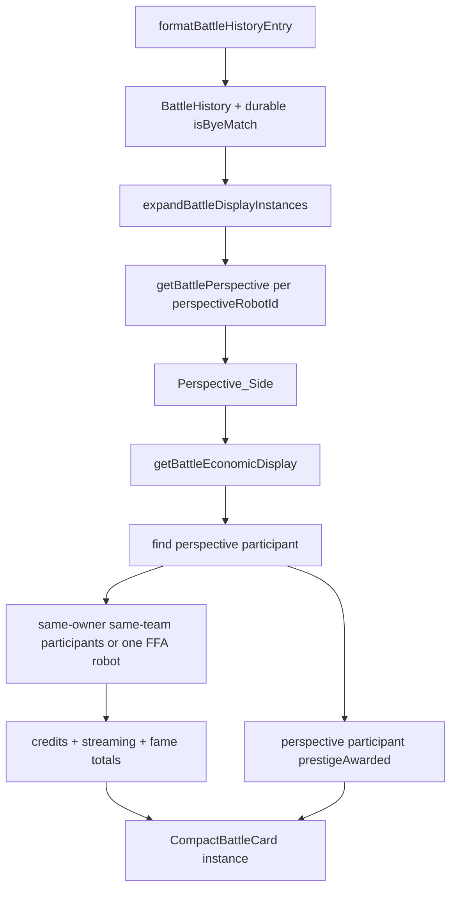
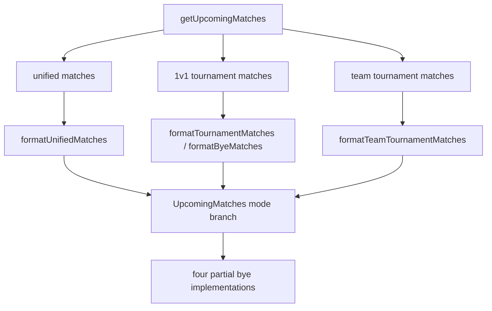
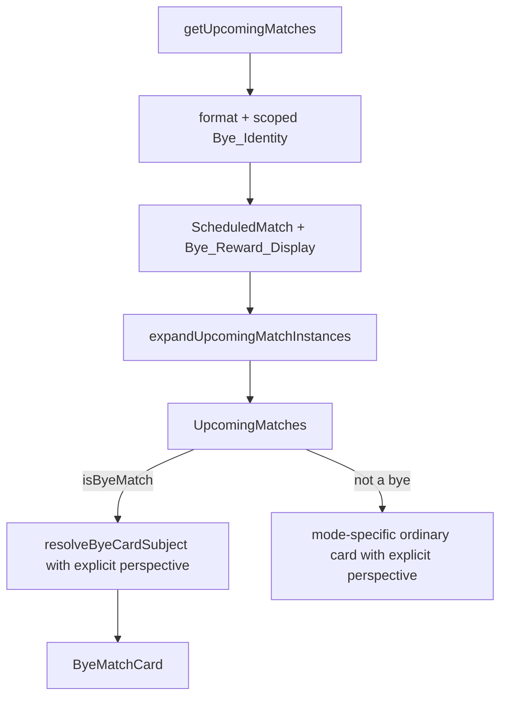
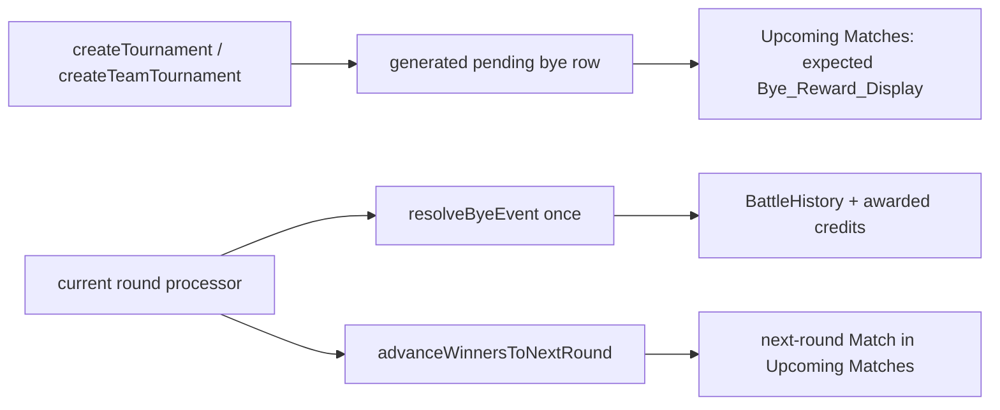

# Design Document

## Overview

Spec 50 is a display-contract and tournament-bye timing correction, not a reward-formula or combat change. The resolved-battle path is already shared by Dashboard, Robot Detail, and Battle History through `RecentBattles` and `CompactBattleCard`; the design keeps that composition and moves the missing perspective-side derivation into the existing pure formatter layer. The scheduled path is normalized at the `UpcomingMatches` boundary so every `isByeMatch` record reaches one `ByeMatchCard` before mode-specific card dispatch. Tournament bracket generation and round processing are also separated so a generated bye remains an upcoming Match until the relevant round resolves it. Both paths expand one raw record into explicit Display_Instance values when the stable owns more than one represented side or FFA robot.

The target flow is:



No Prisma schema migration is required. The design uses existing `participants[]`, `scheduled_matches_v2`, `scheduled_tournament_matches`, `battles`, and `battle_participants` fields. The only API changes are additive response fields needed to identify a bye and show its expected/awarded amount; Display_Instance expansion remains a Frontend presentation concern. Existing routes, public headings, reward formulas, battle execution, and the last-20 History_Window remain unchanged, except that tournament bye resolution moves from bracket generation to scheduled round processing.

## Design Principles and Decisions

### 1. Aggregate at the pure Frontend boundary

The Frontend already receives every `BattleParticipantData` row needed to calculate the represented side's additive values. `battleFormatters.ts` is the correct home under the existing client-side data derivation rule in `.kiro/steering/frontend-standards.md`: the functions remain pure, components stay presentational, and property tests can assert conservation laws without a browser or API call.

`getBattleReward` remains the compatibility function used by history sorting and callers that only need credits. Its participant path changes from “first matching robot” to the Credit_Total for the supplied perspective robot. A companion `getBattleEconomicDisplay` returns the four display values so `RecentBattles` does not independently sum streaming or fame.

### 2. Identify the Perspective_Side from the perspective robot

The same card is used for a specific Robot Detail perspective and an all-robots Dashboard perspective. The helper therefore accepts `myRobotId`, finds that participant, reads its `robot.userId`, and applies the mode's side rule:

- in non-FFA modes, collect participants whose `robot.userId` matches and whose `team` matches the perspective participant's `team`;
- in `koth` and `grand_melee`, collect only the perspective participant, because each owned robot is its own Display_Instance; and
- if the requested participant is absent, use Reward_Fallback rather than summing another stable's rows.

The helper never accepts a global user id, reads React Context, or infers ownership from array position. Upcoming card selection likewise receives explicit `perspectiveRobotId` or `perspectiveTeamId` from the instance expansion helper instead of using `myUserId` to choose the first side.

### Perspective-side display instances

The API continues to return one raw `ScheduledMatch` or `BattleHistory` row per source record. A new pure helper in `app/frontend/src/utils/match-display-instances.ts` expands that row only at presentation time:

```ts
export interface BattleDisplayInstance {
  battle: BattleHistory;
  displayInstanceKey: string;
  perspectiveRobotId: number;
}

export interface UpcomingMatchInstance extends ScheduledMatch {
  displayInstanceKey: string;
  perspectiveRobotId?: number;
  perspectiveTeamId?: number;
}

export function expandBattleDisplayInstances(
  battle: BattleHistory,
  context: { userId?: number; robotId?: number },
): BattleDisplayInstance[];

export function expandUpcomingMatchInstances(
  match: ScheduledMatch,
  userId: number,
): UpcomingMatchInstance[];
```

The helper applies the same grouping rule in both directions:

- for non-FFA battles and matches, find stable-owned participants on each distinct `team`; emit one instance per owned team side and retain all same-side robot ids for that instance;
- for `koth` and `grand_melee`, emit one instance per stable-owned robot, even when the source row contains multiple owned robots; and
- when a caller supplies `robotId` for Robot Detail, retain only the instance containing that robot.

Each instance key combines the source id with the explicit perspective type and id, such as `battle:<id>:team:<team>` or `battle:<id>:robot:<robotId>`. `RecentBattles` and Battle History expand before mapping cards, while `UpcomingMatches` expands before mode dispatch. This preserves one raw history row and one raw schedule row in the API, but prevents a second same-stable perspective from being deduplicated by source id or selected incorrectly by `myUserId`.

### 3. Treat prestige as a non-additive display allocation

Credits, streaming revenue, and fame are additive per-robot values. `prestigeAwarded` is different in current team records: the stable receives one award while participant rows may contain a rounded split. Summing those rows can understate the real award by a remainder, and multiplying one row by team size can overstate or misrepresent other modes.

The design therefore takes `prestigeAwarded` from the perspective participant and passes it to the card once. It does not use a raw top-level `battle.prestigeAwarded` value when that value represents the first requesting participant, because a second opposite-side instance may have a different participant allocation. No Frontend prestige formula, team-size multiplication, inferred rounding, or new claim that the value is a stable total is introduced. A future authoritative stable-level prestige field can be added independently.

### 4. Use durable schedule markers for history bye labels

Spec #49 writes `isByeMatch` into bye scheduling records and places `isByeMatch: true` in the bye battle log. Because `battle_log` is retained for only seven days, the history service must use the durable scheduling marker when shaping player history:

- `scheduled_matches_v2.battle_id` → `scheduled_matches_v2.is_bye_match` for unified league/team/tag/Placement_Mode events;
- `scheduled_tournament_matches.battle_id` → `scheduled_tournament_matches.is_bye_match` for all three tournament modes.

The formatter may keep a false default for legacy rows with no scheduling marker, but it does not read `battle_log` as the permanent source of truth. This keeps the display aligned with the Battle Data Architecture rules.

### 5. Route all scheduled byes before mode-specific rendering

A mode-specific card cannot safely decide whether a team or FFA record is a bye: the current team card derives bye state from a missing team and the KotH card hard-codes `isByeMatch: false` in its backend response. `UpcomingMatches` will first resolve a `ByeCardSubject` and render `ByeMatchCard` whenever `isByeMatch` is true. The four ordinary cards become non-bye renderers.

This removes duplicate copy and ensures a league walkover, tournament bracket bye, thin KotH instance, and thin Grand Melee instance all receive the same semantic treatment while retaining mode-specific color, icon, label, and tournament round data.

### 6. Calculate Bye_Reward_Display without paying generated tournament byes

The Frontend must not recreate the Spec #49 bye formula. The match-history service will expose an additive `byeRewardCredits` and `byeRewardStatus` field with identical semantics for every `Battle_Mode_Set` value:

- queued/unprocessed byes use the existing `resolveByeReward`/`BYE_MODE_SPECS` context (`matchType`, tier, and team size where applicable) to show an informational `expected` amount;
- an expected amount never writes credits, a ledger row, an audit spend/income row, a `battle_participants` row, or a `battles` row;
- already-resolved byes read the actual per-robot `battle_participants.credits` associated with the resolved bye battle and sum only the authenticated stable's real participants; and
- the status is `expected` before resolution and `awarded` only after round processing has created the resolved Bye_Record. `pending` is reserved for legacy rows with insufficient context.

Tournament timing is an explicit backend boundary:

1. `createTournament`/`createTeamTournament` persists first-round bye schedule rows but does not invoke `completeByeMatch`, `resolveByeEvent`, or any credit-award path. The row remains an upcoming `isByeMatch` with `byeRewardStatus: 'expected'`.
2. The current-round tournament processor invokes the existing no-simulation bye resolution when it processes that round. Refactor `completeByeMatch` and the corresponding advancement path so bracket advancement, reward/history creation, and idempotency occur once at round processing rather than at generation.
3. Only after the round's bye and ordinary matches are processed does `advanceWinnersToNextRound` populate the next-round Match. A next-round bye is also left upcoming/expected until its own round is processed; no recursive auto-resolution may skip the player's upcoming card.

The helper in `app/backend/src/services/match/byeDisplayService.ts` owns response-only amount shaping. Expected arithmetic delegates to `resolveByeReward` from `app/backend/src/utils/byeRewards.ts`; awarded totals come from persisted `battle_participants.credits`. The helper does not write data, alter reward formulas, or expose another stable's participants.

## Architecture

### Current resolved-battle path

```mermaid
flowchart TD
  A[formatBattleHistoryEntry] --> B[one requesting participant fields]
  B --> C[getBattleReward]
  C --> D[first matching participant credits]
  D --> E[CompactBattleCard]
  F[participants[]] -. available but not aggregated .-> C
```

### Target resolved-battle path



### Current scheduled path



### Target scheduled path





A generated tournament bye is therefore visible in Upcoming Matches before the first round, but it is not a Resolved_Battle. The round processor is the only boundary that changes the bye to awarded/history state and unlocks the participant's next-round Match.

## Components and Interfaces

### 1. Frontend economic derivation

**File:** `app/frontend/src/utils/battleFormatters.ts`

Add a pure display result and helpers alongside the existing `getBattleReward` and `getBattlePerspective` functions:

```ts
export interface BattleEconomicDisplay {
  credits: number;
  streamingRevenue: number;
  fameAwarded: number;
  prestigeAwarded: number;
}

export function getBattleEconomicDisplay(
  battle: BattleHistory,
  robotId: number,
): BattleEconomicDisplay;

export function getBattleReward(battle: BattleHistory, robotId: number): number;
```

Implementation rules:

1. Find the perspective participant by `robotId`.
2. Determine whether the battle is a Placement_Mode. For non-FFA modes, collect `battle.participants` entries whose `robot.userId` and `team` both match the perspective participant; for `koth` and `grand_melee`, collect only that perspective participant.
3. Sum `credits`, `streamingRevenue`, and `fameAwarded` over that Perspective_Side_Participant collection.
4. Use the perspective participant's `prestigeAwarded` once for `prestigeAwarded`; do not use a potentially different top-level `battle.prestigeAwarded` value for an expanded opposite-side instance.
5. If no perspective participant exists, return the existing outcome-based credit fallback and top-level economic fields.
6. If the participant array is empty/undefined, use the same legacy fallback for every field.

`getBattleReward` returns `getBattleEconomicDisplay(...).credits`, preserving its exported name and its use in `BattleHistoryPage` sorting. The formatter must not call the API, use React state, or contain mode reward formulas.

`getBattleEconomicDisplay` is called once per `BattleDisplayInstance`, not once per raw battle. `RecentBattles` passes each instance's `perspectiveRobotId`; `BattleHistoryPage` sorts raw records as before but renders the expanded instances with the matching robot perspective. Dashboard and all-stable Battle History therefore show every owned side/FFA robot, while Robot Detail supplies its selected `robotId` and receives one instance.

### 1a. Frontend display-instance expansion

**File:** `app/frontend/src/utils/match-display-instances.ts`

Implement the pure `expandBattleDisplayInstances` and `expandUpcomingMatchInstances` helpers described above. They must derive ownership from the already loaded participant/team records and never issue a request or use global state.

For resolved battles, the helper receives either `{ userId }` for Dashboard/Battle History or `{ robotId }` for Robot Detail. With a user context it groups non-FFA `participants` by the stable-owned `team`, returning one `BattleDisplayInstance` per distinct team and retaining the first/representative `perspectiveRobotId` plus the complete same-side robot id set. For Placement_Mode rows it returns one instance for each owned participant. With a robot context it filters those results to the selected robot.

For upcoming matches, the helper inspects the mode-specific real participant/team arrays already present in `ScheduledMatch`. It returns one `UpcomingMatchInstance` for each owned non-FFA side or each owned FFA robot. Each clone carries a unique `displayInstanceKey`, `perspectiveRobotId` for robot/FFA cards, or `perspectiveTeamId` for team cards. The source `id`, `isByeMatch`, reward fields, and mode metadata are preserved on every clone.

`RecentBattles` maps the resolved instances and passes each explicit robot perspective to `getBattlePerspective` and `getBattleEconomicDisplay`. `UpcomingMatches` maps the upcoming instances and passes each explicit robot/team perspective to `resolveByeCardSubject`, `StandardMatchCard`, and `TeamBattleMatchCard`. No list key may be only the source battle/match id when multiple instances are present.

### 2. Frontend battle contracts

**File:** `app/frontend/src/utils/matchmakingApi.ts`

Extend the existing interfaces without changing the route shape:

```ts
export type ByeRewardStatus = 'expected' | 'awarded' | 'pending';

export interface ScheduledMatch {
  // existing fields
  byeRewardCredits?: number | null;
  byeRewardStatus?: ByeRewardStatus;
}

export interface BattleHistory {
  // existing fields
  isByeMatch?: boolean;
  robot2: {
    id: number;
    name: string;
    userId: number;
    user: { username: string };
    currentLeague?: string;
    leagueId?: string;
  } | null;
}
```

The type remains backward-compatible for old fixtures by keeping `isByeMatch` optional at the TypeScript boundary, while the current backend response supplies a boolean for every row. `robot2` becomes nullable for new one-sided bye records; ordinary battles continue to provide it. The existing inline robot-summary shape is retained rather than introducing a duplicate domain interface.

The `ByeRewardStatus` name is a code artifact and is not used as a new UI concept; the domain concept is Bye_Reward_Display.

### 3. Backend upcoming response shaping

**File:** `app/backend/src/services/match/matchHistoryService.ts`

Keep `getUpcomingMatches` as the single response builder and make its three query families consistent.

#### 3.1 Unified `scheduled_matches_v2` rows

- Keep player/team ownership predicates and `status: 'scheduled'` for future rows.
- Pass the existing `_userRobotIds` and `_userTeamBattleIds` arguments into `formatUnifiedMatches` instead of ignoring them.
- For robot/team modes, select the real participant belonging to the authenticated perspective as the primary card subject. A missing second participant is valid when `isByeMatch` is true.
- For `koth` and `grand_melee`, resolve all participant robots, set `isByeMatch` from the database row, and never hard-code false.
- Add `byeRewardCredits`/`byeRewardStatus` only for bye rows. Expected values delegate to the existing bye calculator; no formula is copied into the match-history service.

#### 3.2 1v1 tournament rows

Keep ordinary `pending`/`scheduled` match retrieval separate from current-round tournament bye retrieval. Add a `fetchCurrentTournamentByes` query that:

- filters `participantType: 'robot'`, `isByeMatch: true`, an active tournament, and a participant id owned by the requesting stable;
- restricts rows to the active tournament's `currentRound` and excludes only byes that have a resolved battle/round-processing result, not rows merely marked by bracket-generation bookkeeping;
- includes the tournament metadata and no linked battle before round processing;
- resolves `participant1Id` to the real robot and puts it in the response subject; and
- returns `status: 'bye'`, `isByeMatch: true`, `byeRewardStatus: 'expected'`, and the informational Bye_Reward_Display.

When the round processor has resolved the bye, the row leaves the upcoming result and its linked battle is returned by history with `byeRewardStatus: 'awarded'`. `formatByeMatches` becomes a formatter for the generated real participant rather than returning `robot1: null` or treating bracket generation as resolution.

#### 3.3 Team tournament rows

Apply the same current-round generated-bye arm to `fetchScheduledTeamTournamentMatches`:

- include `participantType: 'team_2v2' | 'team_3v3'`;
- include current-round `isByeMatch: true` rows before round processing, even if bracket-generation bookkeeping used a completed-like status;
- resolve the real team and its members;
- return `byeRewardStatus: 'expected'` and no awarded battle participant data before processing; and
- after round processing, exclude the resolved bye from Upcoming Matches while its `BattleHistory` row exposes the awarded amount.

Ordinary team tournament matches retain the existing pending/scheduled filter. This avoids presenting every historical completed bracket row as upcoming while keeping the current generated bye visible.

#### 3.4 Tournament bye lifecycle and idempotency

The tournament services must separate bracket creation from bye resolution:

- remove the generation-time `completeByeMatch` calls from `createTournament` and `createTeamTournament`;
- make `advanceWinnersToNextRound` populate the next round without recursively resolving newly populated byes;
- have the current-round execution path process each generated bye exactly once through the existing `resolveByeEvent`/Bye_Record writer, alongside the round's ordinary matches; and
- use the scheduling row's processing state and resolved battle link as the idempotency boundary so retries cannot double-award credits or duplicate Recent Battles.

The round processor then advances the bracket only after all current-round entries, including byes, have their terminal result. This makes the first-round generated bye visible before execution, moves its reward/history event to the first-round processing time, and makes the participant's second-round Match the next upcoming record.

#### 3.5 Response privacy and amount calculation

All queries remain scoped by robot/team ids resolved from the authenticated user. For a returned bye, the service exposes only the player's real subject and the mode metadata needed by the card. `byeRewardCredits` is either the stable's actual credited participant sum for an awarded bye or the existing Spec #49 expected amount for a queued bye.

A small helper in `app/backend/src/services/match/byeDisplayService.ts` will own the response-only operations. Its input is a discriminated context matching the existing `ByeRewardInput` arms:

```ts
type ByeDisplayContext =
  | { mode: TierScaledByeMode; tier: string }
  | {
      mode: TournamentByeMode;
      totalParticipants: number;
      currentRound: number;
      maxRounds: number;
    };

export interface ByeRewardDisplay {
  byeRewardCredits: number | null;
  byeRewardStatus: 'expected' | 'awarded' | 'pending';
}

export function getExpectedByeReward(input: ByeDisplayContext): ByeRewardDisplay;
export function getAwardedByeReward(
  battleId: number,
  robotIds: number[],
): Promise<ByeRewardDisplay>;
```

The helper validates that the context matches its mode before delegating. New rows use `expected` or `awarded`; `pending` is reserved for legacy rows with insufficient context. Expected arithmetic delegates to `resolveByeReward` from `app/backend/src/utils/byeRewards.ts`, and awarded totals come from persisted `battle_participants.credits`. The helper does not write data, alter rewards, or expose another stable's participants.

### 4. Backend resolved history shaping

**File:** `app/backend/src/services/match/matchHistoryService.ts`

#### 4.1 Durable bye-marker lookup

After fetching the paginated battles, batch-load schedule markers using the returned battle ids:

```ts
const unifiedByeRows = await prisma.scheduledMatch.findMany({
  where: { battleId: { in: battleIds }, isByeMatch: true },
  select: { battleId: true, isByeMatch: true },
});

const tournamentByeRows = await prisma.scheduledTournamentMatch.findMany({
  where: { battleId: { in: battleIds }, isByeMatch: true },
  select: { battleId: true, isByeMatch: true },
});
```

Build a `Map<number, boolean>` and pass the marker into `formatBattleHistoryEntry`. This is one batch query per schedule table, not one query per battle. If a battle has no marker, use false for legacy compatibility. Do not inspect `battle_log` for this permanent display field.

#### 4.2 One-sided battle records

`formatBattleHistoryEntry` will use the durable marker before selecting fallback robot summaries:

- `robot1` is the real participant from the player's side;
- `robot2` is null for a one-sided bye; and
- `participants` remains the canonical per-robot source, including every real robot in a team bye.

`formatTeamBattleHistoryEntry` accepts the marker from the parent formatter and uses it instead of inferring a bye solely from a failed team lookup. Existing team names remain available when the team can be resolved; a missing opponent is represented as Bye/No opponent, not a fabricated `Unknown` combatant.

#### 4.3 Perspective and card safety

**Files:** `app/frontend/src/utils/battleFormatters.ts`, `app/frontend/src/components/CompactBattleCard.tsx`

Update `BattlePerspective.opponent` to be nullable. `getBattlePerspective` returns null for a bye rather than dereferencing `battle.robot2`. For non-bye legacy payloads, it keeps the existing fallback robot behavior.

`CompactBattleCard` computes `isBye = battle.isByeMatch === true` and gives the BYE badge precedence over the normal outcome badge. Its standard matchup area renders the existing opponent for fought battles and a neutral “No opponent”/“Walkover” value for a bye. Desktop and mobile markup use the same `isBye` condition, so a league 1v1 bye is not labeled as an ordinary WIN or as a tournament.

The existing battle-detail navigation remains available when `battle.id` exists. The card does not claim playback, duration, damage, or opponent data that a bye does not have.

### 5. Shared Bye_Card and scheduled dispatch

**Files:** `app/frontend/src/components/UpcomingMatches.tsx`, `app/frontend/src/components/match-cards/ByeMatchCard.tsx`, and `app/frontend/src/components/match-cards/bye-match-data.ts`.

Define a normalized subject union for the card:

```ts
type ByeCardSubject =
  | { kind: 'robot'; id: number; name: string; userId: number }
  | { kind: 'team'; id: number; name: string; teamSize: number; memberNames: string[] }
  | { kind: 'ffa'; id: number; name: string; userId: number };
```

`resolveByeCardSubject(match, perspective)` is a pure function. It selects the real subject using the explicit instance perspective:

- `perspectiveRobotId` for a 1v1 robot bye or Placement_Mode bye;
- `perspectiveTeamId` for a team or tag-team bye; and
- the real subject from the response, never a negative-id sentinel or fabricated opponent.

When the helper is called for an unexpanded legacy row, it may use `myUserId` only to resolve a single subject; expanded rows must use the explicit perspective fields so a same-stable opposite-side match does not always select side one.

`UpcomingMatches.renderMatchCard` first calls `expandUpcomingMatchInstances` and then checks each instance's `isByeMatch` before the current `tag_team`, FFA, team, and 1v1 branches. If true, it calls `resolveByeCardSubject` with the instance and renders `ByeMatchCard`. If false, it passes `perspectiveRobotId`/`perspectiveTeamId` into the ordinary card and its result/perspective helpers. If the response is malformed, the helper returns null and the existing list safely omits that row while logging the same non-fatal UI error path; it does not route the malformed row to a normal combat card.

`ByeMatchCard` uses `getModeConfig(match.matchType)` for icon, mode badge, and border color. It renders:

- `BYE` state;
- mode label (`1v1`, `2v2`, `3v3`, `Tag Team`, `KotH`, or `Melee`);
- tournament name and round only for tournament modes;
- the real robot/team subject;
- neutral no-opponent/walkover copy;
- scheduled time; and
- `byeRewardCredits` with “expected” or “awarded” state, or the explicit pending message when the amount is unavailable.

The generic tournament-only sentence in the current `ByeMatchCard` is removed. `TeamBattleMatchCard` and `KothMatchCard` retain only ordinary-match rendering; their internal bye branches are deleted or become unreachable defensive assertions.

### 6. Terminology_Alignment

Terminology changes are deliberately narrow:

- `ScheduledMatch`, `match`, `matchType`, `UpcomingMatches`, and `Upcoming_Match_Card` describe unfought records;
- `BattleHistory`, `battle`, `battleType`, `RecentBattles`, and `Resolved_Battle_Card` describe resolved records;
- `/api/matches/history` remains as a compatibility route, with a comment documenting that its payload is resolved Battle history;
- database and API field casing stays exactly as implemented; no invented `BattleHistory` table or route is introduced; and
- “Upcoming Matches” and “Recent Battles” remain the visible section headings.

No broad rename is needed. The implementation updates affected comments, helper names introduced by this spec, test descriptions, and card copy only where the state distinction is currently misleading.

### 7. Responsive_Card_Layout and accessibility

The changed cards follow `.kiro/steering/frontend-standards.md`:

- use the desktop layout at `lg`/1024px and above;
- use the stacked/wrapped mobile layout below 1024px down to the supported 320px width;
- keep labels and reward values in `min-w-0`/wrapping containers;
- do not introduce horizontal scrolling inside a card;
- preserve `prefers-reduced-motion` behavior from existing card transitions; and
- keep any clickable card as a keyboard-operable semantic control with a minimum 44px activation region.

`CompactBattleCard` has an existing click-to-detail behavior and should use a semantic button or an equivalent `role="button"`, `tabIndex`, keyboard handler, and accessible name without nesting interactive elements. `ByeMatchCard` remains informational unless a specific navigation action is added; showing its reward does not require making the whole card clickable.

The responsive test renders populated cards at 320px, 768px, 1023px, and 1024px. It asserts the mobile/desktop class contract, visible reward/bye content, and no measured `scrollWidth > clientWidth` for the card container.

## Error Handling, Privacy, and Performance

- Missing participants use Reward_Fallback; they do not throw or display another stable's values.
- Missing bye subject data is treated as malformed response data and omitted from the ordinary combat-card path; it is logged without exposing user data.
- Missing expected bye context yields `byeRewardStatus: 'pending'`, never a fabricated zero.
- The backend batches schedule-marker and awarded-reward lookups by battle ids. It must not introduce an N+1 query for each card in a page.
- No query returns opponent participant details for a user who is not entitled to see them in an upcoming bye response.
- No `battle_log` read is added to permanent history formatting.
- No database migration, backfill, reward recalculation, or combat simulation change is part of this spec. The tournament orchestration timing change is limited to deferring the existing bye resolution/payment call from bracket generation to current-round processing.

## Test Design

### Frontend pure-function tests

**File:** `app/frontend/src/utils/battleFormatters.test.ts`

Add examples and fast-check properties for:

- one, two, and three Perspective_Side_Participant entries on the same team;
- same-stable participants on opposite teams and participants from multiple stable owners;
- conservation: Credit_Total equals the sum for the perspective owner and team, or the single FFA perspective robot;
- Streaming_Total and Fame_Total use the same side filter;
- Participant_Prestige_Value comes from the perspective participant once and is not summed;
- absent/empty participants and absent requested participant use Reward_Fallback; and
- one-participant bye fixtures return the participant's credits and zero additive bye indicators.

**File:** `app/frontend/src/utils/match-display-instances.test.ts`

Add pure helper tests for:

- one same-side 3v3 instance with all same-stable team participants;
- two opposite-side 1v1 instances with distinct `displayInstanceKey` and explicit robot perspectives;
- one instance per owned robot for multi-robot `koth`/`grand_melee` rows; and
- selected-robot Robot Detail filtering without changing the all-stable expansion.

### Frontend resolved-card tests

**Files:** `app/frontend/src/components/__tests__/CompactBattleCard.test.tsx`, `app/frontend/src/components/__tests__/RecentBattles.pbt.test.tsx`, and `app/frontend/src/pages/__tests__/BattleHistoryPage.test.tsx`.

Assert that the same side-scoped values appear through `RecentBattles` and the Battle History page, that all-stable views render both opposite-side instances and every owned FFA robot, that Robot Detail renders only its selected robot instance, that a same-side 3v3 remains one card, and that every `Battle_Mode_Set` bye renders BYE with no opponent and the correct expected/awarded state. Cover separate `league_2v2`/`tournament_2v2` and `league_3v3`/`tournament_3v3` fixtures, ensure a 1v1 league bye is not labeled Tournament, and keep normal fought-card behavior and the last-20 raw-record property unchanged while allowing expanded cards beyond 20.

### Frontend scheduled-card tests

**Files:** a new `app/frontend/src/components/__tests__/UpcomingMatches.test.tsx` and `app/frontend/src/components/match-cards/__tests__/ByeMatchCard.test.tsx`.

Mock `getUpcomingMatches` and cover:

- `league_1v1` bye;
- `tournament_1v1` generated and awarded bye states;
- `league_2v2` and `tournament_2v2` byes as distinct fixtures;
- `league_3v3` and `tournament_3v3` byes as distinct fixtures;
- `tag_team` bye;
- `koth` thin-instance bye;
- `grand_melee` thin-instance bye;
- expected versus awarded reward text;
- same-side 3v3 data rendering one card;
- opposite-side 1v1 data rendering two cards with distinct perspectives;
- multi-robot `grand_melee` data rendering one card per owned robot;
- all ordinary cards still use their mode-specific components; and
- malformed bye data does not fall through to a normal card.

### Backend service tests

**Files:** `app/backend/src/services/match/__tests__/matchHistoryService.test.ts` plus focused tests for the response-only `byeDisplayService` helper.

Use mocked Prisma responses to assert:

- robot details are resolved for `formatByeMatches`;
- all `Battle_Mode_Set` values receive the same response marker, real subject, no-opponent shape, and expected/awarded status behavior, with separate fixtures for league and tournament `2v2`/`3v3`;
- generated `tournament_1v1`, `tournament_2v2`, and `tournament_3v3` byes remain current-round upcoming rows with no battle/credit award before processing;
- first-round processing invokes the existing bye resolver once, creates the resolved history/participant records and credits, and exposes the participant's next-round Match;
- retries do not duplicate the bye award or history record;
- FFA formatting preserves the database `isByeMatch` value;
- history maps durable schedule markers to `BattleHistory.isByeMatch` without reading `battle_log`; and
- expected and awarded `byeRewardCredits` use the existing Spec #49 calculator/participant records.

### Validation commands

The implementation task runs the targeted Frontend Vitest tests, the targeted Backend Jest unit tests, changed-file diagnostics, Frontend lint/build, and the repository-required tiered checks applicable to changed packages. The final spec verification task runs every command in Requirements → Expected Contribution → Verification Criteria.

## Documentation Impact

- `.kiro/steering/frontend-standards.md`: no rule change is required. The design explicitly applies its existing pure client-side derivation and desktop/mobile responsive patterns. If implementation adds a reusable `ByeCardSubject` convention, add a short named example to the existing component-architecture section rather than creating a conflicting pattern.
- `.kiro/steering/project-overview.md`: no update is required because no project structure, technology, API route family, or domain-system ownership changes. The existing Spec #49 reward/no-simulation description remains accurate; the tournament timing correction is documented separately.
- `.kiro/steering/coding-standards.md`: no formula or backend route convention changes. The implementation must continue to use typed interfaces and pure utility functions; no steering edit is needed unless a new shared API contract rule is discovered.
- `docs/guides/`: no existing operational guide describes these player-facing cards, so no guide update is required. The design must verify this rather than add an irrelevant deployment note.
- `docs/game-systems/PRD_LEAGUE_SYSTEM.md`: no behavior change is required for league bye timing, but its all-mode display references must remain consistent if it mentions bye cards.
- `docs/game-systems/PRD_TOURNAMENT_SYSTEM.md`: update the tournament lifecycle section to state that generated byes are upcoming/expected, are resolved and credited when their round is processed, and make the next-round Match visible only after advancement.
- `app/backend/src/content/guide/tournaments/bye-matches.md`, `app/backend/src/content/guide/tournaments/tournament-format.md`, and `app/backend/src/content/guide/tournaments/rewards.md`: update player-facing copy so it does not imply credits are awarded at bracket generation; preserve the reward amount/formula and explain the round-processing timing.
- The Spec #49 Player_Guide content remains the source of bye amount and no-simulation behavior, but the named tournament guide articles must reflect the corrected Tournament_Bye_Lifecycle.
- Create `docs/implementation_notes/BATTLE_CARD_DISPLAY.md` as the implementation note for the new display contract. It must document the `participants[]` perspective-side aggregation boundary, same-side versus opposite-side/FFA Display_Instance expansion, explicit perspective keys, durable bye-marker source, additive bye response fields, and Match/Battle terminology without restating reward formulas.

## Requirements Traceability

The following mapping is exhaustive: each acceptance-criteria range in `requirements.md` is covered by at least one named design section or interface.

| Requirement criteria | Design coverage |
|---|---|
| R1.1–R1.9 | § Design Principles 1–2; § Perspective-side display instances; § Components 1 and 1a; § Test Design → Frontend pure-function and resolved-card tests |
| R2.1–R2.6 | § Design Principles 3; § Components 1; § Components 5 for bye zero indicators; § Test Design → Frontend pure-function tests |
| R3.1–R3.8 | § Design Principles 4–6; § Components 3; § Error Handling, Privacy, and Performance; § Backend service tests |
| R4.1–R4.8 | § Design Principles 5–6; § Components 5; § Components 7; § Frontend scheduled-card tests |
| R5.1–R5.9 | Design Principles 4 and 6; Components 3 and 4; Error Handling, Privacy, and Performance; Frontend resolved-card tests; Backend service and tournament lifecycle tests |
| R6.1–R6.5 | § Components 6; § Documentation Impact; § Frontend and Backend test descriptions |
| R7.1–R7.5 | § Components 7; § Frontend scheduled/resolved-card tests |
| R8.1–R8.6 | § Test Design in full; § Validation commands; § Requirements Traceability |
| R9.1–R9.9 | § Perspective-side display instances; § Components 1a; § Components 5; § Frontend pure-function, resolved-card, and scheduled-card tests |

## Implementation Order

1. Add/adjust typed response contracts and backend bye response shaping, including durable history marker lookup, generation-time tournament-bye deferral, current-round processing, exactly-once resolution, and lifecycle tests.
2. Add the pure perspective-side economic and Display_Instance helpers, then update `RecentBattles` and `BattleHistoryPage` to expand resolved records before rendering and add regression tests.
3. Normalize `UpcomingMatches` by expanding each raw schedule row into explicit Upcoming_Match_Instance values, route byes through `ByeMatchCard`, refactor its subject selection, and remove unreachable/duplicated bye rendering from ordinary cards.
4. Apply responsive/accessibility assertions, terminology cleanup, named PRD/player-guide documentation updates, documentation-impact checks, and the final aggregate verification criteria.

This order keeps the Frontend implementation behind a well-defined response contract and allows the independent perspective-side correction to be tested even if Spec #49 Placement_Mode rows are not present in a local fixture database.
