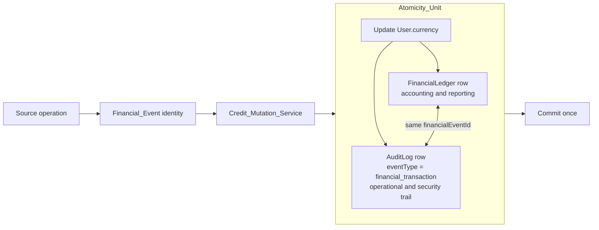
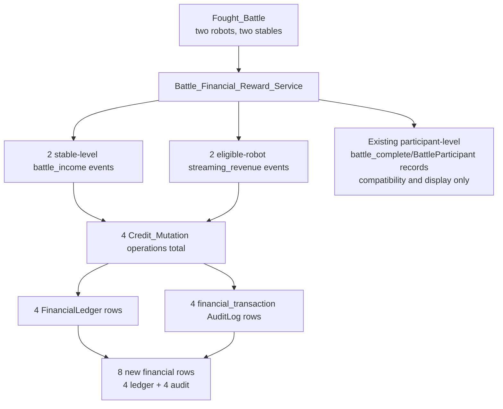
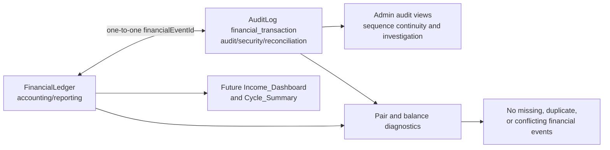

# Design: Financial Ledger Coverage (Backlog Item #59)

## Overview

Backlog_Item_59 is a capture-correctness and technical-debt reduction change. It does not redesign the financial pages or alter player-visible reward rules. The current implementation has several direct credit writers, a best-effort ledger enrichment path, separate settlement implementations, mode-specific battle mutation logic, and no canonical stable-level prestige history. The target architecture closes those gaps for new events from `Cutover_Cycle` onward in `ACC`.

The design has five invariants:

1. **One credit path:** every current-economy `User.currency` mutation uses `Credit_Mutation_Service`; only explicitly documented lifecycle boundaries may establish or clear a balance.
2. **One financial pair:** every successful new credit mutation produces exactly one `Financial_Ledger` row and one paired `Financial_Audit_Record` inside the same `Atomicity_Unit`.
3. **One event identity:** the source supplies a durable `Financial_Event` identity, so a retry returns the original result and a conflicting reuse fails without changing money.
4. **Facts, not re-computation:** the amount-affecting inputs and modifiers are stored in a typed `Financial_Breakdown`; later reports do not recalculate old events from current facilities, fame, prestige, quotes, or formulas.
5. **Forward-only evidence:** the contract becomes authoritative at the selected `Cutover_Cycle` in `ACC`. Earlier rows remain `Legacy_Record` history and are not reconstructed, corrected, paired, or represented as complete.

The target data path is:

```text
source operation
  -> stable Financial_Event identity
  -> source-specific calculator/aggregator
  -> shared Credit_Mutation_Service
       -> locked User.currency update
       -> Financial_Ledger row
       -> paired financial_transaction AuditLog row
  -> existing domain/display records where required
```

Battle rewards add two nonfinancial branches to that path:

```text
battle result
  -> Battle_Financial_Reward_Service
       -> stable-level battle_income mutations
       -> per-robot streaming_revenue mutations
       -> stable-level Prestige_Service awards
       -> existing battle_complete/BattleParticipant compatibility records
```

## Requirements Traceability

| Requirement criteria | Design coverage |
|---|---|
| 1.1–1.5 | “Final Transaction_Taxonomy and typed contracts” defines the exact twelve values, legacy-only values, repair subtype, real writers, and validation boundary. |
| 2.1–2.6 | “Mutation coverage and battle row fan-out” defines every credit writer, the single battle path, bye exclusion, lifecycle exception, manifest, and exact row contract. |
| 3.1–3.8 | “Atomic financial pair”, “Financial_Event identity and idempotency”, and “Ledger/audit roles and visual maps” define transaction boundaries, sequence allocation, rollback, duplicate pair semantics, stored formula facts, and the distinct purpose of each paired row. |
| 4.1–4.4 | “Financial_Event identity and idempotency” defines schema uniqueness, compare-on-retry, conflict behavior, and identity strategies. |
| 5.1–5.6 | “Repair design” preserves shared formulas, subtype-bearing domain audit rows, per-robot financial pairing, batch rounding, bye/automatic-repair separation, and repair-source tests. |
| 6.1–6.8 | “Settlement design” defines one mutating service, separate components, explicit zero-valued component rows, idempotency, compatibility routes/events, and failure tests. |
| 7.1–7.7 | “Prestige design” defines the separate stable-level `AuditLog` record, `sourceEventId` identity, aggregation, graphable fields, zero/reset exclusions, and current-season limitation. |
| 8.1–8.3 | “Nonfinancial and lifecycle boundaries” defines free subscriptions, opening/reset/rollover behavior, and retention without reconstruction. |
| 9.1–9.5 | “Forward-only migration and reconciliation” defines nullable legacy fields, cutover gates, no-script policy, ACC-only rollout, and post-cutover diagnostics. |
| 10.1–10.5 | “Admin compatibility, documentation, and player-facing boundary” preserves route/page contracts, names documentation changes, and retains the guide regression check without guide edits. |
| 11.1–11.6 | “Test strategy and behavior retirement” defines unit, integration, heavy, frontend, E2E, and precise replacement/retirement coverage. |

## Final Transaction_Taxonomy and Typed Contracts

The new writer allowlist is exactly the following. These are code-level `transactionType` values; they are not interchangeable with domain concepts such as `Prestige_Award` or `Subscription_Change`.

| `transactionType` | Sign | Meaning | Required breakdown/source facts |
|---|---:|---|---|
| `battle_income` | positive | Fought battle reward or `Bye_Event` participation floor | battle/match identity, mode, outcome, placement/team-size facts, `isBye` |
| `streaming_revenue` | positive | Per-robot Streaming Studio reward from a fought battle | battle identity, robot, mode, base amount, battle/fame/studio factors |
| `repair_cost` | negative | Manual, automatic, or charged admin `Repair_Spend` | `repairType`, robot, quote inputs, repair-bay/manual discounts, rounding |
| `facility_upgrade` | negative | Facility purchase or upgrade | facility, previous/new level, price formula, discounts |
| `weapon_purchase` | negative | Weapon purchase | weapon, shop inputs, price, discount, operation identity |
| `weapon_sale` | positive | Weapon sale proceeds | weapon, sale formula, condition/value inputs, operation identity |
| `weapon_refinement` | negative | Weapon refinement charge | weapon/refinement, level transition, price inputs |
| `robot_creation` | negative | Robot creation charge | robot, roster/facility inputs, price, operation identity |
| `attribute_upgrade` | negative | Attribute upgrade charge | robot, attribute, levels, facility/discount inputs |
| `achievement_reward` | positive | Achievement credit reward | achievement/unlock identity, reward formula |
| `passive_income` | positive | Gross cycle passive income | cycle, facility level, prestige/roster inputs, formula and rounding |
| `operating_costs` | negative | Gross cycle operating costs | cycle, cost components, roster/facility inputs, rounding |

The new runtime union and validator reject unknown values. `subscription_cost`, `prestige_award`, and `settlement_adjustment` remain readable only as pre-cutover `Legacy_Record` values; no new writer or type accepts them.

### `Financial_Breakdown`

The persisted JSON shape is represented by a discriminated TypeScript union in a shared/backend type module. It is not an untyped bag. Every variant has common fields:

```ts
interface FinancialBreakdownBase {
  schemaVersion: number;
  formula: string;
  inputs: readonly FinancialInput[];
  modifiers: readonly FinancialModifier[];
  rounding: FinancialRounding;
  finalAmount: number;
}
```

The concrete variants identify the source family (`battle_income`, `streaming_revenue`, `repair_cost`, purchase/upgrade, achievement, passive income, or operating costs) and require the fields relevant to that formula. `FinancialInput` and `FinancialModifier` use typed names, numeric values, units, and source labels; they do not contain submitted secrets or arbitrary player input. `FinancialRounding` records precision, operation order, and per-item versus aggregate rounding.

The required coverage is:

| Source | Facts captured in `Financial_Breakdown` |
|---|---|
| Battle income | mode, tier, outcome, placement, participation floor, win component, team size, stable aggregation, any prestige-derived or facility-derived credit modifier, and final rounding |
| Streaming revenue | `baseAmount`, `battleMultiplier`, `fameMultiplier`, `studioMultiplier`, `totalRevenue`, robot identity, eligibility, and rounding |
| Repairs | base quote, damage/condition inputs, Repair Bay level, active robot count, repair-bay discount percent, manual discount percent when applicable, per-robot quote, rounding, and charge |
| Facility/weapon/robot/attribute operations | item or facility identity, old/new level, base price, shop/facility discount, sale/refinement inputs, roster/ownership inputs, and rounding |
| Achievement reward | achievement/unlock identity, base reward, applied modifiers, and final credit reward |
| Passive income | Merchandising Hub level, prestige, roster capacity, prestige-per-slot normalization, facility effect, cycle, and rounding; Streaming Studio battle revenue is not duplicated here |
| Operating costs | each cost component, facility/roster inputs, cycle, discounts/waivers if any, and aggregate rounding |

Combat-only values that do not change credits are not copied into the financial breakdown. A later `Income_Dashboard` can explain an old amount using only this stored record and does not read current `facilities`, `User.prestige`, fame, `robots.repairQuoteCredits`, or current formula code.

## Atomic Financial Pair

### Persistence contract

The Prisma schema adds nullable migration-safe `financialEventId` fields to `FinancialLedger` and `AuditLog`, with indexes and uniqueness safeguards that preserve existing legacy data. `FinancialLedger.financialEventId` is unique for every non-null post-cutover row, and `AuditLog` uses a composite uniqueness constraint on `eventType` plus `financialEventId` so only one `financial_transaction` row can carry each event while nullable legacy and unrelated audit rows remain allowed. A new pair contains:

- `FinancialLedger`: `cycleNumber`, `userId`, optional `robotId`, `transactionType`, signed integer `amount`, `balanceAfter`, source description, typed breakdown/metadata, `financialEventId`, and timestamp.
- `AuditLog`: `eventType: 'financial_transaction'`, the same event identity and source context, and a typed payload containing `financialEventId`, `transactionType`, amount, `balanceAfter`, breakdown, and required subtype metadata.

The identity is shared by the pair, not a database foreign key, because `AuditLog` contains many domain event families. The uniqueness constraints plus reconciliation provide the pairing invariant. Nullable fields exist only for `Legacy_Record` rows; post-cutover service inputs require a non-null identity.

The same `AuditLog` model stores `Prestige_Audit_Record` rows with `eventType: 'prestige_change'`. Add a nullable `sourceEventId` field and a composite uniqueness constraint on `(eventType, sourceEventId)` for post-cutover prestige identity; the field remains nullable for legacy and unrelated audit events. The typed prestige payload contains `eventTimestamp`, `cycleNumber`, user/stable identity, exact amount, source, optional mode/battle/achievement identity, and resulting `User.prestige`. `withAuditSequence` orders these rows, while the source identity makes retries idempotent and conflicting retries fail closed. The `sourceEventId` constraint is separate from `financialEventId`: prestige is not a credit event and never gets a `Financial_Ledger` row.

`balanceBefore` is derived as `balanceAfter - amount` for a signed integer mutation unless an existing operational contract demonstrates a need to persist it. The balance update remains the only mutable financial state; ledger/audit rows are immutable evidence of the committed result.

### Ledger/audit roles and visual maps

The two financial rows are deliberately paired but are not two financial mutations:

- **Financial_Ledger** is the accounting/reporting record. It is shaped for financial aggregation, balance explanation, transaction-type filtering, ROI analysis, and the later `Income_Dashboard`/`Cycle_Summary` work.
- **Financial_Audit_Record** is the immutable operational, security, and reconciliation trail. It is represented by an `AuditLog` row with `eventType: 'financial_transaction'`, participates in `withAuditSequence`, supports administrator investigation, and proves that the accounting record was produced by the expected source.
- Both contain the same core financial facts and the same `financialEventId` because reconciliation must compare them. The audit record is not another credit mutation, and it must not update `User.currency` independently.
- There is no third financial event hidden behind the pair: one `Credit_Mutation` produces one balance delta, one `FinancialLedger` row, and one paired `AuditLog` row.

#### Atomic paired-write flow



#### Two-stable 1v1 row fan-out



#### Pair reconciliation and consumers



The same visual contract applies to other source families: a stable-level battle-income event, a per-robot streaming event, a repair charge, or a settlement component each creates one pair. Existing `battle_complete`, `robot_repair`, `passive_income`, and `operating_costs` domain records may remain for their own consumers, but they are not additional credit mutations.

### `Credit_Mutation_Service`

`Credit_Mutation_Service` exposes a single-mutation operation and a transaction-aware operation for callers already inside an interactive Prisma transaction. The typed input contains `userId`, signed integer `amount`, exact `transactionType`, non-null `financialEventId`, description/source, optional `robotId`, typed `Financial_Breakdown`, and domain audit context.

The operation:

1. validates the taxonomy and breakdown;
2. enters the caller transaction or creates one;
3. obtains the existing spending/balance lock where the operation can race;
4. looks up `financialEventId` and compares all immutable facts;
5. returns the committed result for an identical retry;
6. rejects a conflicting identity without changing state;
7. updates `User.currency` with the signed delta;
8. allocates the audit sequence only through `withAuditSequence`; and
9. inserts the ledger row and paired `financial_transaction` row before commit.

The balance, ledger, and paired audit insert are one `Atomicity_Unit`. A failure at any point rolls back all three. The service does not use the old best-effort `recordLedgerEntry.ts` behavior for required accounting, and `financial_ledger_active` cannot silently suppress a required post-cutover event.

A caller that also changes a robot, facility, weapon, achievement, repair, or settlement state passes the same transaction client when that domain operation must commit with the credit mutation. The operation identity remains durable even when a wider caller transaction cannot be shared.

## Financial_Event Identity and Idempotency

`Financial_Event` identities are deterministic at scheduled-operation boundaries and durable at request boundaries:

| Source | Identity shape |
|---|---|
| Battle reward | source battle/match + stable + reward component (`battle_income` or bye component) |
| Streaming | source battle/match + robot + `streaming_revenue` |
| Achievement | unlock identity + stable + `achievement_reward` |
| Repair | repair operation + robot + `repair_cost`; batches retain one event per robot |
| Settlement | stable + cycle + `passive_income` or `operating_costs` |
| Purchase/upgrade/sale/refinement/creation | existing durable operation identity or persisted request idempotency key |

A retry first compares the existing event's user, robot, amount, type, source, breakdown, and identity. Identical facts return the original `balanceAfter`; different facts throw a domain conflict. A unique constraint handles concurrent creation races; the losing attempt rereads the committed row and applies no second balance delta.

Legitimate repeated upgrades, purchases, repairs, and cycles receive distinct source operation identities. Current balance, current repair quote, random timestamps, or a newly generated retry UUID are never identities.

## Battle Mutation and Exact Row Fan-Out

`Battle_Financial_Reward_Service` is the only adapter from a completed battle result to financial/progression mutations. It accepts already-calculated mode rewards and aggregates by stable before writing records. It does not recalculate combat rewards or use participant payload fields as a second financial source.

### Normal fought-battle contract

For each stable receiving a positive aggregate battle reward, write:

- one `battle_income` `Financial_Ledger` row;
- one paired `AuditLog` row with `eventType: 'financial_transaction'`; and
- one stable-level `Prestige_Audit_Record` only when the aggregate prestige award is positive.

For each eligible participating robot receiving Streaming Studio revenue, write:

- one `streaming_revenue` `Financial_Ledger` row; and
- one paired `financial_transaction` audit row.

Retain the existing participant-level `battle_complete` `AuditLog` and `BattleParticipant` reward/display fields. They are compatibility/display records, not additional financial mutation sources and must not be fed back into the financial service.

Example: two robots from two different stables fight a 1v1 and both are streaming-eligible. The new financial output is two `battle_income` ledger rows, two `streaming_revenue` ledger rows, and four paired financial audit rows, plus the existing two participant-level battle records and separate prestige/repair/achievement records where applicable. A 2v2 whose two robots belong to one stable produces one aggregated battle-income pair for that stable and two streaming pairs. A team with two stables produces one battle-income pair per recipient stable, not one per robot.

### Mode and Bye_Event behavior

All nine scheduled modes use the same path: `league_1v1`, `tournament_1v1`, `tag_team`, `koth`, `league_2v2`, `league_3v3`, `tournament_2v2`, `tournament_3v3`, and `grand_melee`. KotH and Grand Melee no longer have a direct combined currency/prestige/streaming exception.

A `Bye_Event` is detected before absent-side loading or simulation. Bye reward resolution writes only one `battle_income` pair per stable receiving the mode participation floor; that path writes no streaming row, prestige record, fame, repair spend, draw, or combat result because no simulation runs. This exclusion applies only to bye reward resolution: the normal pre-battle `Automatic_Repair` scope still includes a byed robot when it has pre-existing damage, and that separate `repair_cost` event is not attributed to the bye. The existing bye/scheduling/domain records remain as compatibility data.

### Mutation coverage matrix

| Source family | Final service path | Financial/progression result |
|---|---|---|
| 1v1 league/tournament | `Battle_Financial_Reward_Service` -> `Credit_Mutation_Service` and `Prestige_Service` | stable battle income, eligible robot streaming, stable prestige |
| 2v2/3v3 league | same shared services after stable aggregation | one income pair per recipient stable, one stream pair per eligible robot, one prestige record per positive stable award |
| Tag team | same shared services; tag-team mode metadata remains in breakdown | same separation, no mode-specific debit path |
| 2v2/3v3 team tournaments | same shared services with round/placement metadata | round reward income, stream where eligible, stable prestige |
| KotH/Grand Melee | same shared services, replacing direct grouped update | placement/participation income, stream where eligible, prestige via `Prestige_Service` |
| Bye resolution | `Battle_Financial_Reward_Service` only | `battle_income` participation floor; no simulation/streaming/prestige |
| Streaming Studio | shared credit service after existing per-robot calculation | one `streaming_revenue` pair per eligible robot |
| Achievement | `Credit_Mutation_Service` plus `Prestige_Service` where applicable | `achievement_reward` pair and separate prestige record |
| Economic purchases/upgrades | shared credit service inside existing spending/ownership transaction | exact taxonomy type and breakdown |
| Repairs | repair calculator + shared credit service | `repair_cost` pair plus subtype-bearing `robot_repair` domain record |
| Settlement | `Settlement_Service` | separate passive-income and operating-cost pairs |
| Booking_Office | `applySubscriptionChange()` | no financial pair; subscription audit only |
| Lifecycle | existing lifecycle service | explicit boundary/audit record, no current-economy credit event |

The `Coverage_Manifest` is the source of truth for this matrix and includes current file/function, final service, identity, and test tier. A direct-writer check fails if production code adds a current-economy `User.currency` mutation outside the service or an enumerated lifecycle boundary.

## Repair Design

The only repair arithmetic remains in `app/shared/utils/repairCost.ts`: `calculateRepairQuote`, `applyManualRepairDiscount`, and `calculateRepairBayDiscountPercent`. Repair services do not duplicate these formulas or apply a discount twice.

`Manual_Repair`, `Automatic_Repair`, and charged admin maintenance repairs call the shared path with `repairType` exactly `manual` or `automatic`. Each repaired robot receives one `repair_cost` `Financial_Event`/financial pair and one subtype-bearing `AuditLog` `robot_repair` domain record. A multi-robot operation executes all per-robot events atomically as one operation; its final balance and lifetime delta equal the sum of the per-robot charges. The `robot_repair` row remains the `Canonical_Source` for subtype-separated Repair_Spend, while the paired financial record supports accounting and reconciliation.

A batch manual operation is expanded per robot: calculate quote, apply Repair Bay discount, apply manual discount, round according to the existing rule, create one identity and one repair domain/financial pair, then sum the per-robot charges. Automatic repair uses the same per-robot pairing without the manual discount. Automatic repair remains scoped to every scheduled event, including byes, through `resolveRobotIdsForEvent`; if a byed robot has pre-existing damage, that independent `Automatic_Repair` is recorded as repair spend but is not attributed to the `Bye_Event` reward. The sum must equal the user balance delta, lifetime repair increment, and any ledger mirror. Its `Financial_Breakdown` records base quote, active robot count, Repair Bay level, both discounts when applicable, operation order, and rounded charge.

`cycleProgressService.ts` remains the `Canonical_Source` for subtype-separated Repair_Spend: `AuditLog` rows with `eventType: 'robot_repair'`, `creditsCharged`, and `repairType`. No dashboard/admin repair calculation falls back to `battle_complete`, `robots.repairQuoteCredits`, `battle_complete` payloads, or a generic net ledger aggregation that loses subtype.

## Settlement Design

`Settlement_Service` owns the single mutating implementation for daily settlement. `cycleScheduler.ts`, `adminCycleService.ts`, and the supported admin daily-finance trigger delegate to it. The existing passive-income and operating-cost formula functions remain the calculation source; the service calculates once, stores facts, and calls `Credit_Mutation_Service`.

For each applicable stable and `Settlement_Cycle`, the service emits separate component events:

1. `passive_income` with positive gross passive income and Merchandising Hub level, prestige, roster-capacity, normalization, cycle, and rounding inputs; and
2. `operating_costs` with negative costs and each applicable facility/roster component, cycle, and rounding inputs.

Per-battle Streaming Studio revenue remains `streaming_revenue`, not settlement income. A net value may be calculated by a future report as passive income plus operating costs, but no `settlement_adjustment` row is written.

Each component has a deterministic stable/cycle/component identity. For every applicable stable and `Settlement_Cycle`, the service writes exactly one pair for `passive_income` and exactly one pair for `operating_costs`, even when either amount is zero. A zero-valued component stores the completed calculation, its `Financial_Breakdown`, and the unchanged committed `balanceAfter`; it does not create an additional balance delta. Scheduler and admin-trigger paths use this same policy. Rerunning a cycle returns the existing component results and applies only missing components. Both components use the actual committed `balanceAfter` from their mutation order.

The legacy `/api/admin/daily-finances/process` route remains available for `Admin_Compatibility`. It either delegates to `Settlement_Service` with the same identities or becomes a non-mutating preview; it cannot run a second formula or balance update. `/api/admin/cycles/bulk` preserves `includeDailyFinances`, `settlement.finances`, `totalPassiveIncome`, `totalOperatingCosts`, `usersProcessed`, and `skipped` while using the shared service. Existing domain `passive_income` and `operating_costs` audit events and cycle snapshot fields remain during this spec for current diagnostics; the paired `financial_transaction` rows are canonical for new financial accounting.

## Prestige Design

`Prestige_Service` is separate from `Credit_Mutation_Service`. It atomically updates `User.prestige` and writes one stable-level `Prestige_Audit_Record` for each positive award. Its record has:

- `eventTimestamp`;
- `cycleNumber`;
- stable/user identity;
- exact awarded amount;
- `source: 'battle' | 'achievement'`;
- stable source event identity;
- optional mode, battle, or achievement identity;
- typed award breakdown; and
- resulting `User.prestige` balance.

`sourceEventId` is the immutable identity for the source award. `Prestige_Service` writes the `prestige_change` row and `User.prestige` update in one transaction, allocates the audit sequence through `withAuditSequence`, returns the original result for an identical retry, and rejects a conflicting reuse of the same identity without changing prestige. The composite `(eventType, sourceEventId)` constraint prevents a second post-cutover prestige row for the same source while nullable legacy rows remain compatible.

The record has no credit `amount`, no credit `balanceAfter`, and no `Financial_Ledger` row. Team, placement, KotH, and Grand Melee rewards are aggregated at stable level before the service is called; participant payload prestige fields are display/context only and are not summed to reconstruct an award.

This field set directly supports a current-season `Prestige_Growth_Series`: order records by `eventTimestamp` and the audit sequence/tie-breaker, plot exact awards or resulting balances, and filter to the current season/cycle range. It does not provide a reconstructed pre-cutover graph, and no graph UI is included in this spec. Bye events, zero awards, resets, and rollovers do not create positive award records.

## Nonfinancial and Lifecycle Boundaries

### `Booking_Office`

`applySubscriptionChange()` remains the single subscription mutation path. Subscribe and unsubscribe remain free, immediate, and operational. Existing subscription audit records remain; no `Financial_Ledger` or paired financial audit row is emitted. There is no new `subscription_cost` writer.

### `Opening_Balance_Boundary` and season retention

Account creation, account reset, season rollover, and explicit balance purge are documented lifecycle boundaries. They may establish or clear a balance but are not `battle_income`, `operating_costs`, `settlement_adjustment`, or any other current-economy event. Existing lifecycle audit/archive behavior remains authoritative.

Season retention may purge live rows according to current rules. The implementation does not reconstruct rows from `battle_log`, `battle_complete`, achievement payloads, cached repair quotes, old ledger records, or current formulas. Pre-cutover data is not normalized into the new pair contract.

## Forward-Only ACC Migration and Rollout

### Schema and writer migration

1. Add nullable `financialEventId` fields for the paired financial records and nullable `sourceEventId` for `prestige_change` rows, with indexes and uniqueness safeguards without changing old amounts.
2. Generate the project-local Prisma client and validate existing duplicates before constraints are relied upon.
3. Add typed taxonomy, metadata, identity, and paired-write services.
4. Migrate every `Coverage_Manifest` writer, including KotH, Grand Melee, both settlement implementations, the legacy admin path, repairs, achievements, streaming, and economic operations.
5. Run the blocking test tiers and direct-writer/manifest checks.
6. Activate required capture in `ACC` in fail-closed readiness mode.
7. Select and record `Cutover_Cycle` only after schema/client generation, writer/manifest completion, blocking tests, and required capture activation have passed.

There is no PRD deployment environment in this design. No PRD workflow, environment, or rollout task is added.

### Historical policy and no-script rule

- Pre-cutover rows remain immutable and queryable as surviving `Legacy_Record` values.
- The implementation does not reconstruct, correct, pair, reclassify, or backfill earlier cycles.
- No one-off historical migration/reconstruction script is created.
- No post-cutover service accepts an old payload, cached quote, or current formula as a substitute for a missing canonical event.
- Any diagnostics label earlier gaps as outside the completeness claim and report post-cutover failures separately.

### Rollout phases

1. **Schema phase:** migration, generated client, indexes, and duplicate diagnostics pass.
2. **Contract phase:** taxonomy and `Financial_Breakdown` validators are active.
3. **Writer phase:** all manifest sources use shared services; direct/best-effort bypasses are removed.
4. **Test phase:** unit, integration, heavy, frontend regression, E2E, and tier-partition gates pass.
5. **ACC readiness and cutover phase:** required capture is active and fail-closed; only then is `Cutover_Cycle` recorded.
6. **Reconciliation phase:** post-cutover pair, identity, metadata, balance, settlement, repair, and direct-writer checks pass.
7. **Documentation phase:** operational and steering/PRD references are updated.

## Reconciliation and Observability

Extend the existing data-integrity/financial diagnostic service with post-cutover checks for:

- `Financial_Ledger` rows without paired `financial_transaction` audit rows;
- financial audit rows without ledger rows;
- duplicate/conflicting `financialEventId` identities;
- amount, resulting-balance, and source-context inconsistencies;
- unknown taxonomy values or missing `Financial_Breakdown` fields;
- repair subtype/domain-pair mismatches;
- missing passive-income or operating-cost settlement components, including missing zero-valued component pairs;
- prestige awards without stable-level source identity or resulting balance, including duplicate or conflicting `sourceEventId` values;
- uncovered direct credit writers.

Diagnostics explicitly partition pre-cutover and post-cutover findings. They do not mutate data. Alerts use stable/cycle/source identity and omit credentials and sensitive payload content.

## Admin Compatibility and Documentation Impact

### Existing admin surface

The following contracts remain supported without page redesign:

- `/api/admin/daily-finances/process` delegates or previews through `Settlement_Service`;
- `/api/admin/cycles/bulk` retains `includeDailyFinances`, `settlement.finances`, `totalPassiveIncome`, `totalOperatingCosts`, `usersProcessed`, and `skipped`;
- `/api/admin/audit-log` retains current filters and response shape and makes new `financial_transaction` rows queryable through the generic audit endpoint;
- `/api/admin/audit-log/repairs` retains repair subtype and charge fields and remains focused on `robot_repair` rows;
- `/api/admin/economy/overview` retains its current response fields and ledger/audit compatibility behavior.

`CycleControlsPage`, `RepairLogPage`, `AuditLogPage`, and `EconomyOverviewPage` continue to consume those contracts. Any additive response fields are backward-compatible. Existing admin repair and domain audit views continue to read their canonical sources.

### Canonical source map

The implementation and later reports use one authoritative source for each question:

| Question | `Canonical_Source` |
|---|---|
| Post-cutover credit amount, balance, transaction type, or financial-event pairing | The paired `Financial_Ledger` and `Financial_Audit_Record` records, joined by `financialEventId` |
| Repair spend and manual/automatic subtype | `AuditLog` rows with `eventType: 'robot_repair'`, `creditsCharged`, and `repairType` |
| Prestige awards and current-season growth points | `AuditLog` rows with `eventType: 'prestige_change'` and typed prestige payloads |
| Subscription state and subscription changes | `Booking_Office` records and existing subscription audit records |
| Account, reset, rollover, and archive lifecycle state | Existing lifecycle/audit and archive records |

No report substitutes `battle_complete`, cached repair quotes, current formulas, or a subtype-losing aggregate for the applicable canonical source. Pre-cutover rows remain `Legacy_Record` evidence outside the new completeness claim.

### Player guide and financial pages

No article under `app/backend/src/content/guide/` changes because this work does not change battle rewards, subscriptions, repairs, prestige rules, or settlement rules. `app/backend/tests/guide/content-validation.test.ts` remains a blocking regression check. `docs/guides/FINANCIAL_LEDGER_AUDIT_GUIDE.md` is an operator/developer document, not `Player_Guide` content.

`Income_Dashboard`, `Cycle_Summary`, and all financial-page components remain unchanged. Their later `Financial_Page_Follow_On` must use paired records, stored breakdowns, repair-source boundaries, and prestige records rather than historical reconstruction.

Documentation updates are required in:

- `.kiro/steering/coding-standards.md` — shared credit path, no swallowed required writes, repair subtype, prestige/subscription boundary;
- `.kiro/steering/database-best-practices.md` — transaction and lock order, unique event identity, nullable legacy fields;
- `.kiro/steering/testing-strategy.md` — manifest, direct-writer, atomicity/idempotency, repair/prestige tests;
- `.kiro/steering/project-overview.md` — finalized accounting architecture and deferred financial pages;
- `docs/game-systems/PRD_ECONOMY_SYSTEM.md` — taxonomy, source coverage, breakdowns, repair and settlement boundaries;
- `docs/game-systems/PRD_CYCLE_SYSTEM.md` — unified settlement and cutover policy;
- `docs/architecture/PRD_AUDIT_SYSTEM.md` — paired records, prestige audit, sequence, idempotency, legacy policy;
- `docs/guides/README.md` — operational guide index; and
- new `docs/guides/FINANCIAL_LEDGER_AUDIT_GUIDE.md` — source map, queries, rollout, reconciliation, and failure response.

## Test Strategy and Behavior Retirement

### Backend unit tier

Unit tests cover taxonomy membership and metadata validation, `Financial_Event` identity builders/conflicts, `Financial_Breakdown` builders, stable reward aggregation, exact battle row fan-out, prestige record construction/graph fields plus `sourceEventId` retry/conflict behavior, repair arithmetic and per-robot/domain-pair construction, settlement component construction including exactly one zero-valued pair per component, and subscription exclusion. A typed `Coverage_Manifest` and direct-writer check run in this tier.

### PostgreSQL integration tier

Integration tests cover schema constraints, paired atomic rollback, sequence allocation, duplicate and concurrent identity races, conflicting retries, prestige `sourceEventId` retry/conflict behavior, every source family, all nine battle modes, Bye_Event behavior, team/stable aggregation, per-robot streaming, repairs including automatic repair for byed robots as a separate event, achievement rewards, settlement reruns and partial failures, exactly one zero-valued settlement pair per component, lifecycle boundaries, post-cutover diagnostics, and admin endpoint compatibility.

### Heavy tier

Heavy tests execute real complete cycles through the scheduler and admin-cycle paths, including 2v2/3v3 league, tag team, both tournament modes, KotH, Grand Melee, streaming, automatic/manual repair interactions including the byed-robot scope, settlement, retries, and the retained domain audit/snapshot compatibility records.

### Frontend and E2E tiers

Frontend unit tests retain admin API-contract tests for `CycleControlsPage`, `RepairLogPage`, `EconomyOverviewPage`, and `AuditLogPage`. Existing financial-page tests remain no-regression tests; no financial page is changed. Existing Playwright E2E tests run authenticated admin navigation/cycle controls and representative battle/result flows. No mobile responsiveness work is required because this spec introduces zero UI components.

The final Verification Criterion 6 gate is blocking and includes `pnpm --dir app/backend run lint` together with the backend build/typecheck/test tiers, frontend lint/build/unit checks, and the existing Playwright suite; no lint or test result is advisory.

### Retire or replace only removed behavior

Before deleting or changing a test, the implementation task inventories its assertion and maps it to the new contract. Only these behaviors may be retired/replaced:

- feature-flag-off or `null` ledger enrichment expectations;
- acceptance of obsolete new-writer taxonomy values;
- direct combined KotH/Grand Melee credit-update expectations; and
- independent legacy daily-finance mutation expectations.

Retain formula/property tests, repair and repair-log tests, route/API compatibility tests, player-visible guide validation, financial-page regression tests, battle-result/display tests, and tests for existing domain audit/snapshot records. A test is not removed merely because it is inconvenient or red.

## Design Completion Boundary

This design is complete when every post-cutover credit source is in the `Coverage_Manifest`, every criterion in `requirements.md` maps to a design decision and task, the exact battle row contract is testable, prestige is graphable for the current season, admin contracts and player-guide validation remain intact, and no financial-page UI or historical reconstruction is introduced.
