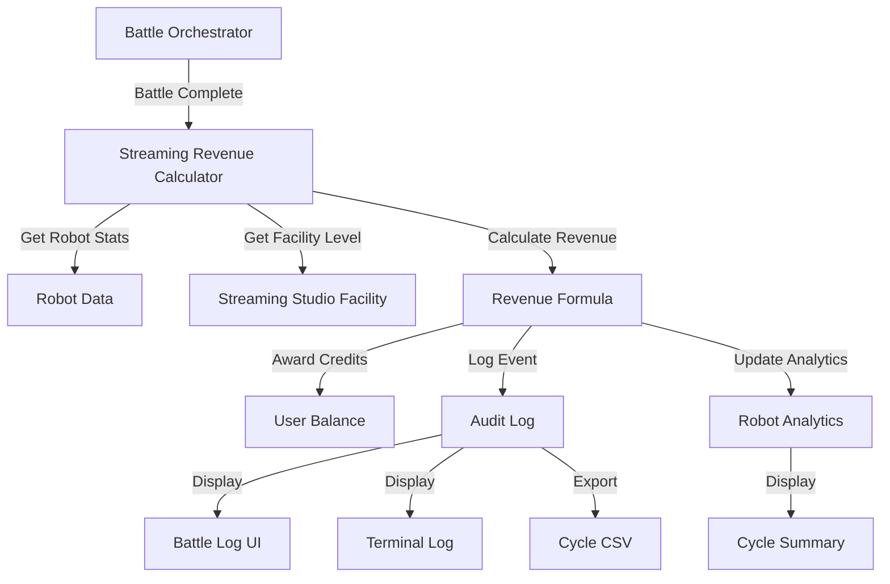

# Design Document: Streaming Revenue Overhaul

## Overview

This design document describes the implementation of a per-battle streaming revenue system that replaces the current daily passive income model. The new system awards streaming credits after every battle (1v1, Tag Team, or Tournament) based on robot fame, battle count, and a new Streaming Studio facility.

The implementation involves:
- Removing streaming revenue from the Income Generator facility
- Creating a new Streaming Studio facility (Levels 1-10)
- Calculating and awarding streaming revenue after each battle completion
- Tracking streaming revenue per robot per cycle for analytics
- Displaying streaming revenue in battle logs, terminal logs, cycle CSV, and cycle summaries
- Integrating with the Facility Advisor for ROI analysis

This change democratizes streaming revenue by making it available to all players through battle participation rather than gating it behind a Level 3+ Income Generator facility.

## Architecture

### High-Level Flow

```
Battle Completion
    ↓
Calculate Streaming Revenue
    ↓
Award Credits to Stable
    ↓
Log to Audit Trail
    ↓
Update Analytics
    ↓
Display in UI/Logs
```

### Component Interaction



### Data Flow

1. **Battle Completion**: `battleOrchestrator.processBattle()` completes a battle
2. **Revenue Calculation**: New `calculateStreamingRevenue()` function computes revenue
3. **Credit Award**: Credits added to user's balance via database transaction
4. **Event Logging**: Streaming revenue logged to audit log with battle_complete event
5. **Analytics Update**: Robot streaming revenue tracked per cycle
6. **Display**: Revenue shown in battle logs, terminal, CSV, and summaries

## Components and Interfaces

### 1. Streaming Revenue Calculator

**Location**: `prototype/backend/src/services/streamingRevenueService.ts` (new file)

**Purpose**: Calculate streaming revenue for battles using the new per-battle formula and multipliers.

**Important**: This is a NEW service that implements the per-battle streaming revenue model. It does NOT reuse the old `calculateStreamingIncome()` function from `economyCalculations.ts`, which implements the daily passive income model and will be deleted.

**Interface**:
```typescript
interface StreamingRevenueCalculation {
  baseAmount: number;              // Always 1000
  battleMultiplier: number;        // 1 + (battles / 1000)
  fameMultiplier: number;          // 1 + (fame / 5000)
  studioMultiplier: number;        // 1 + (level * 0.1)
  totalRevenue: number;            // Final calculated amount
  robotId: number;                 // Robot that earned the revenue
  robotName: string;               // For logging
  robotBattles: number;            // Battle count used
  robotFame: number;               // Fame used
  studioLevel: number;             // Facility level used
}

interface TagTeamStreamingCalculation {
  team1Revenue: StreamingRevenueCalculation;
  team2Revenue: StreamingRevenueCalculation;
  team1MaxBattlesRobot: { id: number; name: string; battles: number };
  team1MaxFameRobot: { id: number; name: string; fame: number };
  team2MaxBattlesRobot: { id: number; name: string; battles: number };
  team2MaxFameRobot: { id: number; name: string; fame: number };
}

// Calculate streaming revenue for a 1v1 battle
async function calculateStreamingRevenue(
  robotId: number,
  userId: number,
  isByeMatch: boolean
): Promise<StreamingRevenueCalculation | null>

// Calculate streaming revenue for a Tag Team battle
async function calculateTagTeamStreamingRevenue(
  team1RobotIds: [number, number],
  team1UserId: number,
  team2RobotIds: [number, number],
  team2UserId: number
): Promise<TagTeamStreamingCalculation>
```

**Key Functions**:
- `calculateStreamingRevenue()`: Computes revenue for a single robot
- `calculateTagTeamStreamingRevenue()`: Computes revenue for both teams using max values
- `getStreamingStudioLevel()`: Retrieves facility level for a user
- `awardStreamingRevenue()`: Updates user balance and logs event

### 2. Streaming Studio Facility

**Location**: `prototype/backend/src/config/facilities.ts` (modify existing)

**Purpose**: Define the new Streaming Studio facility configuration.

**Configuration**:
```typescript
{
  type: 'streaming_studio',
  name: 'Streaming Studio',
  description: 'Increases streaming revenue earned per battle',
  maxLevel: 10,
  costs: [100000, 200000, 300000, 400000, 500000, 600000, 700000, 800000, 900000, 1000000],
  benefits: [
    '+10% streaming revenue per battle',
    '+20% streaming revenue per battle',
    '+30% streaming revenue per battle',
    '+40% streaming revenue per battle',
    '+50% streaming revenue per battle',
    '+60% streaming revenue per battle',
    '+70% streaming revenue per battle',
    '+80% streaming revenue per battle',
    '+90% streaming revenue per battle',
    '+100% streaming revenue per battle (double base rate)',
  ],
  implemented: true,
  prestigeRequirements: [0, 0, 0, 1000, 2500, 5000, 10000, 15000, 25000, 50000],
  operatingCosts: [100, 200, 300, 400, 500, 600, 700, 800, 900, 1000],
}
```

**Operating Costs**: Daily operating costs scale linearly: `level × 100` credits per day.

### 3. Battle Orchestrator Integration

**Location**: `prototype/backend/src/services/battleOrchestrator.ts` (modify existing)

**Purpose**: Integrate streaming revenue calculation and award into battle completion flow.

**Modification Points**:
- After `updateRobotStats()` calls in `processBattle()`
- Before updating scheduled match status
- Add streaming revenue to battle_complete event payload
- Log streaming revenue to terminal

**Pseudocode**:
```typescript
async function processBattle(scheduledMatch: ScheduledMatch) {
  // ... existing battle simulation code ...
  
  // Update robot stats and award prestige/fame (existing)
  const stats1 = await updateRobotStats(robot1, battle, true, isByeMatch);
  const stats2 = await updateRobotStats(robot2, battle, false, isByeMatch);
  
  // NEW: Calculate and award streaming revenue
  let streamingRevenue1 = null;
  let streamingRevenue2 = null;
  
  if (!isByeMatch) {
    streamingRevenue1 = await calculateStreamingRevenue(robot1.id, robot1.userId, false);
    streamingRevenue2 = await calculateStreamingRevenue(robot2.id, robot2.userId, false);
    
    if (streamingRevenue1) {
      await awardStreamingRevenue(robot1.userId, streamingRevenue1);
    }
    if (streamingRevenue2) {
      await awardStreamingRevenue(robot2.userId, streamingRevenue2);
    }
  }
  
  // Update battle_complete event to include streaming revenue
  await eventLogger.logEvent(
    cycleNumber,
    EventType.BATTLE_COMPLETE,
    {
      // ... existing payload ...
      streamingRevenue1: streamingRevenue1?.totalRevenue || 0,
      streamingRevenue2: streamingRevenue2?.totalRevenue || 0,
    }
  );
  
  // Log to terminal
  if (streamingRevenue1) {
    console.log(`[Streaming] ${robot1.name} earned ₡${streamingRevenue1.totalRevenue.toLocaleString()} from Battle #${battle.id}`);
  }
  if (streamingRevenue2) {
    console.log(`[Streaming] ${robot2.name} earned ₡${streamingRevenue2.totalRevenue.toLocaleString()} from Battle #${battle.id}`);
  }
  
  // ... rest of existing code ...
}
```

### 4. Tag Team Battle Integration

**Location**: `prototype/backend/src/services/tagTeamBattleOrchestrator.ts` (modify existing)

**Purpose**: Calculate streaming revenue for Tag Team matches using highest fame and highest battles from each team.

**Modification Points**:
- After battle completion in tag team orchestrator
- Use `calculateTagTeamStreamingRevenue()` with both team compositions
- Award one payment per team (not per robot)
- Log which robots' stats were used

**Pseudocode**:
```typescript
async function processTagTeamBattle(team1, team2) {
  // ... existing battle simulation code ...
  
  // NEW: Calculate streaming revenue for both teams
  const streamingRevenue = await calculateTagTeamStreamingRevenue(
    [team1.robot1Id, team1.robot2Id],
    team1.userId,
    [team2.robot1Id, team2.robot2Id],
    team2.userId
  );
  
  // Award revenue to each team
  await awardStreamingRevenue(team1.userId, streamingRevenue.team1Revenue);
  await awardStreamingRevenue(team2.userId, streamingRevenue.team2Revenue);
  
  // Log to terminal with team composition details
  console.log(
    `[Streaming] Team 1 earned ₡${streamingRevenue.team1Revenue.totalRevenue.toLocaleString()} ` +
    `(Battles from ${streamingRevenue.team1MaxBattlesRobot.name}, Fame from ${streamingRevenue.team1MaxFameRobot.name})`
  );
  
  // ... rest of existing code ...
}
```

### 5. Income Generator Modification

**Location**: `prototype/backend/src/config/facilities.ts` (modify existing)

**Purpose**: Remove streaming revenue from Income Generator facility.

**Changes**:
- Update `benefits` array to remove streaming revenue mentions
- Update facility description
- Add note directing players to Streaming Studio

**Modified Benefits**:
```typescript
benefits: [
  'Unlock Merchandising (₡5,000/day base, scales with prestige)',
  'Improve Merchandising (₡8,000/day base)',
  'Improve Merchandising (₡11,000/day base)',
  'Improve Merchandising (₡12,000/day base)',
  'Improve Merchandising (₡15,000/day base)',
  'Improve Merchandising (₡18,000/day base)',
  'Improve Merchandising (₡20,000/day base)',
  'Improve Merchandising (₡25,000/day base)',
  'Improve Merchandising (₡30,000/day base)',
  'Master Merchandising (₡35,000/day base)',
],
```

**Location**: `prototype/backend/src/utils/economyCalculations.ts` (modify existing)

**Changes**:
- **DELETE** `calculateStreamingIncome()` function (old daily passive model)
- **DELETE** `getStreamingBaseRate()` function (old daily passive model)
- Update `calculateDailyPassiveIncome()` to only calculate merchandising
- Remove streaming from all income calculations

**Important**: The old streaming revenue functions are NOT reused. They implement the daily passive income model (based on Income Generator level, total battles, total fame). The new system requires a completely different implementation that calculates revenue per-battle using individual robot stats and the Streaming Studio facility.

### 6. Robot Analytics Tracking

**Location**: `prototype/backend/src/services/robotAnalyticsService.ts` (new file)

**Purpose**: Track streaming revenue per robot per cycle for analytics display.

**Database Schema Addition**:
```typescript
// New table: robot_streaming_revenue
{
  id: number;
  robotId: number;
  cycleNumber: number;
  streamingRevenue: number;
  battlesInCycle: number;
  createdAt: DateTime;
}
```

**Interface**:
```typescript
interface RobotStreamingAnalytics {
  robotId: number;
  totalStreamingRevenue: number;
  averageRevenuePerBattle: number;
  revenueByC
ycle: { cycleNumber: number; revenue: number }[];
  currentBattleMultiplier: number;
  currentFameMultiplier: number;
  currentStudioMultiplier: number;
}

async function trackStreamingRevenue(
  robotId: number,
  cycleNumber: number,
  revenue: number
): Promise<void>

async function getRobotStreamingAnalytics(
  robotId: number
): Promise<RobotStreamingAnalytics>
```

### 7. Battle Log Display

**Location**: `prototype/frontend/src/components/BattleLog.tsx` (modify existing)

**Purpose**: Display streaming revenue in battle log UI.

**Display Format**:
```
📺 Streaming Revenue: ₡1,500
   Base: ₡1,000 × Battles: 1.20 × Fame: 1.10 × Studio: 1.10
```

**For Tag Team**:
```
📺 Streaming Revenue (Team 1): ₡2,400
   Base: ₡1,000 × Battles: 1.50 (from RobotA) × Fame: 1.20 (from RobotB) × Studio: 1.30
```

### 8. Cycle Summary Display

**Location**: `prototype/backend/src/services/cycleExecutionService.ts` (modify existing)

**Purpose**: Include streaming revenue in cycle summary output.

**Display Format**:
```
Cycle Summary:
  Battles: 45
  Streaming Revenue: ₡67,500
  Battle Winnings: ₡125,000
  Merchandising: ₡21,000
  Total Income: ₡213,500
  Repair Costs: ₡45,000
  Operating Costs: ₡5,000
  Net Profit: ₡163,500
```

### 9. Cycle CSV Export

**Location**: `prototype/backend/src/services/cycleCsvExportService.ts` (modify existing)

**Purpose**: Add streaming revenue column to cycle CSV exports.

**CSV Columns**:
```csv
cycle,battle_id,robot_id,robot_name,opponent_id,opponent_name,result,winnings,streaming_revenue,repair_cost,prestige_awarded,fame_awarded
```

### 10. Facility Advisor Integration

**Location**: `prototype/backend/src/services/facilityRecommendationService.ts` (modify existing)

**Purpose**: Provide ROI analysis for Streaming Studio upgrades.

**Analysis Components**:
- Current streaming revenue per battle (average)
- Projected revenue increase at next level
- Upgrade cost and operating cost increase
- Break-even point in number of battles
- Estimated payback period in days (based on battle frequency)
- 30-day projected returns comparison

**Calculation Example**:
```typescript
interface StreamingStudioROI {
  currentLevel: number;
  nextLevel: number;
  upgradeCost: number;
  operatingCostIncrease: number; // Daily
  currentRevenuePerBattle: number;
  projectedRevenuePerBattle: number;
  revenueIncreasePerBattle: number;
  battlesNeededToBreakEven: number;
  estimatedPaybackDays: number; // Based on avg battles/day
  projectedReturns30Days: number;
}
```

## Data Models

### Streaming Revenue Calculation Data

```typescript
interface StreamingRevenueData {
  robotId: number;
  robotName: string;
  robotBattles: number;
  robotFame: number;
  userId: number;
  studioLevel: number;
  baseAmount: number;
  battleMultiplier: number;
  fameMultiplier: number;
  studioMultiplier: number;
  totalRevenue: number;
}
```

### Audit Log Event Extension

Extend the `battle_complete` event payload to include streaming revenue:

```typescript
interface BattleCompletePayload {
  // ... existing fields ...
  streamingRevenue1?: number;
  streamingRevenue2?: number;
  streamingRevenueDetails1?: {
    baseAmount: number;
    battleMultiplier: number;
    fameMultiplier: number;
    studioMultiplier: number;
  };
  streamingRevenueDetails2?: {
    baseAmount: number;
    battleMultiplier: number;
    fameMultiplier: number;
    studioMultiplier: number;
  };
}
```

### Robot Streaming Revenue Table

New database table to track streaming revenue per robot per cycle:

```prisma
model RobotStreamingRevenue {
  id              Int      @id @default(autoincrement())
  robotId         Int
  cycleNumber     Int
  streamingRevenue Float
  battlesInCycle  Int
  createdAt       DateTime @default(now())
  
  robot           Robot    @relation(fields: [robotId], references: [id])
  
  @@unique([robotId, cycleNumber])
  @@index([robotId])
  @@index([cycleNumber])
}
```

### Streaming Studio Facility

Uses existing `Facility` table with new facility type:

```typescript
{
  userId: number;
  facilityType: 'streaming_studio';
  level: number; // 0-10
  createdAt: DateTime;
  updatedAt: DateTime;
}
```

## Correctness Properties

*A property is a characteristic or behavior that should hold true across all valid executions of a system—essentially, a formal statement about what the system should do. Properties serve as the bridge between human-readable specifications and machine-verifiable correctness guarantees.*


### Property 1: Streaming Revenue Formula Correctness

*For any* robot with battle count B, fame F, and stable with Streaming Studio level S, the calculated streaming revenue should equal 1000 × (1 + B/1000) × (1 + F/5000) × (1 + S×0.1)

**Validates: Requirements 1.2, 2.1, 3.1, 4.7**

### Property 2: Streaming Revenue Awarded to All Battle Participants

*For any* completed non-bye battle (1v1, Tag Team, or Tournament), both participants should receive streaming revenue regardless of battle outcome (win, loss, or draw)

**Validates: Requirements 1.1, 1.6, 1.7**

### Property 3: No Streaming Revenue for Bye Matches

*For any* battle where one participant is a bye-robot, no streaming revenue should be awarded to either participant

**Validates: Requirements 1.8**

### Property 4: Battle Count Includes All Battle Types

*For any* robot, the total battle count used in streaming revenue calculation should equal the sum of 1v1 battles + Tag Team battles + Tournament battles

**Validates: Requirements 2.7**

### Property 5: Stats Updated Before Streaming Revenue Calculation

*For any* battle, when calculating streaming revenue, the robot's battle count should include the current battle, and the robot's fame should include any fame awarded from the current battle

**Validates: Requirements 2.8, 3.7, 3.8**

### Property 6: Studio Multiplier Applies Stable-Wide

*For any* two robots in the same stable, when calculating streaming revenue, both robots should use the same studio_multiplier value based on the stable's Streaming Studio level

**Validates: Requirements 4.8**

### Property 7: Streaming Studio Upgrade Cost Formula

*For any* Streaming Studio at level N (where N < 10), the cost to upgrade to level N+1 should equal (N + 1) × 100,000 credits

**Validates: Requirements 5.2**

### Property 8: Streaming Studio Operating Cost Formula

*For any* Streaming Studio at level L (where L > 0), the daily operating cost should equal L × 100 credits

**Validates: Requirements 5.6, 5.9**

### Property 9: Streaming Studio Prestige Requirements

*For any* Streaming Studio upgrade to level L, the system should enforce the prestige requirement: [0, 0, 0, 1000, 2500, 5000, 10000, 15000, 25000, 50000][L-1], and reject upgrades when the user's prestige is below the requirement

**Validates: Requirements 6.1-6.9**

### Property 10: Tag Team Uses Maximum Values

*For any* Tag Team battle, the streaming revenue calculation for each team should use the highest battle count and highest fame from the two robots on that team

**Validates: Requirements 7.1, 7.2, 7.3, 7.4**

### Property 11: Tag Team Separate Calculations

*For any* Tag Team battle, each team should receive a separate streaming revenue calculation based on their own team's maximum values, not the opponent's values

**Validates: Requirements 7.5**

### Property 12: Tag Team Single Payment Per Team

*For any* Tag Team battle, each stable should receive exactly one streaming revenue payment (not one per robot)

**Validates: Requirements 7.6**

### Property 13: Battle Log Contains Streaming Revenue Data

*For any* battle log display, the output should contain the streaming revenue amount, base amount (1000), battle multiplier, fame multiplier, and studio multiplier

**Validates: Requirements 8.1-8.8**

### Property 14: Terminal Log Contains Streaming Revenue

*For any* battle completion during a cycle, the terminal log should contain a streaming revenue entry with robot name, battle ID, and revenue amount

**Validates: Requirements 9.1-9.6**

### Property 15: Cycle CSV Contains Streaming Revenue Column

*For any* cycle CSV export, each battle row should include a streaming_revenue column with the amount earned by the robot in that battle

**Validates: Requirements 10.1-10.7**

### Property 16: Cycle Summary Includes Total Streaming Revenue

*For any* cycle summary, the display should include a streaming revenue line item showing the total streaming revenue earned across all battles in the cycle

**Validates: Requirements 11.1-11.9**

### Property 17: Financial Report Includes Streaming Revenue

*For any* daily financial report, the report should include streaming revenue as a separate line item under revenue streams, showing the total amount and number of battles

**Validates: Requirements 12.1-12.7**

### Property 18: Income Generator No Longer Provides Streaming Revenue

*For any* stable with an Income Generator facility, the daily passive income calculation should only include merchandising income and should not include any streaming revenue component

**Validates: Requirements 13.1-13.8**

### Property 19: Streaming Revenue Tracked Per Robot Per Cycle

*For any* robot that participates in battles during a cycle, the system should track and store the total streaming revenue earned by that robot in that cycle

**Validates: Requirements 15.1-15.7, 18.1-18.7**

### Property 20: Tournament Battles Award Streaming Revenue

*For any* tournament battle (non-bye), streaming revenue should be calculated and awarded using the same formula as regular 1v1 battles

**Validates: Requirements 16.1-16.7**

### Property 21: Facility Advisor Provides Streaming Studio ROI

*For any* Streaming Studio at level L < 10, the Facility Advisor should display upgrade cost, operating cost increase, projected revenue increase per battle, and estimated payback period for upgrading to level L+1

**Validates: Requirements 17.1-17.9**

## Error Handling

### Invalid Input Handling

1. **Negative Values**: If robot battles or fame are negative (data corruption), default to 0
2. **Invalid Facility Level**: If Streaming Studio level is outside 0-10 range, clamp to valid range
3. **Missing Robot Data**: If robot not found during calculation, log error and skip streaming revenue award
4. **Missing Facility Data**: If facility query fails, default to level 0 (no studio bonus)

### Database Transaction Failures

1. **Credit Award Failure**: If updating user balance fails, log error and retry once
2. **Analytics Tracking Failure**: If tracking fails, log error but don't block battle completion
3. **Audit Log Failure**: If logging fails, log error but don't block battle completion

### Edge Cases

1. **Zero Battles/Fame**: Handle robots with 0 battles or 0 fame (multipliers = 1.0)
2. **Bye Matches**: Explicitly skip streaming revenue calculation for bye matches
3. **Draw Outcomes**: Award streaming revenue to both participants in draws
4. **Tag Team Equal Values**: When robots have equal fame or battles, use either value (they're equal)

### Validation

1. **Prestige Requirements**: Validate prestige before allowing Streaming Studio upgrades
2. **Sufficient Funds**: Validate user has sufficient credits before allowing upgrades
3. **Maximum Level**: Prevent upgrades beyond level 10

## Testing Strategy

### Unit Testing

Unit tests will focus on specific examples, edge cases, and integration points:

1. **Formula Calculations**:
   - Test specific examples: 0 battles/fame, 100 battles, 1000 battles, 5000 battles
   - Test edge cases: negative values, very large values
   - Test rounding behavior

2. **Facility Configuration**:
   - Test Streaming Studio exists with correct costs and benefits
   - Test prestige requirements are correctly configured
   - Test operating costs are correctly configured

3. **Integration Points**:
   - Test battle orchestrator calls streaming revenue service
   - Test Tag Team orchestrator calls streaming revenue service
   - Test streaming revenue is added to audit log
   - Test streaming revenue is added to user balance

4. **Error Handling**:
   - Test behavior when robot not found
   - Test behavior when facility query fails
   - Test behavior when database transaction fails

5. **Display Components**:
   - Test battle log renders streaming revenue section
   - Test cycle summary includes streaming revenue
   - Test CSV export includes streaming revenue column

### Property-Based Testing

Property tests will verify universal properties across all inputs. Each test should run a minimum of 100 iterations.

1. **Property 1: Streaming Revenue Formula Correctness**
   - Generate random robot stats (battles: 0-10000, fame: 0-50000)
   - Generate random facility levels (0-10)
   - Calculate expected revenue manually
   - Verify system calculation matches expected value
   - **Tag**: Feature: streaming-revenue-overhaul, Property 1: Formula correctness

2. **Property 2: Streaming Revenue Awarded to All Participants**
   - Generate random battles with different outcomes (win/loss/draw)
   - Verify both participants receive streaming revenue
   - Verify amounts are calculated independently
   - **Tag**: Feature: streaming-revenue-overhaul, Property 2: All participants receive revenue

3. **Property 3: No Streaming Revenue for Bye Matches**
   - Generate battles with bye-robots
   - Verify no streaming revenue is awarded
   - **Tag**: Feature: streaming-revenue-overhaul, Property 3: No revenue for bye matches

4. **Property 4: Battle Count Includes All Types**
   - Generate robots with random battle counts across types
   - Verify total used in calculation equals sum of all types
   - **Tag**: Feature: streaming-revenue-overhaul, Property 4: Battle count includes all types

5. **Property 5: Stats Updated Before Calculation**
   - Generate battles and track battle count before/after
   - Verify streaming revenue uses updated battle count
   - **Tag**: Feature: streaming-revenue-overhaul, Property 5: Stats updated before calculation

6. **Property 6: Studio Multiplier Applies Stable-Wide**
   - Generate multiple robots in same stable
   - Verify all use same studio multiplier
   - **Tag**: Feature: streaming-revenue-overhaul, Property 6: Studio multiplier stable-wide

7. **Property 7: Upgrade Cost Formula**
   - Generate random facility levels (0-9)
   - Verify upgrade cost equals (N+1) × 100,000
   - **Tag**: Feature: streaming-revenue-overhaul, Property 7: Upgrade cost formula

8. **Property 8: Operating Cost Formula**
   - Generate random facility levels (1-10)
   - Verify operating cost equals L × 100
   - **Tag**: Feature: streaming-revenue-overhaul, Property 8: Operating cost formula

9. **Property 9: Prestige Requirements Enforced**
   - Generate random prestige values and upgrade attempts
   - Verify upgrades blocked when prestige insufficient
   - **Tag**: Feature: streaming-revenue-overhaul, Property 9: Prestige requirements

10. **Property 10: Tag Team Uses Maximum Values**
    - Generate Tag Team battles with varying robot stats
    - Verify calculation uses max battles and max fame from each team
    - **Tag**: Feature: streaming-revenue-overhaul, Property 10: Tag Team max values

11. **Property 11: Tag Team Separate Calculations**
    - Generate Tag Team battles with different team compositions
    - Verify each team's revenue is calculated independently
    - **Tag**: Feature: streaming-revenue-overhaul, Property 11: Tag Team separate calculations

12. **Property 12: Tag Team Single Payment**
    - Generate Tag Team battles
    - Verify each stable receives exactly one payment
    - **Tag**: Feature: streaming-revenue-overhaul, Property 12: Tag Team single payment

13. **Property 13: Battle Log Contains Data**
    - Generate random battles
    - Verify battle log output contains all required streaming revenue fields
    - **Tag**: Feature: streaming-revenue-overhaul, Property 13: Battle log contains data

14. **Property 14: Terminal Log Contains Revenue**
    - Generate random battles
    - Verify terminal log contains streaming revenue entry
    - **Tag**: Feature: streaming-revenue-overhaul, Property 14: Terminal log contains revenue

15. **Property 15: CSV Contains Revenue Column**
    - Generate random cycles with battles
    - Verify CSV export includes streaming_revenue column
    - **Tag**: Feature: streaming-revenue-overhaul, Property 15: CSV contains revenue

16. **Property 16: Cycle Summary Includes Revenue**
    - Generate random cycles with battles
    - Verify cycle summary includes streaming revenue total
    - **Tag**: Feature: streaming-revenue-overhaul, Property 16: Cycle summary includes revenue

17. **Property 17: Financial Report Includes Revenue**
    - Generate random daily activity
    - Verify financial report includes streaming revenue line item
    - **Tag**: Feature: streaming-revenue-overhaul, Property 17: Financial report includes revenue

18. **Property 18: Income Generator No Streaming**
    - Generate stables with Income Generator
    - Verify passive income calculation excludes streaming revenue
    - **Tag**: Feature: streaming-revenue-overhaul, Property 18: Income Generator no streaming

19. **Property 19: Revenue Tracked Per Robot Per Cycle**
    - Generate random cycles with robot battles
    - Verify streaming revenue is tracked and stored per robot per cycle
    - **Tag**: Feature: streaming-revenue-overhaul, Property 19: Revenue tracked per robot per cycle

20. **Property 20: Tournament Battles Award Revenue**
    - Generate tournament battles
    - Verify streaming revenue awarded using same formula as 1v1
    - **Tag**: Feature: streaming-revenue-overhaul, Property 20: Tournament battles award revenue

21. **Property 21: Facility Advisor Provides ROI**
    - Generate stables with various Streaming Studio levels
    - Verify Facility Advisor displays all required ROI metrics
    - **Tag**: Feature: streaming-revenue-overhaul, Property 21: Facility Advisor ROI

### Integration Testing

Integration tests will verify the complete flow from battle completion to display:

1. **End-to-End Battle Flow**:
   - Create robots and facilities
   - Execute battle
   - Verify streaming revenue calculated
   - Verify credits awarded
   - Verify audit log updated
   - Verify analytics tracked
   - Verify display in UI

2. **Tag Team Flow**:
   - Create teams with varying stats
   - Execute Tag Team battle
   - Verify correct max values used
   - Verify separate calculations per team
   - Verify single payment per stable

3. **Tournament Flow**:
   - Create tournament
   - Execute tournament rounds
   - Verify streaming revenue awarded for all rounds
   - Verify no revenue for byes

4. **Facility Upgrade Flow**:
   - Purchase Streaming Studio
   - Upgrade through levels
   - Verify prestige requirements enforced
   - Verify operating costs applied
   - Verify multiplier increases

5. **Analytics Flow**:
   - Execute multiple cycles with battles
   - Verify streaming revenue tracked per robot per cycle
   - Verify analytics display shows correct data
   - Verify Facility Advisor shows correct ROI

### Testing Tools

- **Unit Tests**: Jest/Vitest for TypeScript backend
- **Property Tests**: fast-check library for TypeScript
- **Integration Tests**: Supertest for API testing
- **Database Tests**: In-memory SQLite or test database
- **UI Tests**: React Testing Library for frontend components

### Test Data Generation

For property-based tests, use these generators:

```typescript
// Robot stats generator
const robotStatsArb = fc.record({
  battles: fc.integer({ min: 0, max: 10000 }),
  fame: fc.integer({ min: 0, max: 50000 }),
});

// Facility level generator
const facilityLevelArb = fc.integer({ min: 0, max: 10 });

// Battle outcome generator
const battleOutcomeArb = fc.constantFrom('win', 'loss', 'draw');

// Tag Team composition generator
const tagTeamArb = fc.record({
  robot1: robotStatsArb,
  robot2: robotStatsArb,
});
```

## Implementation Notes

### Migration Strategy

1. **Phase 1: Add Streaming Studio Facility**
   - Add facility configuration
   - Add database migration for facility type
   - Add UI for facility purchase/upgrade

2. **Phase 2: Implement Streaming Revenue Service**
   - Create streaming revenue calculation service
   - Add unit tests for formulas
   - Add property tests for correctness

3. **Phase 3: Integrate with Battle Orchestrator**
   - Modify battle orchestrator to call streaming revenue service
   - Modify Tag Team orchestrator
   - Add streaming revenue to audit log events

4. **Phase 4: Remove Streaming from Income Generator**
   - Update Income Generator configuration
   - Update passive income calculations
   - Update UI descriptions

5. **Phase 5: Add Display and Analytics**
   - Update battle log UI
   - Update cycle summary
   - Update CSV export
   - Add analytics tracking
   - Update Facility Advisor

6. **Phase 6: Testing and Validation**
   - Run full test suite
   - Validate economic balance
   - Test with production-like data
   - Monitor for issues

### Performance Considerations

1. **Database Queries**: Batch facility level queries for multiple robots
2. **Caching**: Cache facility levels during cycle execution
3. **Analytics**: Use background jobs for analytics aggregation
4. **Audit Log**: Use async logging to avoid blocking battle completion

### Backward Compatibility

1. **Existing Income Generators**: Continue to provide merchandising income
2. **Existing Battles**: Historical battles don't need streaming revenue retroactively
3. **Analytics**: Start tracking from implementation date forward
4. **CSV Exports**: Add streaming_revenue column, populate with 0 for historical data

### Documentation Updates

As specified in Requirement 19, the following documentation must be updated:

1. **PRD_ECONOMY_SYSTEM.md**:
   - Update revenue streams section
   - Add Streaming Studio facility
   - Remove streaming from Income Generator
   - Update economic balance examples

2. **STABLE_SYSTEM.md**:
   - Add Streaming Studio specifications
   - Update facility comparison tables

3. **In-Game Help**:
   - Update facility tooltips
   - Update financial report help text
   - Add streaming revenue explanation

4. **API Documentation**:
   - Document new streaming revenue endpoints (if any)
   - Update battle response schemas

## Conclusion

This design provides a comprehensive approach to overhauling the streaming revenue system from daily passive income to per-battle rewards. The new system:

- Democratizes streaming revenue by making it available to all players
- Rewards active participation through battle count and fame multipliers
- Provides a new facility investment option with clear ROI
- Maintains economic balance through carefully tuned formulas
- Integrates seamlessly with existing battle, analytics, and display systems

The implementation follows a phased approach to minimize risk and ensure thorough testing at each stage. Property-based testing ensures correctness across all possible inputs, while unit and integration tests validate specific scenarios and edge cases.
