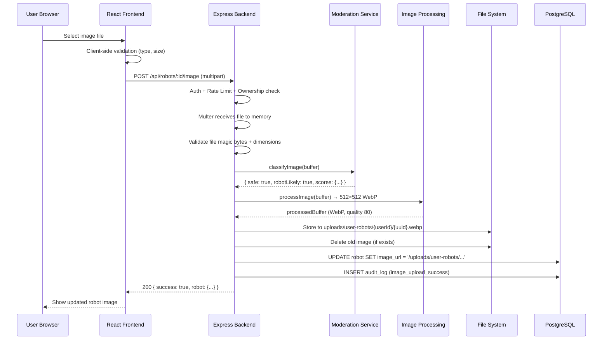
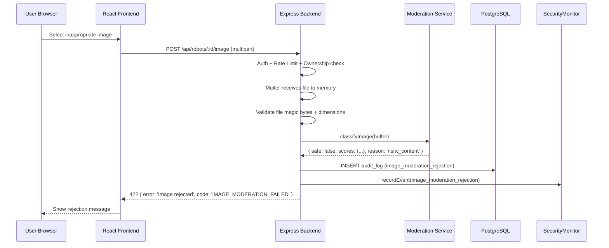

# Design Document: Robot Image Upload with Content Moderation

## Overview

This feature allows players to upload custom images for their robots, replacing the current system that only supports selecting from bundled static assets. Because Armoured Souls is intended to be kid-friendly and legally compliant, every uploaded image must pass through automated content moderation before it becomes visible. The system uses a local, self-hosted moderation pipeline (no external cloud APIs) to stay within the resource constraints of the Scaleway DEV1-S VPS (2 vCPU, 2GB RAM).

The upload flow is: user selects a file → frontend validates basic constraints → backend receives the file via multipart upload → backend validates file type/size/dimensions (magic bytes, 64×64 to 4096×4096 input) → backend runs content moderation (NSFW classification via `nsfwjs` on a TensorFlow.js CPU backend + robot-likeness heuristic) → if the image passes, it is resized to 512×512 WebP via `sharp` (fit: `cover`, quality: 80), stored on disk under `uploads/user-robots/` with a UUID-based non-guessable filename, and the robot's `imageUrl` is updated; if it fails, the image is rejected with a clear message and the upload is dual-logged to both the persistent AuditLog database and the in-memory SecurityMonitor for real-time admin dashboard visibility.

Uploaded images are stored on the local filesystem under `uploads/user-robots/{userId}/{uuid}.webp` — deliberately separate from the bundled preset images in `app/frontend/src/assets/robots/`. UUID-based filenames prevent URL enumeration. Images are served as static files by Caddy. This avoids external storage costs and keeps latency minimal on the single-VPS architecture.

> **Future Enhancement (Backlog):** AI-powered robot image generation in the style of existing presets, using robot context (weapon loadout, attributes) to create unique images. This could use a diffusion model or image-to-image pipeline seeded with the robot's attributes. Out of scope for this spec — tracked separately as a future enhancement.

## Architecture

```mermaid
graph TD
    subgraph Frontend
        A[RobotImageSelector] -->|File selected| B[Upload Component<br/>Mobile-Responsive]
        B -->|POST multipart/form-data| C[/api/robots/:id/image]
    end

    subgraph Backend
        C --> D[Auth Middleware]
        D --> E[Rate Limiter]
        E --> F[Multer File Handler]
        F --> G[File Validation Service]
        G --> H[Content Moderation Service<br/>NSFW + Robot-Likeness]
        H -->|Pass| I[Image Processing Service<br/>sharp: 512×512 WebP]
        H -->|Fail| J[Reject + Dual Audit Log]
        I --> K[File Storage Service<br/>UUID filenames]
        K --> L[Update Robot imageUrl]
        L --> M[Return Success Response]
    end

    subgraph "Dual Audit Logging"
        J --> J1[AuditLog DB<br/>via EventLogger]
        J --> J2[SecurityMonitor<br/>In-Memory Events]
    end

    subgraph Storage
        K --> N[Local Filesystem<br/>uploads/user-robots/userId/]
        N --> O[Caddy Static Serving]
    end

    subgraph Moderation
        H --> P[nsfwjs TensorFlow.js<br/>CPU Backend]
    end
```

## Sequence Diagrams

### Happy Path: Successful Upload



### Rejection Path: NSFW Content Detected



## Components and Interfaces

### Component 1: Image Upload Route Handler

**Purpose**: Express route that handles multipart file upload, orchestrates validation, moderation, image processing, and updates the robot record.

```typescript
// POST /api/robots/:id/image
interface ImageUploadRoute {
  // Middleware chain: authenticateToken → uploadRateLimiter → multerUpload → validateRequest
  handler(req: AuthRequest, res: Response): Promise<void>;
}
```

**Responsibilities**:
- Verify robot ownership
- Delegate to file validation service
- Delegate to content moderation service (NSFW + robot-likeness)
- Delegate to image processing service (resize + convert)
- Store approved file and update database
- Clean up temp files on any failure
- Dual audit log: AuditLog DB + SecurityMonitor for rejections

### Component 2: File Validation Service

**Purpose**: Validates uploaded files beyond what Multer checks — verifies magic bytes match declared MIME type, checks image dimensions, and ensures the file is a real image.

```typescript
interface FileValidationService {
  validateImage(buffer: Buffer, mimeType: string): Promise<FileValidationResult>;
}

interface FileValidationResult {
  valid: boolean;
  width?: number;
  height?: number;
  detectedMimeType?: string;
  error?: string;
}
```

**Responsibilities**:
- Verify file magic bytes match expected image types (JPEG, PNG, WebP)
- Check image dimensions (min 64×64, max 4096×4096 — generous input range since sharp will resize)
- Reject files that claim to be images but aren't (e.g., renamed executables)
- Return detected dimensions for downstream use

### Component 3: Content Moderation Service

**Purpose**: Runs NSFW classification on uploaded images using `nsfwjs` with TensorFlow.js CPU backend, plus a robot-likeness heuristic. Singleton that loads the model once at startup.

```typescript
interface ContentModerationService {
  initialize(): Promise<void>;
  classifyImage(buffer: Buffer): Promise<ModerationResult>;
  isReady(): boolean;
}

interface ModerationResult {
  safe: boolean;
  robotLikely: boolean;
  scores: {
    neutral: number;
    drawing: number;
    hentai: number;
    porn: number;
    sexy: number;
  };
  robotLikenessScore: number;  // drawing + neutral combined
  reason?: string;  // Set when safe=false or robotLikely=false
}
```

**Responsibilities**:
- Load nsfwjs model once at application startup
- Classify images and return safety scores
- Apply configurable NSFW thresholds (default: reject if porn ≥ 0.3 OR hentai ≥ 0.3 OR sexy ≥ 0.5)
- Compute robot-likeness heuristic: `drawing + neutral` score. If below 0.6, flag as `robotLikely: false`
- Handle model loading failures gracefully (reject all uploads if model unavailable)
- Minimize memory footprint (single model instance, process one image at a time)

### Component 4: Image Processing Service

**Purpose**: Resizes and converts uploaded images to the uniform 512×512 WebP format using `sharp`, ensuring all stored images match the preset image format.

```typescript
interface ImageProcessingService {
  processImage(buffer: Buffer): Promise<Buffer>;
}
```

**Responsibilities**:
- Resize input image to 512×512 pixels using `sharp` with `fit: 'cover'` (center-crop for non-square images)
- Convert to WebP format with quality 80
- Return the processed buffer for storage
- All images pass through this pipeline regardless of input format or dimensions

### Component 5: File Storage Service

**Purpose**: Manages the lifecycle of uploaded image files on the local filesystem with UUID-based non-guessable filenames.

```typescript
interface FileStorageService {
  storeImage(userId: number, buffer: Buffer): Promise<string>;
  deleteImage(relativePath: string): Promise<void>;
  getAbsolutePath(relativePath: string): string;
}
```

**Responsibilities**:
- Store files in `uploads/user-robots/{userId}/{uuid}.webp` structure
- Generate unique filenames using `crypto.randomUUID()` for non-guessable URLs
- Delete old images when a robot's image is replaced
- Return relative URL paths for database storage
- Ensure upload directories exist
- Keep user uploads separate from preset assets in `app/frontend/src/assets/robots/`

### Component 6: Frontend Upload Component

**Purpose**: Extends the existing `RobotImageSelector` modal with a new "Upload Custom Image" tab alongside the existing preset image grid. Mobile-responsive design.

```typescript
interface ImageUploadProps {
  robotId: number;
  onUploadComplete: (imageUrl: string) => void;
  onError: (message: string) => void;
}

interface UploadState {
  file: File | null;
  preview: string | null;
  uploading: boolean;
  progress: number;
  error: string | null;
}
```

**Responsibilities**:
- Client-side file type and size validation before upload
- Image preview before submission
- Upload progress indication
- Display moderation and robot-likeness rejection messages clearly
- Integrate with existing RobotImageSelector modal
- Mobile-responsive layout: touch-friendly tap targets (min 44×44px), responsive modal, camera roll access via `accept="image/*"` attribute, preview that scales to viewport

## Data Models

### Robot Model (Existing — No Schema Change)

The `Robot` model already has an `imageUrl` field (`String? @db.VarChar(255)`). Currently it stores Vite asset URLs from bundled images. After this feature, it will also store paths like `/uploads/user-robots/42/550e8400-e29b-41d4-a716-446655440000.webp` for user-uploaded images.

No Prisma migration is needed.

### AuditLog Entries (Existing Model)

Content moderation events are logged to the existing `AuditLog` model:

```typescript
// Moderation rejection audit entry
{
  eventType: 'image_moderation_rejection',
  userId: number,
  details: {
    robotId: number,
    scores: ModerationResult['scores'],
    robotLikenessScore: number,
    reason: string,
    filename: string,
    timestamp: string,
  }
}

// Successful upload audit entry
{
  eventType: 'image_upload_success',
  userId: number,
  details: {
    robotId: number,
    imageUrl: string,
    fileSize: number,
    originalDimensions: { width: number, height: number },
  }
}
```

### SecurityMonitor Events (In-Memory)

Moderation rejections are also recorded in the SecurityMonitor for real-time admin dashboard visibility:

```typescript
// SecurityMonitor event for moderation rejection
{
  type: 'image_moderation_rejection',
  severity: 'medium',
  userId: number,
  details: {
    robotId: number,
    reason: string,  // 'nsfw_content' | 'low_robot_likeness'
  }
}
```

### Upload Constraints (Configuration)

```typescript
interface ImageUploadConfig {
  maxFileSizeBytes: number;       // 2 MB (2 * 1024 * 1024)
  allowedMimeTypes: string[];     // ['image/jpeg', 'image/png', 'image/webp']
  maxInputDimensions: { width: number; height: number };  // 4096 × 4096
  minInputDimensions: { width: number; height: number };  // 64 × 64
  outputDimensions: { width: number; height: number };    // 512 × 512
  outputFormat: 'webp';
  outputQuality: number;          // 80
  uploadDir: string;              // 'uploads/user-robots'
  moderationThresholds: {
    porn: number;                 // 0.3
    hentai: number;               // 0.3
    sexy: number;                 // 0.5
  };
  robotLikenessThreshold: number; // 0.6 (drawing + neutral minimum)
}
```


## Key Functions with Formal Specifications

### Function 1: handleImageUpload()

```typescript
async function handleImageUpload(req: AuthRequest, res: Response): Promise<void>
```

**Preconditions:**
- `req.user` is authenticated (JWT valid)
- `req.params.id` is a valid positive integer (robot ID)
- `req.file` is present (Multer processed the multipart upload)
- `req.file.size <= 2MB`
- `req.file.mimetype` is one of `['image/jpeg', 'image/png', 'image/webp']`

**Postconditions:**
- If moderation passes: image is processed to 512×512 WebP, stored on disk, robot's `imageUrl` is updated in DB, old image deleted, response is 200
- If moderation fails: no file stored, audit log entry created in both AuditLog DB and SecurityMonitor, response is 422
- If robot-likeness fails: no file stored, audit log entry created in both AuditLog DB and SecurityMonitor, response is 422
- If validation fails: no file stored, response is 400
- If ownership check fails: response is 403, no side effects
- Temp files are always cleaned up regardless of outcome

**Loop Invariants:** N/A

### Function 2: classifyImage()

```typescript
async function classifyImage(buffer: Buffer): Promise<ModerationResult>
```

**Preconditions:**
- `buffer` is a valid image buffer (already validated by file validation service)
- `buffer.length > 0`
- nsfwjs model is loaded and ready

**Postconditions:**
- Returns `ModerationResult` with all five category scores summing to approximately 1.0
- `safe` is `true` if and only if all NSFW scores are below their respective thresholds
- `robotLikely` is `true` if and only if `drawing + neutral >= robotLikenessThreshold`
- `robotLikenessScore` contains the sum of `drawing` and `neutral` scores
- If `safe` is `false`, `reason` contains a human-readable explanation
- If `robotLikely` is `false`, `reason` is `'low_robot_likeness'`
- No side effects on the input buffer
- Does not throw — returns `{ safe: false, reason: 'moderation_unavailable' }` if model fails

**Loop Invariants:** N/A

### Function 3: validateImage()

```typescript
async function validateImage(buffer: Buffer, mimeType: string): Promise<FileValidationResult>
```

**Preconditions:**
- `buffer` is a non-empty Buffer
- `mimeType` is a non-empty string

**Postconditions:**
- Returns `{ valid: true, width, height, detectedMimeType }` if file is a genuine image within constraints
- Returns `{ valid: false, error }` if magic bytes don't match, dimensions are out of range, or file is corrupt
- `detectedMimeType` is determined from magic bytes, not from the declared `mimeType` parameter
- Input dimension range: 64×64 to 4096×4096
- No mutations to input parameters

**Loop Invariants:** N/A

### Function 4: processImage()

```typescript
async function processImage(buffer: Buffer): Promise<Buffer>
```

**Preconditions:**
- `buffer` is a non-empty Buffer containing valid image data (already validated)

**Postconditions:**
- Returns a Buffer containing a 512×512 WebP image at quality 80
- Non-square images are center-cropped via `sharp`'s `fit: 'cover'`
- Output buffer is always WebP regardless of input format
- Does not mutate the input buffer

**Loop Invariants:** N/A

### Function 5: storeImage()

```typescript
async function storeImage(userId: number, buffer: Buffer): Promise<string>
```

**Preconditions:**
- `userId` is a positive integer
- `buffer` is a non-empty Buffer containing processed 512×512 WebP image data

**Postconditions:**
- File is written to `uploads/user-robots/{userId}/{uuid}.webp`
- Returns the relative URL path (e.g., `/uploads/user-robots/42/550e8400-e29b-41d4-a716-446655440000.webp`)
- Directory is created if it doesn't exist
- Filename is a random UUID (non-guessable, non-enumerable)
- Extension is always `.webp` (since all images are converted)
- Throws if disk write fails

**Loop Invariants:** N/A

## Algorithmic Pseudocode

### Main Upload Processing Algorithm

```typescript
// POST /api/robots/:id/image
ALGORITHM handleImageUpload(req, res)
INPUT: req (AuthRequest with file), res (Response)
OUTPUT: JSON response with updated robot or error

BEGIN
  userId ← req.user.userId
  robotId ← parseInt(req.params.id)
  file ← req.file

  // Step 1: Verify robot ownership
  robot ← await prisma.robot.findUnique({ where: { id: robotId } })
  IF robot IS NULL OR robot.userId ≠ userId THEN
    RETURN res.status(403).json({ error: 'Access denied', code: 'ROBOT_NOT_OWNED' })
  END IF

  // Step 2: Validate file is a genuine image with acceptable dimensions
  validation ← await fileValidationService.validateImage(file.buffer, file.mimetype)
  IF NOT validation.valid THEN
    RETURN res.status(400).json({ error: validation.error, code: 'INVALID_IMAGE' })
  END IF

  // Step 3: Run content moderation (NSFW + robot-likeness)
  moderation ← await contentModerationService.classifyImage(file.buffer)
  IF NOT moderation.safe THEN
    await eventLogger.logEvent({
      eventType: 'image_moderation_rejection',
      userId, payload: { robotId, scores: moderation.scores, reason: moderation.reason }
    })
    securityMonitor.recordEvent({
      type: 'image_moderation_rejection', severity: 'medium',
      userId, details: { robotId, reason: moderation.reason }
    })
    RETURN res.status(422).json({
      error: 'Image did not pass content moderation',
      code: 'IMAGE_MODERATION_FAILED',
      reason: moderation.reason
    })
  END IF

  IF NOT moderation.robotLikely THEN
    await eventLogger.logEvent({
      eventType: 'image_moderation_rejection',
      userId, payload: { robotId, scores: moderation.scores, robotLikenessScore: moderation.robotLikenessScore, reason: 'low_robot_likeness' }
    })
    securityMonitor.recordEvent({
      type: 'image_moderation_rejection', severity: 'low',
      userId, details: { robotId, reason: 'low_robot_likeness' }
    })
    RETURN res.status(422).json({
      error: 'Image does not appear to be a robot or mech. Please upload a robot-style image.',
      code: 'LOW_ROBOT_LIKENESS'
    })
  END IF

  // Step 4: Process image to 512×512 WebP
  processedBuffer ← await imageProcessingService.processImage(file.buffer)

  // Step 5: Store the processed image
  imageUrl ← await fileStorageService.storeImage(userId, processedBuffer)

  // Step 6: Delete old custom image if it exists
  IF robot.imageUrl AND robot.imageUrl.startsWith('/uploads/') THEN
    await fileStorageService.deleteImage(robot.imageUrl)
  END IF

  // Step 7: Update robot record
  updatedRobot ← await prisma.robot.update({
    where: { id: robotId },
    data: { imageUrl }
  })

  // Step 8: Audit log success
  await eventLogger.logEvent({
    eventType: 'image_upload_success',
    userId, payload: { robotId, imageUrl, fileSize: file.size, originalDimensions: { width: validation.width, height: validation.height } }
  })

  RETURN res.status(200).json({ success: true, robot: updatedRobot })
END
```

**Preconditions:**
- User is authenticated
- File has been received by Multer middleware
- Rate limit has not been exceeded

**Postconditions:**
- On success: image processed to 512×512 WebP, stored on disk, robot record updated, audit logged
- On failure: no orphaned files, appropriate error returned, rejections dual-logged to AuditLog + SecurityMonitor
- Multer memory storage means no temp files to clean up (buffer is in memory)

### Content Moderation Algorithm

```typescript
ALGORITHM classifyImage(buffer)
INPUT: buffer (Buffer containing image data)
OUTPUT: ModerationResult

BEGIN
  IF NOT model.isReady() THEN
    RETURN { safe: false, robotLikely: false, scores: {}, robotLikenessScore: 0, reason: 'moderation_unavailable' }
  END IF

  // Decode image buffer to tensor
  image ← await decodeImage(buffer)

  // Run nsfwjs classification
  predictions ← await model.classify(image)

  // Dispose tensor to free memory
  image.dispose()

  // Convert predictions array to scores object
  scores ← {}
  FOR each prediction IN predictions DO
    scores[prediction.className.toLowerCase()] ← prediction.probability
  END FOR

  // Apply NSFW thresholds
  safe ← scores.porn < THRESHOLDS.porn
      AND scores.hentai < THRESHOLDS.hentai
      AND scores.sexy < THRESHOLDS.sexy

  // Compute robot-likeness heuristic
  robotLikenessScore ← scores.drawing + scores.neutral
  robotLikely ← robotLikenessScore >= ROBOT_LIKENESS_THRESHOLD

  reason ← null
  IF NOT safe THEN
    IF scores.porn >= THRESHOLDS.porn THEN reason ← 'explicit_content'
    ELSE IF scores.hentai >= THRESHOLDS.hentai THEN reason ← 'explicit_content'
    ELSE IF scores.sexy >= THRESHOLDS.sexy THEN reason ← 'suggestive_content'
    END IF
  ELSE IF NOT robotLikely THEN
    reason ← 'low_robot_likeness'
  END IF

  RETURN { safe, robotLikely, scores, robotLikenessScore, reason }
END
```

**Preconditions:**
- buffer contains valid image data (pre-validated)
- Model has been initialized at application startup

**Postconditions:**
- Returns classification with all five NSFW categories scored plus robot-likeness
- NSFW check is evaluated first; robot-likeness is only relevant if NSFW passes
- Tensors are disposed after classification (no memory leaks)
- Never throws — returns safe=false with reason on any internal error

### Image Processing Algorithm

```typescript
ALGORITHM processImage(buffer)
INPUT: buffer (Buffer containing valid image data)
OUTPUT: Buffer (512×512 WebP at quality 80)

BEGIN
  processedBuffer ← await sharp(buffer)
    .resize(512, 512, { fit: 'cover', position: 'centre' })
    .webp({ quality: 80 })
    .toBuffer()

  RETURN processedBuffer
END
```

**Preconditions:**
- buffer contains a valid image (already validated by File Validation Service)

**Postconditions:**
- Output is always 512×512 WebP regardless of input format/dimensions
- Non-square images are center-cropped (fit: 'cover')
- Quality is fixed at 80 for consistent file sizes

### File Magic Byte Validation Algorithm

```typescript
ALGORITHM validateMagicBytes(buffer)
INPUT: buffer (Buffer)
OUTPUT: detectedMimeType or null

BEGIN
  // JPEG: starts with FF D8 FF
  IF buffer[0] = 0xFF AND buffer[1] = 0xD8 AND buffer[2] = 0xFF THEN
    RETURN 'image/jpeg'
  END IF

  // PNG: starts with 89 50 4E 47 0D 0A 1A 0A
  IF buffer[0] = 0x89 AND buffer[1] = 0x50 AND buffer[2] = 0x4E AND buffer[3] = 0x47 THEN
    RETURN 'image/png'
  END IF

  // WebP: starts with RIFF....WEBP
  IF buffer[0] = 0x52 AND buffer[1] = 0x49 AND buffer[2] = 0x46 AND buffer[3] = 0x46
     AND buffer[8] = 0x57 AND buffer[9] = 0x45 AND buffer[10] = 0x42 AND buffer[11] = 0x50 THEN
    RETURN 'image/webp'
  END IF

  RETURN null  // Unknown format
END
```


## Example Usage

### Backend: Upload Route Registration

```typescript
import multer from 'multer';
import { authenticateToken, AuthRequest } from '../middleware/auth';
import { validateRequest } from '../middleware/schemaValidator';
import { positiveIntParam } from '../utils/securityValidation';
import { contentModerationService } from '../services/moderation/contentModerationService';
import { fileValidationService } from '../services/moderation/fileValidationService';
import { fileStorageService } from '../services/moderation/fileStorageService';
import { imageProcessingService } from '../services/moderation/imageProcessingService';
import { securityMonitor } from '../services/security/securityMonitor';

const upload = multer({
  storage: multer.memoryStorage(),
  limits: { fileSize: 2 * 1024 * 1024 }, // 2 MB
  fileFilter: (_req, file, cb) => {
    const allowed = ['image/jpeg', 'image/png', 'image/webp'];
    cb(null, allowed.includes(file.mimetype));
  },
});

const imageParamsSchema = z.object({ id: positiveIntParam });

router.post(
  '/:id/image',
  authenticateToken,
  uploadRateLimiter,
  upload.single('image'),
  validateRequest({ params: imageParamsSchema }),
  handleImageUpload
);
```

### Backend: Image Processing Service

```typescript
import sharp from 'sharp';

class ImageProcessingService {
  async processImage(buffer: Buffer): Promise<Buffer> {
    return sharp(buffer)
      .resize(512, 512, { fit: 'cover', position: 'centre' })
      .webp({ quality: 80 })
      .toBuffer();
  }
}
```

### Backend: File Storage with UUID

```typescript
import { randomUUID } from 'crypto';
import path from 'path';
import fs from 'fs/promises';

class FileStorageService {
  private readonly uploadDir = 'uploads/user-robots';

  async storeImage(userId: number, buffer: Buffer): Promise<string> {
    const userDir = path.join(this.uploadDir, String(userId));
    await fs.mkdir(userDir, { recursive: true });

    const filename = `${randomUUID()}.webp`;
    const filePath = path.join(userDir, filename);
    await fs.writeFile(filePath, buffer);

    return `/${filePath}`; // e.g., /uploads/user-robots/42/550e8400-...webp
  }
}
```

### Backend: SecurityMonitor Integration for Moderation Rejections

```typescript
// In the upload route handler, after AuditLog write:
securityMonitor.recordEvent({
  type: 'image_moderation_rejection',
  severity: moderation.reason === 'low_robot_likeness' ? 'low' : 'medium',
  userId,
  details: { robotId, reason: moderation.reason },
});
```

### Frontend: Upload Integration

```typescript
// Inside RobotImageSelector — new "Upload" tab
async function handleFileUpload(file: File, robotId: number): Promise<string> {
  const formData = new FormData();
  formData.append('image', file);

  const token = localStorage.getItem('token');
  const response = await fetch(`/api/robots/${robotId}/image`, {
    method: 'POST',
    headers: { Authorization: `Bearer ${token}` },
    body: formData,
  });

  if (!response.ok) {
    const error = await response.json();
    if (error.code === 'IMAGE_MODERATION_FAILED') {
      throw new Error('This image was not approved. Please choose a different image.');
    }
    if (error.code === 'LOW_ROBOT_LIKENESS') {
      throw new Error('This image doesn\'t look like a robot. Please upload a robot or mech-style image.');
    }
    throw new Error(error.error || 'Upload failed');
  }

  const data = await response.json();
  return data.robot.imageUrl;
}
```

### Frontend: Mobile-Responsive File Input

```tsx
{/* File input with camera roll access on mobile */}
<input
  type="file"
  accept="image/jpeg,image/png,image/webp"
  capture={undefined}  // Don't force camera — allow camera roll
  onChange={handleFileSelect}
  className="hidden"
  id="robot-image-upload"
/>
<label
  htmlFor="robot-image-upload"
  className="flex items-center justify-center w-full min-h-[44px] p-4 
             border-2 border-dashed border-gray-500 rounded-lg cursor-pointer
             hover:border-blue-500 transition-colors text-secondary"
>
  Tap to select an image
</label>
```

### Caddy Static File Serving

```caddyfile
# Add to existing Caddyfile
handle /uploads/* {
    root * /path/to/app
    file_server
    header Cache-Control "public, max-age=86400"
    header X-Content-Type-Options "nosniff"
}
```


## Correctness Properties

*A property is a characteristic or behavior that should hold true across all valid executions of a system — essentially, a formal statement about what the system should do. Properties serve as the bridge between human-readable specifications and machine-verifiable correctness guarantees.*

### Property 1: Ownership isolation

*For any* user ID that does not match the robot's owner, uploading an image to that robot SHALL return HTTP 403 and produce no side effects (no file stored, no database change, no audit log entry).

**Validates: Requirement 1.3**

### Property 2: Temp file cleanup invariant

*For any* upload request that terminates (whether by success, validation failure, moderation rejection, ownership denial, or storage error), no temporary files SHALL remain on disk after the response is sent.

**Validates: Requirement 1.5**

### Property 3: Magic byte authority

*For any* uploaded file buffer, the File_Validation_Service SHALL determine the file type from magic bytes, not from the declared MIME type. *For any* valid image buffer with a mismatched declared MIME type, the magic-byte-detected format SHALL be used as the authoritative type.

**Validates: Requirements 2.1, 2.3**

### Property 4: Invalid file rejection

*For any* byte buffer whose magic bytes do not match JPEG, PNG, or WebP, the File_Validation_Service SHALL reject it. *For any* valid image whose dimensions fall outside the [64, 4096] range on either axis, the File_Validation_Service SHALL reject it.

**Validates: Requirements 2.2, 2.4**

### Property 5: NSFW threshold consistency

*For any* set of five NSFW category scores, the Content_Moderation_Service SHALL mark the image as safe if and only if porn < 0.3 AND hentai < 0.3 AND sexy < 0.5. The result SHALL always contain all five category scores, a boolean `safe` field, and a `robotLikenessScore` field.

**Validates: Requirements 3.1, 3.2**

### Property 6: No score leakage

*For any* upload rejected by content moderation or robot-likeness check, the HTTP response body SHALL contain the appropriate error code (`IMAGE_MODERATION_FAILED` or `LOW_ROBOT_LIKENESS`) but SHALL NOT contain any of the five NSFW category score values.

**Validates: Requirements 3.3, 4.3**

### Property 7: Robot-likeness threshold

*For any* set of five NSFW category scores where the image is NSFW-safe, the Content_Moderation_Service SHALL compute `robotLikenessScore` as `drawing + neutral` and set `robotLikely` to `true` if and only if `robotLikenessScore >= 0.6`.

**Validates: Requirements 4.1, 4.2**

### Property 8: Image processing output invariant

*For any* valid image buffer (regardless of input format, dimensions, or aspect ratio), the Image_Processing_Service SHALL produce a 512×512 WebP buffer. The output buffer's magic bytes SHALL match the WebP signature (`RIFF....WEBP`).

**Validates: Requirements 5.1, 5.2**

### Property 9: Valid URL path format with non-guessable filenames

*For any* stored image, the returned path SHALL match the pattern `/uploads/user-robots/{userId}/{uuid}.webp` where `{uuid}` is a valid UUID v4 string. The path SHALL NOT contain the preset assets directory (`assets/robots/`). *For any* two calls to `storeImage` with identical content, the returned filenames SHALL differ (UUID-based, not content-hash-based).

**Validates: Requirements 6.1, 6.4, 6.5, 6.6**

### Property 10: Dual audit logging for rejections

*For any* upload rejected by content moderation or robot-likeness check, the Upload_Route_Handler SHALL create BOTH an AuditLog database entry (via EventLogger) AND a SecurityMonitor in-memory event. Both entries SHALL contain the user ID, robot ID, and rejection reason.

**Validates: Requirements 7.1, 7.3**

### Property 11: Frontend file validation mirrors backend constraints

*For any* file selected in the upload UI, the frontend SHALL reject files whose type is not JPEG, PNG, or WebP, and files whose size exceeds 2 MB, before sending the request to the server.

**Validates: Requirement 9.2**

## Error Handling

### Error Scenario 1: File Too Large

**Condition**: Uploaded file exceeds 2 MB limit
**Response**: Multer rejects the upload before it reaches the route handler. Returns 400 with `{ error: 'File too large', code: 'FILE_TOO_LARGE' }`.
**Recovery**: User is prompted to resize or compress their image. Frontend shows max file size in the upload UI.

### Error Scenario 2: Invalid File Type

**Condition**: File MIME type is not JPEG, PNG, or WebP, or magic bytes don't match
**Response**: 400 with `{ error: 'Invalid image format', code: 'INVALID_IMAGE_FORMAT' }`.
**Recovery**: User is shown the list of accepted formats. Frontend file picker is restricted to accepted types.

### Error Scenario 3: Content Moderation Rejection

**Condition**: nsfwjs scores exceed configured thresholds
**Response**: 422 with `{ error: 'Image did not pass content moderation', code: 'IMAGE_MODERATION_FAILED' }`. Scores are NOT returned to the client (to prevent gaming the system). Rejection is dual-logged to AuditLog DB and SecurityMonitor.
**Recovery**: User is shown a friendly message asking them to choose a different image.

### Error Scenario 4: Low Robot-Likeness

**Condition**: Image's combined drawing + neutral score is below 0.6
**Response**: 422 with `{ error: 'Image does not appear to be a robot or mech', code: 'LOW_ROBOT_LIKENESS' }`. Rejection is dual-logged to AuditLog DB and SecurityMonitor (severity: low).
**Recovery**: User is shown a message suggesting they upload a robot or mech-style image.

### Error Scenario 5: Moderation Service Unavailable

**Condition**: nsfwjs model failed to load or is not ready
**Response**: 503 with `{ error: 'Image moderation service unavailable', code: 'MODERATION_UNAVAILABLE' }`.
**Recovery**: User is asked to try again later. Admin is alerted via existing logging. All uploads are blocked until the model is available (fail-closed).

### Error Scenario 6: Disk Storage Failure

**Condition**: Filesystem write fails (disk full, permissions)
**Response**: 500 with generic error.
**Recovery**: Logged as critical error. Admin monitors disk usage.

### Error Scenario 7: Rate Limit Exceeded

**Condition**: User exceeds upload rate limit (5 uploads per 10 minutes)
**Response**: 429 with `{ error: 'Too many uploads', code: 'RATE_LIMIT_EXCEEDED', retryAfter: 600 }`.
**Recovery**: User waits for the rate limit window to reset. Violation tracked by SecurityMonitor.

### Error Scenario 8: Robot Not Owned

**Condition**: Authenticated user attempts to upload to a robot they don't own
**Response**: 403 with `{ error: 'Access denied', code: 'ROBOT_NOT_OWNED' }`.
**Recovery**: No recovery needed — this is a security violation attempt.

### Error Scenario 9: Image Processing Failure

**Condition**: `sharp` fails to resize/convert the image (corrupt image data that passed validation)
**Response**: 500 with generic error.
**Recovery**: Logged as error. User is asked to try a different image.

## Testing Strategy

### Unit Testing Approach

- **File Validation Service**: Test magic byte detection for all supported formats, reject non-image files, verify dimension checks with known test images
- **Content Moderation Service**: Mock nsfwjs model, test threshold logic with various score combinations, test robot-likeness heuristic, test graceful degradation when model unavailable
- **Image Processing Service**: Test that output is always 512×512 WebP, test center-crop behavior with non-square inputs, test with various input formats
- **File Storage Service**: Test UUID-based file naming, directory creation, old file cleanup, path generation, verify paths are in `user-robots/` not `robots/`
- **Route Handler**: Mock all services, test the orchestration flow for success, moderation rejection, robot-likeness rejection, validation failure, and ownership denial. Verify dual audit logging (AuditLog + SecurityMonitor).

### Property-Based Testing Approach

**Property Test Library**: fast-check

- **NSFW threshold consistency**: For any set of scores, `safe` is true if and only if all scores are below their respective thresholds
- **Robot-likeness threshold**: For any set of scores, `robotLikely` is true if and only if drawing + neutral >= 0.6
- **File cleanup invariant**: For any upload outcome (success, rejection, error), no temp files remain
- **UUID uniqueness**: Same file content produces different filenames on repeated calls
- **Ownership isolation**: Random user IDs that don't match the robot owner always get 403
- **Image processing output**: For any valid input, output is always 512×512 WebP
- **No score leakage**: For any rejection response, scores are never in the response body

### Integration Testing Approach

- End-to-end upload flow with a real nsfwjs model and test images
- Verify Caddy serves uploaded files correctly from `uploads/user-robots/`
- Test rate limiting across multiple rapid uploads
- Verify dual audit log entries are created for rejections (AuditLog DB + SecurityMonitor)
- Test image replacement (old file deleted, new file stored)
- Verify uploaded image is 512×512 WebP regardless of input format
- Verify UUID-based filenames are non-guessable

## Performance Considerations

- **Memory**: nsfwjs model loads ~10-20MB into memory. Images are processed in memory (max 2MB per upload). On a 2GB VPS, this is acceptable but must be monitored.
- **CPU**: TensorFlow.js CPU backend is slower than GPU but avoids GPU dependencies. Classification takes ~1-3 seconds per image on 2 vCPU. Sharp resize/convert adds ~100-500ms depending on input size. Total processing time ~1.5-3.5 seconds per upload — acceptable for an upload operation.
- **Concurrency**: Process one upload at a time through the moderation + processing pipeline to avoid memory spikes. Multer's memory storage + sequential moderation + sharp processing keeps peak memory predictable.
- **Disk**: All stored images are 512×512 WebP (typically 20-80KB each), significantly smaller than the 2MB upload limit. This reduces disk growth substantially compared to storing images as-is. Per-user rate limiting further constrains growth.
- **Startup**: nsfwjs model loading adds ~2-5 seconds to application startup. This is acceptable since the app restarts infrequently under PM2.
- **Caching**: Caddy serves uploaded images with `Cache-Control: public, max-age=86400` to reduce repeated file reads.

## Security Considerations

- **Fail-Closed Moderation**: If the nsfwjs model is unavailable, ALL uploads are rejected. No images bypass moderation.
- **Magic Byte Validation**: Files are validated by their actual content (magic bytes), not just the declared MIME type. Prevents renamed executables from being stored.
- **Non-Guessable URLs**: UUID-based filenames prevent URL enumeration. Users cannot guess or iterate over other users' uploaded images. This is a deliberate choice over content-hash filenames.
- **Separate Storage Path**: User uploads are stored in `uploads/user-robots/` — completely separate from the bundled preset images in `app/frontend/src/assets/robots/`. This prevents any confusion or collision between user content and trusted preset assets.
- **Path Traversal Prevention**: Filenames are generated server-side using `crypto.randomUUID()`. User-supplied filenames are never used in file paths.
- **Content-Type Sniffing**: Caddy serves uploads with `X-Content-Type-Options: nosniff` to prevent browsers from executing uploaded files.
- **Rate Limiting**: Dedicated per-user rate limiter (5 uploads per 10 minutes) prevents abuse and resource exhaustion.
- **Dual Audit Trail**: All moderation rejections are logged to both the persistent AuditLog database (for historical queries) and the in-memory SecurityMonitor (for real-time admin dashboard visibility via `GET /api/admin/security/events`). A dedicated admin query route for historical moderation logs from the DB can be added in a future spec.
- **No Score Leakage**: Moderation scores are never returned to the client, preventing users from iteratively adjusting images to just pass thresholds.
- **Ownership Verification**: Standard `verifyRobotOwnership` pattern ensures users can only upload to their own robots.
- **Existing Security Playbook**: The `safeImageUrl` validator in `securityValidation.ts` already blocks `javascript:`, `data:`, and path traversal in URLs. Uploaded image paths (`/uploads/user-robots/...`) naturally pass this validation.
- **Repeat Offender Tracking**: Multiple moderation rejections from the same user are visible in real-time via SecurityMonitor and can be queried historically from AuditLog.

## Documentation Impact

The following existing documentation and configuration files will need updating after this feature is implemented:

- `docs/guides/SECURITY.md` — Add new Security Playbook entry for "Image Upload Content Moderation" covering the fail-closed moderation pattern, magic byte validation, robot-likeness heuristic, non-guessable UUID URLs, separate storage path, dual audit logging, and file upload rate limiting.
- `docs/guides/DEPLOYMENT.md` — Add instructions for creating the `uploads/user-robots/` directory with correct permissions, and the Caddy static file serving configuration for `/uploads/*`.
- `docs/prd_core/ARCHITECTURE.md` — Update the Backend Service Architecture table to include the new `moderation` service directory (with `contentModerationService.ts`, `fileValidationService.ts`, `fileStorageService.ts`, `imageProcessingService.ts`). Update the API Routes section to document `POST /api/robots/:id/image`. Update Dependencies section for nsfwjs, sharp, multer.
- `docs/prd_core/DATABASE_SCHEMA.md` — Document the new audit log event types (`image_moderation_rejection`, `image_upload_success`) in the AuditLog section.
- `docs/prd_pages/PRD_ROBOT_DETAIL_PAGE.md` — Document the new "Upload Custom Image" tab in the RobotImageSelector modal, including mobile-responsive behavior.
- `docs/guides/ERROR_CODES.md` — Add new error codes: `IMAGE_MODERATION_FAILED`, `INVALID_IMAGE`, `INVALID_IMAGE_FORMAT`, `MODERATION_UNAVAILABLE`, `FILE_TOO_LARGE`, `LOW_ROBOT_LIKENESS`.
- `.kiro/steering/coding-standards.md` — Add the content moderation service initialization pattern and the upload rate limiter pattern to the relevant sections.

## Dependencies

### New NPM Packages

| Package | Purpose | Size Impact |
|---------|---------|-------------|
| `nsfwjs` | NSFW image classification | ~2MB (model loaded separately) |
| `@tensorflow/tfjs-node` | TensorFlow.js CPU backend for Node.js | ~50MB (native bindings) |
| `multer` | Multipart file upload handling for Express | ~50KB |
| `sharp` | Image resize, crop, WebP conversion, dimension reading, magic byte detection | ~7MB (native bindings) |

### Existing Dependencies (No Changes)

- `express` 5 — Route handling
- `zod` — Request validation
- `express-rate-limit` — Rate limiting
- Prisma 7 — Database operations
- Winston — Logging

### Infrastructure

- **Caddy**: Add static file serving rule for `/uploads/*` directory
- **Filesystem**: Create `uploads/user-robots/` directory with appropriate permissions
- **PM2**: No changes needed — model loads at app startup within the existing process

## Future Enhancements

The following ideas were discussed during spec review but are explicitly out of scope for this spec:

- **AI Robot Image Generation**: Generate robot images in the style of existing presets using robot context (weapon loadout, attributes, chassis type). Could use a diffusion model or image-to-image pipeline. Requires significant additional infrastructure (model hosting, GPU resources or external API) and is tracked as a separate backlog item.
- **Dedicated Admin Route for Historical Moderation Logs**: A `GET /api/admin/moderation/logs` endpoint to query the AuditLog database for `image_moderation_rejection` events with filtering by user, date range, and rejection reason. Currently, real-time visibility is provided by SecurityMonitor; historical queries require direct database access.
