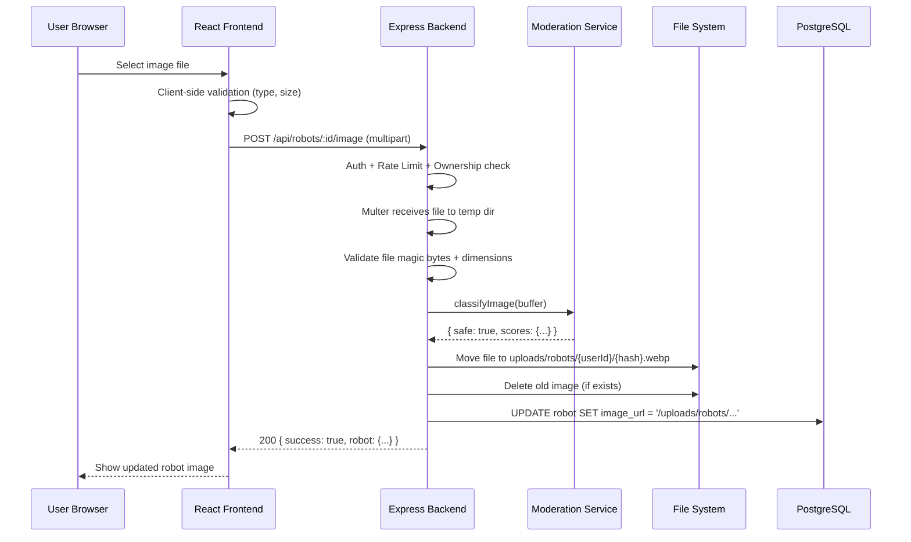
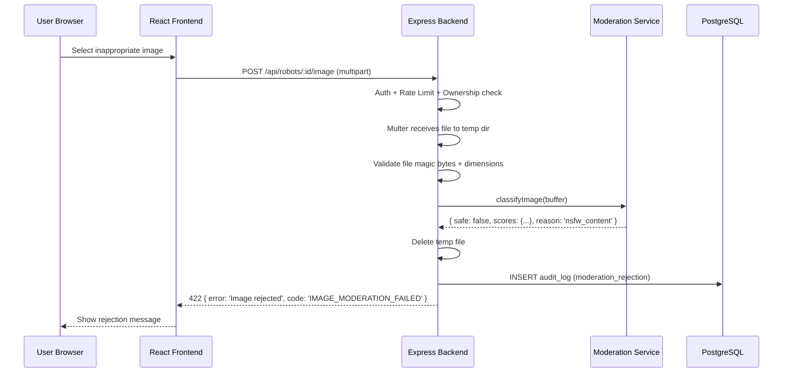

# Design Document: Robot Image Upload with Content Moderation

## Overview

This feature allows players to upload custom images for their robots, replacing the current system that only supports selecting from bundled static assets. Because Armoured Souls is intended to be kid-friendly and legally compliant, every uploaded image must pass through automated content moderation before it becomes visible. The system uses a local, self-hosted moderation pipeline (no external cloud APIs) to stay within the resource constraints of the Scaleway DEV1-S VPS (2 vCPU, 2GB RAM).

The upload flow is: user selects a file → frontend validates basic constraints → backend receives the file via multipart upload → backend validates file type/size/dimensions → backend runs content moderation (NSFW classification via `nsfwjs` on a TensorFlow.js CPU backend) → if the image passes, it is stored on disk and the robot's `imageUrl` is updated; if it fails, the image is rejected with a clear message and the upload is logged for audit.

Images are stored on the local filesystem under a `uploads/robots/` directory, served as static files by Caddy. This avoids external storage costs and keeps latency minimal on the single-VPS architecture.

## Architecture

```mermaid
graph TD
    subgraph Frontend
        A[RobotImageSelector] -->|File selected| B[Upload Component]
        B -->|POST multipart/form-data| C[/api/robots/:id/image]
    end

    subgraph Backend
        C --> D[Auth Middleware]
        D --> E[Rate Limiter]
        E --> F[Multer File Handler]
        F --> G[File Validation Service]
        G --> H[Content Moderation Service]
        H -->|Pass| I[File Storage Service]
        H -->|Fail| J[Reject & Audit Log]
        I --> K[Update Robot imageUrl]
        K --> L[Return Success Response]
    end

    subgraph Storage
        I --> M[Local Filesystem<br/>uploads/robots/userId/]
        M --> N[Caddy Static Serving]
    end

    subgraph Moderation
        H --> O[nsfwjs TensorFlow.js<br/>CPU Backend]
    end
```

## Sequence Diagrams

### Happy Path: Successful Upload



### Rejection Path: NSFW Content Detected



## Components and Interfaces

### Component 1: Image Upload Route Handler

**Purpose**: Express route that handles multipart file upload, orchestrates validation and moderation, and updates the robot record.

```typescript
// POST /api/robots/:id/image
interface ImageUploadRoute {
  // Middleware chain: authenticateToken → uploadRateLimiter → multerUpload → validateRequest
  handler(req: AuthRequest, res: Response): Promise<void>;
}
```

**Responsibilities**:
- Verify robot ownership
- Delegate to file validation service
- Delegate to content moderation service
- Store approved file and update database
- Clean up temp files on any failure
- Audit log rejected uploads

### Component 2: File Validation Service

**Purpose**: Validates uploaded files beyond what Multer checks — verifies magic bytes match declared MIME type, checks image dimensions, and ensures the file is a real image.

```typescript
interface FileValidationService {
  validateImage(buffer: Buffer, mimeType: string): Promise<FileValidationResult>;
}

interface FileValidationResult {
  valid: boolean;
  width?: number;
  height?: number;
  detectedMimeType?: string;
  error?: string;
}
```

**Responsibilities**:
- Verify file magic bytes match expected image types (JPEG, PNG, WebP)
- Check image dimensions (min 64×64, max 2048×2048)
- Reject files that claim to be images but aren't (e.g., renamed executables)
- Return detected dimensions for downstream use

### Component 3: Content Moderation Service

**Purpose**: Runs NSFW classification on uploaded images using `nsfwjs` with TensorFlow.js CPU backend. Singleton that loads the model once at startup.

```typescript
interface ContentModerationService {
  initialize(): Promise<void>;
  classifyImage(buffer: Buffer): Promise<ModerationResult>;
  isReady(): boolean;
}

interface ModerationResult {
  safe: boolean;
  scores: {
    neutral: number;
    drawing: number;
    hentai: number;
    porn: number;
    sexy: number;
  };
  reason?: string;  // Set when safe=false
}
```

**Responsibilities**:
- Load nsfwjs model once at application startup
- Classify images and return safety scores
- Apply configurable thresholds (default: reject if porn > 0.3 OR hentai > 0.3 OR sexy > 0.5)
- Handle model loading failures gracefully (reject all uploads if model unavailable)
- Minimize memory footprint (single model instance, process one image at a time)

### Component 4: File Storage Service

**Purpose**: Manages the lifecycle of uploaded image files on the local filesystem.

```typescript
interface FileStorageService {
  storeImage(userId: number, buffer: Buffer, extension: string): Promise<string>;
  deleteImage(relativePath: string): Promise<void>;
  getAbsolutePath(relativePath: string): string;
}
```

**Responsibilities**:
- Store files in `uploads/robots/{userId}/{hash}.{ext}` structure
- Generate unique filenames using content hash (SHA-256 prefix) to avoid collisions
- Delete old images when a robot's image is replaced
- Return relative URL paths for database storage
- Ensure upload directories exist

### Component 5: Frontend Upload Component

**Purpose**: Extends the existing `RobotImageSelector` modal with a new "Upload Custom Image" tab alongside the existing preset image grid.

```typescript
interface ImageUploadProps {
  robotId: number;
  onUploadComplete: (imageUrl: string) => void;
  onError: (message: string) => void;
}

interface UploadState {
  file: File | null;
  preview: string | null;
  uploading: boolean;
  progress: number;
  error: string | null;
}
```

**Responsibilities**:
- Client-side file type and size validation before upload
- Image preview before submission
- Upload progress indication
- Display moderation rejection messages clearly
- Integrate with existing RobotImageSelector modal

## Data Models

### Robot Model (Existing — No Schema Change)

The `Robot` model already has an `imageUrl` field (`String? @db.VarChar(255)`). Currently it stores Vite asset URLs from bundled images. After this feature, it will also store paths like `/uploads/robots/42/a1b2c3d4.webp` for user-uploaded images.

No Prisma migration is needed.

### AuditLog Entries (Existing Model)

Content moderation events are logged to the existing `AuditLog` model:

```typescript
// Moderation rejection audit entry
{
  eventType: 'image_moderation_rejection',
  userId: number,
  details: {
    robotId: number,
    scores: ModerationResult['scores'],
    reason: string,
    filename: string,
    timestamp: string,
  }
}

// Successful upload audit entry
{
  eventType: 'image_upload_success',
  userId: number,
  details: {
    robotId: number,
    imageUrl: string,
    fileSize: number,
  }
}
```

### Upload Constraints (Configuration)

```typescript
interface ImageUploadConfig {
  maxFileSizeBytes: number;       // 2 MB (2 * 1024 * 1024)
  allowedMimeTypes: string[];     // ['image/jpeg', 'image/png', 'image/webp']
  maxDimensions: { width: number; height: number };  // 2048 × 2048
  minDimensions: { width: number; height: number };  // 64 × 64
  uploadDir: string;              // 'uploads/robots'
  moderationThresholds: {
    porn: number;                 // 0.3
    hentai: number;               // 0.3
    sexy: number;                 // 0.5
  };
}
```


## Key Functions with Formal Specifications

### Function 1: handleImageUpload()

```typescript
async function handleImageUpload(req: AuthRequest, res: Response): Promise<void>
```

**Preconditions:**
- `req.user` is authenticated (JWT valid)
- `req.params.id` is a valid positive integer (robot ID)
- `req.file` is present (Multer processed the multipart upload)
- `req.file.size <= 2MB`
- `req.file.mimetype` is one of `['image/jpeg', 'image/png', 'image/webp']`

**Postconditions:**
- If moderation passes: robot's `imageUrl` is updated in DB, file is stored on disk, old image deleted, response is 200
- If moderation fails: no file stored, temp file deleted, audit log entry created, response is 422
- If validation fails: no file stored, temp file deleted, response is 400
- If ownership check fails: response is 403, no side effects
- Temp files are always cleaned up regardless of outcome

**Loop Invariants:** N/A

### Function 2: classifyImage()

```typescript
async function classifyImage(buffer: Buffer): Promise<ModerationResult>
```

**Preconditions:**
- `buffer` is a valid image buffer (already validated by file validation service)
- `buffer.length > 0`
- nsfwjs model is loaded and ready

**Postconditions:**
- Returns `ModerationResult` with all five category scores summing to approximately 1.0
- `safe` is `true` if and only if all scores are below their respective thresholds
- If `safe` is `false`, `reason` contains a human-readable explanation
- No side effects on the input buffer
- Does not throw — returns `{ safe: false, reason: 'moderation_unavailable' }` if model fails

**Loop Invariants:** N/A

### Function 3: validateImage()

```typescript
async function validateImage(buffer: Buffer, mimeType: string): Promise<FileValidationResult>
```

**Preconditions:**
- `buffer` is a non-empty Buffer
- `mimeType` is a non-empty string

**Postconditions:**
- Returns `{ valid: true, width, height, detectedMimeType }` if file is a genuine image within constraints
- Returns `{ valid: false, error }` if magic bytes don't match, dimensions are out of range, or file is corrupt
- `detectedMimeType` is determined from magic bytes, not from the declared `mimeType` parameter
- No mutations to input parameters

**Loop Invariants:** N/A

### Function 4: storeImage()

```typescript
async function storeImage(userId: number, buffer: Buffer, extension: string): Promise<string>
```

**Preconditions:**
- `userId` is a positive integer
- `buffer` is a non-empty Buffer containing valid image data
- `extension` is one of `['jpg', 'png', 'webp']`

**Postconditions:**
- File is written to `uploads/robots/{userId}/{sha256prefix}.{extension}`
- Returns the relative URL path (e.g., `/uploads/robots/42/a1b2c3d4.webp`)
- Directory is created if it doesn't exist
- Filename is deterministic based on content hash (same content = same filename)
- Throws if disk write fails

**Loop Invariants:** N/A

## Algorithmic Pseudocode

### Main Upload Processing Algorithm

```typescript
// POST /api/robots/:id/image
ALGORITHM handleImageUpload(req, res)
INPUT: req (AuthRequest with file), res (Response)
OUTPUT: JSON response with updated robot or error

BEGIN
  userId ← req.user.userId
  robotId ← parseInt(req.params.id)
  file ← req.file

  // Step 1: Verify robot ownership
  robot ← await prisma.robot.findUnique({ where: { id: robotId } })
  IF robot IS NULL OR robot.userId ≠ userId THEN
    await cleanupTempFile(file.path)
    RETURN res.status(403).json({ error: 'Access denied', code: 'ROBOT_NOT_OWNED' })
  END IF

  // Step 2: Validate file is a genuine image with acceptable dimensions
  validation ← await fileValidationService.validateImage(file.buffer, file.mimetype)
  IF NOT validation.valid THEN
    await cleanupTempFile(file.path)
    RETURN res.status(400).json({ error: validation.error, code: 'INVALID_IMAGE' })
  END IF

  // Step 3: Run content moderation
  moderation ← await contentModerationService.classifyImage(file.buffer)
  IF NOT moderation.safe THEN
    await cleanupTempFile(file.path)
    await auditLog.create({
      eventType: 'image_moderation_rejection',
      userId, details: { robotId, scores: moderation.scores, reason: moderation.reason }
    })
    RETURN res.status(422).json({
      error: 'Image did not pass content moderation',
      code: 'IMAGE_MODERATION_FAILED',
      reason: moderation.reason
    })
  END IF

  // Step 4: Store the approved image
  extension ← mimeToExtension(validation.detectedMimeType)
  imageUrl ← await fileStorageService.storeImage(userId, file.buffer, extension)

  // Step 5: Delete old custom image if it exists
  IF robot.imageUrl AND robot.imageUrl.startsWith('/uploads/') THEN
    await fileStorageService.deleteImage(robot.imageUrl)
  END IF

  // Step 6: Update robot record
  updatedRobot ← await prisma.robot.update({
    where: { id: robotId },
    data: { imageUrl }
  })

  // Step 7: Audit log success
  await auditLog.create({
    eventType: 'image_upload_success',
    userId, details: { robotId, imageUrl, fileSize: file.size }
  })

  RETURN res.status(200).json({ success: true, robot: updatedRobot })
END
```

**Preconditions:**
- User is authenticated
- File has been received by Multer middleware
- Rate limit has not been exceeded

**Postconditions:**
- On success: image stored on disk, robot record updated, audit logged
- On failure: no orphaned files, temp files cleaned up, appropriate error returned
- Temp files are always cleaned up in all code paths

### Content Moderation Algorithm

```typescript
ALGORITHM classifyImage(buffer)
INPUT: buffer (Buffer containing image data)
OUTPUT: ModerationResult

BEGIN
  IF NOT model.isReady() THEN
    RETURN { safe: false, scores: {}, reason: 'moderation_unavailable' }
  END IF

  // Decode image buffer to tensor
  image ← await decodeImage(buffer)

  // Run nsfwjs classification
  predictions ← await model.classify(image)

  // Dispose tensor to free memory
  image.dispose()

  // Convert predictions array to scores object
  scores ← {}
  FOR each prediction IN predictions DO
    scores[prediction.className.toLowerCase()] ← prediction.probability
  END FOR

  // Apply thresholds
  safe ← scores.porn < THRESHOLDS.porn
      AND scores.hentai < THRESHOLDS.hentai
      AND scores.sexy < THRESHOLDS.sexy

  reason ← null
  IF NOT safe THEN
    IF scores.porn >= THRESHOLDS.porn THEN reason ← 'explicit_content'
    ELSE IF scores.hentai >= THRESHOLDS.hentai THEN reason ← 'explicit_content'
    ELSE IF scores.sexy >= THRESHOLDS.sexy THEN reason ← 'suggestive_content'
    END IF
  END IF

  RETURN { safe, scores, reason }
END
```

**Preconditions:**
- buffer contains valid image data (pre-validated)
- Model has been initialized at application startup

**Postconditions:**
- Returns classification with all five NSFW categories scored
- Tensors are disposed after classification (no memory leaks)
- Never throws — returns safe=false with reason on any internal error

### File Magic Byte Validation Algorithm

```typescript
ALGORITHM validateMagicBytes(buffer)
INPUT: buffer (Buffer)
OUTPUT: detectedMimeType or null

BEGIN
  // JPEG: starts with FF D8 FF
  IF buffer[0] = 0xFF AND buffer[1] = 0xD8 AND buffer[2] = 0xFF THEN
    RETURN 'image/jpeg'
  END IF

  // PNG: starts with 89 50 4E 47 0D 0A 1A 0A
  IF buffer[0] = 0x89 AND buffer[1] = 0x50 AND buffer[2] = 0x4E AND buffer[3] = 0x47 THEN
    RETURN 'image/png'
  END IF

  // WebP: starts with RIFF....WEBP
  IF buffer[0] = 0x52 AND buffer[1] = 0x49 AND buffer[2] = 0x46 AND buffer[3] = 0x46
     AND buffer[8] = 0x57 AND buffer[9] = 0x45 AND buffer[10] = 0x42 AND buffer[11] = 0x50 THEN
    RETURN 'image/webp'
  END IF

  RETURN null  // Unknown format
END
```

## Example Usage

### Backend: Upload Route Registration

```typescript
import multer from 'multer';
import { authenticateToken, AuthRequest } from '../middleware/auth';
import { validateRequest } from '../middleware/schemaValidator';
import { positiveIntParam } from '../utils/securityValidation';
import { contentModerationService } from '../services/moderation/contentModerationService';
import { fileValidationService } from '../services/moderation/fileValidationService';
import { fileStorageService } from '../services/moderation/fileStorageService';

const upload = multer({
  storage: multer.memoryStorage(),
  limits: { fileSize: 2 * 1024 * 1024 }, // 2 MB
  fileFilter: (_req, file, cb) => {
    const allowed = ['image/jpeg', 'image/png', 'image/webp'];
    cb(null, allowed.includes(file.mimetype));
  },
});

const imageParamsSchema = z.object({ id: positiveIntParam });

router.post(
  '/:id/image',
  authenticateToken,
  uploadRateLimiter,
  upload.single('image'),
  validateRequest({ params: imageParamsSchema }),
  handleImageUpload
);
```

### Frontend: Upload Integration

```typescript
// Inside RobotImageSelector — new "Upload" tab
async function handleFileUpload(file: File, robotId: number): Promise<string> {
  const formData = new FormData();
  formData.append('image', file);

  const token = localStorage.getItem('token');
  const response = await fetch(`/api/robots/${robotId}/image`, {
    method: 'POST',
    headers: { Authorization: `Bearer ${token}` },
    body: formData,
  });

  if (!response.ok) {
    const error = await response.json();
    if (error.code === 'IMAGE_MODERATION_FAILED') {
      throw new Error('This image was not approved. Please choose a different image.');
    }
    throw new Error(error.error || 'Upload failed');
  }

  const data = await response.json();
  return data.robot.imageUrl;
}
```

### Caddy Static File Serving

```caddyfile
# Add to existing Caddyfile
handle /uploads/* {
    root * /path/to/app
    file_server
    header Cache-Control "public, max-age=86400"
    header X-Content-Type-Options "nosniff"
}
```

## Correctness Properties

*A property is a characteristic or behavior that should hold true across all valid executions of a system — essentially, a formal statement about what the system should do. Properties serve as the bridge between human-readable specifications and machine-verifiable correctness guarantees.*

### Property 1: Ownership isolation

*For any* user ID that does not match the robot's owner, uploading an image to that robot SHALL return HTTP 403 and produce no side effects (no file stored, no database change, no audit log entry).

**Validates: Requirement 1.3**

### Property 2: Temp file cleanup invariant

*For any* upload request that terminates (whether by success, validation failure, moderation rejection, ownership denial, or storage error), no temporary files SHALL remain on disk after the response is sent.

**Validates: Requirement 1.5**

### Property 3: Magic byte authority

*For any* uploaded file buffer, the File_Validation_Service SHALL determine the file type from magic bytes, not from the declared MIME type. For any valid image buffer with a mismatched declared MIME type, the magic-byte-detected format SHALL be used as the authoritative type.

**Validates: Requirements 2.1, 2.3**

### Property 4: Invalid file rejection

*For any* byte buffer whose magic bytes do not match JPEG, PNG, or WebP, the File_Validation_Service SHALL reject it. *For any* valid image whose dimensions fall outside the [64, 2048] range on either axis, the File_Validation_Service SHALL reject it.

**Validates: Requirements 2.2, 2.4**

### Property 5: Threshold consistency

*For any* set of five NSFW category scores, the Content_Moderation_Service SHALL mark the image as safe if and only if porn < 0.3 AND hentai < 0.3 AND sexy < 0.5. The result SHALL always contain all five category scores and a boolean `safe` field.

**Validates: Requirements 3.1, 3.2**

### Property 6: No score leakage

*For any* upload rejected by content moderation, the HTTP response body SHALL contain the error code `IMAGE_MODERATION_FAILED` but SHALL NOT contain any of the five NSFW category score values.

**Validates: Requirement 3.3**

### Property 7: Deterministic content-hash filenames

*For any* image buffer, calling `storeImage` with the same buffer content SHALL always produce the same filename (based on SHA-256 prefix). Two different buffer contents SHALL produce different filenames.

**Validates: Requirements 4.1, 4.5**

### Property 8: Valid URL path format

*For any* stored image, the returned path SHALL match the pattern `/uploads/robots/{userId}/{hash}.{ext}` where `ext` is one of `jpg`, `png`, or `webp`.

**Validates: Requirement 4.4**

## Error Handling

### Error Scenario 1: File Too Large

**Condition**: Uploaded file exceeds 2 MB limit
**Response**: Multer rejects the upload before it reaches the route handler. Returns 400 with `{ error: 'File too large', code: 'FILE_TOO_LARGE' }`.
**Recovery**: User is prompted to resize or compress their image. Frontend shows max file size in the upload UI.

### Error Scenario 2: Invalid File Type

**Condition**: File MIME type is not JPEG, PNG, or WebP, or magic bytes don't match
**Response**: 400 with `{ error: 'Invalid image format', code: 'INVALID_IMAGE_FORMAT' }`.
**Recovery**: User is shown the list of accepted formats. Frontend file picker is restricted to accepted types.

### Error Scenario 3: Content Moderation Rejection

**Condition**: nsfwjs scores exceed configured thresholds
**Response**: 422 with `{ error: 'Image did not pass content moderation', code: 'IMAGE_MODERATION_FAILED' }`. Scores are NOT returned to the client (to prevent gaming the system).
**Recovery**: User is shown a friendly message asking them to choose a different image. Rejection is audit-logged.

### Error Scenario 4: Moderation Service Unavailable

**Condition**: nsfwjs model failed to load or is not ready
**Response**: 503 with `{ error: 'Image moderation service unavailable', code: 'MODERATION_UNAVAILABLE' }`.
**Recovery**: User is asked to try again later. Admin is alerted via existing logging. All uploads are blocked until the model is available (fail-closed).

### Error Scenario 5: Disk Storage Failure

**Condition**: Filesystem write fails (disk full, permissions)
**Response**: 500 with generic error. Temp file is cleaned up.
**Recovery**: Logged as critical error. Admin monitors disk usage.

### Error Scenario 6: Rate Limit Exceeded

**Condition**: User exceeds upload rate limit (5 uploads per 10 minutes)
**Response**: 429 with `{ error: 'Too many uploads', code: 'RATE_LIMIT_EXCEEDED', retryAfter: 600 }`.
**Recovery**: User waits for the rate limit window to reset. Violation tracked by SecurityMonitor.

### Error Scenario 7: Robot Not Owned

**Condition**: Authenticated user attempts to upload to a robot they don't own
**Response**: 403 with `{ error: 'Access denied', code: 'ROBOT_NOT_OWNED' }`.
**Recovery**: No recovery needed — this is a security violation attempt.

## Testing Strategy

### Unit Testing Approach

- **File Validation Service**: Test magic byte detection for all supported formats, reject non-image files, verify dimension checks with known test images
- **Content Moderation Service**: Mock nsfwjs model, test threshold logic with various score combinations, test graceful degradation when model unavailable
- **File Storage Service**: Test file naming (hash-based), directory creation, old file cleanup, path generation
- **Route Handler**: Mock all services, test the orchestration flow for success, moderation rejection, validation failure, and ownership denial

### Property-Based Testing Approach

**Property Test Library**: fast-check

- **Threshold consistency**: For any set of scores, `safe` is true if and only if all scores are below their respective thresholds
- **File cleanup invariant**: For any upload outcome (success, rejection, error), no temp files remain
- **Hash determinism**: Same file content always produces the same filename
- **Ownership isolation**: Random user IDs that don't match the robot owner always get 403

### Integration Testing Approach

- End-to-end upload flow with a real nsfwjs model and test images
- Verify Caddy serves uploaded files correctly
- Test rate limiting across multiple rapid uploads
- Verify audit log entries are created for rejections
- Test image replacement (old file deleted, new file stored)

## Performance Considerations

- **Memory**: nsfwjs model loads ~10-20MB into memory. Images are processed in memory (max 2MB per upload). On a 2GB VPS, this is acceptable but must be monitored.
- **CPU**: TensorFlow.js CPU backend is slower than GPU but avoids GPU dependencies. Classification takes ~1-3 seconds per image on 2 vCPU. This is acceptable for an upload operation.
- **Concurrency**: Process one upload at a time through the moderation pipeline to avoid memory spikes. Multer's memory storage + sequential moderation keeps peak memory predictable.
- **Disk**: Images are stored as-is (no server-side resizing to save CPU). The 2MB limit and per-user rate limiting keep disk growth manageable. A cleanup job can be added later if needed.
- **Startup**: nsfwjs model loading adds ~2-5 seconds to application startup. This is acceptable since the app restarts infrequently under PM2.
- **Caching**: Caddy serves uploaded images with `Cache-Control: public, max-age=86400` to reduce repeated file reads.

## Security Considerations

- **Fail-Closed Moderation**: If the nsfwjs model is unavailable, ALL uploads are rejected. No images bypass moderation.
- **Magic Byte Validation**: Files are validated by their actual content (magic bytes), not just the declared MIME type. Prevents renamed executables from being stored.
- **Path Traversal Prevention**: Filenames are generated server-side using content hashes. User-supplied filenames are never used in file paths.
- **Content-Type Sniffing**: Caddy serves uploads with `X-Content-Type-Options: nosniff` to prevent browsers from executing uploaded files.
- **Rate Limiting**: Dedicated per-user rate limiter (5 uploads per 10 minutes) prevents abuse and resource exhaustion.
- **Audit Trail**: All moderation rejections are logged with user ID, robot ID, and scores for admin review.
- **No Score Leakage**: Moderation scores are never returned to the client, preventing users from iteratively adjusting images to just pass thresholds.
- **Ownership Verification**: Standard `verifyRobotOwnership` pattern ensures users can only upload to their own robots.
- **Existing Security Playbook**: The `safeImageUrl` validator in `securityValidation.ts` already blocks `javascript:`, `data:`, and path traversal in URLs. Uploaded image paths (`/uploads/robots/...`) naturally pass this validation.
- **Repeat Offender Tracking**: Multiple moderation rejections from the same user can be flagged via the existing SecurityMonitor for admin review.

## Documentation Impact

The following existing documentation and configuration files will need updating after this feature is implemented:

- `docs/guides/SECURITY.md` — Add new Security Playbook entry for "Image Upload Content Moderation" covering the fail-closed moderation pattern, magic byte validation, and audit logging for moderation rejections. Add file upload rate limiting details to the Rate Limiting section.
- `docs/guides/DEPLOYMENT.md` — Add instructions for creating the `uploads/robots/` directory with correct permissions, and the Caddy static file serving configuration for `/uploads/*`.
- `docs/prd_core/ARCHITECTURE.md` — Update the Backend Service Architecture table to include the new `moderation` service directory. Update the API Routes section to document `POST /api/robots/:id/image`. Update Dependencies section if needed.
- `docs/prd_core/DATABASE_SCHEMA.md` — Document the new audit log event types (`image_moderation_rejection`, `image_upload_success`) in the AuditLog section.
- `docs/prd_pages/PRD_ROBOT_DETAIL_PAGE.md` — Document the new "Upload Custom Image" tab in the RobotImageSelector modal.
- `docs/guides/ERROR_CODES.md` — Add new error codes: `IMAGE_MODERATION_FAILED`, `INVALID_IMAGE`, `INVALID_IMAGE_FORMAT`, `MODERATION_UNAVAILABLE`, `FILE_TOO_LARGE`.
- `.kiro/steering/coding-standards.md` — Add the content moderation service initialization pattern and the upload rate limiter pattern to the relevant sections.

## Dependencies

### New NPM Packages

| Package | Purpose | Size Impact |
|---------|---------|-------------|
| `nsfwjs` | NSFW image classification | ~2MB (model loaded separately) |
| `@tensorflow/tfjs-node` | TensorFlow.js CPU backend for Node.js | ~50MB (native bindings) |
| `multer` | Multipart file upload handling for Express | ~50KB |
| `sharp` | Image dimension reading and magic byte detection | ~7MB (native bindings) |

### Existing Dependencies (No Changes)

- `express` 5 — Route handling
- `zod` — Request validation
- `express-rate-limit` — Rate limiting
- Prisma 7 — Database operations
- Winston — Logging

### Infrastructure

- **Caddy**: Add static file serving rule for `/uploads/*` directory
- **Filesystem**: Create `uploads/robots/` directory with appropriate permissions
- **PM2**: No changes needed — model loads at app startup within the existing process
