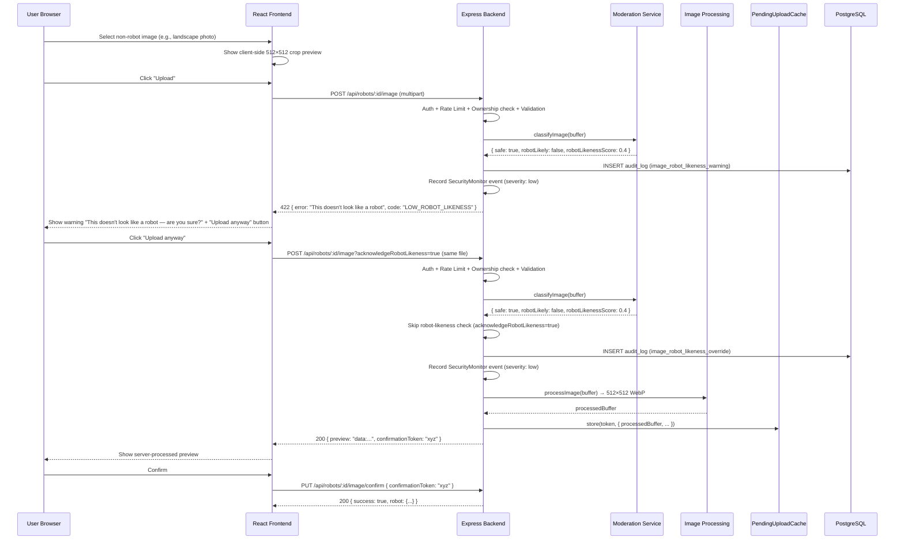
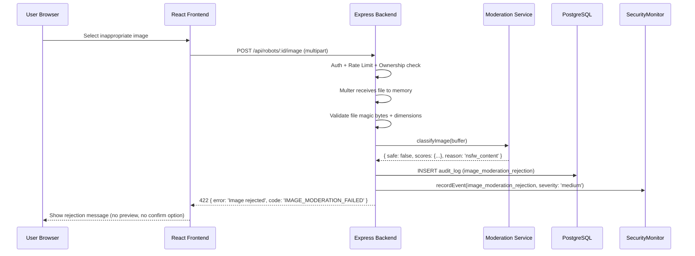
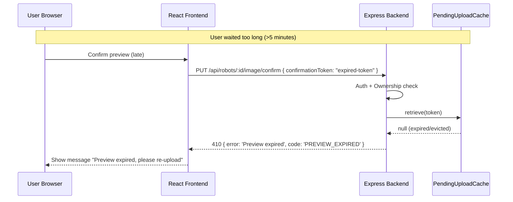

# Design Document: Robot Image Upload with Content Moderation

## Overview

This feature allows players to upload custom images for their robots, replacing the current system that only supports selecting from bundled static assets. Because Armoured Souls is intended to be kid-friendly and legally compliant, every uploaded image must pass through automated content moderation before it becomes visible. The system uses a local, self-hosted moderation pipeline (no external cloud APIs) to stay within the resource constraints of the Scaleway DEV1-S VPS (2 vCPU, 2GB RAM).

The upload uses a two-step preview/confirm flow to prevent storing images users don't want:

**Step 1 (Preview):** User selects a file → frontend shows a client-side 512×512 center-crop preview (canvas or CSS `object-fit: cover`) so the user can see what the server will produce → user clicks "Upload" → `POST /api/robots/:id/image` → backend validates file type/size/dimensions (magic bytes, 64×64 to 4096×4096 input) → backend runs content moderation (NSFW classification via `nsfwjs` on a TensorFlow.js CPU backend + robot-likeness heuristic) → if NSFW fails, the image is hard-blocked (HTTP 422, `IMAGE_MODERATION_FAILED`) and dual-logged → if robot-likeness is below threshold and `?acknowledgeRobotLikeness=true` is NOT set, the image is soft-blocked (HTTP 422, `LOW_ROBOT_LIKENESS`) with a warning message — the frontend shows "Upload anyway" → if the user clicks "Upload anyway", the frontend re-sends with `?acknowledgeRobotLikeness=true` and the backend skips the robot-likeness check while still enforcing NSFW → if all checks pass, the image is processed to 512×512 WebP via `sharp` (fit: `cover`, quality: 80) → the processed image is returned as a base64 data URL along with a confirmation token → the processed buffer is held in an in-memory `PendingUploadCache` (Map with 5-minute TTL) keyed by the confirmation token → **no image is stored to disk yet**.

**Step 2 (Confirm):** User reviews the server-processed crop preview → user confirms → `PUT /api/robots/:id/image/confirm` with the confirmation token → backend retrieves the processed buffer from the cache, stores it to disk under `uploads/user-robots/` with a UUID-based non-guessable filename, updates the robot's `imageUrl`, deletes the old custom image if any, and returns the updated robot.

NSFW content is always a hard block. Robot-likeness below threshold is a soft warning — the first attempt returns HTTP 422 with `LOW_ROBOT_LIKENESS`, and the user can override by re-uploading with `?acknowledgeRobotLikeness=true`. Both initial warnings and acknowledged overrides are logged to AuditLog and SecurityMonitor for tracking.

Orphaned images are cleaned up both eagerly and periodically: when a robot switches from a custom image to a preset, or when a robot with a custom image is deleted, the old file is eagerly removed from disk. Additionally, a periodic cleanup job scans `uploads/user-robots/` and cross-references against `Robot.imageUrl` in the database, deleting any unreferenced files. The job can run daily or on-demand via an admin endpoint.

Uploaded images are stored on the local filesystem under `uploads/user-robots/{userId}/{uuid}.webp` — deliberately separate from the bundled preset images in `app/frontend/src/assets/robots/`. UUID-based filenames prevent URL enumeration. Images are served as static files by Caddy. This avoids external storage costs and keeps latency minimal on the single-VPS architecture.

> **Future Enhancement (Backlog):** AI-powered robot image generation in the style of existing presets, using robot context (weapon loadout, attributes) to create unique images. This could use a diffusion model or image-to-image pipeline seeded with the robot's attributes. Out of scope for this spec — tracked separately as a future enhancement.

## Architecture

```mermaid
graph TD
    subgraph Frontend
        A[RobotImageSelector] -->|File selected| B[Upload Component<br/>Mobile-Responsive]
        B -->|Client-side 512×512<br/>crop preview| B2[Crop Preview<br/>canvas / CSS object-fit]
        B2 -->|User clicks Upload| C[/api/robots/:id/image<br/>Preview Endpoint]
        B -->|User confirms preview| C2[/api/robots/:id/image/confirm<br/>Confirm Endpoint]
    end

    subgraph "Backend — Preview Step"
        C --> D[Auth Middleware]
        D --> E[Rate Limiter]
        E --> F[Multer File Handler]
        F --> G[File Validation Service]
        G --> H[Content Moderation Service<br/>NSFW + Robot-Likeness]
        H -->|NSFW Fail| J[Hard Block + Dual Audit Log]
        H -->|Robot-Likeness Fail<br/>no ?acknowledgeRobotLikeness| J2[Soft Block 422<br/>LOW_ROBOT_LIKENESS]
        H -->|NSFW Pass +<br/>Robot-Likeness Pass<br/>or acknowledged| I[Image Processing Service<br/>sharp: 512×512 WebP]
        I --> PC[Pending Upload Cache<br/>In-Memory Map, 5min TTL]
        PC --> PR[Return Preview Response<br/>base64 + token]
    end

    subgraph "Backend — Confirm Step"
        C2 --> D2[Auth Middleware]
        D2 --> D3[Ownership Check]
        D3 --> PC2[Retrieve from<br/>Pending Upload Cache]
        PC2 -->|Token valid| K[File Storage Service<br/>UUID filenames]
        PC2 -->|Token expired| EX[410 PREVIEW_EXPIRED]
        K --> L[Update Robot imageUrl]
        L --> CL[Delete Old Custom Image<br/>if exists]
        CL --> M[Return Success Response]
    end

    subgraph "Dual Audit Logging"
        J --> J1[AuditLog DB<br/>via EventLogger]
        J --> J3[SecurityMonitor<br/>In-Memory Events]
        J2 --> J1
        J2 --> J3
    end

    subgraph Storage
        K --> N[Local Filesystem<br/>uploads/user-robots/userId/]
        N --> O[Caddy Static Serving]
    end

    subgraph Moderation
        H --> P[nsfwjs TensorFlow.js<br/>CPU Backend]
    end

    subgraph "Orphan Cleanup"
        OC1[Robot switches to preset] -->|Eager: Delete old file| N
        OC2[Robot deleted] -->|Eager: Delete custom file| N
        OC3[Orphan Cleanup Job<br/>Daily / Admin on-demand] -->|Periodic: Scan & delete<br/>unreferenced files| N
    end

    subgraph "Admin"
        ADM1[GET /api/admin/uploads] -->|Query AuditLog<br/>image_upload_success| J1
        ADM2[POST /api/admin/uploads/cleanup] --> OC3
    end
```

## Sequence Diagrams

### Happy Path: Two-Step Upload (Preview + Confirm)

```mermaid
sequenceDiagram
    participant U as User Browser
    participant FE as React Frontend
    participant BE as Express Backend
    participant MOD as Moderation Service
    participant IMG as Image Processing
    participant CACHE as PendingUploadCache
    participant FS as File System
    participant DB as PostgreSQL

    U->>FE: Select image file
    FE->>FE: Client-side validation (type, size)
    FE->>FE: Render 512×512 center-crop preview (canvas/CSS)
    FE-->>U: Show client-side crop preview
    U->>FE: Click "Upload" (approve crop)

    Note over FE,BE: Step 1: Preview
    FE->>BE: POST /api/robots/:id/image (multipart)
    BE->>BE: Auth + Rate Limit + Ownership check
    BE->>BE: Multer receives file to memory
    BE->>BE: Validate file magic bytes + dimensions
    BE->>MOD: classifyImage(buffer)
    MOD-->>BE: { safe: true, robotLikely: true, scores: {...} }
    BE->>IMG: processImage(buffer) → 512×512 WebP
    IMG-->>BE: processedBuffer (WebP, quality 80)
    BE->>CACHE: store(token, { processedBuffer, userId, robotId, moderation })
    BE-->>FE: 200 { preview: "data:image/webp;base64,...", confirmationToken: "abc123" }
    FE-->>U: Show server-processed crop preview

    Note over FE,BE: Step 2: Confirm
    U->>FE: Confirm preview
    FE->>BE: PUT /api/robots/:id/image/confirm { confirmationToken: "abc123" }
    BE->>BE: Auth + Ownership check
    BE->>CACHE: retrieve(token)
    CACHE-->>BE: { processedBuffer, userId, robotId }
    BE->>FS: Store to uploads/user-robots/{userId}/{uuid}.webp
    BE->>FS: Delete old custom image (if exists)
    BE->>DB: UPDATE robot SET image_url = '/uploads/user-robots/...'
    BE->>DB: INSERT audit_log (image_upload_success)
    BE->>CACHE: delete(token)
    BE-->>FE: 200 { success: true, robot: {...} }
    FE-->>U: Show updated robot image
```

### Robot-Likeness Warning with Override



### Rejection Path: NSFW Content Detected (Hard Block)



### Rejection Path: Preview Expired



## Components and Interfaces

### Component 1: Image Upload Preview Handler

**Purpose**: Express route that handles multipart file upload, orchestrates validation, moderation, and image processing, then returns a base64 preview with a confirmation token — without storing the image to disk. Accepts `?acknowledgeRobotLikeness=true` to skip the robot-likeness check on re-upload after the user acknowledges the warning.

```typescript
// POST /api/robots/:id/image[?acknowledgeRobotLikeness=true]
interface ImageUploadPreviewRoute {
  // Middleware chain: authenticateToken → uploadRateLimiter → multerUpload → validateRequest
  handler(req: AuthRequest, res: Response): Promise<void>;
}

interface PreviewResponse {
  preview: string;              // base64 data URL of processed 512×512 WebP
  confirmationToken: string;    // UUID token to confirm the upload
}
```

**Responsibilities**:
- Verify robot ownership
- Delegate to file validation service
- Delegate to content moderation service (NSFW hard block)
- If `?acknowledgeRobotLikeness=true` is NOT set and robot-likeness is below threshold: return HTTP 422 with `LOW_ROBOT_LIKENESS`, log warning to AuditLog + SecurityMonitor (severity: low)
- If `?acknowledgeRobotLikeness=true` IS set: skip robot-likeness check, log override to AuditLog + SecurityMonitor (severity: low), still enforce NSFW
- Delegate to image processing service (resize + convert)
- Store processed buffer in PendingUploadCache with confirmation token
- Return base64 preview + token
- Dual audit log: AuditLog DB + SecurityMonitor for NSFW rejections (severity: medium), robot-likeness warnings (severity: low), and robot-likeness overrides (severity: low)
- No image stored to disk in this step

### Component 1b: Image Upload Confirm Handler

**Purpose**: Express route that accepts a confirmation token, retrieves the processed image from the PendingUploadCache, stores it to disk, and updates the robot record.

```typescript
// PUT /api/robots/:id/image/confirm
interface ImageUploadConfirmRoute {
  // Middleware chain: authenticateToken → validateRequest
  handler(req: AuthRequest, res: Response): Promise<void>;
}

interface ConfirmRequest {
  confirmationToken: string;
}
```

**Responsibilities**:
- Verify robot ownership
- Retrieve processed buffer from PendingUploadCache using confirmation token
- Return HTTP 410 `PREVIEW_EXPIRED` if token is expired or invalid
- Store the processed image to disk via File Storage Service
- Delete old custom image if the robot had one
- Update robot's `imageUrl` in database
- Audit log the successful upload
- Remove the entry from PendingUploadCache after successful storage

### Component 1c: Pending Upload Cache

**Purpose**: In-memory cache that holds processed image buffers between the preview and confirm steps, with automatic TTL-based eviction.

```typescript
interface PendingUploadEntry {
  processedBuffer: Buffer;
  userId: number;
  robotId: number;
  originalFileSize: number;
  originalDimensions: { width: number; height: number };
  acknowledgedRobotLikeness: boolean;
  createdAt: number;
}

interface PendingUploadCache {
  store(token: string, entry: PendingUploadEntry): void;
  retrieve(token: string): PendingUploadEntry | null;
  delete(token: string): void;
  cleanup(): void;  // Remove expired entries
}
```

**Responsibilities**:
- Hold processed image buffers in memory keyed by confirmation token (UUID)
- Automatically evict entries after 5-minute TTL
- Run periodic cleanup (e.g., every 60 seconds via `setInterval`)
- Limit maximum pending entries per user to prevent memory abuse (e.g., max 3 pending per user)
- Return `null` for expired or non-existent tokens

### Component 2: File Validation Service

**Purpose**: Validates uploaded files beyond what Multer checks — verifies magic bytes match declared MIME type, checks image dimensions, and ensures the file is a real image.

```typescript
interface FileValidationService {
  validateImage(buffer: Buffer, mimeType: string): Promise<FileValidationResult>;
}

interface FileValidationResult {
  valid: boolean;
  width?: number;
  height?: number;
  detectedMimeType?: string;
  error?: string;
}
```

**Responsibilities**:
- Verify file magic bytes match expected image types (JPEG, PNG, WebP)
- Check image dimensions (min 64×64, max 4096×4096 — generous input range since sharp will resize)
- Reject files that claim to be images but aren't (e.g., renamed executables)
- Return detected dimensions for downstream use

### Component 3: Content Moderation Service

**Purpose**: Runs NSFW classification on uploaded images using `nsfwjs` with TensorFlow.js CPU backend, plus a robot-likeness heuristic. Singleton that loads the model once at startup.

```typescript
interface ContentModerationService {
  initialize(): Promise<void>;
  classifyImage(buffer: Buffer): Promise<ModerationResult>;
  isReady(): boolean;
}

interface ModerationResult {
  safe: boolean;
  robotLikely: boolean;
  scores: {
    neutral: number;
    drawing: number;
    hentai: number;
    porn: number;
    sexy: number;
  };
  robotLikenessScore: number;  // drawing + neutral combined
  reason?: string;  // Set when safe=false or robotLikely=false
}
```

**Responsibilities**:
- Load nsfwjs model once at application startup
- Classify images and return safety scores
- Apply configurable NSFW thresholds (default: reject if porn ≥ 0.3 OR hentai ≥ 0.3 OR sexy ≥ 0.5)
- Compute robot-likeness heuristic: `drawing + neutral` score. If below 0.6, flag as `robotLikely: false`
- Handle model loading failures gracefully (reject all uploads if model unavailable)
- Minimize memory footprint (single model instance, process one image at a time)

### Component 4: Image Processing Service

**Purpose**: Resizes and converts uploaded images to the uniform 512×512 WebP format using `sharp`, ensuring all stored images match the preset image format.

```typescript
interface ImageProcessingService {
  processImage(buffer: Buffer): Promise<Buffer>;
}
```

**Responsibilities**:
- Resize input image to 512×512 pixels using `sharp` with `fit: 'cover'` (center-crop for non-square images)
- Convert to WebP format with quality 80
- Return the processed buffer for storage
- All images pass through this pipeline regardless of input format or dimensions

### Component 5: File Storage Service

**Purpose**: Manages the lifecycle of uploaded image files on the local filesystem with UUID-based non-guessable filenames, including eager cleanup of orphaned images.

```typescript
interface FileStorageService {
  storeImage(userId: number, buffer: Buffer): Promise<string>;
  deleteImage(relativePath: string): Promise<void>;
  getAbsolutePath(relativePath: string): string;
  cleanupOrphans(referencedUrls: Set<string>): Promise<OrphanCleanupResult>;
}

interface OrphanCleanupResult {
  filesDeleted: number;
  bytesReclaimed: number;
  errors: string[];
}
```

**Responsibilities**:
- Store files in `uploads/user-robots/{userId}/{uuid}.webp` structure
- Generate unique filenames using `crypto.randomUUID()` for non-guessable URLs
- Delete old images when a robot's image is replaced
- Return relative URL paths for database storage
- Ensure upload directories exist
- Keep user uploads separate from preset assets in `app/frontend/src/assets/robots/`
- Eagerly delete orphaned images when:
  - A robot's `imageUrl` changes from a `/uploads/` path to a preset path or null (e.g., player switches back to preset)
  - A robot with a custom uploaded image is deleted
- Periodic orphan cleanup: scan all files in `uploads/user-robots/`, cross-reference against a set of referenced URLs from the database, delete unreferenced files

### Component 6: Frontend Upload Component

**Purpose**: Extends the existing `RobotImageSelector` modal with a new "Upload Custom Image" tab alongside the existing preset image grid. Includes a three-step flow: (1) client-side crop preview, (2) upload for server preview, (3) confirm. Mobile-responsive design.

```typescript
interface ImageUploadProps {
  robotId: number;
  onUploadComplete: (imageUrl: string) => void;
  onError: (message: string) => void;
}

interface UploadState {
  file: File | null;
  clientPreview: string | null;      // client-side 512×512 crop preview (canvas/CSS)
  serverPreview: string | null;      // base64 data URL from server
  confirmationToken: string | null;  // token for confirm step
  robotLikenessRejected: boolean;    // true if server returned LOW_ROBOT_LIKENESS
  uploading: boolean;
  confirming: boolean;
  error: string | null;
}
```

**Responsibilities**:
- Client-side file type and size validation before upload
- Render a client-side 512×512 center-crop preview (using canvas or CSS `object-fit: cover` on a square container) immediately after file selection, before any server round-trip
- Send file to preview endpoint, display server-returned base64 crop preview
- Handle `LOW_ROBOT_LIKENESS` (HTTP 422): show warning message ("This doesn't look like a robot — are you sure?") with "Upload anyway" button. On click, re-send the same file with `?acknowledgeRobotLikeness=true`
- Handle `IMAGE_MODERATION_FAILED` (HTTP 422): show rejection message, no override option (hard block)
- On confirm: send confirmation token to confirm endpoint
- On reject: discard preview and return to file selection
- Handle `PREVIEW_EXPIRED` error by prompting re-upload
- Upload progress indication
- Integrate with existing RobotImageSelector modal
- Mobile-responsive layout: touch-friendly tap targets (min 44×44px), responsive modal, camera roll access via `accept="image/*"` attribute, preview that scales to viewport

### Component 7: Orphan Cleanup Job

**Purpose**: Periodic backend job that scans `uploads/user-robots/` and cross-references files against `Robot.imageUrl` in the database, deleting any file not referenced by any robot. Runnable daily via cron or on-demand via admin endpoint.

```typescript
interface OrphanCleanupJob {
  run(): Promise<OrphanCleanupResult>;
}

interface OrphanCleanupResult {
  filesDeleted: number;
  bytesReclaimed: number;
  errors: string[];
}
```

**Responsibilities**:
- Scan all `.webp` files recursively under `uploads/user-robots/`
- Query all `Robot.imageUrl` values that start with `/uploads/` from the database
- Build a set of referenced file paths
- Delete any file on disk not in the referenced set
- Track and return the count of deleted files and bytes reclaimed
- Log errors for files that fail to delete (permissions, etc.) without aborting the entire job
- Expose via `POST /api/admin/uploads/cleanup` (admin-only, requires `requireAdmin` middleware)
- Schedulable via `node-cron` or PM2 cron for daily execution

### Component 8: Admin Uploads Handler

**Purpose**: Express route that returns a paginated list of all uploaded images by querying the existing `AuditLog` table for `image_upload_success` events. No new database tables needed.

```typescript
// GET /api/admin/uploads
interface AdminUploadsRoute {
  // Middleware chain: authenticateToken → requireAdmin → validateRequest
  handler(req: AuthRequest, res: Response): Promise<void>;
}

interface AdminUploadsQuery {
  page?: number;       // default: 1
  limit?: number;      // default: 50, max: 200
  userId?: number;     // filter by user
  startDate?: string;  // ISO date string
  endDate?: string;    // ISO date string
}

interface AdminUploadEntry {
  userId: number;
  username: string;
  robotId: number;
  robotName: string;
  imageUrl: string;
  fileSize: number;
  uploadDate: string;  // ISO date string
}

interface AdminUploadsResponse {
  uploads: AdminUploadEntry[];
  total: number;
  page: number;
  limit: number;
}
```

**Responsibilities**:
- Query `AuditLog` entries where `eventType = 'image_upload_success'`
- Join with `User` and `Robot` tables to resolve `username` and `robotName`
- Support filtering by `userId` and date range (`startDate`, `endDate`)
- Paginate results with configurable `page` and `limit` (default 50, max 200)
- Require admin authentication (`authenticateToken` + `requireAdmin` middleware)
- Return 403 for non-admin users

## Data Models

### Robot Model (Existing — No Schema Change)

The `Robot` model already has an `imageUrl` field (`String? @db.VarChar(255)`). Currently it stores Vite asset URLs from bundled images. After this feature, it will also store paths like `/uploads/user-robots/42/550e8400-e29b-41d4-a716-446655440000.webp` for user-uploaded images.

No Prisma migration is needed.

### AuditLog Entries (Existing Model)

Content moderation events are logged to the existing `AuditLog` model:

```typescript
// NSFW moderation rejection audit entry (hard block)
{
  eventType: 'image_moderation_rejection',
  userId: number,
  details: {
    robotId: number,
    scores: ModerationResult['scores'],
    robotLikenessScore: number,
    reason: string,  // 'nsfw_content'
    filename: string,
    timestamp: string,
  }
}

// Robot-likeness warning audit entry (soft warning — initial 422)
{
  eventType: 'image_robot_likeness_warning',
  userId: number,
  details: {
    robotId: number,
    robotLikenessScore: number,
    timestamp: string,
  }
}

// Robot-likeness override audit entry (user re-uploaded with acknowledgeRobotLikeness=true)
{
  eventType: 'image_robot_likeness_override',
  userId: number,
  details: {
    robotId: number,
    robotLikenessScore: number,
    timestamp: string,
  }
}

// Successful upload audit entry (after confirm step)
{
  eventType: 'image_upload_success',
  userId: number,
  details: {
    robotId: number,
    imageUrl: string,
    fileSize: number,
    originalDimensions: { width: number, height: number },
  }
}
```

### SecurityMonitor Events (In-Memory)

Moderation rejections and warnings are recorded in the SecurityMonitor for real-time admin dashboard visibility:

```typescript
// SecurityMonitor event for NSFW moderation rejection (hard block)
{
  type: 'image_moderation_rejection',
  severity: 'medium',
  userId: number,
  details: {
    robotId: number,
    reason: string,  // 'nsfw_content'
  }
}

// SecurityMonitor event for robot-likeness warning (soft warning — initial 422)
{
  type: 'image_robot_likeness_warning',
  severity: 'low',
  userId: number,
  details: {
    robotId: number,
    robotLikenessScore: number,
  }
}

// SecurityMonitor event for robot-likeness override (user acknowledged and re-uploaded)
{
  type: 'image_robot_likeness_override',
  severity: 'low',
  userId: number,
  details: {
    robotId: number,
    robotLikenessScore: number,
  }
}
```

### Upload Constraints (Configuration)

```typescript
interface ImageUploadConfig {
  maxFileSizeBytes: number;       // 2 MB (2 * 1024 * 1024)
  allowedMimeTypes: string[];     // ['image/jpeg', 'image/png', 'image/webp']
  maxInputDimensions: { width: number; height: number };  // 4096 × 4096
  minInputDimensions: { width: number; height: number };  // 64 × 64
  outputDimensions: { width: number; height: number };    // 512 × 512
  outputFormat: 'webp';
  outputQuality: number;          // 80
  uploadDir: string;              // 'uploads/user-robots'
  moderationThresholds: {
    porn: number;                 // 0.3
    hentai: number;               // 0.3
    sexy: number;                 // 0.5
  };
  robotLikenessThreshold: number; // 0.6 (drawing + neutral minimum)
  pendingUploadTtlMs: number;     // 300_000 (5 minutes)
  maxPendingPerUser: number;      // 3
  pendingCleanupIntervalMs: number; // 60_000 (1 minute)
}
```


## Key Functions with Formal Specifications

### Function 1: handleImagePreview()

```typescript
async function handleImagePreview(req: AuthRequest, res: Response): Promise<void>
```

**Preconditions:**
- `req.user` is authenticated (JWT valid)
- `req.params.id` is a valid positive integer (robot ID)
- `req.file` is present (Multer processed the multipart upload)
- `req.file.size <= 2MB`
- `req.file.mimetype` is one of `['image/jpeg', 'image/png', 'image/webp']`
- `req.query.acknowledgeRobotLikeness` is optionally `'true'`

**Postconditions:**
- If NSFW moderation fails: no file stored, no cache entry, audit log entry created in both AuditLog DB and SecurityMonitor (severity: medium), response is 422 with `IMAGE_MODERATION_FAILED`
- If robot-likeness is below threshold and `acknowledgeRobotLikeness` is NOT `'true'`: no file stored, no cache entry, warning logged to AuditLog + SecurityMonitor (severity: low), response is 422 with `LOW_ROBOT_LIKENESS`
- If robot-likeness is below threshold and `acknowledgeRobotLikeness` IS `'true'`: override logged to AuditLog + SecurityMonitor (severity: low), image is processed and cached normally, response is 200 with base64 preview + token
- If NSFW passes and robot-likeness passes (or acknowledged): image is processed to 512×512 WebP, processed buffer stored in PendingUploadCache with confirmation token, response is 200 with base64 preview + token
- If validation fails: no cache entry, response is 400
- If ownership check fails: response is 403, no side effects
- No image is written to disk in this step

**Loop Invariants:** N/A

### Function 1b: handleImageConfirm()

```typescript
async function handleImageConfirm(req: AuthRequest, res: Response): Promise<void>
```

**Preconditions:**
- `req.user` is authenticated (JWT valid)
- `req.params.id` is a valid positive integer (robot ID)
- `req.body.confirmationToken` is a non-empty string

**Postconditions:**
- If token is valid and not expired: processed image stored to disk, robot's `imageUrl` updated in DB, old custom image deleted if any, cache entry removed, audit log success entry created, response is 200
- If token is expired or invalid: response is 410 with `PREVIEW_EXPIRED`, no side effects
- If ownership check fails: response is 403, no side effects

**Loop Invariants:** N/A

### Function 2: classifyImage()

```typescript
async function classifyImage(buffer: Buffer): Promise<ModerationResult>
```

**Preconditions:**
- `buffer` is a valid image buffer (already validated by file validation service)
- `buffer.length > 0`
- nsfwjs model is loaded and ready

**Postconditions:**
- Returns `ModerationResult` with all five category scores summing to approximately 1.0
- `safe` is `true` if and only if all NSFW scores are below their respective thresholds
- `robotLikely` is `true` if and only if `drawing + neutral >= robotLikenessThreshold`
- `robotLikenessScore` contains the sum of `drawing` and `neutral` scores
- If `safe` is `false`, `reason` contains a human-readable explanation
- If `robotLikely` is `false`, `reason` is `'low_robot_likeness'`
- No side effects on the input buffer
- Does not throw — returns `{ safe: false, reason: 'moderation_unavailable' }` if model fails

**Loop Invariants:** N/A

### Function 3: validateImage()

```typescript
async function validateImage(buffer: Buffer, mimeType: string): Promise<FileValidationResult>
```

**Preconditions:**
- `buffer` is a non-empty Buffer
- `mimeType` is a non-empty string

**Postconditions:**
- Returns `{ valid: true, width, height, detectedMimeType }` if file is a genuine image within constraints
- Returns `{ valid: false, error }` if magic bytes don't match, dimensions are out of range, or file is corrupt
- `detectedMimeType` is determined from magic bytes, not from the declared `mimeType` parameter
- Input dimension range: 64×64 to 4096×4096
- No mutations to input parameters

**Loop Invariants:** N/A

### Function 4: processImage()

```typescript
async function processImage(buffer: Buffer): Promise<Buffer>
```

**Preconditions:**
- `buffer` is a non-empty Buffer containing valid image data (already validated)

**Postconditions:**
- Returns a Buffer containing a 512×512 WebP image at quality 80
- Non-square images are center-cropped via `sharp`'s `fit: 'cover'`
- Output buffer is always WebP regardless of input format
- Does not mutate the input buffer

**Loop Invariants:** N/A

### Function 5: storeImage()

```typescript
async function storeImage(userId: number, buffer: Buffer): Promise<string>
```

**Preconditions:**
- `userId` is a positive integer
- `buffer` is a non-empty Buffer containing processed 512×512 WebP image data

**Postconditions:**
- File is written to `uploads/user-robots/{userId}/{uuid}.webp`
- Returns the relative URL path (e.g., `/uploads/user-robots/42/550e8400-e29b-41d4-a716-446655440000.webp`)
- Directory is created if it doesn't exist
- Filename is a random UUID (non-guessable, non-enumerable)
- Extension is always `.webp` (since all images are converted)
- Throws if disk write fails

**Loop Invariants:** N/A

## Algorithmic Pseudocode

### Preview Upload Algorithm

```typescript
// POST /api/robots/:id/image[?acknowledgeRobotLikeness=true]
ALGORITHM handleImagePreview(req, res)
INPUT: req (AuthRequest with file), res (Response)
OUTPUT: JSON response with base64 preview + confirmation token, or error

BEGIN
  userId ← req.user.userId
  robotId ← parseInt(req.params.id)
  file ← req.file
  acknowledgeRobotLikeness ← req.query.acknowledgeRobotLikeness === 'true'

  // Step 1: Verify robot ownership
  robot ← await prisma.robot.findUnique({ where: { id: robotId } })
  IF robot IS NULL OR robot.userId ≠ userId THEN
    RETURN res.status(403).json({ error: 'Access denied', code: 'ROBOT_NOT_OWNED' })
  END IF

  // Step 2: Validate file is a genuine image with acceptable dimensions
  validation ← await fileValidationService.validateImage(file.buffer, file.mimetype)
  IF NOT validation.valid THEN
    RETURN res.status(400).json({ error: validation.error, code: 'INVALID_IMAGE' })
  END IF

  // Step 3: Run content moderation (NSFW = hard block, always enforced)
  moderation ← await contentModerationService.classifyImage(file.buffer)
  IF NOT moderation.safe THEN
    await eventLogger.logEvent({
      eventType: 'image_moderation_rejection',
      userId, payload: { robotId, scores: moderation.scores, reason: moderation.reason }
    })
    securityMonitor.recordEvent({
      type: 'image_moderation_rejection', severity: 'medium',
      userId, details: { robotId, reason: moderation.reason }
    })
    RETURN res.status(422).json({
      error: 'Image did not pass content moderation',
      code: 'IMAGE_MODERATION_FAILED'
    })
  END IF

  // Step 3b: Robot-likeness check (soft warning with override)
  IF NOT moderation.robotLikely AND NOT acknowledgeRobotLikeness THEN
    // First attempt — return 422 with warning, user can re-upload with ?acknowledgeRobotLikeness=true
    await eventLogger.logEvent({
      eventType: 'image_robot_likeness_warning',
      userId, payload: { robotId, robotLikenessScore: moderation.robotLikenessScore }
    })
    securityMonitor.recordEvent({
      type: 'image_robot_likeness_warning', severity: 'low',
      userId, details: { robotId, robotLikenessScore: moderation.robotLikenessScore }
    })
    RETURN res.status(422).json({
      error: "This doesn't look like a robot",
      code: 'LOW_ROBOT_LIKENESS'
    })
  END IF

  // Step 3c: If user acknowledged robot-likeness warning, log the override
  IF NOT moderation.robotLikely AND acknowledgeRobotLikeness THEN
    await eventLogger.logEvent({
      eventType: 'image_robot_likeness_override',
      userId, payload: { robotId, robotLikenessScore: moderation.robotLikenessScore }
    })
    securityMonitor.recordEvent({
      type: 'image_robot_likeness_override', severity: 'low',
      userId, details: { robotId, robotLikenessScore: moderation.robotLikenessScore }
    })
  END IF

  // Step 4: Process image to 512×512 WebP
  processedBuffer ← await imageProcessingService.processImage(file.buffer)

  // Step 5: Store in PendingUploadCache with confirmation token
  confirmationToken ← crypto.randomUUID()
  pendingUploadCache.store(confirmationToken, {
    processedBuffer,
    userId,
    robotId,
    originalFileSize: file.size,
    originalDimensions: { width: validation.width, height: validation.height },
    acknowledgedRobotLikeness: acknowledgeRobotLikeness,
    createdAt: Date.now()
  })

  // Step 6: Return base64 preview + token
  base64Preview ← `data:image/webp;base64,${processedBuffer.toString('base64')}`
  RETURN res.status(200).json({
    preview: base64Preview,
    confirmationToken
  })
END
```

**Preconditions:**
- User is authenticated
- File has been received by Multer middleware
- Rate limit has not been exceeded

**Postconditions:**
- On NSFW fail: hard block, dual-logged to AuditLog + SecurityMonitor (severity: medium)
- On robot-likeness fail (no acknowledge): soft block 422, warning logged (severity: low)
- On robot-likeness fail (with acknowledge): override logged (severity: low), image processed and cached normally
- On full pass: processed buffer cached in memory, base64 preview returned, no disk write
- Multer memory storage means no temp files to clean up (buffer is in memory)

### Confirm Upload Algorithm

```typescript
// PUT /api/robots/:id/image/confirm
ALGORITHM handleImageConfirm(req, res)
INPUT: req (AuthRequest with body.confirmationToken), res (Response)
OUTPUT: JSON response with updated robot or error

BEGIN
  userId ← req.user.userId
  robotId ← parseInt(req.params.id)
  confirmationToken ← req.body.confirmationToken

  // Step 1: Verify robot ownership
  robot ← await prisma.robot.findUnique({ where: { id: robotId } })
  IF robot IS NULL OR robot.userId ≠ userId THEN
    RETURN res.status(403).json({ error: 'Access denied', code: 'ROBOT_NOT_OWNED' })
  END IF

  // Step 2: Retrieve pending upload from cache
  pending ← pendingUploadCache.retrieve(confirmationToken)
  IF pending IS NULL THEN
    RETURN res.status(410).json({
      error: 'Preview has expired. Please upload the image again.',
      code: 'PREVIEW_EXPIRED'
    })
  END IF

  // Step 3: Verify the pending upload matches this user and robot
  IF pending.userId ≠ userId OR pending.robotId ≠ robotId THEN
    RETURN res.status(403).json({ error: 'Access denied', code: 'ROBOT_NOT_OWNED' })
  END IF

  // Step 4: Store the processed image to disk
  imageUrl ← await fileStorageService.storeImage(userId, pending.processedBuffer)

  // Step 5: Delete old custom image if it exists
  IF robot.imageUrl AND robot.imageUrl.startsWith('/uploads/') THEN
    await fileStorageService.deleteImage(robot.imageUrl)
  END IF

  // Step 6: Update robot record
  updatedRobot ← await prisma.robot.update({
    where: { id: robotId },
    data: { imageUrl }
  })

  // Step 7: Audit log success
  await eventLogger.logEvent({
    eventType: 'image_upload_success',
    userId, payload: {
      robotId, imageUrl,
      fileSize: pending.originalFileSize,
      originalDimensions: pending.originalDimensions
    }
  })

  // Step 8: Remove from cache
  pendingUploadCache.delete(confirmationToken)

  RETURN res.status(200).json({ success: true, robot: updatedRobot })
END
```

**Preconditions:**
- User is authenticated
- Confirmation token is present in request body

**Postconditions:**
- On success: image stored to disk, robot record updated, old custom image deleted, cache entry removed, audit logged
- On expired token: 410 returned, no side effects
- On ownership mismatch: 403 returned, no side effects

### Content Moderation Algorithm

```typescript
ALGORITHM classifyImage(buffer)
INPUT: buffer (Buffer containing image data)
OUTPUT: ModerationResult

BEGIN
  IF NOT model.isReady() THEN
    RETURN { safe: false, robotLikely: false, scores: {}, robotLikenessScore: 0, reason: 'moderation_unavailable' }
  END IF

  // Decode image buffer to tensor
  image ← await decodeImage(buffer)

  // Run nsfwjs classification
  predictions ← await model.classify(image)

  // Dispose tensor to free memory
  image.dispose()

  // Convert predictions array to scores object
  scores ← {}
  FOR each prediction IN predictions DO
    scores[prediction.className.toLowerCase()] ← prediction.probability
  END FOR

  // Apply NSFW thresholds
  safe ← scores.porn < THRESHOLDS.porn
      AND scores.hentai < THRESHOLDS.hentai
      AND scores.sexy < THRESHOLDS.sexy

  // Compute robot-likeness heuristic
  robotLikenessScore ← scores.drawing + scores.neutral
  robotLikely ← robotLikenessScore >= ROBOT_LIKENESS_THRESHOLD

  reason ← null
  IF NOT safe THEN
    IF scores.porn >= THRESHOLDS.porn THEN reason ← 'explicit_content'
    ELSE IF scores.hentai >= THRESHOLDS.hentai THEN reason ← 'explicit_content'
    ELSE IF scores.sexy >= THRESHOLDS.sexy THEN reason ← 'suggestive_content'
    END IF
  ELSE IF NOT robotLikely THEN
    reason ← 'low_robot_likeness'
  END IF

  RETURN { safe, robotLikely, scores, robotLikenessScore, reason }
END
```

**Preconditions:**
- buffer contains valid image data (pre-validated)
- Model has been initialized at application startup

**Postconditions:**
- Returns classification with all five NSFW categories scored plus robot-likeness
- NSFW check is evaluated first; robot-likeness is only relevant if NSFW passes
- Tensors are disposed after classification (no memory leaks)
- Never throws — returns safe=false with reason on any internal error

### Image Processing Algorithm

```typescript
ALGORITHM processImage(buffer)
INPUT: buffer (Buffer containing valid image data)
OUTPUT: Buffer (512×512 WebP at quality 80)

BEGIN
  processedBuffer ← await sharp(buffer)
    .resize(512, 512, { fit: 'cover', position: 'centre' })
    .webp({ quality: 80 })
    .toBuffer()

  RETURN processedBuffer
END
```

**Preconditions:**
- buffer contains a valid image (already validated by File Validation Service)

**Postconditions:**
- Output is always 512×512 WebP regardless of input format/dimensions
- Non-square images are center-cropped (fit: 'cover')
- Quality is fixed at 80 for consistent file sizes

### File Magic Byte Validation Algorithm

```typescript
ALGORITHM validateMagicBytes(buffer)
INPUT: buffer (Buffer)
OUTPUT: detectedMimeType or null

BEGIN
  // JPEG: starts with FF D8 FF
  IF buffer[0] = 0xFF AND buffer[1] = 0xD8 AND buffer[2] = 0xFF THEN
    RETURN 'image/jpeg'
  END IF

  // PNG: starts with 89 50 4E 47 0D 0A 1A 0A
  IF buffer[0] = 0x89 AND buffer[1] = 0x50 AND buffer[2] = 0x4E AND buffer[3] = 0x47 THEN
    RETURN 'image/png'
  END IF

  // WebP: starts with RIFF....WEBP
  IF buffer[0] = 0x52 AND buffer[1] = 0x49 AND buffer[2] = 0x46 AND buffer[3] = 0x46
     AND buffer[8] = 0x57 AND buffer[9] = 0x45 AND buffer[10] = 0x42 AND buffer[11] = 0x50 THEN
    RETURN 'image/webp'
  END IF

  RETURN null  // Unknown format
END
```

### Orphan Cleanup Algorithm

```typescript
// POST /api/admin/uploads/cleanup (or daily cron)
ALGORITHM runOrphanCleanup()
INPUT: none
OUTPUT: OrphanCleanupResult

BEGIN
  // Step 1: Get all referenced image URLs from the database
  robots ← await prisma.robot.findMany({
    where: { imageUrl: { startsWith: '/uploads/' } },
    select: { imageUrl: true }
  })
  referencedUrls ← new Set(robots.map(r => r.imageUrl))

  // Step 2: Scan all files on disk under uploads/user-robots/
  allFiles ← await recursiveReadDir('uploads/user-robots/')

  // Step 3: Cross-reference and delete orphans
  filesDeleted ← 0
  bytesReclaimed ← 0
  errors ← []

  FOR each filePath IN allFiles DO
    relativeUrl ← '/' + filePath  // e.g., /uploads/user-robots/42/abc.webp
    IF NOT referencedUrls.has(relativeUrl) THEN
      TRY
        fileSize ← await getFileSize(filePath)
        await fs.unlink(filePath)
        filesDeleted ← filesDeleted + 1
        bytesReclaimed ← bytesReclaimed + fileSize
      CATCH error
        errors.push(`Failed to delete ${filePath}: ${error.message}`)
      END TRY
    END IF
  END FOR

  // Step 4: Log results
  logger.info(`Orphan cleanup: deleted ${filesDeleted} files, reclaimed ${bytesReclaimed} bytes`)

  RETURN { filesDeleted, bytesReclaimed, errors }
END
```

### Admin Uploads Query Algorithm

```typescript
// GET /api/admin/uploads
ALGORITHM handleAdminUploads(req, res)
INPUT: req (AuthRequest with query params), res (Response)
OUTPUT: Paginated list of uploaded images

BEGIN
  page ← parseInt(req.query.page) || 1
  limit ← Math.min(parseInt(req.query.limit) || 50, 200)
  userId ← req.query.userId ? parseInt(req.query.userId) : undefined
  startDate ← req.query.startDate ? new Date(req.query.startDate) : undefined
  endDate ← req.query.endDate ? new Date(req.query.endDate) : undefined

  // Build where clause for AuditLog query
  where ← { eventType: 'image_upload_success' }
  IF userId IS defined THEN
    where.userId ← userId
  END IF
  IF startDate OR endDate IS defined THEN
    where.createdAt ← {}
    IF startDate THEN where.createdAt.gte ← startDate END IF
    IF endDate THEN where.createdAt.lte ← endDate END IF
  END IF

  // Query with pagination
  [total, logs] ← await prisma.$transaction([
    prisma.auditLog.count({ where }),
    prisma.auditLog.findMany({
      where,
      include: { user: { select: { username: true } } },
      orderBy: { createdAt: 'desc' },
      skip: (page - 1) * limit,
      take: limit
    })
  ])

  // Map to response format, resolving robot names
  robotIds ← logs.map(l => l.payload.robotId)
  robots ← await prisma.robot.findMany({
    where: { id: { in: robotIds } },
    select: { id: true, name: true }
  })
  robotMap ← new Map(robots.map(r => [r.id, r.name]))

  uploads ← logs.map(log => ({
    userId: log.userId,
    username: log.user.username,
    robotId: log.payload.robotId,
    robotName: robotMap.get(log.payload.robotId) ?? '(deleted)',
    imageUrl: log.payload.imageUrl,
    fileSize: log.payload.fileSize,
    uploadDate: log.createdAt.toISOString()
  }))

  RETURN res.status(200).json({ uploads, total, page, limit })
END
```


## Example Usage

### Backend: Upload Route Registration

```typescript
import multer from 'multer';
import { authenticateToken, AuthRequest } from '../middleware/auth';
import { validateRequest } from '../middleware/schemaValidator';
import { positiveIntParam } from '../utils/securityValidation';
import { contentModerationService } from '../services/moderation/contentModerationService';
import { fileValidationService } from '../services/moderation/fileValidationService';
import { fileStorageService } from '../services/moderation/fileStorageService';
import { imageProcessingService } from '../services/moderation/imageProcessingService';
import { pendingUploadCache } from '../services/moderation/pendingUploadCache';
import { securityMonitor } from '../services/security/securityMonitor';

const upload = multer({
  storage: multer.memoryStorage(),
  limits: { fileSize: 2 * 1024 * 1024 }, // 2 MB
  fileFilter: (_req, file, cb) => {
    const allowed = ['image/jpeg', 'image/png', 'image/webp'];
    cb(null, allowed.includes(file.mimetype));
  },
});

const imageParamsSchema = z.object({ id: positiveIntParam });
const confirmBodySchema = z.object({ confirmationToken: z.string().uuid() });
const imageQuerySchema = z.object({ acknowledgeRobotLikeness: z.enum(['true']).optional() });

// Step 1: Preview — validate, moderate, process, return base64 preview
router.post(
  '/:id/image',
  authenticateToken,
  uploadRateLimiter,
  upload.single('image'),
  validateRequest({ params: imageParamsSchema, query: imageQuerySchema }),
  handleImagePreview
);

// Step 2: Confirm — store the already-processed image
router.put(
  '/:id/image/confirm',
  authenticateToken,
  validateRequest({ params: imageParamsSchema, body: confirmBodySchema }),
  handleImageConfirm
);
```

### Backend: Image Processing Service

```typescript
import sharp from 'sharp';

class ImageProcessingService {
  async processImage(buffer: Buffer): Promise<Buffer> {
    return sharp(buffer)
      .resize(512, 512, { fit: 'cover', position: 'centre' })
      .webp({ quality: 80 })
      .toBuffer();
  }
}
```

### Backend: File Storage with UUID

```typescript
import { randomUUID } from 'crypto';
import path from 'path';
import fs from 'fs/promises';

class FileStorageService {
  private readonly uploadDir = 'uploads/user-robots';

  async storeImage(userId: number, buffer: Buffer): Promise<string> {
    const userDir = path.join(this.uploadDir, String(userId));
    await fs.mkdir(userDir, { recursive: true });

    const filename = `${randomUUID()}.webp`;
    const filePath = path.join(userDir, filename);
    await fs.writeFile(filePath, buffer);

    return `/${filePath}`; // e.g., /uploads/user-robots/42/550e8400-...webp
  }
}
```

### Backend: SecurityMonitor Integration for Moderation Events

```typescript
// In the preview handler — NSFW rejection (hard block):
securityMonitor.recordEvent({
  type: 'image_moderation_rejection',
  severity: 'medium',
  userId,
  details: { robotId, reason: moderation.reason },
});

// In the preview handler — robot-likeness warning (soft warning, initial 422):
securityMonitor.recordEvent({
  type: 'image_robot_likeness_warning',
  severity: 'low',
  userId,
  details: { robotId, robotLikenessScore: moderation.robotLikenessScore },
});

// In the preview handler — robot-likeness override (user re-uploaded with acknowledgeRobotLikeness=true):
securityMonitor.recordEvent({
  type: 'image_robot_likeness_override',
  severity: 'low',
  userId,
  details: { robotId, robotLikenessScore: moderation.robotLikenessScore },
});
```

### Frontend: Two-Step Upload Integration with Robot-Likeness Override

```typescript
// Inside RobotImageSelector — new "Upload" tab

interface PreviewResult {
  preview: string;              // base64 data URL
  confirmationToken: string;
}

// Step 0: Client-side crop preview (no server round-trip)
function renderClientCropPreview(file: File, container: HTMLElement): void {
  const img = new Image();
  img.onload = () => {
    // Use canvas to render 512×512 center-crop preview
    const canvas = document.createElement('canvas');
    canvas.width = 512;
    canvas.height = 512;
    const ctx = canvas.getContext('2d')!;
    const size = Math.min(img.width, img.height);
    const sx = (img.width - size) / 2;
    const sy = (img.height - size) / 2;
    ctx.drawImage(img, sx, sy, size, size, 0, 0, 512, 512);
    container.innerHTML = '';
    container.appendChild(canvas);
  };
  img.src = URL.createObjectURL(file);
}

// Step 1: Upload for preview (with optional robot-likeness override)
async function handleFileUpload(
  file: File,
  robotId: number,
  acknowledgeRobotLikeness = false
): Promise<PreviewResult> {
  const formData = new FormData();
  formData.append('image', file);

  const token = localStorage.getItem('token');
  const url = acknowledgeRobotLikeness
    ? `/api/robots/${robotId}/image?acknowledgeRobotLikeness=true`
    : `/api/robots/${robotId}/image`;

  const response = await fetch(url, {
    method: 'POST',
    headers: { Authorization: `Bearer ${token}` },
    body: formData,
  });

  if (!response.ok) {
    const error = await response.json();
    if (error.code === 'IMAGE_MODERATION_FAILED') {
      throw new Error('This image was not approved. Please choose a different image.');
    }
    if (error.code === 'LOW_ROBOT_LIKENESS') {
      // Throw a specific error so the UI can show "Upload anyway" button
      const err = new Error("This doesn't look like a robot — are you sure?");
      (err as any).code = 'LOW_ROBOT_LIKENESS';
      throw err;
    }
    throw new Error(error.error || 'Upload failed');
  }

  return response.json();
}

// Step 2: Confirm the preview
async function handleConfirmUpload(
  robotId: number,
  confirmationToken: string
): Promise<string> {
  const token = localStorage.getItem('token');
  const response = await fetch(`/api/robots/${robotId}/image/confirm`, {
    method: 'PUT',
    headers: {
      Authorization: `Bearer ${token}`,
      'Content-Type': 'application/json',
    },
    body: JSON.stringify({ confirmationToken }),
  });

  if (!response.ok) {
    const error = await response.json();
    if (error.code === 'PREVIEW_EXPIRED') {
      throw new Error('Preview expired. Please upload the image again.');
    }
    throw new Error(error.error || 'Confirm failed');
  }

  const data = await response.json();
  return data.robot.imageUrl;
}
```

### Frontend: Mobile-Responsive File Input

```tsx
{/* File input with camera roll access on mobile */}
<input
  type="file"
  accept="image/jpeg,image/png,image/webp"
  capture={undefined}  // Don't force camera — allow camera roll
  onChange={handleFileSelect}
  className="hidden"
  id="robot-image-upload"
/>
<label
  htmlFor="robot-image-upload"
  className="flex items-center justify-center w-full min-h-[44px] p-4 
             border-2 border-dashed border-gray-500 rounded-lg cursor-pointer
             hover:border-blue-500 transition-colors text-secondary"
>
  Tap to select an image
</label>
```

### Caddy Static File Serving

```caddyfile
# Add to existing Caddyfile
handle /uploads/* {
    root * /path/to/app
    file_server
    header Cache-Control "public, max-age=86400"
    header X-Content-Type-Options "nosniff"
}
```


## Correctness Properties

*A property is a characteristic or behavior that should hold true across all valid executions of a system — essentially, a formal statement about what the system should do. Properties serve as the bridge between human-readable specifications and machine-verifiable correctness guarantees.*

### Property 1: Ownership isolation

*For any* user ID that does not match the robot's owner, uploading an image to that robot (either preview or confirm step) SHALL return HTTP 403 and produce no side effects (no file stored, no cache entry, no database change, no audit log entry).

**Validates: Requirements 1.3**

### Property 2: Preview produces no disk writes

*For any* upload preview request that completes (whether by success, validation failure, or moderation rejection), no image file SHALL be written to the `uploads/` directory. The processed buffer SHALL only exist in the PendingUploadCache.

**Validates: Requirements 1.1, 1.8**

### Property 3: Magic byte authority

*For any* uploaded file buffer, the File_Validation_Service SHALL determine the file type from magic bytes, not from the declared MIME type. *For any* valid image buffer with a mismatched declared MIME type, the magic-byte-detected format SHALL be used as the authoritative type.

**Validates: Requirements 2.1, 2.3**

### Property 4: Invalid file rejection

*For any* byte buffer whose magic bytes do not match JPEG, PNG, or WebP, the File_Validation_Service SHALL reject it. *For any* valid image whose dimensions fall outside the [64, 4096] range on either axis, the File_Validation_Service SHALL reject it.

**Validates: Requirements 2.2, 2.4**

### Property 5: NSFW threshold consistency

*For any* set of five NSFW category scores, the Content_Moderation_Service SHALL mark the image as safe if and only if porn < 0.3 AND hentai < 0.3 AND sexy < 0.5. The result SHALL always contain all five category scores, a boolean `safe` field, and a `robotLikenessScore` field.

**Validates: Requirements 3.1, 3.2**

### Property 6: No score leakage

*For any* upload rejected by NSFW content moderation (HTTP 422 `IMAGE_MODERATION_FAILED`), the HTTP response body SHALL contain the error code but SHALL NOT contain any of the five NSFW category score values. *For any* upload rejected by robot-likeness (HTTP 422 `LOW_ROBOT_LIKENESS`), the response SHALL contain the error code and warning message but SHALL NOT contain the raw NSFW scores or the numeric robot-likeness score.

**Validates: Requirements 3.3, 4.3**

### Property 7: Robot-likeness is a soft warning with override

*For any* set of five NSFW category scores where the image is NSFW-safe, the Content_Moderation_Service SHALL compute `robotLikenessScore` as `drawing + neutral` and set `robotLikely` to `true` if and only if `robotLikenessScore >= 0.6`. *For any* image where `robotLikely` is `false` and `acknowledgeRobotLikeness` is NOT set, the preview handler SHALL return HTTP 422 with `LOW_ROBOT_LIKENESS`. *For any* image where `robotLikely` is `false` and `acknowledgeRobotLikeness` IS set to `true`, the preview handler SHALL skip the robot-likeness check, still enforce NSFW, and return a 200 preview response on success.

**Validates: Requirements 4.1, 4.2, 4.3, 4.4**

### Property 8: Image processing output invariant

*For any* valid image buffer (regardless of input format, dimensions, or aspect ratio), the Image_Processing_Service SHALL produce a 512×512 WebP buffer. The output buffer's magic bytes SHALL match the WebP signature (`RIFF....WEBP`).

**Validates: Requirements 5.1, 5.2**

### Property 9: Valid URL path format with non-guessable filenames

*For any* stored image, the returned path SHALL match the pattern `/uploads/user-robots/{userId}/{uuid}.webp` where `{uuid}` is a valid UUID v4 string. The path SHALL NOT contain the preset assets directory (`assets/robots/`). *For any* two calls to `storeImage` with identical content, the returned filenames SHALL differ (UUID-based, not content-hash-based).

**Validates: Requirements 6.1, 6.4, 6.5, 6.6**

### Property 10: Dual audit logging for NSFW rejections

*For any* upload rejected by NSFW content moderation, the Upload_Preview_Handler SHALL create BOTH an AuditLog database entry (via EventLogger) with event type `image_moderation_rejection` AND a SecurityMonitor in-memory event with severity `medium`. Both entries SHALL contain the user ID, robot ID, and rejection reason.

**Validates: Requirements 7.1, 7.4**

### Property 11: Frontend file validation mirrors backend constraints

*For any* file selected in the upload UI, the frontend SHALL reject files whose type is not JPEG, PNG, or WebP, and files whose size exceeds 2 MB, before sending the request to the server.

**Validates: Requirement 9.2**

### Property 12: Pending upload cache TTL eviction

*For any* entry in the PendingUploadCache, if the confirmation request arrives after the 5-minute TTL has elapsed, the cache SHALL return `null` and the confirm handler SHALL return HTTP 410 with `PREVIEW_EXPIRED`. *For any* entry within the TTL window, the cache SHALL return the stored processed buffer.

**Validates: Requirements 1.6, 1.7**

### Property 13: Orphaned image cleanup on preset switch

*For any* robot whose `imageUrl` changes from a `/uploads/` path to a preset image path or null, the system SHALL delete the old uploaded file from disk. After the update, the old file path SHALL NOT exist on the filesystem.

**Validates: Requirement 6.7**

### Property 14: Orphaned image cleanup on robot deletion

*For any* robot with a custom uploaded image (`imageUrl` starting with `/uploads/`) that is deleted, the system SHALL delete the uploaded file from disk. After the deletion, the file path SHALL NOT exist on the filesystem.

**Validates: Requirement 6.8**

### Property 15: Periodic orphan cleanup correctness

*For any* set of files on disk under `uploads/user-robots/` and any set of `Robot.imageUrl` values in the database, the Orphan_Cleanup_Job SHALL delete exactly those files that are not referenced by any robot's `imageUrl`. Files that ARE referenced SHALL NOT be deleted.

**Validates: Requirements 12.1, 12.2**

### Property 16: Robot-likeness override still enforces NSFW

*For any* upload request with `?acknowledgeRobotLikeness=true` where the image fails NSFW moderation, the Upload_Preview_Handler SHALL still return HTTP 422 with `IMAGE_MODERATION_FAILED`. The `acknowledgeRobotLikeness` flag SHALL only bypass the robot-likeness check, never the NSFW check.

**Validates: Requirements 4.4, 3.3**

### Property 17: Admin uploads pagination consistency

*For any* set of `image_upload_success` AuditLog entries and any valid pagination parameters (page, limit), the Admin_Uploads_Handler SHALL return exactly `min(limit, remaining)` entries for the requested page, and the `total` count SHALL equal the total number of matching entries across all pages.

**Validates: Requirements 13.1, 13.5**

## Error Handling

### Error Scenario 1: File Too Large

**Condition**: Uploaded file exceeds 2 MB limit
**Response**: Multer rejects the upload before it reaches the route handler. Returns 400 with `{ error: 'File too large', code: 'FILE_TOO_LARGE' }`.
**Recovery**: User is prompted to resize or compress their image. Frontend shows max file size in the upload UI.

### Error Scenario 2: Invalid File Type

**Condition**: File MIME type is not JPEG, PNG, or WebP, or magic bytes don't match
**Response**: 400 with `{ error: 'Invalid image format', code: 'INVALID_IMAGE_FORMAT' }`.
**Recovery**: User is shown the list of accepted formats. Frontend file picker is restricted to accepted types.

### Error Scenario 3: NSFW Content Moderation Rejection (Hard Block)

**Condition**: nsfwjs scores exceed configured thresholds
**Response**: 422 with `{ error: 'Image did not pass content moderation', code: 'IMAGE_MODERATION_FAILED' }`. Scores are NOT returned to the client (to prevent gaming the system). Rejection is dual-logged to AuditLog DB (severity: medium) and SecurityMonitor.
**Recovery**: User is shown a friendly message asking them to choose a different image. No preview is returned, no confirm option.

### Error Scenario 4: Robot-Likeness Warning (Soft Warning with Override)

**Condition**: Image's combined drawing + neutral score is below 0.6 and `?acknowledgeRobotLikeness=true` is NOT set
**Response**: 422 with `{ error: "This doesn't look like a robot", code: 'LOW_ROBOT_LIKENESS' }`. Warning is logged to AuditLog DB and SecurityMonitor (severity: low). No preview is returned on this first attempt.
**Recovery**: User sees a warning message ("This doesn't look like a robot — are you sure?") with an "Upload anyway" button. Clicking "Upload anyway" re-sends the same file with `?acknowledgeRobotLikeness=true`, which bypasses the robot-likeness check (NSFW is still enforced). The override is logged to AuditLog and SecurityMonitor.

### Error Scenario 5: Moderation Service Unavailable

**Condition**: nsfwjs model failed to load or is not ready
**Response**: 503 with `{ error: 'Image moderation service unavailable', code: 'MODERATION_UNAVAILABLE' }`.
**Recovery**: User is asked to try again later. Admin is alerted via existing logging. All uploads are blocked until the model is available (fail-closed).

### Error Scenario 6: Disk Storage Failure

**Condition**: Filesystem write fails (disk full, permissions) during confirm step
**Response**: 500 with generic error.
**Recovery**: Logged as critical error. Admin monitors disk usage. Cache entry remains until TTL expiry.

### Error Scenario 7: Rate Limit Exceeded

**Condition**: User exceeds upload rate limit (5 uploads per 10 minutes)
**Response**: 429 with `{ error: 'Too many uploads', code: 'RATE_LIMIT_EXCEEDED', retryAfter: 600 }`.
**Recovery**: User waits for the rate limit window to reset. Violation tracked by SecurityMonitor.

### Error Scenario 8: Robot Not Owned

**Condition**: Authenticated user attempts to upload to a robot they don't own (either preview or confirm step)
**Response**: 403 with `{ error: 'Access denied', code: 'ROBOT_NOT_OWNED' }`.
**Recovery**: No recovery needed — this is a security violation attempt.

### Error Scenario 9: Image Processing Failure

**Condition**: `sharp` fails to resize/convert the image (corrupt image data that passed validation)
**Response**: 500 with generic error.
**Recovery**: Logged as error. User is asked to try a different image.

### Error Scenario 10: Preview Expired

**Condition**: User attempts to confirm an upload after the 5-minute TTL has elapsed, or with an invalid token
**Response**: 410 with `{ error: 'Preview has expired. Please upload the image again.', code: 'PREVIEW_EXPIRED' }`.
**Recovery**: User re-uploads the image to get a new preview and confirmation token.

## Testing Strategy

### Unit Testing Approach

- **File Validation Service**: Test magic byte detection for all supported formats, reject non-image files, verify dimension checks with known test images
- **Content Moderation Service**: Mock nsfwjs model, test threshold logic with various score combinations, test robot-likeness heuristic (warning 422 without acknowledge, pass with acknowledge), test graceful degradation when model unavailable
- **Image Processing Service**: Test that output is always 512×512 WebP, test center-crop behavior with non-square inputs, test with various input formats
- **File Storage Service**: Test UUID-based file naming, directory creation, old file cleanup, path generation, verify paths are in `user-robots/` not `robots/`, test orphan cleanup logic (delete unreferenced, keep referenced)
- **Pending Upload Cache**: Test store/retrieve/delete operations, test TTL eviction (entries expire after 5 minutes), test per-user limit enforcement, test cleanup of expired entries
- **Preview Handler**: Mock all services, test the preview flow for success, NSFW rejection (hard block), robot-likeness warning (422 without acknowledge), robot-likeness override (200 with acknowledge), validation failure, and ownership denial. Verify dual audit logging (AuditLog + SecurityMonitor) with correct severity levels and event types (`image_robot_likeness_warning` vs `image_robot_likeness_override`).
- **Confirm Handler**: Mock cache and storage, test successful confirm, expired token (410), ownership mismatch, old image cleanup on confirm
- **Orphan Cleanup Job**: Test with mix of referenced and unreferenced files, verify only unreferenced files are deleted, verify error handling for individual file deletion failures
- **Admin Uploads Handler**: Test pagination, filtering by userId, filtering by date range, verify response format matches spec, verify admin-only access (403 for non-admin)

### Property-Based Testing Approach

**Property Test Library**: fast-check

- **NSFW threshold consistency**: For any set of scores, `safe` is true if and only if all scores are below their respective thresholds
- **Robot-likeness soft warning with override**: For any set of scores where NSFW passes and robot-likeness is below threshold, the handler returns 422 without acknowledge flag and 200 with acknowledge flag. NSFW is always enforced regardless of acknowledge flag.
- **Preview produces no disk writes**: For any preview request outcome, no files are written to the uploads directory
- **UUID uniqueness**: Same file content produces different filenames on repeated calls
- **Ownership isolation**: Random user IDs that don't match the robot owner always get 403 on both preview and confirm
- **Image processing output**: For any valid input, output is always 512×512 WebP
- **No score leakage**: For any rejection or warning response, raw NSFW scores are never in the response body
- **Cache TTL eviction**: Entries stored beyond TTL return null on retrieval
- **Orphan cleanup correctness**: For any set of files on disk and referenced URLs, only unreferenced files are deleted
- **Orphan cleanup on preset switch**: When imageUrl changes from /uploads/ to preset, old file is deleted
- **Admin uploads pagination**: For any set of audit log entries and pagination params, the correct page of results is returned with accurate total count

### Integration Testing Approach

- End-to-end two-step upload flow (preview + confirm) with a real nsfwjs model and test images
- Verify Caddy serves uploaded files correctly from `uploads/user-robots/`
- Test rate limiting across multiple rapid uploads
- Verify dual audit log entries are created for NSFW rejections (AuditLog DB + SecurityMonitor, severity: medium)
- Verify robot-likeness warning returns 422 with `LOW_ROBOT_LIKENESS` on first attempt
- Verify robot-likeness override succeeds with `?acknowledgeRobotLikeness=true` and logs `image_robot_likeness_override`
- Verify NSFW is still enforced even with `?acknowledgeRobotLikeness=true`
- Test image replacement (old file deleted, new file stored) via confirm step
- Verify uploaded image is 512×512 WebP regardless of input format
- Verify UUID-based filenames are non-guessable
- Test preview expiration (wait > 5 minutes, confirm returns 410)
- Test orphan cleanup: switch robot to preset image, verify old custom file deleted (eager)
- Test orphan cleanup: delete robot with custom image, verify file deleted (eager)
- Test periodic orphan cleanup job: create unreferenced files, run job, verify only unreferenced files deleted
- Test admin uploads endpoint: verify pagination, filtering by userId and date range, admin-only access
- Test admin cleanup endpoint: verify admin-only access, verify cleanup results format
- Test client-side crop preview renders correctly for various aspect ratios

## Performance Considerations

- **Memory**: nsfwjs model loads ~10-20MB into memory. Images are processed in memory (max 2MB per upload). PendingUploadCache holds processed 512×512 WebP buffers (typically 20-80KB each) with a max of 3 pending per user and 5-minute TTL — worst case ~240KB per user with 3 pending uploads. On a 2GB VPS, this is acceptable but must be monitored.
- **CPU**: TensorFlow.js CPU backend is slower than GPU but avoids GPU dependencies. Classification takes ~1-3 seconds per image on 2 vCPU. Sharp resize/convert adds ~100-500ms depending on input size. Total processing time ~1.5-3.5 seconds per preview request — acceptable for an upload operation. The confirm step is fast (cache lookup + disk write).
- **Concurrency**: Process one upload at a time through the moderation + processing pipeline to avoid memory spikes. Multer's memory storage + sequential moderation + sharp processing keeps peak memory predictable.
- **Disk**: All stored images are 512×512 WebP (typically 20-80KB each), significantly smaller than the 2MB upload limit. This reduces disk growth substantially compared to storing images as-is. Per-user rate limiting further constrains growth. Eager orphan cleanup (on preset switch and robot deletion) prevents disk waste from unused files.
- **Startup**: nsfwjs model loading adds ~2-5 seconds to application startup. This is acceptable since the app restarts infrequently under PM2.
- **Caching**: Caddy serves uploaded images with `Cache-Control: public, max-age=86400` to reduce repeated file reads.
- **Base64 overhead**: The preview response returns the processed 512×512 WebP as base64. At 20-80KB raw, base64 adds ~33% overhead = 27-107KB in the response body. This is well within acceptable HTTP response sizes.

## Security Considerations

- **Fail-Closed Moderation**: If the nsfwjs model is unavailable, ALL uploads are rejected. No images bypass moderation.
- **NSFW is a Hard Block**: NSFW content is always rejected with HTTP 422 `IMAGE_MODERATION_FAILED`. There is no override. Dual-logged to AuditLog (persistent) and SecurityMonitor (real-time) with severity `medium`. The `?acknowledgeRobotLikeness=true` flag does NOT bypass NSFW — it only bypasses the robot-likeness check.
- **Robot-Likeness is a Soft Warning with Override**: Low robot-likeness triggers HTTP 422 `LOW_ROBOT_LIKENESS` on the first attempt. The user can override by re-uploading with `?acknowledgeRobotLikeness=true`. Both the initial warning and the override are logged to AuditLog and SecurityMonitor (severity: low) for tracking. This prevents accidental non-robot uploads while respecting user intent.
- **Two-Step Flow Prevents Trash Storage**: Images are only stored to disk after the user explicitly confirms the preview. Unconfirmed previews are evicted from memory after 5 minutes. This prevents storing images users don't want.
- **Confirmation Token Security**: Tokens are UUID v4 (non-guessable). The confirm handler verifies that the token's userId and robotId match the authenticated user and the target robot, preventing token theft/reuse across users.
- **PendingUploadCache Memory Limits**: Max 3 pending uploads per user prevents memory abuse. 5-minute TTL with periodic cleanup prevents unbounded growth.
- **Magic Byte Validation**: Files are validated by their actual content (magic bytes), not just the declared MIME type. Prevents renamed executables from being stored.
- **Non-Guessable URLs**: UUID-based filenames prevent URL enumeration. Users cannot guess or iterate over other users' uploaded images. This is a deliberate choice over content-hash filenames.
- **Separate Storage Path**: User uploads are stored in `uploads/user-robots/` — completely separate from the bundled preset images in `app/frontend/src/assets/robots/`. This prevents any confusion or collision between user content and trusted preset assets.
- **Path Traversal Prevention**: Filenames are generated server-side using `crypto.randomUUID()`. User-supplied filenames are never used in file paths.
- **Content-Type Sniffing**: Caddy serves uploads with `X-Content-Type-Options: nosniff` to prevent browsers from executing uploaded files.
- **Rate Limiting**: Dedicated per-user rate limiter (5 uploads per 10 minutes) prevents abuse and resource exhaustion. Applied to the preview endpoint only (confirm is lightweight).
- **Dual Audit Trail**: NSFW moderation rejections are logged to both the persistent AuditLog database (for historical queries) and the in-memory SecurityMonitor (for real-time admin dashboard visibility via `GET /api/admin/security/events`). Robot-likeness warnings are also dual-logged with lower severity.
- **No Score Leakage**: Moderation scores are never returned to the client, preventing users from iteratively adjusting images to just pass thresholds.
- **Ownership Verification**: Standard `verifyRobotOwnership` pattern ensures users can only upload to their own robots. Checked on both preview and confirm steps.
- **Existing Security Playbook**: The `safeImageUrl` validator in `securityValidation.ts` already blocks `javascript:`, `data:`, and path traversal in URLs. Uploaded image paths (`/uploads/user-robots/...`) naturally pass this validation.
- **Repeat Offender Tracking**: Multiple moderation rejections from the same user are visible in real-time via SecurityMonitor and can be queried historically from AuditLog.
- **Eager Orphan Cleanup**: Orphaned images are deleted eagerly when a robot switches to a preset image or is deleted, preventing disk waste and reducing the attack surface of stale uploaded content.
- **Periodic Orphan Cleanup**: A periodic cleanup job (daily or on-demand via admin endpoint) scans `uploads/user-robots/` and cross-references against `Robot.imageUrl` in the database, catching any orphans missed by eager cleanup (e.g., edge cases, manual DB edits, or bugs).
- **Admin Uploads Visibility**: The `GET /api/admin/uploads` endpoint provides admins with full visibility into all uploaded images, enabling content review and abuse detection. It queries existing AuditLog data — no new database tables or attack surface.

## Documentation Impact

The following existing documentation and configuration files will need updating after this feature is implemented:

- `docs/guides/SECURITY.md` — Add new Security Playbook entry for "Image Upload Content Moderation" covering the fail-closed moderation pattern, NSFW hard block vs robot-likeness soft warning with override (`?acknowledgeRobotLikeness=true`), two-step preview/confirm flow, client-side crop preview, magic byte validation, non-guessable UUID URLs, separate storage path, dual audit logging (including `image_robot_likeness_override` events), confirmation token security, PendingUploadCache memory limits, and file upload rate limiting.
- `docs/guides/DEPLOYMENT.md` — Add instructions for creating the `uploads/user-robots/` directory with correct permissions, the Caddy static file serving configuration for `/uploads/*`, and the periodic orphan cleanup job configuration (cron schedule or PM2 cron).
- `docs/prd_core/ARCHITECTURE.md` — Update the Backend Service Architecture table to include the new `moderation` service directory (with `contentModerationService.ts`, `fileValidationService.ts`, `fileStorageService.ts`, `imageProcessingService.ts`, `pendingUploadCache.ts`, `orphanCleanupJob.ts`). Update the API Routes section to document `POST /api/robots/:id/image` (preview), `PUT /api/robots/:id/image/confirm`, `GET /api/admin/uploads`, and `POST /api/admin/uploads/cleanup`. Update Dependencies section for nsfwjs, sharp, multer.
- `docs/prd_core/DATABASE_SCHEMA.md` — Document the new audit log event types (`image_moderation_rejection`, `image_robot_likeness_warning`, `image_robot_likeness_override`, `image_upload_success`) in the AuditLog section.
- `docs/prd_pages/PRD_ROBOT_DETAIL_PAGE.md` — Document the new "Upload Custom Image" tab in the RobotImageSelector modal, including the client-side crop preview, two-step preview/confirm flow, robot-likeness warning with "Upload anyway" override, and mobile-responsive behavior.
- `docs/guides/ERROR_CODES.md` — Add new error codes: `IMAGE_MODERATION_FAILED`, `INVALID_IMAGE`, `INVALID_IMAGE_FORMAT`, `MODERATION_UNAVAILABLE`, `FILE_TOO_LARGE`, `PREVIEW_EXPIRED`, `LOW_ROBOT_LIKENESS`.
- `.kiro/steering/coding-standards.md` — Add the content moderation service initialization pattern, the upload rate limiter pattern, and the PendingUploadCache pattern to the relevant sections.

## Dependencies

### New NPM Packages

| Package | Purpose | Size Impact |
|---------|---------|-------------|
| `nsfwjs` | NSFW image classification | ~2MB (model loaded separately) |
| `@tensorflow/tfjs-node` | TensorFlow.js CPU backend for Node.js | ~50MB (native bindings) |
| `multer` | Multipart file upload handling for Express | ~50KB |
| `sharp` | Image resize, crop, WebP conversion, dimension reading, magic byte detection | ~7MB (native bindings) |

### Existing Dependencies (No Changes)

- `express` 5 — Route handling
- `zod` — Request validation
- `express-rate-limit` — Rate limiting
- Prisma 7 — Database operations
- Winston — Logging

### Infrastructure

- **Caddy**: Add static file serving rule for `/uploads/*` directory
- **Filesystem**: Create `uploads/user-robots/` directory with appropriate permissions
- **PM2**: No changes needed — model loads at app startup within the existing process

## Future Enhancements

The following ideas were discussed during spec review but are explicitly out of scope for this spec:

- **AI Robot Image Generation**: Generate robot images in the style of existing presets using robot context (weapon loadout, attributes, chassis type). Could use a diffusion model or image-to-image pipeline. Requires significant additional infrastructure (model hosting, GPU resources or external API) and is tracked as a separate backlog item.
- **Dedicated Admin Route for Historical Moderation Logs**: A `GET /api/admin/moderation/logs` endpoint to query the AuditLog database for `image_moderation_rejection` events with filtering by user, date range, and rejection reason. The admin uploads view (`GET /api/admin/uploads`) covers successful uploads; a dedicated moderation log view would cover rejections. Currently, real-time visibility for rejections is provided by SecurityMonitor; historical queries require direct database access.
