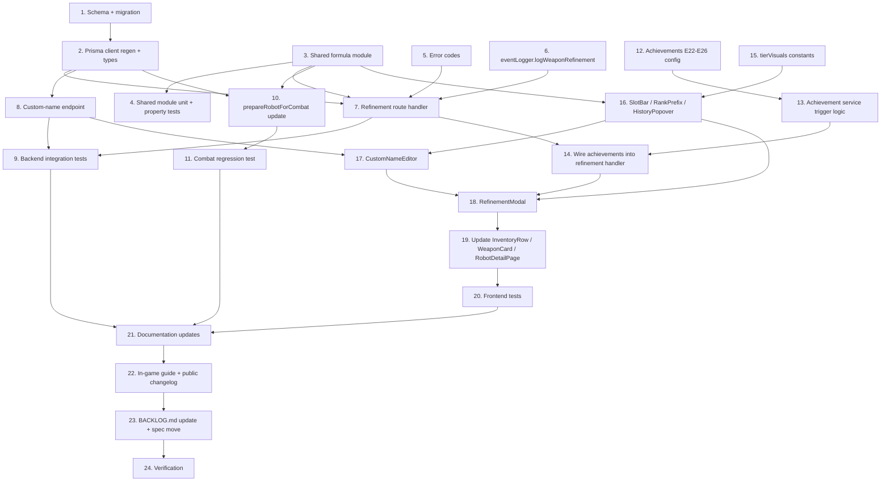

# Implementation Plan: Weapon Refinement

## Overview

This plan delivers Weapon Refinement in 24 tasks grouped into six phases. Phase boundaries follow the data-flow chain: schema first, shared formulas second, backend route third, combat path fourth, frontend fifth, then docs/rollout/verification.

- **Phase 1 — Schema & Shared Formulas (Tasks 1–4)**: Add the `WeaponRefinement` table, generate the migration, build the shared formula module, unit-test it.
- **Phase 2 — Backend Endpoint (Tasks 5–9)**: New error codes, the `eventLogger.logWeaponRefinement` method, the refinement route handler, the custom-name endpoint, integration tests.
- **Phase 3 — Combat Integration (Tasks 10–11)**: Update `prepareRobotForCombat` and the orchestrator queries to thread refinements through to effective stats; combat regression test.
- **Phase 4 — Achievements (Tasks 12–14)**: Five new achievements (E22–E26), trigger logic, wire achievements into the refinement handler.
- **Phase 5 — Frontend (Tasks 15–20)**: Reusable `weapon-refinement` component family (`SlotBar`, `RankPrefix`, `RefinementHistoryPopover`, `CustomNameEditor`, `RefinementModal`), updates to `InventoryRow` + `WeaponCard`, robot detail page integration, frontend tests.
- **Phase 6 — Documentation & Rollout (Tasks 21–24)**: PRDs, audit log doc, in-game guide article, public changelog entry, BACKLOG.md update, spec move, verification.

## Task Dependency Graph

```json
{
  "waves": [
    {
      "name": "Wave 1 — Foundations (parallel)",
      "tasks": [1, 3, 5, 12, 15],
      "description": "Schema + migration, shared formula module, error codes, achievement config + trigger types, frontend tier-visuals constants. No inbound dependencies."
    },
    {
      "name": "Wave 2 — Build on foundations",
      "tasks": [2, 4, 6, 13, 16],
      "description": "Prisma client regen + types update (depends on 1). Shared module unit + property tests (depends on 3). eventLogger.logWeaponRefinement (depends on 5). Achievement service trigger logic (depends on 12). SlotBar + RankPrefix + RefinementHistoryPopover (depends on 3 and 15)."
    },
    {
      "name": "Wave 3 — Backend integration",
      "tasks": [7, 8, 17],
      "description": "Refinement route handler (depends on 2, 3, 5, 6). Custom-name endpoint (depends on 2). CustomNameEditor (depends on 16)."
    },
    {
      "name": "Wave 4 — Wiring & combat path",
      "tasks": [9, 10, 11, 14, 18],
      "description": "Backend integration tests (depends on 4, 7, 8). Update prepareRobotForCombat + orchestrator queries (depends on 2, 3). Combat regression test (depends on 10). Wire achievements into refinement handler (depends on 7 and 13). RefinementModal (depends on 16, 17, 7 contract)."
    },
    {
      "name": "Wave 5 — Frontend integration",
      "tasks": [19, 20],
      "description": "Update InventoryRow + WeaponCard + RobotDetailPage equipped slot (depends on 16, 17, 18). Frontend component + page tests (depends on 19)."
    },
    {
      "name": "Wave 6 — Documentation & rollout (sequential)",
      "tasks": [21, 22, 23, 24],
      "description": "Documentation updates → in-game guide + public changelog → BACKLOG update + spec move → final verification."
    }
  ]
}
```



Tasks 1, 3, 5, 12, and 15 have no inbound dependencies and can be parallelized at the start. Verification (Task 24) is the final gate — every preceding task must be complete before it runs.

## Notes

- All tasks are mandatory. There are no optional or skip-if-time tasks.
- The `_Requirements:` line on each task traces to acceptance criteria in `requirements.md`.
- Run `npx prisma generate` after Task 1 to refresh the project-local client at `app/backend/generated/prisma/`. Forgetting this will cause Tasks 2, 7, 8, 10 to fail with type errors on the new `WeaponRefinement` model.
- The combat-path integration in Task 10 touches every battle orchestrator (league, tournament, tag-team, KotH, practice arena). Run `gitnexus_impact` on `prepareRobotForCombat` before editing — the blast radius is larger than any other task in this spec.
- Refinement is allowed on equipped weapons. Do not block the route handler when the weapon is equipped (this is intentional, see design.md Key Decision #4). The combat sim reads refinements at battle prep time.

## Asset Checklist (out-of-band, not in task waves)

These are visual assets the user (or a designer) needs to produce. They are NOT covered by any individual task — code can ship using fallback paths if assets aren't ready, but the experience won't reach its full polish until they land. Track these separately.

### A1 — Achievement badge artwork (5 SVGs)

- File names: `achievement-e22.svg`, `achievement-e23.svg`, `achievement-e24.svg`, `achievement-e25.svg`, `achievement-e26.svg`.
- Conventions: match the dimensions and visual style of existing achievement badges (e.g., `achievement-e18.svg` for "Pawn Star"). Likely 256×256 SVG with a transparent background.
- Suggested visual themes: E22 First Refinement (a single spark or rune), E23 Master Craftsman (anvil + coin pile), E24 Legendary Smith (a glowing weapon outline with five star emblems), E25 Identity Forged (a refined Practice Sword silhouette), E26 Forge Master (crossed Sharpen+Forge glyphs over a flame).
- Fallback: if these aren't ready at ship time, the achievement system has a default icon path. The achievements still function and unlock — they just show a generic icon until art lands. Document which badges still need art in a follow-up changelog note.

### A2 — Tier glyph icons for `SlotBar` (4 small icons)

- The four refinement tiers (Hone / Augment / Sharpen / Forge) need small glyphs (16×16 or icon-component-equivalent) shown inside filled slot boxes.
- Default plan (Task 15): use existing Heroicons or similar — sparkle / plus / arrow / hammer.
- Optional polish: custom-drawn glyphs that feel more "crafted" and match the tier color (cyan / green / amber / red-orange).
- If the team prefers custom glyphs, deliver as React components or SVG sprite alongside the existing icon library.

### A3 — Optional: My Inventory tab screenshot for the public changelog

- Screenshot of a `Mastercrafted Volt Sabre` (or similar) in the My Inventory tab, slot bar visible, customName set, Refine button visible.
- Used as the optional image for the public changelog entry created in Task 22. Sets a marketing tone for the launch.
- Not blocking — the changelog entry ships fine without it.

## Tasks

- [x] 1. Add `WeaponRefinement` model and migration
  - In `app/backend/prisma/schema.prisma`, add the new `WeaponRefinement` model exactly as specified in design.md → Components and Interfaces → Backend Components → Prisma Schema. Columns: `id`, `weaponInventoryId` (FK with `onDelete: Cascade`), `tier` (VarChar(16)), `magnitude` (Int), `targetAttribute` (VarChar(64), nullable), `costPaid` (Int), `slotIndex` (Int), `createdAt` (default now()).
  - Add the unique constraint `@@unique([weaponInventoryId, slotIndex])` and the index `@@index([weaponInventoryId])`.
  - Add the back-reference on `WeaponInventory`: `refinements WeaponRefinement[]`. No other change to `WeaponInventory`.
  - Generate the migration via `npx prisma migrate dev --name add_weapon_refinement`. Inspect the generated SQL — the migration is purely additive (CREATE TABLE + FK + UNIQUE + INDEX). No data backfill is required.
  - Run `npx prisma generate` to refresh the project-local client at `app/backend/generated/prisma/`.
  - Verify the migration is applied cleanly: `npx prisma migrate status` reports no drift, and `\d weapon_refinement` in psql shows the expected schema.
  - _Requirements: 1.1, 1.2, 1.3_

- [x] 2. Update `WeaponInventory` query consumers to include refinements
  - Identify every code path that reads `WeaponInventory` for use in stat computation, display, or combat. Use `gitnexus_query` or `grep_search` for `weaponInventory.findMany`, `weaponInventory.findUnique`, and `include: { weapon`.
  - For each query that needs refinement data, update the `include` (or `select`) clause to include `refinements: { orderBy: { slotIndex: 'asc' } }`. Specifically:
    - `app/backend/src/routes/weaponInventory.ts` (`GET /api/weapon-inventory` listing) — must include refinements so the inventory tab can render the slot bar.
    - `app/backend/src/services/league/leagueBattleOrchestrator.ts`, `app/backend/src/services/tournament/tournamentBattleOrchestrator.ts`, `app/backend/src/services/tag-team/tagTeamBattleOrchestrator.ts`, `app/backend/src/services/koth/kothBattleOrchestrator.ts`, `app/backend/src/services/practice-arena/practiceArenaService.ts` — must include refinements for both `mainWeapon` and `offhandWeapon`.
    - Any other orchestrator or fetch that loads a robot for combat.
  - Update the TypeScript types: introduce a `WeaponInventoryWithRefinements` type if helpful (use `Prisma.WeaponInventoryGetPayload<{ include: { weapon: true; refinements: true } }>`). Update consumers that destructure inventory rows to know about the new field.
  - Update the frontend `WeaponInventoryItem` type in `app/frontend/src/components/weapon-shop/types.ts` to include `refinements: WeaponRefinementItem[]`.
  - **Update existing test fixtures** to include the new field. Search for inline `WeaponInventoryItem` mocks and add `refinements: []` (empty array for stock weapons). Known fixture files:
    - `app/frontend/src/pages/__tests__/WeaponShopPage.inventory.test.tsx` (~9 mock rows)
    - `app/frontend/src/pages/__tests__/WeaponShopPage.sell.test.tsx` (~1 mock row)
    - Any other `WeaponShopPage.*.test.tsx` files. Run `grep -rn "pricePaid:" app/frontend/src/**/__tests__/` to find all fixture files that will need updating, and add `refinements: []` to each row.
  - _Requirements: 1.4_

- [x] 3. Build the shared formula module `app/shared/utils/weaponRefinement.ts`
  - Create the new module with all pure functions specified in design.md → Components and Interfaces → Backend Components → Shared Formula Module:
    - `RefinementTier` type (`'hone' | 'augment' | 'sharpen' | 'forge'`).
    - `RankPrefix` type (`'Refined' | 'Crafted' | 'Mastercrafted' | 'Legendary' | null`).
    - `RefinementRow` interface (`{ tier, magnitude, targetAttribute }`).
    - `EffectiveWeaponStats` interface (`{ effectiveBaseDamage, effectiveCooldown, effectiveAttributeBonuses }`).
    - `calculateRefinementCost(tier, magnitude, existingInstancesOfTier)` — formulas: `10_000 × m²` (hone), `20_000 × m²` (augment), `300_000 × 3^i` (sharpen), `400_000 × 3^i` (forge).
    - `validateRefinementSlotAvailable(refinements, tier)` — rejects on slot cap (5) and tier cap (Sharpen/Forge ≤ 2).
    - `validateAttributeStackCap(weaponCatalogBonus, refinements, targetAttribute, addedMagnitude)` — rejects when the combined value would exceed +10.
    - `validateAttributeOnWeapon(weaponCatalogBonus, refinements, targetAttribute, tier)` — Hone requires existing bonus (catalog or prior Augment); Augment rejects existing bonus.
    - `validateShieldCompatibility(weaponType, tier)` — rejects Sharpen/Forge on shield.
    - `applyRefinementsToWeapon(weapon, refinements)` — folds refinements into effective stats. Pure; no input mutation.
    - `calculateRankPrefix(refinementCount)` — returns rank prefix or null.
    - `formatWeaponDisplayName(weaponName, refinementCount)` — returns the canonical display name with rank prefix.
  - Re-export all of the above from `app/shared/utils/index.ts` alongside the existing discount and resale exports.
  - All functions are deterministic, parameter-only (no IO, no side effects). Validators return discriminated unions (no exceptions). The route handler maps validator failures to `EconomyError` with the appropriate code.
  - Reference the 23-attribute name constant — extract to a shared place if it's currently buried in `robotUpgradeService.ts`. Keep `validateAttributeOnWeapon` and the modal both reading from one source.
  - _Requirements: 2.1, 2.2, 2.3, 2.4, 2.5, 2.6, 2.7, 2.8, 2.9, 2.10, 2.11_

- [x] 4. Add unit + property-based tests for the shared module
  - Create `app/shared/utils/__tests__/weaponRefinement.test.ts`. Unit cases per design.md → Testing Strategy → Shared Module Unit Tests:
    - `calculateRefinementCost`: all four tiers, magnitudes 1–5, instance indices 0/1.
    - `validateRefinementSlotAvailable`: 0/1/2/.../5 existing refinements; existing-Sharpen 0/1/2; existing-Forge 0/1/2.
    - `validateAttributeStackCap`: under-cap, exactly-at-cap (+10), over-cap; mixed catalog/Hone/Augment contributions.
    - `validateAttributeOnWeapon`: every cell of the 2×3 truth table (tier × {catalog, augmented, absent}).
    - `validateShieldCompatibility`: shield + each tier; non-shield + each tier.
    - `applyRefinementsToWeapon`: every tier independently and in combinations; effective stats match formula; no input mutation.
    - `calculateRankPrefix`: 0/1/2/3/4/5/6 (overflow), negative input.
    - `formatWeaponDisplayName`: with and without rank prefix.
  - Create `app/shared/utils/__tests__/weaponRefinement.property.test.ts` using fast-check, covering Properties 1–6 from design.md → Correctness Properties (slot cap, per-tier caps, stack cap, currency conservation skeleton, formula determinism + commutativity, cost monotonicity).
  - Run `cd app/backend && npm test -- weaponRefinement` and confirm all tests pass.
  - _Requirements: 14.1, 14.2_

- [x] 5. Add refinement-specific economy error codes
  - Locate `EconomyErrorCode` in `app/backend/src/errors/economyErrors.ts`. Add the eight new codes from design.md → Components and Interfaces → Error Codes:
    - `WEAPON_REFINEMENT_TIER_LOCKED` (HTTP 403)
    - `WEAPON_REFINEMENT_SLOT_CAP_EXCEEDED` (HTTP 409)
    - `WEAPON_REFINEMENT_TIER_CAP_EXCEEDED` (HTTP 409)
    - `WEAPON_REFINEMENT_ATTRIBUTE_STACK_CAP_EXCEEDED` (HTTP 409)
    - `WEAPON_REFINEMENT_MAGNITUDE_OUT_OF_RANGE` (HTTP 400)
    - `WEAPON_REFINEMENT_ATTRIBUTE_NOT_ON_WEAPON` (HTTP 400)
    - `WEAPON_REFINEMENT_ATTRIBUTE_ALREADY_ON_WEAPON` (HTTP 400)
    - `WEAPON_REFINEMENT_SHIELD_CANNOT_TAKE_DPS_TIER` (HTTP 400)
  - Ensure each error is constructible with a `details` object (matching the pattern of `WEAPON_EQUIPPED` from Spec #33). The route handler will populate fields like `requiredWorkshopLevel`, `attribute`, `currentTotal`, `requestedAddition`.
  - Update `docs/guides/ERROR_CODES.md` with the new codes if the document enumerates economy codes.
  - _Requirements: 5.1, 5.2_

- [x] 6. Add `eventLogger.logWeaponRefinement`
  - In `app/backend/src/services/common/eventLogger.ts`, add a new method on the `EventLogger` class mirroring the shape of `logWeaponPurchase` and `logWeaponSale`:
    ```typescript
    async logWeaponRefinement(
      cycleNumber: number,
      userId: number,
      payload: {
        weaponInventoryId: number;
        weaponId: number;
        tier: RefinementTier;
        magnitude: number;
        targetAttribute: string | null;
        costPaid: number;
        workshopLevel: number;
      },
    ): Promise<void>
    ```
  - The method writes an `audit_log` row with `event_type = 'weapon_refinement'` and the payload as JSON. No schema change to `audit_log` — only a new event type value.
  - Import `RefinementTier` from `app/shared/utils/weaponRefinement.ts`.
  - _Requirements: 3.6_

- [x] 7. Implement the refinement route handler
  - In `app/backend/src/routes/weaponInventory.ts`, add `router.post('/:id/refine', ...)` following design.md → Components and Interfaces → Route Handler exactly. Apply middleware in this order: `authenticateToken`, the new per-user refinement rate limiter (defined in this same task at module scope, 10 req / 5 min keyed by userId, with `securityMonitor.trackRateLimitViolation` on 429), `validateRequest({ params: inventoryIdParamsSchema, body: refineBodySchema })`.
  - The Zod body schema enforces: `tier` is one of the four values, `magnitude` is in [1, 5], `targetAttribute` (when present) is in the 23-attribute allowlist, and a discriminated refine: hone/augment require `targetAttribute`, sharpen/forge reject `targetAttribute` and require magnitude exactly 1.
  - Call `verifyWeaponOwnership(prisma, inventoryId, userId)` before the transaction.
  - Inside `prisma.$transaction`:
    1. `lockUserForSpending(tx, userId)`.
    2. `SELECT id, user_id, weapon_id, price_paid FROM weapon_inventory WHERE id = $1 FOR UPDATE` via `tx.$queryRaw`. Throw 404 if not found.
    3. Re-verify ownership; on mismatch log `securityMonitor.logAuthorizationFailure` and throw 403.
    4. Defensive `pricePaid >= 0` check; throw 500 on violation.
    5. Fetch the weapon catalog row, refinements, and Workshop level (`Promise.all`).
    6. Tier gating: hone L1, augment L3, sharpen L5, forge L8. Throw `WEAPON_REFINEMENT_TIER_LOCKED` with `details: { requiredWorkshopLevel, currentWorkshopLevel }` on failure.
    7. Run validator chain (slot, shield, attribute on/not-on weapon, stack cap). Each failed validator maps to its `WEAPON_REFINEMENT_*` error code.
    8. Compute cost via `calculateRefinementCost`. Throw `INSUFFICIENT_CURRENCY` (HTTP 402) if balance is too low.
    9. Compute the next available `slotIndex` (1..5).
    10. Decrement currency by cost, increment `weapon_inventory.price_paid` by cost, insert `weapon_refinement` row.
    11. Re-fetch the updated `WeaponInventory` with `weapon` and `refinements` for the response.
  - After the transaction commits:
    - Call `securityMonitor.trackSpending(userId, cost, 'weapon_refinement')` — refinement IS spending (unlike resale).
    - Call `eventLogger.logWeaponRefinement(...)` (Task 6) inside a try-catch. Failure logs but does not block the response.
    - Write a structured `logger.info` line (userId, weapon name, tier, magnitude, targetAttribute, cost, Workshop level, slot index, balance before/after).
  - Achievement check is wired in Task 14 — for now, leave a placeholder comment at the spot.
  - Respond with `{ weaponInventory, currency, cost, message, achievementUnlocks: [] }`.
  - Imports: `calculateRefinementCost`, `applyRefinementsToWeapon`, validators, types — all from `app/shared/utils/weaponRefinement.ts` (or via the index barrel).
  - _Requirements: 3.1, 3.2, 3.3, 3.4, 3.5, 3.6, 3.7, 3.8, 3.9, 3.10, 3.11, 3.12_

- [x] 8. Implement the custom-name endpoint
  - Add `router.patch('/:id/custom-name', ...)` to `app/backend/src/routes/weaponInventory.ts` following design.md → Custom Name Endpoint.
  - Middleware order: `authenticateToken`, the new custom-name rate limiter (module-scope, 30 req / 10 min per user), `validateRequest({ params: inventoryIdParamsSchema, body: customNameBodySchema })`.
  - The Zod body schema accepts `customName: string | null`, with non-null values validated by `safeName.max(60)` from `app/backend/src/utils/securityValidation.ts`. Empty strings are normalized to null on the server.
  - Call `verifyWeaponOwnership` before the update.
  - Update `weapon_inventory.custom_name` in a simple `prisma.weaponInventory.update` (no row lock — non-economic field).
  - Respond with the updated `WeaponInventory` including `weapon` and `refinements`.
  - _Requirements: 10.1, 10.2, 10.3, 10.4_

- [ ] 9. Add backend integration tests for the refinement and custom-name routes
  - Create `app/backend/tests/weaponInventory.refine.test.ts` with a `describe('POST /api/weapon-inventory/:id/refine')` block covering every case from design.md → Testing Strategy → Backend Integration Tests:
    - Successful refinement at Workshop L1 (Hone), L3 (Augment), L5 (Sharpen), L8 (Forge).
    - Each `WEAPON_REFINEMENT_*` error code path explicitly.
    - 401, 403, 404 standard auth/ownership cases.
    - 402 `INSUFFICIENT_CURRENCY`.
    - Currency decrements by exactly the cost.
    - `pricePaid` increments by exactly the cost.
    - A `weapon_refinement` row is inserted with all fields populated correctly and `slotIndex` is 1-indexed and stable.
    - `eventLogger.logWeaponRefinement` is called and an `audit_log` row is written.
    - `securityMonitor.trackSpending` IS called (verify via spy).
    - Rate limit: 11th request in 5 min returns 429.
    - Concurrent refinement on the same weapon: two parallel POSTs — exactly one succeeds, the other fails with the appropriate cap error.
    - Concurrent refinement-vs-resale on the same weapon: never both succeed.
    - Concurrent refinement-vs-equip on the same weapon: both succeed; `mainWeaponId` consistent post-write.
  - Add `app/backend/tests/weaponInventory.customName.test.ts` covering: set, edit, clear (null), 401, 403, rate limit (31st request 429), validation rejection (too long, invalid characters).
  - Add a property-based test file `app/backend/tests/weaponInventory.refine.property.test.ts` with one fast-check property: a randomized sequence of refinement requests on a single weapon never produces invariant violations (Properties 1, 2, 3, 4, 7 from design.md).
  - Run `cd app/backend && npm test -- weaponInventory` to confirm all tests pass.
  - _Requirements: 14.3_

- [x] 10. Integrate refinements into `prepareRobotForCombat`
  - In `app/backend/src/utils/robotCalculations.ts`, update `prepareRobotForCombat` so that for each equipped weapon (`mainWeapon`, `offhandWeapon`), it calls `applyRefinementsToWeapon(weapon, refinements)` and overwrites the weapon record's `baseDamage`, `cooldown`, and per-attribute bonus fields with the effective values BEFORE the existing logic computes the robot's effective attribute totals.
  - Add a clear inline comment at the insertion point: "Refinement bonuses are folded into the weapon's effective stats here. The combat simulator reads weapon.baseDamage / weapon.cooldown / weapon.<attr>Bonus directly — it never sees refinement records."
  - Do NOT modify the simulator (`combatSimulator.ts`) — `calcCooldown` and the damage formulas continue to read `weapon.cooldown` and `weapon.baseDamage`, but those values are now the refined effective values.
  - Update the `RobotWithWeapons` type comment in `combatSimulator.ts` to document that the `mainWeapon.weapon` and `offhandWeapon.weapon` fields hold POST-REFINEMENT effective stats.
  - In the combat event emission path (around the per-attack event in `combatSimulator.ts`, line ~313 area), use `formatWeaponDisplayName(weapon.name, refinementCount)` for the `weapon` field in the event payload, and add a separate `customName` field if the inventory row has one set. The frontend's battle report renderer will use these fields.
  - **Do NOT modify the deprecated `_bonusField` path in `combatSimulator.ts`.** The comment block already says attributes are pre-computed by `prepareRobotForCombat`. The new flow is consistent with that contract — leave the deprecated function alone (per R4.5).
  - **`BattleParticipant.mainWeaponName` / `offhandWeaponName` SHALL store the catalog name, NOT the rank-prefixed name.** Battle participant rows are a historical record and need to remain stable across future refinement changes. The rank prefix appears in the live battle log events (this task) and at render time on robot detail pages (Task 19), but the persisted participant row keeps the catalog name. Verify `app/backend/src/services/match/matchHistoryService.ts` continues to read `weapon.name` from the catalog (not from `formatWeaponDisplayName`) when populating these columns.
  - Run `gitnexus_impact` on `prepareRobotForCombat` first — its blast radius covers every battle orchestrator. Verify expected callers and ensure no surprise consumers exist.
  - _Requirements: 4.1, 4.2, 4.3, 4.4, 4.5_

- [ ] 11. Add combat regression test for refined weapons
  - Create `app/backend/src/services/battle/__tests__/combatSimulator.refinement.test.ts`.
  - Set up two robots with identical attributes. Equip one with a stock weapon (e.g., Volt Sabre baseline). Equip the other with a copy of the same weapon refined: 1× Forge (+1 baseDamage), 2× Hone Combat Power (+2 each, total +4 catalog → +5 effective if catalog was +1).
  - Simulate a deterministic battle (seeded RNG via the existing `seedrandom` or test fixture pattern).
  - Assert the refined-weapon robot wins.
  - Assert the per-attack damage events from the refined-weapon robot use the refined effective base damage (within ±0.5 to allow for crit/miss randomness). Use raw event inspection.
  - Assert the battle log header / event payloads include the rank prefix when refinement count > 0 (verify by checking the `weapon` field in events for the prefix substring).
  - _Requirements: 4.5_

- [x] 12. Add five new achievements (E22–E26) and trigger types
  - In `app/backend/src/config/achievements.ts`, add five new values to `AchievementTriggerType`:
    - `'weapons_refined_count'`
    - `'weapons_refined_credits_spent'`
    - `'owns_legendary_weapon'`
    - `'owns_legendary_starter_weapon'`
    - `'owns_max_dps_weapon'`
  - Add five new achievement definitions to the `ACHIEVEMENTS` array using the exact field shapes from design.md → Components and Interfaces → Achievements:
    - **E22 First Refinement** (easy, boolean, threshold 1, trigger `weapons_refined_count`)
    - **E23 Master Craftsman** (medium, numeric, threshold 1_000_000, trigger `weapons_refined_credits_spent`, progress label "credits spent on refinement")
    - **E24 Legendary Smith** (hard, boolean, trigger `owns_legendary_weapon`)
    - **E25 Identity Forged** (hard, boolean, trigger `owns_legendary_starter_weapon`)
    - **E26 Forge Master** (hard, boolean, trigger `owns_max_dps_weapon`)
  - All five use `category: 'economy'` and `scope: 'user'`. None hidden. Use `TIER_REWARDS.easy.*` for E22, `TIER_REWARDS.medium.*` for E23, `TIER_REWARDS.hard.*` for E24/E25/E26.
  - Badge icon names: `'achievement-e22'` through `'achievement-e26'`. If badge artwork is not yet available, document a follow-up note in the changelog task — the system has a fallback icon path.
  - Define the starter-weapon name list constant for the E25 trigger somewhere reusable (e.g., `app/backend/src/config/starterWeapons.ts`): `['Practice Sword', 'Practice Blaster', 'Training Rifle', 'Training Beam']`.
  - _Requirements: 6.1, 6.2, 6.3, 6.4, 6.5, 6.6, 6.7_

- [x] 13. Wire `weapon_refined` event type into `AchievementService`
  - In `app/backend/src/services/achievement/achievementService.ts`, add `'weapon_refined'` to the `AchievementEventType` union.
  - Add to `EVENT_TRIGGER_MAP`: `weapon_refined: ['weapons_refined_count', 'weapons_refined_credits_spent', 'owns_legendary_weapon', 'owns_legendary_starter_weapon', 'owns_max_dps_weapon']`.
  - Extend the `checkCriterionMet` switch with five new cases per design.md:
    - `weapons_refined_count`: `prisma.auditLog.count({ where: { userId, eventType: 'weapon_refinement' } })`.
    - `weapons_refined_credits_spent`: `prisma.weaponRefinement.aggregate({ _sum: { costPaid: true }, where: { weaponInventory: { userId } } })`.
    - `owns_legendary_weapon`: query for any of the user's `WeaponInventory` rows with exactly 5 refinements (group-by + having count = 5).
    - `owns_legendary_starter_weapon`: same as above plus a join to `weapon` and a name-match against the starter list constant from Task 12.
    - `owns_max_dps_weapon`: query for any of the user's `WeaponInventory` rows whose refinements include exactly 2 sharpen + 2 forge (count by tier).
  - Extend the `getProgress` method with cases for the numeric triggers (`weapons_refined_count`, `weapons_refined_credits_spent`).
  - _Requirements: 6.8, 6.9_

- [ ] 14. Wire achievement check into the refinement handler
  - In the refinement route handler in `app/backend/src/routes/weaponInventory.ts`, replace the placeholder from Task 7 with a real `achievementService.checkAndAward(userId, null, { type: 'weapon_refined', data: { weaponInventoryId, weaponId, tier, magnitude, targetAttribute, costPaid: cost, workshopLevel } })` call AFTER the transaction commits and AFTER `eventLogger.logWeaponRefinement` is called.
  - Wrap in try-catch; failures log via `logger.error` but do not block the response (matches the resale handler pattern).
  - Include `achievementUnlocks: UnlockedAchievement[]` in the response body.
  - Update the response TypeScript type to include `achievementUnlocks`.
  - Add backend tests in `app/backend/tests/weaponInventory.refine.test.ts` (extending Task 9):
    - First refinement unlocks E22 — fresh test user, refine once, assert response `achievementUnlocks` contains E22.
    - 5th refinement on a single weapon unlocks E24 — refine the same weapon five times across different tiers, assert E24 in unlocks.
    - 5th refinement on a Practice Sword unlocks both E24 and E25 — same flow on a Practice Sword.
    - 2 Sharpen + 2 Forge on a single weapon unlocks E26 — refine those four slots on one weapon, assert E26 in unlocks.
    - ₡1M cumulative spend unlocks E23 — pre-seed `weapon_refinement` rows summing to ₡999,000, refine once at ₡5K, assert E23 in unlocks.
  - _Requirements: 6.8, 6.9 (extension)_

- [x] 15. Add `tierVisuals` constants and base directory
  - Create the directory `app/frontend/src/components/weapon-refinement/`.
  - Create `app/frontend/src/components/weapon-refinement/tierVisuals.ts` with the `TIER_VISUALS` constant from design.md (icon names, color tokens, hex values, labels). Export a `TierVisual` type and the `TIER_VISUALS: Record<RefinementTier, TierVisual>` constant.
  - Pick or create icon glyph references — the project already has Heroicons or similar; use existing icons where possible (e.g., spark for hone, plus for augment, arrow for sharpen, hammer for forge).
  - Color tokens must match the project's design system. If raw hex values are required (e.g., for inline styles), reference the design system tokens in comments so future tweaks land in one place.
  - Re-export from `app/frontend/src/components/weapon-refinement/index.ts` for clean imports.
  - _Requirements: 8.5_

- [x] 16. Implement `SlotBar`, `RankPrefix`, and `RefinementHistoryPopover`
  - Create `app/frontend/src/components/weapon-refinement/SlotBar.tsx` per design.md spec. Props: `refinements`, `workshopLevel`, `compact?`, `onSlotClick?`. Renders 5 slot boxes with tier glyphs/colors for filled slots and gate icons + tooltips for locked tiers. Click on a filled slot opens the `RefinementHistoryPopover` for that slot.
  - Create `app/frontend/src/components/weapon-refinement/RankPrefix.tsx`. Props: `refinementCount`, `variant?`. Returns null for 0 refinements; otherwise renders the prefix text via `calculateRankPrefix`. Three variants: default, subtle (inline), badge (emphasis).
  - Create `app/frontend/src/components/weapon-refinement/RefinementHistoryPopover.tsx`. Props: `refinements`, `focusSlotIndex?`. Renders a list of all filled slots with tier name, magnitude (rendered tier-specifically: "+3 Combat Power" for hone, "−0.25s cooldown" for sharpen, etc.), cost paid, date stamp. Total spend summary at the bottom.
  - All three components import from `app/shared/utils/weaponRefinement.ts` for any formula-derived display logic.
  - _Requirements: 8.1, 8.2, 8.3_

- [x] 17. Implement `CustomNameEditor`
  - Create `app/frontend/src/components/weapon-refinement/CustomNameEditor.tsx`. Props: `inventoryItem`, `onSave: (newName: string | null) => Promise<void>`.
  - Inline editable text field. Validates on the client: length 0–60, allowed character set (mirror the `safeName` Zod primitive — extract the regex if needed for client-side feedback).
  - On Save: calls `apiClient.patch('/api/weapon-inventory/<id>/custom-name', { customName })`. Empty string → null.
  - Disabled state during save. Error rendering for 4xx errors (especially 429 rate-limit messages).
  - _Requirements: 8.4_

- [ ] 18. Implement `RefinementModal`
  - Create `app/frontend/src/components/weapon-refinement/RefinementModal.tsx` per design.md spec. Layout: header (weapon display name with rank prefix, customName below, slot bar at top); tier picker (2×2 grid of `TierCard` sub-components); tier-specific configurator; stat-delta preview; cost preview with resale-recovery note; confirm bar.
  - Tier cards reflect lock state (Workshop level too low) and per-tier-cap state (Sharpen 2/2, Forge 2/2). Locked cards dimmed with the requirement visible. Disabled cards when 5/5 slots filled.
  - Configurator:
    - Hone: dropdown of attributes the weapon currently grants (catalog + prior Augments) + magnitude picker (1–5).
    - Augment: dropdown of all 23 attributes minus those already granted + magnitude picker (1–5).
    - Sharpen: no configuration (magnitude fixed at 1, axis is cooldown).
    - Forge: no configuration (magnitude fixed at 1, axis is baseDamage).
  - Stat preview: renders current → projected stats inline using `applyRefinementsToWeapon` with the candidate refinement appended.
  - Cost preview: cost, current balance, balance after, plus the small note "Refinement spend folds into resale value at your Workshop level (currently <rate>%)."
  - Confirm bar: large Confirm button, disabled when invalid or unaffordable. Permanence warning copy: "Refinement is permanent. Confirm to spend ₡<amount>."
  - On Confirm: calls `apiClient.post('/api/weapon-inventory/<id>/refine', { tier, magnitude, targetAttribute })`. On 200, closes modal and triggers `onConfirmed(updatedInventoryItem, newCurrency, achievementUnlocks)`. On 4xx, renders the server error message in a banner and stays open. Display `details` from the error payload when useful (e.g., "Combat Power is already at +9, +3 would push to +12, but the cap is +10").
  - Forward `achievementUnlocks` to the existing achievement toast system (look at how the resale flow forwards these — pattern is already established).
  - _Requirements: 9.1, 9.2, 9.3, 9.4, 9.5, 9.6, 9.7_

- [ ] 19. Update `InventoryRow`, `WeaponCard`, `RobotDetailPage`, and weapon-name displays elsewhere
  - In `app/frontend/src/components/weapon-shop/InventoryRow.tsx`:
    - Render `RankPrefix` next to the weapon name.
    - Render the customName in italic below the name when set.
    - Embed `CustomNameEditor` (collapsed by default, expandable on click).
    - Embed a compact `SlotBar` showing current refinement state.
    - Add a "Refine" button next to the existing "Sell" button. Refine is enabled when slot count < 5 (regardless of equipped state — refinement is allowed on equipped weapons). Clicking opens the `RefinementModal`.
  - In `app/frontend/src/components/weapon-shop/WeaponCard.tsx` (Catalog tab):
    - Update the "Already Own (n)" indicator. When the player owns multiple copies and at least one is refined, show a per-rank breakdown: `Already Own 3 (1 Mastercrafted, 1 Refined, 1 stock)`. Compute by grouping owned copies by `calculateRankPrefix(refinements.length)`. When no refinements exist among owned copies, render the simple count unchanged.
  - In `app/frontend/src/pages/RobotDetailPage.tsx` (or its equipped-weapon child component):
    - The equipped weapon display gains: rank prefix on the weapon name, customName below, compact `SlotBar` inline. Hover on the slot bar opens `RefinementHistoryPopover`. No Refine button on this surface (refinement happens in the Weapon Shop's My Inventory tab).
  - **Battle report rendering** (`app/frontend/src/components/battle-detail/BattleStatisticsSummary.tsx` and any battle-log event renderers): the live event payloads from the combat simulator (Task 10) already carry the rank-prefixed name in the `weapon` field plus the optional `customName` field. Update the renderer to surface both — rank prefix inline with the weapon name, customName italicized underneath. The persisted `participant.mainWeaponName` / `offhandWeaponName` fields stay catalog-name-only (Task 10) so historical battles render their stock catalog names — that's intentional.
  - **Matchmaking previews and any other "weapon name" surfaces.** Run `grep -rn "mainWeaponName\\|offhandWeaponName" app/frontend/src/` to find every consumer. Categorize each one as either:
    - (a) **historical/persisted** (e.g., `BattleStatisticsSummary` reading `participant.mainWeaponName`) — keep catalog name as-is. No prefix.
    - (b) **live/current** (e.g., matchmaking preview reading the player's currently-equipped weapon) — render the rank prefix. Use `formatWeaponDisplayName` from the shared utils plus the customName layout.
    - The known categorization at design time: `app/frontend/src/utils/matchmakingApi.ts` `mainWeaponName` is **live** (current loadout), so matchmaking previews should show the rank prefix. `BattleStatisticsSummary` reads from `participant` records — those are **historical**, so keep catalog name.
    - Document the (a)/(b) decision in a code comment near each consumer touched.
  - _Requirements: 7.1, 7.2, 7.3_

- [ ] 20. Add frontend tests for refinement components and pages
  - Create `app/frontend/src/components/weapon-refinement/__tests__/SlotBar.test.tsx` — 0–5 filled slots, locked tooltips when Workshop level too low, click opens history popover.
  - Create `app/frontend/src/components/weapon-refinement/__tests__/RankPrefix.test.tsx` — derivation across 0/1/2/3/4/5.
  - Create `app/frontend/src/components/weapon-refinement/__tests__/RefinementHistoryPopover.test.tsx` — lists all refinements with correct fields and total spend summary.
  - Create `app/frontend/src/components/weapon-refinement/__tests__/CustomNameEditor.test.tsx` — input validation, save flow, clear flow, error handling, 429 rate-limit message.
  - Create `app/frontend/src/components/weapon-refinement/__tests__/RefinementModal.test.tsx` — tier card lock states, tier selection updates configurator, magnitude picker for hone/augment, stat preview matches `applyRefinementsToWeapon`, cost preview matches `calculateRefinementCost`, Confirm disabled in invalid states, on Confirm calls API, success closes modal, error keeps modal open with banner, the resale-recovery note is rendered.
  - Create `app/frontend/src/pages/__tests__/WeaponShopPage.refine.test.tsx` — My Inventory tab renders SlotBar, RankPrefix, Refine button on every owned weapon. Click Refine opens the modal with the correct inventory item. Successful refinement updates the inventory tab without a page refresh (rank prefix changes, slot bar updates, currency in header updates). Catalog tab "Already Own" badge reflects rank breakdown after refinement. Achievement unlock toast renders when the API response includes `achievementUnlocks`.
  - Run `cd app/frontend && npm test -- weapon-refinement WeaponShopPage` to confirm all tests pass.
  - _Requirements: 15.1, 15.2_

- [ ] 21. Update documentation
  - `docs/game-systems/PRD_WEAPON_ECONOMY.md`: bump to v1.6. Add a new "Version 1.6 Updates — Weapon Refinement" section covering: problem statement, the four-tier system, slot mechanics, gating, costs, resale interaction, Files Modified list. Mirror the structure of the v1.4 and v1.5 sections.
  - `docs/game-systems/PRD_WEAPONS_LOADOUT.md`: update the weapon lifecycle text to read `Purchase → Equip → **Refine** → Configure → Battle → Unequip / Sell`.
  - `app/backend/docs/audit-logging-schema.md`: add a section documenting the `weapon_refinement` event type with the full payload schema (`weaponInventoryId`, `weaponId`, `tier`, `magnitude`, `targetAttribute`, `costPaid`, `workshopLevel`).
  - If `docs/game-systems/PRD_ACHIEVEMENTS.md` exists, add the five new economy achievements (E22–E26) to its catalog.
  - _Requirements: 12.1, 12.2, 12.3, 12.4_

- [ ] 22. Add in-game guide article and create the public changelog entry
  - Create `app/backend/src/content/guide/weapons/refinement.md` with the frontmatter shape from design.md → Documentation Impact → New Documentation. Place it in the `weapons` section with `order: 4` (after `loadout-types`, `dual-wield-mechanics`, `buying-and-selling`). Set `relatedArticles` to `weapons/buying-and-selling`, `weapons/loadout-types`, `facilities/facility-overview`.
  - Article body covers: what refinement is, the four tiers, gating, costs, the 5-slot system + rank prefix, the per-attribute stack cap with a worked example, resale interaction, the custom name feature, two example builds (identity Practice Sword + DPS Volt Sabre), permanence warning. Match the prose style of `weapons/buying-and-selling.md`.
  - Articles are auto-discovered by `GuideService.scanSectionArticles` via filesystem scan — no edit to `app/backend/src/content/guide/sections.json` is required (sections.json only enumerates sections, not articles). Verify by spot-checking the existing `weapons/` section: dropping a new `.md` file there causes it to appear in the API response on the next service cache miss.
  - Save a `CHANGELOG_DRAFT.md` in the spec directory containing the public-facing changelog body. Title: "Refine your weapons — make them yours". Category: `feature`. Body: ~250 words explaining the four tiers with example builds, resale interaction, custom name, identity payoff, closing line: "The weapon you keep can be yours, fully."
  - Use the admin changelog endpoint (`POST /api/changelog/admin`, then `POST /api/changelog/admin/:id/publish`) to create and publish the entry once the spec is ready to ship. The entry appears in the player-facing changelog modal on next dashboard load.
  - _Requirements: 11.1, 11.2, 11.3, 13.1, 13.2_

- [ ] 23. Update BACKLOG.md and move spec to done- directory
  - In `docs/BACKLOG.md` Entry #5 (Weapon Experimentation Problem), update the follow-up checklist: mark Weapon Refinement complete, leave any remaining axes (Practice Arena catalog access, matchup-dependent effectiveness) as future work.
  - Add a new row to the "Recently Completed" table at the top of the WSJF section: `Weapon Refinement | 5 (partial) | [Spec #34](/.kiro/specs/done-{month}{year}/34-weapon-refinement/) | {month} 2026`.
  - When all preceding tasks are complete and verified, move `.kiro/specs/to-do/34-weapon-refinement/` to `.kiro/specs/done-{month}{year}/34-weapon-refinement/` (using the actual completion month).
  - **NOTE**: This task remains unchecked until the migration has been applied in a running environment, the integration tests in Task 9 / 14 have actually executed, and a manual refinement has been performed via the UI. All static verification (lint, type-check, unit tests, property tests) can pass before this — but the runtime verification (DB migration, manual refinement, achievement toast) is the gate before moving the spec to done-.
  - _Requirements: 12.4_

- [ ] 24. Verification
  - Run all checks from the requirements document's "Verification Criteria" section:
    1. `npx prisma migrate status` — no drift
    2. `psql ... -c "\d weapon_refinement"` — table exists with correct columns, FK, unique constraint, index
    3. `grep -rn "calculateRefinementCost\\|applyRefinementsToWeapon\\|calculateRankPrefix" app/shared/utils/weaponRefinement.ts` — all three functions exist
    4. `grep -rn "POST .*weapon-inventory.*refine\\|/refine" app/backend/src/routes/weaponInventory.ts` — refinement route registered
    5. `cd app/backend && npm test -- weaponInventory` passes — including all error paths, concurrency, rate-limit, and the property test
    6. `cd app/backend && npm test -- weaponRefinement.property` passes
    7. `cd app/backend && npm test -- combatSimulator.refinement` passes
    8. `cd app/frontend && npm test -- WeaponShop.refine weapon-refinement` passes
    9. Manual integration: login as test user with Workshop L8, ≥₡5M, an unrefined weapon. Refine 5 times across all four tiers. Verify each refinement deducts the correct cost, increments `pricePaid`, inserts a `weapon_refinement` row with the right `slotIndex`, slot bar updates, rank prefix progresses Refined → Crafted → Mastercrafted → Legendary, audit log row exists, achievement toasts appear at the right milestones.
    10. Manual integration: equip the refined weapon on a robot, run a Practice Arena battle. Confirm the battle log shows the rank prefix and damage reflects the refined stats.
    11. `psql ... -c "SELECT event_type, COUNT(*) FROM audit_log WHERE event_type='weapon_refinement';"` — ≥ 1 row after manual test
    12. `grep -rn "FOR UPDATE.*weapon_inventory" app/backend/src/` — both refinement and existing handlers (resale, equip) acquire the same row lock
    13. Race-condition stress test (Jest, fast-check): 50 parallel refine + resale + equip + unequip cycles on the same user. Assert: total currency change matches expected sum, no orphaned `weapon_refinement` rows, no row exceeds 5 refinements, no Sharpen/Forge tier exceeds 2 instances, no per-attribute stack exceeds +10.
    14. `grep -n "id: 'E2[2-6]'" app/backend/src/config/achievements.ts` — five new achievements present
    15. `grep -n "weapon_refined" app/backend/src/services/achievement/achievementService.ts` — event type wired into `EVENT_TRIGGER_MAP`
    16. Manual: complete a refinement via the UI, confirm achievement unlock toast renders. Specifically test E22 "First Refinement" on first action.
    17. Visual: SlotBar visible on every owned weapon (0-slot weapons show 5 empty slots with locked tooltips). Rank prefix visible everywhere a weapon is displayed (My Inventory, robot detail equipped slot, battle report header, weapon shop catalog ownership badge).
    18. In-game guide: visit `/guide` (or whichever route exposes the in-game guide), confirm "Weapon Refinement" article is reachable.
    19. Public changelog entry exists and is published. Confirm by hitting `/api/changelog` and finding the entry with title "Refine your weapons — make them yours".
    20. `docs/game-systems/PRD_WEAPON_ECONOMY.md` shows v1.6 section. `docs/game-systems/PRD_WEAPONS_LOADOUT.md` mentions Refine in the lifecycle. `app/backend/docs/audit-logging-schema.md` documents the `weapon_refinement` event. `docs/BACKLOG.md` updated.
  - Run `gitnexus_impact` on `prepareRobotForCombat`, `equipMainWeapon`, `equipOffhandWeapon`, `lockUserForSpending`, and the resale handler to confirm no unexpected blast radius. Report any HIGH or CRITICAL risks before merging.
  - Run full backend test suite: `cd app/backend && npm test -- --silent`.
  - Run full frontend test suite: `cd app/frontend && npm test -- --run`.
  - Run linters: `cd app/backend && npm run lint` and `cd app/frontend && npm run lint`.
  - _Requirements: All_
