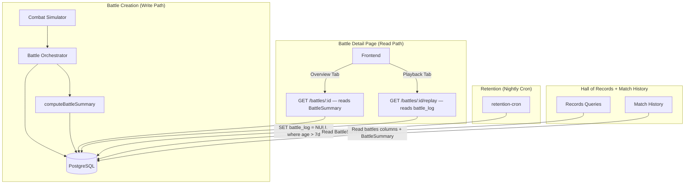
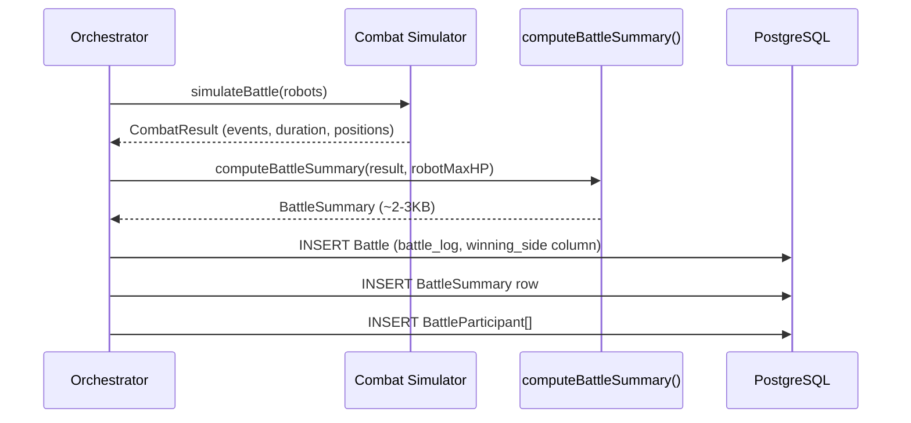
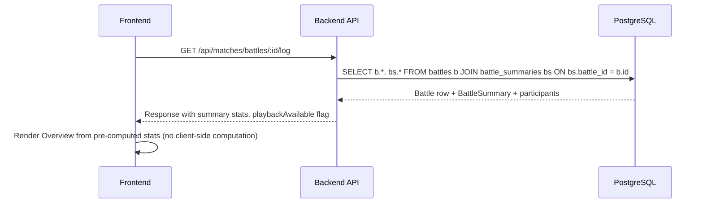
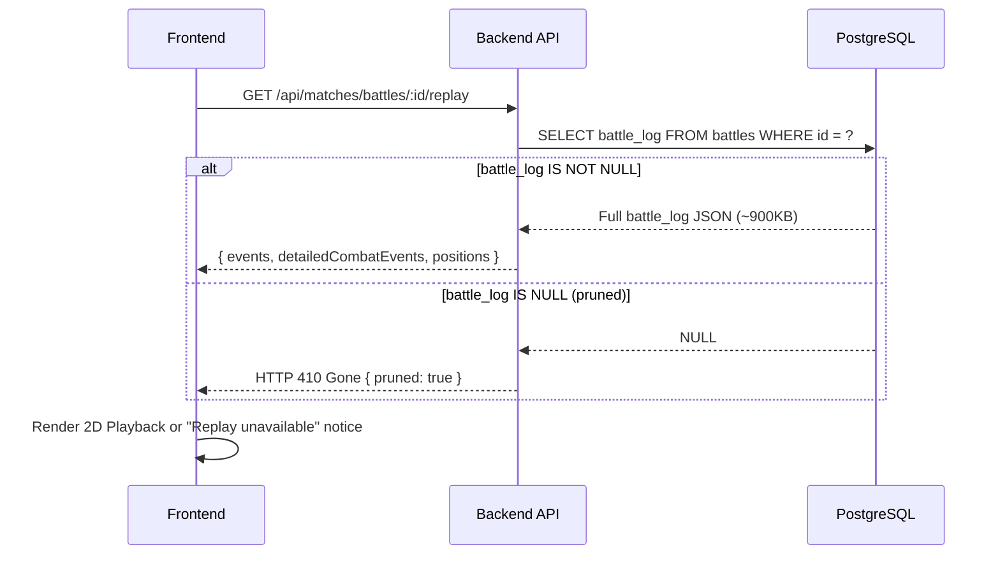
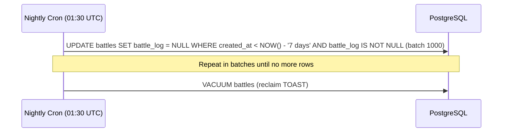

# Design Document: Battle Log Retention & Pre-Computed Summary

## Overview

The `battle_log` JSON column consumes 13GB of TOAST storage across 137K battles (~96MB/day growth) on a server with 22GB free disk. The current architecture requires the frontend to compute battle statistics client-side from raw combat events (~900KB) on every page load — both wasteful and tightly coupled to the heavy JSON payload.

This design introduces a **`BattleSummary` table** (written at battle creation time), **full NULL-out of `battle_log`** after 7 days, and refactoring of all metadata readers to use the summary or proper columns instead. The result: `battle_log` becomes purely ephemeral replay data with a 7-day TTL, while all persistent data lives in typed columns with a clear contract.

### Design Principles

1. **`battle_log` is ephemeral** — full replay data for 7 days, then NULL. No partial JSON, no skeleton.
2. **`BattleSummary` is permanent** — pre-computed at battle creation, never pruned, serves the overview forever.
3. **No special rules per battle type** — a battle is a battle. Same retention, same schema, same logic.
4. **All metadata migrates out of `battle_log`** — `winningSide`, `placements`, `kothData`, `participants.survivalSeconds` all move to the summary or proper columns.


## Architecture




## Consumer Audit — Complete Page-by-Table-by-Impact Matrix

Before designing the solution, we audited every page and component that displays battle-related data, mapping whether it reads from `battle_log` specifically. The only question this answers: **"Does this page break when `battle_log` is NULL after 7 days?"**

### Pages that DO NOT read `battle_log` — unaffected by retention

| Page | Route | Notes |
|------|-------|-------|
| League Standings | `/league-standings` | Reads from `robots` table (LP, ELO, wins/losses) and `team_battles` table. No `battle_log` access. |
| KotH Standings ("All Time" view) | `/koth-standings?view=all_time` | Reads from `robots` table aggregate fields (`kothWins`, `kothMatches`, etc.). No `battle_log`. |
| Tournament Bracket/Detail | `/tournaments/:id` | Reads `tournaments` + `scheduled_tournament_matches`. No `battle_log`. |
| Team Battles Management | `/team-battles` | Reads `team_battles` + `team_battle_members` + `subscriptions`. No `battle_log`. |
| Practice Arena | `/practice-arena` | Generates battle log in-memory, returns to frontend in real-time. Never reads persisted `battle_log`. |
| Achievements | `/achievements` | Reads `user_achievements`. No `battle_log`. |
| Facilities | `/facilities` | Reads `facilities`. No relation to battles. |
| Weapon Shop | `/weapon-shop` | Reads `weapons` + `weapon_inventory`. No relation to battles. |
| Leaderboards (Fame, Prestige, Losses) | `/leaderboards/*` | Reads `robots` aggregate fields. No `battle_log`. |
| Cycle Summary | `/cycle-summary` | Reads `cycle_snapshots`. No `battle_log`. |
| Financial Report | `/income` | Reads from `battle_participants.credits`, `cycle_snapshots`. No `battle_log`. |

### Pages that READ from `battle_log` — affected by retention

| # | Page | Route | Backend Service & Function | What it reads from `battle_log` | Impact if NULL | Severity |
|---|------|-------|---------------------------|-------------------------------|---------------|----------|
| 1 | **Dashboard** (Recent Matches) | `/dashboard` | `matchHistoryService.ts` → `formatKothHistoryEntry()` | `placements[].zoneScore` for KotH entries in the recent match list | KotH battle cards older than 7 days show null zone score | LOW |
| 2 | **Battle History** | `/battle-history` | Same as #1 | Same — KotH zone scores in paginated history | Same as #1 | LOW |
| 3 | **Robot Detail — Matches tab** | `/robots/:id` | Same as #1 (via `GET /api/matches/history?robotId=X`) | Same — KotH zone scores | Same as #1 | LOW |
| 4 | **Robot Detail — Overview tab** (Performance By Context) | `/robots/:id` | `robotQueryService.ts` → `getPerformanceContext()` | **`winningSide`** to determine win/loss for 2v2/3v3 battles | **All 2v2/3v3 battles older than 7 days counted as draws** | **CRITICAL** |
| 5 | **Battle Report — Overview tab** | `/battle/:id` | `matchHistoryService.ts` → `getBattleLog()` | Full `battleLog` JSON: computes stats client-side, determines team winner, renders positions | Overview stats gone, team battle winner wrong, arena summary gone | **CRITICAL** |
| 6 | **Battle Report — Playback tab** | `/battle/:id` | Same as #5 | `detailedCombatEvents`, spatial positions | 2D replay unavailable | EXPECTED |
| 7 | **KotH Standings ("Last 10" view)** | `/koth-standings?view=last_10` | `kothStandingsService.ts` → `getKothStandingsLast10()` | `placements[]` — full array per match (robotId, robotName, zoneScore, kills, placement) | If all 10 most recent KotH events are > 7 days old, stats are all zeros | **MODERATE** |
| 8 | **Hall of Records** (Team Battle section) | `/hall-of-records` | `records-queries.ts` → `fetchTeamBattleRecordsForSize()` | `battle_log->'participants'->>'survivalSeconds'` | "Longest Survival" records gradually disappear | **MODERATE** |
| 9 | **Admin — Battle Logs** | `/admin/battles` | `adminBattleService.ts` → `getAdminBattleDetail()` | Full `battleLog` JSON (combat events, formula breakdowns, team metrics) | Admin can't review combat details for battles > 7 days | EXPECTED |

### What the `BattleSummary` table must store to cover all affected pages

| Data | Needed by (page #) | Currently lives in `battle_log` as | Size per battle |
|------|---------------------|------------------------------------|----------------|
| Per-robot combat stats (DPS, accuracy, damage flows, hit grades, counters, active time) | #5 Overview tab | Computed client-side from `events`/`detailedCombatEvents` | ~2-3KB |
| KotH placements (robotId, zoneScore, zoneTime, kills, placement, destroyed) | #1-3 History lists, #7 KotH Standings Last 10, #5 Battle Report | `battleLog.placements` | ~100-800B |
| KotH metadata (participantCount, scoreThreshold) | #5 Battle Report | `battleLog.kothData` | ~20B |
| Participant survival data (robotId, team, survivalSeconds) | #8 Hall of Records | `battleLog.participants` | ~50-150B |
| Starting/ending positions (robotName → {x,y}) | #5 Arena Summary (static position map in overview) | `battleLog.startingPositions/endingPositions` | ~200-300B |
| Arena radius | #5 Playback detection | `battleLog.arenaRadius` | ~8B |

### What moves to a proper column on `battles`

| Data | Needed by (page #) | Why a column instead of summary JSON |
|------|---------------------|--------------------------------------|
| `winningSide` (SMALLINT: 1, 2, or NULL) | #4 Performance By Context, #5 Battle Report | Used in aggregate queries across ALL battles for a robot. A column is indexable, fast, and doesn't require TOAST decompression. |

### What remains ephemeral (only available < 7 days, then gone)

| Data | Used by | Acceptable loss |
|------|---------|-----------------|
| `events` (narrative combat messages) | #5 Battle Report combat log, #6 Playback | Yes — show "Combat log available for 7 days" |
| `detailedCombatEvents` (full simulator output with positions/HP/shields per tick) | #6 Playback viewer, #9 Admin | Yes — playback is a bonus feature, not core |
| `focusFireEvents`, team coordination metrics | #9 Admin only | Yes — admin can investigate within 7 days |


## Sequence Diagrams

### Battle Creation with Summary Computation



### Battle Detail Page — Overview Tab (works forever)



### Battle Detail Page — Playback Tab (< 7 days only)



### Retention Cron Job (nightly)




## Components and Interfaces

### Component 1: `BattleSummary` Table (New)

**Purpose**: Permanent, compact storage of all data needed to render the battle report overview and support analytics queries — decoupled from the ephemeral replay data in `battle_log`.

**Schema**:
```sql
CREATE TABLE battle_summaries (
  id              SERIAL PRIMARY KEY,
  battle_id       INT NOT NULL UNIQUE REFERENCES battles(id) ON DELETE CASCADE,

  -- Pre-computed per-robot combat statistics (the bulk of the summary)
  per_robot       JSONB NOT NULL,    -- RobotSummaryStats[]
  per_team        JSONB,             -- TeamSummaryStats[] | null
  damage_flows    JSONB NOT NULL,    -- DamageFlow[]

  -- Hall of Records support
  participants    JSONB NOT NULL,    -- ParticipantSummary[] (robotId, survivalSeconds, team)

  -- KotH-specific (null for non-KotH battles)
  koth_placements JSONB,             -- { robotId, zoneScore, zoneTime, kills, destroyed }[]
  koth_data       JSONB,             -- { participantCount, scoreThreshold }

  -- Arena positions (small, useful for the static position map in overview)
  starting_positions JSONB,          -- Record<robotName, {x, y}>
  ending_positions   JSONB,          -- Record<robotName, {x, y}>
  arena_radius       FLOAT,

  -- Summary metadata
  battle_duration INT NOT NULL,      -- seconds
  total_events    INT NOT NULL,
  has_data        BOOLEAN NOT NULL DEFAULT true,

  created_at      TIMESTAMP NOT NULL DEFAULT NOW()
);

CREATE INDEX idx_battle_summaries_battle_id ON battle_summaries(battle_id);
```


### Component 2: `battles.winning_side` Column (New)

**Purpose**: Replaces the `battleLog.winningSide` field that `matchHistoryService.ts` currently reads from the JSON blob to determine team battle winners. This is a critical field — without it, all team battle history would show as draws after pruning.

```sql
ALTER TABLE battles ADD COLUMN winning_side SMALLINT;
-- Values: 1 (team 1 won), 2 (team 2 won), NULL (draw or 1v1 battle)
-- Populated at battle creation for team battles (league_2v2, league_3v3, tournament_2v2, tournament_3v3)
-- Also used for tag_team battles
```

**Migration**: Backfill from existing `battle_log->>'winningSide'` for all team battles.

### Component 3: `BattleSummaryComputer` (New Service)

**Purpose**: Server-side computation of the battle summary at creation time. Direct port of the frontend's `computeBattleStatistics()` logic.

**Location**: `app/backend/src/services/battle/battleSummaryComputer.ts`

**Interface**:
```typescript
export function computeBattleSummary(params: {
  events: CombatEvent[];
  duration: number;
  battleType: string;
  robotMaxHP: Record<string, number>;
  tagTeamInfo?: { team1Robots: string[]; team2Robots: string[] };
  participantRobotIds: Record<string, number>; // robotName → robotId mapping
  kothPlacements?: KothPlacement[];
  kothData?: { participantCount: number; scoreThreshold: number };
  startingPositions?: Record<string, { x: number; y: number }>;
  endingPositions?: Record<string, { x: number; y: number }>;
  arenaRadius?: number;
}): BattleSummaryData;
```

**Implementation approach**: Extract `computeBattleStatistics` from `app/frontend/src/utils/battleStatistics.ts` into `app/shared/utils/battleStatistics.ts` so both frontend and backend share the exact same computation logic. The backend wrapper adds the metadata fields (positions, koth data, participant IDs) that the frontend version doesn't handle.


### Component 4: Retention Cron Job (New)

**Purpose**: Nightly job that NULLs out `battle_log` for battles older than 7 days.

**Location**: `app/backend/src/services/retention/battleLogRetentionJob.ts`

**Schedule**: `0 1 30 * * *` (01:30 UTC daily — after settlement at 00:00, before backup at 02:00)

**Interface**:
```typescript
export async function runBattleLogRetention(options?: {
  retentionDays?: number;   // default: 7
  batchSize?: number;       // default: 1000
  dryRun?: boolean;         // default: false
}): Promise<RetentionResult>;

interface RetentionResult {
  battlesProcessed: number;
  durationMs: number;
  errors: string[];
}
```

**Algorithm**:
```
1. cutoff = NOW() - retentionDays
2. LOOP:
   a. SELECT id FROM battles WHERE created_at < cutoff AND battle_log IS NOT NULL LIMIT batchSize
   b. If empty → break
   c. UPDATE battles SET battle_log = NULL WHERE id IN (batch_ids)
   d. totalProcessed += batch.length
   e. sleep(100ms) — yield for other queries on 2-vCPU server
3. If totalProcessed > 0: VACUUM battles
4. Log result, send monitoring alert with bytes reclaimed
```

**Key properties**:
- Idempotent: re-running finds no rows (already NULL)
- Safe: battle_summary is untouched, all persistent data preserved
- Batched: prevents long-running locks on the 2-vCPU machine
- Monitored: logs result and optionally sends Discord alert

### Component 5: Modified `getBattleLog()` Endpoint

**Purpose**: The existing `/api/matches/battles/:id/log` endpoint is refactored to serve the summary-based response for the overview, and a new `/api/matches/battles/:id/replay` endpoint serves the raw battle_log for the playback viewer.

**Changes to existing endpoint**:
- JOIN `battle_summaries` table
- Return `summary` object (pre-computed stats) in the response
- Add `playbackAvailable: boolean` field (true if `battle_log IS NOT NULL`)
- Stop sending `battleLog.events` and `battleLog.detailedCombatEvents` in the main response (moved to replay endpoint)

**New replay endpoint**:
```typescript
GET /api/matches/battles/:id/replay
// Returns: { events, detailedCombatEvents, positions, arenaRadius } or 410 Gone
```


### Component 6: Frontend Refactoring

**Purpose**: Update the battle detail page to read from the pre-computed summary instead of computing stats client-side from raw events.

**Changes**:

1. **`BattleDetailPage.tsx`** — Remove `computeBattleStatistics()` call. Read `summary` directly from the API response for the overview tab.

2. **`useBattlePlaybackData.ts`** — Move to a lazy-loaded hook that only fetches `/replay` when the Playback tab is activated. If 410 returned, show unavailability notice.

3. **`ArenaSummary.tsx`** — Read `startingPositions`/`endingPositions` from the summary (always available) instead of `battleLog`.

4. **New `PlaybackUnavailableNotice` component** — Displayed when `playbackAvailable === false`. Message: "Battle replay is available for 7 days after the battle. The overview statistics above are preserved permanently."

5. **Remove client-side fallback logic** — Currently `detailedCombatEvents ?? events` pattern. No longer needed since overview reads from summary.

### Component 7: Refactored Metadata Readers

**Purpose**: Migrate all code that reads small metadata from `battle_log` to use the summary table or proper columns.

| Current Code | What It Reads | Refactored To |
|---|---|---|
| `matchHistoryService.ts` line ~950 | `battleLog.winningSide` | `battles.winning_side` column |
| `matchHistoryService.ts` line ~679 | `battleLog.placements[].zoneScore` | `battle_summaries.koth_placements` |
| `matchHistoryService.ts` KotH detail | `battleLog.kothData` | `battle_summaries.koth_data` |
| `records-queries.ts` survival query | `battle_log->'participants'->>'survivalSeconds'` | `battle_summaries.participants` |

### Component 8: Backfill Script

**Purpose**: One-time script to compute and write `BattleSummary` rows for all 137K existing battles, and populate the new `winning_side` column.

**Location**: `app/backend/scripts/backfill-battle-summaries.ts`

**Approach**:
- Process in batches of 200 (memory-constrained server)
- For battles with events: compute summary from `detailedCombatEvents ?? events`
- For battles without events (bye matches): write a minimal summary with `hasData: false`
- Populate `winning_side` from `battle_log->>'winningSide'` for team battles
- 50ms sleep between batches
- Cursor-based pagination (ordered by battle ID)
- Expected runtime: ~5-10 minutes for 137K battles


## Data Models

### BattleSummary TypeScript Interface

```typescript
/** Stored in battle_summaries.per_robot as JSONB array */
interface RobotSummaryStats {
  robotName: string;
  mainHand: HandStats;
  offhand: HandStats | null;
  attacks: number;
  hits: number;
  misses: number;
  criticals: number;
  malfunctions: number;
  counters: CounterStats;
  countersReceived: number;
  shieldDamageAbsorbed: number;
  shieldRecharged: number;
  damageDealt: number;
  damageReceived: number;
  hpDamageDealt: number;
  hpDamageReceived: number;
  hitRate: number;
  critRate: number;
  malfunctionRate: number;
  expectedHitChance: number | null;
  expectedCritChance: number | null;
  expectedMalfunctionChance: number | null;
  expectedCounterChance: number | null;
  expectedCounterHitChance: number | null;
  expectedOffhandHitChance: number | null;
  expectedOffhandCritChance: number | null;
  expectedOffhandMalfunctionChance: number | null;
  hitGrades: HitGrades;
  activeDuration: number;
  firstAttackTime: number | null;
  exitTime: number | null;
  targetSwitches: number;
  uniqueTargets: number;
  targetDurations: Record<string, number>;
}

/** Stored in battle_summaries.per_team */
interface TeamSummaryStats {
  teamName: string;
  robots: string[];
  totalDamageDealt: number;
  totalDamageReceived: number;
  totalHits: number;
  totalMisses: number;
  totalCriticals: number;
}

/** Stored in battle_summaries.participants */
interface ParticipantSummary {
  robotId: number;
  team: number;
  survivalSeconds: number;
}

/** Stored in battle_summaries.koth_placements */
interface KothPlacementSummary {
  robotId: number;
  robotName: string;
  placement: number;
  zoneScore: number;
  zoneTime: number;
  kills: number;
  destroyed: boolean;
}

interface DamageFlow { source: string; target: string; value: number; }
interface HandStats { attacks: number; hits: number; misses: number; criticals: number; malfunctions: number; }
interface CounterStats { triggered: number; hits: number; misses: number; damageDealt: number; }
interface HitGrades { glancing: number; solid: number; heavy: number; devastating: number; }
```

### Prisma Schema Addition

```prisma
model BattleSummary {
  id               Int      @id @default(autoincrement())
  battleId         Int      @unique @map("battle_id")
  perRobot         Json     @map("per_robot")
  perTeam          Json?    @map("per_team")
  damageFlows      Json     @map("damage_flows")
  participants     Json
  kothPlacements   Json?    @map("koth_placements")
  kothData         Json?    @map("koth_data")
  startingPositions Json?   @map("starting_positions")
  endingPositions  Json?    @map("ending_positions")
  arenaRadius      Float?   @map("arena_radius")
  battleDuration   Int      @map("battle_duration")
  totalEvents      Int      @map("total_events")
  hasData          Boolean  @default(true) @map("has_data")
  createdAt        DateTime @default(now()) @map("created_at")

  battle Battle @relation(fields: [battleId], references: [id], onDelete: Cascade)

  @@map("battle_summaries")
}

model Battle {
  // ... existing fields ...
  battleLog       Json?    @map("battle_log")  // Changed: now nullable (NULL after 7 days)
  winningSide     Int?     @map("winning_side") // New: 1 or 2 for team battles, NULL for 1v1/draw
  summary         BattleSummary?               // New relation
  // ... rest ...
}
```


## Key Algorithms

### computeBattleSummary() — Formal Specification

**Preconditions:**
- `events` is an array of CombatEvent objects (may be empty for bye matches)
- `duration` is a positive integer (seconds)
- `battleType` is a valid battle type string
- `participantRobotIds` maps every robot name in events to its database ID

**Postconditions:**
- Returns a complete summary conforming to the schema above
- `perRobot` contains one entry per unique robot name in events
- `participants[].survivalSeconds` matches what the old `battle_log->'participants'` query returned
- All numeric fields are rounded (no floating-point noise)
- For any robot: `damageDealt >= 0`, `hits + misses + malfunctions <= attacks`

**Implementation**: Extract the computation logic from `app/frontend/src/utils/battleStatistics.ts` into `app/shared/utils/battleStatistics.ts`. The backend service wraps this with metadata resolution (robot ID mapping, positions, koth data).

### stripExpiredBattleLogs() — Retention Algorithm

**Preconditions:**
- `retentionDays >= 1`, `batchSize` between 1 and 5000
- All battles in scope have a corresponding `BattleSummary` row (enforced by deployment order: backfill runs before retention is enabled)

**Postconditions:**
- All battles with `created_at < cutoff` have `battle_log = NULL`
- `BattleSummary` rows are untouched
- `battles.winning_side` column is untouched
- The operation is idempotent

**Loop invariant:** After each batch, all battles processed so far have `battle_log = NULL`.

## Deployment Order (Critical)

The following order prevents data loss:

1. **Migration**: Add `battle_summaries` table + `battles.winning_side` column + make `battle_log` nullable
2. **Deploy code**: New orchestrator logic writes summary at battle creation + new `winning_side` column populated
3. **Backfill script**: Compute summaries for all 137K existing battles + populate `winning_side` from JSON
4. **Verify**: Confirm all battles have summaries, spot-check a few against client-side computation
5. **Deploy frontend**: Switch to reading from summary, add replay endpoint, add unavailability notice
6. **Deploy metadata reader refactors**: `matchHistoryService`, `records-queries` read from summary/column
7. **Enable retention cron**: Start NULLing old `battle_log` (only safe after all readers are migrated)
8. **Initial cleanup**: Run retention manually for the first time (reclaims ~12GB)


## Performance Considerations

### Write Path (Battle Creation)
- `computeBattleSummary()` adds ~2-5ms per battle (single O(n) pass over events, n ≈ 1000-3000)
- One additional INSERT into `battle_summaries` (~2-3KB JSON) — negligible I/O
- No additional database round-trips (can use `createMany` in the same transaction)

### Read Path (Battle Detail)
- **Before**: Fetches ~900KB `battle_log` from TOAST → transfers to client → client computes stats (~50ms)
- **After**: Fetches ~3KB summary from `battle_summaries` table (no TOAST access)
- Expected page load improvement: ~200-500ms network + 50ms client computation eliminated
- Playback data only fetched when user explicitly opens the Playback tab (lazy load)

### Retention Job
- Daily steady-state: ~4000 battles to NULL (7 days × ~570 battles/day on ACC)
- At 1000 per batch with 100ms sleep: ~400ms total for daily run
- Initial backfill of 137K: ~10 minutes (200 per batch, 50ms sleep, with computation per battle)
- VACUUM after initial cleanup may take 5-30 minutes; run during off-peak (01:30 UTC)

### Disk Space Recovery
- Current state: 13GB TOAST, 22GB free on 45GB disk
- After initial retention (NULL all 109K battles older than 7 days): ~12GB reclaimed
- Steady-state TOAST: ~28K recent battles × 900KB ≈ 2.5GB (manageable)
- `battle_summaries` table: 137K rows × 3KB ≈ 400MB
- Net recovery: ~11.5GB freed, ongoing growth limited to 7-day rolling window
- Daily backup size: ~1.5-2GB (down from current ~7GB+ uncompressible dump)

## Error Handling

| Scenario | Response | Recovery |
|----------|----------|----------|
| Summary computation fails at battle creation | Log error, continue without summary (`battle_summaries` row not created) | Backfill script catches battles with missing summaries |
| Retention job fails mid-batch | Log error, exit with partial result | Idempotent — re-run picks up where it left off |
| Frontend requests replay for pruned battle | API returns 410 Gone | Frontend shows `PlaybackUnavailableNotice` |
| Backfill encounters corrupted `battle_log` | Log warning, skip battle, continue | Manual investigation; battle shows `hasData: false` in summary |
| VACUUM fails (disk full) | Log failure, retention still succeeded (NULLs written) | VACUUM runs next night when space freed |
| `winning_side` backfill finds inconsistent data | Log and skip; old behavior preserved (reads from JSON until JSON is pruned) | Manual fix before retention is enabled |

## Security Considerations

- Retention cron runs server-side only (not exposed as API endpoint)
- `/api/matches/battles/:id/replay` uses same auth as existing battle endpoints
- No new attack surfaces — summary computed from trusted simulator output
- Cron protected against concurrent execution via node-cron (single instance in PM2)

## Testing Strategy

### Unit Tests
- **`computeBattleSummary()`**: Known event fixtures → verify output matches `computeBattleStatistics()` reference
- **Retention logic**: Mock DB, verify only battles past threshold are NULLed, verify batch logic
- **Frontend**: `PlaybackUnavailableNotice` renders when `playbackAvailable === false`; Overview renders from summary without battle_log

### Property-Based Tests (fast-check)
- **Damage conservation**: sum(damageFlows.value) === sum(perRobot[].damageDealt)
- **Rate bounds**: 0 <= hitRate <= 100 for all robots
- **Survival bounds**: 0 <= survivalSeconds <= battleDuration for all participants
- **Roundtrip**: Backend summary computation matches frontend computation for same input

### Integration Tests
- Create battle → verify summary row created with correct data
- Query battle detail → verify summary returned, `playbackAvailable: true`
- Run retention on old battle → verify `battle_log = NULL`, summary untouched, `playbackAvailable: false`
- Hall of Records query → verify survival data reads from summary correctly
- KotH match history → verify zone scores read from summary

## Documentation Impact

Files requiring updates after implementation:

| File | Change |
|------|--------|
| `.kiro/steering/project-overview.md` | Add BattleSummary to Key Systems, mention retention |
| `.kiro/steering/coding-standards.md` | Add `battle_summaries` table to Prisma standards section |
| `docs/architecture/PRD_SERVICE_DIRECTORY.md` | Add retention cron to daily schedule (01:30 UTC slot) |
| `docs/guides/operations/MONITORING.md` | Document retention job in monitoring section |
| `docs/guides/operations/MAINTENANCE.md` | Document manual VACUUM and retention procedures |
| `BACKLOG.md` | Move item #53 to "Recently Completed" |

