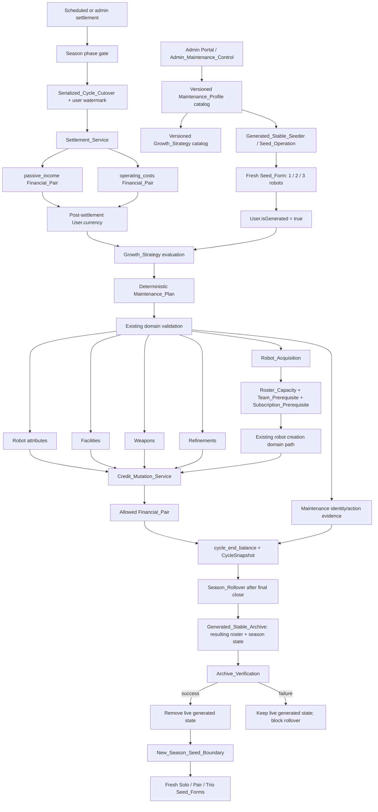

# Design Document: Generated_Stable Upgrade Strategies

**Status**: Proposed technical design — no application code is implemented by this document
**Feature**: `generated-stable-upgrade-strategies`
**Workflow**: Design-first, High-Level Design + Low-Level Design
**Notation**: Structured pseudocode for code-oriented sections
**Related architecture**: `User.isGenerated`, settlement serialization, `Credit_Mutation_Service`, `Season_Rollover` and archive services

## Overview

ACC has too few real users to sustain a healthy competitive pool. Existing auto-generated users and robots fill matchmaking slots but remain static after creation, so a real user can outpace the generated population after modest upgrades. The system needs a small, explicitly generated population that progresses through the same balance, validation, repair, accounting, and lifecycle boundaries as human users without pretending to be human-controlled.

This design introduces a `Generated_Stable_Maintenance_Program` with two deliberately separate policy layers. `Seed_Strategy` defines only the shape of a fresh starting roster: `Solo_Specialist` starts with exactly 1 robot, `Pair_Team` with exactly 2, and `Trio_Formation` with exactly 3. A versioned `Growth_Strategy` is assigned independently to each seed profile and owns the later mechanisms, triggers, eligibility rules, priorities, deterministic ordering, and pacing limits. A strategy may improve existing robots, facilities, weapons, and refinements, and may optionally permit `Robot_Acquisition` to buy additional robots and grow beyond the initial seed cardinality. No seed profile declares a final roster size.

Maintenance is balance-funded and runs only inside the serialized settlement `Maintenance_Window`, after `passive_income` and `operating_costs` and before closing-balance capture. Every charged action uses existing domain validation and `Credit_Mutation_Service`; a permitted `Robot_Acquisition` uses the existing robot-creation path, `robot_creation` taxonomy, roster-capacity/team/subscription prerequisites, reserve and affordability checks, and deterministic idempotency. Generated stables receive ordinary `Automatic_Repair`, never `Manual_Repair`, and receive no recurring stipend or catch-up grant.

At `Season_Rollover`, final competitive settlement—including committed growth—closes first. Each generated stable’s complete resulting roster and season-owned evidence is archived before live removal; archive failure preserves that live state and blocks rollover for the affected account. After successful rollover, new-season seeding creates fresh account/resource identities with fresh 1/2/3-robot seed forms and new `Growth_Strategy` assignments. Later roster growth belongs to the new season and never crosses the rollover boundary.

This document records alternatives, interfaces, data models, algorithms, correctness properties, testing, and documentation impact. It does not add schema, route, service, seed, or test code.

## Glossary and Naming Register

The specification uses exactly two naming registers. Domain concepts are `Pascal_Snake` and are defined below. Code artefacts retain their exact casing and are backticked, including Prisma fields, tables, enum values, files, and functions.

- **Generated_Stable** — a server-maintained account whose authoritative `User.isGenerated` value is `true`.
- **Human_Stable** — an account whose authoritative `User.isGenerated` value is `false`.
- **Generated_Stable_Maintenance_Program** — the server-owned program that seeds and economically progresses selected `Generated_Stable` accounts.
- **Maintenance_Profile** — a versioned server-owned assignment definition linking one `Seed_Strategy` to one `Growth_Strategy` and declaring subscriptions, reserve/cap settings, and seed assets.
- **Seed_Strategy** — an initial roster-shape definition used only by `Seed_Operation`; it does not define later roster size or a final roster limit.
- **Solo_Specialist** — the `Seed_Strategy` whose fresh seed form contains exactly 1 robot.
- **Pair_Team** — the `Seed_Strategy` whose fresh seed form contains exactly 2 robots.
- **Trio_Formation** — the `Seed_Strategy` whose fresh seed form contains exactly 3 robots.
- **Growth_Strategy** — a separately versioned post-seed policy containing ordered mechanisms, triggers, eligibility rules, priorities, deterministic tie-breakers, and pacing limits.
- **Growth_Mechanism** — one strategy-permitted kind of post-seed work: robot attribute, facility, weapon, refinement, or `Robot_Acquisition`.
- **Growth_Trigger** — a deterministic condition that decides whether a `Growth_Mechanism` is considered in a cycle.
- **Growth_Eligibility** — the target-state and prerequisite rules that a candidate must pass before selection.
- **Growth_Priority** — the ordered preference used to choose among eligible candidates.
- **Growth_Pacing** — the fixed-credit, percentage, cooldown, and action-count limits in a `Growth_Strategy`.
- **Robot_Acquisition** — a balance-funded purchase of an additional robot through the existing robot-creation domain path; it is optional per `Growth_Strategy`.
- **Seed_Operation** — the idempotent lifecycle operation that creates profile-defined generated accounts, fresh seed rosters, assignments, and starter assets.
- **Seed_Form** — the fresh season starting account/resource result produced by a `Seed_Strategy`, with exactly 1, 2, or 3 robots according to that strategy.
- **Opening_Balance_Boundary** — account or season initialization that is not a current-economy transaction.
- **Preparation_Phase** — a season phase in which settlement advances preparation only and performs no competitive financial close or maintenance.
- **Competitive_Phase** — a season phase in which normal battles, settlement, and generated maintenance may run.
- **Settlement_Components** — exactly one `passive_income` pair followed by one `operating_costs` pair for an applicable stable/cycle.
- **Maintenance_Window** — the interval after `Settlement_Components` and before `cycle_end_balance` capture.
- **Maintenance_Plan** — a deterministic zero-or-more list of affordable `Upgrade_Action` values for one generated stable and cycle.
- **Upgrade_Action** — one approved robot, facility, weapon, refinement, or `Robot_Acquisition` mutation selected by a `Maintenance_Plan`.
- **Reserve_Balance** — the non-spendable balance floor retained for mandatory future costs.
- **Spendable_Balance** — the post-settlement balance above `Reserve_Balance`.
- **Pacing_Cap** — a fixed-credit, percentage, action-count, cooldown, or action-specific limit that bounds progression.
- **Roster_Capacity** — the current permitted robot count after applicable roster-expansion/facility rules.
- **Team_Prerequisite** — the valid team state required by a profile or `Robot_Acquisition`.
- **Subscription_Prerequisite** — the valid Booking Office event subscription state required by a profile or `Robot_Acquisition`.
- **Automatic_Repair** — normal scheduled repair that may charge a generated stable.
- **Manual_Repair** — player-selected repair, which the maintenance program must reject.
- **Season_Rollover** — the archive, verification, purge/removal, reset, and next-season-opening operation.
- **Serialized_Cycle_Cutover** — the closing-cycle claim and user-ID watermark shared by scheduled and admin settlement.
- **Financial_Pair** — one `FinancialLedger` row and one paired `AuditLog` row with `eventType` `financial_transaction` for one credit mutation.
- **Maintenance_Identity** — the deterministic idempotency identity for one generated action, scoped to stable, season, cycle, assigned strategy version, and action identity.
- **Generated_Stable_Archive** — denormalized season evidence preserving a generated stable’s seed identity, resulting roster, balances, assignments, records, and maintenance evidence after live removal.
- **Admin_Maintenance_Control** — the authenticated admin surface for status, configuration, preview, seeding, disabling, and observation.
- **Maintenance_Observability** — settlement summaries, audit evidence, metrics, and alerts for generated maintenance.
- **Integrity_Signal** — an operator-visible record that a generated-maintenance invariant was violated or an invalid assignment was observed.
- **Skip_Reason** — a typed explanation for a valid no-op, such as `not_configured`, disabled profile, cooldown, capacity, or affordability.
- **Maintenance_Budget** — the monetary budget computed from post-settlement balance, `Reserve_Balance`, and applicable `Pacing_Cap` values.
- **Maintenance_Candidate** — a strategy-allowed target/action that has been evaluated for trigger, eligibility, validated cost, and deterministic ordering.
- **Settlement_Failure** — a failed closed stable/cycle outcome in which required settlement, maintenance, financial, or close evidence did not commit.
- **Archive_Verification** — the persistence check that must succeed before a generated stable’s live season state can be removed.
- **New_Season_Seed_Boundary** — the approved lifecycle point after successful rollover at which fresh `Seed_Form` values may be created.
- **Documentation_Contract** — the named guide and steering-file updates required to keep the implemented architecture discoverable.
- **Generated_Stable_Seeder** — the lifecycle component that validates and performs `Seed_Operation` for fresh generated accounts and resources.
- **Specialist_Depth** — a depth-first `Growth_Strategy` archetype that prioritizes the starting robot’s attributes, weapon, and refinement.
- **Team_Milestone** — a facility/weapon/team-oriented `Growth_Strategy` archetype for a complementary starting pair.
- **Formation_Breadth** — a `Growth_Strategy` archetype that may prioritize capacity and optional `Robot_Acquisition` for a broad starting formation.
- **Controlled_Hybrid** — a `Growth_Strategy` archetype that combines selected depth, milestone, and roster-expansion mechanisms under explicit ordering and caps.
- **Settlement_Service** — the existing serialized service path that applies settlement components, opens the maintenance window, and captures cycle-close evidence for scheduled and admin settlement.
- **Credit_Mutation_Service** — the existing service that atomically updates `User.currency` and writes the required financial/audit pair for a current-economy mutation.
- **Financial_Breakdown** — the typed stored facts that explain one charged financial mutation, including strategy, target, reserve/cap inputs, formula, precision, rounding, and final amount.

## Goals and Non-Goals

### Goals

- Preserve `User.isGenerated` as the only authoritative generated/human boundary.
- Define exactly three fresh seed profiles with initial cardinalities 1, 2, and 3, without coupling those starting shapes to a final roster size.
- Assign a separately versioned `Growth_Strategy` to each seed profile, allowing different ordered mechanisms, triggers, eligibility, priorities, and pacing.
- Support existing robot, facility, weapon, and refinement improvements, plus optional `Robot_Acquisition` that can grow a roster beyond its fresh seed cardinality.
- Run all generated growth inside settlement after `Settlement_Components` and before `cycle_end_balance` capture.
- Fund every growth action from the generated stable’s own post-settlement balance, protected by reserve, affordability, capacity, and pacing checks.
- Reuse the existing robot-creation domain validation, team/subscription prerequisites, and `Credit_Mutation_Service` for `Robot_Acquisition`.
- Prohibit `Manual_Repair`, recurring grants, direct balance writes, forbidden taxonomies, and off-cycle growth.
- Make every action deterministic and idempotent, with no growth identity or pending action crossing `Season_Rollover`.
- Archive the complete resulting generated roster and season-owned state before live removal, preserve live state on archive failure, and reseed fresh 1/2/3 starting forms only after the new-season boundary.
- Provide safe admin preview/configuration/disable/observability without an off-cycle upgrade button.

### Non-Goals

- Replacing `User.isGenerated` with a third identity type or classifying by username prefix.
- Giving generated stables a recurring stipend, performance catch-up grant, or admin-funded growth balance.
- Simulating human login behavior, player-selected shopping, or `Manual_Repair`.
- Changing battle formulas, rewards, matchmaking, league standings, event scheduling, or the existing human reset contract.
- Fixing a final roster count for any seed profile. A seed cardinality is a starting fact; a later roster may grow only when the assigned `Growth_Strategy` permits and funds `Robot_Acquisition`.
- Carrying live balances, robot IDs, strategy identities, actions, or other season-owned state across rollover.
- Reconstructing historical financial or repair amounts from current formulas, cached quotes, or purged live rows.

## Architectural Context and Invariants

1. **Identity boundary**: the mutating transaction re-reads `User.isGenerated` after acquiring its lock. Only an exact `true` value is admitted to maintained processing. A `Human_Stable` never receives generated actions or profile mutations; an invalid human assignment emits exactly one `Integrity_Signal` and preserves the assignment/business state. A generated account with no assignment remains under generic-generated-bot rules and receives exactly one `not_configured` skip without inferred configuration.
2. **Seed/growth separation**: `Seed_Strategy` determines only the fresh `Seed_Form` cardinality. `Growth_Strategy` is a distinct versioned object assigned through `Maintenance_Profile`; it may allow zero or more permitted mechanisms, including optional `Robot_Acquisition`. Current roster cardinality is a fact read by the policy, not a profile-defined final target.
3. **Profile catalog**: initial seeding accepts exactly `Solo_Specialist`, `Pair_Team`, and `Trio_Formation`. Each has an exact fresh seed count of 1, 2, or 3 and may select a different `Growth_Strategy` version. A profile must validate its assets, subscriptions, team prerequisites, caps, and policy before any account/resource is created.
4. **Growth mechanism boundary**: a policy can select robot attribute, facility, weapon, refinement, and optionally `Robot_Acquisition` actions. Acquisition is not a shortcut: it passes the existing robot-creation domain validation path, rechecks `Roster_Capacity`, `Team_Prerequisite`, and `Subscription_Prerequisite`, and is funded by a `robot_creation` `Financial_Pair`.
5. **Settlement order**: in `Competitive_Phase`, every applicable stable receives one `passive_income` pair and one `operating_costs` pair in that order. Only then does its `Maintenance_Window` open. Committed growth charges and target mutations precede `cycle_end_balance`, `CycleSnapshot`, and cycle completion. `Preparation_Phase` performs none of these current-cycle writes.
6. **Serialized cutover**: scheduled and admin settlement use the same `Settlement_Service`, cycle claim, user watermark, lock/re-read, maintenance, and close path. A generated stable created after the watermark is outside the closing cohort and cannot receive same-cycle maintenance.
7. **Financial boundary**: every charged growth action updates `User.currency` only through `Credit_Mutation_Service`, uses an allowed current-economy taxonomy, and produces one `Financial_Pair`. A seed opening balance is an `Opening_Balance_Boundary`, not an income event.
8. **Repair boundary**: normal scheduling may apply `Automatic_Repair` to generated robots. Maintenance never invokes or produces `Manual_Repair`, never funds growth from repair spend, and rejects `robots.repairQuoteCredits`, `battle_complete` payloads, and subtype-losing ledger totals as repair-spend sources.
9. **Plan boundary**: the policy evaluates the assigned strategy’s mechanism list, triggers, eligibility, priorities, and pacing against fresh locked facts. It may return zero actions with all applicable typed `Skip_Reason` values. A meaningful action has a positive validated charge and changes its target state.
10. **Identity boundary**: each selected action receives a `Maintenance_Identity` derived from stable, season, cycle, assigned `Growth_Strategy` version, action ordinal/kind/target, and immutable plan facts. A matching replay is a no-op; a changed owner, target, amount, taxonomy, or breakdown is a conflict.
11. **Lifecycle boundary**: final competitive settlement completes before `Season_Rollover`. Rollover archives each generated stable’s complete resulting roster and season-owned state, verifies persistence, and only then removes the corresponding live account/state. Archive failure retains that live generated state and blocks the lifecycle transition for it. Human stables continue through the existing human reset contract.
12. **Season isolation**: after successful rollover, the `New_Season_Seed_Boundary` creates fresh generated accounts/resources, new assignments, and new identities with exact 1/2/3 fresh seed forms. Subsequent roster growth is governed only by the new-season assignment; no prior balance, action, roster identity, or live state is reused.
13. **Reporting boundary**: historical generated-stable reporting reads `Generated_Stable_Archive`, not purged live state. Admin generated/human/all-user filters use only `User.isGenerated`, including for human usernames that resemble bot prefixes.

## Alternatives Analysis

### Alternative A — Static Generated Stables

Generated accounts remain at their initial seed state and never receive a maintained policy.

**Benefits**:

- No settlement integration, new financial evidence, or policy state.
- Lowest implementation and operational risk.

**Costs and risks**:

- Does not address the competitive problem; real users outgrow static opponents.
- Provides no controlled comparison between concentrated and broad starting cohorts.
- Leaves no balance-funded path for robot, facility, weapon, refinement, or roster growth.

**Conclusion**: Rejected because it does not deliver the required progression.

### Alternative B — Depth-First Robot Improvement

Each seed profile spends its plan only on attributes and weapons of the robots it already owns, prioritizing depth over breadth.

**Benefits**:

- Simple candidate set and predictable robot power curve.
- Strong fit for `Solo_Specialist`, whose single seed robot can become a clear specialist.
- Low roster and team/subscription complexity.

**Costs and risks**:

- Pair and trio populations remain strategically narrow and may lack event breadth.
- It cannot model roster expansion and cannot use additional robot opportunities when a stable has affordable capacity.
- It may concentrate spend too aggressively and produce brittle generated teams.

**Conclusion**: Useful as one independently assigned `Growth_Strategy`, but insufficient as the only policy.

### Alternative C — Facility/Weapon Milestone Growth

A policy saves for facility levels, weapon acquisition/refinement, and milestone combinations before returning to robot attributes.

**Benefits**:

- Produces visible strategic archetypes and durable account progression.
- Uses existing facility, weapon, and refinement validation/taxonomy paths.
- Works for pair/trio profiles that need team/event prerequisites or shared economic capacity.

**Costs and risks**:

- Milestone costs can starve robot depth for several cycles.
- A disabled or ineligible facility/weapon target can make a policy appear stalled.
- It does not expand the roster unless combined with `Robot_Acquisition`.

**Conclusion**: Supported as a distinct policy or ordered phase within a hybrid strategy.

### Alternative D — Robot-Acquisition/Roster-Expansion Growth

A policy permits `Robot_Acquisition` when the stable can satisfy current `Roster_Capacity`, team, subscription, reserve, and affordability requirements.

**Benefits**:

- Lets a 1-robot, 2-robot, or 3-robot seed become a broader competitor without hardcoding a final roster limit.
- Creates meaningful differentiation between concentrated and breadth-oriented populations.
- Reuses the real robot-creation domain path and `robot_creation` financial evidence.

**Costs and risks**:

- Adds ownership, capacity, team, subscription, starter-asset, and balance validation to the maintenance transaction.
- Additional robots increase future operating costs and automatic-repair exposure, so an over-eager policy can self-starve.
- Requires careful identity, archive, and new-season isolation so acquired robots do not leak across rollover.

**Conclusion**: Required as an optional mechanism. It must be disabled for policies that should remain depth-first and enabled only where the profile’s strategy explicitly declares it.

### Alternative E — Hybrid Growth Strategy (Recommended)

Each seed profile receives a versioned ordered policy that combines mechanisms according to role: depth, milestones, roster expansion, or a bounded combination. The policy itself—not the seed name—defines which actions are eligible and when.

**Benefits**:

- Preserves clear 1/2/3 starting identities while allowing independent post-seed behavior.
- Gives operators a single policy vocabulary for attributes, facilities, weapons, refinements, and optional acquisition.
- Supports gradual roster expansion without promising a final count and without requiring every profile to buy robots.
- Makes strategy differences deterministic, auditable, balance-funded, and testable.

**Costs and risks**:

- Requires a richer policy schema and more candidate validation.
- Needs explicit caps, cooldowns, capacity checks, and observability to prevent settlement work from growing without bound.
- Needs profile/version assignment discipline at rollover and for retries.

**Conclusion**: Recommended. A hybrid implementation can assign a depth-first strategy to `Solo_Specialist`, a milestone-focused strategy to `Pair_Team`, and a bounded breadth/hybrid strategy to `Trio_Formation`, while allowing later configuration changes without changing the meaning of the seed forms.

### Decision Matrix

| Criterion | Static | Depth-first | Milestone | Roster expansion | Hybrid policy |
|---|---:|---:|---:|---:|---:|
| Preserves exact fresh 1/2/3 seed forms | Yes | Yes | Yes | Yes | **Yes** |
| Allows post-seed roster growth | No | No | Optional | **Yes** | **Yes** |
| Supports facility/weapon/refinement planning | No | Limited | **Yes** | Optional | **Yes** |
| Uses only stable balance after settlement | N/A | Yes | Yes | Yes | **Yes** |
| Can assign different policies per seed profile | No | Yes | Yes | Yes | **Yes** |
| Requires acquisition prerequisite validation | No | No | Optional | **Yes** | **When enabled** |
| Keeps final roster unconstrained by seed shape | N/A | Yes | Yes | Yes | **Yes** |
| Operational tunability | Low | Medium | Medium | High | **High** |
| Recommendation | Reject | Partial | Partial | Required mechanism | **Choose** |

## Recommended Product Direction

### Program Model

Keep `Generated_Stable` as a `User` row with `isGenerated = true`. Keep generic generated bots working as they do today. The maintained program is an assignment-controlled overlay: only a generated row with a valid active-season `Maintenance_Profile` enters the maintained path. Missing assignments do not get inferred; they settle normally and receive a `not_configured` result.

A `Maintenance_Profile` contains the exact seed form, opening assets, subscriptions/team prerequisites, reserve/cap settings, and a reference to one versioned `Growth_Strategy`. It does not contain a final roster count. The profile’s `initialRobotCount` is used only by `Seed_Operation` and archive/reporting. The maintained controller always reads the current resulting roster and current `Roster_Capacity` before planning.

The profile catalog is server-owned and versioned. An assignment stores the profile key/version, the linked strategy key/version, active season, and assignment identity. Changes to policy create a new version and become effective through an explicit assignment/lifecycle boundary; an in-flight action never silently changes strategy inputs.

### Seed strategy variants

The three seed profiles are starting shapes only:

| Seed_Strategy | Fresh seed robots | Starting role | Required starting concerns | Growth meaning |
|---|---:|---|---|---|
| `Solo_Specialist` | 1 | Concentrated solo competitor | Solo event subscriptions and one valid robot loadout | Can remain depth-first or acquire additional robots only if its assigned `Growth_Strategy` enables it |
| `Pair_Team` | 2 | Complementary pair | Team/subscription prerequisites appropriate to the profile | Can prioritize shared milestones, role depth, or optional acquisition; no final count is implied |
| `Trio_Formation` | 3 | Broad starting formation | Three valid starting robots plus declared team/event setup | Can improve breadth, milestones, or optionally acquire more robots when capacity and policy allow |

`Seed_Operation` must create the exact fresh count in this table. That exact count is not a target or cap for later cycles. The archive records both the initial seed cardinality and the complete resulting roster at rollover.

### Growth-Policy Comparison and Assignment

| Growth_Strategy archetype | Ordered mechanisms | Best starting assignment | Robot acquisition | Intended behavior |
|---|---|---|---|---|
| Specialist_Depth | Robot attributes → weapon milestone → refinement | `Solo_Specialist` | Omitted by default | Build the starting robot’s depth; the roster can expand only if a later version explicitly enables acquisition |
| Team_Milestone | Facility → weapon → robot attributes → refinement | `Pair_Team` | Optional | Establish shared capacity and complementary equipment before considering broader roster investment |
| Formation_Breadth | Robot attributes → facility/capacity → `Robot_Acquisition` → weapon/refinement | `Trio_Formation` | Enabled only when declared | Grow beyond the three-robot seed when the strategy, capacity, team/subscription prerequisites, reserve, and budget all permit |
| Controlled_Hybrid | Profile-specific ordered mix of all supported mechanisms | Any profile | Explicitly configured | Balance depth, milestones, and roster expansion using deterministic triggers and action limits |

The recommended initial assignment is not a hardcoded product invariant; it is an example of independent policy selection. The catalog should assign different versioned strategies to the three seed profiles so their behavior is measurably distinct. Each strategy declares its own ordered mechanism list, `Growth_Trigger` rules, `Growth_Eligibility` rules, `Growth_Priority`, deterministic tie-breakers, cooldowns, caps, and whether `Robot_Acquisition` is allowed. A profile may omit acquisition entirely or permit it without specifying a final roster count.

### Upgrade and Acquisition Scope

Supported maintenance mechanisms are:

- robot attribute upgrades through the existing attribute validation and `attribute_upgrade` path;
- facility upgrades through the existing facility validation and `facility_upgrade` path;
- weapon purchases through the existing weapon purchase validation and `weapon_purchase` path;
- weapon refinements through the existing refinement validation and `weapon_refinement` path; and
- `Robot_Acquisition` through the existing robot creation validation and `robot_creation` path.

For `Robot_Acquisition`, the controller validates the actual price and starter asset requirements, re-reads current roster count and `Roster_Capacity`, validates any required `Team_Prerequisite` and `Subscription_Prerequisite`, confirms the assigned strategy includes the mechanism, and confirms reserve/cap affordability. Only after those checks pass does the existing robot-creation domain service create the robot and `Credit_Mutation_Service` charge the stable. A successful acquisition may increase the resulting roster above the fresh 1/2/3 seed cardinality. A failed validation makes no account, roster, team, subscription, balance, or evidence change.

The controller never creates a recurring income event to fund any mechanism. Automatic repairs and operating costs reduce the same balance available for subsequent growth. `Manual_Repair` is not an eligible candidate or fallback.

## Architecture



### Main Settlement and Lifecycle Sequence

```mermaid
sequenceDiagram
    participant S as Settlement Job
    participant C as Serialized_Cycle_Cutover
    participant F as Settlement_Service
    participant U as Stable transaction
    participant P as Growth_Strategy policy
    participant D as Existing domain services
    participant M as Credit_Mutation_Service
    participant X as Cycle close
    participant R as Season_Rollover
    participant A as Generated_Stable_Archive
    participant N as Seed_Operation

    S->>C: claim closing cycle and user watermark
    C-->>S: closing cycle identity
    S->>F: settle cycle
    F->>U: lock and re-read stable facts
    U->>M: apply passive_income pair
    U->>M: apply operating_costs pair
    U->>P: evaluate assigned strategy after settlement
    P-->>U: ordered zero-or-more Maintenance_Plan actions
    loop each selected action in deterministic order
        U->>D: validate target and actual charge
        alt Robot_Acquisition enabled
            D->>D: validate capacity/team/subscription and create robot
        end
        D->>M: apply allowed taxonomy mutation
        M-->>D: balance and Financial_Pair
        D-->>U: committed action result
    end
    U-->>F: closing balance and Maintenance_Observability
    F-->>S: stable results
    S->>X: write cycle_end_balance, snapshot, cycle_complete
    X-->>S: final competitive settlement complete
    S->>R: begin rollover only after final close
    R->>A: persist complete generated season state and resulting roster
    A-->>R: Archive_Verification
    alt archive fails
        R-->>S: retain live generated state; rollover incomplete
    else archive succeeds
        R->>R: remove corresponding live generated state
        R->>R: apply existing human reset contract to Human_Stable
        R-->>S: New_Season_Seed_Boundary
        S->>N: seed fresh Solo / Pair / Trio forms
        N-->>S: new IDs, opening state, assignments, 1/2/3 robots
    end
```

### Existing Settlement Placement

For an active competitive cycle, the implementation follows this order:

1. Read phase. In `Preparation_Phase`, advance preparation only and return without financial, maintenance, or close writes.
2. Claim `Serialized_Cycle_Cutover` and capture the user-ID watermark.
3. Process the closing cohort in stable ID order; lock each `User` row and re-read mutable balance, `User.isGenerated`, assignment, roster, capacity, facilities, inventory, team, subscriptions, and prior action identities.
4. Apply exactly one `passive_income` pair.
5. Apply exactly one `operating_costs` pair.
6. Open the `Maintenance_Window` only for a generated row with a valid enabled assignment and an in-scope closing identity.
7. Evaluate the assigned `Growth_Strategy` against the post-settlement balance and current resulting roster. Candidate acquisition uses current `Roster_Capacity`, `Team_Prerequisite`, and `Subscription_Prerequisite` facts.
8. Validate and apply selected actions in policy order. Each charged action uses one allowed taxonomy and one `Financial_Pair`; acquisition uses `robot_creation`.
9. Commit settlement components, target changes, acquisition resources, maintenance evidence, and closing facts as one stable outcome.
10. Capture `cycle_end_balance` and `CycleSnapshot` from the committed post-growth state, then mark the cycle complete.
11. Do not allow any route, cron hook, admin operation, or post-close hook to apply growth independently. A stable created after the watermark is outside this close.
12. On the final competitive cycle, begin `Season_Rollover` only after all required stable results and close evidence are complete. Archive each generated stable’s complete resulting roster before removal; then reach the new-season seed boundary and create fresh starting forms.

## Components and Interfaces

### Maintenance_Profile and Growth_Strategy Catalog

**Purpose**: Define exact fresh seed forms separately from versioned post-seed growth behavior.

```pascal
ENUM SeedStrategy
  Solo_Specialist
  Pair_Team
  Trio_Formation
END ENUM

ENUM GrowthMechanism
  Robot_Attribute
  Facility
  Weapon
  Refinement
  Robot_Acquisition
END ENUM

STRUCTURE GrowthStrategy
  key: String
  version: Integer
  enabled: Boolean
  mechanismsInOrder: List<GrowthMechanism>
  triggers: Map<GrowthMechanism, GrowthTrigger>
  eligibility: Map<GrowthMechanism, GrowthEligibility>
  priorities: Map<GrowthMechanism, Integer>
  tieBreakOrder: List<String>
  pacing: GrowthPacing
END STRUCTURE

STRUCTURE MaintenanceProfile
  key: String
  version: Integer
  enabled: Boolean
  seedStrategy: SeedStrategy
  initialRobotCount: Integer       // 1, 2, or 3 for the fresh Seed_Form only
  growthStrategyKey: String
  growthStrategyVersion: Integer
  initialCurrency: Credits
  hardReserveCredits: Credits
  reserveCycles: Integer
  maxSpendPerCycle: Credits
  maxSpendShare: Decimal           // inclusive range 0..1
  actionSpendCaps: Map<GrowthMechanism, Credits>
  maxActionsPerCycle: Integer
  upgradeCooldownCycles: Integer
  eventSubscriptions: Set<EventType>
  teamPrerequisites: TeamPrerequisites
  starterAssets: StarterAssets
END STRUCTURE

STRUCTURE ProfileAssignment
  stableId: UserId
  profileKey: String
  profileVersion: Integer
  growthStrategyKey: String
  growthStrategyVersion: Integer
  seasonNumber: Integer
  assignedAt: Timestamp
  enabled: Boolean
END STRUCTURE
```

**Catalog rules**:

- The initial seed catalog has exactly the three accepted strategy names and maps them to initial counts 1, 2, and 3. No other seed profile name is accepted for `Seed_Operation`.
- `initialRobotCount` is a seed fact only. There is no `targetRosterCount` field and no final roster limit derived from it.
- Each profile selects one independently versioned `Growth_Strategy`; profiles may share a strategy version only when explicitly configured, and they may select different mechanism lists and pacing.
- The assigned strategy must declare the mechanism, trigger, eligibility, priority, and pacing for every candidate kind it can select. `Robot_Acquisition` is omitted unless permitted by that strategy.
- Reserve, fixed caps, action-specific caps, initial currency, and every starter asset are non-negative; percentage caps are in `[0, 1]`; action counts are finite positive integers. A strategy that permits more than one meaningful action must explicitly configure an integer limit of at least 2.
- `Manual_Repair`, direct balance writes, recurring credits, and forbidden taxonomy values are never catalog mechanisms.
- A profile assignment on a human is invalid. A generated row without an assignment is not auto-assigned.

### GeneratedMaintenancePolicy

**Purpose**: Produce a deterministic plan without mutating the stable.

```pascal
INTERFACE GeneratedMaintenancePolicy
  FUNCTION planMaintenance(
    profile: MaintenanceProfile,
    strategy: GrowthStrategy,
    stableFacts: GeneratedStableFacts,
    postSettlementBalance: Credits,
    cycleNumber: Integer
  ): MaintenancePlan
END INTERFACE

STRUCTURE GeneratedStableFacts
  stableId: UserId
  isGenerated: Boolean
  profileAssignment: ProfileAssignment?
  seedStrategy: SeedStrategy?
  initialRobotCount: Integer?
  currentRobotCount: Integer
  rosterCapacity: Integer
  robots: List<RobotUpgradeFacts>
  facilities: List<FacilityUpgradeFacts>
  weapons: List<WeaponUpgradeFacts>
  refinements: List<RefinementUpgradeFacts>
  teamState: TeamState
  subscriptions: Set<EventType>
  automaticRepairSpentThisCycle: Credits
  operatingCostsThisCycle: Credits
  lastMaintenanceCycle: Integer?
  completedMaintenanceIdentities: Set<MaintenanceIdentity>
END STRUCTURE

STRUCTURE GrowthPacing
  hardReserveCredits: Credits
  reserveCycles: Integer
  maxSpendPerCycle: Credits
  maxSpendShare: Decimal
  actionSpendCaps: Map<GrowthMechanism, Credits>
  maxActionsPerCycle: Integer
  cooldownCycles: Integer
END STRUCTURE

STRUCTURE MaintenancePlan
  stableId: UserId
  seasonNumber: Integer
  cycleNumber: Integer
  profileKey: String
  profileVersion: Integer
  growthStrategyKey: String
  growthStrategyVersion: Integer
  maintenanceIdentity: String
  reserveCredits: Credits
  spendableBeforePlan: Credits
  totalBudget: Credits
  selectedActions: List<UpgradeAction>
  totalPlannedSpend: Credits
  skipReasons: List<SkipReason>
  planHash: String
END STRUCTURE

STRUCTURE UpgradeAction
  ordinal: Integer
  maintenanceIdentity: MaintenanceIdentity
  kind: GrowthMechanism
  robotId: RobotId?
  facilityType: FacilityType?
  targetAttribute: AttributeName?
  targetWeaponId: WeaponId?
  targetLevel: Integer?
  acquisitionTemplate: RobotTemplate?
  expectedRosterCount: Integer?
  expectedRosterCapacity: Integer?
  teamPrerequisiteHash: String?
  subscriptionPrerequisiteHash: String?
  validatedCharge: Credits
  taxonomy: String
  formulaVersion: String
  roundingRule: String
  reason: String
END STRUCTURE
```

The planner has no balance, domain, roster, or evidence side effects. It orders only candidates permitted by the assigned strategy. It calculates a `Maintenance_Budget`, validates the actual charge before selection, and returns a no-op with all relevant `Skip_Reason` values when triggers, eligibility, capacity, cooldown, reserve, or affordability blocks growth.

### Settlement Integration

**Purpose**: Keep settlement, generated growth, acquisition, financial evidence, and close facts in one serialized path.

```pascal
INTERFACE SettlementService
  FUNCTION settleCycle(options: SettlementOptions): SettlementResult

  FUNCTION settleStableWithMaintenance(
    transaction: DatabaseTransaction,
    stableId: UserId,
    cycleNumber: Integer,
    cutover: SerializedCutover,
    catalog: MaintenanceProfileCatalog
  ): StableSettlementResult
END INTERFACE

STRUCTURE StableSettlementResult
  stableId: UserId
  inClosingCohort: Boolean
  passiveIncome: FinancialComponentResult
  operatingCosts: FinancialComponentResult
  maintenance: MaintenanceResult
  closingBalance: Credits
END STRUCTURE

STRUCTURE MaintenanceResult
  attempted: Boolean
  skipped: Boolean
  skipReasons: List<SkipReason>
  actionsApplied: Integer
  robotAcquisitions: Integer
  totalSpent: Credits
  actionResults: List<MaintenanceActionResult>
END STRUCTURE
```

`settleStableWithMaintenance` locks and re-reads mutable facts, applies `Settlement_Components` in order, evaluates only the current assigned strategy, invokes existing domain services for each selected action, and commits one stable outcome. Scheduled settlement and admin bulk settlement call this same method. A domain, financial, evidence, or close failure rolls back the affected stable and prevents the cycle from being complete.

### Generated_Stable_Seeder

**Purpose**: Validate and create fresh profile-defined starting forms at an approved lifecycle boundary.

```pascal
INTERFACE GeneratedStableSeeder
  FUNCTION previewSeed(
    seasonNumber: Integer,
    requestedCounts: SeedCounts
  ): SeedPreview

  FUNCTION seedAtLifecycleBoundary(
    seasonNumber: Integer,
    requestedCounts: SeedCounts,
    mode: SeedMode
  ): SeedResult
END INTERFACE

STRUCTURE SeedCounts
  soloCount: Integer
  pairCount: Integer
  trioCount: Integer
END STRUCTURE

STRUCTURE SeedResult
  seasonNumber: Integer
  createdStableIds: List<UserId>
  forms: List<SeedFormResult>
  openingBalanceBoundaries: Integer
  skippedExistingOrdinals: Integer
END STRUCTURE
```

The seeder accepts exactly `Solo_Specialist`, `Pair_Team`, and `Trio_Formation` and creates the exact requested number of stables for each profile. Every fresh form has the profile’s exact initial robot count, valid starter assets, declared subscriptions/team state, and the selected versioned `Growth_Strategy`. It rejects mismatched counts, non-integers, negatives, inactive seasons, undefined profiles, invalid prerequisites, and unapproved lifecycle states before mutation. Its idempotency identity is `(season, profile, ordinal)`; successful retries preserve the original account/resources and create no duplicates.

Opening currency and starter assets are `Opening_Balance_Boundary` state. The seeder emits no `passive_income`, `battle_income`, `settlement_adjustment`, or recurring subsidy event. A new form created after the closing watermark belongs to a later cohort and receives no same-cycle maintenance. On a new season, all account/resource IDs and maintenance identities are fresh; later growth is handled only by the new assignment.

### Admin_Maintenance_Control

**Purpose**: Give administrators safe policy visibility and lifecycle controls without an off-cycle mutation path.

```pascal
INTERFACE GeneratedStableAdminControl
  FUNCTION getProgramStatus(): GeneratedProgramStatus
  FUNCTION previewSeed(request: SeedRequest): SeedPreview
  FUNCTION previewNextSettlement(request: MaintenancePreviewRequest): MaintenancePreview
  FUNCTION getMaintenanceAnalytics(request: MaintenanceAnalyticsRequest): MaintenanceAnalytics
  FUNCTION updateProgramConfig(request: ProgramConfigRequest): ProgramConfigResult
  FUNCTION requestSeed(request: SeedRequest): SeedResult
  FUNCTION disableProfile(profileKey: String): Void
END INTERFACE
```

The protected surface includes status, profile configuration, seed preview, seed confirmation, next-settlement dry-run, profile disable, and generated-only observability. Preview and dry-run are read-only. There is no `runUpgradeNow` operation; no admin request can charge, queue, retry, or apply a growth action outside `Maintenance_Window`. Seed confirmation is valid only at `New_Season_Seed_Boundary` or another explicitly approved lifecycle boundary.

All admin requests are authenticated, validated, audited once, and include actor, active season, profile/version, requested counts/caps or an explicit not-applicable value, operation, result, and failure category where applicable. Analytics classify by `User.isGenerated`, report zero values for absent events, and omit raw financial identities from player-facing output.

## Data Models

### Profile Assignment and Seed Evidence

The assignment stores both seed and growth identities so a later policy can be audited without confusing it with the starting form:

```pascal
STRUCTURE ProfileAssignmentRecord
  stableId: UserId
  seasonNumber: Integer
  profileKey: String
  profileVersion: Integer
  seedStrategy: SeedStrategy
  initialRobotCount: Integer
  growthStrategyKey: String
  growthStrategyVersion: Integer
  assignedAt: Timestamp
END STRUCTURE

STRUCTURE SeedFormResult
  stableId: UserId
  profileKey: String
  seedStrategy: SeedStrategy
  initialRobotIds: List<RobotId>
  initialRobotCount: Integer
  growthStrategyKey: String
  growthStrategyVersion: Integer
  openingCurrency: Credits
  starterAssetIds: List<String>
END STRUCTURE
```

`initialRobotCount` is immutable seed evidence. It is not used as a later roster ceiling. The current roster is read from live robot state and the archive stores the complete result.

### Generated_Stable_Archive

```pascal
STRUCTURE GeneratedStableArchive
  seasonNumber: Integer
  stableId: UserId
  profileKey: String
  profileVersion: Integer
  seedStrategy: SeedStrategy
  initialRobotIds: List<RobotId>
  initialRobotCount: Integer
  resultingRobotIds: List<RobotId>
  resultingRobotCount: Integer
  openingCurrency: Credits
  closingCurrency: Credits
  robots: List<ArchivedRobotState>
  facilities: List<ArchivedFacilityState>
  weapons: List<ArchivedWeaponState>
  refinements: List<ArchivedRefinementState>
  teamState: ArchivedTeamState
  subscriptions: Set<EventType>
  profileAssignment: ProfileAssignmentRecord
  growthStrategyKey: String
  growthStrategyVersion: Integer
  maintenanceRecords: List<MaintenanceRecord>
  competitiveRecords: ArchivedCompetitiveState
  economicRecords: ArchivedEconomicState
  maintenanceEvidence: ArchivedMaintenanceEvidence
  archivedAt: Timestamp
END STRUCTURE
```

`Generated_Stable_Archive` must preserve the profile, seed strategy, initial cardinality, complete resulting roster—including robots acquired through `Robot_Acquisition`—opening/closing balances, all season-owned domain state, growth strategy versions, and maintenance evidence. `Archive_Verification` succeeds before the corresponding live account and state are removed. The archive is the source for historical generated reporting after purge; it is not a source for current balance or future growth.

### Maintenance and Financial Records

```pascal
STRUCTURE MaintenanceRecord
  stableId: UserId
  seasonNumber: Integer
  cycleNumber: Integer
  profileKey: String
  profileVersion: Integer
  growthStrategyKey: String
  growthStrategyVersion: Integer
  maintenanceIdentity: MaintenanceIdentity
  planHash: String
  actionIdentities: List<MaintenanceIdentity>
  actionsApplied: Integer
  robotAcquisitions: Integer
  totalSpent: Credits
  reserveCredits: Credits
  openingBalance: Credits
  closingBalance: Credits
  status: MaintenanceStatus
  skipReasons: List<SkipReason>
  createdAt: Timestamp
END STRUCTURE

STRUCTURE FinancialBreakdown
  maintenanceIdentity: MaintenanceIdentity
  profileKey: String
  profileVersion: Integer
  growthStrategyKey: String
  growthStrategyVersion: Integer
  seasonNumber: Integer
  cycleNumber: Integer
  actionKind: GrowthMechanism
  targetIdentity: String
  reserveInputs: TypedReserveInputs
  capInputs: TypedCapInputs
  formulaVersion: String
  operationOrder: List<String>
  precision: String
  roundingRule: String
  finalAmount: Credits
END STRUCTURE
```

Every charged attribute, facility, weapon, refinement, or acquisition action creates exactly one `Financial_Pair` with a non-null shared `financialEventId`. The breakdown records the profile and strategy versions, season/cycle, target, reserve/cap inputs, formula, operation order, precision, rounding, and final amount. The ledger/audit pair is evidence of the one mutation; it never creates a second balance mutation. Seed opening state is not represented as a current-economy pair.

## Growth Budget, Reserve, and Pacing Rules

### Budget Calculation

The controller evaluates the post-settlement balance, not the opening or pre-settlement balance:

```pascal
FUNCTION calculateMaintenanceBudget(profile, facts, postSettlementBalance)
  ASSERT profile.hardReserveCredits >= 0
  ASSERT profile.maxSpendPerCycle >= 0
  ASSERT 0 <= profile.maxSpendShare AND profile.maxSpendShare <= 1

  reserve ← MAX(
    profile.hardReserveCredits,
    facts.operatingCostsThisCycle * profile.reserveCycles
  )
  reserve ← MAX(0, roundToCurrencyPrecision(reserve))
  spendable ← MAX(0, roundToCurrencyPrecision(postSettlementBalance - reserve))
  percentageCap ← roundDownToCurrencyPrecision(
    postSettlementBalance * profile.maxSpendShare
  )
  fixedCap ← roundToCurrencyPrecision(profile.maxSpendPerCycle)
  totalBudget ← MIN(spendable, fixedCap, percentageCap)

  RETURN MaintenanceBudget(
    reserve,
    spendable,
    MAX(0, totalBudget),
    profile.actionSpendCaps
  )
END FUNCTION
```

The controller rejects negative caps and percentages outside 0–100% before planning. Every selected action has a positive validated actual charge. Total spend cannot exceed `Spendable_Balance`, the fixed cap, the percentage cap, or any applicable action-specific cap. The closing balance must remain at least `Reserve_Balance` and never negative.

### Selection and Acquisition Rules

1. Lock the `User` row and re-read `User.isGenerated`; reject maintenance for a human. Preserve an invalid human assignment and emit exactly one `Integrity_Signal`.
2. For a generated row with no assignment, complete ordinary settlement and return one `not_configured` result without inferring a profile.
3. Validate active season, profile version, linked strategy version, enabled state, caps, and profile prerequisites. An invalid/disabled assignment returns typed skips and no growth mutation.
4. Read the strategy’s ordered mechanism list, triggers, eligibility, priorities, tie-breakers, cooldown, and action-count limit. Do not add a candidate merely because a seed profile has a name or a current roster count.
5. For existing robot/facility/weapon/refinement candidates, run the existing domain validation to get the actual cost and target transition.
6. For `Robot_Acquisition`, require that the assigned strategy enables it; re-read current count and `Roster_Capacity`; validate the robot creation path, `Team_Prerequisite`, `Subscription_Prerequisite`, starter loadout and team/subscription effects; obtain the actual `robot_creation` charge.
7. Reject candidates with invalid targets, zero/negative costs, unavailable capacity, failed team/subscription prerequisites, cooldown, ineligible state, or unaffordable charge. Accumulate every applicable typed `Skip_Reason`.
8. Sort candidates by strategy mechanism order, `Growth_Priority`, deterministic target identity, and stable tie-breaker. For identical inputs the order is identical regardless of invocation order.
9. Select meaningful actions until the strategy’s finite action-count limit or budget/cap is reached. The default policy selects at most one meaningful action; a strategy may select more only when it explicitly declares a finite integer limit of at least 2.
10. Construct `Maintenance_Identity` values from stable, season, cycle, strategy version, action ordinal/kind/target, and immutable cost/breakdown inputs. A plan with no trigger, no candidates, cooldown, zero budget, capacity block, or unaffordable candidates is a no-op and is not retried in the same cycle.
11. At execution, revalidate the actual cost and all acquisition prerequisites. If the amount differs from the immutable plan amount, fail closed and apply no action.
12. Execute in deterministic order through existing domain services and `Credit_Mutation_Service`. Acquisition can increase the current roster above its seed cardinality, but only within the current capacity and strategy rules.
13. Record the plan, actions, resulting roster, balances, skips, and financial identities. Do not carry the plan, pending action, or identity into a new season.

### Formal Maintenance Algorithm

```pascal
PROCEDURE executeMaintenanceWindow(transaction, stableId, cycle, cutover)
  stable ← lockAndReadUser(transaction, stableId)

  IF stable.isGenerated IS NOT true THEN
    IF hasMaintenanceAssignment(stable) THEN
      emitExactlyOneIntegritySignal(stableId, "human_selected_for_maintenance")
    END IF
    RETURN MaintenanceSkipped("human_stable")
  END IF

  IF stable.createdAfter(cutover.userWatermark) THEN
    RETURN MaintenanceSkipped("outside_closing_cohort")
  END IF

  assignment ← readAssignment(stableId, cycle.season)
  IF assignment IS NULL THEN
    RETURN MaintenanceSkipped("not_configured")
  END IF

  profile, strategy ← loadAndValidateAssignment(assignment)
  IF profile IS invalid OR strategy IS invalid OR profile.enabled IS false THEN
    emitMaintenanceIntegrityIfRequired(stableId, assignment)
    RETURN MaintenanceSkipped(allApplicableReasons(profile, strategy))
  END IF

  applySettlementComponentsInOrder(transaction, stable, cycle)
  facts ← lockAndReadMutableGrowthFacts(transaction, stableId)
  budget ← calculateMaintenanceBudget(profile, facts, readCurrency(stableId))
  plan ← planMaintenance(profile, strategy, facts, budget.balance, cycle.number)

  IF plan.hasCostMismatch OR plan.hasConflict THEN
    RAISE SettlementFailure(plan.failureReason)
  END IF

  FOR action IN plan.selectedActions DO
    ASSERT action.validatedCharge > 0
    validateActionAgainstCurrentFacts(transaction, action, stableId)

    IF action.kind = Robot_Acquisition THEN
      validateRosterCapacityTeamAndSubscription(transaction, action)
      createRobotThroughExistingDomainPath(transaction, action)
    ELSE
      applyExistingDomainUpgrade(transaction, action)
    END IF

    applyCreditMutationWithFinancialPair(transaction, action)
    writeMaintenanceEvidence(transaction, action)
  END FOR

  captureMaintenanceRecord(transaction, plan)
  RETURN MaintenanceCompleted(plan)
END PROCEDURE
```

**Preconditions**:

- the phase is `Competitive_Phase` and the stable is in the closing cohort;
- the caller owns the serialized stable transaction and has re-read all mutable facts;
- `Settlement_Components` have completed in order;
- the assigned profile and strategy are active, versioned, and valid;
- every selected action has a deterministic identity and a positive validated cost.

**Postconditions**:

- no human row is changed by generated maintenance;
- a missing assignment produces no generated mutation and one `not_configured` result;
- each selected action either commits its domain transition plus one financial pair or the whole stable outcome rolls back;
- a successful acquisition creates a valid additional robot only through the existing domain path and does not exceed current capacity/prerequisites;
- the closing balance includes all committed charges and remains non-negative and at least the reserve;
- a replay with unchanged immutable inputs produces no second charge or target mutation;
- no plan, identity, or state is carried across rollover.

**Loop invariants**:

- all previously applied actions were permitted by the assigned strategy and domain-validated;
- cumulative spend is no greater than the smallest applicable budget/cap;
- the current balance is non-negative and at least `Reserve_Balance`;
- every applied action has exactly one committed financial identity or the transaction has rolled back;
- the resulting roster contains only robots created by valid seed or permitted acquisition operations.

## No-Manual-Repair and Repair-Source Contract

- Normal scheduling may process `Automatic_Repair` for a generated stable in every event mode. Its spend remains evidenced by subtype-bearing `robot_repair` audit rows.
- The maintenance controller has no manual repair mechanism, never calls a manual repair endpoint/service, and never treats repair as a growth candidate or fallback.
- Repair spend cannot fund a growth action. `robots.repairQuoteCredits`, `battle_complete` payloads, and subtype-losing ledger totals are rejected as repair-spend sources and as growth funding inputs.
- A request to use any repair amount as growth funding, or any `Manual_Repair` request for maintenance, fails closed with no balance, roster, target, repair attribution, or financial evidence mutation.
- Automatic repair and growth spend remain separate financial/domain events. A robot acquired during maintenance has no synthetic repair history; a repair record never becomes a growth action.

## Idempotency, Atomicity, and Failure Handling

### Maintenance Identity and Transaction Boundary

A `Maintenance_Identity` includes the active season, cycle, stable ID, assigned profile/strategy version, action ordinal/kind/target, immutable amount, taxonomy, and breakdown hash. The identity is unique within the generated action evidence. A matching replay returns the original result. A replay with a changed owner, target, amount, taxonomy, or breakdown is rejected as an identity conflict.

For one stable/cycle, these commit or roll back together:

- one `passive_income` pair;
- one `operating_costs` pair;
- all selected existing upgrades and permitted acquisitions;
- all `Credit_Mutation_Service` balance updates and financial pairs;
- robot creation resources, team/subscription effects, and other domain state;
- maintenance records and cycle-close evidence.

A failure in any component, acquisition validation, domain update, financial pair, maintenance record, or close evidence rolls back the complete affected stable outcome. The cycle remains incomplete/failed and `Season_Rollover` cannot begin.

### Season Lifecycle

The final `Competitive_Phase` settlement completes income, operating costs, maintenance actions—including acquisitions—closing balance, and snapshot evidence before rollover. If final settlement is incomplete, rollover does not archive, purge, reset, or reseed.

For each generated stable, rollover first writes a complete `Generated_Stable_Archive`, including the initial seed form and full resulting roster, all acquired robots, profile and strategy versions, opening/closing balances, maintenance identities, economic/competitive records, and season-owned resources. `Archive_Verification` must succeed before live generated account/state removal. If it fails, the live generated state remains untouched, no human reset is applied to that account, and rollover remains retryable/incomplete.

Human accounts continue through the existing reset contract and retain `User.isGenerated = false`. After all generated archives/removals and human lifecycle work succeed, the new season reaches `New_Season_Seed_Boundary`. `Seed_Operation` creates fresh 1/2/3 `Seed_Form` results with new account/resource IDs, fresh opening state, new assignments, and new `Maintenance_Identity` values. No prior roster, balance, acquired robot, profile assignment, growth action, or live identity is reused. Later growth is possible only through the new assignment’s `Growth_Strategy`.

Concurrent/retried settlement, acquisition, rollover, archive, reset, and seeding operations are serialized by their identities and commit at most one successful result per applicable stable/cycle/action or `(season, profile, ordinal)`.

## Admin Controls and Maintenance_Observability

### Admin Controls

`Admin_Maintenance_Control` exposes:

- enabled/disabled status and active version for every `Maintenance_Profile` and linked `Growth_Strategy`;
- current fresh-seed counts and current resulting roster counts by profile;
- seed preview with stable/robot/team/subscription/resource counts and validation failures;
- next-settlement dry-run with ordered candidates, acquisition eligibility, reserve, caps, estimated charges, and `Skip_Reason` values;
- seed confirmation only at an approved lifecycle boundary;
- profile version/configuration and disable controls;
- generated-only economy, repair, maintenance, roster-growth, and archive analytics.

There is no off-cycle upgrade button. Disabling a profile prevents future maintenance actions but does not delete accounts, remove robots, alter balances, or retroactively change archive evidence. All admin operations are validated, authorized, and written to one admin audit entry. Non-admin callers receive access denial and no state change.

Below 1024px, the UI follows the responsive tab layout pattern in `.kiro/steering/frontend-standards.md`: sections stack vertically, no horizontal scrolling is required from 320px through 1023px, and every control has a touch area of at least 44 by 44 pixels. The surface must display resulting roster counts separately from fresh seed counts so an acquired robot is not misreported as a seed-cardinality violation.

### Maintenance_Observability Contract

For each settlement run and admin query, report zero-valued fields rather than omit them:

- generated stables considered, upgraded, skipped, and invalid;
- counts for `Solo_Specialist`, `Pair_Team`, and `Trio_Formation` by seed form and resulting roster range;
- counts for every `Growth_Mechanism`, including `Robot_Acquisition`;
- total Credits spent, acquisition spend, reserve-blocked count, capacity-blocked count, invalid-profile count, and identity-conflict count;
- opening and closing balances, resulting roster counts, duration in milliseconds, and settlement status;
- integrity alerts by violation category.

Analytics scopes use only `User.isGenerated`: generated-only includes all matching `true` users, human-only includes all matching `false` users, and all-user includes both. A human username that resembles a bot prefix remains in human-only results. Player-visible output omits raw `financialEventId`, audit payloads, and internal identities.

### Alerts and Safeguards

Raise an administrator-visible alert for:

- human selection or a human assignment;
- invalid/missing profile or strategy version where an assignment exists;
- direct `User.currency` writer, off-cycle charge, or off-cycle action;
- `Manual_Repair` request or repair-source misuse;
- acquisition capacity/team/subscription prerequisite failure when a strategy selected acquisition;
- reserve, cap, affordability, negative/zero charge, cost mismatch, or identity conflict;
- duplicate identity or duplicate `(season, profile, ordinal)` seed;
- population, seed-cardinality, resulting-roster, or archive completeness violation;
- failed settlement, archive verification, lifecycle boundary, or unauthorized admin request.

An invariant violation halts the affected operation before completion, rolls back partial business state, leaves no partial evidence, and identifies every applicable category.

## Correctness Properties

The following 22 universal properties are design obligations for unit, property-based, integration, and heavy tests. They are not claims that tests already exist.

### Identity and Lifecycle

### Property 1: Generated-only mutation

**Validates: Requirements 1.1, 1.2, 1.4, 7.5**

For every maintenance attempt, the locked current `User.isGenerated` value must be exactly `true`; a human receives no generated mutation, and an invalid human assignment emits exactly one integrity signal while preserving assignment and business state. Analytics classification is independent of username.

### Property 2: Missing or invalid assignment is inert

**Validates: Requirements 1.3, 1.4, 1.5, 3.7, 7.7**

A generated stable with no assignment receives ordinary settlement and exactly one `not_configured` skip with no inferred profile. An assigned but invalid/disabled profile returns typed skip/integrity results and no growth mutation. A human assignment is never repaired by inference.

### Property 3: Seed cardinality and independent growth assignment

**Validates: Requirements 2.1, 2.2, 2.3, 2.4, 2.5, 7.9**

Successful fresh seeding accepts only `Solo_Specialist`, `Pair_Team`, and `Trio_Formation`, creates exactly 1, 2, or 3 initial robots respectively, creates valid declared assets/prerequisites, and assigns a separately versioned `Growth_Strategy`. The seed cardinality is recorded as starting evidence only; the strategy may permit or omit any supported mechanism, including `Robot_Acquisition`, without declaring a final roster size.

### Property 4: Seed idempotency and opening boundary

**Validates: Requirements 2.4, 2.5, 2.6, 2.10, 6.6, 6.8**

Repeating `(season, profile, ordinal)` preserves the original fresh form and all resources without duplicates. Invalid requests create no account/resource. Opening currency/assets are `Opening_Balance_Boundary` state with no current-economy income, subsidy, or settlement-adjustment event.

### Property 5: Preparation no-op

**Validates: Requirements 3.6, 8.2**

For every `Preparation_Phase` settlement input, no `Settlement_Components`, growth action, acquisition, financial evidence, cycle-close evidence, competitive increment, or balance mutation is produced by settlement.

### Property 6: Final settlement, archive-before-removal, and fresh reseeding

**Validates: Requirements 6.1, 6.2, 6.3, 6.4, 6.5, 6.6, 6.7, 6.8, 8.3, 8.4**

Final settlement completes all components, permitted growth/acquisition, closing balance, and snapshot before rollover. Each generated stable’s archive contains its initial seed and complete resulting roster before live removal; archive failure preserves live state and prevents a human reset for that account. Humans use the existing reset contract. Successful new-season reseeding creates fresh 1/2/3 seed forms with new IDs, balances, resources, assignments, and identities, and historical reporting reads the archive.

### Budget and Pacing

### Property 7: Reserve safety

**Validates: Requirements 4.1, 4.2, 8.1**

For every plan, `Reserve_Balance` is non-negative, `Spendable_Balance = max(0, postSettlementBalance - reserve)`, and the closing balance after planned spend is at least reserve using currency precision.

### Property 8: No overdraft and acquisition affordability

**Validates: Requirements 2.7, 2.8, 4.2, 8.1**

No selected action, including `Robot_Acquisition`, can make `User.currency` negative or below reserve. An acquisition is selected only when its actual robot-creation charge is affordable after settlement and all capacity/team/subscription prerequisites pass.

### Property 9: Cap safety

**Validates: Requirements 4.3, 8.1**

Total action spend never exceeds spendable balance, fixed cap, percentage cap, or every applicable action-specific cap. Negative caps and percentages outside 0–100% are rejected before mutation.

### Property 10: Action-count and roster-growth pacing

**Validates: Requirements 4.4, 8.1, 8.4**

The number of meaningful actions is no greater than the assigned strategy’s finite action limit; the default limit is at most one, and more than one is permitted only when explicitly configured. A resulting roster can exceed its seed cardinality only through a permitted, validated, funded `Robot_Acquisition`; no test assumes a fixed final count.

### Property 11: Deterministic versioned plan

**Validates: Requirements 2.2, 2.7, 2.9, 4.4, 4.7, 8.1, 8.2**

Equal profile version, strategy version, cycle, stable facts, current roster/capacity, post-settlement balance, and candidate facts produce the same ordered mechanisms, actions, costs, skip reasons, plan hash, and identities regardless of invocation time or order, including tied candidates.

### Property 12: No-op and settlement-only progression

**Validates: Requirements 2.7, 2.9, 4.5, 4.6, 7.2, 8.1, 8.2**

Disabled profiles, zero budget, cooldown, empty candidates, invalid/unauthorized targets, capacity blocks, ineligible candidates, and unaffordable candidates return typed no-op results without mutation or same-cycle retry. No recurring grant, catch-up grant, negative-cost action, admin-funded balance, or off-cycle action is possible.

### Financial and Atomicity

### Property 13: Domain validation and pair conservation

**Validates: Requirements 2.8, 5.1, 5.2, 8.1, 8.3**

Every charged action passes domain validation before charging. Attribute, facility, weapon, refinement, and permitted acquisition actions use exactly their allowed taxonomy; each produces exactly one ledger row and one matching `financial_transaction` audit row sharing one non-null `financialEventId`, with breakdown facts matching the immutable action. Acquisition uses the existing robot-creation path.

### Property 14: No direct balance writer or forbidden taxonomy

**Validates: Requirements 5.3, 7.7, 8.1, 8.3**

Maintenance changes `User.currency` only through `Credit_Mutation_Service`, emits no `subscription_cost`, `prestige_award`, or `settlement_adjustment`, and rejects/alerts on direct balance writers or off-cycle mutations.

### Property 15: Action and lifecycle retry idempotency

**Validates: Requirements 2.9, 5.6, 6.7, 6.8, 8.2, 8.3, 8.4**

Replaying a successful stable/cycle/action, acquisition, settlement, archive, removal, reset, or seed identity with unchanged immutable inputs leaves balance, roster, domain state, evidence, and IDs unchanged and creates no duplicate result. New seasons use new identities and resources rather than prior-season action or live state.

### Property 16: Immutable identity conflict rejection

**Validates: Requirements 4.8, 5.7, 8.1, 8.2**

Reusing a `Maintenance_Identity` with changed owner, target, amount, taxonomy, strategy/profile version, or breakdown fails closed and leaves the balance, roster, target state, configuration, and prior evidence unchanged.

### Property 17: Stable transaction atomicity

**Validates: Requirements 3.3, 3.7, 5.8, 7.7, 7.10, 8.3**

If any settlement component, selected upgrade/acquisition, prerequisite validation, domain update, financial pair, maintenance record, or cycle-close evidence fails, all affected balance, settlement, roster, target, and evidence changes roll back together; the cycle remains incomplete and invalid admin confirmation changes nothing.

### Property 18: Maintenance-window closing inclusion

**Validates: Requirements 3.1, 3.2, 6.1, 8.3**

For a closing-cohort generated stable, `cycle_end_balance` and `CycleSnapshot` equal the balance after ordered settlement components and all committed growth actions, including acquisitions. The maintenance window never opens before both components or after closing capture.

### Property 19: Shared settlement path and cutover exclusion

**Validates: Requirements 3.4, 3.5, 3.6, 5.3, 8.2, 8.3**

Scheduled and admin settlement invoke the same ordering/atomicity path; no post-close writer exists. A stable created after the user watermark receives no same-cycle maintenance and cannot change published close evidence. Preparation remains a no-op.

### Repair and Source Boundaries

### Property 20: No manual repair

**Validates: Requirements 5.4, 5.5, 7.7, 8.1**

No maintained generated stable can produce `Manual_Repair` or a manual-repair financial breakdown. A maintenance request containing manual repair is rejected, rolled back, and alerted without growth or repair evidence.

### Property 21: Automatic repair separation

**Validates: Requirements 5.4, 5.5, 8.1, 8.3**

Normal scheduled `Automatic_Repair` remains separate in `robot_repair` evidence and does not become a growth action, acquisition funding source, or bye/reward mutation. Repair spend is never read from a quote, `battle_complete`, or subtype-losing ledger total.

### Property 22: Source rejection, admin safety, and observable invariants

**Validates: Requirements 5.5, 7.1, 7.2, 7.3, 7.4, 7.5, 7.6, 7.7, 7.8, 7.9, 7.10, 8.1, 8.2, 8.4, 8.5, 8.6**

Forbidden repair-source selection, invalid admin authorization/input, off-cycle action, human/generated classification violation, cap/reserve violation, population/roster invariant violation, and lifecycle-boundary violation preserve state, produce categorized alerts/audit evidence, and expose no raw financial identities. Valid admin previews are read-only; valid boundary seeding succeeds; analytics report zero-valued fields; the responsive surface works from 320px to 1023px with vertical scrolling and 44px targets; final verification records each aggregate check as passed, failed, or blocked with a reason.

## Error Handling

| Scenario | Required behavior | Operator signal |
|---|---|---|
| Undefined seed profile or invalid initial count | Reject before account/resource mutation; accept only exact 1/2/3 profile forms | Seed validation error and admin audit |
| Invalid profile, strategy version, cap, trigger, eligibility, or prerequisite | Preserve catalog/live state; do not plan or mutate growth | Configuration failure category |
| Human selected or human has assignment | Skip generated maintenance, preserve assignment/business state, emit exactly one integrity signal | High-severity identity alert |
| Generated account has no assignment | Complete ordinary settlement, return exactly one `not_configured`, do not infer | Skip metric |
| Disabled profile/strategy | Complete safe ordinary settlement, no growth, typed skip | Disabled-profile metric |
| Preparation-only settlement | Advance preparation only; write no current-cycle settlement, growth, financial, or close evidence | Phase metric |
| Zero budget, cooldown, empty candidate set, invalid target, ineligible/unauthorized candidate | Return no-op with every applicable `Skip_Reason`; do not mutate or retry in the same cycle | Skip counts |
| `Robot_Acquisition` not enabled by strategy | Reject candidate and preserve balance/roster | Mechanism-disabled skip |
| Acquisition has insufficient `Roster_Capacity` | Reject candidate without creating a robot or charging | Capacity-blocked metric |
| Acquisition fails team or subscription prerequisite | Reject candidate without resource, balance, or evidence mutation | Prerequisite failure metric |
| Acquisition domain validation fails | Roll back the affected stable transaction; no charge or robot | Domain validation alert |
| Candidate charge is zero, negative, unaffordable, or exceeds cap/reserve | Reject candidate; preserve balance/target/roster | Budget violation alert |
| Validated actual amount differs from immutable plan amount | Fail closed; roll back plan and do not auto-retry | Cost-mismatch alert |
| Forbidden repair source or repair amount used to fund growth | Reject operation; create no charge, growth, repair attribution, or financial evidence | Repair-boundary alert |
| `Manual_Repair` requested by maintenance | Reject and roll back; no manual repair evidence | Manual-repair alert |
| Financial pair, domain update, maintenance record, or cycle-close write fails | Roll back settlement components, balance, target/roster, and evidence; leave cycle incomplete | Financial/reconciliation alert |
| Matching `Maintenance_Identity` replay | Return original result and make no second mutation | Idempotency metric |
| Changed identity owner/target/amount/taxonomy/breakdown | Reject conflict without mutation | Identity-conflict alert |
| Stable created after closing watermark | Exclude from closing cohort and same-cycle maintenance | Cutover exclusion metric |
| Final competitive settlement incomplete | Do not begin rollover; preserve retryable live state | Lifecycle transition alert |
| Generated archive persistence or verification fails | Retain complete live generated state; no partial removal or human reset; keep rollover incomplete | Archive alert |
| Human rollover candidate | Apply existing human reset contract and preserve `User.isGenerated = false` | Normal lifecycle evidence |
| New-season seed outside approved boundary | Reject before mutation and audit failure | Boundary alert |
| New-season seeding retry/concurrency | Commit at most one `(season, profile, ordinal)` result; never reuse old IDs/state | Seed idempotency metric |
| Direct `User.currency` writer, off-cycle charge, or off-cycle growth | Halt/reject before completion, roll back partial state, alert | Integrity alert |
| Population, seed cardinality, resulting-roster, or archive invariant violation | Halt affected operation, roll back partial business state, report every category | Population alert |
| Unauthorized admin request | Withhold protected action and change no state | Authorization audit |
| Invalid admin input or preview/dry-run mutation | Reject and preserve configuration/population/balance/settlement state | Admin audit failure |
| Analytics has no event | Return all defined counters/totals as zero; omit raw identities | Normal zero result |
| Settlement duration or candidate count exceeds threshold | Keep work bounded, fail affected stable safely, and do not mark cycle complete | Performance alert |

Errors propagate through the existing service/error-handler conventions. Route handlers parse and validate inputs, invoke the service, and do not reinterpret financial, identity, or lifecycle errors.

## Testing Strategy

### Unit Tests

- Validate exactly the three seed profiles, fresh counts 1/2/3, invalid count/profile/season/team/subscription cases, opening-boundary classification, and `(season, profile, ordinal)` idempotency.
- Validate versioned `Growth_Strategy` definitions with at least two distinct ordered mechanism lists, enabled/omitted `Robot_Acquisition`, trigger/eligibility/priority/tie-break rules, cooldowns, and action limits.
- Test budget and cap calculations at zero, configured maximum, and one-unit-over-maximum values; currency precision; reserve; fixed/percentage/action caps; and actual-charge mismatch.
- Test candidates for robot attributes, facilities, weapons, refinements, and acquisition. Acquisition tests must cover existing creation validation, capacity, team/subscription prerequisites, `robot_creation`, resulting roster growth beyond seed cardinality, and no final roster assumption.
- Test all typed no-op conditions: missing assignment, disabled profile, zero budget, cooldown, empty candidates, invalid target, capacity block, failed prerequisite, ineligibility, and unaffordability.
- Test deterministic ordering with tied candidates and different invocation order; identity construction; matching replay; conflicts; no mutation on rejection.
- Test human/generated separation by `User.isGenerated`, no direct writer/taxonomy, no manual repair, repair-source rejection, and one integrity signal.
- Test admin authorization/validation, preview/dry-run immutability, audit fields, disable behavior, boundary-only seed confirmation, analytics zero fields/scopes, and no `runUpgradeNow` operation.

### Property-Based Testing

Use backend Jest and `fast-check` generators for:

- valid/invalid profile and strategy catalogs with each mechanism combination and both acquisition-enabled and acquisition-omitted policies;
- balances around reserve and cap boundaries, operating/automatic-repair costs, roster counts/capacities, team/subscription facts, and actual acquisition costs;
- candidate sets with tied priorities, invalid targets, cooldowns, ineligible actions, capacity blocks, cost mismatches, and identity conflicts;
- mixed human/generated accounts, including bot-like human usernames;
- preparation/competitive phases, watermark positions, lifecycle boundaries, final-cycle failures, archive failures, and retry/concurrency sequences;
- three-cycle multi-profile growth where at least one permitted acquisition expands a roster beyond its seed cardinality without assuming any final count.

Properties 1–22 must be exercised. Every generated case must preserve reserve, non-negative balance, cap/action limits, deterministic ordering, idempotency, season isolation, no-manual-repair, source boundaries, and archive/reseed semantics.

### PostgreSQL Integration Tests

- Verify scheduled and admin settlement use identical `passive_income` → `operating_costs` → `Maintenance_Window` ordering and stable transaction atomicity.
- Verify all permitted growth taxonomies and acquisition produce exactly one financial pair with complete breakdowns, and that `cycle_end_balance` includes committed growth.
- Verify acquisition uses current capacity/team/subscription prerequisites and can create a resulting roster larger than the fresh seed only when enabled and affordable.
- Verify forced financial/domain/evidence failures leave no partial balance, roster, robot, growth action, or financial records.
- Verify post-watermark seeds receive no same-cycle maintenance, final settlement occurs once, rollover archives before removal, archive failure retains live state, human reset is unchanged, and fresh post-rollover seeds have new IDs and 1/2/3 initial robots.
- Verify archive-backed historical reporting works after live generated state is purged and never depends on purged rows.
- Verify manual repair/source rejection and automatic-repair separation.
- Verify admin authorization, validation, audit, analytics scopes, preview immutability, profile disable, boundary confirmation, and no off-cycle mutation.

### Heavy and Operational Tests

- Run at least 3 consecutive cycles for each of the three seed strategies with distinct assigned growth policies.
- Include a depth-first policy, a milestone policy, and a policy with permitted `Robot_Acquisition`; verify at least one acquisition grows a roster beyond its initial 1/2/3 seed cardinality.
- Verify every spend remains within budget, balances never become negative, all robot additions use valid acquisition, no duplicate `Maintenance_Identity` occurs across retries/cycles, and the generated-stable account count remains unchanged except for approved `Seed_Operation` operations; no fixed final roster count is assumed.
- Exercise scheduled/admin races, disabled/invalid profiles, cap/reserve violations, human selection, direct-writer/off-cycle alerts, final settlement, archive failure, rollover retry, fresh reseeding, and archive-backed reporting.
- Measure settlement duration against the configured performance threshold and verify bounded candidate/action work.
- Render `Admin_Maintenance_Control` at 320px, 768px, and 1024px; assert vertical stacking below 1024px, no horizontal overflow, vertical-scroll operation, and 44px touch targets.
- Run all aggregate verification criteria from `requirements.md` and record each as passed, failed, or blocked with a reason for every blocked check.

### Coverage Expectations

Critical economy, settlement, acquisition, lifecycle, authorization, and admin-control code should meet the project’s critical-function coverage target. Property tests must exercise both omitted and enabled acquisition policies and the transition from initial seed cardinality to a larger resulting roster.

## Performance Considerations

- Process generated stables in stable-ID order and the existing bounded settlement pages.
- Load profile/strategy definitions and generated assignments in batches; do not load all battle history.
- Bound candidate evaluation and action count per stable using strategy pacing; acquisition validation must not trigger unbounded team/subscription queries.
- Reuse settlement facts, but re-read mutable balance, roster capacity, team, subscription, and target facts after the user lock.
- Return aggregate totals for full scheduler runs and bounded per-stable details for admin previews/pages.
- Measure candidate count, acquisition validation time, domain write count, financial pair count, transaction duration, and total maintenance duration separately.
- If the generated population becomes too large for the settlement threshold, disable a profile or reduce strategy action limits rather than allowing unbounded work.

## Security Considerations

- Admin configuration, preview confirmation, seeding, disabling, and analytics require existing admin authentication, schema validation, rate limiting, and audit logging.
- Never accept `isGenerated`, profile assignment, strategy version, acquisition price, or reserve result as client authorization input; resolve and validate server-side inside the transaction.
- Validate acquisition ownership/prerequisites through the existing robot-creation domain path; do not expose a player-facing route shortcut.
- Use `User.isGenerated`, never username prefixes, for mutation and analytics scope.
- Keep `User.currency`, financial identities, audit payloads, and internal strategy details out of player-visible responses.
- Prevent humans from inheriting generated assignments; fail closed and alert on mismatch.
- Treat strategy/profile changes as privileged balance-affecting policy: version them, audit them, and activate them at a documented boundary.
- Preserve the existing repair security boundary: no manual repair in maintenance and no alternate repair-spend source.

## Dependencies

- Existing `User.isGenerated` field and generated-account lifecycle behavior.
- Existing `Settlement_Service`, serialized cycle cutover, user watermark, `CycleSnapshot`, and cycle-close evidence.
- Existing `Credit_Mutation_Service`, `FinancialLedger`, paired `financial_transaction` `AuditLog`, allowed transaction taxonomy, and typed `Financial_Breakdown` validation.
- Existing robot attribute, facility, weapon, refinement, and robot-creation domain services.
- Existing `Roster_Capacity`/roster expansion rules, Booking Office subscriptions, team validation, and starter asset creation.
- Existing `Automatic_Repair` scheduling/repair evidence and repair-source boundary.
- Existing `Season_Rollover` archive/purge, human reset, archive tables, and generated-user classification.
- Existing admin portal, cycle controls, audit logging, economy/repair analytics, and responsive frontend standards.
- Backend Jest 30, `fast-check`, PostgreSQL integration/heavy tiers, and frontend component testing.

## Recommended Decision

Implement Alternative E: a balance-funded, settlement-integrated program with distinct seed and growth policy layers:

1. accept exactly `Solo_Specialist`, `Pair_Team`, and `Trio_Formation` as fresh seed profiles with exactly 1, 2, and 3 initial robots;
2. treat those counts as seed evidence only, never as final roster size or a final roster limit;
3. assign a separately versioned `Growth_Strategy` to each seed profile;
4. define ordered mechanisms, triggers, eligibility, priorities, tie-breakers, cooldowns, caps, and action limits in the strategy;
5. support existing robot, facility, weapon, and refinement growth and make `Robot_Acquisition` explicitly optional per strategy;
6. run acquisition through existing robot-creation validation, current roster capacity/team/subscription prerequisites, `Credit_Mutation_Service`, `robot_creation`, reserve, affordability, and deterministic settlement-only idempotency;
7. make roster growth beyond the fresh seed cardinality an allowed result only of a permitted successful acquisition, with no fixed final count assumption;
8. apply one ordered settlement transaction with `passive_income`, `operating_costs`, maintenance, acquisition/domain evidence, and close capture;
9. prohibit recurring grants, direct balance writes, forbidden taxonomies, repair-funded growth, and `Manual_Repair`;
10. archive the complete resulting roster and season-owned state before generated live removal, preserve live state if archive verification fails, retain the human reset contract, and reseed fresh 1/2/3 forms with new state only after the new-season boundary; and
11. provide admin preview, configuration, disable, generated-only observability, mobile-safe UI, and final aggregate verification without an off-cycle upgrade action.

The first deployment should assign visibly different policies—such as `Specialist_Depth`, `Team_Milestone`, and `Formation_Breadth`—to the three seed profiles, then use settlement metrics to tune versions. A later policy may change those assignments or enable acquisition for a previously depth-only profile, but every change remains versioned, balance-funded, capped, settlement-only, and season-isolated.

## Requirements Traceability and Documentation Impact

### Requirements Traceability

| Criterion | Design coverage |
|---|---|
| R1.1 | Architectural Context and Invariants 1; `executeMaintenanceWindow`; Security Considerations — re-read `User.isGenerated` inside the mutating transaction and never classify by username. |
| R1.2 | Identity boundary; Property 1 — human accounts receive no generated action, growth mutation, or profile change while ordinary settlement remains available. |
| R1.3 | Architectural Context 1; Property 2; Error Handling — missing assignment produces ordinary settlement plus exactly one `not_configured`, with no fallback. |
| R1.4 | Identity boundary, Alerts and Safeguards, Properties 1 and 2 — human assignment emits exactly one integrity signal and preserves assignment/business state. |
| R1.5 | Program Model and Property 2 — unassigned generated rows remain generic-generated bots and are never inferred into a maintained assignment. |
| R2.1 | Seed strategy variants, catalog rules, `Generated_Stable_Seeder`, Property 3 — exactly the three accepted seed profiles with fresh counts 1/2/3 and no other initial profile name. |
| R2.2 | `Maintenance_Profile`/`Growth_Strategy` interfaces, growth-policy comparison, Property 3 and Property 11 — independent strategy versions own ordered mechanisms, triggers, eligibility, priorities, and pacing; seed strategy has no final roster definition. |
| R2.3 | Upgrade and acquisition scope, `GrowthMechanism`, Property 3, Property 10, Testing Strategy — all five growth mechanism kinds are supported, acquisition is optional per profile, and no profile must purchase robots or fix final count. |
| R2.4 | `Generated_Stable_Seeder`, SeedFormResult, Property 3 — successful operation creates requested stable counts, exact fresh seed cardinalities, valid declared resources/prerequisites, and assigned strategy versions. |
| R2.5 | Seeder idempotency identity, Property 4, Property 15 — same `(season, profile, ordinal)` preserves the first successful account/resource set without duplicates. |
| R2.6 | Opening boundary, Financial Records, Property 4 — opening currency/assets create no `passive_income`, `battle_income`, `settlement_adjustment`, or recurring subsidy. |
| R2.7 | Settlement placement, Selection and Acquisition Rules, formal algorithm, Properties 8, 10, 11, and 12 — strategy evaluation occurs after settlement, may no-op, and runs only inside the maintenance window. |
| R2.8 | Upgrade and acquisition scope, `GeneratedMaintenancePolicy`, `executeMaintenanceWindow`, Properties 8 and 13, Error Handling — acquisition uses existing creation validation, capacity/team/subscription prerequisites, reserve/affordability, `Credit_Mutation_Service`, and `robot_creation` only during settlement. |
| R2.9 | Maintenance identity model, transaction boundary, Properties 11, 15, and 16 — deterministic identity includes stable/season/cycle/strategy/action facts, successful replay is unchanged, and cross-rollover state is not reused. |
| R2.10 | Seeder validation, Error Handling, Properties 3 and 4 — invalid count/profile/season/prerequisite/boundary rejects before any account/resource mutation. |
| R3.1 | Existing Settlement Placement, Settlement Integration, Property 18 — exactly one ordered `passive_income` then `operating_costs` pair precedes the maintenance window. |
| R3.2 | Settlement Integration, Maintenance Record, closing inclusion, Property 18 — post-settlement growth charges are included before `cycle_end_balance` and `CycleSnapshot`. |
| R3.3 | Stable transaction boundary, `executeMaintenanceWindow`, Property 17 — lock/re-read and settlement/growth/evidence atomicity are one stable outcome. |
| R3.4 | SettlementService interface, Existing Settlement Placement, Property 19 — scheduled and admin settlement share one path with no independent growth writer. |
| R3.5 | Serialized cutover, Seeder, Properties 15, 18, and 19 — post-watermark stable is outside the closing cohort and receives no same-cycle action. |
| R3.6 | Preparation no-op, Property 5, Error Handling — preparation advances only and writes none of the listed settlement/maintenance/financial/close evidence. |
| R3.7 | Transaction boundary, Error Handling, Properties 17 and 19 — component/action/evidence failure rolls back and blocks cycle completion/rollover. |
| R4.1 | Budget Calculation, `Maintenance_Budget`, Property 7 — documented reserve rule, non-negative reserve, and precise spendable balance. |
| R4.2 | Budget and Selection rules, formal algorithm, Properties 7 and 8 — actual validated charges cannot cross reserve or zero. |
| R4.3 | Pacing rules, catalog validation, Property 9 — total spend respects spendable, fixed, percentage, and action-specific caps; invalid caps are rejected. |
| R4.4 | Growth Strategy interface, Selection rules, Properties 10 and 11 — all candidate order/eligibility/pacing comes from the assigned version, with one default meaningful action unless a finite larger limit is declared. |
| R4.5 | Typed no-op rules, Property 12, Error Handling — disabled/zero/cooldown/empty/invalid/unaffordable cases return skip reasons, no mutation, and no same-cycle retry. |
| R4.6 | Goals/Non-Goals, Financial boundary, Property 12 — no recurring credits, catch-up grants, negative-cost actions, admin funding, or unfunded meaningful action. |
| R4.7 | Deterministic versioned plan, Properties 11 and 15 — equal inputs produce equal ordered plan, costs, skips, hashes, and identities. |
| R4.8 | Cost mismatch handling, Property 16, Error Handling — immutable amount mismatch fails closed without action or automatic retry. |
| R5.1 | Upgrade and acquisition scope, domain boundary, Property 13 — validation precedes charge and only the five allowed growth taxonomies are used. |
| R5.2 | Financial Records, `FinancialBreakdown`, Property 13 — exactly one ledger/audit pair shares `financialEventId` and stores profile/strategy, season/cycle, target, reserve/cap, formula, rounding, and amount facts. |
| R5.3 | Financial boundary, Property 14 — `User.currency` changes only via `Credit_Mutation_Service`; forbidden taxonomy values are absent. |
| R5.4 | No-Manual-Repair contract, Property 20 and 21 — automatic repair remains separate, while maintenance never invokes or produces manual repair. |
| R5.5 | Repair/source contract, Property 21 and Property 22, Error Handling — quotes, `battle_complete`, subtype-losing ledger totals, any repair spend, and manual repair are rejected as maintenance inputs. |
| R5.6 | Identity/retry boundary, Property 15 — unchanged replay leaves balance, target/roster state, and financial evidence unchanged. |
| R5.7 | Identity conflict, Property 16 — changed owner/target/amount/taxonomy/breakdown is rejected without mutation. |
| R5.8 | Atomicity, Error Handling, Property 17 — financial/domain/evidence failure rolls back all stable settlement, growth, acquisition, and maintenance state. |
| R6.1 | Final lifecycle sequence, Property 6 — final competitive settlement completes components, growth/acquisition, close balance, and snapshot before rollover. |
| R6.2 | Season lifecycle and archive failure handling, Property 6 — incomplete final settlement or failed archive blocks rollover and preserves live unarchived state. |
| R6.3 | `Generated_Stable_Archive`, `Archive_Verification`, Property 6 — complete profile, initial seed, resulting roster, acquired robots, balances, and records persist before live removal. |
| R6.4 | Season lifecycle, Error Handling, Property 6 — humans use the existing reset contract and remain `User.isGenerated=false`; generated accounts are not human-reset. |
| R6.5 | Archive model and reporting boundary, Property 6 — historical generated reporting reads complete archive evidence after live purge. |
| R6.6 | New-season lifecycle, Seeder, Properties 4, 6, and 15 — fresh exact 1/2/3 seed forms receive new IDs, opening state, assignments, and identities; later growth follows the new strategy with no carry-forward. |
| R6.7 | Serialized lifecycle and transaction identity, Properties 4, 6, and 15 — concurrent/retried settlement, rollover, archive, reset, and reseed commit at most one result per identity. |
| R6.8 | Idempotency boundary, Seeder, Properties 4, 6, and 15 — no duplicate archive, settlement, seed resource, reset, acquisition, or completed action is created. |
| R7.1 | `Admin_Maintenance_Control`, Admin Controls, Maintenance_Observability — status, profile configuration, preview, confirmation, dry-run, disable, and generated-only observability are defined; previews are read-only. |
| R7.2 | Admin Controls, Property 12, Security Considerations — no `runUpgradeNow` operation and no off-cycle queue/retry/charge/action path. |
| R7.3 | Admin interface and audit contract, Error Handling — every admin request records actor, season, profile/version, counts/caps or not-applicable, operation, result, and failure category. |
| R7.4 | Maintenance_Observability Contract, Testing Strategy — all profile/mechanism/acquisition counts, spend, reserve/cap/integrity metrics, balances, duration, and zero defaults are required; player responses omit raw identities. |
| R7.5 | Reporting boundary, Property 1 and Property 22 — generated/human/all-user views use only `User.isGenerated`, including bot-like human usernames. |
| R7.6 | Admin Controls responsive contract, Property 22, Testing Strategy — 320–1023px vertical stacking, no horizontal overflow, vertical scrolling, and 44px targets. |
| R7.7 | Alerts and Safeguards, Error Handling, Properties 14, 17, 20, and 22 — listed violations halt/reject before completion, roll back partial state, report categories, and alert admins. |
| R7.8 | Admin authorization, Security Considerations, Property 22 — unauthenticated/non-admin requests receive access denial and preserve protected state. |
| R7.9 | Seeder boundary contract, Admin Controls, Properties 4 and 22 — valid confirmation at an approved boundary commits complete seed results and reports only after completion. |
| R7.10 | Admin validation/error handling, Properties 16, 17, and 22 — invalid values/boundary reject before mutation, preserve state, and create the required rejection audit entry. |
| R8.1 | Unit Tests, Property-Based Testing, Properties 3, 7–14, 16, 20–22 — all specified pure boundaries, profiles, mechanisms, acquisition, deterministic ordering, skips, conflicts, and manual/source checks are named. |
| R8.2 | Property-Based Testing, Test Data Generators, Properties 1, 3–5, 7–12, 15, 16, 20–22 — generated cases cover reserve/cap/balance, independent strategies, acquisition optionality/growth, identity replay/conflict, humans, preparation, and season isolation. |
| R8.3 | PostgreSQL Integration Tests, Properties 6, 13, 17–19 — scheduled/admin order, paired mutations, close inclusion, rollback, watermark exclusion, final settlement, and rollover are verified. |
| R8.4 | Heavy and Operational Tests, Properties 3, 6–11, 15, 18, and 19 — three-cycle all-profile growth, permitted roster expansion, bounded spend, identity uniqueness, population invariants, and performance are verified. |
| R8.5 | Documentation Contract and Documentation Impact — every named steering, guide, PRD, architecture, and index file has an explicit implementation update and contradiction check. |
| R8.6 | Heavy/operational final verification, Verification Criteria below, Property 22 — all six aggregate checks are run and each is recorded as passed, failed, or blocked with a reason for blocked. |

### Documentation Impact

Implementation tasks must update these named files and preserve the seed/growth distinction:

- `.kiro/steering/project-overview.md`: add the maintained generated-stable program, exact fresh 1/2/3 seed forms, independently assigned `Growth_Strategy`, optional roster growth, archive-before-removal, and fresh new-season reseeding; state that `User.isGenerated` remains authoritative.
- `.kiro/steering/testing-strategy.md`: add unit, `fast-check`, integration, heavy, retry/idempotency, acquisition-prerequisite, resulting-roster, lifecycle, and mobile admin tests to mandatory tiers.
- `.kiro/steering/monitoring-observability.md`: document profile/strategy/action/acquisition counters, resulting roster metrics, reserve/cap/identity alerts, archive failures, and settlement-duration budget.
- `.kiro/steering/coding-standards.md`: document strategy-driven settlement-only growth, existing domain validation for acquisition, `Credit_Mutation_Service`/`robot_creation`, no direct `User.currency`, and no `Manual_Repair` or repair-funded growth.
- `docs/guides/FINANCIAL_LEDGER_AUDIT_GUIDE.md`: document one financial pair per growth/acquisition action, immutable `Maintenance_Identity`, complete breakdown, opening-boundary seed treatment, and repair-source separation.
- `docs/guides/ADMIN_PANEL_GUIDE.md`: document `Admin_Maintenance_Control`, seed/growth counts, preview/dry-run, boundary-only confirmation, disable behavior, analytics scopes, and mobile layout.
- `docs/guides/GENERATED_STABLE_MAINTENANCE_GUIDE.md`: create the operator guide for seed forms, independent growth strategies, optional acquisition, capacity/team/subscription prerequisites, reserve/cap tuning, settlement ordering, no manual repair, archive-before-removal, archive failure, fresh reseeding, archive-backed history, alerts, and disable/rollback procedures.
- `docs/README.md`: add the generated-stable maintenance guide to the documentation index.
- `docs/game-systems/PRD_CYCLE_SYSTEM.md`: show `passive_income` then `operating_costs`, the maintenance window, optional growth/acquisition, and closing-balance capture; state that preparation skips maintenance.
- `docs/game-systems/PRD_SEASON_SYSTEM.md`: document complete resulting-roster archive before generated live removal, archive-failure preservation, the existing human reset contract, fresh 1/2/3 seed forms, new assignments/IDs, and no cross-rollover growth state.
- `docs/game-systems/PRD_ECONOMY_SYSTEM.md`: document balance-funded strategy mechanisms, acquisition taxonomy/prerequisites, reserve/pacing rules, and no recurring stipend or repair-funded growth.
- `docs/architecture/PRD_SERVICE_DIRECTORY.md`: add the profile catalog, versioned strategy policy, seeder, maintenance settlement integration, acquisition adapter/domain path, archive evidence, and admin controls once concrete module names are selected.

No additional frontend steering rule is needed; the implementation must reference `.kiro/steering/frontend-standards.md` for responsive tab layout and touch-safe controls.

### Verification Criteria

The final verification task must run every aggregate check from `requirements.md` and record each outcome as passed, failed, or blocked; no unrun check may be recorded as passed:

1. Confirm no direct generated-maintenance `User.currency` writer exists outside `Credit_Mutation_Service`/`Settlement_Service` integration and run targeted financial tests for all growth mechanisms, including `Robot_Acquisition` and `robot_creation` pairing.
2. Run backend unit/property coverage for seed cardinality, independent strategy mechanisms, optional acquisition, reserve/cap/affordability, deterministic settlement idempotency, and human/generated separation.
3. Run PostgreSQL integration tests for settlement ordering/atomicity, one financial pair per action, close inclusion/exclusion, rollback, post-watermark seed exclusion, final settlement, archive-before-removal, and fresh 1/2/3 reseeding.
4. Run heavy tests for at least three cycles across all seed forms, including permitted roster expansion, no duplicate identities, bounded spend, and settlement duration.
5. Search the named steering/guide/PRD/architecture files for the implemented `Generated_Stable_Maintenance_Program`, `Growth_Strategy`, `Robot_Acquisition`, `Generated_Stable_Archive`, and `Seed_Operation` contract and check for stale fixed-final-roster or cross-rollover claims.
6. Render and test `Admin_Maintenance_Control` at 320px, 768px, and 1024px, and run backend/admin route checks for authentication, validation, and no off-cycle growth.
