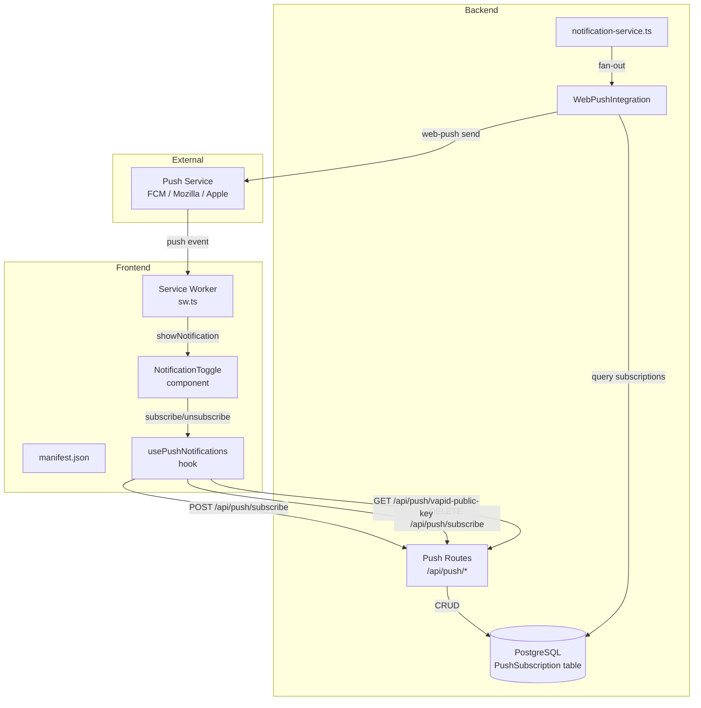
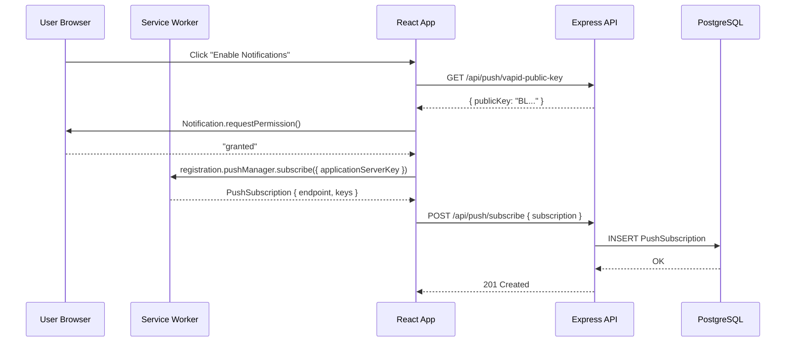
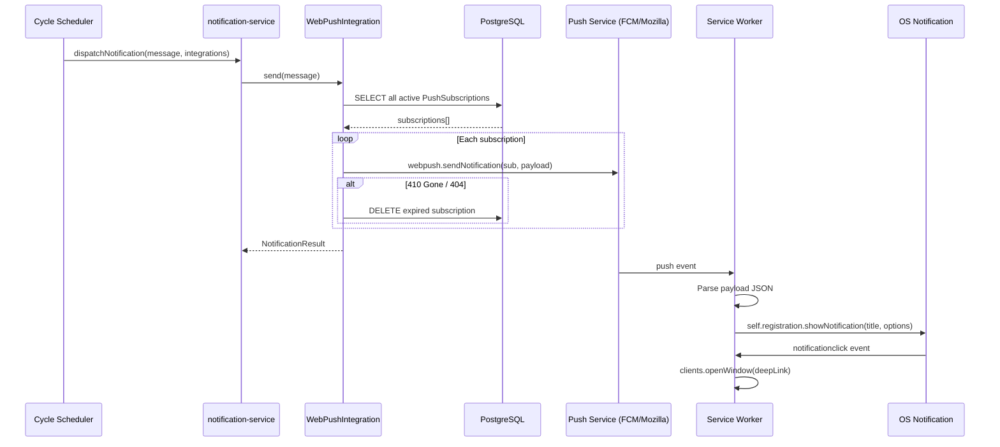
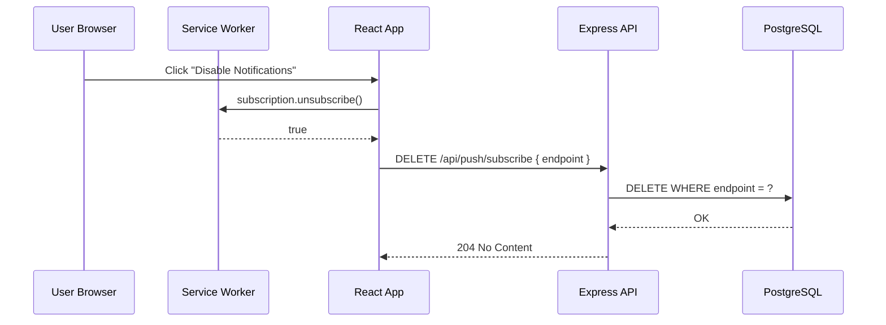

# Design Document: Web Push Notifications

## Overview

Web Push Notifications adds a browser-native push channel to Armoured Souls so players receive timely alerts (league results, tournament updates, settlements, KotH outcomes) even when they have no browser tab open. The feature plugs into the existing `Integration` interface alongside `DiscordIntegration`, stores per-user VAPID subscriptions in PostgreSQL, and delivers push messages through the Web Push protocol (RFC 8030 + VAPID RFC 8292).

A frontend service worker handles incoming push events, displays OS-level notifications with deep links back into the game, and manages the subscription lifecycle. A PWA manifest is added to enable "Add to Home Screen" on iOS/Android, which is required for push support on iOS Safari 16.4+.

The design intentionally keeps the scope narrow: no in-app notification center, no email, no WebSocket real-time layer. It is a fire-and-forget push channel that complements Discord for testers who don't use it.

## Architecture



## Sequence Diagrams

### Subscription Flow



### Notification Delivery Flow



### Unsubscribe Flow



## Components and Interfaces

### Component 1: WebPushIntegration (Backend)

**Purpose**: Implements the `Integration` interface to deliver push notifications to all subscribed browsers via the Web Push protocol.

**Interface**:
```typescript
import { Integration, NotificationResult } from './integration';

export class WebPushIntegration implements Integration {
  readonly name = 'web-push';

  async send(message: string): Promise<NotificationResult>;
}
```

**Responsibilities**:
- Query all active `PushSubscription` rows from the database
- Build a JSON payload with title, body, deep link URL, and icon
- Send to each subscription endpoint via `web-push` library
- Handle 404/410 responses by deleting stale subscriptions
- Aggregate results into a single `NotificationResult`
- Never throw — always return success/failure result

### Component 2: Push API Routes (Backend)

**Purpose**: REST endpoints for subscription management and VAPID public key retrieval.

**Interface**:
```typescript
// GET  /api/push/vapid-public-key  — public, no auth required
// POST /api/push/subscribe          — authenticated
// DELETE /api/push/subscribe        — authenticated
// GET  /api/push/status             — authenticated
```

**Responsibilities**:
- Validate incoming subscription objects
- Prevent duplicate subscriptions (upsert by endpoint)
- Enforce per-user subscription limits (max 5 devices)
- Return VAPID public key for client-side subscription
- Return current subscription status for the authenticated user

### Component 3: Service Worker (Frontend)

**Purpose**: Receives push events from the browser push service and displays OS-level notifications. Handles notification click to deep-link into the game.

**Interface**:
```typescript
// Event handlers registered in sw.ts
self.addEventListener('push', (event: PushEvent) => void);
self.addEventListener('notificationclick', (event: NotificationEvent) => void);
```

**Responsibilities**:
- Parse push event payload JSON
- Display notification with title, body, icon, and badge
- On click, open or focus the game tab at the deep link URL
- Handle missing payload gracefully (show generic fallback)

### Component 4: usePushNotifications Hook (Frontend)

**Purpose**: React hook encapsulating the full push subscription lifecycle — permission state, subscribe, unsubscribe, and status checking.

**Interface**:
```typescript
interface UsePushNotificationsReturn {
  isSupported: boolean;          // browser supports push + service workers
  permission: NotificationPermission; // 'default' | 'granted' | 'denied'
  isSubscribed: boolean;
  isLoading: boolean;
  subscribe: () => Promise<void>;
  unsubscribe: () => Promise<void>;
}

function usePushNotifications(): UsePushNotificationsReturn;
```

**Responsibilities**:
- Check browser support (`'serviceWorker' in navigator && 'PushManager' in window`)
- Register the service worker on mount
- Fetch VAPID public key from backend
- Request notification permission from user
- Create/remove push subscriptions
- Sync subscription state with backend

### Component 5: NotificationToggle Component (Frontend)

**Purpose**: UI component on the Profile/Settings page allowing users to enable or disable push notifications.

**Responsibilities**:
- Render toggle switch reflecting current subscription state
- Show appropriate messaging for unsupported browsers or denied permission
- Call `usePushNotifications` hook for all logic
- Display loading state during subscribe/unsubscribe operations

## Data Models

### PushSubscription (New Prisma Model)

```typescript
// In schema.prisma
model PushSubscription {
  id        Int      @id @default(autoincrement())
  userId    Int      @map("user_id")
  endpoint  String   @unique @db.Text
  p256dh    String   @db.VarChar(255)   // Base64-encoded P-256 public key
  auth      String   @db.VarChar(255)   // Base64-encoded auth secret
  createdAt DateTime @default(now()) @map("created_at")
  updatedAt DateTime @updatedAt @map("updated_at")

  user User @relation(fields: [userId], references: [id], onDelete: Cascade)

  @@index([userId])
  @@map("push_subscriptions")
}
```

**Validation Rules**:
- `endpoint` must be a valid HTTPS URL
- `p256dh` and `auth` must be non-empty base64 strings
- A user can have at most 5 subscriptions (multi-device support)
- `endpoint` is unique across all users (a browser endpoint belongs to one user)

### Push Payload Shape

```typescript
interface PushPayload {
  title: string;       // e.g. "League Battles Complete! 🏆"
  body: string;        // e.g. "Click to see your results"
  url: string;         // Deep link, e.g. "/battle-history"
  icon: string;        // "/favicon.svg"
  badge: string;       // "/images/badge-72.png"
  tag: string;         // Dedup tag, e.g. "league-2024-01-15"
  timestamp: number;   // Unix ms for notification ordering
}
```

### Environment Variables (New)

```typescript
// Added to EnvConfig
interface PushEnvConfig {
  vapidPublicKey: string;    // VAPID_PUBLIC_KEY
  vapidPrivateKey: string;   // VAPID_PRIVATE_KEY
  vapidSubject: string;      // VAPID_SUBJECT (mailto: or https:)
}
```

## Algorithmic Pseudocode

### WebPushIntegration.send()

```typescript
async send(message: string): Promise<NotificationResult> {
  // PRECONDITION: VAPID keys are configured in environment
  // PRECONDITION: message is a non-empty string
  // POSTCONDITION: returns NotificationResult with success=true if ≥1 delivery succeeded
  // POSTCONDITION: stale subscriptions (410/404) are deleted from DB

  const subscriptions = await prisma.pushSubscription.findMany();

  if (subscriptions.length === 0) {
    return { success: true, integrationName: 'web-push' };
  }

  const payload: PushPayload = {
    title: 'Armoured Souls',
    body: message,
    url: APP_BASE_URL,
    icon: '/favicon.svg',
    badge: '/images/badge-72.png',
    tag: `as-${Date.now()}`,
    timestamp: Date.now(),
  };

  let successCount = 0;
  let failCount = 0;
  const staleIds: number[] = [];

  // LOOP INVARIANT: successCount + failCount + remaining = subscriptions.length
  for (const sub of subscriptions) {
    try {
      await webpush.sendNotification(
        { endpoint: sub.endpoint, keys: { p256dh: sub.p256dh, auth: sub.auth } },
        JSON.stringify(payload)
      );
      successCount++;
    } catch (error) {
      if (error.statusCode === 410 || error.statusCode === 404) {
        staleIds.push(sub.id);
      }
      failCount++;
    }
  }

  // Batch-delete stale subscriptions
  if (staleIds.length > 0) {
    await prisma.pushSubscription.deleteMany({
      where: { id: { in: staleIds } },
    });
    logger.info(`Cleaned up ${staleIds.length} stale push subscriptions`);
  }

  // POSTCONDITION: success if at least one delivery worked, or no subscriptions existed
  return {
    success: successCount > 0 || subscriptions.length === 0,
    integrationName: 'web-push',
    error: failCount > 0 ? `${failCount}/${subscriptions.length} deliveries failed` : undefined,
  };
}
```

### Subscribe Endpoint

```typescript
// POST /api/push/subscribe
async function handleSubscribe(req: AuthRequest, res: Response): Promise<void> {
  // PRECONDITION: req.user is authenticated (JWT middleware)
  // PRECONDITION: req.body contains { endpoint, keys: { p256dh, auth } }
  // POSTCONDITION: subscription is stored in DB, response is 201
  // POSTCONDITION: if endpoint already exists, it is updated (upsert)

  const { endpoint, keys } = req.body;
  const userId = req.user!.userId;

  // Validate endpoint is HTTPS URL
  if (!endpoint || !endpoint.startsWith('https://')) {
    throw new AppError('PUSH_INVALID_ENDPOINT', 'Endpoint must be a valid HTTPS URL', 400);
  }

  // Validate keys
  if (!keys?.p256dh || !keys?.auth) {
    throw new AppError('PUSH_INVALID_KEYS', 'Missing p256dh or auth keys', 400);
  }

  // Enforce per-user subscription limit
  const existingCount = await prisma.pushSubscription.count({
    where: { userId, NOT: { endpoint } },
  });

  if (existingCount >= 5) {
    throw new AppError('PUSH_LIMIT_EXCEEDED', 'Maximum 5 push subscriptions per user', 400);
  }

  // Upsert by endpoint (handles re-subscription and device transfer)
  await prisma.pushSubscription.upsert({
    where: { endpoint },
    update: { userId, p256dh: keys.p256dh, auth: keys.auth },
    create: { userId, endpoint, p256dh: keys.p256dh, auth: keys.auth },
  });

  res.status(201).json({ message: 'Subscription saved' });
}
```

### Service Worker Push Handler

```typescript
// sw.ts — runs in ServiceWorkerGlobalScope
self.addEventListener('push', (event: PushEvent) => {
  // PRECONDITION: event is a PushEvent from the browser push service
  // POSTCONDITION: an OS notification is displayed

  let payload: PushPayload;

  try {
    payload = event.data?.json();
  } catch {
    payload = {
      title: 'Armoured Souls',
      body: 'Something happened in the arena!',
      url: '/',
      icon: '/favicon.svg',
      badge: '/images/badge-72.png',
      tag: 'as-fallback',
      timestamp: Date.now(),
    };
  }

  const options: NotificationOptions = {
    body: payload.body,
    icon: payload.icon,
    badge: payload.badge,
    tag: payload.tag,
    timestamp: payload.timestamp,
    data: { url: payload.url },
    requireInteraction: false,
  };

  event.waitUntil(
    self.registration.showNotification(payload.title, options)
  );
});

self.addEventListener('notificationclick', (event: NotificationEvent) => {
  // PRECONDITION: user clicked an OS notification
  // POSTCONDITION: game tab is focused or opened at the deep link URL

  event.notification.close();

  const targetUrl = event.notification.data?.url || '/';

  event.waitUntil(
    clients.matchAll({ type: 'window', includeUncontrolled: true }).then((windowClients) => {
      // Focus existing tab if found
      for (const client of windowClients) {
        if (new URL(client.url).pathname === targetUrl && 'focus' in client) {
          return client.focus();
        }
      }
      // Otherwise open new tab
      return clients.openWindow(targetUrl);
    })
  );
});
```

## Key Functions with Formal Specifications

### Function 1: WebPushIntegration.send()

```typescript
async send(message: string): Promise<NotificationResult>
```

**Preconditions:**
- `message` is a non-empty string
- VAPID environment variables (`VAPID_PUBLIC_KEY`, `VAPID_PRIVATE_KEY`, `VAPID_SUBJECT`) are set
- `webpush.setVapidDetails()` has been called during initialization

**Postconditions:**
- Returns `NotificationResult` with `integrationName === 'web-push'`
- `success === true` if at least one subscription received the message, or if no subscriptions exist
- All subscriptions returning 410 Gone or 404 Not Found are deleted from the database
- Never throws — all errors are caught and returned in the result

**Loop Invariants:**
- `successCount + failCount === number of subscriptions processed so far`
- `staleIds` contains only IDs of subscriptions that returned 410 or 404

### Function 2: handleSubscribe()

```typescript
async function handleSubscribe(req: AuthRequest, res: Response): Promise<void>
```

**Preconditions:**
- `req.user` is set by JWT auth middleware (userId is a valid integer)
- `req.body.endpoint` is a string
- `req.body.keys.p256dh` and `req.body.keys.auth` are strings

**Postconditions:**
- If valid: subscription is upserted in DB, response is 201
- If endpoint is not HTTPS: throws `AppError` with code `PUSH_INVALID_ENDPOINT` (400)
- If keys missing: throws `AppError` with code `PUSH_INVALID_KEYS` (400)
- If user already has 5 other subscriptions: throws `AppError` with code `PUSH_LIMIT_EXCEEDED` (400)
- Endpoint uniqueness is enforced at DB level — re-subscribing updates the existing row

**Loop Invariants:** N/A

### Function 3: handleUnsubscribe()

```typescript
async function handleUnsubscribe(req: AuthRequest, res: Response): Promise<void>
```

**Preconditions:**
- `req.user` is set by JWT auth middleware
- `req.body.endpoint` is a non-empty string

**Postconditions:**
- Subscription matching `endpoint` AND `userId` is deleted from DB
- If no matching subscription found: still returns 204 (idempotent)
- Response is always 204 No Content

**Loop Invariants:** N/A

### Function 4: usePushNotifications()

```typescript
function usePushNotifications(): UsePushNotificationsReturn
```

**Preconditions:**
- Called within a React component tree wrapped by `AuthProvider`
- Component is mounted in a browser environment

**Postconditions:**
- `isSupported` is `true` iff `'serviceWorker' in navigator && 'PushManager' in window`
- `permission` reflects `Notification.permission` at time of last render
- `isSubscribed` is `true` iff the service worker has an active push subscription AND the backend confirms it
- `subscribe()` requests permission, creates push subscription, and POSTs to backend
- `unsubscribe()` removes push subscription from browser and DELETEs from backend
- All async operations set `isLoading` to `true` during execution

**Loop Invariants:** N/A

## Example Usage

### Backend: Registering WebPushIntegration

```typescript
// notification-service.ts — updated getActiveIntegrations()
import { WebPushIntegration } from './web-push-integration';

export function getActiveIntegrations(): Integration[] {
  const integrations: Integration[] = [];

  const discordUrl = process.env.DISCORD_WEBHOOK_URL;
  if (discordUrl) {
    integrations.push(new DiscordIntegration(discordUrl));
  }

  const vapidPublicKey = process.env.VAPID_PUBLIC_KEY;
  const vapidPrivateKey = process.env.VAPID_PRIVATE_KEY;
  const vapidSubject = process.env.VAPID_SUBJECT;
  if (vapidPublicKey && vapidPrivateKey && vapidSubject) {
    integrations.push(new WebPushIntegration(vapidPublicKey, vapidPrivateKey, vapidSubject));
  } else {
    logger.warn('VAPID keys not set — Web Push notifications disabled');
  }

  return integrations;
}
```

### Frontend: Using the Hook in Profile Page

```typescript
// Inside ProfilePage or a NotificationSettings component
import { usePushNotifications } from '../hooks/usePushNotifications';

function NotificationSettings() {
  const { isSupported, permission, isSubscribed, isLoading, subscribe, unsubscribe } = usePushNotifications();

  if (!isSupported) {
    return <p>Push notifications are not supported in this browser.</p>;
  }

  if (permission === 'denied') {
    return <p>Notifications are blocked. Please enable them in browser settings.</p>;
  }

  return (
    <label className="flex items-center gap-3">
      <input
        type="checkbox"
        checked={isSubscribed}
        disabled={isLoading}
        onChange={() => (isSubscribed ? unsubscribe() : subscribe())}
        role="switch"
        aria-checked={isSubscribed}
        aria-label="Push notifications"
      />
      <span>Push Notifications {isLoading ? '(updating...)' : ''}</span>
    </label>
  );
}
```

### Service Worker Registration

```typescript
// main.tsx — register service worker on app boot
if ('serviceWorker' in navigator) {
  window.addEventListener('load', () => {
    navigator.serviceWorker.register('/sw.js').catch((err) => {
      console.warn('SW registration failed:', err);
    });
  });
}
```

## Correctness Properties

The following properties must hold for any valid system state:

1. **Subscription Uniqueness**: For any endpoint `e`, there exists at most one `PushSubscription` row with `endpoint = e`.
   - `∀ e ∈ Endpoints: COUNT(PushSubscription WHERE endpoint = e) ≤ 1`

2. **Per-User Limit**: No user can have more than 5 active push subscriptions.
   - `∀ u ∈ Users: COUNT(PushSubscription WHERE userId = u.id) ≤ 5`

3. **Stale Cleanup**: After `WebPushIntegration.send()` completes, no subscription that returned 410 or 404 remains in the database.
   - `∀ sub ∈ staleIds: PushSubscription WHERE id = sub.id` does not exist after send()

4. **Integration Isolation**: A failure in `WebPushIntegration.send()` never prevents `DiscordIntegration.send()` from executing (and vice versa). The `dispatchNotification` loop is independent per integration.

5. **Idempotent Unsubscribe**: Calling `DELETE /api/push/subscribe` with an endpoint that doesn't exist returns 204 (not an error).

6. **Permission Gate**: `subscribe()` in the hook only proceeds if `Notification.permission === 'granted'`. If the user denies, no subscription is created.

7. **Cascade Delete**: When a `User` is deleted, all their `PushSubscription` rows are cascade-deleted by the database foreign key constraint.

8. **HTTPS-Only Endpoints**: The subscribe endpoint rejects any `endpoint` that does not start with `https://`.

## Error Handling

### Error Scenario 1: VAPID Keys Not Configured

**Condition**: `VAPID_PUBLIC_KEY`, `VAPID_PRIVATE_KEY`, or `VAPID_SUBJECT` environment variables are missing.
**Response**: `WebPushIntegration` is not added to the active integrations list. A warning is logged.
**Recovery**: No push notifications are sent. Discord and other integrations continue normally. Admin must set env vars and restart.

### Error Scenario 2: Push Service Returns 410 Gone

**Condition**: A browser subscription has expired or been revoked by the user.
**Response**: The stale subscription is deleted from the database during the send loop.
**Recovery**: Automatic. User can re-subscribe from the UI. No manual intervention needed.

### Error Scenario 3: Push Service Temporarily Unavailable (5xx)

**Condition**: FCM, Mozilla, or Apple push service returns a 5xx error.
**Response**: The delivery is marked as failed for that subscription. The subscription is NOT deleted (it may work next time).
**Recovery**: Next cycle's notification will retry delivery to the same subscription. No retry logic within a single send — fire and forget.

### Error Scenario 4: User Denies Notification Permission

**Condition**: Browser's `Notification.requestPermission()` returns `'denied'`.
**Response**: The `usePushNotifications` hook sets `permission = 'denied'` and the UI shows a message explaining how to re-enable in browser settings.
**Recovery**: User must manually change browser notification settings. The app cannot re-prompt once denied.

### Error Scenario 5: Subscription Limit Exceeded

**Condition**: User tries to subscribe a 6th device.
**Response**: Backend returns 400 with error code `PUSH_LIMIT_EXCEEDED`.
**Recovery**: User must unsubscribe from another device first, or the frontend can show a message suggesting they manage their devices.

### Error Scenario 6: Service Worker Registration Fails

**Condition**: Browser doesn't support service workers, or HTTPS is not available.
**Response**: `usePushNotifications` returns `isSupported = false`. No subscription attempt is made.
**Recovery**: User falls back to Discord notifications. The toggle is hidden or shows an unsupported message.

## Testing Strategy

### Unit Testing Approach

- **WebPushIntegration.send()**: Mock `web-push` library and Prisma client. Test successful delivery, partial failure, stale cleanup (410/404), and empty subscription list.
- **Route handlers**: Mock Prisma, test validation (invalid endpoint, missing keys, limit exceeded), upsert behavior, and idempotent delete.
- **usePushNotifications hook**: Use `@testing-library/react` with mocked `navigator.serviceWorker`, `PushManager`, and `Notification` APIs.
- **Service worker**: Test push event parsing with valid JSON, malformed JSON, and missing data. Test notification click deep linking.

### Property-Based Testing Approach

**Property Test Library**: fast-check

- **Subscription endpoint validation**: For any arbitrary string, the subscribe handler accepts it iff it starts with `https://` and rejects otherwise.
- **Per-user limit enforcement**: For any sequence of subscribe operations for a single user, the count of subscriptions never exceeds 5.
- **Stale cleanup completeness**: For any set of subscriptions where a subset returns 410, after `send()` completes, none of the stale subscriptions remain.
- **Payload serialization roundtrip**: For any valid `PushPayload`, `JSON.parse(JSON.stringify(payload))` produces an identical object.

### Integration Testing Approach

- **Full subscription flow**: Register service worker → request permission → subscribe → verify DB row → unsubscribe → verify DB row deleted.
- **Notification delivery**: Create test subscriptions → trigger `dispatchNotification` → verify `web-push` was called with correct payloads.
- **Integration coexistence**: Verify that both Discord and Web Push integrations are called during `dispatchNotification`, and failure in one doesn't block the other.

## Performance Considerations

- **Batch sending**: The current design sends sequentially per subscription. For scale beyond ~100 subscriptions, switch to `Promise.allSettled()` with a concurrency limiter (e.g., batches of 20) to avoid overwhelming the push service.
- **Database queries**: The `findMany()` in `send()` fetches all subscriptions. At scale, this should be paginated or streamed. For the current tester audience (< 50 users), this is fine.
- **Payload size**: Web Push payloads are limited to ~4KB. The `PushPayload` structure is well under this limit.
- **Service worker caching**: The service worker should NOT cache application assets (that's a separate PWA concern). It only handles push events.

## Security Considerations

- **VAPID keys**: Private key must never be exposed to the frontend. Only the public key is served via the `/api/push/vapid-public-key` endpoint.
- **Endpoint validation**: Only HTTPS endpoints are accepted, preventing subscription to insecure push services.
- **Authentication**: All subscription management endpoints (except VAPID public key) require JWT authentication.
- **User isolation**: Unsubscribe only deletes subscriptions belonging to the authenticated user (`WHERE endpoint = ? AND userId = ?`).
- **Cascade delete**: Subscriptions are automatically cleaned up when a user account is deleted.
- **No sensitive data in payloads**: Push payloads contain only generic game event messages and deep link paths — no user-specific data, tokens, or PII.
- **Rate limiting**: Push subscription endpoints are covered by the existing general API rate limiter.

## Dependencies

### New npm Packages

| Package | Purpose | Side |
|---------|---------|------|
| `web-push` | VAPID auth + Web Push protocol sending | Backend |
| `@types/web-push` | TypeScript types for web-push | Backend (dev) |

### Existing Dependencies (No Changes)

- `express` 5 — route handling
- `prisma` 7 — database ORM
- `jsonwebtoken` — JWT auth middleware
- `winston` — logging

### Infrastructure

- VAPID key pair generated via `web-push generate-vapid-keys` CLI
- Three new environment variables: `VAPID_PUBLIC_KEY`, `VAPID_PRIVATE_KEY`, `VAPID_SUBJECT`
- PWA manifest file at `prototype/frontend/public/manifest.json`
- Service worker file compiled to `prototype/frontend/public/sw.js`

### File Changes Summary

| File | Action | Description |
|------|--------|-------------|
| `prototype/backend/prisma/schema.prisma` | Modify | Add `PushSubscription` model and relation on `User` |
| `prototype/backend/src/config/env.ts` | Modify | Add VAPID env vars to `EnvConfig` |
| `prototype/backend/src/services/notifications/web-push-integration.ts` | Create | `WebPushIntegration` class |
| `prototype/backend/src/services/notifications/notification-service.ts` | Modify | Register `WebPushIntegration` in `getActiveIntegrations()` |
| `prototype/backend/src/routes/push.ts` | Create | Push subscription REST endpoints |
| `prototype/backend/src/errors/pushErrors.ts` | Create | `PushError` class and error codes |
| `prototype/backend/src/index.ts` | Modify | Mount push routes |
| `prototype/frontend/public/manifest.json` | Create | PWA manifest |
| `prototype/frontend/public/sw.js` | Create | Service worker for push events |
| `prototype/frontend/src/hooks/usePushNotifications.ts` | Create | React hook for push lifecycle |
| `prototype/frontend/src/components/NotificationToggle.tsx` | Create | UI toggle component |
| `prototype/frontend/src/main.tsx` | Modify | Register service worker |
| `prototype/frontend/index.html` | Modify | Link to manifest |
