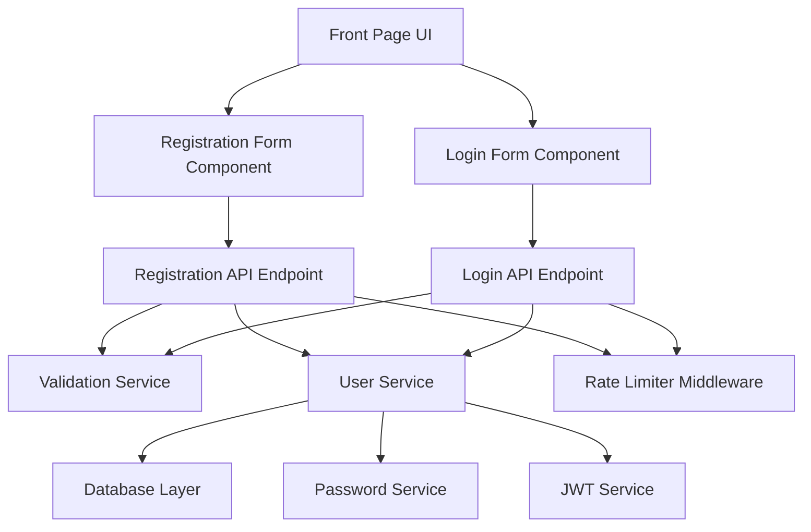

# Technical Design Document: User Registration Module

## Overview

The user registration module extends the existing authentication system to support new user account creation. This design integrates seamlessly with the current login infrastructure while adding registration capabilities, dual login support (username or email), and a unified front page for authentication flows.

The system follows a layered architecture with clear separation between validation, business logic, data persistence, and presentation layers. The design prioritizes security through bcrypt password hashing, rate limiting, and proper error handling while maintaining consistency with existing authentication patterns.

Key design goals:
- Reuse existing authentication infrastructure (JWT tokens, AuthContext, rate limiting)
- Maintain security best practices for credential handling
- Provide clear, actionable validation feedback to users
- Ensure seamless integration with the current login flow
- Support flexible login with either username or email

## Architecture

### System Components



### Component Responsibilities

**Frontend Layer:**
- **Front Page Component**: Manages navigation between registration and login views
- **Registration Form Component**: Handles user input, client-side validation, and registration submission
- **Login Form Component**: Enhanced to accept username or email as login identifier
- **AuthContext**: Manages authentication state across the application

**Backend Layer:**
- **Registration API Endpoint** (`POST /api/auth/register`): Processes registration requests
- **Login API Endpoint** (`POST /api/auth/login`): Enhanced to support username or email login
- **Validation Service**: Validates username, email, and password inputs
- **User Service**: Handles user account creation and retrieval
- **Password Service**: Manages bcrypt password hashing and verification
- **JWT Service**: Generates and validates JWT tokens
- **Rate Limiter Middleware**: Protects endpoints from abuse

**Data Layer:**
- **User Model**: Extended to include email field
- **Database**: Stores user accounts with unique constraints on username and email

### Data Flow

**Registration Flow:**
1. User submits registration form with username, email, and password
2. Frontend validates password confirmation match
3. Request sent to `/api/auth/register` endpoint
4. Rate limiter middleware checks request frequency
5. Validation service validates all input fields
6. User service checks for duplicate username/email
7. Password service hashes password with bcrypt
8. User account created in database with default values
9. JWT service generates authentication token
10. Response returns token and user profile
11. Frontend stores token and updates AuthContext
12. User redirected to dashboard

**Login Flow (Enhanced):**
1. User submits login form with identifier (username or email) and password
2. Request sent to `/api/auth/login` endpoint
3. Rate limiter middleware checks request frequency
4. User service attempts to find user by username
5. If not found, attempts to find user by email
6. Password service verifies password against stored hash
7. JWT service generates authentication token
8. Response returns token and user profile
9. Frontend stores token and updates AuthContext
10. User redirected to dashboard

## Components and Interfaces

### Backend API Endpoints

#### POST /api/auth/register

**Request Body:**
```typescript
{
  username: string;    // 3-20 chars, alphanumeric + underscore + hyphen
  email: string;       // 3-50 chars, alphanumeric + underscore + hyphen
  password: string;    // 8-128 chars
}
```

**Success Response (201 Created):**
```typescript
{
  token: string;       // JWT token
  user: {
    id: string;
    username: string;
    email: string;
    currency: number;
    prestige: number;
    role: string;
  }
}
```

**Error Responses:**
- `400 Bad Request`: Validation errors (duplicate username/email, invalid format, missing fields)
- `429 Too Many Requests`: Rate limit exceeded
- `500 Internal Server Error`: Database or unexpected errors

#### POST /api/auth/login (Enhanced)

**Request Body:**
```typescript
{
  identifier: string;  // Username or email
  password: string;
}
```

**Success Response (200 OK):**
```typescript
{
  token: string;       // JWT token
  user: {
    id: string;
    username: string;
    email: string;
    currency: number;
    prestige: number;
    role: string;
  }
}
```

**Error Responses:**
- `401 Unauthorized`: Invalid credentials
- `429 Too Many Requests`: Rate limit exceeded
- `500 Internal Server Error`: Database or unexpected errors

### Validation Service Interface

```typescript
interface ValidationService {
  validateUsername(username: string): ValidationResult;
  validateEmail(email: string): ValidationResult;
  validatePassword(password: string): ValidationResult;
  validateRegistrationRequest(request: RegistrationRequest): ValidationResult;
}

interface ValidationResult {
  isValid: boolean;
  errors: string[];
}

interface RegistrationRequest {
  username: string;
  email: string;
  password: string;
}
```

**Validation Rules:**

Username:
- Length: 3-20 characters
- Allowed characters: alphanumeric, underscore, hyphen
- Must be unique in database

Email:
- Length: 3-50 characters
- Allowed characters: alphanumeric, underscore, hyphen
- Must be unique in database
- Note: This is a simplified email format for the game system, not standard RFC 5322

Password:
- Length: 8-128 characters
- No character restrictions (allows special characters)

### User Service Interface

```typescript
interface UserService {
  createUser(userData: CreateUserData): Promise<User>;
  findUserByUsername(username: string): Promise<User | null>;
  findUserByEmail(email: string): Promise<User | null>;
  findUserByIdentifier(identifier: string): Promise<User | null>;
  verifyPassword(user: User, password: string): Promise<boolean>;
}

interface CreateUserData {
  username: string;
  email: string;
  passwordHash: string;
}

interface User {
  id: string;
  username: string;
  email: string;
  passwordHash: string;
  currency: number;
  prestige: number;
  role: string;
  createdAt: Date;
  updatedAt: Date;
}
```

### Password Service Interface

```typescript
interface PasswordService {
  hashPassword(password: string): Promise<string>;
  verifyPassword(password: string, hash: string): Promise<boolean>;
}
```

Implementation uses bcrypt with appropriate salt rounds (recommended: 10-12).

### JWT Service Interface

```typescript
interface JWTService {
  generateToken(user: User): string;
  verifyToken(token: string): TokenPayload | null;
}

interface TokenPayload {
  userId: string;
  username: string;
  role: string;
  iat: number;
  exp: number;
}
```

### Frontend Components

#### FrontPage Component

```typescript
interface FrontPageProps {
  // No props needed - manages its own state
}

interface FrontPageState {
  view: 'register' | 'login';
}
```

Responsibilities:
- Display navigation between registration and login
- Render appropriate form based on selected view
- Maintain consistent branding and styling

#### RegistrationForm Component

```typescript
interface RegistrationFormProps {
  onSuccess: (token: string, user: UserProfile) => void;
}

interface RegistrationFormState {
  username: string;
  email: string;
  password: string;
  passwordConfirmation: string;
  isSubmitting: boolean;
  errors: string[];
}
```

Responsibilities:
- Collect username, email, password, and password confirmation
- Validate password confirmation matches password
- Submit registration request to API
- Display loading state during submission
- Display error messages from API
- Call onSuccess callback with token and user data

#### LoginForm Component (Enhanced)

```typescript
interface LoginFormProps {
  onSuccess: (token: string, user: UserProfile) => void;
}

interface LoginFormState {
  identifier: string;  // Changed from 'username' to support email
  password: string;
  isSubmitting: boolean;
  errors: string[];
}
```

Responsibilities:
- Collect identifier (username or email) and password
- Submit login request to API
- Display loading state during submission
- Display error messages from API
- Call onSuccess callback with token and user data

## Data Models

### User Model (Enhanced)

```typescript
// Database schema
{
  id: UUID (primary key),
  username: VARCHAR(20) (unique, not null),
  email: VARCHAR(50) (unique, not null),  // NEW FIELD
  passwordHash: VARCHAR(255) (not null),
  currency: INTEGER (default: 1000),      // Default starting currency
  prestige: INTEGER (default: 0),
  role: VARCHAR(50) (default: 'player'),
  createdAt: TIMESTAMP (default: now()),
  updatedAt: TIMESTAMP (default: now())
}

// Indexes
- PRIMARY KEY on id
- UNIQUE INDEX on username
- UNIQUE INDEX on email  // NEW INDEX
```

### Migration Strategy

Since the system already has users without email addresses, a database migration is required:

1. Add `email` column as nullable initially
2. Populate existing users with placeholder emails (e.g., `{username}@legacy.local`)
3. Add unique constraint on email column
4. Update application code to require email for new registrations

## Correctness Properties


*A property is a characteristic or behavior that should hold true across all valid executions of a system—essentially, a formal statement about what the system should do. Properties serve as the bridge between human-readable specifications and machine-verifiable correctness guarantees.*

### Property Reflection

After analyzing all acceptance criteria, I identified several areas where properties can be consolidated:

- Properties 1.3 and 1.4 both verify JWT token generation and response format - these can be combined into a single comprehensive property about registration response format
- Properties 1.6, 1.7, and 1.8 all verify default values for new accounts - these can be combined into a single property about default account initialization
- Properties 2.5 and 2.6 are inverses (invalid vs valid username characters) - we'll keep the valid character property as it's more comprehensive
- Properties 2.9 and 2.10 are inverses (invalid vs valid email characters) - we'll keep the valid character property as it's more comprehensive
- Properties 6.3 and 6.4 both verify login response - these can be combined into a single property about login response format
- Properties 9.1, 9.2, and 9.3 all deal with error message handling - these can be consolidated into properties about error message types

### Property 1: Valid Registration Creates Account

*For any* valid username, email, and password (meeting all validation rules), submitting a registration request should result in a new user account being created in the database with the provided username and email.

**Validates: Requirements 1.1, 1.5**

### Property 2: Password Hashing

*For any* registration request, the password stored in the database should be a valid bcrypt hash and should not match the plaintext password provided.

**Validates: Requirements 1.2**

### Property 3: Registration Response Format

*For any* successful registration, the response should contain both a valid JWT token and a user profile object with id, username, email, currency, prestige, and role fields.

**Validates: Requirements 1.3, 1.4**

### Property 4: Default Account Values

*For any* newly created user account, the initial values should be: currency set to the default amount (1000), prestige set to zero, and role set to 'player'.

**Validates: Requirements 1.6, 1.7, 1.8**

### Property 5: Duplicate Username Rejection

*For any* username that already exists in the database, attempting to register with that username should be rejected with a descriptive error message.

**Validates: Requirements 2.1**

### Property 6: Duplicate Email Rejection

*For any* email address that already exists in the database, attempting to register with that email should be rejected with a descriptive error message.

**Validates: Requirements 2.2**

### Property 7: Valid Username Characters

*For any* string containing only alphanumeric characters, underscores, and hyphens, and with length between 3-20 characters, the validation service should accept it as a valid username format (subject to uniqueness check).

**Validates: Requirements 2.5, 2.6**

### Property 8: Valid Email Characters

*For any* string containing only alphanumeric characters, underscores, and hyphens, and with length between 3-50 characters, the validation service should accept it as a valid email format (subject to uniqueness check).

**Validates: Requirements 2.9, 2.10**

### Property 9: Missing Required Fields Rejection

*For any* registration request missing one or more of the required fields (username, email, password), the validation service should reject the request with a descriptive error message.

**Validates: Requirements 3.3**

### Property 10: Password Confirmation Mismatch

*For any* registration form submission where the password and password confirmation fields contain different values, the form should display an error message and prevent submission.

**Validates: Requirements 4.3**

### Property 11: Error Message Display

*For any* failed registration attempt, the error message returned by the backend should be displayed in the frontend UI.

**Validates: Requirements 4.4, 9.4**

### Property 12: Loading State During Submission

*For any* registration request in progress, the submit button should be disabled and a loading indicator should be visible until the request completes.

**Validates: Requirements 4.5**

### Property 13: Successful Registration Flow

*For any* successful registration, the JWT token should be stored in local storage, the AuthContext should be updated with the user data and token, and the user should be navigated to the dashboard.

**Validates: Requirements 4.6, 8.2**

### Property 14: View Switching State Preservation

*For any* front page state, switching from registration view to login view and back to registration view should preserve the registration form state (or vice versa for login).

**Validates: Requirements 5.4**

### Property 15: Login Response Format

*For any* valid login identifier (username or email) and password combination, the response should contain both a valid JWT token and a user profile object with id, username, email, currency, prestige, and role fields.

**Validates: Requirements 6.3, 6.4**

### Property 16: Invalid Login Credentials

*For any* invalid login identifier or password combination, the system should return a generic authentication error message without revealing whether the identifier or password was incorrect.

**Validates: Requirements 6.5**

### Property 17: Dual Login Support

*For any* registered user, logging in with their username and password should succeed, and logging in with their email and password should also succeed, producing equivalent authentication states.

**Validates: Requirements 6.6**

### Property 18: Rate Limiting Application

*For any* sequence of registration requests exceeding the rate limit threshold, subsequent requests should be rejected with a rate limit error response.

**Validates: Requirements 7.1, 7.2**

### Property 19: Response Format Consistency

*For any* user account, the user data returned by the registration endpoint should have the same structure and field names as the user data returned by the login endpoint.

**Validates: Requirements 8.3**

### Property 20: Authentication Equivalence (Round-Trip Property)

*For any* valid registration data, registering a new user and then immediately logging in with those credentials should produce equivalent authentication states (same user data, valid tokens, same permissions).

**Validates: Requirements 8.4, 11.13**

### Property 21: Database Error Handling

*For any* database error occurring during registration (e.g., connection failure, constraint violation), the system should return a generic error message to the user without exposing internal database details.

**Validates: Requirements 9.1**

### Property 22: Validation Error Specificity

*For any* validation error (invalid format, length violation, missing field), the system should return a specific error message describing which validation rule was violated.

**Validates: Requirements 9.2**

### Property 23: Unexpected Error Handling

*For any* unexpected error during registration (not validation or database errors), the system should return a generic error message to the user while logging the detailed error information server-side.

**Validates: Requirements 9.3**

## Error Handling

### Error Categories

**Validation Errors (400 Bad Request):**
- Username too short (< 3 chars): "Username must be at least 3 characters long"
- Username too long (> 20 chars): "Username must not exceed 20 characters"
- Username invalid characters: "Username can only contain letters, numbers, underscores, and hyphens"
- Username already exists: "Username is already taken"
- Email too short (< 3 chars): "Email must be at least 3 characters long"
- Email too long (> 50 chars): "Email must not exceed 50 characters"
- Email invalid characters: "Email can only contain letters, numbers, underscores, and hyphens"
- Email already exists: "Email is already registered"
- Password too short (< 8 chars): "Password must be at least 8 characters long"
- Password too long (> 128 chars): "Password must not exceed 128 characters"
- Missing required fields: "Username, email, and password are required"
- Password confirmation mismatch: "Passwords do not match"

**Authentication Errors (401 Unauthorized):**
- Invalid credentials: "Invalid username or password" (generic message for security)

**Rate Limiting Errors (429 Too Many Requests):**
- Rate limit exceeded: "Too many requests. Please try again later."

**Server Errors (500 Internal Server Error):**
- Database errors: "An error occurred during registration. Please try again."
- Unexpected errors: "An unexpected error occurred. Please try again."

### Error Handling Strategy

**Backend:**
1. Validation errors are caught early and return specific 400 responses
2. Database errors are caught and logged with full details server-side
3. Generic error messages are returned to clients for security
4. All errors include appropriate HTTP status codes
5. Error responses follow consistent JSON format:
```typescript
{
  error: string;        // Error message
  code?: string;        // Optional error code for client handling
}
```

**Frontend:**
1. Display error messages in a consistent error component
2. Clear errors when user modifies form fields
3. Maintain accessibility with ARIA labels for error messages
4. Match error display styling from existing login page
5. Handle network errors gracefully with user-friendly messages

### Logging Strategy

**Server-Side Logging:**
- Log all registration attempts (success and failure) with timestamp and IP
- Log validation failures with specific validation rule violated
- Log database errors with full stack trace and context
- Log unexpected errors with full stack trace and request details
- Do NOT log passwords or password hashes in plain text
- Use structured logging format for easy parsing and analysis

**Client-Side Logging:**
- Log registration attempts to browser console in development mode
- Do NOT log sensitive data (passwords, tokens) to console
- Track registration success/failure for analytics (anonymized)

## Testing Strategy

### Dual Testing Approach

The user registration module requires both unit tests and property-based tests for comprehensive coverage:

**Unit Tests** focus on:
- Specific examples demonstrating correct behavior
- Edge cases (boundary values for length validation)
- Integration points between components
- Error conditions and error message content
- UI component rendering and interaction

**Property-Based Tests** focus on:
- Universal properties that hold for all inputs
- Comprehensive input coverage through randomization
- Validation rules across the input space
- Round-trip properties (register then login)
- Invariants that must hold regardless of input

### Property-Based Testing Configuration

**Framework Selection:**
- Backend (Node.js/TypeScript): Use `fast-check` library
- Frontend (React): Use `fast-check` with React Testing Library

**Test Configuration:**
- Minimum 100 iterations per property test
- Each property test must reference its design document property
- Tag format: `// Feature: user-registration-module, Property {number}: {property_text}`

**Example Property Test Structure:**
```typescript
// Feature: user-registration-module, Property 1: Valid Registration Creates Account
test('valid registration creates account', async () => {
  await fc.assert(
    fc.asyncProperty(
      validUsernameArbitrary(),
      validEmailArbitrary(),
      validPasswordArbitrary(),
      async (username, email, password) => {
        const response = await registerUser({ username, email, password });
        expect(response.status).toBe(201);
        
        const user = await findUserByUsername(username);
        expect(user).toBeDefined();
        expect(user.username).toBe(username);
        expect(user.email).toBe(email);
      }
    ),
    { numRuns: 100 }
  );
});
```

### Test Coverage Requirements

**Backend Unit Tests:**
- Password hashing with bcrypt (verify hash format, verify not plaintext)
- All validation rules (username, email, password format and length)
- JWT token generation and format
- Duplicate username/email detection
- Rate limiting behavior
- Error message content and format

**Backend Integration Tests:**
- Complete registration flow (request to database to response)
- Complete login flow with username
- Complete login flow with email
- Duplicate registration attempts
- Invalid input handling
- Database error handling

**Backend Property Tests:**
- Property 1: Valid registration creates account
- Property 2: Password hashing
- Property 3: Registration response format
- Property 4: Default account values
- Property 5: Duplicate username rejection
- Property 6: Duplicate email rejection
- Property 7: Valid username characters
- Property 8: Valid email characters
- Property 9: Missing required fields rejection
- Property 15: Login response format
- Property 16: Invalid login credentials
- Property 17: Dual login support
- Property 18: Rate limiting application
- Property 19: Response format consistency
- Property 20: Authentication equivalence (round-trip)
- Property 21: Database error handling
- Property 22: Validation error specificity
- Property 23: Unexpected error handling

**Frontend Component Tests:**
- Registration form rendering with all required fields
- Password confirmation field rendering
- Password confirmation mismatch validation
- Form submission with valid data
- Error message display
- Loading state during submission
- Navigation between registration and login views
- View switching state preservation
- Token storage in local storage
- AuthContext update after registration

**Frontend Property Tests:**
- Property 10: Password confirmation mismatch
- Property 11: Error message display
- Property 12: Loading state during submission
- Property 13: Successful registration flow
- Property 14: View switching state preservation

### Test Data Generators (Arbitraries)

For property-based testing, we need generators for valid and invalid inputs:

```typescript
// Valid data generators
const validUsernameArbitrary = () => 
  fc.stringOf(
    fc.constantFrom(...'abcdefghijklmnopqrstuvwxyzABCDEFGHIJKLMNOPQRSTUVWXYZ0123456789_-'),
    { minLength: 3, maxLength: 20 }
  );

const validEmailArbitrary = () => 
  fc.stringOf(
    fc.constantFrom(...'abcdefghijklmnopqrstuvwxyzABCDEFGHIJKLMNOPQRSTUVWXYZ0123456789_-'),
    { minLength: 3, maxLength: 50 }
  );

const validPasswordArbitrary = () => 
  fc.string({ minLength: 8, maxLength: 128 });

// Invalid data generators
const tooShortUsernameArbitrary = () => 
  fc.string({ maxLength: 2 });

const tooLongUsernameArbitrary = () => 
  fc.string({ minLength: 21, maxLength: 50 });

const invalidCharUsernameArbitrary = () => 
  fc.string().filter(s => /[^a-zA-Z0-9_-]/.test(s));
```

### Integration with Existing Tests

The registration module tests should:
- Follow the same testing patterns as existing authentication tests
- Use the same test database setup and teardown
- Reuse existing test utilities for JWT verification
- Integrate with existing CI/CD pipeline
- Maintain or improve overall code coverage metrics

## Documentation Requirements

### API Documentation

Create comprehensive API documentation including:

**Endpoint Documentation:**
- HTTP method, path, and description
- Request body schema with field descriptions and constraints
- Response body schema for success cases
- Error response schemas with status codes
- Example requests and responses
- Authentication requirements

**Format:** OpenAPI 3.0 specification (Swagger)

**Location:** `/docs/api/authentication.yaml`

### Code Documentation

**Backend Code:**
- JSDoc comments for all public functions and classes
- Parameter descriptions with types and constraints
- Return value descriptions
- Throws/error documentation
- Usage examples for complex functions

**Frontend Code:**
- JSDoc comments for all exported components and functions
- Props documentation with types and descriptions
- State management documentation
- Event handler documentation
- Usage examples for reusable components

### Developer Guide

Create a developer guide covering:

**Setup Instructions:**
- Environment variables required
- Database migration steps
- Development server setup
- Test execution commands

**Architecture Overview:**
- Component interaction diagram
- Data flow diagrams
- Authentication flow sequence diagrams

**Integration Guide:**
- How to call registration API from client applications
- How to integrate with existing authentication system
- How to extend validation rules
- How to customize default user values

**Error Reference:**
- Complete list of error codes
- Error message text
- Recommended client handling for each error type
- Troubleshooting common issues

**Format:** Markdown documentation

**Location:** `/docs/features/user-registration.md`

### Inline Comments

Add inline comments for:
- Complex validation logic
- Security-sensitive code (password hashing, token generation)
- Non-obvious business rules
- Performance optimizations
- Workarounds for known issues

## Security Considerations

### Password Security

- Use bcrypt with salt rounds of 10-12 (configurable via environment variable)
- Never log passwords or password hashes
- Enforce minimum password length of 8 characters
- No maximum practical limit (128 chars allows for passphrases)
- Do not enforce password complexity rules (length is more important)

### Token Security

- JWT tokens should include user ID, username, and role
- Tokens should have reasonable expiration time (e.g., 24 hours)
- Use strong secret key for JWT signing (minimum 256 bits)
- Store secret key in environment variable, never in code
- Tokens stored in localStorage (acceptable for this use case)

### Input Validation

- Validate all inputs on both client and server side
- Client-side validation for UX, server-side validation for security
- Sanitize inputs to prevent injection attacks
- Use parameterized queries for database operations
- Validate data types and formats strictly

### Rate Limiting

- Apply rate limiting to prevent brute force attacks
- Use existing rate limiter middleware for consistency
- Recommended limits: 5 registration attempts per IP per hour
- Return 429 status code when limit exceeded
- Consider implementing CAPTCHA for repeated failures

### Error Messages

- Use generic error messages for authentication failures
- Don't reveal whether username or email exists
- Don't reveal whether username or password was incorrect
- Log detailed errors server-side for debugging
- Never expose stack traces or internal errors to clients

### Database Security

- Use unique constraints on username and email columns
- Use parameterized queries to prevent SQL injection
- Implement proper database connection pooling
- Use least-privilege database user for application
- Encrypt sensitive data at rest (if required by compliance)

## Performance Considerations

### Database Optimization

- Index username and email columns for fast lookups
- Use database connection pooling
- Consider caching for frequently accessed user data
- Monitor query performance and optimize slow queries

### Password Hashing

- Bcrypt is intentionally slow (security feature)
- Hash operations are CPU-intensive
- Consider using worker threads for hashing in high-load scenarios
- Monitor server CPU usage during registration spikes

### Frontend Performance

- Implement debouncing for real-time validation
- Lazy load registration form if not immediately visible
- Minimize bundle size by code splitting
- Use React.memo for components that don't need frequent re-renders

### Scalability

- Rate limiting helps prevent resource exhaustion
- Consider horizontal scaling for high registration volumes
- Monitor registration endpoint latency and error rates
- Implement health checks for registration service

## Deployment Considerations

### Database Migration

Before deploying the registration feature:

1. Run migration to add email column to users table
2. Populate existing users with placeholder emails
3. Add unique constraint on email column
4. Verify migration in staging environment
5. Plan rollback strategy if migration fails

### Environment Variables

Required environment variables:

```bash
# JWT Configuration
JWT_SECRET=<strong-secret-key-min-256-bits>
JWT_EXPIRATION=24h

# Bcrypt Configuration
BCRYPT_SALT_ROUNDS=10

# Rate Limiting
RATE_LIMIT_WINDOW_MS=3600000  # 1 hour
RATE_LIMIT_MAX_REQUESTS=5

# Default User Values
DEFAULT_CURRENCY=1000
DEFAULT_ROLE=player

# Database Configuration
DATABASE_URL=<connection-string>
```

### Feature Flags

Consider using feature flags for gradual rollout:

- `ENABLE_REGISTRATION`: Toggle registration endpoint
- `ENABLE_EMAIL_LOGIN`: Toggle email-based login
- `ENABLE_FRONT_PAGE`: Toggle new front page UI

### Monitoring

Implement monitoring for:

- Registration success/failure rates
- Registration endpoint latency
- Rate limiting trigger frequency
- Validation error distribution
- Database error frequency
- JWT token generation failures

### Rollback Plan

If issues arise after deployment:

1. Disable registration via feature flag
2. Revert to previous front page (login only)
3. Keep email column in database (no data loss)
4. Investigate and fix issues
5. Re-enable registration after verification

## Future Enhancements

Potential future improvements to consider:

### Email Verification

- Send verification email after registration
- Require email verification before full account access
- Implement email verification token system
- Add resend verification email functionality

### Password Reset

- Implement forgot password flow
- Send password reset email with secure token
- Allow users to reset password via email link
- Expire reset tokens after reasonable time period

### Social Authentication

- Add OAuth integration (Google, GitHub, etc.)
- Link social accounts to existing user accounts
- Support multiple authentication methods per user

### Enhanced Validation

- Implement proper RFC 5322 email validation
- Add username profanity filter
- Check for common weak passwords
- Implement password strength meter in UI

### Account Management

- Allow users to change username (if not used elsewhere)
- Allow users to change email with verification
- Allow users to change password
- Implement account deletion functionality

### Security Enhancements

- Implement two-factor authentication (2FA)
- Add CAPTCHA for registration form
- Implement account lockout after failed attempts
- Add security audit logging

### User Experience

- Add "remember me" functionality
- Implement session management
- Add profile picture upload during registration
- Provide registration progress indicator for multi-step forms
