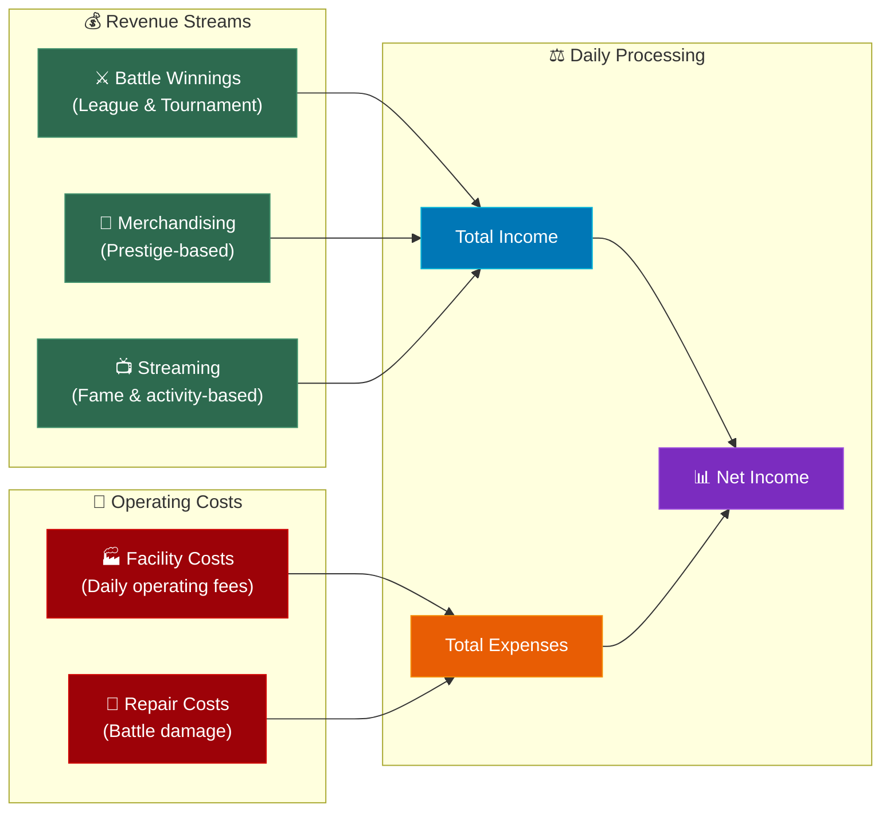

## Overview

Every cycle, your stable's finances are processed automatically. Income flows in from multiple sources, expenses are deducted, and the difference — your **net income** — is added to (or subtracted from) your balance. Understanding this cycle is essential for keeping your stable financially healthy.


## The Daily Financial Flow



## Revenue Streams

Three income sources feed into your total revenue each cycle:

### Battle Winnings

Your primary income. Earned from league battles and tournament matches. League battle rewards depend on your robots' [league tier](/guide/economy/battle-rewards) and your stable's [Prestige](/guide/prestige-fame/prestige-ranks) bonus multiplier. Tournament rewards scale with tournament size and round progression instead. Winning pays more than losing, but every battle generates some income.

### Merchandising Income

Passive income driven by your stable's Prestige rank. Higher Prestige means more fans and more merchandise sales. The [Merchandising Hub](/guide/economy/merchandising) facility amplifies this revenue. Consistent every cycle regardless of battle outcomes.

### Streaming Revenue

Per-robot income based on each robot's [Fame](/guide/economy/streaming-revenue), battle activity, and your Streaming Studio facility level. More battles and higher Fame mean more viewers and more revenue.

## Operating Costs

Two expense categories are deducted from your revenue:

### Facility Costs

Every facility charges a fixed daily operating fee. This is predictable and doesn't change based on battle outcomes. The total depends on how many facilities you own and their levels. See [Operating Costs & Repairs](/guide/economy/repair-costs) for the full breakdown.

### Repair Costs

Variable expenses based on how much damage your robots took in battle. Influenced by damage taken, robot attribute totals (higher attributes = higher base repair cost), and your [Repair Bay](/guide/facilities/repair-bay) facility level. Your [yield threshold](/guide/combat/yielding-and-repair-costs) setting also affects this — robots that surrender earlier take less damage and cost less to repair.

## Net Income

Your net income for the cycle is simply:

```
Net Income = Total Revenue − Total Expenses
```

- **Positive net income** — Your balance grows. You're earning more than you spend.
- **Zero net income** — You're breaking even. Sustainable but leaves no room for investment.
- **Negative net income** — Your balance shrinks. If this continues, you'll eventually go bankrupt.

```callout-warning
Bankruptcy occurs when your balance drops to zero or below after daily costs are deducted. Always maintain a reserve of several cycles' worth of expenses to weather bad stretches.
```

## Processing Order

The daily cycle processes finances through independent scheduled jobs:

1. **League battles resolve** — Robots fight their matched opponents
2. **Tournament matches resolve** — If a tournament round is active
3. **Battle winnings credited** — Income from all battles added to balance
4. **Merchandising income credited** — Prestige-based passive income added
5. **Streaming revenue credited** — Fame and activity-based income added
6. **Facility operating costs deducted** — Fixed daily fees for all facilities
7. **Repair costs deducted** — Variable costs based on battle damage

After processing completes, your updated balance is reflected in your stable's Financial Report.

```callout-tip
Check your Financial Report after each cycle. It breaks down every income source and expense, making it easy to spot problems — like a facility that costs more than it generates, or repair costs that are eating into your profits.
```

## Healthy Financial Ratios

As a general guideline:

| Ratio | Status | Action |
|-------|--------|--------|
| Expenses < 50% of income | Healthy | Room to invest in upgrades and new facilities |
| Expenses 50–70% of income | Stable | Sustainable, but watch for cost creep |
| Expenses 70–90% of income | Tight | Consider cutting costs or boosting income |
| Expenses > 90% of income | Danger | One bad cycle could push you into the red |

```callout-info
Early game stables often run at tight margins — that's normal. As your robots promote to higher tiers and your Prestige grows, income scales faster than expenses, and your margins improve naturally.
```

## What's Next?

- [Credits & Income Sources](/guide/economy/credits-and-income) — Deep dive into all three revenue streams
- [Battle Rewards](/guide/economy/battle-rewards) — Tier-by-tier reward scaling
- [Operating Costs & Repairs](/guide/economy/repair-costs) — Understanding all expense categories
- [Merchandising](/guide/economy/merchandising) — How Prestige drives passive income
- [Streaming Revenue](/guide/economy/streaming-revenue) — How Fame and battles generate streaming income
