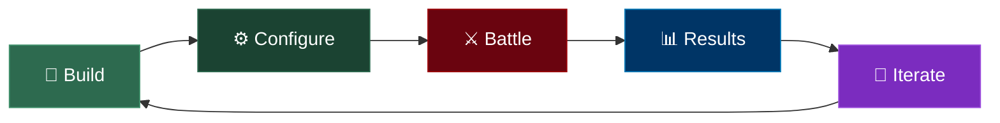

## Overview

Armoured Souls is a strategy simulation game where you manage a stable of combat robots. You don't control your robots directly in battle — instead, you make all the strategic decisions beforehand, then watch the results play out. Think of it like being a team manager rather than a player on the field.

The entire game revolves around a five-step loop that repeats every cycle.



## Step 1: Build Your Robots

Everything starts with your robots. You purchase robot frames and invest in their 23 attributes across five categories:

- **Combat Systems** — Firepower, targeting, critical hit potential
- **Defensive Systems** — Armor, shields, hull integrity
- **Chassis & Mobility** — Speed, evasion, initiative
- **AI Processing** — Decision-making, adaptability
- **Team Coordination** — Teamwork bonuses for future team modes

Each attribute can be upgraded from level 1 to level 50, though higher levels require Training Academies to unlock the caps. Your starting budget of ₡3,000,000 gives you enough to get one or more robots off the ground — see the [Starting Budget Guide](/guide/getting-started/starting-budget) for how to spend it wisely.

## Step 2: Configure Your Battle Strategy

Once your robots are built, you set their battle configuration:

- **Weapons & Loadout** — Choose from 20 weapons and 3 shields (23 total across Energy, Ballistic, Melee, and Shield categories), arranged in one of four loadout configurations (Single, Weapon+Shield, Two-Handed, or Dual-Wield). Each loadout has distinct bonuses and trade-offs. Learn more in the [Weapons & Loadouts](/guide/weapons/loadout-types) section.

- **Battle Stance** — Pick Offensive (more damage, less defense), Defensive (more defense, less damage), or Balanced (neutral). See the [Stances Guide](/guide/combat/stances) for details.

- **Yield Threshold** — Set the HP percentage (0–50%) at which your robot surrenders. Lower thresholds mean your robot fights longer but takes more damage (and higher repair bills). Higher thresholds save on repairs but may cost you wins. The [Yield Threshold Guide](/guide/combat/yielding-and-repair-costs) covers this in depth.

```callout-tip
Your configuration choices are where the real strategy lives. Two identical robots with different stances, weapons, and yield thresholds can perform very differently in battle.
```

## Step 3: Enlist in Battles

With your robots configured, enlist them in the league system. Robots are placed into one of six competitive tiers — Bronze through Champion — and matched primarily by League Points (LP), with ELO rating used as a secondary quality check to prevent extreme mismatches. The system tries to pair robots within ±10 LP (ideal) or ±20 LP (fallback), then checks that the ELO gap isn't too large. See the [Matchmaking Guide](/guide/leagues/matchmaking) for the full details.

Battles are processed automatically during the daily cycle. You don't need to be online when they happen. Just make sure your robots are enlisted and configured before the cycle runs.

See the [Daily Cycle Guide](/guide/getting-started/daily-cycle) for details on when battles are processed.

## Step 4: View Results

After the cycle completes, log in to review what happened:

- **[Battle Logs](/guide/combat/battle-flow)** — Detailed play-by-play of every attack, showing damage dealt, critical hits, shield absorption, and more
- **[Financial Summary](/guide/economy/credits-and-income)** — Credits earned from victories, streaming revenue, merchandising income, minus repair costs and operating expenses
- **[League Standings](/guide/leagues/league-tiers)** — Your robots' updated LP, ELO rating, and position within their league instance
- **[Reputation Changes](/guide/prestige-fame/prestige-system)** — Prestige earned for your stable and Fame earned by individual robots

```callout-info
Battle logs are comprehensive — you can see exactly why your robot won or lost, which helps you make better decisions in the next cycle.
```

## Step 5: Iterate and Improve

This is where the strategy deepens. Based on your results, you decide what to change:

- **Upgrade attributes** that underperformed (maybe your robot kept missing — invest in Targeting)
- **Swap weapons** or change your loadout type to counter what you're facing
- **Adjust your stance** if you're taking too much damage or not dealing enough
- **Tweak your yield threshold** to balance repair costs against win rate
- **Invest in facilities** that boost your income or reduce your costs
- **Buy new robots** to diversify your roster and compete in more battles

Then the loop starts again. Each cycle is an opportunity to refine your approach and climb the ranks.

## The Big Picture

The beauty of Armoured Souls is that there's no single "correct" strategy. Some players focus on one elite robot, others spread across three. Some go all-in on offense, others play the long economic game with high yield thresholds and facility investments.

Every decision feeds back into the loop. Better robots earn more credits. More credits fund better upgrades. Better upgrades lead to more wins. More wins earn prestige and fame, which unlock new facilities and boost your income further.

```callout-tip
Armoured Souls is designed for casual play — 15 to 30 minutes per day is all you need. Log in, review results, make adjustments, and you're set for the next cycle.
```

## What's Next?

- [Daily Cycle](/guide/getting-started/daily-cycle) — Learn when battles happen and what gets processed each cycle
- [Starting Budget](/guide/getting-started/starting-budget) — How to spend your initial ₡3,000,000
- [Roster Strategy](/guide/getting-started/roster-strategy) — Should you run 1, 2, or 3 robots?
